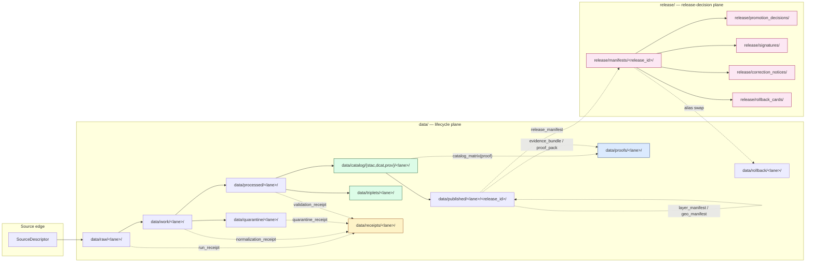

<!-- [KFM_META_BLOCK_V2]
doc_id: kfm://doc/adr-0011-receipts-proofs-manifests-catalog-separation
title: ADR-0011 — Receipts vs Proofs vs Manifests vs Catalog Separation
type: adr
version: v1
status: draft
owners: [TBD-architecture-steward, TBD-data-steward, TBD-release-steward]
created: 2026-05-09
updated: 2026-05-09
policy_label: public
related:
  - docs/doctrine/directory-rules.md
  - docs/adr/ADR-0001-schema-home.md
  - docs/adr/ADR-0003-evidencebundle-contract.md
  - docs/adr/ADR-0004-promotion-gate.md
  - docs/adr/ADR-0005-maplibre-layer-manifest.md
  - docs/adr/ADR-0010-catalog-proof-release-separation.md
tags: [kfm, adr, governance, lifecycle, receipts, proofs, manifests, catalog, release]
notes:
  - "Refines ADR-0010 by resolving the data/manifests vs release/manifests open question."
  - "All cited paths are PROPOSED until repo evidence in this session confirms them."
[/KFM_META_BLOCK_V2] -->

# ADR-0011 — Receipts vs Proofs vs Manifests vs Catalog Separation

> **Decision summary.** The four object families — **receipts**, **proofs**, **manifests**, **catalog records** — have non-overlapping responsibilities and **non-overlapping homes**. Manifests split by purpose: **release-decision manifests** are owned by `release/manifests/`; **asset-level integrity manifests** travel with their artifact under `data/published/<lane>/<release_id>/`. There is **no parallel `data/manifests/` authority root.**

| | |
|---|---|
| **ADR ID** | ADR-0011 |
| **Status** | `proposed` |
| **Date** | 2026-05-09 |
| **Supersedes** | — |
| **Superseded by** | — |
| **Refines** | ADR-0010 (catalog/proof/release separation) |
| **Depends on** | ADR-0001 (schema home), ADR-0003 (EvidenceBundle contract), ADR-0004 (promotion gate) |
| **Repo evidence basis** | UNMOUNTED — paths are PROPOSED per `docs/doctrine/directory-rules.md`; verification required before merge. |

[Context](#1-context-and-forces) ·
[Decision](#2-decision) ·
[Diagram](#3-diagram-where-each-family-lives) ·
[Path Homes](#4-path-homes-canonical-assignments) ·
[Resolving Manifests](#5-the-manifests-question-resolved) ·
[Consequences](#6-consequences) ·
[Alternatives](#7-alternatives-considered) ·
[Validation](#8-validation-and-tests) ·
[Rollback](#9-rollback-and-supersession) ·
[Affected files](#10-affected-files-schemas-and-registers) ·
[Open questions](#11-open-questions) ·
[References](#12-references)

---

## 1. Context and Forces

KFM's lifecycle invariant is well established in doctrine:

> **`RAW → WORK / QUARANTINE → PROCESSED → CATALOG / TRIPLET → PUBLISHED`**
> Promotion is a **governed state transition**, not a file move.

Across the corpus, four object families repeatedly appear at this transition surface, each with a distinct job. They are routinely listed side-by-side, and one doctrinal slogan recurs verbatim:

> **Receipt ≠ proof ≠ catalog ≠ publication.**
> *— `kfm_soil_architecture` §16; reaffirmed in `KFM_Geology` §17 and `KFM_People_DNA_Land` §14.*

ADR-0010 (proposed, per the ADR index in `Kansas_Frontier_Matrix_Pipeline_Living_Implementation_Manual_v0.3` §28) already separates **catalogs**, **proofs**, **releases**, and **corrections**. What ADR-0010 leaves unresolved is the **manifests** dimension: *where do release manifests, layer manifests, geo-asset manifests, and story manifests actually live, and is `data/manifests/` an authority root in its own right?*

The directory-rules document records this as an explicit open question:

> **OPEN:** Whether `data/manifests/` is a real sibling of `data/proofs/` and `data/receipts/`, or whether all manifests live under `release/manifests/`. This document treats `release/manifests/` as canonical for release manifests; lane-internal manifests (e.g., layer manifests) MAY live within `data/published/` per layer.
> *— `docs/doctrine/directory-rules.md` §18, **OPEN questions**.*

The same conflict surfaces in the Whole-UI expansion report:

> *"`data/manifests` vs `release/manifests` — `UNKNOWN`. Preserve separation of receipts/proofs/manifests/catalog; actual home must match repo convention."*
> *— `KFM_Whole_UI_Governed_AI_Expansion_Report.pdf` p.8.*

This ADR resolves that question.

### 1.1 Forces in tension

| Force | Why it matters |
|---|---|
| **Trust-membrane integrity** | Catalog presence must not imply truth; proof must not be confused with process memory; release decisions must not float without an artifact home. Conflating any two creates silent drift. |
| **Lifecycle invariant** | A path-level move that bypasses validators, evidence-bundle creation, catalog closure, or release-decision recording violates the invariant *regardless of where the bytes land.* (`directory-rules.md` §9.1) |
| **Audit walkability** | Receipts compose along `decision_id`; auditors must be able to walk *release manifest → gate decisions → AI runs → watcher runs → source heads* without ambiguous file homes. (`KFM_Pass_12_Part_2` §6.5) |
| **Watcher-as-non-publisher** | Watchers may emit `RunReceipt` and candidate `DecisionEnvelope` only; they may not emit `ReleaseManifest`. A wrong manifest home invites watcher-publishes drift. (`KFM_Pass_12_Part_2` §5.A.3) |
| **Carrier vs truth** | Generated layers (PMTiles, COGs, vector indices) are **carriers**, not canonical truth. Their integrity manifests sit beside the carrier; their *release decision* sits in the release plane. |
| **Reversibility** | The four families have different retention and supersession rules. Receipts append; proofs are immutable per release; catalogs replace by alias swap; release manifests are immutable per `release_id`. Mixing them collapses these rules. |

---

## 2. Decision

**Adopt the four-family separation as a hard architectural rule with non-overlapping homes.** Each family has exactly one canonical authority root. `data/manifests/` is **not** introduced as a fifth sibling. Manifests split internally by purpose — release-decision vs asset-integrity — and each half goes to a home that already exists in the lifecycle.

### 2.1 The four object families

| Family | Definition | Examples | Identity & retention |
|---|---|---|---|
| **Receipts** | Process memory: what happened during a run, transform, ingest, AI call, validation, revocation. | `RunReceipt`, `IngestReceipt`, `NormalizationReceipt`, `ValidationReceipt`, `AIReceipt`, `RedactionReceipt`, `QuarantineReceipt`, `PromotionReceipt`, `VerifyReceipt`, `ConsentReceipt`, `RollbackReceipt` | Append-only, content-addressed, joined to `decision_id` and `run_id`. **Cannot serve as proof on its own.** |
| **Proofs** | Release-significant trust evidence that supports a public claim. | `EvidenceBundle`, `ProofPack`, `CatalogMatrix` (closure object), validation reports, citation validation reports, integrity bundles, signature/attestation bundles | Immutable per `release_id`/`spec_hash`; supersession appended, never overwritten. **Cannot be generated by AI alone or replaced by a receipt.** |
| **Catalog records** | Interoperable discoverability and provenance routing. | STAC `Item`/`Collection`, DCAT `Dataset`/`Distribution`, PROV-O `Entity`/`Activity`/`Agent` records, relation edges | Replaced by alias swap on release; identity = `spec_hash` of the linked artifact. **Cannot establish semantic truth on its own** — consumers must dereference to `EvidenceBundle`. |
| **Manifests** | Binding declarations of *what* is in a release or *what* an asset asserts about itself. Split into two sub-families (§5). | **Release-decision:** `ReleaseManifest`, `PromotionDecision`, `MerkleManifest`, `RollbackCard`, `CorrectionNotice` · **Asset-integrity:** `LayerManifest`, `KFMGeoManifest`, `StoryManifest`, `TripletManifest` | Immutable per `release_id`. Asset-integrity manifests reference release-decision manifests via `release_ref`/`spec_hash`. |

> [!IMPORTANT]
> **No object instance belongs to more than one family.** A `CatalogMatrix` is a *proof* (closure object) even though it carries catalog references — its release-blocking role is what determines its home. A `RollbackReceipt` records a *transition* and lives in receipts, while the `RollbackCard` it implements is a *release decision*.

### 2.2 The five rules that follow

1. **Family ↔ home is one-to-one.** A given object kind has exactly one canonical home. Mirroring/duplicating is an anti-pattern (§13.2 of `directory-rules.md`).
2. **Receipts never act as proof.** A receipt may *reference* a proof (`proof_refs`) but cannot replace it.
3. **Catalogs never act as truth.** Public clients dereference `EvidenceRef` → `EvidenceBundle`; they do not trust catalog presence.
4. **Manifests split by purpose.** Release-decision manifests live in `release/`; asset-integrity manifests live alongside their artifact in `data/published/`. (§5)
5. **`data/manifests/` is not introduced.** Any object that wants to live there belongs in one of the homes above. Existing prior-art mentions of `data/manifests/<lane>/` in domain blueprints are PROPOSED only and supersede to the rule in this ADR.

---

## 3. Diagram — where each family lives



> [!NOTE]
> Diagram reflects doctrinal flow per `directory-rules.md` §9 and `kfm_soil_architecture` §16. Lane-level paths are PROPOSED until verified against current repo evidence.

---

## 4. Path Homes — canonical assignments

### 4.1 Data plane (`data/`)

| Object | Path | Authority |
|---|---|---|
| `RunReceipt`, `IngestReceipt`, `NormalizationReceipt`, `ValidationReceipt`, `AIReceipt`, `RedactionReceipt`, `QuarantineReceipt`, `PromotionReceipt`, `VerifyReceipt`, `ConsentReceipt`, `RollbackReceipt` | `data/receipts/<lane>/<run_id>/...` | **Canonical** — process memory only. |
| `EvidenceBundle`, `ProofPack`, `CatalogMatrix`, validation reports, citation validation reports, integrity bundles, signature bundles | `data/proofs/<lane>/<release_id>/...` | **Canonical** — release-grade evidence. |
| STAC `Item`/`Collection`, DCAT records, PROV-O graphs, domain catalog records | `data/catalog/{stac,dcat,prov}/<lane>/...` | **Canonical** — discovery only. |
| Triplet/graph projections, graph deltas | `data/triplets/<lane>/...` | **Canonical** — derivative. |
| Released public-safe artifacts (PMTiles, COGs, GeoParquet, public GeoJSON, API payloads) | `data/published/<lane>/<release_id>/...` | **Canonical** — public-safe artifacts only. |
| **Asset-integrity manifests** (`LayerManifest`, `KFMGeoManifest`, `StoryManifest`, `TripletManifest`) | `data/published/<lane>/<release_id>/manifests/<asset>.manifest.json` | **Canonical** — colocated with the artifact they describe. |
| Alias-revert receipts (data-plane half of rollback) | `data/rollback/<lane>/<release_id>/...` | **Canonical** — receipts only; the *decision* lives in `release/rollback_cards/`. |

### 4.2 Release plane (`release/`)

| Object | Path | Authority |
|---|---|---|
| `ReleaseManifest` (the binding decision artifact) | `release/manifests/<release_id>/release_manifest.json` | **Canonical** — release-decision manifest. |
| `PromotionDecision` | `release/promotion_decisions/<release_id>/...` | **Canonical** — gate-chain decision record. |
| Signatures and DSSE/Sigstore artifacts | `release/signatures/<release_id>/...` | **Canonical**. |
| `CorrectionNotice` | `release/correction_notices/<release_id>/...` | **Canonical** — public correction record. |
| `RollbackCard` | `release/rollback_cards/<release_id>/...` | **Canonical** — rollback decision (paired with a `data/rollback/` receipt). |
| `WithdrawalNotice` | `release/withdrawal_notices/<release_id>/...` | **Canonical**. |
| Release-level changelog | `release/changelog/...` | **Canonical**. |

### 4.3 What does **not** become an authority root

| Path | Status | Rationale |
|---|---|---|
| `data/manifests/` | **Not adopted as a sibling of `data/proofs/`/`data/receipts/`.** | Manifests' purpose splits cleanly between *decision* (`release/manifests/`) and *asset integrity* (`data/published/<lane>/<release_id>/manifests/`). A third home would create parallel authority. |
| `artifacts/` (for trust content) | **Compatibility root only**, never trust-bearing. | Per `directory-rules.md` §13.2, build/docs/qa/temporary use only. Receipts, proofs, manifests, releases never live here. |
| Domain root folders (`hydrology/`, `flora/`, etc. at repo root) | **Anti-pattern**, per `directory-rules.md` §13.4. | Domain content lives inside responsibility roots as lanes. |

> [!CAUTION]
> Several prior PDF-only domain blueprints (e.g., `kfm_habitat_architecture_pdf_only_blueprint`, `kfm_soil_architecture_extended_pro`) propose `data/manifests/<lane>/` as a sibling. Those references **predate this ADR** and are superseded the moment ADR-0011 is accepted. New domain dossiers MUST use the homes above; existing PROPOSED dossiers may be amended by addendum without a new ADR per dossier.

---

## 5. The manifests question, resolved

### 5.1 Why manifests need a finer split

A "manifest" in KFM is not one thing. The corpus uses the word for at least four distinct artifacts whose lifecycle, audience, and retention differ:

| Manifest kind | Job | Lifecycle plane | Audience |
|---|---|---|---|
| `ReleaseManifest` | Bind released artifacts to validation, policy, review, checksums, rollback target. | **Release plane** | Promotion gate, auditors, rollback drills. |
| `PromotionDecision` / `MerkleManifest` | Record the gate-chain decision and the cryptographic root for the release set. | **Release plane** | Auditors, signers, verifiers. |
| `LayerManifest` | Versioned layer payload with valid time, freshness, provenance, release state, integrity references. | **Data plane (published artifact)** | MapLibre adapter, governed API, UI trust badges. |
| `KFMGeoManifest` | Per-asset PMTiles/COG/GeoParquet digest and signature manifest. | **Data plane (published artifact)** | Renderer, integrity validator, CDN. |
| `StoryManifest` | Story sequence, scope, required layers, time windows, drawer refs. | **Data plane (published artifact)** | StoryNode player, UI. |
| `TripletManifest` | Graph projection version and provenance. | **Data plane (derivative)** | Graph queries, search. |

The first two are *release decisions*. The last four are *asset declarations* — they describe an artifact that already lives on disk and travel with it.

### 5.2 The decision

> **Release-decision manifests live in `release/manifests/<release_id>/`.**
> **Asset-integrity manifests live in `data/published/<lane>/<release_id>/manifests/<asset>.manifest.json`.**
> **`data/manifests/` is not adopted as an authority root.**

This preserves the §9.2 distinction in `directory-rules.md`:

> *"`data/published/` owns released **artifacts** — public-safe outputs consumers read.*
> *`release/` owns release **decisions** — the manifest, proof closure, rollback/correction path, signatures."*

### 5.3 Cross-references between the two halves

The two halves bind to each other through stable references — they never mirror each other's content:

```text
release/manifests/<release_id>/release_manifest.json
    ├── release_id          # primary key
    ├── spec_hash            # canonical hash of the binding decision
    ├── artifacts[]          # → data/published/<lane>/<release_id>/...
    │     └── integrity_manifest_ref  # → asset-integrity manifest path/hash
    ├── proof_refs[]         # → data/proofs/<lane>/<release_id>/...
    ├── catalog_refs[]       # → data/catalog/{stac,dcat,prov}/<lane>/...
    ├── receipt_refs[]       # → data/receipts/<lane>/<run_id>/...
    ├── policy_decision_ref  # → release/promotion_decisions/...
    ├── signature_refs[]     # → release/signatures/...
    └── rollback_target      # → release/rollback_cards/<previous_release_id>/...

data/published/<lane>/<release_id>/manifests/<asset>.manifest.json
    ├── asset_id
    ├── spec_hash
    ├── release_ref          # → release/manifests/<release_id>/release_manifest.json
    ├── integrity{ algo, digest, size, signature_ref? }
    ├── valid_time, observed_time, ingested_time, published_time
    ├── source_role, source_descriptor_ref
    ├── policy_labels, sensitivity_class
    └── evidence_lookup_ref  # → data/proofs/<lane>/<release_id>/evidence_bundle.json
```

> [!IMPORTANT]
> An asset-integrity manifest **must** carry `release_ref`. Without it, the asset is unrenderable under the trust-membrane rule (`directory-rules.md` §7.1) — there is no way to prove which release decision admitted it.

### 5.4 What this rules out

- **Renderers reading `data/processed/`** — a `LayerManifest` references the *published* artifact, never the canonical store. (Trust-membrane invariant.)
- **`ReleaseManifest` being authored by a watcher or pipeline worker** — they emit `RunReceipt` and candidate `DecisionEnvelope`; promotion is a separate governed transition. (Watcher-as-non-publisher invariant; `KFM_Pass_12_Part_2` §5.A.3.)
- **Authoring an asset manifest without a corresponding `ReleaseManifest`** — the integrity manifest is a *child* of the release decision, not its replacement.
- **Treating `data/manifests/<lane>/` as a valid emission path** in pipelines, validators, or CI workflows. Outputs go to one of the homes in §4.

---

## 6. Consequences

### 6.1 Positive

- **Audit walkability.** From any released claim, an auditor walks *evidence drawer → release manifest → proof refs (`EvidenceBundle`, `CatalogMatrix`) → receipts (run, AI, validation) → source heads.* The graph is single-rooted at `release/manifests/<release_id>/`.
- **Catalog-as-truth drift is prevented.** Catalog records can never become release proof simply by sitting in a directory next to one.
- **Retention rules are honored by location.** Receipts append; proofs are immutable per release; catalogs swap by alias; release manifests are immutable per `release_id`. Mixing homes is what breaks each retention rule.
- **The trust membrane has one entry point.** Public routes consume `data/published/...` and dereference into `data/proofs/...` via the governed API; they never read receipts or release-plane decisions directly.
- **Watcher invariant is enforced by path.** Pipelines that emit to `release/` are flagged at lint/CI time; watchers that try to do so cannot.

### 6.2 Negative / costs

- **A path migration is required** for any prior-art domain plan that emits to `data/manifests/<lane>/`. (See §9 for the migration path.)
- **Two manifest homes increase the conceptual surface.** Builders must learn the *decision-vs-asset* split. Mitigated by:
  (i) §5.3 cross-reference convention,
  (ii) a CI check for orphaned asset manifests (no `release_ref`), and
  (iii) the validator listed in §8.
- **Schema directory pressure.** Several manifest schemas land under `schemas/contracts/v1/release/` and `schemas/contracts/v1/layers/` — their exact home is gated by **ADR-0001** (schema home), not this ADR.

### 6.3 Neutral

- The split does **not** change the §9 lifecycle phases. It clarifies *which artifact each phase emits and where the artifact rests.*
- The split is **compatible with the existing `release/` skeleton** in `directory-rules.md` §9.2 and the existing `data/` skeleton in §9.1.

---

## 7. Alternatives Considered

### 7.1 Single root for all manifests (`data/manifests/<lane>/`)

**Rejected.**

- Conflates *release decisions* (which belong on the release plane) with *asset declarations* (which belong with the artifact).
- Recreates the §13.2 anti-pattern from `directory-rules.md`: "`artifacts/`, `data/proofs/`, `data/receipts/`, and `release/` mixing proof, process memory, build output, and release decisions."
- Encourages watchers and pipeline workers to write into a manifest directory, drifting toward a watcher-publishes failure mode.

### 7.2 Single root for all manifests (`release/manifests/`) including asset manifests

**Rejected.**

- Asset-integrity manifests describe a specific PMTiles/COG/GeoParquet file. Separating them from their artifact creates lookup overhead and a join-by-convention that is brittle when artifacts move (e.g., to a CDN).
- Asset manifests are read by the renderer at request time; release manifests are read by auditors and verifiers. Different access patterns argue for different homes.

### 7.3 Co-locate everything under each `data/published/<lane>/<release_id>/`

**Rejected.**

- Loses the release-plane vs data-plane distinction that `directory-rules.md` §9.2 makes explicit. Auditors lose the single-rooted release index.
- Makes corrections, withdrawals, and rollback cards visually conflate with the artifacts they govern.
- A signed `ReleaseManifest` referencing artifacts is the cleanest separation between **decision** and **bytes**.

### 7.4 Defer the question to repo evidence

**Partially adopted.**

- Repo evidence is not mounted in this session, so all paths in this ADR are PROPOSED.
- Deferring the *decision* itself would leave the directory-rules open question unresolved and continue to invite drift in domain blueprints. The decision is recorded; the *enforcement* depends on repo verification (§9, §11).

---

## 8. Validation and Tests

> [!NOTE]
> All validators below are PROPOSED. Their existence in the repo is **NEEDS VERIFICATION** until inspected.

| Validator | Purpose | Suggested location |
|---|---|---|
| `lifecycle_layout_validator` | Enforces that emitted artifacts land in their canonical home (§4) and that no path matches `data/manifests/...`. | `tools/validators/lifecycle_layout/` |
| `release_manifest_validator` | `release_id`, `spec_hash`, all required `*_refs` present and resolvable. | `tools/validators/release/release_manifest.py` |
| `asset_manifest_validator` | Each asset-integrity manifest carries a non-null `release_ref` whose target exists. | `tools/validators/release/asset_manifest.py` |
| `family_disjointness_validator` | A given `*_id` does not appear under more than one family root. | `tools/validators/lifecycle_layout/family_disjointness.py` |
| `catalog_matrix_validator` | `CatalogMatrix` (proof-family) closes over STAC/DCAT/PROV/`ReleaseManifest` digests. | `tools/validators/proof/catalog_matrix.py` |
| `no_public_raw_route_test` | UI/governed-API integration test confirming public routes never read receipts or release-plane content directly. | `tests/contracts/no_public_raw_route_test.*` |

### 8.1 Fixture pack (negative tests)

The fixture pack must include:

- A `ReleaseManifest` placed in `data/manifests/...` → **MUST FAIL** layout validator.
- An asset manifest with `release_ref: null` → **MUST FAIL** asset manifest validator.
- A receipt placed in `data/proofs/...` → **MUST FAIL** family disjointness.
- A catalog record claiming truth without a resolving `EvidenceBundle` → **MUST FAIL** catalog closure.
- A pipeline output emitting to `release/manifests/` from a non-promotion code path → **MUST FAIL** watcher-non-publisher invariant.

### 8.2 Definition of done

- [ ] Layout validator wired into CI for the `data/`, `release/`, and `docs/` trees.
- [ ] All five negative fixtures present and failing as designed.
- [ ] At least one positive end-to-end fixture demonstrating: receipt → proof → catalog → release manifest → asset manifest → governed API surface.
- [ ] `directory-rules.md` §18 OPEN bullet on `data/manifests/` is closed by reference to this ADR.
- [ ] Domain blueprints that reference `data/manifests/<lane>/` are addended to point to the homes in §4.

---

## 9. Rollback and Supersession

| Risk | Preventive control | Rollback / response |
|---|---|---|
| ADR is accepted but a domain emits to `data/manifests/...` anyway. | Layout validator + CI gate. | Quarantine the run, file a correction notice, fix emitter, replay. |
| Repo evidence (once mounted) shows `data/manifests/` already exists with content. | Pre-merge inspection in §11. | Migrate content per family: release manifests → `release/manifests/`; asset manifests → `data/published/<lane>/<release_id>/manifests/`. Preserve receipts; emit a migration record under `release/changelog/`. |
| A new manifest kind appears that doesn't fit the decision/asset split. | Add to §5.1 by addendum, classify it, then assign a home. | If non-trivial, supersede this ADR rather than amending it silently. |
| Schema home (ADR-0001) lands differently than assumed. | Schemas in this ADR are listed by *name and purpose*, not pinned path. | Update schema paths in §10; this ADR does not need supersession unless the *family/home rule* changes. |

**Supersession discipline.** This ADR is superseded by name (e.g., `ADR-00NN-...`) and that ADR adds a `Superseded by` row in §1's status table here. The original is retained per ADR doctrine ("ADRs are versioned and never deleted"; `KFM_Components_Pass_11_Part_2` §J.4.1).

---

## 10. Affected Files, Schemas, and Registers

> [!NOTE]
> Every path below is **PROPOSED** until confirmed against current repo evidence. Schema-home assignment is gated by ADR-0001.

### 10.1 Documentation

| Path | Action | Purpose |
|---|---|---|
| `docs/adr/ADR-0011-receipts-vs-proofs-vs-manifests-vs-catalog-separation.md` | **CREATE** (this file) | Decision record. |
| `docs/doctrine/directory-rules.md` | **AMEND** §18 | Replace the `data/manifests/` OPEN bullet with a reference to ADR-0011. |
| `docs/adr/README.md` | **AMEND** (ADR index) | Add ADR-0011 with status `proposed`. |
| `data/receipts/README.md` | **CREATE / AMEND** | Define receipts as process memory, not proof. |
| `data/proofs/README.md` | **CREATE / AMEND** | Define proofs as release-grade evidence. |
| `data/catalog/README.md` | **CREATE / AMEND** | Define discoverability surfaces and closure expectations. |
| `release/manifests/README.md` | **CREATE / AMEND** | Define release-decision manifest home and required fields. |
| `data/published/README.md` | **AMEND** | Add asset-integrity manifest convention and `release_ref` requirement. |

### 10.2 Schemas / contracts

Schema-home root is **`schemas/contracts/v1/`** by `directory-rules.md` §13.1, pending **ADR-0001**.

| Schema | Family | Suggested path |
|---|---|---|
| `RunReceipt`, `IngestReceipt`, `NormalizationReceipt`, `ValidationReceipt`, `AIReceipt`, `RedactionReceipt`, `QuarantineReceipt`, `PromotionReceipt`, `VerifyReceipt`, `ConsentReceipt`, `RollbackReceipt` | Receipt | `schemas/contracts/v1/evidence/*.schema.json` (or `schemas/contracts/v1/receipts/`) |
| `EvidenceBundle`, `ProofPack`, `CatalogMatrix`, `ValidationReport`, `CitationValidationReport` | Proof | `schemas/contracts/v1/evidence/*.schema.json` |
| `ReleaseManifest`, `PromotionDecision`, `MerkleManifest`, `RollbackCard`, `CorrectionNotice`, `WithdrawalNotice` | Release-decision manifest | `schemas/contracts/v1/release/*.schema.json` |
| `LayerManifest`, `LayerDescriptor`, `LayerCatalogItem`, `KFMGeoManifest`, `StoryManifest`, `StoryNode`, `TripletManifest` | Asset-integrity manifest | `schemas/contracts/v1/layers/`, `schemas/contracts/v1/evidence/`, `schemas/contracts/v1/story/`, `schemas/contracts/v1/triplets/` |
| STAC, DCAT, PROV profiles | Catalog | `schemas/stac/`, `schemas/contracts/v1/catalog/` |

### 10.3 Registers (`control_plane/`)

| Register | Update |
|---|---|
| `control_plane/object_family_register.yaml` | Add the four-family classification and the path map from §4. |
| `control_plane/release_state_register.yaml` | Reference `release/manifests/` as the canonical release-decision home. |
| `control_plane/contradiction_register.yaml` | Close the `data/manifests` vs `release/manifests` contradiction with a pointer to ADR-0011. |
| `control_plane/verification_backlog.yaml` | Add the inspection items in §11.2. |
| `control_plane/deprecation_register.yaml` | Mark `data/manifests/` (if discovered) as deprecated/migrate-target with a pointer to ADR-0011. |

### 10.4 Policy bundle

| Policy | Update |
|---|---|
| `policy/opa/release/kfm.release_manifest.rego` | Require `ReleaseManifest` in `release/manifests/<release_id>/`; deny otherwise. |
| `policy/opa/access/kfm.public_route.rego` | Deny public-route reads outside `data/published/...` and the governed-API surface. |
| `policy/opa/gates/kfm.layout.rego` | Encode the path-home rules in §4 as a fail-closed gate. |

### 10.5 CI

| Workflow | Action |
|---|---|
| `.github/workflows/lifecycle-layout.yml` | **CREATE** — runs `lifecycle_layout_validator` on PRs touching `data/`, `release/`, `docs/`. |
| `.github/workflows/contracts.yml` | **AMEND** — add the family disjointness check and asset-manifest `release_ref` check. |

---

## 11. Open Questions

### 11.1 Bounded by this ADR

1. **`StoryManifest` exact home.** §5.1 places it under `data/published/stories/<story_id>/manifest.json`. The Whole-UI report flagged a `data/manifests/story` proposal as `CONFLICTED`; a separate story-node-3D-boundary ADR (referenced in `KFM_Whole_UI`) may further refine. Status: **PROPOSED**, defers to story-node ADR if/when authored.
2. **`TripletManifest` home when triplets are derived nightly.** Co-located with the published projection (`data/triplets/<lane>/<release_id>/manifest.json`) is the working assumption. Confirm during graph-projection ADR.
3. **Naming of `data/published/<lane>/<release_id>/manifests/`** vs flat `data/published/<lane>/<release_id>/*.manifest.json`. Both satisfy the rule; pick one for consistency in a follow-up doc-style ADR.

### 11.2 Repository-state items requiring inspection (NEEDS VERIFICATION)

The following must be checked against **mounted repo evidence** before this ADR moves from `proposed` to `accepted`:

- [ ] Whether `data/manifests/` exists anywhere in the live repo and what it contains.
- [ ] Whether `release/` exists at all, and at what level of buildout (`manifests/`, `signatures/`, `correction_notices/`, `rollback_cards/`).
- [ ] Whether `data/proofs/` and `data/receipts/` are siblings in the live repo (per `directory-rules.md` §9.1) or whether a different convention is in use.
- [ ] Whether `schemas/contracts/v1/release/`, `schemas/contracts/v1/layers/`, and `schemas/contracts/v1/evidence/` already exist (or whether `contracts/<...>/` is in use; gated by ADR-0001).
- [ ] Whether any pipeline already writes to a `data/manifests/...` path and what migration rope is needed.
- [ ] Whether `policy/opa/release/` and `policy/opa/access/` exist and how rules are organized.
- [ ] Whether `.github/workflows/` already includes a layout/lifecycle gate.
- [ ] Whether `control_plane/object_family_register.yaml` exists and how it currently classifies these families.

> [!CAUTION]
> If repo evidence contradicts §4 path assignments, the *family/home decision* in §2 stands; only the *exact path strings* are amended. The four-family separation itself is the doctrinal core.

---

## 12. References

### 12.1 Doctrinal anchors

- `docs/doctrine/directory-rules.md` — §3 authority roots; §9.1 lifecycle invariant; §9.2 release-plane vs data-plane distinction; §13.2 mixing anti-pattern; §18 OPEN questions (the question this ADR closes).
- `kfm_soil_architecture_extended_pro_pdf_only_report.pdf` §16 — receipt vs proof vs catalog vs publication separation; required receipt fields; closure surfaces.
- `KFM_Geology_Natural_Resources_Architecture_PDF_Only_Report_20260421.pdf` §17 — family/example/closure-check table.
- `KFM_People_Genealogy_DNA_Land_Ownership_Architecture_Blueprint.pdf` §14 — lifecycle and artifact inventory by surface.
- `KFM_Whole_UI_Governed_AI_Expansion_Report.pdf` p.8 — the explicit `data/manifests` vs `release/manifests` conflict.
- `KFM_Pass_12_Part_2_Idea_Index_Category_Atlas_and_Expansion_Dossier.pdf` §6.4–6.5 — catalogs discover, bundles hold truth; receipts compose along `decision_id`.
- `KFM_Components_Pass_11_Part_2` §J.4.1 — ADR template and never-delete discipline.

### 12.2 Related ADRs

| ADR | Relation |
|---|---|
| **ADR-0001** — schema home | Determines exact paths for §10.2 schemas. This ADR depends on it; does not duplicate. |
| **ADR-0003** — EvidenceBundle contract | Defines the proof-family object referenced by every `ReleaseManifest`. |
| **ADR-0004** — promotion gate | Promotion is the act that produces a `ReleaseManifest`; this ADR says **where** the manifest lands. |
| **ADR-0005** — MapLibre layer manifest | Defines `LayerManifest` shape; this ADR says it is asset-integrity, not release-decision. |
| **ADR-0010** — catalog/proof/release separation | This ADR refines ADR-0010 by adding the manifests dimension. |

### 12.3 Schema and contract references

`ReleaseManifest`, `EvidenceBundle`, `LayerManifest`, `KFMGeoManifest`, `StoryManifest`, `CatalogMatrix`, `RunReceipt`, `AIReceipt`, `PromotionDecision`, `RollbackCard`, `CorrectionNotice` — all PROPOSED schemas in `schemas/contracts/v1/...` (subject to ADR-0001).

---

## 13. Status & Updates

| Date | Author | Change |
|---|---|---|
| 2026-05-09 | TBD-architecture-steward | Draft created. Status: `proposed`. Pending repo-state verification per §11.2. |

> [!NOTE]
> When this ADR moves to `accepted`, update the §1 status table, close the `directory-rules.md` §18 OPEN bullet, and add a one-line entry to `release/changelog/` and `control_plane/contradiction_register.yaml`.

[⬆ Back to top](#adr-0011--receipts-vs-proofs-vs-manifests-vs-catalog-separation)
