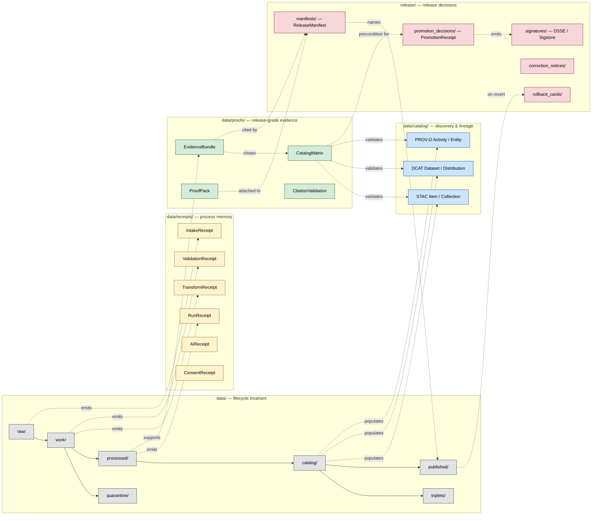

<!-- [KFM_META_BLOCK_V2]
doc_id: kfm://doc/adr/0011-receipts-vs-proofs-vs-manifests-vs-catalog-separation
title: ADR-0011 — Receipts vs Proofs vs Manifests vs Catalog Separation
type: standard
version: v1
status: proposed
owners: TODO — architecture stewards, governance stewards, release stewards
created: 2026-05-11
updated: 2026-05-11
policy_label: public
related:
  - docs/adr/ADR-0001-spec-normalization.md
  - docs/adr/ADR-0002-finite-decision-outcomes.md
  - docs/adr/ADR-0003-watcher-non-publisher-invariant.md
  - docs/adr/ADR-0004-stac-profile.md
  - docs/adr/ADR-0005-release-manifest-envelope.md
  - directory-rules.md
  - schemas/contracts/v1/evidence/
  - schemas/contracts/v1/release/
  - data/receipts/README.md
  - data/proofs/README.md
  - data/catalog/README.md
  - release/README.md
tags: [kfm, adr, governance, trust-membrane, lifecycle, directory-rules]
notes:
  - "ADR number 0011 is PROPOSED; verify against current docs/adr/ index before acceptance."
  - "Resolves Open Question from directory-rules.md §18 about data/manifests/."
[/KFM_META_BLOCK_V2] -->

# ADR-0011 — Receipts vs Proofs vs Manifests vs Catalog Separation

> Make the four-way trust-membrane symmetry — **receipt ≠ proof ≠ catalog ≠ publication** — a firm directory rule, with canonical homes, validators, and migration semantics.


| Field | Value |
|---|---|
| **Status** | `proposed` (PROPOSED — pending acceptance) |
| **Date** | 2026-05-11 |
| **Owners** | TODO — architecture stewards · governance stewards · release stewards |
| **ADR number** | `0011` — PROPOSED (NEEDS VERIFICATION against current `docs/adr/` index) |
| **Supersedes** | none |
| **Superseded by** | none |
| **Decision class** | Authority boundary · directory rule · governance invariant |

---

## Table of contents

- [1. Context](#1-context)
- [2. Forces](#2-forces)
- [3. Decision](#3-decision)
- [4. Canonical homes](#4-canonical-homes)
- [5. Separation diagram](#5-separation-diagram)
- [6. Object families per home](#6-object-families-per-home)
- [7. Cross-family references and closure](#7-cross-family-references-and-closure)
- [8. Validators and enforcement](#8-validators-and-enforcement)
- [9. Migration and compatibility](#9-migration-and-compatibility)
- [10. Consequences](#10-consequences)
- [11. Alternatives considered](#11-alternatives-considered)
- [12. Open questions](#12-open-questions)
- [13. Test obligations](#13-test-obligations)
- [14. Rollback](#14-rollback)
- [15. References](#15-references)

---

## 1. Context

KFM is a governed, evidence-first, map-first, time-aware spatial knowledge system. Its trust posture depends on keeping four distinct kinds of artifact distinct in storage, in references, in policy, and in publication semantics:

- **Receipts** — process memory of what a run, ingest, validation, AI invocation, or release-time action did.
- **Proofs** — release-grade evidence objects (EvidenceBundle, ProofPack, catalog-closure matrix, attestation bundles) that support public claims.
- **Catalog** — interoperable discovery surfaces (STAC, DCAT, PROV) that make artifacts findable and lineage-navigable.
- **Manifests** and **Publication** — the **release decision** (`ReleaseManifest`, promotion decision, signatures, rollback card) and the **released artifacts** (public-safe outputs consumers read).

KFM doctrine repeatedly states this as a four-way symmetry: *a receipt is not a proof, a proof is not a catalog entry, a catalog entry is not a publication.* Conflating any of the four into a single "log," "manifest," or "archive" loses the structure that makes audit, rollback, and correction tractable. The doctrine is asserted across the Pass 12, Pass 13, Pass 16, and Pass 17 idea indexes, the Greenfield Building Plan v1.1, multiple domain architecture reports (soil, habitat, geology, flora, infrastructure), and is reflected in `directory-rules.md`.

`directory-rules.md` leaves one **OPEN** question (§18):

> Whether `data/manifests/` is a real sibling of `data/proofs/` and `data/receipts/`, or whether all manifests live under `release/manifests/`. This document treats `release/manifests/` as canonical for release manifests; lane-internal manifests (e.g., layer manifests) MAY live within `data/published/` per layer.

This ADR **resolves that question**, codifies the four-way split, and pins the canonical homes so future PRs, validators, and CI gates can enforce it.

> [!IMPORTANT]
> This ADR governs **placement and meaning**, not file format. JSON Schema bodies for `RunReceipt`, `EvidenceBundle`, `ReleaseManifest`, `CatalogMatrix`, etc., live in their respective schema homes per ADR-0001 (canonical schema home).

---

## 2. Forces

| # | Force | Pressure |
|---|---|---|
| F1 | **Audit reconstructability.** A reviewer must walk from any release backward to the exact gate decisions, receipts, evidence, and source heads — without re-running anything. | Pushes toward strict, content-addressed family separation. |
| F2 | **Trust-membrane integrity.** Public clients consume governed APIs reading published artifacts; raw, work, quarantine, and process-internal receipts must never become public truth. | Pushes toward storage homes that match policy boundaries. |
| F3 | **Drift detectability.** When two homes for the same authority exist, drift is inevitable. | Pushes toward one canonical home per family. |
| F4 | **Operational ergonomics.** Pipeline authors prefer convenient sibling folders for inputs and outputs of a single run. | Pushes toward grouping receipt + proof + manifest by run. |
| F5 | **Migration cost.** `artifacts/` exists today as a catch-all; teams keep a foothold there during transition. | Pushes toward a compatibility window, not an abrupt cut. |
| F6 | **Interoperability.** STAC, DCAT, PROV are external standards consumers expect at predictable locations. | Pushes toward fixed catalog homes that mirror standard idioms. |
| F7 | **Reversibility.** Promotion is a governed state transition, not a file move; rollback must not delete prior meanings. | Pushes toward release decisions in `release/`, distinct from `data/published/` artifacts. |

F3 and F4 are in tension. This ADR resolves the tension by **separating storage homes by family** while permitting **per-run sub-grouping inside each home** (e.g., `data/receipts/<domain>/runs/<run_id>/`).

---

## 3. Decision

**Adopt a strict four-way separation** between receipts, proofs, catalog records, and manifests/publication, with the following canonical homes and rules.

1. `data/receipts/` is the canonical home for **process memory**. Receipts MUST NOT be cited as release-grade proof on their own.
2. `data/proofs/` is the canonical home for **release-grade evidence objects** (EvidenceBundle, ProofPack, CatalogMatrix, integrity bundles). Proofs reference receipts; receipts do not become proofs by relocation.
3. `data/catalog/{stac,dcat,prov,domain}/` is the canonical home for **discovery and interchange** surfaces. Catalog entries are **carriers, not truth** — consumers must dereference to an EvidenceBundle.
4. `release/manifests/` is the canonical home for the **ReleaseManifest** and is the only place release-level manifests live. **There is no `data/manifests/` sibling root.** This **resolves** the open question in `directory-rules.md` §18.
5. `data/published/<domain>/...` is the canonical home for **released artifacts** consumers read. Lane-internal layer manifests (e.g., `LayerManifest`, per-asset descriptors) MAY live under `data/published/<domain>/manifests/` per layer; they are *not* `ReleaseManifest`.
6. `release/` (siblings of `manifests/`) owns release-decision artifacts: `promotion_decisions/`, `rollback_cards/`, `correction_notices/`, `withdrawal_notices/`, `signatures/`, `changelog/`.
7. `artifacts/` MUST NOT host receipts, proofs, evidence bundles, release manifests, promotion decisions, rollback cards, correction notices, catalog records, or published layers. It is reserved for `build/`, `docs/`, `qa/`, `temporary/` per `directory-rules.md` §8.2.
8. **Promotion is a governed state transition, not a file move.** Crossing a family boundary requires a validator pass and a decision artifact in `release/`.

> [!WARNING]
> The four-way separation is an **authority boundary**, not a stylistic preference. PRs that mix families (e.g., a release manifest in `data/proofs/`, a receipt in `release/`, an evidence bundle in `artifacts/`) MUST be rejected by reviewers and, where automated, by CI.

---

## 4. Canonical homes

The following table is the placement contract this ADR pins. All paths are **PROPOSED** at the per-file level until the canonical tree in `directory-rules.md` §9.1 is verified against the mounted repo, but the **family-to-root assignment is normative once this ADR is accepted**.

| Family | Canonical home | Authority class | What it owns | Forbidden contents |
|---|---|---|---|---|
| **Receipts** | `data/receipts/{ingest,validation,pipeline,ai,release}/` | Canonical | RunReceipt, IntakeReceipt, TransformReceipt, ValidationReceipt, AIReceipt, ConsentReceipt, VerifyReceipt, VerificationReceipt | Release proof by itself; publication state |
| **Proofs** | `data/proofs/{evidence_bundle,proof_pack,validation_report,citation_validation}/` | Canonical | EvidenceBundle, ProofPack, CatalogMatrix bundle, integrity bundle, citation validation report | Process-only receipts without release context; release decisions |
| **Catalog (STAC)** | `data/catalog/stac/<domain>/` | Canonical | STAC Collections and Items (per ADR-0004 STAC profile) | Uncited claims; unclosed identifiers |
| **Catalog (DCAT)** | `data/catalog/dcat/<domain>/` | Canonical | DCAT Dataset and Distribution records with controlled license and access-rights vocabulary | Free-text licenses; opaque access-rights |
| **Catalog (PROV)** | `data/catalog/prov/<domain>/` | Canonical | PROV-O Activity / Agent / Entity records and `wasDerivedFrom` lineage | Replacement of EvidenceBundle |
| **Catalog (matrix)** | `data/catalog/matrix/<domain>/` or `data/catalog/<domain>/catalog_matrix/` | Canonical | CatalogMatrix closure proof across STAC / DCAT / PROV / manifest / proof | Discoverability content; standards records |
| **Release manifests** | `release/manifests/` | Canonical (sole home) | ReleaseManifest by `release_id`, MerkleManifest reference | Lane-internal layer manifests; receipts |
| **Release decisions** | `release/{promotion_decisions,rollback_cards,correction_notices,withdrawal_notices,signatures,changelog}/` | Canonical | PromotionReceipt, rollback card, correction notice, withdrawal notice, DSSE / Sigstore signature artifacts, release-level changelog | Released artifact bytes; canonical receipts/proofs |
| **Published artifacts** | `data/published/<domain>/{api_payloads,layers,pmtiles,geoparquet,reports,stories,manifests}/` | Canonical | Public-safe outputs consumers read; per-layer `LayerManifest` | Raw / work / quarantine bytes; release decisions |
| **Rollback (data plane)** | `data/rollback/<domain>/<release_id>/` | Canonical | Alias-revert receipts, prior-pointer captures | Release-decision artifacts |
| **Compatibility (transitional)** | `artifacts/{build,docs,qa,temporary}/` | Compatibility (transitional) | Build outputs, generated docs, QA reports, ephemerals | Receipts, proofs, manifests, catalog, releases |

> [!NOTE]
> The exact subfolder list under each home is consistent with `directory-rules.md` §9.1 and §9.2. Per-domain subdirectories follow the **lane pattern** (§12 of `directory-rules.md`): the family root is the authority, the domain is the lane.

[Back to top](#table-of-contents)

---

## 5. Separation diagram

The lifecycle invariant **RAW → WORK / QUARANTINE → PROCESSED → CATALOG / TRIPLET → PUBLISHED** sits horizontally. Receipts, proofs, catalog, and manifests/publication are **four parallel families** that record and govern the journey, not lifecycle phases themselves.



The diagram is **doctrinal**: each colored cluster is an authority boundary. Edges that cross a cluster are governed (validator gates, content-addressed references, signed envelopes). A path that crosses a boundary without a recorded transition is a violation regardless of which directory the bytes ended up in.

[Back to top](#table-of-contents)

---

## 6. Object families per home

The following inventory binds known KFM object families to their canonical homes. Schema homes are governed by **ADR-0001** (canonical schema home: `schemas/contracts/v1/...`); this ADR governs **where instances live**, not where their schemas live.

### 6.1 Receipts — `data/receipts/`

<details>
<summary><strong>Receipt family inventory</strong> (click to expand)</summary>

| Object | Purpose | Notes |
|---|---|---|
| `RunReceipt` | Universal per-run record: inputs, transform git SHA, validators, artifacts, decision_id, target_zone | Wrapped in DSSE envelope; signed (cosign) |
| `IntakeReceipt` | Source-edge capture record: timestamp, checksum, HTTP validators, actor/tool | Tied to `data/raw/` capture |
| `TransformReceipt` | Records normalization, redaction, generalization, derivative build | Required for any geometry generalization |
| `ValidationReceipt` / `ValidationReport` | What was checked, status, finite reasons | Feeds into ProofPack |
| `AIReceipt` | Model invocation: prompt hash, model id/version, seed, temperature, evidence refs | Carries `decision_id` join key |
| `ConsentReceipt` | Consent issuance/revocation record | Subordinate to policy and rights |
| `VerifyReceipt` | Client-side verification result | Independent of server emission |
| `VerificationReceipt` | Server-side verification of a VerifyReceipt | Optional verification graph |
| `WatcherRunReceipt` | Watcher-specific RunReceipt variant | Watcher is non-publisher (ADR-0003) |
| `CatalogEmitterReceipt` | Emission of STAC/DCAT/PROV records | Feeds CatalogMatrix |
| `PromotionGateDecisionLog` | Per-gate decision-log JSON joined by `decision_id` | Gate A–G; companion to PromotionReceipt |

</details>

### 6.2 Proofs — `data/proofs/`

<details>
<summary><strong>Proof family inventory</strong> (click to expand)</summary>

| Object | Purpose | Notes |
|---|---|---|
| `EvidenceBundle` | Resolved, policy-safe evidence context; the runtime-resolvable unit of admittable evidence | Cited by `spec_hash` from every dependent artifact |
| `EvidenceRef` | Small pointer to an EvidenceBundle | Lives inside claims, drawer payloads, runtime envelopes |
| `ProofPack` | Bundle of validation + evidence closure + policy + integrity + release-support records | Required for promotion |
| `CatalogMatrix` | Closure proof that STAC / DCAT / PROV / manifest / proof / published refs all align by id and digest | Promotion precondition |
| `CitationValidationReport` | Proof that every cited EvidenceRef resolves and is admissible in current scope | Negative fixtures required |
| `IntegrityBundle` / `MerkleManifest` (reference) | Merkle root over canonical release file set | Manifest itself lives in `release/manifests/`; the bundle lives here |

</details>

### 6.3 Catalog — `data/catalog/`

<details>
<summary><strong>Catalog family inventory</strong> (click to expand)</summary>

| Sub-home | Object | Notes |
|---|---|---|
| `stac/<domain>/` | STAC Collection / Item | KFM extensions: `kfm:spec_hash`, `kfm:run_receipt_url`, `processing:software/version/datetime` (per ADR-0004) |
| `dcat/<domain>/` | DCAT Dataset / Distribution | Controlled `dct:license`, `dct:accessRights`; `prov:wasGeneratedBy` link |
| `prov/<domain>/` | PROV-O Activity / Agent / Entity / `wasDerivedFrom` | Sidecar to artifacts; referenced from STAC, DCAT, EvidenceBundle |
| `matrix/<domain>/` (or `<domain>/catalog_matrix/`) | CatalogMatrix instance | Closure proof artifact |

</details>

> [!NOTE]
> **Catalogs discover, bundles hold truth.** A consumer who reads a STAC Item MUST resolve the EvidenceRefs to an EvidenceBundle before treating any property as authoritative. Catalog records without resolvable bundles are **unrenderable** under runtime gates.

### 6.4 Manifests and publication — `release/` and `data/published/`

<details>
<summary><strong>Release / manifest / publication inventory</strong> (click to expand)</summary>

| Object | Canonical home | Notes |
|---|---|---|
| `ReleaseManifest` | `release/manifests/<release_id>/` | Sole release-level manifest home; cites EvidenceBundles, ProofPack, signatures, rollback target |
| `MerkleManifest` | `release/manifests/<release_id>/merkle_manifest.json` (referenced from ReleaseManifest; bundle file may live in `data/proofs/`) | Tamper-evident Merkle root |
| `PromotionReceipt` / `PromotionDecision` | `release/promotion_decisions/` | Gate enumeration A–G; finite status `approved|denied|held` |
| `RollbackCard` | `release/rollback_cards/` | Rollback decision; the alias-revert receipt lives in `data/rollback/<domain>/<release_id>/` |
| `CorrectionNotice` | `release/correction_notices/` | User/steward-visible correction note |
| `WithdrawalNotice` | `release/withdrawal_notices/` | Public withdrawal record |
| DSSE / Sigstore signature artifacts | `release/signatures/` | Out-of-band attestations |
| `LayerManifest` | `data/published/<domain>/manifests/` (or per-layer file under `data/published/<domain>/layers/<layer_id>/`) | Lane-internal, per-layer; **not** a ReleaseManifest |
| Published artifact bytes | `data/published/<domain>/{api_payloads,layers,pmtiles,geoparquet,reports,stories}/` | Carriers, not truth (generated layers cannot be cited as evidence) |

</details>

[Back to top](#table-of-contents)

---

## 7. Cross-family references and closure

The four families do not stand alone; they reference each other along stable, content-addressed joins. Closure is the property that every cross-reference resolves and every cited digest matches.

```text
RunReceipt.outputs[].sha256
   └─► (also referenced by) ProofPack.entries[].digest
                                  └─► (covered by) EvidenceBundle.evidence_refs[].uri
                                                       └─► (catalogued in) STAC Item.assets[].href + kfm:spec_hash
                                                                                └─► (described in) DCAT Distribution.downloadURL + dct:license
                                                                                                       └─► (lineage in) PROV Activity.wasGeneratedBy / used
                                  └─► (closure proved by) CatalogMatrix entries
   └─► (joined by decision_id to) PromotionGateDecisionLog
                                  └─► (referenced by) ReleaseManifest.proof_pack_ref + .evidence_bundle_refs[]
                                                       └─► (signed by) release/signatures/<release_id>/*.dsse
                                                                                └─► (names) data/published/<domain>/... artifacts
```

**Closure rules** (enforced by validators in §8):

1. Every `EvidenceRef` in a `ReleaseManifest` MUST resolve to an `EvidenceBundle` in `data/proofs/`.
2. Every `ProofPack` MUST cite at least one `RunReceipt` in `data/receipts/` and at least one `EvidenceBundle` in `data/proofs/`.
3. Every STAC Item published in `data/catalog/stac/` MUST carry `kfm:spec_hash` and `kfm:run_receipt_url`; the run receipt MUST exist.
4. Every DCAT Distribution MUST carry `dct:license` and `dct:accessRights` from a controlled vocabulary and a `prov:wasGeneratedBy` link to a PROV Activity.
5. Every `ReleaseManifest` MUST be accompanied by a `CatalogMatrix` showing STAC / DCAT / PROV / manifest / proof closure.
6. Every artifact in `data/published/<domain>/` MUST be named in some `ReleaseManifest`; orphan published artifacts are a CI failure.
7. Promotion across a family boundary MUST emit a `PromotionReceipt` (gate enumeration A–G) in `release/promotion_decisions/`.

[Back to top](#table-of-contents)

---

## 8. Validators and enforcement

The following validators are **PROPOSED** to enforce this ADR. Each one is a placement check, not a content check; content checks remain governed by per-family schemas.

| Validator (PROPOSED) | Checks | Failure mode |
|---|---|---|
| `tools/validators/placement/family_home_validator.*` | No receipt under `data/proofs/`, `release/`, `artifacts/`; no proof under `data/receipts/`, `release/`, `artifacts/`; no `ReleaseManifest` outside `release/manifests/`; no `data/manifests/` root | DENY PR |
| `tools/validators/placement/no_data_manifests_root.*` | Fail-closed check that `data/manifests/` does not exist as a root | DENY PR |
| `tools/validators/placement/artifacts_no_trust_content.*` | `artifacts/` contains no receipts, proofs, evidence bundles, release manifests, promotion decisions, rollback cards, correction notices, catalog records, or published layers | DENY PR |
| `tools/validators/closure/catalog_matrix_validate.*` | STAC / DCAT / PROV / manifest / proof / published refs all align by id and digest | DENY promotion |
| `tools/validators/closure/release_manifest_closure.*` | Every `ReleaseManifest` resolves all evidence/proof refs and is paired with a `PromotionReceipt` | DENY promotion |
| `tools/validators/closure/orphan_published.*` | No artifact in `data/published/` lacks a naming `ReleaseManifest` | DENY release |
| `.github/workflows/placement.yml` | Runs the above on every PR touching `data/`, `release/`, or `artifacts/` | CI gate |

> [!CAUTION]
> Until the placement validators are implemented and wired into CI, this ADR is **doctrinal only**: enforcement depends on reviewer discipline. Maturity claims about automated enforcement remain **NEEDS VERIFICATION** until the validators and workflows are present in the mounted repo.

[Back to top](#table-of-contents)

---

## 9. Migration and compatibility

Existing repos that hold trust content under `artifacts/` (or any other non-canonical home) migrate per `directory-rules.md` §14 with the following per-family map.

| From (compatibility / drift) | To (canonical) | Migration step |
|---|---|---|
| `artifacts/receipts/...` | `data/receipts/<domain>/...` | Move, preserve hashes, emit migration receipt, update references |
| `artifacts/proofs/...` or `artifacts/evidence/...` | `data/proofs/<family>/<domain>/...` | Move, preserve hashes, re-verify EvidenceBundle digests, update references |
| `artifacts/manifests/release*.json` | `release/manifests/<release_id>/` | Move; re-pin downstream consumers to new path; rollback card if currently in use |
| `artifacts/catalog/stac/...` | `data/catalog/stac/<domain>/` | Move; re-validate KFM STAC extensions per ADR-0004 |
| `data/manifests/...` (if exists) | `release/manifests/...` for release-level; `data/published/<domain>/manifests/` for per-layer | Resolve by manifest kind; emit migration receipt |
| `release/<receipts|proofs|catalog>/...` | `data/receipts/`, `data/proofs/`, `data/catalog/` | Move; release-decision artifacts only stay in `release/` |

**Migration discipline:**

- Each move emits a migration `RunReceipt` in `data/receipts/migration/<run_id>/`.
- The old path is frozen (read-only) for one release window, then removed; a drift register entry is recorded under `docs/registers/DRIFT_REGISTER.md`.
- No `ReleaseManifest` is broken: the migration step updates affected manifests via a `correction_notice` if any published consumer pinned the old path.

[Back to top](#table-of-contents)

---

## 10. Consequences

### Positive

- **Auditability.** A reviewer can reconstruct any release by walking `release/manifests/<id>/` backward through `release/promotion_decisions/`, `data/proofs/`, `data/receipts/`, the gate decision logs, and source heads — every join content-addressed.
- **Drift detection.** One canonical home per family means schema mirrors, policy mirrors, and parallel paths are mechanically detectable.
- **Trust-membrane integrity.** Public clients reading `data/published/` through `apps/governed-api/` never encounter process-internal receipts or unresolved EvidenceRefs.
- **Reversibility.** Rollback cards in `release/rollback_cards/` and alias-revert receipts in `data/rollback/<domain>/` preserve prior meanings rather than deleting them.
- **Resolves an open directory question.** Closes `directory-rules.md` §18 on `data/manifests/` vs `release/manifests/`.

### Negative

- **More directories to maintain.** Four parallel family roots plus `release/` and `data/published/` is heavier than a single `artifacts/` umbrella.
- **Migration cost.** Repos with entrenched `artifacts/` usage need a one-pass migration with rollback cards.
- **Validator burden.** Placement validators must be authored and wired into CI; until then enforcement is reviewer-only.
- **Per-run grouping is across-home.** Operators who think "show me everything for run X" must traverse two or three homes; tooling should provide a `decision_id` / `run_id` walker.

### Neutral

- **Catalog redundancy with EvidenceBundle.** Some lineage information appears in both PROV records and EvidenceBundles. This ADR treats the redundancy as intentional: catalogs discover, bundles prove.

[Back to top](#table-of-contents)

---

## 11. Alternatives considered

| Alternative | Why rejected |
|---|---|
| **Single `data/audit/` umbrella** holding all receipts, proofs, and manifests | Loses the four-way semantic distinction the doctrine repeatedly asserts; makes drift detection and policy enforcement harder; collapses authority boundaries into one. |
| **Allow `data/manifests/` as a real sibling of `data/proofs/` and `data/receipts/`** | Creates two homes for release-decision artifacts (`data/manifests/` and `release/manifests/`); two homes for the same authority is the most common drift pattern in KFM (per `directory-rules.md` §8.3). |
| **Keep `artifacts/` as the canonical home for trust content (status quo for some lanes)** | Mixes build output, QA, and trust artifacts; blurs the trust membrane; explicitly forbidden by `directory-rules.md` §8.2 and §13.2. |
| **Per-domain trust roots** (e.g., `hydrology/receipts/`, `hydrology/proofs/` at repo root) | Fragments the lifecycle; violates the Domain Placement Law (`directory-rules.md` §12); domain belongs as a lane inside an authority root. |
| **Co-locate receipts and proofs by `run_id`** (e.g., `data/runs/<run_id>/{receipt,proof,manifest}.json`) | Optimizes for per-run access at the cost of cross-cutting family queries (e.g., "show me all proofs," "show me all release manifests"); also makes policy gating per-family harder. |
| **Drop catalog as a separate family; embed STAC inside EvidenceBundle** | Loses external interoperability; STAC/DCAT/PROV are interchange standards consumers expect at predictable locations. |

[Back to top](#table-of-contents)

---

## 12. Open questions

- **NEEDS VERIFICATION** — ADR number `0011` is PROPOSED. Confirm against the current `docs/adr/` index in the mounted repo before acceptance. If a different number is required, rename and update `related[]` accordingly.
- **OPEN** — Should per-domain CatalogMatrix files live at `data/catalog/matrix/<domain>/` (parallel to `stac/`, `dcat/`, `prov/`) or under each domain (`data/catalog/<domain>/catalog_matrix/`)? Both placements appear across the corpus. Default to `data/catalog/matrix/<domain>/` unless the mounted repo shows the alternative is more entrenched.
- **OPEN** — Whether `data/published/<domain>/manifests/` is the canonical home for `LayerManifest` files, or whether `LayerManifest` should be embedded inline in each layer asset folder (`data/published/<domain>/layers/<layer_id>/manifest.json`). This ADR allows both; a follow-up ADR may freeze one.
- **OPEN** — Whether `MerkleManifest` bundle bytes live in `data/proofs/<domain>/proof_pack/<release_id>/merkle.json` while only the **reference** is in `release/manifests/<release_id>/`. Recommended default: bytes in `data/proofs/`, reference in `release/manifests/`. A follow-up ADR may freeze it.
- **PROPOSED** — A `run_id` / `decision_id` walker tool (`tools/audit/walk_decision.py` PROPOSED) that traverses the four families given any join key. Not in scope for this ADR.

[Back to top](#table-of-contents)

---

## 13. Test obligations

The following tests are **PROPOSED** to demonstrate this ADR is enforceable. Test paths are PROPOSED until the canonical test layout is verified.

| Test | Asserts | Fixtures |
|---|---|---|
| `tests/placement/test_no_receipt_in_proofs.py` | No `RunReceipt` / `IntakeReceipt` / `TransformReceipt` body under `data/proofs/` | Positive: receipt under `data/receipts/`; Negative: receipt under `data/proofs/` |
| `tests/placement/test_no_proof_in_receipts.py` | No `EvidenceBundle` / `ProofPack` / `CatalogMatrix` body under `data/receipts/` | Positive: proof under `data/proofs/`; Negative: proof under `data/receipts/` |
| `tests/placement/test_no_release_manifest_outside_release.py` | `ReleaseManifest` only under `release/manifests/<release_id>/` | Positive and negative |
| `tests/placement/test_no_data_manifests_root.py` | `data/manifests/` MUST NOT exist | Fail-closed |
| `tests/placement/test_artifacts_no_trust_content.py` | No receipts / proofs / manifests / catalog / published bytes under `artifacts/` | Positive: build artifact in `artifacts/build/`; Negative: receipt in `artifacts/` |
| `tests/closure/test_catalog_matrix_closure.py` | CatalogMatrix shows STAC ↔ DCAT ↔ PROV ↔ manifest ↔ proof closure | Synthetic hydrology fixture (per Greenfield Plan §28) |
| `tests/closure/test_release_manifest_resolves_evidence.py` | Every `evidence_bundle_ref` in a `ReleaseManifest` resolves to a bundle in `data/proofs/` | Positive and negative |
| `tests/closure/test_orphan_published_artifact.py` | Every artifact in `data/published/` is named in at least one `ReleaseManifest` | Negative: orphan artifact triggers DENY |
| `tests/governance/test_promotion_emits_receipt.py` | Every promotion across a family boundary emits a `PromotionReceipt` with gates A–G | Synthetic dry-run promotion |

[Back to top](#table-of-contents)

---

## 14. Rollback

If this ADR is later superseded or proves operationally infeasible:

1. Author a successor ADR with `status: proposed`; set this ADR's `status: superseded` and add `superseded_by:` to the successor.
2. Do **not** delete this ADR. Do not delete the directory homes it pinned without a migration ADR that names every affected `ReleaseManifest`.
3. If the successor changes a family home, emit a `correction_notice` per affected release and a `migration` `RunReceipt` per moved file.
4. The drift register (`docs/registers/DRIFT_REGISTER.md`) records the supersession; the lineage register (`docs/registers/lineage-register.md`) records affected releases.

[Back to top](#table-of-contents)

---

## 15. References

**KFM doctrine (project knowledge — CONFIRMED as supplied doctrine):**

- `directory-rules.md` — Authority roots, compatibility roots, `release/` vs `data/published/` distinction, open question §18 on `data/manifests/`.
- `KFM_Pass_12_Part_2_Idea_Index_Category_Atlas_and_Expansion_Dossier.pdf` — *Receipts Compose* (§6.5), *Catalogs Discover, Bundles Hold Truth* (§6.4), J.3 ADR pattern, B.3 RunReceipt / PromotionReceipt.
- `KFM_Components_Pass_13_Part_2_Idea_Index_Category_Atlas_and_Expansion_Dossier.pdf` — *Four-way trust-membrane symmetry: receipt ≠ proof ≠ catalog ≠ publication.*
- `KFM_Pass_16_Part_2_Idea_Index_Category_Atlas_and_Expansion_Dossier.pdf` — `EvidenceBundle` as the unit of governed evidence (§6.3.1); `ReleaseManifest` as the publishable artifact (§6.4.3).
- `KFM_Pass_17_Part_2_Idea_Index_Category_Atlas_and_Expansion_Dossier.pdf` — Five-schema evidence family; three trust topologies.
- `Kansas_Frontier_Matrix_Definitive_Greenfield_Building_Plan_v1_1.pdf` — §7.30–7.33 RunReceipt, PromotionReceipt, Merkle Manifest, OPA bootstrap; §28 Final Build Checklist.
- `kfm_build_companion.pdf` — §3 *The trust spine* and the minimal trust-spine flow.
- `KFM_Geology_Natural_Resources_Architecture_PDF_Only_Report_20260421.pdf` — §17 Catalog / proof / receipt / release separation table.
- `kfm_soil_architecture_extended_pro_pdf_only_report.pdf` — §16 *Receipt != proof != catalog != publication*.
- `kfm_habitat_architecture_pdf_only_blueprint_20260421.pdf` — §14 catalog closure rule.

**Related ADRs (PROPOSED — verify presence and numbering in `docs/adr/`):**

- ADR-0001 — Spec normalization / hash and ID v1 (`schemas/contracts/v1/...` canonical schema home; JCS + SHA-256).
- ADR-0002 — Finite decision outcomes (`ANSWER | ABSTAIN | DENY | ERROR`).
- ADR-0003 — Watcher-as-non-publisher invariant.
- ADR-0004 — KFM STAC profile v1.
- ADR-0005 — `ReleaseManifest` envelope.

> [!NOTE]
> No external (web) research was used in authoring this ADR; all references are KFM project knowledge or `directory-rules.md`.

---

## Related docs

- [`directory-rules.md`](../../directory-rules.md) — authority roots, lifecycle invariant, compatibility roots.
- [`docs/adr/ADR-0001-spec-normalization.md`](./ADR-0001-spec-normalization.md) — *PROPOSED link target; NEEDS VERIFICATION.*
- [`docs/adr/ADR-0003-watcher-non-publisher-invariant.md`](./ADR-0003-watcher-non-publisher-invariant.md) — *PROPOSED link target; NEEDS VERIFICATION.*
- [`docs/adr/ADR-0005-release-manifest-envelope.md`](./ADR-0005-release-manifest-envelope.md) — *PROPOSED link target; NEEDS VERIFICATION.*
- [`data/receipts/README.md`](../../data/receipts/README.md) — *PROPOSED, NEEDS VERIFICATION.*
- [`data/proofs/README.md`](../../data/proofs/README.md) — *PROPOSED, NEEDS VERIFICATION.*
- [`data/catalog/README.md`](../../data/catalog/README.md) — *PROPOSED, NEEDS VERIFICATION.*
- [`release/README.md`](../../release/README.md) — *PROPOSED, NEEDS VERIFICATION.*
- [`docs/registers/DRIFT_REGISTER.md`](../registers/DRIFT_REGISTER.md) — *PROPOSED link target; NEEDS VERIFICATION.*

---

*Last updated: 2026-05-11 · Status: `proposed` · Decision class: authority boundary · [Back to top](#adr-0011--receipts-vs-proofs-vs-manifests-vs-catalog-separation)*
