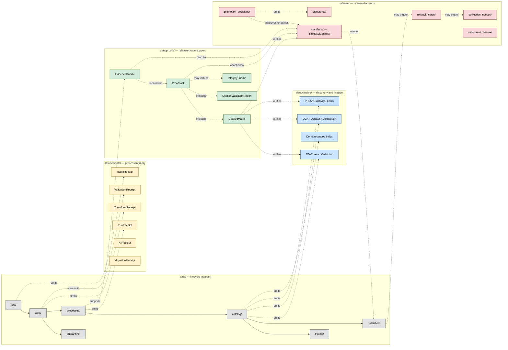

<!-- [KFM_META_BLOCK_V2]
doc_id: kfm://doc/adr/0011-receipts-vs-proofs-vs-manifests-vs-catalog-separation
title: ADR-0011 — Receipts vs Proofs vs Manifests vs Catalog Separation
type: standard
version: v1.1
status: proposed
owners: TODO(owner): confirm architecture stewards, governance stewards, release stewards
created: 2026-05-11
updated: 2026-05-15
policy_label: public
related: [docs/adr/ADR-0001-spec-normalization.md, docs/adr/ADR-0002-finite-decision-outcomes.md, docs/adr/ADR-0003-watcher-non-publisher-invariant.md, docs/adr/ADR-0004-stac-profile.md, docs/adr/ADR-0005-release-manifest-envelope.md, directory-rules.md, schemas/contracts/v1/evidence/, schemas/contracts/v1/release/, data/receipts/README.md, data/proofs/README.md, data/catalog/README.md, release/README.md]
tags: [kfm, adr, governance, trust-membrane, lifecycle, directory-rules]
notes: [ADR number 0011 is PROPOSED; verify against the current docs/adr index before acceptance., This ADR resolves the Directory Rules open question about release-level data/manifests vs release/manifests once accepted., All validator/test paths remain PROPOSED until mounted-repo inspection confirms conventions.]
[/KFM_META_BLOCK_V2] -->

# ADR-0011 — Receipts vs Proofs vs Manifests vs Catalog Separation

> Pin the four-way trust-membrane rule: **receipt ≠ proof ≠ catalog ≠ publication**.


| Field | Value |
|---|---|
| **Status** | `proposed` — pending ADR index verification and acceptance |
| **Date** | 2026-05-11 |
| **Last updated** | 2026-05-15 |
| **Owners** | TODO(owner): confirm architecture stewards · governance stewards · release stewards |
| **ADR number** | `0011` — PROPOSED; NEEDS VERIFICATION against current `docs/adr/` index |
| **Supersedes** | none |
| **Superseded by** | none |
| **Decision class** | Authority boundary · directory rule · governance invariant |
| **Truth posture** | CONFIRMED doctrine · PROPOSED placement contract · UNKNOWN current repo implementation depth |
| **Directory Rules basis** | Responsibility root wins over topic; lifecycle and release authority are separate; no parallel proof, receipt, release, or manifest homes without ADR-backed placement. |

> [!IMPORTANT]
> This ADR is **not yet accepted**. Until accepted, its MUST / MUST NOT language is a proposed rule for review. Once accepted, it becomes the placement contract for the four artifact families named here.

---

## Table of contents

- [1. Context](#1-context)
- [2. Forces](#2-forces)
- [3. Decision](#3-decision)
- [4. Canonical homes](#4-canonical-homes)
- [5. Separation diagram](#5-separation-diagram)
- [6. Object families per home](#6-object-families-per-home)
- [7. Cross-family references and closure](#7-cross-family-references-and-closure)
- [8. Validators and enforcement](#8-validators-and-enforcement)
- [9. Migration and compatibility](#9-migration-and-compatibility)
- [10. Consequences](#10-consequences)
- [11. Alternatives considered](#11-alternatives-considered)
- [12. Open questions](#12-open-questions)
- [13. Test obligations](#13-test-obligations)
- [14. Rollback](#14-rollback)
- [15. References](#15-references)
- [16. Verification checklist](#16-verification-checklist)
- [Related docs](#related-docs)

---

## 1. Context

KFM is a governed, evidence-first, map-first, time-aware spatial knowledge and publication system. Its durable public unit is the **inspectable claim**: a statement whose evidence, source role, spatial and temporal scope, policy posture, review state, release state, and correction lineage can be inspected.

That posture depends on keeping four distinct artifact families distinct in storage, references, policy, and publication semantics:

| Family | Short meaning | What goes wrong when conflated |
|---|---|---|
| **Receipts** | Process memory of what a run, ingest, validation, AI invocation, migration, or release-time action did. | Reviewers mistake execution metadata for proof that a claim is true or publishable. |
| **Proofs** | Release-grade support objects such as `EvidenceBundle`, `ProofPack`, catalog-closure proof, citation validation, and integrity bundles. | Public claims lose traceability to admissible evidence. |
| **Catalog** | Discovery and interchange surfaces such as STAC, DCAT, and PROV records. | Search metadata starts acting like evidence or publication approval. |
| **Manifests / publication** | Release decisions, release manifests, signatures, rollback cards, correction notices, and released artifacts. | Publication becomes a directory move instead of a governed state transition. |

KFM doctrine repeatedly states the symmetry as:

```text
receipt ≠ proof ≠ catalog ≠ publication
```

A receipt is not a proof.  
A proof is not a catalog record.  
A catalog record is not a publication.  
A publication is not made true merely because bytes appear under a public path.

`directory-rules.md` leaves one placement question open:

> Whether `data/manifests/` is a real sibling of `data/proofs/` and `data/receipts/`, or whether all manifests live under `release/manifests/`.

This ADR resolves that question for **release-level manifests**:

```text
release/manifests/ is the sole canonical home for ReleaseManifest.
data/manifests/ MUST NOT exist as a root.
```

Lane-internal layer manifests may still live under released artifact lanes, for example:

```text
data/published/<domain>/manifests/
data/published/<domain>/layers/<layer_id>/manifest.json
```

Those are `LayerManifest`-style descriptors for already released artifacts. They are **not** `ReleaseManifest`.

> [!NOTE]
> This ADR governs **instance placement and family meaning**. Schema homes remain governed by ADR-0001 and Directory Rules. The expected schema-home default is `schemas/contracts/v1/...`, but current repo conventions must still be verified before implementation.

### 1.1 Evidence and implementation boundary

This ADR is written from KFM doctrine and supplied project sources. It does **not** prove that validators, tests, schemas, workflows, release manifests, catalogs, receipts, proofs, or emitted artifacts already exist in the current repository.

Use these labels when reviewing or implementing this ADR:

| Label | Meaning in this ADR |
|---|---|
| `CONFIRMED doctrine` | Supported by KFM doctrine or supplied project documents. |
| `PROPOSED placement` | Recommended canonical home once this ADR is accepted. |
| `UNKNOWN implementation` | Not verified from mounted repo files, tests, workflows, logs, dashboards, emitted receipts, or release artifacts. |
| `NEEDS VERIFICATION` | Concrete repo or ADR index check required before merging. |
| `CONFLICTED` | Existing lineage or draft docs imply multiple homes; resolve through ADR or migration. |

[Back to top](#table-of-contents)

---

## 2. Forces

| # | Force | Pressure |
|---|---|---|
| F1 | **Audit reconstructability.** A reviewer must walk from any release backward to exact gate decisions, receipts, evidence, source heads, and rollback targets without re-running the pipeline. | Pushes toward content-addressed family separation. |
| F2 | **Trust-membrane integrity.** Public clients consume governed APIs and released artifacts. RAW, WORK, QUARANTINE, process-internal receipts, and unresolved candidate data must not become public truth. | Pushes toward storage homes that match policy boundaries. |
| F3 | **Drift detectability.** Two homes for the same authority create drift. | Pushes toward one canonical home per family. |
| F4 | **Operational ergonomics.** Pipeline authors often prefer one run folder containing receipts, proofs, manifests, logs, and outputs. | Pushes toward convenient grouping by run. |
| F5 | **Migration cost.** `artifacts/` and other catch-all homes may exist in earlier scaffolds or historical outputs. | Pushes toward a compatibility window rather than abrupt deletion. |
| F6 | **Interoperability.** STAC, DCAT, and PROV are external-facing discovery and lineage standards. | Pushes toward predictable catalog homes. |
| F7 | **Reversibility.** Promotion is a governed state transition, not a file move; rollback must preserve prior meanings and decision records. | Pushes toward release decisions in `release/`, separate from released bytes in `data/published/`. |
| F8 | **Schema-home ambiguity.** KFM lineage contains both `contracts/` and `schemas/contracts/v1/` references. | Pushes this ADR to govern instance homes only and defer schema-home authority to ADR-0001 / Directory Rules. |
| F9 | **Catalog closure ambiguity.** Some lineage treats `CatalogMatrix` as catalog-adjacent; other doctrine treats it as proof/release closure. | Pushes this ADR to make closure matrices proof-side objects, not discovery records. |

F3 and F4 are in tension. This ADR resolves the tension by **separating storage homes by artifact family** while permitting **per-run grouping inside each family**.

Example:

```text
data/receipts/hydrology/runs/<run_id>/
data/proofs/proof_pack/hydrology/<run_id>/
release/manifests/<release_id>/
```

Run-walking tools may join these by `run_id`, `decision_id`, `release_id`, and digest. The directories themselves remain family-scoped.

[Back to top](#table-of-contents)

---

## 3. Decision

**Decision, once accepted:** adopt strict four-way separation between receipts, proofs, catalog records, and release/publication artifacts.

### 3.1 Normative rules

1. `data/receipts/` is the canonical home for **process memory**. Receipts MUST NOT be cited as release-grade proof on their own.
2. `data/proofs/` is the canonical home for **release-grade proof support**: `EvidenceBundle`, `ProofPack`, `CatalogMatrix`, citation validation reports, integrity bundles, and proof-side closure records.
3. `data/catalog/{stac,dcat,prov,domain}/` is the canonical home for **discovery and interchange records**. Catalog entries are carriers, not truth. Consumers MUST dereference evidence support before treating cataloged claims as authoritative.
4. `release/manifests/` is the sole canonical home for **ReleaseManifest**. There is no `data/manifests/` root.
5. `data/published/<domain>/...` is the canonical home for **released public-safe artifacts** consumers read. Lane-internal layer manifests MAY live under `data/published/<domain>/manifests/` or beside the released layer asset. They are not release-level manifests.
6. `release/` owns **release-decision artifacts**: promotion decisions, rollback cards, correction notices, withdrawal notices, signatures, release-level changelog, and release candidates.
7. `artifacts/` MUST NOT host trust-bearing KFM content: receipts, proofs, evidence bundles, release manifests, promotion decisions, rollback cards, correction notices, catalog records, source registries, or published layers.
8. `CatalogMatrix` is a **proof-side closure object**. Its canonical instance home is `data/proofs/catalog_matrix/<domain>/` unless a `ProofPack` embeds or references it under `data/proofs/proof_pack/...`.
9. Promotion across an artifact-family boundary MUST emit a release-decision artifact in `release/` and a process receipt in the proper receipt lane.
10. Promotion is a governed state transition, not a file move.

> [!WARNING]
> This separation is an **authority boundary**, not a styling preference. A release manifest in `data/proofs/`, a proof pack in `data/receipts/`, a receipt in `release/`, or an evidence bundle in `artifacts/` is a placement violation.

### 3.2 Non-goals

This ADR does **not** decide:

- field-level schema shapes;
- canonical schema-home authority between `schemas/` and `contracts/`;
- API route names;
- package manager or validator language;
- exact CI workflow names;
- live source activation;
- whether existing repo files already comply;
- whether `data/rollback/` should remain a data-plane sibling or be merged later into release-only rollback handling.

### 3.3 Decision summary

| Question | Decision |
|---|---|
| Is `data/manifests/` allowed as a root? | **No.** Release-level manifests live under `release/manifests/`. |
| Where do receipts live? | `data/receipts/`. |
| Where do evidence bundles and proof packs live? | `data/proofs/`. |
| Where do STAC/DCAT/PROV records live? | `data/catalog/stac/`, `data/catalog/dcat/`, `data/catalog/prov/`. |
| Where does `CatalogMatrix` live? | `data/proofs/catalog_matrix/<domain>/` or inside / referenced from `data/proofs/proof_pack/...`. |
| Where do public-safe artifact bytes live? | `data/published/<domain>/...`. |
| Where do release decisions live? | `release/`. |
| Where do lane-internal layer manifests live? | Under the released artifact lane, e.g. `data/published/<domain>/manifests/`; never as `ReleaseManifest`. |
| Can `artifacts/` hold trust-bearing objects? | No; transitional build/doc/QA/temporary outputs only. |

[Back to top](#table-of-contents)

---

## 4. Canonical homes

The following placement contract is normative once this ADR is accepted. Per-file path presence remains **NEEDS VERIFICATION** until the mounted repo is inspected.

| Family | Canonical home | Authority class | Owns | MUST NOT contain |
|---|---|---|---|---|
| **Receipts** | `data/receipts/{ingest,validation,pipeline,ai,release,migration}/` | Canonical process memory | `RunReceipt`, `IntakeReceipt`, `TransformReceipt`, `ValidationReceipt`, `AIReceipt`, `ConsentReceipt`, `VerifyReceipt`, `WatcherRunReceipt`, migration receipts | Release proof by itself; public artifact bytes; release manifests |
| **Proofs** | `data/proofs/{evidence_bundle,proof_pack,catalog_matrix,validation_report,citation_validation,integrity}/` | Canonical proof support | `EvidenceBundle`, `ProofPack`, `CatalogMatrix`, `CitationValidationReport`, integrity bundle, proof closure outputs | Process-only receipts without proof context; release decisions; STAC/DCAT/PROV discovery records |
| **Catalog — STAC** | `data/catalog/stac/<domain>/` | Canonical discovery | STAC Collections and Items, KFM STAC profile records | Uncited claims; proof closure; release approval |
| **Catalog — DCAT** | `data/catalog/dcat/<domain>/` | Canonical discovery | DCAT Dataset and Distribution records | Free-text license drift; proof closure; release approval |
| **Catalog — PROV** | `data/catalog/prov/<domain>/` | Canonical provenance/discovery | PROV-O Activity, Agent, Entity, and lineage records | Replacement for `EvidenceBundle`; release approval |
| **Catalog — domain index** | `data/catalog/domain/<domain>/` | Canonical domain discovery | Domain catalog indexes and crosswalkable discovery records | Proof packs; release manifests |
| **Release manifests** | `release/manifests/<release_id>/` | Canonical release decision | `ReleaseManifest`, release-level manifest envelope, release-level Merkle manifest reference | Lane-internal `LayerManifest`; receipts; proof packs |
| **Release decisions** | `release/{candidates,promotion_decisions,rollback_cards,correction_notices,withdrawal_notices,signatures,changelog}/` | Canonical release governance | Promotion decisions, rollback cards, correction notices, withdrawal notices, signatures, release-level changelog | Released artifact bytes; canonical receipts/proofs/catalog records |
| **Published artifacts** | `data/published/<domain>/{api_payloads,layers,pmtiles,geoparquet,reports,stories,manifests}/` | Canonical released data plane | Public-safe outputs consumers read; per-layer manifests; tile and report outputs | RAW / WORK / QUARANTINE bytes; release decisions; proof packs |
| **Rollback data plane** | `data/rollback/<domain>/<release_id>/` | PROPOSED canonical data-plane rollback support | Alias-revert receipts, prior-pointer captures, restored pointer metadata | Release decision artifacts |
| **Compatibility outputs** | `artifacts/{build,docs,qa,temporary}/` | Compatibility / transitional | Build outputs, generated docs, QA reports, temporary files | Receipts, proofs, release manifests, catalog records, source registries, published layers |

> [!NOTE]
> The family root is the authority. The domain is the lane. Domain names do not become root-level folders.

### 4.1 `ReleaseManifest` vs `LayerManifest`

| Object | Placement | Why |
|---|---|---|
| `ReleaseManifest` | `release/manifests/<release_id>/` | Records release-level decision, proof closure, signatures, rollback target, and promoted artifact set. |
| `LayerManifest` | `data/published/<domain>/manifests/` or `data/published/<domain>/layers/<layer_id>/manifest.json` | Describes a released layer or asset for runtime/UI consumption. |
| `MapReleaseManifest` | `release/manifests/<release_id>/` when release-level; otherwise route through the release manifest as a map-specific section or reference | Avoids creating a parallel map release authority. |
| `MerkleManifest` | `release/manifests/<release_id>/merkle_manifest.json` or referenced from `ReleaseManifest`; integrity sidecar may also be cited from `data/proofs/integrity/` | The release manifest names the canonical release file set; proof-side integrity objects support verification. |

### 4.2 `CatalogMatrix` placement

`CatalogMatrix` proves closure across catalog records, proofs, release manifests, published artifacts, and digests. It is therefore **proof-side**, not a discovery record.

Canonical options:

```text
data/proofs/catalog_matrix/<domain>/<release_id>.json
data/proofs/proof_pack/<domain>/<release_id>/catalog_matrix.json
```

Avoid:

```text
data/catalog/matrix/<domain>/
data/catalog/<domain>/catalog_matrix/
```

Those catalog-matrix paths are retained only as **CONFLICTED / NEEDS VERIFICATION** lineage references if existing files are found during migration.

[Back to top](#table-of-contents)

---

## 5. Separation diagram

The lifecycle invariant sits horizontally:

```text
RAW → WORK / QUARANTINE → PROCESSED → CATALOG / TRIPLET → PUBLISHED
```

Receipts, proofs, catalog records, and release decisions are parallel authority families that record and govern the journey. They are not interchangeable lifecycle phases.



The diagram is doctrinal. Each colored cluster is an authority boundary. Edges crossing clusters require validator gates, content-addressed references, policy decisions, review state, and release records as appropriate.

A path that crosses a boundary without a recorded transition is a violation even if the bytes land in a plausible directory.

[Back to top](#table-of-contents)

---

## 6. Object families per home

The following inventory binds KFM object families to homes. It is intentionally instance-focused. Schema placement remains governed by ADR-0001 and Directory Rules.

### 6.1 Receipts — `data/receipts/`

<details>
<summary><strong>Receipt family inventory</strong></summary>

| Object | Purpose | Placement note |
|---|---|---|
| `RunReceipt` | Universal per-run record: inputs, transform git SHA, validators, artifacts, decision identifiers, target zone, result. | Process memory only. |
| `IntakeReceipt` | Source-edge capture record: timestamp, checksum, source head, retrieval metadata, actor/tool. | Tied to RAW or pre-RAW admission. |
| `TransformReceipt` | Records normalization, redaction, generalization, derivative build, or migration transform. | Required for lossy or policy-significant transforms. |
| `ValidationReceipt` | Records what validation was run, status, and finite reasons. | May feed proof pack; does not become proof alone. |
| `AIReceipt` | Records model/tool invocation metadata, prompt hash, model id/version, evidence refs, and runtime parameters. | Must not contain private chain-of-thought. |
| `ConsentReceipt` | Consent issuance, withdrawal, revocation, or scope change record. | Subordinate to policy and rights. |
| `VerifyReceipt` | Client-side verification result. | Independent of server emission. |
| `VerificationReceipt` | Server-side verification of a verify receipt. | Optional verification graph support. |
| `WatcherRunReceipt` | Watcher-specific receipt variant. | Watchers remain non-publishers unless a separate accepted ADR says otherwise. |
| `CatalogEmitterReceipt` | Records emission of STAC/DCAT/PROV records. | Feeds catalog closure; not the catalog record itself. |
| `MigrationReceipt` | Records path moves, digest preservation, alias changes, or compatibility migration. | Required for trust-family migration. |
| `PromotionGateDecisionLog` | Gate-by-gate decision log joined by `decision_id`. | Companion to promotion decision; not the decision record itself. |

</details>

### 6.2 Proofs — `data/proofs/`

<details>
<summary><strong>Proof family inventory</strong></summary>

| Object | Purpose | Placement note |
|---|---|---|
| `EvidenceBundle` | Resolved, policy-safe evidence context that supports inspectable claims. | Runtime-resolvable unit of admissible evidence. |
| `EvidenceRef` | Pointer to an `EvidenceBundle` or evidence item. | Usually embedded in claims, runtime envelopes, drawer payloads, and manifests. |
| `ProofPack` | Bundle of validation, evidence closure, policy, integrity, and release-support records. | Required for promotion. |
| `CatalogMatrix` | Closure proof that STAC/DCAT/PROV/manifest/proof/published refs align by id and digest. | Proof-side object; not a discovery record. |
| `CitationValidationReport` | Proof that cited `EvidenceRef` values resolve and are admissible in current scope. | Negative fixtures required. |
| `IntegrityBundle` | Digest and integrity support for proof or release set. | May include or reference Merkle material. |
| `MerkleManifest` support | Merkle root and file-set verification support. | Release-level file lives in or is referenced from `release/manifests/`; proof-side integrity support lives under `data/proofs/integrity/`. |

</details>

### 6.3 Catalog — `data/catalog/`

<details>
<summary><strong>Catalog family inventory</strong></summary>

| Sub-home | Object | Notes |
|---|---|---|
| `stac/<domain>/` | STAC Collection / Item | Carries discoverability, asset metadata, and KFM extensions. |
| `dcat/<domain>/` | DCAT Dataset / Distribution | Carries dataset/distribution metadata, controlled license/access-rights values. |
| `prov/<domain>/` | PROV-O Activity / Agent / Entity | Carries lineage and derivation relationships. |
| `domain/<domain>/` | Domain catalog index / crosswalkable discovery index | Domain-specific discovery records; not proof. |

</details>

> [!NOTE]
> Catalogs discover. Bundles prove. A consumer who reads a STAC Item, DCAT Distribution, or PROV record must still resolve supporting evidence before treating a claim as authoritative.

### 6.4 Release and publication — `release/` and `data/published/`

<details>
<summary><strong>Release / manifest / publication inventory</strong></summary>

| Object | Canonical home | Notes |
|---|---|---|
| `ReleaseManifest` | `release/manifests/<release_id>/` | Sole release-level manifest home. Names artifacts, proof packs, evidence bundles, signatures, rollback target, and release metadata. |
| `PromotionDecision` / `PromotionReceipt` | `release/promotion_decisions/` | Gate enumeration and finite decision state. |
| `RollbackCard` | `release/rollback_cards/` | Release rollback decision and target. Alias-revert receipts remain data-plane records. |
| `CorrectionNotice` | `release/correction_notices/` | Public or steward-visible correction note. |
| `WithdrawalNotice` | `release/withdrawal_notices/` | Public withdrawal record. |
| DSSE / Sigstore / release signature artifacts | `release/signatures/` | Release-level attestation artifacts. |
| `LayerManifest` | `data/published/<domain>/manifests/` or per-layer asset folder | Runtime/layer descriptor; not a `ReleaseManifest`. |
| Published artifact bytes | `data/published/<domain>/{api_payloads,layers,pmtiles,geoparquet,reports,stories}/` | Public-safe outputs consumers read. Generated layers remain carriers, not evidence. |

</details>

[Back to top](#table-of-contents)

---

## 7. Cross-family references and closure

The four families reference each other through stable identifiers, content digests, and governed join keys.

```text
RunReceipt.outputs[].sha256
   └─► ProofPack.entries[].digest
           └─► EvidenceBundle.evidence_refs[].uri
                   └─► STAC Item.assets[].href + kfm:spec_hash
                           └─► DCAT Distribution.downloadURL + dct:license
                                   └─► PROV Activity.used / wasGeneratedBy
           └─► CatalogMatrix entries prove closure across catalog/proof/release/publication
   └─► PromotionGateDecisionLog.decision_id
           └─► PromotionDecision / PromotionReceipt
                   └─► ReleaseManifest.proof_pack_ref + evidence_bundle_refs[]
                           └─► release/signatures/<release_id>/*.dsse
                                   └─► data/published/<domain>/... artifacts
```

### 7.1 Closure rules

Validators must enforce the following rules once implementation exists:

1. Every `EvidenceRef` in a `ReleaseManifest` MUST resolve to an `EvidenceBundle` under `data/proofs/`.
2. Every `ProofPack` MUST cite at least one relevant receipt under `data/receipts/` and at least one proof-supporting object under `data/proofs/`.
3. Every STAC Item under `data/catalog/stac/` MUST carry required KFM governance fields and point to resolvable evidence/proof support.
4. Every DCAT Distribution MUST carry controlled license and access-rights values and must connect to provenance and proof support.
5. Every PROV Activity used in a release MUST resolve to source and receipt context.
6. Every `ReleaseManifest` MUST be accompanied by a `CatalogMatrix` or proof-pack closure showing catalog/proof/release/published alignment.
7. Every artifact in `data/published/<domain>/` MUST be named by a `ReleaseManifest`.
8. Orphan published artifacts MUST fail promotion.
9. A receipt-only path MUST NOT satisfy evidence closure.
10. A catalog-only path MUST NOT satisfy evidence closure.
11. Promotion across artifact-family boundaries MUST record both process memory and release decision:
    - receipt in `data/receipts/...`;
    - decision in `release/...`.

### 7.2 Runtime consequence

Public clients, Evidence Drawer, Focus Mode, exports, reports, story pages, and map popups must treat unresolved closure as a finite negative outcome:

| Condition | Runtime / release outcome |
|---|---|
| Evidence missing or unresolved | `ABSTAIN` |
| Rights, sensitivity, review, or policy blocks exposure | `DENY` |
| Validator, resolver, or policy engine unavailable | `ERROR` |
| Evidence resolved, policy allows, citations validate | `ANSWER` or release-approved rendering |

[Back to top](#table-of-contents)

---

## 8. Validators and enforcement

The following validators are **PROPOSED**. Paths remain placeholders until repo conventions are verified.

| Validator (PROPOSED) | Checks | Failure mode |
|---|---|---|
| `tools/validators/placement/family_home_validator.*` | No receipt under proofs/release/artifacts; no proof under receipts/release/artifacts; no release manifest outside `release/manifests/`; no catalog record outside catalog homes. | DENY PR |
| `tools/validators/placement/no_data_manifests_root.*` | `data/manifests/` MUST NOT exist as a root. | DENY PR |
| `tools/validators/placement/artifacts_no_trust_content.*` | `artifacts/` contains no receipts, proofs, release manifests, catalog records, published layers, source registries, rollback cards, correction notices, or promotion decisions. | DENY PR |
| `tools/validators/placement/catalog_matrix_home_validator.*` | `CatalogMatrix` instances live under `data/proofs/catalog_matrix/` or proof-pack paths, not `data/catalog/matrix/`. | DENY PR or migration warning during compatibility window |
| `tools/validators/closure/catalog_matrix_validate.*` | STAC / DCAT / PROV / proof / manifest / published refs align by id and digest. | DENY promotion |
| `tools/validators/closure/release_manifest_closure.*` | Every `ReleaseManifest` resolves evidence/proof refs and pairs with a promotion decision. | DENY promotion |
| `tools/validators/closure/orphan_published.*` | No artifact in `data/published/` lacks a naming `ReleaseManifest`. | DENY release |
| `tools/validators/closure/receipt_not_proof.*` | Receipts cannot satisfy proof requirements without evidence/proof support. | DENY promotion |
| `.github/workflows/placement.yml` | Runs placement validators on PRs touching `data/`, `release/`, `artifacts/`, catalog/proof/receipt roots. | CI gate |
| `.github/workflows/release-closure.yml` | Runs closure validators before release promotion. | CI gate |

> [!CAUTION]
> Until validators and workflows are implemented and passing in the mounted repo, this ADR is doctrinal only. Do not claim automated enforcement until repo evidence confirms validators, fixtures, workflows, and CI results.

### 8.1 Enforcement maturity ladder

| Maturity | Meaning | Allowed claim |
|---|---|---|
| M0 — ADR proposed | ADR drafted, not accepted. | “This is a proposed placement rule.” |
| M1 — ADR accepted | ADR merged and linked from Directory Rules / ADR index. | “This is doctrine.” |
| M2 — Validators exist | Placement validators and fixtures exist. | “Placement can be checked locally.” |
| M3 — CI wired | Workflows run validators on relevant PR paths. | “Placement is CI-gated.” |
| M4 — Release closure gated | Release promotion fails without closure proof. | “Release closure is enforced.” |
| M5 — Drift monitored | Drift register and periodic scans catch legacy mirrors. | “Placement drift is monitored.” |

[Back to top](#table-of-contents)

---

## 9. Migration and compatibility

Existing repos or scaffolds that hold trust content under `artifacts/`, `data/manifests/`, `data/catalog/matrix/`, or any other non-canonical home migrate by family.

| From (compatibility / drift) | To (canonical) | Migration action |
|---|---|---|
| `artifacts/receipts/...` | `data/receipts/<family>/<domain>/...` | Move, preserve hashes, emit migration receipt, update references. |
| `artifacts/proofs/...` or `artifacts/evidence/...` | `data/proofs/<family>/<domain>/...` | Move, preserve hashes, re-verify evidence bundle digests, update references. |
| `artifacts/manifests/release*.json` | `release/manifests/<release_id>/` | Move, re-pin consumers, emit migration receipt, add correction notice if any published consumer pinned old path. |
| `artifacts/catalog/stac/...` | `data/catalog/stac/<domain>/` | Move and re-validate STAC profile. |
| `artifacts/catalog/dcat/...` | `data/catalog/dcat/<domain>/` | Move and validate license/access-rights vocabulary. |
| `artifacts/catalog/prov/...` | `data/catalog/prov/<domain>/` | Move and validate lineage references. |
| `data/manifests/<release_id>/...` | `release/manifests/<release_id>/` | Resolve as release-level manifest; move; emit migration receipt; update release refs. |
| `data/manifests/<layer_id>/...` | `data/published/<domain>/manifests/` or per-layer manifest path | Resolve as lane-internal layer manifest; relabel as `LayerManifest`; ensure release manifest names it. |
| `data/catalog/matrix/<domain>/...` | `data/proofs/catalog_matrix/<domain>/...` | Move as proof-side closure object; preserve lineage alias for one release window. |
| `data/catalog/<domain>/catalog_matrix/...` | `data/proofs/catalog_matrix/<domain>/...` | Move as proof-side closure object; update proof-pack references. |
| `release/<receipts|proofs|catalog>/...` | `data/receipts/`, `data/proofs/`, or `data/catalog/` | Release root keeps decisions only. Move by object family. |
| `data/published/<domain>/release_manifest.json` | `release/manifests/<release_id>/` | Move release-level manifest; keep only layer/runtime descriptors in published lane. |

### 9.1 Migration discipline

Every trust-family move MUST:

1. preserve original digest and compute new-path digest;
2. emit a `MigrationReceipt` under `data/receipts/migration/<run_id>/`;
3. update all resolvable references;
4. record any legacy alias in a drift or migration register;
5. leave a compatibility pointer for one release window if consumers pinned the old path;
6. emit a `CorrectionNotice` if published consumers depended on the old path;
7. preserve rollback target and prior release meaning.

### 9.2 Compatibility window

A compatibility window MAY retain read-only legacy aliases, but only with explicit metadata:

```yaml
status: compatibility_alias
canonical_target: data/proofs/catalog_matrix/<domain>/<release_id>.json
expires_after_release: <next_release_id>
reason: "ADR-0011 family-home migration"
```

Compatibility aliases MUST NOT become a second canonical home.

[Back to top](#table-of-contents)

---

## 10. Consequences

### Positive

- **Auditability.** Reviewers can reconstruct any release by walking from `release/manifests/<release_id>/` backward through promotion decisions, proof packs, evidence bundles, receipts, source heads, catalog closure, signatures, and rollback targets.
- **Drift detection.** One canonical instance home per family makes parallel homes detectable.
- **Trust-membrane integrity.** Public clients consume governed APIs and released artifacts without encountering raw receipts or unresolved EvidenceRefs.
- **Reversibility.** Rollback cards, correction notices, migration receipts, and alias-revert receipts preserve prior meanings instead of deleting them.
- **Clear manifest authority.** `release/manifests/` is the sole home for `ReleaseManifest`.
- **Cleaner catalog semantics.** STAC/DCAT/PROV discover and describe; proof-side objects close and verify.

### Negative

- **More directories to maintain.** Four parallel family roots plus release and published lanes are heavier than a single `artifacts/` umbrella.
- **Migration cost.** Existing scaffolds or historical outputs using `artifacts/`, `data/manifests/`, or catalog-matrix paths need migration receipts and compatibility aliases.
- **Validator burden.** Placement and closure validators must be authored, tested, and wired into CI.
- **Run-centered ergonomics require tooling.** Operators who want “everything for run X” need a run/decision walker.

### Neutral

- **Redundancy is intentional.** Some source, lineage, digest, and release metadata appears in multiple places. This ADR treats redundancy as governed closure, not duplication, when references resolve and digests match.
- **Catalog and proof remain adjacent.** Catalog records point to proof support; they do not become proof support.

[Back to top](#table-of-contents)

---

## 11. Alternatives considered

| Alternative | Why rejected |
|---|---|
| **Single `data/audit/` umbrella** for receipts, proofs, manifests, and catalog closure | Collapses distinct authority roles and makes policy enforcement harder. |
| **Allow `data/manifests/` as a real sibling of `data/receipts/` and `data/proofs/`** | Creates two release-manifest homes and invites drift between `data/manifests/` and `release/manifests/`. |
| **Keep `artifacts/` as canonical trust-content home** | Mixes build output, QA output, and trust artifacts; blurs the trust membrane. |
| **Per-domain trust roots at repo root** such as `hydrology/receipts/` | Violates responsibility-root placement. Domain belongs as a lane inside authority roots. |
| **Co-locate all run artifacts under `data/runs/<run_id>/`** | Optimizes run browsing but weakens family-level policy gates and cross-release proof queries. |
| **Put `CatalogMatrix` under `data/catalog/`** | Makes a closure proof look like a discovery record. This ADR makes `CatalogMatrix` proof-side. |
| **Embed STAC/DCAT/PROV inside EvidenceBundle only** | Loses expected external discovery and interchange surfaces. |
| **Treat published tiles/layers as evidence** | Downstream map artifacts are rebuildable carriers; they must link to evidence, not replace it. |

[Back to top](#table-of-contents)

---

## 12. Open questions

- **NEEDS VERIFICATION** — ADR number `0011` is PROPOSED. Confirm against the current `docs/adr/` index before acceptance.
- **NEEDS VERIFICATION** — Confirm the target path for this ADR. Expected path: `docs/adr/ADR-0011-receipts-proofs-manifests-catalog-separation.md`, but path must be checked against repo conventions.
- **NEEDS VERIFICATION** — Confirm whether current repo already has `data/manifests/`, `data/catalog/matrix/`, `data/catalog/<domain>/catalog_matrix/`, or trust content under `artifacts/`.
- **OPEN** — Whether `LayerManifest` should prefer `data/published/<domain>/manifests/` or per-layer colocated `manifest.json`. This ADR allows both and requires the `ReleaseManifest` to name either form.
- **OPEN** — Whether all `MerkleManifest` bytes live under `release/manifests/<release_id>/`, or whether proof-side integrity sidecars live under `data/proofs/integrity/` with release references. This ADR allows release-level file plus proof-side support.
- **OPEN** — Whether `data/rollback/` remains a sibling data-plane rollback home. This ADR preserves it as PROPOSED for alias-revert receipts and keeps `release/rollback_cards/` as the release-decision home.
- **PROPOSED** — Add a run/decision walker tool, e.g. `tools/audit/walk_decision.*`, that traverses receipts, proofs, catalog records, manifests, signatures, published artifacts, and rollback cards by `run_id`, `decision_id`, `release_id`, and digest.

[Back to top](#table-of-contents)

---

## 13. Test obligations

The following tests are **PROPOSED**. Test paths are placeholders until canonical test layout is verified.

| Test | Asserts | Fixtures |
|---|---|---|
| `tests/placement/test_no_receipt_in_proofs.py` | Receipt-shaped bodies are not under `data/proofs/`. | Positive: receipt under `data/receipts/`; negative: receipt under `data/proofs/`. |
| `tests/placement/test_no_proof_in_receipts.py` | Proof-shaped bodies are not under `data/receipts/`. | Positive: proof under `data/proofs/`; negative: proof under `data/receipts/`. |
| `tests/placement/test_no_release_manifest_outside_release.py` | `ReleaseManifest` only appears under `release/manifests/<release_id>/`. | Positive and negative manifest fixtures. |
| `tests/placement/test_no_data_manifests_root.py` | `data/manifests/` MUST NOT exist as a root. | Fail-closed path fixture. |
| `tests/placement/test_artifacts_no_trust_content.py` | `artifacts/` has no receipts, proofs, release manifests, catalog records, source registries, or published layers. | Positive: build output; negative: trust object under `artifacts/`. |
| `tests/placement/test_catalog_matrix_home.py` | `CatalogMatrix` instances live under `data/proofs/catalog_matrix/` or proof-pack path. | Negative: `data/catalog/matrix/...`. |
| `tests/closure/test_catalog_matrix_closure.py` | CatalogMatrix shows STAC ↔ DCAT ↔ PROV ↔ proof ↔ manifest ↔ published closure. | Synthetic public-safe fixture. |
| `tests/closure/test_release_manifest_resolves_evidence.py` | Every `evidence_bundle_ref` in a `ReleaseManifest` resolves to `data/proofs/`. | Positive and negative refs. |
| `tests/closure/test_orphan_published_artifact.py` | Every artifact in `data/published/` is named in a release manifest. | Negative orphan artifact fixture. |
| `tests/governance/test_promotion_emits_decision_and_receipt.py` | Promotion emits both receipt and release decision artifact. | Synthetic dry-run promotion. |
| `tests/migration/test_manifest_migration_preserves_digest.py` | Moving from `data/manifests/` or `artifacts/manifests/` preserves digest and emits migration receipt. | Legacy path fixture. |
| `tests/migration/test_catalog_matrix_migration_alias_expires.py` | Legacy catalog-matrix aliases expire after compatibility window. | Legacy alias fixture. |

[Back to top](#table-of-contents)

---

## 14. Rollback

If this ADR is later superseded or proves operationally infeasible:

1. Author a successor ADR with `status: proposed`.
2. Set this ADR to `status: superseded` and add `superseded_by: <successor ADR>`.
3. Do **not** delete this ADR.
4. Do **not** delete directory homes or compatibility aliases without a migration ADR that names affected releases.
5. If the successor changes a family home, emit:
   - `MigrationReceipt` per moved trust object;
   - `CorrectionNotice` per affected published release;
   - drift register entry for every discovered prior path;
   - rollback card if any public or semi-public artifact was affected.
6. Preserve old manifests and proof packs long enough to verify rollback.

Rollback target for this proposed ADR:

```text
ROLLBACK_TARGET_TBD_AFTER_REPO_INSPECTION
```

Rollback trigger examples:

| Trigger | Required action |
|---|---|
| Accepted ADR breaks existing released manifest resolution | Stop migration; emit correction notice; restore old resolver alias until successor ADR lands. |
| Validator falsely rejects valid trust objects | Disable validator gate; preserve advisory mode; open bug and fixture. |
| Migration loses digest equivalence | Quarantine migration output; restore previous path alias; emit migration failure receipt. |
| Release clients rely on `data/manifests/` | Add compatibility alias for one release window; update clients through governed release plan. |

[Back to top](#table-of-contents)

---

## 15. References

### KFM doctrine and project sources

- `directory-rules.md` / `Directory Rules.pdf` — responsibility-root directory law, lifecycle invariant, schema-home posture, `release/` vs `data/published/`, and open question on `data/manifests/`.
- `Kansas_Frontier_Matrix_Definitive_Greenfield_Building_Plan_v1_1.pdf` — trust spine, `RunReceipt`, `PromotionReceipt`, `MerkleManifest`, release gates, STAC profile, catalog closure, and no-network fixture expectations.
- `KFM_Governed_AI_Extended_Pro_Source_Ledger_PDF_Only_Architecture_Report_2026-04-20.pdf` — evidence subordination, receipts vs proofs, `EvidenceBundle`, `ProofPack`, `ReleaseManifest`, `CatalogMatrix`, finite runtime outcomes, and source-ledger discipline.
- `kfm_encyclopedia.pdf` — system-wide capability map, evidence drawer, release manifest, catalog closure, rollback card, and public/governed API boundaries.
- `Master MapLibre Components-Functions-Features.pdf` — renderer boundary, release manifest verification backlog, and artifact provenance constraints.
- `KFM_Whole_UI_Governed_AI_Expansion_Report.pdf` — UI and governed AI lineage for trust-visible public surfaces.
- `KFM_MapLibre_Operating_Architecture_Governed_UI_AI_Interaction_Manual_REVISED.pdf` — MapLibre as downstream renderer, Evidence Drawer, Focus Mode, and release-aware map shell.

### Retained lineage references from original draft

The original ADR draft referenced the following prior reports. They are retained as lineage references unless current repo or current project source evidence confirms them:

- `KFM_Pass_12_Part_2_Idea_Index_Category_Atlas_and_Expansion_Dossier.pdf`
- `KFM_Components_Pass_13_Part_2_Idea_Index_Category_Atlas_and_Expansion_Dossier.pdf`
- `KFM_Pass_16_Part_2_Idea_Index_Category_Atlas_and_Expansion_Dossier.pdf`
- `KFM_Pass_17_Part_2_Idea_Index_Category_Atlas_and_Expansion_Dossier.pdf`
- `kfm_build_companion.pdf`
- domain architecture reports for geology, soil, habitat, flora, infrastructure, hazards, fauna, hydrology, and related lanes

### Related ADRs

> [!NOTE]
> The links below are PROPOSED until verified in the current repo.

- ADR-0001 — Spec normalization / hash and ID v1; schema-home authority.
- ADR-0002 — Finite decision outcomes.
- ADR-0003 — Watcher-as-non-publisher invariant.
- ADR-0004 — KFM STAC profile v1.
- ADR-0005 — `ReleaseManifest` envelope.

No external web research was used to revise this ADR.

[Back to top](#table-of-contents)

---

## 16. Verification checklist

Before accepting this ADR:

- [ ] Confirm ADR number `0011` is available in `docs/adr/`.
- [ ] Confirm target path and filename against current repo convention.
- [ ] Confirm whether Directory Rules are stored as `directory-rules.md`, `docs/doctrine/directory-rules.md`, or another path.
- [ ] Confirm ADR-0001 schema-home decision and update references if schema-home authority differs.
- [ ] Inspect current repo for `data/manifests/`.
- [ ] Inspect current repo for `data/catalog/matrix/` and `data/catalog/<domain>/catalog_matrix/`.
- [ ] Inspect current repo for trust-bearing files under `artifacts/`.
- [ ] Inspect current repo for release manifests outside `release/manifests/`.
- [ ] Add drift register entries for every conflicting current path.
- [ ] Add or update per-root READMEs for `data/receipts/`, `data/proofs/`, `data/catalog/`, `data/published/`, `release/`, and `artifacts/`.
- [ ] Add placement validators or mark them as deferred with owner and due condition.
- [ ] Add closure validators or mark them as deferred with owner and due condition.
- [ ] Add migration fixtures for `data/manifests/`, `artifacts/manifests/`, and catalog-matrix legacy paths.
- [ ] Confirm rollback target for any migration touching published artifacts.
- [ ] Confirm this ADR does not create parallel schema, contract, policy, source, release, proof, receipt, or registry authority.

[Back to top](#table-of-contents)

---

## Related docs

- [`directory-rules.md`](../../directory-rules.md) — NEEDS VERIFICATION: authority roots, lifecycle invariant, compatibility roots.
- [`docs/adr/ADR-0001-spec-normalization.md`](./ADR-0001-spec-normalization.md) — NEEDS VERIFICATION: canonical schema-home and hashing rules.
- [`docs/adr/ADR-0002-finite-decision-outcomes.md`](./ADR-0002-finite-decision-outcomes.md) — NEEDS VERIFICATION: finite outcomes.
- [`docs/adr/ADR-0003-watcher-non-publisher-invariant.md`](./ADR-0003-watcher-non-publisher-invariant.md) — NEEDS VERIFICATION: watcher boundary.
- [`docs/adr/ADR-0004-stac-profile.md`](./ADR-0004-stac-profile.md) — NEEDS VERIFICATION: KFM STAC profile.
- [`docs/adr/ADR-0005-release-manifest-envelope.md`](./ADR-0005-release-manifest-envelope.md) — NEEDS VERIFICATION: release manifest envelope.
- [`data/receipts/README.md`](../../data/receipts/README.md) — NEEDS VERIFICATION.
- [`data/proofs/README.md`](../../data/proofs/README.md) — NEEDS VERIFICATION.
- [`data/catalog/README.md`](../../data/catalog/README.md) — NEEDS VERIFICATION.
- [`data/published/README.md`](../../data/published/README.md) — NEEDS VERIFICATION.
- [`release/README.md`](../../release/README.md) — NEEDS VERIFICATION.
- [`docs/registers/DRIFT_REGISTER.md`](../registers/DRIFT_REGISTER.md) — NEEDS VERIFICATION.

---

*Last updated: 2026-05-15 · Status: `proposed` · Decision class: authority boundary · [Back to top](#adr-0011--receipts-vs-proofs-vs-manifests-vs-catalog-separation)*