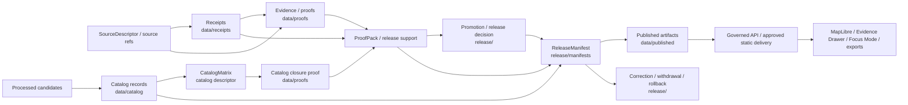

<!-- [KFM_META_BLOCK_V2]
doc_id: kfm://doc/adr/0011-receipts-vs-proofs-vs-manifests-vs-catalog-separation
title: "ADR-0011 — Receipts vs Proofs vs Manifests vs Catalog Separation"
type: adr
adr_id: ADR-0011
version: v1.2
status: proposed
owners:
  - "NEEDS VERIFICATION — architecture decision owner"
  - "NEEDS VERIFICATION — receipt and proof steward"
  - "NEEDS VERIFICATION — catalog steward"
  - "NEEDS VERIFICATION — release and rollback steward"
  - "NEEDS VERIFICATION — data lifecycle steward"
  - "NEEDS VERIFICATION — governed API and public-surface maintainer"
owner_status: "CODEOWNERS provides repository review routing, but accepted stewardship, required-review rules, decision quorum, and independent release approval were not verified"
reviewers_required:
  - Architecture steward
  - Docs steward
  - Data lifecycle steward
  - Receipt and proof steward
  - Catalog steward
  - Release and rollback steward
  - Contracts and schemas stewards
  - Policy and validation stewards
  - Governed API and public-surface maintainers
created: 2026-05-11
updated: 2026-07-23
policy_label: public
truth_posture: cite-or-abstain
responsibility_root: docs/
current_path: docs/adr/ADR-0011-receipts-vs-proofs-vs-manifests-vs-catalog-separation.md
supersedes: []
superseded_by: null
evidence_snapshot:
  repository: bartytime4life/Kansas-Frontier-Matrix
  base_ref: main
  base_commit: 1e1379bf37c447b4fdf8a34f584d939f47bc1f65
  target_prior_blob: 158ad6d31946d7d32537d5278ec6d2828ec880b3
  adr_index_blob: cf08fae322ac53426f7394d97897fdb942253049
  receipts_readme_blob: 15f2608cfe3c692da2fdb8082b6f9d90f2a8bb9d
  proofs_readme_blob: 603dd71c5e0a4bd82e0228848514fd62d39b23c0
  catalog_readme_blob: 9cf67c4ce5308b9088466b023a244107e3863a48
  published_readme_blob: 585abdf7953bc270a15bcf80b4dd8d6af93e70ac
  release_readme_blob: 0752610b1df6d11143158f6f162f65ecd650e6a6
  release_manifest_singular_readme_blob: 6014cfc0f8394a44167f4226975b74f94f3b2a03
  release_manifests_plural_readme_blob: c699a527ff11bebad6a874ed1a37aa3a8213b86c
  artifacts_readme_blob: 7b2acc0c296daadb430370cdc803b487933487ae
  drift_register_blob: 5c5078b93c467e66f4cc8b86a7a696dbce5ae7e0
  catalog_matrix_contract_blob: c67923beb505aa39e7c0c768c16e75a00826ff31
  catalog_matrix_schema_blob: 75a927376066226d8a0f89a630d7bb3693143c41
  release_manifest_contract_blob: 9ca1c9d4a5b247196aa84a31a158fe734c8a6720
  release_manifest_schema_blob: 727db0a781900aa3816dcdce723fe355fec2e786
  adr_0022_blob: b09c1d7aaa39f3030afdcec419c58236fd324f17
related:
  - docs/adr/README.md
  - docs/adr/INDEX.md
  - docs/adr/ADR-0001-schema-home--schemas-contracts-v1-is-canonical.md
  - docs/adr/ADR-0002-contracts-vs-schemas-split.md
  - docs/adr/ADR-0010-deny-by-default-for-dna-rare-species-archaeology-infrastructure.md
  - docs/adr/ADR-0015-data-published-_domain_-current-alias-is-governed-by-rollback_card.md
  - docs/adr/ADR-0018-promotion-gate-sequence.md
  - docs/adr/ADR-0022-catalog-matrix--stac-+-dcat-+-prov-must-agree.md
  - docs/adr/ADR-0023-geo-manifest-signs-every-pmtiles-cog-release.md
  - docs/adr/ADR-0024-steward-separation-of-duties-for-release.md
  - docs/adr/ADR-0025-public-client-never-reads-canonical-internal-stores.md
  - docs/doctrine/directory-rules.md
  - data/receipts/README.md
  - data/proofs/README.md
  - data/catalog/README.md
  - data/published/README.md
  - release/README.md
  - release/manifest/README.md
  - release/manifests/README.md
  - artifacts/README.md
  - docs/registers/DRIFT_REGISTER.md
  - contracts/data/catalog_matrix.md
  - schemas/contracts/v1/data/catalog_matrix.schema.json
  - contracts/release/release_manifest.md
  - schemas/contracts/v1/release/release_manifest.schema.json
tags: [kfm, adr, governance, receipts, proofs, catalogs, manifests, publication, release, lifecycle, trust-membrane, rollback, correction, catalog-matrix]
notes:
  - "v1.2 is a same-path repository-grounded modernization. It preserves status `proposed`; it does not accept ADR-0011, migrate trust objects, resolve release-state records, or publish anything."
  - "The canonical ADR index uniquely assigns ADR-0011 to this exact path."
  - "Current repository evidence confirms the five responsibility surfaces but not end-to-end release closure."
  - "The repository carries both `release/manifest/` and `release/manifests/`; this ADR proposes plural `release/manifests/` as the canonical ReleaseManifest collection and singular `release/manifest/` as compatibility after a reviewed migration."
  - "The v1.1 claim that CatalogMatrix is inherently proof-side conflicts with the current CatalogMatrix contract and ADR-0022. v1.2 separates the catalog descriptor from the proof of its validation and defers coordinated acceptance/migration to ADR-0022."
  - "The tracked `artifacts/release/` lane and generated `artifacts/perf/` trust-shaped staging remain open drift; this documentation change performs no migration."
[/KFM_META_BLOCK_V2] -->

<a id="top"></a>

# ADR-0011 — Receipts vs Proofs vs Manifests vs Catalog Separation

> **Proposed decision.** KFM preserves explicit authority boundaries between process receipts, evidence/proof support, catalog-stage records, release-governance manifests and decisions, and released public-safe artifacts. Each family may reference the others through stable identifiers and digests, but no family may silently substitute for another.

[](#status)
[](#current-repository-evidence)
[](#artifact-family-contract)
[](#artifact-family-contract)
[](#artifact-family-contract)
[](#release-manifest-boundary)
[](#current-enforcement-maturity)
[](#authority-and-publication-boundary)

> [!IMPORTANT]
> **Identity is confirmed; acceptance is not.** [`docs/adr/INDEX.md`](./INDEX.md) uniquely assigns `ADR-0011` to this exact file with source metadata and effective decision status `proposed`. Editing this file or its index row does not accept the decision.

> [!CAUTION]
> **File presence is not closure.** The repository contains receipt, proof, catalog, release, published, contract, schema, workflow, and validation surfaces. Those surfaces are mixed maturity. The accepted evaluator, complete object shapes, closure resolver, accountable review flow, release assembly, rollback execution, and public-operation evidence are not established end to end.

> [!WARNING]
> **A familiar filename does not grant authority.** A JSON file named `release_manifest.json` under `artifacts/`, a signed run receipt, a STAC Item, a proof-like workflow artifact, or bytes under `data/published/` do not become a KFM release merely because the names look trustworthy.

**Quick navigation:** [Status](#status) · [Evidence](#evidence-boundary) · [Context](#context) · [Decision](#decision) · [Families](#artifact-family-contract) · [Manifest boundary](#release-manifest-boundary) · [CatalogMatrix](#catalogmatrix-and-catalog-closure) · [Closure](#cross-family-references-and-closure) · [Current evidence](#current-repository-evidence) · [Maturity](#current-enforcement-maturity) · [Migration](#migration-and-compatibility) · [Consequences](#consequences) · [Alternatives](#alternatives-considered) · [Acceptance](#acceptance-gates) · [Risks](#risk-ledger) · [Rollback](#rollback-and-supersession) · [Verification](#verification-checklist) · [References](#references)

---

<a id="status"></a>

## Status

| Field | Current value |
|---|---|
| **ADR ID** | `ADR-0011` — unique and confirmed in [`INDEX.md`](./INDEX.md) |
| **Tracked path** | `docs/adr/ADR-0011-receipts-vs-proofs-vs-manifests-vs-catalog-separation.md` |
| **Source metadata** | `proposed` |
| **Effective decision status** | `proposed` |
| **Decision class** | Cross-root authority boundary for receipts, proofs, catalogs, release manifests/decisions, and published artifacts |
| **Current repository posture** | Responsibility roots present; semantics documented; machine shapes thin or mixed; enforcement and release closure held |
| **Implementation effect of this revision** | Documentation only |
| **Publication effect** | None |
| **Supersedes / superseded by** | None / none |

### Decision scope

This ADR decides the **meaning and responsibility boundary** of five connected instance families:

1. process receipts;
2. evidence and proof support;
3. catalog-stage discovery and interchange records;
4. release-governance manifests and decisions;
5. released public-safe artifacts.

It also proposes a canonical collection lane for `ReleaseManifest` instances and defines how catalog closure should avoid collapsing a `CatalogMatrix` descriptor into its validation proof.

This ADR does **not** decide field-level JSON shapes, accept a release, activate a workflow, move existing files, or grant public access.

### Decision acceptance versus enforcement graduation

Two states remain separate:

1. **ADR acceptance** would approve the authority boundary and target migration posture.
2. **Enforcement graduation** requires contracts, schemas, fixtures, validators, CI, closure resolution, accountable review, release assembly, correction, rollback, and observed behavior.

An accepted ADR without enforcement is doctrine, not proof of runtime or release capability.

[Back to top](#top)

---

<a id="evidence-boundary"></a>

## Evidence Boundary

This revision uses current repository bytes at `main@1e1379bf37c447b4fdf8a34f584d939f47bc1f65` plus KFM doctrine. Current repository evidence outranks older path proposals for present implementation. Doctrine still governs responsibility boundaries.

| Evidence level | What is established | What is not established |
|---|---|---|
| **Doctrine and ADR inventory** | Lifecycle law, trust membrane, distinct authority roots, ADR identity | Acceptance or enforcement |
| **Root and lane documentation** | Receipt, proof, catalog, published, release, and artifacts boundaries are described | Complete payload inventories or correct runtime behavior |
| **Contracts and schemas** | `CatalogMatrix` and `ReleaseManifest` semantic contracts and paired schemas exist | Production-grade shapes or complete validators |
| **Readiness workflows and tests** | Selected structural/shape/readiness checks exist | Operational release assembly, approval, publication, or rollback |
| **Release/public operation** | No admissible evidence reviewed here establishes end-to-end publication | Production state, hosting, branch rules, independent approval, or runtime parity |

### Truth labels

| Label | Use in this ADR |
|---|---|
| **CONFIRMED** | Verified from current repository bytes or supplied governing doctrine. |
| **PROPOSED** | Decision, migration, field, path role, or implementation step not yet accepted and verified. |
| **UNKNOWN** | No sufficient evidence establishes the state. |
| **NEEDS VERIFICATION** | A concrete repository, workflow, review, or operational check remains. |
| **CONFLICTED** | Current repository documents or proposed ADRs disagree and require coordinated resolution. |

### Directory Rules basis

`docs/adr/` owns human architecture decisions. `data/receipts/`, `data/proofs/`, `data/catalog/`, and `data/published/` are distinct data responsibility/lifecycle lanes. `release/` owns release-governance records. `artifacts/` is compatibility-only generated output and must not become a trust-object authority.

This revision creates no new root and performs no move. Any later move follows Directory Rules migration discipline, preserves history and digests, and records rollback.

[Back to top](#top)

---

<a id="context"></a>

## Context

KFM's durable public unit is the **inspectable claim**. A public claim must remain reconstructable to source role, evidence, spatial and temporal scope, policy posture, review state, release state, correction lineage, and rollback support.

That reconstruction fails when distinct artifacts collapse into one generic “manifest” or “audit” folder.

```text
receipt != proof != catalog != release decision != published artifact
```

| Family | Core question |
|---|---|
| **Receipt** | What process ran, against which inputs and rules, with what result? |
| **Proof support** | What admissible evidence, validation, review, and integrity support the claim or release candidate? |
| **Catalog** | How can governed records and assets be discovered and interchanged? |
| **Release governance** | Which candidate or artifact set was reviewed, decided, manifested, corrected, withdrawn, or made rollback-ready? |
| **Published artifacts** | Which public-safe bytes or payloads may governed consumers use? |

### Failure modes caused by collapse

- A valid run is mistaken for a true claim.
- A catalog entry is treated as publication approval.
- A proof pack is treated as a release decision.
- A release manifest is stored beside payload bytes and silently mutated.
- Published carriers become evidence authority.
- Generated CI output under `artifacts/` is mistaken for a receipt, proof, or release record.
- A single `CatalogMatrix` object is expected to be both the catalog descriptor and the proof that it is correct.

### Lifecycle relationship

```text
RAW -> WORK / QUARANTINE -> PROCESSED -> CATALOG / TRIPLET -> PUBLISHED
```

Receipts and proofs support transitions and review; catalog is a lifecycle projection; release records govern publication; published artifacts are downstream carriers. The families interact, but they are not interchangeable lifecycle phases.

[Back to top](#top)

---

<a id="decision"></a>

## Decision

**Once accepted, KFM adopts the following authority contract.**

1. `data/receipts/` is the canonical instance root for process-memory receipts.
2. `data/proofs/` is the canonical instance root for evidence, validation, review, citation, integrity, and proof-pack support.
3. `data/catalog/` is the canonical lifecycle root for catalog-stage records and indexes, including STAC, DCAT, PROV, domain catalog projections, and catalog relationship descriptors.
4. `release/` is the canonical root for release-governance records.
5. `release/manifests/` is the target canonical **collection** lane for immutable `ReleaseManifest` records.
6. `release/manifest/` becomes a read-only compatibility/documentation lane after an inventoried, reviewed migration; it must not remain a second writable manifest authority.
7. `data/published/` is the canonical lifecycle root for release-approved, public-safe delivery artifacts and immediate runtime sidecars.
8. `artifacts/` remains a non-authoritative generated-output compatibility root. Trust-shaped outputs there are staging only and must graduate to a canonical family through governed transition.
9. Cross-family references use stable identifiers, immutable refs where practical, digests, and explicit release/correction/rollback lineage.
10. Promotion is a governed state transition, never a file copy, path rename, workflow success, pull request, merge, or manifest filename.

### What this decision does not authorize

- accepting this or any related ADR;
- deleting or moving `release/manifest/`;
- moving `artifacts/release/`;
- treating generated `artifacts/perf/` files as canonical;
- changing `CatalogMatrix` schema or instance placement without coordinated ADR-0022 work;
- activating a release evaluator or bundle;
- publishing any artifact;
- exposing receipt, proof, catalog, candidate, or release internals directly to public clients.

### Outcome vocabularies remain separate

| Axis | Examples | Rule |
|---|---|---|
| Runtime/public envelope | `ANSWER`, `ABSTAIN`, `DENY`, `ERROR` | Closed outward response vocabulary where the applicable contract requires it. |
| Release record state | candidate, held, approved, released, corrected, withdrawn, superseded | Owned by release contracts and policy; not collapsed into runtime outcomes. |
| Validator result | pass, fail, warning, error | Validation state, not release approval. |
| Truth label | CONFIRMED, PROPOSED, UNKNOWN, NEEDS VERIFICATION | Evidence posture, not an operation result. |

[Back to top](#top)

---

<a id="artifact-family-contract"></a>

## Artifact Family Contract

### Receipts — process memory

**Canonical instance root:** `data/receipts/`

Receipts record governed execution. Representative families include `RunReceipt`, intake, transform, validation, redaction, aggregation, AI, telemetry, migration, correction-support, rollback-support, and release-support receipts.

Receipts may bind:

- input and output refs/digests;
- runner/tool identity and version;
- contract, schema, policy, and validator refs;
- finite outcomes, reasons, and obligations;
- evidence and release-candidate refs;
- timestamps and actor identity;
- signatures or attestation sidecars.

A receipt does **not** prove factual truth, rights clearance, sensitivity safety, policy permission, review approval, catalog closure, release approval, or publication.

### Proofs — support, not release authority

**Canonical instance root:** `data/proofs/`

Proof support may include:

- EvidenceBundle and EvidenceRef closure;
- citation validation;
- validation reports;
- review support;
- proof packs;
- integrity support;
- domain-specific proof lanes;
- catalog-closure validation results.

A proof may cite receipts, catalogs, policies, reviews, and release candidates. It does not approve release or become public truth by placement.

### Catalog — discovery and interchange

**Canonical lifecycle root:** `data/catalog/`

Catalog-stage records may include:

- STAC Collections and Items;
- DCAT Datasets and Distributions;
- PROV Activities, Agents, and Entities;
- domain catalog records;
- indexes and release-linked public catalog subsets;
- `CatalogMatrix` relationship descriptors when ADR-0022 and the contract are reconciled.

Catalogs discover and describe. They do not replace source authority, EvidenceBundle support, policy, review, release decisions, or published artifacts.

### Release governance — decisions and manifests

**Canonical root:** `release/`

Release governance includes:

- candidates;
- accountable reviews;
- promotion and release decisions;
- `ReleaseManifest` records;
- correction, withdrawal, and supersession records;
- rollback cards and rollback review;
- signatures and signoff packets;
- release-facing changelog entries.

Release governance points to receipts, proofs, catalog records, and published artifacts. It must not duplicate them.

### Published artifacts — public-safe carriers

**Canonical lifecycle root:** `data/published/`

Published lanes may hold release-approved:

- layers, PMTiles, COGs, GeoParquet, reports, stories, and API payloads;
- immediate artifact manifests and public indexes;
- field allowlists, caveat summaries, citations, evidence refs, and digests;
- generated pointers such as `latest.json` only when derived from governed release state.

A `LayerManifest`, report manifest, story manifest, or format sidecar under `data/published/` describes a released carrier. It is not a `ReleaseManifest`.

### Compatibility output — never trust authority

**Compatibility root:** `artifacts/`

Only derived, regenerable build output, documentation previews, QA reports, and temporary output belong here. A trust-shaped file under `artifacts/` remains non-authoritative until a governed process emits the canonical object to its owning root.

[Back to top](#top)

---

<a id="release-manifest-boundary"></a>

## ReleaseManifest Boundary

### Target canonical collection lane

This ADR proposes:

```text
release/manifests/<release-id-or-scope>/
```

as the canonical collection lane for immutable `ReleaseManifest` records and release-manifest indexes.

The repository currently carries both:

```text
release/manifest/
release/manifests/
```

Both READMEs describe themselves as draft and explicitly leave canonicality unresolved. Two writable lanes for one object family create ambiguous release authority.

### Proposed migration posture

| Path | Post-acceptance role |
|---|---|
| `release/manifests/` | Canonical collection of immutable release-manifest records and indexes |
| `release/manifest/` | Read-only compatibility/documentation pointer during one reviewed migration window, then retirement or narrow workflow-doc role |
| `data/published/**/manifest*.json` | Artifact-local `LayerManifest`, report/story manifest, or public sidecar only; never `ReleaseManifest` |
| `artifacts/release/**` | Noncanonical staging/drift; no release authority |
| `data/manifests/**` | No new release-manifest authority; inventory and classify before any move |

### ReleaseManifest versus neighboring objects

| Object | Owns | Does not own |
|---|---|---|
| `ReleaseManifest` | Immutable released set, artifact refs/digests, evidence/policy/review/proof refs, prior release, correction and rollback refs | Payload bytes, proof contents, receipt contents, policy rules |
| `LayerManifest` | Runtime/layer descriptor for one released carrier | Release approval |
| `MapReleaseManifest` | Map-specific release information when embedded in or referenced by the canonical ReleaseManifest | Parallel map release authority |
| `MerkleManifest` | Integrity structure over a file set | Release decision; its authoritative relation must be referenced by ReleaseManifest and proof support |
| `PromotionDecision` | Whether a governed transition may proceed | Released content set |
| `RollbackCard` | Which prior state to restore and how | Release approval for a new state |

### Schema maturity

The current paired `ReleaseManifest` schema is `PROPOSED`, requires only `id`, and permits additional properties. The semantic contract is much richer than the schema. A schema-valid instance may therefore remain release-incomplete.

Until schema, fixtures, validator, policy, review, and release assembly are hardened, the repository must not equate “valid JSON” with “valid release.”

[Back to top](#top)

---

<a id="catalogmatrix-and-catalog-closure"></a>

## CatalogMatrix and Catalog Closure

### Confirmed conflict

The v1.1 ADR assigned `CatalogMatrix` to `data/proofs/` as a proof-side object.

Current repository evidence now shows:

- `contracts/data/catalog_matrix.md` defines `CatalogMatrix` as a catalog/evidence relationship descriptor and explicitly says it is **not proof closure by itself**;
- its paired schema is a thin `PROPOSED` placeholder;
- the declared validator path is not established;
- proposed ADR-0022 places `CatalogMatrix` under `data/catalog/matrix/` and treats it as the explicit crosswalk for STAC, DCAT, and PROV agreement;
- ADR-0022 itself still carries older unmounted-repository assumptions and is not accepted.

The placement and semantics are therefore **CONFLICTED**.

### Proposed reconciliation

ADR-0011 proposes a clean split between the descriptor and the proof that the descriptor passed validation:

| Object | Proposed role | Proposed instance home | Status |
|---|---|---|---|
| `CatalogMatrix` | Catalog-stage relationship/crosswalk descriptor joining STAC, DCAT, PROV, artifact, release, and evidence refs | `data/catalog/matrix/<scope>/` | PROPOSED; coordinate with ADR-0022 |
| `CatalogMatrixValidationReport` or `CatalogClosureProof` | Proof that required identifiers, digests, release refs, evidence refs, and provenance links agree | `data/proofs/catalog_closure/<scope>/` | PROPOSED name/home; requires contract/schema/fixtures/validator |
| `CatalogBuildReceipt` / emitter receipt | Process memory showing how catalog records or matrix were generated | `data/receipts/<catalog-family>/` | PROPOSED subtype/layout |
| `ReleaseManifest` | Release binding that references catalog records and the closure proof | `release/manifests/` | PROPOSED canonical collection |

This split preserves the operating law:

```text
catalog descriptor != proof of catalog agreement
```

### Coordination rule

ADR-0011 must not be accepted with an unreviewed automatic move of `CatalogMatrix`. Acceptance requires one coordinated review packet covering:

- ADR-0011;
- ADR-0022;
- `contracts/data/catalog_matrix.md`;
- `schemas/contracts/v1/data/catalog_matrix.schema.json`;
- proposed validator and fixture homes;
- data/catalog and data/proofs README updates;
- migration/rollback for any existing instances.

If maintainers choose a different placement, the distinction between descriptor and proof result must still remain explicit.

[Back to top](#top)

---

<a id="cross-family-references-and-closure"></a>

## Cross-Family References and Closure

### Reference graph



### Minimum closure rules

Once implemented, validators and release tooling must enforce:

1. Every released artifact is named by exactly one active release-manifest lineage.
2. Every release-visible evidence ref resolves to admissible EvidenceBundle support.
3. Every ReleaseManifest references the applicable promotion/release decision.
4. Every proof pack references relevant receipts without treating receipt presence as proof sufficiency.
5. Every public catalog record is release-linked and policy-safe.
6. STAC, DCAT, PROV, artifact identity, digest, and release refs agree where ADR-0022 requires them.
7. Catalog closure produces a proof result distinct from the matrix descriptor.
8. Every correction, withdrawal, supersession, or rollback issues a new governed record rather than mutating history silently.
9. Public clients do not read `data/receipts/`, `data/proofs/`, unreleased `data/catalog/`, release candidates, or internal stores directly.
10. `artifacts/` outputs never satisfy canonical receipt, proof, catalog, release, or publication gates by filename alone.

### Negative outcomes

| Condition | Required posture |
|---|---|
| Evidence or citation support unresolved | `ABSTAIN` or held release candidate |
| Rights, sensitivity, review, or policy prohibits exposure | `DENY` / restrict / hold according to the applicable contract |
| Resolver, validator, schema, policy, or integrity machinery fails | `ERROR`; fail closed |
| Artifact exists but no active release lineage names it | Deny publication / orphan hold |
| Catalog records disagree | Deny promotion until corrected |
| Obligation cannot be enforced downstream | Deny or hold; never silent answer/release |

[Back to top](#top)

---

<a id="current-repository-evidence"></a>

## Current Repository Evidence

| Surface | Confirmed current evidence | Safe conclusion |
|---|---|---|
| ADR identity | `INDEX.md` uniquely assigns ADR-0011 to this path with effective status `proposed` | Number/path conflict is resolved; acceptance is not |
| Receipt root | `data/receipts/README.md` documents process-memory semantics and observed child lanes; generated lane reports 59 direct-child JSON receipts at its recorded snapshot | Receipt activity exists, but payload validity and release integration are not implied |
| Proof root | `data/proofs/README.md` confirms evidence, citation, validation, proof-pack, review, and selected domain README lanes | Proof topology is present; emitted proof completeness and enforcement remain unproved |
| Catalog root | `data/catalog/README.md` exists as draft catalog-stage guide; recommended layout and concrete inventories remain partly unverified | Catalog responsibility is clear; operational catalog closure is not |
| Published root | `data/published/README.md` confirms child README lanes and public-safe carrier boundary | Child lane presence does not prove released payloads or manifest approval |
| Release root | `release/README.md` is repository-grounded and records mixed lanes plus explicit workflow holds | Release governance surfaces exist; operational release capability is held |
| Manifest lanes | Both `release/manifest/README.md` and `release/manifests/README.md` exist and declare canonicality unresolved | Manifest instance authority is conflicted |
| ReleaseManifest contract/schema | Semantic contract exists; schema requires only `id` and allows extra properties | Shape is too permissive to prove release completeness |
| CatalogMatrix contract/schema | Contract exists; schema requires only `id`; validator path is not established | Object meaning and machine enforcement are incomplete |
| ADR-0022 | Proposed “must agree” decision exists and proposes `data/catalog/matrix/` | Dedicated catalog decision exists but is not repository-grounded or accepted |
| Artifacts root | `artifacts/README.md` confirms 44 tracked files at its continuity snapshot, including nonconforming `artifacts/release/`; generated `artifacts/perf/` uses trust-shaped staging | Compatibility drift is real and open |
| Drift register | Explicit July 22 entry records `artifacts/release/` and `artifacts/perf/` as open `BLOCKED_ADR` authority drift | Migration requires separate reviewed action |
| Public trust path | Root doctrine and application boundaries prohibit direct canonical/internal-store reads | Structural boundary exists; complete runtime enforcement is separate |

### Evidence limitations

This inspection did not establish:

- complete recursive payload inventories in every lane;
- validity of every generated receipt;
- accepted receipt/proof/catalog/release contracts;
- operational catalog matrix validator;
- release-manifest validator;
- accountable review records or independent release approval;
- release assembly, publication, withdrawal, or rollback execution;
- production hosting, runtime parity, or branch-rules enforcement.

[Back to top](#top)

---

<a id="current-enforcement-maturity"></a>

## Current Enforcement Maturity

| Level | Requirement | Current posture |
|---|---|---|
| **M0 — Names and roots** | Responsibility roots and object names exist | CONFIRMED |
| **M1 — Boundary documentation** | Root/lane READMEs distinguish authority families | SUBSTANTIAL / mixed freshness |
| **M2 — Semantic contracts and shapes** | Complete contracts and nonpermissive schemas | PARTIAL; key schemas are thin |
| **M3 — Representative fixtures and validators** | Valid/invalid/negative cases and deterministic validators | PARTIAL / NEEDS VERIFICATION |
| **M4 — Cross-family closure** | Resolvers bind receipts, proofs, catalogs, decisions, manifests, and artifacts | NOT ESTABLISHED |
| **M5 — Governed review and release** | Accountable review, promotion, manifest assembly, signatures, correction, rollback | HELD / NOT ESTABLISHED |
| **M6 — Public/runtime enforcement** | Governed consumers reject unreleased, orphaned, stale, or unclosed artifacts | UNKNOWN / not established end to end |
| **M7 — Drift monitoring and replay** | Periodic placement scan, replay verification, migration/rollback drills | PARTIAL structural signals; operational maturity unproved |

A repository with M0–M2 surfaces is not an M5 release system.

### Enforcement graduation sequence

1. Accept or explicitly hold ADR-0011 after manifest and CatalogMatrix coordination.
2. Resolve `release/manifest/` versus `release/manifests/`.
3. Harden `ReleaseManifest` and `CatalogMatrix` contracts/schemas.
4. Define the catalog descriptor versus closure-proof object split.
5. Add synthetic valid/invalid fixtures using no protected or private data.
6. Implement placement and content-aware family validators.
7. Implement catalog agreement and release-manifest closure resolvers.
8. Wire deterministic CI checks with read-only/no-publication posture.
9. Prove one no-network candidate through receipt → proof → catalog → decision → manifest → published carrier.
10. Exercise correction, withdrawal, supersession, cache invalidation, and rollback.
11. Add governed consumer tests.
12. Record observed required-check and review behavior without treating workflow green as release approval.

[Back to top](#top)

---

<a id="migration-and-compatibility"></a>

## Migration and Compatibility

This documentation revision performs no move.

### Migration prerequisites

Before migrating any trust object:

- inventory exact files, object types, digests, references, consumers, releases, and sensitivity;
- classify the current path as canonical, compatibility, staging, drift, or generated;
- identify the accepted target contract and schema;
- record affected release/correction/rollback lineage;
- establish a reversible alias or resolver strategy where consumers depend on old paths;
- test the move on synthetic or public-safe fixtures;
- obtain the required ADR and steward reviews.

### Proposed migration waves

| Wave | Scope | Required result |
|---|---|---|
| **1 — Inventory** | `release/manifest/`, `release/manifests/`, `artifacts/release/`, `artifacts/perf/`, any `data/manifests/`, CatalogMatrix instances | Immutable inventory and classification; no moves |
| **2 — Contract alignment** | ReleaseManifest, CatalogMatrix, catalog closure proof, receipt/proof references | Coordinated contracts/schemas and migration map |
| **3 — Manifest convergence** | Singular/plural release manifest lanes | Canonical plural collection; compatibility pointer; inbound links updated |
| **4 — Catalog closure split** | CatalogMatrix descriptor and closure proof | Distinct homes and validators; ADR-0022 reconciled |
| **5 — Artifacts drift** | Tracked `artifacts/release/` and generated `artifacts/perf/` | Reviewed graduation or retirement; no trust-shaped ambiguity |
| **6 — Enforcement** | Placement, closure, orphan, public-boundary checks | Deterministic CI and release dry-run |
| **7 — Rollback drill** | Prior release and path aliases | Demonstrated restoration, correction, and cache invalidation |

### Migration receipt minimum

Every moved trust object should record:

- old and new path;
- object family and contract version;
- old and new digest;
- migration reason and governing ADR;
- references changed;
- affected release/correction/rollback IDs;
- actor/tool and timestamp;
- validation result;
- compatibility expiry;
- rollback instruction.

A migration receipt does not approve the migration by itself.

### Compatibility rule

A compatibility alias is read-only, time-bounded, and points to one canonical target. It cannot accept new writes or evolve independently.

[Back to top](#top)

---

<a id="consequences"></a>

## Consequences

### Positive

- **Authority is inspectable.** Path and object family tell reviewers what a record can and cannot prove.
- **Catalog and evidence stay distinct.** Discovery does not masquerade as proof.
- **Release is reversible.** Manifests, corrections, withdrawals, and rollback remain governance records rather than payload folders.
- **Public carriers stay derived.** Maps, tiles, reports, stories, and API snapshots do not become sovereign truth.
- **Drift becomes testable.** Duplicate manifest lanes and trust-shaped artifacts can be inventoried and denied.
- **Run browsing remains possible.** Tools can join families by stable IDs and digests without co-locating authority.
- **CatalogMatrix semantics become clearer.** The descriptor and its validation proof no longer need to be one overloaded object.

### Costs and tradeoffs

- More roots and cross-references than a single run folder.
- Migration burden for singular/plural manifest lanes and artifacts drift.
- New contracts and validators for catalog closure proof.
- Stronger schemas may break permissive placeholder fixtures.
- Operators need a run/release walker to reconstruct one end-to-end chain.
- Acceptance requires coordinated ADR and contract work, not an isolated documentation merge.

### Non-effects

This ADR does not make existing generated receipts valid, release manifests complete, CatalogMatrix authoritative, artifacts conformant, workflows required, or public artifacts released.

[Back to top](#top)

---

<a id="alternatives-considered"></a>

## Alternatives Considered

| Alternative | Disposition |
|---|---|
| Put all run outputs under `data/runs/<run-id>/` | Rejected as authority collapse; may be implemented as a generated index or audit view |
| Keep both `release/manifest/` and `release/manifests/` writable | Rejected; creates competing ReleaseManifest authority |
| Put ReleaseManifest beside every published artifact | Rejected; artifact-local sidecars may reference the canonical release manifest but must not duplicate release authority |
| Treat any signed receipt as proof | Rejected; signing proves integrity/provenance of the receipt, not truth or release admissibility |
| Treat CatalogMatrix as proof by definition | Rejected in v1.2; descriptor and proof of agreement are distinct |
| Put CatalogMatrix only in `data/proofs/` | Rejected as inconsistent with current semantic contract and ADR-0022 direction |
| Put catalog closure proof only in `data/catalog/` | Rejected; validation proof is a different authority family |
| Keep `artifacts/release/` as canonical | Rejected; compatibility output cannot own release decisions |
| Use `data/manifests/` as a second release root | Rejected; classify existing contents, then route by object family |
| Treat published bytes as evidence | Rejected; published artifacts are downstream carriers |
| Embed all receipts/proofs/catalog records inside ReleaseManifest | Rejected; manifest references authority families rather than replacing them |

[Back to top](#top)

---

<a id="acceptance-gates"></a>

## Acceptance Gates

ADR-0011 may move from `proposed` only when reviewers close the decision package below.

- [ ] Owner and reviewer roles are verified.
- [ ] ADR index validation passes and the reviewed status transition is synchronized.
- [ ] Directory Rules duplicate identity is acknowledged or resolved without changing this ADR's responsibility-root basis.
- [ ] `release/manifest/` and `release/manifests/` are fully inventoried.
- [ ] The plural canonical collection decision and singular compatibility/retirement plan are approved.
- [ ] ADR-0022, CatalogMatrix contract, schema, and placement are reconciled.
- [ ] The catalog descriptor versus catalog closure proof split is accepted or replaced by an equally explicit boundary.
- [ ] `ReleaseManifest` semantic contract and schema have a reviewed production profile or an explicit hold profile.
- [ ] Valid, invalid, stale, orphaned, conflicted, corrected, withdrawn, and rollback fixtures exist.
- [ ] Placement validators distinguish object family by content/contract, not filename alone.
- [ ] Closure validators prove evidence, policy, catalog, release, digest, correction, and rollback references.
- [ ] Public-boundary tests deny direct receipt, proof, candidate catalog, release-internal, and canonical-store reads.
- [ ] `artifacts/release/` and `artifacts/perf/` have a separately approved migration or bounded staging decision.
- [ ] One no-network, public-safe synthetic release slice demonstrates full traceability.
- [ ] Correction, withdrawal, supersession, and rollback are exercised.
- [ ] Remaining unknowns are recorded in the appropriate verification/drift registers.

Acceptance of the decision does not require production deployment, but it must not falsely claim that unimplemented enforcement already exists.

[Back to top](#top)

---

<a id="risk-ledger"></a>

## Risk Ledger

| Risk | Current posture | Required mitigation |
|---|---|---|
| Receipt mistaken for proof | Material | Schema/contract labels, placement validator, UI wording |
| Proof mistaken for release approval | Material | Release decision reference required |
| Catalog item exposed before release | Material | Release-state gate in API/static resolver |
| Duplicate manifest lanes diverge | Confirmed structural conflict | One canonical collection and migration |
| CatalogMatrix remains overloaded | Confirmed documentation conflict | Descriptor/proof split and ADR-0022 coordination |
| Thin ReleaseManifest schema validates incomplete records | Confirmed | Harden schema and semantic validator |
| Trust-shaped output under `artifacts/` is mistaken for canon | Confirmed drift | Staging labels, content-aware validator, reviewed migration |
| Orphan published artifacts | Unknown | Orphan detector and release-manifest closure |
| Compatibility aliases become permanent | Likely without expiry | Time-bounded alias metadata and drift monitoring |
| Public clients read proof/catalog internals | Structurally denied, runtime completeness unknown | Governed API and network tests |
| Migration breaks immutable refs or digests | Material | Migration receipts, resolver aliases, rollback drill |
| Review and author roles collapse | Needs verification | Separation-of-duties policy and accountable ReviewRecord |
| Workflow green is interpreted as publication | Material | Explicit readiness semantics and release record requirement |

[Back to top](#top)

---

<a id="rollback-and-supersession"></a>

## Rollback and Supersession

### Documentation rollback

Before merge, abandon the branch and close the pull request. After merge, revert the documentation commit. Restore prior target blob:

```text
158ad6d31946d7d32537d5278ec6d2828ec880b3
```

This documentation rollback does not move trust objects or change release state.

### Decision supersession

If a successor decision changes the boundary:

1. create the successor ADR as `proposed`;
2. review reciprocal supersession links;
3. update this ADR to `superseded`;
4. update the ADR index in the same reviewed change;
5. preserve this file and its history;
6. define migration and rollback for every affected family and release.

### Implementation rollback

A future migration rollback must restore:

- prior canonical path or resolver alias;
- original object bytes/digest;
- prior release/correction/rollback references;
- public cache and index state;
- catalog and proof links;
- compatibility pointer expiry;
- migration failure receipt.

No rollback may silently delete historical release, correction, or decision records.

[Back to top](#top)

---

<a id="verification-checklist"></a>

## Verification Checklist

### Completed for v1.2 authoring

- [x] Read the complete prior ADR.
- [x] Confirm ADR ID, index row, exact path, and status.
- [x] Inspect receipt, proof, catalog, published, release, and artifacts root READMEs.
- [x] Inspect singular and plural manifest lane READMEs.
- [x] Inspect ReleaseManifest contract and schema.
- [x] Inspect CatalogMatrix contract and schema.
- [x] Inspect ADR-0022 catalog-matrix decision.
- [x] Inspect drift register entry for artifacts authority drift.
- [x] Search open PRs and branches for overlapping ADR-0011 work.
- [x] Preserve `proposed` status and one-file scope.

### Still open after this documentation update

- [ ] Complete recursive inventory of all trust-object instances.
- [ ] Verify actual validator and fixture inventories.
- [ ] Inspect every release/correction/rollback lane conflict.
- [ ] Verify workflow runs and branch/ruleset requirements for this revision.
- [ ] Verify accountable review and independent approval.
- [ ] Verify production/runtime/public delivery state.
- [ ] Coordinate ADR-0022 and CatalogMatrix semantic changes.
- [ ] Approve or reject the singular/plural manifest migration.
- [ ] Resolve artifacts drift through a separate reviewed change.
- [ ] Execute no-network end-to-end release and rollback proof.

### Repository-native checks for this file

```bash
python tools/validators/validate_adr_index.py
python -m pytest tests/validators/test_validate_adr_index.py -q --strict-config --strict-markers
```

Additional documentation, link, and repository aggregate checks should use the current repository-native commands discovered by CI; this ADR does not invent new commands.

[Back to top](#top)

---

<a id="references"></a>

## References

### Repository evidence

- [`docs/adr/INDEX.md`](./INDEX.md)
- [`docs/doctrine/directory-rules.md`](../doctrine/directory-rules.md)
- [`data/receipts/README.md`](../../data/receipts/README.md)
- [`data/proofs/README.md`](../../data/proofs/README.md)
- [`data/catalog/README.md`](../../data/catalog/README.md)
- [`data/published/README.md`](../../data/published/README.md)
- [`release/README.md`](../../release/README.md)
- [`release/manifest/README.md`](../../release/manifest/README.md)
- [`release/manifests/README.md`](../../release/manifests/README.md)
- [`artifacts/README.md`](../../artifacts/README.md)
- [`docs/registers/DRIFT_REGISTER.md`](../registers/DRIFT_REGISTER.md)
- [`contracts/data/catalog_matrix.md`](../../contracts/data/catalog_matrix.md)
- [`schemas/contracts/v1/data/catalog_matrix.schema.json`](../../schemas/contracts/v1/data/catalog_matrix.schema.json)
- [`contracts/release/release_manifest.md`](../../contracts/release/release_manifest.md)
- [`schemas/contracts/v1/release/release_manifest.schema.json`](../../schemas/contracts/v1/release/release_manifest.schema.json)
- [`ADR-0022 — Catalog Matrix`](./ADR-0022-catalog-matrix--stac-+-dcat-+-prov-must-agree.md)

### Related ADRs

- [`ADR-0001 — Schema Home`](./ADR-0001-schema-home--schemas-contracts-v1-is-canonical.md)
- [`ADR-0002 — Contracts vs Schemas Split`](./ADR-0002-contracts-vs-schemas-split.md)
- [`ADR-0010 — Sensitive Default Denial`](./ADR-0010-deny-by-default-for-dna-rare-species-archaeology-infrastructure.md)
- [`ADR-0015 — Published Current Alias`](./ADR-0015-data-published-_domain_-current-alias-is-governed-by-rollback_card.md)
- [`ADR-0018 — Promotion Gate Sequence`](./ADR-0018-promotion-gate-sequence.md)
- [`ADR-0023 — Geo Manifest Signing`](./ADR-0023-geo-manifest-signs-every-pmtiles-cog-release.md)
- [`ADR-0024 — Release Separation of Duties`](./ADR-0024-steward-separation-of-duties-for-release.md)
- [`ADR-0025 — Public Client Store Boundary`](./ADR-0025-public-client-never-reads-canonical-internal-stores.md)

### Supplied doctrine and planning lineage

- `Directory Rules.pdf`
- `Kansas Frontier Matrix Definitive Greenfield Building Plan v1.1`
- `Kansas Frontier Matrix Pipeline Living Implementation Manual v0.3`
- `KFM MapLibre Operating Architecture, Governed UI, and AI Interaction Manual`
- `KFM Unified Doctrine Synthesis`
- `Kansas Frontier Matrix — AI Build Operating Contract`
- domain architecture reports that preserve receipt/proof/catalog/release separation

These supplied materials support doctrine and lineage. Current repository bytes determine present implementation maturity.

[Back to top](#top)

---

## Authority and Publication Boundary

This ADR is a proposed architecture decision. It is not:

- a receipt;
- a proof;
- a catalog record;
- a ReleaseManifest;
- a PromotionDecision;
- a ReviewRecord;
- a migration approval;
- a release;
- a publication;
- a rollback execution.

No generated text, badge, diagram, branch, commit, pull request, merge, or workflow result may be used as a substitute for those governed objects.

---

## No-Loss and Change Ledger

| Prior v1.1 element | v1.2 disposition |
|---|---|
| Four-way separation law | Preserved and expanded to make published artifacts explicit |
| Receipt, proof, catalog, release meanings | Preserved and repository-grounded |
| `release/manifests/` preference | Preserved as proposed canonical collection, now reconciled against the live singular/plural conflict |
| `data/manifests/` prohibition | Narrowed: no new release-manifest authority; existing contents require classification before migration |
| LayerManifest distinction | Preserved |
| CatalogMatrix proof-side placement | Corrected: descriptor and validation proof are separate; coordinate with ADR-0022 |
| Cross-family closure rules | Preserved and expanded |
| Validator and CI proposals | Replaced with maturity/acceptance requirements; exact new paths remain proposed |
| Migration table | Rebuilt around current conflicts and staged waves |
| Consequences and alternatives | Preserved and modernized |
| Rollback | Preserved with concrete prior blob |
| “Repo unmounted” claims | Replaced with commit-pinned repository evidence |
| Stale ADR links | Replaced with current indexed ADR paths |
| Decision status | Unchanged: `proposed` |

---

## Change Log

| Version | Date | Change |
|---|---|---|
| `v1.2` | 2026-07-23 | Same-path repository-grounded modernization: confirmed ADR identity; replaced unmounted-repo assumptions; separated five authority families; proposed plural manifest collection and singular compatibility migration; documented thin ReleaseManifest schema and release holds; corrected CatalogMatrix overloading through descriptor/proof split coordinated with ADR-0022; recorded artifacts drift; added maturity, migration, acceptance, risk, rollback, and verification controls; preserved `proposed` status. |
| `v1.1` | 2026-05-15 | Expanded the receipt/proof/catalog/release separation proposal, canonical-home table, diagram, object inventories, closure rules, validator proposals, migration plan, consequences, rollback, and then-unverified repository questions. |
| `v1` | 2026-05-11 | Initial proposal for receipt, proof, catalog, manifest, and publication separation. |

---

**Last updated:** 2026-07-23 · **Decision status:** `proposed` · **Current enforcement:** partial roots and shapes / release closure held · **Path:** `docs/adr/ADR-0011-receipts-vs-proofs-vs-manifests-vs-catalog-separation.md` · [Back to top](#top)
