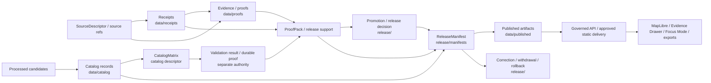

<!-- [KFM_META_BLOCK_V2]
doc_id: kfm://doc/adr/0011-receipts-vs-proofs-vs-manifests-vs-catalog-separation
title: "ADR-0011 — Receipts vs Proofs vs Manifests vs Catalog Separation"
type: adr
adr_id: ADR-0011
version: v1.3
status: proposed
owners:
  - "NEEDS VERIFICATION — architecture decision owner"
  - "NEEDS VERIFICATION — receipt and proof steward"
  - "NEEDS VERIFICATION — catalog steward"
  - "NEEDS VERIFICATION — release and rollback steward"
  - "NEEDS VERIFICATION — data lifecycle steward"
  - "NEEDS VERIFICATION — governed API and public-surface maintainer"
owner_status: "CODEOWNERS provides repository review routing, but accepted stewardship, required-review rules, decision quorum, and independent release approval were not verified"
reviewers_required:
  - Architecture steward
  - Docs steward
  - Data lifecycle steward
  - Receipt and proof steward
  - Catalog steward
  - Release and rollback steward
  - Contracts and schemas stewards
  - Policy and validation stewards
  - Governed API and public-surface maintainers
created: 2026-05-11
updated: 2026-08-13
policy_label: public
truth_posture: cite-or-abstain
responsibility_root: docs/
owning_root: docs/
responsibility: proposed cross-artifact authority-separation decision record without independent evidence, validation, policy, release, or publication authority
current_path: docs/adr/ADR-0011-receipts-vs-proofs-vs-manifests-vs-catalog-separation.md
supersedes: []
superseded_by: []
evidence_snapshot:
  repository: bartytime4life/Kansas-Frontier-Matrix
  base_ref: main
  base_commit: 52a6c7b55fc473c813bde6ec413bcda81259e809
  base_tree: a95e7d66d0606bab8fb44e064fb9673e960e0618
  target_prior_blob: 40b0f47b87d584040803ed76aa6b31f5204b7fca
  adr_index_blob: 938c5894c36b99e14810918e2c550ab0e92d53b1
  directory_rules_blob: fd49a0b83e55cef52c1124281f093e263526898d
  directory_rules_sha256: sha256:44f7e94344cb42b630008eb0bc03a13fcb97dbdfba6f3e56579693a272571e6e
  directory_rules_decision_blob: 3ba5f902ffe20a65a259cb0a7dab07f1725d204b
  root_registry_blob: 024f668b5f0a9239bafa4f8b09e2afd86300ff8c
  receipts_readme_blob: 041f205dd5e618185fc7c75e95c85872fc9bbf69
  proofs_readme_blob: 0d8b6e92d3b4b9ff3961d29c53ead497922a31cf
  catalog_readme_blob: b878b6156fdeea4f02143b39e6cb617a2b69ebc6
  published_readme_blob: 8ecb5d2f9737349fb6569efbde36659f398de151
  release_readme_blob: 60b6a656f8f2b765616bba7223f51c25863c7172
  release_manifest_singular_readme_blob: 6014cfc0f8394a44167f4226975b74f94f3b2a03
  release_manifests_plural_readme_blob: c699a527ff11bebad6a874ed1a37aa3a8213b86c
  artifacts_readme_blob: 72fa1dab7fc98c538527ac15003c54d2bd93e9e7
  drift_register_blob: 5c5078b93c467e66f4cc8b86a7a696dbce5ae7e0
  catalog_matrix_contract_blob: c67923beb505aa39e7c0c768c16e75a00826ff31
  catalog_matrix_schema_blob: 75a927376066226d8a0f89a630d7bb3693143c41
  catalog_matrix_closure_contract_blob: fa78e2f0050c16941daf98f3d9355c5817499485
  catalog_matrix_claim_closure_contract_blob: f8907301fcfd8e8c874a43f2575a8016732d4f08
  catalog_matrix_closure_workflow_blob: c440f6f2e9aba8eb8c74a9debb1f8dfd3e992abc
  catalog_matrix_claim_closure_workflow_blob: 6286d1823572816ae8d87dafdbc0a497a95f5174
  release_manifest_contract_blob: ce7dc89ff447d76d974afdd802b85a38538d8f48
  release_manifest_schema_blob: c76cd9bdddb34cf33c8eb62801269553726c5923
  release_dry_run_workflow_blob: 7caf1d188bd31d11e159190248e5543b1d2fd36f
  adr_0022_blob: 1fba0d90c1bf3992b7df865b4ef774b6a93068d7
related:
  - docs/adr/README.md
  - docs/adr/INDEX.md
  - docs/adr/ADR-0001-schema-home--schemas-contracts-v1-is-canonical.md
  - docs/adr/ADR-0002-contracts-vs-schemas-split.md
  - docs/adr/ADR-0010-deny-by-default-for-dna-rare-species-archaeology-infrastructure.md
  - docs/adr/ADR-0015-data-published-_domain_-current-alias-is-governed-by-rollback_card.md
  - docs/adr/ADR-0018-promotion-gate-sequence.md
  - docs/adr/ADR-0022-catalog-matrix--stac-+-dcat-+-prov-must-agree.md
  - docs/adr/ADR-0023-geo-manifest-signs-every-pmtiles-cog-release.md
  - docs/adr/ADR-0024-steward-separation-of-duties-for-release.md
  - docs/adr/ADR-0025-public-client-never-reads-canonical-internal-stores.md
  - docs/adr/ADR-0029-adopt-directory-governance-standard-v2.md
  - docs/doctrine/directory-rules.md
  - control_plane/root_registry.yaml
  - data/receipts/README.md
  - data/proofs/README.md
  - data/catalog/README.md
  - data/published/README.md
  - release/README.md
  - release/manifest/README.md
  - release/manifests/README.md
  - artifacts/README.md
  - docs/registers/DRIFT_REGISTER.md
  - contracts/data/catalog_matrix.md
  - schemas/contracts/v1/data/catalog_matrix.schema.json
  - contracts/data/catalog_matrix_closure_profile.md
  - schemas/contracts/v1/data/catalog_matrix_closure_profile.schema.json
  - contracts/data/catalog_matrix_claim_closure_profile.md
  - schemas/contracts/v1/data/catalog_matrix_claim_closure_profile.schema.json
  - contracts/release/release_manifest.md
  - schemas/contracts/v1/release/release_manifest.schema.json
tags: [kfm, adr, governance, receipts, proofs, catalogs, manifests, publication, release, lifecycle, trust-membrane, rollback, correction, catalog-matrix]
notes:
  - "v1.3 is a same-path repository-grounded reconciliation. It preserves status `proposed`; it does not accept ADR-0011, migrate trust objects, activate a profile, resolve release-state records, or publish anything."
  - "The canonical ADR index uniquely assigns ADR-0011 to this exact path."
  - "Accepted ADR-0029 adopts Directory Rules v2, which names `release/manifests/` as the canonical collection spelling and singular `release/manifest/` as compatibility-only after inventoried migration; the physical migration remains open."
  - "Closed, proposed CatalogMatrix closure and claim-closure profiles plus a dual-profile ReleaseManifest validator now provide bounded no-network evidence. Their PASS outcomes do not resolve references, authenticate review, approve promotion, release, publish, or prove end-to-end closure."
  - "The v1.1 claim that CatalogMatrix is inherently proof-side remains corrected: the catalog descriptor, validator execution/result, durable proof record, and release decision are distinct authorities."
  - "The tracked `artifacts/release/` lane and generated `artifacts/perf/` trust-shaped staging remain open drift; this documentation change performs no migration."
[/KFM_META_BLOCK_V2] -->

<a id="top"></a>

# ADR-0011 — Receipts vs Proofs vs Manifests vs Catalog Separation

> **Proposed decision.** KFM preserves explicit authority boundaries between process receipts, evidence/proof support, catalog-stage records, release-governance manifests and decisions, and released public-safe artifacts. Each family may reference the others through stable identifiers and digests, but no family may silently substitute for another.

[](#status)
[](#current-repository-evidence)
[](#artifact-family-contract)
[](#artifact-family-contract)
[](#artifact-family-contract)
[](#release-manifest-boundary)
[](#current-enforcement-maturity)
[](#current-enforcement-maturity)
[](#authority-and-publication-boundary)

> [!IMPORTANT]
> **Identity is confirmed; acceptance is not.** [`docs/adr/INDEX.md`](./INDEX.md) uniquely assigns `ADR-0011` to this exact file with source metadata and effective decision status `proposed`. Editing this file or its index row does not accept the decision.

> [!CAUTION]
> **File presence and local PASS are not authority closure.** The repository contains receipt, proof, catalog, release, published, contract, schema, workflow, and validation surfaces, including bounded CatalogMatrix and ReleaseManifest fixture profiles. Those surfaces are mixed maturity. Authenticated reference resolution, an accepted operational evaluator, accountable review, release assembly, rollback execution, and public-operation evidence are not established end to end.

> [!WARNING]
> **A familiar filename does not grant authority.** A JSON file named `release_manifest.json` under `artifacts/`, a signed run receipt, a STAC Item, a proof-like workflow artifact, or bytes under `data/published/` do not become a KFM release merely because the names look trustworthy.

**Quick navigation:** [Status](#status) · [Evidence](#evidence-boundary) · [Context](#context) · [Decision](#decision) · [Families](#artifact-family-contract) · [Manifest boundary](#release-manifest-boundary) · [CatalogMatrix](#catalogmatrix-and-catalog-closure) · [Closure](#cross-family-references-and-closure) · [Current evidence](#current-repository-evidence) · [Maturity](#current-enforcement-maturity) · [Migration](#migration-and-compatibility) · [Consequences](#consequences) · [Alternatives](#alternatives-considered) · [Acceptance](#acceptance-gates) · [Risks](#risk-ledger) · [Rollback](#rollback-and-supersession) · [Verification](#verification-checklist) · [References](#references)

---

<a id="status"></a>

## Status

| Field | Current value |
|---|---|
| **ADR ID** | `ADR-0011` — unique and confirmed in [`INDEX.md`](./INDEX.md) |
| **Tracked path** | `docs/adr/ADR-0011-receipts-vs-proofs-vs-manifests-vs-catalog-separation.md` |
| **Source metadata** | `proposed` |
| **Effective decision status** | `proposed` |
| **Decision class** | Cross-root authority boundary for receipts, proofs, catalogs, release manifests/decisions, and published artifacts |
| **Current repository posture** | Accepted placement law; responsibility roots present; selected closed fixture profiles implemented; operational closure and release held |
| **Implementation effect of this revision** | Documentation only |
| **Publication effect** | None |
| **Supersedes / superseded by** | None / none |

### Decision scope

This ADR decides the **meaning and responsibility boundary** of five connected instance families:

1. process receipts;
2. evidence and proof support;
3. catalog-stage discovery and interchange records;
4. release-governance manifests and decisions;
5. released public-safe artifacts.

It also conforms this decision to the adopted canonical collection lane for `ReleaseManifest` instances and defines how catalog closure avoids collapsing a `CatalogMatrix` descriptor, validator result, durable proof record, and release decision.

This ADR does **not** decide field-level JSON shapes, accept a release, activate a workflow, move existing files, or grant public access.

### Decision acceptance versus enforcement graduation

Two states remain separate:

1. **ADR acceptance** would approve the authority boundary and target migration posture.
2. **Enforcement graduation** requires contracts, schemas, fixtures, validators, CI, closure resolution, accountable review, release assembly, correction, rollback, and observed behavior.

An accepted ADR without enforcement is doctrine, not proof of runtime or release capability.

[Back to top](#top)

---

<a id="evidence-boundary"></a>

## Evidence Boundary

This revision uses current repository bytes at `main@52a6c7b55fc473c813bde6ec413bcda81259e809`, the exact Directory Rules v2 bytes adopted by ADR-0029, and the supplied KFM architecture references. Current repository evidence determines present implementation maturity; accepted doctrine governs placement and responsibility boundaries.

| Evidence level | What is established | What is not established |
|---|---|---|
| **Doctrine and ADR inventory** | Accepted Directory Rules v2 placement law, lifecycle law, trust membrane, distinct authority roots, ADR identity | Acceptance of ADR-0011 or operational enforcement |
| **Root and lane documentation** | Receipt, proof, catalog, published, release, and artifacts boundaries are described | Complete payload inventories or correct runtime behavior |
| **Contracts and schemas** | Broad `CatalogMatrix`, two additive closed closure profiles, and dual-profile `ReleaseManifest` surfaces exist | Accepted production profiles or authenticated reference closure |
| **Readiness workflows and tests** | Deterministic no-network closure, non-overstatement, and fixture-only manifest checks exist | Operational release assembly, approval, publication, or rollback |
| **Release/public operation** | No admissible evidence reviewed here establishes end-to-end publication | Production state, hosting, branch rules, independent approval, or runtime parity |

### Truth labels

| Label | Use in this ADR |
|---|---|
| **CONFIRMED** | Verified from current repository bytes or supplied governing doctrine. |
| **PROPOSED** | Decision, migration, field, path role, or implementation step not yet accepted and verified. |
| **UNKNOWN** | No sufficient evidence establishes the state. |
| **NEEDS VERIFICATION** | A concrete repository, workflow, review, or operational check remains. |
| **CONFLICTED** | Current repository documents or proposed ADRs disagree and require coordinated resolution. |

### Directory Rules basis

Accepted ADR-0029 adopts the exact Directory Rules v2 bytes. Under that placement law, `docs/adr/` owns human architecture decisions; `data/receipts/`, `data/proofs/`, `data/catalog/`, and `data/published/` are distinct data responsibility/lifecycle lanes; `release/` owns append-only release-governance records; `release/manifests/` is the canonical collection spelling; singular `release/manifest/` is compatibility-only after inventoried migration; and `artifacts/` cannot become trust-object authority.

This revision creates no new root and performs no move. Any later move follows Directory Rules migration discipline, preserves history and digests, and records rollback.

[Back to top](#top)

---

<a id="context"></a>

## Context

KFM's durable public unit is the **inspectable claim**. A public claim must remain reconstructable to source role, evidence, spatial and temporal scope, policy posture, review state, release state, correction lineage, and rollback support.

That reconstruction fails when distinct artifacts collapse into one generic “manifest” or “audit” folder.

```text
receipt != proof != catalog != release decision != published artifact
```

| Family | Core question |
|---|---|
| **Receipt** | What process ran, against which inputs and rules, with what result? |
| **Proof support** | What admissible evidence, validation, review, and integrity support the claim or release candidate? |
| **Catalog** | How can governed records and assets be discovered and interchanged? |
| **Release governance** | Which candidate or artifact set was reviewed, decided, manifested, corrected, withdrawn, or made rollback-ready? |
| **Published artifacts** | Which public-safe bytes or payloads may governed consumers use? |

### Failure modes caused by collapse

- A valid run is mistaken for a true claim.
- A catalog entry is treated as publication approval.
- A proof pack is treated as a release decision.
- A release manifest is stored beside payload bytes and silently mutated.
- Published carriers become evidence authority.
- Generated CI output under `artifacts/` is mistaken for a receipt, proof, or release record.
- A single `CatalogMatrix` object is expected to be both the catalog descriptor and the proof that it is correct.

### Lifecycle relationship

```text
RAW -> WORK / QUARANTINE -> PROCESSED -> CATALOG / TRIPLET -> PUBLISHED
```

Receipts and proofs support transitions and review; catalog is a lifecycle projection; release records govern publication; published artifacts are downstream carriers. The families interact, but they are not interchangeable lifecycle phases.

[Back to top](#top)

---

<a id="decision"></a>

## Decision

**Once accepted, KFM adopts the following authority contract.**

1. `data/receipts/` is the canonical instance root for process-memory receipts.
2. `data/proofs/` is the canonical instance root for evidence, validation, review, citation, integrity, and proof-pack support.
3. `data/catalog/` is the canonical lifecycle root for catalog-stage records and indexes, including STAC, DCAT, PROV, domain catalog projections, and catalog relationship descriptors.
4. `release/` is the canonical root for release-governance records.
5. `release/manifests/` is the canonical **collection** lane for immutable `ReleaseManifest` records under accepted Directory Rules v2; ADR-0011 does not independently create that placement authority.
6. `release/manifest/` is a compatibility or migration source, not a second writable manifest authority. Its cutover or retirement requires inventoried producers, consumers, identities, references, compatibility behavior, validation, and rollback.
7. `data/published/` is the canonical lifecycle root for release-approved, public-safe delivery artifacts and immediate runtime sidecars.
8. `artifacts/` remains a non-authoritative generated-output compatibility root. Trust-shaped outputs there are staging only and must graduate to a canonical family through governed transition.
9. Cross-family references use stable identifiers, immutable refs where practical, digests, and explicit release/correction/rollback lineage.
10. Promotion is a governed state transition, never a file copy, path rename, workflow success, pull request, merge, or manifest filename.

### What this decision does not authorize

- accepting this or any related ADR;
- deleting or moving `release/manifest/`;
- treating the adopted plural spelling as proof that the singular-lane migration is complete;
- moving `artifacts/release/`;
- treating generated `artifacts/perf/` files as canonical;
- activating or broadening a CatalogMatrix or ReleaseManifest profile without coordinated contract, schema, fixture, validator, ADR, and migration review;
- activating a release evaluator or bundle;
- publishing any artifact;
- exposing receipt, proof, catalog, candidate, or release internals directly to public clients.

### Outcome vocabularies remain separate

| Axis | Examples | Rule |
|---|---|---|
| Runtime/public envelope | `ANSWER`, `ABSTAIN`, `DENY`, `ERROR` | Closed outward response vocabulary where the applicable contract requires it. |
| Release record state | candidate, held, approved, released, corrected, withdrawn, superseded | Owned by release contracts and policy; not collapsed into runtime outcomes. |
| Validator result | pass, fail, warning, error | Validation state, not release approval. |
| Truth label | CONFIRMED, PROPOSED, UNKNOWN, NEEDS VERIFICATION | Evidence posture, not an operation result. |

[Back to top](#top)

---

<a id="artifact-family-contract"></a>

## Artifact Family Contract

### Receipts — process memory

**Canonical instance root:** `data/receipts/`

Receipts record governed execution. Representative families include `RunReceipt`, intake, transform, validation, redaction, aggregation, AI, telemetry, migration, correction-support, rollback-support, and release-support receipts.

Receipts may bind:

- input and output refs/digests;
- runner/tool identity and version;
- contract, schema, policy, and validator refs;
- finite outcomes, reasons, and obligations;
- evidence and release-candidate refs;
- timestamps and actor identity;
- signatures or attestation sidecars.

A receipt does **not** prove factual truth, rights clearance, sensitivity safety, policy permission, review approval, catalog closure, release approval, or publication.

### Proofs — support, not release authority

**Canonical instance root:** `data/proofs/`

Proof support may include:

- EvidenceBundle and EvidenceRef closure;
- citation validation;
- validation reports;
- review support;
- proof packs;
- integrity support;
- domain-specific proof lanes;
- catalog-closure validation results.

A proof may cite receipts, catalogs, policies, reviews, and release candidates. It does not approve release or become public truth by placement.

### Catalog — discovery and interchange

**Canonical lifecycle root:** `data/catalog/`

Catalog-stage records may include:

- STAC Collections and Items;
- DCAT Datasets and Distributions;
- PROV Activities, Agents, and Entities;
- domain catalog records;
- indexes and release-linked public catalog subsets;
- `CatalogMatrix` relationship descriptors when ADR-0022 and the contract are reconciled.

Catalogs discover and describe. They do not replace source authority, EvidenceBundle support, policy, review, release decisions, or published artifacts.

### Release governance — decisions and manifests

**Canonical root:** `release/`

Release governance includes:

- candidates;
- accountable reviews;
- promotion and release decisions;
- `ReleaseManifest` records;
- correction, withdrawal, and supersession records;
- rollback cards and rollback review;
- signatures and signoff packets;
- release-facing changelog entries.

Release governance points to receipts, proofs, catalog records, and published artifacts. It must not duplicate them.

### Published artifacts — public-safe carriers

**Canonical lifecycle root:** `data/published/`

Published lanes may hold release-approved:

- layers, PMTiles, COGs, GeoParquet, reports, stories, and API payloads;
- immediate artifact manifests and public indexes;
- field allowlists, caveat summaries, citations, evidence refs, and digests;
- generated pointers such as `latest.json` only when derived from governed release state.

A `LayerManifest`, report manifest, story manifest, or format sidecar under `data/published/` describes a released carrier. It is not a `ReleaseManifest`.

### Compatibility output — never trust authority

**Compatibility root:** `artifacts/`

Only derived, regenerable build output, documentation previews, QA reports, and temporary output belong here. A trust-shaped file under `artifacts/` remains non-authoritative until a governed process emits the canonical object to its owning root.

[Back to top](#top)

---

<a id="release-manifest-boundary"></a>

## ReleaseManifest Boundary

### Adopted canonical collection lane

Accepted ADR-0029 adopts Directory Rules v2, including the canonical collection spelling:

```text
release/manifests/<object-family-or-domain>/<release-id-or-scope>/
```

for immutable `ReleaseManifest` records and release-manifest indexes. Object family precedes domain or scope. This placement law is already effective independently of ADR-0011's `proposed` status.

The repository still carries both physical lanes:

```text
release/manifest/
release/manifests/
```

Both child READMEs predate adoption and still describe canonicality as unresolved. They are lower-authority lane guidance and do not override the accepted doctrine. The naming decision is therefore **resolved**, while producer, consumer, identity, reference, compatibility, and retirement closure remain **open**. New canonical writes belong only under `release/manifests/`; existing singular-lane bytes are not moved or deleted by this ADR revision.

### Proposed migration posture

| Path | Current governed role |
|---|---|
| `release/manifests/` | Adopted canonical collection of immutable release-manifest records and indexes; instance validity and release authority still require their own gates |
| `release/manifest/` | Noncanonical compatibility or migration source; no new independent writes; retire or narrow only after reviewed closure evidence |
| `data/published/**/manifest*.json` | Artifact-local `LayerManifest`, report/story manifest, or public sidecar only; never `ReleaseManifest` |
| `artifacts/release/**` | Noncanonical staging/drift; no release authority |
| `data/manifests/**` | No new release-manifest authority; inventory and classify before any move |

### ReleaseManifest versus neighboring objects

| Object | Owns | Does not own |
|---|---|---|
| `ReleaseManifest` | Immutable released set, artifact refs/digests, evidence/policy/review/proof refs, prior release, correction and rollback refs | Payload bytes, proof contents, receipt contents, policy rules |
| `LayerManifest` | Runtime/layer descriptor for one released carrier | Release approval |
| `MapReleaseManifest` | Map-specific release information when embedded in or referenced by the canonical ReleaseManifest | Parallel map release authority |
| `MerkleManifest` | Integrity structure over a file set | Release decision; its authoritative relation must be referenced by ReleaseManifest and proof support |
| `PromotionDecision` | Whether a governed transition may proceed | Released content set |
| `RollbackCard` | Which prior state to restore and how | Release approval for a new state |

### Schema and validator maturity

The current paired `ReleaseManifest` schema is `PROPOSED` and dual-profile:

- the legacy compatibility branch still requires only `id` and permits additional properties;
- `RELEASE_MANIFEST_FIXTURE_V1` is a closed, deterministic, `PROPOSED_INACTIVE` / `FIXTURE_ONLY` candidate branch;
- the no-network validator, focused tests, synthetic fixtures, and read-only workflow prove declared local shape, canonicalization, identity, ordering, and negative cases only.

The strict branch leaves every authority-bearing flag false and does not resolve references, verify real artifact bytes or signatures, execute policy, authenticate reviewers, persist release state, publish, mutate aliases/caches, or authorize public use. The repository must therefore distinguish “legacy schema-valid,” “strict fixture PASS,” and “governed release”; none implies the next.

[Back to top](#top)

---

<a id="catalogmatrix-and-catalog-closure"></a>

## CatalogMatrix and Catalog Closure

### Boundary convergence and current implementation

The v1.1 ADR assigned `CatalogMatrix` to `data/proofs/` as a proof-side object. That assignment remains corrected.

Current evidence establishes:

- accepted Directory Rules v2 places catalog matrix records under `data/catalog/matrix/` and keeps durable proofs under `data/proofs/`;
- `contracts/data/catalog_matrix.md` defines the broad `CatalogMatrix` as a catalog/evidence relationship descriptor and explicitly says it is **not proof closure by itself**;
- its shared schema remains a thin `PROPOSED` compatibility placeholder requiring only `id`;
- proposed ADR-0022 now states that the descriptor, validation proof, policy decision, promotion decision, ReleaseManifest, and published artifact remain distinct;
- additive `STAC_DCAT_PROV_CLOSURE_V1` and `CLAIM_ENVELOPE_CATALOG_MATRIX_CLOSURE_V1` contracts, closed schemas, synthetic fixtures, deterministic validators, focused tests, and read-only workflows now exist;
- their PASS outcomes prove bounded local tuple agreement or non-overstatement only. They do not dereference identifiers, persist a durable proof record, decide policy, authenticate review, approve promotion, release, publish, or authorize public use.

The semantic direction is now **aligned**, but ADR-0022 remains `proposed`, the broad schema remains permissive, and operational closure remains incomplete.

### Proposed reconciliation

ADR-0011 proposes a clean split between the descriptor and the proof that the descriptor passed validation:

| Object | Role | Instance or implementation home | Current status |
|---|---|---|---|
| Broad `CatalogMatrix` | Catalog-stage relationship/crosswalk descriptor | `data/catalog/matrix/<scope>/` under adopted placement law | Semantic contract exists; shared schema remains permissive |
| `STAC_DCAT_PROV_CLOSURE_V1` record | Opt-in catalog candidate profile binding one artifact identity, digest, release ref, and standard-record tuple | CatalogMatrix profile; contract/schema/tooling under their canonical responsibility roots | Closed local profile implemented; `proposed`, no release authority |
| Claim/Catalog closure wrapper | Reject a catalog projection that locally overstates a ClaimEnvelope | Additive profile contract/schema/tooling | Closed local profile implemented; `proposed`, no reference resolution or publication authority |
| Validator result and durable `ValidationReport` / proof record | Record exact inputs, checks, tool identity, outcomes, and report digest without making the descriptor self-proving | Execution result; any durable proof instance belongs under an accepted `data/proofs/` profile | Local validator outcomes exist; durable production proof identity/home remains open |
| `CatalogBuildReceipt` / emitter receipt | Process memory showing how catalog records or matrix were generated | `data/receipts/<catalog-family>/` | Subtype/layout and operational emitter remain open |
| `ReleaseManifest` | Release binding that references catalog records and applicable validation/proof support | `release/manifests/` | Placement canonical; strict fixture profile implemented; operational release held |

This split preserves the operating law:

```text
catalog descriptor != proof of catalog agreement
```

### Coordination rule

ADR-0011 must not be accepted with an unreviewed automatic move, profile activation, or promotion-gate claim for `CatalogMatrix`. Acceptance requires coordinated review covering:

- ADR-0011;
- ADR-0022;
- `contracts/data/catalog_matrix.md`;
- `schemas/contracts/v1/data/catalog_matrix.schema.json`;
- the additive closure and claim-closure profiles, their compatibility scope, and any production graduation;
- durable validator-result/proof identity and storage, if retained;
- data/catalog and data/proofs README updates;
- migration/rollback for any existing instances.

If maintainers choose a different production profile, the distinction among descriptor, validator execution/result, durable proof record, policy/review decision, and release authority must remain explicit.

[Back to top](#top)

---

<a id="cross-family-references-and-closure"></a>

## Cross-Family References and Closure

### Reference graph


```mermaid
flowchart LR
    SRC["SourceDescriptor / source refs"] --> REC["Receipts<br/>data/receipts"]
    SRC --> EVD["Evidence / proofs<br/>data/proofs"]
    REC --> EVD

    PROC["Processed candidates"] --> CAT["Catalog records<br/>data/catalog"]
    CAT --> MATRIX["CatalogMatrix<br/>catalog descriptor"]
    MATRIX --> CPROOF["Validation result / durable proof<br/>separate authority"]

    EVD --> PACK["ProofPack / release support"]
    CPROOF --> PACK
    REC --> PACK

    PACK --> DEC["Promotion / release decision<br/>release/"]
    CAT --> MAN["ReleaseManifest<br/>release/manifests"]
    PACK --> MAN
    DEC --> MAN

    MAN --> PUB["Published artifacts<br/>data/published"]
    PUB --> API["Governed API / approved static delivery"]
    API --> UI["MapLibre / Evidence Drawer / Focus Mode / exports"]

    MAN --> ROLL["Correction / withdrawal / rollback<br/>release/"]
```

### Minimum closure rules

Once implemented, validators and release tooling must enforce:

1. Every released artifact is named by exactly one active release-manifest lineage.
2. Every release-visible evidence ref resolves to admissible EvidenceBundle support.
3. Every ReleaseManifest references the applicable promotion/release decision.
4. Every proof pack references relevant receipts without treating receipt presence as proof sufficiency.
5. Every public catalog record is release-linked and policy-safe.
6. STAC, DCAT, PROV, artifact identity, digest, and release refs agree where ADR-0022 requires them.
7. Catalog closure produces a proof result distinct from the matrix descriptor.
8. Every correction, withdrawal, supersession, or rollback issues a new governed record rather than mutating history silently.
9. Public clients do not read `data/receipts/`, `data/proofs/`, unreleased `data/catalog/`, release candidates, or internal stores directly.
10. `artifacts/` outputs never satisfy canonical receipt, proof, catalog, release, or publication gates by filename alone.

### Negative outcomes

| Condition | Required posture |
|---|---|
| Evidence or citation support unresolved | `ABSTAIN` or held release candidate |
| Rights, sensitivity, review, or policy prohibits exposure | `DENY` / restrict / hold according to the applicable contract |
| Resolver, validator, schema, policy, or integrity machinery fails | `ERROR`; fail closed |
| Artifact exists but no active release lineage names it | Deny publication / orphan hold |
| Catalog records disagree | Deny promotion until corrected |
| Obligation cannot be enforced downstream | Deny or hold; never silent answer/release |

[Back to top](#top)

---

<a id="current-repository-evidence"></a>

## Current Repository Evidence

| Surface | Confirmed current evidence | Safe conclusion |
|---|---|---|
| ADR identity | `INDEX.md` uniquely assigns ADR-0011 to this path with effective status `proposed` | Number/path conflict is resolved; acceptance is not |
| Placement authority | Accepted ADR-0029 adopts exact Directory Rules v2 bytes; the active root registry projects `data/` as data-instance authority and `release/` as the append-only release-decision plane | Placement is governed; projections and paths do not create object validity, release, or publication authority |
| Receipt root | `data/receipts/README.md` documents governed process-memory semantics, exclusions, and child lanes | Receipt activity exists, but payload validity and release integration are not implied |
| Proof root | `data/proofs/README.md` confirms evidence, citation, validation, proof-pack, review, and selected domain README lanes | Proof topology is present; emitted proof completeness and enforcement remain unproved |
| Catalog root | `data/catalog/README.md` documents governed discovery/interchange projections and the non-authority boundary | Catalog responsibility is clear; path presence is not operational closure |
| Published root | `data/published/README.md` confirms child README lanes and public-safe carrier boundary | Child lane presence does not prove released payloads or manifest approval |
| Release root | `release/README.md` v2.1 records accepted placement, bounded fixture-first release surfaces, and explicit candidate assembly, promotion, rollback, and operational-release holds | Release governance surfaces exist; operational release capability remains held |
| Manifest lanes | Both physical lanes and their older draft READMEs remain; accepted doctrine names plural canonical and singular compatibility/migration-only | Naming authority is resolved; producer/consumer migration and singular-lane retirement remain open |
| ReleaseManifest contract/schema | v0.3 semantic contract, dual-profile schema, closed fixture-only branch, validator, tests, fixtures, and read-only workflow exist | Local candidate shape is testable; legacy permissiveness and operational release closure remain |
| CatalogMatrix base contract/schema | Broad semantic contract exists; shared schema still requires only `id` and allows extra properties | Broad object meaning is documented; shared machine enforcement remains incomplete |
| CatalogMatrix closure profiles | Closed STAC/DCAT/PROV and ClaimEnvelope non-overstatement profiles, validators, synthetic fixtures, focused tests, and workflows exist | Bounded local agreement is implemented for opt-in profiles; refs, authority, durable proof, promotion, release, and publication are not established |
| ADR-0022 | Proposed “must agree” decision now preserves the descriptor/proof split but its implementation ledger predates the additive closure profiles | Decision remains proposed; current repository bytes are stronger implementation evidence than its stale status table |
| Artifacts root | `artifacts/README.md` explicitly denies trust authority; nonconforming `artifacts/release/` and trust-shaped staging still exist | Compatibility drift is visible and open; filenames there confer no authority |
| Drift register | Existing register entries retain artifacts and placement migration debt | Migration requires a separate inventoried, reviewed, reversible action |
| Public trust path | Root doctrine and application boundaries prohibit direct canonical/internal-store reads | Structural boundary exists; complete runtime enforcement is separate |

### Evidence limitations

This inspection did not establish:

- complete recursive payload inventories in every lane;
- validity of every generated receipt;
- accepted production receipt/proof/catalog/release profiles;
- durable CatalogMatrix validation-report/proof emission and authenticated reference resolution;
- operational ReleaseManifest assembly, reference resolution, artifact-byte/signature verification, or persisted state;
- accountable review records or independent release approval;
- release assembly, publication, withdrawal, or rollback execution;
- production hosting, runtime parity, or branch-rules enforcement.

[Back to top](#top)

---

<a id="current-enforcement-maturity"></a>

## Current Enforcement Maturity

| Level | Requirement | Current posture |
|---|---|---|
| **M0 — Names and roots** | Responsibility roots and object names exist | CONFIRMED |
| **M1 — Boundary documentation** | Root/lane READMEs distinguish authority families | SUBSTANTIAL; some child-lane guidance is stale against adopted doctrine |
| **M2 — Semantic contracts and shapes** | Complete contracts and nonpermissive schemas | PARTIAL; additive profiles are closed, while broad CatalogMatrix and legacy ReleaseManifest compatibility remain permissive |
| **M3 — Representative fixtures and validators** | Valid/invalid/negative cases and deterministic validators | CONFIRMED for selected CatalogMatrix closure, claim non-overstatement, and ReleaseManifest fixture profiles; broader families remain partial |
| **M4 — Cross-family closure** | Resolvers bind receipts, proofs, catalogs, decisions, manifests, and artifacts | PARTIAL LOCAL ONLY; tuple/non-overstatement checks exist, but dereferencing, durable proof, and full release closure do not |
| **M5 — Governed review and release** | Accountable review, promotion, manifest assembly, signatures, correction, rollback | HELD / NOT ESTABLISHED |
| **M6 — Public/runtime enforcement** | Governed consumers reject unreleased, orphaned, stale, or unclosed artifacts | UNKNOWN / not established end to end |
| **M7 — Drift monitoring and replay** | Periodic placement scan, replay verification, migration/rollback drills | PARTIAL structural signals; operational maturity unproved |

Bounded M3 fixtures and local M4 consistency checks do not make an M5 release system.

### Enforcement graduation sequence

1. Accept or explicitly hold ADR-0011 after CatalogMatrix, durable-proof, and release-profile coordination.
2. Inventory producers, consumers, identities, and refs in `release/manifest/`; migrate toward the adopted `release/manifests/` lane without dual writes.
3. Graduate or retire permissive compatibility branches and define accepted production `ReleaseManifest` and broad `CatalogMatrix` profiles.
4. Define the durable validator-result/proof object and keep it separate from the catalog descriptor.
5. Preserve and extend synthetic positive/negative fixtures without protected or private data.
6. Implement content-aware placement, orphan, stale, supersession, and cross-family reference resolvers.
7. Integrate local catalog agreement and claim non-overstatement checks into an accepted promotion packet without granting them release authority.
8. Keep deterministic CI read-only and record exact required-check behavior separately from approval.
9. Prove one no-network candidate through receipt → proof → catalog → decision → manifest → published carrier.
10. Exercise correction, withdrawal, supersession, cache invalidation, and rollback.
11. Add governed consumer tests that reject internal, orphaned, stale, or unclosed artifacts.
12. Verify accountable review and separation of duties without treating workflow green as release approval.

[Back to top](#top)

---

<a id="migration-and-compatibility"></a>

## Migration and Compatibility

This documentation revision performs no move.

### Migration prerequisites

Before migrating any trust object:

- inventory exact files, object types, digests, references, consumers, releases, and sensitivity;
- classify the current path as canonical, compatibility, staging, drift, or generated;
- identify the accepted target contract and schema;
- record affected release/correction/rollback lineage;
- establish a reversible alias or resolver strategy where consumers depend on old paths;
- test the move on synthetic or public-safe fixtures;
- obtain the required ADR and steward reviews.

### Proposed migration waves

| Wave | Scope | Required result |
|---|---|---|
| **1 — Inventory** | `release/manifest/`, `release/manifests/`, `artifacts/release/`, `artifacts/perf/`, any `data/manifests/`, CatalogMatrix instances | Immutable inventory and classification; no moves |
| **2 — Contract alignment** | ReleaseManifest, broad CatalogMatrix, additive closure profiles, durable validation proof, receipt/proof references | Accepted compatibility policy, production profiles, and migration map; bounded current profiles retained as evidence only |
| **3 — Manifest convergence** | Singular/plural release manifest lanes | Writes remain canonical-only under the adopted plural collection; compatibility behavior and inbound links verified before singular retirement |
| **4 — Catalog closure graduation** | CatalogMatrix descriptor, local validator results, durable proof record, and promotion handoff | Distinct identities/homes, authenticated resolution, ADR-0022 reconciliation, and no authority inflation |
| **5 — Artifacts drift** | Tracked `artifacts/release/` and generated `artifacts/perf/` | Reviewed graduation or retirement; no trust-shaped ambiguity |
| **6 — Enforcement** | Placement, closure, orphan, public-boundary checks | Deterministic CI and release dry-run |
| **7 — Rollback drill** | Prior release and path aliases | Demonstrated restoration, correction, and cache invalidation |

### Migration receipt minimum

Every moved trust object should record:

- old and new path;
- object family and contract version;
- old and new digest;
- migration reason and governing ADR;
- references changed;
- affected release/correction/rollback IDs;
- actor/tool and timestamp;
- validation result;
- compatibility expiry;
- rollback instruction.

A migration receipt does not approve the migration by itself.

### Compatibility rule

A compatibility alias is read-only, time-bounded, and points to one canonical target. It cannot accept new writes or evolve independently.

[Back to top](#top)

---

<a id="consequences"></a>

## Consequences

### Positive

- **Authority is inspectable.** Path and object family tell reviewers what a record can and cannot prove.
- **Catalog and evidence stay distinct.** Discovery does not masquerade as proof.
- **Release is reversible.** Manifests, corrections, withdrawals, and rollback remain governance records rather than payload folders.
- **Public carriers stay derived.** Maps, tiles, reports, stories, and API snapshots do not become sovereign truth.
- **Drift becomes testable.** Duplicate manifest lanes and trust-shaped artifacts can be inventoried and denied.
- **Run browsing remains possible.** Tools can join families by stable IDs and digests without co-locating authority.
- **CatalogMatrix semantics become clearer.** The descriptor and its validation proof no longer need to be one overloaded object.

### Costs and tradeoffs

- More roots and cross-references than a single run folder.
- Migration burden for singular/plural manifest lanes and artifacts drift.
- New contracts and validators for catalog closure proof.
- Stronger schemas may break permissive placeholder fixtures.
- Operators need a run/release walker to reconstruct one end-to-end chain.
- Acceptance requires coordinated ADR and contract work, not an isolated documentation merge.

### Non-effects

This ADR does not make existing generated receipts valid, release manifests complete, CatalogMatrix authoritative, artifacts conformant, workflows required, or public artifacts released.

[Back to top](#top)

---

<a id="alternatives-considered"></a>

## Alternatives Considered

| Alternative | Disposition |
|---|---|
| Put all run outputs under `data/runs/<run-id>/` | Rejected as authority collapse; may be implemented as a generated index or audit view |
| Keep both `release/manifest/` and `release/manifests/` writable | Rejected; creates competing ReleaseManifest authority |
| Put ReleaseManifest beside every published artifact | Rejected; artifact-local sidecars may reference the canonical release manifest but must not duplicate release authority |
| Treat any signed receipt as proof | Rejected; signing proves integrity/provenance of the receipt, not truth or release admissibility |
| Treat CatalogMatrix as proof by definition | Rejected; descriptor, local validator result, durable proof record, and release decision are distinct |
| Put CatalogMatrix only in `data/proofs/` | Rejected as inconsistent with current semantic contract and ADR-0022 direction |
| Put catalog closure proof only in `data/catalog/` | Rejected; validation proof is a different authority family |
| Keep `artifacts/release/` as canonical | Rejected; compatibility output cannot own release decisions |
| Use `data/manifests/` as a second release root | Rejected; classify existing contents, then route by object family |
| Treat published bytes as evidence | Rejected; published artifacts are downstream carriers |
| Embed all receipts/proofs/catalog records inside ReleaseManifest | Rejected; manifest references authority families rather than replacing them |

[Back to top](#top)

---

<a id="acceptance-gates"></a>

## Acceptance Gates

ADR-0011 may move from `proposed` only when reviewers close the decision package below.

- [ ] Owner and reviewer roles are verified.
- [ ] ADR index validation passes and the reviewed status transition is synchronized.
- [x] Accepted ADR-0029 and the exact Directory Rules v2 placement basis are acknowledged without changing ADR-0011's `proposed` status.
- [ ] `release/manifest/` and `release/manifests/` are fully inventoried.
- [x] The plural canonical collection spelling and singular compatibility posture are established by accepted Directory Rules v2.
- [ ] The singular-lane producer/consumer migration, compatibility behavior, and retirement plan are reviewed and verified.
- [ ] ADR-0022, CatalogMatrix contract, schema, and placement are reconciled.
- [x] Proposed additive CatalogMatrix closure and claim-closure profiles provide closed schemas, synthetic fixtures, deterministic no-network validators, focused tests, and read-only workflows with explicit non-effects.
- [ ] The catalog descriptor, validator result, durable catalog-closure proof, and promotion handoff are accepted as distinct or replaced by an equally explicit boundary.
- [ ] `ReleaseManifest` semantic contract and schema have a reviewed production profile or an explicit hold profile.
- [x] A closed `PROPOSED_INACTIVE` / `FIXTURE_ONLY` ReleaseManifest profile has bounded positive and negative fixtures, validator, tests, and workflow coverage.
- [ ] Production valid, invalid, stale, orphaned, conflicted, corrected, withdrawn, and rollback cases close the accepted release profile.
- [ ] Placement validators distinguish object family by content/contract, not filename alone.
- [ ] Closure validators prove evidence, policy, catalog, release, digest, correction, and rollback references.
- [ ] Public-boundary tests deny direct receipt, proof, candidate catalog, release-internal, and canonical-store reads.
- [ ] `artifacts/release/` and `artifacts/perf/` have a separately approved migration or bounded staging decision.
- [ ] One no-network, public-safe synthetic release slice demonstrates full traceability.
- [ ] Correction, withdrawal, supersession, and rollback are exercised.
- [ ] Remaining unknowns are recorded in the appropriate verification/drift registers.

Acceptance of the decision does not require production deployment, but it must not falsely claim that unimplemented enforcement already exists.

[Back to top](#top)

---

<a id="risk-ledger"></a>

## Risk Ledger

| Risk | Current posture | Required mitigation |
|---|---|---|
| Receipt mistaken for proof | Material | Schema/contract labels, placement validator, UI wording |
| Proof mistaken for release approval | Material | Release decision reference required |
| Catalog item exposed before release | Material | Release-state gate in API/static resolver |
| Singular manifest lane remains after naming authority was resolved | Confirmed migration debt | Canonical-only writes; inventory, compatibility mapping, zero-consumer evidence, and reversible retirement |
| CatalogMatrix authority is overstated from local PASS | Material despite bounded profiles | Preserve descriptor/result/proof/decision split and explicit non-effects |
| Broad CatalogMatrix or legacy ReleaseManifest schema validates incomplete records | Confirmed compatibility risk | Profile discrimination, bounded legacy support, production hardening, and eventual retirement policy |
| Trust-shaped output under `artifacts/` is mistaken for canon | Confirmed drift | Staging labels, content-aware validator, reviewed migration |
| Orphan published artifacts | Unknown | Orphan detector and release-manifest closure |
| Compatibility aliases become permanent | Likely without expiry | Time-bounded alias metadata and drift monitoring |
| Public clients read proof/catalog internals | Structurally denied, runtime completeness unknown | Governed API and network tests |
| Migration breaks immutable refs or digests | Material | Migration receipts, resolver aliases, rollback drill |
| Review and author roles collapse | Needs verification | Separation-of-duties policy and accountable ReviewRecord |
| Workflow green is interpreted as publication | Material | Explicit readiness semantics and release record requirement |

[Back to top](#top)

---

<a id="rollback-and-supersession"></a>

## Rollback and Supersession

### Documentation rollback

Before merge, abandon the branch and close the pull request. After merge, revert the documentation commit. Restore the exact prior target blob from `main@52a6c7b55fc473c813bde6ec413bcda81259e809`:

```text
40b0f47b87d584040803ed76aa6b31f5204b7fca
```

This documentation rollback does not move trust objects or change release state.

### Decision supersession

If a successor decision changes the boundary:

1. create the successor ADR as `proposed`;
2. review reciprocal supersession links;
3. update this ADR to `superseded`;
4. update the ADR index in the same reviewed change;
5. preserve this file and its history;
6. define migration and rollback for every affected family and release.

### Implementation rollback

A future migration rollback must restore:

- prior canonical path or resolver alias;
- original object bytes/digest;
- prior release/correction/rollback references;
- public cache and index state;
- catalog and proof links;
- compatibility pointer expiry;
- migration failure receipt.

No rollback may silently delete historical release, correction, or decision records.

[Back to top](#top)

---

<a id="verification-checklist"></a>

## Verification Checklist

### Completed for v1.3 authoring

- [x] Read the complete prior ADR.
- [x] Confirm ADR ID, index row, exact path, and status.
- [x] Inspect receipt, proof, catalog, published, release, and artifacts root READMEs.
- [x] Inspect singular and plural manifest lane READMEs.
- [x] Inspect ReleaseManifest contract and schema.
- [x] Inspect CatalogMatrix contract and schema.
- [x] Inspect ADR-0022 catalog-matrix decision.
- [x] Inspect accepted ADR-0029, exact Directory Rules v2, and the active root-registry projection.
- [x] Inspect additive CatalogMatrix closure and ClaimEnvelope non-overstatement contracts, closed schemas, validators, tests, and workflows.
- [x] Inspect the dual-profile ReleaseManifest contract, schema, validator, fixtures/tests, workflow boundary, and release-root hold ledger.
- [x] Inspect drift register entry for artifacts authority drift.
- [x] Search open PRs and branches for overlapping ADR-0011 work.
- [x] Inspect the supplied implementation manual and repository-structure guidance for lifecycle, placement, and anti-collapse lineage.
- [x] Preserve `proposed` status and focused ADR-plus-generated-receipt scope.

### Still open after this documentation update

- [ ] Complete recursive inventory of all trust-object instances.
- [ ] Verify every receipt/proof/catalog/release validator and fixture family outside the bounded profiles inspected here.
- [ ] Inspect every release/correction/rollback lane conflict.
- [ ] Verify workflow runs and branch/ruleset requirements for this revision.
- [ ] Verify accountable review and independent approval.
- [ ] Verify production/runtime/public delivery state.
- [ ] Coordinate ADR-0022, broad CatalogMatrix hardening, durable proof identity, and profile graduation.
- [ ] Complete the singular-to-plural manifest migration under the already adopted naming rule.
- [ ] Resolve artifacts drift through a separate reviewed change.
- [ ] Execute no-network end-to-end release and rollback proof.

### Repository-native checks for this file

```bash
python tools/validators/validate_adr_index.py
python -m pytest tests/validators/test_validate_adr_index.py -q --strict-config --strict-markers
```

Additional documentation, link, and repository aggregate checks should use the current repository-native commands discovered by CI; this ADR does not invent new commands.

[Back to top](#top)

---

<a id="references"></a>

## References

### Repository evidence

- [`docs/adr/INDEX.md`](./INDEX.md)
- [`ADR-0029 — Adopt Directory Governance Standard v2`](./ADR-0029-adopt-directory-governance-standard-v2.md)
- [`docs/doctrine/directory-rules.md`](../doctrine/directory-rules.md)
- [`control_plane/root_registry.yaml`](../../control_plane/root_registry.yaml)
- [`data/receipts/README.md`](../../data/receipts/README.md)
- [`data/proofs/README.md`](../../data/proofs/README.md)
- [`data/catalog/README.md`](../../data/catalog/README.md)
- [`data/published/README.md`](../../data/published/README.md)
- [`release/README.md`](../../release/README.md)
- [`release/manifest/README.md`](../../release/manifest/README.md)
- [`release/manifests/README.md`](../../release/manifests/README.md)
- [`artifacts/README.md`](../../artifacts/README.md)
- [`docs/registers/DRIFT_REGISTER.md`](../registers/DRIFT_REGISTER.md)
- [`contracts/data/catalog_matrix.md`](../../contracts/data/catalog_matrix.md)
- [`schemas/contracts/v1/data/catalog_matrix.schema.json`](../../schemas/contracts/v1/data/catalog_matrix.schema.json)
- [`contracts/data/catalog_matrix_closure_profile.md`](../../contracts/data/catalog_matrix_closure_profile.md)
- [`schemas/contracts/v1/data/catalog_matrix_closure_profile.schema.json`](../../schemas/contracts/v1/data/catalog_matrix_closure_profile.schema.json)
- [`tools/validators/validate_catalog_matrix_closure.py`](../../tools/validators/validate_catalog_matrix_closure.py)
- [`.github/workflows/catalog-matrix-closure.yml`](../../.github/workflows/catalog-matrix-closure.yml)
- [`contracts/data/catalog_matrix_claim_closure_profile.md`](../../contracts/data/catalog_matrix_claim_closure_profile.md)
- [`schemas/contracts/v1/data/catalog_matrix_claim_closure_profile.schema.json`](../../schemas/contracts/v1/data/catalog_matrix_claim_closure_profile.schema.json)
- [`tools/validators/validate_catalog_matrix_claim_closure.py`](../../tools/validators/validate_catalog_matrix_claim_closure.py)
- [`.github/workflows/catalog-matrix-claim-closure.yml`](../../.github/workflows/catalog-matrix-claim-closure.yml)
- [`contracts/release/release_manifest.md`](../../contracts/release/release_manifest.md)
- [`schemas/contracts/v1/release/release_manifest.schema.json`](../../schemas/contracts/v1/release/release_manifest.schema.json)
- [`tools/validators/release/validate_release_manifest.py`](../../tools/validators/release/validate_release_manifest.py)
- [`.github/workflows/release-manifest.yml`](../../.github/workflows/release-manifest.yml)
- [`.github/workflows/release-dry-run.yml`](../../.github/workflows/release-dry-run.yml)
- [`ADR-0022 — Catalog Matrix`](./ADR-0022-catalog-matrix--stac-+-dcat-+-prov-must-agree.md)

### Related ADRs

- [`ADR-0001 — Schema Home`](./ADR-0001-schema-home--schemas-contracts-v1-is-canonical.md)
- [`ADR-0002 — Contracts vs Schemas Split`](./ADR-0002-contracts-vs-schemas-split.md)
- [`ADR-0010 — Sensitive Default Denial`](./ADR-0010-deny-by-default-for-dna-rare-species-archaeology-infrastructure.md)
- [`ADR-0015 — Published Current Alias`](./ADR-0015-data-published-_domain_-current-alias-is-governed-by-rollback_card.md)
- [`ADR-0018 — Promotion Gate Sequence`](./ADR-0018-promotion-gate-sequence.md)
- [`ADR-0023 — Geo Manifest Signing`](./ADR-0023-geo-manifest-signs-every-pmtiles-cog-release.md)
- [`ADR-0024 — Release Separation of Duties`](./ADR-0024-steward-separation-of-duties-for-release.md)
- [`ADR-0025 — Public Client Store Boundary`](./ADR-0025-public-client-never-reads-canonical-internal-stores.md)

### Supplied doctrine and planning lineage

- `Directory Rules.pdf`
- `Kansas Frontier Matrix Definitive Greenfield Building Plan v1.1`
- `Kansas Frontier Matrix Pipeline Living Implementation Manual v0.3`
- `KFM MapLibre Operating Architecture, Governed UI, and AI Interaction Manual`
- `KFM Unified Doctrine Synthesis`
- `Kansas Frontier Matrix — AI Build Operating Contract`
- `Unified Implementation Architecture Build Manual.md`
- `Repository Structure Guiding Document.md`
- domain architecture reports that preserve receipt/proof/catalog/release separation

These supplied materials support doctrine and lineage. Current repository bytes determine present implementation maturity.

[Back to top](#top)

---

<a id="authority-and-publication-boundary"></a>

## Authority and Publication Boundary

This ADR is a proposed architecture decision. It is not:

- a receipt;
- a proof;
- a catalog record;
- a ReleaseManifest;
- a PromotionDecision;
- a ReviewRecord;
- a migration approval;
- a release;
- a publication;
- a rollback execution.

No generated text, badge, diagram, branch, commit, pull request, merge, or workflow result may be used as a substitute for those governed objects.

---

## No-Loss and Change Ledger

| Prior v1.2 element | v1.3 disposition |
|---|---|
| Five-family separation law | Preserved without collapsing process, evidence, discovery, decision, or carrier authority |
| Receipt, proof, catalog, release, and published meanings | Preserved and repinned to current root contracts |
| `release/manifests/` proposal | Reconciled to accepted ADR-0029/Directory Rules v2: plural is canonical; singular migration remains open |
| `data/manifests/` prohibition | Preserved: no new release-manifest authority; classify existing contents before migration |
| LayerManifest distinction | Preserved |
| CatalogMatrix descriptor/proof split | Preserved and refined to distinguish descriptor, local result, durable proof, decision, and release authority |
| CatalogMatrix enforcement maturity | Updated for two implemented closed additive profiles, validators, fixtures, tests, and workflows; operational closure still denied |
| ReleaseManifest maturity | Updated from id-only schema claim to dual-profile fixture-first implementation with legacy permissiveness and operational hold |
| Cross-family closure rules | Preserved; local PASS explicitly bounded below authenticated reference and release closure |
| Migration table | Preserved and updated for adopted manifest naming and profile graduation |
| Consequences, alternatives, acceptance gates, and risks | Preserved and corrected for current evidence |
| Rollback | Preserved with exact v1.2 prior blob `40b0f47b87d584040803ed76aa6b31f5204b7fca` |
| Repository evidence | Repinned to `main@52a6c7b55fc473c813bde6ec413bcda81259e809` and connected current blobs |
| ADR relationship metadata | Normalized `superseded_by` from scalar `null` to empty ADR list `[]`; decision lineage unchanged |
| Decision status | Unchanged: `proposed` |

---

## Change Log

| Version | Date | Change |
|---|---|---|
| `v1.3` | 2026-08-13 | Reconciled accepted Directory Rules v2 and ADR-0029 placement authority; changed manifest naming from conflicted proposal to canonical plural plus open singular migration; updated CatalogMatrix closure and ClaimEnvelope non-overstatement implementation evidence; updated ReleaseManifest to its dual-profile fixture-first maturity; preserved authority non-effects, `proposed` status, migration holds, and end-to-end release abstention. |
| `v1.2` | 2026-07-23 | Same-path repository-grounded modernization: confirmed ADR identity; replaced unmounted-repo assumptions; separated five authority families; proposed plural manifest collection and singular compatibility migration; documented thin ReleaseManifest schema and release holds; corrected CatalogMatrix overloading through descriptor/proof split coordinated with ADR-0022; recorded artifacts drift; added maturity, migration, acceptance, risk, rollback, and verification controls; preserved `proposed` status. |
| `v1.1` | 2026-05-15 | Expanded the receipt/proof/catalog/release separation proposal, canonical-home table, diagram, object inventories, closure rules, validator proposals, migration plan, consequences, rollback, and then-unverified repository questions. |
| `v1` | 2026-05-11 | Initial proposal for receipt, proof, catalog, manifest, and publication separation. |

---

**Last updated:** 2026-08-13 · **Decision status:** `proposed` · **Current enforcement:** accepted placement / bounded local profiles / operational release closure held · **Path:** `docs/adr/ADR-0011-receipts-vs-proofs-vs-manifests-vs-catalog-separation.md` · [Back to top](#top)
