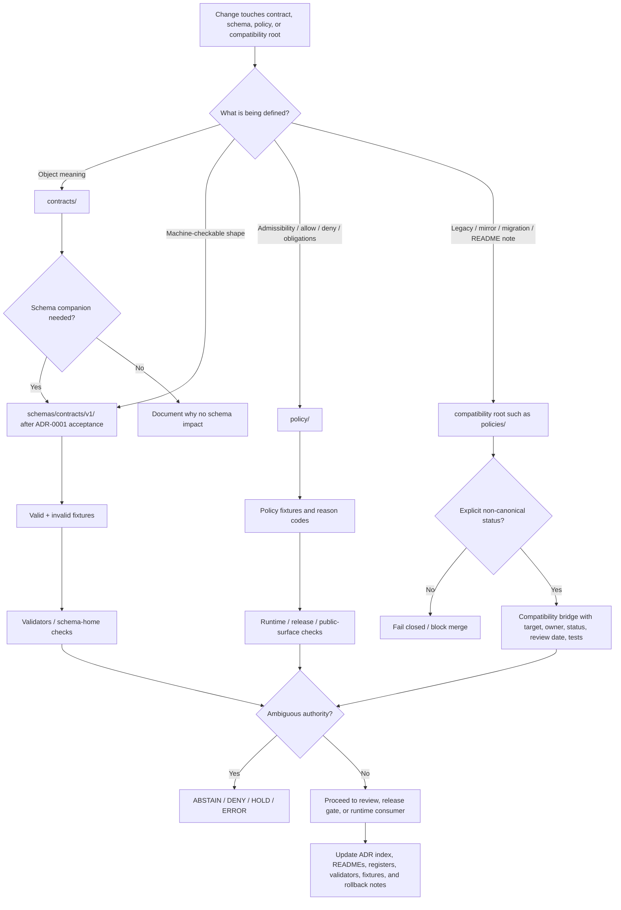

<!-- [KFM_META_BLOCK_V2]
doc_id: kfm://doc/NEEDS-VERIFICATION-ADR-0012-authority-boundary-compatibility-map
title: ADR-0012: Authority Boundary Compatibility Map
type: standard
version: v1.1-draft
status: draft
owners: @bartytime4life (CODEOWNERS NEEDS VERIFICATION)
created: 2026-05-03
updated: 2026-05-06
policy_label: NEEDS VERIFICATION
related: [./README.md, ./ADR-TEMPLATE.md, ./ADR-0001-schema-home.md, ./ADR-0002-responsibility-root-monorepo.md, ./ADR-0013-policy-home-authority.md, ./ADR-0202-policy-home.md, ../architecture/contract-schema-policy-split.md, ../registers/REPO_ORGANIZATION_AUDIT.md, ../registers/VERIFICATION_BACKLOG.md, ../../contracts/README.md, ../../schemas/README.md, ../../policy/README.md, ../../policies/README.md]
tags: [kfm, adr, authority-boundary, compatibility-map, contracts, schemas, policy, policies, governance, fail-closed]
notes: [Revision target exists as docs/adr/ADR-0012-authority-boundary-compatibility-map.md in the accessible GitHub repository. This ADR preserves the existing proposed compatibility-map decision while adding KFM Meta Block V2, evidence posture, clearer boundary rules, successor links, validation gates, and rollback guidance. ADR-0001 remains proposed for schema-home authority. ADR-0202 is the active accepted policy-home authority in the inspected commit, while ADR-0013 is retained as a supersession bridge. Enforcement maturity remains NEEDS VERIFICATION until validators, workflows, path-hygiene checks, runtime resolvers, release gates, and branch protections are verified.]
[/KFM_META_BLOCK_V2] -->

<a id="top"></a>

# ADR-0012: Authority Boundary Compatibility Map

Interim compatibility map for paired authority roots: `contracts/` vs `schemas/`, and `policy/` vs `policies/`.

<p align="center">
  
  
  
  
  
  
</p>

<p align="center">
  <a href="#decision-summary">Decision</a> ·
  <a href="#evidence-basis">Evidence</a> ·
  <a href="#compatibility-map">Compatibility map</a> ·
  <a href="#boundary-rules">Boundary rules</a> ·
  <a href="#decision-flow">Flow</a> ·
  <a href="#validation-plan">Validation</a> ·
  <a href="#rollback-and-supersession">Rollback</a> ·
  <a href="#open-verification-backlog">Open verification</a>
</p>

> [!IMPORTANT]
> **ADR status:** `proposed` compatibility bridge.  
> **Target path:** `docs/adr/ADR-0012-authority-boundary-compatibility-map.md`.  
> **Owning root:** `docs/` — human-facing architecture decision and governance explanation.  
> **Decision scope:** repo-wide compatibility handling for paired authority roots.  
> **Core rule:** do not let adjacent roots become parallel machine truth or parallel policy truth.

> [!CAUTION]
> Directory existence is not enforcement evidence. This ADR does **not** prove that validators, CI, policy engines, runtime resolvers, release gates, branch protections, dashboards, proof packs, or public API behavior enforce the compatibility rules below.

---

## Decision summary

KFM will preserve a compatibility map for two authority-boundary pairs:

| Pair | Interim authority posture | Active decision state |
|---|---|---|
| `contracts/` + `schemas/` | `contracts/` explains semantic meaning and compatibility; `schemas/` owns machine-checkable shape after schema-home acceptance. | `ADR-0001-schema-home.md` remains `proposed / draft`; enforcement `NEEDS VERIFICATION`. |
| `policy/` + `policies/` | `policy/` is the canonical policy-authority root; `policies/` is compatibility-only unless a later accepted ADR supersedes that rule. | `ADR-0202-policy-home.md` is the active accepted authority; `ADR-0013-policy-home-authority.md` is a supersession bridge. |

This ADR is an interim bridge between repository reality and final enforcement. It prevents contributors from using nearby directory names as authority shortcuts while ADRs, READMEs, validators, fixtures, workflows, release gates, and runtime consumers are reconciled.

### One-line decision rule

> `contracts/` defines meaning, `schemas/` validates shape, `policy/` decides admissibility, and `policies/` is compatibility-only unless a later accepted ADR says otherwise.

### One-line boundary rule

> If a consumer cannot determine the authoritative home for a machine schema or policy decision, it must fail closed instead of resolving by convenience, fallback order, or directory name.

[Back to top](#top)

---

## Context and problem

The repository exposes paired roots that are useful but easy to confuse:

```text
contracts/   schemas/
policy/      policies/
```

KFM needs these surfaces because contracts, schemas, policy rules, compatibility bridges, fixtures, validators, runtime consumers, and release gates each serve different parts of the trust system. The risk is not that the folders exist. The risk is that they become **quietly equal authorities**.

Without this compatibility map, KFM can drift into:

- duplicate machine-contract definitions in `contracts/` and `schemas/`;
- validator paths pointing to one root while runtime consumers rely on another;
- policy rules split across `policy/` and `policies/`;
- plural-root compatibility content treated as active policy law;
- directory moves mistaken for promotion, review, or release evidence;
- public API, UI, map, export, or AI surfaces consuming whichever root is easiest to load;
- old scaffold/report paths being treated as current implementation proof.

This ADR keeps the boundary explicit while the stronger ADRs and validators do the hard enforcement work.

[Back to top](#top)

---

## Evidence basis

| Evidence item | Status | Supports | Limits |
|---|---:|---|---|
| [`ADR-0012-authority-boundary-compatibility-map.md`](./ADR-0012-authority-boundary-compatibility-map.md) | `CONFIRMED repository file` | Existing target ADR already records the paired-root concern and proposed compatibility handling. | Existing draft is thin and lacks KFM Meta Block V2, successor handling, validation detail, and rollback guidance. |
| [`ADR-0001-schema-home.md`](./ADR-0001-schema-home.md) | `CONFIRMED repository file / PROPOSED decision` | Proposes `schemas/contracts/v1/` as canonical machine-contract schema home; `contracts/` remains semantic/narrative. | Acceptance and enforcement remain `NEEDS VERIFICATION`. |
| [`ADR-0013-policy-home-authority.md`](./ADR-0013-policy-home-authority.md) | `CONFIRMED repository file / supersession bridge` | Retains the original `policy/` canonical + `policies/` compatibility-only rule and points to active successor. | Not the active detailed policy-home authority after successor adoption. |
| [`ADR-0202-policy-home.md`](./ADR-0202-policy-home.md) | `CONFIRMED repository file in inspected commit / accepted decision` | Accepts `policy/` as canonical policy-home authority and `policies/` as compatibility-only. | Numbering/index cleanup and enforcement evidence still need verification. |
| [`ADR-0002-responsibility-root-monorepo.md`](./ADR-0002-responsibility-root-monorepo.md) | `CONFIRMED repository file / accepted layout decision` | Root folders are responsibility boundaries; compatibility roots need explicit status. | Does not prove every root is enforced or documented. |
| [`docs/architecture/contract-schema-policy-split.md`](../architecture/contract-schema-policy-split.md) | `CONFIRMED repository file` | States operating split: contracts explain meaning; schemas validate shape; policy decides release/public behavior. | Architecture note does not create machine authority or enforcement by itself. |
| [`contracts/README.md`](../../contracts/README.md) | `CONFIRMED repository file` | Defines `contracts/` as object-meaning and compatibility lane; warns not to overrule schema authority by path alone. | Does not prove schema-home enforcement. |
| [`schemas/README.md`](../../schemas/README.md) | `CONFIRMED repository file` | Defines `schemas/` parent boundary and visible `schemas/contracts/v1/` machine-file scaffold; flags schema-home ambiguity. | Does not by itself settle canonical law. |
| [`policy/README.md`](../../policy/README.md) | `CONFIRMED repository file` | Defines `policy/` as governed decision surface for admissibility, rights, sensitivity, release, runtime, and correction behavior. | Some branch/tool/runtime claims remain verification-bounded. |
| [`policies/README.md`](../../policies/README.md) | `CONFIRMED repository file` | Documents plural-root path ambiguity and warns against competing `policy/` / `policies/` authorities. | Its earlier posture is provisional; active successor ADR should control. |
| Directory Rules doctrine | `CONFIRMED supplied doctrine` | Root folders are responsibility boundaries; compatibility roots require README status; domain topics should not become root folders. | Does not prove active checkout enforcement or CI behavior. |

### Truth labels used in this ADR

| Label | Meaning |
|---|---|
| `CONFIRMED` | Verified from repository connector evidence, repository files, current workspace inspection, or supplied KFM doctrine. |
| `PROPOSED` | Recommended compatibility rule, validator, migration, or implementation behavior not proven as active enforcement. |
| `ACCEPTED` | Decision state recorded by an ADR, while enforcement may still remain separate. |
| `NEEDS VERIFICATION` | Concrete evidence is required before stronger claims are safe. |
| `UNKNOWN` | Not verified strongly enough in this session. |
| `CONFLICTED` | Authority signals are ambiguous or competing and require ADR, register, or migration closure. |
| `LINEAGE` | Prior material retained for continuity but not current implementation proof. |

> [!NOTE]
> A decision can be accepted while enforcement remains `NEEDS VERIFICATION`. Keep decision state, implementation state, validation state, and release state separate.

[Back to top](#top)

---

## Requirements and constraints

| KFM invariant | Compatibility-map consequence | Status |
|---|---|---|
| Root folders are responsibility boundaries | `contracts/`, `schemas/`, `policy/`, and `policies/` must each declare role, authority, and exclusions. | `CONFIRMED` doctrine / `PROPOSED` enforcement |
| Contracts explain meaning | Do not use `contracts/` as a silent machine-schema authority. | `CONFIRMED` repo docs / `NEEDS VERIFICATION` enforcement |
| Schemas validate shape | Do not let schema validity imply source authority, public release, policy allow, review approval, or publication. | `CONFIRMED` architecture docs / `NEEDS VERIFICATION` enforcement |
| Policy decides admissibility | `policy/` owns canonical policy semantics; runtime, workflow, helper packages, and UI must not hide policy law. | `ACCEPTED` via policy-home ADR / `NEEDS VERIFICATION` enforcement |
| Compatibility roots are bounded | `policies/` may remain only as compatibility, migration, mirror, generated, blocked, retired, or explanatory surface. | `CONFIRMED` repo docs / `NEEDS VERIFICATION` inventory |
| Public clients use governed interfaces | No compatibility fallback may expose `RAW`, `WORK`, `QUARANTINE`, unpublished candidates, direct model output, or internal stores. | `CONFIRMED` doctrine / `PROPOSED` enforcement |
| Promotion is a governed state transition | Moving files across roots is not review, proof, release, correction, or rollback evidence. | `CONFIRMED` doctrine / `PROPOSED` enforcement |
| Evidence and policy fail closed | Ambiguous schema or policy-home resolution blocks public claim, release, or runtime answer. | `PROPOSED` enforcement |

### Non-goals

This ADR does **not** decide:

- the final acceptance state of `ADR-0001-schema-home.md`;
- the final numbering cleanup for `ADR-0202-policy-home.md`;
- every schema subpath or fixture-home convention;
- every policy engine, OPA/Rego/Conftest/Python runner, package, or workflow detail;
- any API route name, DTO name, UI component path, runtime resolver implementation, or deployment behavior;
- whether any specific source, domain, claim, layer, export, or AI response is releasable;
- migration of existing files by itself.

[Back to top](#top)

---

## Compatibility map

### Boundary matrix

| Boundary | Current homes | Interim authority rule | Allowed compatibility use | Prohibited duplication | Next decision / closure |
|---|---|---|---|---|---|
| Semantic contract meaning vs machine contract shape | `contracts/` + `schemas/` | `contracts/` explains meaning; `schemas/contracts/v1/` is the proposed machine-schema home under `ADR-0001`. | Cross-link semantic docs to canonical schemas; examples may reference schemas if marked non-canonical. | Parallel machine-contract truth in both roots. | Accept / close `ADR-0001` with validators, fixtures, consumer inventory, and workflow evidence. |
| Policy authority vs plural compatibility root | `policy/` + `policies/` | `policy/` is canonical policy authority; `policies/` is compatibility-only. | `policies/` may preserve migration notes, mirror status, legacy notes, blocked-path notes, or README-only crosswalks. | Active policy law, fixtures, tests, runtime inputs, or release gates split across both roots. | Keep active authority in `ADR-0202`; retain `ADR-0013` as bridge; inventory `policies/`. |
| Architecture prose vs enforceable behavior | `docs/architecture/`, `docs/adr/`, READMEs | Docs explain and decide; validators, tests, policies, workflows, release artifacts, and runtime evidence prove enforcement. | Docs may define review burden and validation targets. | Claiming compliance from prose alone. | Attach validation output, workflow status, receipts, or test evidence before enforcement claims. |
| Release / proof / receipt / promotion | `data/receipts/`, `data/proofs/`, `release/`, related docs | Promotion is a state transition backed by proof, review, release manifest, correction path, and rollback target. | Compatibility notes may point to release/proof homes. | File move treated as promotion or release evidence. | Validate release/correction/rollback object families and emitted artifacts. |
| Runtime / UI / AI consumption | `apps/`, `packages/`, governed API, map shell, Focus Mode | Runtime consumers must resolve authoritative schemas and policy decisions explicitly. | Temporary bridges must be explicit and tested. | Resolver silently falls back from canonical root to compatibility root. | Add no-ambiguous-resolution tests and no-public-bypass tests. |

### Current working posture

| Root | Current compatibility reading | Canonical after relevant decision | Must not become |
|---|---|---|---|
| `contracts/` | Semantic contract and object-meaning lane. | Canonical for meaning and compatibility prose. | Machine-schema authority, policy law, emitted proof/receipt store. |
| `schemas/` | Machine-shape parent lane; `schemas/contracts/v1/` is proposed canonical schema home. | Canonical for machine-checkable contract schemas only after `ADR-0001` acceptance. | Policy permission, source authority, release approval. |
| `policy/` | Canonical policy-decision lane. | Canonical for policy semantics under `ADR-0202`. | Schema authority, contract semantics, emitted proof storage. |
| `policies/` | Compatibility / transitional / legacy / mirror / migration root. | Not canonical unless a later accepted ADR supersedes. | Active policy authority or hidden runtime policy input. |

[Back to top](#top)

---

## Boundary rules

### Contracts and schemas

1. Do not copy machine schemas into `contracts/` as a parallel normative store.
2. Do not treat semantic contract prose as a substitute for machine validation.
3. Do not add new schema-like files under `contracts/` without an explicit non-canonical marker, alias rule, or accepted exception.
4. Do not create new major schema versions such as `schemas/contracts/v2/` without a successor ADR or migration decision.
5. Do not let examples, generated files, or mirrors become canonical by placement.
6. If a schema consumer can resolve both `contracts/...` and `schemas/contracts/v1/...`, it must fail closed unless an approved alias chooses one target.

### Policy and policies

1. New canonical policy law belongs under `policy/`.
2. `policies/` must remain compatibility-only unless superseded.
3. Do not add active `*.rego`, policy JSON/YAML, policy fixtures, policy tests, runtime policy inputs, or release-gate rules under `policies/` unless the file is explicitly classified as compatibility, generated mirror, blocked, retired, or migration bridge.
4. Runtime policy resolvers must target `policy/` or an explicitly approved compatibility bridge.
5. If policy-home resolution is ambiguous, release/runtime/public output must fail closed.
6. Do not infer policy enforcement from directory names, README text, or workflow intent.

### Cross-boundary guardrails

1. A directory move is not promotion.
2. A passed schema validation is not policy approval.
3. A policy allow is not publication without proof, review, release manifest, correction path, and rollback target.
4. A generated model answer is not evidence.
5. A public map layer, tile, graph edge, search result, export, story, or dashboard is a downstream carrier, not root truth.
6. Public clients must not read `RAW`, `WORK`, `QUARANTINE`, unpublished candidates, internal canonical stores, direct source-system side effects, secrets, or direct model outputs.

[Back to top](#top)

---

## Decision flow



[Back to top](#top)

---

## Compatibility bridge records

A compatibility bridge is allowed only when it is explicit, bounded, and tested.

### Required bridge fields

| Field | Required value |
|---|---|
| `bridge_id` | Stable identifier or path. |
| `source_path` | Compatibility or legacy path. |
| `canonical_target` | Canonical path or schema/policy ID. |
| `status` | `active`, `deprecated`, `blocked`, `mirror`, `migration`, `retired`, or `generated`. |
| `purpose` | Why the bridge exists. |
| `owner` | Maintainer or `OWNER_TBD_NEEDS_VERIFICATION`. |
| `created` | Date or `DATE_TBD_FROM_GIT_OR_DOC_REGISTRY`. |
| `review_by` | Review date, release trigger, or `NEEDS VERIFICATION`. |
| `tests` | Positive and negative tests proving resolution behavior. |
| `rollback_note` | How to disable or retire without hiding lineage. |

### Illustrative bridge record

```yaml
# Illustrative only. Final registry path and schema require verification.
compatibility_bridges:
  - bridge_id: bridge-policy-plural-root
    source_path: policies/
    canonical_target: policy/
    status: compatibility
    purpose: Preserve old/plural-root links while active policy authority stays in policy/.
    owner: "@bartytime4life (CODEOWNERS NEEDS VERIFICATION)"
    created: 2026-05-06
    review_by: NEEDS_VERIFICATION
    tests:
      - policy_plural_root_does_not_accept_new_canonical_rules
      - runtime_resolver_targets_policy_root
    rollback_note: Preserve policies/README.md as lineage or replace with a redirect note after inventory.
```

[Back to top](#top)

---

## Validation plan

### Required validation targets

| Gate | Expected behavior | Status |
|---|---|---:|
| Schema-home scan | Schema-like files outside canonical schema home fail unless explicitly classified as example, alias, mirror, or non-canonical. | `PROPOSED` |
| Contract-schema sync | Contract meaning docs link to canonical schema path or state why no machine schema exists. | `PROPOSED` |
| Future schema-version block | New `schemas/contracts/vN/` paths fail without successor ADR or migration decision. | `PROPOSED` |
| Fixture-schema mapping | Valid/invalid fixtures map to one canonical schema target. | `PROPOSED` |
| Policy-home scan | New policy-significant files under `policies/` fail unless explicitly classified compatibility-only. | `PROPOSED` |
| Policy resolver target | Runtime/release policy consumers target `policy/` or approved bridge only. | `NEEDS VERIFICATION` |
| Compatibility bridge validation | Every bridge has canonical target, status, owner, review date, tests, and rollback note. | `PROPOSED` |
| Public bypass guard | Public API/UI/AI surfaces cannot read internal lifecycle roots or direct model output through compatibility fallback. | `PROPOSED` |
| Release transition guard | File moves between roots cannot mark artifacts as promoted or published. | `PROPOSED` |
| Documentation sync | ADR index, root READMEs, architecture note, registers, tests, validators, and policy docs agree on authority status. | `NEEDS VERIFICATION` |

### Negative-path fixtures

| Failure condition | Expected outcome |
|---|---|
| Machine schema appears under `contracts/` with no explicit exception. | Validator failure. |
| Consumer resolves same object from both `contracts/` and `schemas/`. | `ERROR` or fail-closed validation result. |
| Example JSON in `contracts/` lacks canonical schema pointer or non-canonical marker. | Validator warning or failure based on configured strictness. |
| New canonical policy file lands under `policies/`. | Validator failure. |
| Runtime resolver falls back silently from `policy/` to `policies/`. | Test failure. |
| Release candidate lacks policy-home version or policy decision reference. | Release gate failure. |
| Directory move is used as promotion evidence. | Promotion gate failure. |
| Public layer references unreleased or ambiguous schema/policy root. | `DENY` or layer hidden. |
| Focus Mode emits answer from ambiguous policy/schema context. | `ABSTAIN`, `DENY`, or `ERROR`. |

### Reviewer command sketch

Run from a real checkout on the target branch. Adapt to repo-native tooling before using as CI enforcement.

```bash
git status --short
git branch --show-current
git rev-parse --show-toplevel

# Inventory paired roots.
find contracts schemas policy policies -maxdepth 4 -type f 2>/dev/null | sort

# Look for schema-like files under the semantic contract lane.
find contracts -type f \
  \( -name '*.schema.json' -o -name '*.schema.yaml' -o -name '*.schema.yml' \) \
  2>/dev/null | sort

# Look for policy-significant files under the plural compatibility root.
find policies -type f \
  \( -name '*.rego' -o -name '*.json' -o -name '*.yaml' -o -name '*.yml' -o -path '*/fixtures/*' -o -path '*/tests/*' \) \
  2>/dev/null | sort

# Review authority language.
grep -RInE \
  'schema home|machine schema|contract meaning|policy home|policies/|compatibility|ADR-0001|ADR-0012|ADR-0013|ADR-0202|fail closed|PromotionDecision|ReleaseManifest' \
  docs contracts schemas policy policies tests tools packages apps .github 2>/dev/null || true
```

> [!NOTE]
> These commands are review aids and proposed validation targets. They are not evidence that CI currently enforces this ADR.

[Back to top](#top)

---

## Impact map

| Area | Required update or check | Status |
|---|---|---:|
| `docs/adr/README.md` | List this ADR as proposed compatibility bridge; clarify relationship to `ADR-0001`, `ADR-0013`, and `ADR-0202`. | `NEEDS VERIFICATION` |
| `docs/adr/ADR-0001-schema-home.md` | Keep schema-home acceptance and enforcement gates visible. | `CONFIRMED related / PROPOSED enforcement` |
| `docs/adr/ADR-0013-policy-home-authority.md` | Keep as bridge / superseded lineage pointing to `ADR-0202`. | `CONFIRMED related` |
| `docs/adr/ADR-0202-policy-home.md` | Keep active policy-home authority and numbering cleanup visible. | `CONFIRMED in inspected commit / NEEDS VERIFICATION on main path resolution` |
| `docs/architecture/contract-schema-policy-split.md` | Align split language with this compatibility map. | `CONFIRMED related / NEEDS VERIFICATION` |
| `contracts/README.md` | Confirm semantic-contract role and non-machine-authority rule. | `CONFIRMED related / NEEDS VERIFICATION` |
| `schemas/README.md` | Confirm parent schema boundary and `schemas/contracts/v1/` proposed canonical path. | `CONFIRMED related / NEEDS VERIFICATION` |
| `policy/README.md` | Confirm canonical policy role and deny-by-default posture. | `CONFIRMED related / NEEDS VERIFICATION` |
| `policies/README.md` | Mark compatibility/transitional status or update to point to active ADR. | `CONFIRMED related / NEEDS VERIFICATION` |
| `docs/registers/REPO_ORGANIZATION_AUDIT.md` | Track paired-root risk if still active. | `NEEDS VERIFICATION` |
| `docs/registers/VERIFICATION_BACKLOG.md` | Track authority closure, policy/policies inventory, schema-home acceptance, and enforcement gaps. | `NEEDS VERIFICATION` |
| `tests/` / `fixtures/` | Add negative-path fixtures for split authority and compatibility fallback. | `PROPOSED` |
| `tools/validators/` | Add path-hygiene and bridge-validation checks. | `PROPOSED` |
| `.github/workflows/` | Wire checks only after repo-native conventions are verified. | `NEEDS VERIFICATION` |
| `apps/` / `packages/` | Ensure runtime resolvers consume canonical roots or explicit bridges. | `UNKNOWN` implementation depth |
| `release/` / proof surfaces | Require release records to identify enforced schemas and policies. | `PROPOSED` |

[Back to top](#top)

---

## Alternatives considered

| Alternative | Decision | Reason |
|---|---|---|
| Treat both paired roots as equally canonical. | Rejected. | Creates dual machine truth and dual policy truth. |
| Delete compatibility roots immediately. | Deferred. | Requires inventory, migration notes, link preservation, tests, and rollback plan. |
| Make `contracts/` the only schema authority. | Rejected for now. | Repo evidence and ADR-0001 point toward `schemas/contracts/v1/` for machine shape; contracts remain semantic. |
| Use `policies/` as canonical policy root. | Rejected. | ADR-0202 accepts `policy/`; Directory Rules treat plural roots as compatibility/transitional unless accepted. |
| Let runtime resolver fallback decide. | Rejected. | Fallback order can become hidden authority. |
| Leave original short ADR unchanged. | Rejected. | It names the issue but does not provide enough evidence, successor mapping, validation, or rollback detail for current repo maturity. |
| Collapse this ADR into ADR-0001 and ADR-0202. | Deferred. | This bridge remains useful as the cross-pair compatibility map while both authority families are still being cleaned up. |

[Back to top](#top)

---

## Rollback and supersession

### Rollback of this document revision

If this rewrite causes confusion, rollback the document content only:

```bash
git checkout -- docs/adr/ADR-0012-authority-boundary-compatibility-map.md
```

Then preserve a note in the ADR index or verification backlog explaining why the richer compatibility map was reverted.

### Supersession triggers

This ADR should be superseded or narrowed when:

- `ADR-0001-schema-home.md` becomes accepted with validator and workflow evidence;
- `ADR-0202-policy-home.md` numbering and index cleanup is complete;
- `policies/` is retired, moved, or explicitly reclassified;
- path-hygiene validators and runtime resolvers prove unambiguous behavior;
- a new authority-map ADR or register replaces this compatibility bridge.

### Supersession rule

A successor must:

1. preserve this ADR as lineage;
2. name the successor ADR or register;
3. update `docs/adr/README.md`;
4. update contract, schema, policy, and compatibility-root READMEs;
5. update any bridge records or alias maps;
6. run or define validation for schema-home, policy-home, runtime resolver, and release-gate behavior;
7. preserve rollback and correction history.

> [!CAUTION]
> Do not delete this ADR merely because authority is cleaner later. It records why paired roots were risky and how the project prevented silent drift.

[Back to top](#top)

---

## Consequences

### Positive consequences

- Contributors can see how `contracts/`, `schemas/`, `policy/`, and `policies/` differ.
- `ADR-0001`, `ADR-0013`, and `ADR-0202` become easier to reconcile.
- Compatibility roots can remain without becoming silent canonical authority.
- Validators and tests have concrete negative paths to enforce.
- Runtime, release, UI, map, export, and AI consumers get a clear fail-closed rule.
- File moves are kept separate from promotion and publication evidence.

### Costs and tradeoffs

| Cost / tradeoff | Mitigation |
|---|---|
| Adds another ADR to an already active ADR family. | Keep it as a bridge, not a competing final authority. |
| Requires more review before moving files. | Prefer reversible, evidence-backed migrations over quick re-homing. |
| May block convenient compatibility fallback. | Fail closed until canonical targets and bridges are explicit. |
| Requires validators that may not yet exist. | Track proposed validators and keep enforcement claims bounded. |
| Requires docs sync across several roots. | Treat docs as part of the working trust system, not optional polish. |

[Back to top](#top)

---

## Open verification backlog

| Item | Status | Required evidence |
|---|---:|---|
| ADR owner and CODEOWNERS coverage | `NEEDS VERIFICATION` | CODEOWNERS or maintainer review. |
| `ADR-0001` acceptance | `NEEDS VERIFICATION` | Accepted status plus schema consumers, validators, fixtures, and workflow evidence. |
| `ADR-0202` path on `main` | `NEEDS VERIFICATION` | File fetch or branch inventory from active checkout; inspected commit confirms content. |
| ADR numbering cleanup | `NEEDS VERIFICATION` | ADR index and file names reconciled. |
| Full `contracts/` inventory | `NEEDS VERIFICATION` | Confirm no unintended machine schemas or canonical duplicates. |
| Full `schemas/` inventory | `NEEDS VERIFICATION` | Confirm current schema families, versions, and schema-like files. |
| Full `policy/` inventory | `NEEDS VERIFICATION` | Confirm canonical policy contents and policy engine expectations. |
| Full `policies/` inventory | `NEEDS VERIFICATION` | Confirm compatibility-only classification for every file. |
| Runtime schema resolver behavior | `UNKNOWN` | Source code, tests, or runtime proof. |
| Runtime policy resolver behavior | `UNKNOWN` | Source code, tests, or runtime proof. |
| Release-gate schema/policy references | `UNKNOWN` | Release manifest, proof pack, validator output, or fixture evidence. |
| Path-hygiene validator | `PROPOSED` | Tool implementation and tests. |
| CI enforcement | `UNKNOWN` | Workflow YAML, status checks, branch protections, or run artifacts. |
| Public-client no-bypass behavior | `UNKNOWN` | API/UI tests, route review, logs, or proof artifacts. |
| Compatibility bridge registry | `PROPOSED` | Accepted registry path and schema. |

[Back to top](#top)

---

## Review checklist

<details>
<summary>Pre-merge checklist</summary>

- [ ] KFM Meta Block V2 values are resolved or intentionally marked `NEEDS VERIFICATION`.
- [ ] ADR title, filename, meta block title, and ADR index entry are synchronized.
- [ ] Existing short ADR substance is preserved: paired roots exist and dual authority is prohibited.
- [ ] `ADR-0001`, `ADR-0013`, and `ADR-0202` relationships are accurate for the active branch.
- [ ] `policy/` vs `policies/` status is not contradicted by local files.
- [ ] `contracts/` vs `schemas/` status is not overstated beyond `ADR-0001`.
- [ ] No implementation enforcement is claimed without tests, validators, workflows, or runtime evidence.
- [ ] Compatibility bridge requirements are clear.
- [ ] Negative-path tests are listed.
- [ ] Public-client and runtime fail-closed behavior is stated.
- [ ] Promotion remains a governed state transition, not a file move.
- [ ] Rollback and supersession are documented.
- [ ] Related READMEs, architecture note, registers, and ADR index are listed for sync.
- [ ] No root-level domain folder is proposed.
- [ ] No parallel schema, contract, policy, source, proof, release, or publication home is created silently.

</details>

[Back to top](#top)

---

## Final note

This ADR is intentionally a compatibility bridge. Its job is to keep paired-root ambiguity visible long enough for accepted ADRs, repo inventories, validators, fixtures, workflows, release gates, runtime consumers, and public-surface tests to make the boundary enforceable.
