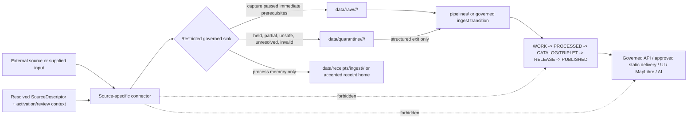

<!-- [KFM_META_BLOCK_V2]
doc_id: kfm://doc/adr-0012-connector-outputs-to-data-raw-or-data-quarantine-only
title: "ADR-0012 — Connector outputs MUST land in data/raw/ or data/quarantine/ only"
type: adr
adr_id: ADR-0012
version: v1.2
status: draft
owners:
  - "NEEDS VERIFICATION — architecture decision owner"
  - "NEEDS VERIFICATION — connector and source-admission steward"
  - "NEEDS VERIFICATION — data lifecycle steward"
  - "NEEDS VERIFICATION — rights and sensitivity steward"
  - "NEEDS VERIFICATION — receipt and validation steward"
  - "NEEDS VERIFICATION — affected domain stewards"
owner_status: "CODEOWNERS provides repository review routing, but accepted stewardship, decision quorum, required-review rules, source-owner approval, and independent release controls were not verified"
reviewers_required:
  - Architecture steward
  - Docs steward
  - Connector and source-admission steward
  - Data lifecycle steward
  - Rights and sensitivity steward
  - Contracts and schemas stewards
  - Receipt and validation steward
  - Security reviewer
  - At least one affected domain steward
created: 2026-05-11
updated: 2026-07-23
policy_label: public
truth_posture: cite-or-abstain
responsibility_root: docs/
current_path: docs/adr/ADR-0012-connector-outputs-to-data-raw-or-data-quarantine-only.md
supersedes: []
superseded_by: null
evidence_snapshot:
  repository: bartytime4life/Kansas-Frontier-Matrix
  base_ref: main
  base_commit: 892255ad8179f8e7bc972776c3462ba6abe3be09
  inspection_origin_commit: 936eac6d5b30471dd5d663ba61d34933dc2cbe8b
  continuity_compare: 936eac6d5b30471dd5d663ba61d34933dc2cbe8b...892255ad8179f8e7bc972776c3462ba6abe3be09
  relevant_path_changes_after_inspection: 0
  target_prior_blob: e323ce42e82bdf93252fa0bd68bd86e3b7eedebf
  adr_index_blob: cf08fae322ac53426f7394d97897fdb942253049
  directory_rules_blob: 2affb080e6f0043867c64c7f06c1ca52030fbd55
  connectors_readme_blob: 8db6ee9cbefdd1ce099789d827f759df9ebd9f59
  raw_readme_blob: 771a4684341622aa684a3724f0c1a95b900f7335
  quarantine_readme_blob: 2f93c3dff8772edc27105a0fd8affd4b68cb7a60
  ingest_pipeline_readme_blob: 47e484ed891d5b830f6cb30d20829610824f33ab
  connector_gate_workflow_blob: ae3ef92ac5f717cc149a609c3b74dd105dd17e44
  non_publisher_test_blob: c6164787bc848eb2347c347af203d76afae37a2b
  connector_gate_readme_blob: c09a47bf571a4348b9cfeb3033844e5a3a765f2f
  source_registry_readme_blob: 2821e9681273bff6b430920d0a45312c5643ba33
  source_descriptor_schema_blob: 582e70b834278c3c6ca9a8b31efbe0989c96f0bc
  ingest_receipt_contract_blob: 4273a9bad9edc7ce7f54c288075f8a49b0f2fe80
  ingest_receipt_schema_blob: 4e9707bec7da63049c5043562c9470564b77184f
  source_admission_adr_blob: 0e8d03786bcc99b19f179680890df9e30a27633a
  quarantine_exit_adr_blob: 95648b9967e02bfe662d4f6103de10ee5a467d21
related:
  - docs/adr/README.md
  - docs/adr/INDEX.md
  - docs/adr/ADR-0001-schema-home--schemas-contracts-v1-is-canonical.md
  - docs/adr/ADR-0002-contracts-vs-schemas-split.md
  - docs/adr/ADR-0010-deny-by-default-for-dna-rare-species-archaeology-infrastructure.md
  - docs/adr/ADR-0011-receipts-vs-proofs-vs-manifests-vs-catalog-separation.md
  - docs/adr/ADR-0013-spec_hash-and-run_id-identity-grammar.md
  - docs/adr/ADR-0017-source-descriptor-admission-process.md
  - docs/adr/ADR-0021-quarantine-has-structured-exit-paths.md
  - docs/adr/ADR-0025-public-client-never-reads-canonical-internal-stores.md
  - docs/doctrine/directory-rules.md
  - connectors/README.md
  - data/raw/README.md
  - data/quarantine/README.md
  - data/registry/sources/README.md
  - data/receipts/README.md
  - pipelines/ingest/README.md
  - contracts/source/ingest_receipt.md
  - schemas/contracts/v1/source/ingest_receipt.schema.json
  - schemas/contracts/v1/source/source_descriptor.schema.json
  - tools/validators/connector_gate/README.md
  - tests/policy/test_pipeline_connector_non_publisher.py
  - .github/workflows/connector-gate.yml
tags: [kfm, adr, governance, connectors, source-admission, pre-raw, raw, quarantine, receipts, non-publisher, trust-membrane, lifecycle, fail-closed]
notes:
  - "v1.2 is a same-path repository-grounded modernization. It preserves source metadata `draft` and effective decision status `proposed`; it does not accept ADR-0012, activate a source, run a connector, admit payloads, migrate files, or publish anything."
  - "The canonical ADR index uniquely assigns ADR-0012 to this exact path."
  - "Connector payload captures remain limited to RAW or QUARANTINE; receipt candidates are a separate process-memory output through a governed append-only receipt sink."
  - "SourceDescriptor is an admitted registry input, not a per-run connector-owned authority record. A connector may reference or propose a descriptor but must not silently write registry authority during a source run."
  - "Current CI enforces only a bounded static subset of the non-publisher rule and leaves ingest-receipt validation as an explicit hold."
  - "The connector-versus-shared-ingest writer handoff remains implementation-level NEEDS VERIFICATION; this ADR governs allowable effects regardless of which reviewed component performs the final write."
[/KFM_META_BLOCK_V2] -->

<a id="top"></a>

# ADR-0012 — Connector outputs MUST land in `data/raw/` or `data/quarantine/` only

> **Proposed decision.** Source payloads captured by a connector may enter KFM only through a governed **RAW** or **QUARANTINE** handoff. Connector receipt candidates are separate process-memory outputs and may be persisted only through the governed receipt surface. Connectors do not own normalization, canonical records, registries, evidence, catalogs, graph projections, release decisions, publication, or public serving.

[](#status)
[](#current-repository-evidence)
[](#decision)
[](#receipt-and-registry-boundaries)
[](#current-enforcement-maturity)
[](#current-enforcement-maturity)
[](#authority-and-publication-boundary)

> [!IMPORTANT]
> **Identity is confirmed; acceptance is not.** [`docs/adr/INDEX.md`](./INDEX.md) uniquely assigns `ADR-0012` to this exact file. Its source metadata is `draft`, which normalizes conservatively to effective status `proposed`. Editing, merging, or linking this ADR does not accept the decision.

> [!CAUTION]
> **A connector success is not source admission, evidence closure, or release.** A successful request, valid `SourceDescriptor` shape, checksum, RAW path, receipt, or passing static test proves only its bounded fact. Rights, sensitivity, source role, review, evidence, later lifecycle transitions, and release remain separate gates.

> [!WARNING]
> **The current repository is only partially enforcing this boundary.** The connector workflow statically checks selected Python, shell, and YAML write contexts for `data/catalog`, `data/published`, and `release/`. It does not yet prove RAW/QUARANTINE routing, receipt presence, dynamic path safety, all forbidden phases, runtime behavior, or universal connector coverage.

**Quick navigation:** [Status](#status) · [Evidence](#evidence-boundary) · [Context](#context) · [Decision](#decision) · [Rules](#normative-rules) · [Flow](#boundary-and-state-flow) · [Targets](#allowed-and-forbidden-effects) · [Paths](#path-and-identity-contract) · [Receipts](#receipt-and-registry-boundaries) · [Evidence snapshot](#current-repository-evidence) · [Maturity](#current-enforcement-maturity) · [Validation](#validation-and-enforcement-target) · [Consequences](#consequences) · [Alternatives](#alternatives-considered) · [Migration](#migration-and-graduation-plan) · [Acceptance](#acceptance-gates) · [Risks](#risk-ledger) · [Rollback](#rollback-and-supersession) · [Verification](#verification-checklist) · [References](#references)

---

<a id="status"></a>

## Status

| Field | Current value |
|---|---|
| **ADR ID** | `ADR-0012` — unique and confirmed in [`INDEX.md`](./INDEX.md) |
| **Tracked path** | `docs/adr/ADR-0012-connector-outputs-to-data-raw-or-data-quarantine-only.md` |
| **Source metadata** | `draft` |
| **Effective decision status** | `proposed` |
| **Decision class** | Source-edge lifecycle boundary and anti-publication invariant |
| **Current implementation posture** | Root boundaries documented; partial static non-publisher test; receipt and full routing enforcement held |
| **Implementation effect of this revision** | Documentation only |
| **Publication effect** | None |
| **Supersedes / superseded by** | None / none |

### Decision acceptance versus enforcement graduation

Two states remain separate:

1. **ADR acceptance** would approve this numbered source-edge boundary.
2. **Enforcement graduation** requires accepted source/activation semantics, a restricted write interface, deterministic fixtures, complete static and runtime checks, receipt validation, CI, correction, and rollback evidence.

An accepted ADR without enforcement is doctrine. A passing test without an accepted decision is bounded implementation evidence. Neither state alone proves source admission or public safety.

[Back to top](#top)

---

<a id="evidence-boundary"></a>

## Evidence Boundary

This revision uses current repository bytes at `main@892255ad8179f8e7bc972776c3462ba6abe3be09` plus KFM doctrine. Current repository evidence determines present behavior; doctrine governs the responsibility boundary. Authoring inspection began at `936eac6d5b30471dd5d663ba61d34933dc2cbe8b`; the continuity compare to the prepared base changed only `migrations/README.md`, so the inspected target and connector-boundary evidence remained unchanged.

| Evidence level | What is established | What is not established |
|---|---|---|
| **Directory and lifecycle doctrine** | `connectors/` owns source-specific fetch/admission; `data/` owns lifecycle state; connectors are non-publishers | Full executable enforcement |
| **ADR inventory** | Exact ADR ID, filename, source metadata, and effective proposed status | Acceptance |
| **Root documentation** | Connector, RAW, QUARANTINE, registry, receipt, and ingest boundaries are documented | Exhaustive payload inventory or runtime conformance |
| **Contracts and schemas** | Fielded proposed `SourceDescriptor` and `IngestReceipt` shapes exist | Accepted authority, activation, or universal wiring |
| **Workflow and test source** | One bounded static non-publisher test runs in `connector-gate` | Dynamic effects, complete target coverage, receipt presence, or source correctness |
| **Runtime and operations** | No admissible evidence reviewed here proves live connector runs, active sources, emitted receipts, deployment, or public use | Production maturity |

### Truth labels

| Label | Use in this ADR |
|---|---|
| **CONFIRMED** | Verified from current repository bytes, tests, workflows, or governing doctrine. |
| **PROPOSED** | Decision, path role, interface, migration, field, or future enforcement not accepted and proven. |
| **UNKNOWN** | Evidence is insufficient to support a stronger statement. |
| **NEEDS VERIFICATION** | A concrete check exists but is not closed. |
| **CONFLICTED** | Current repository sources assign incompatible names, paths, or writer responsibilities. |
| **HOLD** | A workflow or readiness gate intentionally refuses to claim the capability is implemented. |

[Back to top](#top)

---

<a id="context"></a>

## Context

KFM's lifecycle invariant remains:

```text
RAW -> WORK / QUARANTINE -> PROCESSED -> CATALOG / TRIPLET -> PUBLISHED
```

Connectors operate at the source edge. They may observe external state, retrieve or inspect source-native material, preserve source-head and integrity facts, and present a bounded capture candidate to the governed ingest boundary. They do not decide what becomes normalized truth, evidence, catalog state, a graph assertion, a release, a map layer, an API response, or an AI answer.

The source edge is unusually sensitive because connector material has not yet passed through the complete KFM chain:

- accepted source and activation review;
- record-level admission;
- normalization and semantic validation;
- rights and sensitivity policy;
- evidence assembly and citation validation;
- catalog and graph closure;
- accountable review and promotion;
- release, correction, withdrawal, and rollback.

A connector that can write directly to a later phase collapses those gates into transport code. A connector that can create or edit a source registry entry during a run can manufacture its own authority. A connector that can create release, proof, catalog, or public objects becomes a publisher by side effect.

### Drift patterns this ADR prevents

| Anti-pattern | Failure |
|---|---|
| **Connector publishes** | Connector or source-specific pipeline writes directly to `data/published/`, `release/`, or a public surface. |
| **Connector canonicalizes** | Source-specific fetch code writes normalized/canonical records into `data/work/` or `data/processed/`. |
| **Connector catalogs** | Fetch code emits STAC, DCAT, PROV, CatalogMatrix, or graph/triplet records as authoritative lifecycle outputs. |
| **Connector self-admits** | Connector run creates or edits its own authoritative `SourceDescriptor`, activation state, rights decision, or source-authority register entry. |
| **Receipt as exception tunnel** | A receipt output path becomes a general route for payloads, proofs, or release-shaped objects. |
| **Lifecycle skip** | RAW or QUARANTINE material reaches PUBLISHED without the governed transitions and their evidence. |
| **Hidden dynamic path** | Runtime string construction evades static forbidden-path tests. |
| **Admin upload bypass** | Restricted uploads land directly in WORK, PROCESSED, catalog, proofs, or published state. |

### In scope

- allowed direct connector effects;
- RAW and QUARANTINE payload landing;
- receipt and registry boundaries;
- source-native preservation;
- no-op, denial, hold, rate-limit, partial, and error outcomes;
- static and runtime enforcement requirements;
- migration and rollback posture.

### Out of scope

- field-level contract/schema revisions;
- final `SourceDescriptor` schema-home or singular/plural migration;
- final activation-state vocabulary;
- source-specific endpoint or rights approval;
- the exact module that owns filesystem persistence;
- normalization or downstream pipeline design;
- quarantine exit semantics beyond coordination with ADR-0021;
- release, public API, UI, map, and AI implementation.

[Back to top](#top)

---

<a id="decision"></a>

## Decision

**Once accepted, this ADR establishes the following rule:**

> A connector may cause source payload material to be persisted only in `data/raw/` or `data/quarantine/` through a governed, restricted sink. Receipt candidates are separate process-memory outputs and may be persisted only through the governed receipt surface. The connector has no authority to choose, write, mutate, or delete any later lifecycle, registry, proof, catalog, release, published, or public-client state.

### Core effect model

| Effect family | Allowed? | Required posture |
|---|---:|---|
| RAW capture candidate | Yes | Source-native, immutable, descriptor/activation resolved, digest-pinned |
| QUARANTINE capture candidate | Yes | Fail-closed hold with structured reason and reviewer route |
| Ingest/connector receipt candidate | Yes, separately | Append-only receipt sink; no payload bytes; process memory only |
| No-op / deny / hold / rate-limit / error result | Yes | Finite safe result; no false success or payload promotion |
| Registry mutation | No | Steward-reviewed registry workflow only |
| WORK / PROCESSED write | No | Downstream pipeline responsibility |
| Catalog / triplet / proof write | No | Owning catalog/graph/proof stages only |
| Release / published write | No | Release and publication authority only |
| Public API/UI/map/export/AI write or response | No | Governed downstream interfaces only |

### Writer ownership is implementation-specific; effects are not

Current repository documentation records a producer/writer handoff conflict between connector-owned RAW/QUARANTINE writes and a possible shared ingest writer. This ADR does not settle that module boundary.

Either reviewed implementation profile may conform:

1. **Restricted connector sink:** connector receives injected `write_raw`, `write_quarantine`, and receipt-candidate interfaces that physically persist only allowed effects.
2. **Orchestrator-owned persistence:** connector returns an immutable candidate bundle; a governed ingest orchestrator validates and persists it to RAW, QUARANTINE, and receipts.

In both profiles:

- source-specific code cannot name arbitrary repository paths;
- the allowed sink set is closed;
- payload and receipt families remain separate;
- later lifecycle and public effects are impossible from the connector interface;
- the persisted result and receipt must identify the actual writer and connector.

### One landing disposition per payload-bearing run

A payload-bearing `run_id` must have one lifecycle landing disposition:

- **RAW** when immediate capture prerequisites pass; or
- **QUARANTINE** when any prerequisite is unresolved, partial, conflicted, invalid, unsafe, or unclassifiable.

A `PARTIAL` ingest outcome defaults to QUARANTINE. Partitioning one external invocation into separately landed child captures is allowed only when each child is assigned an independent stable `run_id`, digest set, receipt, and disposition. One `run_id` must not split payload bytes between RAW and QUARANTINE.

A connector invocation may produce no lifecycle payload when the result is no-op, deny, hold, rate-limited, or error. That outcome still requires bounded process memory when repository policy requires a receipt.

[Back to top](#top)

---

<a id="normative-rules"></a>

## Normative Rules

Conformance language uses RFC 2119-style **MUST**, **MUST NOT**, **SHOULD**, and **MAY**. While this ADR remains proposed, these are proposed acceptance rules; Directory Rules remain the governing source-edge authority.

### MUST

1. Connector source payloads **MUST** land only under one of:

   ```text
   data/raw/<domain>/<source_id>/<run_id>/
   data/quarantine/<domain>/<reason>/<run_id>/
   ```

2. Every payload-bearing run **MUST** choose exactly one landing disposition.
3. The connector **MUST** receive or resolve a current source identity and activation context before live capture, except for an explicitly bounded metadata-only probe that cannot persist source payloads.
4. The persisted capture **MUST** preserve:
   - source identity and source-native identifiers;
   - connector identity and version/ref;
   - operation/request identity;
   - source head or documented not-applicable reason;
   - retrieval and observed times;
   - byte count and content digests;
   - media/package metadata required for replay;
   - landing disposition and safe reason state.
5. Captured payload bytes **MUST** remain source-native except for transport-preserving handling such as chunk assembly, archive preservation, or decompression explicitly described by the source profile and receipt.
6. Every capture **MUST** bind to an `IngestReceipt` candidate or accepted successor receipt family.
7. A quarantine landing **MUST** carry a structured hold reason or resolvable quarantine-case reference.
8. Writes **MUST** be append-only and collision-safe. Replays, corrections, and source refreshes create new records or supersession links rather than silently editing prior capture.
9. Unknown or unclassifiable path, rights, sensitivity, source identity, schema, integrity, or source-head state **MUST** fail closed to QUARANTINE, HOLD, DENY, or ERROR as applicable.
10. Restricted admin/local uploads **MUST** traverse the same source-admission boundary. Operator privilege does not grant a later lifecycle shortcut.

### MUST NOT

A connector or connector-owned runtime **MUST NOT**:

1. write payloads to `data/work/`, `data/processed/`, `data/catalog/`, `data/triplets/`, `data/proofs/`, `data/published/`, `data/rollback/`, or `release/`;
2. create authoritative `SourceDescriptor`, source-activation, rights, sensitivity, registry, policy, review, or release records during a capture run;
3. normalize source fields into canonical fields;
4. join records across source files into a KFM domain object;
5. infer claims, source authority, public safety, or release readiness;
6. emit STAC, DCAT, PROV, CatalogMatrix, EvidenceBundle, ProofPack, LayerManifest, ReleaseManifest, PromotionDecision, RollbackCard, or CorrectionNotice as authoritative outputs;
7. mutate or delete existing lifecycle, receipt, registry, proof, catalog, or release records;
8. write code, configuration, contracts, schemas, policy, tests, fixtures, documentation, or workflow files as a side effect of source execution;
9. serve or return source payloads directly to normal public API, UI, MapLibre, Focus Mode, export, search, graph, vector-index, or AI surfaces;
10. hide a partial, denied, held, rate-limited, or failed operation behind `SUCCESS`;
11. store credentials, tokens, secrets, protected URLs, private review notes, or sensitive source values in receipt/public reason strings;
12. use a central receipt path as a payload or general artifact sink.

### SHOULD

A connector **SHOULD**:

- be deterministic and no-network by default in tests;
- accept injected transport, clock, filesystem/sink, sleeper, and randomness dependencies;
- enforce request, byte, record, page, retry, deadline, and cancellation limits;
- preserve ETag, Last-Modified, version, revision, source checksum, or another source-head signal;
- report pagination/truncation/completeness state;
- use stable safe reason-code families;
- emit bounded diagnostics that do not disclose protected material;
- support replay without duplicating prior capture identity;
- distinguish source facts from KFM policy decisions;
- preserve correction and supersession references.

[Back to top](#top)

---

<a id="boundary-and-state-flow"></a>

## Boundary and State Flow



The sink edge may be implemented inside a connector runtime or a shared ingest orchestrator. The authority boundary is the same: connector-controlled effects end at RAW, QUARANTINE, and receipt process memory.

### Finite source-edge outcomes

| Outcome class | Meaning | Payload effect |
|---|---|---|
| `RAW_CANDIDATE` | Capture completed and immediate source-edge prerequisites passed | One immutable RAW landing |
| `QUARANTINE_CANDIDATE` | Capture exists but a hold condition applies | One immutable QUARANTINE landing |
| `NO_CHANGE` | Source-head observation indicates no new capture is needed | No payload; receipt/no-op record as required |
| `DENY` | Source/action is not permitted | No payload except a governed minimal denial/attempt receipt where allowed |
| `HOLD` / `REVIEW_REQUIRED` | Prerequisite or review is unresolved before capture | No payload, or QUARANTINE only when preserved material is policy-allowed |
| `RATE_LIMITED` / `RETRYABLE` | Bounded retry may be allowed | No false success; partial state disposed safely |
| `ERROR` | Operation or governance machinery failed | No false RAW success; cleanup/replay instructions recorded safely |

This vocabulary is an operational profile, not a new canonical enum. Exact machine terms remain **PROPOSED / NEEDS VERIFICATION** and must align with accepted contracts.

[Back to top](#top)

---

<a id="allowed-and-forbidden-effects"></a>

## Allowed and Forbidden Effects

| Surface | Connector effect | Boundary |
|---|---:|---|
| `data/raw/` | **Allowed through governed sink** | Source capture only; no normalization or public access |
| `data/quarantine/` | **Allowed through governed sink** | Held capture and local hold sidecars only |
| `data/receipts/` | **Allowed for receipt candidate through governed writer** | Process memory only; no payload bytes or proof/release implication |
| `data/registry/` | **Read only** | Registry/steward workflow owns authoritative records |
| `data/work/` | **Forbidden** | Normalization/candidate transformation |
| `data/processed/` | **Forbidden** | Validated domain objects |
| `data/catalog/` | **Forbidden** | STAC/DCAT/PROV/domain catalog stage |
| `data/triplets/` | **Forbidden** | Graph/relationship projection |
| `data/proofs/` | **Forbidden** | Evidence/proof support |
| `data/published/` | **Forbidden** | Released public-safe carriers |
| `data/rollback/` | **Forbidden** | Rollback data-plane records |
| `release/` | **Forbidden** | Release-governance decisions and manifests |
| `contracts/`, `schemas/`, `policy/` | **Read only / forbidden mutation** | Meaning, shape, and admissibility authorities |
| `docs/`, `tests/`, `fixtures/`, `.github/` | **Forbidden runtime mutation** | Source runs do not edit the repository |
| public apps and delivery surfaces | **Forbidden direct access or serving** | Governed downstream interfaces only |

> [!NOTE]
> A connector may generate an in-memory or temporary candidate object for its caller. Temporary execution state must be bounded, cleaned up, non-authoritative, and incapable of bypassing the governed sink.

[Back to top](#top)

---

<a id="path-and-identity-contract"></a>

## Path and Identity Contract

### RAW target pattern

```text
data/raw/
└── <domain>/
    └── <source_id>/
        └── <run_id>/
            ├── capture_manifest.json      # PROPOSED local sidecar
            ├── source_head.json           # PROPOSED local observation
            ├── checksums.sha256
            ├── receipt_ref.json           # pointer, not receipt authority
            └── payload/
```

### QUARANTINE target pattern

```text
data/quarantine/
└── <domain>/
    └── <reason>/
        └── <run_id>/
            ├── capture_manifest.json
            ├── source_head.json
            ├── checksums.sha256
            ├── receipt_ref.json
            ├── quarantine_case_ref.json   # or accepted structured hold record
            └── payload/
```

The exact sidecar filenames are **PROPOSED**. The required semantics are:

- payload and payload-local capture metadata remain together;
- authoritative source, receipt, policy, proof, and release records stay in their owning homes;
- pointers are stable and resolvable;
- duplication does not create parallel authority.

### Identifier responsibilities

| Identifier | Responsibility |
|---|---|
| `source_id` | Resolves the admitted source identity; connector does not mint authority by successful fetch |
| `run_id` | Identifies one connector/ingest attempt and one payload landing disposition |
| `receipt_id` | Identifies the authoritative process-memory record |
| source-head identity | ETag, Last-Modified, upstream version/revision, manifest digest, or accepted alternative |
| payload digest | Pins every persisted payload object |
| supersession/correction ref | Connects refreshes or corrections without mutation |

`run_id` grammar remains governed by ADR-0013 or an accepted successor. This ADR requires stable uniqueness, collision safety, traceability, and replay semantics without selecting a final format.

### Quarantine reasons

The repository already documents broad hold classes. The following route families remain **PROPOSED** pending a controlled vocabulary:

- `source_identity`
- `activation`
- `rights`
- `sensitivity`
- `schema_drift`
- `integrity`
- `geometry_precision`
- `partial_capture`
- `completeness`
- `rate_limit`
- `unclassified`

Reason strings exposed outside reviewer surfaces must be safe and must not reveal protected content, credentials, private endpoints, precise sensitive locations, or security details.

[Back to top](#top)

---

<a id="receipt-and-registry-boundaries"></a>

## Receipt and Registry Boundaries

### SourceDescriptor

A `SourceDescriptor` is source identity and treatment authority. Current repository evidence places descriptor instances under the source registry and gives connectors read access to admitted records.

Therefore:

- a connector run **MUST resolve** a descriptor or accepted activation context before live capture;
- a connector **MUST NOT create or update** the authoritative registry record as a side effect;
- connector preflight MAY emit a **candidate proposal** for steward review outside the live capture path;
- a RAW/QUARANTINE folder SHOULD carry a stable descriptor reference and descriptor version/digest, not an independently editable authoritative descriptor copy;
- an optional frozen snapshot is a non-authoritative audit sidecar unless an accepted contract explicitly promotes it.

The current singular `SourceDescriptor` schema is fielded and closed but declares the plural schema path as canonical, while the source-authority machine register is empty. That is a repository conflict, not permission to pick a new authority in this ADR.

### IngestReceipt

The current proposed `IngestReceipt` schema requires:

- `id`;
- `source_id`;
- `run_id`;
- `started_at`;
- `finished_at`;
- `outcome: SUCCESS | PARTIAL | FAIL`;
- `bytes_in`;
- one or more SHA-256 digests;
- no additional properties.

The contract defines it as source-capture process memory, not source truth, evidence closure, policy permission, release approval, or public access.

This ADR therefore proposes:

1. authoritative receipt persistence under `data/receipts/ingest/` or the accepted receipt-family equivalent;
2. an append-only governed receipt writer;
3. a run-local `receipt_ref` pointer rather than a second editable authority copy;
4. a future receipt/profile extension or companion record for:
   - landing disposition;
   - source-head identity;
   - connector identity/version;
   - capture manifest ref;
   - quarantine case ref;
   - completeness/truncation state;
   - correction/supersession refs.

Those fields are **PROPOSED** and require coordinated contract, schema, fixture, validator, and migration review.

### Capture manifest

A payload-local capture manifest is operational metadata, not a release manifest. It may enumerate:

- relative payload paths;
- byte counts;
- media/archive types;
- SHA-256 digests;
- upstream/source-native identifiers;
- source-head observation;
- receipt and descriptor refs;
- landing disposition.

It must not carry policy approval, evidence closure, release state, or public permission.

[Back to top](#top)

---

<a id="current-repository-evidence"></a>

## Current Repository Evidence

| Surface | CONFIRMED current state | Safe conclusion |
|---|---|---|
| [`INDEX.md`](./INDEX.md) | ADR-0012 is uniquely tracked; source metadata `draft`, effective status `proposed` | Identity resolved; decision not accepted |
| [`connectors/README.md`](../../connectors/README.md) | Repository-grounded v0.4; direct handoff RAW, QUARANTINE, and receipt candidates; mixed maturity | Root boundary exists; universal implementation does not |
| [`data/raw/README.md`](../../data/raw/README.md) | RAW no-public-path root with many documented domain lanes | Path/readme evidence, not payload or source-admission proof |
| [`data/quarantine/README.md`](../../data/quarantine/README.md) | Fail-closed hold root with documented domain lanes and exit burdens | Quarantine semantics documented; automation incomplete |
| [`data/registry/sources/README.md`](../../data/registry/sources/README.md) | SourceDescriptor authority surface documented; specific implementation bundle remains proposed | Connector does not own registry authority |
| [`pipelines/ingest/README.md`](../../pipelines/ingest/README.md) | Direct lane is documentation-only; connector/shared-ingest writer handoff conflicted | Do not infer shared ingest runtime |
| [`connector-gate.yml`](../../.github/workflows/connector-gate.yml) | Runs one static non-publisher test and reports receipt readiness hold | Partial executable enforcement |
| [`test_pipeline_connector_non_publisher.py`](../../tests/policy/test_pipeline_connector_non_publisher.py) | Scans selected Python, shell, YAML write contexts for `data/catalog`, `data/published`, `release/` | Does not cover RAW/QUARANTINE, WORK/PROCESSED, proofs, triplets, dynamic effects, or every language |
| [`connector_gate/README.md`](../../tools/validators/connector_gate/README.md) | Documentation-rich lane; dedicated executable/tests not established | No full gate implementation |
| `SourceDescriptor` schema | Fielded, closed, status proposed; singular/plural path metadata conflicted | Machine-shape candidate, not accepted activation |
| `IngestReceipt` contract/schema | Fielded closed proposed schema; dedicated validator path absent | Shape exists; receipt persistence and CI incomplete |
| Source authority register | File exists with no entries at inspected snapshot | No active source inventory established by that register |
| Connector core package | Placeholder-only | No shared restricted sink implementation established |
| Live runs and operations | Not established | No claims about active sources, emitted payloads, production consumers, or public delivery |

### Material corrections from v1.1

- ADR ID and exact target path are confirmed.
- The connector-gate workflow and static test exist; they are no longer `UNKNOWN`.
- The `connector_gate` validator lane exists as documentation but not a complete executable.
- `SourceDescriptor` and `IngestReceipt` schemas exist, though both remain proposed and their surrounding authority/wiring is incomplete.
- Receipt output is a separate allowed family; payload bytes remain RAW/QUARANTINE only.
- Authoritative SourceDescriptor instances belong to registry governance, not each run directory.
- The shared connector-versus-ingest writer is unresolved and must not be invented by documentation.
- The old claim that no repository inspection had occurred is removed.

[Back to top](#top)

---

<a id="current-enforcement-maturity"></a>

## Current Enforcement Maturity

| Level | State | Current result |
|---|---|---|
| **M0 — doctrine stated** | Directory Rules and root READMEs state non-publisher boundary | **CONFIRMED** |
| **M1 — ADR proposed** | Numbered decision under review | **CURRENT** |
| **M2 — bounded static guard** | Selected forbidden write contexts are tested | **PARTIAL / CONFIRMED** |
| **M3 — full static path coverage** | All forbidden roots/languages/config forms checked | **HOLD** |
| **M4 — restricted sink interface** | Connector cannot express later lifecycle/public effects | **NOT ESTABLISHED** |
| **M5 — receipt and capture validation** | Deterministic valid/invalid fixtures, receipt binding, digest and landing checks | **WORKFLOW_HOLD** |
| **M6 — activation/rights/sensitivity binding** | Connector run resolves accepted source decision and obligations | **NOT ESTABLISHED** |
| **M7 — runtime side-effect proof** | Tests observe actual writes, mutation denial, cleanup, replay | **NOT ESTABLISHED** |
| **M8 — CI and drift monitoring** | Required checks and periodic scans cover active connectors | **NEEDS VERIFICATION** |
| **M9 — operational evidence** | Retained receipts/runs show consistent enforcement without protected-data leakage | **UNKNOWN** |

A green M2 test must not be described as M4–M9 maturity.

[Back to top](#top)

---

<a id="validation-and-enforcement-target"></a>

## Validation and Enforcement Target

### Static guard

Expand the current static test to detect write-capable contexts targeting:

```text
data/work/
data/processed/
data/catalog/
data/triplets/
data/proofs/
data/published/
data/rollback/
data/registry/
release/
public app/output roots
```

Coverage must include repository languages and configuration forms actually used by active connectors. Static scanning remains defense in depth, not runtime proof.

### Restricted sink tests

A future sink contract should prove:

- only RAW, QUARANTINE, and receipt-candidate methods exist;
- arbitrary path strings are rejected;
- traversal and symlink escape fail closed;
- one run has one landing disposition;
- payload hashes cover every persisted object;
- receipt ref matches source/run/digests;
- prior runs cannot be mutated;
- partial writes are cleaned, held, or quarantined;
- concurrent retries remain collision-safe;
- sensitive diagnostics are redacted.

### Minimum deterministic fixture matrix

| Fixture | Expected result |
|---|---|
| Valid RAW capture | RAW candidate + receipt candidate |
| Rights unresolved | QUARANTINE or pre-capture HOLD |
| Sensitivity unresolved | QUARANTINE or pre-capture HOLD |
| Partial capture | QUARANTINE + `PARTIAL` receipt |
| No source change | No payload + no-op receipt |
| Rate limited | No false success; bounded retry result |
| Connector writes WORK | DENY |
| Connector writes PROCESSED | DENY |
| Connector writes CATALOG | DENY |
| Connector writes TRIPLETS | DENY |
| Connector writes PROOFS | DENY |
| Connector writes PUBLISHED | DENY |
| Connector writes RELEASE | DENY |
| Connector mutates registry | DENY |
| Connector mutates prior RAW | DENY |
| Missing or mismatched digest | DENY / QUARANTINE |
| Missing receipt | DENY / HOLD |
| Split RAW and QUARANTINE for one run | DENY |
| Dynamic traversal/symlink escape | DENY |
| Validator unavailable | ERROR |
| Protected detail in reason/log | DENY or redacted failure |

### Report boundary

A mature connector gate report should include:

- validator/profile identity and digest;
- connector/source/run IDs;
- operation and source-head identity;
- requested and actual effect set;
- landing path and classification;
- receipt and capture-manifest refs;
- forbidden effects;
- digest and byte coverage;
- mutation/traversal findings;
- finite decision and safe reason codes;
- policy/activation dependency refs;
- correction/rollback implications.

The report validates a bounded run. It does not admit a source, prove claims, approve policy, or release data.

[Back to top](#top)

---

## Consequences

### Positive

- Connectors cannot silently become normalization, proof, catalog, release, or public-serving systems.
- RAW and QUARANTINE remain auditable first lifecycle states.
- Receipt process memory is preserved without becoming a payload exception tunnel.
- Source registry authority stays separate from source execution.
- Partial, unsafe, or ambiguous captures fail closed.
- Connector implementations can vary while sharing one effect contract.
- Downstream pipelines receive digest-pinned, source-role-visible capture units.
- Static and runtime enforcement can be built against a precise target.

### Costs and tradeoffs

- Existing fetch-and-normalize implementations may need separation.
- A restricted sink and orchestrator contract add implementation work.
- Receipt and capture-manifest profiles need coordinated schema/fixture/validator changes.
- Exactly-one landing disposition is stricter than convenience-oriented partial persistence.
- Active source onboarding requires more review and fixture work.
- Complete enforcement must handle multiple languages, dynamic paths, archives, retries, and partial failures.
- Registry and schema naming conflicts remain separate governance work.

### Neutral consequences

- This ADR does not decide which component physically writes the files.
- A high-authority upstream source still passes the same source-edge lifecycle boundary.
- QUARANTINE is a correct governed outcome, not an implementation failure.
- RAW capture does not imply downstream retention, truth, or publication.

[Back to top](#top)

---

## Alternatives Considered

| Alternative | Disposition | Reason |
|---|---|---|
| Allow connectors to write WORK | Rejected | Collapses fetch/admission with normalization |
| Allow trusted sources to write PROCESSED | Rejected | Source authority does not replace validation, policy, or lifecycle gates |
| Allow direct catalog emission | Rejected | Catalog closure is downstream and cannot be source transport authority |
| Allow connector-owned registry updates | Rejected | Connector would manufacture its own source authority |
| Store authoritative receipt beside RAW only | Rejected | Creates receipt authority inside payload lane; canonical receipt family remains separate |
| Allow split RAW/QUARANTINE per run | Rejected by default | Weakens atomic replay and correction; use independent child runs |
| Add `data/staging/` | Rejected in this ADR | Adds a lifecycle phase and requires a separate decision |
| Rely only on code review | Rejected | Cannot provide deterministic or runtime enforcement |
| Require shared ingest pipeline to be sole writer now | Deferred | Current lane is documentation-only; implementation evidence is insufficient |
| Require connector to be sole writer now | Deferred | Effect boundary is decidable without selecting module ownership |
| Allow direct public streaming for ephemeral feeds | Rejected | Normal public path still requires governed interfaces and release/safety state |
| Treat receipt success as admission | Rejected | Receipt is process memory, not authority |

[Back to top](#top)

---

<a id="migration-and-graduation-plan"></a>

## Migration and Graduation Plan

This document performs no migration. Follow-on work should use the smallest reversible sequence.

### Wave 0 — inventory and claim

1. Enumerate active connector implementations, languages, declared outputs, runtime callers, and tests.
2. Inventory direct and dynamic write effects across `connectors/`, source-specific pipelines, worker code, and upload paths.
3. Inventory source descriptors, activation records, receipt instances, and registry references.
4. Record current violations in the drift register without moving bytes.
5. Claim exact paths before implementation to avoid concurrent repairs.

### Wave 1 — semantic handoff contract

1. Reconcile ADR-0012 with ADR-0017 and ADR-0021.
2. Choose the connector/orchestrator writer profile.
3. Define capture candidate, landing disposition, receipt ref, and quarantine-case semantics.
4. Decide whether `IngestReceipt` is extended or paired with a companion capture record.
5. Resolve source schema singular/plural authority separately through ADR-0001-compatible migration.

### Wave 2 — deterministic fixtures and validators

1. Add public-safe valid/invalid fixtures for every outcome and forbidden effect.
2. Add a repository-owned receipt validator or accepted aggregate profile.
3. Expand static non-publisher coverage.
4. Add restricted sink unit and integration tests.
5. Keep all tests no-network by default.

### Wave 3 — advisory runtime integration

1. Introduce restricted sink/orchestrator interfaces without moving existing output behavior silently.
2. Run advisory comparisons against current connectors.
3. Emit mismatch reports and migration candidates.
4. Preserve existing paths until each source family has a rollback-tested migration.

### Wave 4 — source-family migrations

For each source family:

1. split fetch/admit from normalization and downstream processing;
2. bind current descriptor and activation context;
3. route payload to one RAW or QUARANTINE run;
4. emit/persist the receipt through the accepted writer;
5. repair references and consumers;
6. add correction/replay tests;
7. retain a reversible compatibility window where needed.

### Wave 5 — fail-closed CI

1. Enable complete path/effect checks for migrated connectors.
2. Promote the receipt job from explicit hold only after deterministic fixtures and validator polarity pass.
3. Verify required-check compatibility and ownership.
4. Keep unmigrated families visible as scoped holds rather than blanket exceptions.

### Wave 6 — operational verification

1. Retain safe run evidence and metrics.
2. Confirm no direct later-stage/public effects.
3. Exercise correction, replay, quarantine, and source retirement.
4. Monitor drift and expiration of compatibility paths.
5. Close the migration only after downstream references and rollback are verified.

### Migration receipt minimum

Every source-family migration should record:

- migration ID and source family;
- prior and new writer paths;
- affected connectors and consumers;
- prior and new receipt/capture identities;
- digest equivalence or intentional transformation;
- tests and workflow evidence;
- compatibility window and expiry;
- rollback target;
- correction/public impact;
- reviewer and decision refs.

[Back to top](#top)

---

<a id="acceptance-gates"></a>

## Acceptance Gates

ADR acceptance and enforcement graduation should require review of these gates.

| Gate | Requirement |
|---|---|
| **A1 — identity** | ADR, filename, index row, status, and owners/review burden are coherent |
| **A2 — boundary** | Payload versus receipt versus registry effects are unambiguous |
| **A3 — source admission** | ADR-0017 coordination defines required descriptor/activation context |
| **A4 — quarantine** | ADR-0021 coordination defines held state and structured exit refs |
| **A5 — writer profile** | Connector/orchestrator effect ownership is selected or intentionally deferred with implementable interface |
| **A6 — path profile** | RAW/QUARANTINE patterns and one-disposition rule are accepted |
| **A7 — receipt semantics** | Ingest receipt/capture companion fields and canonical home are resolved |
| **A8 — registry authority** | Connector cannot mutate authoritative source records |
| **A9 — static enforcement** | Every relevant forbidden path/language/config form is covered |
| **A10 — runtime enforcement** | Restricted sink, traversal, mutation, partial-write, retry, and concurrency tests pass |
| **A11 — fixtures** | Valid, invalid, denied, held, partial, no-op, retry, and error cases are deterministic and safe |
| **A12 — policy/security** | Rights, sensitivity, credentials, resource limits, and diagnostic redaction fail closed |
| **A13 — correction/replay** | Refresh, supersession, correction, and replay preserve prior identity |
| **A14 — public boundary** | Public clients cannot invoke connectors or read RAW/QUARANTINE/receipt state directly |
| **A15 — CI/review** | Required checks, ownership, and exception process are verified |
| **A16 — migration/rollback** | Current violations are inventoried with reversible per-family plans |
| **A17 — evidence** | One representative source family demonstrates the complete source-edge boundary without claiming release |

No gate is satisfied merely because this ADR, a README, schema, workflow, pull request, or merge exists.

[Back to top](#top)

---

<a id="risk-ledger"></a>

## Risk Ledger

| Risk | Current posture | Control |
|---|---|---|
| Static test misses dynamic writes | CONFIRMED risk | Restricted sink + runtime side-effect tests |
| Receipt path becomes payload tunnel | Open | Typed/closed receipt writer and payload-size/content denial |
| Connector self-registers source | Open | Registry write denial and activation dependency |
| Partial capture silently marked success | Open | `PARTIAL` semantics, QUARANTINE default, receipt polarity tests |
| One run splits RAW/QUARANTINE | Open | Atomic disposition validator |
| Archive extraction changes source meaning | Open | Preserve source package; record transport handling |
| Symlink/path traversal escapes root | Open | Canonical path resolution and escape tests |
| Admin upload bypass | Open | Treat uploads as source-admission operations |
| Rights/sensitivity checked after capture only | Open | Preflight HOLD/DENY plus QUARANTINE when preservation is allowed |
| Secrets leak into receipts/logs | Open | Safe diagnostics and secret-pattern tests |
| Connector gate README/workflow drift | CONFIRMED documentation drift | Reconcile docs with current command-bearing workflow |
| Singular/plural source-schema authority | CONFIRMED conflict | Separate ADR-0001-compatible migration |
| Source authority register empty | CONFIRMED gap | Do not infer active source inventory |
| Shared ingest lane becomes shadow authority | Open | Named consumers, accepted handoff contract, no convenience centralization |
| Later pipeline writes public directly | Outside connector scope but material | Separate pipeline/release gates and non-publisher tests |
| Repository-side automation merges draft PRs | NEEDS VERIFICATION operational risk | Do not treat merge as ADR acceptance or review evidence |

[Back to top](#top)

---

<a id="rollback-and-supersession"></a>

## Rollback and Supersession

### Documentation rollback

Before merge, close the draft PR and abandon the scoped branch.

After merge, restore the prior blob:

```text
e323ce42e82bdf93252fa0bd68bd86e3b7eedebf
```

or revert the documentation commit created for this update.

### Decision rollback

If ADR-0012 is rejected:

1. retain the file with `status: rejected`;
2. keep Directory Rules enforcement in force;
3. remove only ADR-specific acceptance messaging;
4. do not weaken existing static protections.

If superseded:

1. retain this record;
2. set `status: superseded`;
3. link the accepted successor in both directions;
4. update the index in the same reviewed change;
5. preserve migration and rollback evidence.

### Implementation rollback

Every connector, sink, validator, workflow, schema, receipt, or migration follow-on must identify its own rollback.

Rollback may include:

- restore prior connector/orchestrator writer;
- re-enable a bounded read-only compatibility pointer;
- revert a source-family migration;
- return a gate to advisory mode when a validator defect is demonstrated;
- quarantine newly emitted material;
- invalidate or supersede incorrect receipts;
- correct affected downstream references;
- retain drift entries until remediation is verified.

Do not force-push or delete prior capture, receipt, review, or correction history.

[Back to top](#top)

---

<a id="verification-checklist"></a>

## Verification Checklist

- [x] ADR ID and tracked path confirmed.
- [x] Source metadata `draft` and effective `proposed` status confirmed.
- [x] Current connector, RAW, QUARANTINE, registry, receipt, ingest, workflow, test, and validator documentation inspected.
- [x] Current bounded static enforcement identified.
- [x] Current ingest-receipt hold identified.
- [x] `SourceDescriptor` and `IngestReceipt` shapes inspected.
- [x] SourceDescriptor registry authority separated from connector run output.
- [x] Receipt output separated from payload landing.
- [x] Shared connector/ingest writer conflict surfaced rather than silently resolved.
- [x] Existing decision, consequences, alternatives, migration intent, reviewer checklist, and rollback posture preserved.
- [ ] Confirm active connector inventory recursively.
- [ ] Confirm source authority/activation records and accepted vocabulary.
- [ ] Confirm writer ownership and restricted sink contract.
- [ ] Confirm central ingest receipt persistence and consumers.
- [ ] Confirm complete static and runtime forbidden-effect coverage.
- [ ] Confirm quarantine-case record shape and reason vocabulary.
- [ ] Confirm source-schema singular/plural migration.
- [ ] Confirm deterministic fixture suite and CI polarity.
- [ ] Confirm required reviews, rulesets, and exception process.
- [ ] Confirm one representative source-edge proof without live-network PR dependency.
- [ ] Confirm implementation and rollback plans before accepting the ADR.

[Back to top](#top)

---

## No-Loss and Change Ledger

| Prior v1.1 element | v1.2 disposition |
|---|---|
| Connector non-publisher purpose | Preserved and strengthened |
| RAW / QUARANTINE-only payload rule | Preserved |
| Lifecycle invariant | Preserved |
| Exactly-one landing per run | Preserved with partial-run clarification |
| SourceDescriptor / checksum / IngestReceipt traceability | Preserved; authority homes corrected |
| Central receipt exception | Preserved as governed separate receipt output |
| Forbidden write targets | Preserved and expanded |
| Boundary diagram | Rebuilt from current evidence |
| Path patterns and quarantine reasons | Preserved; sidecar authority narrowed |
| `connector_gate` expectations | Preserved; current partial implementation documented |
| Consequences and alternatives | Preserved and modernized |
| Migration and advisory-to-fail-closed sequence | Preserved and expanded |
| Rollback and supersession | Preserved with exact prior blob |
| Open questions | Replaced stale unknowns with current gaps |
| Stale ADR-0001 link | Corrected to tracked filename |
| “Repo unmounted / paths proposed” posture | Replaced with commit-pinned evidence |
| Decision/publication status | Unchanged: `draft` / effective `proposed`; no publication |

[Back to top](#top)

---

<a id="references"></a>

## References

### Repository evidence

- [ADR index](./INDEX.md)
- [Directory Rules](../doctrine/directory-rules.md)
- [Connectors root](../../connectors/README.md)
- [RAW root](../../data/raw/README.md)
- [QUARANTINE root](../../data/quarantine/README.md)
- [Source registry](../../data/registry/sources/README.md)
- [Receipt root](../../data/receipts/README.md)
- [Shared ingest boundary](../../pipelines/ingest/README.md)
- [Connector gate workflow](../../.github/workflows/connector-gate.yml)
- [Static connector/pipeline non-publisher test](../../tests/policy/test_pipeline_connector_non_publisher.py)
- [Connector-gate validator lane](../../tools/validators/connector_gate/README.md)
- [IngestReceipt contract](../../contracts/source/ingest_receipt.md)
- [IngestReceipt schema](../../schemas/contracts/v1/source/ingest_receipt.schema.json)
- [SourceDescriptor schema](../../schemas/contracts/v1/source/source_descriptor.schema.json)
- [Source Descriptor Admission ADR](./ADR-0017-source-descriptor-admission-process.md)
- [Quarantine Exit ADR](./ADR-0021-quarantine-has-structured-exit-paths.md)
- [Public Client Boundary ADR](./ADR-0025-public-client-never-reads-canonical-internal-stores.md)
- [Artifact-family separation ADR](./ADR-0011-receipts-vs-proofs-vs-manifests-vs-catalog-separation.md)

### Doctrine and planning lineage

The supplied KFM corpus consistently treats connectors and watchers as non-publishers, RAW/QUARANTINE as the source-edge landing, receipts as process memory, public clients as governed-interface consumers, and promotion as a governed state transition. Those materials support the decision rationale but do not replace current repository evidence for implementation maturity.

---

## Change Log

| Version | Date | Change |
|---|---|---|
| `v1.2` | 2026-07-23 | Same-path repository-grounded modernization: confirmed ADR identity; pinned current root, schema, contract, workflow, test, and validator evidence; separated payload landing, receipt persistence, and registry authority; surfaced connector/orchestrator writer conflict; documented partial static enforcement and receipt hold; added complete maturity, acceptance, fixture, migration, risk, and rollback models; preserved `draft` / effective `proposed` status. |
| `v1.1` | 2026-05-15 | Tightened draft-versus-authority language, receipt placement, validator expectations, migration, and acceptance checks. |
| `v1` | 2026-05-11 | Initial connector RAW/QUARANTINE-only decision. |

---

**Last updated:** 2026-07-23 · **Source metadata:** `draft` · **Effective decision status:** `proposed` · **Current enforcement:** partial static guard + receipt `WORKFLOW_HOLD` · **Publication:** none · **Path:** `docs/adr/ADR-0012-connector-outputs-to-data-raw-or-data-quarantine-only.md` · [Back to top](#top)
