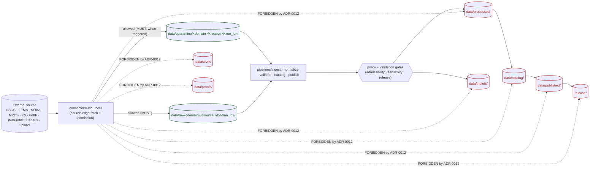
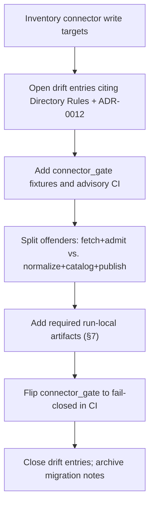

<!-- [KFM_META_BLOCK_V2]
doc_id: kfm://doc/adr-0012-connector-outputs-to-data-raw-or-data-quarantine-only
title: ADR-0012 — Connector outputs MUST land in data/raw/ or data/quarantine/ only
type: standard
version: v1.1
status: draft
owners: <Docs steward + Pipelines / Ingestion owner — TODO: confirm CODEOWNERS>
created: 2026-05-11
updated: 2026-05-15
policy_label: public
related:
  - docs/doctrine/directory-rules.md
  - docs/doctrine/lifecycle-law.md
  - docs/doctrine/trust-membrane.md
  - docs/adr/ADR-0001-schema-home.md
  - contracts/source/
  - schemas/contracts/v1/source/
  - tools/validators/connector_gate/
  - control_plane/policy_gate_register.yaml
tags: [kfm, adr, governance, lifecycle, connectors, ingestion, trust-membrane]
notes:
  - Codifies Directory Rules §5 / §7.3 / §9.1 / §13.5 as a numbered connector-boundary decision.
  - 2026-05-15 revision tightened draft-vs-authority language, receipt placement, validator expectations, and acceptance checks.
  - Repo-presence of cited paths is PROPOSED until verified against mounted-repo state.
[/KFM_META_BLOCK_V2] -->

# ADR-0012 — Connector outputs MUST land in `data/raw/` or `data/quarantine/` only

> Connectors are the source edge of the trust membrane. They fetch and admit; they do not normalize, catalog, promote, publish, or decide public truth.


<!-- TODO: replace placeholder badges with repo-linked CI / coverage / last-reviewed targets once verified. -->

| Field | Value |
|---|---|
| **ADR ID** | ADR-0012 |
| **Status** | `draft / proposed` *(PROPOSED — pending acceptance review)* |
| **Intended repo path** | `docs/adr/ADR-0012-connector-outputs-to-data-raw-or-data-quarantine-only.md` *(PROPOSED until repo inspection)* |
| **Date opened** | 2026-05-11 |
| **Last updated** | 2026-05-15 |
| **Owners** | Docs steward · Pipelines / Ingestion owner *(TODO — confirm against `CODEOWNERS`)* |
| **Supersedes** | none |
| **Superseded by** | none |
| **Related ADRs** | [ADR-0001 — schema home](./ADR-0001-schema-home.md) |
| **Touches Directory Rules §** | §5 (canonical root authority), §7.3 (connectors), §7.5 (validators), §9.1 (data lifecycle), §13.5 (anti-patterns) |

> [!IMPORTANT]
> **Authority boundary:** Directory Rules already state the connector-output rule. This draft ADR does not outrank Directory Rules until accepted. While this ADR is `draft / proposed`, cite Directory Rules for governing authority and cite **ADR-0012** as the proposed numbered handle. After acceptance, cite **ADR-0012** in PR descriptions, validator messages, and drift-register entries.

> [!NOTE]
> **Evidence boundary:** This document states KFM doctrine and proposed enforcement. Current repo implementation depth, path presence, validator behavior, CI workflow names, and emitted artifact shapes remain **UNKNOWN** until verified against a mounted repo, tests, workflows, logs, or generated artifacts.

---

## Quick jump

- [1. Context](#1-context)
- [2. Decision](#2-decision)
- [3. Normative rules (MUST / MUST NOT / SHOULD)](#3-normative-rules-must--must-not--should)
- [4. Boundary diagram](#4-boundary-diagram)
- [5. Allowed and forbidden write targets](#5-allowed-and-forbidden-write-targets)
- [6. Path conventions](#6-path-conventions)
- [7. Required emitted artifacts per run](#7-required-emitted-artifacts-per-run)
- [8. Enforcement](#8-enforcement)
- [9. Consequences](#9-consequences)
- [10. Alternatives considered](#10-alternatives-considered)
- [11. Migration plan](#11-migration-plan)
- [12. Rollback plan](#12-rollback-plan)
- [13. Open questions / NEEDS VERIFICATION](#13-open-questions--needs-verification)
- [14. Appendix](#14-appendix)

---

## 1. Context

KFM's lifecycle invariant is:

> **RAW → WORK / QUARANTINE → PROCESSED → CATALOG / TRIPLET → PUBLISHED**

Promotion across phases is a **governed state transition, not a file move**. The integrity of the chain depends on the source edge — the connector layer — staying narrow: connectors admit bytes, attach provenance, and stop. Anything past `data/raw/` or `data/quarantine/` belongs to pipelines, validators, policy gates, catalogers, proof-pack tooling, review surfaces, and the release plane.

Two patterns of doctrinal drift recur in projects of this shape and are explicitly named in KFM directory doctrine:

- **Connector publishes** — a connector writes to `data/processed/`, `data/catalog/`, or `data/published/`, collapsing the source edge into canonical or public-facing lifecycle phases.
- **Lifecycle skip** — a pipeline writes directly from `data/raw/` to `data/published/`, bypassing validation, policy, evidence closure, promotion, and release decisions.

The first failure mode is the connector-specific drift this ADR closes. Directory Rules §5 and §7.3 already state the rule in prose; ADR-0012 turns that rule into a numbered review object so future validators, CI jobs, migration plans, and drift entries can point to one stable decision.

### 1.1 Why connectors specifically

Connectors sit at the boundary between external source authority — for example USGS, FEMA, NOAA, NRCS, Kansas state agencies, GBIF, iNaturalist, Census, local uploads, or future source families — and KFM's internal lifecycle. They are the only layer where bytes that have *never* passed through a KFM validator, policy gate, or evidence-bundle resolver legitimately appear.

That makes connectors:

1. **High-trust to admit**, because they introduce raw material.
2. **Low-trust to publish**, because their outputs have not yet been validated, gated, cited, reviewed, or promoted.

A connector that writes anywhere past `data/raw/` or `data/quarantine/` puts unreviewed material into a directory whose semantics promise the opposite. That is the precise drift this ADR forbids.

### 1.2 What is in scope and out of scope

| In scope | Out of scope |
|---|---|
| Where connectors are permitted to write under `data/`. | The full semantic definition of a connector. See `contracts/source/` once verified. |
| Which run-local artifacts a connector must emit with fetched bytes. | Field-level source descriptor and ingest receipt shapes. See `schemas/contracts/v1/source/` once verified. |
| Enforcement surfaces: shared sink API, `connector_gate`, CI, drift register, and reviewer checks. | Specific Rego/OPA bundles for release admissibility. |
| Migration of connector code that violates this boundary. | Promotion logic from `data/raw/` to `data/work/`, `data/processed/`, `data/catalog/`, `data/triplets/`, or `data/published/`. |
| Public-path prohibition: no client or UI route invokes connectors or reads raw/quarantine outputs directly. | General public API design beyond this connector boundary. |

> [!NOTE]
> **Quarantine is not punishment.** Writing to `data/quarantine/` is a first-class, expected outcome used for failed validation, unresolved rights, sensitivity ambiguity, schema drift, integrity failure, or over-precise geometry. A connector that quarantines unresolved material is doing its job correctly.

---

## 2. Decision

**Connector payload outputs and run-local sidecars MUST land in exactly one of these two homes:**

```text
data/raw/<domain>/<source_id>/<run_id>/
data/quarantine/<domain>/<reason>/<run_id>/
```

A connector run **MUST NOT** write source payloads, normalized records, catalog records, graph projections, release artifacts, proof packs, public layers, or public API payloads anywhere else.

Equivalently:

- Connectors **MUST NOT** write to `data/work/`, `data/processed/`, `data/catalog/`, `data/triplets/`, `data/published/`, `data/proofs/`, `data/rollback/`, `release/`, or public app surfaces.
- Connectors **MUST NOT** mutate, overwrite, or delete files under any `data/` phase.
- Connectors **MUST** emit a SourceDescriptor, a content checksum manifest, and an IngestReceipt for every run, stored in the selected `<run_id>/` directory.
- If KFM later uses a centralized `data/receipts/ingest/` index, that index is a receipt-collection surface, not a connector payload-output target. A connector MAY only feed that surface through a governed receipt writer that is explicitly documented and append-only.
- Lifting bytes out of `data/raw/` or `data/quarantine/` is the job of `pipelines/` under `pipeline_specs/`, validators, policy gates, review, catalog closure, proof creation, and release decisioning.

After this ADR is accepted, changes to this boundary require a superseding ADR because the decision affects lifecycle phase boundaries, connector authority, and public trust controls.

---

## 3. Normative rules (MUST / MUST NOT / SHOULD)

Conformance language follows KFM Directory Rules: **MUST / MUST NOT** are non-negotiable absent an approved ADR; **SHOULD** is the strong default.

### 3.1 MUST

1. A connector **MUST** write source payload outputs only under:
   - `data/raw/<domain>/<source_id>/<run_id>/`, or
   - `data/quarantine/<domain>/<reason>/<run_id>/`.
2. A connector run **MUST** choose exactly one landing directory: raw **or** quarantine. It must not split one run's source payload between both homes.
3. A connector **MUST** emit, per run:
   - a **SourceDescriptor** record referencing `contracts/source/` semantics and the corresponding machine schema under `schemas/contracts/v1/source/` once verified;
   - a **content checksum manifest** covering every fetched payload object;
   - an **IngestReceipt** that identifies the run, source, retrieval state, checksum manifest, and evidence linkage posture.
4. Every run **MUST** be addressable by a deterministic `<run_id>` and **MUST** be append-only at file granularity.
5. A connector **MUST** route the run into `data/quarantine/` rather than `data/raw/` when any of the following is true at admission time:
   - source-descriptor validation fails;
   - rights are unresolved;
   - sensitivity is ambiguous;
   - schema drift is detected;
   - an integrity check fails;
   - geometry precision is too high for the current policy state;
   - source identity, retrieval state, or content checksums are incomplete.
6. A production connector **MUST** be invoked through a governed ingest path such as `apps/workers/`, `pipelines/ingest/`, or the repo-confirmed equivalent. Exact module names are **NEEDS VERIFICATION**.
7. A local upload path **MUST** behave as a connector family. Admin or reviewer uploads must route through `connectors/local_upload/` or the repo-confirmed equivalent and then land in raw/quarantine, never directly in processed, catalog, published, proofs, or release homes.

### 3.2 MUST NOT

1. A connector **MUST NOT** write source payloads, normalized objects, catalog records, proof objects, release decisions, or public artifacts to any of:
   - `data/work/`
   - `data/processed/`
   - `data/catalog/`
   - `data/triplets/`
   - `data/published/`
   - `data/proofs/`
   - `data/rollback/`
   - `release/`
   - public API/UI app directories
2. A connector **MUST NOT** write validation, pipeline, AI, release, rollback, or proof receipts. Those are emitted by their owning stages.
3. A connector **MUST NOT** mutate or delete files under any `data/` phase. Corrections, withdrawals, supersessions, and rollbacks are governed elsewhere.
4. A connector **MUST NOT** be reachable from `apps/explorer-web/`, client routes, browser code, public Focus Mode, public map popups, or any normal UI surface.
5. A connector **MUST NOT** decide public admissibility. The connector reports facts; policy and review decide exposure.
6. A connector **MUST NOT** normalize records, join records across source files, rename source fields into canonical fields, infer claims, or generate catalog entries. Those are pipeline and catalog responsibilities.
7. A connector **MUST NOT** create or modify schemas, contracts, policies, source registries, release manifests, rollback cards, correction notices, or documentation as part of a source run.

### 3.3 SHOULD

1. A connector **SHOULD** record retrieval metadata inside its IngestReceipt, including URL, retrieval timestamp, source headers as policy allows, retry count, response status, content hash, and source version hints.
2. A connector **SHOULD** be idempotent on `<run_id>`: re-running the same `<run_id>` with the same source state should produce the same bytes and checksum manifest.
3. A connector **SHOULD** fail closed: when neither `data/raw/` nor `data/quarantine/` is clearly correct, route to `data/quarantine/<domain>/unclassified/<run_id>/` with a reason note and verification-backlog entry.
4. A connector **SHOULD** keep payload bytes as close as practical to source form. Any unavoidable transport-level unpacking or decompression must be recorded in the IngestReceipt.

> [!CAUTION]
> "Quietly normalizing" inside a connector is a violation even if the output still lands under `data/raw/`. Connectors admit bytes as the source produced them; any transformation that changes record shape, joins records, changes coordinate precision, or turns source fields into canonical fields is a pipeline responsibility.

---

## 4. Boundary diagram

The diagram below shows the allowed write surface for connectors and the disallowed surfaces guarded by this ADR.



> [!NOTE]
> The dotted arrows are the path classes the `connector_gate` validator (§8) is responsible for refusing.

---

## 5. Allowed and forbidden write targets

| Target | Allowed for connectors? | Why |
|---|---:|---|
| `data/raw/<domain>/<source_id>/<run_id>/` | ✅ **Yes** | Source-edge admission, immutable, with provenance and checksums. |
| `data/quarantine/<domain>/<reason>/<run_id>/` | ✅ **Yes** | Failed, unresolved, ambiguous, or policy-unsafe material belongs here until remediated. |
| `data/receipts/ingest/` | ⚠️ **Not as a payload target** | A governed receipt writer MAY mirror/index IngestReceipts here if repo convention requires it. Connector payload output still belongs only in raw/quarantine. |
| `data/registry/` | ❌ **No writes** | Registries are governed source/layer/dataset/rights/sensitivity records. Connectors may read approved descriptors; they do not create registry authority during source runs. |
| `data/work/` | ❌ **No** | Normalized intermediates and candidate assertions are pipeline territory. |
| `data/processed/` | ❌ **No** | Validated canonical records are pipeline + policy territory and are not public by default. |
| `data/catalog/` | ❌ **No** | STAC/DCAT/PROV and domain catalog records are catalog closure territory. |
| `data/triplets/` | ❌ **No** | Graph projections are derived relationship outputs, never connector outputs. |
| `data/published/` | ❌ **No** | Public-safe artifacts require promotion and release decisioning. |
| `data/proofs/` | ❌ **No** | EvidenceBundle, ProofPack, integrity bundles, and validation reports are proof-family outputs. |
| `data/rollback/` | ❌ **No** | Rollback cards and alias-revert receipts are rollback/release-plane objects. |
| `release/` | ❌ **No** | Release manifests, promotion decisions, rollback cards, correction notices, withdrawal notices, and signatures are release decisions. |
| Anywhere outside `data/` | ❌ **No** | Connectors do not emit code, configs, schemas, contracts, docs, policies, registries, app routes, or release files during source runs. |

---

## 6. Path conventions

The two allowed homes follow the canonical lane pattern from KFM Directory Rules.

### 6.1 Raw

```text
data/raw/
└── <domain>/                 # e.g., hydrology, soil, fauna, hazards, archaeology
    └── <source_id>/          # e.g., usgs-nhd, fema-nfhl, noaa-coop, gbif
        └── <run_id>/         # deterministic, sortable run identifier
            ├── source_descriptor.json
            ├── checksums.sha256
            ├── ingest_receipt.json
            └── payload/      # fetched bytes, untransformed except documented transport handling
```

### 6.2 Quarantine

```text
data/quarantine/
└── <domain>/
    └── <reason>/             # proposed vocabulary below
        └── <run_id>/
            ├── source_descriptor.json
            ├── checksums.sha256
            ├── ingest_receipt.json
            ├── quarantine_reason.md
            └── payload/
```

Proposed `<reason>` vocabulary:

| Reason | Use |
|---|---|
| `validation` | Source descriptor, envelope, or structural validation failed. |
| `rights` | Source rights, terms, attribution, or reuse authority unresolved. |
| `sensitivity` | Sensitivity status unresolved or likely restricted. |
| `schema_drift` | Source shape changed outside expected descriptor. |
| `integrity` | Checksum, size, signature, or retrieval integrity failed. |
| `geometry_precision` | Geometry is too precise for current policy/review state. |
| `unclassified` | Connector cannot safely classify the failure yet. |

> [!TIP]
> `<run_id>` SHOULD be deterministic, sortable, and tied to source state, such as `<UTC-timestamp>-<short-hash-of-source-head>`. Exact encoding is left to a follow-up identifier rule or repo-native convention.

### 6.3 Domain segments

Domain segments follow Directory Rules responsibility-root discipline: domains are **lanes inside `data/`**, not root-level folders. The connector itself lives under `connectors/<source_family>/`; the `<domain>` segment in the output path encodes lifecycle-side responsibility, not connector identity.

---

## 7. Required emitted artifacts per run

| Artifact | Path within `<run_id>/` | Contract | Schema *(default per ADR-0001)* | Notes |
|---|---|---|---|---|
| **SourceDescriptor** | `source_descriptor.json` | `contracts/source/source_descriptor` | `schemas/contracts/v1/source/source_descriptor.schema.json` | Identity, source role, rights, retrieval method, sensitivity hints, and source authority posture. |
| **Content checksums** | `checksums.sha256` | n/a (operational artifact) | n/a | One line per payload file. Algorithm SHOULD be SHA-256 unless a stronger domain-specific rule is mandated. |
| **IngestReceipt** | `ingest_receipt.json` | `contracts/source/ingest_receipt` | `schemas/contracts/v1/source/ingest_receipt.schema.json` | Run-scoped process memory; records retrieval, source head, checksum manifest, and EvidenceRef linkage posture. |
| **QuarantineReason** | `quarantine_reason.md` | n/a (operational artifact) | n/a | Required only for quarantine outputs. Plain-text rationale plus machine-readable reason tag. |
| **Payload** | `payload/...` | n/a — bytes as the source produced them | n/a | Untransformed. No re-encoding, no field renaming, no joining across files, no canonicalization. |

> [!IMPORTANT]
> Paths and schema filenames in this table are **PROPOSED** until verified against mounted-repo state. The governing rule is that these artifact families exist per run and are traceable; if repo verification shows different filenames, update the table without weakening the boundary.

### 7.1 Receipt placement rule

The run-local `ingest_receipt.json` is required because it travels with the admitted material. If a future receipt collector also writes a central index under `data/receipts/ingest/`, it must:

- copy or reference the run-local receipt without changing its meaning;
- preserve append-only behavior;
- include a pointer back to `data/raw/.../<run_id>/` or `data/quarantine/.../<run_id>/`;
- never promote, publish, or imply release readiness by itself.

---

## 8. Enforcement

Enforcement layers run from earliest catch to latest catch.

1. **Connector runtime / shared sink API** — the shared connector runtime *(PROPOSED — exact package path NEEDS VERIFICATION)* exposes only governed sinks such as `write_raw(...)` and `write_quarantine(...)`. Connector code has no API for writing elsewhere under `data/`.
2. **`connector_gate` validator** — the validator family named in Directory Rules §7.5 *(repo presence and implementation behavior NEEDS VERIFICATION)* inspects connector outputs and refuses any run that:
   - writes outside `data/raw/<domain>/<source_id>/<run_id>/` or `data/quarantine/<domain>/<reason>/<run_id>/`;
   - omits any required run-local artifact from §7;
   - writes to forbidden lifecycle phases or release/proof/catalog homes;
   - mutates or deletes existing lifecycle files;
   - emits a payload file whose hash is not present in `checksums.sha256`;
   - emits a raw payload and quarantine payload under the same `<run_id>`.
3. **CI workflow** — a CI job *(PROPOSED — exact workflow path NEEDS VERIFICATION)* runs the validator on every PR that touches `connectors/**`, `pipelines/ingest/**`, `pipeline_specs/**`, connector fixtures, or source descriptor files. It fails closed on unknown path classes.
4. **Drift register** — any production-time or review-time violation opens a `docs/registers/DRIFT_REGISTER.md` entry citing Directory Rules and, once accepted, **ADR-0012**.
5. **Reviewer checklist** — connector PRs require an explicit ADR-0012 check once this ADR is accepted.

### 8.1 `connector_gate` minimum report shape

`connector_gate` SHOULD emit a machine-readable report with at least:

| Field | Purpose |
|---|---|
| `validator_id` | Stable validator identity and version. |
| `adr_refs` | Includes `ADR-0012` once accepted. |
| `run_id` | Connector run being inspected. |
| `source_id` | Source descriptor identifier. |
| `landing_path` | Raw or quarantine path inspected. |
| `forbidden_writes` | List of forbidden target paths, if any. |
| `required_artifacts_present` | Boolean plus missing artifact list. |
| `checksum_coverage` | Payload count, checksum count, mismatch list. |
| `mutation_detected` | Whether existing lifecycle files were changed or deleted. |
| `decision` | `PASS`, `DENY`, or `ERROR` for validator outcome. |
| `reasons` | Human-readable and machine-readable reason codes. |

> [!WARNING]
> Connector PRs that disable, weaken, or skip `connector_gate` are **MUST NOT** changes under this ADR. The only way to bypass `connector_gate` is a superseding ADR or an emergency break-glass process that records a drift entry, reviewer, scope, expiry, and rollback target.

### 8.2 Reviewer checklist

For any PR that changes connector code, connector fixtures, source descriptors, or ingest specs:

- [ ] Connector payloads land only in `data/raw/` or `data/quarantine/`.
- [ ] Exactly one landing path is used per `<run_id>`.
- [ ] SourceDescriptor, checksum manifest, and IngestReceipt are present per run.
- [ ] Quarantine outputs include `quarantine_reason.md`.
- [ ] Connector code has no write path to `data/work/`, `data/processed/`, `data/catalog/`, `data/triplets/`, `data/published/`, `data/proofs/`, `release/`, app routes, schemas, contracts, docs, or policy.
- [ ] Any central receipt indexing is append-only and points back to the run-local receipt.
- [ ] Invalid fixtures prove forbidden writes are denied.
- [ ] The PR body states whether exact repo path presence was verified.

---

## 9. Consequences

### 9.1 Positive

- The trust membrane has a machine-checkable source edge.
- "Connector publishes" becomes a CI-detectable defect rather than a tribal-knowledge concern.
- Lifecycle skip is harder to commit accidentally because connector code has no legal path to `data/processed/`, `data/catalog/`, `data/triplets/`, `data/published/`, `data/proofs/`, or `release/`.
- IngestReceipts uniformly anchor every admitted payload so downstream EvidenceRef resolution can trace back to a connector run.
- The split between `connectors/` (fetch + admit) and `pipelines/` (normalize + validate + catalog + publish) is sharpened.

### 9.2 Negative / costs

- Existing connectors that wrote directly into `data/work/`, `data/processed/`, `data/catalog/`, or `data/published/` — if any — require migration. Current count is **UNKNOWN** without repo inspection.
- Tightly coupled "fetch + normalize" code must be split into a connector and a pipeline step.
- `connector_gate` must exist, stay green, and receive negative fixture coverage.
- Early connector PRs may move more slowly because source descriptors, checksums, receipts, and quarantine reason paths become mandatory.

### 9.3 Neutral

- The doctrinal rule itself does not change. ADR-0012 turns an existing Directory Rules invariant into a numbered ADR handle and a validator-facing acceptance contract.

---

## 10. Alternatives considered

<details>
<summary><b>Alternative A — Allow connectors to write to <code>data/work/</code> as well</b></summary>

**Rejected.** `data/work/` holds normalized intermediates and candidate assertions — outputs of pipelines after admission. Letting connectors write there collapses admit and normalize responsibilities into one layer and recreates the connector-publishes drift in a softer form.

</details>

<details>
<summary><b>Alternative B — Allow connectors to write directly to <code>data/processed/</code> for "trusted" sources</b></summary>

**Rejected.** "Trusted source" is a policy and evidence-role judgement, not a connector-layer property. Even highly authoritative sources require validation, rights handling, sensitivity checks, evidence closure, and catalog/release review before becoming canonical or public-safe.

</details>

<details>
<summary><b>Alternative C — Make the rule advisory (SHOULD) rather than mandatory (MUST)</b></summary>

**Rejected.** Directory Rules already state this as a mandatory connector boundary. Demoting it would create a conflict and weaken the source edge of the trust membrane.

</details>

<details>
<summary><b>Alternative D — Allow a special <code>data/staging/</code> tier between raw and work</b></summary>

**Rejected for this ADR.** Adding a lifecycle phase requires its own ADR. If a staging tier becomes desirable later, it must define validators, contracts, receipts, policy posture, and promotion semantics. ADR-0012 does not pre-authorize it.

</details>

<details>
<summary><b>Alternative E — Enforce the rule purely by code review, not by validator</b></summary>

**Rejected.** Code review does not scale across domains and source families and does not catch production-time violations. `connector_gate` is required for this rule to be enforceable rather than merely stated.

</details>

<details>
<summary><b>Alternative F — Let connectors write central receipts directly</b></summary>

**Rejected as the default.** Connector run-local receipts are required. Any central `data/receipts/ingest/` record must be handled by a governed receipt writer or collector so that receipt indexing does not become a general exception to "raw/quarantine only."

</details>

---

## 11. Migration plan

Migration is **PROPOSED**. Exact scope depends on mounted-repo inspection.

### 11.1 Inventory

1. Inspect `connectors/**` for any code path that writes outside `data/raw/` or `data/quarantine/`. *(NEEDS VERIFICATION)*
2. Inspect `pipelines/ingest/**` and `pipeline_specs/**` for declarative outputs that route source fetches anywhere else. *(NEEDS VERIFICATION)*
3. Inspect connector fixtures for raw/quarantine-only coverage and forbidden-write negative cases. *(NEEDS VERIFICATION)*
4. Record findings as drift entries in `docs/registers/DRIFT_REGISTER.md`, each citing Directory Rules and, once accepted, **ADR-0012**.

### 11.2 Remediate

For each finding:

1. Split the offending module into:
   - a **connector**: fetch + admit + run-local sidecars;
   - a **pipeline step**: normalize, validate, catalog, triplet, publish, or rollback.
2. Move connector payload writes to `data/raw/` or `data/quarantine/`.
3. Add required artifacts from §7.
4. Add or update `connector_gate` fixtures:
   - valid raw run;
   - valid quarantine run;
   - forbidden `data/processed/` write;
   - forbidden `data/catalog/` write;
   - forbidden `data/published/` write;
   - missing checksum manifest;
   - missing IngestReceipt;
   - split raw/quarantine run.
5. Add a migration note under the repo-confirmed migration home, with before/after paths, affected source families, validator evidence, and rollback target.
6. Wire `connector_gate` into CI for affected paths.

### 11.3 Sequence



> [!NOTE]
> The **advisory → fail-closed** transition for `connector_gate` is the load-bearing step. Skipping the advisory window risks blocking unrelated PRs on pre-existing drift.

---

## 12. Rollback plan

This ADR is doctrine-codification, not a runtime migration by itself. Rollback is light-touch but governed.

| If… | Then… |
|---|---|
| `connector_gate` proves too brittle in advisory mode | Keep the rule; tune the validator. Validator bugs do not invalidate the connector boundary. |
| A genuine doctrinal exception emerges | Open a superseding ADR. Do not silently weaken this ADR or the validator. |
| A connector migration breaks a source family | Revert that connector migration, retain drift entry, and keep `connector_gate` advisory for that family until remediation is complete. |
| ADR-0012 is rejected | Retain this file with `status: rejected`; Directory Rules remain governing authority. Remove ADR-0012-specific validator messaging, but keep Directory Rules enforcement. |
| ADR-0012 is superseded | Mark `status: superseded`, link forward to the replacing ADR, and retain this file with history. |

There is no destructive rollback path for the ADR text. Runtime rollback applies only to follow-on connector, validator, CI, or migration PRs.

---

## 13. Open questions / NEEDS VERIFICATION

These items are unresolved in this documentation-only revision and SHOULD be tracked in `docs/registers/VERIFICATION_BACKLOG.md` or the repo-confirmed verification backlog.

- **NEEDS VERIFICATION** — whether `connector_gate` exists today in `tools/validators/connector_gate/`, and whether it already enforces raw/quarantine-only outputs.
- **NEEDS VERIFICATION** — exact filenames and schema `$id` values for `source_descriptor.json` and `ingest_receipt.json`.
- **NEEDS VERIFICATION** — whether a central `data/receipts/ingest/` writer exists and whether it is connector-owned, pipeline-owned, or validator-owned.
- **NEEDS VERIFICATION** — current set of connector families under `connectors/`.
- **NEEDS VERIFICATION** — whether `pipelines/ingest/` is the canonical promotion entry point from `data/raw/` to `data/work/`, or whether the repo uses another admission pipeline name.
- **OPEN** — final controlled vocabulary for `<reason>` segments under `data/quarantine/`.
- **OPEN** — whether `<run_id>` format is governed by this ADR or by a separate identifier ADR. This ADR requires determinism only.
- **OPEN** — interaction with `apps/admin/` upload paths. `local_upload/` must behave as a connector family, but a follow-up ADR may need to make admin-upload routing explicit.

---

## 14. Appendix

<details>
<summary><b>A. Cross-references in Directory Rules</b></summary>

| Directory Rules § | Topic | Relation to ADR-0012 |
|---|---|---|
| §3 | Deeper Rule / root authority | Connectors are an implementation root; their outputs land in the `data/` lifecycle root. |
| §5 | Canonical root tree | Per-root authority notes that connectors output to raw/quarantine and do not publish. |
| §7.1 | Apps and trust membrane | Public apps must use the governed API and cannot invoke source-edge fetchers. |
| §7.3 | `connectors/` root | Primary prose statement of this ADR's connector-output rule. |
| §7.5 | `tools/validators/` | Names `connector_gate` as the validator family for connector-boundary enforcement. |
| §9.1 | `data/` lifecycle | Defines lifecycle phases, raw/quarantine semantics, receipts/proofs separation, and promotion as governance. |
| §13.5 | Anti-patterns | "Connector publishes" and "Lifecycle skip" are the exact failures this ADR forbids. |
| §14 | Migration discipline | Applies when existing connector paths must be moved or split. |
| §19 | Glossary | Defines lifecycle invariant, promotion, trust membrane, EvidenceBundle, ReleaseManifest, RollbackCard, and watcher-as-non-publisher. |

</details>

<details>
<summary><b>B. Glossary (placement-relevant subset)</b></summary>

| Term | Definition |
|---|---|
| **Connector** | Source-edge module under `connectors/<source_family>/` that fetches external bytes and admits them into `data/raw/` or `data/quarantine/`. Does not normalize, catalog, promote, publish, or decide public exposure. |
| **SourceDescriptor** | Source identity, role, rights, retrieval, and sensitivity record. One per connector run or source run context. |
| **IngestReceipt** | Run-scoped process-memory object recording retrieval, source head, checksum manifest, and evidence linkage posture. |
| **Run** | An invocation of one connector that produces exactly one `<run_id>` directory under raw or quarantine. |
| **Promotion** | Governed state transition between lifecycle phases. Pipeline, validation, policy, review, proof, and release responsibility; never connector responsibility. |
| **Trust membrane** | Boundary preventing raw, unreviewed, model-generated, internal, or policy-unsafe state from becoming public truth. Operationally, public clients use the governed API and released artifacts. |
| **Connector publishes** | Anti-pattern where connector output bypasses lifecycle gates and lands in processed, catalog, published, release, or public surfaces. |

</details>

<details>
<summary><b>C. Reviewer one-liner</b></summary>

> *"Does every connector run land in exactly one `data/raw/<domain>/<source_id>/<run_id>/` or `data/quarantine/<domain>/<reason>/<run_id>/` directory, with a SourceDescriptor, checksum manifest, IngestReceipt, and no writes anywhere else?"*

If the answer is not **yes** for every changed connector path, request changes and cite Directory Rules plus **ADR-0012** once accepted.

</details>

<details>
<summary><b>D. Minimal negative fixture set</b></summary>

| Fixture | Expected outcome |
|---|---|
| Connector writes to `data/processed/<domain>/...` | `DENY` |
| Connector writes to `data/catalog/stac/<domain>/...` | `DENY` |
| Connector writes to `data/published/layers/...` | `DENY` |
| Connector writes to `release/manifests/...` | `DENY` |
| Connector output lacks `checksums.sha256` | `DENY` |
| Connector output lacks `ingest_receipt.json` | `DENY` |
| Connector run writes both raw and quarantine payloads | `DENY` |
| Connector mutates existing raw run | `DENY` |
| Validator cannot classify target path | `ERROR` |
| Source rights are unknown | quarantine required |

</details>

---

## Related docs

- [Directory Rules](../doctrine/directory-rules.md) — §5, §7.1, §7.3, §7.5, §9.1, §13.5, §14, §19
- [Lifecycle Law](../doctrine/lifecycle-law.md) *(PROPOSED location; verify against repo)*
- [Trust Membrane](../doctrine/trust-membrane.md) *(PROPOSED location; verify against repo)*
- [ADR-0001 — schema home](./ADR-0001-schema-home.md)
- [`contracts/source/`](../../contracts/source/) — SourceDescriptor, IngestReceipt meaning *(verify path)*
- [`schemas/contracts/v1/source/`](../../schemas/contracts/v1/source/) — machine schema home *(verify path)*
- [`tools/validators/connector_gate/`](../../tools/validators/connector_gate/) *(NEEDS VERIFICATION)*
- [`docs/registers/DRIFT_REGISTER.md`](../registers/DRIFT_REGISTER.md) *(NEEDS VERIFICATION)*
- [`docs/registers/VERIFICATION_BACKLOG.md`](../registers/VERIFICATION_BACKLOG.md) *(NEEDS VERIFICATION)*

---

*Last updated: 2026-05-15 · Version: v1.1 (draft / proposed) · ADR-0012*

[⬆ Back to top](#adr-0012--connector-outputs-must-land-in-dataraw-or-dataquarantine-only)
