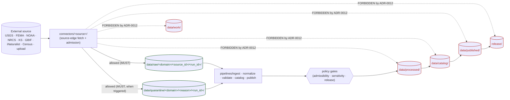
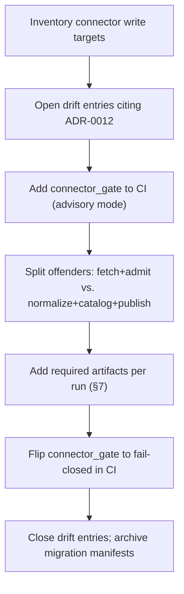

<!-- [KFM_META_BLOCK_V2]
doc_id: kfm://doc/adr-0012-connector-outputs-to-data-raw-or-data-quarantine-only
title: ADR-0012 — Connector outputs MUST land in data/raw/ or data/quarantine/ only
type: standard
version: v1
status: draft
owners: <Docs steward + Pipelines / Ingestion owner — TODO: confirm CODEOWNERS>
created: 2026-05-11
updated: 2026-05-11
policy_label: public
related:
  - docs/doctrine/directory-rules.md
  - docs/doctrine/lifecycle-law.md
  - docs/doctrine/trust-membrane.md
  - docs/adr/ADR-0001-schema-home.md
  - contracts/source/
  - tools/validators/connector_gate/
  - control_plane/policy_gate_register.yaml
tags: [kfm, adr, governance, lifecycle, connectors, ingestion, trust-membrane]
notes:
  - Codifies Directory Rules §5 / §7.3 / §13.5 as a numbered, enforceable decision.
  - Repo-presence of cited paths is PROPOSED until verified against mounted-repo state.
[/KFM_META_BLOCK_V2] -->

# ADR-0012 — Connector outputs MUST land in `data/raw/` or `data/quarantine/` only

> Connectors are the source edge of the trust membrane. They fetch and admit; they do not normalize, catalog, or publish. This ADR makes that boundary a numbered, enforceable invariant.


<!-- TODO: replace placeholder badges with repo-linked CI / coverage / last-reviewed targets once verified. -->

| Field | Value |
|---|---|
| **ADR ID** | ADR-0012 |
| **Status** | `proposed` *(PROPOSED — pending acceptance review)* |
| **Date** | 2026-05-11 |
| **Owners** | Docs steward · Pipelines / Ingestion owner *(TODO — confirm against `CODEOWNERS`)* |
| **Last reviewed** | 2026-05-11 |
| **Supersedes** | none |
| **Superseded by** | none |
| **Related ADRs** | [ADR-0001 — schema home](./ADR-0001-schema-home.md) |
| **Touches Directory Rules §** | §5 (canonical root authority), §7.3 (connectors), §9.1 (data lifecycle), §13.5 (anti-patterns) |

---

## Quick jump

- [1. Context](#1-context)
- [2. Decision](#2-decision)
- [3. Normative rules (MUST / MUST NOT / SHOULD)](#3-normative-rules-must--must-not--should)
- [4. Boundary diagram](#4-boundary-diagram)
- [5. Allowed and forbidden write targets](#5-allowed-and-forbidden-write-targets)
- [6. Path conventions](#6-path-conventions)
- [7. Required emitted artifacts per run](#7-required-emitted-artifacts-per-run)
- [8. Enforcement](#8-enforcement)
- [9. Consequences](#9-consequences)
- [10. Alternatives considered](#10-alternatives-considered)
- [11. Migration plan](#11-migration-plan)
- [12. Rollback plan](#12-rollback-plan)
- [13. Open questions / NEEDS VERIFICATION](#13-open-questions--needs-verification)
- [14. Appendix](#14-appendix)

---

## 1. Context

KFM's lifecycle invariant is:

> **RAW → WORK / QUARANTINE → PROCESSED → CATALOG / TRIPLET → PUBLISHED**

Promotion across phases is a **governed state transition, not a file move** (Directory Rules §9.1, lifecycle-law). The integrity of the chain depends on the source edge — the connector layer — staying narrow: connectors admit bytes, attach provenance, and stop. Anything past `data/raw/` or `data/quarantine/` belongs to pipelines, validators, policy gates, catalogers, and the release plane.

Two patterns of doctrinal drift recur in projects of this shape and have already been flagged in KFM doctrine:

- **Connector publishes** — a connector writes to `data/processed/`, `data/catalog/`, or `data/published/`, collapsing the source edge into the canonical store. *(Directory Rules §13.5)*
- **Lifecycle skip** — a pipeline writes directly to `data/published/` from `data/raw/`, bypassing validation, promotion, and release decisions. *(Directory Rules §13.5)*

The first of these is the connector-specific failure mode this ADR closes. Directory Rules §5 (per-root authority) and §7.3 already state the rule in prose; ADR-0012 promotes it to a numbered, citable decision so reviewers, validators, and CI can reference one anchor.

> [!IMPORTANT]
> This ADR **codifies** an invariant already present in Directory Rules. It does not invent new authority. Treat it as the canonical handle for the rule going forward — cite **ADR-0012** in PR descriptions, validator messages, and drift register entries.

### 1.1 Why connectors specifically

Connectors sit at the boundary between external source authority (USGS, FEMA, NOAA, NRCS, Kansas state agencies, GBIF, iNaturalist, Census, local upload, etc.) and KFM's internal lifecycle. They are the only layer where bytes that have *never* been through a KFM validator, policy gate, or evidence-bundle resolver legitimately appear. That makes them:

1. **High-trust to admit**, because they introduce raw material.
2. **Low-trust to publish**, because their outputs have not yet been validated, gated, cited, or reviewed.

A connector that writes anywhere past `data/raw/` or `data/quarantine/` puts unreviewed bytes into a directory whose semantics promise the opposite. That is the precise drift this ADR forbids.

### 1.2 What is in scope and out of scope

| In scope | Out of scope |
|---|---|
| Where connectors are permitted to write under `data/`. | What a connector *is* semantically (see `contracts/source/`). |
| What artifacts a connector run must emit alongside fetched bytes. | The shape of source descriptors and ingest receipts (see `schemas/contracts/v1/source/`, `schemas/contracts/v1/evidence/`). |
| Enforcement surface (validator name, CI gate, drift register handling). | Specific Rego/OPA policy bundles for admission decisions. |
| Migration of existing connector code that violates the rule. | Promotion logic from `data/raw/` to `data/work/` or `data/processed/`. |

> [!NOTE]
> **Quarantine is not punishment.** Writing to `data/quarantine/` is a first-class, expected outcome — used for failed validation, unresolved rights, sensitivity ambiguity, schema drift, or over-precise geometry. A connector that quarantines is doing its job correctly.

---

## 2. Decision

**Connector outputs MUST land in `data/raw/<domain>/<source_id>/<run_id>/` or `data/quarantine/<domain>/<reason>/<run_id>/` — and nowhere else under `data/`.**

Equivalently:

- Connectors **MUST NOT** write to `data/work/`, `data/processed/`, `data/catalog/`, `data/triplets/`, `data/published/`, `data/receipts/<non-ingest>/`, `data/proofs/`, `data/rollback/`, or `release/`.
- Connectors **MUST NOT** mutate, overwrite, or delete files under any `data/` phase other than appending net-new files under their assigned `<run_id>` directory.
- Connectors **MUST** emit a source descriptor, a content checksum manifest, and an **IngestReceipt** for every run, alongside the fetched bytes.
- Lifting bytes out of `data/raw/` or `data/quarantine/` is the job of `pipelines/` (executable) under `pipeline_specs/` (declarative). Promotion is a **governed state transition**, not a connector responsibility.

This decision is intended to be **stable**. Changes require a new ADR per Directory Rules §2.4 (lifecycle-phase changes, schema-home changes, parallel-authority creation).

---

## 3. Normative rules (MUST / MUST NOT / SHOULD)

Conformance language follows Directory Rules §2.2 (RFC 2119-style).

### 3.1 MUST

1. A connector **MUST** write only under `data/raw/<domain>/<source_id>/<run_id>/` or `data/quarantine/<domain>/<reason>/<run_id>/`.
2. A connector **MUST** emit, per run:
   - a **SourceDescriptor** record referencing `contracts/source/` semantics and the corresponding schema under `schemas/contracts/v1/source/`;
   - a **content checksum manifest** covering every fetched byte object (default: SHA-256);
   - an **IngestReceipt** referencing `contracts/source/ingest_receipt` and resolvable to an EvidenceRef.
3. Every run **MUST** be addressable by a deterministic `<run_id>` and **MUST** be append-only at file granularity.
4. A connector **MUST** route into `data/quarantine/` (not `data/raw/`) when any of the following is true at admission time: failed source-descriptor validation, unresolved rights, sensitivity ambiguity, schema drift, integrity-check failure, or over-precise geometry without policy approval.
5. A connector **MUST** be invoked through the canonical pipeline surface (`pipelines/ingest/` or its declarative spec in `pipeline_specs/`), not by ad-hoc scripts in production paths. *(PROPOSED — exact module names are NEEDS VERIFICATION against the mounted repo.)*

### 3.2 MUST NOT

1. A connector **MUST NOT** write to any of:
   - `data/work/`
   - `data/processed/`
   - `data/catalog/`
   - `data/triplets/`
   - `data/published/`
   - `data/proofs/`
   - `data/rollback/`
   - `data/receipts/` *(except for `data/receipts/ingest/` produced by the connector's own IngestReceipt emission)*
   - `release/`
2. A connector **MUST NOT** mutate or delete files under any `data/` phase. Corrections and rollbacks are governed elsewhere (`release/correction_notices/`, `release/rollback_cards/`, `data/rollback/`).
3. A connector **MUST NOT** be reachable from `apps/explorer-web/`, `apps/governed-api/` public surfaces, or any client route. Connectors run in `apps/workers/` / `pipelines/ingest/` and emit to disk; the trust membrane (Directory Rules §7.1) sits between them and the public path.
4. A connector **MUST NOT** be the layer that decides admissibility — that is `policy/` (admissibility) and `policy/sensitivity/` (sensitivity). The connector reports facts; policy decides what to do with them.

### 3.3 SHOULD

1. A connector **SHOULD** record retrieval metadata (URL, HTTP status, headers as policy allows, retrieval timestamp, retry count) inside its IngestReceipt.
2. A connector **SHOULD** be idempotent on `<run_id>` — re-running the same `<run_id>` with the same source state MUST NOT produce divergent bytes.
3. A connector **SHOULD** fail closed: on any unresolved condition where neither `data/raw/` nor `data/quarantine/` is clearly correct, route to `data/quarantine/<domain>/unclassified/<run_id>/` with a reason note and a verification-backlog entry.

> [!CAUTION]
> "Quietly normalizing" inside a connector is a violation even if the output still lands under `data/raw/`. Connectors admit bytes as the source produced them; any transformation that changes record shape or content is a pipeline responsibility under `pipelines/normalize/`.

---

## 4. Boundary diagram

The diagram below shows the allowed write surface for connectors and the disallowed surfaces guarded by this ADR.



> [!NOTE]
> The dotted arrows are the *exact* set of paths the `connector_gate` validator (§8) is responsible for refusing.

---

## 5. Allowed and forbidden write targets

| Target | Allowed for connectors? | Why |
|---|---|---|
| `data/raw/<domain>/<source_id>/<run_id>/` | ✅ MUST be one of the two outputs | Source-edge admission, immutable, with provenance and checksums. |
| `data/quarantine/<domain>/<reason>/<run_id>/` | ✅ MUST be the output when admission criteria fail | Holds failed-validation, rights-unresolved, sensitivity-ambiguous, schema-drift, over-precise material. |
| `data/receipts/ingest/` | ✅ *(only for the connector's own IngestReceipt)* | Receipts of the run; emitted alongside bytes, not in place of them. |
| `data/work/` | ❌ MUST NOT | Normalized intermediates — pipeline territory. |
| `data/processed/` | ❌ MUST NOT | Validated canonical records — pipeline + policy territory. |
| `data/catalog/` | ❌ MUST NOT | STAC/DCAT/PROV records — cataloger territory. |
| `data/triplets/` | ❌ MUST NOT | Graph projections — triplet pipeline territory. |
| `data/published/` | ❌ MUST NOT | Public-safe artifacts — release territory. |
| `data/proofs/` | ❌ MUST NOT | EvidenceBundle / ProofPack — proof-pack tooling territory. |
| `data/rollback/` | ❌ MUST NOT | Alias-revert receipts — release plane. |
| `data/registry/` | ❌ MUST NOT (write); read-only reference is fine | Append-only registry — governed elsewhere. |
| `release/` | ❌ MUST NOT | Release decisions — `apps/review-console/` + release pipeline territory. |
| Anywhere outside `data/` | ❌ MUST NOT | Connectors do not emit code, configs, schemas, contracts, or docs. |

---

## 6. Path conventions

The two allowed homes follow the canonical lane pattern from Directory Rules §9.1 and §12.

### 6.1 Raw

```text
data/raw/
└── <domain>/                 # e.g., hydrology, soil, fauna, hazards, archaeology
    └── <source_id>/          # e.g., usgs-nhd, fema-nfhl, noaa-coop, gbif
        └── <run_id>/         # deterministic, sortable run identifier
            ├── source_descriptor.json
            ├── checksums.sha256
            ├── ingest_receipt.json
            └── payload/      # the fetched bytes, untransformed
```

### 6.2 Quarantine

```text
data/quarantine/
└── <domain>/
    └── <reason>/             # one of: validation, rights, sensitivity, schema_drift,
        │                     #         integrity, geometry_precision, unclassified
        └── <run_id>/
            ├── source_descriptor.json
            ├── checksums.sha256
            ├── ingest_receipt.json
            ├── quarantine_reason.md
            └── payload/
```

> [!TIP]
> `<run_id>` SHOULD be **deterministic** (e.g., `<UTC-timestamp>-<short-hash-of-source-state>`) so the same source state on the same day produces the same `<run_id>` and connectors stay idempotent.

### 6.3 Domain segments

Domain segments follow Directory Rules §12 — domains live as a **lane inside `data/`**, never as a root. The connector itself lives under `connectors/<source_family>/`, and the `<domain>` segment in the output path encodes lifecycle-side responsibility, not connector identity.

---

## 7. Required emitted artifacts per run

| Artifact | Path (within `<run_id>/`) | Contract | Schema *(default per ADR-0001)* | Notes |
|---|---|---|---|---|
| **SourceDescriptor** | `source_descriptor.json` | `contracts/source/source_descriptor` | `schemas/contracts/v1/source/source_descriptor.schema.json` | Identity, rights, retrieval method, sensitivity hints. |
| **Content checksums** | `checksums.sha256` | n/a (operational artifact) | n/a | One line per payload file. Algorithm SHOULD be SHA-256 unless a domain-specific stronger family is mandated. |
| **IngestReceipt** | `ingest_receipt.json` | `contracts/source/ingest_receipt` | `schemas/contracts/v1/source/ingest_receipt.schema.json` | Run-scoped; resolvable to an EvidenceRef. |
| **QuarantineReason** | `quarantine_reason.md` | n/a (operational artifact) | n/a | Required only for quarantine outputs. Plain-text rationale + machine-tag. |
| **Payload** | `payload/...` | n/a — bytes as the source produced them | n/a | Untransformed. No re-encoding, no field renaming, no joining across files. |

> [!IMPORTANT]
> Paths and schema filenames in this table are **PROPOSED** until verified against mounted-repo state. The **rule** — that these four artifact families MUST exist per run — is **CONFIRMED** by Directory Rules §7.3 and lifecycle-law doctrine. If repo verification shows different filenames, update the table; do not weaken the rule.

---

## 8. Enforcement

Enforcement layers in order of "earliest catch wins":

1. **Connector library / SDK** — the shared connector runtime *(PROPOSED — likely `packages/connectors/` or `packages/source-registry/`; NEEDS VERIFICATION)* exposes only `write_raw(...)` and `write_quarantine(...)` sinks. Connector code has no API to write elsewhere under `data/`.
2. **`connector_gate` validator** — `tools/validators/connector_gate/` *(name from Directory Rules §7.5; PROPOSED until verified)* inspects each emitted `<run_id>/` and refuses any run that:
   - writes outside `data/raw/<domain>/<source_id>/<run_id>/` or `data/quarantine/<domain>/<reason>/<run_id>/`;
   - omits any required artifact from §7;
   - mutates or deletes a file under any `data/` phase;
   - emits a payload file whose hash is not present in `checksums.sha256`.
3. **CI workflow** — a CI job *(PROPOSED — likely `.github/workflows/connector-gate.yml`; NEEDS VERIFICATION)* runs the validator on every PR that touches `connectors/**`, `pipelines/ingest/**`, or `pipeline_specs/**`, and fails closed.
4. **Drift register** — any production-time violation observed by workers or auditors opens a `docs/registers/DRIFT_REGISTER.md` entry citing **ADR-0012**.
5. **Reviewer checklist** — the path-validation checklist (Directory Rules §16) is extended to require an explicit ADR-0012 box for connector PRs:

   - [ ] Connector writes only to `data/raw/` or `data/quarantine/` (ADR-0012).
   - [ ] All four required artifacts (§7) are present per run.
   - [ ] Quarantine reasons use the controlled vocabulary from §6.2.

> [!WARNING]
> Connector PRs that disable, weaken, or skip `connector_gate` are **MUST NOT** changes per this ADR. The only way to bypass `connector_gate` is a superseding ADR.

---

## 9. Consequences

### 9.1 Positive

- The trust membrane (Directory Rules §7.1) has a **machine-checkable source edge**. "Connector publishes" (anti-pattern §13.5) becomes a CI-detectable defect rather than a tribal-knowledge concern.
- Lifecycle skip (§13.5) is harder to commit accidentally — there is no longer a legal path from connector code to `data/processed/` or `data/published/`.
- IngestReceipts uniformly anchor every byte that enters the lifecycle, which strengthens evidence resolution downstream (an EvidenceRef can always trace back to a connector run).
- The split between `connectors/` (admit) and `pipelines/` (promote) is sharpened — each layer has one job, and reviewers can call out drift cheaply.

### 9.2 Negative / costs

- Existing connectors that wrote directly into `data/work/` or `data/processed/` (if any — **UNKNOWN** without repo inspection) require migration. See §11.
- Tightly coupled "fetch + normalize" code must be split into a connector and a `pipelines/normalize/` step. This adds one hop but matches doctrine.
- The `connector_gate` validator must exist and stay green. If it lags behind a new connector family, that family is blocked from landing.

### 9.3 Neutral

- The doctrinal rule itself does not change — ADR-0012 only codifies it. Teams already following Directory Rules §7.3 will see no behavioral change beyond a new citation handle.

---

## 10. Alternatives considered

<details>
<summary><b>Alternative A — Allow connectors to write to <code>data/work/</code> as well</b></summary>

**Rejected.** `data/work/` holds normalized intermediates and candidate assertions — outputs of pipelines after admission. Letting connectors write there collapses two responsibilities (admit vs. normalize) into one layer and makes "connector publishes" recur as "connector half-publishes". It also weakens IngestReceipt → EvidenceRef provenance because the receipt would no longer correspond 1:1 to a raw fetch.

</details>

<details>
<summary><b>Alternative B — Allow connectors to write directly to <code>data/processed/</code> for "trusted" sources</b></summary>

**Rejected.** "Trusted source" is a policy judgement, not a connector-layer property. Even highly authoritative sources (e.g., USGS, FEMA) require validation, rights handling, sensitivity checks, and catalog closure before becoming canonical. A source-trust shortcut at the connector layer would re-introduce the lifecycle-skip anti-pattern under a new name and route the trust membrane around itself.

</details>

<details>
<summary><b>Alternative C — Make the rule advisory (SHOULD) rather than mandatory (MUST)</b></summary>

**Rejected.** Directory Rules §7.3 already states this as a MUST in prose. Demoting it to SHOULD in the numbered-decision form would create a doctrinal conflict between the two sources and weaken the membrane exactly where it must be strongest.

</details>

<details>
<summary><b>Alternative D — Allow a special <code>data/staging/</code> tier between raw and work</b></summary>

**Rejected (out of scope here, possibly revisited).** Adding a lifecycle phase requires its own ADR under Directory Rules §2.4. If a staging tier becomes desirable later (e.g., for very large fetches that must be deduplicated before raw materialization), it MUST be proposed in a new ADR with its own validators, contracts, and promotion semantics. ADR-0012 does not pre-authorize it.

</details>

<details>
<summary><b>Alternative E — Enforce the rule purely by code review, not by validator</b></summary>

**Rejected.** Code review does not scale across many domains and source families, and it does not catch production-time violations. The `connector_gate` validator is required for the rule to be *enforceable* rather than merely *stated*.

</details>

---

## 11. Migration plan

Migration is **PROPOSED** — exact scope depends on mounted-repo inspection.

### 11.1 Inventory

1. Inspect `connectors/**` for any code path that writes outside `data/raw/` or `data/quarantine/`. *(NEEDS VERIFICATION)*
2. Inspect `pipelines/ingest/**` and `pipeline_specs/**` for declarative outputs that route raw fetches anywhere else. *(NEEDS VERIFICATION)*
3. Record findings as drift entries in `docs/registers/DRIFT_REGISTER.md`, each citing **ADR-0012**.

### 11.2 Remediate

For each finding:

1. Split the offending module into a **connector** (fetch + admit) and a **pipeline step** (normalize / catalog / publish, as appropriate).
2. Move the write target of the connector to `data/raw/` or `data/quarantine/`.
3. Add the four required artifacts from §7.
4. Add a migration manifest entry under `migrations/data/` per Directory Rules §14.2, with `git_sha_before` / `git_sha_after`.
5. Wire `connector_gate` into CI for the affected paths.

### 11.3 Sequence



> [!NOTE]
> The **advisory → fail-closed** transition for `connector_gate` is the load-bearing step. Skipping the advisory window risks blocking unrelated PRs on pre-existing drift.

---

## 12. Rollback plan

This ADR is doctrine-codification, not a runtime change. Rollback is light-touch but governed.

| If… | Then… |
|---|---|
| `connector_gate` proves too brittle in advisory mode (e.g., false positives across many domains) | Keep ADR-0012 accepted; tune the validator. Validator bugs do not invalidate the rule. |
| A genuine doctrinal exception emerges (e.g., a new lifecycle phase is needed) | Open a **new ADR** that supersedes ADR-0012 in part. Do not silently weaken the rule in `connector_gate`. |
| ADR-0012 must be reversed entirely *(not anticipated)* | Mark `status: superseded`, link forward to the replacement ADR, retain this file with its history. Issue correction notices for any release artifacts that depended on the rule's text. |

There is no destructive rollback path — moving from "rule codified" back to "rule stated only in prose" loses no data and requires no migration. The validator can be disabled via its own CI workflow gate if needed during emergency stabilization, but disabling it MUST be logged in `docs/registers/DRIFT_REGISTER.md`.

---

## 13. Open questions / NEEDS VERIFICATION

These items are **explicitly unresolved in this session** and SHOULD be tracked in `docs/registers/VERIFICATION_BACKLOG.md`.

- **NEEDS VERIFICATION** — whether `connector_gate` exists today in `tools/validators/connector_gate/`, or only as a planned validator. *(Named in Directory Rules §7.5; presence in the mounted repo is PROPOSED.)*
- **NEEDS VERIFICATION** — exact filename conventions for `source_descriptor.json` / `ingest_receipt.json` in the mounted repo. The **rule** that these artifacts exist per run is CONFIRMED by doctrine; the **filenames** are PROPOSED.
- **NEEDS VERIFICATION** — current set of connector families under `connectors/`. Directory Rules §7.3 lists `usgs/`, `fema/`, `noaa/`, `nrcs/`, `kansas/`, `gbif/`, `inaturalist/`, `census/`, `local_upload/` as examples; actual presence is UNKNOWN here.
- **NEEDS VERIFICATION** — whether `pipelines/ingest/` is the canonical promotion entry point from `data/raw/` → `data/work/`, or whether a separate `pipelines/admit/` step exists.
- **OPEN** — controlled vocabulary for `<reason>` segments under `data/quarantine/`. This ADR proposes: `validation`, `rights`, `sensitivity`, `schema_drift`, `integrity`, `geometry_precision`, `unclassified`. Final list belongs in `contracts/source/` or `policy/sensitivity/`.
- **OPEN** — whether `<run_id>` format is governed by this ADR or by a separate identifier ADR. This ADR mandates **determinism** only; the exact encoding is left to a follow-up.
- **OPEN** — interaction with `apps/admin/` upload paths. `local_upload/` is a connector family; admin upload UIs MUST route through it, not directly into `data/`. A subsequent ADR may need to make that explicit.

---

## 14. Appendix

<details>
<summary><b>A. Cross-references in Directory Rules</b></summary>

| Directory Rules § | Topic | Relation to ADR-0012 |
|---|---|---|
| §3 | Deeper Rule (root authority) | Connectors are an implementation root; their outputs land in the `data/` lifecycle root. |
| §5 | Canonical root tree | Per-root authority note: *"Output goes to `data/raw/` or `data/quarantine/`. Connectors do not publish."* — this ADR codifies that line. |
| §7.3 | `connectors/` root | Primary prose statement of the rule. |
| §9.1 | `data/` lifecycle | Phase rules table; ADR-0012 anchors connector behavior to the RAW and QUARANTINE rows. |
| §13.5 | Anti-patterns | "Connector publishes" and "Lifecycle skip" are the exact failures this ADR forbids. |
| §16 | Path-validation checklist | Extended (§8) with an ADR-0012 box for connector PRs. |

</details>

<details>
<summary><b>B. Glossary (subset)</b></summary>

| Term | Definition (placement-relevant) |
|---|---|
| **Connector** | Source-edge module under `connectors/<source_family>/` that fetches external bytes and admits them into `data/raw/` or `data/quarantine/`. Does not normalize, catalog, or publish. |
| **IngestReceipt** | Run-scoped receipt referencing `contracts/source/ingest_receipt`. One per connector run. |
| **SourceDescriptor** | Identity / rights / retrieval record referencing `contracts/source/source_descriptor`. One per connector run. |
| **Run** | An invocation of a single connector that produces exactly one `<run_id>` directory under `data/raw/` **or** `data/quarantine/` (not both). |
| **Promotion** | Governed state transition from one lifecycle phase to the next. Pipeline + policy responsibility, never a connector responsibility. |
| **Trust membrane** | Boundary between unreviewed material and public truth. Operationally: `apps/governed-api/`. Connectors sit *behind* it, far from public clients. |

</details>

<details>
<summary><b>C. Reviewer one-liner</b></summary>

> *"Does every connector run land in `data/raw/<domain>/<source_id>/<run_id>/` or `data/quarantine/<domain>/<reason>/<run_id>/`, with a SourceDescriptor, a checksum manifest, and an IngestReceipt — and nowhere else?"*

If you can't answer **yes** for every changed connector path in the PR, request changes and cite **ADR-0012**.

</details>

---

## Related docs

- [Directory Rules](../doctrine/directory-rules.md) — §5, §7.3, §9.1, §13.5, §16
- [Lifecycle Law](../doctrine/lifecycle-law.md) *(PROPOSED location; verify against repo)*
- [Trust Membrane](../doctrine/trust-membrane.md) *(PROPOSED location; verify against repo)*
- [ADR-0001 — schema home](./ADR-0001-schema-home.md)
- [`contracts/source/`](../../contracts/source/) — SourceDescriptor, IngestReceipt
- [`tools/validators/connector_gate/`](../../tools/validators/connector_gate/) *(PROPOSED; NEEDS VERIFICATION)*
- [`docs/registers/DRIFT_REGISTER.md`](../registers/DRIFT_REGISTER.md) *(TODO — link target unverified)*
- [`docs/registers/VERIFICATION_BACKLOG.md`](../registers/VERIFICATION_BACKLOG.md) *(TODO — link target unverified)*

---

*Last updated: 2026-05-11 · Version: v1 (proposed) · ADR-0012*

[⬆ Back to top](#adr-0012--connector-outputs-must-land-in-dataraw-or-dataquarantine-only)
