<!-- [KFM_META_BLOCK_V2]
doc_id: kfm://doc/adr-0012-connector-outputs-to-data-raw-or-data-quarantine-only
title: ADR-0012 — Connector Outputs Land in `data/raw/` or `data/quarantine/` Only
type: standard
version: v1
status: proposed
owners: <docs-steward>, <ingest-steward>
created: 2026-05-09
updated: 2026-05-09
policy_label: public
related:
  - docs/doctrine/directory-rules.md
  - docs/doctrine/lifecycle-law.md
  - docs/doctrine/trust-membrane.md
  - docs/adr/ADR-0001-schema-home.md
  - docs/adr/ADR-0002-source-ledger-authority.md
  - docs/adr/ADR-0003-evidencebundle-contract.md
  - docs/adr/ADR-0004-promotion-gate.md
  - schemas/contracts/v1/events/
  - tools/validators/connector_gate/
tags: [kfm, adr, ingestion, lifecycle, governance, connectors, trust-membrane]
notes:
  - "ADR slot 0012 assigned by request; verify against repo ADR index before merge."
  - "Codifies an existing CONFIRMED rule from Directory Rules §7.3 into ADR form."
[/KFM_META_BLOCK_V2] -->

# ADR-0012 — Connector Outputs Land in `data/raw/` or `data/quarantine/` Only

> Connectors are the **outermost ingestion edge** of the KFM trust membrane. They fetch and admit; they do not promote, normalize, catalog, or publish. Their writes are confined to `data/raw/<domain>/<source_id>/<run_id>/` or `data/quarantine/...`, with mandatory source descriptors, checksums, and ingest receipts.

| Field | Value |
|---|---|
| **ADR ID** | `ADR-0012` *(slot assigned by request — NEEDS VERIFICATION against repo ADR index)* |
| **Title** | Connector outputs land in `data/raw/` or `data/quarantine/` only |
| **Status** | `proposed` |
| **Date** | 2026-05-09 |
| **Owners** | Docs steward · Ingest steward |
| **Reviewers required** | Docs steward + Ingest steward + at least one Policy / Governance reviewer |
| **Supersedes** | — |
| **Superseded by** | — |
| **Authority of underlying rule** | **CONFIRMED** — Directory Rules §7.3 and §13.5 already state this rule |
| **Authority of this ADR record** | **PROPOSED** — promotes the rule from doctrine prose to a citable, supersession-aware decision record |

---

## Quick Jump

- [TL;DR](#tldr)
- [Context](#context)
- [Decision](#decision)
- [Operational Rules](#operational-rules)
- [Reason Codes](#reason-codes-quarantine-routing)
- [Consequences](#consequences)
- [Alternatives Considered](#alternatives-considered)
- [Validation & Enforcement](#validation--enforcement)
- [Migration & Rollback](#migration--rollback)
- [Open Questions](#open-questions)
- [References](#references)

---

## TL;DR

Connectors **MUST** write only to:

- `data/raw/<domain>/<source_id>/<run_id>/` — successful source-edge captures, immutable, accompanied by retrieval metadata and checksums.
- `data/quarantine/<domain>/<reason>/<run_id>/` — fetches that fail rights, sensitivity, schema, or integrity pre-checks.

Connectors **MUST NOT** write under `data/work/`, `data/processed/`, `data/catalog/`, `data/triplets/`, `data/published/`, `release/`, `data/proofs/`, or any release alias. Promotion across lifecycle phases is a **governed state transition** owned by `pipelines/` and the Promotion Gates, not a connector responsibility.

> [!IMPORTANT]
> A connector that writes outside `data/raw/` or `data/quarantine/` is, by definition, bypassing the trust membrane. CI **MUST** treat such writes as a release blocker.

---

## Context

KFM ingests from many heterogeneous source families (USGS, FEMA, NOAA, NRCS, Kansas state datasets, GBIF, iNaturalist, Census, local uploads, and others). Each connector is a small adapter that resolves a source descriptor, performs a fetch, and admits source-edge bytes into the repository.

Several pressures push connectors toward doing more:

- **Convenience** — a connector that already has parsed bytes is one step from emitting a normalized record, and "just one more step" repeatedly collapses the lifecycle.
- **Performance** — fetch-and-normalize in a single pass appears cheaper than separate stages.
- **Naming drift** — generic "ingest scripts" tend to grow into mini-pipelines that touch `data/processed/` or `data/catalog/`.
- **Watcher overlap** — change-detection watchers and connectors share infrastructure, and watchers are likewise tempted to publish.

KFM's lifecycle invariant is explicit:

> **RAW → WORK / QUARANTINE → PROCESSED → CATALOG / TRIPLET → PUBLISHED.**
> Promotion is a *governed state transition*, not a file move.

Directory Rules §7.3 already states the rule as a `MUST`:

> *"Connector output MUST go to `data/raw/<domain>/<source_id>/<run_id>/` or `data/quarantine/...`, with source descriptors, checksums, and ingest receipts. Connectors MUST NOT publish, mutate canonical truth, or write under `data/processed/`, `data/catalog/`, or `data/published/`."*

The same document names the violation as a drift anti-pattern in §13.5 ("Connector publishes"). Directory Rules §2.4 and §2.1 require an ADR to fix this kind of cross-cutting authority decision in supersession-aware form so reviewers, validators, CI, and ADR indexes share a single citable artifact.

This ADR does not change the rule. It promotes the rule from doctrine prose into a citable, durable decision record that the connector gate validator, CI workflows, and per-connector READMEs can reference by ID.

> [!NOTE]
> The closely related **watcher-as-non-publisher invariant** ([Pass 12 §5.A.3], CONFIRMED) is a sibling rule covering observation-emitting workers. A watcher running inside a connector is bound by both rules. PROPOSED: a separate ADR (informally referenced as `ADR-0003-watcher-non-publisher-invariant` in the corpus's starter set) should formalize the watcher rule; this ADR cross-references it but does not subsume it.

### Lifecycle boundary the connector must respect

```mermaid
flowchart LR
    subgraph SRC["Source Edge"]
        SE["Upstream source<br/>(USGS, FEMA, NOAA, …)"]
    end

    subgraph CON["connectors/&lt;source&gt;/<br/><i>fetch &amp; admission</i>"]
        FETCH["fetch_raw"]
        TRIAGE["pre-admit triage<br/>(rights · sensitivity · schema · checksum)"]
    end

    subgraph DATA["data/ — lifecycle invariant"]
        RAW["data/raw/&lt;domain&gt;/&lt;source_id&gt;/&lt;run_id&gt;/"]
        QUAR["data/quarantine/&lt;domain&gt;/&lt;reason&gt;/&lt;run_id&gt;/"]
        WORK["data/work/"]
        PROC["data/processed/"]
        CAT["data/catalog/"]
        TRIP["data/triplets/"]
        PUB["data/published/"]
    end

    SE --> FETCH --> TRIAGE
    TRIAGE -- "admit" --> RAW
    TRIAGE -- "rights / sensitivity / schema / integrity fail" --> QUAR

    RAW -. "pipelines/normalize" .-> WORK
    WORK -. "pipelines/validate · promotion gate" .-> PROC
    PROC -. "pipelines/catalog" .-> CAT
    PROC -. "pipelines/triplets" .-> TRIP
    CAT -. "release/ + governed-api" .-> PUB

    classDef forbidden stroke:#b00,stroke-width:2px,stroke-dasharray: 4 3;
    class WORK,PROC,CAT,TRIP,PUB forbidden;
```

Solid arrows are connector-owned writes. Dashed arrows are pipeline-owned transitions. The dashed-bordered nodes are **forbidden destinations for connector writes**.

---

## Decision

**A connector's write boundary is `data/raw/<domain>/<source_id>/<run_id>/` and `data/quarantine/<domain>/<reason>/<run_id>/`.** All other lifecycle directories are off-limits to connector code.

Each connector run **MUST** emit:

1. **Bytes** — to one of the two allowed destinations.
2. **A source descriptor reference** — resolving to the active `SourceDescriptor` in `data/registry/<domain>/sources.yaml` (or repo-equivalent registry path).
3. **Checksums** — at minimum a content digest per artifact written.
4. **An ingest receipt (`fetch_raw_receipt`)** — a canonical JSON record covering at least: `run_id`, `source_id`, `source_url`, HTTP validators (`etag`, `last_modified`, `content_length`), `fetch_time`, `artifacts[]` with `{path, digest}`, `rights_spdx` from the descriptor, and the connector's runner identity.

> [!IMPORTANT]
> The receipt is part of the write boundary, not a separate concern. A connector that writes bytes without emitting a corresponding receipt is treated the same as a connector that writes outside the allowed paths: a release blocker.

### What this ADR explicitly governs

- The **destination paths** a connector may write.
- The **mandatory companions** (descriptor, checksum, receipt) for every write.
- The **forbidden destinations** for connector writes.
- The **enforcement model** (CI gate + repo-wide validator).
- The **migration discipline** for any connector that currently violates the rule.

### What this ADR does *not* govern

- The exact JSON Schema of `fetch_raw_receipt` (PROPOSED home: `schemas/contracts/v1/receipts/`; settled by ADR-0003-class evidence/receipt schemas — **NEEDS VERIFICATION**).
- The shape of the pre-RAW event family (`event_envelope`, `prefilter_output`, `event_run_receipt`) governing admission decisions before any byte lands in RAW. That layer is documented in the v1.1 Greenfield Plan §7.29 and is treated here as an **upstream gate** that may itself QUARANTINE; this ADR's rule applies after that gate has decided to admit.
- Promotion gates A–G, which run downstream of `data/work/`.

---

## Operational Rules

The rules below are normative within the scope of this ADR. Conformance language follows RFC 2119 conventions as adopted in Directory Rules §2.2.

### Allowed connector writes

| Destination | Shape | When | Mandatory companions |
|---|---|---|---|
| `data/raw/<domain>/<source_id>/<run_id>/` | Source-edge captures, immutable | Successful fetch that passed pre-admit triage | Source descriptor ref · per-artifact checksums · `fetch_raw_receipt` |
| `data/quarantine/<domain>/<reason>/<run_id>/` | Held captures with reason metadata | Pre-admit triage failed (see [reason codes](#reason-codes-quarantine-routing)) | Source descriptor ref · per-artifact checksums · `quarantine_receipt` referencing the failing reason code |

### Forbidden connector writes

| Destination | Why forbidden | Owning lane |
|---|---|---|
| `data/work/` | Normalization is a separate pipeline stage | `pipelines/normalize/` |
| `data/processed/` | Validated canonical records require validator + promotion gate | `pipelines/validate/` + Promotion Gates |
| `data/catalog/` | Catalog closure requires STAC/DCAT/PROV emission and digest crosswalks | `pipelines/catalog/` |
| `data/triplets/` | Graph projections derive from PROCESSED, not RAW | `pipelines/triplets/` |
| `data/published/` | Public release requires release decision, EvidenceBundle, signatures | `release/` + governed API |
| `release/` | Release decisions are stewarded artifacts | `release/` (release steward) |
| `data/proofs/` | Proofs are release-grade trust evidence, not connector output | `pipelines/publish/` + signing tooling |
| `data/receipts/ingest/` | Ingest receipts live here, **but** the receipt is *emitted by* the connector and *placed by* the receipt-writing tool — not by ad-hoc connector file writes that bypass schema validation | `tools/attest/` / receipt validator path |

> [!CAUTION]
> "Forbidden" means *the connector's process* must not write to those paths. Pipelines, validators, and release tooling — running in distinct lanes — *do* write to them. The boundary is enforced by **who runs the writer**, not only by **where the bytes land**.

### Required behavior at fetch time

1. **Resolve descriptor first.** Refuse to run if `source_id` does not resolve to an active `SourceDescriptor` with verified rights, sensitivity defaults, and endpoint metadata.
2. **HEAD-first where supported.** Use `If-None-Match` / `If-Modified-Since` against the recorded HTTP validators and only fetch a body when change is detected (CONFIRMED pattern, Pass 12 §5.A KFM-IDX-A-002).
3. **Triage before admission.** Apply rights, sensitivity, schema-shape, and integrity pre-checks. On failure, route to `data/quarantine/<domain>/<reason>/<run_id>/` with a reason code; never silently drop.
4. **Emit receipts atomically.** A run that wrote bytes but failed to emit a valid receipt is a release blocker; the receipt-writing tool runs as part of the connector's commit step, not as a follow-up.
5. **No silent admission.** No bytes enter `data/raw/` without a governing receipt (and, where the pre-RAW event family is active, a governing `event_run_receipt`).

### Idempotency and re-runs

- A re-fetch that produces identical bytes (matching content digest) **MUST** preserve the original run's receipt and **MUST NOT** overwrite RAW artifacts.
- A re-fetch that produces different bytes for the same logical content **MUST** land in a new `<run_id>` directory; it never mutates a prior `<run_id>`.
- Quarantined artifacts are not promoted by re-running the connector; remediation flows through `pipelines/` and steward review.

---

## Reason Codes (quarantine routing)

When triage fails, the connector routes the capture to `data/quarantine/<domain>/<reason>/<run_id>/` with a machine-readable reason code on the receipt. The codes below are the minimum set; domain lanes MAY add codes via lane-specific ADRs but MUST NOT remove or redefine the codes here.

| Reason code | Trigger | Typical exit path |
|---|---|---|
| `rights.unknown` | License or source terms missing or ambiguous | Steward / source-rights review |
| `rights.disallowed` | License explicitly disallows ingest, attribution missing where required | Steward review or DENY |
| `sensitivity.unresolved` | Sensitivity policy not yet decided for this source family | Sensitivity / cultural review |
| `sensitivity.exact_location` | Capture contains exact-location data flagged for restricted handling | Generalization / redaction in pipeline |
| `schema.shape_drift` | Source returned a structurally different payload than the descriptor expects | Source steward update + descriptor bump |
| `integrity.checksum_drift` | Bytes don't match upstream-declared digest or HTTP validators | Connector retry / source incident review |
| `endpoint.unverified` | Endpoint, item ID, or terms snapshot not locked | Source onboarding step 2 (CONFIRMED, geology onboarding mechanics) |
| `descriptor.inactive` | `SourceDescriptor` is disabled or deprecated | Refuse run; descriptor activation review |
| `policy.deny` | Pre-admit policy evaluation returned `deny` | Policy review or source deactivation |

> [!TIP]
> Reason codes are also the **search keys** stewards use to triage the quarantine backlog. Keep them stable; supersede via ADR rather than rename.

---

## Consequences

### Positive

- **Single audit surface for source-edge admission.** Every byte that entered the repo from a source can be located under `data/raw/` or `data/quarantine/` keyed by `(domain, source_id, run_id)`.
- **Sharp lane separation.** Connectors stay small and source-shaped; pipelines own normalization, validation, catalog, and publication.
- **Clean rollback.** A bad connector run can be invalidated by quarantining its `<run_id>` directory and revoking its receipt; downstream lanes have a clear "what to remove" surface.
- **Catchable drift.** Pipeline writes from connector code become a single CI rule (a write-target check), not a dozen ad-hoc reviewer judgments.
- **Composable with the pre-RAW event family.** When `event_run_receipt` is the upstream admit/reject decision, the connector's allowed-destination rule is the natural enforcement surface for that decision.

### Negative / Costs

- **Two-step normalization.** A small source whose payload is "almost normalized" still pays the cost of crossing the connector → pipeline boundary. This is a deliberate trade for auditability.
- **More artifacts in `data/raw/`.** Immutable raw captures accumulate. Retention policy (separate from this ADR) must address storage.
- **Migration debt** for any existing connector that writes outside the allowed paths.

### Neutral

- **Existing pipelines are unaffected.** This ADR codifies the connector boundary; pipelines already own everything past RAW.
- **Watcher policy is unchanged.** The watcher-as-non-publisher invariant is a sibling rule, not a derivative of this one.
- **Source registry layout unchanged.** This ADR consumes `data/registry/<domain>/sources.yaml` (or the verified equivalent) but does not modify it.

---

## Alternatives Considered

### A. Allow connectors to also write `data/work/`

> *Argued because a connector that already parsed structured bytes "may as well" emit a normalized form.*

**Rejected.** Collapsing fetch and normalize into one process eliminates the boundary that catches schema drift, rights drift, and source identity confusion. It also makes connector code path-dependent on validator code, which couples lanes that should remain independent. The cost of a separate normalize step is small; the loss of the boundary is permanent.

### B. Allow connectors to write `data/processed/` for "trivial" sources

> *Argued for sources that arrive pre-validated and pre-normalized (e.g., a curated CSV mirror).*

**Rejected.** "Trivial" is unstable: a curated mirror can change format silently, can lose its license, or can have its sensitivity reclassified. Routing every source through the same RAW → WORK → PROCESSED lifecycle keeps the trust posture uniform and prevents a parallel "trivial admission" path that, in practice, becomes the path of least resistance.

### C. No structural rule; rely on reviewer discipline

**Rejected.** Reviewer discipline does not survive turnover, refactors, or AI-assisted code generation. A machine-checkable write-boundary rule is the only durable form.

### D. Use a single per-connector "output dir" parameter and let connectors choose

**Rejected.** Configurability is the mechanism by which the rule erodes. The boundary is a property of the lane, not a parameter of the run.

### E. Treat the rule as doctrine prose only (no ADR)

**Rejected.** Directory Rules §2.4 lists "any change that crosses authority roots" as ADR-requiring. The rule already exists in `directory-rules.md`; promoting it into an ADR gives the validator, CI workflow, and per-connector READMEs a stable ID to reference and a supersession-aware home for any future amendment.

---

## Validation & Enforcement

> [!NOTE]
> All paths and tool names below are **PROPOSED** until verified against the mounted repository. The doctrinal rule they enforce is **CONFIRMED**.

### Validators

| Validator | Path (PROPOSED) | Inputs | Pass / Fail behavior |
|---|---|---|---|
| Connector write-boundary check | `tools/validators/connector_gate/validate_connector_writes.py` | Connector run manifest + filesystem diff | **PASS** if all writes are under `data/raw/<domain>/<source_id>/<run_id>/` or `data/quarantine/<domain>/<reason>/<run_id>/`; **FAIL** otherwise (non-zero exit) |
| Required-companions check | `tools/validators/connector_gate/validate_connector_companions.py` | Connector run output | **PASS** if every artifact has a checksum and every run has a valid `fetch_raw_receipt` (or `quarantine_receipt`) resolving to an active `SourceDescriptor`; **FAIL** otherwise |
| Source descriptor resolution | `tools/validators/source_descriptor/validate_descriptor_resolution.py` | Receipt + registry | **FAIL** if `source_id` does not resolve to an active descriptor |

Each validator **MUST**:

- Emit a machine-readable JSON report (PROPOSED: `build/<lane>/reports/<validator>.json`).
- Exit non-zero on failure.
- Run offline by default (no network).
- Fail closed on missing inputs.

### CI workflow (PROPOSED)

A workflow named (PROPOSED) `.github/workflows/connector-gate.yml` runs on PRs that touch `connectors/` or `data/raw/**` or `data/quarantine/**`. It:

1. Detects connector runs in the PR or in a fixture set.
2. Runs the connector write-boundary check.
3. Runs the required-companions check.
4. Runs the source descriptor resolution check.
5. Fails the PR on any non-zero exit.

> [!IMPORTANT]
> The connector gate is a **fail-closed** gate. If any input is missing or any validator is unavailable, the gate **denies**.

### Test fixtures (PROPOSED)

| Fixture | Purpose | Expected outcome |
|---|---|---|
| `tests/fixtures/connector_gate/valid/raw_admit_min.json` | Minimal valid RAW admission with descriptor + checksum + receipt | PASS |
| `tests/fixtures/connector_gate/valid/quarantine_rights_unknown.json` | Quarantine routing with `rights.unknown` reason code | PASS |
| `tests/fixtures/connector_gate/invalid/wrote_to_processed.json` | Connector wrote to `data/processed/` | FAIL — write-boundary |
| `tests/fixtures/connector_gate/invalid/missing_receipt.json` | Bytes written, no `fetch_raw_receipt` | FAIL — companion |
| `tests/fixtures/connector_gate/invalid/inactive_descriptor.json` | Receipt references inactive descriptor | FAIL — descriptor resolution |
| `tests/fixtures/connector_gate/invalid/silent_drop.json` | Triage failed, no quarantine record | FAIL — companion |

### Acceptance criteria

This ADR is considered **accepted** when:

- [ ] The connector write-boundary validator exists, runs in CI, and is required on PRs touching `connectors/` or relevant data paths.
- [ ] The required-companions validator exists and is wired in the same workflow.
- [ ] All existing connectors are either already conformant or have a migration entry in `docs/registers/DRIFT_REGISTER.md`.
- [ ] The reason-code list above is mirrored in the receipt schema.
- [ ] At least one positive and one negative fixture per validator are present and exercised by tests.

---

## Migration & Rollback

### Identifying violations

A connector that violates this rule will, in practice, show one or more of these symptoms:

- Imports of normalization, validation, catalog, or release modules from connector code.
- Direct file writes outside `data/raw/` and `data/quarantine/`.
- Receipts missing, malformed, or not referencing an active `SourceDescriptor`.
- Triage failures that disappear (no quarantine record, no DENY receipt).

### Migration steps

1. **Freeze offending writes** behind a feature flag or temporary skip, marked with an `ADR-0012-violation` tag in code comments and a `DRIFT_REGISTER.md` entry.
2. **Move post-fetch logic** (parsing, normalization, candidate assertion) into the appropriate pipeline lane (`pipelines/normalize/` or `pipelines/validate/`).
3. **Re-emit receipts** for any historical RAW that lacks them; receipts MAY be reconstructed from logs if and only if the reconstruction is itself recorded as a backfill receipt.
4. **Update per-connector README** to declare the source descriptor reference and the receipt schema it emits.
5. **Remove the freeze** and let the connector gate run unblocked.

### Rollback

If, after acceptance, this ADR is found to materially block a class of legitimate sources (e.g., sources whose terms forbid bytes-on-disk and require in-memory streaming), the rollback path is:

- Open a superseding ADR (e.g., `ADR-NNNN`) that scopes the exception with named conditions, validators, and audit obligations.
- Mark this ADR `superseded` and link forward to the new ADR.
- Do **not** silently widen the connector boundary. A widening without ADR is a Directory Rules §2.4 violation.

---

## Open Questions

> [!NOTE]
> Each item is intentionally explicit so reviewers can resolve them in a follow-on ADR or registry entry rather than embedding the answer here.

| # | Question | Suggested resolution path |
|---|---|---|
| 1 | Does the canonical home for `fetch_raw_receipt`/`quarantine_receipt` schemas live under `schemas/contracts/v1/receipts/` or under a domain-scoped receipts home? | Resolve via the `receipt schema home` ADR (informally referenced in the corpus's starter set). **NEEDS VERIFICATION** against repo. |
| 2 | When the pre-RAW event family (`event_envelope`, `prefilter_output`, `event_run_receipt`) is active, does it replace the connector's internal pre-admit triage, or does it sit upstream of it? | Resolve in the Pre-RAW Event Family ADR. This ADR treats the event family as upstream by default. |
| 3 | What retention policy applies to `data/raw/` and `data/quarantine/` directories? | Out of scope for this ADR; resolve in a retention-policy ADR or operational runbook. |
| 4 | Should `local_upload/` connectors (human-submitted artifacts) be allowed to skip HTTP validators entirely, or must they synthesize equivalent integrity metadata? | PROPOSED: synthesize equivalents (uploader identity, upload time, content digest). Confirm via the local-upload connector README. |
| 5 | Is the connector gate validator the same artifact as the pre-RAW event validator, or two distinct validators that share fixtures? | Defer until both validators exist; pick the answer that minimizes shared mutable state. |
| 6 | Does this ADR's slot number (`0012`) align with the current repo ADR index? | **NEEDS VERIFICATION** against `docs/adr/INDEX.md` or the repo's ADR register before merge. |

---

## References

### Primary doctrine (CONFIRMED)

- `docs/doctrine/directory-rules.md` §7.3 — `connectors/` source-specific fetch and admission (the rule statement).
- `docs/doctrine/directory-rules.md` §13.5 — "Connector publishes" anti-pattern.
- `docs/doctrine/directory-rules.md` §9.1 — `data/` lifecycle invariant and per-phase rules.
- `docs/doctrine/directory-rules.md` §2.4 — changes that require an ADR.

### Related ADRs (status PROPOSED in the corpus's starter set unless otherwise noted)

- `ADR-0001` — schema home (`schemas/contracts/v1/...` canonical).
- `ADR-0002` — source ledger authority and supersession rules.
- `ADR-0003` — `EvidenceRef → EvidenceBundle` closure contract.
- `ADR-0004` — promotion as a governed state transition.
- `ADR-0010` — separation of receipts, proofs, catalogs, releases, reviews, corrections.

### Supporting references (CONFIRMED scan / PROPOSED implementation)

- *Definitive Greenfield Building Plan v1.1* §7.29 — Pre-RAW Event Family (`event_envelope`, `prefilter_output`, `event_run_receipt`).
- *Definitive Greenfield Building Plan v1.1* §7.30 — RunReceipt + DSSE signing.
- *KFM Components Pass 12* §5.A.3 — Watcher-as-Non-Publisher Invariant.
- *KFM Components Pass 10* §C1-01 / §C1-02 — RunReceipt fields and deterministic `spec_hash`.
- *KFM Build Companion* §9 — Quarantine as an operating state, with reason codes and exit paths.
- *KFM Settlements & Infrastructure plan* §11 — Pipeline architecture stages A–H (the canonical `discover_source → fetch_raw → normalize_work → validate_candidate → quarantine_failures → materialize_processed → promotion_candidate → publish` sequence).
- *KFM Geology & Natural Resources plan* §12.3 — Source onboarding mechanics (descriptor, endpoint verification, fixture before live connector, dry run, promotion candidate).

### Truth labels used above

| Label | Where applied |
|---|---|
| **CONFIRMED** | The underlying connector rule from Directory Rules §7.3 / §13.5; the lifecycle invariant; the watcher-as-non-publisher invariant; HTTP-validator-first fetching pattern. |
| **PROPOSED** | All specific tool paths, validator file names, CI workflow names, schema homes, and the ADR slot number `0012`. |
| **NEEDS VERIFICATION** | ADR slot number against the live repo ADR index; receipt schema home; connector inventory of current violations. |
| **UNKNOWN** | Retention policy specifics; the exact set of currently-violating connectors. |

[Back to top ↑](#adr-0012--connector-outputs-land-in-dataraw-or-dataquarantine-only)
