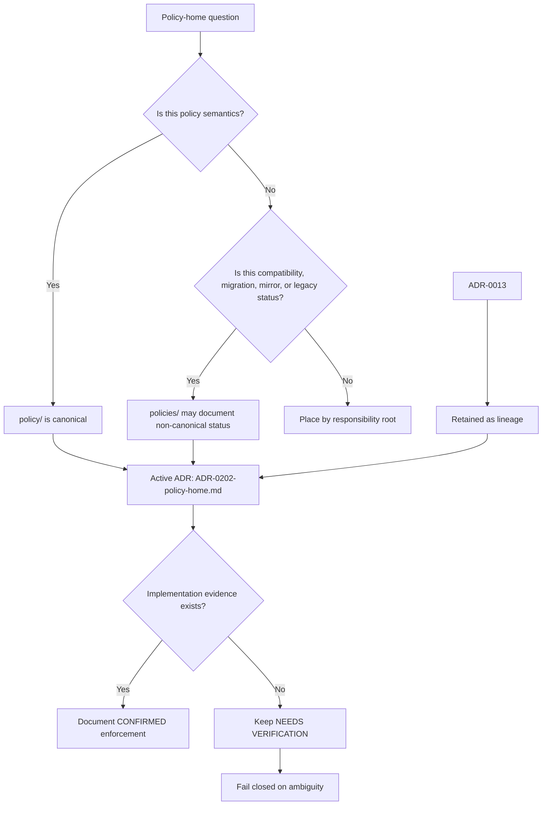

<!-- [KFM_META_BLOCK_V2]
doc_id: kfm://doc/NEEDS-VERIFICATION-ADR-0013-policy-home-authority
title: ADR-0013: Policy Home Authority
type: standard
version: v1
status: draft
owners: KFM maintainers (CODEOWNERS NEEDS VERIFICATION)
created: 2026-05-03
updated: 2026-05-06
policy_label: NEEDS VERIFICATION
related: [./README.md, ./ADR-0202-policy-home.md, ./ADR-0002-responsibility-root-monorepo.md, ../architecture/contract-schema-policy-split.md, ../registers/policy_authority_map.md, ../registers/VERIFICATION_BACKLOG.md, ../../policy/README.md, ../../policies/README.md]
tags: [kfm, adr, policy-home, policy, policies, governance, compatibility-root, fail-closed, supersession]
notes: [Supersession bridge for the original ADR-0013 proposal. Active policy-home authority is ADR-0202-policy-home.md. Owners, policy label, CODEOWNERS coverage, policies/ inventory, path-hygiene enforcement, runtime policy resolver behavior, and release-gate enforcement remain NEEDS VERIFICATION.]
[/KFM_META_BLOCK_V2] -->

<a id="top"></a>

# ADR-0013: Policy Home Authority (`policy/` canonical, `policies/` compatibility-only)

Supersession bridge preserving the original policy-home proposal while pointing active authority to `ADR-0202-policy-home.md`.

<p align="center">
  
  
  
  
  
</p>

<p align="center">
  <a href="#decision-summary">Decision summary</a> ·
  <a href="#evidence-basis">Evidence</a> ·
  <a href="#decision">Decision</a> ·
  <a href="#compatibility-map">Compatibility map</a> ·
  <a href="#validation-and-closure">Validation</a> ·
  <a href="#open-verification">Open verification</a>
</p>

> [!IMPORTANT]
> `ADR-0013` is retained for lineage and compatibility-map closure. It is **not** the active, detailed policy-home authority after `ADR-0202-policy-home.md` is accepted.
>
> The active rule remains: `policy/` is the canonical home for KFM policy semantics; `policies/` is compatibility-only unless a later accepted ADR supersedes that decision.

> [!CAUTION]
> Directory names are not enforcement evidence. This ADR does not prove policy bundles, OPA/Rego, Conftest, CI checks, runtime resolvers, release gates, proof packs, or branch protections are implemented.

---

## ADR header

| Field | Value |
|---|---|
| ADR ID | `ADR-0013-policy-home-authority` |
| Title | Policy Home Authority |
| Visible status | `superseded / retained for lineage` |
| Original decision date | `2026-05-03` |
| Revision date | `2026-05-06` |
| Active successor | [`ADR-0202-policy-home.md`](./ADR-0202-policy-home.md) |
| Owners / deciders | `KFM maintainers` / `CODEOWNERS NEEDS VERIFICATION` |
| Policy label | `NEEDS VERIFICATION` |
| Scope | Repo-wide policy-home authority and compatibility-root handling |
| Affected paths | `policy/`, `policies/`, `docs/adr/`, `docs/registers/`, `contracts/`, `schemas/`, `tests/`, `tools/validators/`, `packages/policy/`, `.github/workflows/` |
| Related records | [`policy_authority_map.md`](../registers/policy_authority_map.md), [`VERIFICATION_BACKLOG.md`](../registers/VERIFICATION_BACKLOG.md), [`contract-schema-policy-split.md`](../architecture/contract-schema-policy-split.md) |
| Decision confidence | `CONFIRMED successor ADR / NEEDS VERIFICATION for enforcement` |
| Rollback target | Restore this file to the pre-revision proposed ADR only if `ADR-0202-policy-home.md` is withdrawn or superseded with explicit replacement authority. |

[Back to top](#top)

---

## Decision summary

`ADR-0013` originally proposed that `policy/` should be canonical and `policies/` should be compatibility-only. That substance remains aligned with KFM doctrine, but the active and more complete policy-home decision now lives in [`ADR-0202-policy-home.md`](./ADR-0202-policy-home.md).

This file should therefore be kept as a **lineage and crosswalk record**, not as a competing policy-home ADR. It closes the old “ADR-0013 aligned decision” reference by pointing maintainers to the accepted successor while preserving the original guardrails: no split policy authority, no runtime equivalence inferred from path names, and no policy publication evidence inferred from directory moves alone.

[Back to top](#top)

---

## Context

KFM currently has two nearby path signals:

| Path | Meaning after this ADR | Risk if ambiguous |
|---|---|---|
| `policy/` | Canonical home for policy semantics under the successor ADR. | Hidden or duplicated policy law if another root also becomes canonical. |
| `policies/` | Compatibility, migration, mirror, legacy, generated, or explanatory root only. | Stale plural-root content could be mistaken for active policy authority. |

The original `ADR-0013` was useful because it named the split-home risk early. The repository now also contains a fuller accepted decision in `ADR-0202-policy-home.md`, plus a policy authority map that still names `ADR-0013` as part of the migration rule.

This revision keeps the lineage visible and prevents maintainers from treating two ADRs as parallel authorities.

### Why this remains architecture-significant

Policy-home authority is a KFM trust-boundary issue. Policy decides rights, sensitivity, review, release, correction, runtime admissibility, and public exposure. A split policy home can create contradictory allow/deny behavior, stale mirrors, unreviewed release paths, or public-client bypass.

[Back to top](#top)

---

## Evidence basis

| Evidence item | Status | Supports | Limits |
|---|---:|---|---|
| Current [`ADR-0013-policy-home-authority.md`](./ADR-0013-policy-home-authority.md) | `CONFIRMED repository file` | Original decision proposed `policy/` canonical and `policies/` compatibility-only. | Minimal; no meta block, no successor handling, no enforcement detail. |
| [`ADR-0202-policy-home.md`](./ADR-0202-policy-home.md) | `CONFIRMED repository file / accepted decision` | Active policy-home decision; `policy/` is canonical, `policies/` compatibility-only; enforcement maturity remains bounded. | Contains cleanup needs and does not prove runtime/CI enforcement depth. |
| [`docs/adr/README.md`](./README.md) | `CONFIRMED repository file` | ADR directory is the decision ledger and already surfaces `ADR-0013` and policy-home overlap as requiring verification. | Inventory and numbering coverage still need active-checkout verification. |
| [`policy/README.md`](../../policy/README.md) | `CONFIRMED repository file` | `policy/` describes itself as KFM’s governed decision surface and policy-law lane. | Some path and enforcement claims are review/verification bounded. |
| [`policies/README.md`](../../policies/README.md) | `CONFIRMED repository file` | `policies/` documents policy-path ambiguity and warns not to keep both roots as competing authorities. | It still uses provisional language and must not become canonical policy law. |
| [`policy_authority_map.md`](../registers/policy_authority_map.md) | `CONFIRMED repository file` | Records `policy/` and `policies/` as current homes, likely authority in `policy/`, and need for ADR-0013 alignment. | Owner/status remains conflicted and implementation checks are proposed. |
| [`contract-schema-policy-split.md`](../architecture/contract-schema-policy-split.md) | `CONFIRMED repository file` | Contracts explain meaning; schemas validate shape; policy decides release/public behavior. | Architecture note does not prove enforcement. |
| [`VERIFICATION_BACKLOG.md`](../registers/VERIFICATION_BACKLOG.md) | `CONFIRMED repository file` | Tracks `VFY-005` for contracts/schemas and policy/policies authority closure. | Backlog row remains open until implementation evidence exists. |
| Directory Rules doctrine | `CONFIRMED doctrine` | Root folders are responsibility boundaries; `policies/` is a compatibility/transitional root unless evidence or ADR says otherwise. | Does not prove current branch conformance or CI enforcement. |

[Back to top](#top)

---

## Decision

### Chosen disposition

`ADR-0013` is **superseded by** [`ADR-0202-policy-home.md`](./ADR-0202-policy-home.md).

### Rules preserved from the original proposal

1. `policy/` is the canonical policy-home authority.
2. `policies/` is compatibility-only unless a later accepted ADR supersedes the decision.
3. Policy release, promotion, runtime, or enforcement evidence must not be inferred from directory moves or README text alone.
4. The repository must avoid parallel normative policy definitions in both `policy/` and `policies/`.
5. Ambiguous policy-home resolution must fail closed.

### What changes in this revision

| Change | Reason |
|---|---|
| Mark `ADR-0013` as lineage / superseded. | Prevents two policy-home ADRs from appearing active. |
| Point active authority to `ADR-0202-policy-home.md`. | That ADR is fuller, accepted, and already contains detailed enforcement and cleanup criteria. |
| Keep the compatibility map. | Maintainers still need a short crosswalk from the original ADR to the active successor. |
| Keep verification burden visible. | The policy-home decision can be accepted while enforcement remains `NEEDS VERIFICATION`. |

### Boundary rule

This ADR must not be used to claim that policy enforcement is implemented. Only current repository files, tests, validators, workflows, emitted policy decisions, release artifacts, runtime traces, or review evidence can prove enforcement.

[Back to top](#top)

---

## Compatibility map

| Concern | Active authority | Compatibility handling | Prohibited |
|---|---|---|---|
| Policy semantics | [`ADR-0202-policy-home.md`](./ADR-0202-policy-home.md) and `policy/` | `ADR-0013` may be cited as lineage only. | Treating `ADR-0013` as a parallel active decision. |
| Executable policy bundles | `policy/` | `policies/` may document migration/mirror status only. | New canonical policy bundles under `policies/` without successor ADR. |
| Policy fixtures and tests | `policy/fixtures/`, `policy/tests/`, repo-wide `tests/` as verified by branch evidence | Plural-root fixtures are compatibility-only unless explicitly classified. | Duplicate allow/deny fixtures with conflicting expected outcomes. |
| Runtime policy resolver | Must target active canonical policy home or an approved bridge | Any bridge must name canonical target, status, owner, review date, and test coverage. | Silent resolver fallback to `policies/`. |
| Release / promotion proof | Release and proof homes after repo verification | Policy may reference release/proof objects. | Inferring release readiness from policy path alone. |
| ADR index and registers | `docs/adr/README.md`, `policy_authority_map.md`, `VERIFICATION_BACKLOG.md` | Update this file’s status as `superseded`. | Leaving `ADR-0013` listed as active while `ADR-0202` is accepted. |

[Back to top](#top)

---

## Decision flow



[Back to top](#top)

---

## Consequences

### Positive consequences

- Keeps original `ADR-0013` reasoning visible without creating two active policy-home ADRs.
- Aligns the policy authority map with the accepted successor decision.
- Preserves KFM’s fail-closed posture for ambiguous policy-home resolution.
- Reinforces the split: contracts define meaning, schemas validate shape, policy decides admissibility.
- Keeps enforcement claims bounded until tests, validators, workflows, runtime traces, or release artifacts prove them.

### Tradeoffs

| Tradeoff | Mitigation |
|---|---|
| `ADR-0013` is no longer the active ADR despite its still-correct core rule. | The core rule is preserved and redirected to `ADR-0202`. |
| Maintainers must update indexes and maps to avoid confusion. | Add explicit successor links and status labels. |
| `VFY-005` is not fully closed by documentation alone. | Keep backlog open until implementation evidence validates policy-home behavior. |
| Existing links to `ADR-0013` may remain. | Retain this file as a stable compatibility target. |

[Back to top](#top)

---

## Validation and closure

### Documentation closure

- [ ] `docs/adr/README.md` lists `ADR-0013-policy-home-authority.md` as `superseded by ADR-0202`.
- [ ] `docs/adr/README.md` lists `ADR-0202-policy-home.md` as the active policy-home authority.
- [ ] `docs/registers/policy_authority_map.md` says `ADR-0013` is aligned by supersession to `ADR-0202`.
- [ ] `docs/registers/VERIFICATION_BACKLOG.md` keeps `VFY-005` open until implementation checks pass.
- [ ] `policy/README.md` links the active policy-home ADR.
- [ ] `policies/README.md` links the active policy-home ADR and states compatibility-only status.

### Implementation closure

These checks must pass before enforcement is claimed:

- [ ] Current branch inventory confirms all files under `policy/` and `policies/`.
- [ ] Any file under `policies/` is classified as compatibility, migration, mirror, legacy, generated, blocked, or retired.
- [ ] No new canonical policy rule is added under `policies/`.
- [ ] Policy resolvers, validators, workflows, and release gates target `policy/` or an explicitly approved bridge.
- [ ] Path-hygiene tests detect split-home drift.
- [ ] Negative tests prove ambiguous policy-home resolution fails closed.
- [ ] Release/promotion artifacts record the policy version or policy decision that was enforced.

### Reviewer commands

Run from the repository root on the target branch.

```bash
git status --short
git branch --show-current
git rev-parse --show-toplevel

find policy policies -maxdepth 4 -type f 2>/dev/null | sort

grep -RInE \
  'policy/|policies/|policy home|policy-home|ADR-0013|ADR-0202|PolicyDecision|DENY|ABSTAIN|fail closed' \
  docs policy policies contracts schemas tests tools packages apps .github 2>/dev/null || true

# Flag policy-significant files under policies/ for review.
find policies -type f \
  \( -name '*.rego' -o -name '*.json' -o -name '*.yaml' -o -name '*.yml' -o -path '*/fixtures/*' -o -path '*/tests/*' \) \
  2>/dev/null | sort
```

> [!NOTE]
> The commands are review aids, not proof that CI currently enforces this ADR.

[Back to top](#top)

---

## Anti-patterns to reject

| Anti-pattern | Why it is unsafe |
|---|---|
| Treating `policy/` and `policies/` as equally canonical. | Creates split policy authority. |
| Treating this superseded ADR as active over `ADR-0202`. | Hides the accepted successor decision. |
| Deleting `ADR-0013` to simplify the index. | Breaks lineage and compatibility links. |
| Moving policy bundles solely for naming symmetry. | Risks runtime regressions without evidence or rollback. |
| Letting workflows or helper packages become hidden policy law. | Obscures review and weakens auditability. |
| Claiming policy enforcement from README language. | Documentation is not runtime, CI, validator, or release proof. |
| Allowing ambiguous policy-home resolution to pass. | KFM’s safe default is fail closed. |

[Back to top](#top)

---

## Rollback and supersession

### Rollback

Rollback this revision only if `ADR-0202-policy-home.md` is withdrawn, rejected, or superseded by a new accepted policy-home ADR.

Rollback steps:

1. Preserve this file as lineage; do not delete it.
2. Add a clear note naming the new active policy-home ADR.
3. Update `docs/adr/README.md`, `policy_authority_map.md`, and `VERIFICATION_BACKLOG.md`.
4. Inventory `policy/` and `policies/` before moving any file.
5. Keep runtime, release, and policy resolver behavior blocked or fail-closed until the active policy home is unambiguous.
6. Record the rollback or successor decision in the appropriate ADR/register.

### Supersession rule

A future ADR may replace `policy/` as canonical only if it includes:

- current branch inventory;
- policy consumer inventory;
- compatibility bridge plan;
- test and validator plan;
- release/promotion impact;
- rollback target;
- public-client and runtime trust impact;
- proof that ambiguous policy-home resolution fails closed during migration.

[Back to top](#top)

---

## Open verification

| Item | Status | Why it matters |
|---|---:|---|
| CODEOWNERS / policy owner | `NEEDS VERIFICATION` | Review burden should be explicit for policy-significant changes. |
| Policy label for this ADR | `NEEDS VERIFICATION` | Do not infer publication label from path alone. |
| Full `policy/` inventory | `NEEDS VERIFICATION` | Needed before claiming canonical content is complete. |
| Full `policies/` inventory | `NEEDS VERIFICATION` | Needed before claiming compatibility-only status is clean. |
| Path-hygiene validator | `NEEDS VERIFICATION` | Needed before enforcement claims. |
| CI / workflow enforcement | `UNKNOWN` | Workflow files and branch protections must be inspected before claims. |
| Runtime policy resolver target | `UNKNOWN` | Resolver behavior must point to canonical policy home or approved bridge. |
| Release-gate policy evidence | `UNKNOWN` | Release artifacts must record which policy version/decision was applied. |
| `VFY-005` closure | `OPEN / NEEDS VERIFICATION` | Documentation alignment is not enough to close implementation authority. |
| ADR index status | `NEEDS VERIFICATION` | Index should show `ADR-0013` superseded and `ADR-0202` active. |

[Back to top](#top)

---

## Final note

`ADR-0013` did the right early job: it identified policy-home drift before it could become normal. The active authority has now moved to `ADR-0202`; this file remains as the visible bridge that keeps the old decision, the compatibility map, and the verification backlog aligned.
