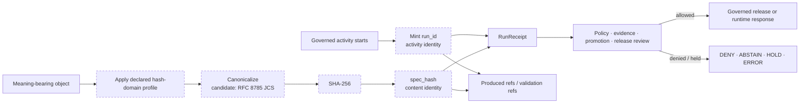

<!-- [KFM_META_BLOCK_V2]
doc_id: kfm://doc/adr-0013-spec_hash-and-run_id-identity-grammar
title: "ADR-0013 — spec_hash and run_id Identity Grammar"
type: adr
adr_id: ADR-0013
version: v1.1
status: proposed
owners:
  - "NEEDS VERIFICATION — architecture decision owner"
  - "NEEDS VERIFICATION — identity and canonicalization steward"
  - "NEEDS VERIFICATION — contracts and schemas stewards"
  - "NEEDS VERIFICATION — runtime receipt steward"
  - "NEEDS VERIFICATION — validation and CI steward"
  - "NEEDS VERIFICATION — evidence and release stewards"
reviewers_required:
  - Architecture steward
  - Identity and canonicalization steward
  - Contracts steward
  - Schema steward
  - Runtime receipt steward
  - Validation and CI steward
  - Evidence steward
  - Release steward
  - Security reviewer
  - Docs steward
created: 2026-05-11
updated: 2026-07-23
policy_label: public
truth_posture: cite-or-abstain
responsibility_root: docs/
current_path: docs/adr/ADR-0013-spec_hash-and-run_id-identity-grammar.md
supersedes: []
superseded_by: null
evidence_snapshot:
  repository: bartytime4life/Kansas-Frontier-Matrix
  base_ref: main
  base_commit: d7e9a1f1073ec462937ed9e52db856f87407d736
  target_prior_blob: 528ff0db1db14af43fd3c2867fd9af316c85910e
  adr_index_blob: cf08fae322ac53426f7394d97897fdb942253049
  directory_rules_blob: 2affb080e6f0043867c64c7f06c1ca52030fbd55
  identity_architecture_blob: d8b3836bae160ac0f2027407989d383fa016a49b
  canonicalization_standard_blob: 16cec7a8109ac1776159b346b898ab9c313c2f3e
  common_spec_hash_contract_blob: 0c2c1161ddb565d4f9f17ef81080b27b8d951937
  common_spec_hash_schema_blob: 80b496b01b8de8c0e8ba67bf020977e6b1f3c652
  evidence_normalization_compat_blob: 5fa81f67cc76766cb73dd3811e06e9475a75189f
  run_receipt_contract_blob: 5592aa5e22bbdd0c668189f79b50c18f7d1b2479
  run_receipt_schema_blob: 80d13bcb750d56c769da2f8871242388f7f50a69
  run_receipt_valid_fixture_blob: 0e8cfaa2f3a1f7ae4a7eb62d19f321a70aa38b0a
  spec_hash_validator_blob: de69c6c7001082af29827a4b287a80b7c6a05af3
  run_receipt_validator_blob: 9b59481e90c021f0f92b74511c43fcefbbe3a057
  hashing_package_readme_blob: 3d3174974668623117c1f90bcbc6918262d1b6af
related:
  - docs/adr/README.md
  - docs/adr/INDEX.md
  - docs/adr/ADR-0001-schema-home--schemas-contracts-v1-is-canonical.md
  - docs/adr/ADR-0002-contracts-vs-schemas-split.md
  - docs/adr/ADR-0011-receipts-vs-proofs-vs-manifests-vs-catalog-separation.md
  - docs/adr/ADR-0018-promotion-gate-sequence.md
  - docs/adr/ADR-0022-catalog-matrix--stac-+-dcat-+-prov-must-agree.md
  - docs/doctrine/directory-rules.md
  - docs/architecture/identity-and-spec-hash.md
  - docs/standards/canonicalization.md
  - contracts/common/spec_hash.md
  - contracts/runtime/run_receipt.md
  - schemas/contracts/v1/common/spec_hash.schema.json
  - schemas/contracts/v1/runtime/run_receipt.schema.json
  - schemas/contracts/v1/evidence/spec_normalization.md
  - packages/hashing/README.md
  - tools/validators/validate_spec_hash.py
  - tools/validators/validate_run_receipt.py
  - fixtures/contracts/v1/common/spec_hash/
  - fixtures/contracts/v1/runtime/run_receipt/
tags: [kfm, adr, identity, deterministic-identity, activity-identity, spec-hash, run-id, jcs, sha256, receipts, provenance, migration, fail-closed]
notes:
  - "v1.1 is a same-path repository-grounded modernization. It preserves source metadata and effective decision status `proposed`; it does not accept ADR-0013 or change executable identity behavior."
  - "The canonical ADR index uniquely assigns ADR-0013 to this exact path."
  - "Current repository machine shapes conflict with the proposed grammar: common and RunReceipt schemas accept bare `sha256:<hex>`, while this ADR and architecture documents propose `jcs:sha256:<hex>`."
  - "Current RunReceipt schema accepts a broad identifier pattern and the valid fixture uses `run1`; the `run:<orchestrator>:<ULID>` form remains proposed, not implemented fact."
  - "The dedicated spec_hash validator is a NotImplementedError stub. The RunReceipt validator performs JSON Schema fixture validation only."
  - "packages/hashing is an implementation scaffold with placeholder metadata and an empty initializer; no verified canonicalizer, spec-hash, run-id, replay, or cross-runtime parity implementation was found in the inspected evidence."
  - "Hash equality proves only equality under a declared byte/canonicalization profile. It does not prove truth, authority, admissibility, evidence closure, review, release, or public safety."
[/KFM_META_BLOCK_V2] -->

<a id="top"></a>

# ADR-0013 — `spec_hash` and `run_id` Identity Grammar

> **Proposed decision.** KFM separates deterministic **content identity** (`spec_hash`) from unique **activity identity** (`run_id`). The candidate grammar is `jcs:sha256:<64-lower-hex>` for ordinary JSON content and `run:<orchestrator>:<ULID>` for one governed execution. This revision records that target without misrepresenting the repository's current bare-`sha256` schemas, permissive run-ID pattern, fixture examples, or unimplemented hashing package as conforming enforcement.

[](#status)
[](#current-repository-evidence)
[](#proposed-decision)
[](#current-repository-conflicts)
[](#candidate-grammar)
[](#current-enforcement-maturity)
[](#authority-and-publication-boundary)

> [!IMPORTANT]
> **Identity assignment is confirmed; acceptance is not.** [`docs/adr/INDEX.md`](./INDEX.md) uniquely assigns `ADR-0013` to this exact file and records both source metadata and effective status as `proposed`. Editing, merging, linking, or validating this Markdown does not accept the decision.

> [!CAUTION]
> **The repository does not currently implement the grammar described here.** The common `spec_hash` schema and the RunReceipt schema require bare `sha256:<hex>`. The RunReceipt schema accepts a broad identifier pattern, and a valid fixture uses `run1`. No reviewed migration may describe those surfaces as `jcs:sha256` or ULID-conformant until schemas, contracts, fixtures, validators, producers, consumers, tests, and receipts are updated together.

> [!WARNING]
> **A matching hash is not a truth or release decision.** It establishes only that the same declared bytes or canonical representation produced the same digest under the same declared profile. Evidence sufficiency, provenance, rights, sensitivity, policy, review, promotion, release, correction, rollback, and public safety remain separate governed gates.

**Quick navigation:** [Status](#status) · [Evidence boundary](#evidence-boundary) · [Context](#context) · [Decision](#proposed-decision) · [Grammar](#candidate-grammar) · [Exclusions](#hash-domain-and-exclusions) · [Wiring](#identity-wiring) · [Evidence](#current-repository-evidence) · [Conflicts](#current-repository-conflicts) · [Maturity](#current-enforcement-maturity) · [Validation](#validation-and-enforcement-target) · [Migration](#migration-and-acceptance-plan) · [Consequences](#consequences) · [Alternatives](#alternatives-considered) · [Risks](#risk-ledger) · [Rollback](#rollback-and-supersession) · [Checklist](#verification-checklist) · [References](#references)

---

<a id="status"></a>

## Status

| Field | Current value |
|---|---|
| **ADR ID** | `ADR-0013` — unique and confirmed in [`INDEX.md`](./INDEX.md) |
| **Tracked path** | `docs/adr/ADR-0013-spec_hash-and-run_id-identity-grammar.md` |
| **Source metadata** | `proposed` |
| **Effective decision status** | `proposed` |
| **Decision class** | Cross-cutting identity grammar, canonicalization profile, and runtime activity identifier |
| **Implementation effect of this revision** | Documentation only |
| **Schema effect** | None |
| **Runtime effect** | None |
| **Release/publication effect** | None |
| **Supersedes / superseded by** | None / none |

### Acceptance versus implementation

Two independent states must remain visible:

1. **ADR acceptance** would approve the identifier meanings and migration target.
2. **Implementation graduation** would require one accepted machine shape, canonical byte rules, fixtures, a real hashing implementation, parser/formatter behavior, producer and consumer migrations, cross-runtime parity tests, CI, receipts, and rollback evidence.

An accepted ADR without enforcement is doctrine. Passing schema validation without an accepted and implemented canonicalization profile is only shape evidence. Neither state alone proves evidence truth or release readiness.

[Back to top](#top)

---

<a id="evidence-boundary"></a>

## Evidence boundary

This revision uses current repository bytes at `main@d7e9a1f1073ec462937ed9e52db856f87407d736`. The repository establishes present files and behavior; KFM doctrine establishes responsibility boundaries. The prior version's statements that no repository was inspected and that ADR numbering or related paths were unverified are now obsolete.

| Evidence level | What is established | What is not established |
|---|---|---|
| **ADR inventory** | Exact ADR ID, filename, source metadata, and effective proposed status | Acceptance |
| **Architecture and standards docs** | Draft documents propose JCS + SHA-256 and content-addressed identity | Machine conformance |
| **Common SpecHash contract/schema** | Draft contract and proposed object schema require `{ "value": "sha256:<hex>" }` | Canonicalization profile, `jcs:` prefix, or scalar representation |
| **RunReceipt contract/schema** | Proposed receipt shape requires `run_id` and bare `sha256:<hex>` | ULID grammar, orchestrator vocabulary, or content hashing behavior |
| **Fixtures and validators** | RunReceipt schema fixtures execute; dedicated `spec_hash` validator exists as a stub | Hash computation, canonical-byte verification, replay, cross-language parity |
| **Hashing package** | Documentation, `0.0.0` placeholder metadata, and an empty initializer exist | Exported implementation, dependencies, tests, CI, consumers, or distribution |
| **Runtime and operations** | No reviewed evidence here proves live production use | Deployment maturity, operational health, or public reliance |

### Truth labels

| Label | Use in this ADR |
|---|---|
| **CONFIRMED** | Directly verified from the inspected repository bytes or governing doctrine. |
| **PROPOSED** | Candidate decision, grammar, path role, migration, or future enforcement. |
| **CONFLICTED** | Current repository sources assign incompatible shapes, prefixes, names, or responsibilities. |
| **UNKNOWN** | Available evidence is insufficient for a stronger claim. |
| **NEEDS VERIFICATION** | A concrete check remains open before acceptance, migration, enforcement, or retirement. |
| **HOLD** | A conflict or missing prerequisite intentionally blocks promotion of the claim. |

[Back to top](#top)

---

<a id="context"></a>

## Context

KFM requires stable identity to support deduplication, replay, provenance, receipts, catalog closure, promotion, correction, rollback, revocation, and audit. Two different identity questions exist:

| Question | Identity term | Required property |
|---|---|---|
| **What exact governed content is this?** | `spec_hash` | Deterministic for the same canonical content and profile |
| **Which execution produced or evaluated it?** | `run_id` | Unique per governed activity and stable throughout that activity |

Collapsing the terms creates two opposite failures:

- including `run_id` in content identity makes identical content hash differently on each run;
- using only `spec_hash` for activity identity hides repeated executions, retries, operators, stages, and side effects.

The repository already reflects the distinction in prose, receipt fields, package plans, and downstream references. It does not yet implement one coherent grammar across all machine surfaces.

[Back to top](#top)

---

<a id="proposed-decision"></a>

## Proposed decision

Upon acceptance and completion of the governed migration:

1. **`spec_hash` is the KFM content-identity term.**
   - It identifies a declared canonical representation.
   - The same meaning-bearing content, normalization profile, canonicalization profile, and hash algorithm must produce the same value.
   - A change to included content or profile must produce a different value.
2. **`run_id` is the KFM activity-identity term.**
   - It identifies one governed execution, attempt, or stage activity.
   - It is generated once at activity start and propagated unchanged through that activity's outputs, receipts, logs, validation records, and downstream references.
   - It is unique, not content-derived, and not a substitute for `spec_hash`.
3. **The two terms are independent.**
   - `run_id` must not participate in the `spec_hash` hash domain.
   - One run may produce many content hashes.
   - The same content hash may appear in many runs.
4. **The canonicalization profile is part of the identity contract.**
   - A verifier must know what canonical bytes were hashed.
   - A parser must not silently equate identifiers created under different profiles.
5. **Identifier conformance is not governance closure.**
   - A valid `spec_hash` or `run_id` does not grant source admission, evidence sufficiency, policy allowance, promotion, release, publication, or public access.

This is a proposed target. Until acceptance and migration, current schemas and fixtures remain the executable shape evidence.

[Back to top](#top)

---

<a id="candidate-grammar"></a>

## Candidate grammar

### `spec_hash` — content identity

The proposed default JSON form is:

```text
jcs:sha256:<64-lowercase-hex>
```

```ebnf
spec_hash      = "jcs:sha256:" hex64
hex64          = 64 * HEXDIG-LOWER
HEXDIG-LOWER   = %x30-39 / %x61-66
```

The proposed computation is:

1. select the object-family's declared meaning-bearing hash domain;
2. reject duplicate keys and values outside the accepted JSON profile;
3. apply only declared, versioned pre-canonicalization transforms;
4. canonicalize JSON under RFC 8785 JCS;
5. hash the canonical UTF-8 bytes with SHA-256;
6. encode the digest as 64 lowercase hexadecimal characters;
7. record the canonicalization profile and version in the surrounding contract or receipt where needed.

> [!NOTE]
> The current common schema instead requires an object wrapper whose `value` matches `^sha256:[a-f0-9]{64}$`, and the current RunReceipt schema uses a bare string with the same prefix. The proposed grammar above is not executable repository truth.

### RDF-shaped content

The repository contains competing proposed tokens for RDF dataset canonicalization:

- the prior ADR used `urdna2015:sha256:<hex>`;
- the current canonicalization standard uses `rdfc:sha256:<hex>` and describes RDFC-1.0 / URDNA2015 lineage.

This revision does **not** silently choose between them. New RDF-profile writes remain **HOLD** until an accepted decision names the canonical token, object families, canonicalization version, fixtures, verifier path, and migration behavior. JCS remains the candidate default for JSON-governed objects.

### `run_id` — activity identity

The proposed KFM form is:

```text
run:<orchestrator>:<ULID>
```

```ebnf
run_id          = "run:" orchestrator ":" ulid
orchestrator    = 1*32 (LOWER / DIGIT / "-" / "_")
ulid            = 26 ULID-CHAR
LOWER           = %x61-7A
DIGIT           = %x30-39
ULID-CHAR       = %x30-39 / %x41-48 / %x4A-4B / %x4D-4E / %x50-54 / %x56-5A
```

Illustrative form:

```text
run:gha:01HXYZ7G2C5N9PJ4WVABCDEFGH
```

Proposed invariants:

- mint once at governed activity start;
- preserve exactly across retries that remain the same activity;
- mint a new value for a distinct attempt when the runtime contract treats that attempt as a new activity;
- use a controlled, versioned orchestrator vocabulary;
- never embed secrets, credentials, private content, sensitive exact locations, or mutable display names;
- do not call `run_id` deterministic content identity;
- do not derive it from `spec_hash`.

The current RunReceipt schema accepts `^[a-z][a-z0-9_:.-]*$`, and the current valid fixture uses `run1`. The ULID grammar remains proposed.

[Back to top](#top)

---

<a id="hash-domain-and-exclusions"></a>

## Hash domain and exclusions

A single global field-deletion list is not sufficient for every KFM object family. The accepted implementation should use a versioned **hash-domain profile** per object family.

### Minimum cross-family exclusions

The following fields are normally outside content identity unless an accepted object-family contract explicitly establishes otherwise:

```text
spec_hash
run_id
generated_at
updated_at
fetched_at
retrieved_at
timestamp
nonce
signature
signatures
attestation
attestations
transparency_log
storage_path
storage_url
```

Rules:

- self-reference fields such as `spec_hash` must be excluded;
- activity and transport metadata must not rotate content identity;
- signatures and attestations wrap or reference the digest and must not be recursively included;
- meaning-bearing timestamps must not be removed merely because their names resemble runtime timestamps;
- field inclusion and exclusion must be declared by contract/schema profile, not inferred only from field names;
- pre-canonicalization normalization must be explicit, versioned, receipted, and fixture-tested;
- hash-domain profile changes require migration and compatibility review because they change identity.

### Unicode and numbers

The implementation must not silently normalize Unicode during hashing unless a versioned object-family profile requires that transform before JCS. Exact identifiers and large numeric values must be represented in a schema-safe way that preserves intended identity across runtimes. Cross-language golden vectors are required before enforcement graduation.

[Back to top](#top)

---

<a id="identity-wiring"></a>

## Identity wiring



The diagram describes the proposed separation, not current implementation maturity.

### Relationship rules

| Relationship | Proposed rule |
|---|---|
| `run_id` → `spec_hash` | No derivation and no inclusion in the content hash domain |
| one `run_id` → many `spec_hash` values | Allowed; one activity may produce multiple governed objects |
| one `spec_hash` → many `run_id` values | Allowed; identical content may be produced or verified by multiple runs |
| receipt identity | A RunReceipt may have its own content identity while carrying the activity `run_id` and produced/input hashes |
| supersession and rollback | Content replacement should reference the prior governed content identity, not rely only on a mutable path |
| catalog and provenance joins | Must use explicit namespaced fields and accepted mapping profiles; this ADR alone does not authorize a catalog shape |
| OpenLineage bridge | KFM `run_id` must not be forced into an external UUID-only field; any bridge requires an explicit facet/schema and reciprocal reference |
| AI activity | AIReceipt activity identity remains separate from upstream activity identity; parent/child relationship fields require paired schema and contract review |

[Back to top](#top)

---

<a id="current-repository-evidence"></a>

## Current repository evidence

| Surface | Inspected state | Safe conclusion |
|---|---|---|
| [`docs/adr/INDEX.md`](./INDEX.md) | Unique ADR-0013 row; source and effective status `proposed` | ADR identity is confirmed; acceptance is not |
| [`docs/architecture/identity-and-spec-hash.md`](../architecture/identity-and-spec-hash.md) | Draft architecture proposes JCS + SHA-256 and `jcs:sha256:<hex>` | Strong design evidence, not executable enforcement |
| [`docs/standards/canonicalization.md`](../standards/canonicalization.md) | Draft standard proposes `jcs:` and `rdfc:` profiles | Standard is draft and conflicts with some other proposed names |
| [`contracts/common/spec_hash.md`](../../contracts/common/spec_hash.md) | Draft semantic contract for object-wrapped bare `sha256:<hex>` | Current contract does not encode JCS in the value |
| [`schemas/contracts/v1/common/spec_hash.schema.json`](../../schemas/contracts/v1/common/spec_hash.schema.json) | Proposed object schema requiring `value` and bare `sha256:<hex>` | Current machine shape conflicts with ADR candidate |
| [`contracts/runtime/run_receipt.md`](../../contracts/runtime/run_receipt.md) | Draft receipt contract documents broad run ID and bare hash | Current semantics are not ULID/JCS-conformant |
| [`schemas/contracts/v1/runtime/run_receipt.schema.json`](../../schemas/contracts/v1/runtime/run_receipt.schema.json) | Proposed closed object; broad run ID regex; bare hash string | Executable shape differs from this ADR candidate |
| [`fixtures/contracts/v1/runtime/run_receipt/valid/valid_1.json`](../../fixtures/contracts/v1/runtime/run_receipt/valid/valid_1.json) | Valid fixture uses `run1` and bare `sha256:` | Fixture proves current schema behavior only |
| [`tools/validators/validate_run_receipt.py`](../../tools/validators/validate_run_receipt.py) | Executes generic JSON Schema runner | Shape validation exists; identity computation does not |
| [`tools/validators/validate_spec_hash.py`](../../tools/validators/validate_spec_hash.py) | Raises `NotImplementedError` | Dedicated hash validation is not implemented |
| [`packages/hashing/README.md`](../../packages/hashing/README.md) | Documents package scaffold; implementation modules absent at inspected paths | No verified reusable hashing/run-ID library exists |
| [`schemas/evidence/spec_normalization.md`](../../schemas/evidence/spec_normalization.md) | Compatibility pointer records the hash grammar conflict | Conflict is already recognized and must remain visible |

[Back to top](#top)

---

<a id="current-repository-conflicts"></a>

## Current repository conflicts

| Conflict | Current evidence | Required resolution |
|---|---|---|
| **Hash prefix** | ADR/architecture/standard propose `jcs:sha256:`; schemas/contracts require `sha256:` | Accepted identifier/versioning decision plus coordinated migration |
| **Envelope shape** | Common schema wraps `value`; RunReceipt schema uses a scalar string | Decide whether `SpecHash` is a value object, scalar, or both through explicit references/adapters |
| **Run-ID grammar** | ADR proposes orchestrator + ULID; schema accepts a broad string; fixture uses `run1` | Versioned run-ID schema, vocabulary, fixtures, parser, and producer migration |
| **RDF profile token** | `urdna2015:` and `rdfc:` both appear in proposed docs | Accept one canonical token and preserve compatibility lineage |
| **Hash-domain rules** | Prose lists exclusions; no verified executable per-family profile was found | Machine-readable profile plus golden vectors and validators |
| **Implementation ownership** | `packages/hashing/` and `tools/spec_hash/` are both discussed | Accepted package/tool delegation and one implementation authority |
| **Validator maturity** | RunReceipt validator checks shape; spec-hash validator is a stub | Real computation/check mode, deterministic errors, tests, and CI |
| **Meaning of `spec_hash`** | Some docs describe broad object content identity; common contract narrows it to a specification representation | Clarify object-family semantics and field names without overloading one term |
| **Activity semantics** | Some prose calls `run_id` deterministic; proposed ULID is unique/time-ordered, not content-deterministic | Use precise terminology: unique activity identity, stable within one activity |
| **External lineage mapping** | OpenLineage bridge is described but no accepted facet/schema is established | Companion contract/schema and round-trip tests |

These conflicts are acceptance blockers. Documentation must not normalize them into a false single current state.

[Back to top](#top)

---

<a id="authority-and-publication-boundary"></a>

## Authority and publication boundary

This ADR may define identity meaning only after acceptance. It never becomes:

- a source-admission decision;
- a schema-validity result;
- a canonicalization implementation;
- a receipt or proof;
- an EvidenceBundle;
- a PolicyDecision or PromotionDecision;
- a signature, attestation, or transparency-log record;
- a ReleaseManifest, RollbackCard, or correction notice;
- permission for public clients to read internal stores;
- proof that an object is true, current, safe, admissible, reviewed, released, or public.

`contracts/` owns object meaning, `schemas/` owns machine shape, `packages/` and `tools/` own reviewed implementation surfaces, `fixtures/` and `tests/` own executable examples and checks, `policy/` owns admissibility, `data/receipts/` owns receipt records, and `release/` owns release decisions.

[Back to top](#top)

---

<a id="current-enforcement-maturity"></a>

## Current enforcement maturity

| Capability | Current posture | Evidence |
|---|---|---|
| ADR identity and proposed status | **CONFIRMED** | Canonical ADR index |
| Bare `sha256:` shape validation | **PARTIAL / CONFIRMED** | Proposed schemas and generic fixture runner |
| JCS canonical-byte production | **NOT VERIFIED** | No reviewed implementation found in inspected package/tool evidence |
| `jcs:sha256:` parser/formatter | **NOT VERIFIED** | Current schemas reject that form |
| Hash-domain projection | **NOT VERIFIED** | Prose only in inspected evidence |
| `run:<orchestrator>:<ULID>` generation | **NOT VERIFIED** | Schema and fixture do not require it |
| Cross-runtime golden vectors | **NOT VERIFIED** | No inspected proof |
| Replay verification | **NOT VERIFIED** | Planned documentation only |
| Producer/consumer migration | **NOT STARTED / NEEDS VERIFICATION** | Conflicting shapes remain |
| CI enforcement | **PARTIAL** | Generic schema validation exists; digest computation and parity are not established |
| Operational/public reliance | **UNKNOWN** | No deployment or runtime evidence reviewed |

[Back to top](#top)

---

<a id="validation-and-enforcement-target"></a>

## Validation and enforcement target

A conforming implementation should provide deterministic, machine-readable checks for:

| Check | Required assertion |
|---|---|
| **Grammar parsing** | Accept only the versioned canonical forms for new writes; reject ambiguous or malformed values |
| **Canonical-byte vector** | The same input/profile yields byte-identical canonical output across supported runtimes |
| **Hash vector** | Canonical bytes produce the expected SHA-256 digest |
| **Transient mutation** | Changing excluded activity/transport fields does not change content identity |
| **Meaning-bearing mutation** | Changing an included field changes content identity |
| **Duplicate-key rejection** | Ambiguous JSON objects fail closed before canonicalization |
| **Unicode policy** | No silent normalization; declared preflight transforms are tested |
| **Number policy** | Exact values round-trip identically across supported implementations |
| **Run-ID grammar** | Canonical producer output matches the accepted orchestrator vocabulary and ULID policy |
| **Run-ID uniqueness** | Distinct activities do not reuse identifiers under the accepted runtime contract |
| **Separation** | `run_id` never enters the `spec_hash` hash domain |
| **Receipt binding** | Receipt carries the activity identity and exact input/output content identities without conflation |
| **Compatibility** | Legacy values are accepted only in the explicitly versioned read window and cannot be emitted as canonical new writes |
| **Round-trip** | Parse → format preserves the exact canonical identifier |
| **Negative fixtures** | Wrong prefix, length, case, alphabet, wrapper, profile, and field inclusion fail with stable reasons |
| **CI path coverage** | Changes to identity contracts, schemas, canonicalizers, validators, fixtures, or consumers trigger the identity suite |

Passing these checks proves conformance to the accepted identity profile only. It does not prove evidence or release closure.

[Back to top](#top)

---

<a id="migration-and-acceptance-plan"></a>

## Migration and acceptance plan

### Phase 0 — decision closure

- assign accountable owners and required reviewers;
- decide the canonical JSON identifier, wrapper/scalar representation, and versioning model;
- decide the RDF canonicalization token or explicitly keep RDF profile work out of v1;
- decide the accepted RunReceipt `run_id` grammar and orchestrator vocabulary;
- decide implementation ownership between `packages/hashing/`, `tools/spec_hash/`, and validators;
- document compatibility and rollback rules.

### Phase 1 — contract and schema alignment

Update as one reviewed compatibility batch:

- `contracts/common/spec_hash.md`;
- `schemas/contracts/v1/common/spec_hash.schema.json`;
- `contracts/runtime/run_receipt.md`;
- `schemas/contracts/v1/runtime/run_receipt.schema.json`;
- evidence/receipt/release schemas that reference either term;
- object-family hash-domain profiles;
- exact `$id`, `$ref`, and compatibility adapters.

No producer should emit the new grammar before the paired schema and compatibility decision exist.

### Phase 2 — implementation and fixtures

- implement canonical byte generation and digest computation in the accepted package;
- implement parse/format/check operations;
- implement Run-ID generation under the accepted vocabulary;
- replace the `NotImplementedError` validator;
- add positive, negative, golden-byte, cross-runtime, and replay fixtures;
- prove no network, secret, ambient filesystem, or nondeterministic dependency is required.

### Phase 3 — consumers and receipts

- inventory all producers and consumers of `spec_hash` and `run_id`;
- migrate writers first behind explicit version/profile controls;
- support legacy read forms only for a documented window;
- preserve old identifiers and receipts as immutable lineage;
- prevent silent translation between incompatible profiles;
- record migration receipts and drift entries.

### Phase 4 — CI and enforcement graduation

- wire identity checks to all affected paths;
- require cross-runtime parity and negative fixtures;
- require exact changed-path and compatibility-budget review;
- prove rollback against a frozen legacy fixture set;
- remove legacy write support only after the read window and consumer inventory close.

### Acceptance gates

ADR acceptance should remain blocked until reviewers can answer yes to all applicable gates:

- [ ] canonical JSON grammar selected;
- [ ] wrapper/scalar representation selected;
- [ ] RDF profile decision closed or explicitly deferred;
- [ ] Run-ID grammar and retry semantics selected;
- [ ] orchestrator vocabulary owner and location selected;
- [ ] hash-domain profile model selected;
- [ ] implementation authority selected;
- [ ] security and dependency review complete;
- [ ] contract/schema/fixture migration plan complete;
- [ ] producer and consumer inventory complete;
- [ ] compatibility window and rollback tested;
- [ ] no current machine surface is falsely described as already conforming.

[Back to top](#top)

---

<a id="consequences"></a>

## Consequences

### Positive

- stable content equality independent of path, formatting, or activity;
- auditable separation between what an object is and which run handled it;
- reproducible receipt, catalog, correction, rollback, and replay joins;
- explicit canonicalization profile prevents silent algorithm drift;
- one migration target for schemas, contracts, tools, packages, and consumers;
- clearer evidence boundaries: integrity does not masquerade as truth or release.

### Costs and constraints

- coordinated migration across many object families;
- legacy identifiers and receipts require durable compatibility handling;
- canonicalization libraries and numeric/Unicode behavior need supply-chain and parity review;
- Run-ID retry semantics must be consistent across local, CI, workflow, and service runtimes;
- prefix or hash-domain changes rotate identity and therefore require explicit lineage;
- RDF canonicalization may remain deferred until a concrete governed consumer justifies its cost.

[Back to top](#top)

---

<a id="alternatives-considered"></a>

## Alternatives considered

### Keep bare `sha256:<hex>` permanently

**Benefit:** matches the current proposed schemas and minimizes immediate migration.

**Cost:** the identifier does not reveal which canonicalization profile produced the bytes. Equality can be misread across JCS, developer-formatted JSON, raw files, or other profiles.

**Disposition:** viable only if canonicalization profile is carried in a mandatory paired field/value object and enforced everywhere. The current repository does not yet prove that arrangement.

### Include `run_id` in the content hash

**Benefit:** one identifier appears to bind content and execution.

**Cost:** identical content receives a different identity for every activity, breaking deduplication, idempotency, and replay comparisons.

**Disposition:** rejected.

### Use an opaque UUID for all KFM activities

**Benefit:** broad interoperability and simple schema validation.

**Cost:** loses the proposed KFM-local orchestrator hint and time-ordering property.

**Disposition:** remains an alternative until the Run-ID grammar is accepted; current schema is broad enough to permit UUID-like forms.

### Use content hash as the run identifier

**Benefit:** deterministic and simple.

**Cost:** repeated executions over the same content become indistinguishable; retries and side effects collapse.

**Disposition:** rejected.

### Permit JCS and RDF canonicalization under one untagged prefix

**Benefit:** shorter identifiers and fewer schema variants.

**Cost:** consumers cannot know which canonical bytes to recompute; silent verification failure becomes likely.

**Disposition:** rejected.

### Implement independently in every connector or pipeline

**Benefit:** fast local progress.

**Cost:** canonicalization, exclusions, Unicode, numbers, errors, and prefixes drift across runtimes.

**Disposition:** rejected; use one reviewed implementation authority with thin adapters.

[Back to top](#top)

---

<a id="risk-ledger"></a>

## Risk ledger

| Risk | Current posture | Required control |
|---|---|---|
| False claim that ADR grammar is implemented | Present in older prose | Keep proposed/current-state split explicit |
| Prefix migration breaks consumers | OPEN | Inventory, versioned adapters, read window, fixtures |
| Wrapper/scalar mismatch | OPEN | One accepted schema model and explicit compatibility layer |
| `run_id` reuse or retry ambiguity | OPEN | Runtime contract and uniqueness tests |
| Volatile field enters hash domain | OPEN | Per-family profiles and mutation tests |
| Meaning-bearing field excluded | OPEN | Contract review and negative fixtures |
| Unicode/number divergence | OPEN | Cross-runtime golden vectors |
| Silent profile conversion | OPEN | Reject-by-default parser and explicit migration receipts |
| Hash treated as proof of truth | CONTINUOUS | Contract/policy/release boundary callouts and tests |
| Package/tool duplicate authority | OPEN | Accepted ownership and one implementation |
| Unreviewed crypto dependency | OPEN | Security and supply-chain approval |
| Public or sensitive data inferred from identifiers | OPEN | Identifier privacy review and no-sensitive-content rule |

[Back to top](#top)

---

<a id="rollback-and-supersession"></a>

## Rollback and supersession

### Documentation rollback

Before merge, close the draft pull request. After merge, revert the documentation commit through a reviewable pull request. Do not rewrite shared history.

The prior file is recoverable from blob:

```text
528ff0db1db14af43fd3c2867fd9af316c85910e
```

### Decision supersession

If the identity grammar changes after acceptance:

- retain this ADR;
- mark it `superseded`;
- forward-link to the replacement ADR;
- update [`INDEX.md`](./INDEX.md) in the same reviewed change;
- define dual-read/write behavior and migration receipts;
- preserve old identifiers and canonicalization profiles for verification;
- never rewrite historical receipts merely to match the new grammar.

### Implementation rollback

A migration rollback must restore the prior producer and consumer behavior together. It must not emit new identifiers under an old prefix while computing bytes under a new profile, or silently relabel existing digests. Any rollback that reopens a compatibility window must record the scope, reason, affected consumers, and closure conditions.

[Back to top](#top)

---

<a id="verification-checklist"></a>

## Verification checklist

### Documentation

- [x] exact ADR ID and path verified in the canonical index;
- [x] source and effective status remain `proposed`;
- [x] prior unmounted-repository disclaimers replaced with commit-pinned evidence;
- [x] current schemas, contracts, fixtures, validators, and package maturity described without promotion;
- [x] hash and Run-ID conflicts remain explicit;
- [x] `run_id` described as unique activity identity, not deterministic content identity;
- [x] no schema, contract, implementation, fixture, policy, receipt, release, or publication behavior changed.

### Before acceptance

- [ ] owners and reviewers assigned;
- [ ] canonical grammar and representation approved;
- [ ] RDF token conflict closed or deferred;
- [ ] Run-ID retry semantics and vocabulary approved;
- [ ] hash-domain profile model approved;
- [ ] implementation authority approved;
- [ ] migration, compatibility, security, and rollback plans reviewed;
- [ ] paired machine changes prepared and validated.

### Before enforcement graduation

- [ ] implementation no longer scaffold-only;
- [ ] dedicated spec-hash validator no longer raises `NotImplementedError`;
- [ ] golden vectors pass across supported runtimes;
- [ ] schemas and fixtures require the accepted grammar;
- [ ] all known producers and consumers migrated;
- [ ] CI covers affected identity paths;
- [ ] rollback and legacy read compatibility tested;
- [ ] operational receipts prove the accepted profile is used;
- [ ] release/public surfaces remain governed by their own decisions.

[Back to top](#top)

---

<a id="references"></a>

## References

### Governing and decision records

- [`docs/adr/README.md`](./README.md)
- [`docs/adr/INDEX.md`](./INDEX.md)
- [`ADR-0001 — Schema Home`](./ADR-0001-schema-home--schemas-contracts-v1-is-canonical.md)
- [`ADR-0002 — Contracts vs Schemas Split`](./ADR-0002-contracts-vs-schemas-split.md)
- [`ADR-0011 — Receipts vs Proofs vs Manifests vs Catalog Separation`](./ADR-0011-receipts-vs-proofs-vs-manifests-vs-catalog-separation.md)
- [`ADR-0018 — Promotion Gate Sequence`](./ADR-0018-promotion-gate-sequence.md)
- [`ADR-0022 — Catalog Matrix`](./ADR-0022-catalog-matrix--stac-+-dcat-+-prov-must-agree.md)
- [`docs/doctrine/directory-rules.md`](../doctrine/directory-rules.md)

### Identity, contracts, and machine shapes

- [`docs/architecture/identity-and-spec-hash.md`](../architecture/identity-and-spec-hash.md)
- [`docs/standards/canonicalization.md`](../standards/canonicalization.md)
- [`contracts/common/spec_hash.md`](../../contracts/common/spec_hash.md)
- [`schemas/contracts/v1/common/spec_hash.schema.json`](../../schemas/contracts/v1/common/spec_hash.schema.json)
- [`contracts/runtime/run_receipt.md`](../../contracts/runtime/run_receipt.md)
- [`schemas/contracts/v1/runtime/run_receipt.schema.json`](../../schemas/contracts/v1/runtime/run_receipt.schema.json)
- [`schemas/contracts/v1/evidence/spec_normalization.md`](../../schemas/contracts/v1/evidence/spec_normalization.md)
- [`schemas/evidence/spec_normalization.md`](../../schemas/evidence/spec_normalization.md)

### Implementation and validation evidence

- [`packages/hashing/README.md`](../../packages/hashing/README.md)
- [`tools/validators/validate_spec_hash.py`](../../tools/validators/validate_spec_hash.py)
- [`tools/validators/validate_run_receipt.py`](../../tools/validators/validate_run_receipt.py)
- [`fixtures/contracts/v1/common/spec_hash/`](../../fixtures/contracts/v1/common/spec_hash/)
- [`fixtures/contracts/v1/runtime/run_receipt/`](../../fixtures/contracts/v1/runtime/run_receipt/)

---

**Last reviewed:** 2026-07-23 · **Doc version:** v1.1 · **Source metadata:** `proposed` · **Effective decision status:** `proposed`

[Back to top](#top)
