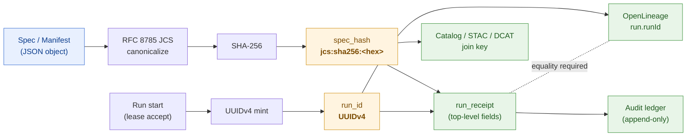

<!-- [KFM_META_BLOCK_V2]
doc_id: kfm://doc/adr-0013-spec_hash-and-run_id-identity-grammar
title: ADR-0013 — spec_hash and run_id Identity Grammar
type: standard
version: v1
status: draft
owners: [<Architecture steward>, <Identity steward>]
created: 2026-05-09
updated: 2026-05-09
policy_label: public
related:
  - kfm://doc/adr-0001-schema-home
  - docs/doctrine/directory-rules.md
  - docs/doctrine/truth-posture.md
  - docs/standards/CANONICALIZATION.md   # PROPOSED
  - docs/standards/RUN_RECEIPT.md        # PROPOSED
  - schemas/contracts/v1/common/identity.schema.json   # PROPOSED
  - schemas/contracts/v1/runtime/run_receipt.schema.json   # PROPOSED
tags: [adr, identity, hashing, canonicalization, jcs, sha256, run_id, spec_hash, governance]
notes:
  - Pins spec_hash canonical tagged form `jcs:sha256:<hex>` and the volatile-field exclusion rule.
  - Pins run_id as a UUIDv4 carried by the run receipt and matched against OpenLineage runId.
  - Companion to ADR-0001 (Schema Home); does not modify schema home conventions.
  - T1-T8 round-trip determinism conformance tests are gating; see §10.
[/KFM_META_BLOCK_V2] -->

# ADR-0013 — `spec_hash` and `run_id` Identity Grammar

> **Pin the grammar of two foundational identifiers — `spec_hash` (deterministic content identity) and `run_id` (per-execution identity) — so every receipt, gate, lineage event, catalog record, attestation, tombstone, and rollback target uses the same shape, the same canonicalization, and the same scope.**

---

## 0. Status

| Field | Value |
|---|---|
| **ADR ID** | ADR-0013 |
| **Title** | `spec_hash` and `run_id` Identity Grammar |
| **Status** | **Proposed** |
| **Date** | 2026-05-09 |
| **Owners** | Architecture steward · Identity steward · *<reviewable placeholder>* |
| **Supersedes** | None |
| **Superseded by** | None |
| **Related ADRs** | ADR-0001 *(Schema Home)* |
| **Related doctrine** | `docs/doctrine/directory-rules.md`, `docs/doctrine/lifecycle-law.md`, `docs/doctrine/truth-posture.md` |
| **Affected schemas** *(PROPOSED homes)* | `schemas/contracts/v1/common/identity.schema.json`, `schemas/contracts/v1/runtime/run_receipt.schema.json` |
| **Conformance** | T1–T8 round-trip determinism tests (§10) |
| **Truth posture** | Decisions in §3–§6 are **CONFIRMED** by attached corpus; specific repo paths are **PROPOSED** until verified against mounted-repo evidence (Directory Rules §2.5). |

> [!IMPORTANT]
> This ADR resolves the *grammar* of `spec_hash` and `run_id`. It does **not** allocate schema homes (see ADR-0001), pick a transparency-log backend, or commit to full SLSA / cosign tooling. Those decisions belong in their own ADRs.

**Quick jumps.** [Context](#1-context) · [Decision summary](#3-decision-summary) · [`spec_hash`](#4-decision--spec_hash) · [`run_id`](#5-decision--run_id) · [Encoded forms](#6-grammar--encoded-forms) · [Conformance](#10-conformance--t1t8-round-trip-determinism-suite) · [Migration](#13-migration-and-rollback) · [Open questions](#14-open-questions-carried-forward)

---

## 1. Context

Identity is the chassis on which every governance property in KFM rests. Receipts, gates, lineage, attestations, tombstones, releases, rollbacks, and corrections all assume that two questions can be answered the same way every time:

1. *What content is this?* — answered by `spec_hash`.
2. *Which execution produced this artifact?* — answered by `run_id`.

The attached corpus is unanimous on the **need** for these two identifiers and consistent on their **role**, but drifts on the **exact** grammar:

- Field names diverge: `fetch_time` vs `fetched_at`; `http_validators` vs `source_validators`; `attestations[]` vs `signatures[]`.
- Hash format prefix is sometimes `sha256:`, sometimes `jcs:sha256:`, sometimes `blake3:`, occasionally untagged.
- Canonicalization is sometimes "RFC 8785 / JCS," sometimes the looser `json.dumps(sort_keys=True, separators=(",", ":"))`.
- `run_id` is sometimes a UUID, sometimes a slug embedded in a URN like `urn:kfm:receipt:hazards:<run_id>`, sometimes a placeholder.

[CONFIRMED — Pass-10 §C1-01 *Universal Run Receipt*; Pass-10 §C1-02 *Deterministic spec_hash*; Pass-12 KFM-IDX-B-004 *null-out before hashing*; `kfm_build_companion.pdf` §6 *Hash families to keep separate*; Pass-12 §J.3 *ADR pattern*.]

Without a single grammar:

- Two implementations of the same pipeline produce different hashes for the same logical spec.
- Replay and conformance fail (the canonicalization remains "a placeholder until the runtime is locked").
- `prior_spec_hash`-keyed revocation and `revoke_delta` linkage silently break.
- Tile builds, signed sidecars, and OPA gates over `spec_hash` cannot be cross-validated.
- OpenLineage events and run receipts cannot be joined on the same `run_id`.

This ADR closes that drift.

---

## 2. Forces

- **Reproducible** across machines, languages (Python, Go, TypeScript), and runtimes — including CI replay and downstream verifiers.
- **Distinguishes content from execution.** A change in inputs/code SHOULD produce a different `run_id` even when content is unchanged; a change in serialization MUST NOT.
- **Does not collapse hash families.** A source-retrieval hash is not a run hash; a content-spec hash is not a release-manifest hash; a model checksum is not evidence. *(See `kfm_build_companion.pdf` §6.1.)*
- **Permits revocation and rollback** keyed on prior identity (`prior_spec_hash` in `revoke_delta`).
- **Greppable, diff-able, and indexable** — receipts are JSON Lines or compact pretty-printed objects.
- **Portable** into STAC / DCAT / PROV / OpenLineage facets without translation.
- **Cheap to compute** at intake and gate time; does not require heavy graph canonicalization unless the document is genuinely RDF.

---

## 3. Decision (summary)

KFM adopts the following grammar for `spec_hash` and `run_id`. Sections 4–6 are normative; this is the executive summary.

1. **`spec_hash`** is the lowercase hex SHA-256 of the **RFC 8785 JCS-canonicalized** UTF-8 byte sequence of a normalized object, written in **tagged** form: **`jcs:sha256:<64-hex>`**. The same bytes that are canonicalized are NFC-normalized (Unicode), float-quantized (6-decimal default), volatile-field-excluded, and self-reference-nulled.
2. **`run_id`** is a **UUIDv4** generated once at run-start, persisted into the run receipt, the OpenLineage `run.runId` facet, and any URN that names the run. It is **never** an input to `spec_hash`.
3. **`spec_hash`** and **`run_id`** are different things. They MUST NOT be substituted for each other in any contract, schema, policy, manifest, or URN.
4. **Hash families are kept separate.** A receipt MAY carry several tagged hashes (`source_retrieval_hash`, `content_spec_hash`, `run_hash`, `schema_hash`, `policy_hash`, `evidence_bundle_hash`, `release_manifest_hash`, `ai_receipt_hash`). They are independent identifiers, validated by their own rules.
5. **Conformance** is established by the **T1–T8 round-trip determinism suite** (§10), which CI runs against every identity-emitting tool.

---

## 4. Decision — `spec_hash`

### 4.1 Tagged form

A `spec_hash` MUST be written as:

```
jcs:sha256:<64 lowercase hexadecimal characters>
```

- The `jcs:` prefix names the canonicalization algorithm. Validators MUST reject any `spec_hash` whose canonicalization tag is missing or unknown.
- The `sha256:` segment names the digest algorithm. SHA-256 is the **primary** algorithm for KFM v1.
- Lowercase hex only. No `0x`. No whitespace. No URN wrapping at this layer (URNs that *embed* a `spec_hash` are defined in §6.4).

> [!NOTE]
> The corpus discusses BLAKE3 as a future preferred algorithm. KFM v1 pins SHA-256. A successor ADR may add `jcs:blake3:<hex>` as a parallel tag, but BLAKE3 is **out of scope** for ADR-0013.

### 4.2 Canonicalization recipe (RFC 8785 / JCS)

The bytes that are hashed MUST be the output of RFC 8785 JSON Canonicalization Scheme applied to the **normalized** input object:

| Step | Rule |
|---|---|
| 1. Strip volatile | Remove fields listed in §4.3 from the object before canonicalization. |
| 2. Null self-reference | Set any `integrity.hash` / `integrity.bundle_digest` / `spec_hash` field on the object itself to `null` *before* hashing. Stamp the computed value back after. |
| 3. NFC | Normalize all string values to Unicode NFC. |
| 4. Quantize floats | Round IEEE-754 float values to 6 decimal places by default; record the precision policy alongside the hash if a non-default policy is used. |
| 5. Sort keys | Lexicographic UTF-8 code-point order, applied recursively. |
| 6. Compact separators | `,` and `:` with no insignificant whitespace. |
| 7. UTF-8 encode | Emit bytes as UTF-8, no BOM. |
| 8. SHA-256 | Compute SHA-256 over those bytes; render lowercase hex. |
| 9. Tag | Concatenate `jcs:sha256:` + hex; this is the `spec_hash`. |

> [!CAUTION]
> RFC 8785 / JCS is **not** bit-identical to `json.dumps(sort_keys=True, separators=(",", ":"))` for all inputs (RFC 8785 specifies number-serialization rules Python's default does not enforce). Pipelines MUST use a JCS implementation, not the looser default. See §11 for pinned libraries.

### 4.3 Volatile-field exclusion (must NOT affect `spec_hash`)

These fields are **always** stripped before canonicalization and never contribute to `spec_hash`:

- `run_id`, `started_at`, `completed_at`, `ingested_at`, `fetch_time` / `fetched_at`
- `processing_duration`, `wall_clock_ms`
- CI run URL, runner ID, hostname, container ID
- Local file paths (anywhere absolute or workspace-relative paths might leak)
- Random UUIDs *unless* an upstream stable ID is explicitly the object's identity
- Log ordering, temp filenames, CI environment variables
- Any `integrity.hash` / `spec_hash` / `bundle_digest` field on the object itself (null-out per §4.2 step 2)

Any new field added to a schema MUST be classified as either **identity-bearing** (contributes to `spec_hash`) or **volatile** (excluded). The classification lives in `schemas/contracts/v1/common/identity.schema.json` *(PROPOSED home)* as an explicit `x-kfm-volatile: true` annotation.

### 4.4 What `spec_hash` does and does not imply

| Implies | Does not imply |
|---|---|
| The content bytes (after canonicalization) are the same. | The content is authoritative. |
| Re-runs over the same canonical content produce the same identifier. | The content is rights-cleared, sensitivity-cleared, or release-approved. |
| Watcher diff and `revoke_delta` linkage on `prior_spec_hash` work. | Anything about runtime success or who signed the result. |
| Catalog / STAC / DCAT records can join on `spec_hash`. | Anything about the validity of the underlying source. |

### 4.5 Hash families MUST be kept separate

A receipt MAY carry several tagged hashes; each obeys its own scope. The canonical set:

| Hash | Represents | Used for | Must not imply |
|---|---|---|---|
| `source_retrieval_hash` | Exact retrieved payload / source-native capture | Detecting source change; intake receipt linkage | Source authority or rights clearance |
| `content_spec_hash` *(this ADR)* | Canonicalized content + transformation specification | Rebuild determinism; derivative invalidation | Runtime success or release approval |
| `run_hash` | Run inputs, parameters, tool versions, environment, outputs | Audit, reproducibility, comparison | Content identity across environments |
| `schema_hash` | Schema version content | Validator reproducibility, fixture compatibility | Semantic correctness by itself |
| `policy_hash` | Policy bundle content | Explaining allow / deny at release time | Final steward judgment |
| `evidence_bundle_hash` | Resolved admissible evidence set | Claim closure, citation validation | Truth beyond its scoped evidence |
| `release_manifest_hash` | Released artifact set + proof / policy / review / rollback refs | Publication identity, rollback target | Immutability of upstream source |
| `ai_receipt_hash` | Model prompt / context / output envelope + checksums | Audit and replay boundaries | Authority, evidence, or correctness |

> [!WARNING]
> Substituting one hash family for another is a **trust-membrane violation**. A `release_manifest_hash` is not a `content_spec_hash`. A `source_retrieval_hash` is not proof of rights clearance. PRs that conflate families will be rejected at gate time.

[CONFIRMED scope of separation — `kfm_build_companion.pdf` §6.1.]

---

## 5. Decision — `run_id`

### 5.1 Format

A `run_id` MUST be a **UUIDv4** (RFC 4122), serialized as the canonical 36-character lowercase string with hyphens:

```
xxxxxxxx-xxxx-4xxx-yxxx-xxxxxxxxxxxx
```

- Validators MUST reject `run_id` values that are not RFC 4122 UUIDv4 syntactically.
- `run_id` is opaque to consumers; nothing about provenance, time, or content is encoded in its bytes.

> [!NOTE]
> The corpus leaves an open question on whether `run_id` should equal the OpenLineage `runId`, be generated independently, or be content-addressed. ADR-0013 picks **independently-generated UUIDv4** (random, opaque, non-correlatable, easy to mint in any orchestrator) and **mandates equality** with the OpenLineage `run.runId` facet (§5.4).

### 5.2 Scope and lifecycle

| Stage | Behavior |
|---|---|
| Run start (lease accept) | The orchestrator mints `run_id`. It is logged immediately and emitted as the OpenLineage `START` event's `run.runId`. |
| During run | `run_id` is carried in every artifact path segment, log line, structured metric, and trace span as `kfm.run_id`. |
| Run completion | The run receipt is written with `run_id` as a top-level field. `COMPLETE` (or `FAIL`) lineage event carries the same `run.runId`. |
| After run | `run_id` is **immutable**. It indexes the receipt, the lineage record, the audit-ledger entry, and any tombstone that points at this run. |
| Re-runs | A re-run MUST mint a new `run_id` even if `spec_hash` is unchanged. Idempotency is a `spec_hash` property, not a `run_id` property. |

### 5.3 `run_id` is volatile for `spec_hash`

`run_id` MUST be excluded from any `spec_hash` input (§4.3). Two runs over identical canonical content produce identical `spec_hash` values and **different** `run_id` values. This is the single most important separation in this ADR.

### 5.4 Cross-system equality rule

The following identifiers MUST all carry the *same* UUIDv4 value for a given run:

- `run_receipt.run_id` (top-level field on the receipt)
- OpenLineage `run.runId` (in both `START` and `COMPLETE` / `FAIL` events)
- The `<run_id>` segment of any URN that names this run (e.g. `urn:kfm:receipt:<domain>:<run_id>`)
- The `kfm.run_id` correlation field on traces, metrics, and structured logs

A Conftest / OPA gate *(PROPOSED, lives under `policy/gates/identity_grammar.rego`)* enforces this equality before promotion.

[CONFIRMED — Pass-10 C1-01, C1-05; the corpus open-question on receipt-vs-OL run id is resolved here in favor of equality.]

### 5.5 What `run_id` does and does not imply

| Implies | Does not imply |
|---|---|
| A specific execution context. | Content identity. |
| A join key for receipt ⇄ lineage ⇄ audit ledger. | Reproducibility (without `spec_hash`). |
| A correlation handle across logs, metrics, traces. | Authority, rights, or release state. |

---

## 6. Grammar — encoded forms

### 6.1 Identifier flow (responsibility view)



*Diagram pins the two distinct identity flows (content → `spec_hash`; execution → `run_id`) and the single equality constraint between receipt and OpenLineage.*

### 6.2 In the run receipt (top-level fields)

```jsonc
{
  "schema_version": "kfm.run_receipt.v1",
  "run_id":     "8d4a2f0e-7c3b-4e9d-b3aa-1f2e90d4c711",
  "spec_hash":  "jcs:sha256:9b74c9897bac770ffc029102a200c5de01e91f2e7a1d3c5b7d6a0f9e8c4a2d10",
  "dataset_id":      "<…>",
  "dataset_version": "<…>",
  "fetch_time":      "2026-05-09T17:21:04Z",
  "source_url":      "<…>",
  "http_validators": { "etag": "<…>", "last_modified": "<…>" },
  "orchestrator":    "dagster|prefect|temporal|github-actions|<…>",
  "transform_git_sha": "<40-hex>",
  "artifacts":   [{ "path": "<…>", "digest": "sha256:<…>" }],
  "rights_spdx": "CC0-1.0",
  "attestations":[{ "type": "cosign", "bundle_digest": "sha256:<…>" }]
}
```

> [!IMPORTANT]
> The example above is **illustrative**. The canonical schema lives at the PROPOSED home `schemas/contracts/v1/runtime/run_receipt.schema.json`; this ADR pins only the **identity grammar** (`spec_hash` and `run_id`), not the full receipt envelope.

### 6.3 In OpenLineage events

```jsonc
{
  "eventType": "START",
  "run": {
    "runId": "8d4a2f0e-7c3b-4e9d-b3aa-1f2e90d4c711",
    "facets": {
      "kfm.spec":       { "_producer": "<…>", "spec_hash": "jcs:sha256:…" },
      "kfm.receiptRef": { "uri": "urn:kfm:receipt:<domain>:8d4a2f0e-…" }
    }
  },
  "job": { "namespace": "kfm.<domain>", "name": "<job>" }
}
```

The `run.runId` MUST match `run_receipt.run_id` byte-for-byte.

### 6.4 In traces, metrics, structured logs, and URNs

| Field | Value |
|---|---|
| `kfm.run_id` | The UUIDv4 (string). |
| `kfm.spec_hash` | The full tagged form (`jcs:sha256:…`). |
| `kfm.spec_hash.short` *(display only)* | First 12 hex chars after the `jcs:sha256:` prefix. **Never used for equality.** |

KFM URNs that name a run, receipt, or content artifact follow this template:

```
urn:kfm:<scope>:<domain>:<lane>[:<id_segment>]
```

| URN family | Identifier segment |
|---|---|
| Run receipt | `<run_id>` (UUIDv4) |
| Content artifact (catalog) | `<content_spec_hash>` written **without colons**: `jcs.sha256.<hex>` |
| Release | `<release_manifest_hash>` written `jcs.sha256.<hex>` |
| Evidence bundle | `<evidence_bundle_hash>` written `jcs.sha256.<hex>` |

> [!NOTE]
> URNs replace `:` with `.` inside the hash payload because URN syntax (RFC 8141) treats `:` as a structural separator. The full tagged form is preserved unchanged in receipts and in API surfaces.

---

## 7. What this ADR explicitly does NOT do

- It does **not** decide a transparency-log backend (Rekor public vs private, OCI vs S3 + Object Lock).
- It does **not** decide a SLSA level.
- It does **not** decide BLAKE3 adoption (it pins SHA-256 for v1; BLAKE3 is a future ADR).
- It does **not** decide whether large objects use a Merkle tree above a single SHA-256.
- It does **not** decide the schema-home root (that is **ADR-0001**).
- It does **not** decide AI-receipt or evidence-bundle field shapes (each is its own contract).

> [!TIP]
> Each "does not" item is a candidate ADR. Reference this ADR when those follow-ups are written.

---

## 8. Consequences

### 8.1 Positive

- A single, machine-checkable, cross-language identity grammar for content and execution.
- Receipts are joinable to OpenLineage events and to audit-ledger entries on a single key.
- `spec_hash` is portable into STAC item properties, DCAT distributions, evidence-bundle JSON-LD, and signed-sidecar metadata without translation.
- Watcher pipelines distinguish real change from serialization drift; idempotent re-runs become a property of `spec_hash` rather than per-pipeline guesswork.
- Validators reject untagged or wrong-shaped hashes mechanically.

### 8.2 Negative / cost

- A pinned JCS implementation is required in every language KFM uses; some ecosystems have less mature libraries.
- Unicode NFC and float-quantization are easy to forget in ad-hoc tools; T1–T8 (§10) is mandatory.
- Existing artifacts that used untagged `sha256:` or looser canonicalization MUST be migrated; a transition window is documented in §13.
- Any change to the volatile-field exclusion list rotates `spec_hash` for affected objects and forces a watcher re-run.

### 8.3 Risk if not adopted

- Hashes silently diverge between Python and TypeScript producers.
- Promotion gates that compare `spec_hash` ship false positives or false negatives.
- Tombstones cannot reliably identify their target.
- OpenLineage discovery and receipt audit cannot be cross-checked.

---

## 9. Alternatives considered

| Option | Why rejected |
|---|---|
| **Loose canonicalization** (`json.dumps(sort_keys=True, separators=(",", ":"))`) | Number serialization not deterministic across runtimes (notably floats and large integers). Already shown to drift in corpus recipes. |
| **Untagged digests** (`<hex>` alone) | Cannot distinguish algorithms or canonicalization variants; rejects upgrade paths and forensic clarity. |
| **`sha256:<hex>` without canonicalization tag** | Hides which canonicalization produced the input bytes; two pipelines using different canonicalizations would emit colliding-looking but incompatible hashes. |
| **BLAKE3 as the v1 default** | Faster but materially less mature in cross-language tooling at the time of this ADR. Reserved for a future ADR. |
| **URDNA2015 for all content** | Necessary for RDF graph documents but expensive and overkill for JSON. Permitted as an alternative for genuinely RDF artifacts when the canonicalization tag is set accordingly (`urdna2015:sha256:`); not the default. |
| **Content-addressed `run_id`** (e.g., `sha256` over inputs) | Collapses the content/execution distinction this ADR exists to enforce. |
| **Shared `run_id` across re-runs of the same `spec_hash`** | Breaks audit, rate-limiting, and lineage. Idempotency is a `spec_hash` property, not a `run_id` property. |
| **Receipt run_id ≠ OpenLineage runId** (carry-by-reference) | Forces a join hop that is silently broken by retention mismatches; equality is cheaper and verifiable. |

---

## 10. Conformance — T1–T8 round-trip determinism suite

CI MUST run the following tests against every tool that emits a `spec_hash` or `run_id`. The naming follows the corpus convention; see Pass-12 §J.3 and `kfm_build_companion.pdf` §6.

| ID | Test | Asserts |
|---|---|---|
| **T1** | Canonicalize → de-canonicalize → canonicalize round-trip | Byte equality across two canonicalization passes. |
| **T2** | Float quantization stability | `0.1 + 0.2`, `1e-7`, large floats all produce stable hashes. |
| **T3** | Unicode NFC | NFD-encoded inputs hash identically to NFC-encoded inputs. |
| **T4** | Key sort order | Inputs whose keys are emitted in different orders produce identical canonical bytes. |
| **T5** | Nested structure | Deeply nested arrays / objects canonicalize identically across implementations. |
| **T6** | Self-reference null-out | `integrity.hash` / `spec_hash` fields are nulled before hashing and stamped after. |
| **T7** | Digest-tag stability | Output is `jcs:sha256:<64 lowercase hex>`. Length, casing, and prefix are validated. |
| **T8** | Cross-language reproducibility | Python, TypeScript, and Go reference implementations produce the same hash on the same input. |

A negative-fixture parity check *(PROPOSED tool: `tools/identity/parity_check.py`)* ensures every rule in this ADR has a corresponding bad-input fixture under `fixtures/identity/invalid/`.

> [!IMPORTANT]
> A PR that introduces or modifies an identity-emitting tool **MUST** demonstrate T1–T7 pass before merge. T8 runs nightly in cross-language mode; weekly drift reports surface divergence.

---

## 11. Pinned implementations

PROPOSED — subject to repo verification per Directory Rules §2.5.

| Language | JCS library | SHA-256 | Helper module |
|---|---|---|---|
| Python | `rfc8785` (or `jcs`) | `hashlib.sha256` | `tools/spec_hash/jcs_hash.py` |
| TypeScript | `@truestamp/canonify` (or pinned equivalent) | `crypto.subtle.digest('SHA-256', …)` | `packages/identity/src/specHash.ts` |
| Go | `webpki.org/jsoncanonicalizer` | `crypto/sha256` | `packages/identity/go/spechash` |

All three implementations MUST share the T1–T8 fixture set under `fixtures/identity/`.

> [!NOTE]
> Library *versions* are deliberately not pinned in this ADR; they live in `tools/spec_hash/VERSIONS.md` *(PROPOSED)* so they can be bumped without a new ADR. Any **swap of canonicalization algorithm** (e.g., to URDNA2015 by default, or to a non-RFC-8785 JCS variant) **does** require a new ADR.

---

## 12. Affected files and contracts

> [!CAUTION]
> Per Directory Rules §2.5: paths below are **PROPOSED** until verified against mounted-repo evidence. Where a path appears with a clearly different home in the current repo, raise a drift entry in `docs/registers/DRIFT_REGISTER.md` rather than silently re-homing.

| Layer | Path *(PROPOSED)* | Purpose |
|---|---|---|
| Schemas | `schemas/contracts/v1/common/identity.schema.json` | Tagged-hash and UUIDv4 type definitions; `x-kfm-volatile` annotation. |
| Schemas | `schemas/contracts/v1/runtime/run_receipt.schema.json` | Top-level `run_id`, `spec_hash`, hash-family fields. |
| Contracts | `contracts/runtime/run_receipt.md` | Object-meaning doc referencing this ADR. |
| Tools | `tools/spec_hash/` | JCS+SHA-256 helper, CLI, pre-commit hook. |
| Packages | `packages/identity/` | Reference implementations (Python, TS, Go). |
| Tests | `tests/identity/test_T1_T8_conformance.py` | The conformance suite. |
| Fixtures | `fixtures/identity/{valid,invalid}/` | Good and bad inputs, including Unicode / float edge cases. |
| Policy | `policy/gates/identity_grammar.rego` | Reject runs whose `run_id` ≠ OpenLineage `runId`, or whose `spec_hash` is untagged. |
| Docs | `docs/standards/CANONICALIZATION.md` | Operator-facing canonicalization reference. |
| Docs | `docs/standards/RUN_RECEIPT.md` | Operator-facing run-receipt reference. |
| ADR index | `docs/adr/README.md` | Add this ADR to the index. |

---

## 13. Migration and rollback

### 13.1 Migration window

1. **Phase 0 — adoption.** This ADR is accepted; reference implementations in `tools/spec_hash/` and `packages/identity/` ship with T1–T8 passing.
2. **Phase 1 — additive.** New receipts emit tagged `spec_hash`. Old receipts continue to validate; a `legacy_spec_hash` shadow field carries the old value where one existed.
3. **Phase 2 — gate enforcement.** OPA gate (§12) flips from advisory to fail-closed for new artifacts. A catalog re-hash job runs across `data/catalog/` and writes a `spec_hash_migration` ledger entry per object.
4. **Phase 3 — cleanup.** `legacy_spec_hash` is dropped from new schemas; references in docs are removed.

### 13.2 Rollback

If a defect is found in the canonicalization pipeline:

- The ADR is moved to **Superseded** with a forward link to its successor ADR.
- The OPA gate is reverted to advisory.
- A `data/rollback/identity-grammar/<incident>/` entry is opened with the affected `spec_hash` set and a re-hash plan.
- No previously emitted `run_id` is altered. `spec_hash` rotation is recorded as a new event in the audit ledger; tombstones are not used because content has not changed semantically.

### 13.3 Reversibility

The grammar is intentionally additive: tagging the algorithm makes it possible to introduce a new canonicalization (`jcs2:`, `urdna2015:`, `blake3:`) without disturbing existing tagged values. Reversibility is preserved through the tag itself.

---

## 14. Open questions (carried forward)

These are deliberately not resolved by ADR-0013. Each is tracked in `docs/registers/VERIFICATION_BACKLOG.md` *(PROPOSED home)* and is a candidate for a follow-up ADR.

- **OQ-1.** Should very large objects use a Merkle tree above a single SHA-256? At what byte / element threshold?
- **OQ-2.** Is BLAKE3 the right v2 default? When?
- **OQ-3.** Where exactly do receipts live — object store keyed by digest, immutable bucket, OCI artifact, or in-repo under `data/receipts/`?
- **OQ-4.** Are URDNA2015-canonicalized JSON-LD documents in scope for v1, or strictly v2?
- **OQ-5.** Should orchestrator-native run identifiers (Dagster `run_id`, Prefect `flow_run_id`, Temporal `runId`) be carried in a sub-facet alongside the canonical KFM `run_id`?

---

## 15. Verification checklist (for reviewers of this ADR)

Before moving status to **Accepted**, reviewers tick each box:

- [ ] Decisions in §3–§6 are internally consistent and consistent with ADR-0001 (Schema Home).
- [ ] T1–T8 conformance tests are scoped, named, and fixture-backed.
- [ ] Volatile-field exclusion list (§4.3) covers every transient field in current run-receipt drafts.
- [ ] Tagged-hash regex `^jcs:sha256:[0-9a-f]{64}$` is committed to a schema fragment.
- [ ] UUIDv4 regex `^[0-9a-f]{8}-[0-9a-f]{4}-4[0-9a-f]{3}-[89ab][0-9a-f]{3}-[0-9a-f]{12}$` is committed alongside.
- [ ] OPA gate enforcing `run_receipt.run_id == openlineage.run.runId` is drafted with a negative fixture.
- [ ] Migration plan (§13) names a window and an exit criterion.
- [ ] All file paths quoted in §12 are either verified against the mounted repo or labeled PROPOSED.
- [ ] No claim in this ADR exceeds its evidence basis (`docs/doctrine/truth-posture.md`).

---

## 16. References

- Pass-10 §C1-01 *The Universal Run Receipt* — receipt envelope and required fields. **CONFIRMED.**
- Pass-10 §C1-02 *Deterministic spec_hash via JCS+SHA-256* — `jcs:sha256:<hex>` form. **CONFIRMED.**
- Pass-10 §C1-05 *OpenLineage Events* — `run.runId` ⇄ receipt `run_id` equality. **CONFIRMED.**
- Pass-12 §B.2 KFM-IDX-B-004 *Null-out before hashing* — self-reference rule. **CONFIRMED.**
- Pass-12 §J.3 *ADR pattern* — ADR template fields and T1–T8 reference. **CONFIRMED.**
- `kfm_build_companion.pdf` §6 *Deterministic identity, hashing, and version semantics* — hash families, ID grammar, identity rules. **CONFIRMED.**
- `kfm_hazards_extended_pro_pdf_only_blueprint.pdf` §15 — volatile-field exclusion examples. **CONFIRMED scope.**
- `directory-rules.md` §0, §2.4, §6.1 — ADR home (`docs/adr/`), §2.4 ADR triggers. **CONFIRMED.**
- ADR-0001 *Schema Home* — `schemas/contracts/v1/...` as the schema-home root. **Accepted (per Directory Rules §0).**

---

## 17. Decision log

| Date | Author | Action |
|---|---|---|
| 2026-05-09 | *<owner>* | Drafted ADR-0013 from corpus synthesis. **Status: Proposed.** |

---

[⬆ Back to top](#adr-0013--spec_hash-and-run_id-identity-grammar)
