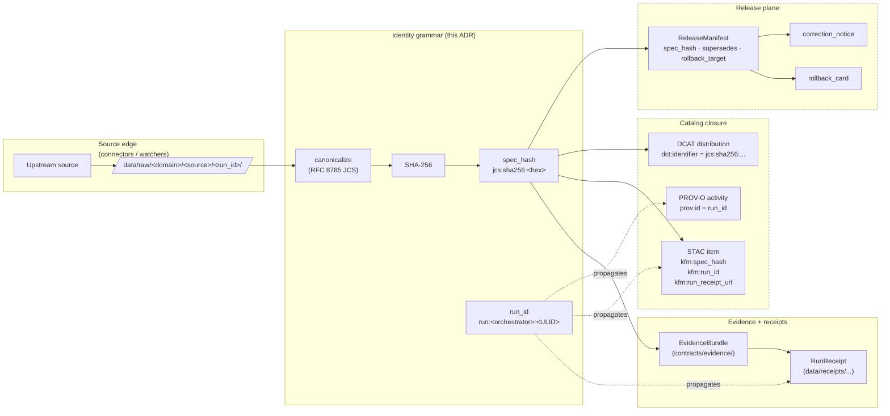

<!-- [KFM_META_BLOCK_V2]
doc_id: kfm://doc/adr-0013-spec_hash-and-run_id-identity-grammar
title: ADR-0013 — spec_hash and run_id Identity Grammar
type: standard
version: v1
status: proposed
owners: TODO — Docs steward + Evidence/Identity subsystem owner (NEEDS VERIFICATION)
created: 2026-05-11
updated: 2026-05-15
policy_label: public
related:
  - docs/adr/ADR-0001-schema-home.md
  - docs/doctrine/directory-rules.md
  - docs/doctrine/truth-posture.md
  - docs/doctrine/lifecycle-law.md
  - docs/architecture/contract-schema-policy-split.md
  - docs/registers/VERIFICATION_BACKLOG.md
  - schemas/contracts/v1/common/                  # PROPOSED home for identity primitives
  - contracts/evidence/                            # EvidenceBundle / EvidenceRef meaning
  - data/receipts/                                 # run-receipt storage lane
tags: [kfm, adr, identity, hashing, provenance, evidence]
notes:
  - "ADR number 0013 reserved; intermediate ADRs (0002–0012) NEEDS VERIFICATION against mounted repo."
  - "Owners and related-doc paths are PROPOSED until verified against current repo state."
[/KFM_META_BLOCK_V2] -->

# ADR-0013 — `spec_hash` and `run_id` Identity Grammar

> Freezes the **deterministic-identity grammar** KFM uses across EvidenceBundles, run receipts, catalog records, release manifests, and revocation deltas: how `spec_hash` is computed, how `run_id` is formed, what is included, what is excluded, and how the two are wired into the lifecycle.

<!-- Badges: Shields.io static placeholders. Replace targets when CI surfaces exist. -->


| Field | Value |
|---|---|
| **Status** | `proposed` (per `<status>` field; see §2.4 of Directory Rules) |
| **Decision class** | Identity grammar — *content-of-doctrine*, not a directory move |
| **Owners** | TODO — Evidence/Identity subsystem owner + Docs steward (NEEDS VERIFICATION) |
| **Date** | 2026-05-11 |
| **Last updated** | 2026-05-15 |
| **Supersedes** | None |
| **Superseded by** | None |
| **Replaces (informally)** | Scattered corpus conventions for `spec_hash` and `run_id` (see §3) |
| **Related ADRs** | ADR-0001 (schema home) — CONFIRMED reference in `docs/doctrine/directory-rules.md` |
| **Current repo evidence** | UNKNOWN — no mounted repo, tests, workflows, or runtime logs were inspected in this update pass |

> [!NOTE]
> **Update-pass evidence boundary.** This revision used the attached Markdown baseline, the attached KFM Markdown Updater prompt, Directory Rules doctrine, and targeted official checks for RFC 8785 and OpenLineage semantics. It does **not** claim that any proposed path, schema, workflow, validator, or runtime surface exists in the current KFM repo.

---

## Quick jump

- [1. Context](#1-context)
- [2. Decision (Normative)](#2-decision-normative)
- [3. Source-state today](#3-source-state-today)
- [4. Identity-grammar diagram](#4-identity-grammar-diagram)
- [5. Field-level reference](#5-field-level-reference)
- [6. Worked example](#6-worked-example)
- [7. Consequences](#7-consequences)
- [8. Alternatives considered](#8-alternatives-considered)
- [9. Migration plan](#9-migration-plan)
- [10. Validation](#10-validation)
- [11. Rollback](#11-rollback)
- [12. Open questions](#12-open-questions)
- [13. Anti-patterns](#13-anti-patterns)
- [14. Glossary](#14-glossary)
- [15. Related docs](#15-related-docs)

---

## 1. Context

KFM doctrine asserts that **identity must be deterministic** so that every other governed property — dedupe, lineage, transparency-log inclusion, rollback target, revocation linkage, attestation, and Evidence-Drawer attribution — can actually function. The Idea Index calls this out plainly:

> *"the most heavily repeated idea is that identity must be deterministic: every artifact, bundle, and record carries a `spec_hash` computed over a canonicalized form (typically RFC 8785 / JCS), and that `spec_hash` is what allows deduplication, rebuilds, transparency-log inclusion, lineage, and rollback to function."*
> — `docs/KFM_Components_Pass_11_Part_2_Idea_Index_Category_Atlas_and_Expansion_Dossier.md` (CONFIRMED)

The doctrine is settled. The **grammar** is not. The corpus uses several **near-shapes** for the same idea — `sha256:<hex>`, `jcs:sha256:<hex>`, `kfm:spec_hash`, occasional uses of URDNA2015 for graph content, slightly different transient-field exclusion lists, and at least two competing receipt envelopes. The KFM Components Pass 10 dossier names this directly:

> *"The corpus uses slightly different field names in different recipes. There is no single canonical KFM run-receipt JSON Schema referenced consistently; multiple sections show schemas that diverge in detail."* — Pass 10, C1-01 (CONFIRMED in attached docs)

This ADR freezes one grammar so downstream contracts, schemas, gates, tiles, catalogs, run receipts, and clients can rely on the same identifiers.

> [!IMPORTANT]
> **Identity is doctrine. The grammar is governance.** If `spec_hash` is non-deterministic, every governance property that depends on it — dedupe, lineage, transparency-log inclusion, rollback target, `revoke_delta` linkage — silently breaks. This ADR is mandatory reading for anyone authoring connectors, pipelines, validators, catalog writers, or release tooling.

[Back to top](#adr-0013--spec_hash-and-run_id-identity-grammar)

---

## 2. Decision (Normative)

The conformance language below is RFC 2119-style and matches `docs/doctrine/directory-rules.md` §2.2.

### 2.1 `spec_hash` — the content-identity term

1. **Algorithm.** `spec_hash` MUST be computed by:
   1. Removing the object-family `TRANSIENT_FIELDS` from the target object.
   2. Serializing the remaining target object as JSON.
   3. Canonicalizing that JSON per **RFC 8785 / JSON Canonicalization Scheme (JCS)**.
   4. Taking **SHA-256** over the canonical UTF-8 bytes.
2. **String form (frozen).** The recorded value MUST use the prefixed form:

```text
jcs:sha256:<64-hex-lowercase>
```

   The bare `sha256:<hex>` form found in earlier corpus passages is **deprecated for new writes** and MUST be migrated under §9. Validators MUST accept the prefixed form as canonical and MAY accept bare `sha256:` only inside a clearly scoped backward-compatibility window.
3. **Hash domain — `kfm:spec_hash` extension key.** Where `spec_hash` is embedded in a foreign envelope (STAC item properties, DCAT distribution, PROV record, PMTiles metadata block, etc.), it MUST appear under the **`kfm:spec_hash`** property name to preserve namespace discipline and survive validators that strip unknown bare fields.
4. **Canonicalization rules.** The JCS canonicalization MUST enforce:
   - Sorted object keys, using JCS property sorting.
   - JCS string serialization without mutating string content during the canonicalization step.
   - I-JSON-compatible JSON values, including no duplicate object property names; `NaN` / `±Inf` MUST cause emit-time failure.
   - JCS number serialization. Exact identifiers, counters, or externally meaningful large integers SHOULD be string-encoded by schema before canonicalization unless the object-family contract explicitly proves safe numeric handling.
   - No trailing whitespace; no insignificant whitespace anywhere.
   - UTF-8 encoding of the final canonical bytes before hashing.
5. **Unicode normalization is a preflight transform, not silent JCS behavior.** Object-family schemas MAY require NFC or another Unicode normalization policy, but that transform MUST be declared, receipted, and completed **before** JCS canonicalization. A writer MUST NOT silently normalize strings during hashing without a schema-declared policy and a validation fixture.
6. **Transient-field exclusion (`TRANSIENT_FIELDS`).** The hash MUST be computed **after** removing volatile fields. The minimum exclusion set is:

```text
spec_hash, generated_at, updated_at, fetched_at, retrieved_at,
timestamp, nonce, run_id, signer, signature, attestations
```

   Connectors and pipelines MAY extend this list per object-family contract, but they MUST NOT shrink it. The retrieval timestamp **never** affects `spec_hash`.
7. **Forbidden fields.** The `--forbid-field` set MUST reject any object that contains a field intended to be volatile but found leaking into the hashed payload (e.g., misplaced `generated_at` inside a `record.payload`). This is a hard validator gate, not a warning.
8. **Graph-shaped content.** For JSON-LD graphs that may have been merged from multiple contexts, `spec_hash` MAY alternatively be computed via **URDNA2015 RDF dataset canonicalization** followed by SHA-256. When this path is used the recorded value MUST be prefixed `urdna2015:sha256:<hex>` so the canonicalization route is auditable from the string alone. This is the **only** other permitted route; mixing canonicalizers for the *same* object family within a release is forbidden.

### 2.2 `run_id` — the KFM activity-identity term

1. **Definition.** `run_id` identifies **one** execution of a governed KFM step (a watcher pull, a pipeline run, a tile build, a catalog emission, a release decision, an AI inference). It is KFM's activity identity term and is distinct from content identity (`spec_hash`).
2. **String form (frozen).**

```text
run:<orchestrator>:<ULID>
```

   where:
   - `<orchestrator>` is a short stable label drawn from a controlled vocabulary maintained in `control_plane/` (e.g., `gha`, `airflow`, `prefect`, `local`, `manual`). [PROPOSED vocabulary; NEEDS VERIFICATION against repo.]
   - `<ULID>` is a 26-character Crockford-base32 ULID, time-ordered, monotonic within a millisecond when the generator supports monotonicity.
3. **Stability.** `run_id` MUST be generated **once**, at the start of the KFM run, and propagated through every artifact, receipt, log, and downstream side-effect of that run. A run that emits multiple artifacts MUST share a single KFM `run_id` across all of them.
4. **PROV binding.** The same KFM `run_id` MUST appear:
   - In the run receipt's `run_id` field.
   - In the PROV-O activity's `prov:id` or equivalent local activity identifier.
   - In STAC item `properties.kfm:run_id` when the run is material to the item.
5. **OpenLineage binding.** OpenLineage `run.runId` is a UUID in the OpenLineage object model, so KFM MUST NOT force `run:<orchestrator>:<ULID>` into `run.runId`. If OpenLineage events are emitted:
   - Emit an OpenLineage-compatible UUID, preferably UUIDv7 where supported, in `run.runId`.
   - Preserve the KFM `run_id` in a custom run facet or equivalent `kfm:run_id` extension field.
   - Record the OpenLineage UUID in the KFM RunReceipt as `openlineage_run_uuid` when present.
6. **Independence from `spec_hash`.** `run_id` MUST NOT participate in `spec_hash` computation. `spec_hash` is content-identity; `run_id` is activity-identity. Conflating them is the primary anti-pattern this ADR exists to prevent (see §13.1).

### 2.3 Wiring rules

| Concern | Rule |
|---|---|
| **Bundle identity** | `EvidenceBundle.spec_hash` MUST be the JCS-SHA-256 of the bundle minus `spec_hash`, `signature`, and `attestations`. |
| **Record identity** | Each canonical dataset record carries its own `spec_hash`. Records MUST NOT inherit the bundle hash. |
| **Run receipt identity** | The receipt is itself canonicalized and carries its own `spec_hash`; it ALSO carries the `spec_hash` values of every artifact it produced. |
| **OpenLineage bridge** | When emitted, OpenLineage `run.runId` is stored as `openlineage_run_uuid`; KFM `run_id` remains the local governed activity identity. |
| **Release manifest** | `ReleaseManifest.spec_hash` covers the manifest body. It references layer-level `spec_hash` per artifact. |
| **Supersedes / rollback** | `supersedes` MUST cite the **prior `spec_hash`** of the same identity slot; `rollback_target` MUST cite the `spec_hash` of the previously published artifact. |
| **Revocation** | `revoke_delta.id` MUST reference a `prior_spec_hash`; revocations chain by `spec_hash`, not by file path. |
| **Catalog references** | STAC items carry `properties.kfm:spec_hash` and `properties.kfm:run_id`; DCAT distributions carry `dct:identifier` set to `jcs:sha256:<hex>`. |
| **Run receipt references** | STAC items that are materially produced by a run SHOULD carry `properties.kfm:run_receipt_url` or an equivalent governed receipt reference. |
| **Tiles** | PMTiles archives carry `kfm:spec_hash` and `run_receipt_url` in metadata when the PMTiles metadata profile allows it; exact key conventions remain §12 verification work. |
| **AI receipts** | Each `AIReceipt` carries its own `run_id`, `inputs_spec_hash` (array), the AI envelope's own `spec_hash`, and `parent_run_id` when it is downstream of a pipeline run. |

[Back to top](#adr-0013--spec_hash-and-run_id-identity-grammar)

---

## 3. Source-state today

> Status: **CONFIRMED from attached docs**. Repo-state portions are **NEEDS VERIFICATION** until a mounted repo is inspected.

| Source | What it says (paraphrased) | Status |
|---|---|---|
| `docs/KFM_Components_Pass_11_Part_2…` §B.1.1 | `spec_hash` = SHA-256 over RFC 8785 / JCS canonical JSON; prefixed `sha256:`; transient fields excluded; `compute_spec_hash.py` is the utility. | CONFIRMED in doc |
| `docs/KFM_Components_Pass_10…` §C1-02 | JCS+SHA-256 recorded as `jcs:sha256:<hex>`; also allows URDNA2015+SHA-256 for graph-shaped content. | CONFIRMED in doc |
| `docs/KFM_Components_Pass_10…` §C1-01 | Run-receipt envelope fields include `dataset_id`, `dataset_version`, `fetch_time`, `source_url`, `http_validators`, `spec_hash`, `run_id`, `orchestrator`, `transform_git_sha`, `artifacts[]`, `rights_spdx`, `attestations[]`. | CONFIRMED in doc |
| `docs/doctrine/directory-rules.md` | `docs/adr/` is the canonical ADR home; `schemas/contracts/v1/...` is the canonical machine-schema home (per ADR-0001). | CONFIRMED in doc |
| `docs/doctrine/directory-rules.md` | Schema-home authority is contested in some legacy paths; `policies/` vs `policy/` and `contracts/` vs `schemas/` remain NEEDS VERIFICATION. | CONFIRMED note |
| Pass 11 §B.2.1 / §B.3.x | EvidenceBundle, run receipt, ReleaseManifest, and spatial-feature identifiers all reference `spec_hash` as the identity spine. | CONFIRMED in doc |
| Pass 10 §C1-01 (Tensions) | "There is no single canonical KFM run-receipt JSON Schema referenced consistently; multiple sections show schemas that diverge in detail." | CONFIRMED — motivates this ADR |

**Drift surfaced (this ADR resolves):**

- Mixed prefix usage — `sha256:` vs `jcs:sha256:` — across the corpus.
- Inconsistent `TRANSIENT_FIELDS` lists across recipes.
- Run-receipt schema near-shapes with different field names.
- Implicit assumption that `run_id` is opaque, with no orchestrator label or ordering guarantee.

> [!NOTE]
> Repo-state checks deferred: presence of `tools/compute_spec_hash.py`, `tools/validate_all.py`, `schemas/contracts/v1/common/spec_hash.schema.json`, and `schemas/contracts/v1/runtime/run_receipt.schema.json` are **NEEDS VERIFICATION** against a mounted repo. Their *proposed* homes are listed in §9.

[Back to top](#adr-0013--spec_hash-and-run_id-identity-grammar)

---

## 4. Identity-grammar diagram

The diagram below shows where each identifier is **minted** and where it **flows**. Boxes labeled with `NEEDS VERIFICATION` indicate planned locations not yet checked against a mounted repo. OpenLineage UUID bridging is intentionally left outside the core identity flow because KFM `run_id` and OpenLineage `run.runId` are different identifier grammars (§2.2).



> [!TIP]
> The dashed groups (`CATALOG`, `RELEASE`) reflect proposed terminal homes under Directory Rules responsibility roots. The **responsibility roots** are doctrine; their **presence and exact files** in the current mounted repo are NEEDS VERIFICATION.

[Back to top](#adr-0013--spec_hash-and-run_id-identity-grammar)

---

## 5. Field-level reference

### 5.1 `spec_hash` — formal grammar

```ebnf
spec_hash      = scheme ":" algo ":" hex64
scheme         = "jcs" | "urdna2015"            ; mixing within an object-family release is FORBIDDEN
algo           = "sha256"
hex64          = 64 * HEXDIG-LOWER              ; lowercase only
HEXDIG-LOWER   = %x30-39 / %x61-66              ; 0-9, a-f
```

Examples (illustrative, not from a real artifact):

```text
jcs:sha256:7d5a3f0c9b2e4a18c2d7f1b9a3e6c8f102d4b7e1a9c0d3e5f2a1b4c7d8e9f0a1
urdna2015:sha256:1a2b3c4d5e6f7a8b9c0d1e2f3a4b5c6d7e8f90112233445566778899aabbcc
```

### 5.2 `run_id` — formal grammar

```ebnf
run_id          = "run:" orchestrator ":" ulid
orchestrator    = 1*32 (ALPHA / DIGIT / "-" / "_")
ulid            = 26 ULID-CHAR                  ; Crockford base32, 26 chars
ULID-CHAR       = %x30-39 / %x41-48 / %x4A-4B   ; 0-9 A-H J K
                / %x4D-4E / %x50-54 / %x56-5A   ; M N P-T V-Z
```

Example:

```text
run:gha:01HXYZ7G2C5N9PJ4WVABCDEFGH
```

### 5.3 `TRANSIENT_FIELDS` minimum set

| Field | Why excluded |
|---|---|
| `spec_hash` | The output cannot include itself. |
| `signature`, `attestations` | Computed *after* hashing; signing wraps the hash. |
| `run_id` | Activity-identity, not content-identity. |
| `generated_at`, `updated_at`, `fetched_at`, `retrieved_at`, `timestamp` | Volatile wall-clock fields would break determinism. |
| `nonce` | Anti-replay artifact, not content. |
| `signer` | Identity of the signer; not the content. |

Connector- or contract-specific extensions to `TRANSIENT_FIELDS` MUST be declared in the relevant `schemas/contracts/v1/<family>/` schema and documented in the family contract under `contracts/<family>/`.

### 5.4 Compute-utility contract

The contract for `tools/validators/spec_hash/` (PROPOSED path; NEEDS VERIFICATION):

| Flag | Behavior |
|---|---|
| `--ignore-field` | Strip a field before canonicalization (extends `TRANSIENT_FIELDS`). |
| `--forbid-field` | Fail if the named field is present anywhere in the document tree. |
| `--print-canonical` | Print the canonical bytes to stdout (no hash). For inspection and golden fixtures. |
| `--scheme jcs\|urdna2015` | Select canonicalization route; default `jcs`. |
| `--check` | Recompute the hash and assert equality with the value already present in the document; non-zero exit on mismatch. |
| `--normalization-policy` | Optional preflight transform policy name, such as `nfc`, only when declared by the object-family schema. The utility MUST record that preflight policy in the run receipt. |

[Back to top](#adr-0013--spec_hash-and-run_id-identity-grammar)

---

## 6. Worked example

> [!WARNING]
> The fixture below is **illustrative**. It is not extracted from a real artifact and the hash value shown is **not a true JCS-SHA-256** of the visible bytes — treat it as a shape example, not a golden fixture.

<details>
<summary><b>Click to expand: minimal flora EvidenceBundle with identity wiring</b></summary>

```json
{
  "schema_version": "1",
  "object_type": "EvidenceBundle",
  "bundle_id": "kfm://evidence/flora/usda-plants/SYAL3",
  "domain": "flora",
  "policy_label": "public",
  "rights_status": "public-domain",
  "sensitivity": "open",
  "source_refs": [
    "https://plants.usda.gov/home/plantProfile?symbol=SYAL3"
  ],
  "provenance": {
    "source_uri": "https://plants.usda.gov/api/plants/SYAL3",
    "snapshot_date": "2026-04-29",
    "raw_checksum": "sha256:ab12...e3",
    "normalized_checksum": "sha256:cd34...f7"
  },
  "notes": "Western snowberry; KS native; FACU wetland status.",
  "spec_hash": "jcs:sha256:7d5a3f0c9b2e4a18c2d7f1b9a3e6c8f102d4b7e1a9c0d3e5f2a1b4c7d8e9f0a1"
}
```

And the accompanying run receipt:

```json
{
  "schema_version": "1",
  "object_type": "RunReceipt",
  "run_id": "run:gha:01HXYZ7G2C5N9PJ4WVABCDEFGH",
  "openlineage_run_uuid": "018f18ef-2d9d-7b15-9f55-2dc6b0f3b4d1",
  "orchestrator": "gha",
  "transform_git_sha": "f1e2d3c4b5a6978869a0b1c2d3e4f5a6b7c8d9e0",
  "dataset_id": "kfm://dataset/flora/usda-plants",
  "dataset_version": "2026-04-29",
  "fetch_time": "2026-04-29T13:42:11Z",
  "source_url": "https://plants.usda.gov/api/plants/SYAL3",
  "http_validators": {
    "etag": "\"a1b2c3\"",
    "last_modified": "Wed, 29 Apr 2026 13:00:00 GMT"
  },
  "artifacts": [
    {
      "path": "data/processed/flora/usda-plants/SYAL3.parquet",
      "digest": "sha256:0123...ef"
    }
  ],
  "inputs_spec_hash": [
    "jcs:sha256:bd09...c2"
  ],
  "rights_spdx": "CC0-1.0",
  "attestations": [
    { "type": "cosign", "bundle_digest": "sha256:9988...77" }
  ],
  "spec_hash": "jcs:sha256:3c8a92e4d710b6f5a1c0d2e9f48b7a3c5d6e0f1a2b3c4d5e6f708192a3b4c5d6"
}
```

Notes:

- `run_id` appears in both objects but is in `TRANSIENT_FIELDS` so neither object's `spec_hash` depends on it.
- `openlineage_run_uuid` is optional bridge metadata for OpenLineage-compatible events; it is not the KFM `run_id`.
- `attestations[].bundle_digest` is excluded from the receipt's `spec_hash` because the signature wraps the receipt's canonical bytes.
- `inputs_spec_hash` is **content-bound**: it appears in the canonicalized payload and **does** participate in the receipt's `spec_hash`.

</details>

[Back to top](#adr-0013--spec_hash-and-run_id-identity-grammar)

---

## 7. Consequences

### 7.1 Positive

- **Dedupe works.** Re-runs over identical content produce identical `spec_hash`, so storage and catalog writes can short-circuit cleanly.
- **Lineage is stable.** `supersedes`, `rollback_target`, and `revoke_delta` chain by content-identity, not by path.
- **Transparency-log inclusion is meaningful.** Attestations bind a signed `spec_hash`, not a mutable filename.
- **Catalog closure becomes auditable.** STAC ↔ DCAT ↔ PROV joins can be machine-checked because every cross-reference resolves to the same `jcs:sha256:...` term.
- **Conflict surface narrows.** One canonicalization scheme per object-family release; one prefix grammar; one orchestrator vocabulary.
- **External lineage compatibility improves.** KFM can emit OpenLineage events without collapsing KFM `run_id` into OpenLineage UUID semantics.

### 7.2 Costs / risks

- **Migration cost.** Bare `sha256:` prefixes already exist in the corpus and likely in some fixtures or examples. They must be normalized (see §9).
- **Determinism is fragile.** Any pipeline step that touches volatile fields without honoring `TRANSIENT_FIELDS` silently breaks identity. The validator must be wired into CI; otherwise the doctrine collapses (cf. Pass 11 §B.1.1).
- **Number precision corner cases.** RFC 8785 builds on I-JSON constraints. Object-family schemas still need a documented convention for exact identifiers or large integers that many parsers cannot safely represent. Left as Open Question §12.
- **URDNA2015 path costs.** Graph canonicalization is materially more expensive than JCS; using it indiscriminately would inflate CI time. Restrict to true JSON-LD-graph content.

### 7.3 Effects on existing doctrine

| Doctrine touched | Effect |
|---|---|
| Cite-or-abstain | Unchanged; this ADR strengthens citation resolution by stabilizing the identifier being cited. |
| Lifecycle invariant (RAW → … → PUBLISHED) | Unchanged; identity is preserved across phases. |
| Trust membrane | Unchanged; the governed API can now expose `kfm:spec_hash` in `RuntimeResponseEnvelope` without ambiguity. |
| Watcher-as-non-publisher | Strengthened; watchers emit `spec_hash` and `run_id` only, no canonical mutation. |
| Schema-home rule (ADR-0001) | This ADR places `spec_hash.schema.json` and `run_receipt.schema.json` under `schemas/contracts/v1/...` as PROPOSED homes (§9). |

[Back to top](#adr-0013--spec_hash-and-run_id-identity-grammar)

---

## 8. Alternatives considered

<details>
<summary><b>Click to expand: alternatives and why they were not chosen</b></summary>

### 8.1 Bare `sha256:<hex>` only, no JCS marker

- **Pro:** Shortest; matches generic OCI / Sigstore conventions.
- **Con:** Loses the canonicalization-route signal. A reader cannot tell from the string whether the hash was taken over JCS-canonical bytes or developer-formatted JSON. The corpus already drifted between bare and prefixed forms because of this ambiguity.
- **Verdict:** Rejected as the canonical form. Accepted only as a *read-side compatibility* form during the migration window in §9.

### 8.2 URDNA2015 as the default for all objects

- **Pro:** Handles graph merges cleanly; aligns with W3C JSON-LD canonicalization.
- **Con:** Materially slower; overkill for tree-shaped objects; not all KFM objects are JSON-LD graphs.
- **Verdict:** Rejected as default. Permitted with explicit `urdna2015:sha256:` prefix for genuine graph payloads only.

### 8.3 Multihash-style multi-algorithm prefix

- **Pro:** Future-proof against SHA-256 deprecation.
- **Con:** Adds complexity now without solving a today-problem. SHA-256 deprecation, when it happens, will require a coordinated migration regardless.
- **Verdict:** Deferred. A future ADR may extend the grammar; this one freezes SHA-256 as the only `algo`.

### 8.4 Use OpenLineage `run.runId` directly as KFM `run_id`

- **Pro:** Avoids a second identifier.
- **Con:** OpenLineage `run.runId` is UUID-shaped, while KFM `run_id` deliberately carries orchestrator context and a ULID. Forcing UUIDs into KFM would lose useful KFM-local ordering and operator context; forcing KFM `run:<orchestrator>:<ULID>` into OpenLineage `run.runId` would violate OpenLineage expectations.
- **Verdict:** Rejected. KFM `run_id` is the canonical KFM term. OpenLineage `run.runId` is carried as `openlineage_run_uuid` when emitted, while the KFM `run_id` is carried in a custom OpenLineage facet or equivalent extension field.

### 8.5 Make `run_id` part of `spec_hash`

- **Pro:** A single identifier covers both content and activity.
- **Con:** Breaks dedupe — two identical runs at different times would produce different hashes. Collapses the content/activity distinction the system depends on.
- **Verdict:** Rejected (anti-pattern, §13.1).

</details>

[Back to top](#adr-0013--spec_hash-and-run_id-identity-grammar)

---

## 9. Migration plan

Per Directory Rules doctrine, structural identity changes require an ADR plus a migration manifest. Authority status of each PROPOSED path below is NEEDS VERIFICATION against a mounted repo.

### 9.1 Affected files / artifacts (PROPOSED)

| Artifact | Proposed path | Status |
|---|---|---|
| `spec_hash` JSON Schema | `schemas/contracts/v1/common/spec_hash.schema.json` | PROPOSED |
| `run_id` JSON Schema | `schemas/contracts/v1/common/run_id.schema.json` | PROPOSED |
| `RunReceipt` v1 schema | `schemas/contracts/v1/runtime/run_receipt.schema.json` | PROPOSED |
| Identity meaning contract | `contracts/evidence/identity-grammar.md` | PROPOSED |
| Canonicalization rules doc | `docs/standards/canonicalization.md` | PROPOSED |
| Compute utility | `tools/validators/spec_hash/` (compute + check) | PROPOSED |
| Validator wiring | `tests/contracts/identity/`, `tests/runtime_proof/` | PROPOSED |
| Migration manifest | `migrations/schema/identity-grammar-v1/` | PROPOSED |

### 9.2 Phased rollout

1. **Phase 0 — Land doctrine.** This ADR + `docs/standards/canonicalization.md` + `contracts/evidence/identity-grammar.md`.
2. **Phase 1 — Land schemas.** `spec_hash.schema.json`, `run_id.schema.json`, `run_receipt.schema.json` under `schemas/contracts/v1/...` per ADR-0001.
3. **Phase 2 — Land validators.** `tools/validators/spec_hash/` enforcing `--check` in CI; conftest / fixture set for known-good and known-bad.
4. **Phase 3 — Migrate writers.** Connectors, pipelines, tile builders, catalog writers begin emitting `jcs:sha256:...` form.
5. **Phase 4 — Migrate readers.** Validators reject bare `sha256:` for new writes; readers continue to accept bare form for one minor version.
6. **Phase 5 — Close the compatibility window.** Remove bare-prefix read support; emit drift entries for any straggler.

### 9.3 Rollback target

If determinism regressions are found in Phase 2 or later, revert the compute utility's default scheme to a permissive read-mode and re-mark the ADR `proposed` (not `accepted`) until the regression is closed. No data needs to be re-emitted; receipts and bundles remain valid because `spec_hash` is content-addressed.

[Back to top](#adr-0013--spec_hash-and-run_id-identity-grammar)

---

## 10. Validation

| Check | Where it lives (PROPOSED) | What it asserts |
|---|---|---|
| **Hash-stability test** | `tests/contracts/identity/test_spec_hash_stability.py` | Same input → same `spec_hash` across two consecutive runs and across two machines. |
| **Golden canonical-byte fixture** | `tests/contracts/identity/golden/` | `--print-canonical` bytes match fixtures exactly before hashing. |
| **`TRANSIENT_FIELDS` exclusion test** | `tests/contracts/identity/test_transient_exclusion.py` | Mutating any field in `TRANSIENT_FIELDS` does not change `spec_hash`. |
| **Forbid-field test** | `tests/contracts/identity/test_forbidden_fields.py` | A document containing a `--forbid-field` value fails validation. |
| **Unicode preflight policy test** | `tests/contracts/identity/test_unicode_policy.py` | NFC or other normalization is applied only when declared by the object-family schema and receipt. |
| **Large-number guard test** | `tests/contracts/identity/test_number_policy.py` | Exact identifiers/counters outside the declared safe numeric policy are rejected or string-encoded by schema. |
| **Run-receipt schema validation** | `tests/contracts/runtime/test_run_receipt_schema.py` | Receipts validate against `schemas/contracts/v1/runtime/run_receipt.schema.json`. |
| **OpenLineage bridge validation** | `tests/contracts/runtime/test_openlineage_bridge.py` | `openlineage_run_uuid` is UUID-shaped when present, and KFM `run_id` remains `run:<orchestrator>:<ULID>`. |
| **Catalog cross-reference** | `tests/runtime_proof/test_catalog_closure.py` | STAC `kfm:spec_hash` matches DCAT `dct:identifier` and PROV entity hash for the same artifact. |
| **CI workflow** | `.github/workflows/identity-validate.yml` | Runs all of the above on every PR that touches identity schemas, runtime receipts, or `tools/validators/spec_hash/`. |

> [!NOTE]
> Test homes follow the Directory Rules `tests/` responsibility root; CI workflow placement follows the `.github/` responsibility root. Presence of these files in the current repo is **NEEDS VERIFICATION**.

[Back to top](#adr-0013--spec_hash-and-run_id-identity-grammar)

---

## 11. Rollback

This ADR is **content-addressed by design**, so rollback is asymmetric:

- **Doctrine rollback.** Mark the ADR `superseded` and forward-link to the replacement. Superseded ADRs MUST be retained with a forward link to the replacement ADR.
- **Schema rollback.** Revert the migration manifest under `migrations/schema/identity-grammar-v1/`. Old `spec_hash` values remain valid since the JCS-SHA-256 procedure is unchanged; only the **string form** is affected.
- **Data rollback.** None required. Receipts and bundles emitted under this ADR remain verifiable against the canonicalization procedure they declare in their prefix.
- **Caveat.** A rollback that re-permits `sha256:` (bare) as canonical MUST add a drift entry to `docs/registers/DRIFT_REGISTER.md` under the Directory Rules drift-entry discipline.

[Back to top](#adr-0013--spec_hash-and-run_id-identity-grammar)

---

## 12. Open questions

These are explicitly **not resolved** by this ADR and SHOULD be tracked in `docs/registers/VERIFICATION_BACKLOG.md`.

- **Large-number / exact-identifier policy.** RFC 8785 builds on I-JSON constraints, but KFM still needs an explicit object-family rule for exact identifiers, counters, and large integers that are unsafe in common JSON parsers. **PROPOSED:** string-encode exact identifiers and reject unsafe raw numeric forms unless a schema declares a verified exception. NEEDS VERIFICATION.
- **Unicode normalization policy.** This ADR clarifies that JCS does not silently normalize strings during hashing. KFM still needs a registry of object-family preflight normalization policies, if any. NEEDS VERIFICATION.
- **Orchestrator vocabulary.** The controlled list (`gha`, `airflow`, `prefect`, `local`, `manual`, …) belongs in `control_plane/`. NEEDS AUTHOR.
- **OpenLineage facet schema.** The exact custom facet name and JSON shape used to carry KFM `run_id` inside OpenLineage events needs a small companion schema. NEEDS VERIFICATION.
- **AI receipts.** The relationship between `AIReceipt.run_id` and the upstream pipeline `run_id` that fed the AI step. PROPOSED: AI receipts get their own `run_id` and reference the upstream `run_id` via an explicit `parent_run_id` field. NEEDS VERIFICATION.
- **Tile metadata block.** Whether PMTiles metadata uses `kfm:spec_hash` or `spec_hash` (bare) per PMTiles v3 metadata conventions. EXTERNAL check NEEDS VERIFICATION.
- **ADR number 0013 itself.** ADRs 0002–0012 are not enumerated in the attached doctrine; the only ADR explicitly referenced is ADR-0001. NEEDS VERIFICATION against a mounted repo before this ADR is filed at 0013.
- **Mixing canonicalizers per object-family.** This ADR forbids mixing `jcs:` and `urdna2015:` within a release. The cross-release case (one release JCS, next release URDNA2015) needs an explicit policy.

[Back to top](#adr-0013--spec_hash-and-run_id-identity-grammar)

---

## 13. Anti-patterns

### 13.1 Treating `run_id` as content-identity

**Symptom.** Re-running the same pipeline against the same inputs produces a different "identity" because someone folded `run_id` into the hash payload.

**Fix.** `run_id` is in `TRANSIENT_FIELDS`. Hash the content, not the activity.

### 13.2 Mixing prefix forms in writes

**Symptom.** Some writers emit `sha256:...`, others emit `jcs:sha256:...`, validators silently treat them as the same identifier.

**Fix.** Validator MUST normalize on read and reject bare `sha256:` on write after Phase 4. Open a drift entry if encountered.

### 13.3 Path-based "rollback"

**Symptom.** A rollback is performed by moving files between directories without producing a `rollback_card` or referencing prior `spec_hash`.

**Fix.** Rollback is a **governed state transition**, not a file move. The `rollback_card` MUST cite the `spec_hash` it is rolling back to.

### 13.4 Silent re-canonicalization

**Symptom.** A pipeline step normalizes JSON "for readability" before another step computes `spec_hash`, producing different bytes than the canonicalization contract expects.

**Fix.** Canonicalization is performed **once**, immediately before hashing. Intermediate "pretty-print" steps are forbidden between the canonicalization step and the hash step.

### 13.5 Forcing KFM `run_id` into OpenLineage `run.runId`

**Symptom.** An OpenLineage emitter writes `run:gha:<ULID>` into `run.runId`, or a KFM receipt replaces `run_id` with an OpenLineage UUID.

**Fix.** Keep both identifiers. OpenLineage `run.runId` is stored as `openlineage_run_uuid`; KFM `run_id` is carried in the RunReceipt and, when OpenLineage is emitted, in a custom KFM run facet.

### 13.6 Silent Unicode normalization

**Symptom.** A writer normalizes strings during hashing without recording the transform, causing two visually similar but byte-different payloads to collapse silently.

**Fix.** Unicode normalization is a schema-declared preflight transform, not a hidden JCS behavior. Record the policy and validate with golden fixtures.

[Back to top](#adr-0013--spec_hash-and-run_id-identity-grammar)

---

## 14. Glossary

| Term | Short definition |
|---|---|
| **`spec_hash`** | Deterministic content identity, `jcs:sha256:<hex>` (or `urdna2015:sha256:<hex>` for JSON-LD graphs). |
| **`run_id`** | Deterministic KFM activity identity, `run:<orchestrator>:<ULID>`. |
| **`openlineage_run_uuid`** | Optional UUID bridge for OpenLineage `run.runId`; not a replacement for KFM `run_id`. |
| **JCS** | JSON Canonicalization Scheme — RFC 8785. |
| **URDNA2015** | RDF Dataset Canonicalization Algorithm 2015 (W3C). |
| **`TRANSIENT_FIELDS`** | The minimum exclusion set used by canonicalization prior to hashing (§5.3). |
| **EvidenceBundle** | Resolved support package for claims; carries its own `spec_hash`. Meaning lives in `contracts/evidence/`. |
| **RunReceipt** | Tamper-evident record of one governed activity; carries `run_id`, `spec_hash`, `inputs_spec_hash`. |
| **ReleaseManifest** | Release-decision artifact; references layer-level `spec_hash` and `rollback_target`. |
| **`kfm:spec_hash`** | Namespaced property name when `spec_hash` is embedded in foreign envelopes (STAC, PMTiles metadata, DCAT). |
| **Normalization policy** | Optional object-family preflight transform, such as NFC, declared before JCS canonicalization and recorded in receipts. |

[Back to top](#adr-0013--spec_hash-and-run_id-identity-grammar)

---

<a id="13-related-docs"></a>

## 15. Related docs

> Links are repo-relative and reflect canonical homes per `docs/doctrine/directory-rules.md`. Presence in the current mounted repo is NEEDS VERIFICATION; mark broken links in `docs/registers/DRIFT_REGISTER.md`.

- [`docs/adr/ADR-0001-schema-home.md`](./ADR-0001-schema-home.md) — schema-home rule under which §9 paths are placed.
- [`docs/doctrine/directory-rules.md`](../doctrine/directory-rules.md) — placement authority, §2.4 ADR-required changes, §6/§7 canonical roots.
- [`docs/doctrine/truth-posture.md`](../doctrine/truth-posture.md) — cite-or-abstain; identity-bound citations.
- [`docs/doctrine/lifecycle-law.md`](../doctrine/lifecycle-law.md) — promotion as governed state transition.
- [`docs/architecture/contract-schema-policy-split.md`](../architecture/contract-schema-policy-split.md) — where meaning, shape, and admissibility live.
- `contracts/evidence/identity-grammar.md` *(PROPOSED, this ADR introduces)* — semantic meaning of `spec_hash` and `run_id`.
- `docs/standards/canonicalization.md` *(PROPOSED, this ADR introduces)* — canonicalization rules.
- `schemas/contracts/v1/common/spec_hash.schema.json` *(PROPOSED)*
- `schemas/contracts/v1/common/run_id.schema.json` *(PROPOSED)*
- `schemas/contracts/v1/runtime/run_receipt.schema.json` *(PROPOSED)*
- `docs/registers/VERIFICATION_BACKLOG.md` *(PROPOSED / NEEDS VERIFICATION)* — tracks unresolved identity-grammar questions

---

**Last reviewed:** 2026-05-15  ·  **Doc version:** v1  ·  **Status:** `proposed`

[Back to top](#adr-0013--spec_hash-and-run_id-identity-grammar)
