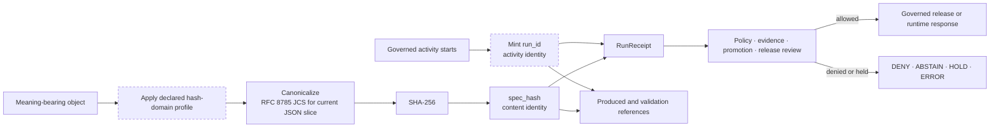

<!-- [KFM_META_BLOCK_V2]
doc_id: kfm://doc/adr-0013-spec_hash-and-run_id-identity-grammar
title: "ADR-0013 — spec_hash and run_id Identity Grammar"
type: adr
adr_id: ADR-0013
version: v1.2
status: proposed
owners:
  - "NEEDS VERIFICATION — architecture decision owner"
  - "NEEDS VERIFICATION — identity and canonicalization steward"
  - "NEEDS VERIFICATION — contracts and schemas stewards"
  - "NEEDS VERIFICATION — runtime receipt steward"
  - "NEEDS VERIFICATION — validation and CI steward"
  - "NEEDS VERIFICATION — evidence and release stewards"
reviewers_required:
  - Architecture steward
  - Identity and canonicalization steward
  - Contracts steward
  - Schema steward
  - Runtime receipt steward
  - Validation and CI steward
  - Evidence steward
  - Release steward
  - Security reviewer
  - Docs steward
created: 2026-05-11
updated: 2026-08-13
policy_label: public
truth_posture: cite-or-abstain
responsibility_root: docs/
current_path: docs/adr/ADR-0013-spec_hash-and-run_id-identity-grammar.md
supersedes: []
superseded_by: null
evidence_snapshot:
  repository: bartytime4life/Kansas-Frontier-Matrix
  base_ref: main
  base_commit: 160938b3f4717b6f2551b3430ab5c08f9b33cecb
  base_tree: 0a24e934e17d00b3cf8062bce65a4b59c07d65c1
  target_prior_blob: 5268e04b4f483b2936ffe571a2baff12581cf17c
  adr_index_blob: 938c5894c36b99e14810918e2c550ab0e92d53b1
  directory_rules_blob: fd49a0b83e55cef52c1124281f093e263526898d
  identity_architecture_blob: 5eec8425cdddfd2f6910c9ba8869ad67b0b08d26
  canonicalization_standard_blob: 16cec7a8109ac1776159b346b898ab9c313c2f3e
  common_spec_hash_contract_blob: 0c2c1161ddb565d4f9f17ef81080b27b8d951937
  common_spec_hash_schema_blob: 80b496b01b8de8c0e8ba67bf020977e6b1f3c652
  run_receipt_contract_blob: 5592aa5e22bbdd0c668189f79b50c18f7d1b2479
  run_receipt_schema_blob: c930ff0fd4da34d8b4ff202d9fd576110258974c
  spec_hash_validator_blob: e83a8707548c35411d1fc61911f499ac7ca6d517
  run_receipt_validator_blob: d57bc57234a16dc11908e1509b293124e185d388
  hashing_package_manifest_blob: 0466047f5a738aae1d51e78f579a057a869f1900
  hashing_core_blob: a609eac44b1a5f24bd9ba449afedfeec7dd17e8e
  hashing_cli_blob: 860b7f04ad6b4ab2144ed61fb896100e1a8577bc
  hashing_geojson_blob: 2db35caf8aa0bb8ff0c582e03c1a57b1caf8e358
  spec_hash_validator_tests_blob: ce981cede288facfa449026e422acfe60a6e4d5d
  spec_hash_geojson_tests_blob: 9d8d044422afbe83868035484aff73e15b025d45
  run_receipt_validator_tests_blob: 128a3b41317fc9152bc66bc7d94ff2650062f028
  spec_hash_workflow_blob: 1da612211bf0d2e0bf339561bc06f336111d614e
  validator_registry_blob: c65c1c2b27b85be4bdc3c42d0555c6e8e44698e2
  identity_package_manifest_blob: 2cf2870a24aad30a34d6b76e67c21315b99f3514
  latest_observed_spec_hash_run_id: 31654972118
  latest_observed_spec_hash_job_id: 94307342500
related:
  - docs/adr/README.md
  - docs/adr/INDEX.md
  - docs/adr/ADR-0001-schema-home--schemas-contracts-v1-is-canonical.md
  - docs/adr/ADR-0002-contracts-vs-schemas-split.md
  - docs/adr/ADR-0011-receipts-vs-proofs-vs-manifests-vs-catalog-separation.md
  - docs/adr/ADR-0018-promotion-gate-sequence.md
  - docs/adr/ADR-0022-catalog-matrix--stac-+-dcat-+-prov-must-agree.md
  - docs/doctrine/directory-rules.md
  - docs/architecture/identity-and-spec-hash.md
  - docs/standards/canonicalization.md
  - contracts/common/spec_hash.md
  - contracts/runtime/run_receipt.md
  - schemas/contracts/v1/common/spec_hash.schema.json
  - schemas/contracts/v1/runtime/run_receipt.schema.json
  - packages/hashing/pyproject.toml
  - packages/hashing/src/hashing/core.py
  - packages/hashing/src/hashing/cli.py
  - packages/hashing/src/hashing/geojson.py
  - packages/identity/pyproject.toml
  - tools/spec_hash/spec_hash.py
  - tools/validators/validate_spec_hash.py
  - tools/validators/validate_run_receipt.py
  - tests/validators/test_validate_spec_hash.py
  - tests/validators/test_validate_spec_hash_geojson.py
  - tests/validators/test_validate_run_receipt.py
  - .github/workflows/spec-hash.yml
tags: [kfm, adr, identity, deterministic-identity, activity-identity, spec-hash, run-id, jcs, sha256, receipts, provenance, migration, fail-closed]
notes:
  - "v1.2 is a same-path, repository-grounded modernization. It preserves source metadata and effective decision status `proposed`; it does not accept ADR-0013 or change executable identity behavior."
  - "A bounded RFC 8785 JCS + SHA-256 implementation, CLI, validator, tests, and dedicated workflow now exist under the current `sha256:<hex>` grammar."
  - "The candidate `jcs:sha256:<hex>` wire form remains conflicted with current contracts, schemas, fixtures, and code; this revision does not silently relabel existing identifiers."
  - "The RunReceipt validator now performs substantive bounded and Smart Sync semantic checks, but the schema remains permissive and no verified `run:<orchestrator>:<ULID>` generator or enforcement path was found."
  - "The latest observed dedicated spec-hash job passed 13 deterministic tests and fixture validation, then failed generated-receipt integrity with `ARTIFACT_DIGEST_MISMATCH`; current hosted proof is therefore `HOLD`, not green."
  - "Hash equality proves only equality under a declared byte and canonicalization profile. It does not prove truth, authority, admissibility, review, release, or public safety."
[/KFM_META_BLOCK_V2] -->

<a id="top"></a>

# ADR-0013 — `spec_hash` and `run_id` Identity Grammar

> **Proposed decision.** KFM separates deterministic **content identity** (`spec_hash`) from unique **activity identity** (`run_id`). The candidate target remains `jcs:sha256:<64-lower-hex>` for ordinary JSON content and `run:<orchestrator>:<ULID>` for one governed execution. Current executable behavior is narrower and different: the hashing slice canonicalizes with RFC 8785 JCS but emits `sha256:<64-lower-hex>`, while RunReceipt accepts a broad identifier grammar. This revision records that boundary; it does not accept or migrate the proposal.

[](#status)
[](#current-repository-evidence)
[](#current-enforcement-maturity)
[](#current-repository-conflicts)
[](#candidate-grammar)
[](#hosted-validation-evidence)
[](#authority-and-publication-boundary)

> [!IMPORTANT]
> **Identity assignment is confirmed; acceptance is not.** [`docs/adr/INDEX.md`](./INDEX.md) uniquely assigns `ADR-0013` to this exact file and records both source metadata and effective status as `proposed`. Editing, validating, or merging this Markdown cannot accept the decision.

> [!CAUTION]
> **Implemented canonicalization is not proposed-grammar conformance.** [`packages/hashing/src/hashing/core.py`](../../packages/hashing/src/hashing/core.py) uses RFC 8785 JCS and SHA-256, but its executable prefix and parser require `sha256:`. The common schema wraps that value in `{ "value": ... }`; RunReceipt stores it as a scalar. The candidate `jcs:sha256:` form is not a current write format.

> [!WARNING]
> **A matching hash is not a truth or release decision.** It establishes only that the same admitted value produced the same digest under the same declared canonicalization and hash-domain profile. Evidence sufficiency, provenance, rights, sensitivity, policy, review, promotion, release, correction, rollback, and public safety remain separate governed gates.

> [!NOTE]
> **Hosted verification is currently held by receipt drift.** In the latest observed dedicated run, all 13 deterministic hash tests and common fixture validation passed. The job then failed generated-receipt integrity with `ARTIFACT_DIGEST_MISMATCH`. That is not evidence that the hashing assertions failed, but it prevents an all-green hosted proof claim.

**Quick navigation:** [Status](#status) · [Evidence boundary](#evidence-boundary) · [Context](#context) · [Decision](#proposed-decision) · [Grammar](#candidate-grammar) · [Exclusions](#hash-domain-and-exclusions) · [Wiring](#identity-wiring) · [Evidence](#current-repository-evidence) · [Conflicts](#current-repository-conflicts) · [Maturity](#current-enforcement-maturity) · [Hosted validation](#hosted-validation-evidence) · [Validation](#validation-and-enforcement-target) · [Migration](#migration-and-acceptance-plan) · [Risks](#risk-ledger) · [Rollback](#rollback-and-supersession) · [Checklist](#verification-checklist) · [References](#references)

---

<a id="status"></a>

## Status

| Field | Current value |
|---|---|
| **ADR ID** | `ADR-0013` — unique and confirmed in [`INDEX.md`](./INDEX.md) |
| **Tracked path** | `docs/adr/ADR-0013-spec_hash-and-run_id-identity-grammar.md` |
| **Source metadata** | `proposed` |
| **Effective decision status** | `proposed` |
| **Decision class** | Cross-cutting identity grammar, canonicalization profile, and runtime activity identifier |
| **Current executable hash form** | `sha256:<64-lowercase-hex>` over RFC 8785 JCS bytes, within a bounded implementation slice |
| **Candidate hash form** | `jcs:sha256:<64-lowercase-hex>` |
| **Current executable RunReceipt ID form** | Broad schema pattern `^[a-z][a-z0-9_:.-]*$` |
| **Candidate run form** | `run:<orchestrator>:<ULID>` |
| **Implementation effect of this revision** | Documentation only |
| **Schema, runtime, release, and publication effect** | None |
| **Supersedes / superseded by** | None / none |

### Acceptance versus implementation

Acceptance and implementation are independent states:

1. **ADR acceptance** would approve identifier meanings, grammars, compatibility behavior, and the migration target.
2. **Implementation maturity** describes what repository code and checks do now.

The current repository demonstrates that implementation can precede decision closure: a bounded JCS + SHA-256 slice exists, but it implements the current bare prefix rather than the candidate prefixed profile. That work is valid implementation evidence for its declared scope; it is not evidence that ADR-0013 has been accepted.

[Back to top](#top)

---

<a id="evidence-boundary"></a>

## Evidence boundary

This revision is pinned to `main@160938b3f4717b6f2551b3430ab5c08f9b33cecb` and tree `0a24e934e17d00b3cf8062bce65a4b59c07d65c1`. Repository bytes establish present files and bounded behavior; KFM doctrine establishes responsibility boundaries. Historical receipts and earlier prose are treated as lineage, not automatically as current proof.

| Evidence surface | What is established | What remains outside the evidence |
|---|---|---|
| **ADR inventory** | Exact ID, path, source status, and effective `proposed` status | Acceptance or owner approval |
| **Hash package** | `kfm-hashing` `0.1.0`, pinned `rfc8785==0.1.4`, bounded JSON loading, JCS bytes, SHA-256 compute/verify, and finite CLI output | Candidate `jcs:` prefix, universal object-family projection, or broad consumer adoption |
| **Common validator and tests** | Proposed schema validation, exact fixture polarity, optional subject recomputation, key-order invariance, golden digest behavior, bounded parse rejection, and deterministic CLI behavior | Cross-language parity or every producer/consumer path |
| **GeoJSON profile** | Versioned structural geometry and record digest implementation with dedicated tests | Topological equivalence, policy approval, or coverage of unrelated object families |
| **Common SpecHash contract/schema** | `{ "value": "sha256:<hex>" }` is the current proposed machine wrapper | `jcs:` wire prefix or a scalar-only common value model |
| **RunReceipt schema/validator** | Closed schema checks, bounded input handling, all-zero-digest rejection, and Smart Sync HTTP/decision invariants | ULID generation, orchestrator vocabulary, or recomputation of a receipt's `spec_hash` from a canonical receipt body |
| **Identity package** | `packages/identity` exists as a `0.0.0` scaffold | Verified run-ID generator, parser, retry policy, or ULID enforcement |
| **Hosted workflow** | Hash tests and fixtures passed in the latest observed job | All-green job status; generated-receipt integrity failed later in that job |
| **Runtime and operations** | No inspected evidence proves live production reliance | Deployment maturity, service health, public use, or release fitness |

### Truth labels

| Label | Use in this ADR |
|---|---|
| **CONFIRMED** | Directly verified from pinned repository bytes or governing doctrine. |
| **PROPOSED** | Candidate decision, grammar, role, migration, or future enforcement. |
| **CONFLICTED** | Current sources assign incompatible shapes, prefixes, semantics, or responsibilities. |
| **UNKNOWN** | Available evidence is insufficient for a stronger claim. |
| **NEEDS VERIFICATION** | A concrete check remains open before acceptance, migration, enforcement, or retirement. |
| **HOLD** | A conflict or missing prerequisite intentionally blocks promotion of the claim. |

[Back to top](#top)

---

<a id="context"></a>

## Context

KFM needs stable identity for deduplication, replay, provenance, receipts, catalog closure, promotion, correction, rollback, revocation, and audit. Two different questions must not collapse into one identifier:

| Question | Identity term | Required property |
|---|---|---|
| **What exact governed content is this?** | `spec_hash` | Deterministic for the same admitted value, hash-domain profile, canonicalization profile, and algorithm |
| **Which execution produced or evaluated it?** | `run_id` | Unique per governed activity and stable throughout that activity |

Conflating the terms creates opposite failures:

- including `run_id` in content identity makes identical content hash differently on each activity;
- using only `spec_hash` for activity identity hides retries, repeated evaluations, operators, stages, and side effects.

The repository now implements a meaningful portion of the first concern. It does not yet establish one accepted grammar across contracts, schemas, code, fixtures, receipts, producers, and consumers, and it does not implement the candidate Run-ID grammar.

[Back to top](#top)

---

<a id="proposed-decision"></a>

## Proposed decision

Upon acceptance and completion of a governed migration:

1. **`spec_hash` is KFM content identity.**
   - It identifies a declared canonical representation.
   - The same meaning-bearing content and declared profiles must produce the same value.
   - A change to included content or profile must produce a different value.
2. **`run_id` is KFM activity identity.**
   - It identifies one governed execution, attempt, or stage activity.
   - It is minted once at activity start and propagated unchanged through that activity's outputs, receipts, logs, validation records, and downstream references.
   - It is unique, not content-derived, and not a substitute for `spec_hash`.
3. **The identifiers are independent.**
   - `run_id` must not participate in the `spec_hash` hash domain.
   - One run may produce many content hashes.
   - The same content hash may appear in many runs.
4. **The profile is part of the identity contract.**
   - A verifier must know which admitted value and canonical bytes were hashed.
   - A parser must not silently equate identifiers produced by incompatible profiles.
5. **Identifier conformance is not governance closure.**
   - A valid identifier grants no source admission, evidence sufficiency, policy allowance, promotion, release, publication, or public access.

This remains a proposed target. Current executable behavior stays authoritative for current machine checks until a reviewed compatibility migration changes it.

[Back to top](#top)

---

<a id="candidate-grammar"></a>

## Candidate grammar

### `spec_hash` — content identity

The candidate default JSON form is:

```text
jcs:sha256:<64-lowercase-hex>
```

```ebnf
spec_hash      = "jcs:sha256:" hex64
hex64          = 64 * HEXDIG-LOWER
HEXDIG-LOWER   = %x30-39 / %x61-66
```

The candidate computation is:

1. select the object family's declared meaning-bearing hash domain;
2. reject duplicate keys and values outside the admitted JSON profile;
3. apply only declared, versioned pre-canonicalization transforms;
4. canonicalize JSON under RFC 8785 JCS;
5. hash the canonical UTF-8 bytes with SHA-256;
6. encode the digest as 64 lowercase hexadecimal characters;
7. bind the canonicalization and hash-domain profile to the identifier or its surrounding contract.

#### Current executable form

The current package intentionally uses:

```text
sha256:<64-lowercase-hex>
```

Its `SPEC_HASH_PREFIX`, parser, formatter, schema, fixture matrix, and validator agree on that bare prefix. The package's `CANONICALIZATION_PROFILE` is `RFC8785-JCS`, so canonicalization exists even though the profile is not encoded in the identifier. This distinction is the central unresolved design choice—not a cosmetic difference.

The common contract represents the value as `{ "value": "sha256:<hex>" }`; the CLI's compute operation emits the scalar inside a structured result, and its verify operation reads the one-field wrapper. No consumer may infer that wrapper and scalar representations are interchangeable outside an explicit adapter.

### RDF-shaped content

The repository contains competing proposed RDF profile tokens:

- the earlier ADR text used `urdna2015:sha256:<hex>`;
- the canonicalization standard uses `rdfc:sha256:<hex>` and discusses RDFC-1.0 / URDNA2015 lineage.

This revision does **not** choose between them. New RDF-profile writes remain **HOLD** until an accepted decision names the token, object families, canonicalization version, fixtures, verifier path, and migration behavior.

### `run_id` — activity identity

The candidate KFM form is:

```text
run:<orchestrator>:<ULID>
```

```ebnf
run_id          = "run:" orchestrator ":" ulid
orchestrator    = 1*32 (LOWER / DIGIT / "-" / "_")
ulid            = 26 ULID-CHAR
LOWER           = %x61-7A
DIGIT           = %x30-39
ULID-CHAR       = %x30-39 / %x41-48 / %x4A-4B / %x4D-4E / %x50-54 / %x56-5A
```

Illustrative only:

```text
run:gha:01HXYZ7G2C5N9PJ4WVABCDEFGH
```

Candidate invariants:

- mint once at governed activity start;
- preserve exactly across retries that remain the same activity;
- mint a new value when the runtime contract treats an attempt as a distinct activity;
- use a controlled, versioned orchestrator vocabulary;
- never embed secrets, credentials, private content, sensitive exact locations, or mutable display names;
- never describe `run_id` as deterministic content identity;
- never derive it from `spec_hash`.

The current RunReceipt schema instead accepts `^[a-z][a-z0-9_:.-]*$`. Valid fixtures include short forms such as `run1` and Smart Sync forms such as `run:smart-sync:synthetic-304`; neither proves the proposed ULID grammar. No verified generator was found in the inspected identity package or bounded implementation search.

[Back to top](#top)

---

<a id="hash-domain-and-exclusions"></a>

## Hash domain and exclusions

Canonicalization answers how an admitted value becomes bytes. It does not decide which fields belong in that value. KFM therefore needs a versioned **hash-domain profile** per object family.

### Minimum cross-family exclusions

The following fields are normally outside content identity unless an accepted object-family contract explicitly establishes otherwise:

```text
spec_hash
run_id
generated_at
updated_at
fetched_at
retrieved_at
timestamp
nonce
signature
signatures
attestation
attestations
transparency_log
storage_path
storage_url
```

Rules:

- self-reference fields such as `spec_hash` must be excluded;
- activity and transport metadata must not rotate content identity;
- signatures and attestations wrap or reference the digest and must not recurse into it;
- meaning-bearing timestamps must not be removed merely because their names resemble runtime timestamps;
- inclusion and exclusion must be declared by contract/profile, not inferred only from field names;
- pre-canonicalization normalization must be explicit, versioned, receipted, and fixture-tested;
- profile changes rotate identity and require compatibility and lineage review.

The current common hash package deliberately performs **no implicit projection, rounding, or field selection**; callers own pre-canonicalization transforms. Its GeoJSON module is a separate, versioned structural profile with declared CRS, coordinate precision, and property exclusions. That profile is evidence that family-specific projection can be implemented, not evidence that one universal profile exists.

### Unicode and numbers

The implementation must not silently normalize Unicode unless a versioned profile requires the transform before JCS. Exact identifiers and large numeric values must use schema-safe representations that preserve intended identity across runtimes. The current implementation rejects unsafe/non-finite numeric inputs and bounds integer parsing; cross-language golden vectors remain required before broad enforcement graduation.

[Back to top](#top)

---

<a id="identity-wiring"></a>

## Identity wiring


```mermaid
flowchart LR
    ACT["Governed activity starts"] --> RID["Mint run_id<br/>activity identity"]
    INPUT["Meaning-bearing object"] --> DOMAIN["Apply declared hash-domain profile"]
    DOMAIN --> CANON["Canonicalize<br/>RFC 8785 JCS for current JSON slice"]
    CANON --> HASH["SHA-256"]
    HASH --> SH["spec_hash<br/>content identity"]

    RID --> RECEIPT["RunReceipt"]
    SH --> RECEIPT
    RID --> OUTPUTS["Produced and validation references"]
    SH --> OUTPUTS

    RECEIPT --> REVIEW["Policy · evidence · promotion · release review"]
    REVIEW -->|allowed| RELEASE["Governed release or runtime response"]
    REVIEW -->|denied or held| HOLD["DENY · ABSTAIN · HOLD · ERROR"]

    classDef proposed stroke-dasharray: 5 4;
    class RID,DOMAIN proposed;
```

The diagram combines an implemented hash computation slice with proposed domain, Run-ID, and governance wiring. Dashed nodes remain proposed.

### Relationship rules

| Relationship | Rule |
|---|---|
| `run_id` → `spec_hash` | No derivation and no inclusion in the content hash domain |
| one `run_id` → many `spec_hash` values | Allowed; one activity may produce multiple governed objects |
| one `spec_hash` → many `run_id` values | Allowed; identical content may be produced or verified by multiple runs |
| receipt identity | A RunReceipt may have its own content identity while carrying activity and input/output identities |
| supersession and rollback | Replacement content references prior governed identity; historical identifiers are not rewritten |

[Back to top](#top)

---

<a id="current-repository-evidence"></a>

## Current repository evidence

| Repository surface | Confirmed current state | Boundary |
|---|---|---|
| [`docs/adr/INDEX.md`](./INDEX.md) | Uniquely maps ADR-0013 to this path; source and effective status are `proposed` | No acceptance |
| [`docs/doctrine/directory-rules.md`](../doctrine/directory-rules.md) | Assigns docs, contracts, schemas, packages, tools, policy, receipts, and release distinct responsibilities | Receipts are process memory, not automatic proof |
| [`packages/hashing/pyproject.toml`](../../packages/hashing/pyproject.toml) | Declares `kfm-hashing` `0.1.0`, Python 3.11+, pinned `rfc8785==0.1.4`, and CLI entry point | Package maturity is bounded to its declared API |
| [`packages/hashing/src/hashing/core.py`](../../packages/hashing/src/hashing/core.py) | Safely loads bounded duplicate-free JSON, canonicalizes with JCS, computes/verifies SHA-256, and requires bare `sha256:` values | No implicit object-family projection or candidate prefix |
| [`packages/hashing/src/hashing/cli.py`](../../packages/hashing/src/hashing/cli.py) | Provides finite `compute`, `verify`, and GeoJSON feature operations with `authority: NONE` | CLI success grants no governance authority |
| [`packages/hashing/src/hashing/geojson.py`](../../packages/hashing/src/hashing/geojson.py) | Implements versioned structural GeoJSON geometry/record digests | Structural equality is not topological equivalence |
| [`tools/spec_hash/spec_hash.py`](../../tools/spec_hash/spec_hash.py) | Thin wrapper delegates to the package CLI | It is not a second implementation authority |
| [`tools/validators/validate_spec_hash.py`](../../tools/validators/validate_spec_hash.py) | Validates schema/fixture polarity and optionally recomputes a supplied subject | It does not migrate stored identifiers or validate every consumer |
| [`tests/validators/test_validate_spec_hash.py`](../../tests/validators/test_validate_spec_hash.py) | Covers canonical bytes, golden SHA-256 behavior, bounded failures, recomputation, fixtures, and deterministic CLI output | Single-runtime evidence |
| [`tests/validators/test_validate_spec_hash_geojson.py`](../../tests/validators/test_validate_spec_hash_geojson.py) | Covers the structural GeoJSON profile | Profile-specific evidence only |
| [`schemas/contracts/v1/common/spec_hash.schema.json`](../../schemas/contracts/v1/common/spec_hash.schema.json) | Proposed closed wrapper requires `{ "value": "sha256:<hex>" }` | Conflicts with candidate wire prefix |
| [`schemas/contracts/v1/runtime/run_receipt.schema.json`](../../schemas/contracts/v1/runtime/run_receipt.schema.json) | Proposed closed RunReceipt shape uses bare hash values and broad run IDs | Does not enforce orchestrator + ULID |
| [`tools/validators/validate_run_receipt.py`](../../tools/validators/validate_run_receipt.py) | Performs bounded no-network schema and Smart Sync semantic checks, including digest and HTTP-decision invariants | Does not generate or enforce the candidate Run-ID grammar and does not universally recompute receipt content identity |
| [`tests/validators/test_validate_run_receipt.py`](../../tests/validators/test_validate_run_receipt.py) | Exercises RunReceipt and Smart Sync validation behavior | Does not close candidate identity grammar |
| [`packages/identity/pyproject.toml`](../../packages/identity/pyproject.toml) | Remains a `0.0.0` package scaffold | No verified Run-ID generator/parser implementation |
| [`packages/hashing/README.md`](../../packages/hashing/README.md) | Still describes an earlier scaffold state | Documentation drift; current code and manifest are stronger evidence of executable behavior |
| [`docs/architecture/identity-and-spec-hash.md`](../architecture/identity-and-spec-hash.md) and [`docs/standards/canonicalization.md`](../standards/canonicalization.md) | Retain candidate-prefixed and earlier implementation narratives | Proposed/stale prose must not override current bytes |

[Back to top](#top)

---

<a id="current-repository-conflicts"></a>

## Current repository conflicts

| Conflict | Current evidence | Required resolution |
|---|---|---|
| **Profile in the hash wire form** | ADR/architecture/standard propose `jcs:sha256:`; code, contracts, schemas, fixtures, and validators use `sha256:` while code separately declares `RFC8785-JCS` | Accept either a tagged identifier or a mandatory paired profile field, then migrate coherently |
| **Envelope shape** | Common schema wraps `value`; RunReceipt and several consumers use a scalar string | Decide the canonical value model and publish explicit adapters/references |
| **Run-ID grammar** | ADR proposes orchestrator + ULID; schema accepts a broad string; fixtures use non-ULID forms | Versioned schema, controlled vocabulary, retry semantics, generator, parser, fixtures, and producer migration |
| **RDF profile token** | `urdna2015:` and `rdfc:` both appear in proposed docs | Accept one token and preserve compatibility lineage, or defer the profile explicitly |
| **Hash-domain ownership** | Common hash code applies no projection; GeoJSON has a family profile; prose lists broad exclusions | Define machine-reviewable per-family profiles and golden vectors |
| **Implementation narrative** | Hash package README and some contracts still describe a scaffold/stub; current code is substantive | Modernize those documents in separate scoped changes without rewriting history |
| **RunReceipt validation narrative** | Older prose describes generic schema-only validation; current validator adds bounded Smart Sync semantics | Update contracts/docs separately; do not overstate universal identity verification |
| **Implementation responsibility** | `packages/hashing` owns core logic; `tools/spec_hash` is a wrapper; `packages/identity` remains a scaffold | Ratify package/tool boundaries and name Run-ID implementation ownership |
| **Hosted receipt integrity** | Latest observed hash tests and fixtures pass, but the dedicated job fails on a generated receipt's artifact digest | Repair or replace the receipt in a separate reviewed change and re-run at exact head |
| **Meaning of `spec_hash`** | Some docs describe broad object identity; the common contract narrows it to a specification representation | Define field semantics per object family without overloading one undifferentiated term |
| **External lineage mapping** | OpenLineage mapping is discussed, but no accepted facet/schema is established here | Companion contract/schema and round-trip tests |

These are decision or migration blockers. Documentation must not flatten them into a false single current state.

[Back to top](#top)

---

<a id="authority-and-publication-boundary"></a>

## Authority and publication boundary

This ADR may define identity meaning only after acceptance. It never becomes:

- a source-admission decision;
- a schema-validity result;
- a canonicalization implementation;
- a receipt, proof, or EvidenceBundle;
- a PolicyDecision or PromotionDecision;
- a signature, attestation, or transparency-log record;
- a ReleaseManifest, RollbackCard, or correction notice;
- permission for public clients to read internal stores;
- proof that an object is true, current, safe, admissible, reviewed, released, or public.

`contracts/` owns object meaning; `schemas/` owns machine shape; `packages/` owns reusable implementation; `tools/` owns validator and CLI entry points; `fixtures/` and `tests/` own executable examples and checks; `policy/` owns admissibility; `data/receipts/` owns process memory; and `release/` owns release decisions.

[Back to top](#top)

---

<a id="current-enforcement-maturity"></a>

## Current enforcement maturity

| Capability | Current posture | Evidence and limit |
|---|---|---|
| ADR identity and proposed status | **CONFIRMED** | Canonical ADR index |
| Bounded JSON admission for hashing | **IMPLEMENTED / TESTED** | Size, type, symlink, duplicate-key, numeric, depth, and node controls in current package/tests |
| RFC 8785 JCS canonical bytes | **IMPLEMENTED / TESTED** | Current Python package and golden/key-order tests |
| Bare `sha256:` compute, parse, and verify | **IMPLEMENTED / TESTED** | Package, CLI, validator, schema fixtures, and tests |
| Common wrapper validation | **IMPLEMENTED / TESTED** | Proposed schema and exact fixture polarity |
| Optional subject recomputation | **IMPLEMENTED / TESTED** | Common validator `--subject` path and mismatch tests |
| Structural GeoJSON digest profile | **IMPLEMENTED / TESTED** | Versioned module, CLI operation, and dedicated tests |
| Candidate `jcs:sha256:` parser/emitter | **CONFLICTED / NOT IMPLEMENTED** | Current parser and schemas reject it |
| Universal object-family hash projection | **NOT ESTABLISHED** | Caller-owned for common hashing; one GeoJSON-specific profile exists |
| RunReceipt bounded semantic validation | **IMPLEMENTED / TESTED** | Schema, fixture, Smart Sync HTTP/digest/decision checks |
| RunReceipt content-hash recomputation | **NOT ESTABLISHED** | Current validator does not universally derive receipt identity from a canonical receipt body |
| `run:<orchestrator>:<ULID>` generation and validation | **PROPOSED / NOT IMPLEMENTED** | Broad schema and identity-package scaffold |
| Cross-runtime golden parity | **NEEDS VERIFICATION** | Current evidence is Python-only |
| Producer/consumer migration | **NEEDS VERIFICATION** | Conflicting forms remain across surfaces |
| Dedicated hosted hash job | **HOLD** | Assertions passed; later generated-receipt integrity step failed |
| Operational/public reliance | **UNKNOWN** | No deployment or runtime proof reviewed |

[Back to top](#top)

---

<a id="hosted-validation-evidence"></a>

## Hosted validation evidence

The latest observed dedicated [`spec-hash` workflow](../../.github/workflows/spec-hash.yml) run was [run `31654972118`, job `94307342500`](https://github.com/bartytime4life/Kansas-Frontier-Matrix/actions/runs/31654972118/job/94307342500), on head `3911c519d9bc134c3ab0662fed6577ebd966813b`.

| Step | Observed result | Interpretation |
|---|---|---|
| Dependency installation | **PASS** | Declared test environment installed |
| Deterministic no-network tests | **PASS** | 13 tests passed |
| Common spec-hash fixture validator | **PASS** | Outcome `PASS`; fixture polarity held |
| Generated authoring receipt integrity | **FAIL** | `GENERATED_RECEIPT_INVALID`, code `ARTIFACT_DIGEST_MISMATCH`, `/artifact_paths/0` |
| Overall job | **FAIL / HOLD** | No all-green hosted proof for that run |

This is a precise, bounded conclusion: the observed hash assertions passed, while the workflow's broader provenance closure did not. Earlier successful runs are historical evidence, not substitutes for current exact-byte integrity. The workflow's path filter does not include this ADR, so a documentation-only change may not trigger the dedicated suite.

Repairing the generated receipt, expanding workflow paths, or changing validation policy is intentionally outside this one-file documentation revision.

[Back to top](#top)

---

<a id="validation-and-enforcement-target"></a>

## Validation and enforcement target

A conforming accepted implementation should provide deterministic, machine-readable checks for:

| Check | Required assertion | Current coverage |
|---|---|---|
| **Grammar parsing** | Accept canonical new-write forms and reject ambiguous or malformed values | Bare hash only; candidate prefix and Run-ID grammar open |
| **Canonical-byte vector** | Same input/profile yields byte-identical canonical output across supported runtimes | Python vectors exist; cross-runtime parity open |
| **Hash vector** | Canonical bytes produce the expected SHA-256 digest | Covered in current Python tests |
| **Transient mutation** | Changing excluded activity/transport fields does not change content identity | Per-family coverage open |
| **Meaning-bearing mutation** | Changing an included field changes identity | Partial/profile-specific coverage |
| **Duplicate-key rejection** | Ambiguous JSON fails closed before canonicalization | Covered in current common slice |
| **Unicode policy** | No silent normalization; declared transforms are tested | Policy stated; parity open |
| **Number policy** | Exact values round-trip consistently across supported runtimes | Bounded Python behavior; parity open |
| **Run-ID grammar** | Producer output matches accepted vocabulary and ULID/retry policy | Not implemented |
| **Run-ID uniqueness** | Distinct activities do not reuse IDs under the runtime contract | Not established |
| **Separation** | `run_id` never enters the `spec_hash` hash domain | Required; universal audit open |
| **Receipt binding** | Receipt carries exact activity and input/output identities without conflation | Shape/Smart Sync semantics partial; universal recomputation open |
| **Compatibility** | Legacy reads are explicit, finite, and never canonical new writes | Migration decision open |
| **Round-trip** | Parse → format preserves the exact canonical identifier | Bare hash covered; candidate forms open |
| **Negative fixtures** | Wrong prefix, length, case, alphabet, wrapper, profile, and field inclusion fail with stable reasons | Common bare-hash matrix partial |
| **CI path coverage** | Identity surface changes trigger the relevant suites and integrity checks | Dedicated workflow exists; ADR path absent; receipt integrity held |

Passing these checks would prove conformance to an accepted identity profile only. It would not prove evidence or release closure.

[Back to top](#top)

---

<a id="migration-and-acceptance-plan"></a>

## Migration and acceptance plan

### Phase 0 — preserve and characterize the current baseline

- freeze current bare-prefix golden vectors and fixture polarity;
- record the present package API, CLI output, validator findings, and GeoJSON profile behavior;
- repair generated-receipt integrity in a separate reviewed change;
- update stale package/contract prose separately so documentation does not regress executable facts;
- do not relabel existing `sha256:` identifiers as `jcs:sha256:`.

### Phase 1 — close the decision

- assign accountable owners and reviewers;
- choose tagged identifier versus mandatory paired profile metadata;
- choose common wrapper/scalar representation and adapter rules;
- close or explicitly defer the RDF token decision;
- choose Run-ID grammar, orchestrator vocabulary, and retry/attempt semantics;
- assign implementation authority for hash-domain profiles and Run-ID behavior;
- approve compatibility, security, and rollback rules.

### Phase 2 — align contracts, schemas, and profiles

Update as one reviewed compatibility batch:

- `contracts/common/spec_hash.md` and its schema;
- `contracts/runtime/run_receipt.md` and its schema;
- evidence, receipt, catalog, and release schemas that reference either term;
- object-family hash-domain profiles;
- exact `$id`, `$ref`, wrapper/scalar, and legacy adapter behavior.

No producer should emit a new grammar before paired schemas and read compatibility exist.

### Phase 3 — extend implementation and fixtures

- preserve current JCS/SHA-256 behavior where compatible;
- add accepted parse/format/check behavior without silent conversion;
- implement Run-ID generation under the accepted vocabulary and retry policy;
- add positive, negative, golden-byte, cross-runtime, replay, and mutation fixtures;
- prove no network, secret, ambient filesystem, or undeclared nondeterministic input is required;
- keep CLI/validator results finite and explicitly non-authoritative.

### Phase 4 — migrate consumers and receipts

- inventory every producer and consumer of `spec_hash` and `run_id`;
- migrate writers behind explicit version/profile controls;
- support legacy reads only for a documented window;
- preserve historical identifiers and receipts as immutable lineage;
- reject silent translation between incompatible profiles;
- record migration receipts and drift entries without treating them as approval.

### Phase 5 — graduate CI and retire compatibility

- wire identity checks to every affected path;
- require cross-runtime parity and negative fixtures;
- require exact changed-path and compatibility-budget review;
- validate current receipt bytes at the tested head;
- prove rollback against frozen legacy fixtures;
- remove legacy write support only after the consumer inventory and read window close.

### Acceptance gates

ADR acceptance remains blocked until reviewers can answer yes to all applicable gates:

- [ ] canonical JSON grammar and profile-binding model selected;
- [ ] wrapper/scalar representation selected;
- [ ] RDF profile closed or explicitly deferred;
- [ ] Run-ID grammar, vocabulary, and retry semantics selected;
- [ ] object-family hash-domain profile model selected;
- [ ] implementation ownership selected;
- [ ] security and dependency review complete;
- [ ] contract/schema/fixture migration plan complete;
- [ ] producer and consumer inventory complete;
- [ ] compatibility window and rollback tested;
- [ ] current generated-receipt integrity restored at the tested head;
- [ ] no current machine surface is falsely described as candidate-conformant.

[Back to top](#top)

---

<a id="consequences"></a>

## Consequences

### Positive

- stable content equality independent of path, formatting, or activity;
- auditable separation between what an object is and which run handled it;
- reproducible receipt, catalog, correction, rollback, and replay joins;
- explicit profile binding prevents silent canonicalization drift;
- one migration target across schemas, contracts, packages, tools, and consumers;
- clearer trust boundaries: integrity does not masquerade as truth or release.

### Costs and constraints

- coordinated migration across multiple object families and consumers;
- durable compatibility handling for historical identifiers and receipts;
- canonicalization dependencies and Unicode/number behavior require supply-chain and parity review;
- Run-ID retry semantics must remain consistent across local, CI, workflow, and service runtimes;
- prefix or hash-domain changes rotate identity and require explicit lineage;
- exact-byte authoring receipts can drift when covered artifacts change and must be regenerated deliberately;
- RDF canonicalization may remain deferred until a governed consumer justifies its cost.

[Back to top](#top)

---

<a id="alternatives-considered"></a>

## Alternatives considered

### Keep bare `sha256:<hex>` with mandatory profile metadata

**Benefit:** matches current schemas and implementation and minimizes identifier churn.

**Cost:** the identifier alone does not reveal which canonicalization and hash-domain profiles produced the bytes.

**Disposition:** still viable if a mandatory paired profile is present, versioned, and enforced at every write and verification boundary. Current repository evidence does not establish that universal pairing.

### Encode `jcs` in the identifier

**Benefit:** makes the canonicalization family visible and rejects some cross-profile comparisons early.

**Cost:** requires coordinated schema, fixture, receipt, producer, consumer, and historical-read migration; it still does not identify an object-family projection by itself.

**Disposition:** current ADR candidate, not accepted.

### Include `run_id` in the content hash

**Benefit:** one identifier appears to bind content and execution.

**Cost:** identical content receives a different identity for every activity, breaking deduplication, idempotency, and replay comparison.

**Disposition:** rejected.

### Use an opaque UUID for all activities

**Benefit:** broad interoperability and simple validation.

**Cost:** loses the proposed orchestrator hint and time-ordering property.

**Disposition:** remains an alternative until the Run-ID grammar is accepted.

### Use content hash as the run identifier

**Benefit:** deterministic and compact.

**Cost:** repeated executions over the same content become indistinguishable; retries and side effects collapse.

**Disposition:** rejected.

### Implement independently in every connector or pipeline

**Benefit:** fast local progress.

**Cost:** canonicalization, exclusions, Unicode, numbers, errors, and prefixes drift across runtimes.

**Disposition:** rejected; use one reviewed implementation authority with thin adapters.

[Back to top](#top)

---

<a id="risk-ledger"></a>

## Risk ledger

| Risk | Current posture | Required control |
|---|---|---|
| False claim that candidate grammar is implemented | **OPEN** | Preserve proposed/current split and executable citations |
| Bare prefix compared across unknown profiles | **OPEN** | Tagged identifier or mandatory paired profile metadata |
| Prefix migration breaks consumers | **OPEN** | Inventory, versioned adapters, read window, fixtures |
| Wrapper/scalar mismatch | **OPEN** | Accepted value model and explicit adapters |
| Run-ID reuse or retry ambiguity | **OPEN** | Runtime contract, generator, and uniqueness tests |
| Volatile field enters hash domain | **OPEN** | Per-family profiles and mutation tests |
| Meaning-bearing field is excluded | **OPEN** | Contract review and negative fixtures |
| Unicode/number divergence | **OPEN** | Cross-runtime golden vectors |
| Silent profile conversion | **OPEN** | Reject-by-default parser and migration receipts |
| Hash treated as proof of truth | **CONTINUOUS** | Contract, policy, and release boundary checks |
| Package docs understate current code | **CONFIRMED DRIFT** | Separate documentation modernization |
| RunReceipt validation overstated as identity recomputation | **OPEN** | Capability-specific claims and dedicated recomputation tests |
| Identity package mistaken for implemented Run-ID authority | **OPEN** | Scaffold label until generator/parser code and tests land |
| Generated receipt no longer matches current artifact bytes | **HOLD** | Regenerate/review receipt and re-run exact-head validation |
| Unreviewed crypto/canonicalization dependency | **OPEN** | Security and supply-chain review |
| Sensitive information encoded in identifiers | **OPEN** | Privacy review and no-sensitive-content rule |

[Back to top](#top)

---

<a id="rollback-and-supersession"></a>

## Rollback and supersession

### Documentation rollback

Before merge, close the draft pull request. After merge, revert the documentation commit through a reviewable pull request; do not rewrite shared history.

The prior file is recoverable from blob:

```text
5268e04b4f483b2936ffe571a2baff12581cf17c
```

### Decision supersession

If the identity grammar changes after acceptance:

- retain this ADR;
- mark it `superseded`;
- forward-link to the replacement ADR;
- update [`INDEX.md`](./INDEX.md) in the same reviewed change;
- define dual-read/write behavior and migration receipts;
- preserve old identifiers and canonicalization profiles for verification;
- never rewrite historical receipts merely to match a new grammar.

### Implementation rollback

A migration rollback must restore compatible producer and consumer behavior together. It must not emit new identifiers under an old prefix while computing bytes under a new profile, or silently relabel existing digests. A reopened compatibility window must record scope, reason, affected consumers, and closure conditions.

[Back to top](#top)

---

<a id="verification-checklist"></a>

## Verification checklist

### Documentation revision

- [x] exact ADR ID and path verified in the canonical index;
- [x] source and effective status remain `proposed`;
- [x] evidence snapshot pinned to current repository bytes;
- [x] substantive hash package, CLI, validator, tests, and workflow recorded;
- [x] substantive RunReceipt validation recorded without claiming Run-ID enforcement;
- [x] candidate and current grammars kept distinct;
- [x] latest hosted test success and later receipt failure both recorded;
- [x] stale package/contract prose identified as drift rather than executable truth;
- [x] no schema, contract, implementation, fixture, workflow, policy, receipt, release, or publication behavior changed.

### Current bounded baseline

- [x] RFC 8785 JCS + SHA-256 package implementation exists;
- [x] dedicated spec-hash validator no longer raises `NotImplementedError`;
- [x] common fixture polarity and optional subject recomputation are tested;
- [x] structural GeoJSON digest profile is tested;
- [x] RunReceipt validator performs more than generic schema dispatch;
- [ ] exact-head dedicated workflow is fully green — **HOLD: generated-receipt artifact digest mismatch**;
- [ ] cross-runtime hash parity established;
- [ ] accepted Run-ID generator/parser established.

### Before acceptance

- [ ] owners and reviewers assigned;
- [ ] canonical grammar and profile binding approved;
- [ ] wrapper/scalar representation approved;
- [ ] RDF token conflict closed or deferred;
- [ ] Run-ID retry semantics and vocabulary approved;
- [ ] hash-domain profile model approved;
- [ ] implementation authority approved;
- [ ] migration, compatibility, security, and rollback plans reviewed;
- [ ] paired machine changes prepared and validated.

### Before enforcement graduation

- [ ] schemas and fixtures require the accepted grammar;
- [ ] all known producers and consumers migrated;
- [ ] cross-runtime golden vectors pass;
- [ ] CI covers every affected identity path;
- [ ] receipt integrity passes against exact tested bytes;
- [ ] rollback and legacy-read compatibility are tested;
- [ ] operational receipts show the accepted profile in use;
- [ ] release and public surfaces remain governed by separate decisions.

[Back to top](#top)

---

<a id="references"></a>

## References

### Governing and decision records

- [`docs/adr/README.md`](./README.md)
- [`docs/adr/INDEX.md`](./INDEX.md)
- [`ADR-0001 — Schema Home`](./ADR-0001-schema-home--schemas-contracts-v1-is-canonical.md)
- [`ADR-0002 — Contracts vs Schemas Split`](./ADR-0002-contracts-vs-schemas-split.md)
- [`ADR-0011 — Receipts vs Proofs vs Manifests vs Catalog Separation`](./ADR-0011-receipts-vs-proofs-vs-manifests-vs-catalog-separation.md)
- [`ADR-0018 — Promotion Gate Sequence`](./ADR-0018-promotion-gate-sequence.md)
- [`ADR-0022 — Catalog Matrix`](./ADR-0022-catalog-matrix--stac-+-dcat-+-prov-must-agree.md)
- [`docs/doctrine/directory-rules.md`](../doctrine/directory-rules.md)

### Identity, contracts, and machine shapes

- [`docs/architecture/identity-and-spec-hash.md`](../architecture/identity-and-spec-hash.md)
- [`docs/standards/canonicalization.md`](../standards/canonicalization.md)
- [`contracts/common/spec_hash.md`](../../contracts/common/spec_hash.md)
- [`schemas/contracts/v1/common/spec_hash.schema.json`](../../schemas/contracts/v1/common/spec_hash.schema.json)
- [`contracts/runtime/run_receipt.md`](../../contracts/runtime/run_receipt.md)
- [`schemas/contracts/v1/runtime/run_receipt.schema.json`](../../schemas/contracts/v1/runtime/run_receipt.schema.json)
- [`schemas/contracts/v1/evidence/spec_normalization.md`](../../schemas/contracts/v1/evidence/spec_normalization.md)
- [`schemas/evidence/spec_normalization.md`](../../schemas/evidence/spec_normalization.md)

### Implementation and validation evidence

- [`packages/hashing/README.md`](../../packages/hashing/README.md)
- [`packages/hashing/pyproject.toml`](../../packages/hashing/pyproject.toml)
- [`packages/hashing/src/hashing/core.py`](../../packages/hashing/src/hashing/core.py)
- [`packages/hashing/src/hashing/cli.py`](../../packages/hashing/src/hashing/cli.py)
- [`packages/hashing/src/hashing/geojson.py`](../../packages/hashing/src/hashing/geojson.py)
- [`packages/identity/pyproject.toml`](../../packages/identity/pyproject.toml)
- [`tools/spec_hash/spec_hash.py`](../../tools/spec_hash/spec_hash.py)
- [`tools/validators/validate_spec_hash.py`](../../tools/validators/validate_spec_hash.py)
- [`tools/validators/validate_run_receipt.py`](../../tools/validators/validate_run_receipt.py)
- [`tests/validators/test_validate_spec_hash.py`](../../tests/validators/test_validate_spec_hash.py)
- [`tests/validators/test_validate_spec_hash_geojson.py`](../../tests/validators/test_validate_spec_hash_geojson.py)
- [`tests/validators/test_validate_run_receipt.py`](../../tests/validators/test_validate_run_receipt.py)
- [`.github/workflows/spec-hash.yml`](../../.github/workflows/spec-hash.yml)
- [`fixtures/contracts/v1/common/spec_hash/`](../../fixtures/contracts/v1/common/spec_hash/)
- [`fixtures/contracts/v1/runtime/run_receipt/`](../../fixtures/contracts/v1/runtime/run_receipt/)

---

**Last reviewed:** 2026-08-13 · **Doc version:** v1.2 · **Source metadata:** `proposed` · **Effective decision status:** `proposed`

[Back to top](#top)
