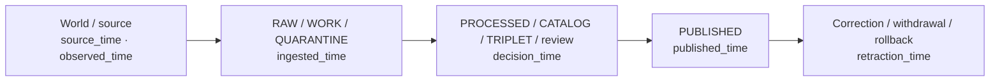
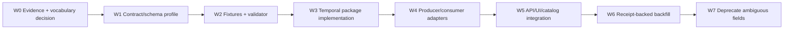

<!-- [KFM_META_BLOCK_V2]
doc_id: kfm://doc/adr/0014-temporal-vocabulary
adr_id: ADR-0014
title: "ADR-0014 — Temporal Vocabulary: Six Time Kinds Tracked"
type: adr
version: v1.2
status: proposed
owners:
  - "NEEDS VERIFICATION — architecture decision owner"
  - "NEEDS VERIFICATION — temporal and data-lifecycle steward"
  - "NEEDS VERIFICATION — contracts and schemas stewards"
  - "NEEDS VERIFICATION — catalog, release, API, UI, and policy stewards"
owner_status: "CODEOWNERS routes review to @bartytime4life, but stewardship assignments, decision quorum, separation of duties, and acceptance authority were not verified"
reviewers_required:
  - Architecture steward
  - Docs steward
  - Temporal and data-lifecycle steward
  - Contracts and schemas stewards
  - Evidence, catalog, release, and correction stewards
  - Governed API and Explorer Web maintainers
  - Policy, validation, migration, and affected-domain reviewers
created: 2026-05-11
updated: 2026-07-23
policy_label: public
truth_posture: cite-or-abstain
responsibility_root: docs/
current_path: docs/adr/ADR-0014-temporal-vocabulary--six-time-kinds-tracked.md
supersedes: []
superseded_by: null
evidence_snapshot:
  repository: bartytime4life/Kansas-Frontier-Matrix
  base_ref: main
  base_commit: cc9edf8325ee1a85548917f0c0019c5626bbbda2
  target_prior_blob: 1a4b6bfe928e6454b4d05a36f9a2c96ce2def9d1
  adr_index_blob: cf08fae322ac53426f7394d97897fdb942253049
  directory_rules_blob: 2affb080e6f0043867c64c7f06c1ca52030fbd55
  time_aware_doctrine_blob: 63a7be5d4a8b2eeade245c6c1d3ddfc255f23615
  temporal_package_readme_blob: 93937cbba57c7653b66c61128a3c4a0dfc052ba2
  temporal_package_core_blob: 73f035005b9114c9c364d3685afc9ef01458da8c
  temporal_window_contract_blob: 80b0c9514ff8adba2f8e71611289c15de2f5e95b
  temporal_window_schema_blob: 70b96839615551164d3964596dea238c33709616
  temporal_window_validator_blob: 4837eebf9e978ea8f590c563060f79664a63c293
  common_fixture_index_blob: 9ec92d1daa7521d9b0adf1e529a61f5146471164
  codeowners_blob: dd2a84aa514d8ecd9208bc347f90f9a2ed37dd61
related:
  - docs/adr/README.md
  - docs/adr/INDEX.md
  - docs/adr/ADR-0001-schema-home--schemas-contracts-v1-is-canonical.md
  - docs/adr/ADR-0002-contracts-vs-schemas-split.md
  - docs/adr/ADR-0013-spec_hash-and-run_id-identity-grammar.md
  - docs/adr/ADR-0018-promotion-gate-sequence.md
  - docs/adr/ADR-0020-abstain-is-a-first-class-decision.md
  - docs/doctrine/directory-rules.md
  - docs/doctrine/time-aware.md
  - docs/doctrine/lifecycle-law.md
  - docs/doctrine/truth-posture.md
  - docs/architecture/contract-schema-policy-split.md
  - contracts/common/temporal_window.md
  - schemas/contracts/v1/common/temporal_window.schema.json
  - packages/temporal/README.md
  - tools/validators/validate_temporal_window.py
  - fixtures/contracts/v1/common/README.md
tags: [kfm, adr, temporal, time-kind, provenance, lifecycle, bitemporal, correction, release, compatibility, migration]
notes:
  - "v1.2 is a same-path repository-grounded modernization. It preserves ADR-0014 status `proposed`; it does not accept the decision or change temporal behavior."
  - "The canonical ADR index uniquely assigns ADR-0014 to this exact path."
  - "Current repository evidence contains three non-equivalent temporal vocabularies: ADR-0014's six kind identifiers, TemporalWindow's six enum values, and time-aware doctrine's seven dimensions. Reconciliation is an acceptance blocker."
  - "packages/temporal exists but is a version 0.0.0 scaffold; core.py is a one-line placeholder and no runtime helper API is established."
  - "The TemporalWindow validator is a NotImplementedError placeholder, and the common fixture index establishes no populated temporal_window fixture family."
  - "This document creates no schema, contract, fixture, validator, package API, policy, migration, release object, public route, or publication effect."
[/KFM_META_BLOCK_V2] -->

<a id="top"></a>

# ADR-0014 — Temporal Vocabulary: Six Time Kinds Tracked

> **Proposed decision.** KFM will use six stable, cross-system identifiers for claim-, provenance-, decision-, publication-, and correction-bearing time: `source_time`, `observed_time`, `ingested_time`, `decision_time`, `published_time`, and `retraction_time`. A timestamp's kind is part of its meaning; no evidence-bearing or public-trust surface may silently collapse these identifiers into an unlabeled `timestamp`, `date`, or `time`.

[](#1-status-and-authority)
[](#11-current-repository-evidence-snapshot)
[](#12-three-non-equivalent-repository-vocabularies)
[](#13-current-implementation-maturity)
[](#62-current-temporalwindow-compatibility-crosswalk)
[](#121-current-validation-state)
[](#11-current-repository-evidence-snapshot)

> [!IMPORTANT]
> **Repository presence does not equal decision acceptance.** KFM currently has an indexed ADR, a `packages/temporal/` scaffold, a draft `TemporalWindow` contract, a proposed machine schema, a placeholder validator, and broad draft time-awareness doctrine. Those surfaces disagree. This ADR remains `proposed`, and no implementation may select one vocabulary as canonical merely because it is checked in.

> [!CAUTION]
> **The six identifiers are not a complete ontology of all possible temporal meaning.** Domain validity intervals, legal effective periods, forecast horizons, source issue dates, retrieval telemetry, correction reasons, and supersession relationships may require explicit roles or subordinate contracts. They must not be hidden by forcing every temporal concept into one of the six global identifiers without a reviewed, lossless crosswalk.

**Quick navigation:** [Status](#1-status-and-authority) · [Context](#2-context) · [Decision](#3-decision) · [Six kinds](#4-the-six-global-time-kind-identifiers) · [Lifecycle](#5-lifecycle-and-event-ordering) · [Compatibility](#6-contract-schema-and-doctrine-reconciliation) · [Field profile](#7-proposed-temporal-assertion-profile) · [Authority](#8-recording-and-authority-boundaries) · [Consumers](#9-api-ui-policy-and-catalog-implications) · [Consequences](#10-consequences-and-risks) · [Alternatives](#11-alternatives-considered) · [Validation](#12-validation-acceptance-and-migration) · [Rollback](#13-rollback-and-supersession) · [Open work](#14-open-questions-and-verification-backlog) · [Examples](#appendix-a--illustrative-worked-examples) · [Crosswalks](#appendix-b--non-authoritative-crosswalks) · [Ledger](#appendix-c--no-loss-modernization-ledger) · [Glossary](#appendix-d--glossary)

---

<a id="1-status-and-authority"></a>

## 1. Status and authority

| Field | Current value |
|---|---|
| **ADR ID** | `ADR-0014` — unique and confirmed in [`docs/adr/INDEX.md`](./INDEX.md) |
| **Tracked path** | `docs/adr/ADR-0014-temporal-vocabulary--six-time-kinds-tracked.md` |
| **Source metadata** | `proposed` |
| **Effective decision status** | `proposed` — not binding as accepted architecture |
| **Decision class** | Shared temporal vocabulary, provenance/release semantics, compatibility, migration, and public-trust rendering |
| **Decision scope** | Six global time-kind identifiers and the rules required to preserve their meaning |
| **Non-goals** | Accepting a schema, implementing a package, replacing domain validity models, selecting external standards wholesale, or proving runtime behavior |
| **Publication effect** | None. An ADR edit, commit, pull request, merge, schema, package, test, or badge does not publish KFM data. |
| **Directory Rules basis** | `docs/adr/` owns decisions; `contracts/` owns meaning; `schemas/` owns shape; `packages/` owns shared implementation; `tools/validators/` owns repository validators; `fixtures/` and `tests/` prove behavior. |
| **Rollback target for this document** | Prior blob `1a4b6bfe928e6454b4d05a36f9a2c96ce2def9d1` |

<a id="11-current-repository-evidence-snapshot"></a>

### 1.1 Current repository evidence snapshot

The findings below are **CONFIRMED at `main@cc9edf8325ee1a85548917f0c0019c5626bbbda2`** unless marked otherwise.

| Surface | Verified state | What it proves—and does not prove |
|---|---|---|
| [`docs/adr/INDEX.md`](./INDEX.md) | ADR-0014 is uniquely assigned to this exact path; source and effective status are `proposed`. | Proves identity and conservative status normalization; does not accept the decision. |
| [Directory Rules](../doctrine/directory-rules.md) | `docs/`, `contracts/`, `schemas/`, `packages/`, `tools/validators/`, `fixtures/`, and `tests/` have distinct responsibilities. | Proves placement doctrine; not temporal semantics or runtime behavior. |
| [`docs/doctrine/time-aware.md`](../doctrine/time-aware.md) | Draft doctrine names seven dimensions: source, observed, valid, retrieval, release, correction, and transaction time; it also requires explicit calendars, timezone posture, and uncertainty. | Proves a conflicting doctrine vocabulary exists; not reconciliation or implementation. |
| [`packages/temporal/README.md`](../../packages/temporal/README.md) | Package is `kfm-temporal` version `0.0.0`; the README classifies it as a scaffold with no confirmed runtime API. | Proves package presence and bounded intent; not parsing, comparison, normalization, or consumer integration. |
| [`packages/temporal/src/temporal/core.py`](../../packages/temporal/src/temporal/core.py) | One-line greenfield-placeholder comment. | Proves implementation is absent at that file; not a complete repository-wide absence attestation. |
| [`contracts/common/temporal_window.md`](../../contracts/common/temporal_window.md) | Draft semantic contract for an interval carrier with `start`, `end`, and `time_kind`. | Proves one current contract surface; not acceptance, chronology, policy, or six-kind reconciliation. |
| [`temporal_window.schema.json`](../../schemas/contracts/v1/common/temporal_window.schema.json) | Proposed schema requires `start`, `end`, and `time_kind`; enum is `observed`, `published`, `ingested`, `effective`, `corrected`, `superseded`. | Proves current machine shape conflicts with this ADR's identifiers. |
| [`validate_temporal_window.py`](../../tools/validators/validate_temporal_window.py) | Raises `NotImplementedError("Greenfield placeholder")`. | Proves validator presence but no implemented validation behavior. |
| [`fixtures/contracts/v1/common/README.md`](../../fixtures/contracts/v1/common/README.md) | Only `spec_hash` is confirmed as a populated common fixture family; no `temporal_window/README.md` was found. | Proves temporal fixture coverage is not established and generic tests may skip the family. |
| [`.github/CODEOWNERS`](../../.github/CODEOWNERS) | Routes `docs/adr/`, contracts, schemas, packages, validators, tests, fixtures, and governed apps to `@bartytime4life`. | Proves review routing only; not stewardship, quorum, approval, acceptance, or separation of duties. |

<a id="12-three-non-equivalent-repository-vocabularies"></a>

### 1.2 Three non-equivalent repository vocabularies

| Surface | Current identifiers or dimensions | Status | Conflict |
|---|---|---|---|
| **ADR-0014** | `source_time`, `observed_time`, `ingested_time`, `decision_time`, `published_time`, `retraction_time` | Proposed decision | Six global provenance/governance identifiers. |
| **TemporalWindow schema** | `observed`, `published`, `ingested`, `effective`, `corrected`, `superseded` | Proposed schema | Mixes event kind, validity role, and correction/supersession state; not a lossless rename of ADR identifiers. |
| **Time-Awareness doctrine** | source, observed, valid, retrieval, release, correction, transaction | Draft doctrine | Seven dimensions; distinguishes valid and retrieval time that this ADR does not name globally. |

> [!WARNING]
> **Acceptance blocker.** These vocabularies overlap, but they are not interchangeable. No package, migration, validator, API, UI, catalog emitter, or policy rule may silently translate between them. ADR acceptance requires an explicit compatibility decision and negative tests for ambiguous mappings.

<a id="13-current-implementation-maturity"></a>

### 1.3 Current implementation maturity

| Capability | Current posture |
|---|---|
| Six-kind contract | **PROPOSED / not established as a canonical semantic contract** |
| Six-kind JSON Schema | **Absent at an accepted, verified path** |
| TemporalWindow contract/schema | **CONFIRMED present; proposed; incompatible vocabulary profile** |
| Temporal package | **CONFIRMED scaffold** |
| Temporal validator | **CONFIRMED placeholder** |
| TemporalWindow fixtures | **Coverage not established** |
| Vocabulary crosswalk | **Not established** |
| API integration | **UNKNOWN / not proven** |
| UI integration | **UNKNOWN / not proven** |
| Policy enforcement | **UNKNOWN / not proven** |
| Catalog/STAC/DCAT/PROV mapping | **PROPOSED / not proven** |
| Migration receipts and rollback | **Not established** |

---

<a id="2-context"></a>

## 2. Context

KFM is time-aware because one record can carry several distinct temporal claims:

1. When does a source say a phenomenon occurred or applied?
2. When was it actually observed, measured, sampled, or detected?
3. When did KFM admit the material into its governed lifecycle?
4. When did KFM make a policy, review, promotion, denial, abstention, correction, or rollback decision?
5. When did KFM release the relevant version to a public or semi-public surface?
6. When did KFM retract, withdraw, supersede, correct, or roll back that released state?

Collapsing those questions into one field causes concrete failures:

- a source publication date may be mistaken for the date of the event it describes;
- an ingest timestamp may be mistaken for observation time;
- a schema-valid date may be mistaken for release approval;
- a correction date may be mistaken for an erasure of the earlier assertion;
- a UI slider may filter world-time while labeling it simply “date”;
- a catalog's record-update timestamp may be mistaken for KFM publication time;
- a future effective date may be rejected by an invalid universal chronology rule;
- a backfill may fabricate system history by copying file modification times.

This ADR preserves the original six-kind decision, but repository evidence now shows that the decision sits inside a larger temporal model. The six identifiers are best understood as a **global provenance and publication vocabulary**. Domain validity, legal effectivity, forecast horizon, temporal uncertainty, recurrence, calendar systems, and interval relations remain separate semantic responsibilities.

### 2.1 Vocabulary layers

| Layer | Purpose | Example | Authority |
|---|---|---|---|
| **Global time-kind identifier** | States why a temporal assertion exists in the trust path. | `decision_time` | This ADR, if accepted. |
| **Temporal role** | States domain/application meaning not safely reducible to the global kind. | `legal_effective`, `forecast_horizon`, `source_issued` | Domain/common contract and schema. |
| **Temporal value/window shape** | Carries instant, date, interval, precision, calendar, timezone, and uncertainty. | `TemporalWindow`, proposed `TemporalAssertion` | Contracts and schemas. |
| **Event/decision discriminator** | States what happened at a system-side time. | `promotion`, `deny`, `withdrawal`, `correction` | Decision, release, correction, and policy objects. |
| **Operational telemetry** | Measures execution timing. | `started_at`, `finished_at`, `retrieved_at` | Run/telemetry contracts; not a global time kind. |
| **External crosswalk** | Maps KFM meaning to STAC, DCAT, PROV-O, SQL, EDTF, OWL-Time, or domain standards. | `prov:generatedAtTime` | Versioned crosswalk records; not silent aliases. |

---

<a id="3-decision"></a>

## 3. Decision

Once accepted, KFM will recognize exactly these six **global time-kind identifiers**:

```text
source_time
observed_time
ingested_time
decision_time
published_time
retraction_time
```

A record may carry zero, one, or multiple assertions for a kind. Cardinality and ordering depend on the owning object and event stream. The identifier alone never proves chronology, truth, permission, release, or correction closure.

### 3.1 Normative rules after acceptance

1. **Explicit kind.** Every trust-bearing temporal assertion must identify its global kind. Ambiguous top-level fields such as `timestamp`, `date`, or `time` are prohibited unless the owning contract explicitly defines them as non-trust-bearing compatibility fields.
2. **No silent collapse.** Distinct kinds must not be merged into one value for storage, comparison, filtering, rendering, export, cataloging, or AI context assembly.
3. **No silent translation.** Existing `TemporalWindow`, doctrine, domain, and external-standard vocabularies require explicit versioned crosswalks. Unknown or one-to-many mappings fail closed.
4. **Preserve original meaning.** A normalized assertion must retain the original source field, role, precision, timezone/calendar posture, uncertainty, and evidence or authority lineage when the controlling contract requires them.
5. **Evidence support.** `source_time` and `observed_time` require source/evidence support appropriate to the claim. Syntax or schema validity is not evidence closure.
6. **Authority support.** `ingested_time`, `decision_time`, `published_time`, and `retraction_time` require a resolvable receipt, decision, manifest, notice, rollback record, or equivalent governed authority.
7. **Event-scoped ordering.** Ordering rules apply within one identified lifecycle or release transition—not across unrelated observations, forecasts, corrections, or replay events.
8. **No fabricated backfill.** Missing times remain missing or explicitly unknown. File mtimes, commit times, neighboring fields, or another time kind must not be copied as substitutes without a migration receipt and admissible support.
9. **Corrections preserve history.** `retraction_time` adds a public-state event; it does not erase the earlier publication or assertion.
10. **Domain validity remains explicit.** Valid/effective intervals, forecast horizons, expiry windows, and recurrence may be represented through reviewed temporal roles or domain contracts. They are not automatically renamed to `source_time`.
11. **Finite failure posture.** Ambiguous or unsupported mappings produce a validation failure, `ABSTAIN`, `DENY`, or `ERROR` according to the consuming contract; they never become a fluent guess.
12. **Provider and renderer neutrality.** No UI, AI adapter, catalog emitter, database, or package implementation may redefine the vocabulary locally.

### 3.2 What this decision does not do

This ADR does not:

- accept the current `TemporalWindow` enum as the canonical six-kind vocabulary;
- delete or mutate the `TemporalWindow` contract/schema;
- declare source issue time and KFM publication time equivalent;
- declare retrieval time and governed ingestion time equivalent;
- replace explicit valid/effective intervals with `source_time`;
- make all six kinds mandatory on every record;
- require one timestamp per kind;
- define one universal chronology for forecasts, planned actions, legal effectivity, or corrections;
- establish package APIs, migrations, policy rules, or external-standard versions;
- make generated text, map animation, catalog metadata, or file timestamps temporal authority.

---

<a id="4-the-six-global-time-kind-identifiers"></a>

## 4. The six global time-kind identifiers

```mermaid
flowchart LR
    S["source_time<br/>source-authored applicability or event assertion"]
    O["observed_time<br/>measurement, observation, sample, detection"]
    I["ingested_time<br/>governed admission into KFM lifecycle"]
    D["decision_time<br/>policy, review, promotion, denial, abstention"]
    P["published_time<br/>KFM release to public or semi-public scope"]
    R["retraction_time<br/>withdrawal, correction, supersession, rollback"]

    S -. evidence relation .-> O
    O -. lifecycle relation .-> I
    I -. governed transition .-> D
    D -. release transition .-> P
    P -. correction lineage .-> R
```



> [!NOTE]
> This diagram is a relationship guide, not a universal linear clock. An observation may be ingested long after it occurred; a forecast may describe future source time; multiple decisions and publications may exist; a correction may target only one release or claim.

| Kind | Canonical meaning | Required support | Must not be confused with |
|---|---|---|---|
| `source_time` | Time the source asserts for the phenomenon, applicability, event, or source-defined interval. | SourceDescriptor, source record, EvidenceRef/EvidenceBundle. | Source file issue date unless that is the asserted temporal role; KFM publication time. |
| `observed_time` | Time of direct or source-reported observation, measurement, sampling, detection, or recording. | Observation metadata and evidence. | Ingestion time, model run time, or source publication time. |
| `ingested_time` | Time KFM governed intake admitted or recorded the artifact/event into RAW, WORK, or QUARANTINE. | Ingest/EventRun receipt or governed admission record. | HTTP retrieval telemetry when retrieval and admission differ. |
| `decision_time` | Time of a governed policy, review, promotion, denial, abstention, hold, correction, supersession, or rollback decision. | PolicyDecision, ReviewRecord, PromotionDecision, DecisionEnvelope, or equivalent. | Commit time, review-comment time, or publication time. |
| `published_time` | Time KFM authorized and exposed a specific version to a defined public or semi-public release scope. | ReleaseManifest and publication/release receipt. | Source publication date, catalog-update time, deployment time without release authority. |
| `retraction_time` | Time KFM changed public state by withdrawing, correcting, superseding, or rolling back a published release or claim. | CorrectionNotice, WithdrawalNotice, RollbackCard plus execution/decision evidence as applicable. | Deletion, erasure, file removal, or correction-draft time. |

### 4.1 Cardinality and identity

A mature record should bind each temporal assertion to stable context:

- owning record, claim, artifact, decision, release, or correction identity;
- object/version identity;
- event or transition identity;
- vocabulary/profile version;
- value or interval identity;
- evidence or authority reference;
- ordering/generation number where concurrent updates are possible.

A record may have:

- many observations for one source assertion;
- many decisions for one artifact;
- multiple publications across scopes or versions;
- multiple correction/retraction events;
- no publication or retraction at all.

---

<a id="5-lifecycle-and-event-ordering"></a>

## 5. Lifecycle and event ordering

The six kinds relate to the KFM lifecycle without replacing it:



| Lifecycle or governance event | Typical time kind | Authority object | Important exception |
|---|---|---|---|
| Source asserts an event/applicability interval | `source_time` | Source/EvidenceBundle | May be uncertain, approximate, disputed, future-valid, or absent. |
| Observation/measurement | `observed_time` | Observation evidence | May differ from source assertion or be an interval. |
| Intake admits source material | `ingested_time` | Ingest/EventRun receipt | Retrieval may precede admission; do not silently alias. |
| Policy/review/promotion decision | `decision_time` | Decision/review object | Multiple decisions may occur; preserve decision type and identity. |
| KFM release exposure | `published_time` | ReleaseManifest/release receipt | Different scopes may publish at different times. |
| Public correction/withdrawal/rollback | `retraction_time` | Notice/rollback/correction records | Only when public state changes; draft correction work is not retraction. |

### 5.1 Event-scoped monotonicity

The earlier ADR stated a simple monotone chain. Current evidence supports a narrower rule:

```text
within one identified transition episode:
  ingested_time <= decision_time <= published_time <= retraction_time
```

This comparison is valid only when:

- all values refer to the same artifact/version and transition lineage;
- `decision_time` identifies the release-authorizing decision relevant to that publication;
- `retraction_time` targets that publication;
- timezone/calendar/precision are comparable;
- future-effective or replay events are not being mistaken for lifecycle events.

A validator must reject or abstain when those preconditions are missing. It must not manufacture an ordering by coercion.

---

<a id="6-contract-schema-and-doctrine-reconciliation"></a>

## 6. Contract, schema, and doctrine reconciliation

ADR acceptance requires one reviewed compatibility profile spanning the proposed global vocabulary, the current `TemporalWindow` contract/schema, and the draft time-awareness doctrine.

### 6.1 Role of the current `TemporalWindow`

`TemporalWindow` is a small interval carrier. It currently requires:

```json
{
  "start": "2026-01-01T00:00:00Z",
  "end": "2026-12-31T23:59:59Z",
  "time_kind": "effective"
}
```

Its current enum is:

```text
observed | published | ingested | effective | corrected | superseded
```

This profile mixes several semantic categories:

- `observed`, `published`, and `ingested` resemble global time kinds;
- `effective` is a validity/application role;
- `corrected` and `superseded` are state-transition roles.

Therefore, `TemporalWindow.time_kind` cannot be renamed mechanically to ADR-0014 identifiers.

<a id="62-current-temporalwindow-compatibility-crosswalk"></a>

### 6.2 Current `TemporalWindow` compatibility crosswalk

The table below is **PROPOSED and non-authoritative**. It exists to expose ambiguity, not to authorize migration.

| Current enum | Candidate relation | Lossless? | Required handling |
|---|---|---:|---|
| `observed` | `observed_time` | Usually, but not universally | Verify source/domain meaning and preserve original enum/version. |
| `published` | `published_time` **or** source issue/publication role | No | Require owner/object context; never auto-map. |
| `ingested` | `ingested_time` | Often | Verify admission event and authority receipt. |
| `effective` | Temporal role such as `effective`; may use a validity interval | No direct global-kind mapping | Preserve as role/validity semantics; do not force into `source_time`. |
| `corrected` | `retraction_time` with `correction` discriminator when public state changed | Conditional | Require correction target, notice, and release context. |
| `superseded` | `retraction_time` with `supersession` discriminator when public state changed | Conditional | Require superseded target and successor lineage. |

### 6.3 Time-awareness doctrine crosswalk

The draft doctrine's seven dimensions also require explicit review.

| Doctrine dimension | Candidate relation | Lossless? | Note |
|---|---|---:|---|
| source | `source_time` | Usually | Define whether source issue date is a role or separate metadata. |
| observed | `observed_time` | Usually | Preserve measurement interval and uncertainty. |
| valid | Domain/common validity role | No direct global-kind mapping | Do not collapse into `source_time`. |
| retrieval | Operational retrieval event or intake precursor | No | `ingested_time` means governed admission, not every network retrieval. |
| release | `published_time` | Usually for KFM release | Source release/publication remains separate context. |
| correction | `retraction_time` when public state changes | Conditional | Draft corrections may have `decision_time` without retraction. |
| transaction | `ingested_time` and/or `decision_time`, depending assertion ledger | No | Requires a reviewed bitemporal profile. |

### 6.4 Recommended object separation

A buildable design should keep two responsibilities separate:

1. **`TemporalWindow`** — interval carrier with start/end and a reviewed temporal role.
2. **Temporal assertion/profile object** — binds one of the six global identifiers to an instant/window, precision, uncertainty, calendar/timezone, original field, evidence/authority refs, and vocabulary version.

A versioned successor may be placed under the existing common contract/schema roots, for example:

```text
contracts/common/temporal_assertion.md
schemas/contracts/v1/common/temporal_assertion.schema.json
```

These paths are **PROPOSED**. They do not create a new root or parallel schema authority, but their object identity, name, fields, and relationship to `TemporalWindow` require review before creation.

---

<a id="7-proposed-temporal-assertion-profile"></a>

## 7. Proposed temporal assertion profile

The profile below preserves the original ADR's field intent while adding the context needed to avoid lossy mappings. It is a design target, not current schema truth.

```json
{
  "id": "time:example:decision:001",
  "kind": "decision_time",
  "instant": "2026-07-23T15:30:00Z",
  "window": null,
  "role": "promotion_decision",
  "precision": "instant",
  "uncertainty": "asserted",
  "timezone": "UTC",
  "calendar": "gregorian",
  "original_value": "2026-07-23T15:30:00Z",
  "original_field": "decided_at",
  "evidence_refs": [],
  "authority_ref": "decision:promotion:example-001",
  "event_ref": "event:release-transition:example-001",
  "vocabulary_version": "adr-0014-proposed-v1",
  "notes": null
}
```

| Field family | Purpose | Acceptance requirement |
|---|---|---|
| Identity | Stable assertion ID and owning record/version. | Deterministic or traceable identity profile. |
| Global kind | One of the six identifiers. | Closed enum only after ADR acceptance. |
| Value/window | Instant, civil date, or interval. | Exactly one reviewed representation; open/unknown posture explicit. |
| Role | Domain/application discriminator such as `legal_effective`, `forecast_horizon`, `source_issued`, `promotion_decision`. | Versioned controlled vocabulary or owning contract. |
| Precision | `instant`, `day`, `month`, `year`, `decade`, `era`, or equivalent reviewed profile. | Never increase precision during normalization without evidence. |
| Uncertainty | Asserted, derived, inferred, disputed, approximate, unknown, or a reviewed EDTF/uncertainty profile. | Preserve source posture; do not infer confidence from parser success. |
| Timezone/calendar | Explicit UTC offset/IANA zone and calendar posture. | No implicit wall-clock timezone; non-Gregorian dates retain calendar. |
| Original representation | Source value and source field name. | Required for non-trivial normalization and migration. |
| Evidence support | Evidence refs for source/world assertions. | Required for `source_time` and `observed_time` when claim-bearing. |
| Authority support | Receipt/decision/manifest/notice/rollback ref for system-side times. | Required for system-side assertions. |
| Event identity | Joins ordering and concurrency checks to one transition episode. | Required when monotonicity or compare-and-swap logic depends on it. |
| Vocabulary version | Identifies the accepted profile/crosswalk version. | Required for migration and replay. |

### 7.1 Resolution, uncertainty, timezone, and calendar rules

- Date-only historical values must not be converted to midnight UTC merely to satisfy a date-time schema.
- A missing timezone means “not asserted” unless a governing contract supplies an explicit zone rule.
- Approximate and disputed values remain distinguishable.
- An interval's boundary convention must be explicit; a proposed default is closed-open `[start, end)` for machine comparison.
- Open intervals, recurring periods, and fuzzy dates require explicit contract support.
- Equality and ordering across different precision, calendar, or uncertainty profiles must use reviewed temporal helpers—not string comparison.
- Parsing success proves syntax only.

---

<a id="8-recording-and-authority-boundaries"></a>

## 8. Recording and authority boundaries

| Kind | Primary authority family | Current repository evidence | Implementation posture |
|---|---|---|---|
| `source_time` | SourceDescriptor, source record, EvidenceRef/EvidenceBundle | Evidence/source roots exist broadly; six-kind integration not proved. | Proposed. |
| `observed_time` | Observation/domain record plus EvidenceBundle | Domain contracts use temporal fields unevenly. | Proposed shared identifier. |
| `ingested_time` | Ingest/EventRun/RunReceipt | Receipt families exist; global six-kind binding not proved. | Proposed. |
| `decision_time` | PolicyDecision, ReviewRecord, PromotionDecision, DecisionEnvelope | Decision/release contracts exist; global binding not proved. | Proposed. |
| `published_time` | ReleaseManifest and release/publication receipt | Release contract surfaces exist; source-vs-KFM publication ambiguity remains. | Proposed. |
| `retraction_time` | CorrectionNotice, WithdrawalNotice, RollbackCard plus execution evidence | Correction/rollback surfaces exist; role and execution semantics vary. | Proposed. |

### 8.1 Directory Rules basis

- Human decision record: `docs/adr/`.
- Semantic temporal meaning: `contracts/common/` or the owning domain/release/evidence contract.
- Machine shape: `schemas/contracts/v1/common/` or the owning schema family.
- Shared reusable implementation: `packages/temporal/`.
- Repository-wide validation: `tools/validators/`.
- Positive and negative examples: `fixtures/` and `tests/`.
- Admissibility/freshness/sensitivity rules: `policy/`.
- Process receipts: `data/receipts/`.
- Release/correction/rollback decisions: `release/`.

This ADR does not authorize a second temporal schema home, a root-level `temporal/` directory, or a package-defined vocabulary.

---

<a id="9-api-ui-policy-and-catalog-implications"></a>

## 9. API, UI, policy, and catalog implications

### 9.1 Governed API

Once implemented:

- claim-bearing responses should identify the relevant time kind and vocabulary version;
- a time filter must state which kind or temporal role it applies to;
- ambiguous default filtering should return a bounded error or require explicit selection;
- `ABSTAIN`, `DENY`, and `ERROR` responses may carry `decision_time` when a governed decision occurred;
- API serializers must not infer `retraction_time` from an artifact's absence;
- source issue time and KFM `published_time` must remain distinct;
- internal storage paths and unreviewed temporal joins must not be exposed.

**Current posture:** `apps/governed-api/` exists, but no six-kind temporal integration is claimed by this ADR.

### 9.2 Explorer Web and MapLibre surfaces

Once implemented:

- every time slider, timeline, chart, tooltip, compare view, and permalink must state the selected kind or role;
- corrected, retracted, superseded, stale, approximate, disputed, and unknown states must remain visible;
- map animation must not imply observation continuity where only sparse source assertions exist;
- `published_time` views must resolve release/correction lineage;
- Evidence Drawer should expose source/observed time and decision/release/correction context without presenting all timestamps as equivalent;
- timezone/calendar/precision transformations must be inspectable.

**Current posture:** UI behavior and tests are not established by the inspected temporal package or schema.

### 9.3 Policy

Policy may evaluate:

- evidence support for `source_time` and `observed_time`;
- maximum permitted uncertainty or minimum precision for an operation;
- freshness separately from temporal validity;
- embargo, delay, staged access, and sensitivity based on time and domain;
- required decision, release, correction, and rollback authority refs;
- impossible or ambiguous event-scoped ordering;
- public rendering obligations.

Policy must not treat a valid timestamp as permission to expose a claim.

### 9.4 Catalog and external standards

STAC, DCAT, PROV-O, SQL application/system time, EDTF, OWL-Time, CIDOC CRM, Allen relations, and OGC API temporal filters are crosswalk targets. They are not replacements for the KFM vocabulary.

A crosswalk must record:

- external standard and version;
- source field/property;
- KFM target kind and role;
- mapping cardinality;
- lossiness/ambiguity status;
- timezone/calendar/precision handling;
- evidence or authority requirements;
- validator and fixture references;
- rollback/supersession path.

---

<a id="10-consequences-and-risks"></a>

## 10. Consequences and risks

### 10.1 Positive consequences

- World/source time, observation time, KFM intake, decision, release, and public correction become distinguishable.
- Replay, “as released,” and correction-lineage queries become more tractable.
- Evidence Drawer and Focus Mode can expose temporal support without turning file timestamps into truth.
- Policy and validation can reject ambiguous joins and unsupported chronology.
- Package and schema work gain a stable decision target after acceptance.
- External-standard mappings can be versioned rather than embedded as ad hoc aliases.

### 10.2 Costs and risks

| Risk | Why it matters | Required mitigation |
|---|---|---|
| Vocabulary conflict | Current schema and doctrine disagree with ADR identifiers. | Acceptance-blocking crosswalk and versioned migration. |
| Six-kind overreach | Validity/effectivity/forecast semantics may be forced into the wrong global kind. | Separate global kind from temporal role and window semantics. |
| Source/publication ambiguity | `published` may mean source issued or KFM released. | Require owner context and explicit role; no automatic mapping. |
| Retrieval/ingestion ambiguity | Network retrieval may not equal governed admission. | Separate telemetry from `ingested_time`; bind to receipt. |
| Correction/retraction ambiguity | Draft correction, corrected assertion, supersession, withdrawal, and rollback are not equivalent. | Event discriminator, target refs, and release-state proof. |
| Universal monotonicity bug | Forecasts and replay events can violate a naive chain. | Event-scoped ordering and compatibility checks. |
| Backfill fabrication | File/commit times are tempting substitutes. | Receipt-backed migration and explicit unknowns. |
| Vacuous green tests | Missing fixture directories are skipped by generic harness. | Coverage gate requiring non-empty valid and invalid cases. |
| Package authority drift | Shared code may define semantics locally. | Package implements accepted contracts only. |
| UI temporal illusion | Animation and simplified labels may imply certainty/continuity. | Trust-visible precision, uncertainty, kind, role, and correction state. |
| Breaking consumers | Renaming current enums can silently break APIs and stored records. | Versioned adapters, dual-read transition, no silent rewrite. |
| Standards drift | External property meanings and versions can change. | Version-pinned crosswalk records and review. |

---

<a id="11-alternatives-considered"></a>

## 11. Alternatives considered

| Alternative | Disposition | Reason |
|---|---|---|
| Keep one generic `timestamp`. | Rejected. | Destroys temporal meaning and trust-path auditability. |
| Adopt current `TemporalWindow` enum as the global vocabulary. | Rejected as-is. | Mixes global kinds, validity roles, and correction/supersession states; conflicts with doctrine and this ADR. |
| Adopt the seven doctrine dimensions verbatim. | Deferred pending reconciliation. | Richer than this ADR in valid/retrieval/transaction semantics, but not yet paired to current contract/schema/package behavior. |
| Adopt strict valid-time/transaction-time only. | Rejected as sole public vocabulary. | Too coarse for KFM intake, decision, publication, and retraction boundaries. |
| Make `effective_time` a seventh global kind. | Deferred. | May be better modeled as a temporal role/validity interval; requires domain evidence and contract design. |
| Split `decision_time` into review, policy, promotion, denial, and correction kinds. | Rejected for now. | Decision object type and role should carry the discriminator; revisit if one global kind proves inadequate. |
| Split `retraction_time` into correction, withdrawal, supersession, and rollback kinds. | Rejected for now. | Release/correction objects should carry the discriminator; event-scoped tests are required. |
| Adopt STAC/DCAT/PROV/SQL/EDTF vocabulary directly. | Rejected as internal authority. | Each standard covers a different responsibility; use reviewed crosswalks. |
| Let `packages/temporal/` decide pragmatically. | Rejected. | Shared implementation cannot become semantic or policy authority. |
| Delay all temporal work. | Rejected. | Existing conflicting vocabularies already create drift and consumer risk. |

---

<a id="12-validation-acceptance-and-migration"></a>

## 12. Validation, acceptance, and migration

<a id="121-current-validation-state"></a>

### 12.1 Current validation state

| Surface | Current state | Safe conclusion |
|---|---|---|
| ADR index validator | Implemented repository surface; ADR-0014 identity is indexed. | Useful for file/H1/status coherence only. |
| `TemporalWindow` schema | Proposed, closed top-level shape with six incompatible enum values. | Shape exists; semantic reconciliation absent. |
| `TemporalWindow` validator | Placeholder raising `NotImplementedError`. | No dedicated validator behavior. |
| `TemporalWindow` fixture family | Not established by the common fixture index; family README fetch returned not found. | Generic tests may skip it. |
| Generic common-schema harness | Executes discovered families. | Green result does not prove TemporalWindow coverage. |
| Temporal package | Version `0.0.0`; one-line core placeholder; no exports established. | No runtime temporal behavior. |
| Policy/API/UI/catalog tests | Not established for this decision. | No enforcement claim. |

### 12.2 Acceptance gates

ADR-0014 must not move to `accepted` until reviewers close every applicable gate:

- [ ] **A — Identity:** exact filename, H1, ADR ID, source status, and index entry agree.
- [ ] **B — Decision scope:** six identifiers are defined as global provenance/publication kinds, not a complete temporal ontology.
- [ ] **C — Doctrine reconciliation:** reviewed relationship to the seven time-awareness dimensions is recorded.
- [ ] **D — TemporalWindow reconciliation:** current enum receives an explicit, versioned compatibility disposition.
- [ ] **E — Contract authority:** one accepted semantic object/profile owns six-kind meaning.
- [ ] **F — Schema authority:** one versioned machine shape is paired to that contract without parallel schema homes.
- [ ] **G — Fixture completeness:** non-empty valid and invalid lanes exist; absence fails CI rather than skipping.
- [ ] **H — Validator implementation:** dedicated validator is executable and tests chronology, support, ambiguity, and profile versioning.
- [ ] **I — Package implementation:** `packages/temporal/` exports only contract-backed behavior with deterministic tests.
- [ ] **J — Event-scoped ordering:** monotonicity rules identify artifact/version/transition scope and reject incomparable values.
- [ ] **K — Valid/effective/forecast roles:** non-global temporal roles have an accepted representation.
- [ ] **L — Timezone/calendar/uncertainty:** no implicit timezone; calendar and precision/uncertainty posture are defined.
- [ ] **M — Evidence/authority refs:** source-side and system-side support obligations are machine-testable.
- [ ] **N — Correction/retraction semantics:** correction, withdrawal, supersession, rollback, and erasure are distinguishable.
- [ ] **O — Crosswalks:** STAC/DCAT/PROV/SQL/EDTF/OWL-Time mappings are versioned and negative-tested where used.
- [ ] **P — API/UI behavior:** kind/role/precision/correction state are visible and finite failures fail closed.
- [ ] **Q — Migration:** dual-read/backfill/deprecation plan preserves original data and emits receipts.
- [ ] **R — Ownership and review:** stewardship, reviewer burden, separation of duties, and rollback authority are verified beyond CODEOWNERS routing.

### 12.3 Target test matrix

| Test class | Required cases |
|---|---|
| Schema | All six kinds; invalid unknown kind; exactly-one instant/window; timezone/calendar/precision/uncertainty; closed properties where accepted. |
| Semantic | Source vs observation; source issue vs KFM publication; retrieval vs ingestion; effective/valid role; correction vs retraction. |
| Ordering | Valid transition chain; multiple decisions; multiple publications; forecast future-time; incomparable precision; timezone mismatch; replay. |
| Support | Missing EvidenceRef; unresolved EvidenceBundle; missing receipt/decision/manifest/notice; wrong target release. |
| Compatibility | Every current TemporalWindow enum; every doctrine dimension; ambiguous mappings reject. |
| Fixtures | At least one valid and one invalid case per critical rule; expected-error sidecars or stable reason codes. |
| Package | Deterministic parsing/serialization; no implicit timezone; no silent vocabulary conversion; idempotent adapters. |
| API | Explicit kind/role; ambiguous filter failure; finite outcomes; no raw/internal path exposure. |
| UI | Kind-labeled slider; precision/uncertainty rendering; corrected/retracted states; permalink vocabulary version. |
| Catalog | Version-pinned STAC/DCAT/PROV crosswalk; no catalog-update timestamp substituted for release time. |
| Migration | Dual-read; original-field preservation; idempotent backfill; rollback; no mtime/commit-time fabrication. |

### 12.4 Migration waves



| Wave | Required output | Reversibility |
|---|---|---|
| W0 | Accepted vocabulary scope, conflict decision, crosswalk design, ownership. | Fully reversible documentation/decision work. |
| W1 | Versioned semantic contract and schema; current TemporalWindow compatibility statement. | Revert before consumers adopt; retain lineage. |
| W2 | Non-vacuous fixtures, implemented validator, stable reason codes. | Revert validator/profile together. |
| W3 | Deterministic package API and package tests. | Versioned rollback; no public dependency yet. |
| W4 | Explicit adapters for existing producers/consumers; original fields retained. | Dual-read and feature-gated. |
| W5 | Governed API, Explorer Web, policy, catalog, and release integration. | Requires contract compatibility window. |
| W6 | Receipt-backed, idempotent backfill with unknown/ambiguous quarantine. | Partial; never erase original representation. |
| W7 | Deprecation and eventual denial of ambiguous trust-bearing fields. | Hardest; requires announced transition and rollback plan. |

### 12.5 Documentation-only validation commands

The following commands are relevant after the artifact is placed in a repository checkout:

```bash
python tools/validators/validate_adr_index.py
python -m pytest tests/validators/test_validate_adr_index.py -q --strict-config --strict-markers
python -m pytest tests/schemas/test_common_contracts.py -q --strict-config --strict-markers
```

> [!WARNING]
> The generic common-schema test is not sufficient while the `temporal_window` fixture family is absent, because missing fixture directories may be skipped. A passing command must not be reported as temporal coverage until the non-vacuous coverage gate exists.

---

<a id="13-rollback-and-supersession"></a>

## 13. Rollback and supersession

### 13.1 Documentation rollback

Restore prior blob:

```text
1a4b6bfe928e6454b4d05a36f9a2c96ce2def9d1
```

This reverses only the ADR text. It does not change schemas, package code, stored records, API/UI behavior, policy, release state, or publication.

### 13.2 Decision rollback

If ADR-0014 is later rejected or superseded:

1. Retain this file with `status: rejected` or `status: superseded` and a forward link.
2. Preserve all previously stored six-kind values and vocabulary-version metadata as lineage.
3. Stop requiring new six-kind values only through a versioned successor contract/schema and reviewed migration.
4. Keep compatibility readers until every producer/consumer has a reviewed path.
5. Do not delete receipts, decisions, manifests, notices, corrections, crosswalks, or original source representations.
6. Record drift and affected consumers.

### 13.3 Implementation rollback by wave

- W1–W3: revert the profile, fixtures, validator, and package version as one compatibility unit.
- W4–W5: disable adapters through reviewed feature/config controls; retain dual-read compatibility.
- W6: reverse only generated normalized assertions with migration receipts; never erase originals.
- W7: re-enable legacy compatibility fields through a documented emergency migration; do not silently weaken validation.

> [!CAUTION]
> Banning ambiguous trust-bearing timestamps is a one-way-door class change once external consumers depend on it. W7 requires an announced transition, consumer inventory, rollback target, and independent review.

---

<a id="14-open-questions-and-verification-backlog"></a>

## 14. Open questions and verification backlog

### 14.1 Resolved by current repository evidence

| Question | Current answer |
|---|---|
| Is ADR-0014 the indexed record at this path? | **CONFIRMED.** |
| Does `packages/temporal/` exist? | **CONFIRMED.** It is a `0.0.0` scaffold. |
| Is an executable temporal package API established? | **No at the inspected files.** Core is a one-line placeholder. |
| Does `TemporalWindow` contract/schema exist? | **CONFIRMED.** |
| Does its enum match ADR-0014? | **No.** |
| Is the dedicated validator implemented? | **No.** It raises `NotImplementedError`. |
| Is TemporalWindow fixture coverage established? | **No.** The common fixture index records it as missing/unverified. |
| Does draft doctrine use the same six dimensions? | **No.** It describes seven dimensions. |

### 14.2 Open decisions

- Does the six-kind vocabulary remain the best global provenance/release profile after reconciling the seven doctrine dimensions?
- Is `source_time` limited to phenomenon/applicability time, or may it also carry source issue/publication time through a required role?
- Should governed admission and network retrieval remain separate (`ingested_time` versus operational `retrieved_at`)?
- Does valid/effective time require a common global role vocabulary or only domain-specific contracts?
- Should `TemporalWindow` be revised, versioned, deprecated, or retained as a separate role-based interval carrier?
- What is the accepted object name: `TemporalAssertion`, `TemporalValue`, or another existing family?
- Are multiple assertions per kind represented as arrays, event streams, or separate linked objects?
- Does `retraction_time` cover corrections that preserve the original release, or only public-state invalidation?
- Which correction, supersession, withdrawal, rollback, and erasure distinctions are mandatory?
- Which precision, uncertainty, EDTF, timezone, calendar, recurrence, and interval profiles are accepted?
- What reason-code vocabulary should validators and APIs emit?
- Which consumers currently depend on the TemporalWindow enum?
- What is the transition window before ambiguous fields are denied?
- Which external standard versions and mappings are required for the first proof slice?
- Which steward roles and independent reviewers can accept a cross-root temporal change?

---

<a id="appendix-a--illustrative-worked-examples"></a>

## Appendix A — Illustrative worked examples

> [!NOTE]
> These examples are synthetic design examples. They are not repository fixtures, API responses, evidence, release records, or proof of implementation.

### A.1 Historical source with coarse observation interval

```yaml
record_id: example:flood:1867
source_time:
  id: time:example:flood:source
  kind: source_time
  instant: "1867-08-15"
  role: event_asserted
  precision: day
  uncertainty: asserted
  calendar: gregorian
  timezone: null
  evidence_refs: [evidence:example:newspaper-1867]
  authority_ref: null
observed_time:
  id: time:example:flood:observed
  kind: observed_time
  window:
    start: "1867-08-15"
    end: "1867-08-18"
  role: witness_observation_interval
  precision: day
  uncertainty: inferred
  evidence_refs: [evidence:example:newspaper-1867]
ingested_time:
  id: time:example:flood:ingested
  kind: ingested_time
  instant: "2026-07-20T18:22:09Z"
  role: governed_admission
  precision: instant
  uncertainty: asserted
  timezone: UTC
  authority_ref: receipt:example:ingest-001
```

### A.2 Future-effective policy record

This example demonstrates why validity/effectivity is not safely collapsed into a global kind.

```yaml
policy_record: example:policy:future-effective
source_time:
  kind: source_time
  instant: "2026-07-01"
  role: source_issued
  precision: day
  evidence_refs: [evidence:example:policy-source]
ingested_time:
  kind: ingested_time
  instant: "2026-07-02T10:00:00Z"
  role: governed_admission
  authority_ref: receipt:example:ingest-policy
decision_time:
  kind: decision_time
  instant: "2026-07-05T14:00:00Z"
  role: policy_acceptance
  authority_ref: decision:example:policy-accept
validity_window:
  start: "2026-08-01T00:00:00Z"
  end: "2027-08-01T00:00:00Z"
  temporal_role: legal_effective
```

The future validity start does not violate lifecycle ordering because it is not an ingestion, decision, publication, or retraction event.

### A.3 Correction and supersession of a published layer

```yaml
release_id: release:example:hydrology-v3
published_time:
  kind: published_time
  instant: "2026-02-01T10:00:00Z"
  role: public_release
  authority_ref: release-manifest:example:hydrology-v3
retraction_time:
  kind: retraction_time
  instant: "2026-02-05T16:30:00Z"
  role: rollback
  authority_ref: rollback-card:example:hydrology-v3-to-v2
  event_ref: event:example:rollback-001
  notes: "Synthetic example; v2 restored while v4 is reviewed."
```

The original `published_time` remains part of history. The retraction is an additional governed fact.

### A.4 Ambiguous current-schema mapping that must fail closed

```json
{
  "start": "2026-01-01T00:00:00Z",
  "end": "2026-12-31T23:59:59Z",
  "time_kind": "published"
}
```

Without knowing whether the owner is a source record, KFM release record, or catalog record, `published` cannot be mapped safely to `published_time`. A migration must require context or quarantine the mapping.

---

<a id="appendix-b--non-authoritative-crosswalks"></a>

## Appendix B — Non-authoritative crosswalks

### B.1 Classical bitemporal concepts

| Concept | Candidate KFM relationship | Limitation |
|---|---|---|
| Valid time | Domain validity role; may be supported by `source_time` and `observed_time` | Not reducible to one of the six kinds in every domain. |
| Transaction/system time | `ingested_time`, `decision_time`, or both depending assertion ledger | Requires a reviewed transaction-boundary definition. |
| Publication time | `published_time` | KFM extension beyond classical pair. |
| Retraction/correction time | `retraction_time` | Requires event discriminator and target lineage. |

### B.2 External-standard examples

| External surface | Possible KFM mapping | Status |
|---|---|---|
| STAC `datetime` | Usually source/observation role | PROPOSED; source-role dependent. |
| STAC `created`/`updated` | Catalog operational metadata | Must not substitute for KFM decision/publication automatically. |
| PROV-O `generatedAtTime` | Decision or generation event | PROPOSED; activity semantics required. |
| PROV-O `invalidatedAtTime` | Retraction/correction event | PROPOSED; not every invalidation is public retraction. |
| DCAT issued/modified | Source/catalog issue/change role | PROPOSED; not automatic KFM publication. |
| SQL system time | Ingest/decision transaction context | PROPOSED; depends database write boundary. |
| SQL application time | Valid/effective domain role | Not a direct global-kind alias. |
| EDTF | Value/uncertainty surface syntax | Complements kind/role; does not choose authority. |
| OWL-Time/CIDOC CRM | Graph/domain interval semantics | Requires profile and evidence context. |
| Allen relations | Interval relation vocabulary | Operates on reviewed windows, not kind selection. |

---

<a id="appendix-c--no-loss-modernization-ledger"></a>

## Appendix C — No-loss modernization ledger

### C.1 Baseline preservation

| Baseline material | v1.2 disposition |
|---|---|
| ADR ID, title, exact path, and `proposed` status | Preserved and repository-confirmed. |
| Six identifier names | Preserved exactly. |
| Distinction among source, observation, ingestion, decision, publication, and retraction | Preserved and sharpened. |
| Lifecycle mapping | Preserved with event-scoped ordering correction. |
| Bitemporal discussion | Preserved but bounded; no longer claims a lossless direct mapping. |
| Resolution, confidence/uncertainty, timezone, evidence, and authority fields | Preserved and expanded with calendar, role, original representation, event identity, and vocabulary version. |
| API, UI, policy, catalog implications | Preserved and grounded to current maturity. |
| Consequences and alternatives | Preserved and expanded around current conflicts. |
| Migration phases | Preserved as seven waves with non-vacuous validation gates. |
| Rollback and supersession | Preserved and split into documentation, decision, and implementation rollback. |
| Open questions | Preserved; current repository questions were resolved where evidence allows. |
| Three worked-example themes | Preserved: historical evidence, source-role/finalization distinction, and rollback/correction. |
| Glossary and related docs | Preserved and updated to current paths. |

### C.2 Before/after matrix

| Area | Before v1.2 | After v1.2 |
|---|---|---|
| Repository posture | “No mounted repository inspected.” | Commit- and blob-pinned repository evidence. |
| ADR identity | Treated as needing verification. | Confirmed by canonical index. |
| Temporal package | Proposed/unknown path. | Confirmed scaffold; no runtime API. |
| Contract/schema | Proposed future home. | Current TemporalWindow pair confirmed and shown incompatible. |
| Validator/fixtures | Proposed locations. | Placeholder validator and missing fixture coverage confirmed. |
| Doctrine relationship | General external crosswalk discussion. | Seven-dimension doctrine conflict is explicit. |
| Monotonicity | Universal-looking chain. | Event-scoped rule with comparability prerequisites. |
| Valid/effective time | Implicitly mapped toward source time. | Explicitly separated as role/validity semantics. |
| Migration | Generic cross-root sequence. | Conflict-first, versioned, non-vacuous seven-wave plan. |
| Acceptance | General checklist. | Eighteen fail-closed acceptance gates. |
| Rollback | ADR reversal plus P7 warning. | Exact prior blob, decision supersession, and per-wave rollback. |

---

<a id="appendix-d--glossary"></a>

## Appendix D — Glossary

| Term | Meaning in this ADR |
|---|---|
| **Global time kind** | One of the six cross-system provenance/publication identifiers. |
| **Temporal role** | Domain or application meaning such as `legal_effective`, `forecast_horizon`, `source_issued`, or `promotion_decision`. |
| **Temporal assertion** | Proposed object binding kind, value/window, role, support, precision, uncertainty, calendar/timezone, and profile version. |
| **TemporalWindow** | Existing common interval carrier with `start`, `end`, and current incompatible `time_kind` enum. |
| **Precision** | Granularity supported by evidence, such as instant, day, month, year, decade, or era. |
| **Uncertainty** | Asserted, derived, inferred, disputed, approximate, unknown, or another reviewed posture. |
| **EvidenceRef / EvidenceBundle** | Pointer and resolved support for source/world temporal claims. |
| **Authority reference** | Pointer to a receipt, decision, manifest, notice, rollback record, or equivalent system authority. |
| **Event-scoped monotonicity** | Ordering checked within one artifact/version/transition lineage, not across unrelated events. |
| **Valid/effective time** | Time a domain fact, rule, boundary, or status applies; not automatically one of the six global kinds. |
| **Transaction time** | System-recording time; KFM must decide whether ingestion, governed decision, or both define it for each ledger. |
| **Retraction** | Governed public-state change that preserves prior history; not deletion or erasure. |
| **Crosswalk** | Versioned mapping between vocabularies with lossiness and ambiguity made explicit. |

---

## Related documents

- [`docs/adr/INDEX.md`](./INDEX.md)
- [`ADR-0001 — Schema Home`](./ADR-0001-schema-home--schemas-contracts-v1-is-canonical.md)
- [`ADR-0002 — Contracts vs Schemas`](./ADR-0002-contracts-vs-schemas-split.md)
- [`ADR-0013 — Identity Grammar`](./ADR-0013-spec_hash-and-run_id-identity-grammar.md)
- [`ADR-0018 — Promotion Gate Sequence`](./ADR-0018-promotion-gate-sequence.md)
- [`docs/doctrine/directory-rules.md`](../doctrine/directory-rules.md)
- [`docs/doctrine/time-aware.md`](../doctrine/time-aware.md)
- [`docs/doctrine/lifecycle-law.md`](../doctrine/lifecycle-law.md)
- [`docs/doctrine/truth-posture.md`](../doctrine/truth-posture.md)
- [`docs/architecture/contract-schema-policy-split.md`](../architecture/contract-schema-policy-split.md)
- [`contracts/common/temporal_window.md`](../../contracts/common/temporal_window.md)
- [`schemas/contracts/v1/common/temporal_window.schema.json`](../../schemas/contracts/v1/common/temporal_window.schema.json)
- [`packages/temporal/README.md`](../../packages/temporal/README.md)
- [`tools/validators/validate_temporal_window.py`](../../tools/validators/validate_temporal_window.py)
- [`fixtures/contracts/v1/common/README.md`](../../fixtures/contracts/v1/common/README.md)

---

<sup>**Last revised:** 2026-07-23 · **Source status:** `proposed` · **Effective decision status:** `proposed` · **Publication effect:** none · [Back to top](#top)</sup>
