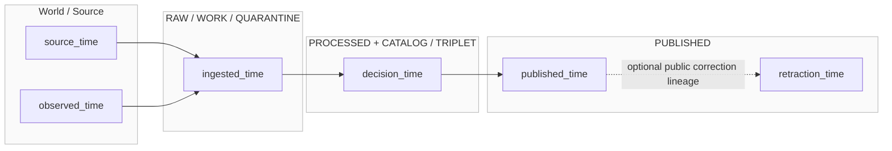

<!-- [KFM_META_BLOCK_V2]
doc_id: kfm://doc/adr-0014-temporal-vocabulary
title: ADR-0014 — Temporal Vocabulary: Six Time Kinds Tracked
type: standard
version: v1.1
status: proposed
owners: TODO(owner): Docs steward + Catalog/Release subsystem owner — verify against CODEOWNERS
created: 2026-05-11
updated: 2026-05-15
policy_label: public
related:
  - docs/doctrine/directory-rules.md
  - docs/doctrine/lifecycle-law.md
  - docs/doctrine/truth-posture.md
  - docs/adr/ADR-0001-schema-home.md
  - docs/architecture/contract-schema-policy-split.md
  - schemas/contracts/v1/common/temporal/
  - schemas/contracts/v1/release/
  - contracts/data/
  - contracts/release/
  - data/registry/crosswalks/temporal/
  - packages/temporal/
tags: [kfm, adr, temporal, vocabulary, bitemporal, lifecycle]
notes:
  - Preserves the six-kind decision while tightening repo-evidence boundaries and field semantics.
  - v1.1 corrects the Directory Rules reference: Directory Rules governs placement/schema-home; bitemporal vocabulary remains a PROPOSED ADR decision.
  - Clarifies that current repo implementation depth, owners, and path presence remain NEEDS VERIFICATION until a mounted checkout is inspected.
[/KFM_META_BLOCK_V2] -->

# ADR-0014 — Temporal Vocabulary: Six Time Kinds Tracked

> **One-line purpose.** Define exactly six named KFM time kinds that evidence-bearing records MAY carry and that catalog, release, runtime, and UI surfaces MUST treat as semantically distinct — never silently mixed, collapsed, or rounded into a single `timestamp`.

<p align="left">
  
  
  
  
  
  
</p>

| Field | Value |
|---|---|
| **ADR id** | `ADR-0014` |
| **Title** | Temporal Vocabulary — Six Time Kinds Tracked |
| **Status** | `proposed` — awaiting acceptance review |
| **Date proposed** | 2026-05-11 |
| **Last updated** | 2026-05-15 |
| **Owners** | TODO(owner): Docs steward + Catalog/Release subsystem owner *(NEEDS VERIFICATION against CODEOWNERS)* |
| **Reviewers required** | Docs steward · Catalog owner · Release owner · Runtime/API owner · UI owner |
| **Supersedes** | none |
| **Superseded by** | none |
| **Amends** | PROPOSED temporal vocabulary for KFM evidence-bearing records; placement follows Directory Rules and ADR-0001 schema-home. |
| **Related ADRs** | `ADR-0001-schema-home.md` *(schema home for new temporal field schemas; repo presence NEEDS VERIFICATION)* |
| **Lifecycle invariant touched** | RAW → WORK / QUARANTINE → PROCESSED → CATALOG / TRIPLET → PUBLISHED |
| **Implementation depth** | UNKNOWN until a mounted KFM repository, tests, workflows, and emitted artifacts are inspected. |

---

## Quick jump

- [1. Context](#1-context)
- [2. Decision](#2-decision)
- [3. The six time kinds](#3-the-six-time-kinds)
- [4. Mapping to the KFM lifecycle](#4-mapping-to-the-kfm-lifecycle)
- [5. Bitemporal mapping (valid time / transaction time)](#5-bitemporal-mapping-valid-time--transaction-time)
- [6. Field conventions and resolution](#6-field-conventions-and-resolution)
- [7. Where each kind is recorded](#7-where-each-kind-is-recorded)
- [8. UI, API, and policy implications](#8-ui-api-and-policy-implications)
- [9. Consequences](#9-consequences)
- [10. Alternatives considered](#10-alternatives-considered)
- [11. Migration plan](#11-migration-plan)
- [12. Validation and tests](#12-validation-and-tests)
- [13. Rollback plan](#13-rollback-plan)
- [14. Open questions](#14-open-questions)
- [Appendix A — Worked examples](#appendix-a--worked-examples)
- [Appendix B — Glossary](#appendix-b--glossary)
- [Related docs](#related-docs)

---

## 1. Context

KFM is a **time-aware** spatial knowledge system. The same record can carry several distinct times that are easy to confuse and consequential to confuse:

- *When did the phenomenon occur in the world?*
- *When was it measured?*
- *When did KFM receive the source artifact?*
- *When did KFM decide what to do with it?*
- *When did KFM publish it?*
- *When did KFM withdraw, correct, supersede, or roll it back?*

The KFM corpus already uses a four-axis temporal discipline — `source_time`, `observed_time`, `ingested_time`, and `published_time` — and the existing ADR draft preserves that vocabulary. This ADR adds two governance-critical kinds: `decision_time` and `retraction_time`.

> [!NOTE]
> **Why this ADR is needed.** The four-axis vocabulary is necessary but not sufficient. It does not name (a) the moment KFM *decided* that a record, policy result, review result, or promotion result became part of its assertion ledger, nor (b) the moment KFM *withdrew, corrected, superseded, or rolled back* a previously released artifact. Both are required for rollback, correction notices, replayable releases, "what did the API say on date X" queries, and the bitemporal contract that the catalog implicitly depends on.

This ADR promotes the existing four-axis discipline to a formal **six-kind vocabulary**, binds it to the lifecycle invariant, and proposes a KFM-specific mapping to valid time / transaction time.

> [!IMPORTANT]
> **Evidence boundary for this ADR.** Directory Rules confirms responsibility-root placement discipline, schema-home defaults, and the RAW → WORK / QUARANTINE → PROCESSED → CATALOG / TRIPLET → PUBLISHED lifecycle invariant. Directory Rules does **not** itself prove current repository implementation or resolve all temporal semantics. The six-kind vocabulary, field shapes, migration phases, path placements, tests, and external standard crosswalks below are **PROPOSED** until accepted and verified against mounted-repo evidence.

> [!IMPORTANT]
> **Truth labels for this ADR.** The four preserved kinds (`source_time`, `observed_time`, `ingested_time`, `published_time`) are treated as **CONFIRMED KFM vocabulary** from the source ADR/corpus baseline. The two added kinds (`decision_time`, `retraction_time`), bitemporal mapping, field conventions, test homes, and crosswalk homes are **PROPOSED**. Owners, CODEOWNERS, route presence, schema presence, workflow enforcement, package APIs, and emitted proof objects remain **NEEDS VERIFICATION**.

---

## 2. Decision

KFM SHALL recognize exactly **six top-level public time-kind names** for evidence-bearing records. Each record MAY carry any subset, but every recorded time MUST be tagged with its kind. Implicit, untagged, or "default" timestamps are prohibited at evidence-bearing surfaces.

```text
1. source_time       — when the source says the phenomenon occurred or applies
2. observed_time     — when it was measured, observed, sampled, detected, or recorded by an observer/instrument
3. ingested_time     — when KFM received the artifact at RAW / WORK / QUARANTINE admission
4. decision_time     — when KFM made a governed decision (promotion / policy / review / abstain / deny / supersede)
5. published_time    — when KFM released or re-released an artifact to a public or semi-public surface
6. retraction_time   — when KFM withdrew, corrected, superseded, or rolled back a released artifact
```

Internal services MAY retain additional operational timings — for example `started_at`, `finished_at`, `retrieved_at`, `indexed_at`, or `compiled_at` — but those MUST NOT be presented as KFM time kinds unless this ADR is amended. Operational timings are process telemetry; the six names above are claim- and publication-bearing temporal vocabulary.

The six kinds are governed by these rules:

- **MUST NOT collapse.** No evidence-bearing contract, schema, policy, runtime envelope, citation, UI panel, or release artifact may render these as an unlabeled `timestamp`, `date`, or `time`.
- **MUST tag kind explicitly.** Every persisted time field MUST carry its kind either in the field name (for example `published_time`) or in an adjacent `kind` discriminator.
- **MUST carry resolution and confidence** where the time is claim-bearing, source-derived, observed, inferred, disputed, approximate, or used in joins.
- **MUST keep source support separate from system authority.** `source_time` and `observed_time` require evidence support. `ingested_time`, `decision_time`, `published_time`, and `retraction_time` require receipt / decision / manifest / notice support.
- **MUST resolve through shared temporal helpers** once `packages/temporal/` is verified or created. No ad-hoc temporal parsing in connectors, UI, API, or policy code. Until repo inspection confirms that package, this home remains **PROPOSED**.
- **MAY be partially absent.** A `processed/` record MAY lack `published_time`; a `quarantine/` record MAY lack `decision_time`; a never-published record MUST lack `retraction_time`. Missingness MUST be explicit and MUST NOT be faked by copying another kind.
- **MUST be monotone where the lifecycle requires it.** For one artifact version or release event: `ingested_time ≤ decision_time ≤ published_time`, and `retraction_time ≥ published_time` when `retraction_time` is present.
- **MUST distinguish observations from forecasts and effective dates.** For ordinary past/current observations, `source_time` and `observed_time` SHOULD NOT postdate `ingested_time`. Forecasts, planned actions, legal effective dates, expiry windows, and future-valid records MAY postdate `ingested_time`, but MUST declare that posture in source role, temporal role, or contract semantics. That posture is **PROPOSED** and needs a follow-on schema detail.

---

## 3. The six time kinds

```mermaid
flowchart LR
  A["source_time<br/><i>source assertion / valid world time</i>"] --> B["observed_time<br/><i>measurement / observation</i>"]
  B --> C["ingested_time<br/><i>RAW / WORK / QUARANTINE admission</i>"]
  C --> D["decision_time<br/><i>promotion / policy / review</i>"]
  D --> E["published_time<br/><i>release to public surface</i>"]
  E -.->|optional, later| F["retraction_time<br/><i>correction / withdrawal / rollback</i>"]

  classDef external fill:#eef,stroke:#88a;
  classDef internal fill:#efe,stroke:#8a8;
  classDef release  fill:#fee,stroke:#a88;
  class A,B external
  class C,D internal
  class E,F release
```



<sub>**Figure 1 — PROPOSED.** Time kinds ordered by the canonical lifecycle progression for one artifact version. External (`source_time`, `observed_time`) describe the world and evidence; internal (`ingested_time`, `decision_time`) describe KFM handling; release (`published_time`, `retraction_time`) describes the public surface and its correction lineage.</sub>

| # | Kind | One-line meaning | Authority | Truth label |
|---|---|---|---|---|
| 1 | `source_time` | The source's claim about when the phenomenon occurred, applies, or is valid. | SourceDescriptor + EvidenceBundle. | CONFIRMED baseline vocabulary |
| 2 | `observed_time` | When the phenomenon was measured, observed, sampled, detected, or recorded. | Observation metadata + EvidenceBundle. | CONFIRMED baseline vocabulary |
| 3 | `ingested_time` | When KFM received the artifact at the lifecycle boundary. | Ingest receipt / event receipt. | CONFIRMED baseline vocabulary |
| 4 | `decision_time` | When KFM made a governed decision: promote, deny, abstain, approve, supersede, or rollback. | PromotionDecision / ReviewRecord / PolicyDecision / DecisionEnvelope. | **PROPOSED** |
| 5 | `published_time` | When a ReleaseManifest authorized the artifact for public or semi-public use. | ReleaseManifest / publication receipt. | CONFIRMED baseline vocabulary |
| 6 | `retraction_time` | When KFM withdrew, corrected, superseded, or rolled back a released artifact. | CorrectionNotice / WithdrawalNotice / RollbackCard. | **PROPOSED** |

> [!TIP]
> **Mnemonic.** Two outside the system (`source`, `observed`), two inside the trust membrane (`ingested`, `decision`), two on the public face (`published`, `retraction`).

---

## 4. Mapping to the KFM lifecycle

The six time kinds map onto the KFM lifecycle invariant. Each transition MAY emit one of the time kinds; not every kind is present at every phase.



<sub>**Figure 2 — PROPOSED.** Each lifecycle phase emits one or more time kinds. `retraction_time` follows `published_time` and records an additional public-surface fact: an earlier release has been withdrawn, corrected, superseded, or rolled back. It does not erase the original record.</sub>

| Lifecycle phase | Time kinds typically present | Source of truth |
|---|---|---|
| `data/raw/` | `source_time`, `observed_time`, `ingested_time` | Source artifact + ingest receipt (`data/receipts/ingest/`) |
| `data/quarantine/` | `source_time`, `observed_time`, `ingested_time`, maybe `decision_time` (`DENY` / `ABSTAIN`) | Ingest receipt + connector-gate / policy validator output |
| `data/work/` | as RAW; `decision_time` only if a governed intermediate decision has been recorded | Validation receipt / review note |
| `data/processed/` | `source_time`, `observed_time`, `ingested_time`, `decision_time` | PromotionDecision / processing receipt |
| `data/catalog/` · `data/triplets/` | same as PROCESSED, plus catalog closure activity as `decision_time` | Catalog receipt + PROV record |
| `data/published/` | all of kinds 1–5; `retraction_time` absent on first publish | ReleaseManifest (`release/manifests/`) |
| Post-retraction / correction | all six | CorrectionNotice / WithdrawalNotice / RollbackCard (`release/…`) |

> [!WARNING]
> **Lifecycle skip = time-kind lie.** Writing `published_time` on an artifact whose `decision_time` is missing is a lifecycle skip in disguise. Promotion Gate E SHOULD reject any artifact whose time-kind set is not monotone for the artifact version under review. PROPOSED.

---

## 5. Bitemporal mapping (valid time / transaction time)

This ADR proposes the KFM mapping below. Directory Rules supplies placement and schema-home doctrine; it does not, by itself, settle this temporal vocabulary. Temporal database references and MapLibre time-aware materials are useful **background / crosswalk inputs**, not implementation proof.

| Bitemporal concept | KFM time kind(s) | Notes |
|---|---|---|
| **Valid time** *(when the fact is true in the world)* | `source_time`; secondarily `observed_time` | When the source and observation disagree, `source_time` is the asserted valid/applicability time; `observed_time` is support or measurement time. |
| **Transaction time** *(when the fact became a recorded system assertion)* | `decision_time` as canonical assertion-ledger time; `ingested_time` as intake time | `ingested_time` marks arrival at the trust membrane; `decision_time` marks a governed KFM decision. |
| **Publication time** *(when the fact became public)* | `published_time` | Not part of the classical bitemporal pair, but required for KFM release discipline. |
| **Retraction / correction time** *(when the public surface changed because the release was withdrawn, corrected, superseded, or rolled back)* | `retraction_time` | Distinct from logical deletion. The original record remains inspectable; retraction is an additional fact with its own authority. |

> [!NOTE]
> **Why two system-side times.** Classical bitemporal models often collapse "arrived" and "decided" into transaction time because they assume a single write path. KFM has a governed boundary between *arrival* and *acceptance / denial / abstention / promotion*. Tracking both is what makes quarantine, policy denial, abstention, and review decisions auditable without polluting the assertion ledger. PROPOSED.

> [!IMPORTANT]
> **External standards.** ISO 19108, SQL application-time / system-time period tables, OGC API `datetime` filtering, STAC, DCAT, schema.org, and PROV-O activities model overlapping but distinct concepts. This ADR does **not** adopt any one of them wholesale; it defines KFM's internal vocabulary and treats external standards as **crosswalk targets**. Crosswalks SHOULD live under `data/registry/crosswalks/temporal/` (PROPOSED). Exact standard versions, field names, and mapping details remain **NEEDS VERIFICATION**.

---

## 6. Field conventions and resolution

> [!NOTE]
> The field-shape choices below are **PROPOSED** as the v1 default. Concrete JSON Schema definitions should land under `schemas/contracts/v1/common/temporal/` per ADR-0001 schema-home discipline, after repo inspection confirms the actual schema home.

A single time-kind field SHOULD be expressed as an object, not a bare string, so that resolution, confidence, timezone, and support can be carried explicitly.

```json
{
  "kind": "source_time",
  "value": "1867-08-15",
  "interval": null,
  "resolution": "day",
  "confidence": "asserted",
  "timezone": null,
  "evidence_ref": "ev://bundle/abc123#claim/source_time",
  "authority_ref": null,
  "notes": "Source: Kansas territorial newspaper, 1867-08-22 edition, p.2"
}
```

| Field | Type | Required? | Rules |
|---|---|---|---|
| `kind` | enum of the six kinds | **MUST** | Exactly one of `source_time` / `observed_time` / `ingested_time` / `decision_time` / `published_time` / `retraction_time`. |
| `value` | ISO 8601 instant or date | one of `value` / `interval` MUST be present unless explicitly `null` with a reason | Use date-only values for civil / historical dates when time-of-day is not supported. |
| `interval` | `{start, end}` | one of `value` / `interval` MUST be present unless explicitly `null` with a reason | Closed-open `[start, end)` for machine comparison. For unbounded ends use `null`, never an empty string. |
| `resolution` | `instant` \| `day` \| `month` \| `year` \| `decade` \| `era` \| `unknown` | **MUST** | Drives UI rendering and join behavior. Do **not** use `inferred` as a resolution; use `confidence: inferred`. |
| `confidence` | `asserted` \| `derived` \| `inferred` \| `disputed` \| `unknown` | **SHOULD** | `disputed` triggers Evidence Drawer conflict rendering. `unknown` is allowed only when support is missing or pending review. |
| `timezone` | IANA TZ string or `null` | SHOULD for local civil-time records | UTC is assumed only when the value is an explicit UTC instant such as `2026-05-15T12:00:00Z`. For date-only historical records, missing timezone means "not asserted," not "UTC." |
| `evidence_ref` | EvidenceRef URI or `null` | **MUST for `source_time` and `observed_time`** | Resolves to an EvidenceBundle. Cite-or-abstain. |
| `authority_ref` | receipt / decision / manifest / notice URI or `null` | **MUST for `ingested_time`, `decision_time`, `published_time`, `retraction_time`** | Points to the IngestReceipt, PromotionDecision, ReleaseManifest, CorrectionNotice, WithdrawalNotice, or RollbackCard that authorizes the system-side time. |
| `notes` | string | MAY | Human-readable annotation. Not policy-bearing. |

> [!CAUTION]
> **Coarse resolution is dangerous in joins.** Any join across records with different resolutions MUST go through a resolution-aware comparator in `packages/temporal/` (PROPOSED). Equality on day-resolution vs era-resolution timestamps is undefined and MUST NOT silently match.

> [!CAUTION]
> **Do not backfill by copying.** If `decision_time` is unknown, do not copy `ingested_time`. If `published_time` is unknown, do not infer it from file mtime. Backfill MUST come from receipts, manifests, review records, correction notices, or explicit migration receipts.

---

## 7. Where each kind is recorded

The owning artifact for each kind defines where reviewers MUST look to verify it. This follows Directory Rules: location encodes responsibility, lifecycle phase, and governance posture.

| Kind | Primary record | Object family | Path (PROPOSED; verify in repo) |
|---|---|---|---|
| `source_time` | EvidenceBundle / SourceDescriptor | `evidence_bundle`, `source_descriptor` | `data/proofs/evidence_bundles/`, `data/registry/source_descriptors/` |
| `observed_time` | EvidenceBundle / observation metadata | `evidence_bundle`, `observation_record` | `data/proofs/evidence_bundles/` |
| `ingested_time` | IngestReceipt / EventRunReceipt | `ingest_receipt`, `event_run_receipt` | `data/receipts/ingest/` |
| `decision_time` | PromotionDecision / ReviewRecord / PolicyDecision / DecisionEnvelope | `promotion_decision`, `review_record`, `policy_decision`, `decision_envelope` | `release/promotion_decisions/`, `data/receipts/review/`, `contracts/governance/` *(meaning)*, `schemas/contracts/v1/release/` *(shape)* |
| `published_time` | ReleaseManifest / publication receipt | `release_manifest`, `publication_receipt` | `release/manifests/`, `data/receipts/release/` |
| `retraction_time` | CorrectionNotice / WithdrawalNotice / RollbackCard | `correction_notice`, `withdrawal_notice`, `rollback_card` | `release/correction_notices/`, `release/withdrawal_notices/`, `release/rollback_cards/` |

> [!NOTE]
> All paths above are **PROPOSED** by Directory Rules responsibility-root logic. Repo presence, exact pluralization, and existing aliases remain **NEEDS VERIFICATION** until a mounted checkout is inspected.

---

## 8. UI, API, and policy implications

<details>
<summary><b>Runtime API (<code>apps/governed-api/</code>) — click to expand</b></summary>

- `RuntimeResponseEnvelope` MUST carry the time kinds relevant to each claim, not a flat `timestamp`. PROPOSED schema addition under `schemas/contracts/v1/runtime/`.
- Time-window filters (for example OGC-style `datetime`) MUST specify a `kind` parameter or default to `source_time` with the default documented in the response metadata.
- `ABSTAIN`, `DENY`, and `ERROR` outcomes SHOULD carry `decision_time` where a governed decision was made, even when no answer time is available.
- Runtime answers MUST NOT infer `retraction_time` from absence on a public surface. They must resolve the relevant correction / withdrawal / rollback object.

</details>

<details>
<summary><b>Explorer / map UI (<code>apps/explorer-web/</code>, <code>packages/maplibre/</code>) — click to expand</b></summary>

- Time-slider state MUST name the kind it filters on (default: `source_time`, unless a release-specific view explicitly defaults to `published_time`).
- Timeline views MUST NOT hide stale sources, coarse resolution, or retraction state behind animation polish.
- Time-slice tooltips SHOULD render the selected kind plus `decision_time` and `published_time` so users can distinguish world-time from KFM decision/release-time.
- Retracted, corrected, or superseded slices MUST be visually distinct and MUST link to the relevant correction notice, withdrawal notice, or rollback card.
- UI labels MUST avoid ambiguous phrasing such as "date" when the displayed kind is actually `source_time`, `observed_time`, or `published_time`.

</details>

<details>
<summary><b>Policy (<code>policy/</code>) — click to expand</b></summary>

- Promotion Gate E (temporal consistency) SHOULD be re-stated against the six kinds: monotonicity, resolution adequacy, confidence threshold, authority support, and signed-manifest presence for `published_time`.
- Sensitive-domain policies MAY use `source_time` and `observed_time` together to drive generalization, withholding, delay, or staged access.
- Policy decisions that DENY or ABSTAIN SHOULD emit `decision_time` and `authority_ref`; they MUST NOT appear as missing data.

</details>

<details>
<summary><b>Catalog (STAC / DCAT / PROV) — click to expand</b></summary>

- STAC `properties.datetime` and `properties.start_datetime` / `end_datetime` SHOULD map to `source_time` or `observed_time`, depending on source-role semantics.
- Catalog creation and update properties SHOULD NOT be used as substitutes for `decision_time` or `published_time` unless backed by a catalog receipt or ReleaseManifest.
- PROV-O `prov:Activity` start/end SHOULD bind to `decision_time` for promotion activities and `published_time` for release activities.
- All catalog crosswalk mappings are **PROPOSED** and **NEEDS VERIFICATION** against the exact STAC, DCAT, PROV, and KFM catalog schema versions in use.

</details>

---

## 9. Consequences

| Consequence | Direction | Notes |
|---|---|---|
| Catalog records become time-aware in a principled, query-stable way. | **Positive** | Replayable releases and "what did the API say on date X" queries become tractable. |
| Promotion Gate E becomes more enforceable. | **Positive** | Six named kinds, monotone rules, support references, and resolution checks are testable. |
| The distinction between world time, system decision time, and public release time becomes visible. | **Positive** | Reduces silent temporal bugs in UI, API, catalog, and correction workflows. |
| Schema, contract, policy, UI, and API surfaces require coordinated change. | **Cost** | See §11 migration plan. |
| Existing records likely lack `decision_time`, `retraction_time`, and `authority_ref`. | **Cost / risk** | Backfill is partial; missingness MUST be explicit and receipt-backed. |
| Ban on untagged `timestamp` / `date` fields may be breaking. | **Cost / transition risk** | P7 is intentionally delayed and requires a transition window. |
| External crosswalks become possible but require their own validation. | **Neutral** | This ADR defines internal vocabulary; crosswalks are separate decisions. |
| Public UI must render six kinds without clutter. | **Cost / design risk** | Default view should show selected kind plus decision/release context; Evidence Drawer can expose all kinds. PROPOSED. |
| The four-axis discipline is preserved. | **Backward-compatible at vocabulary level** | No existing kind is renamed; two governance kinds are added. |

---

## 10. Alternatives considered

| Alternative | Why not chosen |
|---|---|
| **A. Keep the four-axis vocabulary as-is.** | Leaves `decision_time` and `retraction_time` unnamed, which means rollback, correction, abstain, deny, supersession, and "as-of public release" queries have no canonical anchor. |
| **B. Adopt strict bitemporal pair (`valid_time`, `transaction_time`).** | Two kinds are too few for KFM's governance boundary, which distinguishes arrival from decision, decision from publication, and publication from retraction. It would also erase the existing KFM vocabulary. |
| **C. Adopt seven kinds by splitting `decision_time` into `promoted_time` and `reviewed_time`.** | Adds reviewer-vs-policy distinction at the cost of one more field everywhere. The `decision_envelope` / `review_record` should carry *who* and *what kind of decision*; the time kind remains singular. Revisit if review timing diverges materially from promotion timing in practice. |
| **D. Adopt ISO 19108 / SQL / STAC / DCAT / PROV vocabulary verbatim.** | These standards are useful crosswalk targets, but they do not capture KFM-specific concepts such as the trust membrane, governed promotion, cite-or-abstain, and public retraction without aliasing. |
| **E. Defer to a future ADR.** | Promotion Gate E, Evidence Drawer, time-sliced maps, release replay, and rollback planning already need a shared discriminator. Deferring forces every downstream surface to invent its own. |

---

## 11. Migration plan

This change is **additive at the vocabulary level** (two new kinds) and **doctrinal at the surface level** (no implicit timestamps or untagged dates at evidence-bearing surfaces). Backward compatibility is preserved for the four existing kinds until P7.

```mermaid
flowchart LR
  P0[Accept ADR-0014] --> P0a[Verify repo homes + owners]
  P0a --> P1[Land schemas/contracts/v1/common/temporal/]
  P1 --> P2[Update contracts/data/ + contracts/release/ + contracts/governance/ semantics]
  P2 --> P3[Update policy/promotion/ Gate E rules]
  P3 --> P4[Update apps/governed-api/ envelopes]
  P4 --> P5[Update apps/explorer-web/ time controls + Evidence Drawer]
  P5 --> P6[Backfill decision_time / retraction_time / authority_ref where derivable]
  P6 --> P7[Deprecate and then ban untagged evidence-bearing timestamp/date/time fields]
```



<sub>**Figure 3 — PROPOSED.** Migration phases. Each phase MUST land with tests. Each phase before P7 SHOULD be reversible by reverting to the pre-phase contract and restoring aliases.</sub>

| Phase | Owner | Validators / tests | Reversible? |
|---|---|---|---|
| P0 — ADR acceptance | Docs steward + reviewers | ADR review checklist | Yes |
| P0a — Repo homes + owners verification | Docs steward + repo steward | Directory Rules checklist; CODEOWNERS check | Yes |
| P1 — Schemas | Schema-registry owner | JSON Schema validity; valid/invalid fixtures | Yes |
| P2 — Contracts (meaning) | Docs steward + contract owner | Contract review; object-family review | Yes |
| P3 — Policy Gate E rewrite | Policy owner | Conftest / policy fixtures *(tooling NEEDS VERIFICATION)* | Yes |
| P4 — API envelopes | Runtime owner | Contract tests; golden envelopes | Yes |
| P5 — UI surfaces | UI owner | E2E time-slider and Evidence Drawer tests | Yes |
| P6 — Backfill | Catalog owner | Backfill receipts; EvidenceBundle / authority_ref parity | Partial; idempotent inserts only |
| P7 — Deprecation of untagged timestamps | Docs steward + subsystem owners | Repo-wide grep / AST validator in `tools/validators/` | Hard; protect with transition window |

---

## 12. Validation and tests

> [!IMPORTANT]
> **NEEDS VERIFICATION.** No mounted KFM Git repository was inspected during this update. The homes below are PROPOSED and must be adapted to the actual repo tree after Directory Rules and ADR-0001 are checked against current implementation evidence.

| Test category | Location (PROPOSED) | What it asserts |
|---|---|---|
| Schema valid / invalid fixtures | `schemas/tests/valid/temporal/`, `schemas/tests/invalid/temporal/` | All six kinds parse; missing `kind` rejected; non-monotone sets rejected. |
| Contract semantic tests | `tests/contracts/temporal/` | EvidenceBundle resolves `source_time` and `observed_time`; authority references resolve for system-side times. |
| Policy tests (Gate E) | `policy/tests/promotion/gate_e/` | Monotonicity, resolution adequacy, confidence threshold, authority support, publication manifest presence. |
| API contract tests | `tests/api/temporal/` | `RuntimeResponseEnvelope` carries explicit time kinds and no ambiguous `timestamp`. |
| UI e2e | `tests/e2e/temporal/` | Time-slider names its kind; retracted/corrected slices are visually distinct and linked to notices. |
| Migration tests | `migrations/schema/temporal/` | Old fixtures map cleanly; backfill is idempotent; missingness is explicit. |
| Validator | `tools/validators/temporal/` | Repo-wide check that evidence-bearing contracts/API fields do not use bare `timestamp`, `date`, or `time` without a kind. |
| Crosswalk tests | `tests/catalog/temporal_crosswalks/` | STAC/DCAT/PROV mappings preserve `source_time`, `observed_time`, `decision_time`, and `published_time` without collapse. |

### Verification checklist

- [ ] Confirm target path for this ADR and preserve `doc_id`.
- [ ] Confirm owners and CODEOWNERS.
- [ ] Confirm ADR-0001 schema-home status and actual `schemas/contracts/v1/` convention.
- [ ] Confirm whether `packages/temporal/` exists; create only if Directory Rules / ADR placement is satisfied.
- [ ] Confirm `apps/governed-api/`, `apps/explorer-web/`, and `packages/maplibre/` names in the mounted repo before editing runtime/UI code.
- [ ] Confirm release object homes for `ReleaseManifest`, `CorrectionNotice`, `WithdrawalNotice`, and `RollbackCard`.
- [ ] Confirm current STAC/DCAT/PROV versions and catalog schema before landing crosswalks.
- [ ] Confirm no public route reads RAW / WORK / QUARANTINE or bypasses EvidenceBundle resolution.
- [ ] Confirm rollback target and transition window before P7.

---

## 13. Rollback plan

If this ADR is reverted before §11 phase P7 lands:

1. Mark the ADR `status: superseded` with a forward link to the replacement ADR.
2. Stop requiring `decision_time` and `retraction_time` on new records; keep both readable on existing records.
3. Revert Gate E to its pre-ADR rules.
4. Open a `docs/registers/DRIFT_REGISTER.md` entry naming each downstream surface that shipped the new kinds, so callers do not silently break.
5. Keep all backfilled `decision_time`, `retraction_time`, and `authority_ref` values in `data/receipts/` process memory. Those receipts are not invalidated by a vocabulary reversal.
6. Keep compatibility aliases in API/UI layers until all public consumers have a reviewed migration path.

> [!CAUTION]
> Phase P7 (banning untagged evidence-bearing timestamps) is **not safely reversible** in a single PR once enforced. Reverting requires re-introducing legacy field names, recommunicating to downstream consumers, and opening a migration / drift record. Treat P7 as a one-way door gated by a documented transition window.

---

## 14. Open questions

> [!NOTE]
> These should move into `docs/registers/VERIFICATION_BACKLOG.md` once this ADR is accepted.

- **NEEDS VERIFICATION.** Whether `packages/temporal/` exists in the current repo and what API surface it already exposes.
- **NEEDS VERIFICATION.** Whether current catalog/STAC items use `properties.datetime` as source time, observation time, ingest time, or update time.
- **NEEDS VERIFICATION.** Whether release object homes are exactly `release/manifests/`, `release/correction_notices/`, `release/withdrawal_notices/`, and `release/rollback_cards/`.
- **NEEDS VERIFICATION.** Whether `data/triplets/` or `data/triplet/` is the active repo path; this ADR preserves the lifecycle term while marking path spelling as repo-dependent.
- **OPEN.** Does `decision_time` need sub-types for `promoted_time`, `denied_time`, `reviewed_time`, or `superseded_time`? If yes, alternative C in §10 should be revisited. If no, the `decision_envelope` carries the discriminator and the time kind remains singular.
- **OPEN.** Does `retraction_time` cover both withdrawal and correction with a discriminator on the notice, or should `correction_time` become a seventh kind? This ADR keeps one kind on the assumption that the correction / withdrawal / rollback object carries the discriminator.
- **OPEN.** Do forecasts, legal effective dates, scheduled actions, and expiry windows require a `temporal_role` enum in the temporal schema? PROPOSED follow-on.
- **OPEN.** Crosswalk targets — ISO 19108, SQL application-time / system-time, PROV-O, STAC, DCAT, schema.org `Event`, OGC API `datetime` — should each be separate crosswalk entries under `data/registry/crosswalks/temporal/`. PROPOSED.
- **OPEN.** UI default: render selected kind plus `decision_time` / `published_time`, or render only one kind with an expand affordance? PROPOSED default: selected kind + decision/release context; final call by UI owner.

[Back to top ↑](#adr-0014--temporal-vocabulary-six-time-kinds-tracked)

---

## Appendix A — Worked examples

> [!NOTE]
> All examples below are **illustrative**. They do not reference real source records.

<details>
<summary><b>A.1 — A 19th-century newspaper account of an 1867 flood</b></summary>

```yaml
record_id: ex://kfm/flood/1867-08-15
source_time:
  kind: source_time
  value: "1867-08-15"
  interval: null
  resolution: day
  confidence: asserted
  timezone: null
  evidence_ref: ev://bundle/news-1867-08-22-p2
  authority_ref: null
observed_time:
  kind: observed_time
  interval: { start: "1867-08-15", end: "1867-08-18" }
  resolution: day
  confidence: inferred
  timezone: null
  evidence_ref: ev://bundle/news-1867-08-22-p2
  authority_ref: null
ingested_time:
  kind: ingested_time
  value: "2025-11-04T18:22:09Z"
  resolution: instant
  confidence: asserted
  evidence_ref: null
  authority_ref: receipt://ingest/2025-1104-018
  notes: "Illustrative ingest receipt."
decision_time:
  kind: decision_time
  value: "2025-11-12T14:01:00Z"
  resolution: instant
  confidence: asserted
  evidence_ref: null
  authority_ref: decision://promotion/PD-2025-1112-014
published_time:
  kind: published_time
  value: "2025-11-13T09:00:00Z"
  resolution: instant
  confidence: asserted
  evidence_ref: null
  authority_ref: release://manifest/R-2025-1113-001
retraction_time: null
```

</details>

<details>
<summary><b>A.2 — AQS-validated vs AirNow-preliminary air-quality readings for the same hour</b></summary>

> The point is not to assert real AQS / AirNow behavior. The example shows that two records can share world-time while differing in source role, confidence, decision authority, and release/correction lineage.

```yaml
# AirNow-like preliminary record — illustrative only
source_time:    { kind: source_time,    value: "2026-04-02T18:00:00Z", resolution: instant, confidence: asserted, evidence_ref: ev://bundle/air-prelim-001 }
observed_time:  { kind: observed_time,  value: "2026-04-02T18:00:00Z", resolution: instant, confidence: derived,  evidence_ref: ev://bundle/air-prelim-001 }
ingested_time:  { kind: ingested_time,  value: "2026-04-02T18:04:11Z", resolution: instant, confidence: asserted, authority_ref: receipt://ingest/air-prelim-001 }
decision_time:  { kind: decision_time,  value: "2026-04-02T18:05:00Z", resolution: instant, confidence: asserted, authority_ref: decision://policy/prelim-admit-001 }
published_time: { kind: published_time, value: "2026-04-02T18:06:00Z", resolution: instant, confidence: asserted, authority_ref: release://manifest/air-prelim-001 }
```

```yaml
# Later finalized record — illustrative only
source_time:    { kind: source_time,    value: "2026-04-02T18:00:00Z", resolution: instant, confidence: asserted, evidence_ref: ev://bundle/air-final-001 }
observed_time:  { kind: observed_time,  value: "2026-04-02T18:00:00Z", resolution: instant, confidence: asserted, evidence_ref: ev://bundle/air-final-001 }
ingested_time:  { kind: ingested_time,  value: "2026-09-15T03:22:00Z", resolution: instant, confidence: asserted, authority_ref: receipt://ingest/air-final-001 }
decision_time:  { kind: decision_time,  value: "2026-09-17T11:00:00Z", resolution: instant, confidence: asserted, authority_ref: decision://promotion/air-final-001, notes: "Supersedes preliminary record." }
published_time: { kind: published_time, value: "2026-09-17T12:00:00Z", resolution: instant, confidence: asserted, authority_ref: release://manifest/air-final-001 }
retraction_time:
  kind: retraction_time
  value: "2026-09-17T12:00:00Z"
  resolution: instant
  confidence: asserted
  authority_ref: correction://notice/CN-2026-0917-003
  notes: "Retracts preliminary record id=an-...; correction notice carries discriminator."
```

</details>

<details>
<summary><b>A.3 — A rolled-back released layer</b></summary>

```yaml
record_id: ex://kfm/layer/hydrology-anomaly@v3
published_time:
  kind: published_time
  value: "2026-02-01T10:00:00Z"
  resolution: instant
  confidence: asserted
  authority_ref: release://manifest/R-2026-0201-002
retraction_time:
  kind: retraction_time
  value: "2026-02-05T16:30:00Z"
  resolution: instant
  confidence: asserted
  authority_ref: rollback://card/RC-2026-0205-008
  notes: "Replaced by hydrology-anomaly@v2 as canonical until v4."
```

</details>

---

## Appendix B — Glossary

| Term | Definition |
|---|---|
| **Time kind** | One of the six named KFM axes defined in §3. |
| **Resolution** | Granularity of the time value (`instant`, `day`, `month`, `year`, `decade`, `era`, `unknown`). |
| **Confidence** | Source- or system-support strength of the time value (`asserted`, `derived`, `inferred`, `disputed`, `unknown`). |
| **EvidenceRef / EvidenceBundle** | Pointer / resolved support for a claim. `source_time` and `observed_time` MUST resolve to an EvidenceBundle. |
| **AuthorityRef** | Pointer to the receipt, decision, manifest, correction notice, withdrawal notice, or rollback card that authorizes a system-side time. PROPOSED. |
| **Promotion Gate E** | Temporal-consistency gate in the A–G promotion sequence. Its six-kind rewrite is PROPOSED. |
| **Trust membrane** | Boundary between RAW / WORK / QUARANTINE and governed public exposure. Operational form is commonly `apps/governed-api/`, but repo presence remains NEEDS VERIFICATION. |
| **Bitemporal** | Modeling style with separate valid time and transaction time. KFM's proposed mapping is in §5. |
| **Temporal role** | PROPOSED discriminator for observation, forecast, planned action, legal effective date, expiry window, or other non-ordinary temporal posture. |

---

## Related docs

- [`docs/doctrine/directory-rules.md`](../doctrine/directory-rules.md) — governs responsibility-root placement, schema-home defaults, lifecycle phases, and drift discipline. *(Repo presence NEEDS VERIFICATION.)*
- [`docs/doctrine/lifecycle-law.md`](../doctrine/lifecycle-law.md) — RAW → … → PUBLISHED invariant. *(NEEDS VERIFICATION.)*
- [`docs/doctrine/truth-posture.md`](../doctrine/truth-posture.md) — Cite-or-abstain; underlies EvidenceBundle requirements. *(NEEDS VERIFICATION.)*
- [`docs/architecture/contract-schema-policy-split.md`](../architecture/contract-schema-policy-split.md) — explains separation of object meaning, machine shape, and admissibility. *(NEEDS VERIFICATION.)*
- [`docs/adr/ADR-0001-schema-home.md`](./ADR-0001-schema-home.md) — schema-home rule (`schemas/contracts/v1/...`) for new temporal schemas. *(NEEDS VERIFICATION.)*
- `schemas/contracts/v1/common/temporal/` — PROPOSED home for v1 temporal schemas.
- `contracts/data/`, `contracts/release/`, `contracts/governance/` — PROPOSED semantic homes to update.
- `data/registry/crosswalks/temporal/` — PROPOSED home for STAC / DCAT / PROV / SQL / ISO / OGC crosswalks.
- `release/manifests/`, `release/correction_notices/`, `release/withdrawal_notices/`, `release/rollback_cards/` — PROPOSED record homes for `published_time` and `retraction_time` authorities.

---

<sup>**Last reviewed:** 2026-05-15 · **Status:** `proposed` · **ADR id:** `ADR-0014` · [Back to top ↑](#adr-0014--temporal-vocabulary-six-time-kinds-tracked)</sup>
