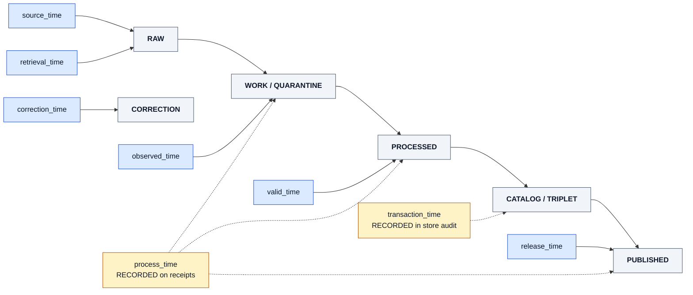

<!-- [KFM_META_BLOCK_V2]
doc_id: kfm://doc/adr-0014-temporal-vocabulary
title: ADR-0014 — Temporal Vocabulary: Six Time Kinds Tracked
type: standard
version: v1
status: draft
owners: <architecture-steward> + <data-steward> (TODO: confirm owners)
created: 2026-05-09
updated: 2026-05-09
policy_label: public
related:
  - docs/doctrine/directory-rules.md
  - docs/doctrine/lifecycle-law.md
  - docs/doctrine/truth-posture.md
  - docs/adr/ADR-0001-schema-home.md
  - docs/architecture/contract-schema-policy-split.md
  - contracts/data/                     # PROPOSED: dataset_version, validation_report
  - contracts/runtime/                  # PROPOSED: run_receipt, decision_envelope
  - schemas/contracts/v1/common/        # PROPOSED home for shared temporal types
tags: [kfm, adr, temporal, vocabulary, time-model, doctrine]
notes:
  - Resolves the time-vocabulary drift between Build Companion §7.1 (8 kinds), Build Companion principle #5 (7 kinds), Implementation Reference ("at least four"), and Encyclopedia §H (6 kinds).
  - This ADR adopts the Encyclopedia §H enumeration as canonical for *tracked* object/domain time, and reclassifies process_time and transaction_time as *recorded* time that lives on receipts and store-level audit, not on object schemas.
  - Repository not mounted in this session; all path references below are PROPOSED until verified.
[/KFM_META_BLOCK_V2] -->

# ADR-0014 — Temporal Vocabulary: Six Time Kinds Tracked

> **One line.** KFM canonicalizes **six** time kinds — `valid_time`, `observed_time`, `source_time`, `retrieval_time`, `release_time`, `correction_time` — as the *tracked* domain temporal vocabulary, and reclassifies `process_time` and `transaction_time` as *recorded* system time that lives on receipts and store-level audit, not on object-family schemas.

| | |
|---|---|
| **ADR ID** | ADR-0014 |
| **Status** | **PROPOSED** — not yet accepted |
| **Date** | 2026-05-09 |
| **Type** | Doctrinal — resolves a tracked-vocabulary drift across three sources |
| **Supersedes** | None |
| **Superseded by** | None |
| **Owners** | `<architecture-steward>` + `<data-steward>` *(TODO: confirm in CODEOWNERS)* |
| **Reviewers required** | Architecture steward · Data steward · Schema steward · at least one domain steward (hydrology recommended — most temporally complex lane) |
| **Affects** | `contracts/`, `schemas/contracts/v1/`, `policy/runtime/`, `policy/promotion/`, all `docs/domains/*`, `data/registry/*` |
| **Related ADRs** | ADR-0001 (schema home) · *(future)* ADR for `process_time`/`transaction_time` placement on receipts/audit |
| **Truth posture** | Doctrine: **CONFIRMED** from corpus. Decision (this ADR): **PROPOSED**. Specific repo paths: **NEEDS VERIFICATION** until repo is mounted. |

> [!IMPORTANT]
> A claim that lacks the time kind material to it (e.g., a flow observation without `observed_time`, a railroad segment without `valid_time`) MUST trigger **ABSTAIN**, not a confident answer. Time discipline is part of the cite-or-abstain truth posture, not a metadata nicety.

**Quick jump:** [Context](#1-context) · [Decision](#2-decision) · [Why six and not 4/7/8](#3-why-six-and-not-4-7-or-8) · [Where each time kind lives](#4-where-each-time-kind-lives) · [Validation](#5-validation--acceptance-tests) · [Consequences](#6-consequences) · [Alternatives](#7-alternatives-considered) · [Migration](#8-migration--compatibility) · [Open questions](#9-open-questions--needs-verification)

---

## 1. Context

### 1.1 The problem

KFM is **time-aware by doctrine**, but "time-aware" is not a single concept. The corpus enumerates time kinds inconsistently across documents:

| Source | Time kinds named |
|---|---|
| Build Companion §7.1 (vocabulary table) | **8** — `valid`, `observed`, `source`, `retrieval`, `process`, `release`, `correction`, `transaction` |
| Build Companion principle #5 | **7** — drops `process_time` |
| Encyclopedia §H, §7.2 (Hydrology), §7.4 (Habitat), §7.14 (People) | **6** — `valid`, `observed`, `source`, `retrieval`, `release`, `correction` |
| Implementation Reference (Temporal normalization) | **4** — `valid_time`, `source_publication_time`, `ingestion_time`, `release_time` |
| Pass 11 / Components | **4** — `source_time`, `observed_time`, `ingested_time`, `published_time` |

This is not pedantic divergence. The vocabulary determines what **must appear in object schemas**, what the **time-slider filters**, what `"current"` **means in API responses**, and what an `ABSTAIN` decision **must check** before answering. Without a canonical set, schemas drift, policies drift, and the time-slider filters by whatever field happens to be present — which is exactly the failure mode Build Companion §7 was written to prevent.

### 1.2 Two distinct meta-categories hidden inside the conflict

Reading across the sources, the eight names actually describe **two different things**:

- **Domain time** — when something was true, observed, said, retrieved, released, or corrected *as a fact about the world or about KFM's public posture toward the world*. These belong on **object-family schemas** because they shape every claim KFM makes.
- **System time** — when a process ran or a database row changed. These are real and important, but they describe **internal mechanics**, not the world. They belong on **receipts** (process memory) and **store-level audit logs** (database history).

Mixing the two is the same drift pattern Directory Rules §10 warns about for `data/published/` vs `release/`: collapsing process memory and release decisions into one bucket. The same separation discipline applies here, in time form.

### 1.3 Forces

- Schemas need a **stable, enumerated** time field set. Domain dossiers cannot author schemas confidently while the count varies between four and eight.
- Policy gates (STALE / REVIEW_NEEDED) compare against `source_time`. Ambiguity about what `source_time` means leaks into wrong gate decisions.
- Time-slider semantics in the map UI must be deterministic per layer, which requires layer manifests to declare which field they filter.
- AI ABSTAIN logic must check "material temporal scope present"; it cannot do that against a moving target.
- Bitemporal correctness — KFM's commitment that **a correction does not erase what KFM knew at earlier release time** — depends on `release_time` and `correction_time` being **first-class, distinct, and never collapsed**.
- Process-level timestamps (`process_time`, `transaction_time`) are still operationally needed, just not as object schema fields.

---

## 2. Decision

### 2.1 The six tracked time kinds

KFM adopts the following **six** time kinds as the canonical *tracked* temporal vocabulary. These MUST be the names used in `contracts/`, `schemas/contracts/v1/`, domain dossiers, layer manifests, runtime API DTOs, and policy fixtures. Existing language using `ingestion_time`, `published_time`, `source_publication_time`, etc. MUST be renamed during migration.

| # | Field | Meaning | Canonical example |
|---|---|---|---|
| 1 | `valid_time` | Period when the assertion applies in the world. May be a point or an interval. | A railroad segment operated `[1887-01-01, 1934-12-31]`. |
| 2 | `observed_time` | When an observation occurred. | Stream gauge reading at `2026-04-21T14:00Z`. |
| 3 | `source_time` | When the source record was created, issued, or last updated. | FEMA NFHL map service update timestamp. |
| 4 | `retrieval_time` | When KFM acquired the source payload. | Connector run timestamp. |
| 5 | `release_time` | When KFM made a public-safe artifact available. | `ReleaseManifest` signed/approved time. |
| 6 | `correction_time` | When KFM corrected, withdrew, or superseded a claim. | `CorrectionNotice` issuance time. |

**These six fields are the *tracked* set.** Any object-family schema where time is material MUST use these names.

### 2.2 The two reclassified kinds

| Field | New classification | Where it lives |
|---|---|---|
| `process_time` | **Recorded, not tracked** | `RunReceipt` / `TransformReceipt` / `ValidationReport` (process memory). Not an object-schema field. |
| `transaction_time` | **Recorded, not tracked** | Store-level audit / lineage log of the canonical store. Not an object-schema field, not a public DTO field. |

These two timestamps are still **required to exist**. They are not deleted; they are relocated. Their absence from object schemas prevents the most common drift pattern — using ETL run time as observation time, or using DB row-modified time as release time.

> [!NOTE]
> The receipts that hold `process_time` and the audit logs that hold `transaction_time` are themselves part of the trust spine. This ADR does not weaken them; it strengthens them by giving them their own scope.

### 2.3 Conformance language

| Rule | Level |
|------|-------|
| Object-family schemas where time is material **MUST** use the six tracked names. | MUST |
| Object-family schemas **MUST NOT** introduce synonyms (`ingested_time`, `published_time`, `source_publication_time`, etc.). | MUST NOT |
| `RunReceipt` / `TransformReceipt` / `ValidationReport` **MUST** carry `process_time`. | MUST |
| Canonical stores **SHOULD** preserve `transaction_time` via store-native mechanism (CDC log, append-only history, system-versioned table, etc.). | SHOULD |
| Public DTOs **SHOULD NOT** expose `transaction_time`. | SHOULD NOT |
| `LayerManifest` **MUST** declare which tracked field its time-slider filters (`valid_time` or `observed_time` are the only legal slider targets). | MUST |
| `RuntimeResponseEnvelope` for "current" queries **MUST** declare which kind of "latest" it returns. | MUST |
| ABSTAIN **MUST** be raised when material temporal scope is missing. | MUST |

---

## 3. Why six, and not 4, 7, or 8

| Option | Set | Why rejected |
|---|---|---|
| **Four** (Implementation Reference / Pass 11) | `valid`, `source`, `ingested`/`retrieved`, `released` | Loses `observed_time` (different from `valid_time` for instrumented data) and `correction_time` (the pivot for bitemporal correctness). A correction without `correction_time` is invisible — the exact thing the truth posture forbids. |
| **Seven** (Build Companion principle #5) | Six tracked + `transaction_time` | `transaction_time` is system mechanics, not domain truth. Putting it on object schemas invites confusing DB row-modification time with release or correction time — Build Companion §7.1 explicitly names this as the "common mistake." |
| **Eight** (Build Companion §7.1 vocabulary) | Seven + `process_time` | Same category error: ETL-run time as observation time is the textbook drift the section warns against. `process_time` is process memory; it belongs on the receipt that *describes* the process, not on the object the process produced. |
| **Six** *(this ADR)* | `valid`, `observed`, `source`, `retrieval`, `release`, `correction` | Matches Encyclopedia §H, §7.2, §7.4, §7.14 already. Cleanly separates domain time (six) from system time (two-on-receipts). Smallest set that preserves bitemporal correctness, observed-vs-valid separation, and correction discipline. |

---

## 4. Where each time kind lives

### 4.1 Lifecycle map

**Reading the diagram.** Solid arrows are *tracked* kinds — they appear on object schemas at the lifecycle phase that owns them. Dashed arrows are *recorded* kinds — they exist as receipts or store-level audit, not on the object the lifecycle is moving.

### 4.2 Field-by-object placement *(PROPOSED — repo not mounted)*

| Tracked field | Required on | Optional on | Forbidden on |
|---|---|---|---|
| `valid_time` | Any assertion-style object: feature versions, ownership intervals, regulatory contexts. | Pure observations (use `observed_time`). | Receipts. |
| `observed_time` | Observations: `FlowObservation`, `WaterLevelObservation`, `LandCoverObservation`, etc. | Derived layers tied to a fixed observation window. | Manifests, decisions. |
| `source_time` | `SourceDescriptor`, `DatasetVersion`, every record traceable to a source revision. | Layer manifests (when the layer is a thin source mirror). | Synthesized fixtures. |
| `retrieval_time` | `RawCaptureReceipt`, `IngestReceipt`, `DatasetVersion`. | `SourceDescriptor` (latest retrieval). | Released DTOs (operationally noisy). |
| `release_time` | `ReleaseManifest`, `LayerManifest`, public DTOs that need a "released-as-of" anchor. | `CatalogRecord` (mirrors manifest). | Receipts predating release. |
| `correction_time` | `CorrectionNotice`, `WithdrawalNotice`, `ReleaseManifest` superseding a prior version. | Public DTOs that surface a correction badge. | Anywhere it would silently overwrite a prior `release_time`. |

> [!NOTE]
> Specific schema file paths are intentionally not pinned in this ADR. Per **ADR-0001 (schema home)**, the default machine-schema home is `schemas/contracts/v1/...`, and any divergent placement is **CONFLICTED** until resolved. This ADR adopts the same default.

### 4.3 The `process_time` / `transaction_time` placement table

| Recorded kind | Lives on | Surface visibility |
|---|---|---|
| `process_time` | `RunReceipt`, `TransformReceipt`, `ValidationReport`, `AIReceipt` | Internal; surfaced in Evidence Drawer **only** as part of provenance, never as a claim time. |
| `transaction_time` | Store-native history: append-only log, system-versioned table, CDC stream, or graph store equivalent. | Internal only; never in public DTO. |

---

## 5. Validation & acceptance tests

These tests are normative. They are owned by `tests/contracts/temporal/` *(PROPOSED path)* and `tests/policy/runtime/` *(PROPOSED path)*, and are gating for promotion of any new domain dossier.

| ID | Test | Expected outcome |
|---|---|---|
| **T-TIME-01** | A claim with `source_time` older than the policy threshold for its source family. | Runtime emits `STALE` or `REVIEW_NEEDED`; never a confident "current" answer. |
| **T-TIME-02** | Issue a correction; re-fetch the prior released claim. | Prior `release_time` preserved; new `correction_time` recorded; prior release record not rewritten in place. |
| **T-TIME-03** | Layer time-slider configured for `valid_time`. Slider window excludes a feature whose `valid_time` is outside the window but whose `source_time` is inside. | Feature is **excluded**; the slider does not fall back to `source_time` or any file timestamp. |
| **T-TIME-04** | API request for "current X" against a layer whose manifest declares `valid_time` semantics. | Response anchors `latest valid`; the envelope **declares** which kind of latest was used. |
| **T-TIME-05** | Append-only history fixture: change a record at `transaction_time = T2`, query the system as-of `release_time = T1 < T2`. | System returns the T1 view. The T2 mutation does not erase the T1 release record. |
| **T-TIME-06** | Object schema introduces a field named `ingested_time` or `published_time`. | Schema-drift validator **fails** the PR with a pointer to this ADR. |
| **T-TIME-07** | `ReleaseManifest` is missing `release_time`, or `CorrectionNotice` is missing `correction_time`. | Promotion gate denies; manifest not signed; release does not happen. |
| **T-TIME-08** | A `RunReceipt` is missing `process_time`. | Receipt validator rejects the receipt; the run is not admissible as evidence of work performed. |
| **T-TIME-09** | An object-family schema includes `process_time` or `transaction_time` as a domain field. | Schema-drift validator **fails**; suggests relocation to receipts or audit log. |
| **T-TIME-10** | ABSTAIN test: AI is asked for a current answer about an observation whose `observed_time` is missing. | Runtime emits `ABSTAIN` with reason `material_temporal_scope_missing`. |

---

## 6. Consequences

### 6.1 Positive

- **Schema stability across domains.** All eleven domain dossiers can author object schemas against the same time-field enumeration without re-litigating the count.
- **Policy gates have a stable target.** Staleness, freshness, and correction policies can be authored once in `policy/runtime/` and reused.
- **Bitemporal correctness preserved by construction.** `release_time` and `correction_time` are first-class and distinct; the system cannot accidentally collapse them.
- **AI ABSTAIN logic is testable.** "Material temporal scope missing" is a finite, enumerable check.
- **Receipts get cleaner scope.** `process_time` on receipts means receipt validators can enforce it without ambiguity.
- **Time-slider semantics become per-layer-declared, not implicit.** `LayerManifest` makes the choice visible at point of use.

### 6.2 Negative / costs

- **Migration burden.** Existing references to `ingestion_time`, `ingested_time`, `published_time`, `source_publication_time`, and `transaction_time`-on-objects in domain dossiers and the Implementation Reference must be renamed or relocated. See §8.
- **Receipts must be tightened.** Codebases that currently put `process_time` on records rather than receipts must move it. This is corrective, but it is work.
- **Reviewer overhead during transition.** Schema-drift tests T-TIME-06 and T-TIME-09 will fail older PRs until terminology is updated.
- **Enumeration risk.** Any future kind (e.g., `embargo_lift_time`, `consent_grant_time`) requires an ADR amendment, not silent addition.

### 6.3 Risks the decision does **not** eliminate

- **Source-time ambiguity at the source.** Some upstream sources publish inconsistent or absent timestamps. This ADR cannot fix the source; it can only require KFM to record what it does and does not know.
- **Time-zone discipline.** This ADR does not specify timezone handling. All six tracked kinds **SHOULD** be UTC ISO-8601 with offset; a follow-up ADR can pin this if needed.
- **Precision and granularity.** `valid_time` for historical material may be a year or a decade. This ADR does not fix precision modeling — that is `temporal_assertion_basis` / `date_precision` territory and belongs in a separate ADR.

---

## 7. Alternatives considered

<b>Alternative A — Four-kind set</b> (Implementation Reference / Pass 11) — <i>rejected</i>

`valid_time`, `source_publication_time` (or `source_time`), `ingestion_time` (or `retrieval_time`), `release_time`.

**Why rejected.** Loses `observed_time` (which differs from `valid_time` for instrumented observations — a stream gauge has both) and loses `correction_time` (without which corrections can only be expressed by overwriting `release_time`, which is the worst-case bitemporal failure). The four-kind set is minimal-and-broken for KFM's truth posture.

<b>Alternative B — Seven-kind set</b> (Build Companion principle #5) — <i>rejected</i>

Six tracked + `transaction_time`.

**Why rejected.** `transaction_time` is database mechanics. Modeling it on object schemas invites the exact mistake Build Companion §7.1 names: confusing the "record inserted/updated in store" time with the "world-state changed" time. Keeping `transaction_time` as store-level audit preserves it without polluting domain schemas.

<b>Alternative C — Eight-kind set</b> (Build Companion §7.1 vocabulary) — <i>rejected</i>

Seven + `process_time`.

**Why rejected.** Same category error in stronger form. `process_time` is the run timestamp of an ETL transform. Putting it on the produced record creates the most common drift pattern KFM has tried to avoid since the trust spine was written: ETL-run-time treated as observation time. Better: `process_time` lives on the receipt that *describes* the process, where it cannot be confused with the world.

<b>Alternative D — No canonical set; let domains choose</b> — <i>rejected</i>

**Why rejected.** Currently the de-facto state, and the problem this ADR exists to fix. Domain-by-domain choice produces N drifting vocabularies and breaks every cross-domain query, every layer-manifest filter, and every shared policy gate.

<b>Alternative E — Adopt PROV-O / Allen-interval vocabulary directly</b> — <i>rejected for tracked vocabulary, retained for graph projection</i>

**Why rejected for tracked vocabulary.** PROV-O and Allen-interval relations are excellent for the **graph projection** layer (see C8 in the Components Atlas), but they are not a flat field set suitable for object schemas. The six tracked kinds map cleanly *into* PROV-O when the graph is built, but PROV-O cannot replace them at the schema layer.

---

## 8. Migration & compatibility

### 8.1 Renames *(PROPOSED — apply during migration)*

| Old name *(found in corpus)* | New canonical name |
|---|---|
| `ingestion_time`, `ingested_time` | `retrieval_time` |
| `published_time` | `release_time` |
| `source_publication_time` | `source_time` |
| `process_time` *(on object record)* | move to `RunReceipt.process_time` |
| `transaction_time` *(on object record)* | move to store-level audit |

### 8.2 Compatibility window

- **Phase 0 (now):** ADR enters status `PROPOSED`. Drift-register entries opened in `docs/registers/DRIFT_REGISTER.md` for every known synonym. *(NEEDS VERIFICATION: register exists in mounted repo.)*
- **Phase 1 (acceptance):** ADR moves to `ACCEPTED`. Schema-drift tests T-TIME-06 and T-TIME-09 enabled in advisory mode (warn, do not block).
- **Phase 2 (enforcement):** Schema-drift tests move to blocking. Domain dossiers updated in dependency order, hydrology first.
- **Phase 3 (deprecation cleanup):** Old synonyms purged from `docs/`, `contracts/`, `schemas/contracts/v1/`. Migration receipts captured in `migrations/`.

### 8.3 Doc-side migration

The following documents reference time-field vocabularies and **MUST** be updated when this ADR is accepted:

- `kfm_build_companion.pdf` — successor doc `docs/doctrine/time-model.md` *(PROPOSED)* takes the canonical six-kind table and links to this ADR.
- `Kansas_Frontier_Matrix_Implementation_Reference.pdf` — temporal-normalization paragraph updated to the six-kind set.
- All `docs/domains/*/` dossiers that reference temporal fields — synonyms replaced.
- `docs/standards/` — STAC, DCAT, PROV-O mappings updated to project FROM the six tracked kinds.

---

## 9. Open questions / NEEDS VERIFICATION

- **NEEDS VERIFICATION** — Whether the mounted repo currently has any object-family schemas that already enumerate temporal fields, and which names they use. Until inspected, all "currently uses X" claims are unsupported.
- **NEEDS VERIFICATION** — Whether `RunReceipt`, `TransformReceipt`, and `ValidationReport` schemas in the repo already carry `process_time`, or whether this ADR creates that obligation.
- **OPEN** — Timezone discipline. UTC ISO-8601 with offset is the plain default; a follow-up ADR can pin it.
- **OPEN** — Precision modeling for historical `valid_time` (year, decade, "circa"). Belongs in a `temporal_assertion_basis` / `date_precision` ADR, not here.
- **OPEN** — Whether `embargo_lift_time` (release-policy timer) and `consent_grant_time` (consent-policy timer) should be treated as policy-time fields (kept on policy objects) or graduated into the tracked vocabulary. Default is the former; revisit if a domain pushes back.
- **OPEN** — Allen-interval-relation modeling on `valid_time` intervals (`before`, `meets`, `overlaps`, `during`, `starts`, `finishes`, `equals`). Likely belongs in the graph-projection ADR, not here.
- **OPEN** — Per-source freshness thresholds for the STALE / REVIEW_NEEDED gate. This ADR establishes that `source_time` is the input; it does not set the thresholds. Per-source thresholds belong in `policy/runtime/freshness/` *(PROPOSED path)*.

---

## 10. References

- KFM Build Companion §7 ("Time model: KFM needs temporal discipline, not one date column") — the originating doctrine; supplies eight-kind vocabulary table and seven-kind principle list.
- KFM Encyclopedia §H ("Knowledge systems") and domain sections §7.2 (Hydrology), §7.4 (Habitat), §7.14 (People) — six-kind enumeration adopted by this ADR.
- Kansas Frontier Matrix Implementation Reference, "Temporal normalization" — four-kind enumeration this ADR supersedes.
- Components Atlas Pass 11 §B.3.2 (`ReleaseManifest`) — confirms `release_time` is the manifest's signed/approved time.
- Components Atlas Pass 10 §C8 (CIDOC-CRM / PROV-O / PAV graph backbone) — adjacent layer that consumes the six tracked kinds.
- `docs/doctrine/directory-rules.md` — placement rules for ADRs (`docs/adr/`), receipts (`data/receipts/`), and release decisions (`release/`).
- ADR-0001 (schema home) — canonical schema home is `schemas/contracts/v1/...`; this ADR conforms.

---

## 11. Decision record metadata

| Field | Value |
|---|---|
| **Decision** | Adopt the six-kind tracked temporal vocabulary defined in §2.1; relocate `process_time` and `transaction_time` per §2.2. |
| **Status** | **PROPOSED** |
| **Effective on acceptance** | Phase-1 milestone in §8.2 begins immediately. |
| **Sunset / supersession path** | Future ADR may extend the tracked set; it MUST cite this ADR and provide a migration. Reduction below six requires a successor ADR with explicit doctrinal reasoning. |

[↑ Back to top](#adr-0014--temporal-vocabulary-six-time-kinds-tracked)
