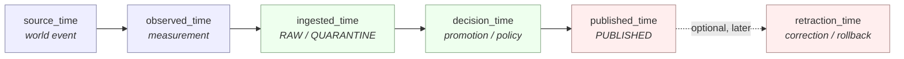
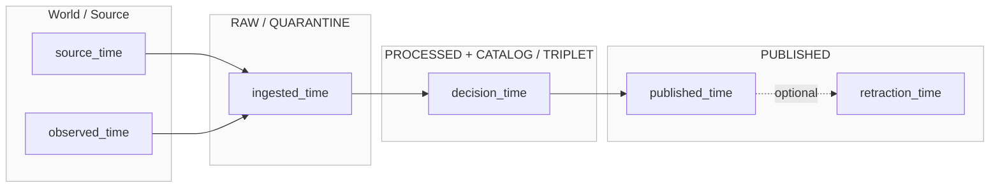
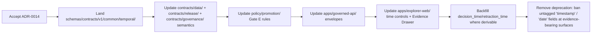

<!-- [KFM_META_BLOCK_V2]
doc_id: kfm://doc/adr-0014-temporal-vocabulary
title: ADR-0014 — Temporal Vocabulary: Six Time Kinds Tracked
type: standard
version: v1
status: draft
owners: TODO — Docs steward + Catalog/Release subsystem owner
created: 2026-05-11
updated: 2026-05-11
policy_label: public
related:
  - docs/doctrine/directory-rules.md
  - docs/doctrine/lifecycle-law.md
  - docs/doctrine/truth-posture.md
  - docs/adr/ADR-0001-schema-home.md
  - docs/architecture/contract-schema-policy-split.md
  - schemas/contracts/v1/common/
  - schemas/contracts/v1/release/
  - contracts/data/
  - contracts/release/
tags: [kfm, adr, temporal, vocabulary, bitemporal, lifecycle]
notes:
  - Promotes the corpus's four-axis temporal discipline to a formal six-kind vocabulary.
  - Resolves the open question flagged in Directory Rules: "Valid/transaction time concepts. Current implementation remains UNKNOWN."
[/KFM_META_BLOCK_V2] -->

# ADR-0014 — Temporal Vocabulary: Six Time Kinds Tracked

> **One-line purpose.** Define exactly six named time kinds that every KFM evidence-bearing record MAY carry and that the catalog, release, runtime, and UI surfaces MUST treat as semantically distinct — never silently mixed, collapsed, or rounded into a single "timestamp."

<p align="left">
  
  
  
  
  
  
</p>

| Field | Value |
|---|---|
| **ADR id** | `ADR-0014` |
| **Title** | Temporal Vocabulary — Six Time Kinds Tracked |
| **Status** | `proposed` — awaiting acceptance review |
| **Date proposed** | 2026-05-11 |
| **Owners** | TODO — Docs steward + Catalog/Release subsystem owner *(NEEDS VERIFICATION against CODEOWNERS)* |
| **Reviewers required** | Docs steward · Catalog owner · Release owner · Runtime/API owner · UI owner |
| **Supersedes** | none |
| **Superseded by** | none |
| **Amends** | Directory Rules §18 open item: *"Valid/transaction time concepts. Current implementation remains UNKNOWN."* |
| **Related ADRs** | `ADR-0001-schema-home.md` (schema home for new temporal field schemas) |
| **Lifecycle invariant touched** | RAW → WORK / QUARANTINE → PROCESSED → CATALOG / TRIPLET → PUBLISHED |

---

## Quick jump

- [1. Context](#1-context)
- [2. Decision](#2-decision)
- [3. The six time kinds](#3-the-six-time-kinds)
- [4. Mapping to the KFM lifecycle](#4-mapping-to-the-kfm-lifecycle)
- [5. Bitemporal mapping (valid time / transaction time)](#5-bitemporal-mapping-valid-time--transaction-time)
- [6. Field conventions and resolution](#6-field-conventions-and-resolution)
- [7. Where each kind is recorded](#7-where-each-kind-is-recorded)
- [8. UI, API, and policy implications](#8-ui-api-and-policy-implications)
- [9. Consequences](#9-consequences)
- [10. Alternatives considered](#10-alternatives-considered)
- [11. Migration plan](#11-migration-plan)
- [12. Validation and tests](#12-validation-and-tests)
- [13. Rollback plan](#13-rollback-plan)
- [14. Open questions](#14-open-questions)
- [Appendix A — Worked examples](#appendix-a--worked-examples)
- [Appendix B — Glossary](#appendix-b--glossary)

---

## 1. Context

KFM is a **time-aware** spatial knowledge system. The same record can carry several distinct
times that are easy to confuse and consequential to confuse:

- *When did the phenomenon occur in the world?*
- *When was it measured?*
- *When did KFM accept it?*
- *When did KFM decide it was canonical?*
- *When did KFM publish it?*
- *When did KFM withdraw or correct it?*

The KFM corpus already names **four** temporal axes as a discipline that MUST remain
separate — `source_time`, `observed_time`, `ingested_time`, `published_time` — and warns
that "mixing these produces silent temporal bugs." Promotion Gate **E** is defined to
check exactly these temporal fields together with resolution and confidence labels
(day, month, year, inferred). The Master MapLibre components note further records that
*"Valid/transaction time concepts. Current implementation remains UNKNOWN"* and that
time-aware map interaction requires both **valid source and release times**.

> [!NOTE]
> **Why this ADR is needed.** The four-axis vocabulary is necessary but not sufficient.
> It does not name (a) the moment KFM *decided* the record was canonical (the transaction
> time of the KFM assertion ledger), nor (b) the moment KFM *withdrew, corrected, or
> rolled back* a previously released artifact. Both are required for: rollback, correction
> notices, replayable releases, "what did the API say on date X" queries, and the
> bitemporal contract that the catalog implicitly depends on.

This ADR promotes the existing four-axis discipline to a formal **six-kind vocabulary**,
binds it to the lifecycle invariant, and resolves the open valid/transaction-time question.

> [!IMPORTANT]
> **Truth labels for this ADR.**
> The four kinds drawn from the corpus (`source_time`, `observed_time`, `ingested_time`,
> `published_time`) are **CONFIRMED** as existing KFM vocabulary. The two added kinds
> (`decision_time`, `retraction_time`), the lifecycle mapping table, and all field names,
> shapes, and locations proposed below are **PROPOSED** until accepted by review and
> verified against repo evidence. Repository presence of any specific schema or contract
> path quoted here is **NEEDS VERIFICATION** — the mounted workspace was empty in the
> drafting session.

---

## 2. Decision

KFM SHALL track exactly **six** time kinds. Each record MAY carry any subset, but every
recorded time MUST be tagged with its kind. Implicit, untagged, or "default" timestamps
are prohibited at evidence-bearing surfaces.

```text
1. source_time       — when the source says it happened (event time in the world)
2. observed_time     — when it was measured or directly observed
3. ingested_time     — when KFM received the artifact (entry to RAW or QUARANTINE)
4. decision_time     — when KFM made a governed decision (promotion / policy / review)
5. published_time    — when KFM released the artifact to a public surface
6. retraction_time   — when KFM withdrew, corrected, superseded, or rolled back
```

The six kinds are governed by these rules:

- **MUST NOT collapse.** No surface — contract, schema, policy, runtime envelope, UI,
  citation — may render any of these as an unlabeled `timestamp`, `date`, or `time`.
- **MUST tag kind explicitly.** Every persisted time field MUST carry its kind, either
  in its field name (e.g., `published_time`) or in an adjacent `kind:` discriminator.
- **MUST carry resolution + confidence** where applicable (day, month, year, inferred),
  per the existing Promotion Gate E discipline.
- **MUST resolve through `packages/temporal/`** (the canonical helper home per
  Directory Rules §7.2). No ad-hoc temporal parsing in connectors, UI, or API code.
- **MAY be partially absent.** A `processed/` record MAY lack `published_time`; a
  `quarantine/` record MAY lack `decision_time`. Missingness MUST be explicit.
- **MUST be monotone where the lifecycle requires it.**
  For a single artifact:
  `ingested_time ≤ decision_time ≤ published_time`, and
  `retraction_time ≥ published_time` (when present).
  `source_time` and `observed_time` MAY precede or follow each other but MUST NOT
  postdate `ingested_time` for a given run.

---

## 3. The six time kinds



<sub>**Figure 1 — PROPOSED.** Time kinds, ordered by canonical monotone progression for a single artifact. External (`source_time`, `observed_time`) describe the world; internal (`ingested_time`, `decision_time`) describe KFM's handling; release (`published_time`, `retraction_time`) describe the public surface.</sub>

| # | Kind | One-line meaning | Authority | Truth label |
|---|---|---|---|---|
| 1 | `source_time` | The source's claim about when the phenomenon occurred in the world. | Source descriptor + admission receipt. | CONFIRMED (existing) |
| 2 | `observed_time` | When the phenomenon was measured or directly observed (when distinct from source's claim). | Source descriptor + observation metadata. | CONFIRMED (existing) |
| 3 | `ingested_time` | When KFM received the artifact (RAW or QUARANTINE entry). | Ingest receipt. | CONFIRMED (existing) |
| 4 | `decision_time` | When KFM made a governed decision (promote, deny, abstain, review-approve, supersede). | Promotion decision / review record / policy decision. | **PROPOSED** |
| 5 | `published_time` | When the release manifest was signed and the artifact entered `data/published/`. | Release manifest. | CONFIRMED (existing) |
| 6 | `retraction_time` | When KFM withdrew, corrected, superseded, or rolled back a released artifact. | Withdrawal notice / correction notice / rollback card. | **PROPOSED** |

> [!TIP]
> **Mnemonic.** Two outside the system (`source`, `observed`), two inside the trust
> membrane (`ingested`, `decision`), two on the public face (`published`, `retraction`).

---

## 4. Mapping to the KFM lifecycle

The six time kinds map onto the KFM lifecycle invariant. Each transition MAY emit one of
the time kinds; not every kind is present at every phase.



<sub>**Figure 2 — PROPOSED.** Each lifecycle phase emits one or more time kinds. `retraction_time` is the only kind that follows `published_time` and the only one that may go "backward" relative to the canonical state on a public surface — it points *to* an earlier release that has been withdrawn or corrected.</sub>

| Lifecycle phase | Time kinds typically present | Source of truth |
|---|---|---|
| `data/raw/` | `source_time`, `observed_time`, `ingested_time` | Ingest receipt (`data/receipts/ingest/`) |
| `data/quarantine/` | `source_time`, `observed_time`, `ingested_time`, *(maybe)* `decision_time` (`deny`/`abstain`) | Ingest receipt + Connector-gate validator output |
| `data/work/` | as RAW; `decision_time` if a partial decision has been recorded | Validation receipt |
| `data/processed/` | `source_time`, `observed_time`, `ingested_time`, `decision_time` (promotion to PROCESSED) | Promotion decision (`release/promotion_decisions/`) |
| `data/catalog/` · `data/triplets/` | same as PROCESSED, plus catalog-record creation tick (a sub-form of `decision_time`) | Catalog receipt + PROV record |
| `data/published/` | all of 1–5; `retraction_time` absent on first publish | Release manifest (`release/manifests/`) |
| Post-retraction | all six | Correction / withdrawal notice (`release/correction_notices/`, `release/withdrawal_notices/`) |

> [!WARNING]
> **Lifecycle skip = time-kind lie.** Writing `published_time` on an artifact whose
> `decision_time` is missing is a lifecycle skip in disguise. Promotion Gate E SHOULD
> reject any artifact whose time-kind set is not monotone (see §2). PROPOSED.

---

## 5. Bitemporal mapping (valid time / transaction time)

Directory Rules §18 records that the relationship between KFM's temporal vocabulary and
the standard bitemporal pair (valid time, transaction time) is **UNKNOWN**. This ADR
proposes the mapping below.

| Bitemporal concept | KFM time kind(s) | Notes |
|---|---|---|
| **Valid time** *(when the fact is true in the world)* | `source_time`; secondarily `observed_time` | When the source and observation disagree, `source_time` is the asserted valid time; `observed_time` is supporting evidence. |
| **Transaction time** *(when the fact was recorded in the system)* | `decision_time` (canonical), `ingested_time` (intake) | `ingested_time` marks arrival at the trust membrane; `decision_time` marks entry into the KFM assertion ledger. |
| **Publication time** *(when the fact became public)* | `published_time` | Not part of classical bitemporal modeling, but required for KFM's release discipline. |
| **Retraction time** *(when the fact was withdrawn from the public surface)* | `retraction_time` | Distinct from logical deletion: the original record remains; retraction is an additional fact. |

> [!NOTE]
> **Why two kinds for transaction time.** Classical bitemporal models collapse "arrived"
> and "decided" into a single transaction time because they assume an undivided write
> path. KFM has a governed boundary (trust membrane, promotion gates) between *arrival*
> and *acceptance as canonical*. Tracking both is what makes quarantine, abstain, and
> deny outcomes auditable without polluting the assertion ledger. PROPOSED.

> [!IMPORTANT]
> **External standards.** ISO 19108 (*Geographic information — Temporal schema*),
> SQL:2011 application-time and system-time period tables, OGC API – Features
> `datetime` filtering, and PROV-O activities all model overlapping but distinct
> concepts. This ADR does **not** adopt any one of them wholesale; it defines KFM's
> internal vocabulary and treats the standards as **crosswalk targets**. Crosswalks
> SHOULD live under `data/registry/crosswalks/temporal/` (PROPOSED, per Directory
> Rules §9.1).  <!-- EXTERNAL: ISO 19108, SQL:2011 — NEEDS VERIFICATION of which version applies. -->

---

## 6. Field conventions and resolution

> [!NOTE]
> The field-shape choices below are **PROPOSED** as the v1 default. Concrete JSON Schema
> definitions land under `schemas/contracts/v1/common/temporal/` (the schema-home per
> ADR-0001).

A single time-kind field SHOULD be expressed as an object, not a bare string, so that
resolution, confidence, and timezone can be carried explicitly.

```json
{
  "kind": "source_time",
  "value": "1867-08-15",
  "interval": null,
  "resolution": "day",
  "confidence": "asserted",
  "timezone": "America/Chicago",
  "evidence_ref": "ev://bundle/abc123#claim/source_time",
  "notes": "Source: Kansas territorial newspaper, 1867-08-22 edition, p.2"
}
```

| Field | Type | Required? | Rules |
|---|---|---|---|
| `kind` | enum of the six kinds | **MUST** | Exactly one of `source_time` / `observed_time` / `ingested_time` / `decision_time` / `published_time` / `retraction_time`. |
| `value` | ISO 8601 instant or date | one of `value` / `interval` MUST be present | Use UTC unless `timezone` is specified. |
| `interval` | `{start, end}` | one of `value` / `interval` MUST be present | Closed-open `[start, end)`. For unbounded ends use `null`, never the empty string. |
| `resolution` | `instant` \| `day` \| `month` \| `year` \| `decade` \| `era` \| `inferred` | **MUST** | Drives UI rendering and join behavior. |
| `confidence` | `asserted` \| `derived` \| `inferred` \| `disputed` | **SHOULD** | `disputed` triggers Evidence Drawer rendering of the conflict. |
| `timezone` | IANA TZ string | SHOULD for historical / civil-time records | UTC assumed when omitted. |
| `evidence_ref` | EvidenceRef URI | **MUST for `source_time` / `observed_time`** | Resolves to an EvidenceBundle. Cite-or-abstain. |
| `notes` | string | MAY | Free text; not policy-bearing. |

> [!CAUTION]
> **`resolution: era` and `resolution: decade` are dangerous in joins.** Any join across
> records with different resolutions MUST go through the resolution-aware comparator in
> `packages/temporal/` (PROPOSED). Equality on day-resolution vs era-resolution
> timestamps is undefined and MUST NOT silently match.

---

## 7. Where each kind is recorded

The owning artifact for each kind defines where reviewers MUST look to verify it. This
follows Directory Rules — the location encodes the responsibility, not just the topic.

| Kind | Primary record | Object family | Path (PROPOSED) |
|---|---|---|---|
| `source_time` | EvidenceBundle / source descriptor | `evidence_bundle`, `source_descriptor` | `data/proofs/evidence_bundle/`, `data/registry/source_descriptors/` |
| `observed_time` | EvidenceBundle / observation metadata | `evidence_bundle` | `data/proofs/evidence_bundle/` |
| `ingested_time` | Ingest receipt | `ingest_receipt` | `data/receipts/ingest/` |
| `decision_time` | Promotion decision / review record / policy decision | `promotion_decision`, `review_record`, `decision_envelope` | `release/promotion_decisions/`, `contracts/governance/` *(meaning)*, `schemas/contracts/v1/release/` *(shape)* |
| `published_time` | Release manifest | `release_manifest` | `release/manifests/` |
| `retraction_time` | Correction notice / withdrawal notice / rollback card | `correction_notice`, `withdrawal_notice`, `rollback_card` | `release/correction_notices/`, `release/withdrawal_notices/`, `release/rollback_cards/` |

> [!NOTE]
> All paths above are **PROPOSED** by Directory Rules §6 / §9 mapping. Repo presence is
> **NEEDS VERIFICATION** until the mounted-repo inspection in §12 completes.

---

## 8. UI, API, and policy implications

<details>
<summary><b>Runtime API (<code>apps/governed-api/</code>) — click to expand</b></summary>

- `RuntimeResponseEnvelope` MUST carry the time kinds relevant to each claim, not a flat
  `timestamp`. PROPOSED schema addition under `schemas/contracts/v1/runtime/`.
- Time-window filters (e.g., OGC API `datetime`) MUST specify a `kind` parameter or
  default to `source_time` and document the default.
- `ABSTAIN` outcomes SHOULD carry `decision_time` even when no answer time is available;
  this is how reviewers prove an abstention was timely.

</details>

<details>
<summary><b>Explorer / map UI (<code>apps/explorer-web/</code>, <code>packages/maplibre/</code>) — click to expand</b></summary>

- Time-slider state MUST name the kind it filters on (default: `source_time`).
- Timeline views MUST NOT hide stale sources behind animation polish (ML-P-066 in the
  Master MapLibre components dossier).
- Time-slice tooltips SHOULD render `published_time` and `decision_time` alongside the
  selected kind so users see how recently KFM decided and released the slice.
- Retracted slices MUST be visually distinct and MUST link to the correction notice.

</details>

<details>
<summary><b>Policy (<code>policy/</code>) — click to expand</b></summary>

- Promotion Gate E (temporal consistency) SHOULD be re-stated against the six kinds:
  monotonicity, resolution adequacy, confidence ≥ threshold, and (for `published_time`)
  presence of a signed manifest.
- Sensitivity policies for living-person and rare-species data MAY use `source_time` and
  `observed_time` together to drive generalization (e.g., year-only release for
  recent observations).

</details>

<details>
<summary><b>Catalog (STAC / DCAT / PROV) — click to expand</b></summary>

- STAC `properties.datetime` and `properties.start_datetime` / `end_datetime` SHOULD
  reflect `source_time` (or `observed_time` when source declines to assert one).
- STAC `properties.created` SHOULD reflect `ingested_time`; `properties.updated`
  SHOULD reflect the most recent `decision_time` or `published_time`, whichever applies
  to the STAC item version. PROPOSED — mapping NEEDS VERIFICATION against current
  STAC 1.0 / 1.1 usage.  <!-- EXTERNAL: STAC spec — NEEDS VERIFICATION which version applies. -->
- PROV-O `prov:Activity` start/end SHOULD bind to `decision_time` for promotion
  activities and `published_time` for release activities.

</details>

---

## 9. Consequences

| Consequence | Direction | Notes |
|---|---|---|
| Catalog records become time-aware in a principled, query-stable way. | **Positive** | Replayable releases, "what did the API say on date X" queries become tractable. |
| Promotion Gate E becomes more enforceable. | **Positive** | Six named kinds, monotone rules, resolution checks — all testable. |
| Schema, contract, policy, UI, and API surfaces require coordinated change. | **Cost** | See §11 migration plan. |
| Existing records lack `decision_time` and `retraction_time`. | **Cost / risk** | Backfill is partial; missingness MUST be explicit, not faked. |
| External crosswalks (STAC, DCAT, PROV, ISO 19108, SQL:2011) become possible but require their own ADRs. | **Neutral** | This ADR defines the internal vocabulary; crosswalks are separate decisions. |
| Public UI must learn to render six kinds without clutter. | **Cost / design risk** | Default view shows two (source + published); rest available in Evidence Drawer. PROPOSED. |
| The four-axis discipline in the corpus is preserved verbatim. | **Backward-compatible** | No existing field is renamed; two are added. |

---

## 10. Alternatives considered

| Alternative | Why not chosen |
|---|---|
| **A. Keep the four-axis vocabulary as-is.** | Leaves `decision_time` and `retraction_time` un-named, which means rollback, correction, abstain, and "as-of" queries have no canonical anchor. Directory Rules §18 explicitly flags this gap. |
| **B. Adopt strict bitemporal pair (`valid_time`, `transaction_time`).** | Two kinds are too few for KFM's governance boundary, which distinguishes *arrival* from *decision* and *publication* from *retraction*. Loses the existing four-axis discipline and the corpus's explicit warning about silent mixing. |
| **C. Adopt seven kinds (split `decision_time` into `promoted_time` and `reviewed_time`).** | Adds reviewer-vs-policy distinction at the cost of one more field everywhere. The `decision_envelope` and `review_record` already record *who* and *what kind of decision*; the time kind is the same. Revisit if review timing diverges materially from promotion timing in practice. |
| **D. Adopt ISO 19108 / SQL:2011 vocabulary verbatim.** | Generic and well-specified, but does not capture KFM-specific concepts (trust membrane, governed promotion, public retraction) without aliasing. Better to define KFM's vocabulary and crosswalk to standards. PROPOSED crosswalk home: `data/registry/crosswalks/temporal/`. |
| **E. Defer to a future ADR.** | Directory Rules §18 has flagged the gap; promotion Gate E and UI time-slicing are already in flight; deferring forces every downstream surface to invent its own discriminator. |

---

## 11. Migration plan

This change is **additive at the field level** (two new kinds) and **doctrinal at the
vocabulary level** (no implicit timestamps, no untagged dates). Backward compatibility
is preserved for the four existing kinds.



<sub>**Figure 3 — PROPOSED.** Migration phases. Each phase MUST land with tests; each MUST be reversible by reverting to the pre-phase contract.</sub>

| Phase | Owner | Validators / tests | Reversible? |
|---|---|---|---|
| Schemas | Schema-registry owner | JSON Schema validity, fixture pass | Yes |
| Contracts (meaning) | Docs steward | Contract review | Yes |
| Policy Gate E rewrite | Policy owner | Conftest + policy fixtures | Yes |
| API envelopes | Runtime owner | Contract tests, golden envelopes | Yes |
| UI surfaces | UI owner | E2E time-slider tests | Yes |
| Backfill | Catalog owner | Backfill receipts, evidence-bundle parity | Partial (idempotent inserts) |
| Deprecation of untagged timestamps | Docs steward | Repo-wide grep validator in `tools/validators/` | Hard — protect with a transition window |

---

## 12. Validation and tests

> [!IMPORTANT]
> **NEEDS VERIFICATION.** The mounted repo was empty in the drafting session; the test
> homes below are quoted from Directory Rules §6.6 and remain PROPOSED until repo
> inspection confirms or amends them.

| Test category | Location (PROPOSED) | What it asserts |
|---|---|---|
| Schema valid / invalid fixtures | `schemas/tests/valid/temporal/`, `schemas/tests/invalid/temporal/` | All six kinds parse; missing `kind` rejected; non-monotone sets rejected. |
| Contract semantic tests | `tests/contracts/temporal/` | EvidenceBundle resolves `source_time` and `observed_time` to a citable claim. |
| Policy tests (Gate E) | `policy/tests/promotion/gate_e/` | Monotonicity, resolution adequacy, confidence threshold. |
| API contract tests | `tests/api/temporal/` | `RuntimeResponseEnvelope` carries kinds explicitly. |
| UI e2e | `tests/e2e/temporal/` | Time-slider names its kind; retracted slices distinct. |
| Migration tests | `migrations/schema/temporal/` | Old fixtures map cleanly; backfill is idempotent. |
| Validator | `tools/validators/temporal/` | Repo-wide check that no contract or API field is named bare `timestamp` / `date` / `time` at evidence-bearing surfaces. |

---

## 13. Rollback plan

If this ADR is reverted before §11 phase P7 lands:

1. Mark the ADR `status: superseded` with a forward link to the replacement.
2. Stop emitting `decision_time` and `retraction_time` on new records; both fields
   remain readable on existing records.
3. Revert Gate E to its pre-ADR rules.
4. Open a `docs/registers/DRIFT_REGISTER.md` entry naming each downstream surface that
   shipped the new kinds, so callers do not silently break.
5. Keep all backfilled `decision_time` / `retraction_time` data in
   `data/receipts/` (process memory) — those receipts are not invalidated by a vocabulary
   reversal.

> [!CAUTION]
> Phase P7 (banning untagged timestamps) is **not safely reversible** in a single PR
> once enforced. Reverting requires re-introducing the legacy field names *and*
> recommunicating to downstream consumers. Treat P7 as a one-way door and gate it
> behind a documented transition window per Directory Rules §14.2.

---

## 14. Open questions

> [!NOTE]
> These belong in `docs/registers/VERIFICATION_BACKLOG.md` once this ADR is accepted.

- **NEEDS VERIFICATION.** Whether `packages/temporal/` exists in the current repo and
  what its current API surface is. Quoted from Directory Rules §7.2 as a canonical home.
- **NEEDS VERIFICATION.** Whether STAC items currently in `data/catalog/stac/` use
  `properties.datetime` for source-time or for ingested-time. Drives whether §8 catalog
  guidance is a clarification or a change.
- **OPEN.** Does `decision_time` need sub-types for `promoted_time`, `denied_time`,
  `reviewed_time`, `superseded_time`? If yes, alternative C in §10 wins; if no, the
  `decision_envelope` carries the discriminator and the time stays singular.
- **OPEN.** Does `retraction_time` cover **withdrawal** (artifact removed) and
  **correction** (artifact replaced) with a discriminator on the notice, or should
  `correction_time` be a seventh kind? This ADR keeps it as one kind on the assumption
  that the correction notice / withdrawal notice carries the discriminator.
- **OPEN.** Crosswalk targets — ISO 19108, SQL:2011 application-time / system-time,
  PROV-O activities, STAC, DCAT 3, schema.org `Event` — should each be a separate
  crosswalk entry under `data/registry/crosswalks/temporal/`. PROPOSED. The full
  crosswalk set is out of scope for this ADR.
- **OPEN.** UI default: render two kinds by default (`source_time`, `published_time`)
  or only one with an "expand" affordance? PROPOSED two; final call by UI owner.

[Back to top ↑](#adr-0014--temporal-vocabulary-six-time-kinds-tracked)

---

## Appendix A — Worked examples

> [!NOTE]
> All examples below are **illustrative**. They do not reference real source records.

<details>
<summary><b>A.1 — A 19th-century newspaper account of an 1867 flood</b></summary>

```yaml
record_id: ex://kfm/flood/1867-08-15
source_time:
  kind: source_time
  value: "1867-08-15"
  resolution: day
  confidence: asserted
  evidence_ref: ev://bundle/news-1867-08-22-p2
observed_time:
  kind: observed_time
  interval: { start: "1867-08-15", end: "1867-08-18" }
  resolution: day
  confidence: inferred
  evidence_ref: ev://bundle/news-1867-08-22-p2
ingested_time:
  kind: ingested_time
  value: "2025-11-04T18:22:09Z"
decision_time:
  kind: decision_time
  value: "2025-11-12T14:01:00Z"
  notes: "Promotion decision PD-2025-1112-014"
published_time:
  kind: published_time
  value: "2025-11-13T09:00:00Z"
retraction_time: null
```

</details>

<details>
<summary><b>A.2 — An AQS (validated) vs AirNow (preliminary) air-quality reading for the same hour</b></summary>

> The corpus explicitly warns against silently mixing AirNow real-time and AQS
> finalized records. The six-kind vocabulary makes the difference explicit:
> the same `source_time` / `observed_time` are present in both; `decision_time`
> and `confidence` differ.

```yaml
# AirNow — preliminary
source_time:    { kind: source_time,    value: "2026-04-02T18:00:00Z", resolution: instant, confidence: asserted }
observed_time:  { kind: observed_time,  value: "2026-04-02T18:00:00Z", resolution: instant, confidence: derived }
ingested_time:  { kind: ingested_time,  value: "2026-04-02T18:04:11Z" }
decision_time:  { kind: decision_time,  value: "2026-04-02T18:05:00Z", confidence: asserted, notes: "preliminary admit" }
published_time: { kind: published_time, value: "2026-04-02T18:06:00Z" }
```

```yaml
# AQS — finalized, supersedes the AirNow record above
source_time:    { kind: source_time,    value: "2026-04-02T18:00:00Z" }
observed_time:  { kind: observed_time,  value: "2026-04-02T18:00:00Z" }
ingested_time:  { kind: ingested_time,  value: "2026-09-15T03:22:00Z" }
decision_time:  { kind: decision_time,  value: "2026-09-17T11:00:00Z", notes: "supersedes AirNow record" }
published_time: { kind: published_time, value: "2026-09-17T12:00:00Z" }
retraction_time:
  kind: retraction_time
  value: "2026-09-17T12:00:00Z"
  notes: "retracts preliminary AirNow record id=an-...; correction notice CN-2026-0917-003"
```

</details>

<details>
<summary><b>A.3 — A rolled-back released layer</b></summary>

```yaml
record_id: ex://kfm/layer/hydrology-anomaly@v3
published_time: { kind: published_time, value: "2026-02-01T10:00:00Z", notes: "release_id=R-2026-0201-002" }
retraction_time:
  kind: retraction_time
  value: "2026-02-05T16:30:00Z"
  notes: "rollback_card=RC-2026-0205-008; replaced by hydrology-anomaly@v2 as canonical until v4"
```

</details>

---

## Appendix B — Glossary

| Term | Definition |
|---|---|
| **Time kind** | One of the six named axes defined in §3. |
| **Resolution** | Granularity of the time value (`instant`, `day`, `month`, `year`, `decade`, `era`, `inferred`). |
| **Confidence** | Source-asserted truth-strength of the time value (`asserted`, `derived`, `inferred`, `disputed`). |
| **EvidenceRef / EvidenceBundle** | Pointer / resolved support for a claim (KFM doctrine). `source_time` and `observed_time` MUST be backed by an EvidenceBundle. |
| **Promotion Gate E** | The temporal-consistency gate in the A–G promotion sequence. |
| **Trust membrane** | The boundary between RAW / WORK / QUARANTINE and PROCESSED / CATALOG / PUBLISHED; operationally `apps/governed-api/`. |
| **Bitemporal** | Modeling style with separate valid time (when fact is true) and transaction time (when fact was recorded). KFM's mapping is in §5. |

---

## Related docs

- [`docs/doctrine/directory-rules.md`](../doctrine/directory-rules.md) — §18 records the open valid/transaction-time question this ADR resolves.
- [`docs/doctrine/lifecycle-law.md`](../doctrine/lifecycle-law.md) — RAW → … → PUBLISHED invariant. *(NEEDS VERIFICATION of repo presence.)*
- [`docs/doctrine/truth-posture.md`](../doctrine/truth-posture.md) — Cite-or-abstain; underlies the EvidenceRef requirement on `source_time` / `observed_time`. *(NEEDS VERIFICATION.)*
- [`docs/architecture/contract-schema-policy-split.md`](../architecture/contract-schema-policy-split.md) — Why field meaning, shape, and admissibility live in three roots. *(NEEDS VERIFICATION.)*
- [`docs/adr/ADR-0001-schema-home.md`](./ADR-0001-schema-home.md) — Schema-home rule (`schemas/contracts/v1/...`) governs where new temporal schemas land.
- `schemas/contracts/v1/common/temporal/` *(PROPOSED home for v1 temporal schemas)*
- `release/manifests/`, `release/correction_notices/`, `release/withdrawal_notices/`, `release/rollback_cards/` *(record homes for `published_time` and `retraction_time`)*

---

<sup>**Last reviewed:** 2026-05-11 · **Status:** `proposed` · **ADR id:** `ADR-0014` · [Back to top ↑](#adr-0014--temporal-vocabulary-six-time-kinds-tracked)</sup>
