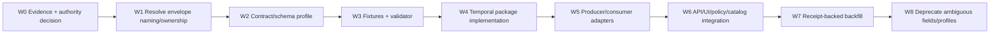

<!-- [KFM_META_BLOCK_V2]
doc_id: kfm://doc/adr/0014-temporal-vocabulary
adr_id: ADR-0014
title: "ADR-0014 — Temporal Vocabulary: Six Time Kinds Tracked"
type: adr
version: v1.3
status: proposed
owners:
  - "NEEDS VERIFICATION — architecture decision owner"
  - "NEEDS VERIFICATION — temporal and data-lifecycle steward"
  - "NEEDS VERIFICATION — contracts and schemas stewards"
  - "NEEDS VERIFICATION — catalog, release, API, UI, and policy stewards"
owner_status: "CODEOWNERS routes review to @bartytime4life, but stewardship assignments, decision quorum, separation of duties, and acceptance authority were not verified"
reviewers_required:
  - Architecture steward
  - Docs steward
  - Temporal and data-lifecycle steward
  - Contracts and schemas stewards
  - Evidence, catalog, release, and correction stewards
  - Governed API and Explorer Web maintainers
  - Policy, validation, migration, and affected-domain reviewers
created: 2026-05-11
updated: 2026-08-14
policy_label: public
truth_posture: cite-or-abstain
responsibility_root: docs/
current_path: docs/adr/ADR-0014-temporal-vocabulary--six-time-kinds-tracked.md
supersedes: []
superseded_by: null
evidence_snapshot:
  repository: bartytime4life/Kansas-Frontier-Matrix
  base_ref: main
  base_commit: 5eef168a4ca161f84a7d90dfe3ebfccc8a4bfeac
  target_prior_blob: 8ec2b71a1f1a19f7632b9379feb0c1596b3e4dc4
  adr_index_blob: 938c5894c36b99e14810918e2c550ab0e92d53b1
  adr_readme_blob: 793015c38f4066c2c23753d4e3dd26bcc890279d
  directory_rules_blob: fd49a0b83e55cef52c1124281f093e263526898d
  directory_rules_adoption_adr_blob: a4de0d7a96b78da59cfc499d1025e1508afd8dd9
  time_aware_doctrine_blob: 63a7be5d4a8b2eeade245c6c1d3ddfc255f23615
  temporal_package_readme_blob: 93937cbba57c7653b66c61128a3c4a0dfc052ba2
  temporal_package_core_blob: 73f035005b9114c9c364d3685afc9ef01458da8c
  temporal_window_contract_blob: f22a768aef8aa7cc717cfd78cb3a98b22c9b1c5b
  temporal_window_schema_blob: 70b96839615551164d3964596dea238c33709616
  temporal_window_validator_blob: 0574d3003ea5b3f3463305e855ed84a7ec9f4a03
  temporal_window_fixture_index_blob: 254be73d6d80ea15775bbeeda1b7770f3435fce1
  temporal_window_fixture_readme_blob: 96e44a50b2cc6526671c6b3e35d741624560b067
  temporal_window_tests_blob: 255f0c434c7fd6f1322e5f9004435eb0b3236d10
  temporal_window_workflow_blob: 0d9d3aa77f9c8bb17f4d33fd99f7a9c4ffd638e2
  common_temporal_authority_contract_blob: 3a5260afcbe656c9608692a92054cb5120f560a9
  common_temporal_authority_schema_blob: 644aa72abf16e8b120e159019306e8641af8ea6c
  common_temporal_authority_validator_blob: b8519d8b2ba55e9888f9391f9e3a440d34c14f1e
  common_temporal_authority_fixture_readme_blob: 067e58589e4fcd9869c530a4138068423be56c2f
  common_temporal_authority_tests_blob: d1826d934fa1d5e286fd74c95ade6d0adca6146a
  briefing_integration_workflow_blob: e20c0960bbc4e7aac7b3eaecd5cf68ef332e8da0
  evidence_temporal_authority_contract_blob: 316d42b374563e6c191b7d945f3755a6d3243731
  evidence_temporal_authority_schema_blob: 0dd9839712f77914f3c3622666560e2122feaf0b
  evidence_temporal_authority_validator_blob: 99ee1d3a9c98f171f5bfbb216553fb51ba8c0bf1
  evidence_temporal_authority_tests_blob: 982a870f2968083a0958df59eabad90b31fba8a0
  evidence_temporal_authority_workflow_blob: 1e57326046b755938177ee3551c39a6188b48b27
  codeowners_blob: dd2a84aa514d8ecd9208bc347f90f9a2ed37dd61
inspection_boundary: >
  Current-session GitHub reads covered the canonical ADR inventory, ADR operating
  guidance, the accepted Directory Rules adoption record, time-awareness doctrine,
  the temporal package scaffold, TemporalWindow contract/schema/validator/fixtures/
  tests/workflow and recent hosted run evidence, both same-named
  TemporalAuthorityEnvelope contract/schema families and their validator/test/workflow
  surfaces, and CODEOWNERS. No complete clone, exhaustive producer/consumer graph,
  database migration rehearsal, API/UI runtime request, policy evaluation, release,
  correction, rollback drill, deployment, or publication was exercised.
related:
  - docs/adr/README.md
  - docs/adr/INDEX.md
  - docs/adr/ADR-0001-schema-home--schemas-contracts-v1-is-canonical.md
  - docs/adr/ADR-0002-contracts-vs-schemas-split.md
  - docs/adr/ADR-0013-spec_hash-and-run_id-identity-grammar.md
  - docs/adr/ADR-0018-promotion-gate-sequence.md
  - docs/adr/ADR-0020-abstain-is-a-first-class-decision.md
  - docs/adr/ADR-0029-adopt-directory-governance-standard-v2.md
  - docs/doctrine/directory-rules.md
  - docs/doctrine/time-aware.md
  - docs/doctrine/lifecycle-law.md
  - docs/doctrine/truth-posture.md
  - docs/architecture/contract-schema-policy-split.md
  - contracts/common/temporal_window.md
  - schemas/contracts/v1/common/temporal_window.schema.json
  - tools/validators/validate_temporal_window.py
  - fixtures/contracts/v1/common/temporal_window/README.md
  - tests/validators/test_validate_temporal_window.py
  - .github/workflows/temporal-window-validation.yml
  - contracts/common/temporal_authority_envelope.md
  - schemas/contracts/v1/common/temporal_authority_envelope.schema.json
  - tools/validators/validate_temporal_authority_envelope.py
  - contracts/evidence/temporal_authority_envelope.md
  - schemas/contracts/v1/evidence/temporal_authority_envelope.schema.json
  - tools/validators/evidence/validate_temporal_authority_envelope.py
  - packages/temporal/README.md
tags: [kfm, adr, temporal, time-kind, provenance, lifecycle, bitemporal, correction, release, compatibility, migration, parallel-authority]
notes:
  - "v1.3 is a same-path current-evidence refresh. It preserves ADR-0014 status `proposed`; it does not accept the decision or change temporal behavior."
  - "The canonical ADR index uniquely assigns ADR-0014 to this exact path."
  - "The bounded TemporalWindow validator, non-vacuous fixture family, focused tests, and read-only workflow are now implemented; they validate the existing incompatible TemporalWindow profile and do not close the ADR vocabulary decision."
  - "Current repository evidence now contains at least five non-equivalent temporal profiles: ADR-0014, TemporalWindow, time-awareness doctrine, the common TemporalAuthorityEnvelope profile, and the evidence TemporalAuthorityEnvelope profile."
  - "Two same-named TemporalAuthorityEnvelope contract/schema families exist under `common/` and `evidence/` with materially different fields, source-role semantics, freshness behavior, validators, fixtures, and workflows. Their authority relationship is CONFLICTED and unresolved here."
  - "packages/temporal remains a version 0.0.0 scaffold; core.py is a one-line placeholder and no shared runtime helper API is established."
  - "This document creates no schema, contract, fixture, validator, package API, policy, migration, release object, public route, or publication effect."
[/KFM_META_BLOCK_V2] -->

<a id="top"></a>

# ADR-0014 — Temporal Vocabulary: Six Time Kinds Tracked

> **Proposed decision.** KFM will use six stable, cross-system identifiers for claim-, provenance-, decision-, publication-, and correction-bearing time: `source_time`, `observed_time`, `ingested_time`, `decision_time`, `published_time`, and `retraction_time`. A timestamp's kind is part of its meaning; no evidence-bearing or public-trust surface may silently collapse these identifiers into an unlabeled `timestamp`, `date`, or `time`.

[](#1-status-and-authority)
[](#11-current-repository-evidence-snapshot)
[](#12-three-non-equivalent-repository-vocabularies)
[](#121-current-validation-state)
[](#13-temporalauthorityenvelope-parallel-authority-conflict)
[](#14-current-implementation-maturity)
[](#11-current-repository-evidence-snapshot)

> [!IMPORTANT]
> **Repository presence, executable validation, and a green component step do not equal decision acceptance.** KFM now has an indexed ADR, an accepted Directory Rules authority, a `packages/temporal/` scaffold, an executable `TemporalWindow` validation slice, and two executable but incompatible `TemporalAuthorityEnvelope` profiles. Those surfaces do not agree. This ADR remains `proposed`, and no implementation may select or translate a vocabulary merely because it is checked in or tested.

> [!WARNING]
> **The repository currently has two same-named `TemporalAuthorityEnvelope` families.** One lives under `contracts/common/` and `schemas/contracts/v1/common/`; the other lives under `contracts/evidence/` and `schemas/contracts/v1/evidence/`. They are not mirrors and do not share a shape. Until an authority, compatibility, and migration decision is reviewed, neither profile may silently stand in for the other or for this ADR.

> [!CAUTION]
> **The six identifiers are not a complete ontology of all temporal meaning.** Domain validity intervals, legal effective periods, forecast horizons, source issue dates, retrieval telemetry, freshness deadlines, correction reasons, and supersession relationships may require explicit roles or subordinate contracts. They must not be hidden by forcing every temporal concept into one of the six global identifiers without a reviewed, loss-aware crosswalk.

**Quick navigation:** [Status](#1-status-and-authority) · [Context](#2-context) · [Decision](#3-decision) · [Six kinds](#4-the-six-global-time-kind-identifiers) · [Lifecycle](#5-lifecycle-and-event-ordering) · [Compatibility](#6-contract-schema-and-doctrine-reconciliation) · [Field profile](#7-proposed-temporal-assertion-profile) · [Authority](#8-recording-and-authority-boundaries) · [Consumers](#9-api-ui-policy-and-catalog-implications) · [Consequences](#10-consequences-and-risks) · [Alternatives](#11-alternatives-considered) · [Validation](#12-validation-acceptance-and-migration) · [Rollback](#13-rollback-and-supersession) · [Open work](#14-open-questions-and-verification-backlog) · [Examples](#appendix-a--illustrative-worked-examples) · [Crosswalks](#appendix-b--non-authoritative-crosswalks) · [Ledger](#appendix-c--no-loss-modernization-ledger) · [Glossary](#appendix-d--glossary)

---

<a id="1-status-and-authority"></a>

## 1. Status and authority

| Field | Current value |
|---|---|
| **ADR ID** | `ADR-0014` — unique and confirmed in [`docs/adr/INDEX.md`](./INDEX.md) |
| **Tracked path** | `docs/adr/ADR-0014-temporal-vocabulary--six-time-kinds-tracked.md` |
| **Source metadata** | `proposed` |
| **Effective decision status** | `proposed` — not binding as accepted architecture |
| **Decision class** | Shared temporal vocabulary, provenance/release semantics, compatibility, migration, and public-trust rendering |
| **Decision scope** | Six global time-kind identifiers and the rules required to preserve their meaning |
| **Non-goals** | Accepting a schema, choosing between parallel envelope profiles, implementing a package, replacing domain validity models, selecting external standards wholesale, or proving runtime behavior |
| **Publication effect** | None. An ADR edit, commit, pull request, merge, schema, package, validator, fixture, workflow, or badge does not publish KFM data. |
| **Directory Rules basis** | Accepted ADR-0029 adopts the exact Directory Rules bytes at `docs/doctrine/directory-rules.md`; `docs/adr/` owns decisions, `contracts/` meaning, `schemas/` shape, `packages/` shared implementation, `tools/validators/` validators, and `fixtures/` plus `tests/` enforceability evidence. |
| **Rollback target for this document** | Prior blob `8ec2b71a1f1a19f7632b9379feb0c1596b3e4dc4` |

<a id="11-current-repository-evidence-snapshot"></a>

### 1.1 Current repository evidence snapshot

The findings below are **CONFIRMED at `main@5eef168a4ca161f84a7d90dfe3ebfccc8a4bfeac`** unless marked otherwise.

| Surface | Verified state | What it proves—and does not prove |
|---|---|---|
| [`docs/adr/INDEX.md`](./INDEX.md) | ADR-0014 is uniquely assigned to this exact path; source and effective status are `proposed`. | Proves identity and conservative status normalization; does not accept the decision. |
| [`docs/adr/README.md`](./README.md) | ADR-0029 is the only accepted numbered ADR; the remaining 33 numbered records are proposed. | Proves the current ADR operating posture; not implementation or review completion for ADR-0014. |
| [ADR-0029](./ADR-0029-adopt-directory-governance-standard-v2.md) and [Directory Rules](../doctrine/directory-rules.md) | ADR-0029 accepts the exact Directory Rules blob at the canonical doctrine path. | Establishes placement authority and no-parallel-authority rules; does not settle temporal meaning. |
| [`docs/doctrine/time-aware.md`](../doctrine/time-aware.md) | Draft doctrine names seven dimensions: source, observed, valid, retrieval, release, correction, and transaction time; it also requires explicit calendars, timezone posture, and uncertainty. | Proves a non-equivalent doctrine profile exists; not reconciliation or runtime behavior. |
| [`packages/temporal/README.md`](../../packages/temporal/README.md) | Package is `kfm-temporal` version `0.0.0`; the README classifies it as a scaffold with no confirmed runtime API. | Proves package presence and bounded intent; not parsing, comparison, normalization, or consumer integration. |
| [`packages/temporal/src/temporal/core.py`](../../packages/temporal/src/temporal/core.py) | One-line greenfield-placeholder comment. | Proves implementation is absent at that file; not a complete repository-wide absence attestation. |
| [`contracts/common/temporal_window.md`](../../contracts/common/temporal_window.md) | v0.3 draft contract for `start`, `end`, and a closed `time_kind`; explicitly preserves the ADR conflict. | Proves a current contract surface and bounded validation profile; not acceptance or a lossless six-kind mapping. |
| [`temporal_window.schema.json`](../../schemas/contracts/v1/common/temporal_window.schema.json) | Proposed schema enum remains `observed`, `published`, `ingested`, `effective`, `corrected`, `superseded`. | Proves the machine profile still conflicts with this ADR. |
| [`validate_temporal_window.py`](../../tools/validators/validate_temporal_window.py) | Executable bounded no-network validator checks safe file handling, JSON/schema shape, timezone-aware date-times, and UTC-normalized interval ordering. | Proves only its declared shape-and-order boundary; not vocabulary reconciliation, evidence, policy, release, or publication. |
| [`fixtures/contracts/v1/common/temporal_window/`](../../fixtures/contracts/v1/common/temporal_window/README.md) and focused tests | Two valid, three schema-invalid, and two semantic-invalid cases are documented; focused tests cover polarity, no-network behavior, bounded parsing, deterministic diagnostics, offsets, and unsafe inputs. | Proves non-vacuous fixture and validator coverage for the current TemporalWindow profile; not six-kind acceptance. |
| [`temporal-window-validation.yml`](../../.github/workflows/temporal-window-validation.yml) | Read-only workflow exists. Run `31654971252` completed successfully at `main@3911c519…`. | Proves one hosted success for that earlier revision; not current-head required-check coupling or ADR acceptance. |
| [`contracts/common/temporal_authority_envelope.md`](../../contracts/common/temporal_authority_envelope.md) and paired common schema | Proposed shared metadata envelope with eight explicit time roles, SourceDescriptor-bound source role, append-only lineage, and `public_use_allowed=false`. | Proves one executable proposed envelope profile; not canonical authority or release readiness. |
| Common TemporalAuthorityEnvelope validator, fixtures, and tests | Bounded no-network validator points to the common schema; fixture README records four valid, seven schema-invalid, and seven semantic-invalid cases. | Proves a substantial validation slice for the common profile; not equivalence to this ADR or the evidence profile. |
| [`briefing-integration.yml`](../../.github/workflows/briefing-integration.yml) | Read-only workflow includes common-envelope tests and fixtures. In run `31654973332`, both TemporalAuthorityEnvelope steps passed; the job failed later at an unrelated advisory authoring-receipt step. | Proves those component steps passed at `main@3911c519…`; not an overall green workflow or current-head proof. |
| [`contracts/evidence/temporal_authority_envelope.md`](../../contracts/evidence/temporal_authority_envelope.md) and paired evidence schema | Separate proposed evidence-support envelope with seven time roles, embedded source-role enum, temporal posture, and freshness deadline. | Proves a second same-named, non-equivalent contract/schema family exists. |
| Evidence TemporalAuthorityEnvelope validator, fixtures, tests, and dedicated workflow | A second validator and small focused test surface exist; dedicated workflow `temporal-authority-envelope.yml` has no recorded main-branch runs in the inspected API response. | Proves implementation presence; hosted behavior and parity with the common profile remain unverified. |
| [`.github/CODEOWNERS`](../../.github/CODEOWNERS) | Routes affected roots to `@bartytime4life`. | Proves review routing only; not stewardship, quorum, approval, acceptance, or separation of duties. |

<a id="12-three-non-equivalent-repository-vocabularies"></a>

### 1.2 Five non-equivalent temporal profiles now coexist

The legacy anchor remains `#12-three-non-equivalent-repository-vocabularies` so inbound links from v1.2 continue to resolve.

| Surface | Current identifiers, dimensions, or roles | Status | Conflict |
|---|---|---|---|
| **ADR-0014** | `source_time`, `observed_time`, `ingested_time`, `decision_time`, `published_time`, `retraction_time` | Proposed decision | Six global provenance/governance/publication identifiers. |
| **TemporalWindow schema** | `observed`, `published`, `ingested`, `effective`, `corrected`, `superseded` | Proposed schema with executable validator | Mixes event kind, validity role, and correction/supersession state; not a lossless rename of ADR identifiers. |
| **Time-Awareness doctrine** | source, observed, valid, retrieval, release, correction, transaction | Draft doctrine | Seven dimensions; distinguishes valid and retrieval time that this ADR does not name globally. |
| **Common TemporalAuthorityEnvelope** | `issued_at`, `effective_at`, `valid_from`, `valid_to`, `observed_at`, `retrieved_at`, `corrected_at`, `superseded_at` | Proposed contract/schema with bounded validator | Eight role fields; no decision or release time; retrieval is not governed ingestion. |
| **Evidence TemporalAuthorityEnvelope** | `observed_at`, `valid_from`, `valid_to`, `source_updated_at`, `retrieved_at`, `released_at`, `corrected_at`; plus `freshness_deadline` and temporal posture | Proposed contract/schema with separate validator | Seven role fields plus freshness state; uses `released_at`, not `published_time`, and embeds a separate source-role enum. |

> [!WARNING]
> **Acceptance blocker.** These profiles overlap, but they are not interchangeable. No package, migration, validator, API, UI, catalog emitter, policy rule, or generated adapter may silently translate between them. ADR acceptance requires an explicit authority and compatibility decision plus negative tests for ambiguous mappings.

<a id="13-temporalauthorityenvelope-parallel-authority-conflict"></a>

### 1.3 `TemporalAuthorityEnvelope` parallel-authority conflict

The repository currently uses one object-family name for two materially different authority surfaces.

| Dimension | `common/` profile | `evidence/` profile |
|---|---|---|
| Contract home | `contracts/common/temporal_authority_envelope.md` | `contracts/evidence/temporal_authority_envelope.md` |
| Schema home | `schemas/contracts/v1/common/temporal_authority_envelope.schema.json` | `schemas/contracts/v1/evidence/temporal_authority_envelope.schema.json` |
| Primary role | Shared metadata wrapper around a domain-native object | Evidence-support/freshness envelope for a subject |
| Source role | Reference bound to a SourceDescriptor field | Embedded uppercase enum |
| Time model | Eight explicit role fields | Seven explicit role fields plus freshness deadline |
| State model | Native/normalized state and certainty | `CURRENT`, `STALE`, `SUPERSEDED`, `WITHDRAWN`, `UNKNOWN` posture |
| Public posture | `public_use_allowed` fixed to `false` | Public carrier use described only with separate evidence/policy/release objects |
| Validator | Bounded safe-file, deterministic no-network profile | Separate simpler validator with wall-clock `datetime.now()` freshness evaluation |
| Fixture/test depth | Four valid, seven schema-invalid, seven semantic-invalid; broad focused tests | One named valid example and a smaller negative/test surface in inspected files |
| Hosted workflow evidence | Common profile steps passed inside an overall failing briefing run | Dedicated workflow exists; no main runs returned by inspected workflow API |

**Current classification:** `CONFLICTED / NEEDS VERIFICATION`.

This ADR does not choose a winner, rename either family, or authorize migration. Before either path is treated as canonical, reviewers must identify the intended object boundary, owning contract root, schema authority, consumer set, compatibility requirements, alias window, deterministic freshness semantics, and rollback plan. Accepted Directory Rules prohibit allowing both writable homes to harden into competing authority.

<a id="14-current-implementation-maturity"></a>

### 1.4 Current implementation maturity

| Capability | Current posture |
|---|---|
| Six-kind semantic contract | **PROPOSED / not established as canonical** |
| Six-kind JSON Schema | **Absent at an accepted, verified path** |
| TemporalWindow contract/schema | **CONFIRMED present; proposed; incompatible vocabulary profile** |
| TemporalWindow validator/fixtures/tests | **CONFIRMED implemented for bounded shape, timezone, and ordering** |
| Common TemporalAuthorityEnvelope profile | **CONFIRMED implemented as a proposed fixture-first profile; authority not settled** |
| Evidence TemporalAuthorityEnvelope profile | **CONFIRMED implemented as a second proposed profile; authority not settled** |
| Temporal package | **CONFIRMED scaffold** |
| Cross-profile vocabulary/role crosswalk | **Not established as accepted machine-readable authority** |
| Duplicate envelope migration plan | **Not established** |
| API integration | **UNKNOWN / not proven** |
| UI integration | **UNKNOWN / not proven** |
| Policy enforcement | **UNKNOWN / not proven** |
| Catalog/STAC/DCAT/PROV mapping | **PROPOSED / not proven** |
| Receipt-backed data migration and rollback | **Not established** |

---

<a id="2-context"></a>

## 2. Context

KFM is time-aware because one record can carry several distinct temporal claims:

1. When does a source say a phenomenon occurred or applied?
2. When was it actually observed, measured, sampled, or detected?
3. When did KFM retrieve the source state, and when did it govern admission into the lifecycle?
4. When did a rule, advisory, forecast, boundary, or record become valid or effective?
5. When did KFM make a policy, review, promotion, denial, abstention, correction, or rollback decision?
6. When did KFM release the relevant version to a public or semi-public surface?
7. When did KFM retract, withdraw, supersede, correct, or roll back that released state?
8. At what evaluation time was freshness or current-state posture assessed?

Collapsing those questions into one field causes concrete failures:

- a source publication date may be mistaken for the date of the event it describes;
- an ingest timestamp may be mistaken for observation time;
- a network retrieval timestamp may be mistaken for governed admission;
- a future validity date may be rejected by a naive universal ordering chain;
- a schema-valid date may be mistaken for release approval;
- a correction date may be mistaken for erasure of the earlier assertion;
- a freshness deadline evaluated against the machine clock may produce non-replayable results;
- a UI slider may filter world-time while labeling it simply “date”;
- a catalog update timestamp may be mistaken for KFM publication time;
- a backfill may fabricate system history by copying file modification or commit times;
- two same-named envelope objects may be joined even though their fields and authority differ.

This ADR preserves the original six-kind decision but narrows its role. The six identifiers are best understood as a **global provenance/publication classification layer**, not a complete replacement for domain validity, temporal-window, source-role, freshness, correction, or interval semantics.

### 2.1 Why six global identifiers still help

A stable global layer can prevent common trust failures:

- public queries can state which time kind they filter;
- receipts and release records can expose lifecycle ordering without hiding source/observation time;
- Evidence Drawer can distinguish source assertions from KFM decisions and release state;
- corrections can preserve original publication history while adding governed retraction facts;
- adapters can reject ambiguous mappings rather than inventing one;
- domain-specific roles can remain explicit without every domain inventing a different word for KFM publication or retraction.

### 2.2 Why the six identifiers are not sufficient by themselves

They do not fully encode:

- valid/effective intervals;
- source issue/update roles;
- forecast creation, valid, and horizon times;
- retrieval telemetry;
- transaction-time details inside a database or event ledger;
- calendar, precision, uncertainty, recurrence, or open interval semantics;
- temporal relations such as overlaps, before, during, or meets;
- correction reason, withdrawal cause, supersession target, or erasure duty;
- freshness policy or the explicit time at which freshness was evaluated.

Those concerns require subordinate contracts and reviewed crosswalks.

---

<a id="3-decision"></a>

## 3. Decision

> **Decision proposed by ADR-0014:** reserve the following six identifiers as KFM-wide temporal kinds: `source_time`, `observed_time`, `ingested_time`, `decision_time`, `published_time`, and `retraction_time`.

### 3.1 Scope of the closed identifier set

The six names are closed only for the **global time-kind field**. They do not prohibit additional fields such as `role`, `validity_window`, `retrieved_at`, `freshness_evaluated_at`, `precision`, `uncertainty`, `timezone`, `calendar`, `event_ref`, `evidence_refs`, or `authority_ref`.

### 3.2 Required separation of concerns

A conforming design separates at least these axes:

| Axis | Question answered | Example |
|---|---|---|
| **Global kind** | Which broad provenance/publication boundary does this assertion represent? | `decision_time` |
| **Temporal role** | What event or domain meaning does it carry? | `promotion_decision`, `legal_effective`, `forecast_horizon` |
| **Value shape** | Is it an instant, civil date, interval, recurring set, or uncertain expression? | closed-open interval |
| **Event discriminator** | What happened? | correction, withdrawal, supersession, rollback |
| **Telemetry** | When did a technical operation occur? | HTTP retrieval or cache write |
| **Freshness evaluation** | At what explicit as-of time was currentness assessed? | `2026-08-14T18:00:00Z` |
| **External crosswalk** | How does a standard-specific property map? | STAC `datetime` to an observation role |

### 3.3 Normative proposed rules

- **T-01 — No unlabeled trust-bearing time.** A consequential timestamp or interval must identify its global kind or a reviewed temporal role/profile.
- **T-02 — Source and observation remain distinct.** Source statement time is not automatically observation time.
- **T-03 — Retrieval and ingestion remain distinct.** Network capture telemetry is not automatically governed admission into KFM.
- **T-04 — Decision time requires a decision object.** A commit, test, or generated timestamp is not a policy/review/promotion decision.
- **T-05 — Publication time is KFM release time.** Source issue/publication time requires a source role and must not be mapped automatically to `published_time`.
- **T-06 — Retraction preserves history.** `retraction_time` records a governed public-state change; it is not deletion or silent overwrite.
- **T-07 — Validity is explicit.** Effective, valid, forecast, and applicability windows use accepted role/window semantics rather than being forced into a global kind.
- **T-08 — Evidence or authority support is required.** Source/world assertions resolve to evidence; system-side assertions resolve to receipts, decisions, manifests, notices, or rollback records.
- **T-09 — Precision is never increased without evidence.** Date-only, month-only, approximate, disputed, or historical values remain at supported precision.
- **T-10 — Timezone and calendar posture are explicit.** No implicit wall-clock zone; non-Gregorian dates retain calendar identity.
- **T-11 — Ordering is event-scoped.** Chronology checks operate inside one identified artifact/version/transition lineage and only across comparable roles.
- **T-12 — No fabricated backfill.** File mtimes, commit times, issue timestamps, or neighboring fields cannot substitute for unknown historical temporal facts.
- **T-13 — Translation is versioned and loss-aware.** Every crosswalk records source profile, target profile, cardinality, ambiguity, and migration version.
- **T-14 — Freshness evaluation is replayable.** A validator or policy decision that depends on “now” must accept or emit an explicit evaluation time and authority/receipt context.
- **T-15 — Same name does not imply same object.** Two `TemporalAuthorityEnvelope` profiles cannot be joined or substituted without an accepted authority and compatibility decision.
- **T-16 — Validators do not confer authority.** Passing a shape, ordering, freshness, or lineage check does not establish evidence truth, source admission, policy approval, release, or publication.

---

<a id="4-the-six-global-time-kind-identifiers"></a>

## 4. The six global time-kind identifiers

| Identifier | Proposed meaning | Typical support | Must not be used for |
|---|---|---|---|
| `source_time` | Time asserted by the source about the phenomenon, source statement, or applicability context, qualified by role. | EvidenceRef/EvidenceBundle and SourceDescriptor context | KFM retrieval, admission, decision, or release merely because the field exists in source data |
| `observed_time` | Time an observation, measurement, sample, detection, or testimony applies to. | Observation evidence, method/instrument context, precision and uncertainty | Source issue time, retrieval time, model run time, or inferred validity without explicit role |
| `ingested_time` | Time KFM admitted a source artifact or record into the governed lifecycle under an ingest/event/run receipt. | EventRunReceipt, IngestReceipt, or equivalent governed admission object | Raw HTTP retrieval, filesystem creation, or commit time without admission evidence |
| `decision_time` | Time a governed policy, review, promotion, denial, abstention, correction, or rollback decision became recorded/effective in its decision context. | PolicyDecision, ReviewRecord, PromotionDecision, DecisionEnvelope, or equivalent | Arbitrary code execution, test completion, or assistant generation time |
| `published_time` | Time a reviewed KFM release became available to its intended public or semi-public audience. | ReleaseManifest and release/publication receipt | Source publication, catalog modification, PR merge, or deployment start without release evidence |
| `retraction_time` | Time a governed public state was withdrawn, invalidated, superseded for current use, corrected through rollback, or otherwise removed from active release, with event role. | CorrectionNotice, WithdrawalNotice, RollbackCard, successor ReleaseManifest, and execution evidence | Deleting historical evidence, hiding correction lineage, or treating every source correction as KFM retraction |

<a id="41-source-time"></a>

### 4.1 `source_time`

`source_time` requires a role because sources can expose event time, issue time, update time, legal effective time, or validity interval. A source's own “published” field does not become KFM `published_time` automatically.

<a id="42-observed-time"></a>

### 4.2 `observed_time`

Observation support must retain method, instrument/observer, spatial support, precision, timezone/calendar posture, and uncertainty. A model output or aggregate remains modeled/aggregate support even when it carries an observation-shaped timestamp.

<a id="43-ingested-time"></a>

### 4.3 `ingested_time`

This is a governed lifecycle boundary. `retrieved_at`, download completion, cache time, object-store creation, or Git commit time may be operational telemetry but are not governed admission unless the accepted ingest contract says so and a receipt binds the transition.

<a id="44-decision-time"></a>

### 4.4 `decision_time`

Multiple decisions can exist for one candidate. Policy evaluation, human review, promotion, correction, and rollback are distinct episodes. The global kind may remain `decision_time` while `role`, decision object type, decision ID, and event reference preserve the discriminator.

<a id="45-published-time"></a>

### 4.5 `published_time`

KFM publication means a governed release state with evidence, policy, review, proof, manifest, correction, and rollback support appropriate to consequence. A merge, workflow success, storage write, CDN upload, source issue date, or catalog update is insufficient by itself.

<a id="46-retraction-time"></a>

### 4.6 `retraction_time`

Retraction is append-only public-state history. The event role distinguishes correction, withdrawal, supersession, rollback, expiry, and other accepted outcomes. Erasure or deletion duties are separate policy/legal operations and must not be represented as ordinary retraction without review.

---

<a id="5-lifecycle-and-event-ordering"></a>

## 5. Lifecycle and event ordering

### 5.1 Lifecycle placement

| Lifecycle stage or control surface | Relevant temporal facts |
|---|---|
| Pre-RAW/source edge | source event/issue/update role; retrieval attempt; source activation decision |
| RAW | verbatim source value, source calendar/zone posture, capture telemetry |
| WORK / QUARANTINE | parse attempt, uncertainty, candidate role, conflict reason, evaluation time |
| PROCESSED | normalized supported value/window, evidence binding, transform receipt |
| CATALOG / TRIPLETS | catalog/graph crosswalks, generated/invalidated times, temporal relations |
| PUBLISHED | `published_time`, release identity, release scope, manifest and rollback target |
| Correction / withdrawal / rollback | decision time, `retraction_time`, target release, successor lineage, propagation receipt |

### 5.2 Event-scoped ordering—not a universal chain

The following is a common transition pattern, not a law across unrelated facts:

```text
source/observed assertion
  -> governed admission
  -> one or more decisions
  -> one or more releases
  -> optional correction/retraction episode
```

A chronology rule may compare values only when:

1. the assertions belong to the same artifact/version/transition episode or an explicit lineage relation;
2. their roles are comparable;
3. precision, timezone, and calendar permit comparison;
4. uncertainty does not make the order indeterminate; and
5. the rule is defined by an accepted contract or policy.

Examples of valid non-monotonic-looking data:

- a forecast's validity period begins after retrieval;
- a newly ingested archive describes an event centuries earlier;
- a legal effective date occurs after source issue and KFM admission;
- multiple policy decisions precede one release;
- a corrected source assertion is retrieved after a prior KFM release but does not automatically retract it;
- a reprocessed artifact retains the same world-time while receiving new transaction and decision times.

### 5.3 Freshness is a separate policy concern

Temporal facts answer “when.” Freshness answers whether a source, evidence bundle, or release is current enough for a particular operation. Freshness evaluation must name:

- the policy/profile version;
- the evaluated object and version;
- the explicit `as_of` or evaluation instant;
- source cadence or deadline evidence;
- outcome and reason code; and
- decision/receipt identity.

A validator that calls the machine clock without injecting or recording the evaluation instant is not replay-stable.

---

<a id="6-contract-schema-and-doctrine-reconciliation"></a>

## 6. Contract, schema, and doctrine reconciliation

### 6.1 Conflict matrix

| Profile | Primary concern | Strength | Acceptance blocker |
|---|---|---|---|
| ADR-0014 | Global provenance/publication kind | Stable six-name proposal | Not paired to accepted contract/schema |
| TemporalWindow | Small interval carrier | Executable bounded validator and fixtures | Enum is non-equivalent and shape cannot carry role/evidence/authority |
| Time-Awareness doctrine | Broad temporal modeling | Rich dimensions, standards, calendar/uncertainty posture | Draft and not aligned to current executable profiles |
| Common TemporalAuthorityEnvelope | Shared object metadata and lineage | Strong bounded validator, SourceDescriptor-bound role, public-use false | Same name conflicts with evidence profile; no decision/release role |
| Evidence TemporalAuthorityEnvelope | Evidence/freshness posture | Explicit release/correction/freshness fields and dedicated workflow | Same name conflicts with common profile; embedded source-role enum; time-dependent validation |

<a id="62-current-temporalwindow-compatibility-crosswalk"></a>

### 6.2 Current `TemporalWindow` compatibility crosswalk

| Current enum | Candidate relation to ADR-0014 | Disposition |
|---|---|---|
| `observed` | `observed_time` | Potential one-to-one only when the window truly represents observation support. |
| `published` | `published_time` or source issue/publication role | **Ambiguous.** Owner context and release authority are required. |
| `ingested` | `ingested_time` | Potential one-to-one only when backed by governed admission, not retrieval telemetry. |
| `effective` | Valid/effective role or window | Not a direct global-kind alias. |
| `corrected` | `decision_time`, `retraction_time`, or source correction role | Ambiguous; requires event type, target, and public-state effect. |
| `superseded` | `retraction_time`, lineage role, or source supersession | Ambiguous; requires authority, target release/version, and event semantics. |

The existing validator proves the current schema's bounded shape and interval ordering. It cannot decide these mappings because mapping authority belongs to contracts, accepted ADRs, policy, and migration records.

### 6.3 Time-Awareness doctrine crosswalk

| Doctrine dimension | Candidate relation | Limitation |
|---|---|---|
| source | `source_time` plus role | Source issue/update/event/application meanings remain distinct. |
| observed | `observed_time` | Requires evidence/method support. |
| valid | Role/window semantics | Not safely reducible to one global kind. |
| retrieval | Operational telemetry | Not governed ingestion unless an accepted contract binds it. |
| release | `published_time` | Requires KFM ReleaseManifest context. |
| correction | `decision_time`, `retraction_time`, or source correction role | Depends on public-state effect. |
| transaction | `ingested_time`, `decision_time`, or ledger-specific system time | Requires a reviewed transaction boundary. |

### 6.4 Common TemporalAuthorityEnvelope crosswalk

| Common field | Candidate relation | Status |
|---|---|---|
| `issued_at` | `source_time` with `source_issued` role | Proposed; not observation or KFM publication. |
| `effective_at` | Valid/effective role | Not a global-kind alias. |
| `valid_from` / `valid_to` | Validity window | Not a global-kind alias. |
| `observed_at` | `observed_time` | Candidate mapping with evidence support. |
| `retrieved_at` | Retrieval telemetry | Must not become `ingested_time` automatically. |
| `corrected_at` | Source correction or governed correction role | Public-state effect determines kind. |
| `superseded_at` | Lineage or `retraction_time` role | Requires target and authority. |

### 6.5 Evidence TemporalAuthorityEnvelope crosswalk

| Evidence field | Candidate relation | Status |
|---|---|---|
| `observed_at` | `observed_time` | Candidate mapping with evidence support. |
| `valid_from` / `valid_to` | Validity window | Not a global-kind alias. |
| `source_updated_at` | `source_time` with update role | Not KFM decision or publication. |
| `retrieved_at` | Retrieval telemetry | Not governed ingestion automatically. |
| `released_at` | `published_time` only if it denotes a governed KFM release | Ambiguous without release identity and authority. |
| `corrected_at` | `decision_time`, `retraction_time`, or correction role | Depends on target and public-state effect. |
| `freshness_deadline` | Policy input | Requires explicit evaluation time; not a temporal kind. |

### 6.6 Proposed object separation

The smallest coherent target model is:

```text
TemporalAssertion
  = global kind
  + value or window
  + temporal role
  + precision and uncertainty
  + timezone and calendar
  + original representation
  + evidence or authority references
  + event/lineage reference
  + vocabulary version

TemporalWindow
  = reusable interval value object

TemporalAuthorityEnvelope
  = one reviewed shared wrapper profile, or two distinctly named object families

FreshnessAssessment
  = object/profile + explicit as_of + policy version + outcome + reason
```

The names above are **PROPOSED design targets**, not current schema truth.

### 6.7 Decision packet required before acceptance

Reviewers must decide, at minimum:

1. whether the six names remain the global kind vocabulary;
2. whether valid/effective time is a shared role vocabulary or domain-owned;
3. how retrieval differs from governed ingestion;
4. which `TemporalAuthorityEnvelope` profile owns the name and responsibility;
5. whether the non-selected profile is renamed, migrated, mirrored, or retired;
6. how freshness evaluation becomes deterministic and receipt-bearing;
7. whether `TemporalWindow` is versioned, adapted, or retained as an independent role-based carrier;
8. which contract/schema owns the accepted temporal assertion profile;
9. how existing consumers dual-read during migration; and
10. which tests prove ambiguous mappings fail closed.

---

<a id="7-proposed-temporal-assertion-profile"></a>

## 7. Proposed temporal assertion profile

The profile below preserves the original ADR intent while adding context needed to avoid lossy mappings. It is a design target, not current schema truth.

```json
{
  "id": "time:example:decision:001",
  "kind": "decision_time",
  "instant": "2026-08-14T18:00:00Z",
  "window": null,
  "role": "promotion_decision",
  "precision": "instant",
  "uncertainty": "asserted",
  "timezone": "UTC",
  "calendar": "gregorian",
  "original_value": "2026-08-14T18:00:00Z",
  "original_field": "decided_at",
  "evidence_refs": [],
  "authority_ref": "decision:promotion:example-001",
  "event_ref": "event:release-transition:example-001",
  "vocabulary_version": "adr-0014-proposed-v1",
  "notes": null
}
```

| Field family | Purpose | Acceptance requirement |
|---|---|---|
| Identity | Stable assertion ID and owning record/version | Deterministic or traceable identity profile |
| Global kind | One of the six identifiers | Closed enum only after ADR acceptance |
| Value/window | Instant, civil date, or interval | Exactly one reviewed representation; open/unknown posture explicit |
| Role | Domain/application discriminator | Versioned controlled vocabulary or owning contract |
| Precision | Supported granularity | Never increase during normalization without evidence |
| Uncertainty | Asserted, derived, inferred, disputed, approximate, unknown, or reviewed EDTF posture | Preserve source posture; parsing success is not confidence |
| Timezone/calendar | Explicit offset/IANA zone and calendar posture | No implicit wall-clock zone; non-Gregorian dates retain calendar |
| Original representation | Source value and field name | Required for non-trivial normalization and migration |
| Evidence support | Evidence refs for source/world assertions | Required for claim-bearing `source_time` and `observed_time` |
| Authority support | Receipt/decision/manifest/notice/rollback ref | Required for system-side assertions |
| Event identity | Joins ordering and concurrency checks to one transition episode | Required when ordering or compare-and-swap logic depends on it |
| Vocabulary version | Identifies profile/crosswalk version | Required for migration and replay |

### 7.1 Resolution, uncertainty, timezone, and calendar rules

- Date-only historical values must not be converted to midnight UTC merely to satisfy a date-time schema.
- A missing timezone means “not asserted” unless a governing contract supplies an explicit zone rule.
- Approximate and disputed values remain distinguishable.
- An interval's boundary convention must be explicit; a proposed default is closed-open `[start, end)` for machine comparison.
- Open intervals, recurring periods, and fuzzy dates require explicit contract support.
- Equality and ordering across different precision, calendar, or uncertainty profiles must use reviewed temporal helpers, not string comparison.
- Parsing success proves syntax only.
- Freshness checks must accept or emit an explicit `as_of` time rather than depend invisibly on wall-clock execution.

---

<a id="8-recording-and-authority-boundaries"></a>

## 8. Recording and authority boundaries

| Kind | Primary authority family | Current repository evidence | Implementation posture |
|---|---|---|---|
| `source_time` | SourceDescriptor, source record, EvidenceRef/EvidenceBundle | Evidence/source roots and two envelope profiles exist; global binding not proved. | Proposed. |
| `observed_time` | Observation/domain record plus EvidenceBundle | TemporalWindow and both envelope profiles have observation-like fields; semantics vary. | Proposed shared identifier. |
| `ingested_time` | Ingest/EventRun/RunReceipt | Receipt families exist; envelope profiles expose retrieval, not a shared governed-ingest binding. | Proposed. |
| `decision_time` | PolicyDecision, ReviewRecord, PromotionDecision, DecisionEnvelope | Decision/release contracts exist; current envelope profiles do not establish a shared binding. | Proposed. |
| `published_time` | ReleaseManifest and release/publication receipt | Evidence envelope has `released_at`; source-vs-KFM release ambiguity remains. | Proposed. |
| `retraction_time` | CorrectionNotice, WithdrawalNotice, RollbackCard plus execution evidence | Correction/supersession fields exist in multiple profiles; role and execution semantics vary. | Proposed. |

### 8.1 Directory Rules basis

Accepted Directory Rules route responsibilities as follows:

- Human decision record: `docs/adr/`.
- Semantic temporal meaning: `contracts/common/` or the owning domain/evidence/release contract after authority is resolved.
- Machine shape: `schemas/contracts/v1/common/` or the owning schema family after authority is resolved.
- Shared reusable implementation: `packages/temporal/`.
- Repository-wide validation: `tools/validators/`.
- Positive and negative examples: `fixtures/` and `tests/`.
- Admissibility/freshness/sensitivity rules: `policy/`.
- Process receipts: `data/receipts/`.
- Release/correction/rollback decisions: `release/`.

This ADR does not authorize a second temporal schema home, a root-level `temporal/` directory, a package-defined vocabulary, or continued parallel authority for two same-named envelope families.

### 8.2 Parallel-envelope disposition boundary

Because both envelope homes currently exist, the next authority-changing step must be one of the Directory Rules finite outcomes:

- `SPLIT` into distinctly named object families with separate owners;
- `MIGRATE` one profile into the selected canonical family with compatibility evidence;
- `MIRROR` only if one path becomes generated/read-only and a verified consumer requires it; or
- `HOLD` until ownership and consumer evidence are sufficient.

Treating both as writable canonical contracts is `DENY` under the no-parallel-authority rule.

---

<a id="9-api-ui-policy-and-catalog-implications"></a>

## 9. API, UI, policy, and catalog implications

### 9.1 Governed API

Once implemented:

- claim-bearing responses should identify the relevant global kind, role, precision, uncertainty, and vocabulary version;
- a time filter must state which kind or role it applies to;
- ambiguous default filtering should return a bounded error or require explicit selection;
- `ABSTAIN`, `DENY`, and `ERROR` responses may carry `decision_time` when a governed decision occurred;
- serializers must not infer `retraction_time` from artifact absence;
- source issue/update time, retrieval, KFM admission, KFM release, and freshness evaluation must remain distinct;
- API payloads must not expose both envelope profiles under one indistinguishable type name;
- internal storage paths and unreviewed temporal joins must not be exposed.

**Current posture:** no six-kind governed-API integration or envelope-profile convergence is claimed by this ADR.

### 9.2 Explorer Web and MapLibre surfaces

Once implemented:

- every time slider, timeline, chart, tooltip, compare view, and permalink states selected kind or role;
- corrected, retracted, superseded, withdrawn, stale, approximate, disputed, and unknown states remain visible;
- map animation must not imply observation continuity where only sparse assertions exist;
- `published_time` views resolve release/correction lineage;
- Evidence Drawer exposes source/observed time and decision/release/correction context without presenting all timestamps as equivalent;
- timezone/calendar/precision transformations are inspectable;
- freshness badges expose the policy and `as_of` time used;
- envelope profile and version remain available for debugging/migration without leaking internal paths to normal public clients.

### 9.3 Policy

Policy may evaluate:

- evidence support for `source_time` and `observed_time`;
- maximum uncertainty or minimum precision for an operation;
- freshness separately from temporal validity;
- embargo, delay, staged access, and sensitivity based on time and domain;
- required decision, release, correction, and rollback authority refs;
- impossible or ambiguous event-scoped ordering;
- public rendering obligations;
- whether a legacy envelope profile may be read, written, or exposed during migration.

Policy must not treat a valid timestamp, valid envelope, or passing freshness check as permission to expose a claim.

### 9.4 Catalog and external standards

STAC, DCAT, PROV-O, SQL application/system time, EDTF, OWL-Time, CIDOC CRM, Allen relations, and OGC API temporal filters are crosswalk targets. They are not replacements for the KFM vocabulary.

A crosswalk records:

- external standard and version;
- source field/property and object/profile version;
- KFM target kind and role;
- mapping cardinality;
- lossiness/ambiguity status;
- timezone/calendar/precision handling;
- evidence or authority requirements;
- validator and fixture references;
- migration, rollback, and supersession path.

---

<a id="10-consequences-and-risks"></a>

## 10. Consequences and risks

### 10.1 Positive consequences

- Source/world time, observation time, KFM admission, decision, release, and public correction become distinguishable.
- Replay, “as released,” and correction-lineage queries become more tractable.
- Evidence Drawer and Focus Mode can expose temporal support without turning file timestamps into truth.
- Policy and validation can reject ambiguous joins and unsupported chronology.
- Existing TemporalWindow and envelope validators become predecessor evidence rather than accidental architecture authority.
- External-standard mappings can be versioned rather than embedded as ad hoc aliases.
- The duplicate envelope conflict becomes visible before more consumers harden around incompatible shapes.

### 10.2 Costs and risks

| Risk | Why it matters | Required mitigation |
|---|---|---|
| Vocabulary conflict | At least five profiles disagree. | Accepted authority/crosswalk decision and negative migration tests. |
| Parallel envelope authority | Same object name exists in `common/` and `evidence/`. | Consumer inventory; `SPLIT`, `MIGRATE`, `MIRROR`, or `HOLD`; no dual writable canon. |
| Implemented-profile overclaim | Executable validators can appear to settle semantics. | Keep validator boundaries explicit; acceptance remains separate. |
| Six-kind overreach | Validity/effectivity/forecast semantics may be forced into wrong global kind. | Separate global kind from role/window semantics. |
| Source/publication ambiguity | `published` or `released_at` may mean source issue or KFM release. | Require owner context and explicit ReleaseManifest authority. |
| Retrieval/ingestion ambiguity | Network capture may be mislabeled governed admission. | Separate telemetry from `ingested_time`; bind admission to receipt. |
| Correction/retraction ambiguity | Draft correction, corrected assertion, supersession, withdrawal, and rollback differ. | Event discriminator, target refs, and public-state proof. |
| Universal monotonicity bug | Forecasts, archives, and replay violate naive chains. | Event-scoped ordering and comparability checks. |
| Wall-clock freshness drift | Evidence validator uses `datetime.now()` for `CURRENT`. | Inject/record `as_of`; deterministic fixtures and replay tests. |
| Validator-profile divergence | Common and evidence validators differ in safety, diagnostics, and semantics. | One accepted validator contract or explicitly separate object families. |
| Backfill fabrication | File/commit times are tempting substitutes. | Receipt-backed migration and explicit unknowns. |
| Workflow illusion | Component steps can pass while overall workflow fails; dedicated workflow may never have run. | Report step, job, workflow, revision, and required-check status separately. |
| Package authority drift | Shared code may define semantics locally. | Package implements accepted contracts only. |
| UI temporal illusion | Animation and simplified labels imply certainty/continuity. | Trust-visible kind, role, precision, uncertainty, freshness, and correction state. |
| Breaking consumers | Renaming enums or envelope fields can silently break stored/API records. | Versioned adapters, dual-read transition, original-field preservation. |
| Standards drift | External property meanings and versions change. | Version-pinned crosswalk records and review. |
| Same-name type collision | Serializers or code generators may conflate two schemas. | Distinct `$id`, generated type names, registry uniqueness checks, and migration gate. |

---

<a id="11-alternatives-considered"></a>

## 11. Alternatives considered

| Alternative | Disposition | Reason |
|---|---|---|
| Keep one generic `timestamp`. | Rejected. | Destroys temporal meaning and trust-path auditability. |
| Adopt current TemporalWindow enum as the global vocabulary. | Rejected as-is. | Mixes global kinds, validity roles, and correction/supersession states. |
| Adopt the seven doctrine dimensions verbatim. | Deferred pending reconciliation. | Richer in valid/retrieval/transaction semantics but not paired to one accepted executable profile. |
| Adopt the common TemporalAuthorityEnvelope fields as the vocabulary. | Rejected as automatic authority. | Fields are roles inside a proposed wrapper and omit decision/publication boundaries. |
| Adopt the evidence TemporalAuthorityEnvelope fields/posture as the vocabulary. | Rejected as automatic authority. | Mixes evidence, freshness, release, source-role, and temporal concerns and conflicts with the common profile. |
| Keep both TemporalAuthorityEnvelope profiles indefinitely. | Rejected as canonical posture. | Same-name parallel writable authority violates Directory Rules and creates type/consumer ambiguity. |
| Adopt strict valid-time/transaction-time only. | Rejected as sole public vocabulary. | Too coarse for intake, decisions, publication, and retraction. |
| Make `effective_time` a seventh global kind. | Deferred. | May be better modeled as role/validity interval; requires domain evidence. |
| Split `decision_time` into many global kinds. | Rejected for now. | Decision object type and role can carry the discriminator. |
| Split `retraction_time` into correction/withdrawal/supersession/rollback kinds. | Rejected for now. | Release/correction objects should carry the discriminator; revisit if inadequate. |
| Adopt STAC/DCAT/PROV/SQL/EDTF directly. | Rejected as internal authority. | Each standard covers a different responsibility. |
| Let `packages/temporal/` decide pragmatically. | Rejected. | Shared implementation cannot become semantic or policy authority. |
| Delay all temporal work. | Rejected. | Existing conflicting profiles and same-name envelopes already create consumer risk. |

---

<a id="12-validation-acceptance-and-migration"></a>

## 12. Validation, acceptance, and migration

<a id="121-current-validation-state"></a>

### 12.1 Current validation state

| Surface | Current state | Safe conclusion |
|---|---|---|
| ADR index validator | Implemented repository surface; ADR-0014 identity is indexed. | Useful for file/H1/status coherence only. |
| TemporalWindow schema | Proposed, closed shape with six incompatible enum values. | Shape exists; semantic reconciliation absent. |
| TemporalWindow validator | Implemented bounded no-network parser/schema/order profile. | Validates current profile only. |
| TemporalWindow fixtures/tests | Non-vacuous valid/schema-invalid/semantic-invalid lanes and focused tests. | Strong predecessor evidence; not six-kind coverage. |
| TemporalWindow workflow | Read-only; prior main run `31654971252` succeeded at `3911c519…`. | Hosted success exists for an earlier revision; current required-check coupling not proved. |
| Common TemporalAuthorityEnvelope | Proposed contract/schema with bounded validator, substantial fixtures/tests, briefing workflow wiring. | Executable profile exists; authority conflict remains. |
| Common-envelope hosted steps | Tests and fixtures passed in run `31654973332`; overall job later failed elsewhere. | Component evidence only; not overall workflow green. |
| Evidence TemporalAuthorityEnvelope | Separate proposed contract/schema/validator/fixtures/tests/workflow. | Second executable profile exists. |
| Evidence-envelope hosted workflow | No main runs returned in inspected workflow API. | Hosted proof remains unestablished. |
| Temporal package | Version `0.0.0`; one-line core placeholder. | No shared runtime temporal behavior. |
| Policy/API/UI/catalog tests | Not established for this decision. | No enforcement claim. |

### 12.2 Acceptance gates

ADR-0014 must not move to `accepted` until reviewers close every applicable gate. `[x]` means current evidence closes only that gate; it does not imply acceptance.

- [x] **A — Identity:** exact filename, H1, ADR ID, source status, and index entry agree.
- [ ] **B — Decision scope:** reviewers accept six identifiers as global provenance/publication kinds, not a complete ontology.
- [ ] **C — Doctrine reconciliation:** relationship to the seven doctrine dimensions is accepted.
- [ ] **D — TemporalWindow reconciliation:** current enum receives an explicit versioned compatibility disposition.
- [ ] **E — Envelope authority:** the two same-named TemporalAuthorityEnvelope families receive an accepted `SPLIT`, `MIGRATE`, `MIRROR`, or other governed disposition.
- [ ] **F — Contract authority:** one accepted semantic object/profile owns six-kind meaning.
- [ ] **G — Schema authority:** one versioned machine shape pairs to that contract without parallel schema homes.
- [ ] **H — Six-kind fixture completeness:** non-empty valid and invalid lanes cover the accepted vocabulary; absence fails CI.
- [ ] **I — Six-kind validator implementation:** dedicated validator checks support, ambiguity, profile versioning, and accepted semantics.
- [ ] **J — Package implementation:** `packages/temporal/` exports only contract-backed deterministic behavior.
- [ ] **K — Event-scoped ordering:** rules identify artifact/version/transition scope and reject incomparable values.
- [ ] **L — Valid/effective/forecast roles:** non-global temporal roles have an accepted representation.
- [ ] **M — Timezone/calendar/uncertainty:** no implicit timezone; calendar and precision/uncertainty posture are defined.
- [ ] **N — Evidence/authority refs:** source-side and system-side support obligations are machine-testable.
- [ ] **O — Correction/retraction semantics:** correction, withdrawal, supersession, rollback, and erasure are distinguishable.
- [ ] **P — Deterministic freshness:** any freshness validator accepts/emits explicit evaluation time and replay evidence.
- [ ] **Q — Validator parity:** selected temporal profiles share accepted safety, diagnostic, and boundedness requirements.
- [ ] **R — Crosswalks:** STAC/DCAT/PROV/SQL/EDTF/OWL-Time mappings are versioned and negative-tested where used.
- [ ] **S — API/UI behavior:** kind/role/precision/freshness/correction state are visible and finite failures fail closed.
- [ ] **T — Migration:** dual-read/backfill/deprecation plan preserves original data and emits receipts.
- [ ] **U — Workflow evidence:** changed-area and required-check coupling are known; component, job, and workflow results are reported separately.
- [ ] **V — Ownership and review:** stewardship, reviewer burden, separation of duties, and rollback authority are verified beyond CODEOWNERS routing.

### 12.3 Predecessor validation evidence

| Slice | Evidence achieved | What remains open |
|---|---|---|
| TemporalWindow | Bounded validator; 2 valid, 3 schema-invalid, 2 semantic-invalid fixtures; focused tests; prior hosted success. | Vocabulary mapping, role/evidence fields, migration, accepted contract/schema. |
| Common TemporalAuthorityEnvelope | Bounded validator; 4 valid, 7 schema-invalid, 7 semantic-invalid fixtures; broad tests; hosted component-step success. | Canonical name/authority, six-kind mapping, current overall workflow green, consumer inventory. |
| Evidence TemporalAuthorityEnvelope | Schema, validator, valid/invalid fixtures, three focused tests, dedicated workflow file. | Hosted runs, deterministic clock, validator hardening, compatibility with common profile. |
| Temporal package | README and package scaffold. | Runtime API, tests, adapters, consumers, accepted semantic dependency. |

### 12.4 Target test matrix

| Test class | Required cases |
|---|---|
| Schema | All six kinds; invalid unknown kind; exactly-one instant/window; timezone/calendar/precision/uncertainty; closed properties where accepted. |
| Semantic | Source vs observation; source issue vs KFM publication; retrieval vs ingestion; effective/valid role; correction vs retraction. |
| Ordering | Valid transition chain; multiple decisions; multiple publications; forecast future-time; incomparable precision; timezone mismatch; replay. |
| Support | Missing EvidenceRef; unresolved EvidenceBundle; missing receipt/decision/manifest/notice; wrong target release. |
| Compatibility | Every TemporalWindow enum; every doctrine dimension; both envelope profiles; ambiguous mappings reject. |
| Envelope authority | Same-name schema collision; canonical/mirror write denial; alias versioning; consumer migration. |
| Freshness | Explicit `as_of`; fixed-clock replay; elapsed deadline; future deadline; missing policy version. |
| Fixtures | At least one valid and one invalid case per critical rule; expected-error sidecars or stable reason codes. |
| Package | Deterministic parsing/serialization; no implicit timezone; no silent conversion; idempotent adapters. |
| API | Explicit kind/role; ambiguous filter failure; finite outcomes; no raw/internal path exposure. |
| UI | Kind-labeled slider; precision/uncertainty/freshness rendering; corrected/retracted states; permalink vocabulary version. |
| Catalog | Version-pinned STAC/DCAT/PROV crosswalk; no catalog-update timestamp substituted for release time. |
| Migration | Dual-read; original-field preservation; idempotent backfill; rollback; no mtime/commit-time fabrication. |

### 12.5 Migration waves


```mermaid
flowchart LR
    W0["W0 Evidence + authority decision"] --> W1["W1 Resolve envelope naming/ownership"]
    W1 --> W2["W2 Contract/schema profile"]
    W2 --> W3["W3 Fixtures + validator"]
    W3 --> W4["W4 Temporal package implementation"]
    W4 --> W5["W5 Producer/consumer adapters"]
    W5 --> W6["W6 API/UI/policy/catalog integration"]
    W6 --> W7["W7 Receipt-backed backfill"]
    W7 --> W8["W8 Deprecate ambiguous fields/profiles"]
```

| Wave | Required output | Reversibility |
|---|---|---|
| W0 | Accepted vocabulary scope, evidence snapshot, consumer inventory, ownership and crosswalk decision. | Fully reversible decision work. |
| W1 | Governed disposition for both envelope profiles; alias/migration plan and no-new-writes rule. | Reversible before consumers migrate; preserve both histories. |
| W2 | Versioned semantic contract and schema; TemporalWindow compatibility statement. | Revert before adoption; retain lineage. |
| W3 | Non-vacuous six-kind fixtures, validator, stable reason codes, deterministic freshness support. | Revert profile/validator together. |
| W4 | Deterministic package API and package tests. | Versioned rollback; no public dependency yet. |
| W5 | Explicit adapters for existing producers/consumers; original fields retained. | Dual-read and feature-gated. |
| W6 | Governed API, Explorer Web, policy, catalog, release, and correction integration. | Requires compatibility window. |
| W7 | Receipt-backed idempotent backfill; ambiguous records quarantine. | Never erase original representation. |
| W8 | Deprecation and eventual denial of ambiguous trust-bearing fields/profiles. | Hardest; announced transition and rollback required. |

### 12.6 Relevant validation commands

```bash
python tools/validators/validate_adr_index.py
python -m pytest tests/validators/test_validate_adr_index.py -q --strict-config --strict-markers

python tools/validators/validate_temporal_window.py --fixtures
python -m unittest discover \
  --start-directory tests/validators \
  --pattern 'test_validate_temporal_window.py' \
  --verbose
python -m pytest -q tests/schemas/test_common_contracts.py -k temporal_window

python tools/validators/validate_temporal_authority_envelope.py --fixtures
python -m unittest discover \
  --start-directory tests/validators \
  --pattern 'test_validate_temporal_authority_envelope.py' \
  --verbose

python tools/validators/evidence/validate_temporal_authority_envelope.py \
  fixtures/contracts/v1/evidence/temporal_authority_envelope/valid/current_observation.json
python -m pytest -q tests/evidence/test_temporal_authority_envelope.py
```

> [!WARNING]
> Passing the existing commands proves only their checked profiles and revisions. None is a six-kind acceptance test, an envelope-authority decision, evidence resolution, policy approval, release proof, or publication authorization.

---

<a id="13-rollback-and-supersession"></a>

## 13. Rollback and supersession

### 13.1 Documentation rollback

Restore prior blob:

```text
8ec2b71a1f1a19f7632b9379feb0c1596b3e4dc4
```

This reverses only the v1.3 ADR text. It does not change contracts, schemas, validators, fixtures, workflows, package code, stored records, API/UI behavior, policy, release state, or publication.

### 13.2 Decision rollback

If ADR-0014 is later rejected or superseded:

1. Retain this file with `status: rejected` or `status: superseded` and a forward link.
2. Preserve all stored six-kind values and vocabulary-version metadata as lineage.
3. Stop requiring new six-kind values only through a versioned successor contract/schema and reviewed migration.
4. Keep compatibility readers until every producer/consumer has a reviewed path.
5. Do not delete receipts, decisions, manifests, notices, corrections, crosswalks, envelope records, or original representations.
6. Record affected consumers and drift.

### 13.3 Implementation rollback by wave

- W1: restore prior write rules and aliases without deleting either envelope history.
- W2–W4: revert profile, fixtures, validator, and package version as one compatibility unit.
- W5–W6: disable adapters through reviewed feature/config controls; retain dual-read compatibility.
- W7: reverse only generated normalized assertions with migration receipts; never erase originals.
- W8: re-enable legacy compatibility through a documented emergency migration; do not silently weaken validation.

> [!CAUTION]
> Banning ambiguous trust-bearing timestamps or retiring one same-named envelope profile becomes a one-way-door class change once external consumers depend on it. Final deprecation requires an announced transition, consumer inventory, rollback target, and independent review.

---

<a id="14-open-questions-and-verification-backlog"></a>

## 14. Open questions and verification backlog

### 14.1 Resolved by current repository evidence

| Question | Current answer |
|---|---|
| Is ADR-0014 the indexed record at this path? | **CONFIRMED.** |
| Is Directory Rules v2 adopted? | **CONFIRMED through accepted ADR-0029 for the pinned bytes.** |
| Does `packages/temporal/` exist? | **CONFIRMED.** It remains a `0.0.0` scaffold. |
| Is an executable temporal package API established? | **No at the inspected core file.** |
| Does TemporalWindow contract/schema exist? | **CONFIRMED.** |
| Does its enum match ADR-0014? | **No.** |
| Is the dedicated TemporalWindow validator implemented? | **Yes, within a bounded shape/timezone/order scope.** |
| Is TemporalWindow fixture coverage established? | **Yes for the current profile: 2 valid, 3 schema-invalid, 2 semantic-invalid.** |
| Has that workflow ever succeeded on main? | **Yes at run `31654971252` for `main@3911c519…`; current-head/required-check status remains separate.** |
| Does draft doctrine use the same six dimensions? | **No.** It describes seven dimensions. |
| Does a TemporalAuthorityEnvelope profile exist? | **Two non-equivalent profiles exist.** |
| Do the common-envelope component tests have hosted evidence? | **Yes, the two common-envelope steps passed in run `31654973332`; the overall job failed later elsewhere.** |
| Does the dedicated evidence-envelope workflow have main runs? | **None were returned by the inspected workflow API.** |

### 14.2 Open decisions

- Does the six-kind vocabulary remain the best global provenance/release profile after reconciling all current profiles?
- Is `source_time` limited to phenomenon/applicability time, or may it carry source issue/update time through required roles?
- Should governed admission and network retrieval remain separate (`ingested_time` versus `retrieved_at`)?
- Does valid/effective time require a shared role vocabulary or domain-specific contracts?
- Which `TemporalAuthorityEnvelope` profile owns the name and responsibility?
- Should the other envelope be renamed, split, migrated, mirrored read-only, or retired?
- Which current producers, schemas, generated types, workflows, fixtures, and consumers use each envelope path?
- How should the embedded evidence-profile source-role enum reconcile with SourceDescriptor authority?
- Must every time-dependent validator accept an explicit `as_of`, or may workflow receipts provide it?
- Should TemporalWindow be revised, versioned, deprecated, or retained as a separate interval carrier?
- What is the accepted object name: `TemporalAssertion`, `TemporalValue`, or an existing family?
- Are multiple assertions per kind represented as arrays, event streams, or separate linked objects?
- Does `retraction_time` cover corrections that preserve the original release, or only public-state invalidation?
- Which correction, supersession, withdrawal, rollback, expiry, and erasure distinctions are mandatory?
- Which precision, uncertainty, EDTF, timezone, calendar, recurrence, and interval profiles are accepted?
- What stable reason-code vocabulary should validators and APIs emit?
- Which consumers currently depend on TemporalWindow enum values or either envelope schema?
- What is the transition window before ambiguous fields or duplicate profile writes are denied?
- Which external standard versions and mappings are required for the first proof slice?
- Which steward roles and independent reviewers can accept a cross-root temporal change?

---

<a id="appendix-a--illustrative-worked-examples"></a>

## Appendix A — Illustrative worked examples

> [!NOTE]
> These examples are synthetic design examples. They are not repository fixtures, API responses, evidence, release records, or proof of implementation.

### A.1 Historical source with coarse observation interval

```yaml
record_id: example:flood:1867
source_time:
  id: time:example:flood:source
  kind: source_time
  instant: "1867-08-15"
  role: event_asserted
  precision: day
  uncertainty: asserted
  calendar: gregorian
  timezone: null
  evidence_refs: [evidence:example:newspaper-1867]
observed_time:
  id: time:example:flood:observed
  kind: observed_time
  window:
    start: "1867-08-15"
    end: "1867-08-18"
  role: witness_observation_interval
  precision: day
  uncertainty: inferred
  evidence_refs: [evidence:example:newspaper-1867]
ingested_time:
  id: time:example:flood:ingested
  kind: ingested_time
  instant: "2026-08-14T17:22:09Z"
  role: governed_admission
  precision: instant
  uncertainty: asserted
  timezone: UTC
  authority_ref: receipt:example:ingest-001
```

### A.2 Future-effective policy record

```yaml
policy_record: example:policy:future-effective
source_time:
  kind: source_time
  instant: "2026-07-01"
  role: source_issued
  precision: day
  evidence_refs: [evidence:example:policy-source]
ingested_time:
  kind: ingested_time
  instant: "2026-07-02T10:00:00Z"
  role: governed_admission
  authority_ref: receipt:example:ingest-policy
decision_time:
  kind: decision_time
  instant: "2026-07-05T14:00:00Z"
  role: policy_acceptance
  authority_ref: decision:example:policy-accept
validity_window:
  start: "2026-08-01T00:00:00Z"
  end: "2027-08-01T00:00:00Z"
  temporal_role: legal_effective
```

The future validity start does not violate lifecycle ordering because it is not an ingestion, decision, publication, or retraction event.

### A.3 Correction and rollback of a published layer

```yaml
release_id: release:example:hydrology-v3
published_time:
  kind: published_time
  instant: "2026-02-01T10:00:00Z"
  role: public_release
  authority_ref: release-manifest:example:hydrology-v3
retraction_time:
  kind: retraction_time
  instant: "2026-02-05T16:30:00Z"
  role: rollback
  authority_ref: rollback-card:example:hydrology-v3-to-v2
  event_ref: event:example:rollback-001
  notes: "Synthetic example; v2 restored while v4 is reviewed."
```

The original `published_time` remains part of history. Retraction is an additional governed fact.

### A.4 Ambiguous TemporalWindow mapping that must fail closed

```json
{
  "start": "2026-01-01T00:00:00Z",
  "end": "2026-12-31T23:59:59Z",
  "time_kind": "published"
}
```

Without knowing whether the owner is a source record, KFM release record, or catalog record, `published` cannot be mapped safely to `published_time`.

### A.5 Same-name envelope collision that must fail closed

```yaml
input_type: TemporalAuthorityEnvelope
schema_ref: null
payload_fields:
  - observed_at
  - retrieved_at
  - corrected_at
```

The field names overlap both repository profiles. A consumer must require an exact schema/profile ID and version; the type name alone is insufficient.

### A.6 Replayable freshness assessment

```yaml
freshness_assessment_id: freshness:example:001
subject_ref: evidence:example:observation-v2
profile_version: freshness-policy-v1
as_of: "2026-08-14T18:00:00Z"
freshness_deadline: "2026-08-15T00:00:00Z"
outcome: CURRENT
authority_ref: decision:example:freshness-001
receipt_ref: receipt:example:freshness-001
```

The same inputs and `as_of` must replay to the same result.

---

<a id="appendix-b--non-authoritative-crosswalks"></a>

## Appendix B — Non-authoritative crosswalks

### B.1 Classical bitemporal concepts

| Concept | Candidate KFM relationship | Limitation |
|---|---|---|
| Valid time | Domain validity role; may be supported by `source_time` and `observed_time` | Not reducible to one global kind in every domain. |
| Transaction/system time | `ingested_time`, `decision_time`, or both depending ledger | Requires a reviewed transaction boundary. |
| Publication time | `published_time` | KFM extension beyond the classical pair. |
| Retraction/correction time | `retraction_time` | Requires event discriminator and target lineage. |

### B.2 External-standard examples

| External surface | Possible KFM mapping | Status |
|---|---|---|
| STAC `datetime` | Usually source/observation role | Proposed; source-role dependent. |
| STAC `created`/`updated` | Catalog operational metadata | Must not substitute for KFM decision/publication automatically. |
| PROV-O `generatedAtTime` | Decision or generation event | Proposed; activity semantics required. |
| PROV-O `invalidatedAtTime` | Retraction/correction event | Proposed; not every invalidation is public retraction. |
| DCAT issued/modified | Source/catalog issue/change role | Proposed; not automatic KFM publication. |
| SQL system time | Ingest/decision transaction context | Proposed; depends on database write boundary. |
| SQL application time | Valid/effective domain role | Not a direct global-kind alias. |
| EDTF | Value/uncertainty syntax | Complements kind/role; does not choose authority. |
| OWL-Time/CIDOC CRM | Graph/domain interval semantics | Requires profile and evidence context. |
| Allen relations | Interval relation vocabulary | Operates on reviewed windows, not kind selection. |
| OGC API temporal filters | Query syntax over selected temporal dimension | API must expose which KFM kind/role is filtered. |

### B.3 Repository profile summary

| Repository profile | Use as input to future crosswalk? | Authority posture |
|---|---|---|
| ADR-0014 six kinds | Yes | Proposed decision target. |
| TemporalWindow enum | Yes | Proposed implemented predecessor profile. |
| Time-Awareness doctrine dimensions | Yes | Draft doctrine. |
| Common TemporalAuthorityEnvelope roles | Yes | Proposed common contract/schema. |
| Evidence TemporalAuthorityEnvelope roles/posture | Yes | Proposed evidence contract/schema. |

No row is automatically canonical merely because its files or tests exist.

---

<a id="appendix-c--no-loss-modernization-ledger"></a>

## Appendix C — No-loss modernization ledger

### C.1 Baseline preservation

| Baseline material | v1.3 disposition |
|---|---|
| ADR ID, title, exact path, and `proposed` status | Preserved and repository-confirmed. |
| Six identifier names | Preserved exactly. |
| Distinction among source, observation, ingestion, decision, publication, and retraction | Preserved and sharpened. |
| Lifecycle mapping | Preserved with event-scoped ordering. |
| Bitemporal discussion | Preserved but bounded; no lossless direct mapping claimed. |
| Resolution, uncertainty, timezone, evidence, and authority fields | Preserved with calendar, role, original representation, event identity, and vocabulary version. |
| API, UI, policy, and catalog implications | Preserved and expanded for freshness and profile identity. |
| Consequences and alternatives | Preserved and expanded around two executable envelope profiles. |
| Migration phases | Preserved and expanded to resolve envelope authority before package/consumer work. |
| Rollback and supersession | Preserved with current prior blob and profile-migration rollback. |
| Open questions | Preserved; validator/fixture questions resolved where evidence allows. |
| Worked-example themes | Preserved and expanded with same-name collision and deterministic freshness. |
| Glossary and related docs | Preserved and updated to current paths. |

### C.2 v1.2 to v1.3 evidence delta

| Area | v1.2 evidence | v1.3 evidence |
|---|---|---|
| Repository base | `main@cc9edf8…` | `main@5eef168…` |
| Directory Rules | Proposed document read | Exact bytes confirmed adopted through accepted ADR-0029. |
| TemporalWindow validator | `NotImplementedError` placeholder | Bounded no-network implementation. |
| TemporalWindow fixtures | Not established | 2 valid, 3 schema-invalid, 2 semantic-invalid. |
| TemporalWindow hosted validation | Not established | Prior successful main run identified. |
| TemporalAuthorityEnvelope | Not in evidence snapshot | Two non-equivalent contract/schema/validator families confirmed. |
| Common-envelope hosted evidence | Not in evidence snapshot | Component steps passed in an overall later-failing workflow run. |
| Evidence-envelope hosted evidence | Not in evidence snapshot | Dedicated workflow exists; no main runs returned. |
| Profile count | Three non-equivalent vocabularies | At least five non-equivalent temporal profiles. |
| Package runtime | Scaffold | Still a scaffold. |
| Decision status | Proposed | Still proposed. |

### C.3 Change classification

- **Editorial:** clearer badges, current links, current snapshot.
- **Semantic documentation:** explicit five-profile conflict, duplicate envelope authority boundary, deterministic freshness rule.
- **Implementation:** none in this change.
- **Authority change:** none; ADR remains proposed.
- **Publication/release:** none.

---

<a id="appendix-d--glossary"></a>

## Appendix D — Glossary

| Term | Meaning in this ADR |
|---|---|
| **Global time kind** | One of the six cross-system provenance/publication identifiers. |
| **Temporal role** | Domain/application meaning such as `legal_effective`, `forecast_horizon`, `source_issued`, or `promotion_decision`. |
| **Temporal assertion** | Proposed object binding kind, value/window, role, support, precision, uncertainty, calendar/timezone, and profile version. |
| **TemporalWindow** | Existing common interval carrier with `start`, `end`, and current incompatible `time_kind` enum. |
| **TemporalAuthorityEnvelope** | Currently an ambiguous same-name family with distinct common and evidence profiles; exact schema/profile identity is required. |
| **Precision** | Granularity supported by evidence, such as instant, day, month, year, decade, or era. |
| **Uncertainty** | Asserted, derived, inferred, disputed, approximate, unknown, or another reviewed posture. |
| **EvidenceRef / EvidenceBundle** | Pointer and resolved support for source/world temporal claims. |
| **Authority reference** | Pointer to a receipt, decision, manifest, notice, rollback record, or equivalent system authority. |
| **Event-scoped monotonicity** | Ordering checked within one artifact/version/transition lineage, not across unrelated events. |
| **Valid/effective time** | Time a domain fact, rule, boundary, or status applies; not automatically one of the six global kinds. |
| **Transaction time** | System-recording time; KFM must decide whether ingestion, governed decision, or both define it for each ledger. |
| **Freshness assessment** | Policy-bound evaluation of currentness at an explicit `as_of` time. |
| **Retraction** | Governed public-state change that preserves prior history; not deletion or erasure. |
| **Crosswalk** | Versioned mapping between vocabularies with lossiness and ambiguity explicit. |
| **Parallel authority** | Two writable homes or objects claiming the same canonical responsibility without an accepted split/migration/mirror decision. |
| **Component-step evidence** | Evidence that one step passed inside a workflow; weaker than job, workflow, required-check, release, or runtime proof. |

---

## Related documents and implementation surfaces

- [`docs/adr/INDEX.md`](./INDEX.md)
- [`docs/adr/README.md`](./README.md)
- [`ADR-0001 — Schema Home`](./ADR-0001-schema-home--schemas-contracts-v1-is-canonical.md)
- [`ADR-0002 — Contracts vs Schemas`](./ADR-0002-contracts-vs-schemas-split.md)
- [`ADR-0013 — Identity Grammar`](./ADR-0013-spec_hash-and-run_id-identity-grammar.md)
- [`ADR-0018 — Promotion Gate Sequence`](./ADR-0018-promotion-gate-sequence.md)
- [`ADR-0020 — Abstain Is a First-Class Decision`](./ADR-0020-abstain-is-a-first-class-decision.md)
- [`ADR-0029 — Adopt Directory Governance Standard v2`](./ADR-0029-adopt-directory-governance-standard-v2.md)
- [`docs/doctrine/directory-rules.md`](../doctrine/directory-rules.md)
- [`docs/doctrine/time-aware.md`](../doctrine/time-aware.md)
- [`docs/doctrine/lifecycle-law.md`](../doctrine/lifecycle-law.md)
- [`docs/doctrine/truth-posture.md`](../doctrine/truth-posture.md)
- [`docs/architecture/contract-schema-policy-split.md`](../architecture/contract-schema-policy-split.md)
- [`contracts/common/temporal_window.md`](../../contracts/common/temporal_window.md)
- [`schemas/contracts/v1/common/temporal_window.schema.json`](../../schemas/contracts/v1/common/temporal_window.schema.json)
- [`tools/validators/validate_temporal_window.py`](../../tools/validators/validate_temporal_window.py)
- [`fixtures/contracts/v1/common/temporal_window/README.md`](../../fixtures/contracts/v1/common/temporal_window/README.md)
- [`tests/validators/test_validate_temporal_window.py`](../../tests/validators/test_validate_temporal_window.py)
- [`.github/workflows/temporal-window-validation.yml`](../../.github/workflows/temporal-window-validation.yml)
- [`contracts/common/temporal_authority_envelope.md`](../../contracts/common/temporal_authority_envelope.md)
- [`schemas/contracts/v1/common/temporal_authority_envelope.schema.json`](../../schemas/contracts/v1/common/temporal_authority_envelope.schema.json)
- [`tools/validators/validate_temporal_authority_envelope.py`](../../tools/validators/validate_temporal_authority_envelope.py)
- [`fixtures/contracts/v1/common/temporal_authority_envelope/README.md`](../../fixtures/contracts/v1/common/temporal_authority_envelope/README.md)
- [`tests/validators/test_validate_temporal_authority_envelope.py`](../../tests/validators/test_validate_temporal_authority_envelope.py)
- [`.github/workflows/briefing-integration.yml`](../../.github/workflows/briefing-integration.yml)
- [`contracts/evidence/temporal_authority_envelope.md`](../../contracts/evidence/temporal_authority_envelope.md)
- [`schemas/contracts/v1/evidence/temporal_authority_envelope.schema.json`](../../schemas/contracts/v1/evidence/temporal_authority_envelope.schema.json)
- [`tools/validators/evidence/validate_temporal_authority_envelope.py`](../../tools/validators/evidence/validate_temporal_authority_envelope.py)
- [`tests/evidence/test_temporal_authority_envelope.py`](../../tests/evidence/test_temporal_authority_envelope.py)
- [`.github/workflows/temporal-authority-envelope.yml`](../../.github/workflows/temporal-authority-envelope.yml)
- [`packages/temporal/README.md`](../../packages/temporal/README.md)

---

<sup>**Last revised:** 2026-08-14 · **Source status:** `proposed` · **Effective decision status:** `proposed` · **Publication effect:** none · [Back to top](#top)</sup>
