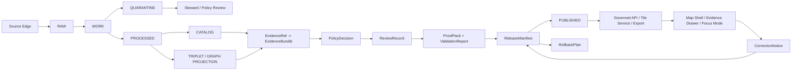

<!-- [KFM_META_BLOCK_V2]
doc_id: kfm://doc/needs-verification/adr-truth-path-public-trust-membrane
title: ADR: KFM Truth Path and Public Trust Membrane
type: standard
version: v1
status: draft
owners: OWNER_TBD_NEEDS_VERIFICATION
created: DATE_TBD_FROM_GIT_OR_DOC_REGISTRY
updated: 2026-05-06
policy_label: NEEDS_VERIFICATION
related: [docs/adr/README.md, docs/adr/ADR-TEMPLATE.md, docs/adr/ADR-0001-schema-home.md, docs/adr/ADR-0004-evidencebundle-contract.md, docs/adr/ADR-0005-promotion-gate.md, docs/adr/ADR-0007-governed-ai-runtime-envelope.md, docs/adr/ADR-0009-sensitive-location-policy.md, docs/adr/ADR-0011-catalog-proof-release-separation.md, docs/adr/ADR-0012-authority-boundary-compatibility-map.md, docs/adr/ADR-0013-policy-home-authority.md]
tags: [kfm, adr, truth-path, trust-membrane, evidence, publication, governance, public-safety, governed-ai]
notes: [Rebuilt from existing docs/adr/ADR-0014-truth-path.md draft, ADR number remains NEEDS VERIFICATION because docs/adr/README.md assigns ADR-0001 to schema-home, No repository files were modified by this rebuild artifact]
[/KFM_META_BLOCK_V2] -->

# ADR: KFM Truth Path and Public Trust Membrane

> [!IMPORTANT]
> **Status:** `proposed` / `draft`  
> **Current repo file:** `docs/adr/ADR-0014-truth-path.md` — `CONFIRMED` existing file in the GitHub connector.  
> **ADR number:** `NEEDS VERIFICATION` — the ADR index names `ADR-0001-schema-home.md` as the foundational `ADR-0001`, so this truth-path decision must not be treated as accepted `ADR-0001` until the index is reconciled.  
> **Owning root:** `docs/` — human-facing architecture decision and governance explanation.  
> **Decision confidence:** `CONFIRMED` KFM doctrine / `PROPOSED` governing decision / `UNKNOWN` enforcement maturity until tests, policies, schemas, release manifests, runtime routes, and UI behavior are verified.

KFM Architecture Decision Records are part of the trust surface. This ADR defines the default path by which evidence becomes publishable and the membrane that prevents public clients, map layers, exports, dashboards, or AI surfaces from bypassing review, policy, release, correction, and rollback.

## Quick links

- [Decision summary](#decision-summary)
- [Context and problem](#context-and-problem)
- [Evidence basis](#evidence-basis)
- [Decision](#decision)
- [Truth path](#truth-path)
- [Public trust membrane](#public-trust-membrane)
- [Evidence closure](#evidence-closure)
- [Derived products](#derived-products)
- [AI and runtime boundary](#ai-and-runtime-boundary)
- [Sensitive and rights-uncertain material](#sensitive-and-rights-uncertain-material)
- [Impact map](#impact-map)
- [Validation plan](#validation-plan)
- [Adoption, rollback, and supersession](#adoption-rollback-and-supersession)
- [Open verification items](#open-verification-items)
- [Review checklist](#review-checklist)

---

## Decision summary

KFM will preserve a repository-wide truth path:

```text
SOURCE EDGE
  -> RAW
  -> WORK / QUARANTINE
  -> PROCESSED
  -> CATALOG / TRIPLET
  -> REVIEW / POLICY / PROOF
  -> RELEASE
  -> PUBLISHED
  -> GOVERNED API / TILE SERVICE / EXPORT
  -> MAP SHELL / EVIDENCE DRAWER / FOCUS MODE
```

Publication is a governed state transition. It is not a copy operation, file move, successful ETL job, generated tile, dashboard refresh, graph projection, vector-search hit, or model response.

Every consequential public-facing claim must resolve from `InspectableClaim` to `EvidenceRef` to `EvidenceBundle`, then through source, policy, review, release, correction, and rollback records strongly enough for the requested action. If that chain cannot be resolved, KFM returns `ABSTAIN`, `DENY`, or `ERROR` instead of plausible prose.

---

## Context and problem

Kansas Frontier Matrix is a governed, evidence-first, map-first, time-aware spatial knowledge and publication system. Its durable public unit is the **inspectable claim**: a public or semi-public statement whose supporting evidence, source role, spatial scope, temporal scope, policy posture, review state, release state, and correction lineage can be inspected.

KFM must not allow public-facing outputs to become detached from evidence or policy. Maps, tiles, dashboards, vector indexes, graph projections, AI answers, scenes, summaries, exports, and reports are useful carriers. They are not sovereign truth.

Without a formal truth path, the project risks:

- public clients reading `RAW`, `WORK`, `QUARANTINE`, or unpublished candidate material directly;
- generated language being mistaken for evidence;
- map layers, tiles, graph edges, search results, dashboards, or scene views being treated as proof;
- successful processing being mistaken for publication;
- source rights, sensitivity, stale state, review gaps, or stewardship constraints being hidden;
- published artifacts lacking correction and rollback targets;
- future domain lanes creating parallel truth paths.

This ADR makes those failure modes visible and gives reviewers a testable decision rule.

---

## Evidence basis

| Evidence item | Source / path / artifact | What it supports | Truth label |
|---|---|---|---|
| Current draft | `docs/adr/ADR-0014-truth-path.md` | Existing draft contains the core truth-path substance and should be preserved rather than replaced by generic prose. | `CONFIRMED` file via GitHub connector |
| ADR directory index | `docs/adr/README.md` | `docs/adr/` is the ADR home; the index lists `ADR-0001-schema-home.md` as foundational `ADR-0001`. | `CONFIRMED` file via GitHub connector |
| ADR template | `docs/adr/ADR-TEMPLATE.md` | ADRs must separate evidence, scope, policy impact, validation, rollback, and supersession; ADRs are not implementation proof. | `CONFIRMED` file via GitHub connector |
| Directory discipline | `Directory Rules.pdf` | `docs/` is the human-facing control plane; root folders are responsibility boundaries; domain work should live under responsibility roots rather than new root-level domain folders. | `CONFIRMED` supplied doctrine |
| Repo-ready writing guidance | `Pasted text (2).txt` | Repo-shaped claims, paths, conventions, tests, routes, and maturity claims require current repository evidence; uncertainty must remain labeled. | `CONFIRMED` supplied instruction |
| KFM operating doctrine | Supplied KFM doctrine corpus | KFM is evidence-first, map-first, time-aware, governed, policy-aware, auditable, and reversible; AI and derived products remain downstream of evidence. | `CONFIRMED` doctrine / `UNKNOWN` enforcement depth |

> [!CAUTION]
> Repeated prior reports and scaffold plans are useful lineage, but they are not implementation proof. This ADR governs behavior only after review and acceptance, and only where matching contracts, schemas, policies, validators, tests, release artifacts, and runtime behavior are implemented or explicitly planned.

---

## Requirements and constraints

| KFM invariant | Decision effect | Status |
|---|---|---|
| `RAW -> WORK / QUARANTINE -> PROCESSED -> CATALOG / TRIPLET -> PUBLISHED` | Preserved as the canonical lifecycle path. | `CONFIRMED` doctrine / `PROPOSED` enforcement |
| Public clients use governed interfaces | Public clients must not read internal lifecycle stores, canonical stores, review queues, source systems, or model runtimes directly. | `PROPOSED` enforcement |
| `EvidenceRef -> EvidenceBundle` closure | Consequential claims require evidence resolution before `ANSWER` or public release. | `PROPOSED` enforcement |
| Promotion is a governed state transition | Release requires validation, policy, review, proof, correction path, and rollback target. | `PROPOSED` enforcement |
| AI is interpretive only | Focus Mode and model runtimes may summarize resolved evidence but cannot create truth, decide policy, or publish. | `CONFIRMED` doctrine / `PROPOSED` enforcement |
| Derived surfaces remain derived | Maps, tiles, graphs, indexes, dashboards, reports, exports, and scenes are carriers, not root proof. | `CONFIRMED` doctrine / `PROPOSED` enforcement |
| Rights and sensitivity fail closed | Unknown rights, unclear source roles, exact sensitive geometry, living-person data, DNA/genomic material, archaeology, rare species, and critical infrastructure exposure are blocked or restricted by default. | `CONFIRMED` doctrine / `PROPOSED` enforcement |
| Corrections and rollback are auditable | Releases must retain correction lineage and rollback targets. | `PROPOSED` enforcement |

### Non-goals

This ADR does **not** decide:

- exact route names, service names, DTO names, package manager, policy engine, or workflow commands;
- the final ADR number or filename after index cleanup;
- source-specific rights or sensitivity outcomes;
- domain-specific publication rules beyond the fail-closed default;
- a schema-home decision already covered by the schema-home ADR family;
- implementation maturity for existing APIs, UIs, CI, dashboards, release manifests, proof packs, or model runtimes.

---

## Decision

### Chosen option

Adopt a single repository-wide truth path and public trust membrane for all public and semi-public KFM outputs.

### Decision rule

> A public or semi-public KFM output may make a consequential claim only when it is downstream of governed lifecycle state, resolves supporting evidence, passes policy and sensitivity checks, is tied to review and release state appropriate to consequence level, and has a correction and rollback path.

### Boundary rule

> No normal public client, public export, map shell, Focus Mode response, dashboard, tile service, graph projection, vector index, report, or scene may bypass the governed API/released-artifact boundary to read `RAW`, `WORK`, `QUARANTINE`, unpublished candidates, direct source side effects, canonical/internal stores, steward-only review queues, credentials, or direct model runtime outputs.

---

## Truth path



### Lifecycle states

| State | Purpose | Public exposure |
|---|---|---|
| `SOURCE EDGE` | Source-facing acquisition boundary, source probes, source metadata, connector context, and source terms. | `DENY` unless represented by reviewed source metadata. |
| `RAW` | Source-native capture with checksum, source identity, retrieval context, and ingest receipt. | `DENY`. |
| `WORK` | Transformation, normalization, QA, staging, and intermediate processing. | `DENY`. |
| `QUARANTINE` | Fail-closed hold for invalid, unsafe, unclear, conflicted, restricted, or sensitive material. | `DENY`, except approved public-safe summaries. |
| `PROCESSED` | Normalized candidate data with validation reports and lineage. | Not public until promoted. |
| `CATALOG` | Discoverable metadata, dataset/layer/claim indexing, provenance, and release linkage. | Public only when release state permits. |
| `TRIPLET` | Derived graph projection for relationships, navigation, and reasoning. | Public only when each exposed edge is evidence-backed and released. |
| `REVIEW / POLICY / PROOF` | Validation, policy decision, steward review, proof pack, and release readiness. | Steward/internal unless released as public-safe proof. |
| `RELEASE` | Release authority, release manifest, proof pack, correction path, and rollback target. | Public-safe release records may be exposed. |
| `PUBLISHED` | Public-safe materialized artifacts and payloads. | Allowed when release manifest and policy permit. |

---

## Public trust membrane

Public and semi-public clients must use governed surfaces:

| Allowed public-facing surface | Required support |
|---|---|
| Governed API response | `RuntimeResponseEnvelope`, policy decision, evidence refs, release state, correction state. |
| Released artifact | Release manifest, hash/integrity record, proof support, rollback target. |
| Release-backed tile service | `LayerManifest`, source/evidence refs, public-safe geometry posture, release ref. |
| Catalog record | Source role, provenance, temporal/spatial scope, release state, correction state. |
| Evidence Drawer payload | `EvidenceBundle` resolution and public-safe evidence summary. |
| Focus Mode answer | Evidence-bounded response with finite outcome and citation validation. |
| Export/report/story node | Release-backed content with evidence and correction linkage. |

Public and semi-public clients must **not** directly read:

- `data/raw/`;
- `data/work/`;
- `data/quarantine/`;
- unpublished candidates;
- canonical/internal stores;
- direct source-system side effects;
- direct model runtime outputs;
- secrets or credentials;
- steward-only review queues;
- admin-only controls.

---

## Evidence closure

A claim is publishable only when its support chain is inspectable enough for its consequence level.

Minimum closure for a public factual claim:

```text
Claim text or feature assertion
EvidenceRef
EvidenceBundle
SourceDescriptor
Source role and authority limits
Spatial scope
Temporal scope
Rights posture
Sensitivity posture
ValidationReport
PolicyDecision
Review state
Release state
Correction path
Rollback target
```

### Finite outcomes

| Outcome | Use |
|---|---|
| `ANSWER` | Evidence closure is sufficient and policy allows the requested public or semi-public response. |
| `ABSTAIN` | Evidence, citation, temporal scope, source role, or support is insufficient. |
| `DENY` | Policy, rights, sensitivity, access role, public-safety rule, or trust membrane blocks the request. |
| `ERROR` | A contract, system, validation, release, or runtime failure prevents reliable handling. |

Suggested response envelope shape:

```json
{
  "outcome": "ANSWER | ABSTAIN | DENY | ERROR",
  "payload": {},
  "evidence_refs": [],
  "evidence_bundle_refs": [],
  "policy_decision_ref": "POLICY_DECISION_REF_TBD",
  "release_ref": "RELEASE_REF_TBD",
  "correction_state": "current | corrected | superseded | withdrawn | unknown",
  "reasons": []
}
```

---

## Derived products

Derived products are never canonical proof by themselves.

| Product | Allowed role | Denied role |
|---|---|---|
| Map layer | Visual carrier of released evidence. | Truth authority. |
| Tile / PMTiles | Rebuildable released artifact. | Evidence source by itself. |
| Graph / triplet | Query, relationship, and navigation projection. | Canonical record replacement. |
| Vector/search index | Retrieval acceleration. | Source authority. |
| AI summary | Evidence-bounded explanation. | Proof or release decision. |
| Dashboard | View into governed state. | Publication gate. |
| Export/report | Released carrier with citations. | Silent replacement of evidence. |
| 3D scene / digital twin | Burden-bound visualization. | Visual proof of certainty. |

---

## AI and runtime boundary

AI and model runtimes are interpretive surfaces only.

Allowed:

- summarize resolved `EvidenceBundle` content;
- draft candidate explanations for review;
- compare source roles, caveats, and temporal/spatial support;
- produce bounded Focus Mode answers with citations;
- assist validation triage without becoming release authority.

Denied:

- direct public model endpoint;
- model reads from `RAW`, `WORK`, `QUARANTINE`, or unpublished candidates as a normal public path;
- generated language as proof;
- AI deciding rights, sensitivity, release, or stewardship;
- uncited authoritative claims;
- hidden chain-of-thought as a KFM truth object.

Runtime outputs must use `ANSWER`, `ABSTAIN`, `DENY`, or `ERROR`.

---

## Sensitive and rights-uncertain material

When rights, source terms, cultural stewardship, sovereignty, living-person status, DNA/genomic material, rare species, archaeology, infrastructure, or precise location exposure is unclear, KFM must fail closed.

| Risk | Default posture |
|---|---|
| Unknown rights | `DENY` public release. |
| Unknown source role | `ABSTAIN` or `DENY` authority use. |
| Sensitive exact location | `DENY` public exact geometry. |
| Living-person data | `DENY` public exposure unless explicitly reviewed and allowed. |
| DNA/genomic material | `DENY` or restrict by default. |
| Archaeological site precision | `DENY` exact public location by default. |
| Rare species occurrence | `DENY` exact public occurrence by default. |
| Critical infrastructure precision | Restrict, generalize, or deny. |
| Emergency or life-safety request | Point to official sources; KFM is not an emergency alert system. |

---

## Object families required by this decision

| Object family | Required purpose |
|---|---|
| `SourceDescriptor` | Source identity, role, authority limits, rights, sensitivity, cadence, steward, and activation state. |
| `IngestReceipt` / `IntakeReceipt` | Source-native acquisition and raw payload integrity. |
| `ValidationReport` | Validation result, failures, warnings, and remediation. |
| `EvidenceRef` | Pointer from claim/object/layer to supporting evidence. |
| `EvidenceBundle` | Inspectable support package resolved from evidence refs. |
| `PolicyDecision` | Allow, deny, restrict, abstain, review-needed, or error outcome with reasons and obligations. |
| `ReviewRecord` | Steward, domain, policy, rights, sensitivity, or release review. |
| `ProofPack` | Validation, evidence, policy, integrity, review, and release support bundle. |
| `ReleaseManifest` | Released assets, hashes, evidence, policy, review, correction path, and rollback target. |
| `LayerManifest` | Released layer artifacts, source, style, bounds, time, sensitivity transform, and evidence payload. |
| `RuntimeResponseEnvelope` | API/UI/AI finite outcome plus evidence, policy, citation, and release state. |
| `CorrectionNotice` | Correction, withdrawal, supersession, public notice, and affected artifacts. |
| `RollbackPlan` / `RollbackCard` | Safe reversion target and steps. |

---

## Impact map

| Area | Required update if this ADR is accepted | Status |
|---|---|---|
| `docs/adr/` | Reconcile ADR number/name, update ADR index, and preserve or redirect current `docs/adr/ADR-0014-truth-path.md`. | `NEEDS VERIFICATION` |
| `docs/doctrine/` | Add or confirm lifecycle, truth-posture, trust-membrane, and AI-boundary docs. | `NEEDS VERIFICATION` |
| `contracts/` | Confirm semantic contracts for evidence, source, runtime, release, correction, and rollback objects. | `NEEDS VERIFICATION` |
| `schemas/` | Add or confirm machine-checkable schemas in the accepted schema home. | `NEEDS VERIFICATION` |
| `policy/` | Add fail-closed policy rules for public internal-path access, unresolved evidence, unknown rights, sensitive geometry, direct model access, and missing rollback targets. | `PROPOSED` |
| `tests/` / `fixtures/` | Add valid/invalid fixtures and negative-path tests. | `PROPOSED` |
| `tools/validators/` | Add or confirm evidence resolver, release manifest validator, public-path guard, layer manifest validator, and citation validator. | `PROPOSED` |
| `data/registry/` | Confirm source, layer, release, and authority registers. | `NEEDS VERIFICATION` |
| `release/` / `data/proofs/` / `data/receipts/` | Keep receipts, proofs, releases, corrections, and rollback records separate and auditable. | `PROPOSED` |
| `apps/` / `packages/` | Bind governed API, map shell, Evidence Drawer, Focus Mode, and review surfaces to finite envelopes. | `UNKNOWN` implementation depth |
| `.github/workflows/` | Add CI checks only after repo-native toolchain is confirmed. | `NEEDS VERIFICATION` |

---

## Alternatives considered

| Alternative | Decision | Reason |
|---|---|---|
| Public UI reads processed files directly. | Rejected. | Bypasses release, policy, correction, and rollback. |
| Pipeline success equals publication. | Rejected. | ETL success is not a release decision. |
| Map tiles are treated as proof. | Rejected. | Tiles are derived, rebuildable carriers. |
| Graph is treated as canonical truth. | Rejected. | Graph edges are projections and must cite evidence. |
| AI answers directly from model context. | Rejected. | Generated language is not evidence. |
| Fix errors by silently overwriting published artifacts. | Rejected. | Corrections and rollback must remain visible. |
| Publish first, review later. | Rejected. | High-risk domains require review before public release. |
| Put domain truth in root-level domain folders. | Rejected. | Domain work belongs under responsibility roots. |
| Maintain this as accepted `ADR-0001` without index cleanup. | Rejected for now. | The ADR index already assigns `ADR-0001` to schema-home; this decision needs numbering reconciliation. |

---

## Validation plan

Minimum negative-path tests for this ADR:

| Test | Expected outcome |
|---|---|
| Public route attempts to read `data/raw/`. | `DENY` or test failure. |
| Public route attempts to read `data/work/`. | `DENY` or test failure. |
| Public route attempts to read `data/quarantine/`. | `DENY` or test failure. |
| Claim has no `EvidenceRef`. | `ABSTAIN` or `DENY`. |
| `EvidenceRef` does not resolve to `EvidenceBundle`. | `ABSTAIN` or `ERROR`. |
| `EvidenceBundle` lacks `SourceDescriptor`. | `ABSTAIN` or `ERROR`. |
| Unknown rights status. | `DENY` public release. |
| Unknown source role used as authority. | `ABSTAIN` or `DENY`. |
| Sensitive exact geometry requested publicly. | `DENY`. |
| `ReleaseManifest` lacks rollback target. | `ERROR` / release blocked. |
| Correction overwrites prior release silently. | `ERROR` / release blocked. |
| AI answer lacks citations. | `ABSTAIN` or `ERROR`. |
| Browser calls model runtime directly. | `DENY` / exposure test failure. |
| Layer has no `LayerManifest` or release ref. | `DENY` / layer hidden. |

Suggested commands after repo checkout and toolchain verification:

```bash
git status --short
git diff --check

# Adapt names to repo-native tooling after verification.
python tools/check_directory_rules.py
python tools/check_no_public_internal_paths.py
python tools/validate_schema_conformance.py
python tools/validate_api_contracts.py
python tools/validators/evidence_resolver.py --fixtures fixtures/
python tools/validators/release_manifest.py --fixtures fixtures/
python -m pytest tests/
```

> [!NOTE]
> Command names above are proposed validation targets, not confirmed runnable commands for this repository.

---

## Adoption, rollback, and supersession

### Adoption path

This rebuild is a drop-in content replacement for the existing draft at `docs/adr/ADR-0014-truth-path.md`. It deliberately does **not** claim acceptance as `ADR-0001`.

Before merge, maintainers should choose one of these paths:

| Path | When to use | Required action |
|---|---|---|
| Keep current file path temporarily | Fastest safe draft cleanup. | Keep status `draft`; update ADR index with conflict note; open numbering cleanup task. |
| Rename to next available ADR number | Preferred once ADR numbering is reconciled. | Move to `docs/adr/ADR-00NN-truth-path-public-trust-membrane.md`, update meta block, leave redirect/supersession note at old path if needed. |
| Fold into another accepted ADR | Use only if maintainers decide this is not a separate architecture decision. | Mark this draft `withdrawn` or `superseded`; preserve rejected-options and validation plan. |

### Rollback of this document-only change

```bash
git checkout -- docs/adr/ADR-0014-truth-path.md
```

If related docs, registers, schemas, policies, tests, or indexes are changed in the same PR, revert them in the same rollback PR unless maintainers explicitly split rollback scope.

### Supersession rule

This ADR can be superseded, but not silently replaced. A successor ADR must:

1. state the superseding decision;
2. mark this ADR `superseded`, `withdrawn`, or `deprecated`;
3. update ADR index and document registry references;
4. preserve public release and correction lineage;
5. run path, evidence, policy, release, and rollback validation;
6. explain migration impact for public API, UI, AI, catalog, layer, and release surfaces.

---

## Consequences

### Positive consequences

- Public claims become traceable, policy-aware, correctable, and reversible.
- Map/UI behavior becomes part of the trust model instead of decoration.
- AI remains useful without becoming authority.
- Domain lanes can grow without creating parallel publication paths.
- Sensitive material has a default fail-closed posture.
- Release, correction, and rollback become auditable instead of implicit.
- Validators and policy tests can enforce doctrine rather than merely describe it.

### Costs and tradeoffs

| Cost / tradeoff | Accepted mitigation |
|---|---|
| Early development is slower. | Build source descriptors, fixtures, validators, policy, and proof objects before broad UI polish. |
| Useful-looking public layers may be blocked. | Treat blocked layers as trust-preserving outcomes until rights, sensitivity, review, and release state are resolved. |
| More object families must be maintained. | Keep contracts, schemas, validators, fixtures, docs, receipts, proofs, releases, corrections, and rollback objects explicit and indexed. |
| Public APIs may return negative outcomes. | Prefer `ABSTAIN`, `DENY`, or `ERROR` over unsupported authority. |
| ADR numbering is currently messy. | Keep this draft honest and resolve numbering/index issues as a separate governance cleanup. |

---

## Open verification items

| Item | Status | Required action |
|---|---|---|
| ADR number and filename | `NEEDS VERIFICATION` | Reconcile with `docs/adr/README.md` and existing ADR files before acceptance. |
| Owner | `NEEDS VERIFICATION` | Assign maintainer/steward owner. |
| Created date | `NEEDS VERIFICATION` | Fill from original commit or document registry if available. |
| Policy label | `NEEDS VERIFICATION` | Confirm whether this ADR is public, restricted, or another repo-native label. |
| Related docs | `NEEDS VERIFICATION` | Confirm doctrine doc paths or add them in a control-plane PR. |
| Schema home | `NEEDS VERIFICATION` | Follow accepted schema-home ADR; do not create parallel schema authority. |
| Policy toolchain | `UNKNOWN` | Confirm whether policy uses OPA/Rego, Conftest, Python validators, or another tool. |
| API route names | `UNKNOWN` | Bind this ADR to confirmed API contracts after route inventory. |
| Release object names | `NEEDS VERIFICATION` | Confirm exact field names and schema IDs for release/proof/correction/rollback objects. |
| Public UI paths | `UNKNOWN` | Confirm map shell, Evidence Drawer, Focus Mode, and review-console implementation locations. |
| Enforcement maturity | `UNKNOWN` | Confirm tests, CI workflows, runtime logs, dashboards, release manifests, and proof packs. |

---

## Review checklist

<details>
<summary>Pre-merge checklist</summary>

- [ ] Meta block values are replaced or deliberately marked `NEEDS VERIFICATION`.
- [ ] ADR title, meta block title, ADR header, filename, and ADR index entry are reconciled.
- [ ] ADR number conflict is resolved or explicitly accepted as a draft-only condition.
- [ ] Directory Rules checked.
- [ ] No root-level domain folder created.
- [ ] Public trust membrane preserved.
- [ ] Lifecycle path preserved.
- [ ] `EvidenceRef -> EvidenceBundle` closure required.
- [ ] Derived products remain derived.
- [ ] AI remains evidence-subordinate.
- [ ] Rights and sensitivity fail closed.
- [ ] Release requires proof, review, correction path, and rollback target.
- [ ] Negative tests exist or are tracked.
- [ ] Rollback path documented.
- [ ] Open verification items assigned or intentionally deferred.
- [ ] This ADR does not imply implemented routes, policies, tests, schemas, dashboards, release objects, or runtime behavior without direct evidence.

</details>
