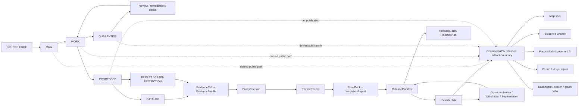

<!-- [KFM_META_BLOCK_V2]
doc_id: kfm://doc/NEEDS-VERIFICATION-ADR-0014-truth-path
title: ADR-0014: KFM Truth Path and Public Trust Membrane
type: standard
version: v1
status: draft
owners: OWNER_TBD_NEEDS_VERIFICATION
created: DATE_TBD_FROM_GIT_OR_DOC_REGISTRY
updated: 2026-05-06
policy_label: NEEDS_VERIFICATION
related: [README.md, docs/adr/README.md, docs/adr/ADR-TEMPLATE.md, docs/adr/ADR-0001-schema-home.md, docs/adr/ADR-0002-responsibility-root-monorepo.md, docs/doctrine/truth-posture.md, docs/doctrine/trust-membrane.md, docs/doctrine/lifecycle-law.md, docs/architecture/governed-api.md]
tags: [kfm, adr, truth-path, trust-membrane, evidence, publication, governance, public-safety, governed-ai]
notes: [Revises the existing docs/adr/ADR-0014-truth-path.md draft without changing the target path, ADR number and owners remain NEEDS VERIFICATION until the ADR index and governance owners are reconciled, implementation enforcement remains UNKNOWN until matching schemas policies validators tests workflows release artifacts and runtime behavior are verified]
[/KFM_META_BLOCK_V2] -->

<a id="top"></a>

# ADR-0014: KFM Truth Path and Public Trust Membrane

KFM public and semi-public outputs cross the trust membrane only after evidence, policy, review, release, correction, and rollback support are inspectable.

<p align="center">
  
  
  
  
  
  
</p>

<p align="center">
  <a href="#decision-summary">Decision</a> ·
  <a href="#repo-fit">Repo fit</a> ·
  <a href="#evidence-basis">Evidence</a> ·
  <a href="#context-and-problem">Context</a> ·
  <a href="#truth-path">Truth path</a> ·
  <a href="#public-trust-membrane">Membrane</a> ·
  <a href="#evidence-closure">Evidence closure</a> ·
  <a href="#validation-plan">Validation</a> ·
  <a href="#adoption-rollback-and-supersession">Rollback</a> ·
  <a href="#open-verification">Open verification</a>
</p>

> [!IMPORTANT]
> **Decision status:** `PROPOSED / draft`  
> **Target path:** `docs/adr/ADR-0014-truth-path.md`  
> **Owning root:** `docs/` — human-facing control plane and architecture decision record home.  
> **Decision confidence:** `CONFIRMED` KFM doctrine / `PROPOSED` governing decision / `UNKNOWN` enforcement maturity.  
> **Enforcement proof:** `NEEDS VERIFICATION` until the active checkout shows matching contracts, schemas, policies, validators, fixtures, tests, workflows, release manifests, proof objects, runtime behavior, and UI states.

---

## Decision summary

| Field | Determination |
|---|---|
| ADR | `ADR-0014-truth-path.md` |
| Decision | Adopt one repository-wide truth path and public trust membrane. |
| Status | `PROPOSED / draft` |
| Scope | Repo-wide doctrine, public-client boundary, evidence closure, publication, correction, rollback, governed API, map shell, Evidence Drawer, Focus Mode, and governed AI surfaces. |
| Core lifecycle | `SOURCE EDGE -> RAW -> WORK / QUARANTINE -> PROCESSED -> CATALOG / TRIPLET -> REVIEW / POLICY / PROOF -> RELEASE -> PUBLISHED` |
| Public crossing rule | Public and semi-public clients cross the membrane only through governed APIs, released artifacts, catalog/layer manifests, evidence-resolving payloads, and finite response envelopes. |
| Claim support rule | Consequential claims require `EvidenceRef -> EvidenceBundle` closure strong enough for the requested exposure. |
| Failure posture | `ABSTAIN`, `DENY`, `ERROR`, `QUARANTINE`, restriction, generalization, withdrawal, or review hold beats plausible unsupported output. |
| AI posture | AI is interpretive and evidence-subordinate; generated text is not proof, policy, review, release, or source authority. |
| Numbering note | `ADR-0014` is retained from the current filename; final numbering and index status remain `NEEDS VERIFICATION`. |

### One-line decision rule

> A KFM output may make a consequential public or semi-public claim only when it is downstream of governed lifecycle state, resolves evidence, passes policy and sensitivity checks, carries appropriate review and release state, and has visible correction and rollback support.

### One-line boundary rule

> No normal public client, map shell, export, dashboard, Focus Mode response, tile service, graph projection, vector index, report, story, or scene may bypass governed interfaces to read `RAW`, `WORK`, `QUARANTINE`, unpublished candidates, internal stores, source-system side effects, secrets, or direct model runtime output.

[Back to top](#top)

---

## Repo fit

`docs/adr/ADR-0014-truth-path.md` belongs under `docs/adr/` because it records a human-facing architecture decision that governs evidence flow, publication boundaries, public trust, correction, rollback, and downstream implementation review.

| Relationship | Path | Status | Role |
|---|---|---:|---|
| This ADR | `docs/adr/ADR-0014-truth-path.md` | `CONFIRMED path / draft content` | Truth-path and public trust membrane decision record. |
| ADR index | [`./README.md`](./README.md) | `CONFIRMED path / coverage NEEDS VERIFICATION` | ADR navigation, status discipline, inventory, and review rules. |
| ADR template | [`./ADR-TEMPLATE.md`](./ADR-TEMPLATE.md) | `CONFIRMED path` | Evidence-heavy ADR structure and review burden. |
| Schema-home ADR | [`./ADR-0001-schema-home.md`](./ADR-0001-schema-home.md) | `CONFIRMED path / proposed decision` | Separates semantic contracts, machine schemas, and policy. |
| Responsibility-root ADR | [`./ADR-0002-responsibility-root-monorepo.md`](./ADR-0002-responsibility-root-monorepo.md) | `CONFIRMED path / accepted decision` | Confirms root folders are responsibility boundaries, not topic buckets. |
| Truth posture | [`../doctrine/truth-posture.md`](../doctrine/truth-posture.md) | `CONFIRMED path / draft doctrine` | Defines truth labels and finite outcomes. |
| Trust membrane doctrine | [`../doctrine/trust-membrane.md`](../doctrine/trust-membrane.md) | `CONFIRMED path / draft doctrine` | Defines outward-facing trust boundary behavior. |
| Lifecycle law | [`../doctrine/lifecycle-law.md`](../doctrine/lifecycle-law.md) | `CONFIRMED path / draft doctrine` | Defines source-to-publication lifecycle law. |
| Governed API architecture | [`../architecture/governed-api.md`](../architecture/governed-api.md) | `CONFIRMED path / draft architecture` | Describes runtime boundary for governed responses. |
| Root README | [`../../README.md`](../../README.md) | `CONFIRMED path / draft authority` | Repository orientation for KFM identity, lifecycle law, responsibility roots, and trust vocabulary. |

### Upstream inputs

This ADR is downstream of:

- KFM doctrine: evidence-first, map-first, time-aware, governed, auditable, and reversible;
- Directory Rules and responsibility-root placement discipline;
- truth-posture, lifecycle-law, and trust-membrane doctrine;
- schema-home and responsibility-root ADRs;
- governed API, MapLibre, Evidence Drawer, Focus Mode, and governed-AI architecture materials;
- current repository evidence where inspected.

### Downstream consumers

This ADR should guide:

- `docs/doctrine/`, `docs/architecture/`, `docs/runbooks/`, and directory READMEs;
- `contracts/` and `schemas/` for evidence, source, policy, runtime, release, correction, and rollback object families;
- `policy/` gates for rights, sensitivity, public access, source role, release, and runtime behavior;
- `tests/`, `fixtures/`, `tools/`, and CI checks that enforce negative paths;
- `apps/`, `packages/`, map shells, Evidence Drawer, Focus Mode, review consoles, exports, stories, dashboards, tile services, graph/search projections, and release tooling.

### Accepted inputs for this ADR

Use this ADR to decide or review:

- public trust membrane boundaries;
- lifecycle state transitions and exposure rules;
- evidence closure requirements;
- direct-public-access denials;
- derived-product truth boundaries;
- AI and model-runtime boundaries;
- publication, correction, withdrawal, supersession, and rollback requirements;
- validation and negative-path expectations.

### Exclusions

Do **not** use this ADR as the primary home for:

| Excluded item | Put it here instead |
|---|---|
| Machine-checkable schemas | `schemas/` or the accepted schema home |
| Semantic object contracts | `contracts/` |
| Policy-as-code | `policy/` |
| Source descriptors or source registries | `data/registry/`, `control_plane/`, or accepted source registry homes |
| Receipts, proofs, release manifests, rollback cards | `data/receipts/`, `data/proofs/`, `release/`, or accepted emitted-object homes |
| Runtime route handlers or UI components | `apps/`, `packages/`, or accepted compatibility roots |
| Exploratory idea packets | `docs/intake/`, `docs/reports/`, or accepted archive/intake homes |
| Private chain-of-thought | Do not store as a KFM truth object |

[Back to top](#top)

---

## Evidence basis

| Evidence item | Source / path / artifact | What it supports | Truth label |
|---|---|---|---|
| Current target draft | `docs/adr/ADR-0014-truth-path.md` | Existing file and core truth-path substance are present and should be revised, not discarded. | `CONFIRMED` path/content |
| ADR index | `docs/adr/README.md` | `docs/adr/` is the ADR home; ADR-0014 is surfaced but still needs verification. | `CONFIRMED` path / `NEEDS VERIFICATION` status |
| ADR template | `docs/adr/ADR-TEMPLATE.md` | ADRs must distinguish decision, evidence, implementation proof, policy impact, validation, rollback, and supersession. | `CONFIRMED` path |
| Schema-home ADR | `docs/adr/ADR-0001-schema-home.md` | Contracts explain meaning, schemas validate machine shape, policy decides admissibility; enforcement still needs verification. | `CONFIRMED` path / `PROPOSED` decision |
| Responsibility-root ADR | `docs/adr/ADR-0002-responsibility-root-monorepo.md` | Root folders are authority boundaries; domain roots are rejected by default. | `CONFIRMED` path / `ACCEPTED` decision |
| Root README | `README.md` | KFM identity, inspectable claim, lifecycle law, public-client posture, and core object-family vocabulary. | `CONFIRMED` path / `draft` authority |
| Lifecycle law | `docs/doctrine/lifecycle-law.md` | Lifecycle is a governed truth path, not a folder naming convention. | `CONFIRMED` path / `draft` doctrine |
| Trust membrane doctrine | `docs/doctrine/trust-membrane.md` | Public surfaces must remain downstream of evidence, policy, review, release, correction, and rollback. | `CONFIRMED` path / `draft` doctrine |
| Truth posture doctrine | `docs/doctrine/truth-posture.md` | KFM uses narrow truth labels and finite outcomes: `ANSWER`, `ABSTAIN`, `DENY`, `ERROR`. | `CONFIRMED` path / `draft` doctrine |
| Governed API architecture | `docs/architecture/governed-api.md` | Governed API is the runtime trust membrane; public clients must not read internal lifecycle stores or direct model output. | `CONFIRMED` path / `draft` architecture |
| Directory Rules | supplied KFM doctrine | `docs/` is the human-facing control plane; root folders are responsibility boundaries; domain work belongs under responsibility roots. | `CONFIRMED` doctrine |
| Local workspace probe | current revision evidence | No mounted local checkout was available in the visible workspace; GitHub connector evidence was used for repository file inspection. | `CONFIRMED` workspace limit |

> [!CAUTION]
> Documentation, ADRs, and repository paths can prove doctrine, decisions, and file presence. They do **not** prove enforcement unless paired with inspected contracts, schemas, policies, validators, fixtures, tests, workflows, release objects, runtime traces, or generated proof artifacts.

[Back to top](#top)

---

## Context and problem

KFM’s public value is the **inspectable claim**: a public or semi-public statement whose evidence, source role, spatial scope, temporal scope, policy posture, review state, release state, correction lineage, and rollback support can be inspected.

KFM can fail if persuasive carriers outrun the evidence chain:

- a map renders a layer before release;
- a tile property is treated as proof;
- a graph edge is treated as canonical truth;
- a vector search hit is used as an answer;
- a dashboard value hides stale, rights, or source-role caveats;
- a generated AI response becomes public authority;
- a source being public online is mistaken for KFM redistribution permission;
- a successful ETL run is mistaken for publication;
- a correction overwrites public truth without lineage;
- a public route reads raw, work, quarantine, candidate, internal, or model-runtime material directly.

This ADR makes those failures reviewable and testable.

### Why this is architecture-significant

The truth path affects every domain lane and public surface. It decides where evidence is resolved, where policy blocks exposure, where review and release become visible, and where public clients are allowed to cross from KFM’s internal truth-making machinery into public claims.

Without this ADR, each domain, app, dashboard, map layer, search surface, or AI feature could accidentally create a parallel publication path.

[Back to top](#top)

---

## Requirements and constraints

| KFM invariant | Decision effect | Status |
|---|---|---|
| `RAW -> WORK / QUARANTINE -> PROCESSED -> CATALOG / TRIPLET -> PUBLISHED` | Preserved as the canonical lifecycle law. | `CONFIRMED` doctrine / `PROPOSED` enforcement |
| Public clients use governed interfaces | Public and ordinary UI clients must not bypass governed APIs, released artifacts, catalog/layer manifests, or evidence-resolving payloads. | `CONFIRMED` doctrine / `PROPOSED` enforcement |
| `EvidenceRef -> EvidenceBundle` closure | Consequential public claims require resolved evidence support or a finite negative outcome. | `CONFIRMED` doctrine / `PROPOSED` enforcement |
| Promotion is a governed state transition | Release requires validation, policy, review, proof, correction path, and rollback target. | `CONFIRMED` doctrine / `PROPOSED` enforcement |
| AI is interpretive, not sovereign | Focus Mode and model adapters may summarize resolved evidence but cannot decide truth, rights, sensitivity, policy, review, or release. | `CONFIRMED` doctrine / `PROPOSED` enforcement |
| Derived products stay derived | Maps, tiles, graphs, indexes, dashboards, summaries, scenes, reports, exports, and AI answers are carriers. | `CONFIRMED` doctrine / `PROPOSED` enforcement |
| Fail closed for risk | Unknown rights, source role, sensitivity, exact-location exposure, living-person data, DNA/genomics, rare species, archaeology, cultural material, and infrastructure exposure block or restrict public output by default. | `CONFIRMED` doctrine / `PROPOSED` enforcement |
| Corrections and rollback are auditable | Public releases must preserve correction, withdrawal, supersession, and rollback lineage. | `CONFIRMED` doctrine / `PROPOSED` enforcement |
| Responsibility roots are respected | This ADR stays in `docs/adr/`; it does not create root-level domain, schema, policy, source, proof, or release authority. | `CONFIRMED` placement rule |

### Non-goals

This ADR does **not** decide:

- exact route names, DTO names, service names, package manager, or policy engine;
- final ADR numbering policy;
- exact schema IDs or JSON field names;
- source-specific rights outcomes;
- domain-specific publication burdens beyond fail-closed defaults;
- production deployment posture;
- CI enforcement maturity;
- current runtime behavior;
- whether any route, layer, model adapter, proof pack, release manifest, or dashboard is already complete.

[Back to top](#top)

---

## Decision

### Chosen option

Adopt a single repository-wide truth path and public trust membrane for all KFM public and semi-public outputs.

### Rationale

This option keeps KFM’s strongest doctrine operationally visible:

- evidence outranks presentation;
- policy and sensitivity checks outrank convenience;
- release is a reviewable state transition;
- derived products do not become proof;
- AI remains bounded and citation-aware;
- correction and rollback are planned before publication;
- public clients use governed outputs rather than internal lifecycle stores.

### Operating rule

> A KFM public surface must show, carry, or be able to resolve the evidence, source role, policy posture, review state, release state, correction lineage, and rollback support appropriate to the claim it makes.

### Boundary rule

> Public clients cross the membrane only through governed API responses, released artifacts, catalog/layer manifests, public-safe evidence summaries, and finite response envelopes.

### Acceptance signal

| Required signal | Evidence |
|---|---|
| Decision reviewed | ADR status updated from `draft` to accepted successor status, with owners and reviewers recorded. |
| Implementation path verified | Active checkout inventory proves matching contracts, schemas, policies, routes, validators, fixtures, and tests. |
| Enforcement verified | Test/workflow output or validation report proves negative paths and public boundary guards. |
| Release behavior verified | Release manifest, proof support, correction path, and rollback target are present for public publication. |
| UI/runtime behavior verified | Evidence Drawer, Focus Mode, map shell, export/story, or API fixtures show `ANSWER`, `ABSTAIN`, `DENY`, and `ERROR` states where applicable. |

[Back to top](#top)

---

## Truth path



### Lifecycle states and exposure posture

| State | Purpose | Public exposure |
|---|---|---|
| `SOURCE EDGE` | Source discovery, source terms, endpoint probes, steward constraints, source-intake context. | Not public truth. |
| `RAW` | Source-native capture with source identity, retrieval context, checksum or digest where practical. | `DENY`. |
| `WORK` | Transformation, normalization, QA, reprojection, enrichment, joins, crosswalks, intermediate outputs. | `DENY`. |
| `QUARANTINE` | Fail-closed hold for invalid, unsafe, conflicted, restricted, unclear, low-confidence, or sensitive material. | `DENY`, except approved public-safe reason summaries. |
| `PROCESSED` | Normalized and validated candidate material. | Hold by default; validation is not publication. |
| `CATALOG` | Metadata, provenance, dataset/layer indexing, discoverability, and release linkage. | Conditional on release and policy. |
| `TRIPLET` | Evidence-backed relationship projection for graph reasoning and navigation. | Conditional; graph edges are not canonical truth. |
| `REVIEW / POLICY / PROOF` | Validation, source-role, rights, sensitivity, steward, release, and proof review. | Steward/internal unless released as public-safe support. |
| `RELEASE` | Release manifest, released asset set, hashes, proof support, correction path, rollback target. | Public-safe release state may be exposed. |
| `PUBLISHED` | Public-safe materialized artifacts and payloads. | Allowed through governed surfaces only. |

> [!IMPORTANT]
> `PROCESSED`, `CATALOG`, and `TRIPLET` are not synonyms for `PUBLISHED`.

[Back to top](#top)

---

## Public trust membrane

The membrane is the controlled crossing from KFM’s internal truth-making lifecycle to persuasive public or semi-public surfaces.

### Allowed crossings

| Allowed surface | Required support |
|---|---|
| Governed API response | Finite outcome, evidence refs, policy decision, release/correction state where material. |
| Release-backed artifact | Release manifest, integrity record, proof support, rollback target. |
| Release-backed tile/layer service | `LayerManifest`, release ref, public-safe geometry posture, source/evidence refs. |
| Catalog record | Source role, provenance, temporal/spatial scope, release state, correction state. |
| Evidence Drawer payload | Resolved `EvidenceBundle` or finite negative outcome. |
| Focus Mode answer | Bounded evidence context, citation validation, policy pre/postcheck, finite runtime envelope. |
| Export, story, report, or dossier | Released content with citations, policy posture, correction lineage, and rollback support. |
| Review console action | Role-scoped, auditable review action with recorded decision and rollback/correction impact. |

### Denied shortcuts

| Shortcut | Reason |
|---|---|
| Public client reads `data/raw/`, `RAW`, or source-native captures. | Source-native capture is not public release. |
| Public client reads `data/work/` or transform intermediates. | Work products are not public truth. |
| Public client reads `data/quarantine/`. | Quarantine means fail-closed. |
| Public client reads unpublished candidates. | Candidates lack release authority. |
| Browser reads canonical/internal stores directly. | Bypasses evidence, policy, release, and audit. |
| Browser calls model runtime or provider adapter directly. | AI must be governed and evidence-subordinate. |
| Map layer fetches live source APIs as KFM truth. | Source availability is not publication. |
| Graph/search/vector result is returned as proof. | Retrieval and projection are not evidence. |
| Tile property is treated as enough for a claim. | Tiles are carriers, not proof. |
| Unknown rights or sensitivity are treated as public-safe. | KFM fails closed where public harm or rights violations are possible. |
| Correction overwrites the public record silently. | Correction lineage and trust repair disappear. |

[Back to top](#top)

---

## Evidence closure

A public or semi-public factual claim must resolve enough support for its consequence level.

Minimum support chain:

```text
InspectableClaim
  -> EvidenceRef
  -> EvidenceBundle
  -> SourceDescriptor
  -> Receipt / DatasetVersion / CatalogRecord
  -> ValidationReport
  -> PolicyDecision
  -> ReviewRecord where required
  -> ReleaseManifest / LayerManifest
  -> CorrectionNotice / RollbackCard where applicable
```

### Closure table

| Closure element | Required question |
|---|---|
| Claim | What is being asserted, shown, exported, answered, or summarized? |
| EvidenceRef | What evidence handle supports it? |
| EvidenceBundle | Can support be resolved into an inspectable package? |
| SourceDescriptor | What can the source prove, and what can it not prove? |
| Spatial scope | What geometry, scale, precision, generalization, and public-safe transform apply? |
| Temporal scope | Which valid, observed, source, retrieval, release, stale, and correction times matter? |
| Rights posture | Is redistribution, display, summary, or API exposure allowed? |
| Sensitivity posture | Is exact detail public-safe, generalized, restricted, or denied? |
| ValidationReport | Did shape, identity, linkage, spatial, temporal, domain, and integrity checks pass? |
| PolicyDecision | Does policy allow, deny, restrict, abstain, review, or error? |
| ReviewRecord | Has appropriate domain/steward/security/policy review occurred where needed? |
| ReleaseManifest | What public-safe artifact or payload was released? |
| Correction / rollback | How can a public error be corrected, withdrawn, superseded, or rolled back? |

### Finite outcomes

| Outcome | Use |
|---|---|
| `ANSWER` | Evidence closure is sufficient and policy allows the requested response. |
| `ABSTAIN` | Evidence, citation, temporal scope, source role, or support is insufficient. |
| `DENY` | Policy, rights, sensitivity, access role, public-safety rule, or membrane rule blocks the request. |
| `ERROR` | A contract, schema, resolver, policy, release, runtime, or system failure prevents safe handling. |

Illustrative envelope only; final machine shape belongs in the accepted schema home:

```json
{
  "outcome": "ANSWER | ABSTAIN | DENY | ERROR",
  "reason_code": "NEEDS_VERIFICATION",
  "payload": {},
  "evidence_refs": [],
  "evidence_bundle_refs": [],
  "policy_decision_ref": null,
  "release_ref": null,
  "review_state": "approved | pending | denied | not_required | unknown",
  "freshness_state": "current | stale | unknown | not_applicable",
  "correction_state": "current | corrected | superseded | withdrawn | unknown",
  "limitations": [],
  "obligations": []
}
```

[Back to top](#top)

---

## Derived products

Derived products are useful. They are not sovereign truth.

| Product | Allowed role | Denied role |
|---|---|---|
| Map layer | Visual carrier of release-backed evidence. | Canonical proof. |
| Tile / PMTiles / raster | Rebuildable released derivative. | Evidence source by itself. |
| Graph / triplet | Evidence-backed relation projection. | Canonical record replacement. |
| Search or vector index | Retrieval acceleration. | Source authority or citation substitute. |
| Dashboard | Trust-visible summary of governed state. | Release gate. |
| Export / story / report | Released evidence carrier. | Silent replacement for citations. |
| 3D scene / digital twin | Burden-bound visualization. | Visual proof of certainty. |
| AI summary | Evidence-bounded explanation. | Truth, policy, rights, sensitivity, or release decision. |
| Run receipt / AI receipt | Process memory and audit support. | Canonical evidence by itself. |

### Derived-product rule

> A derivative may carry a claim only when the claim resolves to evidence and release state outside the derivative itself.

[Back to top](#top)

---

## AI and runtime boundary

AI and model runtimes are interpretive, provider-neutral, and subordinate to evidence and policy.

### Allowed

- summarize resolved `EvidenceBundle` content;
- draft candidate explanations for review;
- compare source roles, caveats, uncertainty, temporal scope, and spatial scope;
- produce bounded Focus Mode answers with citations;
- emit `ANSWER`, `ABSTAIN`, `DENY`, or `ERROR` envelopes;
- support maintainer triage without becoming release authority.

### Denied

- direct public model endpoint;
- browser calls to model runtimes or provider adapters;
- model reads from `RAW`, `WORK`, `QUARANTINE`, or unpublished candidates as a normal public path;
- generated language as proof;
- AI deciding rights, sensitivity, review, release, or rollback;
- uncited authoritative claims;
- private chain-of-thought as a KFM truth object.

### Safe Focus Mode flow

```text
User question / map scope
-> governed API
-> scope resolver
-> policy precheck
-> released evidence retrieval
-> EvidenceRef -> EvidenceBundle resolution
-> bounded context assembly
-> model adapter, if allowed
-> structured output validation
-> citation validation
-> policy postcheck
-> RuntimeResponseEnvelope
-> UI trust state
-> receipt / audit refs
```

[Back to top](#top)

---

## Sensitive and rights-uncertain material

When public exposure could create harm, violate rights, or create false authority, KFM fails closed.

| Risk | Default posture |
|---|---|
| Unknown rights or unclear redistribution terms | `DENY` public release. |
| Unknown source role | `ABSTAIN` or `DENY` authority use. |
| Living-person data | `DENY` public exposure unless explicitly reviewed and allowed. |
| DNA/genomic material | `DENY` or restrict by default. |
| Archaeological sites, sacred places, burials, cultural stewardship concerns | `DENY` exact public location by default. |
| Rare species, nests, dens, roosts, hibernacula, sensitive habitat | `DENY`, restrict, or generalize exact public location. |
| Critical infrastructure or security-sensitive facilities | Restrict, generalize, delay, or deny. |
| Private landowner-sensitive data | Restrict or deny unless public release posture is clear. |
| Emergency or life-safety request | KFM does not replace official emergency systems. |
| Ambiguous spatial precision | Generalize, abstain, or deny precise assignment. |
| Stale operational context | Mark stale, abstain, or deny depending on consequence. |

[Back to top](#top)

---

## Object families required by this decision

| Object family | Membrane role |
|---|---|
| `SourceDescriptor` | Source identity, role, rights, authority limits, cadence, sensitivity, activation posture, and caveats. |
| `IngestReceipt` / `IntakeReceipt` | Source-native capture and integrity at the source edge or raw boundary. |
| `RunReceipt` | Transform, validation, generation, or publication process memory. |
| `ValidationReport` | Shape, linkage, spatial, temporal, domain, and integrity result. |
| `EvidenceRef` | Pointer from claim, artifact, layer, relation, answer, or export to support. |
| `EvidenceBundle` | Resolved inspectable support package. |
| `PolicyDecision` | Allow, deny, restrict, abstain, review-needed, or error decision with reasons and obligations. |
| `ReviewRecord` | Steward, domain, policy, rights, sensitivity, security, or release review. |
| `CatalogRecord` | Discoverable metadata and provenance linkage. |
| `TripletProjection` | Evidence-backed graph relation projection. |
| `ProofPack` | Release-supporting bundle of validation, evidence, policy, integrity, and review records. |
| `ReleaseManifest` | Released artifact set, hashes, refs, stale rules, correction path, and rollback target. |
| `LayerManifest` | Released map layer metadata, public-safe transform, trust refs, and stale/correction state. |
| `RuntimeResponseEnvelope` | API/UI/AI finite response wrapper with trust references. |
| `CorrectionNotice` | Public repair, withdrawal, supersession, or amended support. |
| `RollbackCard` / `RollbackPlan` | Safe reversion target and operational rollback path. |

> [!NOTE]
> Exact schema names, `$id` values, and field names must follow the accepted schema and contract homes. This ADR defines responsibility and review burden, not machine shape.

[Back to top](#top)

---

## Impact map

| Area | Required update if this ADR is accepted | Status |
|---|---|---|
| `docs/adr/` | Reconcile ADR index entry, status, numbering, and successor links. | `NEEDS VERIFICATION` |
| `docs/doctrine/` | Keep truth posture, lifecycle law, trust membrane, and this ADR aligned. | `CONFIRMED paths / NEEDS VERIFICATION sync` |
| `docs/architecture/` | Align governed API, map shell, AI runtime, and public-client architecture docs. | `CONFIRMED governed-api path / NEEDS VERIFICATION sync` |
| `contracts/` | Confirm semantic contracts for evidence, source, policy, runtime, release, correction, and rollback objects. | `NEEDS VERIFICATION` |
| `schemas/` | Confirm machine schemas in the accepted schema home. | `NEEDS VERIFICATION` |
| `policy/` | Add or confirm fail-closed rules for internal-stage access, unresolved evidence, unknown rights, sensitive exact detail, direct model access, missing rollback, and silent correction. | `NEEDS VERIFICATION` |
| `fixtures/` / `tests/` | Add positive and negative fixtures for `ANSWER`, `ABSTAIN`, `DENY`, `ERROR`, quarantine, stale, withdrawn, generalized, restricted, corrected, and superseded states. | `PROPOSED` |
| `tools/` / `scripts/` | Add or confirm evidence resolver, release validator, public path guard, layer manifest validator, citation validator, and direct model-client checks. | `PROPOSED` |
| `data/registry/` / `control_plane/` | Confirm source, authority, object-family, policy-gate, and release-state registers. | `NEEDS VERIFICATION` |
| `data/receipts/` / `data/proofs/` / `release/` | Keep receipts, proofs, release manifests, promotion decisions, correction notices, and rollback cards distinct. | `NEEDS VERIFICATION` |
| `apps/` / `packages/` | Bind governed API, map shell, Evidence Drawer, Focus Mode, review console, export, and story surfaces to finite envelopes. | `UNKNOWN implementation depth` |
| `.github/workflows/` | Add CI checks only after repo-native toolchain and workflow conventions are confirmed. | `NEEDS VERIFICATION` |

[Back to top](#top)

---

## Alternatives considered

| Alternative | Decision | Reason |
|---|---|---|
| Public UI reads processed files directly. | Rejected. | Bypasses release, policy, correction, and rollback. |
| Pipeline success equals publication. | Rejected. | ETL success is not a release decision. |
| Map tiles are treated as proof. | Rejected. | Tiles are derived carriers. |
| Graph is treated as canonical truth. | Rejected. | Graph edges require evidence support and source-role limits. |
| Vector search is treated as answer authority. | Rejected. | Retrieval is not evidence closure. |
| AI answers directly from model context. | Rejected. | Generated language is not proof. |
| Corrections silently overwrite published artifacts. | Rejected. | Correction lineage must remain visible. |
| Publish first, review later. | Rejected. | High-risk domains require review before public exposure. |
| Root-level domain truth folders. | Rejected. | Domain work belongs under responsibility roots. |
| Keep this file as an accepted decision without index cleanup. | Deferred. | Numbering, owners, policy label, and enforcement need verification. |

[Back to top](#top)

---

## Validation plan

Validation should prove the membrane’s negative paths before public surfaces expand.

### Minimum negative-path tests

| Test | Expected outcome |
|---|---|
| Public route attempts to read `RAW` or `data/raw/`. | `DENY` or test failure. |
| Public route attempts to read `WORK` or `data/work/`. | `DENY` or test failure. |
| Public route attempts to read `QUARANTINE` or `data/quarantine/`. | `DENY` or test failure. |
| Public route returns unpublished candidate material. | `DENY` or test failure. |
| Claim lacks `EvidenceRef`. | `ABSTAIN` or `DENY`. |
| `EvidenceRef` does not resolve to `EvidenceBundle`. | `ABSTAIN` or `ERROR`. |
| `EvidenceBundle` lacks source-role support. | `ABSTAIN` or `ERROR`. |
| Source role is unknown or unsuitable for the claim. | `ABSTAIN` or `DENY`. |
| Rights status is unknown. | `DENY` public release. |
| Sensitive exact geometry is requested publicly. | `DENY`, `RESTRICT`, or `GENERALIZE`. |
| `ReleaseManifest` lacks rollback target. | Block release / `ERROR`. |
| Correction overwrites prior release silently. | Block release / `ERROR`. |
| AI response lacks citations. | `ABSTAIN` or `ERROR`. |
| Browser calls model runtime directly. | `DENY` / exposure test failure. |
| Layer lacks `LayerManifest` or release ref. | Hide, deny, or fail layer validation. |
| Graph/search projection returns unsupported relation as proof. | `ABSTAIN` or test failure. |

### Suggested review commands

Commands below are **PROPOSED validation targets**, not confirmed runnable commands.

```bash
# Confirm repository context.
git status --short
git branch --show-current || true
git rev-parse --show-toplevel || true
git diff --check

# Inspect trust-path-adjacent files.
find docs/adr docs/doctrine docs/architecture contracts schemas policy fixtures tests tools apps packages data release \
  -maxdepth 4 -type f 2>/dev/null | sort | sed -n '1,400p'

# Review-aid search for risky public bypasses.
grep -RInE 'data/raw|data/work|data/quarantine|RAW|WORK|QUARANTINE|localhost:11434|OLLAMA_HOST|/api/generate|/api/chat' \
  apps packages tools tests docs 2>/dev/null || true

# Replace with repo-native validators if present.
python tools/validators/check_no_public_internal_paths.py
python tools/validators/validate_evidence_closure.py --fixtures fixtures/
python tools/validators/validate_release_manifest.py --fixtures fixtures/
python tools/validators/validate_layer_manifest.py --fixtures fixtures/
python tools/validators/validate_runtime_envelope.py --fixtures fixtures/
python -m pytest tests/
```

### Evidence that can move this ADR toward acceptance

| Current label | Strengthening evidence |
|---|---|
| `PROPOSED` decision | Maintainer review, ADR index update, owner assignment, and accepted status. |
| `UNKNOWN` enforcement | Passing tests, workflow output, validator reports, route guards, release artifacts, and runtime traces. |
| `NEEDS VERIFICATION` owners | CODEOWNERS, document registry, governance register, or maintainer assignment. |
| `NEEDS VERIFICATION` policy label | Policy classification register or maintainers’ publication label decision. |
| `NEEDS VERIFICATION` schema/object names | Accepted schema-home ADR plus inspected contract/schema files. |
| `UNKNOWN` UI behavior | Evidence Drawer, Focus Mode, map shell, export/story, and review-console fixtures/tests. |

[Back to top](#top)

---

## Adoption, rollback, and supersession

### Adoption path

This revision is a content replacement for the draft at:

```text
docs/adr/ADR-0014-truth-path.md
```

Before accepting the ADR, maintainers should choose one path:

| Path | When to use | Required action |
|---|---|---|
| Keep current path as draft | Fastest safe cleanup. | Update ADR index with current draft status and open verification items. |
| Accept this ADR as `ADR-0014` | Use if ADR numbering is reconciled and maintainers approve. | Update meta block, index, status, owners, policy label, and validation backlog. |
| Rename to next available ADR number | Use if ADR index requires renumbering. | Move file, leave successor/redirect note, update all related links and registers. |
| Supersede with broader trust-law ADR | Use if maintainers merge this with lifecycle or trust membrane doctrine. | Mark this file `superseded` and preserve rejected options and validation plan. |

### Rollback of this document-only change

```bash
git checkout -- docs/adr/ADR-0014-truth-path.md
```

If related docs, registers, schemas, policies, tests, fixtures, routes, or release files change in the same PR, revert or supersede them as part of the same rollback plan unless maintainers explicitly split scope.

### Supersession rule

A successor ADR must:

1. state the superseding decision;
2. mark this ADR `superseded`, `withdrawn`, or `deprecated`;
3. update the ADR index and document registry if active;
4. preserve public release, correction, and rollback lineage;
5. run path, evidence, policy, release, and rollback validation;
6. explain migration impact for public API, UI, AI, catalog, layer, graph/search, export, story, and release surfaces.

[Back to top](#top)

---

## Consequences

### Positive consequences

- Public claims become traceable, policy-aware, correctable, and reversible.
- Map/UI behavior becomes part of the trust model instead of decoration.
- Focus Mode and governed AI remain useful without becoming authority.
- Domain lanes can grow without creating parallel publication paths.
- Sensitive and rights-uncertain material has a fail-closed default.
- Release, correction, withdrawal, supersession, and rollback become auditable.
- Validators and tests can enforce doctrine rather than merely describe it.

### Costs and tradeoffs

| Cost / tradeoff | Accepted mitigation |
|---|---|
| Early development is slower. | Build source descriptors, fixtures, validators, policies, proof objects, and release dry runs before broad UI polish. |
| Useful-looking public layers may be blocked. | Treat `DENY`, `ABSTAIN`, quarantine, restriction, and generalization as trust-preserving states. |
| More object families must be maintained. | Keep contracts, schemas, policies, fixtures, validators, receipts, proofs, releases, corrections, and rollback records indexed. |
| Public APIs may return negative outcomes. | Make `ABSTAIN`, `DENY`, and `ERROR` visible, typed, and testable. |
| Existing docs may overlap. | Keep doctrine, ADRs, architecture notes, and implementation evidence truth-labeled and linked. |

[Back to top](#top)

---

## Open verification

| Item | Status | Required action |
|---|---:|---|
| ADR number and filename | `NEEDS VERIFICATION` | Reconcile with `docs/adr/README.md` and active ADR inventory. |
| Owner | `NEEDS VERIFICATION` | Assign maintainer, steward, or CODEOWNERS-backed owner. |
| Created date | `NEEDS VERIFICATION` | Fill from Git history or document registry. |
| Stable `doc_id` | `NEEDS VERIFICATION` | Assign through accepted document registry or ID policy. |
| Policy label | `NEEDS VERIFICATION` | Confirm public/restricted/sensitive label convention. |
| Related links | `NEEDS VERIFICATION` | Run repo-native Markdown/link checks. |
| Schema home | `NEEDS VERIFICATION` | Follow the accepted schema-home ADR and current schema registry. |
| Object family exact names | `NEEDS VERIFICATION` | Inspect contracts and schemas for current field names and IDs. |
| Policy enforcement | `UNKNOWN` | Inspect policy files, policy tests, reason-code fixtures, and CI output. |
| Evidence resolver | `UNKNOWN` | Inspect resolver code, fixtures, tests, and generated reports. |
| Public path guard | `UNKNOWN` | Inspect API/UI routes, static checks, and workflow logs. |
| Release manifest implementation | `UNKNOWN` | Inspect `release/`, `data/proofs/`, `data/receipts/`, release candidates, and proof packs. |
| Correction and rollback implementation | `UNKNOWN` | Inspect correction notices, rollback cards, release records, and tests. |
| Focus Mode citation validation | `UNKNOWN` | Inspect runtime envelope contracts, adapter tests, and citation validation outputs. |
| Map/Evidence Drawer UI states | `UNKNOWN` | Inspect UI fixtures/tests for trust-visible states. |
| Deployment/runtime posture | `UNKNOWN` | Inspect manifests, runtime config, access controls, logs, and dashboards. |
| CI enforcement | `UNKNOWN` | Inspect workflows and current run results before claiming merge-blocking gates. |

[Back to top](#top)

---

## Review checklist

<details>
<summary>Pre-merge checklist</summary>

- [ ] Meta block values are replaced or deliberately marked `NEEDS VERIFICATION`.
- [ ] ADR title, H1, filename, index entry, and related links are synchronized.
- [ ] ADR number conflict or ambiguity is resolved or explicitly tracked.
- [ ] Directory Rules and responsibility-root placement are preserved.
- [ ] No root-level domain folder, schema authority, policy authority, source registry, proof store, release store, or runtime home is created by this ADR.
- [ ] Evidence basis separates doctrine, repository files, implementation proof, external checks, lineage, and proposals.
- [ ] No implementation claim exceeds direct evidence.
- [ ] Lifecycle law is preserved.
- [ ] Public trust membrane is preserved.
- [ ] `EvidenceRef -> EvidenceBundle` closure is required for consequential public claims.
- [ ] Derived products remain derived.
- [ ] Governed AI and Focus Mode remain evidence-subordinate.
- [ ] Rights, sensitivity, source-role, review-state, release-state, correction, and rollback effects fail closed where unclear.
- [ ] `ANSWER`, `ABSTAIN`, `DENY`, and `ERROR` behavior is represented in validation targets.
- [ ] Negative-path tests are implemented or tracked.
- [ ] Rollback and supersession path is documented.
- [ ] Related docs, contracts, schemas, policies, fixtures, validators, tests, receipts, proofs, release artifacts, and runbooks are updated or explicitly deferred.
- [ ] Open verification items are assigned, deferred, or left with searchable placeholders.
- [ ] Stable anchors are preserved where practical.

</details>

[Back to top](#top)

---

## Appendix A — Reviewer prompt

<details>
<summary>Questions to ask before approving trust-path-sensitive changes</summary>

1. What public or semi-public surface is affected?
2. Which lifecycle state does the data come from?
3. Does the claim resolve `EvidenceRef -> EvidenceBundle`?
4. Is the source role allowed to support this claim type?
5. Are rights and sensitivity known and allowed?
6. Is exact geometry public-safe, generalized, restricted, or denied?
7. Is review required, complete, or explicitly not required?
8. Is release state known?
9. Is correction and rollback available?
10. Could a tile, graph, index, summary, dashboard, scene, export, story, or AI answer be mistaken for root truth?
11. What negative outcome appears when support is insufficient?
12. What evidence proves enforcement, not just doctrine?
13. What is the rollback path?

</details>

## Appendix B — Minimal trust vocabulary

<details>
<summary>Object terms used by this ADR</summary>

| Term | Meaning |
|---|---|
| `InspectableClaim` | Public or semi-public statement with inspectable support and lineage. |
| `SourceDescriptor` | Source identity, role, rights, authority limits, cadence, sensitivity, activation posture, and caveats. |
| `EvidenceRef` | Pointer from claim, feature, layer, answer, export, or relation to supporting evidence. |
| `EvidenceBundle` | Resolved public-safe or role-safe support package. |
| `ValidationReport` | Shape, linkage, spatial, temporal, domain, and integrity result. |
| `PolicyDecision` | Typed allow, deny, restrict, abstain, review-needed, or error decision. |
| `ReviewRecord` | Steward, domain, rights, sensitivity, policy, release, or security review. |
| `ProofPack` | Release-supporting bundle of validation, evidence, policy, integrity, and review records. |
| `ReleaseManifest` | Released artifact set, hashes, refs, stale rules, correction path, and rollback target. |
| `LayerManifest` | Released map layer metadata, public-safe transform, trust refs, and stale/correction state. |
| `RuntimeResponseEnvelope` | API/UI/AI finite response wrapper with trust references. |
| `CorrectionNotice` | Public repair, withdrawal, supersession, or amended support. |
| `RollbackCard` | Safe reversion target and operational rollback path. |

</details>

## Appendix C — Trust membrane impact note template

<details>
<summary>Copy into PRs that affect public or semi-public outputs</summary>

```markdown
## Trust membrane impact

- Surface affected:
- Lifecycle state touched:
- Public exposure possible: yes/no
- EvidenceRef/EvidenceBundle impact:
- Source role impact:
- Rights/sensitivity impact:
- Policy gate affected:
- Review/release impact:
- Correction/rollback impact:
- Derived-product risk:
- AI/model runtime risk:
- Validation commands run:
- UNKNOWN / NEEDS VERIFICATION:
- Rollback plan:
```

</details>

[Back to top](#top)
