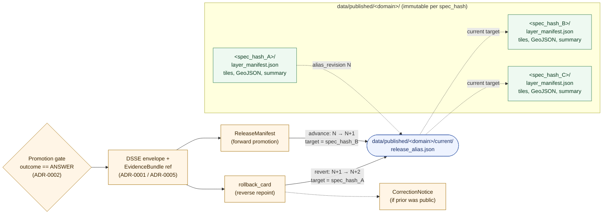

<!-- [KFM_META_BLOCK_V2]
doc_id: kfm://doc/adr-0015-data-published-current-alias-rollback-card
title: ADR-0015 — data/published/<domain>/current alias is governed by rollback_card
type: standard
version: v1
status: draft
owners: <release-steward>, <docs-steward>
created: 2026-05-09
updated: 2026-05-09
policy_label: public
related: [
  docs/doctrine/directory-rules.md,
  docs/adr/ADR-0001-schema-home.md,
  docs/adr/ADR-0002-finite-decision-outcomes.md,
  docs/adr/ADR-0003-watcher-non-publisher-invariant.md,
  docs/adr/ADR-0005-release-manifest-envelope.md,
  schemas/contracts/v1/release/rollback_card.schema.json,
  schemas/contracts/v1/release/release_alias.schema.json,
  release/rollback_cards/,
  data/published/layers/<domain>/current/release_alias.json
]
tags: [kfm, adr, release, rollback, alias, governance, data-published]
notes: [
  "Path targets are PROPOSED until verified against mounted-repo evidence.",
  "Doctrine (immutable artifacts; alias replace by signed decision) is CONFIRMED across project corpus."
]
[/KFM_META_BLOCK_V2] -->

# ADR-0015 — `data/published/<domain>/current` alias is governed by `rollback_card`

> **TL;DR** — Published artifacts under `data/published/<domain>/<spec_hash>/` are byte-immutable. The public-facing pointer at `data/published/<domain>/current/` is **not** mutable by file edit, symlink swap, or pipeline rerun. It is a *governed state transition* whose only legal trigger is a signed `rollback_card` (or its forward-promotion equivalent referenced from a `ReleaseManifest`). Anything else is drift.

[](#status)
[](#status)
[](#3-context)
[](#3-context)
[](#9-open-questions--needs-verification)

**Quick jump:** [Status](#1-status) · [Decision](#4-decision) · [Diagram](#5-state-transition-diagram) · [Required artifacts](#6-required-artifacts-and-their-shape) · [Consequences](#7-consequences) · [Alternatives](#8-alternatives-considered) · [Validation](#9-validation-and-enforcement) · [Open questions](#10-open-questions--needs-verification) · [References](#11-references)

---

## 1. Status

| Field | Value |
|---|---|
| **ADR id** | `ADR-0015` |
| **Title** | `data/published/<domain>/current` alias is governed by `rollback_card` |
| **Status** | `proposed` |
| **Date** | 2026-05-09 |
| **Owners** | Release steward; Docs steward (`<TODO: name actual owners>`) |
| **Reviewers required** | Release steward · Repo steward · Policy/sensitivity reviewer · Security/operator |
| **Supersedes** | — |
| **Superseded by** | — |
| **Related ADRs** | `ADR-0001` (schema home / spec normalization); `ADR-0002` (finite decision outcomes); `ADR-0003` (watcher non-publisher); `ADR-0005` (`ReleaseManifest` envelope) |
| **Authority of the rule** | **CONFIRMED** by corpus (alias replace by signed decision; immutable artifacts) |
| **Authority of any specific path quoted here** | **PROPOSED / NEEDS VERIFICATION** until checked against mounted-repo evidence |

> [!IMPORTANT]
> No mounted repository was inspected when this ADR was authored. The **rule** is grounded in attached KFM doctrine and the directory-rules document; the **path strings, schema homes, and validator names** below are PROPOSED placeholders that must be reconciled against the live repo before this ADR moves to `accepted`.

---

## 2. Glossary

| Term | Meaning in this ADR |
|---|---|
| **Published artifact** | A byte-immutable file or directory under `data/published/<domain>/<spec_hash>/...` produced by a passing promotion gate. |
| **`current` alias** | The single public pointer at `data/published/<domain>/current/release_alias.json` that names the `spec_hash` (and `release_id`) consumers should read **right now**. |
| **`rollback_card`** | A governed decision record (proof object) that ties a *prior* and *target* `spec_hash`, names the reason, the reviewer, and the policy decision, and authorizes the alias to repoint. |
| **`ReleaseManifest`** | The forward-direction equivalent: closes a new release and authorizes the alias to advance to a new `spec_hash`. |
| **Alias repoint** | A change to `release_alias.json` such that `current_spec_hash` (or `release_id`) names a different release than before. The bytes under each `<spec_hash>/` MUST NOT change. |
| **Governed state transition** | A change whose only legal trigger is a signed decision artifact resolvable to an `EvidenceBundle`. Direct edits, pipeline reruns, or symlink swaps do **not** qualify. |

---

## 3. Context

The KFM publication contract has three load-bearing properties that this ADR makes explicit and enforceable for the `current` alias:

1. **Lifecycle invariant.** `RAW → WORK / QUARANTINE → PROCESSED → CATALOG / TRIPLET → PUBLISHED`, where *Promotion is a governed state transition, not a file move.* Public clients read only PUBLISHED.
2. **Immutability of published bytes.** Across the corpus the rule is consistent: *"Published artifacts immutable; rollback by new pointer/release, not overwrite. Current alias disabled if unsafe."* Per-domain dossiers (hydrology, soil, archaeology, transport, agriculture) restate this as `immutable artifacts; alias replace by signed decision` and `move signed alias to prior spec_hash; do not delete artifact`.
3. **Public path discipline.** The trust membrane requires public clients to traverse the governed API and read released artifacts only. The pointer that resolves "what is current" is itself a public-path control surface — it decides what the system says publicly *right now*.

Without an explicit rule on the `current` alias, three drift patterns are easy to fall into:

| Drift pattern | Why it happens | Why it's dangerous |
|---|---|---|
| **Silent overwrite of `<spec_hash>/` bytes** | A pipeline rerun produces "the same" output and rewrites in place. | Breaks content-addressed identity; invalidates every existing `EvidenceBundle`, `RunReceipt`, `DSSE` envelope, and Rekor entry pointing at that hash. |
| **Symlink swap with no record** | An operator points `current/` at a different `<spec_hash>/` directly. | No reviewer, no reason, no rollback target, no audit. Public meaning changes invisibly. |
| **Lifecycle skip from `data/raw/` to `data/published/`** | A connector or watcher writes the published path directly to ship a fix. | Bypasses validators, policy gates, evidence-bundle creation, catalog closure, and release-decision recording — the violation is the same regardless of which directory the bytes ended up in. |

The corpus already names the artifacts that *should* mediate alias change (`rollback_card`, `ReleaseManifest`, `DecisionEnvelope`, `PromotionDecision`). What is missing is a single, citable doctrine note that pins the relationship: **the alias has exactly one legal cause for change, and that cause is a signed governance object.** ADR-0015 supplies that pin.

---

## 4. Decision

### 4.1 The rule (normative, RFC 2119 wording)

For every domain `<domain>` and every release `<spec_hash>` published under `data/published/<domain>/`:

1. **MUST — Immutable bytes.** Files under `data/published/<domain>/<spec_hash>/...` MUST NOT be modified, overwritten, or deleted after the promotion gate that produced them passes. Old releases are preserved alongside new ones.
2. **MUST — Single mutable surface.** The only mutable surface in `data/published/<domain>/` is the alias file at `data/published/<domain>/current/release_alias.json`. Its mutability is restricted to the form described in §4.2.
3. **MUST — Signed-decision trigger.** Any change to the `current` alias MUST be authorized by exactly one of:
   - a `ReleaseManifest` (forward promotion to a new `<spec_hash>`), **or**
   - a `rollback_card` (revert to a previously-released `<spec_hash>`).
   Both objects MUST be signed (DSSE), policy-evaluated (`outcome ∈ {ANSWER}` per ADR-0002), and reference a resolvable `EvidenceBundle`.
4. **MUST NOT — Bypass.** Direct file edits, symlink swaps, pipeline reruns, watcher commits, connector writes, or operator shortcuts MUST NOT change the alias. Convenience scripts that wrap the rule MUST themselves emit the required decision artifacts.
5. **MUST — Preservation on rollback.** A rollback MUST NOT delete the prior release's artifacts, receipts, proofs, or catalog records. It MUST only repoint the alias and record a new `rollback_card` and a new alias-revision entry. Graph and tile projections built from the withdrawn release MUST be invalidated and rebuilt from the alias target.
6. **MUST — Public-correction trigger.** When the prior alias target was visible to public clients and its meaning changed, was corrected, or was withdrawn, a `CorrectionNotice` MUST be emitted alongside the `rollback_card`.
7. **SHOULD — Separation of duties.** When maturity justifies it, the actor who *proposes* a rollback SHOULD NOT be the same actor who *signs* it. Both identities MUST appear in the receipt chain.
8. **SHOULD — Fail-safe default.** If alias verification fails (signature invalid, target `spec_hash` missing, policy decision not `ANSWER`), the governed API SHOULD return `DENY` for the affected layer rather than serve the unverifiable alias.

### 4.2 Legal alias-change shape

A legal alias change is a **single atomic write** of `release_alias.json` whose new content satisfies:

- `current_spec_hash` resolves to an existing `data/published/<domain>/<spec_hash>/` directory whose `layer_manifest.json` is signed and whose `EvidenceBundle` is resolvable.
- `previous_spec_hash` (if present) names the alias's prior target, and that prior `<spec_hash>/` directory still exists on disk.
- `decision_ref` resolves to either a `ReleaseManifest` (forward) or a `rollback_card` (reverse). Exactly one MUST be present.
- `decision_signature` (DSSE envelope reference) verifies against the configured trust root.
- `alias_revision` is a strictly monotonic integer that increases by exactly 1 per change.
- `effective_at` is an ISO-8601 timestamp not in the future.

### 4.3 Scope

| In scope | Out of scope |
|---|---|
| Public-facing alias under `data/published/<domain>/current/`. | Internal lifecycle pointers under `data/work/`, `data/processed/`, `data/catalog/` — those are not public-facing aliases. |
| All canonical KFM domains (hydrology, soil, fauna, flora, habitat, geology, atmosphere, roads-rail-trade, settlements-infrastructure, archaeology, hazards, agriculture, people-dna-land, and any future canonical lane). | Per-domain "channel" aliases (e.g., `stable`, `preview`, `experimental`) — these MAY exist but require their own ADR. Default is single `current`. |
| The forward (`ReleaseManifest`) and reverse (`rollback_card`) decisions that authorize alias change. | `CorrectionNotice` *content rules* — covered by a separate doctrine note. This ADR only requires that one be emitted in the cases specified above. |
| Verifier behavior for the alias under the governed API. | Tile/graph rebuild orchestration (referenced; not specified here). |

---

## 5. State-transition diagram



> The diagram is a faithful rendering of the doctrine, not of any inspected repo state. Every edge is a *governed* transition; no edge represents a direct file edit.

---

## 6. Required artifacts and their shape

> [!NOTE]
> Field names below are normalized from per-domain dossiers (`KFM_Hydrology…`, `kfm_soil_architecture…`, `KFM_Archaeology_Architecture…`). Where dossiers used slightly different names, this ADR pins the canonical form. Schema files are PROPOSED until reconciled with mounted-repo evidence.

### 6.1 `release_alias.json`

**Proposed home:** `data/published/<domain>/current/release_alias.json`
**Proposed schema:** `schemas/contracts/v1/release/release_alias.schema.json`

```json
{
  "domain": "<domain>",
  "alias_revision": 17,
  "current_release_id": "rel-2026-05-09-0001",
  "current_spec_hash": "blake3:…",
  "previous_release_id": "rel-2026-04-22-0003",
  "previous_spec_hash": "blake3:…",
  "decision_kind": "rollback_card",
  "decision_ref": "kfm://release/rollback_cards/<rollback_id>",
  "decision_signature_ref": "kfm://attestation/dsse/<sha256>",
  "evidence_bundle_ref": "kfm://proof/<release_id>/evidence_bundle",
  "policy_decision_ref": "kfm://policy/decision/<decision_id>",
  "effective_at": "2026-05-09T17:34:12Z",
  "kfm_spec_version": "vNext"
}
```

### 6.2 `rollback_card`

**Proposed home:** `release/rollback_cards/<rollback_id>.json` *(release decisions)*
**Proposed mirror under proofs:** `data/proofs/<domain>/<release_id>/rollback_card.json` *(per-release proof closure)*
**Proposed schema:** `schemas/contracts/v1/release/rollback_card.schema.json`

| Field | Required | Purpose |
|---|---|---|
| `rollback_id` | yes | Stable identifier; UUID or content-addressed. |
| `domain` | yes | KFM lane name (e.g., `hydrology`). |
| `prior_release_id`, `prior_spec_hash` | yes | The release the alias points to immediately before this rollback. |
| `target_release_id`, `target_spec_hash` | yes | The release the alias must point to after this rollback. MUST already exist under `data/published/<domain>/<target_spec_hash>/`. |
| `affected_artifacts` | yes | List of public-visible artifacts whose meaning changes. |
| `disable_flags` | optional | Feature flags / layer toggles to disable at the API/UI tier. |
| `reason` | yes | Free-text human reason. |
| `reason_codes[]` | yes | Machine-readable codes (e.g., `data_quality.regression`, `policy.sensitivity_re_evaluation`, `source.retraction`). |
| `requested_by`, `requested_at` | yes | Proposer identity + ISO-8601 timestamp. |
| `approved_by`, `approved_at` | yes | Approver identity (SHOULD differ from `requested_by` per §4.1.7). |
| `executed_at` | yes | When the alias write actually committed. |
| `policy_decision_ref` | yes | Resolves to a `DecisionEnvelope` with `outcome == ANSWER`. |
| `evidence_refs[]` | yes | Resolvable `EvidenceBundle` references. |
| `correction_notice_ref` | conditional | Required if the prior alias target was publicly visible. |
| `signature` | yes | DSSE envelope reference (`payloadType: application/vnd.kfm.rollback_card+json`). |

### 6.3 Relationship to `ReleaseManifest` (ADR-0005)

A `ReleaseManifest` is the **forward** counterpart of a `rollback_card`. Both are alias-change authorizations; both carry the same alias-write semantics (atomic, monotonic, signed). The alias file's `decision_kind` field records which one drove the change.

---

## 7. Consequences

### 7.1 Positive

- **Auditable rollback.** Every alias change resolves to a signed decision that names a reason, a reviewer, an evidence bundle, and a policy decision. `jq -s` over `release/rollback_cards/` yields the full timeline.
- **Reversibility.** Because prior `<spec_hash>/` directories are preserved, a forward release can be reversed without rebuilding old artifacts.
- **Evidence integrity preserved.** `EvidenceBundle`, `RunReceipt`, `PromotionReceipt`, and DSSE envelopes that name a `spec_hash` keep resolving correctly across alias changes.
- **Public-correction discipline.** Rolling back a release that was public forces a `CorrectionNotice`; users see the change in the Evidence Drawer rather than discovering it silently.
- **Fail-safe public path.** Alias verification failure produces a `DENY` envelope (per ADR-0002), not a stale read or a 500.
- **Separation of duties space.** The two-actor pattern (proposer ≠ approver) is enabled by the schema even when not yet enforced by infra.

### 7.2 Negative / costs

- **Operational ceremony.** A "quick fix" requires authoring, signing, and committing a `rollback_card` rather than swapping a file. This is intentional but real.
- **Storage growth.** Old releases are preserved; storage scales with release frequency. Mitigated by content-addressed dedup and tiered storage (out of scope here).
- **Tooling surface.** Requires a verifier (`tools/validators/release/verify_alias.py`), a writer (`tools/release/repoint_alias.py`), and CI wiring. None of these are assumed to exist in the current repo.
- **Coupling to ADR-0001 / ADR-0002.** A change to the spec-normalization or finite-outcomes ADRs cascades into alias semantics; the supersession discipline must travel with it.

### 7.3 Failure modes the rule prevents

| Failure mode | Prevented by |
|---|---|
| Silent rewrite of `<spec_hash>/` bytes | §4.1.1 (immutable bytes) |
| Symlink swap with no record | §4.1.3 (signed-decision trigger) |
| Operator shortcut bypassing review | §4.1.4 (no bypass), §4.1.7 (separation of duties) |
| Public meaning changing without user-visible signal | §4.1.6 (correction-notice trigger) |
| Tile/graph projections drifting from current alias | §4.1.5 (invalidate and rebuild from alias target) |
| Verifier serving an alias whose target vanished | §4.1.8 (fail-safe `DENY`) |

---

## 8. Alternatives considered

| Alternative | Why rejected |
|---|---|
| **A. Mutable `<spec_hash>/` bytes; alias is a no-op.** | Breaks content-addressed identity. Every existing `EvidenceBundle`, `RunReceipt`, and DSSE entry that names a hash becomes a lie. Conflicts with the lifecycle invariant. |
| **B. Symlink-only alias, no `release_alias.json`.** | Symlink targets are not portable across storage backends (object stores, OCI registries, distributed filesystems), and the swap leaves no in-tree record of *who* changed it or *why*. |
| **C. Multiple parallel channels (`stable`, `canary`, `preview`) as default.** | Multiplies the public-path control surface. Each channel needs its own decision discipline; the cost outweighs the benefit until a domain demonstrates need. Channels remain available behind a future ADR but are not the default. |
| **D. Forward-only releases; never roll back.** | Real failures (data regressions, source retractions, sensitivity re-evaluations) demand reverse motion. Without a `rollback_card`, those failures land as silent overwrites or as new "fix" releases that lose lineage. |
| **E. Combine `rollback_card` and `ReleaseManifest` into one envelope.** | Conflates forward and reverse motion in a single object. Reviewers, auditors, and the governed-API verifier benefit from the explicit distinction; merging hides the direction of motion. |
| **F. Rely on Git history alone for audit.** | Git records *that* a file changed but does not carry policy decisions, evidence-bundle references, signed reasons, or separation-of-duties metadata. Git is necessary, not sufficient. |

---

## 9. Validation and enforcement

### 9.1 Validators (PROPOSED)

| Validator | Proposed path | Asserts |
|---|---|---|
| `verify_alias_signature.py` | `tools/validators/release/verify_alias_signature.py` | `release_alias.json` resolves to a DSSE-signed `decision_ref` whose payload digest matches. |
| `verify_alias_target_exists.py` | `tools/validators/release/verify_alias_target_exists.py` | `current_spec_hash` resolves to a non-empty `data/published/<domain>/<spec_hash>/` with a signed `layer_manifest.json`. |
| `verify_alias_monotonic.py` | `tools/validators/release/verify_alias_monotonic.py` | `alias_revision` increases by exactly 1 per change; `effective_at` is monotonic. |
| `verify_rollback_card.py` | `tools/validators/release/verify_rollback_card.py` | `rollback_card` shape, two-actor presence, evidence-bundle resolvability, policy outcome `ANSWER`. |
| `verify_correction_notice_present.py` | `tools/validators/release/verify_correction_notice_present.py` | If the prior alias target was public, a `CorrectionNotice` is emitted in the same change. |
| `verify_no_published_overwrite.py` | `tools/validators/release/verify_no_published_overwrite.py` | No file under `data/published/<domain>/<spec_hash>/` (excluding `current/`) was modified or deleted in the diff. |

### 9.2 Required tests (PROPOSED)

```
tests/release/
├── test_alias_legal_forward_repoint.py        # ReleaseManifest path
├── test_alias_legal_reverse_repoint.py        # rollback_card path
├── test_alias_rejects_unsigned_change.py      # negative
├── test_alias_rejects_missing_target.py       # negative
├── test_alias_rejects_non_monotonic_revision.py # negative
├── test_alias_rejects_byte_overwrite.py       # negative
├── test_correction_notice_required_when_public.py
└── fixtures/
    ├── valid/
    │   ├── alias_forward_promotion.json
    │   └── alias_reverse_rollback.json
    └── invalid/
        ├── alias_unsigned.json
        ├── alias_missing_target.json
        ├── alias_revision_skipped.json
        └── alias_byte_overwrite_diff.patch
```

### 9.3 CI hooks (PROPOSED)

> [!IMPORTANT]
> The following are **proposed** wirings. They presuppose CI infrastructure (GitHub Actions or equivalent) whose presence in the current repo has not been verified.

- A pre-merge check on any PR touching `data/published/**` invokes the validators in §9.1 and fails closed on any error.
- A nightly job audits the latest `release_alias.json` against its `decision_ref` and emits an alert (not a `DENY`) if drift is detected post-merge.
- The governed API's alias resolver re-runs the same checks at request time and returns `DENY` (per ADR-0002) on failure.

### 9.4 Definition of done for this ADR

- [ ] `schemas/contracts/v1/release/release_alias.schema.json` exists and validates the example in §6.1.
- [ ] `schemas/contracts/v1/release/rollback_card.schema.json` exists and validates a representative fixture for each KFM domain.
- [ ] At least one validator from §9.1 runs in CI and fails closed on a negative fixture.
- [ ] `docs/doctrine/directory-rules.md` references this ADR in §17 (Document Change Discipline) or its successor section.
- [ ] `docs/registers/CANONICAL_LINEAGE_EXPLORATORY.md` (or the live equivalent) gains a note linking `data/published/<domain>/current/release_alias.json` to this ADR.

---

## 10. Open questions / NEEDS VERIFICATION

> Tracked in `docs/registers/VERIFICATION_BACKLOG.md` (or the live equivalent) once mounted-repo evidence is available.

- **NEEDS VERIFICATION** — Whether the live repo currently uses `data/published/<domain>/current/` (per Hydrology dossier) or `data/published/layers/<domain>/current/` (per `directory-rules.md` §5 example tree). This ADR uses the former in the body and acknowledges the latter in the meta block; reconciling the two is a precondition for `accepted`.
- **NEEDS VERIFICATION** — Whether `release/rollback_cards/` (per `directory-rules.md` §9.2) or `data/proofs/<domain>/<release_id>/rollback_card.json` (per Hydrology dossier) is the canonical home for the rollback artifact, or whether both are required (decision in `release/`, per-release proof mirror under `data/proofs/`). This ADR currently treats both as canonical with different purposes; an ADR-0005 update or a follow-on ADR may collapse them.
- **OPEN** — Whether `ReleaseManifest` should be carried *inside* the alias file (self-contained) or referenced by URI. This ADR chooses by-reference; a self-contained variant is conceivable for offline verification.
- **OPEN** — Whether channels other than `current` (e.g., `stable`, `preview`) are permitted. This ADR keeps `current` singular by default; a future ADR can introduce channels.
- **OPEN** — Whether `alias_revision` is per-domain or per-release-id. This ADR pins per-domain, monotonic; reconsider if cross-domain composite releases are introduced.
- **OPEN** — How the rule applies to Triplet/Graph projections that *derive* from the published layer set. This ADR requires invalidate-and-rebuild but does not specify orchestration.

---

## 11. References

### 11.1 KFM doctrine and dossiers

- `directory-rules.md` — §3 (the deeper rule), §5 (canonical root tree), §9.2 (`release/` shape), §10 (drift patterns), §14 (migration discipline). Distinguishes `data/published/` (artifacts) from `release/` (decisions).
- *KFM Hydrology Extended Pro PDF-Only Reference Report (2026-04-21)* — Path-pattern tables pinning `data/published/<domain>/<spec_hash>/...` as `PUBLISHED, immutable artifacts; alias replace by signed decision`, and naming `data/published/<domain>/current/release_alias.json` and `data/proofs/<domain>/<release_id>/rollback_card.json`.
- *KFM Soil Architecture Extended Pro PDF-Only Report* — Pins the `RollbackCard` field set: `rollback_id; prior_content_spec_hash; target_content_spec_hash; current_alias; reason; reviewer; requested_at; executed_at; policy_decision_ref; evidence_refs`.
- *KFM Archaeology Architecture Plan (PDF-Only)* — Pins a parallel `rollback_card.schema.json` with `release_ref, affected_artifacts, prior_release_ref, disable_flags, reviewer_ref, reason, timestamp`.
- *KFM Roads, Rail, and Trade Routes Architecture Plan (2026-04-21)* — "Published alias rollback must not delete the prior release; it repoints to a prior verified release and records a new rollback receipt. Graph and tile projections built from the withdrawn release must be invalidated and rebuilt from the alias target."
- *KFM Governed AI Extended Pro Source Ledger Architecture Report (2026-04-20)* — Rollback plan, surface table: *"Published artifacts immutable; rollback by new pointer/release, not overwrite. Current alias disabled if unsafe."*
- *KFM Atmosphere / Air Architecture Report (2026-04-21)* — Appendix K rollback checklist: *"Rollback card emitted → Current alias can repoint to prior `spec_hash`."*
- *KFM Build Companion* §21 — Reviewer roles and separation of duties; Release manager owns promotion, proof pack, release manifest, rollback target.
- *KFM Pass 12 Part 2* §C-010 / §C-011 — Finite outcomes and `DecisionEnvelope`.

### 11.2 Related ADRs (referenced; some PROPOSED)

| ADR | Subject | Relationship to ADR-0015 |
|---|---|---|
| `ADR-0001` | Spec normalization, hash, and ID derivation v1 | Defines `spec_hash` semantics that the alias names. |
| `ADR-0002` | Finite decision outcomes vocabulary | Pins the `ANSWER / ABSTAIN / DENY / ERROR` enum the alias verifier returns. |
| `ADR-0003` | Watcher non-publisher invariant | Reinforces that no watcher may write the alias. |
| `ADR-0005` | `ReleaseManifest` as the publication envelope | Forward counterpart of the `rollback_card`. |
| `ADR-0006` | Crypto stack (BLAKE3 / BAO / DSSE / cosign / Rekor) | The signature path the alias verifier traverses. |

### 11.3 External standards referenced indirectly

- DSSE (Dead Simple Signing Envelope) — payload typing and signing.
- Sigstore (cosign / Fulcio / Rekor) — optional keyless transparency, per ADR-0006.
- RFC 8785 / JCS — canonicalization for hash computation, per ADR-0001.

---

<details>
<summary><strong>Appendix A — Worked example: rollback of <code>hydrology</code></strong></summary>

> Illustrative only. No real release IDs.

**Initial state (alias_revision = 17):**

```json
{
  "domain": "hydrology",
  "alias_revision": 17,
  "current_release_id": "rel-2026-05-01-0001",
  "current_spec_hash": "blake3:abc…",
  "decision_kind": "release_manifest",
  "decision_ref": "kfm://release/manifests/rel-2026-05-01-0001",
  "effective_at": "2026-05-01T12:00:00Z"
}
```

**Trigger:** A reviewer detects that `rel-2026-05-01-0001` introduced a regression in the HUC-12 layer that was not caught by Gate C. The prior release `rel-2026-04-22-0003` (`spec_hash = blake3:def…`) is known good.

**`rollback_card` (excerpt):**

```json
{
  "rollback_id": "rb-hydrology-20260509-0001",
  "domain": "hydrology",
  "prior_release_id": "rel-2026-05-01-0001",
  "prior_spec_hash": "blake3:abc…",
  "target_release_id": "rel-2026-04-22-0003",
  "target_spec_hash": "blake3:def…",
  "affected_artifacts": ["data/published/hydrology/blake3:abc…/tiles/huc12.pmtiles"],
  "disable_flags": ["layer.hydrology.huc12"],
  "reason": "HUC-12 regression vs prior release; cells in the southwest quadrant render with stale provenance.",
  "reason_codes": ["data_quality.regression", "provenance.staleness"],
  "requested_by": "actor://review-console/<proposer>",
  "requested_at": "2026-05-09T17:10:00Z",
  "approved_by": "actor://review-console/<approver>",
  "approved_at": "2026-05-09T17:30:00Z",
  "executed_at": "2026-05-09T17:34:12Z",
  "policy_decision_ref": "kfm://policy/decision/<decision_id>",
  "evidence_refs": ["kfm://proof/rel-2026-04-22-0003/evidence_bundle"],
  "correction_notice_ref": "kfm://release/correction_notices/cn-hydrology-20260509-0001"
}
```

**New alias (alias_revision = 18):**

```json
{
  "domain": "hydrology",
  "alias_revision": 18,
  "current_release_id": "rel-2026-04-22-0003",
  "current_spec_hash": "blake3:def…",
  "previous_release_id": "rel-2026-05-01-0001",
  "previous_spec_hash": "blake3:abc…",
  "decision_kind": "rollback_card",
  "decision_ref": "kfm://release/rollback_cards/rb-hydrology-20260509-0001",
  "effective_at": "2026-05-09T17:34:12Z"
}
```

**What MUST NOT change:** the directories `data/published/hydrology/blake3:abc…/` and `data/published/hydrology/blake3:def…/` and every file inside them. Both are still on disk.

**What MUST change next:** tile/graph projections built from `blake3:abc…` are invalidated and rebuilt from `blake3:def…`. The `CorrectionNotice` becomes visible in the Evidence Drawer.

</details>

<details>
<summary><strong>Appendix B — Reviewer checklist for an alias-changing PR</strong></summary>

- [ ] PR body cites this ADR (`ADR-0015`).
- [ ] PR body cites the relevant `directory-rules.md` section.
- [ ] Diff under `data/published/<domain>/<spec_hash>/` (excluding `current/`) is empty.
- [ ] `release_alias.json` diff shows `alias_revision` increased by exactly 1.
- [ ] `decision_kind` is one of `release_manifest` or `rollback_card`.
- [ ] `decision_ref` resolves; `decision_signature_ref` verifies.
- [ ] `evidence_bundle_ref` resolves; `policy_decision_ref` outcome is `ANSWER`.
- [ ] If `decision_kind == rollback_card`: target `<spec_hash>/` directory still exists on disk.
- [ ] If prior alias target was public: a `CorrectionNotice` is in the same change.
- [ ] Approver identity differs from proposer identity (when separation-of-duties policy applies).
- [ ] Tile/graph invalidation tickets opened for affected projections.

</details>

<sub>[↑ Back to top](#adr-0015--datapublisheddomaincurrent-alias-is-governed-by-rollback_card)</sub>
