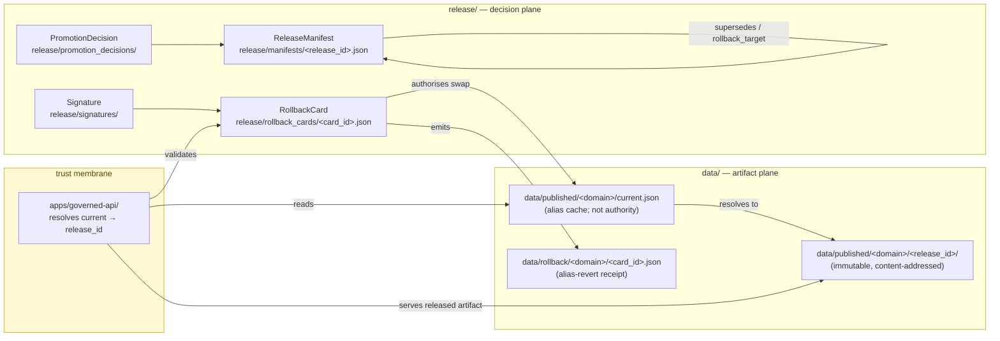

<!-- [KFM_META_BLOCK_V2]
doc_id: kfm://adr/ADR-0015
title: data/published/<domain>/ current alias is governed by RollbackCard
type: standard
version: v1
status: draft
owners: TODO(owner): Docs steward + Release-plane owner — NEEDS VERIFICATION via CODEOWNERS
created: 2026-05-11
updated: 2026-05-15
policy_label: public
related:
  - docs/adr/ADR-0001-schema-home.md
  - docs/doctrine/directory-rules.md
  - docs/doctrine/lifecycle-law.md
  - docs/doctrine/trust-membrane.md
  - contracts/release/release_manifest.md
  - contracts/release/rollback_card.md
  - release/rollback_cards/
  - data/rollback/
tags: [kfm, adr, release, rollback, alias, published, governance]
notes:
  - ADR number 0015 NEEDS VERIFICATION against the live ADR index.
  - ADR status is PROPOSED; document file status remains draft until review.
  - Path form `data/published/<domain>/current` is PROPOSED; corpus also shows
    `data/published/layers/<domain>/`, `data/published/<domain>/<layer>/`,
    and `data/published/diffs/<layer_id>/`.
  - 2026-05-15 update tightened evidence boundary, pointer contract, CI gates,
    verification checklist, and rollback notes without changing the core decision.
[/KFM_META_BLOCK_V2] -->

# ADR-0015 — `data/published/<domain>/current` alias is governed by RollbackCard

> The mutable `current` pointer inside any published domain lane is reseated **only** by an accepted, signed `RollbackCard`. Forward promotion and rollback share the same control surface. The alias is convenience; the card is authority.

[](#0-status--authority)
[](#0-status--authority)
[](#)
[](#)
[](#)
[](#)
[](#10-verification-checklist)
[](#)

**ADR status:** `proposed` · **Document status:** `draft` · **Owners:** Docs steward + Release-plane owner *(TODO(owner): confirm via `CODEOWNERS`)* · **Last updated:** 2026-05-15

> [!NOTE]
> **Evidence boundary:** This ADR states KFM doctrine and proposes an alias-governance mechanism. It does **not** confirm that any referenced directory, route, schema, workflow, signer, dashboard, or runtime behavior exists in the current repository. Path-existence and implementation-depth claims remain `UNKNOWN` / `NEEDS VERIFICATION` until checked against a mounted repo, tests, workflows, emitted artifacts, and `CODEOWNERS`.

---

## Contents

1. [Status & Authority](#0-status--authority)
2. [Context](#1-context)
3. [Decision](#2-decision)
4. [Mechanism](#3-mechanism)
5. [RollbackCard contract for alias changes](#4-rollbackcard-contract-for-alias-changes)
6. [Consequences](#5-consequences)
7. [Alternatives considered](#6-alternatives-considered)
8. [Compatibility & rollout](#7-compatibility--rollout)
9. [Open questions / `NEEDS VERIFICATION`](#8-open-questions--needs-verification)
10. [Related doctrine and ADRs](#9-related-doctrine-and-adrs)
11. [Verification checklist](#10-verification-checklist)
12. [Rollback / supersession of this ADR](#11-rollback--supersession-of-this-adr)

---

## 0. Status & Authority

| Field | Value |
|---|---|
| **ADR id** | `ADR-0015` *(NEEDS VERIFICATION — confirm next free number against the live ADR index)* |
| **Title** | `data/published/<domain>/` current alias is governed by `RollbackCard` |
| **ADR status** | `proposed` *(per `directory-rules.md` §2.4: one of `proposed \| accepted \| superseded \| rejected`)* |
| **Document status** | `draft` *(meta-block status; not the same as ADR decision status)* |
| **Date** | 2026-05-11 |
| **Last reviewed** | 2026-05-15 |
| **Authors** | TODO(owner): assign author(s) before acceptance |
| **Reviewers required** | Release-plane owner · Docs steward · at least one consuming subsystem owner *(governed API / map stack)* |
| **Touched responsibility roots** | `data/`, `release/`, `apps/`, `contracts/`, `schemas/`, `policy/`, `tests/`, `docs/` |
| **Touched paths** | `data/published/`, `data/rollback/`, `release/rollback_cards/`, `release/manifests/`, `release/promotion_decisions/`, `release/signatures/`, `apps/governed-api/` *(or repo-equivalent governed API path — NEEDS VERIFICATION)*, `contracts/release/`, `schemas/contracts/v1/release/` |
| **Amends** | Adds an operational mechanism over the canonical pattern in `directory-rules.md` §9 and §6.3 *(`contracts/release/`)*; does **not** alter the lifecycle invariant. |
| **Authority of this ADR** | `PROPOSED` until accepted. |
| **Authority of any specific path quoted here** | `PROPOSED` until verified against mounted-repo evidence. |
| **Supersedes** | — |
| **Superseded by** | — |

> [!NOTE]
> The ADR template fields used here — `id`, `title`, `status`, `date`, `context`, `decision`, `consequences`, `alternatives` — are required by `directory-rules.md` §2.4. Superseded ADRs **MUST** be retained with `status: superseded` and a forward link.

### 0.1 Directory Rules basis

| Placement question | Directory Rules basis | Status in this ADR |
|---|---|---|
| Human-readable object meaning | `contracts/` defines an object's meaning. | `contracts/release/rollback_card.md` is the semantic home *(NEEDS VERIFICATION for link target).* |
| Machine shape | `schemas/` defines an object's machine shape; ADR-0001 sets the default schema home. | `schemas/contracts/v1/release/rollback_card.schema.json` is the proposed schema home. |
| Released artifacts | `data/` owns lifecycle data; `published` is the public release lifecycle phase. | `data/published/<domain>/...` is conceptual and path-form `NEEDS VERIFICATION`. |
| Release decisions | `release/` owns release decisions, manifests, rollback, correction, and signatures. | `release/rollback_cards/<card_id>.json` is the decision artifact home. |
| Alias revert proof | `data/rollback/` is retained here as the data-plane alias-revert receipt lane. | Two-plane split remains `PROPOSED` until this ADR is accepted and one full cycle is tested. |
| Public access | Public clients use governed interfaces, not canonical/internal stores. | The governed API resolves `current`; client-side filesystem scans are rejected. |

---

## 1. Context

KFM publishes domain artifacts under the `published/` lifecycle phase. Two facts from existing doctrine frame this ADR:

- **Lifecycle invariant.** `RAW → WORK / QUARANTINE → PROCESSED → CATALOG / TRIPLET → PUBLISHED`. *Promotion is a governed state transition, not a file move.* (`directory-rules.md` §0 lifecycle invariant; §9.1 lifecycle phase rules.)
- **Plane split.** `data/published/` owns released **artifacts**; `release/` owns release **decisions** *(manifests, promotion decisions, rollback cards, correction notices, signatures)*. Mixing the planes is a named drift pattern. (`directory-rules.md` §9.2.)

The release object families are already specified in KFM doctrine and lineage materials:

- `ReleaseManifest` carries `layer_id`, `version`, `spec_hash`, `source_ids`, `license / rights_status`, `spatial_extent`, `temporal_extent`, `geometry_precision`, `sensitivity_class`, `evidence_ref_field`, `tile_artifact_uri`, `manifest_uri`, `proof_pack_uri`, `catalog_refs`, `release_decision`, `supersedes`, and `rollback_target`. *(Corpus §B.3.2; NEEDS VERIFICATION against current contract files.)*
- `RollbackCard` is the rollback **decision** artifact, canonical home `release/rollback_cards/`. *(`directory-rules.md` §19 glossary; §9.2 tree.)*
- `data/rollback/` is sanctioned for **"rollback cards, alias revert receipts"**, with the explicit warning *"MUST NOT — deleting prior meanings."* *(`directory-rules.md` §9.1 lifecycle phase rules.)*

What is **not** resolved in current doctrine — and what this ADR addresses — is the **public-facing addressability** of *"the current release of a published domain."* The corpus calls out the failure mode by name: *"Without [ReleaseManifest], latest-only ambiguity, silent overwrite, and lost rollback paths are inevitable."* *(Corpus §B.3.2 "Why It Matters".)* A stable, governed `current` pointer is the operational fix — provided its movement is itself a governance event.

This ADR also reflects the still-open question recorded in `directory-rules.md` §18:

> *"OPEN: Whether `data/rollback/` belongs as a sibling to lifecycle phases or under `release/rollback_cards/`. This document keeps `data/rollback/` for alias-revert receipts (data plane) and `release/rollback_cards/` for the decision (release plane). An ADR can confirm or merge."*

This ADR **confirms** the two-plane split for the alias mechanism *if accepted*: decision in `release/rollback_cards/`, receipt in `data/rollback/`, and binding references between them.

### 1.1 Problem statement

Without a governed alias mechanism, KFM risks four avoidable failures:

| Failure mode | Why it matters | ADR response |
|---|---|---|
| Latest-only ambiguity | Clients can disagree about which release is current. | `current` resolves to one `release_id` through the governed API. |
| Silent overwrite | A release can replace another without a named decision artifact. | Only an accepted, signed `RollbackCard` can reseat the alias. |
| Lost rollback target | A rollback by date or filename can miss the exact prior artifact. | `from_release_id` and `to_release_id` are explicit and immutable. |
| Trust-membrane bypass | Client-side manifest scans move governance into UI/client code. | The governed API resolves alias state and enforces policy. |

---

## 2. Decision

> [!IMPORTANT]
> **MUST / MUST NOT** below are RFC 2119-style per `directory-rules.md` §2.2. They become enforceable only after this ADR is accepted and implemented through schemas, policy, validators, and CI.

1. **Alias exists, server-side.** A published domain lane **MAY** expose a logical `current` pointer that resolves to exactly one immutable, content-addressed release directory under that lane. Conceptually:
   - `data/published/<domain>/current` → `data/published/<domain>/<release_id>/` *(form `PROPOSED` — see §8 path-form question)*
2. **Public path discipline.** Direct filesystem reads of `data/published/<domain>/current/...` **MUST NOT** be treated as the public path. Public clients **MUST** resolve `current` through the governed API (`apps/governed-api/` or repo-equivalent governed API path), which performs server-side resolution, attaches the resolved `release_id`, and enforces policy. *(Path and route names NEED VERIFICATION.)*
3. **Single authority for alias change.** Reseating `current` — **forward promotion or rollback** — **MUST** be authorized by an accepted `RollbackCard` artifact under `release/rollback_cards/`. There is no other path that reseats `current`. CI **MUST** reject any PR that moves the alias without a referenced, accepted `RollbackCard`.
4. **Receipt emission.** Every accepted alias change **MUST** emit an alias-revert receipt under `data/rollback/<domain>/<card_id>.json` *(or repo-equivalent receipt path if later governed by ADR)*, referencing the originating `RollbackCard`. The receipt is the data-plane proof; the card is the release-plane decision.
5. **Atomicity.** The alias swap **MUST** be atomic with respect to readers. Implementations **MAY** use a manifest pointer file (`data/published/<domain>/current.json` → `{ release_id, signed_at, card_ref }`) or a symlink; the file-pointer form is preferred for portability and `git` visibility. *(NEEDS VERIFICATION against repo storage conventions.)*
6. **Retention.** The release directory previously pointed to by `current` **MUST NOT** be deleted by the alias change. Deletion follows the separate `directory-rules.md` §9.1 retention rule and **MUST NOT** happen as a side effect of promotion or rollback. (See: *"`rollback/` MUST NOT — deleting prior meanings."*)
7. **No file-move promotion.** Promotion **MUST NOT** be implemented by renaming or moving release directories into a fixed name. The release directory's identity is its `release_id`. Only the alias moves. *(Lifecycle invariant — `directory-rules.md` §0.)*
8. **Schema home.** The `RollbackCard` machine shape **MUST** live under `schemas/contracts/v1/release/` per ADR-0001 (schema home). The semantic Markdown lives under `contracts/release/rollback_card.md`. Existing divergent schema files, if found, **MUST** be handled by ADR-backed migration rather than parallel authority.
9. **Invalid alias behavior.** If the governed API cannot verify the alias pointer, card status, signature, release manifest, policy state, or receipt linkage, it **MUST NOT** silently serve the target release as authoritative. The resolver should emit a finite outcome: `ERROR` for internal inconsistency, `DENY` for policy failure, or `ABSTAIN` when evidence/support is insufficient.

---

## 3. Mechanism

### 3.1 Two-plane wiring



> [!NOTE]
> Diagram reflects `PROPOSED` operational wiring. Object-family names (`RollbackCard`, `ReleaseManifest`, `PromotionDecision`) are taken from KFM doctrine and current ADR text. Path forms are `PROPOSED`; see §8.

### 3.2 Directory shape (`PROPOSED`)

```text
data/
└── published/
    └── <domain>/
        ├── current.json                  # PROPOSED preferred alias cache
        ├── current                       # optional symlink/pointer alias; NEEDS VERIFICATION
        ├── <release_id_A>/               # immutable release directory
        │   ├── release_manifest.json     # local copy or pointer to release/manifests/<release_id>.json
        │   └── <artifacts…>
        └── <release_id_B>/
            └── <artifacts…>

release/
├── rollback_cards/
│   └── <card_id>.json                    # decision artifact; authority for alias swap
├── manifests/
│   └── <release_id>.json
├── promotion_decisions/
│   └── <decision_id>.json
└── signatures/
    └── <signature_id>.json               # signature/attestation lane; exact shape NEEDS VERIFICATION

data/
└── rollback/
    └── <domain>/
        └── <card_id>.json                # alias-revert receipt; data-plane proof
```

> [!CAUTION]
> The literal segment between `published/` and `<domain>/` is **not** uniform across the corpus. Directory Rules show `data/published/layers/<domain>/`, while sibling dossiers show `data/published/<domain>/<layer>/...` and `data/published/diffs/<layer_id>/...`. This ADR uses `data/published/<domain>/` as the conceptual home and flags the literal form as `NEEDS VERIFICATION` in §8.

### 3.3 `current.json` pointer cache (`PROPOSED`)

`current.json` is an alias cache for efficient resolver lookup. It is **not** the authority. Authority remains the accepted, signed `RollbackCard` plus the linked `ReleaseManifest`, `PromotionDecision` / `CorrectionNotice`, policy decision, and alias-revert receipt.

```json
{
  "object_type": "PublishedCurrentAlias",
  "domain": "<domain>",
  "release_id": "<to_release_id>",
  "card_ref": "release/rollback_cards/<card_id>.json",
  "release_manifest_ref": "release/manifests/<release_id>.json",
  "signed_at": "YYYY-MM-DDTHH:MM:SSZ",
  "policy_label": "public",
  "sensitivity_class": "public",
  "cache_invalidation_ref": "<cache-invalidation-record-or-inline-keys>",
  "receipt_ref": "data/rollback/<domain>/<card_id>.json"
}
```

Validation rule: the governed API **MUST** verify every reference above before serving the resolved release as current. If verification fails, the pointer is stale or invalid and the resolver must fail closed.

### 3.4 Alias-change sequence

```mermaid
sequenceDiagram
    autonumber
    participant Author
    participant Reviewer
    participant CI
    participant Release
    participant Data
    participant Receipt
    participant API

    Author->>Release: Draft RollbackCard with from_release_id, to_release_id, reason, and evidence_refs
    Author->>Reviewer: Open PR touching release/ and data/published/[domain]/current.json
    Reviewer->>CI: Request gates A-G and alias-specific checks
    CI->>CI: Validate schema, manifests, evidence, policy, sensitivity, signatures, retention
    CI-->>Reviewer: PASS or FAIL
    Reviewer->>Release: Accept and sign RollbackCard
    Release->>Data: Atomic alias swap
    Release->>Data: current pointer resolves to to_release_id
    Release->>Receipt: Emit alias-revert receipt referencing card_id
    API->>Release: Verify card_ref, signature, manifest, policy, and receipt
    API->>Data: Serve to_release_id as current when checks pass
---

## 4. RollbackCard contract for alias changes

The fields below are the **alias-change-relevant** projection of the `RollbackCard`. The full `RollbackCard` contract lives in `contracts/release/rollback_card.md` *(NEEDS VERIFICATION)*; the JSON Schema lives under `schemas/contracts/v1/release/rollback_card.schema.json` per ADR-0001 *(NEEDS VERIFICATION)*.

| Field | Required | Meaning | Source / status |
|---|---:|---|---|
| `card_id` | yes | Deterministic identifier of the card. | KFM identity invariant *(directory-rules.md §0)* |
| `domain` | yes | The published domain lane being reseated. | This ADR |
| `from_release_id` | yes | The release directory `current` resolves to **before** the swap. `null` only for inaugural forward promotion. | This ADR |
| `to_release_id` | yes | The release directory `current` resolves to **after** the swap. | This ADR |
| `direction` | yes | `forward_promotion` or `rollback`. | This ADR |
| `reason` | yes | Free-text justification, linked to a `CorrectionNotice` when applicable. | `directory-rules.md` §19 |
| `evidence_refs` | yes | `EvidenceRef` list that resolves to an `EvidenceBundle`. | KFM core invariants |
| `supersedes` | no | Prior `RollbackCard` for the same domain alias, if any. | Corpus §B.3.2 supersedes pattern |
| `release_manifest_ref` | yes | `ReleaseManifest` for `to_release_id`. | Corpus §B.3.2; current file NEEDS VERIFICATION |
| `promotion_decision_ref` | conditional | Required when `direction = forward_promotion`. | `directory-rules.md` §9.2 |
| `correction_notice_ref` | conditional | Required when rollback responds to a public-facing correction. | `directory-rules.md` §9.2 |
| `receipt_ref` | yes | Alias-revert receipt emitted under `data/rollback/<domain>/`. | This ADR |
| `signers` | yes | Signer identities; minimum count set by policy. | `release/signatures/` *(directory-rules.md §9.2; minimum count NEEDS VERIFICATION)* |
| `signed_at` | yes | Signing timestamp. | This ADR |
| `accepted_at` | yes | Timestamp at which the card became effective. | This ADR |
| `policy_label` | yes | `public` / `restricted` / `embargoed` etc. — drives serve-time gating. | `policy/`; exact enum NEEDS VERIFICATION |
| `sensitivity_class` | yes | Mirrors the `ReleaseManifest` sensitivity class. | Corpus §B.3.2; enum NEEDS VERIFICATION |
| `cache_invalidation` | yes | Cache keys / tile URIs invalidated by the swap. | Corpus `MapReleaseManifest` cache-invalidation pattern; exact contract NEEDS VERIFICATION |
| `rollback_target` | yes | Explicit release target available if this card must be reversed. | This ADR; aligns with release rollback posture |

> [!TIP]
> The card is **single-purpose**: it authorizes one alias swap. A revert is a **new** card whose `supersedes` field names the prior card. Never edit an accepted card in place.

---

## 5. Consequences

| Theme | Positive | Negative / Cost |
|---|---|---|
| **Public addressability** | Clients hold a stable, governed reference for *"the current release of `<domain>`"* without scanning manifests. Removes latest-only ambiguity flagged in corpus §B.3.2. | Introduces a *mutable* layer over content-addressed releases. Risk is bounded only because mutation is itself a signed governance event. |
| **Rollback precision** | Rollback is **named by `release_id`**, not by date. Matches corpus rule *"rollbacks are precise: the rollback target is named by digest, not by date."* | Requires the prior release directory to remain on disk; storage cost. |
| **Plane separation** | Reinforces `data/published/` *(artifacts)* vs `release/` *(decisions)*. Closes one named drift pattern in `directory-rules.md` §10. | Two artifacts per swap *(card + receipt)* — slightly higher governance overhead per release. |
| **Trust membrane** | Direct filesystem reads of `current` are not the public path; the governed API stays the single trust boundary. | Tooling that previously read `data/published/<domain>/current/...` directly must migrate to the governed API. |
| **Auditability** | Every alias state is reconstructible from `RollbackCard → release_manifest_ref → release_id → receipt_ref`. | Requires CI gates that reject alias movement without a referenced card and receipt. |
| **Reversibility** | Rollback is symmetric with forward promotion — same control surface, same artifact shape. | Cards are append-only; an alias mistake is corrected by emitting a new card, not by editing history. |
| **No-file-move promotion** | Honors the lifecycle invariant *"Promotion is a governed state transition, not a file move."* | Implementations that promoted by `mv <release_id> current/` must change. *(NEEDS VERIFICATION against any extant tooling.)* |
| **Policy visibility** | Resolver can expose `release_id`, `policy_label`, `sensitivity_class`, and stale/error state to UI trust surfaces. | Requires DTO / envelope design before UI binding; route names remain `UNKNOWN`. |

---

## 6. Alternatives considered

<details>
<summary><strong>A. Filename-only versioning (rejected)</strong></summary>

> Use `data/published/<domain>/release_v3.pmtiles` and let clients pick the highest version.
>
> **Rejected** because corpus §B.3.2 explicitly names *"latest-only ambiguity, silent overwrite, and lost rollback paths"* as the failure mode. Without an alias bound by a decision artifact, two releases racing for "latest" can silently overwrite each other and rollback has no named target.

</details>

<details>
<summary><strong>B. Client-side latest-resolution by manifest scan (rejected)</strong></summary>

> Clients fetch a domain index, sort by `published_time`, pick the newest.
>
> **Rejected** because it bypasses the trust membrane and provides no atomicity: two concurrent clients can resolve to different `release_id`s during a swap. It also moves a governance concern *(which release is current)* into untrusted client code.

</details>

<details>
<summary><strong>C. Promote-by-move (rejected)</strong></summary>

> Rename `data/published/<domain>/<release_id>/` to `data/published/<domain>/current/`.
>
> **Rejected** because it directly violates the lifecycle invariant *"Promotion is a governed state transition, not a file move."* It also destroys the identity of the prior release on disk, breaking the rollback-by-digest property and the `supersedes` chain in `ReleaseManifest`.

</details>

<details>
<summary><strong>D. Merge <code>data/rollback/</code> into <code>release/rollback_cards/</code> (deferred)</strong></summary>

> A simpler single-home model would eliminate the alias-revert receipt under `data/rollback/`.
>
> **Deferred.** `directory-rules.md` §18 records this as an OPEN question; this ADR preserves the two-plane split because the *decision* and the *proof* serve different audiences *(release governance vs data-plane consumers)*. A future ADR may merge them after operational evidence accrues.

</details>

<details>
<summary><strong>E. Pointer-only current file without RollbackCard (rejected)</strong></summary>

> Commit only `current.json` and let the file itself be the authority.
>
> **Rejected** because it collapses decision, proof, and artifact-plane state into one mutable file. The pointer is a cache; the signed `RollbackCard` is the authority.

</details>

---

## 7. Compatibility & rollout

> [!WARNING]
> No claim is made here that any of the directories below exist in the current mounted repository. Path-existence claims are `NEEDS VERIFICATION` until repo inspection confirms them.

1. **Confirm path homes first.** Inspect `docs/adr/`, `docs/doctrine/`, `contracts/`, `schemas/`, `release/`, `data/`, `apps/`, `policy/`, `tools/`, `tests/`, `.github/workflows/`, and `CODEOWNERS` before landing this ADR as accepted.
2. **Add contracts and schemas.** Land `contracts/release/rollback_card.md` and `schemas/contracts/v1/release/rollback_card.schema.json` *(per ADR-0001)* before any tooling writes a card.
3. **Add alias-specific fixtures.** Add valid and invalid examples for forward promotion, rollback, bad signature, missing receipt, deleted prior release, stale pointer, and policy-denied release.
4. **Provide a resolver in the governed API.** The governed API gains a resolver that, given `<domain>`, returns the resolved `release_id`, `card_ref`, `release_manifest_ref`, `policy_label`, `sensitivity_class`, `stale_state`, and finite outcome. Exact route name and DTO home remain `NEEDS VERIFICATION`.
5. **CI gate.** A repo-level check **MUST** reject any PR that:
   - moves `data/published/<domain>/current` or edits `current.json` without a referenced, accepted `RollbackCard`;
   - deletes a release directory referenced by a non-superseded card or manifest;
   - emits an alias-revert receipt without a matching card;
   - points `current.json` to a release whose `ReleaseManifest` is missing, unverified, policy-denied, or superseded without an accepted card;
   - creates a divergent schema home for `RollbackCard` without ADR-backed migration.
6. **Bootstrap.** On first use per domain, the inaugural card has `direction = forward_promotion` and `from_release_id = null`. The inaugural card still requires evidence, manifest, policy, review, signature, and receipt support.
7. **Backfill.** Any pre-existing `current` pointers, symlinks, or latest-only files are `NEEDS VERIFICATION` and must be backfilled by a one-shot card per migration discipline.
8. **Docs touched.** At minimum: `docs/doctrine/lifecycle-law.md` *(cross-reference)*, `docs/registers/DRIFT_REGISTER.md` *(path-form and data-vs-release-plane open item)*, `contracts/release/release_manifest.md` *(link `rollback_target` semantics to this ADR)*, and `docs/registers/VERIFICATION_BACKLOG.md` *(all unresolved checks)*.

---

## 8. Open questions / `NEEDS VERIFICATION`

| # | Item | Status | Resolution path |
|---:|---|---|---|
| 1 | Next free ADR number is `0015`. | `NEEDS VERIFICATION` | Inspect `docs/adr/` index and assign next number on PR. |
| 2 | Literal segment between `data/published/` and `<domain>/`. Corpus shows `published/layers/<domain>/`, `published/<domain>/<layer>/...`, `published/diffs/<layer_id>/...`. | `NEEDS VERIFICATION` | Inspect repo; pick one and freeze with a follow-up ADR or a per-root README. Open a `docs/registers/DRIFT_REGISTER.md` entry if drift exists. |
| 3 | Preferred alias form: pointer file (`current.json`) vs symlink (`current`). | `PROPOSED` (`current.json`) | Decide based on cross-platform `git` behavior, object storage, deployment host, and tooling. |
| 4 | Whether `data/rollback/` retains its own lane or merges under `release/rollback_cards/`. | `DEFERRED / OPEN` | Future ADR after one full rollback cycle and receipt-consumer review. |
| 5 | Minimum signer count for `RollbackCard` *(release vs correction vs publication-rights cases).* | `PROPOSED` | Resolve via `policy/release/` + `policy/runtime/`; reference here once authored. |
| 6 | Whether cache invalidation keys are part of the card or a downstream artifact emitted by the API. | `PROPOSED` | Verify against `MapReleaseManifest` and runtime cache architecture. |
| 7 | Schema home of `RollbackCard` shape. Default per ADR-0001 is `schemas/contracts/v1/release/`. | `NEEDS VERIFICATION` | Inspect repo for any existing `contracts/<…>/rollback_card.schema.json`; migrate per ADR-0001 if found. |
| 8 | Owners *(Release-plane owner, Docs steward)* — exact identities. | `UNKNOWN` | Confirm via `CODEOWNERS`. |
| 9 | Governed API path and resolver route. | `UNKNOWN` | Inspect `apps/` and API OpenAPI / route conventions; do not invent route names. |
| 10 | Signature / attestation contract and signer identity format. | `NEEDS VERIFICATION` | Inspect `release/signatures/`, signing policy, and CI toolchain. |
| 11 | Finite outcome envelope for resolver failure (`ABSTAIN`, `DENY`, `ERROR`). | `PROPOSED` | Align with governed API / runtime response envelope contracts. |
| 12 | Retention period and storage policy for superseded release directories. | `NEEDS VERIFICATION` | Resolve in release policy; this ADR only forbids deletion as a side effect of alias movement. |

---

## 9. Related doctrine and ADRs

| Reference | Role |
|---|---|
| [`docs/doctrine/directory-rules.md`](../doctrine/directory-rules.md) | §0 lifecycle invariant; §2.4 ADR template; §9.1 lifecycle phase rules; §9.2 release decisions tree; §16 path-validation checklist; §18 OPEN questions; §19 glossary. |
| [`docs/doctrine/lifecycle-law.md`](../doctrine/lifecycle-law.md) | `RAW → … → PUBLISHED`; *promotion is a governed state transition, not a file move.* *(NEEDS VERIFICATION — link target.)* |
| [`docs/doctrine/trust-membrane.md`](../doctrine/trust-membrane.md) | Public clients use the governed API, not canonical stores. *(NEEDS VERIFICATION — link target.)* |
| [`docs/adr/ADR-0001-schema-home.md`](./ADR-0001-schema-home.md) | Schema home for `RollbackCard` machine shape. *(NEEDS VERIFICATION — link target and accepted status.)* |
| [`contracts/release/release_manifest.md`](../../contracts/release/release_manifest.md) | `supersedes` / `rollback_target` semantics. *(NEEDS VERIFICATION — link target.)* |
| [`contracts/release/rollback_card.md`](../../contracts/release/rollback_card.md) | Object meaning of `RollbackCard`. *(NEEDS VERIFICATION — link target.)* |
| `schemas/contracts/v1/release/rollback_card.schema.json` | Machine shape for `RollbackCard`. *(NEEDS VERIFICATION — proposed schema path.)* |
| `release/rollback_cards/` | Canonical home for card instances. |
| `data/rollback/<domain>/` | Proposed home for alias-revert receipts. |
| [`docs/registers/DRIFT_REGISTER.md`](../registers/DRIFT_REGISTER.md) | Open the entry for path-form question §8.2. *(NEEDS VERIFICATION — link target.)* |
| [`docs/registers/VERIFICATION_BACKLOG.md`](../registers/VERIFICATION_BACKLOG.md) | Track all `NEEDS VERIFICATION` items above. *(NEEDS VERIFICATION — link target.)* |

---

## 10. Verification checklist

Acceptance of this ADR should not rely on prose alone. Before marking it `accepted`, verify the following:

- [ ] `ADR-0015` is the correct next ADR number, or renumber and update `doc_id`, filename, backlinks, and registers.
- [ ] `CODEOWNERS` confirms Docs steward, Release-plane owner, and consuming subsystem reviewer(s).
- [ ] `docs/adr/ADR-0001-schema-home.md` exists, is accepted, and supports `schemas/contracts/v1/release/` for machine schemas.
- [ ] `contracts/release/rollback_card.md` exists or is created in the same PR.
- [ ] `schemas/contracts/v1/release/rollback_card.schema.json` exists or is created in the same PR.
- [ ] `release/rollback_cards/`, `release/manifests/`, `release/promotion_decisions/`, and `release/signatures/` homes are verified or created with per-root README coverage.
- [ ] `data/rollback/` home is verified or the two-plane split is explicitly recorded as an accepted ADR decision.
- [ ] Literal published path form is resolved: `data/published/layers/<domain>/` vs `data/published/<domain>/...` vs another accepted form.
- [ ] CI fixture proves alias move is rejected without accepted signed card.
- [ ] CI fixture proves alias-revert receipt is required and references the card.
- [ ] CI fixture proves previous `from_release_id` release directory is retained.
- [ ] Governed API resolver path and response envelope are verified against existing app conventions.
- [ ] Resolver behavior for invalid pointer/card/signature/manifest/policy state emits finite outcome and does not serve unsupported release as authoritative.
- [ ] `docs/registers/DRIFT_REGISTER.md` and `docs/registers/VERIFICATION_BACKLOG.md` entries are updated.

---

## 11. Rollback / supersession of this ADR

This ADR is itself reversible through ordinary ADR governance.

| Scenario | Required action | Rollback / supersession target |
|---|---|---|
| ADR number collision | Rename / renumber before acceptance; update `doc_id`, title, backlinks, and registers. | Previous draft file; no release-plane effect. |
| Repo proves a different published path form | Keep this ADR as proposed or supersede with accepted path-form ADR. | New ADR with migration plan and drift entry. |
| Repo proves `data/rollback/` should merge under `release/rollback_cards/` | Supersede this ADR or amend via follow-up ADR after receipt-consumer review. | Accepted merge ADR; preserve old receipts as lineage. |
| Schema-home conflict emerges | Do not create parallel schemas. Resolve via ADR-0001 amendment or migration note. | Schema-home ADR and migration plan. |
| Accepted implementation weakens trust membrane | Revert resolver / CI changes, mark this ADR superseded or rejected, and restore prior release behavior. | Last accepted release policy and rollback-card contract. |

> [!CAUTION]
> Superseding this ADR must not delete existing `RollbackCard`, `ReleaseManifest`, alias-revert receipt, correction notice, review record, or release directory history. Governance changes preserve lineage; they do not erase prior meanings.

---

*Last reviewed: 2026-05-15 · ADR status: `proposed` · Document status: `draft` · ADR-0015 · [Back to top](#adr-0015--datapublisheddomaincurrent-alias-is-governed-by-rollbackcard)*
