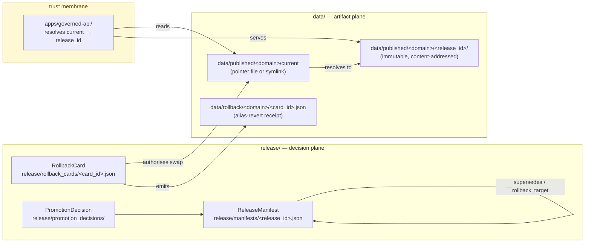

<!-- [KFM_META_BLOCK_V2]
doc_id: kfm://adr/ADR-0015
title: data/published/<domain>/ current alias is governed by RollbackCard
type: standard
version: v1
status: draft
owners: TODO — Docs steward + Release-plane owner (NEEDS VERIFICATION)
created: 2026-05-11
updated: 2026-05-11
policy_label: public
related:
  - docs/adr/ADR-0001-schema-home.md
  - docs/doctrine/directory-rules.md
  - docs/doctrine/lifecycle-law.md
  - docs/doctrine/trust-membrane.md
  - contracts/release/release_manifest.md
  - contracts/release/rollback_card.md
tags: [kfm, adr, release, rollback, alias, published, governance]
notes:
  - ADR number 0015 NEEDS VERIFICATION against the live ADR index.
  - Path form `data/published/<domain>/current` is PROPOSED; corpus also shows
    `data/published/layers/<domain>/` and `data/published/<domain>/<layer>/`.
[/KFM_META_BLOCK_V2] -->

# ADR-0015 — `data/published/<domain>/current` alias is governed by RollbackCard

> The mutable `current` pointer inside any published domain lane is reseated **only** by an accepted, signed `RollbackCard`. Forward promotion and rollback share the same control surface. The alias is convenience; the card is authority.

[](#0-status--authority)
[](#)
[](#)
[](#)
[](#)
[](#)
[](#)

**Status:** proposed · **Owners:** Docs steward + Release-plane owner *(TODO — confirm via `CODEOWNERS`)* · **Last updated:** 2026-05-11

---

## Contents

1. [Status & Authority](#0-status--authority)
2. [Context](#1-context)
3. [Decision](#2-decision)
4. [Mechanism](#3-mechanism)
5. [RollbackCard contract for alias changes](#4-rollbackcard-contract-for-alias-changes)
6. [Consequences](#5-consequences)
7. [Alternatives considered](#6-alternatives-considered)
8. [Compatibility & rollout](#7-compatibility--rollout)
9. [Open questions / `NEEDS VERIFICATION`](#8-open-questions--needs-verification)
10. [Related doctrine and ADRs](#9-related-doctrine-and-adrs)

---

## 0. Status & Authority

| Field | Value |
|---|---|
| **ADR id** | `ADR-0015` *(NEEDS VERIFICATION — confirm next free number against the live ADR index)* |
| **Title** | `data/published/<domain>/` current alias is governed by `RollbackCard` |
| **Status** | `proposed` *(per `directory-rules.md` §2.4: one of `proposed \| accepted \| superseded \| rejected`)* |
| **Date** | 2026-05-11 |
| **Authors** | TODO |
| **Reviewers required** | Release-plane owner · Docs steward · at least one consuming subsystem owner (governed API / map stack) |
| **Touched roots** | `data/published/`, `release/rollback_cards/`, `data/rollback/`, `apps/governed-api/`, `contracts/release/`, `schemas/contracts/v1/release/` |
| **Amends** | Adds an operational mechanism over the canonical pattern in `directory-rules.md` §9 and §6.3 *(`contracts/release/`)*; does **not** alter the lifecycle invariant. |
| **Authority of this ADR** | `PROPOSED` until accepted. |
| **Authority of any specific path quoted here** | `PROPOSED` until verified against mounted-repo evidence. |
| **Supersedes** | — |
| **Superseded by** | — |

> [!NOTE]
> The ADR template fields used here — `id`, `title`, `status`, `date`, `context`, `decision`, `consequences`, `alternatives` — are required by `directory-rules.md` §2.4. Superseded ADRs **MUST** be retained with `status: superseded` and a forward link.

---

## 1. Context

KFM publishes domain artifacts under the `published/` lifecycle phase. Two facts from existing doctrine frame this ADR:

- **Lifecycle invariant.** `RAW → WORK / QUARANTINE → PROCESSED → CATALOG / TRIPLET → PUBLISHED`. *Promotion is a governed state transition, not a file move.* (`directory-rules.md` §0 lifecycle invariant; §9.1 lifecycle phase rules.)
- **Plane split.** `data/published/` owns released **artifacts**; `release/` owns release **decisions** (manifests, promotion decisions, rollback cards, correction notices, signatures). Mixing the planes is a named drift pattern. (`directory-rules.md` §9.2.)

The release object families are already specified:

- `ReleaseManifest` carries `layer_id`, `version`, `spec_hash`, `source_ids`, `license / rights_status`, `spatial_extent`, `temporal_extent`, `geometry_precision`, `sensitivity_class`, `evidence_ref_field`, `tile_artifact_uri`, `manifest_uri`, `proof_pack_uri`, `catalog_refs`, `release_decision`, `supersedes`, and `rollback_target`. *(Corpus §B.3.2.)*
- `RollbackCard` is the rollback **decision** artifact, canonical home `release/rollback_cards/`. *(`directory-rules.md` §19 glossary; §9.2 tree.)*
- `data/rollback/` is sanctioned for **"rollback cards, alias revert receipts"**, with the explicit warning *"MUST NOT — deleting prior meanings."* *(`directory-rules.md` §9.1 lifecycle phase rules.)*

What is **not** resolved in current doctrine — and what this ADR addresses — is the **public-facing addressability** of "the current release of a published domain." The corpus calls out the failure mode by name: *"Without [ReleaseManifest], **latest-only ambiguity**, silent overwrite, and lost rollback paths are inevitable."* *(Corpus §B.3.2 "Why It Matters".)* A stable, governed `current` pointer is the operational fix — provided its movement is itself a governance event.

This ADR also reflects the still-open question recorded in `directory-rules.md` §18:

> *"OPEN: Whether `data/rollback/` belongs as a sibling to lifecycle phases or under `release/rollback_cards/`. This document keeps `data/rollback/` for alias-revert receipts (data plane) and `release/rollback_cards/` for the decision (release plane). An ADR can confirm or merge."*

This ADR **confirms** the two-plane split for the alias mechanism (decision in `release/rollback_cards/`, receipt in `data/rollback/`) and binds them.

---

## 2. Decision

> [!IMPORTANT]
> **MUST / MUST NOT** below are RFC 2119-style per `directory-rules.md` §2.2.

1. **Alias exists, server-side.** A published domain lane **MAY** expose a logical `current` pointer that resolves to exactly one immutable, content-addressed release directory under that lane. Conceptually:
   - `data/published/<domain>/current` → `data/published/<domain>/<release_id>/` *(form `PROPOSED` — see §8 path-form question)*
2. **Public path discipline.** Direct filesystem reads of `data/published/<domain>/current/...` **MUST NOT** be treated as the public path. Public clients **MUST** resolve `current` through the governed API (`apps/governed-api/`), which performs server-side resolution, attaches the resolved `release_id`, and enforces policy. *(See `directory-rules.md` §16 "Public path discipline".)*
3. **Single authority for alias change.** Reseating `current` — **forward promotion or rollback** — **MUST** be authorized by an accepted `RollbackCard` artifact under `release/rollback_cards/`. There is no other path that reseats `current`. CI **MUST** reject any PR that moves the alias without a referenced, accepted `RollbackCard`.
4. **Receipt emission.** Every accepted alias change **MUST** emit an alias-revert receipt under `data/rollback/<domain>/<card_id>.json` (or equivalent), referencing the originating `RollbackCard`. The receipt is the data-plane proof; the card is the release-plane decision.
5. **Atomicity.** The alias swap **MUST** be atomic with respect to readers. Implementations **MAY** use a manifest pointer file (`data/published/<domain>/current.json` → `{ release_id, signed_at, card_ref }`) or a symlink; the file-pointer form is preferred for portability and `git`-visibility. *(NEEDS VERIFICATION against repo storage conventions.)*
6. **Retention.** The release directory previously pointed to by `current` **MUST NOT** be deleted by the alias change. Deletion follows the separate `directory-rules.md` §9.1 retention rule and **MUST NOT** happen as a side effect of promotion or rollback. (See: *"`rollback/` MUST NOT — deleting prior meanings."*)
7. **No file-move promotion.** Promotion **MUST NOT** be implemented by renaming or moving release directories into a fixed name. The release directory's identity is its `release_id`. Only the alias moves. *(Lifecycle invariant — `directory-rules.md` §0.)*
8. **Schema home.** The `RollbackCard` machine shape **MUST** live under `schemas/contracts/v1/release/` per ADR-0001 (schema home). The semantic Markdown lives under `contracts/release/rollback_card.md`.

---

## 3. Mechanism

### 3.1 Two-plane wiring



> [!NOTE]
> Diagram reflects PROPOSED operational wiring. Object-family names (`RollbackCard`, `ReleaseManifest`, `PromotionDecision`) are taken from `directory-rules.md` §19 and §6.3. Path forms are `PROPOSED`; see §8.

### 3.2 Directory shape (PROPOSED)

```text
data/
└── published/
    └── <domain>/
        ├── current                       # pointer file or symlink — alias only
        ├── current.json                  # PROPOSED preferred form: {release_id, card_ref, signed_at}
        ├── <release_id_A>/               # immutable release directory
        │   ├── release_manifest.json     # references manifest in release/manifests/
        │   └── <artifacts…>
        └── <release_id_B>/
            └── <artifacts…>

release/
├── rollback_cards/
│   └── <card_id>.json                    # the decision artifact (canonical home)
├── manifests/
│   └── <release_id>.json
└── promotion_decisions/
    └── <decision_id>.json

data/
└── rollback/
    └── <domain>/
        └── <card_id>.json                # alias-revert receipt (data-plane proof)
```

> [!CAUTION]
> The literal segment between `published/` and `<domain>/` is **not** uniform across the corpus. `directory-rules.md` §4 Step 3 shows `data/published/layers/<domain>/`, while sibling dossiers show `data/published/<domain>/<layer>/...` and `data/published/diffs/<layer_id>/...`. This ADR uses `data/published/<domain>/` as the conceptual home and flags the literal form as `NEEDS VERIFICATION` in §8.

### 3.3 Alias-change sequence

```mermaid
sequenceDiagram
    autonumber
    participant Author as "Author / Release engineer"
    participant Reviewer as "Reviewer(s)"
    participant CI as "CI / Gates A–G"
    participant Release as "release/rollback_cards/"
    participant Data as "data/published/&lt;domain&gt;/"
    participant Receipt as "data/rollback/&lt;domain&gt;/"
    participant API as "apps/governed-api/"

    Author->>Release: Draft RollbackCard (from, to, reason, evidence_refs)
    Author->>Reviewer: Open PR — touches release/ and data/published/&lt;domain&gt;/current
    Reviewer->>CI: Request gates
    CI->>CI: Validate manifests, evidence resolution, sensitivity, signatures
    CI-->>Reviewer: PASS / FAIL
    Reviewer->>Release: Sign, mark status=accepted
    Release->>Data: Atomic alias swap — current resolves to release_id_to
    Release->>Receipt: Emit alias-revert receipt referencing card_id
    Note over API: Reload pointer; subsequent reads resolve to release_id_to
```

---

## 4. RollbackCard contract for alias changes

The fields below are the **alias-change-relevant** projection of the `RollbackCard`. The full `RollbackCard` contract lives in `contracts/release/rollback_card.md` *(NEEDS VERIFICATION)*; the JSON Schema lives under `schemas/contracts/v1/release/rollback_card.schema.json` per ADR-0001 *(NEEDS VERIFICATION)*.

| Field | Required | Meaning | Source |
|---|---|---|---|
| `card_id` | yes | Deterministic identifier of the card. | KFM identity invariant *(directory-rules.md §0)* |
| `domain` | yes | The published domain lane being reseated. | This ADR |
| `from_release_id` | yes | The release directory `current` resolves to **before** the swap. | This ADR |
| `to_release_id` | yes | The release directory `current` resolves to **after** the swap. | This ADR |
| `direction` | yes | `forward_promotion` or `rollback`. | This ADR |
| `reason` | yes | Free-text justification, linked to a `CorrectionNotice` when applicable. | `directory-rules.md` §19 |
| `evidence_refs` | yes | `EvidenceRef` list that resolves to an `EvidenceBundle`. | KFM core invariants |
| `supersedes` | no | Prior `RollbackCard` for the same domain alias, if any. | Corpus §B.3.2 supersedes pattern |
| `release_manifest_ref` | yes | `ReleaseManifest` for `to_release_id`. | Corpus §B.3.2 |
| `promotion_decision_ref` | conditional | Required when `direction = forward_promotion`. | `directory-rules.md` §9.2 |
| `correction_notice_ref` | conditional | Required when the rollback responds to a public-facing correction. | `directory-rules.md` §9.2 |
| `signers` | yes | Identities of the signers; minimum count set by policy. | `release/signatures/` *(`directory-rules.md` §9.2)* |
| `signed_at` | yes | Signing timestamp. | This ADR |
| `policy_label` | yes | `public` / `restricted` / `embargoed` etc. — drives serve-time gating. | `policy/` |
| `sensitivity_class` | yes | Mirrors the `ReleaseManifest` sensitivity_class. | Corpus §B.3.2 |
| `cache_invalidation` | yes | Cache keys / tile URIs invalidated by the swap. | Corpus `MapReleaseManifest` §"cache invalidation record" |

> [!TIP]
> The card is **single-purpose**: it authorises a single alias swap. A revert is a **new** card whose `supersedes` field names the prior card. Never edit an accepted card in place.

---

## 5. Consequences

| Theme | Positive | Negative / Cost |
|---|---|---|
| **Public addressability** | Clients hold a stable, governed reference for *"the current release of `<domain>`"* without scanning manifests. Removes latest-only ambiguity flagged in corpus §B.3.2. | Introduces a *mutable* layer over content-addressed releases. Risk is bounded only because mutation is itself a signed governance event. |
| **Rollback precision** | Rollback is **named by `release_id`**, not by date. Matches corpus rule *"rollbacks are precise: the rollback target is named by digest, not by date."* | Requires the prior release directory to remain on disk; storage cost. |
| **Plane separation** | Reinforces `data/published/` (artifacts) vs `release/` (decisions). Closes one of the named drift patterns in `directory-rules.md` §10. | Two artifacts per swap (card + receipt) — slightly higher governance overhead per release. |
| **Trust membrane** | Direct filesystem reads of `current` are not the public path; the governed API stays the single trust boundary. *(`directory-rules.md` §16.)* | Tooling that previously read `data/published/<domain>/current/...` directly must migrate to the governed API. |
| **Auditability** | Every alias state is reconstructible from the chain `RollbackCard → release_manifest_ref → release_id`. Receipts in `data/rollback/<domain>/` provide the data-plane proof. | Requires CI gates that reject alias movement without a referenced card. |
| **Reversibility** | Rollback is symmetric with forward promotion — same control surface, same artifact shape. | Cards are append-only; an alias mistake is corrected by emitting a new card, not by editing history. |
| **No-file-move promotion** | Honors the lifecycle invariant *"Promotion is a governed state transition, not a file move."* | Implementations that previously promoted by `mv <release_id> current/` must change. *(NEEDS VERIFICATION against any extant tooling.)* |

---

## 6. Alternatives considered

<details>
<summary><strong>A. Filename-only versioning (rejected)</strong></summary>

> Use `data/published/<domain>/release_v3.pmtiles` and let clients pick the highest version.
>
> **Rejected** because corpus §B.3.2 explicitly names *"latest-only ambiguity, silent overwrite, and lost rollback paths"* as the failure mode. Without an alias bound by a decision artifact, two releases racing for "latest" can silently overwrite each other and rollback has no named target.

</details>

<details>
<summary><strong>B. Client-side latest-resolution by manifest scan (rejected)</strong></summary>

> Clients fetch a domain index, sort by `published_time`, pick the newest.
>
> **Rejected** because it bypasses the trust membrane and provides no atomicity: two concurrent clients can resolve to different `release_id`s during a swap. It also moves a governance concern (which release is current) into untrusted client code.

</details>

<details>
<summary><strong>C. Promote-by-move (rejected)</strong></summary>

> Rename `data/published/<domain>/<release_id>/` to `data/published/<domain>/current/`.
>
> **Rejected** because it directly violates the lifecycle invariant *"Promotion is a governed state transition, not a file move."* It also destroys the identity of the prior release on disk, breaking the rollback-by-digest property and the `supersedes` chain in `ReleaseManifest`.

</details>

<details>
<summary><strong>D. Merge <code>data/rollback/</code> into <code>release/rollback_cards/</code> (deferred)</strong></summary>

> A simpler single-home model would eliminate the alias-revert receipt under `data/rollback/`.
>
> **Deferred.** `directory-rules.md` §18 records this as an OPEN question; this ADR preserves the two-plane split because the *decision* and the *proof* serve different audiences (release governance vs data-plane consumers). A future ADR may merge them after operational evidence accrues.

</details>

---

## 7. Compatibility & rollout

> [!WARNING]
> No claim is made here that any of the directories below exist in the current mounted repository. Path-existence claims are `NEEDS VERIFICATION`.

1. **Add contracts and schemas first.** Land `contracts/release/rollback_card.md` and `schemas/contracts/v1/release/rollback_card.schema.json` (per ADR-0001) before any tooling writes a card.
2. **Provide a resolver in the governed API.** `apps/governed-api/` gains a route that, given `<domain>`, returns the resolved `release_id` for `current`, plus the `card_ref`. Cache invalidation keys come from the card's `cache_invalidation` field.
3. **CI gate.** A repo-level check **MUST** reject any PR that:
   - moves `data/published/<domain>/current` (or `current.json`) without a referenced, accepted `RollbackCard`;
   - deletes a release directory referenced by a non-superseded card;
   - emits an alias-revert receipt without a matching card.
4. **Bootstrap.** On first use per domain, the inaugural card has `direction = forward_promotion` and `from_release_id = null`.
5. **Backfill.** Any pre-existing `current` pointers (if found in the repo) are treated as `NEEDS VERIFICATION` and backfilled by a one-shot card per `directory-rules.md` §14 migration discipline.
6. **Docs touched.** `docs/doctrine/lifecycle-law.md` (cross-reference), `docs/registers/DRIFT_REGISTER.md` (resolution of the `data/rollback/` vs `release/rollback_cards/` OPEN), `contracts/release/release_manifest.md` (link `rollback_target` semantics to this ADR).

---

## 8. Open questions / `NEEDS VERIFICATION`

| # | Item | Status | Resolution path |
|---|---|---|---|
| 1 | Next free ADR number is `0015`. | `NEEDS VERIFICATION` | Inspect `docs/adr/` index and assign next number on PR. |
| 2 | Literal segment between `data/published/` and `<domain>/`. Corpus shows `published/layers/<domain>/`, `published/<domain>/<layer>/...`, `published/diffs/<layer_id>/...`. | `NEEDS VERIFICATION` | Inspect repo; pick one and freeze with a follow-up ADR or a §15 per-root README. Open a `docs/registers/DRIFT_REGISTER.md` entry if drift exists. |
| 3 | Preferred alias form: pointer file (`current.json`) vs symlink (`current`). | `PROPOSED` (`current.json`) | Decide based on cross-platform `git` behavior and tooling. |
| 4 | Whether `data/rollback/` retains its own lane or merges under `release/rollback_cards/`. | OPEN (`directory-rules.md` §18) | Future ADR after one full rollback cycle. |
| 5 | Minimum signer count for `RollbackCard` (release vs correction vs publication-rights cases). | `PROPOSED` | Resolve via `policy/release/` + `policy/runtime/`; reference here once authored. |
| 6 | Whether cache invalidation keys are part of the card or a downstream artifact emitted by the API. | `PROPOSED` | Verify against `MapReleaseManifest` *(corpus reference)*. |
| 7 | Schema home of `RollbackCard` shape. Default per ADR-0001 is `schemas/contracts/v1/release/`. | `NEEDS VERIFICATION` | Inspect repo for any existing `contracts/<…>/rollback_card.schema.json`; migrate per ADR-0001 if found. |
| 8 | Owners (Release-plane owner, Docs steward) — exact identities. | `UNKNOWN` | Confirm via `CODEOWNERS`. |

---

## 9. Related doctrine and ADRs

| Reference | Role |
|---|---|
| [`docs/doctrine/directory-rules.md`](../doctrine/directory-rules.md) | §0 lifecycle invariant; §2.4 ADR template; §9.1 lifecycle phase rules; §9.2 release decisions tree; §16 path-validation checklist; §18 OPEN questions; §19 glossary. |
| [`docs/doctrine/lifecycle-law.md`](../doctrine/lifecycle-law.md) | `RAW → … → PUBLISHED`; *promotion is a governed state transition, not a file move.* *(NEEDS VERIFICATION — link target.)* |
| [`docs/doctrine/trust-membrane.md`](../doctrine/trust-membrane.md) | Public clients use the governed API, not canonical stores. *(NEEDS VERIFICATION — link target.)* |
| [`docs/adr/ADR-0001-schema-home.md`](./ADR-0001-schema-home.md) | Schema home for `RollbackCard` machine shape. |
| [`contracts/release/release_manifest.md`](../../contracts/release/release_manifest.md) | `supersedes` / `rollback_target` semantics. *(NEEDS VERIFICATION — link target.)* |
| [`contracts/release/rollback_card.md`](../../contracts/release/rollback_card.md) | Object meaning of `RollbackCard`. *(NEEDS VERIFICATION — link target.)* |
| `release/rollback_cards/` | Canonical home for card instances. |
| `data/rollback/<domain>/` | Canonical home for alias-revert receipts. |
| [`docs/registers/DRIFT_REGISTER.md`](../registers/DRIFT_REGISTER.md) | Open the entry for path-form question §8.2. *(NEEDS VERIFICATION — link target.)* |
| [`docs/registers/VERIFICATION_BACKLOG.md`](../registers/VERIFICATION_BACKLOG.md) | Track all `NEEDS VERIFICATION` items above. *(NEEDS VERIFICATION — link target.)* |

---

*Last reviewed: 2026-05-11 · Status: `proposed` · ADR-0015 · [Back to top](#adr-0015--datapublisheddomaincurrent-alias-is-governed-by-rollbackcard)*
