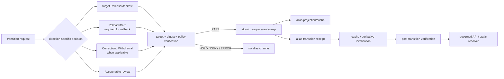

<!-- [KFM_META_BLOCK_V2]
doc_id: kfm://doc/adr/0015-published-current-alias-rollback-card
title: "ADR-0015 — data/published/<domain>/current alias is governed by RollbackCard"
type: adr
adr_id: ADR-0015
version: v1.2
status: draft
owners:
  - "NEEDS VERIFICATION — architecture decision owner"
  - "NEEDS VERIFICATION — release and rollback steward"
  - "NEEDS VERIFICATION — data publication steward"
  - "NEEDS VERIFICATION — correction and withdrawal steward"
  - "NEEDS VERIFICATION — governed API and static-delivery maintainers"
  - "NEEDS VERIFICATION — affected domain and public-surface stewards"
owner_status: "CODEOWNERS provides repository review routing, but accepted stewardship, required-review rules, decision quorum, separation of duties, signing authority, and release authorization were not verified"
reviewers_required:
  - Architecture steward
  - Docs steward
  - Release and rollback steward
  - Data publication steward
  - Correction and withdrawal steward
  - Contracts and schemas stewards
  - Policy and validation stewards
  - Governed API and static-delivery maintainers
  - At least one affected domain or public-surface steward
created: 2026-05-11
updated: 2026-07-23
policy_label: public
truth_posture: cite-or-abstain
responsibility_root: docs/
current_path: docs/adr/ADR-0015-data-published-_domain_-current-alias-is-governed-by-rollback_card.md
supersedes: []
superseded_by: null
evidence_snapshot:
  repository: bartytime4life/Kansas-Frontier-Matrix
  base_ref: main
  base_commit: d7e9a1f1073ec462937ed9e52db856f87407d736
  target_prior_blob: 4a9920e110fadd1509f48a499a3fc0809bec913d
  adr_index_blob: cf08fae322ac53426f7394d97897fdb942253049
  directory_rules_blob: 2affb080e6f0043867c64c7f06c1ca52030fbd55
  published_readme_blob: 585abdf7953bc270a15bcf80b4dd8d6af93e70ac
  data_rollback_readme_blob: e7e230b800f1ad92e798f5d5e4a33eed42841513
  release_readme_blob: 0752610b1df6d11143158f6f162f65ecd650e6a6
  release_rollback_cards_readme_blob: c1fc4d27bca8144faa16e1b888ca95c5d2f88eb5
  release_rollback_review_readme_blob: aa8b60f4d47e7b73ab3e862f1dcd498691ea4e0c
  rollback_card_contract_blob: 72ab9e148491243cc8a374556350ab94c2557ab4
  rollback_card_schema_blob: 779ffcf282201ba4dba9689e622f92723db55b4e
  rollback_card_validator_blob: b80dd40e93733c7fa76f8f9a78e9ec55b6090b4b
  rollback_drill_workflow_blob: dc42ec4931f95023d364f2559ddcffab94ecfab5
  published_alias_auditor_blob: f3749474a32761b6671952e815180b4764d0df83
  governed_api_readme_blob: 4f21150852f133ba919b11f4f8792185fa870dae
  rollback_runbook_blob: 52703a0426f4b3d5829f8da4c235d6e5097aa40a
related:
  - docs/adr/README.md
  - docs/adr/INDEX.md
  - docs/adr/ADR-0004-apps-governed-api-is-the-trust-membrane.md
  - docs/adr/ADR-0010-deny-by-default-for-dna-rare-species-archaeology-infrastructure.md
  - docs/adr/ADR-0011-receipts-vs-proofs-vs-manifests-vs-catalog-separation.md
  - docs/adr/ADR-0018-promotion-gate-sequence.md
  - docs/adr/ADR-0024-steward-separation-of-duties-for-release.md
  - docs/adr/ADR-0025-public-client-never-reads-canonical-internal-stores.md
  - docs/doctrine/directory-rules.md
  - docs/runbooks/ROLLBACK_RUNBOOK.md
  - contracts/release/release_manifest.md
  - contracts/release/rollback_card.md
  - schemas/contracts/v1/release/release_manifest.schema.json
  - schemas/contracts/v1/release/rollback_card.schema.json
  - release/README.md
  - release/manifests/README.md
  - release/rollback/README.md
  - release/rollback_cards/README.md
  - data/published/README.md
  - data/rollback/README.md
  - apps/governed-api/README.md
  - scripts/maintenance/audit_published_aliases.py
  - .github/workflows/rollback-drill.yml
tags: [kfm, adr, release, published, current-alias, rollback-card, rollback, correction, atomic-pointer, governed-api, static-delivery, lifecycle, trust-membrane]
notes:
  - "v1.2 is a same-path repository-grounded modernization. It preserves source metadata `draft` and effective decision status `proposed`; it does not accept ADR-0015, create an alias, execute rollback, change release state, or publish anything."
  - "The canonical ADR index uniquely assigns ADR-0015 to this exact path."
  - "No current/current.json/*.current.json alias exists under data/published at the pinned snapshot; the alias auditor and rollback executor remain placeholders and the rollback workflow records explicit holds."
  - "The current RollbackCard contract and schema are proposed and thin; the validator is a NotImplemented placeholder and root card JSON files are nonconforming placeholders."
  - "The current release/rollback_cards README classifies cards as review aids, while the semantic RollbackCard contract defines a rollback target and plan. This ADR separates plan, accountable decision, execution, and receipt roles rather than treating a card alone as proof of authorization or execution."
  - "The title retains the historical <domain>/current shorthand. The decision governs a logical published-scope alias; the accepted physical path and serialization remain profile decisions."
[/KFM_META_BLOCK_V2] -->

<a id="top"></a>

# ADR-0015 — `data/published/<domain>/current` alias is governed by `RollbackCard`

> **Proposed decision.** KFM may expose a logical mutable alias for the currently selected immutable published release. The alias is a downstream cache of governed release state—not authority by itself. A rollback transition requires a validated immutable `RollbackCard` plus accountable review/decision, release-manifest, correction or withdrawal context where applicable, atomic alias execution, and an append-only data-plane receipt. Forward promotion uses the same atomic alias-transition mechanism but is authorized by the applicable promotion and release records rather than by a RollbackCard alone.

[](#status)
[](#current-repository-evidence)
[](#current-repository-evidence)
[](#current-enforcement-maturity)
[](#current-enforcement-maturity)
[](#atomicity-concurrency-and-cache-safety)
[](#authority-and-publication-boundary)

> [!IMPORTANT]
> **Identity is confirmed; acceptance is not.** [`docs/adr/INDEX.md`](./INDEX.md) uniquely assigns `ADR-0015` to this exact file. Source metadata remains `draft`, which the index normalizes conservatively to effective status `proposed`. A commit, pull request, merge, workflow pass, pointer file, or card-shaped JSON does not accept the decision.

> [!CAUTION]
> **The current repository has no implemented published alias.** The read-only rollback workflow confirms that no `current`, `current.json`, or `*.current.json` path exists under `data/published/`; no rollback receipt payload exists under `data/rollback/`; and the alias auditor remains a comment-only placeholder.

> [!WARNING]
> **A RollbackCard is not execution proof by itself.** The current semantic contract describes a target and rollback plan, while the current `release/rollback_cards/` README describes short review aids. Neither surface currently establishes an accountable decision, accepted machine profile, signature policy, execution engine, alias mutation, invalidation, or receipt.

**Quick navigation:** [Status](#status) · [Evidence](#evidence-boundary) · [Context](#context) · [Decision](#decision) · [Alias scope](#logical-alias-and-physical-profile) · [Authority](#authority-and-publication-boundary) · [Transition packet](#alias-transition-packet) · [Atomicity](#atomicity-concurrency-and-cache-safety) · [Failure states](#resolver-and-public-surface-outcomes) · [Current evidence](#current-repository-evidence) · [Maturity](#current-enforcement-maturity) · [Validation](#validation-and-enforcement-target) · [Migration](#migration-and-graduation-plan) · [Acceptance](#acceptance-gates) · [Risks](#risk-ledger) · [Rollback](#rollback-and-supersession) · [Verification](#verification-checklist) · [References](#references)

---

<a id="status"></a>

## Status

| Field | Current value |
|---|---|
| **ADR ID** | `ADR-0015` — unique and confirmed in [`INDEX.md`](./INDEX.md) |
| **Tracked path** | `docs/adr/ADR-0015-data-published-_domain_-current-alias-is-governed-by-rollback_card.md` |
| **Source metadata** | `draft` |
| **Effective decision status** | `proposed` |
| **Decision class** | Published-alias, rollback, correction, and release-governance boundary |
| **Current repository posture** | Published and rollback roots documented; schemas thin; validators/engines absent or placeholders; alias absent; workflow holds visible |
| **Implementation effect of this revision** | Documentation only |
| **Publication effect** | None |
| **Supersedes / superseded by** | None / none |

### Decision acceptance versus implementation graduation

Two states remain separate:

1. **ADR acceptance** would approve the logical alias and transition-control model.
2. **Implementation graduation** requires accepted contracts, schemas, policy, accountable review, atomic execution, receipts, invalidation, resolver behavior, deterministic fixtures, CI, correction, rollback, and operational evidence.

An accepted ADR without implementation is doctrine. A workflow that confirms placeholders and absence is useful readiness evidence, not rollback capability.

[Back to top](#top)

---

<a id="evidence-boundary"></a>

## Evidence Boundary

This revision uses current repository bytes at `main@d7e9a1f1073ec462937ed9e52db856f87407d736` plus KFM doctrine. Current repository evidence determines present behavior; doctrine governs responsibility boundaries.

| Evidence level | What is established | What is not established |
|---|---|---|
| **Directory and lifecycle doctrine** | `data/published/` holds released carriers; `release/` holds release decisions; `data/rollback/` may hold narrow data-plane support; public clients use governed surfaces | Accepted alias profile or implementation |
| **ADR inventory** | Exact ADR ID, filename, source metadata, and effective proposed status | Acceptance |
| **Published and rollback documentation** | Root boundaries and proposed two-plane model are documented | Alias instances, rollback receipts, or runtime behavior |
| **Contracts and schemas** | `RollbackCard` and `ReleaseManifest` semantic contracts and paired schemas exist | Production-grade shapes or accepted authority |
| **Workflow and scripts** | Read-only rollback workflow and placeholder auditor exist | Alias resolution, mutation, rollback execution, or invalidation |
| **Rollback records** | Two root card JSON files exist as proposed placeholders | Schema conformance, approval, signature, or executable authority |
| **Public runtime** | Governed API documentation names correction/rollback lookup as a proposed route family | Implemented alias resolver, public route, deployment, or production parity |

### Truth labels

| Label | Use in this ADR |
|---|---|
| **CONFIRMED** | Verified from current repository bytes, tests, workflows, or governing doctrine. |
| **PROPOSED** | Decision, profile, field, path, interface, migration, or enforcement not accepted and proven. |
| **UNKNOWN** | Evidence is insufficient to support a stronger statement. |
| **NEEDS VERIFICATION** | A concrete check exists but is not closed. |
| **CONFLICTED** | Current repository sources assign incompatible meaning, authority, path, or state. |
| **HOLD** | A readiness surface intentionally refuses to claim implementation. |

[Back to top](#top)

---

<a id="context"></a>

## Context

KFM's lifecycle invariant is:

```text
RAW -> WORK / QUARANTINE -> PROCESSED -> CATALOG / TRIPLET -> PUBLISHED
```

Promotion, correction, withdrawal, and rollback are governed state transitions—not file moves. Published artifacts are downstream carriers under `data/published/`; release decisions, manifests, corrections, withdrawals, rollback reviews/cards, signatures, and changelog state belong under `release/`.

A mutable alias is operationally useful because clients often need a stable reference to the currently selected immutable release. It is also dangerous because mutable pointers can hide the exact governance event that changed public state.

### Failure modes

| Failure mode | Consequence | Required control |
|---|---|---|
| Latest-only selection | Different clients choose different releases | One resolver-selected alias state with immutable target identity |
| Silent pointer edit | Public state changes without accountable decision | Direction-specific decision packet and append-only receipt |
| RollbackCard-as-magic | A plan document is mistaken for approval or execution | Separate plan, decision, execution, and receipt roles |
| File-move promotion | Immutable release identity and history are destroyed | Only pointer state changes; release directories remain immutable |
| Stale cache | Clients continue serving the old release after transition | Explicit invalidation plan, generation, and validation |
| Concurrent writers | Two transitions race and overwrite one another | Compare-and-swap against expected prior state |
| No safe prior release | Resolver silently falls back to defective state | Explicit held/withdrawn state; no automatic unsafe fallback |
| Direct client scan | UI chooses current state outside governance | Governed API or approved static resolver owns selection |
| Weak card shape | `id`-only schema accepts governance-incomplete records | Hardened profile, semantic validator, fixtures, and policy |
| Missing receipt | Transition cannot be reconstructed | Append-only alias-transition receipt tied to before/after digests |

### Existing repository conflict

Current repository surfaces do not agree that a `RollbackCard` alone is the release-state decision:

- the semantic contract defines a rollback target and plan and says the card is not proof that rollback executed;
- `release/rollback_cards/README.md` treats cards as compact review aids and explicitly says they are not final approval records;
- `release/rollback/README.md` requires a separate steward decision for release-state change;
- the rollback workflow confirms there is no accepted rollback profile, engine, signature/review path, invalidation plan, or receipt flow.

This ADR resolves the **conceptual role split**, while leaving exact object names and lane consolidation for coordinated implementation review.

[Back to top](#top)

---

<a id="decision"></a>

## Decision

**Once accepted**, KFM will govern a logical published alias using these rules.

### 1. Immutable release targets

Every alias target must identify an immutable release through a resolvable `ReleaseManifest` and artifact digests. The target cannot be a floating filename, date-only selector, directory modification time, branch head, or client-computed "latest."

### 2. Logical alias, not truth authority

The alias is a mutable projection of accepted release state. It is not source truth, evidence, proof, policy, review, release approval, correction authority, rollback execution proof, or publication merely by placement.

### 3. Direction-specific authority

Alias movement uses one atomic transition mechanism, but the decision records differ by direction.

| Direction | Minimum authority packet |
|---|---|
| **Forward promotion** | Accepted `PromotionDecision` or equivalent accountable release decision; target `ReleaseManifest`; policy/review closure; rollback target/plan; alias-transition receipt |
| **Rollback to prior release** | Validated immutable `RollbackCard`; accountable rollback/correction decision or review record; target and affected `ReleaseManifest` records; correction/withdrawal notice when public state changes; alias-transition receipt |
| **Withdraw / no safe target** | Accountable withdrawal/correction decision; `WithdrawalNotice` or equivalent; explicit null/held alias state; invalidation receipt; no unsafe fallback |
| **Correction to replacement release** | Correction decision/notice; superseding `ReleaseManifest`; applicable `PromotionDecision`; rollback target; alias-transition receipt |

A `RollbackCard` is required for a rollback transition, but a card alone is not sufficient authorization and is never proof that the transition executed.

### 4. Single transition per record

A transition record is single-purpose and immutable. Reversing or correcting a transition creates a new decision packet and receipt that links to the prior transition. Accepted cards, decisions, manifests, notices, and receipts are never edited in place.

### 5. Public clients use governed resolution

Normal public and semi-public clients do not scan `data/published/`, inspect symlinks, compare timestamps, or select the newest manifest. They receive alias state through the governed API or an approved static-delivery resolver that serves only released, public-safe, integrity-bound alias metadata and preserves correction/withdrawal state.

### 6. Fail closed

If alias state, target manifest, target digest, policy, review, card, decision, signature/attestation, correction state, receipt, generation, or cache-invalidation context cannot be verified, the resolver does not serve the target as authoritative.

### 7. Retain prior meanings

Alias movement never deletes the prior release directory, manifest, proof, receipt, catalog records, correction history, or rollback history. Retention or erasure is governed separately.

### 8. No direct release-directory rename

Promotion or rollback cannot be implemented by renaming a release directory to `current/`. Immutable target identity remains stable; only the alias projection changes.

### 9. No browser-local authority

Browser storage, service-worker state, map style state, cached TileJSON, PMTiles metadata, client feature flags, or UI-selected release values cannot become the authoritative alias.

### 10. No implicit emergency bypass

An emergency may shorten the review path only through an accepted break-glass policy that records actor, reason, scope, expiry, target, affected surfaces, post-facto review, and rollback. The system must prefer hold/withdrawal over an unverified target.

[Back to top](#top)

---

<a id="logical-alias-and-physical-profile"></a>

## Logical Alias and Physical Profile

The historical title uses:

```text
data/published/<domain>/current
```

This remains the **logical shorthand**, not a claim that one physical path is already canonical.

### Alias scope

A mutable alias may be scoped by domain, released layer or layer family, report/story/export family, Focus Mode or area composition, governed API payload family, or another accepted public release surface. The alias key must be explicit enough that two independently releasable surfaces cannot overwrite each other's state.

### Physical representations

An accepted profile may use exactly one authoritative serialization per deployment/storage class:

| Representation | Allowed posture | Conditions |
|---|---|---|
| `current.json` or `latest.json` pointer | Preferred repository/object-store candidate | Immutable target refs, pointer digest, generation, decision refs, receipt refs, signature/attestation |
| Symlink `current` | Compatibility only where host and tooling are proven | Link target validation, no traversal, atomic replacement, cross-platform behavior |
| Database/registry row | Allowed for runtime deployment | Append-only history, CAS, audit, immutable target refs, exportable state |
| Object-store redirect/index | Allowed for static delivery | Versioned object, integrity metadata, cache-control/invalidation, correction/withdrawal behavior |
| Client-computed newest | Forbidden | Moves release selection into clients |
| Directory rename to `current/` | Forbidden | Destroys immutable identity and rollback clarity |

### Proposed logical pointer fields

The final object name and schema remain **PROPOSED**. A mature alias projection should expose or resolve:

| Field | Purpose |
|---|---|
| `alias_id` | Stable alias identity and scope |
| `scope` | Domain/layer/artifact/public-surface scope |
| `state` | `ACTIVE`, `HELD`, or `WITHDRAWN`; not a runtime response outcome |
| `target_release_id` | Immutable current target; null only for held/withdrawn state |
| `target_manifest_ref` | Resolvable `ReleaseManifest` |
| `target_manifest_digest` | Digest of target manifest |
| `expected_prior_release_id` | CAS precondition |
| `generation` | Monotonic transition generation |
| `transition_direction` | `FORWARD`, `ROLLBACK`, `CORRECTION`, or `WITHDRAWAL` |
| `decision_ref` | Direction-specific accountable decision |
| `rollback_card_ref` | Required for rollback; rollback-plan ref for forward release where policy requires |
| `correction_or_withdrawal_ref` | Required when public meaning or availability changes |
| `review_refs` | Accountable review and separation-of-duties refs |
| `policy_refs` | Release, rights, sensitivity, stale-state, and access decisions |
| `receipt_ref` | Append-only execution receipt |
| `invalidations_ref` | Cache/index/tile/API/map/search/AI invalidation set |
| `effective_at` | Effective time of alias state |
| `pointer_digest` | Digest over canonicalized alias projection |
| `supersedes_alias_generation` | Prior generation reference |

A pointer file may cache these fields, but authority remains the resolved decision packet and execution receipt.

[Back to top](#top)

---

<a id="authority-and-publication-boundary"></a>

## Authority and Publication Boundary

| Surface | Owns | Must not imply |
|---|---|---|
| `contracts/release/rollback_card.md` | Semantic meaning of rollback target/plan | Approval, execution, publication |
| `schemas/contracts/v1/release/rollback_card.schema.json` | Machine shape | Policy or semantic completeness by shape alone |
| `release/rollback_cards/` | Candidate immutable card records after lane reconciliation | Final decision merely by path |
| `release/rollback/` or accepted decision lane | Accountable rollback review/decision records | Data-plane mutation by prose |
| `release/manifests/` | Immutable release bindings | Artifact storage or automatic alias selection |
| `release/correction_notices/` / withdrawal lane | Public correction/withdrawal lineage | Execution receipt |
| `data/published/` | Immutable released public-safe carriers and alias projection/cache | Release authority |
| `data/rollback/` | Narrow data-plane alias-transition and invalidation receipts/support | Release decision or public source |
| `data/receipts/` | General process memory where the accepted receipt profile assigns it | Rollback authority |
| governed API/static resolver | Validated projection and finite outcomes | Canonical truth or unreviewed fallback |
| public UI/map/export/AI | Downstream consumption and visible state | Alias selection or rollback execution |

### RollbackCard role

A mature `RollbackCard` should bind affected release, proposed rollback target or explicit no-safe-target state, trigger and safe reason codes, evidence/policy/correction/review refs, affected surfaces and derivatives, invalidation and restoration plan, rollback target validation, emergency posture where applicable, and immutable identity/digest. It should **not** claim that the alias was changed. Execution is established by a separate receipt and post-transition validation.

[Back to top](#top)

---

<a id="alias-transition-packet"></a>

## Alias Transition Packet

A transition is complete only when all applicable objects resolve.



### Minimum transition packet

| Component | Forward | Rollback | Correction | Withdrawal |
|---|---:|---:|---:|---:|
| Target `ReleaseManifest` | Required | Required | Required | Not required when target is null |
| Promotion/release decision | Required | Reference affected decision | Required for replacement | Not applicable |
| Validated `RollbackCard` | Rollback-plan ref when required by release policy | Required | Required when reverting | Required or explicit no-safe-target plan |
| Accountable review/decision | Required by materiality | Required | Required | Required |
| Correction/withdrawal notice | Conditional | Required for public correction | Required | Required |
| Expected prior target | Required | Required | Required | Required |
| Alias-transition receipt | Required | Required | Required | Required |
| Invalidation set | Required or explicit none | Required | Required | Required |
| Post-transition verification | Required | Required | Required | Required |

### Receipt semantics

The execution receipt should record receipt ID and transition ID; alias ID/scope; expected and observed prior target; requested and committed target; prior/new generation; prior/new pointer digest; decision/card/manifest/review/policy refs; actor/executor identity; start/commit/verification times; atomic operation result; invalidation refs/outcomes; public/static resolver verification result; failures, compensating action, and rollback target.

Whether this object is named `AliasTransitionReceipt`, `AliasRevertReceipt`, or a subtype of another accepted receipt family remains **NEEDS VERIFICATION**. Its responsibility is process memory, not decision authority.

[Back to top](#top)

---

<a id="atomicity-concurrency-and-cache-safety"></a>

## Atomicity, Concurrency, and Cache Safety

### Compare-and-swap rule

Every alias transition must declare:

```text
expected_prior_release_id
expected_prior_generation
expected_prior_pointer_digest
```

The executor must compare those values to current state immediately before commit. Any mismatch produces a conflict/hold; it must not overwrite a concurrently accepted transition.

### Atomic commit

A transition must appear to readers as either the complete prior alias state or the complete new alias state. Readers must never observe a partially written pointer, new target with old receipt, new receipt with old pointer, or target without verified manifest.

### ABA protection

A target changing A → B → A is still two transitions. Monotonic generation and prior-transition refs prevent the final A from being mistaken for the original A.

### Cache safety

The packet must inventory, invalidate, or explicitly mark unaffected CDN/object-store caches; governed API caches; service-worker/browser caches; TileJSON, PMTiles, COG, vector tile, and style caches; catalog/search/vector/graph indexes; Evidence Drawer and Focus Mode caches; report/story/export snapshots; generated-answer and AIReceipt-derived caches; downstream mirrors and approved static aliases.

### Commit failure

If pointer commit succeeds but receipt or invalidation fails:

1. stop serving the new alias as authoritative where possible;
2. enter explicit `HELD` state;
3. preserve both before/after bytes and logs;
4. emit a failure receipt;
5. execute the named compensating transition or forward fix;
6. do not silently retry with changed inputs.

[Back to top](#top)

---

<a id="resolver-and-public-surface-outcomes"></a>

## Resolver and Public-Surface Outcomes

Alias lifecycle state and runtime response outcomes are different vocabularies.

### Alias state

| State | Meaning |
|---|---|
| `ACTIVE` | One verified immutable release is selected |
| `HELD` | Selection exists or is proposed but cannot be served as authoritative |
| `WITHDRAWN` | No release may be served for this alias scope |
| `MISSING` | No alias state is configured; readiness or onboarding condition |

### Runtime outcomes

| Condition | Runtime outcome | Public posture |
|---|---|---|
| Alias active and all refs/digests/policy/review/receipt checks pass | `ANSWER` | Return target release ID and bounded public-safe projection |
| Alias missing, stale, conflicted, or support incomplete | `ABSTAIN` | Explain bounded reason; no guessed latest release |
| Policy, rights, sensitivity, withdrawal, or access blocks serving | `DENY` | Do not disclose blocked target/detail |
| Pointer corruption, resolver failure, receipt mismatch, signature failure, or internal inconsistency | `ERROR` | Safe error; no fallback to unverified release |

A previous release may be served only when it is the currently accepted target. "Last known good" is not an automatic fallback unless an accepted policy/decision explicitly selects it and records the transition.

[Back to top](#top)

---

<a id="current-repository-evidence"></a>

## Current Repository Evidence

| Surface | Truth status | Current bounded finding |
|---|---|---|
| ADR identity | **CONFIRMED** | ADR index uniquely assigns `ADR-0015` to this exact file; source `draft`, effective `proposed` |
| `data/published/` | **CONFIRMED root / mixed maturity** | Published carrier root and child READMEs exist; payload and alias maturity remain separate |
| Published alias instances | **CONFIRMED absent at snapshot** | Workflow scans for `current`, `current.json`, and `*.current.json` and asserts none exist |
| `data/rollback/` | **CONFIRMED root / proposed mechanism** | Documentation and domain lanes exist; no non-README rollback payload or receipt exists at workflow snapshot |
| RollbackCard contract | **CONFIRMED proposed semantic contract** | Defines rollback target/plan; explicitly not proof of execution |
| RollbackCard schema | **CONFIRMED thin placeholder** | Requires only `id`; allows additional properties |
| RollbackCard validator | **CONFIRMED placeholder** | Top-level validator raises `NotImplementedError` |
| Declared release validator/fixtures | **CONFIRMED absent in workflow check** | Schema-declared validator and fixture root are absent |
| Root rollback-card JSONs | **CONFIRMED nonconforming placeholders** | Two proposed files omit schema-required `id` and contain inventory-placeholder notes |
| `release/rollback_cards/` | **CONFIRMED conflicted semantics** | README calls cards compact review aids, not final approval |
| `release/rollback/` | **CONFIRMED review lane** | Requires a separate steward decision for release-state change |
| Rollback executor | **CONFIRMED placeholder** | Pipeline/apply helper remain comment-only |
| Alias auditor | **CONFIRMED placeholder** | `audit_published_aliases.py` is comment-only |
| Rollback workflow | **CONFIRMED read-only readiness workflow** | Records `WORKFLOW_SKIPPED_EXPLICIT / WORKFLOW_HOLD`; performs no mutation |
| Governed API | **CONFIRMED documentation surface / route unproved** | README proposes corrections/rollback lookup; no alias resolver implementation established |
| Production state | **UNKNOWN** | No deployment, retained runtime artifact, dashboard, signing service, or public alias operation is claimed |

### What current green readiness jobs can prove

A successful rollback-drill workflow can prove that required readiness files remain present; known placeholders and absences remain visible; no current alias or rollback receipt unexpectedly appeared; and the workflow retained read-only permissions and performed no mutation.

It cannot prove a valid RollbackCard profile, accountable review/signature, atomic alias mutation, cache invalidation, rollback execution, public resolver behavior, release authorization, or publication.

[Back to top](#top)

---

<a id="current-enforcement-maturity"></a>

## Current Enforcement Maturity

| Level | Requirement | Current result |
|---|---|---|
| M0 | Doctrine and responsibility boundaries documented | **CONFIRMED** |
| M1 | Numbered ADR accepted | **PROPOSED** |
| M2 | Alias scope/path/serialization profile accepted | **HOLD** |
| M3 | RollbackCard and transition semantics accepted | **HOLD** |
| M4 | Closed schemas, fixtures, semantic validators, policy | **HOLD** |
| M5 | Accountable review/signing and separation of duties | **NEEDS VERIFICATION** |
| M6 | Atomic executor and immutable receipts | **NOT ESTABLISHED** |
| M7 | Resolver, static delivery, invalidation, and negative states | **NOT ESTABLISHED** |
| M8 | CI exercises positive/negative/concurrency/failure cases | **HOLD** |
| M9 | One no-network end-to-end drill passes | **NOT ESTABLISHED** |
| M10 | Operational release/rollback evidence and monitoring | **UNKNOWN** |

### Known explicit holds

- no accepted rollback profile;
- id-only permissive schema;
- missing declared fixtures and validator;
- placeholder executor and auditor;
- no published alias;
- no data-plane alias receipt;
- no invalidation evidence;
- no accepted public resolver;
- no verified signing/review enforcement.

These holds are correct fail-closed behavior. They must not be bypassed merely to make a workflow green.

[Back to top](#top)

---

<a id="validation-and-enforcement-target"></a>

## Validation and Enforcement Target

### Static placement and reference checks

A mature validator should reject alias files outside the accepted published-scope profile; pointer targets outside immutable released lanes; direct references to RAW, WORK, QUARANTINE, PROCESSED, internal proofs, or unreviewed candidates; pointer target without resolvable `ReleaseManifest`; rollback transition without `RollbackCard`; forward transition without accepted promotion/release decision; public-state correction without correction/withdrawal notice where required; receipt stored as release decision; RollbackCard stored as execution receipt; release payload stored under `release/`; pointer or receipt under `artifacts/`; and direct UI/browser code that computes latest release.

### Semantic validation

The accepted validator must check identity and digest formats; immutable refs resolve; target release exists and is public-safe for the alias scope; expected prior target/generation/digest match; direction-specific decision packet is complete; RollbackCard target, affected state, invalidations, and restoration plan are coherent; policy, rights, sensitivity, review, and correction refs resolve; receipt refs and before/after digests agree; null target is limited to explicit held/withdrawn state; and no card, decision, manifest, notice, or receipt is silently mutated.

### Runtime and concurrency tests

| Fixture/test | Expected result |
|---|---|
| Inaugural forward transition with complete packet | Commit generation 1 |
| Forward transition A → B | Atomic commit and receipt |
| Rollback B → A with validated card and decision | Atomic commit and invalidation |
| Correction B → C | Superseding manifest/notice and receipt |
| Withdrawal B → null | Alias state `WITHDRAWN`; public `DENY` or `ABSTAIN` per policy |
| Missing target manifest | No mutation; `ABSTAIN` or `ERROR` |
| Digest mismatch | No mutation; `ERROR` |
| Policy denied target | No mutation; `DENY` |
| RollbackCard without accountable decision | No mutation; `HOLD` |
| Decision without receipt writer | No mutation or compensating hold |
| Stale expected prior generation | CAS conflict; no overwrite |
| Two concurrent transitions | Exactly one commits; other conflicts |
| A → B → A | New generation; history retained |
| Pointer write succeeds, invalidation fails | Explicit held/failure state and compensating action |
| Alias points through path traversal/symlink escape | `ERROR`; no serve |
| Browser tries to choose newest release | Denied by client boundary tests |
| No safe prior release | Explicit withdrawal/hold; no guessed fallback |
| Emergency transition | Break-glass fields, expiry, post-facto review, receipt |

### Required workflow posture

CI may validate documents, schemas, fixtures, refs, and deterministic simulations; verify that current holds remain visible; and produce non-authoritative reports.

CI must not mutate production aliases; use signing/release secrets on pull requests; publish or withdraw real artifacts; create authoritative decisions or receipts from untrusted PR content; or treat a successful simulation as release approval.

[Back to top](#top)

---

<a id="migration-and-graduation-plan"></a>

## Migration and Graduation Plan

No alias, card, receipt, release, or data file moves in this documentation change.

### Wave 0 — inventory

1. Inventory all current/latest pointer forms under `data/published/`, deployment storage, configs, apps, scripts, generated artifacts, and documentation.
2. Inventory all rollback-card, rollback-review, correction, withdrawal, manifest, receipt, invalidation, and signature lanes.
3. Record overlaps and conflicts in the drift/verification registers.
4. Confirm no public client computes latest state independently.

### Wave 1 — decision and lane reconciliation

1. Review ADR-0015 with ADR-0011, ADR-0018, ADR-0024, and ADR-0025.
2. Reconcile `release/rollback_cards/` review-aid semantics with the RollbackCard contract.
3. Select the accountable rollback decision/review record and lane.
4. Decide whether `data/rollback/` or `data/receipts/` owns the execution receipt, without creating duplicate authority.
5. Freeze alias scope and physical profile.

### Wave 2 — contracts, schemas, policy, and fixtures

1. Harden RollbackCard and ReleaseManifest profiles.
2. Define alias projection and transition receipt semantics.
3. Add valid/invalid fixtures, including concurrency, withdrawal, and partial failure.
4. Implement policy for release state, sensitivity, rights, correction, break-glass, and review.
5. Verify schema-home and fixture-home authority.

### Wave 3 — read-only auditor

1. Replace the comment-only alias auditor with a read-only deterministic CLI.
2. Detect alias forms, targets, digests, decision refs, receipts, and invalidation refs.
3. Emit finite findings without mutating state.
4. Run advisory CI against synthetic fixtures and repository inventory.

### Wave 4 — atomic executor

1. Implement restricted alias-transition interface with CAS.
2. Deny arbitrary filesystem paths and traversal.
3. Emit immutable receipt and post-transition verification.
4. Implement compensating hold/failure behavior.
5. Keep production mutation disabled until review/signing controls are verified.

### Wave 5 — governed resolver and static delivery

1. Implement resolver behind governed API or accepted static edge.
2. Return finite outcomes and explicit release identity.
3. Verify correction/withdrawal state and cache invalidation.
4. Add public-client tests proving no direct store scan or fallback.

### Wave 6 — no-network drill

1. Assemble synthetic immutable releases A and B.
2. Promote A, promote B, roll back to A, correct to C, and withdraw.
3. Verify manifests, cards, decisions, receipts, generations, digests, invalidations, resolver results, and history.
4. Confirm rollback does not delete prior meanings.
5. Retain drill artifacts only in approved test/fixture or QA lanes.

### Wave 7 — scoped operational adoption

1. Adopt one low-sensitivity, public-safe scope.
2. Require accountable review and release records.
3. Monitor resolver, cache, invalidation, correction, and rollback behavior.
4. Expand only after the scoped packet is reproducible and reversible.

### Migration receipt minimum

Any migration from an existing pointer or latest-only convention should record migration ID and alias scope; prior/new physical representation and target; prior/new pointer digest and generation; affected manifests, clients, caches, and mirrors; compatibility window and expiry; tests/workflow evidence; correction/public impact; rollback target; reviewers and decisions.

[Back to top](#top)

---

## Consequences

### Positive

- Stable public addressability without client-side latest selection.
- Immutable release targets and precise rollback by identity/digest.
- Separation of release plan, accountable decision, execution, and receipt.
- Reconstructable alias history with CAS generations.
- Explicit withdrawal when no safe target exists.
- Governed API/static delivery remains the public trust path.
- Cache, derivative, and generated-answer invalidation become first-class.
- Forward promotion and rollback share one atomic mechanism without collapsing their decision semantics.

### Costs

- More object families and references per transition.
- Schema, policy, validator, fixture, signing, review, executor, resolver, and monitoring work.
- Storage cost for immutable prior releases and histories.
- Migration cost for clients that scan paths or use latest-only conventions.
- Operational complexity around concurrent transitions and cache invalidation.
- Need to reconcile currently overlapping rollback lanes.

### Neutral constraints

- A logical alias is mutable by design; trust comes from governed immutable history, not from pretending the pointer is immutable.
- RollbackCard remains valuable even though it is not sufficient alone.
- Static and dynamic delivery can coexist only if both derive from the same accepted alias state.
- Documentation, workflow success, or file placement cannot create release authority.

[Back to top](#top)

---

## Alternatives Considered

### A. No mutable alias

**Tradeoff:** safest immutability posture, but every consumer must pin release IDs and a separate discovery mechanism still decides which release to use. Rejected as the sole public UX, retained as a valid low-level API.

### B. Client chooses newest manifest

**Rejected:** moves release authority into untrusted clients, creates race conditions, and ignores correction/withdrawal state.

### C. Directory rename to `current/`

**Rejected:** collapses promotion into a file move and destroys immutable release identity.

### D. Pointer file is the sole authority

**Rejected:** mutable bytes cannot stand in for review, policy, release, correction, rollback, and receipt closure.

### E. RollbackCard alone authorizes and proves mutation

**Rejected:** current contract says the card is not execution proof, and current lane documentation calls cards review aids.

### F. One generic release decision for every direction

**Rejected:** forward promotion, rollback, correction, and withdrawal have different evidence and public-notice obligations. They may share execution machinery without collapsing decision meaning.

### G. Automatic last-known-good fallback

**Rejected:** stale or policy-invalid prior releases may not be safe. Fallback requires an explicit accepted transition.

### H. Delete defective release during rollback

**Rejected:** rollback preserves lineage. Erasure and legal removal are separate governed processes.

### I. Put alias history only in Git

**Rejected:** operational stores, object storage, caches, and runtime state may not map one-to-one to repository commits, and a Git commit is not a release decision.

[Back to top](#top)

---

<a id="acceptance-gates"></a>

## Acceptance Gates

| Gate | Requirement |
|---|---|
| **A1 — identity** | ADR, filename, index row, status, and review burden are coherent |
| **A2 — logical scope** | Alias keys and releaseable scopes are unambiguous |
| **A3 — physical profile** | Exactly one authoritative representation per storage/deployment class |
| **A4 — immutable target** | Target ReleaseManifest and artifact digests resolve |
| **A5 — direction semantics** | Forward, rollback, correction, and withdrawal packets are distinct and complete |
| **A6 — RollbackCard** | Accepted semantic profile, closed schema, fixtures, validator, and policy |
| **A7 — accountable decision** | Review/decision record and separation of duties are accepted |
| **A8 — execution receipt** | Canonical receipt family/home and before/after binding are accepted |
| **A9 — atomicity** | CAS, monotonic generation, ABA protection, and failure compensation are tested |
| **A10 — invalidation** | Cache, tile, API, map, search, graph, story, export, and AI surfaces are covered |
| **A11 — public resolver** | Governed API/static resolver returns finite outcomes and exact release identity |
| **A12 — withdrawal** | No-safe-target state is explicit and cannot fall back unsafely |
| **A13 — security** | Traversal, symlink, secret, signing, and untrusted-PR boundaries fail closed |
| **A14 — fixtures/CI** | Deterministic positive/negative/concurrency/failure tests run without live production mutation |
| **A15 — correction/replay** | History, supersession, notices, and replay remain inspectable |
| **A16 — migration** | Existing pointer/client inventory and compatibility expiry are reviewed |
| **A17 — rollback** | Every implementation change has tested rollback/forward-fix posture |
| **A18 — operational proof** | One scoped no-network drill and one reviewed low-sensitivity adoption are evidenced |

No gate is satisfied merely because this ADR, a README, card, schema, workflow, pull request, or merge exists.

[Back to top](#top)

---

<a id="risk-ledger"></a>

## Risk Ledger

| Risk | Current posture | Control |
|---|---|---|
| RollbackCard mistaken for approval | CONFIRMED semantic conflict | Require accountable direction-specific decision |
| RollbackCard mistaken for execution | CONFIRMED contract warning | Separate immutable execution receipt |
| Thin schema accepts incomplete card | CONFIRMED | Hardened profile and semantic validator |
| Placeholder card appears authoritative | CONFIRMED | Quarantine/remove from active decision index through reviewed migration |
| Concurrent alias overwrite | Open | CAS and generation |
| ABA transition hidden | Open | Monotonic generation and transition lineage |
| Pointer/cache mismatch | Open | Digest binding and post-transition verification |
| Invalidation misses AI/map/search derivatives | Open | Explicit inventory and negative tests |
| Direct static URL bypasses resolver | Open | Release-resolved URLs or integrity-bound static alias metadata |
| Symlink/path traversal | Open | Canonical path resolution and no-escape tests |
| No safe rollback target | Open | Explicit held/withdrawn state |
| Emergency bypass becomes permanent | Open | Expiry, post-facto review, and immutable receipt |
| `data/rollback/` vs `data/receipts/` duplication | CONFLICTED/PROPOSED | Decide one receipt authority; compatibility only by migration |
| `release/rollback_cards/` vs `release/rollback/` overlap | CONFIRMED | Reconcile plan/review/decision lanes |
| Published path profile differs by lane | CONFIRMED mixed documentation | Logical alias + accepted per-surface profile |
| Repository-side automation merges draft PRs | NEEDS VERIFICATION operational risk | Never interpret merge as ADR acceptance or human review |
| Workflow holds are mistaken for capability | Ongoing risk | Preserve explicit boundary language |

[Back to top](#top)

---

<a id="rollback-and-supersession"></a>

## Rollback and Supersession

### Documentation rollback

Before merge, close the draft PR and abandon the scoped branch.

After merge, restore prior blob:

```text
4a9920e110fadd1509f48a499a3fc0809bec913d
```

or revert the documentation commit created for this update.

### Decision rollback

If ADR-0015 is rejected:

1. retain the file with `status: rejected`;
2. keep Directory Rules release, rollback, public-client, and no-file-move controls;
3. remove only ADR-specific alias claims;
4. do not create or retain an ungoverned pointer as fallback.

If superseded:

1. retain this record;
2. set `status: superseded`;
3. link the accepted successor in both directions;
4. update the ADR index in the same reviewed change;
5. preserve all migration, correction, and rollback evidence.

### Implementation rollback

Every alias profile, contract, schema, policy, validator, executor, receipt, resolver, static edge, cache integration, or migration must identify its own rollback.

Implementation rollback may include disabling mutation and returning the resolver to read-only/held mode; restoring the prior alias generation through a new governed transition; reverting a scoped client migration; restoring a bounded compatibility reader; invalidating incorrect alias metadata and receipts through supersession; holding or withdrawing affected public surfaces; and retaining drift entries until remediation is verified.

Do not force-push, delete prior releases, rewrite accepted records, or erase transition history.

[Back to top](#top)

---

<a id="verification-checklist"></a>

## Verification Checklist

- [x] ADR ID and tracked path confirmed.
- [x] Source metadata `draft` and effective `proposed` status confirmed.
- [x] Complete prior ADR read and no-loss review completed.
- [x] Directory Rules, published root, rollback roots, release root, contracts, schemas, workflow, auditor, API README, and runbook inspected.
- [x] No published alias exists at the workflow snapshot.
- [x] No data-plane rollback payload/receipt exists at the workflow snapshot.
- [x] RollbackCard schema confirmed thin and permissive.
- [x] RollbackCard validator confirmed placeholder.
- [x] Root rollback-card records confirmed placeholders.
- [x] Card-plan versus review/decision/execution roles separated.
- [x] Forward promotion versus rollback authority corrected.
- [x] Atomicity, concurrency, invalidation, withdrawal, and public resolver obligations defined.
- [x] Prior decision intent, alternatives, two-plane model, retention, trust membrane, and rollback posture preserved.
- [ ] Accept logical alias scope and physical profile.
- [ ] Reconcile `release/rollback_cards/`, `release/rollback/`, and correction rollback lanes.
- [ ] Decide `data/rollback/` versus `data/receipts/` receipt authority.
- [ ] Harden RollbackCard, ReleaseManifest, alias projection, and receipt profiles.
- [ ] Implement deterministic fixtures, validators, policy, and CI.
- [ ] Implement read-only alias auditor.
- [ ] Implement atomic executor with CAS and compensation.
- [ ] Implement governed API/static resolver and finite outcomes.
- [ ] Verify cache/derivative invalidation.
- [ ] Verify accountable reviews, signing, rulesets, and break-glass policy.
- [ ] Complete no-network drill.
- [ ] Complete scoped operational adoption and rollback.
- [ ] Update drift and verification registers during implementation.

[Back to top](#top)

---

## No-Loss and Change Ledger

| Prior v1 element | v1.2 disposition |
|---|---|
| Stable `current` alias concept | Preserved as logical alias |
| Immutable release directories | Preserved and strengthened |
| RollbackCard requirement | Preserved for rollback; corrected as necessary but not sufficient |
| Same control mechanism for forward/rollback | Preserved at execution layer; decision semantics separated |
| Governed API resolution | Preserved and expanded to approved static edge |
| No direct client filesystem scan | Preserved |
| Two-plane release decision/data receipt model | Preserved; receipt-home conflict surfaced |
| Atomic pointer swap | Preserved; CAS/generation/ABA controls added |
| Retention and no-delete rule | Preserved |
| No file-move promotion | Preserved |
| Finite failure outcomes | Preserved and separated from alias states |
| `current.json` example | Retained as one possible physical profile, not asserted canon |
| Alias-specific fields | Expanded and authority-bounded |
| Consequences and alternatives | Preserved and modernized |
| Compatibility rollout | Replaced with evidence-grounded waves |
| Open questions | Replaced stale path-presence unknowns with current conflicts and gaps |
| Stale ADR links | Corrected to tracked current paths |
| Repo-unmounted posture | Replaced with commit-pinned evidence |
| Exact rollback target | Added prior blob |
| Decision/publication status | Unchanged: source `draft`, effective `proposed`, no publication |

[Back to top](#top)

---

<a id="references"></a>

## References

### Repository evidence

- [ADR index](./INDEX.md)
- [Directory Rules](../doctrine/directory-rules.md)
- [Published data root](../../data/published/README.md)
- [Data-plane rollback root](../../data/rollback/README.md)
- [Release governance root](../../release/README.md)
- [Rollback review lane](../../release/rollback/README.md)
- [Rollback-card lane](../../release/rollback_cards/README.md)
- [RollbackCard contract](../../contracts/release/rollback_card.md)
- [RollbackCard schema](../../schemas/contracts/v1/release/rollback_card.schema.json)
- [ReleaseManifest contract](../../contracts/release/release_manifest.md)
- [Rollback runbook](../runbooks/ROLLBACK_RUNBOOK.md)
- [Governed API README](../../apps/governed-api/README.md)
- [Published-alias auditor](../../scripts/maintenance/audit_published_aliases.py)
- [Rollback readiness workflow](../../.github/workflows/rollback-drill.yml)
- [Artifact-family separation ADR](./ADR-0011-receipts-vs-proofs-vs-manifests-vs-catalog-separation.md)
- [Promotion gate ADR](./ADR-0018-promotion-gate-sequence.md)
- [Steward separation ADR](./ADR-0024-steward-separation-of-duties-for-release.md)
- [Public-client boundary ADR](./ADR-0025-public-client-never-reads-canonical-internal-stores.md)

### Doctrine and planning lineage

The supplied KFM corpus consistently treats correction and rollback as publication requirements, promotion as a governed state transition, public clients as consumers of governed released state, and prior meanings as auditable history. Those sources support the decision rationale but do not replace current repository evidence for implementation maturity.

---

## Change Log

| Version | Date | Change |
|---|---|---|
| `v1.2` | 2026-07-23 | Same-path repository-grounded modernization: confirmed ADR identity; pinned published, rollback, release, contract, schema, workflow, auditor, API, and runbook evidence; confirmed alias absence and readiness holds; separated RollbackCard plan, accountable decision, execution, and receipt roles; separated direction-specific authority from shared atomic mechanism; added logical/physical alias profiles, CAS/generation/ABA controls, invalidation, withdrawal, finite outcomes, maturity model, validation matrix, migration waves, acceptance gates, risks, and exact rollback; preserved `draft` / effective `proposed` status. |
| `v1` | 2026-05-15 | Tightened evidence boundary, pointer contract, CI gates, verification checklist, and rollback notes without changing the core proposal. |

---

**Last updated:** 2026-07-23 · **Source metadata:** `draft` · **Effective decision status:** `proposed` · **Current implementation:** alias absent; RollbackCard/alias execution held · **Publication:** none · **Path:** `docs/adr/ADR-0015-data-published-_domain_-current-alias-is-governed-by-rollback_card.md` · [Back to top](#top)
