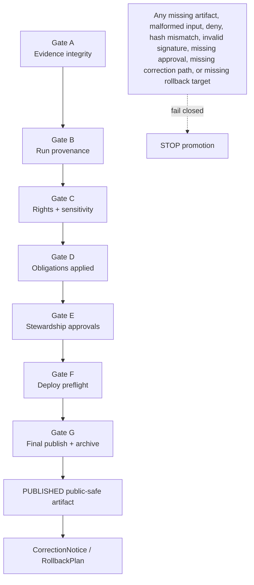

<!-- [KFM_META_BLOCK_V2]
doc_id: TODO(assign kfm://doc UUID)
title: ADR 0002: Promotion Contract
type: standard
version: v1
status: published
owners: TODO(verify ADR owner / release governance steward)
created: TODO(verify original ADR creation date)
updated: TODO(verify commit date for this revision)
policy_label: TODO(verify public/restricted label)
related: [../governance/gates/PROMOTION_CONTRACT.md, ../runbooks/promotion-gates.md, ../../control_plane/promotion_contract.json, ../../control_plane/policy_gate_register.yaml]
tags: [kfm, adr, promotion, release-governance, policy-gates]
notes: [ADR status is Accepted; metadata placeholders require maintainer verification before merge.]
[/KFM_META_BLOCK_V2] -->

# ADR 0002: Promotion Contract

Promotion is a governed release transition, not a file move.

## Status

Accepted

## Decision area

Release governance, promotion gates, policy enforcement, artifact integrity, and publication control.

## Quick map

| Surface | Role | Expected path |
| --- | --- | --- |
| Human contract | Binding narrative contract for gate semantics | [`../governance/gates/PROMOTION_CONTRACT.md`](../governance/gates/PROMOTION_CONTRACT.md) |
| Machine contract | Gate map used by validators and CI | [`../../control_plane/promotion_contract.json`](../../control_plane/promotion_contract.json) |
| Existing control-plane gate register | Compatibility or transition register until reconciled | [`../../control_plane/policy_gate_register.yaml`](../../control_plane/policy_gate_register.yaml) |
| Operator runbook | Local and CI operating instructions | [`../runbooks/promotion-gates.md`](../runbooks/promotion-gates.md) |
| Gate input builder | Normalizes candidate artifacts before policy evaluation | [`../../tools/validators/build_gate_input.py`](../../tools/validators/build_gate_input.py) |
| Gate runner | Standard local wrapper for gates `A` through `G` | [`../../tools/validators/run_gate.sh`](../../tools/validators/run_gate.sh) |

> [!IMPORTANT]
> This ADR defines the release-control decision. It does not by itself prove that every required file, workflow, policy pack, or validator has already been implemented on every branch. Implementation alignment is tracked in [Open verification](#open-verification).

## Context

KFM promotion must be a governed state transition, not a file move.

Before this ADR, release promotion could drift across review notes, CI jobs, artifact folders, policy checks, and human convention. That creates a trust risk: a candidate could appear publishable even when evidence, provenance, rights, sensitivity, stewardship, preflight checks, signatures, hashes, or rollback readiness are incomplete.

KFM’s release path must preserve the trust spine:

```text
EvidenceBundle + receipts + validation
        ↓
policy gates + integrity checks
        ↓
review / stewardship decision
        ↓
ReleaseManifest + ProofPack
        ↓
PUBLISHED public-safe artifact
        ↓
CorrectionNotice / RollbackPlan
```

The release path also preserves KFM’s lifecycle law:

```text
RAW → WORK / QUARANTINE → PROCESSED → CATALOG / TRIPLET → PUBLISHED
```

Public release must never be treated as a direct copy from a candidate folder into a public location.

## Decision

Adopt a mandatory Promotion Contract for all publishable KFM release candidates.

The Promotion Contract defines gates `A` through `G`. Each gate binds together:

- required artifacts
- optional artifacts
- policy pack
- generated gate input
- integrity checks
- failure conditions
- audit output
- promotion-blocking outcome

The canonical human-facing promotion contract is:

```text
docs/governance/gates/PROMOTION_CONTRACT.md
```

The canonical machine-readable promotion contract is:

```text
control_plane/promotion_contract.json
```

Older references to a root-level `promotion-contract.json` are compatibility references only. Tooling may temporarily support that legacy path through an explicit environment variable, but the governed control-plane home is `control_plane/promotion_contract.json`.

If the repository uses an existing YAML gate register such as:

```text
control_plane/policy_gate_register.yaml
```

then that YAML register must be explicitly classified as one of:

- compatibility source
- generated mirror
- transition register
- deprecated legacy register

It must not diverge from `control_plane/promotion_contract.json`.

> [!IMPORTANT]
> `artifacts/` is only a release-candidate staging input for gate evaluation. It is not the canonical home for long-lived receipts, proofs, release authority, or published truth. Canonical release decisions belong under `release/`; lifecycle receipts and proofs belong under `data/receipts/` and `data/proofs/`; public-safe outputs belong under `data/published/`.

## Gate map

| Gate | Name | Purpose | Policy pack | Required artifact families | Integrity check |
| --- | --- | --- | --- | --- | --- |
| `A` | Evidence integrity | Proves candidate evidence exists, is parseable, and matches the declared content hash. | `policy/evidence` | `EvidenceBundle`, `spec_hash` | Canonical `spec_hash` verification |
| `B` | Run provenance | Proves the run is traceable to a receipt and, where required, signed evidence. | `policy/provenance` | `run_receipt`, evidence signature bundle | Signature verification |
| `C` | Rights and sensitivity | Blocks unclear rights, unsupported source authority, or unsafe sensitivity posture. | `policy/rights` | `EvidenceBundle`, license/rights material | Policy decision |
| `D` | Obligations applied | Confirms required redaction, attribution, transformation, or obligation receipts exist. | `policy/obligations` | redaction/obligation receipts | Post-transform hash or receipt alignment |
| `E` | Stewardship approvals | Confirms required review, steward, or domain approval exists. | `policy/approvals` | decision/review log | Policy decision |
| `F` | Deploy preflight | Confirms public exposure, deployment, and release readiness checks are satisfied. | `policy/preflight` | preflight report | Policy decision |
| `G` | Final publish and archive | Confirms release manifest, attestations, signatures, and artifact hashes are complete before publication. | `policy/release` | `ReleaseManifest`, release signature bundle, attestations | Artifact hash verification and signature verification |

## Gate sequence



## Gate execution model

Gate execution must not point Conftest directly at raw candidate folders.

Instead, each gate first builds a normalized gate input:

```bash
python tools/validators/build_gate_input.py \
  --gate A \
  --contract control_plane/promotion_contract.json \
  --out .promotion/gate_A.json
```

Then the gate runs the relevant policy pack:

```bash
conftest test .promotion/gate_A.json --policy policy/evidence
```

The required end-state wrapper behavior is:

```bash
tools/validators/run_gate.sh A
tools/validators/run_gate.sh B
tools/validators/run_gate.sh C
tools/validators/run_gate.sh D
tools/validators/run_gate.sh E
tools/validators/run_gate.sh F
tools/validators/run_gate.sh G
```

During migration, if `run_gate.sh` still defaults to a legacy root-level `promotion-contract.json`, operators must use the explicit override:

```bash
PROMOTION_CONTRACT=control_plane/promotion_contract.json tools/validators/run_gate.sh A
```

`.promotion/` is disposable generated validator material. It must not be treated as release evidence unless a later ADR explicitly changes that rule.

## Fail-closed rules

Promotion stops when any gate reports:

- missing required artifact
- malformed JSON artifact
- missing generated gate input
- policy `deny`
- unresolved `EvidenceRef`
- unresolved or incomplete `EvidenceBundle`
- canonical `spec_hash` mismatch
- required signature missing or invalid
- release manifest artifact hash mismatch
- missing attestation directory when required
- missing release approval
- missing correction path
- missing rollback target
- public exposure of `RAW`, `WORK`, `QUARANTINE`, unpublished candidates, internal canonical stores, direct model outputs, secrets, or sensitive exact geometry

No later gate may waive an earlier gate failure. A release candidate must pass gates `A` through `G` in order before publication or archive jobs run.

## Publication boundary

Passing validators is not publication.

A release becomes publishable only when the Promotion Contract produces or verifies the following release closure:

```text
ValidationReport
PolicyDecision
ReviewRecord / stewardship approval
ReleaseManifest
ProofPack or equivalent closure bundle
CorrectionNotice path
RollbackPlan / rollback target
```

Publication must occur through a governed release process. Direct copying from candidate artifacts into public locations is denied.

## Consequences

This ADR makes the Promotion Contract part of the release control surface.

Positive consequences:

- publication becomes inspectable and repeatable
- gate failures become visible as structured evidence
- CI, policy, validators, and release docs share one contract
- missing artifacts fail closed instead of being overlooked
- public release depends on evidence, policy, review, integrity, correction, and rollback closure

Costs and obligations:

- maintainers must keep the human contract, machine contract, validators, policy packs, runbook, and workflow aligned
- compatibility references to root-level `promotion-contract.json` must be migrated or explicitly documented
- every new gate field must include fixtures and negative-path tests
- release candidates must carry enough artifacts for policy and validators to make an auditable decision
- existing YAML gate registers must either generate, mirror, or be reconciled with the canonical machine-readable contract

## Alternatives considered

| Alternative | Decision | Reason |
| --- | --- | --- |
| Keep promotion as reviewer convention | Rejected | Human convention is not enough for reproducible release governance. |
| Run Conftest directly against `artifacts/` | Rejected | Raw directories, missing files, parse errors, `.txt` files, and malformed artifacts must be normalized into policy-visible inputs first. |
| Put the machine contract at repo root only | Rejected | Promotion governance is a machine-readable control-plane concern; the canonical home is `control_plane/`. |
| Treat `artifacts/` as canonical release authority | Rejected | `artifacts/` may stage candidates, but canonical release authority belongs to `release/`, with receipts/proofs under lifecycle roots. |
| Allow final publish after CI success alone | Rejected | CI success without release manifest, proof closure, correction path, and rollback target is insufficient. |
| Allow YAML and JSON gate maps to drift independently | Rejected | A split machine contract creates policy ambiguity and makes gate failures harder to audit. |

## Compatibility and migration

The expected compatibility sequence is:

1. Create or confirm `control_plane/promotion_contract.json`.
2. Classify `control_plane/policy_gate_register.yaml` as canonical input, generated mirror, compatibility source, or deprecated register.
3. Update `tools/validators/run_gate.sh` so its default contract path is `control_plane/promotion_contract.json`, or document a deliberate YAML-to-JSON bridge.
4. Preserve support for `PROMOTION_CONTRACT=<path>` as an explicit override.
5. Update documentation references that still point to root-level `promotion-contract.json`.
6. Ensure `.github/workflows/promotion.yml` calls the same local gate commands.
7. Add tests proving missing contract paths fail with a clear `ERROR`.
8. Add drift tests proving YAML and JSON gate maps cannot disagree if both are retained.

During migration, any root-level `promotion-contract.json` must be treated as one of:

- compatibility shim
- generated mirror
- deprecated legacy path
- intentionally absent

It must not evolve independently from `control_plane/promotion_contract.json`.

## Validation and enforcement

Required validation surfaces:

| Surface | Required check |
| --- | --- |
| Human contract | `docs/governance/gates/PROMOTION_CONTRACT.md` matches gate names, policy packs, required artifacts, and failure semantics. |
| Machine contract | `control_plane/promotion_contract.json` validates against the promotion-contract schema. |
| Gate register bridge | `control_plane/policy_gate_register.yaml`, if retained, reconciles with or generates the canonical JSON contract. |
| Runbook | `docs/runbooks/promotion-gates.md` documents the current operational commands. |
| Gate input builder | `tools/validators/build_gate_input.py` emits gate input with required/optional paths and file descriptions. |
| Gate runner | `tools/validators/run_gate.sh <A-G>` builds input, runs Conftest, and executes gate-specific integrity checks. |
| Policy packs | Each pack has positive and negative tests. |
| Workflow | `.github/workflows/promotion.yml` runs all gates and blocks publish/archive unless Gate `G` succeeds. |
| Release candidate | Required artifacts exist, parse, hash, and verify. |

Minimum local validation command sequence:

```bash
tools/validators/run_gate.sh A
tools/validators/run_gate.sh B
tools/validators/run_gate.sh C
tools/validators/run_gate.sh D
tools/validators/run_gate.sh E
tools/validators/run_gate.sh F
tools/validators/run_gate.sh G
```

Recommended CI validation also includes:

```bash
python tools/validators/build_gate_input.py \
  --gate A \
  --contract control_plane/promotion_contract.json \
  --out .promotion/gate_A.json

conftest test .promotion/gate_A.json --policy policy/evidence
```

## Rollback

Rollback of this ADR is allowed only as a coordinated release-governance rollback.

Do not roll back one surface at a time.

A safe rollback must revert or supersede these surfaces together:

```text
docs/adr/ADR-0015-promotion-contract.md
docs/governance/gates/PROMOTION_CONTRACT.md
docs/runbooks/promotion-gates.md
control_plane/promotion_contract.json
control_plane/policy_gate_register.yaml
tools/validators/build_gate_input.py
tools/validators/run_gate.sh
policy/
.github/workflows/promotion.yml
tests/policy/
tests/validators/
```

Partial rollback is denied because it can create disagreement between documentation, policy, validators, and CI.

## Open verification

Implementation alignment must be verified on the target branch before treating this ADR as fully enforced.

- [ ] Confirm `control_plane/promotion_contract.json` exists on the target branch.
- [ ] Confirm whether `control_plane/policy_gate_register.yaml` remains canonical, transitional, generated, or deprecated.
- [ ] Confirm whether any root-level `promotion-contract.json` remains and classify it as compatibility, generated, deprecated, or absent.
- [ ] Confirm `tools/validators/run_gate.sh` defaults to `control_plane/promotion_contract.json`, or explicitly documents the compatibility override.
- [ ] Confirm `docs/governance/gates/PROMOTION_CONTRACT.md` no longer points to a root-level machine contract unless that path is a documented compatibility shim.
- [ ] Confirm `.github/workflows/promotion.yml` exists and runs gates `A` through `G`.
- [ ] Confirm every policy pack in the machine contract has positive and negative tests.
- [ ] Confirm Gate `A` catches `spec_hash` mismatch.
- [ ] Confirm Gate `B` catches missing or invalid evidence signature bundles.
- [ ] Confirm Gate `G` catches release manifest hash mismatch.
- [ ] Confirm publish/archive jobs cannot run unless Gate `G` succeeds.
- [ ] Confirm rollback target and correction path are required before public publication.
- [ ] Confirm `.promotion/` is ignored or otherwise prevented from becoming release evidence.

## Related files

```text
docs/governance/gates/PROMOTION_CONTRACT.md
docs/runbooks/promotion-gates.md
control_plane/promotion_contract.json
control_plane/policy_gate_register.yaml
tools/validators/build_gate_input.py
tools/validators/run_gate.sh
.github/workflows/promotion.yml
policy/
release/
data/receipts/
data/proofs/
data/published/
tests/policy/
tests/validators/
```
