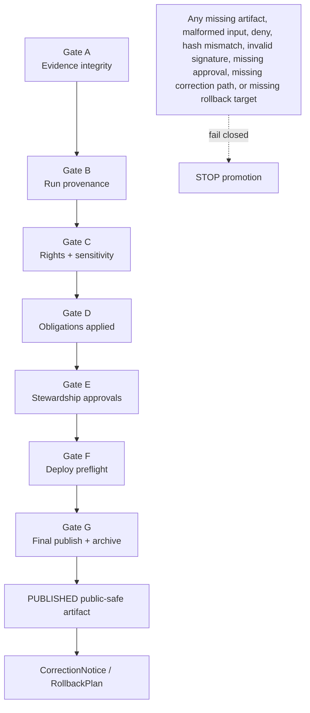

<!-- [KFM_META_BLOCK_V2]
doc_id: kfm://doc/NEEDS-VERIFICATION-ADR-0015
title: ADR 0015: Promotion Contract
type: standard
version: v1.1-review
status: review
owners: OWNER_TBD_NEEDS_VERIFICATION
created: DATE_TBD_FROM_GIT_OR_DOC_REGISTRY
updated: 2026-05-06
policy_label: POLICY_LABEL_TBD_NEEDS_VERIFICATION
related: [../governance/gates/PROMOTION_CONTRACT.md, ../runbooks/promotion-gates.md, ../../control_plane/policy_gate_register.yaml, ../../control_plane/promotion_contract.json, ../../tools/validators/build_gate_input.py, ../../tools/validators/run_gate.sh, ../../tools/validators/check_spec_hash.py, ./.ADR-0016-spec-hash.md]
tags: [kfm, adr, promotion, release-governance, policy-gates, release-manifest, rollback]
notes: [Decision status is accepted. Document revision status remains review until doc_id, owners, created date, policy label, control_plane/promotion_contract.json existence, workflow enforcement, and gate-runner default path are verified in the active branch.]
[/KFM_META_BLOCK_V2] -->

<a id="top"></a>

# ADR 0015: Promotion Contract

Defines how KFM turns a release candidate into publishable material through evidence, policy, review, integrity, correction, and rollback gates.

<p align="center">
  
  
  
  
  
  
</p>

<p align="center">
  <a href="#status">Status</a> ·
  <a href="#decision-summary">Decision</a> ·
  <a href="#evidence-basis">Evidence</a> ·
  <a href="#context">Context</a> ·
  <a href="#gate-map">Gate map</a> ·
  <a href="#gate-execution-model">Execution</a> ·
  <a href="#publication-boundary">Publication</a> ·
  <a href="#validation-and-enforcement">Validation</a> ·
  <a href="#rollback-and-supersession">Rollback</a> ·
  <a href="#open-verification">Open verification</a>
</p>

> [!IMPORTANT]
> **ADR decision status:** `accepted`  
> **Document revision status:** `review`  
> **Implementation posture:** `CONFIRMED` for several related repo files; `NEEDS VERIFICATION / NEEDS ALIGNMENT` for the canonical machine contract JSON, workflow enforcement, and default gate-runner path.  
> **Core rule:** promotion is a governed release transition, not a file move.

---

## Status

Accepted.

This ADR governs the promotion contract decision for KFM release candidates. It does **not** prove that every policy pack, validator, workflow, release artifact, signature check, proof pack, or publication job is fully enforced in the active branch.

| Field | Value |
|---|---|
| ADR ID | `0015` |
| Title | Promotion Contract |
| Decision status | `accepted` |
| Revision status | `review` |
| Scope | Release governance, promotion gates, policy enforcement, artifact integrity, publication control, rollback readiness |
| Primary human contract | [`../governance/gates/PROMOTION_CONTRACT.md`](../governance/gates/PROMOTION_CONTRACT.md) |
| Current confirmed machine gate register | [`../../control_plane/policy_gate_register.yaml`](../../control_plane/policy_gate_register.yaml) |
| Target canonical machine contract | `../../control_plane/promotion_contract.json` — `NEEDS VERIFICATION` |
| Gate input builder | [`../../tools/validators/build_gate_input.py`](../../tools/validators/build_gate_input.py) |
| Gate runner | [`../../tools/validators/run_gate.sh`](../../tools/validators/run_gate.sh) |
| Related integrity ADR | [`./ADR-0016-spec-hash.md`](./ADR-0016-spec-hash.md) |
| Rollback target | Prior aligned state of this ADR, promotion contract, machine gate map, policies, validators, workflow, tests, release docs, and rollback records |

> [!NOTE]
> A KFM ADR may be accepted while enforcement remains incomplete or under migration. Keep **decision state**, **implementation state**, **validation state**, and **release state** separate.

[Back to top](#top)

---

## Decision summary

KFM adopts a mandatory Promotion Contract for every release candidate that may become public or semi-public material.

The Promotion Contract binds each gate `A` through `G` to:

- required artifact families;
- optional artifact families;
- policy packs;
- normalized gate inputs;
- integrity checks;
- fail-closed outcomes;
- reviewer-visible audit output;
- correction and rollback readiness.

### One-line decision rule

> A release candidate may not become `PUBLISHED` until gates `A` through `G` pass in order and release closure includes evidence, policy, review, integrity, correction, and rollback support.

### One-line boundary rule

> Promotion must not allow public clients, UI surfaces, exports, map layers, story nodes, or governed AI responses to bypass released artifacts, governed APIs, EvidenceBundle resolution, policy decisions, review state, correction path, or rollback target.

### Current alignment snapshot

| Surface | Current posture | Required next action |
|---|---:|---|
| Human contract | `CONFIRMED` at `docs/governance/gates/PROMOTION_CONTRACT.md` | Align machine-contract wording with this ADR. |
| YAML gate register | `CONFIRMED` at `control_plane/policy_gate_register.yaml` | Classify as canonical interim register, generated mirror, compatibility source, or deprecated transition register. |
| JSON machine contract | `NEEDS VERIFICATION` at `control_plane/promotion_contract.json` | Create, generate, or document intentional absence. |
| Gate input builder | `CONFIRMED` | Align default contract path if JSON becomes canonical. |
| Gate runner | `CONFIRMED / NEEDS ALIGNMENT` | Default currently requires migration or explicit compatibility override. |
| Promotion workflow | `NEEDS VERIFICATION` | Verify or create `.github/workflows/promotion.yml`. |
| Gate `A` hash validator | `CONFIRMED` | Keep aligned with ADR 0016. |

[Back to top](#top)

---

## Evidence basis

This revision separates current repo evidence, KFM doctrine, current path gaps, and proposed alignment work.

| Evidence item | What it supports | Truth label | Limit |
|---|---|---:|---|
| `docs/adr/ADR-0015-promotion-contract.md` | Existing ADR path and accepted promotion-contract decision area | `CONFIRMED` | Does not prove full enforcement. |
| `docs/adr/README.md` | ADR directory is the human-facing decision ledger and lists ADR 0015 as surfaced/needs verification | `CONFIRMED` | Inventory completeness remains review-bound. |
| `docs/adr/ADR-TEMPLATE.md` | ADRs should expose evidence, impact, validation, rollback, and uncertainty | `CONFIRMED` | Template does not prove this ADR’s enforcement. |
| `docs/governance/gates/PROMOTION_CONTRACT.md` | Human promotion contract exists and maps gates `A` through `G` | `CONFIRMED / NEEDS ALIGNMENT` | Its machine-contract wording still needs path alignment. |
| `docs/runbooks/promotion-gates.md` | Operational runbook exists and documents normalized gate input, gate commands, fail-closed behavior, Sigstore/Cosign notes, and definition of done | `CONFIRMED / NEEDS ALIGNMENT` | It mentions both JSON and YAML machine maps; active behavior must be verified. |
| `control_plane/policy_gate_register.yaml` | Current confirmed machine-readable gate map with gates `A` through `G` | `CONFIRMED` | Must be classified relative to target JSON contract. |
| `control_plane/promotion_contract.json` | Target canonical machine-readable promotion contract | `NEEDS VERIFICATION` | Not confirmed in this revision’s repo evidence. |
| `tools/validators/build_gate_input.py` | Builds normalized gate input for Conftest from a selected contract path | `CONFIRMED` | Default contract path needs alignment if JSON is canonical. |
| `tools/validators/run_gate.sh` | Runs gate input builder, Conftest, and gate-specific integrity checks for `A` and `G` | `CONFIRMED / NEEDS ALIGNMENT` | Default contract path needs migration or explicit compatibility handling. |
| `tools/validators/check_spec_hash.py` | Implements Gate `A` canonical `spec_hash` validation behavior | `CONFIRMED` | Enforcement depends on gate runner and workflow execution. |
| `docs/adr/ADR-0016-spec-hash.md` | Defines canonical `spec_hash` algorithm and Gate `A` evidence-integrity relationship | `CONFIRMED` | CI enforcement remains separate evidence. |
| `README.md` | Root doctrine: KFM is evidence-first, map-first, time-aware; public clients use governed interfaces; lifecycle law is visible | `CONFIRMED` | Root README itself marks many repo claims `NEEDS VERIFICATION`. |
| `docs/adr/ADR-0002-responsibility-root-monorepo.md` | Root folders are responsibility boundaries; domain roots are rejected by default; `control_plane/`, `policy/`, `tools/`, `data/`, and `release/` have distinct duties | `CONFIRMED` | Subpath enforcement still needs validation evidence. |
| `docs/architecture/contract-schema-policy-split.md` | Contracts explain meaning, schemas validate shape, policy decides release/public behavior | `CONFIRMED` | Architecture note does not itself enforce policy or schema behavior. |

### Evidence interpretation

- `CONFIRMED` means the referenced repo file or doctrine was inspected for this revision.
- `NEEDS VERIFICATION` means a concrete check is still required in the active branch.
- `NEEDS ALIGNMENT` means related files exist but currently disagree or may point to different authority paths.
- `PROPOSED` means a recommended implementation change, not current behavior.

> [!CAUTION]
> Repeated documentation language is continuity evidence, not implementation proof. Claim enforcement only from inspected files, tests, workflows, logs, receipts, proof packs, release records, or runtime outputs.

[Back to top](#top)

---

## Context

KFM’s release path must preserve the trust spine:

```text
EvidenceBundle + receipts + validation
        ↓
policy gates + integrity checks
        ↓
review / stewardship decision
        ↓
ReleaseManifest + ProofPack
        ↓
PUBLISHED public-safe artifact
        ↓
CorrectionNotice / RollbackPlan
```

KFM’s lifecycle law remains:

```text
RAW -> WORK / QUARANTINE -> PROCESSED -> CATALOG / TRIPLET -> PUBLISHED
```

Before this ADR, promotion risked drifting across human review notes, CI jobs, candidate artifact folders, policy checks, signatures, and release docs. That creates a trust failure mode: a candidate can look publishable even when evidence, provenance, rights, sensitivity, review state, preflight checks, signatures, hashes, correction path, or rollback target are incomplete.

Promotion must therefore be a controlled state transition, not a direct copy from candidate artifacts into a public location.

### Why this is architecture-significant

This ADR protects KFM’s release membrane. A bad promotion contract can publish unsupported claims, expose restricted data, lose correction lineage, hide rollback gaps, or let generated/derived outputs become public truth without evidence closure.

### Non-goals

This ADR does **not** decide:

- the full release-manifest schema;
- the full proof-pack schema;
- every policy rule in `policy/`;
- the final CI workflow implementation;
- signing identity policy;
- source-specific rights review;
- domain-specific publication thresholds;
- UI component behavior;
- direct runtime route names;
- emergency or life-safety alerting behavior.

[Back to top](#top)

---

## Directory and authority basis

Promotion uses multiple roots. Each root has a distinct responsibility.

| Root / path family | Role in promotion | Must not become |
|---|---|---|
| `docs/adr/` | Human-facing decision ledger | Machine gate map, policy pack, proof store, release authority |
| `docs/governance/gates/` | Human-readable gate contract | Executable policy authority by itself |
| `docs/runbooks/` | Operator guidance | Canonical release decision |
| `control_plane/` | Machine-readable or semi-machine-readable governance maps | Raw data, proof custody, app logic |
| `policy/` | Admissibility and allow/deny/restrict/hold/release decisions | Schema authority or release manifest storage |
| `tools/validators/` | Deterministic checks and gate runners | Policy law, release authority, public truth |
| `artifacts/` | Candidate staging input for promotion evaluation | Long-lived canonical receipts, proofs, releases, or published truth |
| `data/receipts/` | Process memory and validation receipts | Policy law or proof-pack authority |
| `data/proofs/` | Proof-bearing artifacts when present | Schema/contract/policy source |
| `release/` | Release manifests, promotion decisions, rollback cards | Raw source data or ungoverned generated clutter |
| `data/published/` | Public-safe materialized outputs after release | Source-native truth or unpublished candidates |

> [!IMPORTANT]
> `artifacts/` is only a release-candidate staging input for gate evaluation. Canonical release decisions belong under `release/`; lifecycle receipts and proofs belong under `data/receipts/` and `data/proofs/`; public-safe outputs belong under `data/published/`.

[Back to top](#top)

---

## Decision

Adopt gates `A` through `G` as the mandatory promotion sequence for publishable KFM release candidates.

The canonical human-facing contract is:

```text
docs/governance/gates/PROMOTION_CONTRACT.md
```

The target canonical machine-readable contract is:

```text
control_plane/promotion_contract.json
```

Current repo evidence confirms this interim machine-readable gate register:

```text
control_plane/policy_gate_register.yaml
```

Until `control_plane/promotion_contract.json` is created or verified, `control_plane/policy_gate_register.yaml` must be treated as the current confirmed machine gate map and classified explicitly as one of:

- `canonical interim register`;
- `generated mirror`;
- `compatibility source`;
- `transition register`;
- `deprecated legacy register`.

It must not drift independently from the target canonical machine contract.

Older references to root-level `promotion-contract.json` are compatibility references only. Tooling may temporarily support that path through an explicit environment variable, but it must not silently become the long-term canonical control-plane home.

### Operating rule

> Policy gates consume normalized gate inputs. They do not scan raw candidate directories directly.

### Boundary rule

> Passing gate validators is not publication. Publication requires release closure: validation, policy, review, release manifest, proof support, correction path, and rollback target.

[Back to top](#top)

---

## Gate map

| Gate | Name | Purpose | Policy pack | Required artifact families | Integrity check |
|---|---|---|---|---|---|
| `A` | Evidence integrity | Proves candidate evidence exists, parses, and matches the declared content hash. | `policy/evidence` | `EvidenceBundle`, `spec_hash` | Canonical `spec_hash` verification |
| `B` | Run provenance | Proves the run is traceable to receipts and required signature material. | `policy/provenance` | `run_receipt`, evidence signature bundle | Signature verification |
| `C` | Rights and sensitivity | Blocks unclear rights, unsupported source authority, or unsafe sensitivity posture. | `policy/rights` | `EvidenceBundle`, license/rights material | Policy decision |
| `D` | Obligations applied | Confirms required redaction, attribution, transformation, or obligation receipts exist. | `policy/obligations` | redaction/obligation receipts | Post-transform hash or receipt alignment |
| `E` | Stewardship approvals | Confirms required review, steward, or domain approval exists. | `policy/approvals` | decision/review log | Policy decision |
| `F` | Deploy preflight | Confirms public exposure, deployment, and release-readiness checks are satisfied. | `policy/preflight` | preflight report | Policy decision |
| `G` | Final publish and archive | Confirms release manifest, attestations, signatures, and artifact hashes are complete before publication. | `policy/release` | `ReleaseManifest`, release signature bundle, attestations | Artifact hash verification and signature verification |

### Gate sequence



[Back to top](#top)

---

## Gate execution model

Gate execution must build normalized gate input before policy evaluation.

Example target model for Gate `A`:

```bash
python tools/validators/build_gate_input.py \
  --gate A \
  --contract control_plane/promotion_contract.json \
  --out .promotion/gate_A.json

conftest test .promotion/gate_A.json --policy policy/evidence
```

Current migration-safe command when the YAML register is the confirmed machine map:

```bash
# Use only if the active gate-input builder supports this contract format,
# or after a converter produces the expected JSON contract shape.
PROMOTION_CONTRACT=control_plane/policy_gate_register.yaml tools/validators/run_gate.sh A
```

Current migration-safe command when a root-level compatibility file is intentionally retained:

```bash
PROMOTION_CONTRACT=promotion-contract.json tools/validators/run_gate.sh A
```

The required end-state local wrapper behavior is:

```bash
tools/validators/run_gate.sh A
tools/validators/run_gate.sh B
tools/validators/run_gate.sh C
tools/validators/run_gate.sh D
tools/validators/run_gate.sh E
tools/validators/run_gate.sh F
tools/validators/run_gate.sh G
```

In the end state, `tools/validators/run_gate.sh` should default to:

```text
control_plane/promotion_contract.json
```

or to a documented converter/bridge that reads the current classified register and emits the canonical contract shape.

### Generated gate inputs

Generated gate inputs belong under:

```text
.promotion/
```

Examples:

```text
.promotion/gate_A.json
.promotion/gate_B.json
.promotion/gate_C.json
.promotion/gate_D.json
.promotion/gate_E.json
.promotion/gate_F.json
.promotion/gate_G.json
```

`.promotion/` is disposable validator material. It must not become release evidence unless a successor ADR explicitly changes that rule.

[Back to top](#top)

---

## Fail-closed rules

Promotion stops when any gate reports:

- missing required artifact;
- malformed JSON artifact;
- missing generated gate input;
- policy `deny`;
- unresolved `EvidenceRef`;
- unresolved or incomplete `EvidenceBundle`;
- canonical `spec_hash` mismatch;
- embedded `EvidenceBundle.spec_hash` mismatch when present;
- required signature missing or invalid;
- release manifest artifact hash mismatch;
- missing attestation directory when required;
- missing release approval;
- missing correction path;
- missing rollback target;
- public exposure of `RAW`, `WORK`, `QUARANTINE`, unpublished candidates, internal canonical stores, direct model outputs, secrets, or sensitive exact geometry.

No later gate may waive an earlier gate failure.

A release candidate must pass gates `A` through `G` in order before publication or archive jobs run.

### Negative outcomes

| Condition | Expected outcome |
|---|---|
| Evidence cannot be resolved | `ABSTAIN` or blocked promotion |
| Policy denies rights/sensitivity/release state | `DENY` |
| Validator cannot parse or inspect required material | `ERROR` |
| Required reviewer or steward approval is missing | `HOLD` or blocked promotion |
| Rollback target is missing | blocked promotion |
| Correction path is missing | blocked promotion |
| Candidate tries to publish from internal lifecycle stages | `DENY` |

[Back to top](#top)

---

## Publication boundary

Passing validators is not publication.

A release becomes publishable only when the promotion process produces or verifies release closure:

```text
ValidationReport
PolicyDecision
ReviewRecord / stewardship approval
ReleaseManifest
ProofPack or equivalent closure bundle
CorrectionNotice path
RollbackPlan / rollback target
```

Publication must occur through a governed release process. Direct copying from candidate artifacts into public locations is denied.

### Public-client rule

Public clients and normal UI surfaces must consume only:

- released artifacts;
- governed API responses;
- governed tile services;
- catalog records;
- EvidenceBundle-resolved responses;
- policy-safe response envelopes.

They must not consume:

- `RAW`;
- `WORK`;
- `QUARANTINE`;
- unpublished release candidates;
- internal canonical stores;
- source-system side effects;
- secrets;
- direct model runtime output.

[Back to top](#top)

---

## Machine contract and register alignment

Current repo evidence confirms `control_plane/policy_gate_register.yaml` as the present gate map. This ADR sets the target canonical machine contract as `control_plane/promotion_contract.json`.

### Allowed alignment models

| Model | Status | Rule |
|---|---:|---|
| JSON canonical contract | `TARGET` | `control_plane/promotion_contract.json` is the contract consumed by gate tooling. |
| YAML canonical interim register | `ALLOWED DURING MIGRATION` | `control_plane/policy_gate_register.yaml` remains the confirmed machine gate map until JSON is created or generated. |
| YAML generated mirror | `ALLOWED` | YAML may mirror the JSON contract if generation is deterministic and drift-tested. |
| YAML source of generated JSON | `ALLOWED` | YAML may generate JSON if the generator and drift tests are explicit. |
| Root `promotion-contract.json` | `COMPATIBILITY ONLY` | May remain as shim/mirror/deprecated path; must not evolve independently. |
| Parallel independent JSON and YAML | `DENIED` | Split gate maps weaken promotion auditability. |

### Minimum contract fields

Each gate record must provide:

| Field | Purpose |
|---|---|
| `name` | Human-readable gate name. |
| `policy` | Policy pack path. |
| `requires` | Required candidate artifact paths. |
| `optional` | Optional candidate artifact paths, if any. |
| `integrity` | Gate-specific integrity checks. |
| `failure_semantics` or inherited semantics | How missing artifacts, policy deny, parse errors, and integrity errors fail closed. |

### Drift prevention

If both YAML and JSON exist, add a drift test proving:

- gate IDs match exactly;
- gate names match;
- policy pack paths match;
- required artifact paths match;
- integrity checks match;
- failure semantics match;
- no additional gate appears in only one representation.

[Back to top](#top)

---

## Affected surfaces

| Surface | Required relationship to this ADR | Current alignment |
|---|---|---:|
| [`../governance/gates/PROMOTION_CONTRACT.md`](../governance/gates/PROMOTION_CONTRACT.md) | Human contract must describe gates `A` through `G`, fail-closed behavior, and machine contract location. | `CONFIRMED / NEEDS ALIGNMENT` |
| [`../runbooks/promotion-gates.md`](../runbooks/promotion-gates.md) | Operational instructions must match current gate-runner behavior and contract path. | `CONFIRMED / NEEDS ALIGNMENT` |
| [`../../control_plane/policy_gate_register.yaml`](../../control_plane/policy_gate_register.yaml) | Current confirmed machine gate map; must be classified relative to target JSON. | `CONFIRMED` |
| `../../control_plane/promotion_contract.json` | Target canonical machine-readable contract. | `NEEDS VERIFICATION` |
| [`../../tools/validators/build_gate_input.py`](../../tools/validators/build_gate_input.py) | Must generate normalized gate input from the active contract/register path. | `CONFIRMED / NEEDS ALIGNMENT` |
| [`../../tools/validators/run_gate.sh`](../../tools/validators/run_gate.sh) | Must run gates `A` through `G` through normalized input and policy packs. | `CONFIRMED / NEEDS ALIGNMENT` |
| [`../../tools/validators/check_spec_hash.py`](../../tools/validators/check_spec_hash.py) | Gate `A` evidence-integrity validator. | `CONFIRMED` |
| `../../tools/validators/verify_release_manifest_hashes.py` | Gate `G` artifact-hash validator if present. | `NEEDS VERIFICATION` |
| `.github/workflows/promotion.yml` | Expected CI promotion workflow. | `NEEDS VERIFICATION` |
| `policy/evidence` | Gate `A` policy pack. | `NEEDS VERIFICATION` |
| `policy/provenance` | Gate `B` policy pack. | `NEEDS VERIFICATION` |
| `policy/rights` | Gate `C` policy pack. | `NEEDS VERIFICATION` |
| `policy/obligations` | Gate `D` policy pack. | `NEEDS VERIFICATION` |
| `policy/approvals` | Gate `E` policy pack. | `NEEDS VERIFICATION` |
| `policy/preflight` | Gate `F` policy pack. | `NEEDS VERIFICATION` |
| `policy/release` | Gate `G` policy pack. | `NEEDS VERIFICATION` |
| `release/` | Release manifests, promotion decisions, rollback cards. | `NEEDS VERIFICATION` |
| `data/receipts/` | Validation and process receipts. | `NEEDS VERIFICATION` |
| `data/proofs/` | Proof-bearing closure material. | `NEEDS VERIFICATION` |
| `data/published/` | Public-safe materialization after promotion. | `NEEDS VERIFICATION` |

[Back to top](#top)

---

## Validation and enforcement

### Minimum local validation

After the active contract/register path is aligned, the full gate run should be:

```bash
tools/validators/run_gate.sh A
tools/validators/run_gate.sh B
tools/validators/run_gate.sh C
tools/validators/run_gate.sh D
tools/validators/run_gate.sh E
tools/validators/run_gate.sh F
tools/validators/run_gate.sh G
```

### Gate `A` hash validation

Gate `A` must run canonical `spec_hash` validation:

```bash
python tools/validators/check_spec_hash.py \
  artifacts/EvidenceBundle.json \
  artifacts/spec_hash.txt \
  --receipt-out .promotion/spec_hash_check.json
```

### Gate input generation

Gate input generation should remain explicit:

```bash
python tools/validators/build_gate_input.py \
  --gate A \
  --contract control_plane/promotion_contract.json \
  --out .promotion/gate_A.json
```

### Required validation matrix

| Check | Expected result | Status |
|---|---|---:|
| Human contract present | `docs/governance/gates/PROMOTION_CONTRACT.md` exists and maps gates `A` through `G`. | `CONFIRMED` |
| Machine gate map present | At least one classified machine gate map exists. | `CONFIRMED` for YAML / `NEEDS VERIFICATION` for JSON |
| Gate runner present | `tools/validators/run_gate.sh` exists. | `CONFIRMED` |
| Gate input builder present | `tools/validators/build_gate_input.py` exists. | `CONFIRMED` |
| Gate `A` catches `spec_hash` mismatch | Missing/stale hash fails closed. | `NEEDS VERIFICATION` through tests or run output |
| Gate `B` catches missing/invalid evidence signature bundle | Missing/invalid bundle fails closed. | `NEEDS VERIFICATION` |
| Gate `G` catches release manifest hash mismatch | Manifest mismatch fails closed. | `NEEDS VERIFICATION` |
| Policy packs exist | Each declared policy pack is present and testable. | `NEEDS VERIFICATION` |
| Workflow exists | `.github/workflows/promotion.yml` runs gates `A` through `G`. | `NEEDS VERIFICATION` |
| Publish/archive blocked on failure | Publish/archive jobs depend on Gate `G` success. | `NEEDS VERIFICATION` |
| Rollback target required | Missing rollback target blocks public promotion. | `NEEDS VERIFICATION` |
| Correction path required | Missing correction path blocks public promotion. | `NEEDS VERIFICATION` |
| `.promotion/` is not release evidence | Generated gate inputs are ignored or otherwise prevented from becoming release proof. | `NEEDS VERIFICATION` |

[Back to top](#top)

---

## Compatibility and migration

The expected migration sequence is:

1. Keep this ADR accepted and this revision in `review` until active-branch evidence is checked.
2. Confirm or create `control_plane/promotion_contract.json`.
3. Classify `control_plane/policy_gate_register.yaml`.
4. Align `docs/governance/gates/PROMOTION_CONTRACT.md` with the chosen machine-contract model.
5. Align `docs/runbooks/promotion-gates.md` with actual gate-runner behavior.
6. Update `tools/validators/build_gate_input.py` to consume the canonical contract/register path or a documented converter.
7. Update `tools/validators/run_gate.sh` so its default contract path is canonical, or document an explicit compatibility override.
8. Preserve `PROMOTION_CONTRACT=<path>` as a deliberate operator override.
9. Add drift tests if both YAML and JSON are retained.
10. Verify or create `.github/workflows/promotion.yml`.
11. Verify policy packs and negative-path tests.
12. Add release, correction, and rollback closure checks before any public publish/archive job.

During migration, any root-level `promotion-contract.json` must be one of:

- compatibility shim;
- generated mirror;
- deprecated legacy path;
- intentionally absent.

It must not evolve independently.

[Back to top](#top)

---

## Consequences

### Positive consequences

- Promotion becomes inspectable and repeatable.
- Gate failures become structured and reviewable.
- CI, policy, validators, release docs, and operator runbooks can converge on one contract.
- Missing artifacts fail closed instead of becoming hidden release risk.
- Public release depends on evidence, policy, review, integrity, correction, and rollback closure.
- Generated outputs, maps, tiles, graphs, searches, dashboards, exports, and AI answers stay downstream of governed release state.

### Costs and obligations

- Maintainers must keep human contract, machine contract, gate register, validators, policy packs, runbook, workflow, fixtures, and release docs aligned.
- Compatibility references to root-level `promotion-contract.json` must be migrated or explicitly documented.
- Every new gate field needs fixtures and negative-path tests.
- Release candidates must carry enough artifacts for policy and validators to make an auditable decision.
- YAML/JSON gate maps cannot drift independently.
- Workflow enforcement cannot be claimed until current workflow evidence is inspected.

### Risk register

| Risk | Impact | Mitigation |
|---|---|---|
| JSON target contract is absent while docs call it canonical | Operators may run against a missing path. | Keep JSON as `NEEDS VERIFICATION`; classify YAML as interim; update runner defaults only after file exists or generator is added. |
| `run_gate.sh` defaults to a legacy path | Local and CI commands may fail or use a stale contract. | Align default path or require explicit `PROMOTION_CONTRACT` override during migration. |
| Human and machine gate maps drift | Release gates become ambiguous. | Add drift tests and one canonical source/generator rule. |
| Policy packs are missing or untested | Gates become ceremonial. | Require positive and negative policy tests per gate. |
| Workflow is absent | Local gates may exist without CI enforcement. | Verify or create promotion workflow; do not claim merge-blocking enforcement before that. |
| `.promotion/` is treated as proof | Generated validator material becomes false release evidence. | Ignore or isolate `.promotion/`; store canonical receipts/proofs in governed lifecycle homes. |
| Publication happens after CI success alone | Release lacks review, proof, correction, or rollback closure. | Require full release closure before publish/archive. |

[Back to top](#top)

---

## Alternatives considered

| Alternative | Decision | Reason |
|---|---|---|
| Keep promotion as reviewer convention | Rejected | Human convention is not enough for reproducible release governance. |
| Run Conftest directly against `artifacts/` | Rejected | Raw directories, missing files, parse errors, `.txt` files, and malformed artifacts must be normalized into policy-visible input first. |
| Put the machine contract at repo root only | Rejected | Promotion governance is a control-plane concern. Root-level paths are compatibility only. |
| Treat `artifacts/` as canonical release authority | Rejected | `artifacts/` may stage candidates, but canonical release authority belongs to release/proof/receipt lifecycle roots. |
| Allow final publish after CI success alone | Rejected | CI success without release manifest, proof closure, correction path, and rollback target is insufficient. |
| Allow YAML and JSON gate maps to drift independently | Rejected | Split machine contracts create policy ambiguity and audit risk. |
| Block all promotion work until JSON exists | Rejected | The confirmed YAML register can serve as an interim machine map if explicitly classified and drift-controlled. |

[Back to top](#top)

---

## Rollback and supersession

Rollback of this ADR is allowed only as a coordinated release-governance rollback.

Do not roll back one surface at a time.

A safe rollback must revert or supersede these surfaces together:

```text
docs/adr/ADR-0015-promotion-contract.md
docs/governance/gates/PROMOTION_CONTRACT.md
docs/runbooks/promotion-gates.md
control_plane/promotion_contract.json
control_plane/policy_gate_register.yaml
tools/validators/build_gate_input.py
tools/validators/run_gate.sh
tools/validators/check_spec_hash.py
policy/
.github/workflows/promotion.yml
tests/policy/
tests/validators/
release/
data/receipts/
data/proofs/
```

Partial rollback is denied because it can create disagreement between documentation, policy, validators, gate registers, workflows, release objects, and public publication behavior.

### Rollback triggers

| Trigger | Required action |
|---|---|
| Human and machine contracts disagree | Block promotion, reconcile or supersede. |
| Gate runner reads an unintended contract | Block promotion, align default or require explicit override. |
| Gate `A` no longer runs `spec_hash` validation | Block promotion until restored or superseded by ADR. |
| Gate `G` cannot verify release manifest hashes | Block publication/archive. |
| Policy pack missing for any gate | Block the affected gate and release candidate. |
| Workflow publishes without Gate `G` | Disable publish/archive job and issue correction if public material was affected. |
| Rollback target missing | Block promotion. |
| Correction path missing | Block promotion. |
| Sensitive public exposure found | Halt publication, apply correction/withdrawal/rollback as appropriate, and preserve receipts. |

### Supersession rule

A successor ADR must:

1. preserve this ADR as lineage;
2. state which gates, files, policies, validators, workflows, and release objects change;
3. define migration and compatibility behavior;
4. include negative-path validation;
5. identify rollback and correction implications;
6. update the ADR index and related runbooks.

[Back to top](#top)

---

## Open verification

Implementation alignment must be verified on the target branch before treating this ADR as fully enforced.

- [ ] Confirm `doc_id`, created date, owners, policy label, and document-registry entry.
- [ ] Confirm `control_plane/promotion_contract.json` exists, or document why the YAML register is the current canonical interim map.
- [ ] Classify `control_plane/policy_gate_register.yaml` as canonical interim register, generated mirror, compatibility source, transition register, or deprecated legacy register.
- [ ] Confirm whether any root-level `promotion-contract.json` remains and classify it as compatibility, generated, deprecated, or intentionally absent.
- [ ] Confirm `tools/validators/build_gate_input.py` supports the active machine contract/register format.
- [ ] Confirm `tools/validators/run_gate.sh` defaults to the canonical contract path or documents an explicit compatibility override.
- [ ] Align `docs/governance/gates/PROMOTION_CONTRACT.md` machine-contract wording with this ADR.
- [ ] Align `docs/runbooks/promotion-gates.md` starter-package wording with actual current files.
- [ ] Confirm `.github/workflows/promotion.yml` exists and runs gates `A` through `G`, or update the expected workflow path.
- [ ] Confirm every policy pack in the active machine contract has positive and negative tests.
- [ ] Confirm Gate `A` catches `spec_hash` mismatch.
- [ ] Confirm Gate `B` catches missing or invalid evidence signature bundles.
- [ ] Confirm Gate `G` catches release manifest hash mismatch.
- [ ] Confirm publish/archive jobs cannot run unless Gate `G` succeeds.
- [ ] Confirm rollback target and correction path are required before public publication.
- [ ] Confirm `.promotion/` is ignored or otherwise prevented from becoming release evidence.
- [ ] Confirm receipts, proofs, release manifests, published artifacts, correction notices, and rollback cards remain in their governed homes.
- [ ] Confirm ADR index status for this file is updated from surfaced/needs verification to the correct active status.
- [ ] Confirm relative links in this ADR resolve in the active branch.

[Back to top](#top)

---

## Related files

| Path | Relationship | Status |
|---|---|---:|
| [`../governance/gates/PROMOTION_CONTRACT.md`](../governance/gates/PROMOTION_CONTRACT.md) | Human promotion contract. | `CONFIRMED / NEEDS ALIGNMENT` |
| [`../runbooks/promotion-gates.md`](../runbooks/promotion-gates.md) | Operator runbook for local and CI gate execution. | `CONFIRMED / NEEDS ALIGNMENT` |
| [`../../control_plane/policy_gate_register.yaml`](../../control_plane/policy_gate_register.yaml) | Current confirmed machine gate register. | `CONFIRMED` |
| `../../control_plane/promotion_contract.json` | Target canonical machine contract. | `NEEDS VERIFICATION` |
| [`../../tools/validators/build_gate_input.py`](../../tools/validators/build_gate_input.py) | Builds normalized gate inputs. | `CONFIRMED / NEEDS ALIGNMENT` |
| [`../../tools/validators/run_gate.sh`](../../tools/validators/run_gate.sh) | Runs gates through generated inputs and policy packs. | `CONFIRMED / NEEDS ALIGNMENT` |
| [`../../tools/validators/check_spec_hash.py`](../../tools/validators/check_spec_hash.py) | Gate `A` canonical `spec_hash` validator. | `CONFIRMED` |
| `../../tools/validators/verify_release_manifest_hashes.py` | Expected Gate `G` hash verifier. | `NEEDS VERIFICATION` |
| [`./ADR-0016-spec-hash.md`](./ADR-0016-spec-hash.md) | Defines canonical `spec_hash` algorithm for evidence integrity. | `CONFIRMED` |
| `.github/workflows/promotion.yml` | Expected CI promotion workflow. | `NEEDS VERIFICATION` |
| `policy/evidence` | Gate `A` policy pack. | `NEEDS VERIFICATION` |
| `policy/provenance` | Gate `B` policy pack. | `NEEDS VERIFICATION` |
| `policy/rights` | Gate `C` policy pack. | `NEEDS VERIFICATION` |
| `policy/obligations` | Gate `D` policy pack. | `NEEDS VERIFICATION` |
| `policy/approvals` | Gate `E` policy pack. | `NEEDS VERIFICATION` |
| `policy/preflight` | Gate `F` policy pack. | `NEEDS VERIFICATION` |
| `policy/release` | Gate `G` policy pack. | `NEEDS VERIFICATION` |
| `release/` | Release manifests, promotion decisions, rollback cards. | `NEEDS VERIFICATION` |
| `data/receipts/` | Validation and process receipts. | `NEEDS VERIFICATION` |
| `data/proofs/` | Proof-bearing closure material. | `NEEDS VERIFICATION` |
| `data/published/` | Public-safe materialized outputs after release. | `NEEDS VERIFICATION` |

[Back to top](#top)

---

## Review checklist

<details>
<summary>Pre-merge checklist for this ADR revision</summary>

- [ ] KFM meta block values are verified or deliberately placeholdered.
- [ ] ADR decision status and document revision status are not conflated.
- [ ] `docs/adr/README.md` links this ADR with the correct active status.
- [ ] Human promotion contract, runbook, machine gate map, validators, policy packs, and workflow use one aligned gate vocabulary.
- [ ] `control_plane/promotion_contract.json` is created, generated, or explicitly deferred.
- [ ] `control_plane/policy_gate_register.yaml` is classified.
- [ ] Root-level `promotion-contract.json` is absent, deprecated, generated, or compatibility-only.
- [ ] `tools/validators/run_gate.sh` default contract path is aligned or explicitly overridden in docs.
- [ ] `tools/validators/build_gate_input.py` supports the active contract/register shape.
- [ ] Gate `A` uses canonical `spec_hash` validation and aligns with ADR 0016.
- [ ] Gate `G` verifies release manifest artifact hashes.
- [ ] Every policy pack has positive and negative tests.
- [ ] The promotion workflow is present or workflow claims remain `NEEDS VERIFICATION`.
- [ ] Publish/archive jobs are blocked unless Gate `G` succeeds.
- [ ] `.promotion/` is treated as disposable validator material.
- [ ] Candidate `artifacts/` are not described as canonical release authority.
- [ ] Receipts, proofs, release manifests, published outputs, correction notices, and rollback cards remain separate.
- [ ] Public-client bypass from `RAW`, `WORK`, `QUARANTINE`, unpublished candidates, internal canonical stores, direct model outputs, secrets, or sensitive exact geometry is denied.
- [ ] Rollback instructions cover docs, machine maps, validators, policies, workflow, tests, release, receipts, proofs, and published outputs.
- [ ] No implementation claim exceeds current evidence.
- [ ] Stable anchors are preserved where practical.

</details>

[Back to top](#top)
