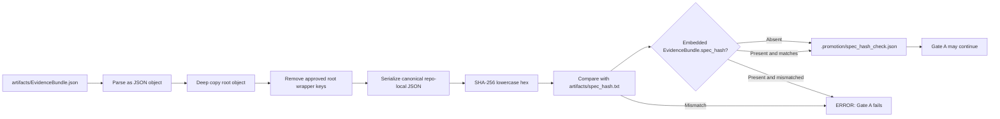

<!-- [KFM_META_BLOCK_V2]
doc_id: kfm://doc/NEEDS-VERIFICATION
title: ADR 0016: Canonical spec_hash
type: standard
version: v1
status: review
owners: OWNER_TBD_NEEDS_VERIFICATION
created: DATE_TBD_FROM_GIT_OR_DOC_REGISTRY
updated: 2026-05-06
policy_label: POLICY_LABEL_TBD_NEEDS_VERIFICATION
related: [docs/adr/ADR-0015-promotion-contract.md, docs/adr/ADR-0017-meta-block-v2.md, docs/governance/gates/PROMOTION_CONTRACT.md, docs/runbooks/promotion-gates.md, tools/validators/check_spec_hash.py, tools/validators/run_gate.sh, tools/validators/build_gate_input.py, tools/compute_spec_hash.py]
tags: [kfm, adr, spec_hash, evidencebundle, promotion, gate-a, canonical-json, evidence-integrity]
notes: [ADR decision status remains Accepted. Metadata status is review because doc_id, owners, created date, policy_label, document-registry linkage, workflow enforcement, machine-contract location, and ADR-index status still need verification. Current repo evidence confirms the target ADR path and validator implementation, but also shows promotion-contract path drift that must be resolved before enforcement is claimed.]
[/KFM_META_BLOCK_V2] -->

<a id="top"></a>

# ADR 0016: Canonical `spec_hash`

Defines the reproducible KFM `EvidenceBundle` digest used by promotion Gate `A` to verify release-candidate evidence integrity.

<p align="center">
  
  
  
  
  
</p>

<p align="center">
  <a href="#status">Status</a> ·
  <a href="#decision-summary">Decision</a> ·
  <a href="#evidence-basis">Evidence</a> ·
  <a href="#algorithm-contract">Algorithm</a> ·
  <a href="#affected-surfaces">Surfaces</a> ·
  <a href="#validation-and-enforcement">Validation</a> ·
  <a href="#rollback-and-supersession">Rollback</a> ·
  <a href="#open-verification">Open verification</a>
</p>

> [!IMPORTANT]
> **ADR decision status:** `Accepted`  
> **Document revision status:** `review`  
> **Decision area:** evidence integrity, release-candidate hashing, promotion Gate `A`, and downstream receipt alignment  
> **Normative implementation:** [`../../tools/validators/check_spec_hash.py`](../../tools/validators/check_spec_hash.py)  
> **Truth posture:** `CONFIRMED` for the algorithm implemented by the validator; `CONFLICTED / NEEDS VERIFICATION` for promotion-contract path alignment and CI workflow enforcement.

---

## Status

Accepted.

This ADR governs the `canonical-json-v1` `spec_hash` algorithm unless a successor ADR explicitly supersedes it.

| Field | Value |
|---|---|
| ADR ID | `0016` |
| Title | Canonical `spec_hash` |
| Decision status | `Accepted` |
| Revision status | `review` |
| Scope | `EvidenceBundle` content hashing for release-candidate evidence integrity |
| Primary gate | Gate `A` — evidence integrity |
| Normative validator | [`../../tools/validators/check_spec_hash.py`](../../tools/validators/check_spec_hash.py) |
| Generated Gate `A` receipt | `.promotion/spec_hash_check.json` |
| Related promotion ADR | [`./ADR-0015-promotion-contract.md`](./ADR-0015-promotion-contract.md) |
| Related metadata ADR | [`./ADR-0017-meta-block-v2.md`](./ADR-0017-meta-block-v2.md) |
| Decision confidence | `CONFIRMED` algorithm; `NEEDS VERIFICATION` enforcement |
| Rollback target | Prior accepted state of this ADR plus aligned validator, runbook, fixtures, promotion gate behavior, and workflow behavior |

> [!NOTE]
> This ADR records a hashing decision. It does **not** by itself prove that every workflow, policy pack, fixture, release candidate, or dashboard currently enforces the decision.

[Back to top](#top)

---

## Decision summary

KFM will use the repo-local `canonical-json-v1` algorithm to compute `spec_hash` for `EvidenceBundle` release candidates. The algorithm canonicalizes the bundle as JSON, excludes only approved root wrapper keys, computes a SHA-256 digest, compares it to `artifacts/spec_hash.txt`, and emits a validator receipt for Gate `A`.

**One-line rule:** `spec_hash` identifies the reviewed evidence-state content of an `EvidenceBundle`; wrapper fields such as signatures and root hash fields must not recursively change that digest.

**Trust boundary:** A passing `spec_hash` check is necessary for promotion, but it is not publication authority. Rights, sensitivity, provenance, review, release manifest, proof pack, correction, and rollback gates still apply.

[Back to top](#top)

---

## Context

KFM promotion must approve an exact, inspectable evidence state, not a merely plausible artifact folder. Gate `A` of the Promotion Contract is responsible for evidence integrity and must prove that the release candidate's `EvidenceBundle` is present, parseable, and bound to the declared content hash.

A raw file hash is not sufficient because the bundle may carry its own digest, signatures, attestations, or computed validator output. Hashing those wrapper fields would make the digest recursive or unstable. Formatting-only changes should not change the digest, while semantic changes to the releasable evidence state must change it.

This ADR exists to keep the promotion path aligned with KFM’s truth law:

```text
RAW -> WORK / QUARANTINE -> PROCESSED -> CATALOG / TRIPLET -> PUBLISHED
```

Promotion is a governed state transition. `spec_hash` is one guardrail in that transition.



[Back to top](#top)

---

## Evidence basis

This revision preserves the accepted ADR decision while making enforcement and path uncertainty more explicit.

| Evidence item | What it supports | Status | Limit |
|---|---|---:|---|
| `docs/adr/ADR-0016-spec-hash.md` | Existing ADR path, accepted decision area, and current document substance. | `CONFIRMED` | Does not prove workflow enforcement. |
| [`../../tools/validators/check_spec_hash.py`](../../tools/validators/check_spec_hash.py) | Normative implementation: excluded root keys, canonical JSON settings, SHA-256 digest, embedded hash check, and optional receipt output. | `CONFIRMED` | Does not prove all callers use it. |
| [`../../tools/validators/run_gate.sh`](../../tools/validators/run_gate.sh) | Gate `A` invokes `check_spec_hash.py` and writes `.promotion/spec_hash_check.json`. | `CONFIRMED / CONFLICTED` | Default contract path currently points to `promotion-contract.json`, not the ADR-0015 canonical `control_plane/promotion_contract.json`. |
| [`../../tools/validators/build_gate_input.py`](../../tools/validators/build_gate_input.py) | Gate input is normalized before policy evaluation. | `CONFIRMED / CONFLICTED` | Default contract path also points to `promotion-contract.json`. |
| [`../../tools/compute_spec_hash.py`](../../tools/compute_spec_hash.py) | Generic JSON hash helper exists. | `CONFIRMED` | It does not implement root-key exclusions or Gate `A` receipt behavior; it is not the normative validator for this ADR. |
| [`./ADR-0015-promotion-contract.md`](./ADR-0015-promotion-contract.md) | Promotion contract decision and Gate `A` evidence-integrity role. | `CONFIRMED` | Some implementation surfaces still need alignment. |
| [`../governance/gates/PROMOTION_CONTRACT.md`](../governance/gates/PROMOTION_CONTRACT.md) | Human promotion contract maps Gate `A` to canonical `spec_hash`. | `CONFIRMED / CONFLICTED` | It still names `promotion-contract.json` as the machine-readable version. |
| [`../runbooks/promotion-gates.md`](../runbooks/promotion-gates.md) | Operational guidance says Gate `A` runs canonical `spec_hash` validation and names `.promotion/` as disposable validator material. | `CONFIRMED` | It expects `control_plane/promotion_contract.json`, which must be confirmed or created. |
| `control_plane/promotion_contract.json` | Canonical machine-readable promotion contract named by ADR-0015 and the runbook. | `NEEDS VERIFICATION` | Direct fetch from `main` returned not found during this revision pass. |
| `.github/workflows/promotion.yml` | Expected CI enforcement workflow. | `NEEDS VERIFICATION` | Direct fetch from `main` returned not found during this revision pass. |
| `docs/adr/README.md` | ADR directory governance and index surface. | `CONFIRMED / NEEDS ALIGNMENT` | The index lists ADR-0016 as surfaced / needs verification; update after this revision is accepted. |
| `docs/adr/ADR-TEMPLATE.md` | ADR evidence, rollback, and truth-label structure. | `CONFIRMED` | Template does not prove this ADR’s enforcement. |
| [`./ADR-0017-meta-block-v2.md`](./ADR-0017-meta-block-v2.md) | Metadata-block policy for standards documents participating in promotion. | `CONFIRMED` | The exact top-of-file block style remains mixed across current ADR files. |

### Repository evidence checked for this revision

| Surface | Current finding | Status |
|---|---|---:|
| Target ADR path | `docs/adr/ADR-0016-spec-hash.md` exists on `main`. | `CONFIRMED` |
| Validator implementation | `tools/validators/check_spec_hash.py` exists and implements `canonical-json-v1`. | `CONFIRMED` |
| Gate runner | `tools/validators/run_gate.sh` exists and calls `check_spec_hash.py` for Gate `A`. | `CONFIRMED` |
| Generic helper | `tools/compute_spec_hash.py` exists but is not equivalent to the Gate `A` validator. | `CONFIRMED` |
| Machine contract | `control_plane/promotion_contract.json` not found on `main` by direct fetch. | `NEEDS VERIFICATION / GAP` |
| Root legacy contract | `promotion-contract.json` not found on `main` by direct fetch. | `NEEDS VERIFICATION / GAP` |
| Promotion workflow | `.github/workflows/promotion.yml` not found on `main` by direct fetch. | `NEEDS VERIFICATION / GAP` |
| ADR index | `docs/adr/README.md` lists ADR-0016 but marks coverage as needing verification. | `NEEDS ALIGNMENT` |

> [!WARNING]
> Current evidence shows a promotion-contract path drift: ADR-0015 and the runbook expect `control_plane/promotion_contract.json`, while current validator wrappers default to `promotion-contract.json`. Gate `A` should not be claimed as fully enforced until that drift is resolved.

[Back to top](#top)

---

## Decision

Use algorithm id `canonical-json-v1` for KFM `EvidenceBundle` `spec_hash`.

The normative validator is:

```text
tools/validators/check_spec_hash.py
```

The validator computes and verifies `spec_hash` as follows:

1. Read the candidate `EvidenceBundle` JSON from the default path:

   ```text
   artifacts/EvidenceBundle.json
   ```

2. Require the `EvidenceBundle` root to be a JSON object.

3. Deep-copy the root object.

4. Remove only these root-level keys before hashing:

   ```text
   spec_hash
   computed_spec_hash
   signatures
   attestations
   _signature
   ```

5. Preserve identically named nested fields. The exclusion is root-only.

6. Serialize the remaining object using repo-local canonical JSON settings:

   ```python
   json.dumps(
       normalized,
       sort_keys=True,
       separators=(",", ":"),
       ensure_ascii=False,
   ).encode("utf-8")
   ```

7. Compute SHA-256 over those canonical bytes.

8. Represent the digest as lowercase 64-character hex.

9. Compare the computed digest with:

   ```text
   artifacts/spec_hash.txt
   ```

10. If `EvidenceBundle.spec_hash` is present, require it to match `artifacts/spec_hash.txt`.

11. When Gate `A` runs, write the verification receipt to:

   ```text
   .promotion/spec_hash_check.json
   ```

`.promotion/` is disposable validator material. It is not canonical release evidence unless a later ADR explicitly changes that rule.

After any governed transform that changes releasable evidence content, recompute `spec_hash` and update dependent candidate artifacts, receipts, release manifests, and proof references.

[Back to top](#top)

---

## Algorithm contract

### Included and excluded content

| Content | Hash behavior | Reason |
|---|---|---|
| Ordinary root `EvidenceBundle` fields | Included | Semantic bundle content must affect the digest. |
| Root `spec_hash` | Excluded | Prevents self-recursion. |
| Root `computed_spec_hash` | Excluded | Prevents validator output from changing content identity. |
| Root `signatures` | Excluded | Signature wrappers must not recursively alter signed content. |
| Root `attestations` | Excluded | Attestation wrappers must not recursively alter signed content. |
| Root `_signature` | Excluded | Legacy or compatibility signature wrapper. |
| Nested fields named `spec_hash`, `computed_spec_hash`, `signatures`, `attestations`, or `_signature` | Included | Root-only exclusion keeps nested evidence content meaningful. |
| Whitespace and object-key order | Ignored | Canonical serialization stabilizes formatting-only changes. |
| Array order | Preserved | Array order remains semantic JSON content unless a successor ADR defines array normalization. |
| Numeric, string, boolean, and `null` values | Included | Semantic JSON value changes must change the digest. |

### Required receipt fields

Gate `A` writes `.promotion/spec_hash_check.json`.

The receipt must record enough information to audit the hash decision.

| Receipt field | Required purpose |
|---|---|
| `algorithm` | Must be `canonical-json-v1`. |
| `evidence_bundle` | Records the candidate bundle path. |
| `spec_hash_file` | Records the declared digest path. |
| `computed_spec_hash` | Records the digest computed from canonicalized content. |
| `spec_hash_file_value` | Records the declared digest read from `artifacts/spec_hash.txt`. |
| `embedded_spec_hash` | Records `EvidenceBundle.spec_hash` when present. |
| `excluded_root_keys` | Records the root wrapper keys excluded by the algorithm. |
| `valid` | Records whether computed, declared, and embedded values are aligned. |

> [!CAUTION]
> Do not promote `.promotion/spec_hash_check.json` into release evidence by accident. If a future release architecture needs this receipt under `data/receipts/` or `data/proofs/`, create a successor ADR or explicit migration note.

[Back to top](#top)

---

## Scope and non-goals

`canonical-json-v1` is a release-candidate digest algorithm for `EvidenceBundle` content.

It is not:

- a raw source-file checksum;
- a full JSON Canonicalization Scheme profile for all repo files;
- a signature digest;
- a proof-pack digest;
- a release-manifest artifact hash;
- a graph, tile, PMTiles, GeoParquet, search-index, dashboard, scene, or export hash;
- a guarantee that rights, sensitivity, review, or publication gates passed;
- a license, policy, or steward approval;
- a replacement for `EvidenceRef -> EvidenceBundle` resolution;
- a bypass around governed APIs or public-safe release state.

This ADR does not make generated text, map tiles, search indexes, graph projections, AI answers, dashboards, scenes, or exported reports into root truth.

[Back to top](#top)

---

## Required invariants

| Invariant | Rule |
|---|---|
| Stable formatting | Whitespace and object-key order changes must not change `spec_hash`. |
| Semantic sensitivity | Meaningful `EvidenceBundle` content changes must change `spec_hash`. |
| Signature non-recursion | Signature and attestation wrapper fields are excluded from the root hash. |
| Root-only exclusion | Only the listed root-level keys are excluded. |
| Nested evidence preserved | Nested same-named fields remain hash-significant. |
| Evidence before publication | `spec_hash` validation is necessary for promotion but not sufficient for publication. |
| No forced pass | Maintainers must not hand-edit `artifacts/spec_hash.txt` to force a pass. |
| Versioned migration | Any incompatible algorithm change must use a new algorithm id such as `canonical-json-v2`. |
| Trust membrane preserved | The digest must not allow public clients, generated outputs, or direct model responses to bypass governed release state. |
| Receipt separation | Generated `.promotion/` receipts stay separate from canonical release receipts and proofs unless superseded by ADR. |

[Back to top](#top)

---

## Options considered

| Option | Description | Benefits | Risks / costs | Outcome |
|---|---|---|---|---|
| Raw file hash | Hash `artifacts/EvidenceBundle.json` bytes directly. | Simple and tool-agnostic. | Formatting-only changes alter digest; signatures and embedded hashes create recursion. | Rejected |
| Hash every root field | Canonicalize the JSON but include `spec_hash`, signatures, and attestations. | Captures all visible fields. | Self-recursion and unstable signed-wrapper behavior. | Rejected |
| Generic helper only | Use `tools/compute_spec_hash.py` for Gate `A`. | Simple canonical JSON helper already exists. | Does not exclude root wrapper fields or emit Gate `A` receipt; not equivalent to this ADR. | Rejected as normative Gate `A` validator |
| `canonical-json-v1` through `check_spec_hash.py` | Repo-local canonical JSON, approved root-key exclusions, SHA-256, embedded digest alignment, optional receipt output. | Stable, explicit, tested by code inspection, release-gate friendly. | Requires path alignment, fixtures, and CI verification. | Accepted |
| Future external canonicalization profile | Replace or extend repo-local canonicalization with a broader standard profile. | Could improve interoperability. | Incompatible with current validator behavior unless migrated. | Deferred; requires successor ADR |

[Back to top](#top)

---

## Affected surfaces

| Surface | Expected relationship to this ADR | Current alignment status |
|---|---|---:|
| [`./ADR-0015-promotion-contract.md`](./ADR-0015-promotion-contract.md) | Defines Gate `A` as evidence integrity and binds promotion gates `A` through `G`. | `CONFIRMED` |
| [`../governance/gates/PROMOTION_CONTRACT.md`](../governance/gates/PROMOTION_CONTRACT.md) | Human contract should identify Gate `A` as canonical `spec_hash` validation and align machine-contract path wording. | `CONFIRMED / NEEDS ALIGNMENT` |
| [`../runbooks/promotion-gates.md`](../runbooks/promotion-gates.md) | Operational instructions say Gate `A` runs canonical `spec_hash` validation. | `CONFIRMED` |
| [`../../tools/validators/check_spec_hash.py`](../../tools/validators/check_spec_hash.py) | Normative implementation of `canonical-json-v1`. | `CONFIRMED` |
| [`../../tools/validators/run_gate.sh`](../../tools/validators/run_gate.sh) | Gate `A` invokes the hash validator and emits `.promotion/spec_hash_check.json`. | `CONFIRMED / CONFLICTED` default contract path |
| [`../../tools/validators/build_gate_input.py`](../../tools/validators/build_gate_input.py) | Builds normalized gate input before policy checks. | `CONFIRMED / CONFLICTED` default contract path |
| [`../../tools/compute_spec_hash.py`](../../tools/compute_spec_hash.py) | Generic JSON hash helper. | `CONFIRMED` helper; not normative for Gate `A` |
| `control_plane/promotion_contract.json` | Canonical machine-readable promotion contract per ADR-0015. | `NEEDS VERIFICATION / GAP` |
| `.github/workflows/promotion.yml` | Expected CI promotion workflow. | `NEEDS VERIFICATION / GAP` |
| `artifacts/EvidenceBundle.json` | Default release-candidate evidence bundle input. | Candidate artifact path |
| `artifacts/spec_hash.txt` | Default release-candidate declared digest. | Candidate artifact path |
| `.promotion/spec_hash_check.json` | Generated Gate `A` validation receipt. | Disposable validator material |
| `EvidenceBundle.spec_hash` | Optional embedded digest; if present, must match `artifacts/spec_hash.txt`. | Governed by this ADR |

### Alignment warning

> [!WARNING]
> `run_gate.sh` and `build_gate_input.py` currently default to `promotion-contract.json`, while ADR-0015 and the runbook identify `control_plane/promotion_contract.json` as the canonical machine contract. Neither path was confirmed on `main` during this revision pass. Fix the machine-contract path before claiming end-to-end Gate `A` enforcement.

[Back to top](#top)

---

## Validation and enforcement

### Direct validator command

Use this command to validate candidate hash alignment directly:

```bash
python tools/validators/check_spec_hash.py \
  artifacts/EvidenceBundle.json \
  artifacts/spec_hash.txt \
  --receipt-out .promotion/spec_hash_check.json
```

### Gate `A` command after promotion-contract path alignment

When `control_plane/promotion_contract.json` exists and the gate runner is aligned, Gate `A` should run through the standard wrapper:

```bash
PROMOTION_CONTRACT=control_plane/promotion_contract.json tools/validators/run_gate.sh A
```

After the wrappers default to the canonical contract path, the override should no longer be necessary:

```bash
tools/validators/run_gate.sh A
```

> [!IMPORTANT]
> Do not claim CI promotion enforcement until `.github/workflows/promotion.yml` or its verified successor exists and runs the same Gate `A` behavior.

### Expected pass condition

Gate `A` passes only when:

- `artifacts/EvidenceBundle.json` exists;
- `artifacts/EvidenceBundle.json` parses as JSON;
- the bundle root is a JSON object;
- `artifacts/spec_hash.txt` exists;
- `artifacts/spec_hash.txt` contains a 64-character SHA-256 hex digest;
- computed canonical digest equals `artifacts/spec_hash.txt`;
- embedded `EvidenceBundle.spec_hash`, when present, equals `artifacts/spec_hash.txt`;
- `.promotion/spec_hash_check.json` records algorithm, inputs, computed value, declared value, embedded value, excluded root keys, and `valid: true`.

### Required negative checks

| Case | Expected outcome |
|---|---|
| Missing `EvidenceBundle.json` | `ERROR`; Gate `A` fails. |
| Invalid JSON | `ERROR`; Gate `A` fails. |
| Root is not a JSON object | `ERROR`; Gate `A` fails. |
| Missing `spec_hash.txt` | `ERROR`; Gate `A` fails. |
| Non-SHA-256 digest text | `ERROR`; Gate `A` fails. |
| Declared digest differs from computed digest | `ERROR`; Gate `A` fails. |
| Embedded `EvidenceBundle.spec_hash` differs from `spec_hash.txt` | `ERROR`; Gate `A` fails. |
| Root-level signature material changes only | Hash remains unchanged. |
| Root-level attestation material changes only | Hash remains unchanged. |
| Root-level computed validator output changes only | Hash remains unchanged. |
| Nested evidence content changes | Hash changes. |
| Nested field named like an excluded root key changes | Hash changes. |
| Array order changes | Hash changes unless a successor ADR defines array normalization. |
| `run_gate.sh` cannot find the promotion contract | `ERROR`; promotion gate fails until path is aligned. |
| CI workflow is absent | `NEEDS VERIFICATION`; no CI enforcement claim. |

### Reviewer smoke test

| Question | Required answer |
|---|---|
| Does the validator still exclude only the approved root keys? | Yes. |
| Does it preserve nested same-named keys? | Yes. |
| Does it still serialize with `sort_keys=True`, `separators=(",", ":")`, and `ensure_ascii=False`? | Yes. |
| Does Gate `A` still write `.promotion/spec_hash_check.json`? | Yes, when invoked through the validator. |
| Does a mismatch fail closed? | Yes. |
| Does any helper bypass the normative validator? | No, unless a successor ADR says so. |
| Is the promotion-contract path resolved? | Must be verified before enforcement is claimed. |
| Is CI running the same gate behavior? | Must be verified before enforcement is claimed. |

[Back to top](#top)

---

## Failure handling

When `spec_hash` validation fails, maintainers must rebuild or regenerate the release candidate from governed inputs. They must not edit `artifacts/spec_hash.txt` merely to match a changed bundle.

If a mismatch is caused by a legitimate evidence or content transform:

1. regenerate `artifacts/EvidenceBundle.json` from governed input state;
2. recompute `artifacts/spec_hash.txt` using `canonical-json-v1`;
3. update embedded `EvidenceBundle.spec_hash` if used;
4. update downstream receipts, release-candidate artifacts, and proof references affected by the transform;
5. rerun Gate `A`;
6. rerun later gates whose inputs depend on evidence integrity.

If the mismatch is caused by tampering, stale artifacts, unexplained drift, or path conflict, the candidate must remain blocked until the drift is recorded and resolved.

| Failure signal | Required maintainer action |
|---|---|
| Missing bundle or declared hash | Regenerate the release candidate from governed inputs; do not publish. |
| Invalid bundle JSON | Fix candidate generation; keep candidate blocked. |
| Computed/declared mismatch | Determine whether the bundle changed, the hash file is stale, or tampering occurred. |
| Embedded/declared mismatch | Regenerate embedded digest or candidate bundle; do not hand-edit to force pass. |
| Receipt missing after Gate `A` | Treat Gate `A` as incomplete; rerun validator and inspect runner behavior. |
| Contract path missing | Create or verify the machine contract, align default paths, and record migration status. |
| CI workflow missing | Do not claim workflow enforcement; add or verify workflow before publication claims. |
| Human contract and runbook disagree | Update the stale surface or record a compatibility exception. |

[Back to top](#top)

---

## Rollback and supersession

### Rollback rule

Rollback of this ADR’s file content is allowed only if the validator, gate runner, runbook, fixtures, policy inputs, workflow references, and related promotion docs remain consistent with the rollback state.

Partial rollback that leaves docs and validator behavior in conflict is denied.

### Rollback triggers

| Trigger | Required action |
|---|---|
| Validator behavior diverges from this ADR | Block promotion until either the validator or ADR is corrected. |
| Gate `A` no longer runs the validator | Restore the call or supersede this ADR explicitly. |
| CI and local validation use different algorithms | Block publication and reconcile before release. |
| Machine-contract path drift blocks gate execution | Align paths through ADR-0015-compatible migration. |
| A future algorithm changes exclusions or serialization | Create successor ADR and migration fixtures. |
| Release candidates cannot be replayed under the declared algorithm | Freeze affected releases until replay metadata is repaired or a correction is issued. |

### Supersession rule

A future incompatible algorithm must use a new algorithm id, for example:

```text
canonical-json-v2
```

A safe successor must include:

- a successor ADR;
- compatibility handling for existing `canonical-json-v1` bundles;
- fixtures for v1 and v2;
- validator updates;
- runbook updates;
- release-manifest or proof-pack references recording which algorithm was used;
- rollback instructions;
- ADR index updates.

[Back to top](#top)

---

## Open verification

- [ ] Verify or create `control_plane/promotion_contract.json`.
- [ ] Decide whether any root-level `promotion-contract.json` is absent, generated, deprecated, or a compatibility shim.
- [ ] Update `tools/validators/run_gate.sh` so the default contract path aligns with ADR-0015, or document an explicit compatibility bridge.
- [ ] Update `tools/validators/build_gate_input.py` so the default contract path aligns with ADR-0015, or document an explicit compatibility bridge.
- [ ] Align `docs/governance/gates/PROMOTION_CONTRACT.md` machine-contract wording with ADR-0015.
- [ ] Verify or create `.github/workflows/promotion.yml`, or update workflow references to the verified promotion workflow path.
- [ ] Add positive and negative fixtures for `canonical-json-v1`.
- [ ] Confirm Gate `A` fixtures include missing file, malformed JSON, mismatched digest, embedded digest mismatch, root-wrapper-only change, nested excluded-key-name change, and array-order change cases.
- [ ] Decide whether `tools/compute_spec_hash.py` should be renamed, documented as generic-only, deprecated, or aligned with this ADR.
- [ ] Confirm any `EvidenceBundle` schema documents the optional embedded `spec_hash` field and algorithm id.
- [ ] Confirm release manifests or proof packs record enough information to replay hash calculation.
- [ ] Confirm `.promotion/` is ignored or otherwise prevented from becoming release evidence.
- [ ] Confirm KFM meta block values: `doc_id`, owners, created date, policy label, related links, and document-registry entry.
- [ ] Update `docs/adr/README.md` so ADR-0016 status reflects this accepted decision and its remaining enforcement gaps.

[Back to top](#top)

---

## Related files

| Path | Relationship | Status |
|---|---|---:|
| [`./ADR-0015-promotion-contract.md`](./ADR-0015-promotion-contract.md) | Promotion contract decision and Gate `A` evidence-integrity role. | `CONFIRMED` |
| [`./ADR-0017-meta-block-v2.md`](./ADR-0017-meta-block-v2.md) | Metadata standard related to promotion input documents. | `CONFIRMED` |
| [`../governance/gates/PROMOTION_CONTRACT.md`](../governance/gates/PROMOTION_CONTRACT.md) | Human promotion contract; needs machine-path wording alignment. | `CONFIRMED / NEEDS ALIGNMENT` |
| [`../runbooks/promotion-gates.md`](../runbooks/promotion-gates.md) | Operational runbook for local and CI gate execution. | `CONFIRMED` |
| [`../../tools/validators/check_spec_hash.py`](../../tools/validators/check_spec_hash.py) | Normative `canonical-json-v1` validator. | `CONFIRMED` |
| [`../../tools/validators/run_gate.sh`](../../tools/validators/run_gate.sh) | Gate runner that invokes the hash validator for Gate `A`. | `CONFIRMED / NEEDS ALIGNMENT` |
| [`../../tools/validators/build_gate_input.py`](../../tools/validators/build_gate_input.py) | Builds normalized gate input before policy checks. | `CONFIRMED / NEEDS ALIGNMENT` |
| [`../../tools/compute_spec_hash.py`](../../tools/compute_spec_hash.py) | Generic JSON hash helper; not normative for Gate `A` unless aligned. | `CONFIRMED` |
| `artifacts/EvidenceBundle.json` | Default release-candidate evidence bundle input. | Candidate artifact path |
| `artifacts/spec_hash.txt` | Default release-candidate declared digest. | Candidate artifact path |
| `.promotion/spec_hash_check.json` | Generated validator receipt. | Disposable validator material |
| `control_plane/promotion_contract.json` | Canonical machine-readable promotion contract per ADR-0015. | `NEEDS VERIFICATION / GAP` |
| `.github/workflows/promotion.yml` | Expected CI promotion workflow. | `NEEDS VERIFICATION / GAP` |

[Back to top](#top)

---

## Review checklist

<details>
<summary>Pre-merge checklist for this ADR revision</summary>

- [ ] KFM meta block values are verified or deliberately placeholdered.
- [ ] ADR title, H1, metadata title, and ADR index entry are synchronized.
- [ ] ADR decision status remains `Accepted`.
- [ ] Document revision status remains `review` until metadata and enforcement gaps are closed.
- [ ] Algorithm id remains `canonical-json-v1`.
- [ ] Root-only excluded keys remain exactly: `spec_hash`, `computed_spec_hash`, `signatures`, `attestations`, `_signature`.
- [ ] Nested same-named fields remain hash-significant.
- [ ] Serialization settings remain unchanged unless a successor ADR supersedes them.
- [ ] `check_spec_hash.py` remains the normative validator.
- [ ] `tools/compute_spec_hash.py` is not described as the Gate `A` validator unless aligned.
- [ ] Gate `A` local validation command still works when candidate artifacts exist.
- [ ] `run_gate.sh` emits `.promotion/spec_hash_check.json` for Gate `A`.
- [ ] Promotion-contract default path is aligned or explicitly documented as a compatibility exception.
- [ ] `docs/governance/gates/PROMOTION_CONTRACT.md` and `docs/runbooks/promotion-gates.md` agree on machine-contract location.
- [ ] CI workflow path is verified before claiming enforcement.
- [ ] Failure handling denies hand-editing `artifacts/spec_hash.txt` to force a pass.
- [ ] Rollback instructions cover docs, validators, fixtures, runbook, workflow, and downstream receipts.
- [ ] No generated text, map tile, graph projection, search index, dashboard, scene, AI answer, or export is described as root truth.
- [ ] No public path bypasses governed promotion, evidence, policy, review, release, correction, and rollback controls.
- [ ] `docs/adr/README.md` is updated after acceptance of this revision.

</details>

[Back to top](#top)
