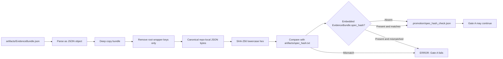

<!-- [KFM_META_BLOCK_V2]
doc_id: kfm://doc/NEEDS-VERIFICATION
title: ADR 0003: Canonical spec_hash
type: standard
version: v1
status: review
owners: OWNER_TBD_NEEDS_VERIFICATION
created: NEEDS_VERIFICATION-YYYY-MM-DD
updated: 2026-05-06
policy_label: POLICY_LABEL_TBD_NEEDS_VERIFICATION
related: [docs/adr/ADR-0015-promotion-contract.md, docs/governance/gates/PROMOTION_CONTRACT.md, docs/runbooks/promotion-gates.md, tools/validators/check_spec_hash.py, tools/validators/run_gate.sh, tools/validators/build_gate_input.py, tools/compute_spec_hash.py]
tags: [kfm, adr, spec_hash, evidencebundle, promotion, gate-a, canonical-json, evidence-integrity]
notes: [ADR decision status remains Accepted. Meta status is review because this revised Markdown still needs doc_id, owners, created date, policy_label, document-registry linkage, and workflow/contract-path verification before publication. Target path confirmed as docs/adr/ADR-0016-spec-hash.md from current GitHub evidence.]
[/KFM_META_BLOCK_V2] -->

<a id="top"></a>

# ADR 0003: Canonical `spec_hash`

Defines the reproducible KFM `EvidenceBundle` digest used by promotion Gate `A` to verify release-candidate evidence integrity.

> [!IMPORTANT]
> **Decision status:** `Accepted`  
> **Target path:** `docs/adr/ADR-0016-spec-hash.md`  
> **Decision area:** evidence integrity, release-candidate hashing, Gate `A`, and downstream receipt alignment  
> **Truth posture:** `CONFIRMED` algorithm and validator path where current repository evidence supports them; `NEEDS VERIFICATION` for owners, document registry metadata, CI workflow enforcement, and promotion-contract path alignment.

## Quick navigation

- [Status](#status)
- [ADR record](#adr-record)
- [Decision area](#decision-area)
- [Evidence basis](#evidence-basis)
- [Context](#context)
- [Decision](#decision)
- [Algorithm contract](#algorithm-contract)
- [Scope and non-goals](#scope-and-non-goals)
- [Required invariants](#required-invariants)
- [Affected surfaces](#affected-surfaces)
- [Consequences](#consequences)
- [Validation and enforcement](#validation-and-enforcement)
- [Failure handling](#failure-handling)
- [Migration and rollback](#migration-and-rollback)
- [Open verification](#open-verification)
- [Related files](#related-files)
- [Review checklist](#review-checklist)

---

## Status

Accepted.

This ADR is governing for the `canonical-json-v1` `spec_hash` algorithm unless a successor ADR explicitly supersedes it.

## ADR record

| Field | Value |
| --- | --- |
| ADR ID | `0003` |
| Title | Canonical `spec_hash` |
| Status | `Accepted` |
| Decision confidence | `CONFIRMED` for the algorithm as written in this ADR and implemented by `tools/validators/check_spec_hash.py`; `NEEDS VERIFICATION` for CI enforcement and promotion-contract path alignment |
| Decision owner | `OWNER_TBD_NEEDS_VERIFICATION` |
| Reviewers | `REVIEWER_TBD_NEEDS_VERIFICATION` |
| Policy label | `POLICY_LABEL_TBD_NEEDS_VERIFICATION` |
| Scope | Release-candidate evidence integrity; Gate `A`; `EvidenceBundle` content hashing |
| Primary validator | [`../../tools/validators/check_spec_hash.py`](../../tools/validators/check_spec_hash.py) |
| Generated receipt | `.promotion/spec_hash_check.json` |
| Related ADR | [`./ADR-0015-promotion-contract.md`](./ADR-0015-promotion-contract.md) |
| Rollback target | Prior accepted state of this ADR plus aligned validator, runbook, fixtures, and promotion-gate behavior |

> [!NOTE]
> This ADR records a hash algorithm and gate behavior. It does **not** prove that every workflow, fixture, policy pack, release candidate, or dashboard currently enforces the decision. Those enforcement surfaces remain listed in [Open verification](#open-verification).

## Decision area

Evidence integrity, release-candidate hashing, promotion Gate `A`, and downstream receipt alignment.

## Evidence basis

This revision preserves the existing ADR substance and adds reviewable evidence boundaries around repo-state claims.

| Evidence item | What it supports | Status | Limit |
| --- | --- | --- | --- |
| `docs/adr/ADR-0016-spec-hash.md` | Existing ADR path and current accepted decision text | `CONFIRMED` | Does not by itself prove CI enforcement. |
| `tools/validators/check_spec_hash.py` | Normative implementation of `canonical-json-v1`, root-only exclusions, SHA-256 digest, and receipt fields | `CONFIRMED` | Does not prove all callers use it. |
| `tools/validators/run_gate.sh` | Gate `A` invokes `check_spec_hash.py` and writes `.promotion/spec_hash_check.json` | `CONFIRMED / NEEDS ALIGNMENT` | Current default contract path requires alignment with ADR 0002 unless an override is used. |
| `tools/validators/build_gate_input.py` | Gate inputs are normalized before Conftest policy evaluation | `CONFIRMED` | Does not prove the machine promotion contract file is present. |
| `tools/compute_spec_hash.py` | Generic JSON hash helper exists | `CONFIRMED` | It does not implement this ADR’s root-key exclusions or Gate `A` receipt behavior. |
| `docs/adr/ADR-0015-promotion-contract.md` | Gate `A` is the evidence-integrity gate and uses canonical `spec_hash` verification | `CONFIRMED` | Some implementation surfaces still need alignment. |
| `docs/runbooks/promotion-gates.md` | Operational instructions say Gate `A` runs canonical `spec_hash` validation | `CONFIRMED` | Runbook expectations must be checked against actual workflow and contract files. |
| `docs/governance/gates/PROMOTION_CONTRACT.md` | Human promotion contract maps Gate `A` to canonical `spec_hash` | `CONFIRMED / CONFLICTED` | Machine-contract path wording needs alignment with ADR 0002. |
| `.github/workflows/promotion.yml` | CI promotion enforcement | `NEEDS VERIFICATION` | Not verified by this revision. |
| `control_plane/promotion_contract.json` | Canonical machine-readable promotion contract per ADR 0002 | `NEEDS VERIFICATION` | Not verified by this revision. |

### Repository evidence checked for this revision

| Surface | Finding | Status |
| --- | --- | --- |
| Target ADR path | `docs/adr/ADR-0016-spec-hash.md` is the current target ADR path. | `CONFIRMED` |
| ADR template / metadata convention | KFM ADR template uses `KFM_META_BLOCK_V2` and truth-label guidance. | `CONFIRMED` |
| Markdown protocol | KFM standard docs require evidence-grounded metadata and visible uncertainty. | `CONFIRMED` |
| Directory rule basis | ADRs belong under the human-facing governance/control-plane responsibility root `docs/adr/`. | `CONFIRMED` |
| Promotion workflow | `.github/workflows/promotion.yml` remains `NEEDS VERIFICATION` in this revision. | `NEEDS VERIFICATION` |
| Machine promotion contract | `control_plane/promotion_contract.json` remains `NEEDS VERIFICATION` in this revision. | `NEEDS VERIFICATION` |

[Back to top](#top)

---

## Context

KFM promotion must approve an exact, inspectable evidence state, not a merely plausible artifact folder. Gate `A` of the Promotion Contract is responsible for evidence integrity and must prove that the release candidate's `EvidenceBundle` is present, parseable, and bound to the declared content hash.

A raw file hash is not sufficient for this role because the `EvidenceBundle` may carry its own `spec_hash`, computed hash, signatures, or attestations. Hashing those wrapper fields creates recursive or unstable digests. Formatting-only changes should not alter the digest, but semantic changes to the releasable evidence state must alter it.

KFM therefore needs a repo-specific canonical hash algorithm for `EvidenceBundle` content.

### Why this is architecture-significant

`spec_hash` is a release-candidate evidence-state digest. If it drifts, is manually forced, or is computed inconsistently, Gate `A` can approve the wrong evidence state. That would weaken the trust membrane before policy, review, release manifest, proof pack, correction, and rollback checks have a chance to operate.



[Back to top](#top)

---

## Decision

Use algorithm id `canonical-json-v1` for `spec_hash`.

The normative validator for this ADR is:

```text
tools/validators/check_spec_hash.py
```

The validator computes and verifies `spec_hash` as follows:

1. Read the candidate `EvidenceBundle` JSON. The default input path is:

   ```text
   artifacts/EvidenceBundle.json
   ```

2. Require the `EvidenceBundle` root to be a JSON object.

3. Deep-copy the root object and remove only these root-level keys before hashing:

   ```text
   spec_hash
   computed_spec_hash
   signatures
   attestations
   _signature
   ```

   These keys are excluded only at the root level. Identically named nested fields remain part of the hash unless a later ADR changes the algorithm.

4. Serialize the remaining object using repo-local canonical JSON settings:

   ```python
   json.dumps(
       normalized,
       sort_keys=True,
       separators=(",", ":"),
       ensure_ascii=False,
   ).encode("utf-8")
   ```

5. Compute SHA-256 over those canonical bytes.

6. Represent the digest as a lowercase 64-character hex string.

7. Compare the computed digest with:

   ```text
   artifacts/spec_hash.txt
   ```

8. If `EvidenceBundle.spec_hash` is present, require it to match `artifacts/spec_hash.txt`.

9. When Gate `A` runs, write the verification receipt to:

   ```text
   .promotion/spec_hash_check.json
   ```

   `.promotion/` is disposable validator material. It is not canonical release evidence unless a later ADR explicitly changes that rule.

After any transform that changes evidence or releasable content, recompute `spec_hash` and update downstream receipts, release-candidate artifacts, and any embedded `EvidenceBundle.spec_hash`.

## Algorithm contract

### Included and excluded content

| Content | Hash behavior | Reason |
| --- | --- | --- |
| Ordinary root `EvidenceBundle` fields | Included | Semantic bundle content must affect the digest. |
| Nested fields named `spec_hash`, `signatures`, `attestations`, or `_signature` | Included | Exclusion is root-only; nested evidence content remains meaningful unless a successor ADR changes this. |
| Root `spec_hash` | Excluded | Prevents self-recursion. |
| Root `computed_spec_hash` | Excluded | Prevents validator output from changing the content digest. |
| Root `signatures` | Excluded | Signature wrappers must not recursively alter signed content. |
| Root `attestations` | Excluded | Attestation wrappers must not recursively alter signed content. |
| Root `_signature` | Excluded | Legacy or compatibility signature wrapper. |
| Whitespace and object-key order | Ignored | Canonical serialization stabilizes formatting-only changes. |
| Array order | Preserved | Array order is semantic JSON content unless a future ADR defines normalization. |
| Numeric/string/boolean/null values | Included as JSON content | Semantic changes must change the digest. |

### Receipt fields

Gate `A` writes the verification receipt to `.promotion/spec_hash_check.json`.

The receipt must record enough to audit the hash decision:

| Receipt field | Required purpose |
| --- | --- |
| `algorithm` | Must be `canonical-json-v1`. |
| `evidence_bundle` | Records the candidate bundle path. |
| `spec_hash_file` | Records the declared digest path. |
| `computed_spec_hash` | Records the digest computed from canonicalized content. |
| `spec_hash_file_value` | Records the declared digest read from `artifacts/spec_hash.txt`. |
| `embedded_spec_hash` | Records `EvidenceBundle.spec_hash` when present. |
| `excluded_root_keys` | Records the root wrapper keys excluded by the algorithm. |
| `valid` | Records whether computed, declared, and embedded values are aligned. |

> [!CAUTION]
> Do not treat `.promotion/spec_hash_check.json` as canonical release evidence. It is generated validator material unless a future ADR explicitly promotes it into a release evidence family.

[Back to top](#top)

---

## Scope and non-goals

`canonical-json-v1` is a KFM release-candidate digest algorithm for `EvidenceBundle` content.

It is not:

- a raw source-file checksum;
- a signature digest;
- a full proof-pack digest;
- a release-manifest artifact hash;
- a graph, tile, PMTiles, GeoParquet, or index hash;
- a guarantee that rights, sensitivity, review, or publication gates passed;
- a general-purpose JSON canonicalization standard for every repo file.

This ADR does not make generated text, map tiles, search indexes, graph projections, AI answers, dashboards, scenes, or exported reports into root truth. Those outputs remain downstream carriers whose claims must resolve to evidence and release state.

[Back to top](#top)

---

## Required invariants

| Invariant | Rule |
| --- | --- |
| Stable formatting | Whitespace and object-key order changes must not change `spec_hash`. |
| Semantic sensitivity | Meaningful `EvidenceBundle` content changes must change `spec_hash`. |
| Signature non-recursion | Signature and attestation wrapper fields are excluded from the root hash. |
| Root-only exclusion | Only the listed root-level keys are excluded. |
| Evidence before publication | `spec_hash` validation is necessary for promotion but not sufficient for publication. |
| No hand edits | Maintainers must not hand-edit `artifacts/spec_hash.txt` to force a pass. |
| Explicit future migration | Any incompatible algorithm change must use a new algorithm id such as `canonical-json-v2`. |
| Trust membrane preserved | This digest does not allow public clients or generated outputs to bypass governed release state. |
| Receipt separation | Generated `.promotion/` receipts stay separate from canonical release receipts and proofs unless superseded by ADR. |

[Back to top](#top)

---

## Affected surfaces

| Surface | Expected relationship to this ADR | Current alignment status |
| --- | --- | --- |
| [`./ADR-0015-promotion-contract.md`](./ADR-0015-promotion-contract.md) | Gate `A` uses canonical `spec_hash` verification as its evidence-integrity check. | `CONFIRMED` |
| [`../governance/gates/PROMOTION_CONTRACT.md`](../governance/gates/PROMOTION_CONTRACT.md) | Human contract should identify Gate `A` as canonical `spec_hash` validation and should align machine-contract path wording with ADR 0002. | `CONFIRMED / CONFLICTED` on machine-contract path wording |
| [`../runbooks/promotion-gates.md`](../runbooks/promotion-gates.md) | Operational instructions must tell maintainers that Gate `A` runs canonical `spec_hash` validation. | `CONFIRMED` |
| [`../../tools/validators/check_spec_hash.py`](../../tools/validators/check_spec_hash.py) | Normative implementation of `canonical-json-v1`. | `CONFIRMED` |
| [`../../tools/validators/run_gate.sh`](../../tools/validators/run_gate.sh) | Gate `A` must invoke `check_spec_hash.py` and emit `.promotion/spec_hash_check.json`. | `CONFIRMED / NEEDS ALIGNMENT` for default contract path |
| [`../../tools/validators/build_gate_input.py`](../../tools/validators/build_gate_input.py) | Builds normalized gate input before policy evaluation. | `CONFIRMED` |
| [`../../tools/compute_spec_hash.py`](../../tools/compute_spec_hash.py) | Generic helper only unless aligned with this ADR. | `CONFIRMED` generic helper; not Gate `A` validator |
| `control_plane/promotion_contract.json` | Canonical machine-readable promotion contract per ADR 0002. | `NEEDS VERIFICATION` |
| `.github/workflows/promotion.yml` | CI should run the same Gate `A` validator path used locally. | `NEEDS VERIFICATION` |
| `artifacts/EvidenceBundle.json` | Default release-candidate evidence bundle input. | Release-candidate path; not canonical truth |
| `artifacts/spec_hash.txt` | Default release-candidate declared digest. | Release-candidate path; do not hand-edit to force pass |
| `.promotion/spec_hash_check.json` | Generated validation receipt for Gate `A`. | Disposable validator material |
| `EvidenceBundle.spec_hash` | Optional embedded digest; if present, must match `artifacts/spec_hash.txt`. | Governed by this ADR |

`tools/compute_spec_hash.py` is a generic JSON hash helper unless it is updated to implement this ADR's root-key exclusions and receipt behavior. It must not be treated as the Gate `A` `EvidenceBundle` validator unless it is aligned with `canonical-json-v1` or explicitly superseded.

### Alignment warning

> [!WARNING]
> Current evidence indicates a path-alignment risk across promotion surfaces. ADR 0002 names `control_plane/promotion_contract.json` as the canonical machine-readable contract. Some current implementation or documentation surfaces still reference `promotion-contract.json` directly. Treat this as `NEEDS VERIFICATION / NEEDS ALIGNMENT`, not as a reason to weaken Gate `A`.

[Back to top](#top)

---

## Consequences

Positive consequences:

- release candidates get a stable digest for evidence content;
- formatting changes do not create false evidence changes;
- signature and attestation material can be added without hash recursion;
- Gate `A` can fail closed on missing, malformed, stale, or mismatched candidate evidence;
- downstream receipts and release manifests can refer to a deterministic evidence-state digest.

Costs and obligations:

- transforms that modify evidence must recompute `spec_hash` and downstream receipts;
- fixtures must cover both positive and negative hash cases;
- any tooling that computes `spec_hash` must use the same exclusions and serialization settings;
- algorithm changes require explicit versioning and migration;
- promotion docs, runbooks, validators, policy inputs, and CI must stay aligned.

[Back to top](#top)

---

## Validation and enforcement

Minimum local Gate `A` validation:

```bash
python tools/validators/check_spec_hash.py \
  artifacts/EvidenceBundle.json \
  artifacts/spec_hash.txt \
  --receipt-out .promotion/spec_hash_check.json
```

Promotion-gate validation:

```bash
tools/validators/run_gate.sh A
```

Expected pass condition:

- `artifacts/EvidenceBundle.json` exists;
- `artifacts/EvidenceBundle.json` parses as a JSON object;
- `artifacts/spec_hash.txt` exists;
- `artifacts/spec_hash.txt` contains a 64-character SHA-256 hex digest;
- computed canonical digest equals `artifacts/spec_hash.txt`;
- embedded `EvidenceBundle.spec_hash`, when present, equals `artifacts/spec_hash.txt`;
- `.promotion/spec_hash_check.json` records `algorithm`, inputs, computed value, declared value, embedded value, excluded root keys, and `valid: true`.

Required negative checks:

| Case | Expected outcome |
| --- | --- |
| Missing `EvidenceBundle.json` | `ERROR`; Gate `A` fails. |
| Invalid JSON | `ERROR`; Gate `A` fails. |
| Root is not a JSON object | `ERROR`; Gate `A` fails. |
| Missing `spec_hash.txt` | `ERROR`; Gate `A` fails. |
| Non-SHA-256 digest text | `ERROR`; Gate `A` fails. |
| Declared digest differs from computed digest | `ERROR`; Gate `A` fails. |
| Embedded `EvidenceBundle.spec_hash` differs from `spec_hash.txt` | `ERROR`; Gate `A` fails. |
| Root-level signature material changes only | Hash should remain unchanged. |
| Root-level attestation material changes only | Hash should remain unchanged. |
| Root-level computed validator output changes only | Hash should remain unchanged. |
| Nested evidence content changes | Hash should change. |
| Nested field named like an excluded root key changes | Hash should change. |
| Array order changes | Hash should change unless a successor ADR defines array normalization. |

### Reviewer smoke test

Use this smoke test when reviewing implementation changes that claim to touch `spec_hash` behavior:

| Question | Required answer |
| --- | --- |
| Does `check_spec_hash.py` still exclude only the approved root keys? | Yes. |
| Does it still preserve nested same-named keys? | Yes. |
| Does it still serialize with `sort_keys=True`, `separators=(",", ":")`, and `ensure_ascii=False`? | Yes. |
| Does Gate `A` still write `.promotion/spec_hash_check.json`? | Yes. |
| Does a mismatch fail closed? | Yes. |
| Does any helper bypass the normative validator? | No, unless a successor ADR says so. |

[Back to top](#top)

---

## Failure handling

When `spec_hash` validation fails, maintainers must rebuild or regenerate the release candidate from governed inputs. They must not edit `artifacts/spec_hash.txt` merely to match a changed bundle.

If a mismatch is caused by a legitimate evidence/content transform:

1. regenerate `artifacts/EvidenceBundle.json` from the governed input state;
2. recompute `artifacts/spec_hash.txt` using `canonical-json-v1`;
3. update downstream receipts affected by the transform;
4. rerun Gate `A`;
5. rerun later gates whose inputs depend on evidence integrity.

If the mismatch is caused by tampering, stale artifacts, or unexplained drift, the candidate must remain blocked until the source of drift is recorded and resolved.

### Failure response matrix

| Failure signal | Required maintainer action |
| --- | --- |
| Missing bundle or declared hash | Regenerate the release candidate from governed inputs; do not publish. |
| Invalid bundle JSON | Fix candidate generation; keep candidate blocked. |
| Computed/declared mismatch | Determine whether the bundle changed, the hash file is stale, or tampering occurred. |
| Embedded/declarative mismatch | Regenerate embedded digest or candidate bundle; do not hand-edit to force pass. |
| Receipt missing after Gate `A` | Treat Gate `A` as incomplete; rerun validator and inspect runner behavior. |
| Contract-path mismatch blocks `run_gate.sh` | Align with ADR 0002, use an explicit override only as documented compatibility, and record the exception. |
| CI does not run Gate `A` | Do not claim promotion enforcement until the workflow is fixed and verified. |

[Back to top](#top)

---

## Migration and rollback

Existing bundles using `canonical-json-v1` remain verifiable under `canonical-json-v1`.

A future incompatible algorithm must be introduced under a new id, for example:

```text
canonical-json-v2
```

A safe migration must include:

- a successor ADR;
- compatibility handling for existing `canonical-json-v1` bundles;
- fixtures for v1 and v2;
- validator updates;
- runbook updates;
- release-manifest or proof-pack references that record which algorithm was used;
- rollback instructions.

Rollback of this ADR's file content is allowed only if `tools/validators/check_spec_hash.py`, `tools/validators/run_gate.sh`, promotion docs, fixtures, and workflows remain consistent with the rollback state. Partial rollback that leaves docs and validator behavior in conflict is denied.

### Rollback triggers

| Trigger | Required action |
| --- | --- |
| Validator behavior diverges from this ADR | Block promotion until either the validator or ADR is corrected. |
| Gate `A` no longer runs the validator | Restore the call or supersede this ADR explicitly. |
| CI and local validation use different algorithms | Block publication and reconcile before release. |
| A future algorithm changes root-key exclusions or serialization | Create successor ADR and migration fixtures. |
| Release candidates cannot be replayed under the declared algorithm | Freeze affected releases until replay metadata is repaired or correction is issued. |

[Back to top](#top)

---

## Open verification

- [ ] Confirm all Gate `A` fixtures include expected positive and negative `spec_hash` cases.
- [ ] Confirm CI invokes the same `tools/validators/check_spec_hash.py` path used locally.
- [ ] Confirm `.github/workflows/promotion.yml` exists or update workflow references to the verified workflow path.
- [ ] Confirm `control_plane/promotion_contract.json` exists on the target branch, or classify its absence with a migration note.
- [ ] Confirm `tools/validators/run_gate.sh` uses the canonical promotion-contract path defined by ADR 0002 or records an explicit compatibility exception.
- [ ] Align `docs/governance/gates/PROMOTION_CONTRACT.md` machine-contract wording with ADR 0002.
- [ ] Decide whether `tools/compute_spec_hash.py` should be renamed, deprecated, or aligned with this ADR.
- [ ] Confirm any `EvidenceBundle` schema documents the optional embedded `spec_hash` field and the `canonical-json-v1` algorithm id.
- [ ] Confirm release manifests or proof packs record enough information to replay the hash calculation.
- [ ] Confirm KFM meta block values: `doc_id`, owners, created date, policy label, related links, and document-registry entry.
- [ ] Add or update ADR index entries so `ADR-0016-spec-hash.md` is discoverable from `docs/adr/README.md`.

[Back to top](#top)

---

## Related files

| Path | Relationship | Status |
| --- | --- | --- |
| [`./ADR-0015-promotion-contract.md`](./ADR-0015-promotion-contract.md) | Defines Gate `A` as evidence integrity and binds promotion gates `A` through `G`. | `CONFIRMED` |
| [`../governance/gates/PROMOTION_CONTRACT.md`](../governance/gates/PROMOTION_CONTRACT.md) | Human promotion contract; should remain aligned with ADR 0002 and this ADR. | `CONFIRMED / NEEDS ALIGNMENT` |
| [`../runbooks/promotion-gates.md`](../runbooks/promotion-gates.md) | Operational runbook for local and CI gate execution. | `CONFIRMED` |
| [`../../tools/validators/check_spec_hash.py`](../../tools/validators/check_spec_hash.py) | Normative `canonical-json-v1` validator. | `CONFIRMED` |
| [`../../tools/validators/run_gate.sh`](../../tools/validators/run_gate.sh) | Gate runner that invokes the hash validator for Gate `A`. | `CONFIRMED / NEEDS ALIGNMENT` |
| [`../../tools/validators/build_gate_input.py`](../../tools/validators/build_gate_input.py) | Builds normalized gate input before policy checks. | `CONFIRMED` |
| [`../../tools/compute_spec_hash.py`](../../tools/compute_spec_hash.py) | Generic JSON hash helper; not normative for Gate `A` unless aligned. | `CONFIRMED` |
| `artifacts/EvidenceBundle.json` | Default release-candidate evidence bundle input. | Candidate artifact |
| `artifacts/spec_hash.txt` | Default release-candidate declared digest. | Candidate artifact |
| `.promotion/spec_hash_check.json` | Generated validator receipt. | Disposable validator material |
| `control_plane/promotion_contract.json` | Canonical machine-readable promotion contract per ADR 0002. | `NEEDS VERIFICATION` |
| `.github/workflows/promotion.yml` | Expected CI promotion workflow. | `NEEDS VERIFICATION` |

[Back to top](#top)

---

## Review checklist

<details>
<summary>Pre-merge checklist for this ADR revision</summary>

- [ ] KFM meta block values are verified or deliberately placeholdered.
- [ ] Visible ADR status remains synchronized with project ADR index.
- [ ] `docs/adr/README.md` links this ADR.
- [ ] Algorithm id remains `canonical-json-v1`.
- [ ] Root-only excluded keys remain exactly: `spec_hash`, `computed_spec_hash`, `signatures`, `attestations`, `_signature`.
- [ ] Nested same-named fields remain hash-significant.
- [ ] Serialization settings remain unchanged unless a successor ADR supersedes them.
- [ ] Gate `A` local validation command still works.
- [ ] Gate `A` through `run_gate.sh` emits `.promotion/spec_hash_check.json`.
- [ ] `tools/compute_spec_hash.py` is either documented as a generic helper, aligned, renamed, or deprecated.
- [ ] Promotion contract, runbook, validator, policy pack, fixtures, workflow, and ADR are aligned.
- [ ] CI workflow path is verified before claiming enforcement.
- [ ] `control_plane/promotion_contract.json` is verified before claiming canonical machine-contract availability.
- [ ] Failure handling still denies hand-editing `artifacts/spec_hash.txt` to force a pass.
- [ ] Rollback instructions cover docs, validators, fixtures, runbook, workflow, and downstream receipts.
- [ ] No generated text, map tile, graph projection, search index, dashboard, scene, AI answer, or export is described as root truth.
- [ ] No public path bypasses governed promotion, evidence, policy, review, release, correction, and rollback controls.

</details>

[Back to top](#top)
