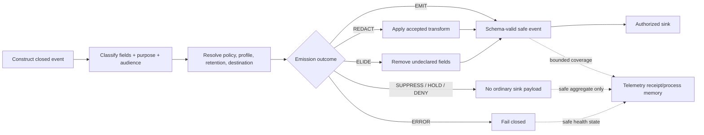
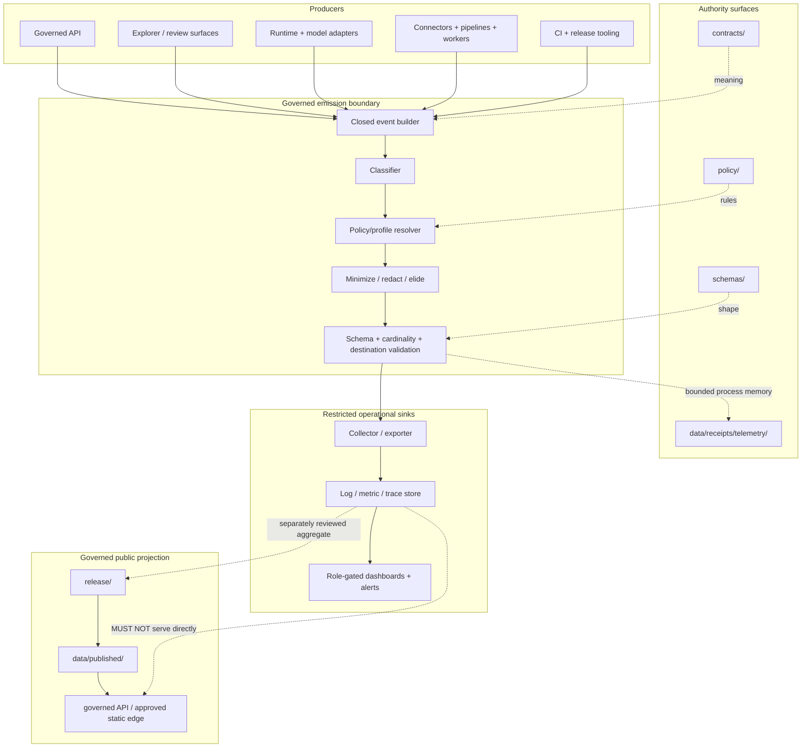

<!-- [KFM_META_BLOCK_V2]
doc_id: kfm://doc/adr/0016-telemetry-redaction-posture
title: "ADR-0016 — Telemetry Redaction Posture"
type: adr
adr_id: ADR-0016
version: v1.2
status: proposed
owners:
  - "NEEDS VERIFICATION — architecture decision owner"
  - "NEEDS VERIFICATION — observability and runtime steward"
  - "NEEDS VERIFICATION — security and privacy reviewer"
  - "NEEDS VERIFICATION — sensitivity and rights steward"
  - "NEEDS VERIFICATION — telemetry policy and validation steward"
  - "NEEDS VERIFICATION — receipt, correction, and release stewards"
owner_status: "CODEOWNERS routes relevant paths to @bartytime4life, but accepted stewardship, required-review rules, independent approval, incident ownership, and production telemetry authority were not verified"
reviewers_required:
  - Architecture steward
  - Docs steward
  - Observability and runtime steward
  - Security and privacy reviewer
  - Sensitivity and rights steward
  - Policy and validation stewards
  - Receipt and evidence stewards
  - Infrastructure and operations reviewer
  - Governed API and public-surface maintainers
created: 2026-05-11
updated: 2026-07-23
policy_label: public
truth_posture: cite-or-abstain
responsibility_root: docs/
current_path: docs/adr/ADR-0016-telemetry-redaction-posture.md
supersedes: []
superseded_by: null
evidence_snapshot:
  repository: bartytime4life/Kansas-Frontier-Matrix
  base_ref: main
  base_commit: 7d5b7e80a493fe817f2c5378bb77ab5f247e8d87
  inspection_origin_commit: cc9edf8325ee1a85548917f0c0019c5626bbbda2
  continuity_compare: cc9edf8325ee1a85548917f0c0019c5626bbbda2...7d5b7e80a493fe817f2c5378bb77ab5f247e8d87
  relevant_path_changes_after_inspection: 0
  target_prior_blob: 52d9417fa089a3b849e36ee3780afa3b8cc6afe0
  adr_index_blob: cf08fae322ac53426f7394d97897fdb942253049
  directory_rules_blob: 2affb080e6f0043867c64c7f06c1ca52030fbd55
  codeowners_blob: dd2a84aa514d8ecd9208bc347f90f9a2ed37dd61
  telemetry_minimums_blob: d86cdf1dc5423d8183f44237fa96a3c5599e5a6f
  telemetry_contract_readme_blob: 38f9f5219b441b66db482a85502c476b63ed252d
  telemetry_receipts_readme_blob: d98cf13b34d85838326b60a48f4b9c9c0a92bb03
  telemetry_policy_readme_blob: ed676a82e181a80bd9934cfe8fd8f0cac85b99c3
  no_raw_policy_blob: 9728577c061732b4b24069811397a0b6a135d5e9
  no_prompt_policy_blob: e8c7a77279c6fdee08592e1c6ad49e08c8e9305f
  no_restricted_coords_policy_blob: a240f2bc519fe461c8c9556874a747b1db013566
  telemetry_validator_blob: d0679edda558c33fcfa8feef4b99178b611028f3
  telemetry_policy_workflow_blob: 1ff28c534e7770c59640c49c9faebaf026724c67
  ui_telemetry_architecture_blob: 9112e24030c8ac87ff94f3a3e365835403372eff
related:
  - docs/adr/README.md
  - docs/adr/INDEX.md
  - docs/adr/ADR-0004-apps-governed-api-is-the-trust-membrane.md
  - docs/adr/ADR-0010-deny-by-default-for-dna-rare-species-archaeology-infrastructure.md
  - docs/adr/ADR-0011-receipts-vs-proofs-vs-manifests-vs-catalog-separation.md
  - docs/adr/ADR-0013-spec_hash-and-run_id-identity-grammar.md
  - docs/adr/ADR-0014-temporal-vocabulary--six-time-kinds-tracked.md
  - docs/adr/ADR-0019-ai-adapter-contract-and-finite-envelopes.md
  - docs/adr/ADR-0020-abstain-is-a-first-class-decision.md
  - docs/adr/ADR-0025-public-client-never-reads-canonical-internal-stores.md
  - docs/doctrine/directory-rules.md
  - docs/standards/TELEMETRY_MINIMUMS.md
  - docs/architecture/ui/TELEMETRY.md
  - contracts/telemetry/README.md
  - data/receipts/telemetry/README.md
  - policy/telemetry/README.md
  - policy/telemetry/no_restricted_coords.rego
  - policy/ui/no_raw_in_telemetry.rego
  - policy/ui/no_prompt_in_telemetry.rego
  - tools/validators/validate_telemetry_safety.py
  - .github/workflows/telemetry-policy.yml
  - .github/CODEOWNERS
tags: [kfm, adr, telemetry, observability, redaction, minimization, privacy, sensitivity, rights, secrets, receipts, runtime, trust-membrane, fail-closed]
notes:
  - "v1.2 is a same-path repository-grounded modernization. It preserves status `proposed`; it does not accept ADR-0016, emit telemetry, activate policy, create a sink, change retention, or publish anything."
  - "The canonical ADR index uniquely assigns ADR-0016 to this exact path."
  - "Telemetry crossing a process, persistence, transport, trust, or display boundary is governed emission and data egress; it is not automatically a KFM PUBLISHED artifact or release."
  - "Current telemetry policy modules are allow-by-default greenfield stubs, the validator raises NotImplementedError, and the telemetry-policy workflow records explicit readiness holds."
  - "The telemetry standard, semantic-contract lane, receipt parent lane, UI architecture document, workflow, and policy files are repository surfaces, not proof of production telemetry enforcement."
  - "This ADR requires source-side minimization and fail-closed handling while retaining sink-side controls as defense in depth."
[/KFM_META_BLOCK_V2] -->

<a id="top"></a>

# ADR-0016 — Telemetry Redaction Posture

> **Proposed decision.** Telemetry that crosses a process, persistence, transport, trust, or display boundary is a **governed emission** and a security/privacy egress event. KFM minimizes and classifies telemetry before emission, applies policy-bound redaction or suppression at the earliest controlled boundary, and fails closed when the field, profile, destination, rights posture, or sensitivity posture is unresolved. Telemetry remains process memory and operational evidence; it does not become source truth, an `EvidenceBundle`, release authority, or a `PUBLISHED` artifact merely because it was emitted.

[](#status)
[](#current-repository-evidence)
[](#current-enforcement-maturity)
[](#decision)
[](#protected-content-boundaries)
[](#receipt-and-audit-model)
[](#authority-and-publication-boundary)

> [!IMPORTANT]
> **Identity is confirmed; acceptance is not.** [`docs/adr/INDEX.md`](./INDEX.md) uniquely assigns `ADR-0016` to this exact file with source and effective status `proposed`. A commit, merge, workflow pass, dashboard, policy-shaped file, or telemetry record does not accept the decision.

> [!CAUTION]
> **Current enforcement is held.** The named validator is a `NotImplementedError` placeholder. The three inspected Rego modules are explicit greenfield stubs with `default deny := false`. The telemetry workflow confirms those conditions and the absence of schemas, fixtures, tests, runtime emitters, and receipt instances; it does not evaluate a telemetry event.

> [!WARNING]
> **Telemetry is not automatically publication.** The historical statement that every process-boundary emission is “a publication event” is retained as a warning about data egress, not as lifecycle classification. Internal telemetry may remain restricted operational material. Public or semi-public telemetry is a separately governed release/access projection. Neither form may bypass sensitivity, rights, evidence, correction, or trust-membrane controls.

**Quick navigation:** [Status](#status) · [Evidence](#evidence-boundary) · [Context](#context) · [Decision](#decision) · [Authority](#authority-and-publication-boundary) · [Signals](#signal-and-surface-scope) · [Classification](#telemetry-data-classification) · [Protected content](#protected-content-boundaries) · [Profiles](#redaction-and-privacy-techniques) · [Outcomes](#emission-decision-model) · [Receipts](#receipt-and-audit-model) · [Architecture](#logical-architecture) · [Current evidence](#current-repository-evidence) · [Maturity](#current-enforcement-maturity) · [Validation](#validation-and-enforcement-target) · [Migration](#migration-and-graduation-plan) · [Acceptance](#acceptance-gates) · [Risks](#risk-ledger) · [Alternatives](#alternatives-considered) · [Rollback](#rollback-and-supersession) · [Verification](#verification-checklist) · [References](#references)

---

<a id="status"></a>

## Status

| Field | Current value |
|---|---|
| **ADR ID** | `ADR-0016` — unique and confirmed in [`INDEX.md`](./INDEX.md) |
| **Tracked path** | `docs/adr/ADR-0016-telemetry-redaction-posture.md` |
| **Source metadata** | `proposed` |
| **Effective decision status** | `proposed` |
| **Decision class** | Telemetry minimization, redaction, egress, retention, receipt, and sink-governance boundary |
| **Current repository posture** | Documentation and readiness surfaces present; machine shape absent; policy allow-by-default scaffolding; validator unimplemented; runtime enforcement held |
| **Implementation effect of this revision** | Documentation only |
| **Publication effect** | None |
| **Supersedes / superseded by** | None / none |

### Decision acceptance versus enforcement graduation

Two states remain separate:

1. **ADR acceptance** would approve this telemetry-governance posture.
2. **Enforcement graduation** requires accepted contracts, schemas, allowlists, policies, validators, fixtures, runtime emitters, receipt semantics, sink controls, retention, incident handling, and operational evidence.

An accepted ADR without executable controls is doctrine. A green readiness workflow that proves a hold is visible is bounded repository evidence. Neither state alone proves that operational telemetry is safe.

[Back to top](#top)

---

<a id="evidence-boundary"></a>

## Evidence Boundary

This revision uses current repository bytes at `main@7d5b7e80a493fe817f2c5378bb77ab5f247e8d87` plus KFM doctrine. The detailed telemetry inspection began at `cc9edf8325ee1a85548917f0c0019c5626bbbda2`; the continuity compare to the prepared base changed only `.github/workflows/policy-test.yml`, so the target and telemetry evidence surfaces remained unchanged.

| Evidence level | What is established | What is not established |
|---|---|---|
| **Directory and trust doctrine** | Responsibility roots remain separate; public clients use governed interfaces; policy-aware and fail-closed defaults apply where risk matters | Telemetry runtime conformance |
| **ADR inventory** | Exact ADR ID, filename, source status, and effective proposed status | Acceptance |
| **Standards and semantic docs** | Telemetry minimums, telemetry semantic boundary, UI telemetry architecture, and receipt-lane guidance exist | Accepted object profiles or production behavior |
| **Policy source** | Three named telemetry policy modules and a telemetry policy README exist | Real deny rules or fail-closed evaluation |
| **Validation source** | A named telemetry-safety validator file exists | Implemented validation |
| **Workflow source** | A read-only telemetry readiness workflow checks known placeholders and absences | Event evaluation, redaction, sink safety, or operational enforcement |
| **Telemetry receipts** | A parent receipt README exists | Emitted receipt instances, accepted subtype shapes, or persistence behavior |
| **Operational telemetry** | No repository evidence inspected here establishes a collector, exporter, sink, emitter, dashboard feed, retention job, or deployed route | Production state and external systems |

### Truth labels

| Label | Use in this ADR |
|---|---|
| **CONFIRMED** | Verified from current repository bytes, workflows, tests, or governing doctrine. |
| **PROPOSED** | Decision, field, path role, profile, implementation, or migration not accepted and proven. |
| **UNKNOWN** | Evidence is insufficient to support a stronger statement. |
| **NEEDS VERIFICATION** | A concrete check exists but is not closed. |
| **CONFLICTED** | Current repository surfaces assign incompatible paths, meanings, or behavior. |
| **HOLD** | A readiness surface intentionally refuses to claim implementation. |

[Back to top](#top)

---

<a id="context"></a>

## Context

KFM is an evidence-first and policy-aware spatial knowledge system. Its lifecycle invariant is:

```text
RAW -> WORK / QUARANTINE -> PROCESSED -> CATALOG / TRIPLET -> PUBLISHED
```

Operational signals—logs, metrics, traces, lineage events, error reports, crash material, audit events, model-runtime diagnostics, and receipts—can expose the same protected facts that the governed lifecycle is designed to control. Common leak paths include:

- exact coordinates or geometry-derived identifiers;
- living-person names, account identifiers, network identifiers, parcel associations, or DNA/genomic inferences;
- rare-species, archaeology, cultural-heritage, burial, or infrastructure-sensitive location detail;
- raw prompts, raw model output, retrieved evidence excerpts, chain-of-thought, or tool payloads;
- source URLs containing credentials, private query parameters, signed links, or provider-specific identifiers;
- request bodies, route parameters, stack locals, environment variables, exception strings, and crash dumps;
- high-cardinality labels whose combinations reconstruct a protected identity or event;
- unhashed or predictably hashed identifiers that remain linkable across contexts.

Telemetry therefore sits inside the trust boundary. It is not exempt because it is “only logs,” “only metrics,” “internal,” encrypted in transit, short-lived, or sent to a third-party observability service.

### Governing distinction

```text
telemetry emission ≠ lifecycle publication ≠ evidence ≠ proof ≠ release
```

Telemetry crossing a boundary is governed **egress**. Some telemetry remains restricted operational data. A separately reviewed, aggregated, redacted telemetry summary may become a public release artifact. Neither case permits telemetry to replace its source records, receipts, evidence, policy, or release objects.

### Forces

| Force | Pressure |
|---|---|
| **Operational visibility** | Maintainers need enough safe signals to diagnose failures, measure health, and exercise rollback. |
| **Data minimization** | Every extra field expands disclosure, retention, breach, and reconstruction risk. |
| **Evidence integrity** | Telemetry must not be mistaken for underlying domain truth. |
| **Fail-closed behavior** | Missing policy or redactor state cannot silently produce raw emissions. |
| **Cross-surface consistency** | Apps, pipelines, workers, runtime adapters, CI, and infrastructure cannot invent weaker local rules. |
| **Forensics** | Security and correction work needs stable event identity and bounded audit context without protected payload duplication. |
| **Performance** | Redaction and receipt production must be deterministic and bounded, not an unbounded per-event control-plane bottleneck. |
| **Vendor independence** | The posture must survive collector, sink, dashboard, and hosting changes. |

[Back to top](#top)

---

<a id="decision"></a>

## Decision

KFM adopts a **minimize-first, classify-before-emit, policy-bound, fail-closed telemetry posture**.

### Normative rules

1. **Govern every boundary-crossing emission.** Any signal that leaves the originating process, is persisted, transported, exported, displayed, sampled into another store, or made available to another trust zone MUST pass the telemetry emission boundary.
2. **Minimize before redaction.** Emitters MUST construct events from an explicit closed allowlist. They MUST NOT serialize a rich object and try to scrub it afterward.
3. **Redact at the earliest controlled boundary.** Source-side or shared-emitter redaction is primary. Collector and sink scrubbing is defense in depth only.
4. **Default to field elision.** An undeclared field, class, profile, destination, or purpose MUST be elided, suppressed, held, or denied. Unknown does not mean safe.
5. **Keep policy canonical.** Sensitivity, rights, telemetry, runtime, and access policy live under `policy/` and accepted policy bundles. Emitters and sinks MUST NOT maintain independent weaker rule catalogs.
6. **Keep signals bounded.** Event names, label keys, dimensions, and reason codes MUST be closed and cardinality-bounded. Free-form data MUST NOT become a label, attribute, baggage item, or metric dimension.
7. **Prevent reconstruction.** A field that appears harmless alone MUST be treated as protected when combinations, timing, cardinality, or stable linkage can reconstruct a person, location, source, or restricted event.
8. **No unsafe fallback.** When the classifier, policy evaluator, redactor, key service, allowlist, or destination configuration is unavailable, the emitter MUST stop non-baseline emission rather than bypass the control.
9. **Separate process memory from telemetry payload.** Receipts record bounded facts about redaction and emission. They MUST NOT copy the protected value that was removed.
10. **Restrict sinks and dashboards.** Telemetry stores, collectors, exporters, dashboards, archives, and alert payloads MUST have explicit audience, purpose, retention, access, egress, and incident controls.
11. **Preserve finite outcomes.** Internal telemetry emission decisions and public runtime outcomes remain separate vocabularies.
12. **Treat leakage as correction and security work.** A discovered telemetry disclosure requires containment, invalidation, retention review, incident handling, correction lineage, and affected-surface analysis—not quiet log deletion alone.
13. **Never use telemetry as sovereign truth.** Telemetry may support operational review; material claims still resolve to governed evidence or abstain.
14. **No public bypass.** Public clients and ordinary UI surfaces MUST NOT read raw telemetry stores, restricted dashboards, or receipt lanes as a normal product path.

### Minimal safe baseline

When no effective telemetry profile is bound, a process MAY emit only a statically compiled, pre-reviewed heartbeat or health record whose complete shape and constant fields are known safe. It MUST NOT include dynamic values derived from requests, features, users, sources, prompts, model output, evidence, filesystem paths, URLs, stack traces, or environment state.

Example baseline fields, all subject to accepted profiles:

```text
service_class
service_version
build_ref
environment_class
health_state
bounded_reason_code
coarse_time_bucket
```

A safe baseline is not a loophole for arbitrary key/value pairs.

[Back to top](#top)

---

<a id="authority-and-publication-boundary"></a>

## Authority and Publication Boundary

| Concern | Owning surface | Telemetry relationship |
|---|---|---|
| Architectural decision | `docs/adr/` | This file records the proposed posture. |
| Operational minimums | `docs/standards/` | Defines reviewed minimum signal expectations; not executable enforcement by itself. |
| Semantic meaning | `contracts/telemetry/`, runtime/receipt contracts | Defines what telemetry objects and receipts mean. |
| Machine shape | `schemas/contracts/v1/...` after accepted placement | Defines closed event and receipt shapes. |
| Redaction/admissibility | `policy/` | Decides emit, redact, elide, suppress, deny, hold, and audience obligations. |
| Emitter/runtime implementation | Accepted `apps/`, `runtime/`, `packages/`, `pipelines/`, and worker seams | Produces only policy-safe structured signals. |
| Validation | `tools/validators/`, `tests/`, and `fixtures/` | Proves positive and negative behavior. |
| Process receipts | `data/receipts/telemetry/` or accepted receipt family | Records bounded process memory; never raw telemetry storage or proof of truth. |
| Collector/sink/access infrastructure | `infra/`, runtime/deployment configuration, and external governed systems | Stores/transports already minimized signals and applies defense-in-depth controls. |
| Evidence/proof | `data/proofs/` and governed evidence families | Telemetry may reference support but cannot replace it. |
| Release/public artifact | `release/` and `data/published/` | A public telemetry summary requires ordinary release governance. |
| Public access | Governed API or approved integrity-bound static delivery | Never direct telemetry-store or receipt-lane access. |

### Directory Rules basis

This decision creates no root-level `telemetry/` authority. Telemetry remains a lane distributed across the established responsibility roots. A future path may be created only after its owning root, exact responsibility, consumers, compatibility impact, migration, and rollback have been verified.

[Back to top](#top)

---

<a id="signal-and-surface-scope"></a>

## Signal and Surface Scope

### In scope

- structured application and API logs;
- counters, gauges, histograms, exemplars, and bounded labels;
- traces, spans, attributes, links, events, and baggage;
- lineage events and run-linked operational events;
- model-adapter and governed-AI operational signals;
- connector, pipeline, worker, validator, release, correction, and rollback telemetry;
- operator and reviewer audit events;
- error reporting, exception metadata, crash reporting, diagnostic bundles, and support exports;
- CI logs and workflow summaries;
- dashboards, alerts, notifications, webhooks, exporters, collectors, agents, and sink archives;
- telemetry-derived SLO or health summaries;
- telemetry redaction and emission receipts.

### Out of scope but adjacent

| Surface | Why separate |
|---|---|
| Source payloads and lifecycle data | They belong in governed lifecycle roots, not telemetry. |
| EvidenceBundle content | Evidence has a separate authority and resolution path. |
| Release decisions | Telemetry may inform review but cannot authorize release. |
| Raw security forensic images | Require a separately governed restricted incident/evidence process. |
| Legal erasure | Retention deletion, privacy erasure, and rollback are distinct governance operations. |
| Vendor selection | Backend choice does not change this posture. |
| Dashboard layout | Display design belongs in dashboard/UI/operations documentation. |

### Signal classes

| Class | Default posture | Minimum rule |
|---|---|---|
| Baseline health | Allow only pre-reviewed closed fields | No dynamic protected context |
| Request/runtime | Redact and minimize | No bodies, prompts, query values, exact resource identifiers, or raw errors |
| Metric labels | Closed and low-cardinality | No stable person/source/location keys without accepted profile |
| Traces | Redact attributes, events, links, and baggage | Baggage is not an exemption |
| AI/model adapter | Strict suppression | No prompt, model output, reasoning, retrieved excerpts, or tool payload |
| Pipeline/connector | Receipt-linked bounded fields | No raw payload echo |
| Error/crash | Suppress by default; restricted capture only when authorized | No locals, env, secrets, bodies, or source payloads |
| CI/build | Structured and secret-safe | No secret values, private configs, protected fixtures, or generated protected output |
| Operator/audit | Purpose-bound and access-controlled | Identity only at the minimum accountability level |
| Public telemetry summary | Release-gated derivative only | Aggregated, redacted, documented limitations, correction and rollback |

[Back to top](#top)

---

<a id="telemetry-data-classification"></a>

## Telemetry Data Classification

An emitter MUST classify each field before emission. Classification is based on meaning, combinations, audience, purpose, retention, and downstream joinability—not only the field name.

| Class | Examples | Default |
|---|---|---|
| **Public-safe bounded** | closed service class, build version, finite outcome, coarse latency bucket | Allow under accepted profile |
| **Operational restricted** | internal route family, deployment topology class, operator action ref | Restricted sink and retention |
| **Identifier-like** | session, request, source, feature, artifact, account, run, trace identifiers | Tokenize, scope, rotate, or elide |
| **Location-like** | coordinates, bbox, tile, geohash, station/site id, route segment | Generalize or deny according to sensitivity and reconstruction risk |
| **Person-related** | names, contact, IP, device, account, parcel association, genealogy/DNA inference | Deny by default; accepted purpose and profile required |
| **Content-bearing** | request body, prompt, model output, evidence excerpt, source record, stack local | Deny |
| **Secret/credential** | token, key, cookie, signed URL, auth header, environment secret | Deny and incident if observed |
| **Policy/review protected** | reviewer notes, denied-source existence, obligations, internal reason detail | Reference safely; do not inline |
| **Aggregate** | counts, rates, histograms | Require cohort/reconstruction analysis; aggregate is not automatically anonymous |
| **Unknown** | undeclared field or novel value | Elide or hold |

### Cardinality and join risk

Low cardinality is necessary for many metric labels but not sufficient for privacy. The combination of county, minute, route, source, layer, error code, and rare event may identify a person or protected location even when every field is individually coarse.

Before allowing a field set, reviewers MUST consider:

- uniqueness and rarity;
- temporal precision;
- spatial precision;
- stable cross-run linkage;
- joinability with public data;
- small-cell disclosure;
- side-channel inference from absence or denial;
- whether a digest is guessable from a small input space;
- whether tokenization is reversible, linkable, or shared across environments.

[Back to top](#top)

---

<a id="protected-content-boundaries"></a>

## Protected Content Boundaries

### Raw evidence and source payloads

Telemetry MUST contain **no raw payload echo**. This includes source records, uploaded files, response bodies, evidence excerpts, database rows, feature properties, catalog objects, proof objects, or serialized domain models.

Allowed references are bounded identifiers or digests only when:

- the reference is safe for the intended audience;
- it does not reveal the existence of denied or restricted content;
- the digest cannot be feasibly reversed or enumerated;
- the receiving sink is authorized;
- correction and retention rules are defined.

### Prompts, model output, and reasoning

Telemetry and receipts MUST contain **no prompt content**, raw model output, chain-of-thought, hidden reasoning, retrieved protected excerpts, tool payloads, or unrestricted conversation text.

A model-runtime signal MAY include a reviewed subset such as:

```text
request_id
adapter_id
model_profile_id
input_class
input_size_bucket
output_size_bucket
finite_outcome
bounded_reason_code
latency_bucket
policy_decision_ref
receipt_ref
```

Even an input or output digest is not automatically safe. Hashes over low-entropy prompts can be dictionary-attacked; cross-system stable hashes can create a tracking identifier. Digest use therefore requires an accepted keyed or scoped profile and retention purpose.

### Coordinates and spatial identifiers

An accepted spatial redaction profile **replaces precise `lat` / `lon`** with an accepted public-safe region, grid, or categorical band. The profile MUST also consider tile IDs, geohashes, station/site IDs, route segments, parcel IDs, bounding boxes, viewport centers, camera traces, and timing sequences that reconstruct location.

Style hiding, zoom limits, client filtering, or obscuring a label is not telemetry redaction.

### Secrets and access material

Telemetry MUST NOT contain:

- API keys, OAuth tokens, cookies, session credentials, private keys, passwords, connection strings, or authorization headers;
- signed or credential-bearing URLs;
- unredacted environment variables;
- secret-manager values;
- private service hostnames or network topology when exposure increases risk;
- full headers or configuration dumps.

Detection of a likely secret is a security incident signal. The detector MUST not repeat the secret in its own alert.

### Error and crash material

Default behavior:

- emit a bounded error class and safe correlation reference;
- suppress exception strings unless explicitly classified;
- disable locals capture, request-body capture, environment dumps, memory dumps, and automatic attachment upload by default;
- route any approved forensic artifact to a restricted incident process, not an ordinary telemetry sink;
- prevent backpressure or exporter failure from falling back to raw stdout/stderr dumps.

### Denial and existence leakage

A telemetry event for `DENY` or `ABSTAIN` MUST not reveal:

- the protected value that triggered the decision;
- the existence of a restricted record when the audience is not permitted to know it exists;
- internal reviewer identity or notes;
- detailed policy conditions that enable probing;
- exact counts for small protected cohorts.

[Back to top](#top)

---

<a id="redaction-and-privacy-techniques"></a>

## Redaction and Privacy Techniques

Techniques are policy profiles, not local emitter inventions. Their parameters and permitted purposes require accepted policy, tests, and review.

| Technique | Permitted use | Guardrail |
|---|---|---|
| Field elision | Default for undeclared or unnecessary fields | Prefer over transformation |
| Coarse categorization | Latency, size, zoom, time, or spatial bands | Bins must not reconstruct protected values |
| Tokenization | Short-lived correlation inside one bounded trust context | Scope, rotation, access, unlinkability, and revocation required |
| Generalization | Public-safe spatial or temporal category | Preserve limitation and transformation state |
| Suppression | Sensitive or small-cell events | Do not leak through suppression counts |
| Aggregation | Operational rates and distributions | Minimum cohort and join-risk review |
| Sampling | Volume control after classification | Sampling is not redaction |
| Seeded perturbation | Only under accepted statistical profile | Deterministic linkage risk must be evaluated |
| Differential privacy | Only under accepted mechanism and privacy budget | No casual “noise added” claim; budget accounting and composition tests required |
| Encryption | Transport/storage defense in depth | Does not justify collecting unnecessary protected fields |
| Keyed digest | Bounded correlation where approved | Key management, rotation, scope, and dictionary-risk review required |

### Profile resolution

Every emitted field set MUST resolve to:

- event class;
- allowed purpose;
- audience/access class;
- field allowlist version;
- sensitivity and rights decisions;
- redaction/minimization profile;
- retention class;
- destination class;
- redactor/emitter version or spec hash;
- correction and incident posture.

Failure to resolve produces `ELIDE`, `SUPPRESS`, `HOLD`, `DENY`, or `ERROR`, never implicit allow.

[Back to top](#top)

---

<a id="emission-decision-model"></a>

## Emission Decision Model

The internal telemetry decision vocabulary is separate from public runtime outcomes.

### Proposed internal emission outcomes

| Outcome | Meaning | Payload effect |
|---|---|---|
| `EMIT` | Complete event is allowlisted and safe for the named destination | Emit unchanged structured safe fields |
| `REDACT` | One or more fields require accepted transformation | Emit transformed event and bounded coverage record |
| `ELIDE` | Undeclared or unnecessary fields are removed | Emit remaining safe event if meaningful |
| `SUPPRESS` | Entire event is withheld | Emit only a constant safe health/counter signal when permitted |
| `HOLD` | Human or policy review is required | No ordinary sink emission |
| `DENY` | Policy forbids emission | No event; safe reason counter only when permitted |
| `ERROR` | Classifier, redactor, policy, schema, or sink control failed | Fail closed; no raw fallback |

### Public runtime outcomes

Public API and UI surfaces continue to use the accepted runtime vocabulary:

```text
ANSWER | ABSTAIN | DENY | ERROR
```

An internal `SUPPRESS` may lead an operational dashboard to show missing/degraded telemetry. It does not automatically determine an API answer. Conversely, a public `DENY` response does not authorize a detailed telemetry event about the protected request.

### State flow



[Back to top](#top)

---

<a id="receipt-and-audit-model"></a>

## Receipt and Audit Model

Telemetry receipts are process memory. They record that a bounded telemetry control ran; they do not contain raw telemetry, prove a domain claim, approve release, or grant public access.

### Granularity

The prior “every redaction emits a receipt” rule is refined to avoid receipt amplification and a second disclosure channel.

A conformant implementation SHOULD produce receipts or coverage records at the smallest useful **bounded** granularity, such as:

- deployment/config activation;
- process startup;
- run or job;
- batch/window;
- policy/profile change;
- redactor health transition;
- denied-field class aggregate;
- incident/correction action;
- released public telemetry summary.

Per-event receipts MAY be used only when volume, sensitivity, retention, and side-channel risk have been explicitly reviewed.

### Minimum receipt content

| Field family | Minimum meaning |
|---|---|
| Identity | receipt id, run/window id, service/emitter id |
| Configuration | allowlist/profile/policy refs and versions |
| Implementation | emitter/redactor build or spec hash |
| Scope | event classes and destination class |
| Counts | attempted, emitted, redacted, elided, suppressed, denied, errored—coarsened where needed |
| Outcome | finite bounded result |
| Time | start/end/effective time with explicit time kind |
| Integrity | safe digest or signature refs where applicable |
| Correction | supersession, incident, revocation, and rollback refs |
| Limitations | sampling, partial coverage, degraded state, unknowns |

Receipts MUST NOT include the rejected or redacted field value, raw prompt, source payload, exact coordinate, secret, stack local, or unbounded error string.

### Receipt boundary

```text
telemetry signal != telemetry receipt != EvidenceBundle != release decision
```

Public clients do not read `data/receipts/telemetry/` directly. A released public telemetry summary may reference a governed proof or receipt packet through the normal release path.

[Back to top](#top)

---

<a id="logical-architecture"></a>

## Logical Architecture



### Sink requirements

Every sink profile MUST define:

- trust zone and audience;
- network exposure;
- authentication and authorization;
- tenant/workspace boundary;
- encryption and key ownership;
- retention and deletion;
- export and webhook controls;
- dashboard query limits;
- alert payload minimization;
- backup and archive retention;
- incident containment;
- provider terms and data residency where material;
- correction, revocation, and downstream invalidation;
- operator audit and separation of duties.

A third-party sink does not become safe merely because a contract exists or traffic is encrypted.

### Dashboard and alert boundary

Dashboards and alerts are new emissions. Queries, panels, screenshots, CSV exports, notifications, tickets, chat messages, and email alerts MUST be reviewed as downstream surfaces. A safe stored event can still become unsafe when combined, filtered to a small cohort, or exported.

[Back to top](#top)

---

<a id="current-repository-evidence"></a>

## Current Repository Evidence

| Surface | Truth status | Current bounded finding |
|---|---|---|
| ADR identity | **CONFIRMED** | `INDEX.md` uniquely assigns ADR-0016 to this exact file with status `proposed`. |
| Telemetry minimums | **CONFIRMED draft** | A substantial standard exists, but its profiles, thresholds, and promotion rules remain proposed. |
| Telemetry semantic lane | **CONFIRMED draft/proposed** | `contracts/telemetry/README.md` defines carrier-not-truth boundaries and candidate object families. |
| Telemetry receipt lane | **CONFIRMED parent README** | `data/receipts/telemetry/README.md` exists; no child lanes or receipt instances are established. |
| Telemetry policy root | **CONFIRMED stub** | `policy/telemetry/README.md` is a greenfield bundle stub. |
| Raw-evidence policy | **CONFIRMED allow-by-default scaffold** | `policy/ui/no_raw_in_telemetry.rego` has no real rules and `default deny := false`. |
| Prompt policy | **CONFIRMED allow-by-default scaffold** | `policy/ui/no_prompt_in_telemetry.rego` has no real rules and `default deny := false`. |
| Restricted-coordinate policy | **CONFIRMED allow-by-default scaffold** | `policy/telemetry/no_restricted_coords.rego` has no real rules and `default deny := false`. |
| Policy placement | **CONFLICTED / fragmented** | Telemetry rules are split between `policy/ui/` and `policy/telemetry/`; accepted bundle ownership/import structure is unestablished. |
| Telemetry validator | **CONFIRMED placeholder** | `validate_telemetry_safety.py` raises `NotImplementedError`. |
| Telemetry schema | **CONFIRMED absent at workflow snapshot** | The workflow asserts `schemas/contracts/v1/telemetry/` is absent. |
| Fixtures and focused tests | **CONFIRMED absent at workflow snapshot** | The workflow asserts the named telemetry fixture/test roots are absent. |
| Emitter implementation | **CONFIRMED absent in bounded scan** | The workflow finds no surfaced telemetry instrumentation in selected implementation roots. |
| Telemetry receipts | **CONFIRMED absent at workflow snapshot** | No receipt payload exists beneath the parent README lane. |
| UI telemetry architecture | **CONFIRMED draft/proposed** | Defines candidate event/route/policy shapes; no route or schema is thereby established. |
| Telemetry workflow | **CONFIRMED command-bearing readiness audit** | Three jobs preserve explicit holds and do not evaluate events. |
| Operational collectors/sinks | **UNKNOWN** | No deployment, config, dashboard feed, retained artifact, log sample, or runtime evidence was inspected. |
| CODEOWNERS | **CONFIRMED routing** | Relevant roots route to `@bartytime4life`; this is not accepted stewardship or independent approval. |

### Current safe conclusion

KFM has a coherent documentation direction and explicit readiness checks, but it does not currently prove a fail-closed telemetry redaction system. The strongest executable evidence is that CI refuses to pretend the placeholders are enforcement.

[Back to top](#top)

---

<a id="current-enforcement-maturity"></a>

## Current Enforcement Maturity

| Level | Requirement | Current result |
|---|---|---|
| 0 | ADR and root boundaries documented | **CONFIRMED** |
| 1 | Candidate semantic standard documented | **CONFIRMED draft/proposed** |
| 2 | Closed machine event and receipt shapes | **HOLD / absent** |
| 3 | Fail-closed policy bundle | **HOLD / current modules allow by default** |
| 4 | Source/shared-emitter redactor implementation | **HOLD / not established** |
| 5 | Positive and negative deterministic fixtures | **HOLD / absent** |
| 6 | Static and runtime validators | **HOLD / validator placeholder** |
| 7 | Receipt production and validation | **HOLD / no instances** |
| 8 | Restricted collectors, sinks, dashboards, alerts, and retention | **UNKNOWN** |
| 9 | Incident, revocation, correction, deletion, and rollback integration | **UNKNOWN** |
| 10 | Public telemetry summary release profile | **NOT ESTABLISHED** |
| 11 | Production operation and monitoring | **UNKNOWN** |

### Readiness workflow meaning

The current `telemetry-policy` jobs succeed only when they confirm the known hold state. Their success means:

- the stubs remain visible;
- implementation has not appeared without reviewed wiring;
- no event was evaluated;
- no redaction occurred;
- no receipt or policy decision was emitted.

It does not mean raw evidence, prompts, or restricted coordinates are blocked in an external or uninspected runtime.

[Back to top](#top)

---

<a id="validation-and-enforcement-target"></a>

## Validation and Enforcement Target

### Static checks

A mature validator SHOULD inspect:

- string interpolation and free-form event construction;
- serialization of request, domain, source, evidence, model, and exception objects;
- logging of headers, URLs, query strings, bodies, environment, locals, or config;
- metric label and trace-attribute cardinality;
- baggage propagation;
- raw stdout/stderr fallbacks;
- crash reporter defaults;
- unreviewed exporters, sinks, dashboards, webhooks, and alert templates;
- policy bypass and “debug mode” switches;
- direct public access to sinks or receipt lanes.

Static checks are useful but cannot prove dynamic path resolution, runtime hooks, third-party SDK behavior, or actual sink configuration.

### Runtime checks

Runtime tests MUST exercise:

- undeclared field elision;
- prompt, model-output, evidence, coordinate, identifier, secret, and URL denial;
- classifier and redactor outage;
- policy timeout/error;
- sink outage and backpressure;
- queue spill and retry;
- serialization failure;
- partial event construction;
- crash paths;
- multi-thread and multi-process concurrency;
- sampling and aggregation;
- revocation and profile update;
- access and destination mismatch;
- receipt production without protected-value echo.

### Deterministic fixture matrix

| Fixture | Expected internal outcome |
|---|---|
| Safe closed heartbeat | `EMIT` |
| Unknown field | `ELIDE` or `DENY` |
| Raw request body | `DENY` |
| Raw source/evidence payload | `DENY` |
| Prompt text | `DENY` |
| Raw model output or reasoning | `DENY` |
| Exact restricted coordinates | `REDACT` or `DENY` under accepted profile |
| Small-cell aggregate | `SUPPRESS` or `HOLD` |
| Stable person identifier | `TOKENIZE` only through accepted profile; otherwise `DENY` |
| Secret-bearing URL/header | `DENY` plus incident signal without echo |
| Policy unavailable | `ERROR` and no non-baseline payload |
| Redactor unavailable | `ERROR` and no non-baseline payload |
| Sink backpressure | Bounded retry/drop after redaction; no raw fallback |
| Crash with locals | Safe error class only; no locals |
| Receipt for denied field | Bounded reason/count only; rejected value absent |
| Revoked profile | `SUPPRESS` and invalidate downstream caches/exports |
| Public dashboard query creates small cohort | `DENY` or generalize |
| Public telemetry summary | Requires release packet and corrected/rollback-aware lineage |

### CI target

Repository-native CI should eventually:

1. validate the canonical ADR/index state;
2. validate telemetry contracts and schemas;
3. exercise valid and invalid fixtures;
4. evaluate fail-closed policy;
5. run static emitter scans;
6. run runtime redactor and sink simulations without network dependencies;
7. validate receipt polarity and protected-value absence;
8. verify sink/infra exposure profiles;
9. validate correction, revocation, and retention behavior;
10. preserve current check names or migrate them with ruleset evidence.

[Back to top](#top)

---

<a id="migration-and-graduation-plan"></a>

## Migration and Graduation Plan

This ADR changes no implementation. Follow-on work should use small, reversible waves.

### Wave 0 — inventory and freeze

- inventory emitter call sites, SDKs, collectors, exporters, sinks, dashboards, alerts, archives, and support exports;
- inventory fields, dimensions, baggage, error hooks, crash reporters, and retention;
- freeze new unreviewed telemetry surfaces;
- record unknown external systems and owners;
- identify real protected or secret-bearing historical telemetry without copying it into tickets or docs.

### Wave 1 — authority and object profiles

- decide canonical telemetry policy bundle structure and resolve `policy/ui/` versus `policy/telemetry/` fragmentation;
- decide event, redaction-coverage, and receipt object boundaries;
- choose canonical schema and fixture homes under Directory Rules;
- define closed outcomes, reason codes, field classes, retention classes, and destination classes;
- update the telemetry standard and contract lane together.

### Wave 2 — safe primitives

- implement one source/shared-emitter library with closed event builders;
- implement classification, allowlist resolution, redaction, destination validation, and safe error behavior;
- implement a no-network fake sink;
- implement bounded batch/run/config receipts;
- prohibit generic arbitrary-map logging APIs in governed paths.

### Wave 3 — validator and fixture proof

- populate synthetic valid and invalid fixtures;
- replace `validate_telemetry_safety.py` placeholder;
- implement fail-closed Rego or equivalent policy;
- add static and runtime negative cases;
- verify secrets and protected values never appear in test output.

### Wave 4 — per-producer migration

For each app, runtime, package, connector, pipeline, worker, and CI surface:

1. inventory current events;
2. classify fields and purposes;
3. replace free-form calls;
4. bind accepted profiles;
5. add no-network tests;
6. define retention/destination;
7. add receipt coverage where consequential;
8. retain a reversible compatibility window only when needed.

### Wave 5 — sink and access hardening

- deploy collector/sink profiles with least privilege;
- verify authentication, authorization, network exposure, export controls, backup retention, and alert payloads;
- constrain dashboard queries and public sharing;
- test revocation, deletion, and incident containment.

### Wave 6 — fail-closed CI

- run advisory comparison first;
- close existing drift by producer/sink;
- flip migrated surfaces to required checks;
- keep unmigrated surfaces visible as scoped holds, not blanket exceptions;
- verify ruleset and review significance.

### Wave 7 — operational verification

- run synthetic telemetry through the complete path;
- retain bounded workflow and sink evidence;
- exercise policy/redactor/sink failures;
- verify correction and invalidation;
- verify no unauthorized external egress;
- verify public summaries only through release;
- publish no maturity claim without current logs, configs, tests, receipts, and review evidence.

### Migration receipt minimum

Each migration packet should record:

- migration id and producer/sink scope;
- prior and new emitter/profile;
- affected event names and field classes;
- policy, allowlist, schema, and redactor refs;
- retention and access changes;
- fixture and CI evidence;
- compatibility window and expiry;
- incident/correction impact;
- rollback target;
- reviewer and decision refs.

[Back to top](#top)

---

<a id="acceptance-gates"></a>

## Acceptance Gates

ADR acceptance and implementation graduation are related but distinct.

| Gate | Requirement |
|---|---|
| **A1 — identity** | ADR, filename, index row, status, ownership, and review burden are coherent |
| **A2 — governed-emission definition** | Process/persistence/transport/display boundaries and lifecycle-publication distinction are accepted |
| **A3 — authority split** | Standards, contracts, schemas, policy, implementation, receipts, infra, and release roles are non-overlapping |
| **A4 — policy home** | `policy/ui/` and `policy/telemetry/` ownership/import structure is resolved |
| **A5 — closed machine shape** | Event, coverage, and receipt profiles reject unknown fields |
| **A6 — allowlist** | Event names, fields, dimensions, purposes, audiences, destinations, and retention classes are closed |
| **A7 — fail-closed policy** | Missing/failed policy or redactor cannot emit non-baseline dynamic telemetry |
| **A8 — protected content** | Raw payloads, prompts, model output, reasoning, secrets, exact restricted coordinates, and protected identifiers are denied |
| **A9 — reconstruction risk** | Cardinality, combinations, temporal/spatial precision, and cross-dataset joins are tested |
| **A10 — safe emitter** | Shared or per-producer implementation exposes no arbitrary-map bypass |
| **A11 — runtime failures** | Crash, backpressure, retry, queue spill, policy outage, and sink outage remain safe |
| **A12 — receipts** | Bounded receipt granularity and protected-value non-echo are accepted and validated |
| **A13 — sink controls** | Access, network, encryption, export, alert, dashboard, backup, and third-party posture are verified |
| **A14 — retention and deletion** | Retention, legal hold, erasure, revocation, backup expiry, and deletion evidence are defined |
| **A15 — incident/correction** | Leak containment, affected-surface inventory, invalidation, notification, correction, and rollback paths exist |
| **A16 — fixtures/tests** | Deterministic positive and negative coverage exercises every protected class and outcome |
| **A17 — CI/review** | Checks, required status, owners, exceptions, and independent review are verified |
| **A18 — public summaries** | Any public telemetry derivative uses governed release and correction paths |
| **A19 — operational proof** | One representative producer-to-sink path is demonstrated without real sensitive fixtures |
| **A20 — rollback** | Every implementation/migration step has a tested rollback or documented forward-fix posture |

No gate is satisfied merely because a document, README, Rego file, workflow, pull request, or merge exists.

[Back to top](#top)

---

<a id="risk-ledger"></a>

## Risk Ledger

| Risk | Current posture | Control |
|---|---|---|
| Allow-by-default policy stubs | **CONFIRMED** | Do not execute as enforcement; replace with accepted fail-closed bundle and tests |
| Validator placeholder | **CONFIRMED** | Implement closed validator and polarity tests |
| No schema/fixtures/tests | **CONFIRMED at workflow snapshot** | Land profile and deterministic negative coverage together |
| Policy split across UI and telemetry lanes | **CONFLICTED** | Select bundle ownership/import contract before migration |
| Free-form logging | UNKNOWN | Inventory and replace with closed builders |
| SDK auto-instrumentation captures unsafe fields | UNKNOWN | Explicit processors, disabled defaults, integration tests |
| Stable identifiers enable tracking | Open | Scope, rotate, tokenize, or elide |
| Hashes are reversible/linkable | Open | Keyed/scoped profile and entropy review |
| Small-cell aggregate disclosure | Open | Cohort thresholds, suppression, join-risk tests |
| Exact location reconstructed from tile/time sequence | Open | Coarsen identifiers and timing; sequence-level tests |
| Receipt becomes second leak channel | Open | Bounded counts/refs only; non-echo tests |
| Sink-only scrubbing treated as primary | Open | Source/shared-emitter minimization required |
| Redactor outage falls back to raw logging | Open | No unsafe fallback and failure tests |
| Backpressure dumps payload to stdout/disk | Open | Safe queue/drop/retry policy |
| Crash reporter captures locals/env | Open | Disabled by default; restricted incident profile |
| Dashboard/export creates new disclosure | Open | Downstream query/export admission checks |
| Third-party provider retention/terms drift | UNKNOWN | Provider profile, review cadence, export/delete tests |
| Revocation does not reach archives/backups | Open | Invalidation and retention lineage |
| Public telemetry mistaken for evidence | Open | Carrier-not-truth labels and release/evidence separation |
| Repository-side automation merges draft PRs | NEEDS VERIFICATION | Do not interpret merge as ADR acceptance or independent review |

[Back to top](#top)

---

## Consequences

### Positive

- Telemetry becomes an explicit trust-boundary concern rather than an informal debugging exception.
- Emitters converge on closed, reviewable event contracts.
- Sensitive and rights-restricted content receives consistent handling across public artifacts and operational signals.
- Failures of the classifier, policy, redactor, and sink have named safe outcomes.
- Receipts support audit without copying protected values.
- Public telemetry summaries remain release-governed and correction-ready.
- Vendor choice cannot weaken the posture by default.

### Costs

- Existing emitter and dashboard inventories may be large.
- Safe cardinality, join-risk, retention, and deletion analysis require specialist review.
- Source-side minimization can reduce debugging detail.
- Runtime tests for backpressure, crashes, SDK defaults, and exporter behavior are non-trivial.
- Sink and third-party controls may require infrastructure changes outside the repository.
- Receipt granularity and retention must balance audit value against volume and disclosure risk.

### Neutral but important

- Telemetry remains useful operational evidence but not sovereign truth.
- Encryption, internal access, or short retention do not remove minimization requirements.
- A disabled telemetry surface is safer than a raw leak but may block production readiness when telemetry minimums are accepted.

[Back to top](#top)

---

<a id="alternatives-considered"></a>

## Alternatives Considered

<details>
<summary><strong>A — Treat telemetry as outside data governance</strong></summary>

**Rejected.** It creates a side channel around sensitivity, rights, correction, and the trust membrane.

</details>

<details>
<summary><strong>B — Scrub only at the SIEM, collector, or sink</strong></summary>

**Rejected as the primary control.** Sink scrubbing remains useful defense in depth, but protected content has already crossed the originating boundary.

</details>

<details>
<summary><strong>C — Log rich objects and encrypt everything</strong></summary>

**Rejected.** Encryption does not justify unnecessary collection, does not prevent authorized-user misuse, and does not solve retention or reconstruction risk.

</details>

<details>
<summary><strong>D — Disable telemetry on sensitive surfaces</strong></summary>

**Rejected as the general model, retained as a safe temporary hold.** Sensitive surfaces still require safe health and incident visibility, but emission remains stopped until a reviewed profile exists.

</details>

<details>
<summary><strong>E — Let every producer define its own redaction rules</strong></summary>

**Rejected.** Local catalogs drift and become parallel policy authority.

</details>

<details>
<summary><strong>F — Create a root-level telemetry authority</strong></summary>

**Rejected.** Topic does not determine responsibility. Standards, meaning, shape, policy, implementation, receipts, infra, tests, and release stay in their existing roots.

</details>

<details>
<summary><strong>G — Emit one redaction receipt per event</strong></summary>

**Rejected as the default.** It can amplify volume, leak event frequency, and create a second protected-data channel. Bounded run, batch, configuration, or health receipts are preferred unless event-level audit is explicitly required.

</details>

<details>
<summary><strong>H — Assume hashes and tokenized identifiers are anonymous</strong></summary>

**Rejected.** Small input spaces, stable linkage, and shared keys can make them reversible or identifying.

</details>

<details>
<summary><strong>I — Choose the telemetry vendor first</strong></summary>

**Rejected.** The governance posture precedes and constrains vendor selection.

</details>

[Back to top](#top)

---

<a id="rollback-and-supersession"></a>

## Rollback and Supersession

### Documentation rollback

Before merge, close the draft pull request and abandon the scoped branch.

After merge, restore the prior blob:

```text
52d9417fa089a3b849e36ee3780afa3b8cc6afe0
```

or revert the documentation commit created for this update.

### Decision rollback

If ADR-0016 is rejected:

1. retain the file with `status: rejected`;
2. retain higher-authority sensitivity, rights, secrets, and trust-membrane controls;
3. remove only ADR-specific acceptance language;
4. do not convert current allow-by-default policy stubs into approved behavior.

If superseded:

1. retain this record;
2. set `status: superseded`;
3. link the accepted successor in both directions;
4. update the index in the same reviewed change;
5. preserve migration, incident, receipt, and rollback evidence.

### Implementation rollback

Each follow-on must identify its own target. Possible actions include:

- restore the prior emitter library or profile;
- return a validator from fail-closed to advisory only for a demonstrated validator defect;
- disable a newly unsafe exporter or dashboard;
- suppress a problematic event class;
- quarantine or restrict newly collected telemetry;
- rotate tokenization keys and invalidate linkable identifiers;
- revoke sink access and downstream exports;
- supersede incorrect receipts without erasing history;
- execute retention/deletion under the applicable legal and policy process;
- correct public summaries through release/correction controls.

Rollback MUST NOT restore raw prompt, evidence, coordinate, secret, or payload logging as a convenience fallback.

[Back to top](#top)

---

<a id="verification-checklist"></a>

## Verification Checklist

- [x] ADR ID, exact tracked path, and index row confirmed.
- [x] Source and effective status confirmed as `proposed`.
- [x] Complete v1.1 baseline inspected.
- [x] Telemetry minimums and semantic-contract README inspected.
- [x] Telemetry receipt parent lane inspected.
- [x] Validator placeholder inspected.
- [x] Three telemetry policy stubs inspected.
- [x] Telemetry readiness workflow inspected.
- [x] UI telemetry architecture inspected.
- [x] CODEOWNERS routing inspected and bounded.
- [x] Current repository evidence separated from proposed target behavior.
- [x] Governed emission distinguished from lifecycle publication.
- [x] Source-side minimization preserved and sink scrubbing retained as defense in depth.
- [x] Raw payload, prompt, model output, coordinate, identifier, secret, crash, and denial-leak boundaries preserved.
- [x] Receipt granularity refined to prevent receipt amplification and non-echo leakage.
- [x] Existing decision, consequences, alternatives, examples, migration intent, and rollback posture preserved.
- [ ] Confirm complete producer, SDK, sink, dashboard, alert, archive, and third-party inventory.
- [ ] Resolve telemetry policy bundle ownership and imports.
- [ ] Accept event and receipt object profiles.
- [ ] Create closed schemas and deterministic fixtures.
- [ ] Implement fail-closed policy and validator.
- [ ] Implement safe emitter/redactor and fake sink.
- [ ] Verify secrets, protected values, and prompt content never reach CI output.
- [ ] Verify retention, deletion, revocation, backup, and legal-hold behavior.
- [ ] Verify dashboard/export/alert downstream admission.
- [ ] Verify incident, correction, and public-summary release paths.
- [ ] Verify required checks, reviewers, rulesets, and exception process.
- [ ] Demonstrate one representative producer-to-sink path before implementation graduation.

[Back to top](#top)

---

## No-Loss and Change Ledger

| Prior v1.1 element | v1.2 disposition |
|---|---|
| Telemetry as governed boundary-crossing emission | Preserved; distinguished from lifecycle publication |
| Trust-membrane framing | Preserved and strengthened |
| Fail-closed redaction-first posture | Preserved |
| Source-side allowlist and sink-side defense | Preserved |
| Shared sensitivity/rights profiles | Preserved; profile maturity bounded |
| Telemetry classes | Preserved and expanded |
| Raw prompts/model output/reasoning prohibition | Preserved |
| Exact-coordinate redaction | Preserved with reconstruction analysis |
| Redaction profiles | Preserved as proposed techniques, not claimed implementation |
| Telemetry receipts | Preserved; granularity corrected |
| Logical architecture diagrams | Rebuilt from current responsibility surfaces |
| Placement guidance | Replaced speculative tree with authority matrix and verified paths |
| Validator/test expectations | Preserved; current placeholder/absence documented |
| Consequences and alternatives | Preserved and expanded |
| Rollback discipline | Preserved with exact prior blob |
| Synthetic examples | Preserved through fixture matrix and protected-content examples |
| “Repo not mounted” posture | Replaced with commit-pinned evidence |
| ADR number/path uncertainty | Resolved from canonical index |
| Status | Unchanged: `proposed` |
| Publication/runtime behavior | Unchanged: none |

[Back to top](#top)

---

<a id="references"></a>

## References

### Repository evidence

- [ADR index](./INDEX.md)
- [Directory Rules](../doctrine/directory-rules.md)
- [Telemetry Minimums](../standards/TELEMETRY_MINIMUMS.md)
- [UI Telemetry Architecture](../architecture/ui/TELEMETRY.md)
- [Telemetry semantic-contract lane](../../contracts/telemetry/README.md)
- [Telemetry receipt lane](../../data/receipts/telemetry/README.md)
- [Telemetry policy lane](../../policy/telemetry/README.md)
- [Raw-evidence telemetry policy stub](../../policy/ui/no_raw_in_telemetry.rego)
- [Prompt telemetry policy stub](../../policy/ui/no_prompt_in_telemetry.rego)
- [Restricted-coordinate telemetry policy stub](../../policy/telemetry/no_restricted_coords.rego)
- [Telemetry validator placeholder](../../tools/validators/validate_telemetry_safety.py)
- [Telemetry readiness workflow](../../.github/workflows/telemetry-policy.yml)
- [CODEOWNERS](../../.github/CODEOWNERS)
- [Governed API ADR](./ADR-0004-apps-governed-api-is-the-trust-membrane.md)
- [Sensitive-data default-deny ADR](./ADR-0010-deny-by-default-for-dna-rare-species-archaeology-infrastructure.md)
- [Artifact-family separation ADR](./ADR-0011-receipts-vs-proofs-vs-manifests-vs-catalog-separation.md)
- [Identity grammar ADR](./ADR-0013-spec_hash-and-run_id-identity-grammar.md)
- [Temporal vocabulary ADR](./ADR-0014-temporal-vocabulary--six-time-kinds-tracked.md)
- [AI adapter finite-envelope ADR](./ADR-0019-ai-adapter-contract-and-finite-envelopes.md)
- [Abstain decision ADR](./ADR-0020-abstain-is-a-first-class-decision.md)
- [Public-client boundary ADR](./ADR-0025-public-client-never-reads-canonical-internal-stores.md)

### Doctrine and planning lineage

The supplied KFM corpus consistently treats sensitive exposure as policy-governed, model output as evidence-subordinate, receipts as process memory, public clients as governed-interface consumers, and correction/rollback as visible obligations. Those materials support the decision rationale but do not replace current repository evidence for implementation maturity.

---

## Change Log

| Version | Date | Change |
|---|---|---|
| `v1.2` | 2026-07-23 | Same-path repository-grounded modernization: confirmed ADR identity; distinguished governed emission from lifecycle publication; pinned standards, contracts, policy, validator, receipt, workflow, UI, and ownership evidence; documented allow-by-default stubs and explicit holds; strengthened minimization, reconstruction, AI, secret, crash, sink, retention, receipt, incident, fixture, migration, acceptance, and rollback controls; preserved status `proposed`. |
| `v1.1` | 2026-05-15 | Tightened evidence boundary, schema-home alignment, synthetic examples, redaction profiles, validation, and rollback posture. |
| `v1` | 2026-05-11 | Initial telemetry redaction posture. |

---

**Last updated:** 2026-07-23 · **Decision status:** `proposed` · **Current enforcement:** documentation + explicit workflow holds · **Publication:** none · **Path:** `docs/adr/ADR-0016-telemetry-redaction-posture.md` · [Back to top](#top)
