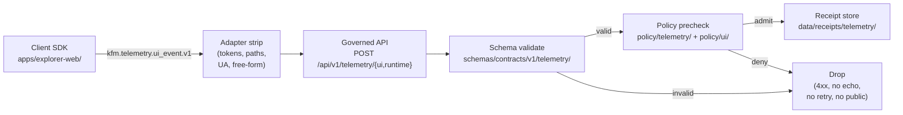

<!-- [KFM_META_BLOCK_V2]
doc_id: kfm://doc/adr/0016-telemetry-redaction-posture
title: ADR-0016 — Telemetry Redaction Posture
type: standard
version: v1
status: draft
owners: [TODO: governance steward, TODO: policy steward, TODO: api/security steward]
created: 2026-05-09
updated: 2026-05-09
policy_label: public
related:
  - docs/doctrine/directory-rules.md
  - docs/adr/ADR-0001-spec-normalization-and-schema-home.md
  - docs/adr/ADR-0002-finite-decision-outcomes.md
  - docs/adr/ADR-0003-watcher-non-publisher.md
  - docs/architecture/ui/TELEMETRY.md
  - schemas/contracts/v1/telemetry/ui_event.schema.json
  - policy/telemetry/README.md
  - policy/ui/README.md
  - data/receipts/telemetry/README.md
tags: [kfm, adr, telemetry, redaction, governance, policy, sensitivity]
notes:
  - Status is draft until the schema, policy, and route artifacts referenced here are landed.
  - Cross-referenced paths are PROPOSED until verified against mounted-repo evidence.
[/KFM_META_BLOCK_V2] -->

# ADR-0016 — Telemetry Redaction Posture

> **One-line decision:** Telemetry is a **closed, schema-bound, policy-checked, fail-closed** signal class — never a sidecar for evidence, prompts, secrets, restricted geometry, or PII — and it lives under the same governed-API trust membrane as every other public surface.

| Field | Value |
|---|---|
| **ADR ID** | ADR-0016 |
| **Title** | Telemetry Redaction Posture |
| **Status** | **PROPOSED** _(awaiting acceptance)_ |
| **Date** | 2026-05-09 |
| **Authors** | TODO: governance steward, TODO: policy steward, TODO: api/security steward |
| **Reviewers** | TODO: docs steward · TODO: domain stewards (sensitivity classes) · TODO: SRE |
| **Supersedes** | None |
| **Superseded by** | None |
| **Related ADRs** | ADR-0001 _(spec normalization, schema-home rule)_ · ADR-0002 _(finite decision outcomes)_ · ADR-0003 _(watcher-as-non-publisher)_ |
| **Affects** | `schemas/contracts/v1/telemetry/`, `policy/telemetry/`, `policy/ui/`, `apps/governed-api/`, `data/receipts/telemetry/`, `tests/fixtures/telemetry/`, `docs/architecture/ui/TELEMETRY.md` |

---

## Quick jumps

- [Context](#1-context)
- [Decision](#2-decision)
- [Consequences](#3-consequences)
- [Alternatives considered](#4-alternatives-considered)
- [Migration & rollback](#5-migration--rollback)
- [Open questions](#6-open-questions)
- [References](#7-references)

---

## 1. Context

KFM exposes two distinct kinds of telemetry:

1. **UI telemetry** — bounded events emitted by the public client (e.g., `apps/explorer-web/`) when users interact with governed surfaces (layer toggles, drawer opens, focus requests, abstain/deny renders, accessibility events).
2. **Runtime probe telemetry** — structured operation records emitted by runtime-verified surfaces such as the tile decoder, hash worker, and capability handshake. The shape sketched in the corpus is `{op_id, op_type, started_at, finished_at, duration_ms, bytes_in, bytes_out, success, error_code?, device_profile, spec_hash}`.

Both classes share three properties that this ADR locks down:

- They cross the **trust membrane** — they originate inside the user's browser/device and are persisted server-side. Any leakage flows directly into a long-lived audit store.
- They are **process memory, not release proof** — telemetry receipts inform operations and probes-as-gates; they do **not** serve as evidence for public claims and are not part of the cite-or-abstain support surface.
- They have a strong **gravitational pull toward over-collection**. Free-form strings, prompt text, full EvidenceBundle copies, exact coordinates, raw user-agent, IPs, and capability tokens can all *technically* be carried in a beacon. None of them belong there.

KFM doctrine and the supplied architecture corpus name a clear posture for these signals — _"telemetry is safe by construction: no raw evidence, no prompt text, no restricted geometry, no secrets, no full EvidenceBundle copies"_ and _"telemetry must respect sensitivity — no PII in records"_ — but the rule has not yet been pinned in an ADR, schema, policy bundle, or route. Without an ADR, the rule remains a guideline that drifts every time a new surface emits a beacon.

> [!IMPORTANT]
> The ADR exists because *telemetry is the easiest place to silently violate every other governance invariant.* A single uncaptured field — a free-form `details` string, a `feature_geometry` debug payload, a `prompt_excerpt` for failure triage — undoes the trust membrane for the system that reports on the trust membrane.

### 1.1 Forces

| Force | Pulls toward | Tension with |
|---|---|---|
| Need to debug runtime failures on real devices | Rich, ad-hoc payloads | Cite-or-abstain + sensitivity policy |
| Need to gate releases on probe results | High-fidelity per-op records | Closed schemas, fixed identifiers |
| Need to operate the public UI | Free-form interaction events | No PII, no secrets, no prompts |
| Need rollback receipts | Long retention, broad coverage | Process memory ≠ release proof |
| Need accessibility-failure telemetry | Verbatim user input, error text | Closed enums, redaction |

### 1.2 Non-goals

- This ADR does **not** define the storage/retention schedule for telemetry receipts (see **Open questions §6**).
- This ADR does **not** authorize telemetry as evidence for public claims. EvidenceBundles outrank telemetry per ADR-0001 / Governed AI doctrine.
- This ADR does **not** cover server-side application logs, infra audit logs, or build-pipeline traces. Those have separate authority and rotation rules.

---

## 2. Decision

KFM adopts a **closed, schema-bound, policy-checked, fail-closed redaction posture** for telemetry. Concretely:

### 2.1 Scope

This ADR governs every telemetry record originating in a public or semi-public KFM client and persisted server-side, including:

- UI events from `apps/explorer-web/` and any equivalent governed shell.
- Runtime probe records emitted from `apps/explorer-web/` or `packages/maplibre/` workers (tile decode, WASM hash, heap soak, capability handshake).
- Any future client-emitted operational signal that crosses the trust membrane.

It does **not** govern release manifests, EvidenceBundles, run receipts, or correction notices — those are governed by their own ADRs and contracts.

### 2.2 Trust class

Telemetry is **process memory**. It MUST NOT:

- Be cited as evidence in any public or steward claim.
- Substitute for an EvidenceBundle.
- Be exposed on the public read API as authoritative.

Telemetry receipts are stored in `data/receipts/telemetry/` and are subject to the same RAW → WORK → PROCESSED discipline as any other receipt class.

### 2.3 Canonical homes

| Concern | Canonical home | Authority |
|---|---|---|
| Telemetry event schemas | `schemas/contracts/v1/telemetry/` | ADR-0001 schema-home rule |
| Telemetry admissibility policy | `policy/telemetry/` | Directory Rules §6.5 (`policy/` singular) |
| UI-specific event policy overlays | `policy/ui/` | Directory Rules §6.5 |
| Telemetry receipts | `data/receipts/telemetry/` | Lifecycle invariant |
| Architecture documentation | `docs/architecture/ui/TELEMETRY.md` | Subsystem doc convention |
| Test fixtures | `tests/fixtures/telemetry/` | Directory Rules §6.4 |
| Validators | `tools/validators/telemetry/` | Directory Rules §6.6 _(PROPOSED — adapt to repo evidence)_ |

> [!NOTE]
> Per the schema-home rule (ADR-0001), `schemas/contracts/v1/telemetry/` is canonical. If `contracts/telemetry/` exists, it is **lineage / CONFLICTED** and MUST be migrated, not duplicated.

### 2.4 Route discipline

All telemetry beacons MUST traverse the governed API:

- UI events: `POST /api/v1/telemetry/ui` _(PROPOSED route name — adapt to actual `apps/governed-api/` convention)_
- Runtime probe records: `POST /api/v1/telemetry/runtime` _(PROPOSED — corpus also references `POST /telemetry/v1/runtime`; resolve in implementing PR)_

Direct beacons from the client to canonical stores, object stores, vector indexes, log aggregators, or third-party analytics endpoints are **forbidden**. The trust membrane is `apps/governed-api/`; telemetry is not an exception.

### 2.5 Forbidden content classes

The following content classes MUST NOT appear in any telemetry record under any field, including `extra`, `debug`, `details`, `error_message`, or schema-overflow fields. The schema MUST close all extension points (`additionalProperties: false`).

| Forbidden class | Why | Note |
|---|---|---|
| **Raw evidence / EvidenceBundle copies** | Evidence is governed elsewhere; copying it into telemetry creates a parallel, unreviewed evidence path. | Use `evidence_bundle_ref` (spec_hash) only when correlation is required. |
| **Prompt text / model inputs / model outputs** | Prompts and outputs are governed by AI receipts (per Governed AI doctrine). Telemetry is not the authoring channel. | Use `prompt_hash` only — never the body. |
| **Secrets / tokens / capability JWTs / signatures** | Long-lived in a receipt store. A leaked capability token = a leaked release. | Includes signed-URL query strings. Strip at adapter boundary. |
| **Exact / restricted geometry** | Geoprivacy is a hard gate; coordinates below the public-safe precision class never leave their tier. | See §2.6 — geometry rule. |
| **PII** | User identifiers, full IPs, full user-agent strings, free-form user input, names, emails, account ids. | See §2.7 — identifier and device rule. |
| **Restricted source identifiers** | Source IDs for restricted-class sources can themselves be sensitive (e.g., reveal a sealed survey). | Substitute a salted, release-scoped pseudo-id. |
| **Free-form text from any user-input field** | Free-form text is the most common source of accidental PII and prompt leakage. | Use closed enums for failure causes; never echo input. |
| **Stack traces with file paths or query strings** | Paths and query strings carry capability tokens, internal routes, and PII. | Sanitize at adapter; emit only error code + module tag. |

### 2.6 Geometry rule

If a telemetry record names geometry at all:

1. Geometry MUST NOT be finer than the **public-safe precision class** declared by the originating layer's sensitivity policy.
2. Layers whose public class is `withheld` MUST NOT have any geometry in telemetry — only the layer's `spec_hash` and `release_id`.
3. Coordinate values MUST flow through the same redaction pipeline as the public DTO (generalize / grid / withhold) and emit a `PublicGeneralizationTransformReceipt` reference if the value is anything other than a layer-level identifier.
4. Per ADR-0001's canonicalization rules, any retained coordinates are quantized to **6 decimal places** and the precision used MUST be recorded in the record.

### 2.7 Identifier and device rule

| Field | Allowed value | Forbidden |
|---|---|---|
| `user_id` | (no field) | Any user-stable identifier. |
| `session_id` | Ephemeral, salted, release-scoped opaque token | Anything reusable across releases or correlatable to user identity. |
| `device_profile` | Closed enum: `low_end_mobile`, `mid_mobile`, `desktop`, `tablet`, `unknown` _(PROPOSED enum — finalize in schema)_ | Full user-agent strings. Specific OS versions. Specific GPU strings. |
| `locale` | Closed enum / language tag at coarsest meaningful granularity | Full Accept-Language strings. |
| `ip_address` | (no field) | Any IP, even truncated. |
| `referrer` / `url` | Route name from a closed enum (`/explore`, `/focus`, `/story/:id_hashed`) | Full URLs, query strings, fragment identifiers. |
| `feature_id` | `spec_hash` only | Source-record-level keys. |
| `op_id` | UUID generated client-side per operation, not retained beyond the receipt | Anything tied to user identity. |

### 2.8 Allowed event envelope (illustrative)

The schema lives at `schemas/contracts/v1/telemetry/ui_event.schema.json` (PROPOSED path). The example below is **illustrative**; the canonical shape is the schema, not this snippet.

```json
{
  "$schema": "https://json-schema.org/draft/2020-12/schema",
  "$id": "https://kfm.dev/schemas/contracts/v1/telemetry/ui_event.schema.json",
  "title": "UIEvent",
  "type": "object",
  "additionalProperties": false,
  "required": [
    "envelope_version",
    "event_type",
    "occurred_at",
    "session_id",
    "device_profile",
    "release_id"
  ],
  "properties": {
    "envelope_version":  { "const": "kfm.telemetry.ui_event.v1" },
    "event_type":        { "enum": [
      "layer_toggle", "drawer_open", "drawer_close",
      "focus_request", "focus_render_answer", "focus_render_abstain",
      "focus_render_deny", "focus_render_error",
      "compare_open", "export_request", "story_step",
      "a11y_violation_render", "runtime_probe_summary"
    ]},
    "occurred_at":       { "type": "string", "format": "date-time" },
    "session_id":        { "type": "string", "pattern": "^kfm-sess-[A-Za-z0-9_-]{16,32}$" },
    "device_profile":    { "enum": ["low_end_mobile","mid_mobile","desktop","tablet","unknown"] },
    "locale":            { "type": "string", "maxLength": 16 },
    "release_id":        { "type": "string", "pattern": "^urn:kfm:release:sha256:[0-9a-f]{64}$" },
    "layer_spec_hash":   { "type": "string", "pattern": "^[0-9a-f]{64}$" },
    "duration_ms":       { "type": "integer", "minimum": 0, "maximum": 600000 },
    "outcome":           { "enum": ["ANSWER","ABSTAIN","DENY","ERROR","NA"] },
    "reason_code":       { "type": "string", "pattern": "^[a-z][a-z0-9_.]{1,64}$" },
    "evidence_bundle_ref": { "type": "string", "pattern": "^urn:kfm:evidence:[A-Za-z0-9_:-]{1,128}$" },
    "policy_decision_ref": { "type": "string", "pattern": "^urn:kfm:policy_decision:[A-Za-z0-9_:-]{1,128}$" }
  }
}
```

### 2.9 Failure mode (fail-closed)

- Any telemetry record that fails schema validation at the governed API MUST be **dropped** with a non-leaking 4xx (no echo of the offending payload).
- Any record that fails policy precheck MUST be **dropped**; the failure is itself recorded as a count (not as content) in an internal-only operational counter.
- Telemetry MUST NOT be quarantined to a public path. There is no `data/quarantine/telemetry/public/`.
- The governed API MUST NOT proxy the rejected record to any downstream system.
- Client-side SDKs MUST NOT retry-with-backoff a rejected record. A reject is final.

### 2.10 Validation discipline

| Layer | What enforces | Where |
|---|---|---|
| **Shape** | JSON Schema | `schemas/contracts/v1/telemetry/` + `schemas/tests/{valid,invalid}/telemetry/` |
| **Admissibility** | Rego / OPA bundle | `policy/telemetry/` + `policy/ui/` + `policy/tests/` |
| **Fixture proof** | Good/bad fixtures | `tests/fixtures/telemetry/` |
| **Adapter discipline** | Server middleware | `apps/governed-api/src/routes/telemetry/*` _(path PROPOSED)_ |
| **CI gate** | Workflow | `.github/workflows/contracts-telemetry.yml` _(PROPOSED)_ |

A telemetry change is **not landable** without all five layers updated together.

### 2.11 Diagram — telemetry trust path



> _Diagram is grounded in the corpus's stated trust path; specific route names and paths are PROPOSED and adapt to mounted-repo conventions._

---

## 3. Consequences

### 3.1 Positive

- **One enforcement point.** Telemetry stops being a quiet exfiltration vector. Every beacon goes through schema + policy + receipt store, with a single fail-closed code path.
- **Boring, auditable receipts.** `data/receipts/telemetry/` becomes a low-surprise store: every record is shape-valid, policy-clean, and free of evidence/prompt/secret bleed.
- **Probes-as-gates work cleanly.** Runtime probe envelopes can be aggregated against thresholds without a parallel sanitization layer.
- **Schema is the contract.** UI engineers, SRE, and reviewers can read one schema and know exactly what telemetry can carry.
- **Sensitivity policy stays whole.** Geoprivacy classes hold across all surfaces — including the surface that reports on those surfaces.
- **Easier reviews.** Reviewers can reject telemetry PRs that introduce free-form fields, raw IDs, or geometry by citing this ADR rather than re-deriving the principle each time.

### 3.2 Negative / costs

- **Lower debugability.** Free-form `details` strings are a debugging convenience; dropping them slows certain failure investigations. Mitigation: closed `reason_code` enum + structured per-event field set.
- **Schema churn.** Adding a new event type or field requires a schema PR, a fixture pair, a policy update, and an ADR if material. This is the intended cost.
- **Probe SDK rework.** Existing client beacons (if any) that pass user-agent strings, exact coordinates, or query strings will need to be reworked at the adapter boundary.
- **Cardinality limits.** Closed enums for `event_type`, `device_profile`, `outcome`, and `reason_code` mean some research questions cannot be answered from telemetry alone — they must be answered via instrumented runs against fixtures.
- **No retry-on-reject** simplifies the trust model but means a temporary policy bug that rejects valid events results in lost signal during the bug window.

### 3.3 Invariants preserved

| Invariant | How this ADR honors it |
|---|---|
| Trust membrane | Telemetry routes through `apps/governed-api/`; no direct write paths. |
| Cite-or-abstain | Telemetry is process memory, not evidence. |
| Watcher-as-non-publisher (ADR-0003) | Telemetry adapter writes to receipt store, never to `data/published/` or `data/catalog/`. |
| Schema-home rule (ADR-0001) | Schemas live in `schemas/contracts/v1/telemetry/`. |
| Sensitivity policy & geoprivacy | Geometry rule (§2.6) re-asserts the public-safe precision class. |
| Lifecycle invariant | Receipts flow RAW → WORK → PROCESSED inside `data/receipts/telemetry/`. |
| Deny-by-default | Fail-closed at schema, policy, and adapter layers. |

---

## 4. Alternatives considered

### 4.1 Alt A — "Best-effort redaction at the SDK"

Have the client SDK strip secrets / coordinates / PII before sending. Server accepts whatever arrives.

**Rejected.** A client cannot be trusted to redact for the receipt store it does not own. The trust membrane is server-side. Client redaction is a *defense in depth* layer — an addition to the schema/policy gate, not a substitute for it.

### 4.2 Alt B — "Open schema with allowlist of safe fields"

Define an allowlist of safe field names; allow everything else as `extra`.

**Rejected.** `extra` is exactly where prompts, geometry, and PII slip in. `additionalProperties: false` is a hard requirement.

### 4.3 Alt C — "Two trust classes: redacted public telemetry + restricted internal telemetry"

Maintain a richer telemetry path for steward / SRE eyes only.

**Rejected for the public surface.** A privileged telemetry path is acceptable for **server-emitted** logs governed by infra controls, but **not** for client-emitted telemetry crossing the trust membrane. A client SDK that sometimes sends "richer" payloads is a client SDK that one misconfiguration away from leaking them publicly. If a steward-only telemetry path is needed later, it is a separate ADR with its own threat model.

### 4.4 Alt D — "Telemetry as a release-evidence input"

Allow telemetry receipts to be cited in EvidenceBundles for performance claims.

**Rejected.** This collapses process memory into release proof and undermines cite-or-abstain. Probe **summaries** (`ReleaseRuntimeGate`) are the release-evidence surface; raw telemetry is not.

### 4.5 Alt E — "No ADR — keep the rule in `docs/architecture/ui/TELEMETRY.md`"

Keep the redaction posture as architecture prose only.

**Rejected.** Per Directory Rules §17, a rule that constrains schema home, policy home, and route discipline crosses the ADR threshold. An undocumented rule is a re-litigated rule.

---

## 5. Migration & rollback

### 5.1 Migration plan

1. **Land this ADR as `proposed`.** Reviewers verify scope and the canonical homes table against current repo evidence.
2. **Author the schema** at `schemas/contracts/v1/telemetry/ui_event.schema.json` and `schemas/contracts/v1/telemetry/runtime_probe_record.schema.json`. Land good/bad fixtures under `schemas/tests/{valid,invalid}/telemetry/`.
3. **Author the policy bundle** at `policy/telemetry/` (admissibility) and `policy/ui/` (UI overlay). Land Rego tests.
4. **Wire the route** through `apps/governed-api/` — `POST /api/v1/telemetry/ui` and `POST /api/v1/telemetry/runtime` _(PROPOSED — adapt to actual route convention)_.
5. **Author/refresh `docs/architecture/ui/TELEMETRY.md`** to reference this ADR as authority.
6. **Move existing telemetry emitters** behind the new envelope. Any emitter that cannot be shaped to the schema is removed, not retained as a side channel.
7. **Promote ADR to `accepted`** once schema, policy, route, fixtures, and one end-to-end test are green in CI.

### 5.2 Rollback

- **Schema/policy rollback:** revert PR if no telemetry has yet been persisted under the new envelope; otherwise version-deprecate (`v1` → `v1-deprecated`) and ship a `v2` with the corrected shape.
- **Route rollback:** disable the governed-API telemetry route via feature flag; clients fail-closed (no fallback emitter).
- **ADR rollback:** if this ADR is superseded, the successor ADR MUST address every decision in §2 explicitly. A bare reversal is not acceptable; a redaction posture cannot be silently loosened.

### 5.3 Compatibility

This ADR is the **first** authoritative redaction posture for telemetry. There is no prior accepted ADR to supersede. If a workspace dossier or per-domain plan describes a richer telemetry envelope, that dossier is **lineage / superseded by this ADR** for the telemetry concern.

---

## 6. Open questions

These are **not resolved** by this ADR and SHOULD be tracked in `docs/registers/VERIFICATION_BACKLOG.md`:

- **Retention.** How long do telemetry receipts live in `data/receipts/telemetry/`? Default proposal: short for UI events (e.g., 30 days), longer for runtime probe summaries that feed `ReleaseRuntimeGate`. **NEEDS VERIFICATION.**
- **Session salt rotation.** What is the rotation cadence and storage of the salt that scopes `session_id`? **NEEDS VERIFICATION.**
- **Aggregation budget for probes.** Per the corpus, runtime probes aggregate every 10 seconds or 100 ops. Is that the right floor for low-end mobile? **OPEN.**
- **Steward-only telemetry path.** Is there ever a justified richer path for steward-authenticated sessions? If so, it is a separate ADR with its own threat model. **OPEN.**
- **Cross-language reproducibility.** Per ADR-0001 (T8), schemas should round-trip across languages. Telemetry SDKs may exist in TypeScript, Python (probe runners), and possibly Swift/Kotlin. **NEEDS VERIFICATION.**
- **Repo path resolution.** All paths in §2.3 are PROPOSED until validated against current mounted-repo state. The implementing PR MUST verify and either confirm or open a Directory Rules drift entry.

---

## 7. References

### 7.1 KFM doctrine and corpus

- `docs/doctrine/directory-rules.md` — schema-home (§6.4 / §7.4), policy-home (§6.5), trust membrane (§7.1), `data/receipts/` placement.
- _Whole-UI + Governed AI Expansion Report_ — `policy/telemetry/`, `schemas/contracts/v1/telemetry/ui_event.schema.json`, `docs/architecture/ui/TELEMETRY.md`, telemetry security boundary statement: _"no raw evidence, no prompt text, no restricted geometry, no secrets, no full EvidenceBundle copies"_.
- _Pass 12 Part 2 Idea Index_ §5.M.2 — runtime telemetry envelope shape `{op_id, op_type, started_at, finished_at, duration_ms, bytes_in, bytes_out, success, error_code?, device_profile, spec_hash}` and the rule that telemetry must respect sensitivity (no PII in records).
- _Pass 12 Part 2 Idea Index_ §J.3 — ADR template (id, title, status, date, context, decision, consequences, alternatives).
- _Build Companion_ §11 — policy input bundle, sensitivity escalation matrix, fail-closed posture.
- _Components Pass 13 Part 2_ — public-safe geometry, precision classes (`exact`, `generalized_point`, `grid`, `county`, `withheld`).

### 7.2 Related ADRs

| ADR | Relation |
|---|---|
| ADR-0001 — Spec normalization & schema-home | Provides the canonical home `schemas/contracts/v1/...` and the canonicalization rules invoked in §2.6. |
| ADR-0002 — Finite decision outcomes | Provides the `outcome ∈ {ANSWER, ABSTAIN, DENY, ERROR}` enum reused in the event envelope. |
| ADR-0003 — Watcher-as-non-publisher | Telemetry adapter writes only to receipts; never publishes. |

### 7.3 Pre-publish checklist for implementers

- [ ] Schema landed with `additionalProperties: false` at every level
- [ ] Good/bad fixtures cover every forbidden class in §2.5
- [ ] Policy bundle denies missing `release_id`, missing `session_id`, geometry below public-safe class
- [ ] Route wired only through `apps/governed-api/`
- [ ] `docs/architecture/ui/TELEMETRY.md` references this ADR
- [ ] No client SDK retains rejected payloads
- [ ] No telemetry record cited as evidence in any released claim

---

[Back to top](#adr-0016--telemetry-redaction-posture)
