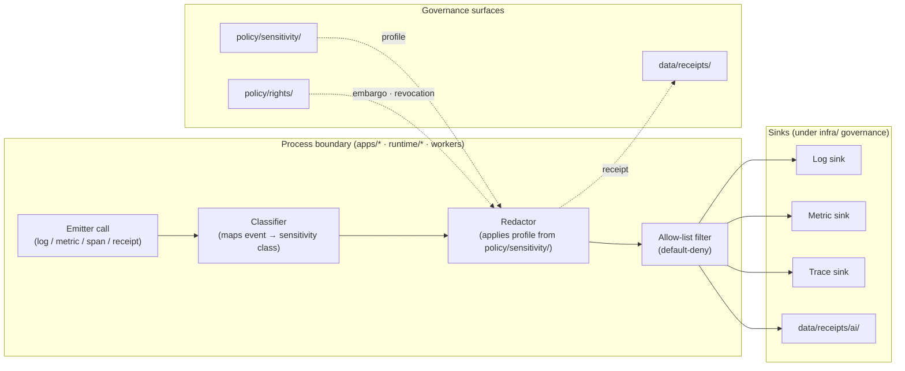
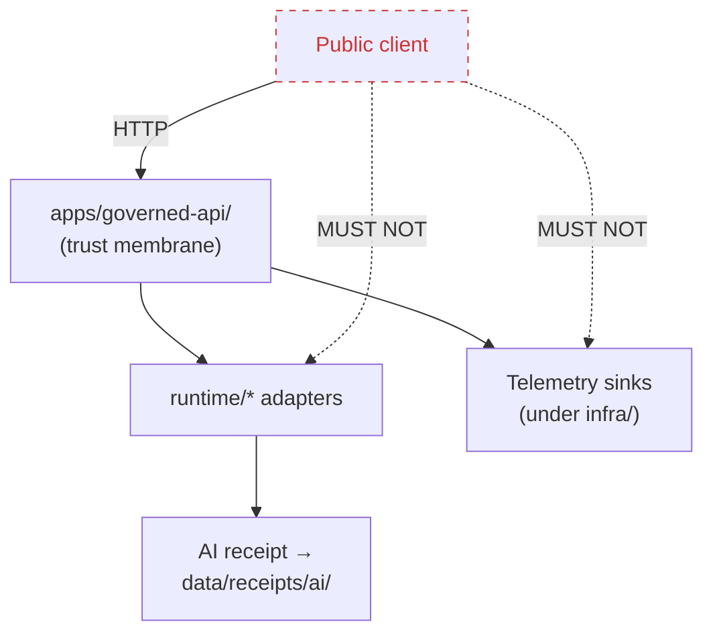

<!-- [KFM_META_BLOCK_V2]
doc_id: kfm://doc/adr-0016-telemetry-redaction-posture
title: ADR-0016 — Telemetry Redaction Posture
type: standard
version: v1
status: draft
owners: TODO (proposed: Docs steward + Security/Privacy reviewer + Runtime owner)
created: 2026-05-11
updated: 2026-05-11
policy_label: public
related:
  - docs/doctrine/directory-rules.md
  - docs/doctrine/trust-membrane.md
  - docs/doctrine/truth-posture.md
  - docs/doctrine/lifecycle-law.md
  - docs/adr/ADR-0001-schema-home.md
  - policy/sensitivity/
  - policy/rights/
  - policy/runtime/
  - apps/governed-api/
  - runtime/
  - infra/
  - data/receipts/
  - data/registry/sensitivity/
tags: [kfm, adr, telemetry, redaction, privacy, sensitivity, governance, observability]
notes:
  - "ADR number 0016 is PROPOSED until reconciled against docs/adr/README.md and any registry in docs/registers/"
  - "Owners and reviewers are placeholders pending CODEOWNERS verification"
[/KFM_META_BLOCK_V2] -->

# ADR-0016 — Telemetry Redaction Posture

> Telemetry that leaves a KFM process is **a publication event**. It is treated as a governed
> emission subject to the same sensitivity, rights, and policy gates as any other public-facing
> artifact — and never as a side channel around the trust membrane.

<p align="left">
  
  
  
  
  
  
</p>

| Field | Value |
|---|---|
| **ADR ID** | ADR-0016 (PROPOSED number; reconcile against `docs/adr/README.md`) |
| **Title** | Telemetry Redaction Posture |
| **Status** | `proposed` |
| **Date** | 2026-05-11 |
| **Supersedes** | none |
| **Superseded by** | none |
| **Owners** | TODO — Docs steward + Security/Privacy reviewer + Runtime owner (placeholder) |
| **Reviewers required** | Docs steward, Security/Privacy reviewer, Runtime owner, Release steward |
| **Related doctrine** | `docs/doctrine/trust-membrane.md`, `docs/doctrine/truth-posture.md`, `docs/doctrine/lifecycle-law.md`, `docs/doctrine/directory-rules.md` |
| **Related ADRs** | ADR-0001 (schema home) — CONFIRMED; earlier ADRs 0002–0015 — UNKNOWN until inspected |

---

## Quick jump

- [1. Context](#1-context)
- [2. Decision](#2-decision)
- [3. Telemetry classes and redaction posture](#3-telemetry-classes-and-redaction-posture)
- [4. Redaction profiles (catalogue)](#4-redaction-profiles-catalogue)
- [5. Architecture](#5-architecture)
- [6. Where this lives (placement)](#6-where-this-lives-placement)
- [7. Enforcement and validation](#7-enforcement-and-validation)
- [8. Consequences](#8-consequences)
- [9. Alternatives considered](#9-alternatives-considered)
- [10. Rollback and reversibility](#10-rollback-and-reversibility)
- [11. Open questions and NEEDS VERIFICATION](#11-open-questions-and-needs-verification)
- [Appendix A — Worked examples](#appendix-a--worked-examples)
- [Appendix B — Conformance language](#appendix-b--conformance-language)

---

## 1. Context

KFM is a governed, evidence-first, map-first knowledge system. Its lifecycle invariant —
**RAW → WORK / QUARANTINE → PROCESSED → CATALOG / TRIPLET → PUBLISHED** — and its trust
membrane (`apps/governed-api/`) exist to keep raw, in-flight, model-generated, or sensitive
state from becoming public truth. Telemetry — logs, metrics, traces, AI invocation receipts,
error reports, and similar process memory — is a category of *emission* that has historically
been treated, in many systems, as orthogonal to the trust membrane. This ADR rejects that
treatment for KFM.

The KFM corpus has converged on three points relevant here, captured in project doctrine and
the components dossier:

1. **Fail-closed redaction is the default posture for sensitive data.** Vulnerable species
   localities, sensitive archaeological sites, living-person records, ancestry overlays, and
   precise locations are subject to redaction profiles, embargo timestamps, consent receipts,
   and revocation endpoints. <!-- INFERRED from KFM Components Pass 10/11 dossiers -->
2. **Promotion is a governed state transition, not a file move.** No artifact reaches
   `data/published/` without clearing validators, evidence resolution, catalog closure,
   receipts, and policy gates. <!-- CONFIRMED in docs/doctrine/directory-rules.md §9.1 -->
3. **Watchers are emit-only and the public path runs through the governed API.** Workers
   emit receipts and candidate decisions; they do not publish. Public clients read through
   `apps/governed-api/`. <!-- CONFIRMED in directory-rules.md §7.1, §10.1 -->

If telemetry can leak names, coordinates, identifiers, raw prompts, model outputs, source
URLs, embedded payloads, or stack traces containing sensitive context, it routes around all
three of those properties. A log line that says
`error processing {"taxon":"<rare orchid>", "lat":38.964, "lon":-95.247}` is, in effect, a
sub-rosa publication of a sensitive locality. **A telemetry pipe without a redaction posture
is a trust-membrane bypass.**

> [!IMPORTANT]
> This ADR does not invent a new authority. It applies the **existing** sensitivity, rights,
> and policy machinery to a class of emissions that has not previously been written down as
> being inside that machinery. Telemetry inherits — it does not get an exception.

### 1.1 What this ADR governs

- Logs and structured events emitted by `apps/*` and `runtime/*` and consumed by sinks
  inside or outside the trust boundary.
- Metrics (counters, gauges, histograms) and their labels/dimensions.
- Distributed traces (spans, span attributes, baggage).
- AI invocation receipts (`data/receipts/ai/`) and model-adapter telemetry from `runtime/`.
- Error reports, panic dumps, and crash traces.
- Build, CI, and pipeline telemetry that leaves the local boundary.

### 1.2 What this ADR does **not** govern

- The schema-home rule for telemetry shapes (governed by ADR-0001 and any future schema ADR).
- Field-level shape of telemetry events (governed by `schemas/` once added).
- The decision of *whether* a given dataset is publishable (governed by `policy/release/`).
- Internal in-process traces that never leave the process boundary and are not persisted.

---

## 2. Decision

KFM adopts a **fail-closed, redaction-first telemetry posture** with five normative rules.
Each rule maps to existing KFM authority surfaces; none of them creates a new authority root.

### 2.1 The five rules

> [!NOTE]
> Conformance terms (**MUST**, **MUST NOT**, **SHOULD**, **MAY**) follow the convention
> defined in `docs/doctrine/directory-rules.md` §2.2, restated in [Appendix B](#appendix-b--conformance-language).

1. **Telemetry is governed emission.** Any telemetry that crosses the process boundary
   **MUST** be treated as a publication event for the purposes of sensitivity, rights, and
   policy review. It **MUST NOT** be treated as a development-only side channel.
2. **Default-deny on sensitive fields.** Telemetry emitters **MUST** allow only an explicit
   allow-list of fields and shapes. Fields not on the allow-list are dropped or redacted at
   the source, not at the sink. Sink-side redaction is a defense-in-depth layer, never the
   first line.
3. **Same redaction profiles as `data/published/`.** Sensitivity classes and redaction
   profiles (radius mask, grid generalization, seeded jitter, k-anonymity thresholds,
   differential privacy for aggregates) **MUST** be drawn from `policy/sensitivity/` — the
   same source that governs published artifacts. Telemetry **MUST NOT** define its own,
   weaker, parallel profile catalogue.
4. **Trust membrane applies to telemetry surfaces.** Telemetry sinks reachable from outside
   the host (dashboards, exporters, OTLP endpoints, log shippers) **MUST** be configured
   under `infra/` with deny-by-default, least privilege, and audit logs — the same posture
   required of any other public-adjacent surface. A telemetry endpoint **MUST NOT** be a
   shortcut around `apps/governed-api/`.
5. **Every redaction is receipted.** A redaction transform applied to a telemetry record
   **MUST** emit (or be coverable by) a run receipt under `data/receipts/` indicating the
   profile applied, the sensitivity class invoked, and the spec hash of the redactor.
   Telemetry that has been redacted **MUST** be traceable back to the rule that redacted it.

### 2.2 Status posture

| Posture | Telemetry policy |
|---|---|
| **No effective sensitivity policy bound** | Emit **only** the minimal, allow-listed, non-sensitive baseline. Fail-closed. |
| **Sensitivity bound but redactor unhealthy** | Pause non-baseline telemetry. Emit a single `redactor.unhealthy` heartbeat. Fail-closed. |
| **Sensitivity bound and redactor healthy** | Emit per allow-list, with each emission classified and redacted at source. |
| **Embargo / revocation in force** | Suppress historical and live emissions referencing the embargoed identity; emit a `embargo.suppression` receipt. |

> [!CAUTION]
> "We'll filter logs at the SIEM" is **not** a conformant implementation of Rule 2. Sink-side
> filtering protects against the leak, not the policy violation; the policy violation
> already happened when the field left the process.

---

## 3. Telemetry classes and redaction posture

Telemetry is treated as several distinct classes. Each class inherits the same sensitivity
catalogue from `policy/sensitivity/` but differs in defaults and channels.

| Class | Channel | Default posture | Notes |
|---|---|---|---|
| **Baseline operational** | metrics, structured logs | Emit | Pre-declared low-cardinality counters and gauges. No free-form fields. |
| **Request envelope (governed API)** | structured log + trace | Emit (redacted) | Path, status code, latency, finite outcome (`ANSWER`/`ABSTAIN`/`DENY`/`ERROR`). No request body, no user inputs. |
| **AI invocation** | `data/receipts/ai/` | Emit (receipted) | Adapter id, model id, spec hash, redaction profile applied, decision envelope id. No prompt content, no raw outputs. |
| **Pipeline / worker** | `data/receipts/` | Emit | Run id, source id, validators run, outcome. Field-level shapes governed by run-receipt contracts. |
| **Ingest** | `data/receipts/ingest/` | Emit | Source descriptor id, run id, license block hash, sensitivity hint. No raw payload echo. |
| **Sensitive-domain detail** | restricted sink | **Quarantine by default** | Coordinates, taxa, identifiers, person records, archaeological sites. **MUST** pass through redaction profile resolution before any emission. |
| **Error / crash** | logs, crash dumps | Redact aggressively | Stack frames allowed; locals, env, request bodies stripped. PII patterns scrubbed by default. |
| **Build / CI** | CI logs | Emit | Source paths and commit shas allowed. Secrets and `configs/` content **MUST NOT** appear. |

> [!WARNING]
> The classes above are operational defaults — they are not exhaustive. A new emission
> surface defaults to **Quarantine by default** until it appears on this table or in an
> equivalent register.

---

## 4. Redaction profiles (catalogue)

KFM's redaction profiles already exist as a doctrine concept for `data/published/` and
sensitive-domain content. This ADR pins their applicability to telemetry. Profile names and
parameter shapes are governed by `policy/sensitivity/` and **MUST NOT** be redefined here.

| Profile | What it does (illustrative) | Typical sensitivity class | Telemetry use |
|---|---|---|---|
| **Radius mask** | Snaps a point to a coarser geometry (e.g., a region disk). | Rare species, sites | Replaces precise `lat`/`lon` in spans or logs. |
| **Grid generalization** | Bins coordinates to a configured grid. | Sensitive locations, person addresses | Replaces precise location with cell id. |
| **Seeded jitter** | Adds bounded, deterministic offset. | Aggregable point data | Preserves spatial statistics in metrics; never as authority. |
| **k-anonymity** | Suppresses dimensions until each cohort ≥ k. | Person records, demographics | Drops or merges label dimensions on metrics. |
| **Differential privacy** | Adds calibrated noise for aggregates. | Counts, histograms | For metric exports only; **never** for trace attributes or individual records. |
| **Field elision** | Drops the field entirely. | Anything not on the allow-list | Default for fields with no declared profile. |
| **Tokenization** | Replaces an identifier with a non-reversible token. | Person identifiers | Token salt is environment-scoped; never logged. |
| **Embargo suppression** | Suppresses any emission referencing the embargoed key. | Time-bound restrictions | Listens to revocation/embargo signals from `policy/rights/`. |

> [!TIP]
> A telemetry emitter that needs a profile not in this catalogue should not invent one
> locally. It should open a `policy/sensitivity/` proposal and a `docs/registers/VERIFICATION_BACKLOG.md`
> entry, and emit at the **Field elision** default until the profile lands.

---

## 5. Architecture

### 5.1 Emission flow (logical)



> [!NOTE]
> The diagram describes the **logical** redaction flow this ADR mandates. Whether each box
> exists as a discrete package today is **NEEDS VERIFICATION** against the mounted repo.

### 5.2 Trust membrane interaction



Telemetry sinks **MUST NOT** be a public surface. Where they are reachable for operational
reasons (e.g., an operator dashboard), they are governed by `infra/` posture — deny-by-default,
least privilege, audit — the same as any other restricted surface.

---

## 6. Where this lives (placement)

This ADR introduces **no new canonical root**, **no new compatibility root**, and **no
parallel authority home**. It places telemetry-redaction concerns under the responsibility
roots that already own them, per `docs/doctrine/directory-rules.md`.

```text
docs/
└── adr/
    └── ADR-0016-telemetry-redaction-posture.md      ← this file

policy/
├── sensitivity/                                     ← redaction profiles (CANONICAL)
│   └── telemetry/                                   ← PROPOSED segment: telemetry-specific profile bindings
├── rights/                                          ← embargo / revocation signals
└── runtime/                                         ← runtime gate policy (already canonical)

tools/
└── validators/
    └── telemetry_redaction/                         ← PROPOSED: enforcer / linter / CI check

packages/
├── policy-runtime/                                  ← already canonical: profile resolver
└── (PROPOSED) telemetry-redactor/                   ← shared library; only if reuse warrants

apps/
├── governed-api/                                    ← consumes redactor; emits request envelope telemetry
└── workers/                                         ← consumes redactor; emits run receipts

runtime/
└── model_adapters/                                  ← consumes redactor for AI receipt fields

data/
├── receipts/
│   ├── ai/                                          ← AI invocation receipts (already canonical)
│   ├── pipeline/                                    ← run receipts
│   └── (PROPOSED) telemetry/                        ← redaction-event receipts, only if scoped
└── registry/
    └── sensitivity/                                 ← sensitivity classes registry

infra/
└── (existing posture)                               ← deny-by-default for telemetry sinks
```

> [!IMPORTANT]
> Every leaf marked **PROPOSED** above is a placement inference subject to the path-validation
> checklist in `docs/doctrine/directory-rules.md` §16. None of these paths are claimed to
> exist in the current repo by this ADR.

### 6.1 Path-rule citations

| Path | Directory Rules section justifying placement |
|---|---|
| `policy/sensitivity/telemetry/` | §6.5 — `policy/sensitivity/` is the canonical home for sensitivity classes and redaction rules; telemetry is a **lane** inside it, not a new root. |
| `tools/validators/telemetry_redaction/` | §7.5 — Repo-wide validators belong under `tools/validators/`. |
| `packages/telemetry-redactor/` (if added) | §7.2 — Shared, reusable library; warrants a `packages/` home **only** if reused by ≥ 2 deployables. |
| `data/receipts/telemetry/` (if added) | §9.1 — `data/receipts/` is canonical for process memory; a `telemetry/` sibling follows the same lane-inside-responsibility-root pattern as `ingest/`, `validation/`, `pipeline/`, `ai/`. |
| `docs/adr/ADR-0016-...md` | §6.1 — ADRs live under `docs/adr/`. |

---

## 7. Enforcement and validation

The KFM corpus is explicit that policy-as-code beats checklists: **"observability should be
codified rather than left to checklists. Rego rules can deny deployments that lack required
telemetry configuration."** This ADR adopts that posture for redaction.

### 7.1 Required validators

| Validator | Lives in | Checks | Failure mode |
|---|---|---|---|
| **`telemetry_redaction_lint`** | `tools/validators/telemetry_redaction/` | Static analysis of emitter call sites: no string-interpolated free-form fields; every structured event has a declared class. | Fails CI on PR. |
| **`telemetry_allowlist_check`** | `tools/validators/telemetry_redaction/` | Diff against the allow-list manifest; new field names without a declared profile are rejected. | Fails CI on PR. |
| **`redaction_profile_resolution_test`** | `tests/runtime_proof/` | Property tests: every sensitivity class resolves to a known profile; no profile resolves to a no-op for restricted classes. | Fails CI; blocks release. |
| **`telemetry_admission_gate`** | `policy/runtime/` (Rego) | At runtime / admission: deployments without a bound redactor configuration are denied. | Deployment denied. |
| **`embargo_propagation_test`** | `tests/policy/` | Asserts that a new embargo or revocation in `policy/rights/` causes the redactor to suppress matching emissions within bounded time. | Fails CI; opens drift entry. |

> [!NOTE]
> Validator names above are **PROPOSED**. Their final identifiers and home subfolders are
> subject to the path-validation checklist when implementation lands.

### 7.2 Required tests and fixtures

A conformant implementation of this ADR **MUST** ship with, at minimum:

1. **Valid fixtures** under `fixtures/valid/` (or `tests/fixtures/valid/`, per local
   convention) showing redacted telemetry for each class.
2. **Invalid fixtures** under `fixtures/invalid/` showing the leaks each rule prevents
   (raw coordinates, unmasked person ids, prompt echoes, secret-bearing env dumps).
3. **Property tests** asserting allow-list closure: an emission with an undeclared field
   never reaches a sink.
4. **Embargo regression test** asserting that records previously emitted to historical
   sinks are reported as suppressed once an embargo binds.

### 7.3 Proof and receipts

Every redaction-bearing emission either carries, or is covered by, a record that resolves
through `packages/evidence-resolver/` (CONFIRMED root in `docs/doctrine/directory-rules.md` §7.2):

```text
run_receipt
├── run_id
├── spec_hash                # redactor code + configuration hash
├── sensitivity_class        # from policy/sensitivity/
├── redaction_profile        # profile applied
├── policy_bundle_version    # OPA / equivalent bundle version
└── outcome                  # emitted | suppressed | partial
```

> [!TIP]
> The shape above is **illustrative** — field names and schema home are governed by
> ADR-0001 and the run-receipt contracts in `contracts/runtime/`. This ADR pins the
> *responsibility* to emit such a receipt; it does not pin the field-level shape.

---

## 8. Consequences

<details>
<summary><b>Click to expand: positive consequences</b></summary>

- **Trust-membrane integrity restored across an entire emission class.** Telemetry stops
  being a side channel around `apps/governed-api/`.
- **One sensitivity catalogue, one redaction catalogue.** Telemetry inherits the same
  profiles that govern `data/published/`, preventing parallel-policy drift (an anti-pattern
  named in `docs/doctrine/directory-rules.md` §13).
- **Receipt-bearing redactions.** Auditable: every redaction event resolves back to the
  profile and the policy bundle that triggered it.
- **Fail-closed by default.** When the redactor is unhealthy, baseline-only emission keeps
  the system observable without leaking.
- **Embargo and revocation propagate.** Historical telemetry can be reasoned about and
  suppressed, in line with KFM's "published claims must be revocable and redacted, with
  paper trails" doctrine.
- **Policy-as-code path stays consistent.** The Rego-enforced telemetry-minimums concept
  already present in the corpus integrates cleanly: telemetry must be both present
  (instrumented) and lawful (redacted).

</details>

<details>
<summary><b>Click to expand: negative consequences and costs</b></summary>

- **Latency at emission.** Source-side classification and redaction add per-event work.
  Mitigation: low-overhead classifier, profile resolution cached per process lifetime.
- **Operational visibility narrows under degraded redactor state.** Operators see less.
  Mitigation: explicit "redactor unhealthy" heartbeat plus an operator runbook in
  `docs/runbooks/`.
- **Allow-list maintenance cost.** New fields require a policy round-trip. Mitigation:
  generators in `tools/generators/` to scaffold profile bindings from emitter declarations.
- **Cross-cutting refactor.** Every emitter site is in scope. Mitigation: stage the rollout
  per `apps/*` and `runtime/*` package, with `tools/validators/telemetry_redaction/` running
  in advisory mode before it gates CI.
- **Test surface grows.** Property tests for redaction coverage are non-trivial. Mitigation:
  fixture generators with synthetic sensitive data — never real sensitive content.

</details>

<details>
<summary><b>Click to expand: invariants this ADR preserves</b></summary>

- RAW → WORK / QUARANTINE → PROCESSED → CATALOG / TRIPLET → PUBLISHED (unchanged).
- Public clients use `apps/governed-api/` (unchanged; reinforced).
- Cite-or-abstain truth posture (unchanged; reinforced — telemetry now carries
  enough provenance to support, not undermine, cited claims).
- Watcher-as-non-publisher (unchanged; reinforced — workers' telemetry is not a
  back-door publication).
- Policy-aware defaults where risk matters (unchanged; reinforced).
- Schema-home rule from ADR-0001 (unchanged).
- No new canonical or compatibility roots introduced.

</details>

---

## 9. Alternatives considered

| Alternative | Why rejected |
|---|---|
| **Treat telemetry as out-of-scope for policy.** | Re-creates the trust-membrane bypass. Inconsistent with the corpus's "everything that crosses the boundary is governed" stance. |
| **Sink-side filtering only (SIEM-based scrubbing).** | Defense-in-depth, not policy. The violation has already occurred when sensitive content leaves the process. Acceptable as an **additional** layer, not as the first line. |
| **Per-emitter ad-hoc redaction in each `apps/*` package.** | Creates parallel, divergent profile catalogues — exactly the anti-pattern named in §13.1 of Directory Rules. |
| **New root `telemetry/` for redaction code, fixtures, and receipts.** | Violates §3 and §13 of Directory Rules: a topic is not a responsibility root. Telemetry is a lane inside existing roots. |
| **Disable telemetry on sensitive surfaces entirely.** | Loses observability; not necessary because redaction profiles already exist as doctrine for the same data classes. |
| **Defer until a downstream telemetry vendor is chosen.** | Vendor choice is implementation, not policy. The redaction posture is invariant under vendor change. |

---

## 10. Rollback and reversibility

Per Directory Rules §14.2, structural moves and policy posture changes require a documented
rollback path. This ADR is **reversible** as follows.

| Step | Reverse |
|---|---|
| Mark ADR `status: superseded` and write a replacing ADR. | Status field change; old ADR retained per §2.4. |
| Disable `telemetry_admission_gate` Rego rule. | Re-enable from version control. |
| Revert `policy/sensitivity/telemetry/` profile bindings. | Restore prior versioned policy bundle. |
| Stand down `tools/validators/telemetry_redaction/`. | Move to `scripts/maintenance/`, no deletion. |
| Reconfigure emitters to prior behavior. | Per-package PR revert; emitters are call-site changes, not contract changes. |
| Preserve historical receipts under `data/receipts/`. | **Append-only**; receipts are not deleted on rollback. |

> [!WARNING]
> Rollback **MUST NOT** delete redaction receipts. They are append-only, and they remain
> evidence even if the policy that produced them is superseded.

---

## 11. Open questions and NEEDS VERIFICATION

> [!NOTE]
> These items belong on `docs/registers/VERIFICATION_BACKLOG.md` once that register is in
> the repo. Each is **NEEDS VERIFICATION** until inspected against mounted-repo evidence.

- **ADR number 0016.** Number is **PROPOSED**. Reconcile against `docs/adr/README.md` and
  any ADR index before merge. Only ADR-0001 is CONFIRMED in the current evidence; 0002–0015
  are **UNKNOWN**.
- **`policy/sensitivity/telemetry/` segment.** Whether this segment exists, or whether
  telemetry profile bindings live elsewhere under `policy/sensitivity/`.
- **`tools/validators/telemetry_redaction/` home.** Whether this lands as a single validator
  package or splits into linter + admission gate + property test harness.
- **`packages/telemetry-redactor/`.** Whether a shared library is warranted (≥ 2 deployable
  consumers) or whether it stays embedded inside `packages/policy-runtime/`.
- **`data/receipts/telemetry/` sibling.** Whether redaction events warrant a sibling under
  `data/receipts/`, or whether they fold into existing `pipeline/` and `ai/` receipt streams.
- **Existence of a prior `docs/standards/TELEMETRY_MINIMUMS.md`.** The corpus suggests this
  as future work; current presence is **UNKNOWN**.
- **OpenTelemetry-specific semantic conventions.** Whether KFM pins specific OTel attribute
  names is **PROPOSED** for a follow-up ADR.
- **Owners and reviewers.** All owner fields above are placeholders pending CODEOWNERS
  verification.

---

## Appendix A — Worked examples

> Examples below are **illustrative**, not extracted from a mounted repo. They show the
> shape this ADR mandates, not a current emitter implementation.

### A.1 Sensitive locality log line

**Before** (forbidden under Rule 2):

```json
{
  "level": "error",
  "msg": "failed to render layer",
  "taxon": "Platanthera praeclara",
  "lat": 38.9617,
  "lon": -95.2421,
  "user_query": "rare orchid near Lawrence KS"
}
```

**After** (conformant; profile `grid-1km` + `field-elision`):

```json
{
  "level": "error",
  "msg": "failed to render layer",
  "sensitivity_class": "species.restricted",
  "redaction_profile": "grid-1km",
  "location_cell": "G:38.96N-95.24W/1km",
  "user_query": "[elided]",
  "run_receipt_id": "rcpt:run:01HZ…"
}
```

### A.2 AI invocation receipt

```json
{
  "receipt_kind": "ai",
  "adapter_id": "ollama-local",
  "model_id": "qwen2.5:7b",
  "spec_hash": "sha256:…",
  "sensitivity_class": "person.living",
  "redaction_profile": "k-anon-k5+tokenize",
  "decision_envelope_id": "env:01HZ…",
  "outcome": "ABSTAIN",
  "policy_bundle_version": "v2026.05.01"
}
```

Notice that **no prompt content and no raw model output appear**. That is the rule, not the
sample.

### A.3 Metric label dimensions

| Field | Allow-listed? | Notes |
|---|---|---|
| `route` | Yes | Bounded cardinality. |
| `status_code` | Yes | Bounded. |
| `outcome` | Yes | `ANSWER` / `ABSTAIN` / `DENY` / `ERROR`. |
| `taxon_id` | No (default) | Requires explicit profile binding. |
| `user_id` | No | Tokenized only, and only if a profile binds it. |
| `geohash` | Conditional | Coarse precision under a profile; precise geohash never. |

---

## Appendix B — Conformance language

This ADR uses the RFC 2119-style terms defined in `docs/doctrine/directory-rules.md` §2.2.

| Term | Meaning here |
|---|---|
| **MUST / MUST NOT** | Non-negotiable. PRs that violate are not merged absent an approved superseding ADR. |
| **SHOULD / SHOULD NOT** | Strong default. Deviation requires brief justification in the PR body. |
| **MAY** | Permitted; no justification required, but stay consistent within the lane. |

---

[⬆ Back to top](#adr-0016--telemetry-redaction-posture)

---

### Related docs

- [`docs/doctrine/directory-rules.md`](../doctrine/directory-rules.md) — placement and authority law.
- [`docs/doctrine/trust-membrane.md`](../doctrine/trust-membrane.md) — TODO: link target NEEDS VERIFICATION.
- [`docs/doctrine/truth-posture.md`](../doctrine/truth-posture.md) — TODO: link target NEEDS VERIFICATION.
- [`docs/doctrine/lifecycle-law.md`](../doctrine/lifecycle-law.md) — TODO: link target NEEDS VERIFICATION.
- [`docs/adr/ADR-0001-schema-home.md`](./ADR-0001-schema-home.md) — schema-home rule.
- [`policy/sensitivity/`](../../policy/sensitivity/) — sensitivity classes and redaction profiles (CANONICAL).
- [`policy/rights/`](../../policy/rights/) — embargo, revocation, license enforcement.
- [`data/receipts/`](../../data/receipts/) — process memory (CANONICAL).

**Last reviewed:** 2026-05-11 — initial draft.
**Next review due:** within 6 months or upon first conformant implementation, whichever is sooner.

[⬆ Back to top](#adr-0016--telemetry-redaction-posture)
