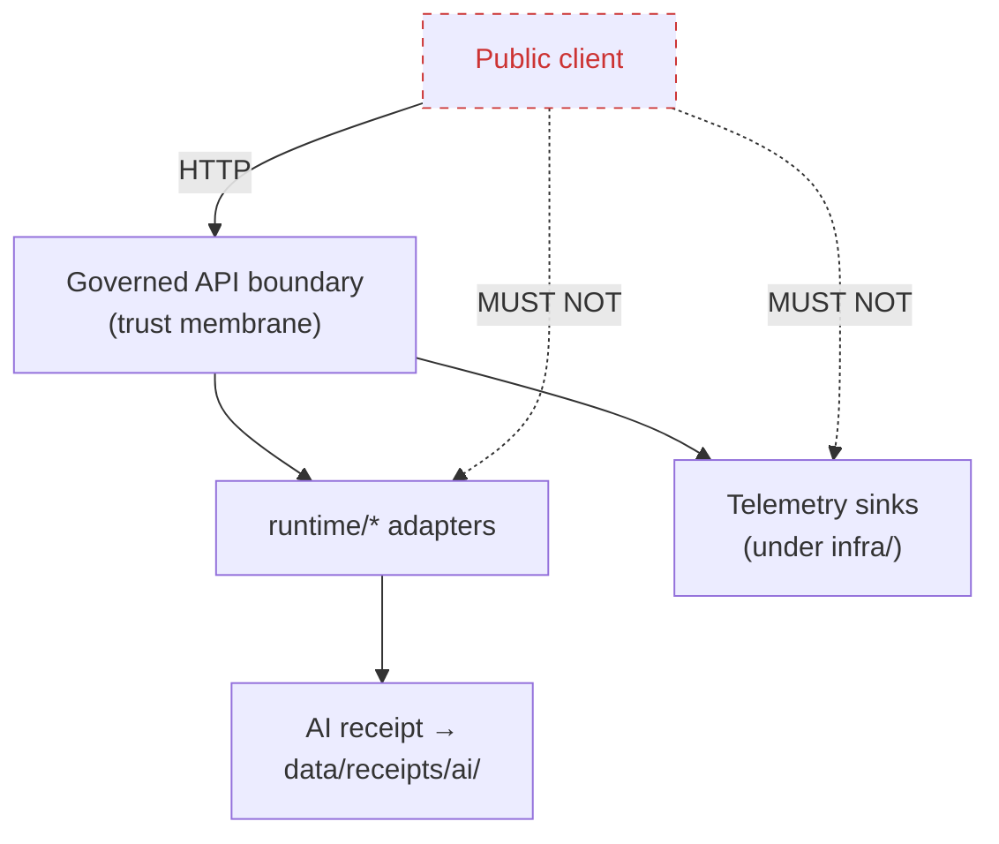

<!-- [KFM_META_BLOCK_V2]
doc_id: kfm://doc/adr-0016-telemetry-redaction-posture
title: ADR-0016 — Telemetry Redaction Posture
type: standard
version: v1.1
status: proposed
owners: TODO (proposed: Docs steward + Security/Privacy reviewer + Runtime owner)
created: 2026-05-11
updated: 2026-05-15
policy_label: public
related:
  - docs/doctrine/directory-rules.md
  - docs/doctrine/trust-membrane.md
  - docs/doctrine/truth-posture.md
  - docs/doctrine/lifecycle-law.md
  - docs/adr/ADR-0001-schema-home.md
  - policy/sensitivity/
  - policy/rights/
  - policy/runtime/
  - schemas/contracts/v1/runtime/
  - contracts/runtime/
  - apps/governed-api/
  - runtime/
  - infra/
  - data/receipts/
  - data/registry/sensitivity/
tags: [kfm, adr, telemetry, redaction, privacy, sensitivity, governance, observability, receipts, runtime]
notes:
  - "ADR number 0016 is PROPOSED until reconciled against docs/adr/README.md and any registry in docs/registers/"
  - "Owners and reviewers are placeholders pending CODEOWNERS verification"
  - "All path references are responsibility-home guidance unless confirmed against mounted-repo evidence"
[/KFM_META_BLOCK_V2] -->

# ADR-0016 — Telemetry Redaction Posture

> Telemetry that leaves a KFM process is **a publication event**. It is treated as a governed
> emission subject to the same sensitivity, rights, and policy gates as any other public-facing
> artifact — and never as a side channel around the trust membrane.

<p align="left">
  
  
  
  
  
  
  
</p>

| Field | Value |
|---|---|
| **ADR ID** | ADR-0016 (PROPOSED number; reconcile against `docs/adr/README.md`) |
| **Title** | Telemetry Redaction Posture |
| **Status** | `proposed` |
| **Date** | 2026-05-11 |
| **Last reviewed** | 2026-05-15 |
| **Supersedes** | none |
| **Superseded by** | none |
| **Owners** | TODO — Docs steward + Security/Privacy reviewer + Runtime owner (placeholder) |
| **Reviewers required** | Docs steward, Security/Privacy reviewer, Runtime owner, Release steward |
| **Related doctrine** | `docs/doctrine/trust-membrane.md`, `docs/doctrine/truth-posture.md`, `docs/doctrine/lifecycle-law.md`, `docs/doctrine/directory-rules.md` |
| **Related ADRs** | ADR-0001 (schema home) — CONFIRMED as doctrine in Directory Rules; earlier ADRs 0002–0015 — UNKNOWN until inspected |
| **Implementation posture** | PROPOSED. No mounted repo, tests, workflows, dashboards, logs, or emitted telemetry receipts were inspected in this update pass. |

> [!IMPORTANT]
> This ADR is a governance decision and implementation target. It is not evidence that a
> conformant telemetry redactor, validator, schema, policy bundle, or receipt stream already
> exists in the repository.

---

## Quick jump

- [0. Evidence boundary and commit posture](#0-evidence-boundary-and-commit-posture)
- [1. Context](#1-context)
- [2. Decision](#2-decision)
- [3. Telemetry classes and redaction posture](#3-telemetry-classes-and-redaction-posture)
- [4. Redaction profiles (catalogue)](#4-redaction-profiles-catalogue)
- [5. Architecture](#5-architecture)
- [6. Where this lives (placement)](#6-where-this-lives-placement)
- [7. Enforcement and validation](#7-enforcement-and-validation)
- [8. Consequences](#8-consequences)
- [9. Alternatives considered](#9-alternatives-considered)
- [10. Rollback and reversibility](#10-rollback-and-reversibility)
- [11. Open questions and NEEDS VERIFICATION](#11-open-questions-and-needs-verification)
- [12. Merge checklist](#12-merge-checklist)
- [Appendix A — Worked examples](#appendix-a--worked-examples)
- [Appendix B — Conformance language](#appendix-b--conformance-language)

---

## 0. Evidence boundary and commit posture

| Label | Meaning in this ADR |
|---|---|
| **CONFIRMED** | Supported by the attached Markdown baseline, attached KFM doctrine, or Directory Rules doctrine inspected in this update pass. |
| **INFERRED** | Reasonable synthesis from KFM doctrine, but not directly verified as mounted implementation. |
| **PROPOSED** | A placement, validator, path, schema, package, or implementation target not verified as present in a mounted repo. |
| **UNKNOWN** | Not inspectable in this pass because repo files, tests, workflows, dashboards, logs, branch state, and runtime evidence were not available. |
| **NEEDS VERIFICATION** | Check before merge, source activation, path creation, or enforcement. |

**CONFIRMED from the supplied file:** this ADR already framed telemetry as governed emission,
kept the trust membrane central, required source-side redaction, rejected sink-only filtering,
proposed receipt-bearing redaction, and preserved rollback discipline.

**Updated posture:** this revision keeps those commitments and tightens three risk areas:

1. It separates **doctrine** from **mounted implementation** more visibly.
2. It aligns machine-shape references to the ADR-0001 schema-home convention
   (`schemas/contracts/v1/...`) while keeping `contracts/` for semantic meaning.
3. It removes real-looking sensitive examples and replaces them with synthetic placeholders.

---

## 1. Context

KFM is a governed, evidence-first, map-first knowledge system. Its lifecycle invariant —
**RAW → WORK / QUARANTINE → PROCESSED → CATALOG / TRIPLET → PUBLISHED** — and its trust
membrane (`apps/governed-api/`, or the repo-confirmed equivalent) exist to keep raw,
in-flight, model-generated, or sensitive state from becoming public truth. Telemetry — logs,
metrics, traces, AI invocation receipts, error reports, and similar process memory — is a
category of *emission* that has historically been treated, in many systems, as orthogonal to
the trust membrane. This ADR rejects that treatment for KFM.

The KFM corpus has converged on three points relevant here, captured in project doctrine and
Directory Rules:

1. **Fail-closed redaction is the default posture for sensitive data.** Vulnerable species
   localities, sensitive archaeological sites, living-person records, ancestry overlays, precise
   locations, and rights-unclear material require redaction, generalization, suppression, or
   denial until policy support is present.
2. **Promotion is a governed state transition, not a file move.** No public-facing artifact
   should reach `data/published/` without validators, evidence resolution, catalog closure,
   receipts, and policy gates.
3. **Watchers and workers are not publishers.** Workers emit receipts and candidate decisions;
   they do not publish, mutate canonical truth, or bypass review. Public clients read through
   the governed API path, not through telemetry sinks or raw runtime surfaces.

If telemetry can leak names, coordinates, identifiers, raw prompts, model outputs, source URLs,
embedded payloads, or stack traces containing sensitive context, it routes around all three of
those properties. A log line that says
`error processing {"taxon":"<restricted species>", "lat":38.0000, "lon":-98.0000}` is,
in effect, a sub-rosa publication of a sensitive locality. **A telemetry pipe without a
redaction posture is a trust-membrane bypass.**

> [!IMPORTANT]
> This ADR does not invent a new authority. It applies the **existing** sensitivity, rights,
> and policy machinery to a class of emissions that has not previously been written down as
> being inside that machinery. Telemetry inherits — it does not get an exception.

### 1.1 What this ADR governs

- Logs and structured events emitted by `apps/*`, `runtime/*`, workers, and related services,
  when consumed by sinks inside or outside the trust boundary.
- Metrics (counters, gauges, histograms) and their labels/dimensions.
- Distributed traces (spans, span attributes, baggage).
- AI invocation receipts (`data/receipts/ai/`) and model-adapter telemetry from `runtime/`.
- Error reports, panic dumps, and crash traces.
- Build, CI, and pipeline telemetry that leaves the local process boundary or is persisted.

### 1.2 What this ADR does **not** govern

- The schema-home rule for telemetry shapes. That remains governed by ADR-0001 and the
  Directory Rules schema-home convention (`schemas/contracts/v1/...`).
- Field-level shape of telemetry events. That belongs in `schemas/contracts/v1/runtime/...`
  once added, with semantic meaning described under `contracts/runtime/...` if needed.
- The decision of *whether* a given dataset is publishable. That remains governed by
  `policy/release/` and release decision objects.
- Internal in-process traces that never leave the process boundary and are not persisted.
- Vendor-specific telemetry sink configuration, except to say it must not bypass the trust
  membrane or weaken KFM policy.

---

## 2. Decision

KFM adopts a **fail-closed, redaction-first telemetry posture** with five normative rules.
Each rule maps to existing KFM authority surfaces; none of them creates a new authority root.

### 2.1 The five rules

> [!NOTE]
> Conformance terms (**MUST**, **MUST NOT**, **SHOULD**, **MAY**) follow the convention
> defined in `docs/doctrine/directory-rules.md` §2.2, restated in
> [Appendix B](#appendix-b--conformance-language).

1. **Telemetry is governed emission.** Any telemetry that crosses the process boundary
   **MUST** be treated as a publication event for the purposes of sensitivity, rights, and
   policy review. It **MUST NOT** be treated as a development-only side channel.
2. **Default-deny on sensitive fields.** Telemetry emitters **MUST** allow only an explicit
   allow-list of fields and shapes. Fields not on the allow-list are dropped or redacted at
   the source, not at the sink. Sink-side redaction is a defense-in-depth layer, never the
   first line.
3. **Same redaction profiles as `data/published/`.** Sensitivity classes and redaction
   profiles (radius mask, grid generalization, seeded jitter, k-anonymity thresholds,
   differential privacy for aggregates) **MUST** be drawn from `policy/sensitivity/` — the
   same source that governs published artifacts. Telemetry **MUST NOT** define its own,
   weaker, parallel profile catalogue.
4. **Trust membrane applies to telemetry surfaces.** Telemetry sinks reachable from outside
   the host (dashboards, exporters, OTLP endpoints, log shippers) **MUST** be configured
   under `infra/` with deny-by-default, least privilege, and audit logs — the same posture
   required of any other public-adjacent surface. A telemetry endpoint **MUST NOT** be a
   shortcut around `apps/governed-api/` or the repo-confirmed governed API equivalent.
5. **Every redaction is receipted.** A redaction transform applied to a telemetry record
   **MUST** emit, or be coverable by, a run receipt under `data/receipts/` indicating the
   profile applied, the sensitivity class invoked, and the `spec_hash` of the redactor.
   Telemetry that has been redacted **MUST** be traceable back to the rule that redacted it.

### 2.2 Status posture

| Posture | Telemetry policy |
|---|---|
| **No effective sensitivity policy bound** | Emit **only** the minimal, allow-listed, non-sensitive baseline. Fail closed. |
| **Sensitivity bound but redactor unhealthy** | Pause non-baseline telemetry. Emit a single `redactor.unhealthy` heartbeat. Fail closed. |
| **Sensitivity bound and redactor healthy** | Emit per allow-list, with each emission classified and redacted at source. |
| **Embargo / revocation in force** | Suppress historical and live emissions referencing the embargoed identity; emit an `embargo.suppression` receipt. |

> [!CAUTION]
> "We'll filter logs at the SIEM" is **not** a conformant implementation of Rule 2. Sink-side
> filtering protects against the leak, not the policy violation; the policy violation already
> happened when the field left the process.

---

## 3. Telemetry classes and redaction posture

Telemetry is treated as several distinct classes. Each class inherits the same sensitivity
catalogue from `policy/sensitivity/` but differs in defaults and channels.

| Class | Channel | Default posture | Notes |
|---|---|---|---|
| **Baseline operational** | metrics, structured logs | Emit | Pre-declared low-cardinality counters and gauges. No free-form fields. |
| **Request envelope (governed API)** | structured log + trace | Emit (redacted) | Path, status code, latency, finite outcome (`ANSWER` / `ABSTAIN` / `DENY` / `ERROR`). No request body, no raw user input. |
| **AI invocation** | `data/receipts/ai/` | Emit (receipted) | Adapter id, model profile, spec hash, redaction profile applied, decision envelope id. No prompt content, no raw outputs, no chain-of-thought. |
| **Pipeline / worker** | `data/receipts/` | Emit | Run id, source id, validators run, outcome. Field-level shapes governed by run-receipt contracts and schemas. |
| **Ingest** | `data/receipts/ingest/` | Emit | Source descriptor id, run id, license block hash, sensitivity hint. No raw payload echo. |
| **Sensitive-domain detail** | restricted sink | **Quarantine by default** | Coordinates, taxa, identifiers, person records, archaeological sites. **MUST** pass through redaction profile resolution before any emission. |
| **Error / crash** | logs, crash dumps | Redact aggressively | Stack frames allowed; locals, env, request bodies, prompt packets, and source payloads stripped. PII and secret patterns scrubbed by default. |
| **Build / CI** | CI logs | Emit | Source paths and commit shas allowed. Secrets and `configs/` content **MUST NOT** appear. |
| **Operator action** | audit log + receipt | Emit (bounded) | Actor id may be tokenized; action, target class, reason code, and approval context are allowed when policy-safe. |

> [!WARNING]
> The classes above are operational defaults — they are not exhaustive. A new emission
> surface defaults to **Quarantine by default** until it appears on this table or in an
> equivalent register.

---

## 4. Redaction profiles (catalogue)

KFM's redaction profiles already exist as a doctrine concept for `data/published/` and
sensitive-domain content. This ADR pins their applicability to telemetry. Profile names and
parameter shapes are governed by `policy/sensitivity/` and **MUST NOT** be redefined here.

| Profile | What it does (illustrative) | Typical sensitivity class | Telemetry use |
|---|---|---|---|
| **Radius mask** | Snaps a point to a coarser geometry (for example, a region disk). | Rare species, sites | Replaces precise `lat` / `lon` in spans or logs. |
| **Grid generalization** | Bins coordinates to a configured grid. | Sensitive locations, person addresses | Replaces precise location with cell id. |
| **Seeded jitter** | Adds bounded, deterministic offset. | Aggregable point data | Preserves spatial statistics in metrics; never as authority. |
| **k-anonymity** | Suppresses dimensions until each cohort ≥ k. | Person records, demographics | Drops or merges label dimensions on metrics. |
| **Differential privacy** | Adds calibrated noise for aggregates. | Counts, histograms | For metric exports only; **never** for trace attributes or individual records. |
| **Field elision** | Drops the field entirely. | Anything not on the allow-list | Default for fields with no declared profile. |
| **Tokenization** | Replaces an identifier with a non-reversible token. | Person identifiers | Token salt is environment-scoped; never logged. |
| **Embargo suppression** | Suppresses any emission referencing the embargoed key. | Time-bound restrictions | Listens to revocation / embargo signals from `policy/rights/`. |

> [!TIP]
> A telemetry emitter that needs a profile not in this catalogue should not invent one
> locally. It should open a `policy/sensitivity/` proposal and a
> `docs/registers/VERIFICATION_BACKLOG.md` entry, and emit at the **Field elision** default
> until the profile lands.

---

## 5. Architecture

### 5.1 Emission flow (logical)


> [!NOTE]
> The diagram describes the **logical** redaction flow this ADR mandates. Whether each box
> exists as a discrete package today is **NEEDS VERIFICATION** against mounted-repo evidence.

### 5.2 Trust membrane interaction



Telemetry sinks **MUST NOT** be a public surface. Where they are reachable for operational
reasons (for example, an operator dashboard), they are governed by `infra/` posture —
deny-by-default, least privilege, audit — the same as any other restricted surface.

### 5.3 AI and prompt-handling boundary

Model-assisted routes have a stricter telemetry boundary because prompt packets may contain
policy-filtered excerpts, scope, source roles, and citation candidates. A conformant AI telemetry
record **MUST NOT** include:

- raw prompt text;
- raw model output;
- chain-of-thought;
- unpublished evidence excerpts;
- restricted source existence details that a denied user is not allowed to infer.

It **MAY** include policy-safe audit fields: `request_id`, `audit_ref`, `model_profile`, adapter id,
input digest, output digest, schema validation result, citation validation result, redaction profile,
latency bucket, and finite outcome.

---

## 6. Where this lives (placement)

This ADR introduces **no new canonical root**, **no new compatibility root**, and **no parallel
authority home**. It places telemetry-redaction concerns under the responsibility roots that
already own them, per `docs/doctrine/directory-rules.md`.

```text
docs/
└── adr/
    └── ADR-0016-telemetry-redaction-posture.md        ← this file; ADR number/path NEEDS VERIFICATION

contracts/
└── runtime/
    └── telemetry-redaction.md                         ← PROPOSED semantic contract, if needed

schemas/
└── contracts/
    └── v1/
        └── runtime/
            └── telemetry/                             ← PROPOSED event / receipt shapes

policy/
├── sensitivity/                                       ← redaction classes and rules
│   └── telemetry/                                     ← PROPOSED segment: telemetry-specific bindings
├── rights/                                            ← embargo / revocation signals
└── runtime/                                           ← runtime gate policy

tools/
└── validators/
    └── telemetry_redaction/                           ← PROPOSED: enforcer / linter / CI check

packages/
├── policy-runtime/                                    ← PROPOSED/NEEDS VERIFICATION: profile resolver home
├── evidence-resolver/                                 ← PROPOSED/NEEDS VERIFICATION: EvidenceRef helper
└── telemetry-redactor/                                ← PROPOSED only if reuse warrants a shared package

apps/
├── governed-api/                                      ← target trust membrane; exact app path NEEDS VERIFICATION
└── workers/                                           ← PROPOSED deployable worker surface, if present

runtime/
└── model_adapters/                                    ← target adapter home; exact path NEEDS VERIFICATION

data/
├── receipts/
│   ├── ai/                                            ← AI invocation receipts
│   ├── pipeline/                                      ← run receipts
│   └── telemetry/                                     ← PROPOSED only if scoped redaction-event stream is needed
└── registry/
    └── sensitivity/                                   ← sensitivity classes registry

infra/
└── telemetry-sinks/                                   ← PROPOSED config lane for deny-by-default sink exposure
```

> [!IMPORTANT]
> Every leaf marked **PROPOSED** above is a placement inference subject to the path-validation
> checklist in Directory Rules. None of these paths are claimed to exist in the current repo by
> this ADR.

### 6.1 Path-rule citations

| Path | Directory Rules basis | Status in this ADR |
|---|---|---|
| `docs/adr/ADR-0016-...md` | `docs/` explains and carries ADRs under the human-facing control plane. | PROPOSED path until ADR index is inspected. |
| `contracts/runtime/telemetry-redaction.md` | `contracts/` defines object meaning; executable validation does not live there. | PROPOSED, only if a semantic runtime contract is needed. |
| `schemas/contracts/v1/runtime/telemetry/` | ADR-0001 schema-home convention: machine-checkable shape lives under `schemas/contracts/v1/...`. | PROPOSED. Prevents `contracts/` / `schemas/` divergence. |
| `policy/sensitivity/telemetry/` | `policy/` is canonical for admissibility; `policy/sensitivity/` owns sensitivity classes and redaction rules. | PROPOSED segment inside canonical responsibility root. |
| `policy/runtime/` | Runtime gate policy belongs under `policy/runtime/`. | PROPOSED specific gate; root responsibility confirmed by doctrine. |
| `tools/validators/telemetry_redaction/` | Repo-wide validators, generators, builders, and checkers belong under `tools/validators/`. | PROPOSED validator home. |
| `tests/runtime_proof/` and `tests/policy/` | Tests prove enforceability; runtime proof and policy tests are distinct proof surfaces. | PROPOSED tests; exact local convention NEEDS VERIFICATION. |
| `fixtures/valid/` / `fixtures/invalid/` or `tests/fixtures/` | Fixture homes must not compete without README distinction. | NEEDS VERIFICATION. Choose one authority before merge. |
| `packages/telemetry-redactor/` | Shared libraries used by multiple deployables belong under `packages/`. | PROPOSED only if ≥ 2 deployables need shared code. |
| `data/receipts/telemetry/` | `data/receipts/` is process memory; receipts do not prove release by themselves. | PROPOSED only if existing `ai/` / `pipeline/` streams are insufficient. |
| `infra/telemetry-sinks/` | Exposure posture, reverse proxy, VPN, firewall, and audit live under `infra/`. | PROPOSED; exact folder name NEEDS VERIFICATION. |

---

## 7. Enforcement and validation

The KFM corpus is explicit that policy-as-code beats checklists. This ADR adopts that posture
for redaction: telemetry must be both present enough to support audit and lawful enough not to
bypass sensitivity, rights, release, or trust-membrane controls.

### 7.1 Required validators

| Validator | Lives in | Checks | Failure mode |
|---|---|---|---|
| **`telemetry_redaction_lint`** | `tools/validators/telemetry_redaction/` | Static analysis of emitter call sites: no string-interpolated free-form fields; every structured event has a declared class. | Fails CI on PR. |
| **`telemetry_allowlist_check`** | `tools/validators/telemetry_redaction/` | Diff against the allow-list manifest; new field names without a declared profile are rejected. | Fails CI on PR. |
| **`redaction_profile_resolution_test`** | `tests/runtime_proof/` | Property tests: every sensitivity class resolves to a known profile; no restricted class resolves to a no-op. | Fails CI; blocks release. |
| **`telemetry_admission_gate`** | `policy/runtime/` (Rego or equivalent) | Runtime / admission: deployments without a bound redactor configuration are denied. | Deployment denied. |
| **`embargo_propagation_test`** | `tests/policy/` | Asserts that an embargo or revocation in `policy/rights/` causes suppression within bounded time. | Fails CI; opens drift entry. |
| **`telemetry_sink_exposure_check`** | `tools/validators/telemetry_redaction/` or `tools/validators/infra/` | Verifies dashboards, exporters, OTLP endpoints, and log shippers are not public-by-default. | Fails deployment gate. |

> [!NOTE]
> Validator names above are **PROPOSED**. Their final identifiers and home subfolders are
> subject to the path-validation checklist when implementation lands.

### 7.2 Required tests and fixtures

A conformant implementation of this ADR **MUST** ship with, at minimum:

1. **Valid fixtures** under `fixtures/valid/` or `tests/fixtures/valid/`, per local convention,
   showing redacted telemetry for each class.
2. **Invalid fixtures** under `fixtures/invalid/` or `tests/fixtures/invalid/` showing the leaks
   each rule prevents: raw coordinates, unmasked person ids, prompt echoes, secret-bearing env
   dumps, unpublished evidence excerpts, and sink-exposed sensitive fields.
3. **Property tests** asserting allow-list closure: an emission with an undeclared field never
   reaches a sink.
4. **Embargo regression tests** asserting that matching historical and live emissions are
   suppressed once an embargo binds.
5. **Negative runtime tests** asserting `ABSTAIN`, `DENY`, or `ERROR` remains visible where
   evidence, rights, sensitivity, or runtime state blocks safe emission.

### 7.3 Proof and receipts

Every redaction-bearing emission either carries, or is covered by, a receipt that can be joined
to the relevant audit and evidence path. The helper that resolves `EvidenceRef` to `EvidenceBundle`
is **PROPOSED / NEEDS VERIFICATION** until mounted repo evidence confirms its exact package name
and path.

```text
redaction_receipt
├── run_id
├── emitter_id
├── spec_hash                  # redactor code + configuration hash
├── sensitivity_class          # from policy/sensitivity/
├── redaction_profile          # profile applied
├── policy_bundle_version      # OPA / equivalent bundle version
├── emission_state             # emitted | suppressed | partial
├── source_event_digest        # digest only; no raw event payload
└── audit_ref                  # join key for reconstructable audit
```

> [!TIP]
> The shape above is **illustrative**. Field names and schema home are governed by
> ADR-0001 and any runtime/run-receipt contracts. This ADR pins the *responsibility* to emit
> such a receipt; it does not pin the field-level shape.

---

## 8. Consequences

<details>
<summary><b>Click to expand: positive consequences</b></summary>

- **Trust-membrane integrity restored across an entire emission class.** Telemetry stops
  being a side channel around `apps/governed-api/`.
- **One sensitivity catalogue, one redaction catalogue.** Telemetry inherits the same profiles
  that govern `data/published/`, preventing parallel-policy drift.
- **Receipt-bearing redactions.** Auditable: every redaction event resolves back to the profile
  and the policy bundle that triggered it.
- **Fail-closed by default.** When the redactor is unhealthy, baseline-only emission keeps the
  system observable without leaking.
- **Embargo and revocation propagate.** Historical telemetry can be reasoned about and
  suppressed, in line with KFM's correction, revocation, and paper-trail posture.
- **Policy-as-code path stays consistent.** Telemetry must be both instrumented and lawful.

</details>

<details>
<summary><b>Click to expand: negative consequences and costs</b></summary>

- **Latency at emission.** Source-side classification and redaction add per-event work.
  Mitigation: low-overhead classifier, profile resolution cached per process lifetime.
- **Operational visibility narrows under degraded redactor state.** Operators see less.
  Mitigation: explicit `redactor.unhealthy` heartbeat plus an operator runbook in
  `docs/runbooks/`.
- **Allow-list maintenance cost.** New fields require a policy round-trip. Mitigation:
  generators in `tools/generators/` to scaffold profile bindings from emitter declarations.
- **Cross-cutting refactor.** Every emitter site is in scope. Mitigation: stage the rollout
  per deployable and runtime package, with telemetry validators running in advisory mode
  before they gate CI.
- **Test surface grows.** Property tests for redaction coverage are non-trivial. Mitigation:
  fixture generators with synthetic sensitive data — never real sensitive content.

</details>

<details>
<summary><b>Click to expand: invariants this ADR preserves</b></summary>

- RAW → WORK / QUARANTINE → PROCESSED → CATALOG / TRIPLET → PUBLISHED (unchanged).
- Public clients use the governed API path (unchanged; reinforced).
- Cite-or-abstain truth posture (unchanged; reinforced — telemetry now carries enough
  provenance to support, not undermine, cited claims).
- Watcher-as-non-publisher (unchanged; reinforced — workers' telemetry is not a back-door
  publication).
- Policy-aware defaults where risk matters (unchanged; reinforced).
- Schema-home rule from ADR-0001 (unchanged; clarified).
- No new canonical or compatibility roots introduced.

</details>

---

## 9. Alternatives considered

| Alternative | Why rejected |
|---|---|
| **Treat telemetry as out-of-scope for policy.** | Re-creates the trust-membrane bypass. Inconsistent with the posture that every boundary-crossing emission is governed. |
| **Sink-side filtering only (SIEM-based scrubbing).** | Defense-in-depth, not policy. The violation has already occurred when sensitive content leaves the process. Acceptable as an **additional** layer, not as the first line. |
| **Per-emitter ad-hoc redaction in each `apps/*` package.** | Creates parallel, divergent profile catalogues — the exact drift Directory Rules are meant to prevent. |
| **New root `telemetry/` for redaction code, fixtures, and receipts.** | Topic is not responsibility. Telemetry is a lane inside existing roots: `policy/`, `schemas/`, `tools/`, `tests/`, `data/receipts/`, `infra/`, and `runtime/`. |
| **Disable telemetry on sensitive surfaces entirely.** | Loses observability; not necessary because redaction profiles already exist as doctrine for the same data classes. |
| **Defer until a downstream telemetry vendor is chosen.** | Vendor choice is implementation, not policy. The redaction posture is invariant under vendor change. |
| **Log raw prompt/model payloads but encrypt them.** | Encryption is not a substitute for minimization. Persisting raw prompt/model payloads creates avoidable rights, sensitivity, and chain-of-thought risks. |

---

## 10. Rollback and reversibility

Per Directory Rules migration discipline, structural moves and policy posture changes require a
documented rollback path. This ADR is **reversible** as follows.

| Step | Reverse |
|---|---|
| Mark ADR `status: superseded` and write a replacing ADR. | Status field change; old ADR retained with forward link. |
| Disable `telemetry_admission_gate` Rego rule. | Re-enable from version control. |
| Revert `policy/sensitivity/telemetry/` profile bindings. | Restore prior versioned policy bundle. |
| Stand down `tools/validators/telemetry_redaction/`. | Move to `scripts/maintenance/` only if no longer trust-bearing; no silent deletion. |
| Reconfigure emitters to prior behavior. | Per-package PR revert; emitters are call-site changes, not contract changes. |
| Preserve historical receipts under `data/receipts/`. | **Append-only**; receipts are not deleted on rollback. |
| Retire a proposed telemetry receipt lane. | Add deprecation entry and migration note; fold future receipts into `ai/`, `pipeline/`, or `validation/` only after review. |

> [!WARNING]
> Rollback **MUST NOT** delete redaction receipts. They are append-only, and they remain
> evidence even if the policy that produced them is superseded.

---

## 11. Open questions and NEEDS VERIFICATION

> [!NOTE]
> These items belong on `docs/registers/VERIFICATION_BACKLOG.md` once that register is in
> the repo. Each is **NEEDS VERIFICATION** until inspected against mounted-repo evidence.

- **ADR number 0016.** Number is **PROPOSED**. Reconcile against `docs/adr/README.md` and
  any ADR index before merge. Only ADR-0001 is CONFIRMED in current doctrine evidence;
  0002–0015 are **UNKNOWN**.
- **Exact governed API path.** Directory Rules and KFM doctrine use `apps/governed-api/` as the
  operational trust membrane, but live repo app names are **NEEDS VERIFICATION**.
- **`policy/sensitivity/telemetry/` segment.** Whether this segment exists, or whether telemetry
  profile bindings live elsewhere under `policy/sensitivity/`.
- **`schemas/contracts/v1/runtime/telemetry/` segment.** Whether telemetry event and receipt shapes
  should land here, or under a more general runtime envelope schema family.
- **`contracts/runtime/telemetry-redaction.md`.** Whether a semantic contract is needed or whether
  the ADR is sufficient doctrine for the first implementation.
- **`tools/validators/telemetry_redaction/` home.** Whether this lands as a single validator package
  or splits into linter + admission gate + property test harness.
- **`packages/telemetry-redactor/`.** Whether a shared library is warranted (≥ 2 deployable consumers)
  or whether it stays embedded inside an existing policy/runtime package.
- **`data/receipts/telemetry/` sibling.** Whether redaction events warrant a sibling under
  `data/receipts/`, or whether they fold into existing `validation/`, `pipeline/`, and `ai/` receipt
  streams.
- **Fixture authority.** Whether root `fixtures/` or `tests/fixtures/` is canonical for telemetry
  fixtures; Directory Rules allow either but require README distinction if both exist.
- **Existence of a prior `docs/standards/TELEMETRY_MINIMUMS.md`.** The corpus suggests this as
  future work; current presence is **UNKNOWN**.
- **OpenTelemetry-specific semantic conventions.** Whether KFM pins specific OTel attribute names is
  **PROPOSED** for a follow-up ADR or standard.
- **Owners and reviewers.** All owner fields above are placeholders pending CODEOWNERS verification.

---

## 12. Merge checklist

A PR that accepts this ADR **SHOULD** prove, or explicitly defer, the following:

- [ ] ADR number reconciled against `docs/adr/README.md` and any ADR registry.
- [ ] Target file path checked against Directory Rules and current mounted repo evidence.
- [ ] No new root-level `telemetry/` folder introduced.
- [ ] Schema-home choice recorded; no divergent telemetry schemas in both `contracts/` and `schemas/`.
- [ ] Owners and reviewers confirmed from CODEOWNERS or governance register.
- [ ] Initial allow-list manifest exists, or ADR remains doctrine-only with implementation deferred.
- [ ] Sensitive example fixtures use synthetic placeholders only.
- [ ] Redaction receipt shape either references an existing RunReceipt schema or opens a schema proposal.
- [ ] CI/admission validators are either implemented or listed in `VERIFICATION_BACKLOG.md`.
- [ ] Rollback path preserves receipts and review history.

---

## Appendix A — Worked examples

> Examples below are **illustrative**, not extracted from a mounted repo. They show the shape
> this ADR mandates, not a current emitter implementation. All sensitive domain details below
> are synthetic placeholders.

### A.1 Sensitive locality log line

**Before** (forbidden under Rule 2; synthetic example):

```json
{
  "level": "error",
  "msg": "failed to render layer",
  "taxon": "species.restricted.example",
  "lat": 38.0000,
  "lon": -98.0000,
  "user_query": "restricted species near example place"
}
```

**After** (conformant; profile `grid-1km` + `field-elision`; synthetic example):

```json
{
  "level": "error",
  "msg": "failed to render layer",
  "sensitivity_class": "species.restricted",
  "redaction_profile": "grid-1km",
  "location_cell": "grid:synthetic-1km-cell",
  "user_query": "[elided]",
  "run_receipt_id": "rcpt:run:synthetic"
}
```

### A.2 AI invocation receipt

```json
{
  "receipt_kind": "ai",
  "adapter_id": "local-model-adapter",
  "model_profile": "focus.answer.small",
  "spec_hash": "sha256:synthetic",
  "sensitivity_class": "person.living",
  "redaction_profile": "k-anon-k5+tokenize",
  "decision_envelope_id": "env:synthetic",
  "outcome": "ABSTAIN",
  "policy_bundle_version": "v2026.05.01"
}
```

Notice that **no prompt content, no raw model output, and no chain-of-thought appear**. That is
the rule, not the sample.

### A.3 Metric label dimensions

| Field | Allow-listed? | Notes |
|---|---|---|
| `route` | Yes | Bounded cardinality; avoid raw path parameters. |
| `status_code` | Yes | Bounded. |
| `outcome` | Yes | `ANSWER` / `ABSTAIN` / `DENY` / `ERROR`. |
| `surface_class` | Yes | Must be a bounded enum. |
| `taxon_id` | No (default) | Requires explicit profile binding. |
| `user_id` | No | Tokenized only, and only if a profile binds it. |
| `geohash` | Conditional | Coarse precision under a profile; precise geohash never. |
| `prompt` | No | Use digest only when audit requires it. |
| `source_url` | Conditional | Public, rights-safe source descriptors only; no credentialed URLs. |

---

## Appendix B — Conformance language

This ADR uses the RFC 2119-style terms defined in `docs/doctrine/directory-rules.md` §2.2.

| Term | Meaning here |
|---|---|
| **MUST / MUST NOT** | Non-negotiable. PRs that violate are not merged absent an approved superseding ADR. |
| **SHOULD / SHOULD NOT** | Strong default. Deviation requires brief justification in the PR body. |
| **MAY** | Permitted; no justification required, but stay consistent within the lane. |

---

[⬆ Back to top](#adr-0016--telemetry-redaction-posture)

---

### Related docs

- [`docs/doctrine/directory-rules.md`](../doctrine/directory-rules.md) — placement and authority law.
- [`docs/doctrine/trust-membrane.md`](../doctrine/trust-membrane.md) — TODO: link target NEEDS VERIFICATION.
- [`docs/doctrine/truth-posture.md`](../doctrine/truth-posture.md) — TODO: link target NEEDS VERIFICATION.
- [`docs/doctrine/lifecycle-law.md`](../doctrine/lifecycle-law.md) — TODO: link target NEEDS VERIFICATION.
- [`docs/adr/ADR-0001-schema-home.md`](./ADR-0001-schema-home.md) — schema-home rule; exact link target NEEDS VERIFICATION.
- [`contracts/runtime/`](../../contracts/runtime/) — semantic runtime contracts; target existence NEEDS VERIFICATION.
- [`schemas/contracts/v1/runtime/`](../../schemas/contracts/v1/runtime/) — runtime schemas; target existence NEEDS VERIFICATION.
- [`policy/sensitivity/`](../../policy/sensitivity/) — sensitivity classes and redaction profiles.
- [`policy/rights/`](../../policy/rights/) — embargo, revocation, license enforcement.
- [`policy/runtime/`](../../policy/runtime/) — runtime and admission policy.
- [`data/receipts/`](../../data/receipts/) — process memory; exact substreams NEEDS VERIFICATION.

**Last reviewed:** 2026-05-15 — strengthened evidence boundary, path posture, and synthetic examples.
**Next review due:** within 6 months or upon first conformant implementation, whichever is sooner.

[⬆ Back to top](#adr-0016--telemetry-redaction-posture)
