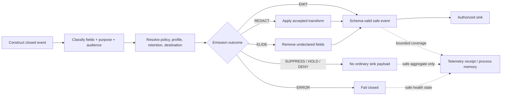
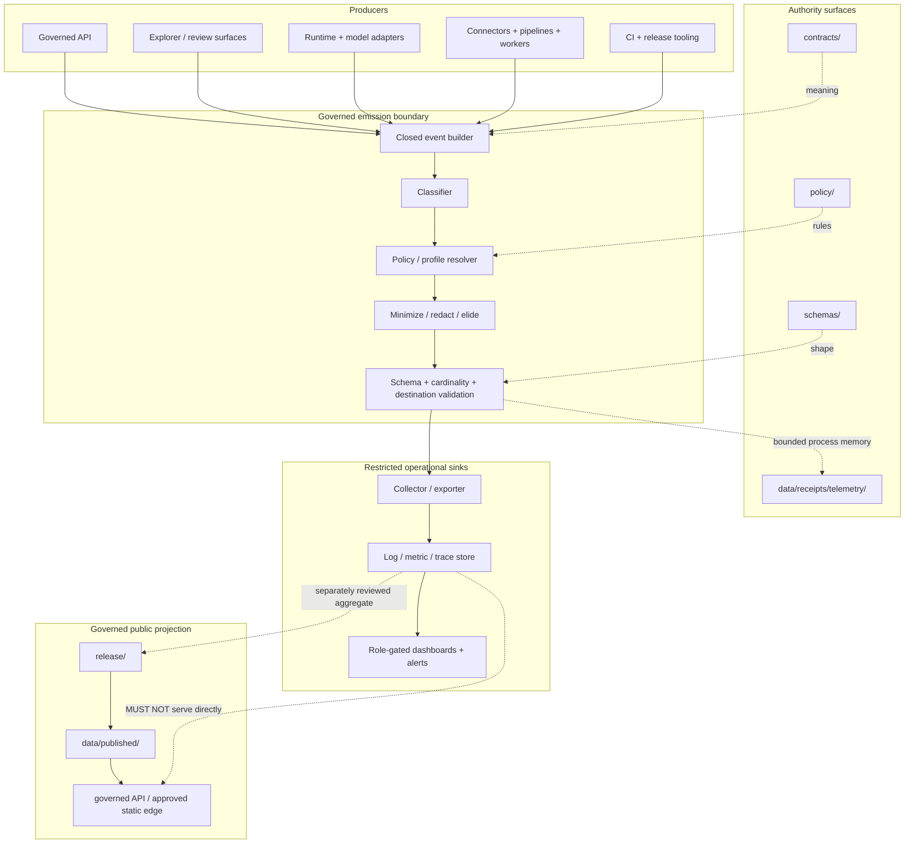

<!-- [KFM_META_BLOCK_V2]
doc_id: kfm://doc/adr/0016-telemetry-redaction-posture
title: "ADR-0016 — Telemetry Redaction Posture"
type: adr
adr_id: ADR-0016
version: v1.3
status: proposed
owners:
  - "NEEDS VERIFICATION — architecture decision owner"
  - "NEEDS VERIFICATION — observability and runtime steward"
  - "NEEDS VERIFICATION — security and privacy reviewer"
  - "NEEDS VERIFICATION — sensitivity and rights steward"
  - "NEEDS VERIFICATION — telemetry policy and validation steward"
  - "NEEDS VERIFICATION — receipt, correction, and release stewards"
owner_status: "CODEOWNERS routes relevant paths to @bartytime4life, but accepted stewardship, required-review rules, independent approval, incident ownership, and production telemetry authority were not verified"
reviewers_required:
  - Architecture steward
  - Docs steward
  - Observability and runtime steward
  - Security and privacy reviewer
  - Sensitivity and rights steward
  - Policy and validation stewards
  - Receipt and evidence stewards
  - Infrastructure and operations reviewer
  - Governed API and public-surface maintainers
created: 2026-05-11
updated: 2026-08-14
policy_label: public
truth_posture: cite-or-abstain
owning_root: docs/
responsibility: "Record the proposed telemetry minimization, redaction, governed-emission, receipt, sink, and operational-graduation boundary."
current_path: docs/adr/ADR-0016-telemetry-redaction-posture.md
supersedes: []
superseded_by: []
evidence_snapshot:
  repository: bartytime4life/Kansas-Frontier-Matrix
  base_ref: main
  base_commit: 6a9c4665175edd2c32f2fafae0f3bb0dfb0492df
  inspection_origin_commit: f5e082d423f1dbb0753f970a662de4f818c77529
  continuity_compare: f5e082d423f1dbb0753f970a662de4f818c77529...6a9c4665175edd2c32f2fafae0f3bb0dfb0492df
  continuity_result: "six changed paths limited to geology assessment, generated receipt, and ADR-0009; no ADR-0016 or telemetry evidence path changed"
  target_prior_blob: 65a86c95259be2477d09836de972903cfe84afac
  adr_index_blob: 938c5894c36b99e14810918e2c550ab0e92d53b1
  telemetry_contract_readme_blob: 7523d7d638f598060661129ed70748b1bb2ad8be
  telemetry_schema_readme_blob: 582ee87f6d9a6a786730b1b47842d82ebb5a1e58
  telemetry_receipts_readme_blob: d98cf13b34d85838326b60a48f4b9c9c0a92bb03
  telemetry_policy_readme_status: "repository-grounded boundary README; operational policy remains held"
  no_raw_policy_blob: 9728577c061732b4b24069811397a0b6a135d5e9
  no_prompt_policy_blob: e8c7a77279c6fdee08592e1c6ad49e08c8e9305f
  no_restricted_coords_policy_blob: a240f2bc519fe461c8c9556874a747b1db013566
  telemetry_validator_blob: d0679edda558c33fcfa8feef4b99178b611028f3
  telemetry_workflow_run_id: 31812628187
  telemetry_workflow_head: f5e082d423f1dbb0753f970a662de4f818c77529
  telemetry_workflow_result: "success for no-raw-evidence, no-prompts, and no-restricted-coords; operational enforcement remains WORKFLOW_HOLD"
related:
  - docs/adr/README.md
  - docs/adr/INDEX.md
  - docs/adr/ADR-0004-apps-governed-api-is-the-trust-membrane.md
  - docs/adr/ADR-0010-deny-by-default-for-dna-rare-species-archaeology-infrastructure.md
  - docs/adr/ADR-0011-receipts-vs-proofs-vs-manifests-vs-catalog-separation.md
  - docs/adr/ADR-0013-spec_hash-and-run_id-identity-grammar.md
  - docs/adr/ADR-0014-temporal-vocabulary--six-time-kinds-tracked.md
  - docs/adr/ADR-0019-ai-adapter-contract-and-finite-envelopes.md
  - docs/adr/ADR-0020-abstain-is-a-first-class-decision.md
  - docs/adr/ADR-0025-public-client-never-reads-canonical-internal-stores.md
  - docs/adr/ADR-0029-adopt-directory-governance-standard-v2.md
  - docs/doctrine/directory-rules.md
  - docs/standards/TELEMETRY_MINIMUMS.md
  - docs/architecture/ui/TELEMETRY.md
  - contracts/telemetry/README.md
  - contracts/telemetry/trace_receipt_link.md
  - contracts/telemetry/openlineage_run_event_projection.md
  - contracts/telemetry/remote_sensing_lineage_activity.md
  - contracts/telemetry/map_build_sustainability.md
  - schemas/contracts/v1/telemetry/README.md
  - data/receipts/telemetry/README.md
  - policy/telemetry/README.md
  - policy/telemetry/no_restricted_coords.rego
  - policy/ui/no_raw_in_telemetry.rego
  - policy/ui/no_prompt_in_telemetry.rego
  - tools/validators/validate_telemetry_safety.py
  - tools/validators/validate_trace_receipt_link.py
  - tools/validators/telemetry/README.md
  - tools/validators/telemetry/validate_openlineage_run_event_projection.py
  - tools/validators/telemetry/validate_remote_sensing_lineage_activity.py
  - tools/validators/telemetry/validate_map_build_sustainability.py
  - .github/workflows/telemetry-policy.yml
  - .github/CODEOWNERS
tags: [kfm, adr, telemetry, observability, redaction, minimization, privacy, sensitivity, rights, secrets, receipts, runtime, trust-membrane, fail-closed]
notes:
  - "v1.3 is a same-path repository-grounded evidence refresh. It preserves status `proposed`; it does not accept ADR-0016, emit telemetry, activate policy, create a sink, change retention, or publish anything."
  - "ADR-0029 is the only accepted numbered ADR and adopts Directory Rules v2; that decision confirms the responsibility-root split used here without accepting this telemetry decision."
  - "Four closed, synthetic, fixture-only telemetry profiles now have paired contracts, schemas, fixtures, focused validators, tests, and workflow coverage. They remain non-authoritative and do not constitute a general telemetry event, redaction, policy-input, or receipt profile."
  - "The general telemetry-safety validator remains a NotImplementedError placeholder, the three inspected Rego modules remain allow-by-default greenfield stubs, and operational emitter, redactor, sink, receipt, retention, and incident integration remain held or unknown."
  - "The successful telemetry-policy run at the pinned main SHA proves bounded repository-local profile checks and explicit holds only."
[/KFM_META_BLOCK_V2] -->

<a id="top"></a>

# ADR-0016 — Telemetry Redaction Posture

> **Proposed decision.** Telemetry that crosses a process, persistence, transport, trust, or display boundary is a **governed emission** and a security/privacy egress event. KFM minimizes and classifies telemetry before emission, applies policy-bound redaction or suppression at the earliest controlled boundary, and fails closed when the field, profile, destination, rights posture, or sensitivity posture is unresolved. Telemetry remains process memory and operational evidence; it does not become source truth, an `EvidenceBundle`, release authority, or a `PUBLISHED` artifact merely because it was emitted.

[](#status)
[](#current-repository-evidence)
[](#current-profile-register)
[](#current-enforcement-maturity)
[](#current-enforcement-maturity)
[](#decision)
[](#authority-and-publication-boundary)

> [!IMPORTANT]
> **Identity is confirmed; acceptance is not.** [`docs/adr/INDEX.md`](./INDEX.md) uniquely assigns `ADR-0016` to this exact file with source and effective status `proposed`. ADR-0029 is accepted and governs directory placement; it does not accept ADR-0016. A commit, merge, schema pass, validator pass, workflow pass, dashboard, policy-shaped file, or telemetry record does not accept this decision.

> [!CAUTION]
> **Profile proof has advanced; operational enforcement remains held.** Four bounded telemetry profiles now have paired contracts, schemas, synthetic fixtures, focused validators, tests, and no-network workflow coverage. The general telemetry-safety validator still raises `NotImplementedError`, the three inspected Rego modules still use `default deny := false`, no operational emitter or redactor is established, and no telemetry receipt instance or governed sink was proven.

> [!WARNING]
> **A green telemetry workflow is not a safe telemetry runtime.** The successful `telemetry-policy` run at the pinned main SHA proves the admitted fixture-only profiles passed repository-local checks and that explicit operational holds remain visible. It does not prove that an external collector, SDK, sink, dashboard, alert, retention system, or deployed producer prevents disclosure.

> [!WARNING]
> **Telemetry is not automatically publication.** The historical statement that every process-boundary emission is “a publication event” is retained as a warning about data egress, not as lifecycle classification. Internal telemetry may remain restricted operational material. Public or semi-public telemetry is a separately governed release/access projection. Neither form may bypass sensitivity, rights, evidence, correction, or trust-membrane controls.

**Quick navigation:** [Status](#status) · [Evidence](#evidence-boundary) · [Context](#context) · [Decision](#decision) · [Authority](#authority-and-publication-boundary) · [Signals](#signal-and-surface-scope) · [Profiles](#current-profile-register) · [Classification](#telemetry-data-classification) · [Protected content](#protected-content-boundaries) · [Techniques](#redaction-and-privacy-techniques) · [Outcomes](#emission-decision-model) · [Receipts](#receipt-and-audit-model) · [Architecture](#logical-architecture) · [Current evidence](#current-repository-evidence) · [Maturity](#current-enforcement-maturity) · [Validation](#validation-and-enforcement-target) · [Migration](#migration-and-graduation-plan) · [Acceptance](#acceptance-gates) · [Risks](#risk-ledger) · [Alternatives](#alternatives-considered) · [Rollback](#rollback-and-supersession) · [Verification](#verification-checklist) · [References](#references)

---

<a id="status"></a>

## Status

| Field | Current value |
|---|---|
| **ADR ID** | `ADR-0016` — unique and confirmed in [`INDEX.md`](./INDEX.md) |
| **Tracked path** | `docs/adr/ADR-0016-telemetry-redaction-posture.md` |
| **Source metadata** | `proposed` |
| **Effective decision status** | `proposed` |
| **Decision class** | Telemetry minimization, redaction, egress, retention, receipt, and sink-governance boundary |
| **Directory authority** | ADR-0029 is accepted and adopts Directory Rules v2; `docs/adr/` remains the correct responsibility-root lane for this record |
| **Current repository posture** | Four non-authoritative fixture-only profiles have shape and focused proof; general event/redaction/receipt policy and operational enforcement remain partial, held, or unknown |
| **Implementation effect of this revision** | Documentation only |
| **Publication effect** | None |
| **Supersedes / superseded by** | None / none |

### Decision acceptance versus enforcement graduation

Three states remain separate:

1. **ADR acceptance** would approve this telemetry-governance posture.
2. **Profile admission** records that a bounded, synthetic, fixture-only profile has a contract, schema, fixtures, validator, and tests for its declared scope.
3. **Operational enforcement graduation** requires accepted general telemetry objects, policy inputs and outputs, closed allowlists, fail-closed policy, safe emitters, redactors, receipt semantics, sink controls, retention, incident handling, correction, rollback, and current operational evidence.

A profile can pass its tests while remaining intentionally inactive. An accepted ADR without executable controls is doctrine. A green readiness workflow that proves a hold is visible is bounded repository evidence. None of those states alone proves that operational telemetry is safe.

[Back to top](#top)

---

<a id="evidence-boundary"></a>

## Evidence Boundary

This revision is reconciled to `main@6a9c4665175edd2c32f2fafae0f3bb0dfb0492df`. Telemetry evidence was inspected at `f5e082d423f1dbb0753f970a662de4f818c77529`; the continuity compare to the current base changed six paths limited to geology-assessment work, one generated geology receipt, and ADR-0009. It changed neither ADR-0016 nor an inspected telemetry evidence path. Hosted `telemetry-policy` run `31812628187` remains exact-SHA evidence for `f5e082d...`, not for later commits. This change updates one existing ADR at its indexed path and makes no implementation claim beyond that bounded evidence.

### Evidence summary

| Evidence level | What is established | What is not established |
|---|---|---|
| **Directory governance** | ADR-0029 is accepted; Directory Rules v2 separates docs, contracts, schemas, policy, data, implementation, validation, infrastructure, release, and public-delivery responsibilities | Acceptance of ADR-0016 or any telemetry profile as operational policy |
| **ADR inventory** | Exact ADR ID, filename, source status, and effective proposed status | Decision acceptance |
| **Semantic lane** | `contracts/telemetry/` documents carrier-not-truth boundaries and four bounded profile contracts | A canonical general telemetry-event, redaction, policy-input, or receipt contract |
| **Machine-shape lane** | Four closed schemas exist under `schemas/contracts/v1/telemetry/` | A general operational telemetry envelope or runtime safety guarantee |
| **Fixtures and focused proof** | Four synthetic fixture profiles exist; focused validators and tests are wired | Production inputs, third-party SDK behavior, external sinks, or runtime safety |
| **Policy source** | Three named Rego modules exist | Operative deny rules, accepted bundle ownership, evaluator wiring, or fail-closed runtime evaluation |
| **General validation source** | `validate_telemetry_safety.py` exists | Implemented general telemetry-safety validation |
| **Workflow source** | `telemetry-policy` validates the admitted profiles and asserts the remaining holds | Operational event evaluation, redaction, receipt emission, sink safety, or deployment enforcement |
| **Hosted workflow** | Run `31812628187` succeeded for all three preserved jobs at the pinned SHA | Production telemetry maturity |
| **Telemetry receipts** | A parent receipt README exists | Emitted telemetry receipt instances or accepted subtype layout |
| **Operational telemetry** | The workflow's bounded scan surfaced no instrumentation in selected implementation roots | Complete external inventory, deployed collectors, vendor agents, dashboards, archives, retention, or private infrastructure |

### Truth labels

| Label | Use in this ADR |
|---|---|
| **CONFIRMED** | Verified from the pinned repository bytes, hosted workflow, tests, or governing doctrine. |
| **PROPOSED** | Decision, field, profile, implementation, or migration not accepted and proven. |
| **UNKNOWN** | Evidence is insufficient to support a stronger statement. |
| **NEEDS VERIFICATION** | A concrete check exists but is not closed. |
| **CONFLICTED** | Current surfaces assign incompatible ownership, paths, meanings, or behavior. |
| **HOLD** | A readiness surface intentionally refuses to claim operational implementation. |
| **PARTIAL** | A bounded subset is implemented and tested, but the broader claimed capability is not closed. |

[Back to top](#top)

---

<a id="context"></a>

## Context

KFM is an evidence-first and policy-aware spatial knowledge system. Its lifecycle invariant is:

```text
RAW -> WORK / QUARANTINE -> PROCESSED -> CATALOG / TRIPLET -> PUBLISHED
```

Operational signals—logs, metrics, traces, lineage events, error reports, crash material, audit events, model-runtime diagnostics, and receipts—can expose the same protected facts that the governed lifecycle is designed to control. Common leak paths include:

- exact coordinates or geometry-derived identifiers;
- living-person names, account identifiers, network identifiers, parcel associations, or DNA/genomic inferences;
- rare-species, archaeology, cultural-heritage, burial, or infrastructure-sensitive location detail;
- raw prompts, raw model output, retrieved evidence excerpts, chain-of-thought, or tool payloads;
- source URLs containing credentials, private query parameters, signed links, or provider-specific identifiers;
- request bodies, route parameters, stack locals, environment variables, exception strings, and crash dumps;
- high-cardinality labels whose combinations reconstruct a protected identity or event;
- unhashed or predictably hashed identifiers that remain linkable across contexts;
- apparently safe aggregates whose cohort, timing, geography, or joins reveal protected existence.

Telemetry therefore sits inside the trust boundary. It is not exempt because it is “only logs,” “only metrics,” internal, encrypted in transit, short-lived, sampled, or sent to a third-party observability service.

### Governing distinction

```text
telemetry emission != lifecycle publication != evidence != proof != release
```

Telemetry crossing a boundary is governed **egress**. Some telemetry remains restricted operational data. A separately reviewed, aggregated, redacted telemetry summary may become a public release artifact. Neither case permits telemetry to replace its source records, receipts, evidence, policy, or release objects.

### Forces

| Force | Pressure |
|---|---|
| **Operational visibility** | Maintainers need enough safe signals to diagnose failures, measure health, and exercise rollback. |
| **Data minimization** | Every extra field expands disclosure, retention, breach, and reconstruction risk. |
| **Evidence integrity** | Telemetry must not be mistaken for underlying domain truth. |
| **Fail-closed behavior** | Missing policy or redactor state cannot silently produce raw emissions. |
| **Cross-surface consistency** | Apps, pipelines, workers, runtime adapters, CI, and infrastructure cannot invent weaker local rules. |
| **Forensics** | Security and correction work needs stable event identity and bounded audit context without protected payload duplication. |
| **Performance** | Redaction and receipt production must be deterministic and bounded, not an unbounded per-event control-plane bottleneck. |
| **Vendor independence** | The posture must survive collector, sink, dashboard, and hosting changes. |
| **Incremental buildability** | Fixture-first profiles must be useful without being misrepresented as production telemetry. |

[Back to top](#top)

---

<a id="decision"></a>

## Decision

KFM adopts a **minimize-first, classify-before-emit, policy-bound, fail-closed telemetry posture**.

### Normative rules

1. **Govern every boundary-crossing emission.** Any signal that leaves the originating process, is persisted, transported, exported, displayed, sampled into another store, or made available to another trust zone MUST pass the telemetry emission boundary.
2. **Minimize before redaction.** Emitters MUST construct events from an explicit closed allowlist. They MUST NOT serialize a rich object and try to scrub it afterward.
3. **Redact at the earliest controlled boundary.** Source-side or shared-emitter redaction is primary. Collector and sink scrubbing is defense in depth only.
4. **Default to field elision.** An undeclared field, class, profile, destination, or purpose MUST be elided, suppressed, held, or denied. Unknown does not mean safe.
5. **Keep policy canonical.** Sensitivity, rights, telemetry, runtime, and access policy live under `policy/` and accepted policy bundles. Emitters and sinks MUST NOT maintain independent weaker rule catalogs.
6. **Keep signals bounded.** Event names, label keys, dimensions, and reason codes MUST be closed and cardinality-bounded. Free-form data MUST NOT become a label, attribute, baggage item, or metric dimension.
7. **Prevent reconstruction.** A field that appears harmless alone MUST be treated as protected when combinations, timing, cardinality, or stable linkage can reconstruct a person, location, source, or restricted event.
8. **No unsafe fallback.** When the classifier, policy evaluator, redactor, key service, allowlist, or destination configuration is unavailable, the emitter MUST stop non-baseline emission rather than bypass the control.
9. **Separate process memory from telemetry payload.** Receipts record bounded facts about redaction and emission. They MUST NOT copy the protected value that was removed.
10. **Restrict sinks and dashboards.** Telemetry stores, collectors, exporters, dashboards, archives, and alert payloads MUST have explicit audience, purpose, retention, access, egress, and incident controls.
11. **Preserve finite outcomes.** Internal telemetry emission decisions and public runtime outcomes remain separate vocabularies.
12. **Treat leakage as correction and security work.** A discovered telemetry disclosure requires containment, invalidation, retention review, incident handling, correction lineage, and affected-surface analysis—not quiet log deletion alone.
13. **Never use telemetry as sovereign truth.** Telemetry may support operational review; material claims still resolve to governed evidence or abstain.
14. **No public bypass.** Public clients and ordinary UI surfaces MUST NOT read raw telemetry stores, restricted dashboards, or receipt lanes as a normal product path.
15. **Do not promote fixture proof into runtime authority.** A profile marked fixture-only, inactive, review-signal-only, or authority-none MUST remain non-operational until a separately reviewed activation closes policy, implementation, sink, retention, and incident requirements.
16. **Preserve check semantics.** Workflow success MUST be described at the scope it actually tests; it MUST NOT be translated into a broader telemetry-enforcement claim.

### Minimal safe baseline

When no effective telemetry profile is bound, a process MAY emit only a statically compiled, pre-reviewed heartbeat or health record whose complete shape and constant fields are known safe. It MUST NOT include dynamic values derived from requests, features, users, sources, prompts, model output, evidence, filesystem paths, URLs, stack traces, or environment state.

Example baseline fields, all subject to accepted profiles:

```text
service_class
service_version
build_ref
environment_class
health_state
bounded_reason_code
coarse_time_bucket
```

A safe baseline is not a loophole for arbitrary key/value pairs.

[Back to top](#top)

---

<a id="authority-and-publication-boundary"></a>

## Authority and Publication Boundary

| Concern | Owning surface | Telemetry relationship |
|---|---|---|
| Architectural decision | `docs/adr/` | This file records the proposed posture. |
| Operational minimums | `docs/standards/` | Defines reviewed minimum signal expectations; not executable enforcement by itself. |
| Semantic meaning | `contracts/telemetry/`, runtime and receipt contracts | Defines what telemetry objects and receipts mean. |
| Machine shape | `schemas/contracts/v1/telemetry/` and other accepted schema families | Defines closed profile shapes; shape validation is not policy approval. |
| Redaction/admissibility | `policy/` | Decides emit, redact, elide, suppress, deny, hold, and audience obligations. |
| Emitter/runtime implementation | Accepted `apps/`, `runtime/`, `packages/`, `pipelines/`, and worker seams | Produces only policy-safe structured signals. |
| Validation | `tools/validators/`, `tests/`, and `fixtures/` | Proves bounded positive and negative behavior. |
| Process receipts | `data/receipts/telemetry/` or an accepted receipt family | Records bounded process memory; never raw telemetry storage or proof of truth. |
| Collector/sink/access infrastructure | `infra/`, runtime/deployment configuration, and external governed systems | Stores or transports already minimized signals and applies defense-in-depth controls. |
| Evidence/proof | `data/proofs/` and governed evidence families | Telemetry may reference support but cannot replace it. |
| Release/public artifact | `release/` and `data/published/` | A public telemetry summary requires ordinary release governance. |
| Public access | Governed API or approved integrity-bound static delivery | Never direct telemetry-store or receipt-lane access. |

### Directory Rules basis

ADR-0029 adopts Directory Rules v2. This decision creates no root-level `telemetry/` authority. Telemetry remains a lane distributed across the established responsibility roots. A future path may be created only after its owning root, exact responsibility, consumers, compatibility impact, migration, and rollback have been verified.

[Back to top](#top)

---

<a id="signal-and-surface-scope"></a>

## Signal and Surface Scope

### In scope

- structured application and API logs;
- counters, gauges, histograms, exemplars, and bounded labels;
- traces, spans, attributes, links, events, and baggage;
- lineage events and run-linked operational events;
- model-adapter and governed-AI operational signals;
- connector, pipeline, worker, validator, release, correction, and rollback telemetry;
- operator and reviewer audit events;
- error reporting, exception metadata, crash reporting, diagnostic bundles, and support exports;
- CI logs and workflow summaries;
- dashboards, alerts, notifications, webhooks, exporters, collectors, agents, and sink archives;
- telemetry-derived SLO or health summaries;
- telemetry redaction and emission receipts;
- fixture-only telemetry profiles used to prove bounded shape and validation behavior.

### Out of scope but adjacent

| Surface | Why separate |
|---|---|
| Source payloads and lifecycle data | They belong in governed lifecycle roots, not telemetry. |
| EvidenceBundle content | Evidence has a separate authority and resolution path. |
| Release decisions | Telemetry may inform review but cannot authorize release. |
| Raw security forensic images | Require a separately governed restricted incident/evidence process. |
| Legal erasure | Retention deletion, privacy erasure, and rollback are distinct governance operations. |
| Vendor selection | Backend choice does not change this posture. |
| Dashboard layout | Display design belongs in dashboard, UI, and operations documentation. |
| Fixture-only profile activation | Activation is a separate implementation and governance change. |

### Signal classes

| Class | Default posture | Minimum rule |
|---|---|---|
| Baseline health | Allow only pre-reviewed closed fields | No dynamic protected context |
| Request/runtime | Redact and minimize | No bodies, prompts, query values, exact resource identifiers, or raw errors |
| Metric labels | Closed and low-cardinality | No stable person, source, or location keys without accepted profile |
| Traces | Redact attributes, events, links, and baggage | Baggage is not an exemption |
| AI/model adapter | Strict suppression | No prompt, model output, reasoning, retrieved excerpts, or tool payload |
| Pipeline/connector | Receipt-linked bounded fields | No raw payload echo |
| Error/crash | Suppress by default; restricted capture only when authorized | No locals, environment, secrets, bodies, or source payloads |
| CI/build | Structured and secret-safe | No secret values, private configs, protected fixtures, or generated protected output |
| Operator/audit | Purpose-bound and access-controlled | Identity only at the minimum accountability level |
| Public telemetry summary | Release-gated derivative only | Aggregated, redacted, documented limitations, correction and rollback |
| Fixture-only profile | Synthetic, local, no-network, non-authoritative | No source activation, sink, runtime authority, release, or publication |

[Back to top](#top)

---

<a id="current-profile-register"></a>

## Current Profile Register

The current schema lane and workflow admit exactly four profile families. Their existence narrows the former “no schemas or fixtures” claim; it does not establish general telemetry enforcement.

| Profile | Current bounded purpose | Confirmed repository surfaces | Authority boundary |
|---|---|---|---|
| `trace_receipt_link` | Fixture-first assertion that a trace reference is linked to receipt and evidence references | Contract, schema, valid/invalid fixtures, validator, focused test | Positive linkage proof only; not an emitter, sink, policy, release, or operational trace |
| `openlineage_run_event_projection` | Deterministic terminal OpenLineage-shaped projection from governed receipt and evidence-resolution summaries | Contract, schema, generator, fixtures, validator, focused test, dedicated workflow | `PROPOSED_INACTIVE`, `FIXTURE_ONLY_NO_NETWORK`, authority `NONE`; does not post an event |
| `remote_sensing_lineage_activity` | Fixture-only remote-sensing lineage metrics and PROV companion composed with the OpenLineage profile | Contract, schema, fixtures, validator, focused test, dedicated workflow | `PROPOSED_INACTIVE`, no-network, authority `NONE`; no live remote-sensing telemetry |
| `map_build_sustainability` | Closed energy/carbon review-signal candidate for map-build operations | Contract, schema, fixtures, validator, focused test, dedicated workflow | `PROPOSED_INACTIVE_FIXTURE_ONLY`, review signal only, public rollup unauthorized |

### Profile non-effects

These profiles do not:

- define a canonical general telemetry event envelope;
- define a canonical redaction-decision or policy-input envelope;
- activate OpenTelemetry, OpenLineage, remote-sensing, or sustainability telemetry;
- permit network access, exporter configuration, or a sink;
- establish operational redaction or policy evaluation;
- create telemetry receipt instances;
- prove retention, deletion, incident, correction, or rollback behavior;
- authorize a dashboard, alert, public summary, release, or publication.

Any fifth profile or any change from fixture-only to active requires deliberate contract, schema, fixture, validator, test, policy, implementation, migration, and rollback review.

[Back to top](#top)

---

<a id="telemetry-data-classification"></a>

## Telemetry Data Classification

An emitter MUST classify each field before emission. Classification is based on meaning, combinations, audience, purpose, retention, and downstream joinability—not only the field name.

| Class | Examples | Default |
|---|---|---|
| **Public-safe bounded** | closed service class, build version, finite outcome, coarse latency bucket | Allow under accepted profile |
| **Operational restricted** | internal route family, deployment topology class, operator action reference | Restricted sink and retention |
| **Identifier-like** | session, request, source, feature, artifact, account, run, trace identifiers | Tokenize, scope, rotate, or elide |
| **Location-like** | coordinates, bbox, tile, geohash, station/site id, route segment | Generalize or deny according to sensitivity and reconstruction risk |
| **Person-related** | names, contact, IP, device, account, parcel association, genealogy or DNA inference | Deny by default; accepted purpose and profile required |
| **Content-bearing** | request body, prompt, model output, evidence excerpt, source record, stack local | Deny |
| **Secret/credential** | token, key, cookie, signed URL, auth header, environment secret | Deny and trigger safe incident handling if observed |
| **Policy/review protected** | reviewer notes, denied-source existence, obligations, internal reason detail | Reference safely; do not inline |
| **Aggregate** | counts, rates, histograms | Require cohort and reconstruction analysis; aggregate is not automatically anonymous |
| **Unknown** | undeclared field or novel value | Elide or hold |

### Cardinality and join risk

Low cardinality is necessary for many metric labels but not sufficient for privacy. The combination of county, minute, route, source, layer, error code, and rare event may identify a person or protected location even when every field is individually coarse.

Before allowing a field set, reviewers MUST consider:

- uniqueness and rarity;
- temporal precision;
- spatial precision;
- stable cross-run linkage;
- joinability with public data;
- small-cell disclosure;
- side-channel inference from absence or denial;
- whether a digest is guessable from a small input space;
- whether tokenization is reversible, linkable, or shared across environments;
- whether a fixture-safe field becomes unsafe with production cardinality.

[Back to top](#top)

---

<a id="protected-content-boundaries"></a>

## Protected Content Boundaries

### Raw evidence and source payloads

Telemetry MUST contain **no raw payload echo**. This includes source records, uploaded files, response bodies, evidence excerpts, database rows, feature properties, catalog objects, proof objects, or serialized domain models.

Allowed references are bounded identifiers or digests only when:

- the reference is safe for the intended audience;
- it does not reveal the existence of denied or restricted content;
- the digest cannot be feasibly reversed or enumerated;
- the receiving sink is authorized;
- correction and retention rules are defined.

### Prompts, model output, and reasoning

Telemetry and receipts MUST contain **no prompt content**, raw model output, chain-of-thought, hidden reasoning, retrieved protected excerpts, tool payloads, or unrestricted conversation text.

A model-runtime signal MAY include a reviewed subset such as:

```text
request_id
adapter_id
model_profile_id
input_class
input_size_bucket
output_size_bucket
finite_outcome
bounded_reason_code
latency_bucket
policy_decision_ref
receipt_ref
```

Even an input or output digest is not automatically safe. Hashes over low-entropy prompts can be dictionary-attacked; cross-system stable hashes can create a tracking identifier. Digest use therefore requires an accepted keyed or scoped profile and retention purpose.

### Coordinates and spatial identifiers

An accepted spatial redaction profile **replaces precise lat / lon** values with an accepted public-safe region, grid, or categorical band. The profile MUST also consider tile IDs, geohashes, station/site IDs, route segments, parcel IDs, bounding boxes, viewport centers, camera traces, and timing sequences that reconstruct location.

Style hiding, zoom limits, client filtering, or obscuring a label is not telemetry redaction.

### Secrets and access material

Telemetry MUST NOT contain:

- API keys, OAuth tokens, cookies, session credentials, private keys, passwords, connection strings, or authorization headers;
- signed or credential-bearing URLs;
- unredacted environment variables;
- secret-manager values;
- private service hostnames or network topology when exposure increases risk;
- full headers or configuration dumps.

Detection of a likely secret is a security incident signal. The detector MUST not repeat the secret in its own alert.

### Error and crash material

Default behavior:

- emit a bounded error class and safe correlation reference;
- suppress exception strings unless explicitly classified;
- disable locals capture, request-body capture, environment dumps, memory dumps, and automatic attachment upload by default;
- route any approved forensic artifact to a restricted incident process, not an ordinary telemetry sink;
- prevent backpressure or exporter failure from falling back to raw stdout or stderr dumps.

### Denial and existence leakage

A telemetry event for `DENY` or `ABSTAIN` MUST not reveal:

- the protected value that triggered the decision;
- the existence of a restricted record when the audience is not permitted to know it exists;
- internal reviewer identity or notes;
- detailed policy conditions that enable probing;
- exact counts for small protected cohorts.

[Back to top](#top)

---

<a id="redaction-and-privacy-techniques"></a>

## Redaction and Privacy Techniques

Techniques are policy profiles, not local emitter inventions. Their parameters and permitted purposes require accepted policy, tests, and review.

| Technique | Permitted use | Guardrail |
|---|---|---|
| Field elision | Default for undeclared or unnecessary fields | Prefer over transformation |
| Coarse categorization | Latency, size, zoom, time, or spatial bands | Bins must not reconstruct protected values |
| Tokenization | Short-lived correlation inside one bounded trust context | Scope, rotation, access, unlinkability, and revocation required |
| Generalization | Public-safe spatial or temporal category | Preserve limitation and transformation state |
| Suppression | Sensitive or small-cell events | Do not leak through suppression counts |
| Aggregation | Operational rates and distributions | Minimum cohort and join-risk review |
| Sampling | Volume control after classification | Sampling is not redaction |
| Seeded perturbation | Only under accepted statistical profile | Deterministic linkage risk must be evaluated |
| Differential privacy | Only under accepted mechanism and privacy budget | Budget accounting and composition tests required |
| Encryption | Transport and storage defense in depth | Does not justify collecting unnecessary protected fields |
| Keyed digest | Bounded correlation where approved | Key management, rotation, scope, and dictionary-risk review required |

### Profile resolution

Every emitted field set MUST resolve to:

- event class;
- allowed purpose;
- audience and access class;
- field allowlist version;
- sensitivity and rights decisions;
- redaction or minimization profile;
- retention class;
- destination class;
- redactor and emitter version or `spec_hash`;
- correction and incident posture.

Failure to resolve produces `ELIDE`, `SUPPRESS`, `HOLD`, `DENY`, or `ERROR`, never implicit allow.

[Back to top](#top)

---

<a id="emission-decision-model"></a>

## Emission Decision Model

The internal telemetry decision vocabulary is separate from public runtime outcomes.

### Proposed internal emission outcomes

| Outcome | Meaning | Payload effect |
|---|---|---|
| `EMIT` | Complete event is allowlisted and safe for the named destination | Emit unchanged structured safe fields |
| `REDACT` | One or more fields require accepted transformation | Emit transformed event and bounded coverage record |
| `ELIDE` | Undeclared or unnecessary fields are removed | Emit remaining safe event if meaningful |
| `SUPPRESS` | Entire event is withheld | Emit only a constant safe health or counter signal when permitted |
| `HOLD` | Human or policy review is required | No ordinary sink emission |
| `DENY` | Policy forbids emission | No event; safe reason counter only when permitted |
| `ERROR` | Classifier, redactor, policy, schema, or sink control failed | Fail closed; no raw fallback |

### Public runtime outcomes

Public API and UI surfaces continue to use the accepted runtime vocabulary:

```text
ANSWER | ABSTAIN | DENY | ERROR
```

An internal `SUPPRESS` may lead an operational dashboard to show missing or degraded telemetry. It does not automatically determine an API answer. Conversely, a public `DENY` response does not authorize a detailed telemetry event about the protected request.

### State flow


```mermaid
flowchart LR
    BUILD["Construct closed event"] --> CLASS["Classify fields + purpose + audience"]
    CLASS --> POLICY["Resolve policy, profile, retention, destination"]
    POLICY --> DECIDE{"Emission outcome"}
    DECIDE -->|EMIT| SAFE["Schema-valid safe event"]
    DECIDE -->|REDACT| REDACT["Apply accepted transform"]
    DECIDE -->|ELIDE| ELIDE["Remove undeclared fields"]
    DECIDE -->|SUPPRESS / HOLD / DENY| STOP["No ordinary sink payload"]
    DECIDE -->|ERROR| FAIL["Fail closed"]
    REDACT --> SAFE
    ELIDE --> SAFE
    SAFE --> SINK["Authorized sink"]
    SAFE -. bounded coverage .-> RECEIPT["Telemetry receipt / process memory"]
    STOP -. safe aggregate only .-> RECEIPT
    FAIL -. safe health state .-> RECEIPT
```

[Back to top](#top)

---

<a id="receipt-and-audit-model"></a>

## Receipt and Audit Model

Telemetry receipts are process memory. They record that a bounded telemetry control ran; they do not contain raw telemetry, prove a domain claim, approve release, or grant public access.

### Current bounded state

`data/receipts/telemetry/README.md` documents the parent lane. The current readiness workflow asserts that no receipt payload file exists beneath that parent README. Profile linkage fixtures may reference receipts; they do not create receipt instances.

### Granularity

A conformant implementation SHOULD produce receipts or coverage records at the smallest useful **bounded** granularity, such as:

- deployment or configuration activation;
- process startup;
- run or job;
- batch or window;
- policy or profile change;
- redactor health transition;
- denied-field class aggregate;
- incident or correction action;
- released public telemetry summary.

Per-event receipts MAY be used only when volume, sensitivity, retention, and side-channel risk have been explicitly reviewed.

### Minimum receipt content

| Field family | Minimum meaning |
|---|---|
| Identity | receipt id, run or window id, service or emitter id |
| Configuration | allowlist, profile, and policy references and versions |
| Implementation | emitter or redactor build or `spec_hash` |
| Scope | event classes and destination class |
| Counts | attempted, emitted, redacted, elided, suppressed, denied, errored—coarsened where needed |
| Outcome | finite bounded result |
| Time | start, end, and effective time with explicit time kind |
| Integrity | safe digest or signature references where applicable |
| Correction | supersession, incident, revocation, and rollback references |
| Limitations | sampling, partial coverage, degraded state, and unknowns |

Receipts MUST NOT include the rejected or redacted field value, raw prompt, source payload, exact coordinate, secret, stack local, or unbounded error string.

### Receipt boundary

```text
telemetry signal != telemetry receipt != EvidenceBundle != release decision
```

Public clients do not read `data/receipts/telemetry/` directly. A released public telemetry summary may reference a governed proof or receipt packet through the normal release path.

[Back to top](#top)

---

<a id="logical-architecture"></a>

## Logical Architecture


```mermaid
flowchart TB
    subgraph PRODUCERS["Producers"]
        API["Governed API"]
        UI["Explorer / review surfaces"]
        RUN["Runtime + model adapters"]
        PIPE["Connectors + pipelines + workers"]
        CI["CI + release tooling"]
    end

    subgraph EMISSION["Governed emission boundary"]
        BUILD["Closed event builder"]
        CLASS["Classifier"]
        POL["Policy / profile resolver"]
        REDACT["Minimize / redact / elide"]
        VALID["Schema + cardinality + destination validation"]
    end

    subgraph CONTROL["Authority surfaces"]
        POLICY["policy/"]
        CONTRACT["contracts/"]
        SCHEMA["schemas/"]
        RECEIPTS["data/receipts/telemetry/"]
    end

    subgraph SINKS["Restricted operational sinks"]
        COLLECT["Collector / exporter"]
        STORE["Log / metric / trace store"]
        DASH["Role-gated dashboards + alerts"]
    end

    subgraph PUBLIC["Governed public projection"]
        REL["release/"]
        PUB["data/published/"]
        GAPI["governed API / approved static edge"]
    end

    API --> BUILD
    UI --> BUILD
    RUN --> BUILD
    PIPE --> BUILD
    CI --> BUILD
    BUILD --> CLASS --> POL --> REDACT --> VALID
    POLICY -. rules .-> POL
    CONTRACT -. meaning .-> BUILD
    SCHEMA -. shape .-> VALID
    VALID --> COLLECT --> STORE --> DASH
    VALID -. bounded process memory .-> RECEIPTS
    STORE -. separately reviewed aggregate .-> REL --> PUB --> GAPI
    STORE -. "MUST NOT serve directly" .-> GAPI
```

### Sink requirements

Every sink profile MUST define:

- trust zone and audience;
- network exposure;
- authentication and authorization;
- tenant or workspace boundary;
- encryption and key ownership;
- retention and deletion;
- export and webhook controls;
- dashboard query limits;
- alert payload minimization;
- backup and archive retention;
- incident containment;
- provider terms and data residency where material;
- correction, revocation, and downstream invalidation;
- operator audit and separation of duties.

A third-party sink does not become safe merely because a contract exists or traffic is encrypted.

### Dashboard and alert boundary

Dashboards and alerts are new emissions. Queries, panels, screenshots, CSV exports, notifications, tickets, chat messages, and email alerts MUST be reviewed as downstream surfaces. A safe stored event can still become unsafe when combined, filtered to a small cohort, or exported.

[Back to top](#top)

---

<a id="current-repository-evidence"></a>

## Current Repository Evidence

| Surface | Truth status | Current bounded finding |
|---|---|---|
| ADR identity | **CONFIRMED** | `INDEX.md` uniquely assigns ADR-0016 to this exact file with status `proposed`. |
| Directory authority | **CONFIRMED accepted decision** | ADR-0029 adopts Directory Rules v2 and confirms the responsibility-root split used by this ADR. |
| Telemetry minimums | **CONFIRMED draft** | A substantial standard exists, but profiles, thresholds, retention claims, and promotion rules remain proposed. |
| Telemetry semantic lane | **CONFIRMED draft/proposed** | `contracts/telemetry/README.md` defines carrier-not-truth boundaries and documents the bounded profile family. |
| Telemetry schema lane | **CONFIRMED partial** | Four closed, profile-specific schemas exist; no general operational telemetry event, redaction, policy-input, or receipt envelope is established. |
| Telemetry fixtures | **CONFIRMED partial** | Exactly four fixture profile directories exist under `fixtures/contracts/v1/telemetry/`. |
| Profile validators | **CONFIRMED partial** | Trace linkage plus OpenLineage, remote-sensing lineage, and map-build sustainability validators exist and are exercised. |
| Focused tests | **CONFIRMED partial** | The workflow invokes focused tests for all four admitted profiles. |
| General telemetry validator | **CONFIRMED placeholder** | `validate_telemetry_safety.py` raises `NotImplementedError("Greenfield placeholder")`. |
| Telemetry receipt lane | **CONFIRMED parent README** | The parent README exists; the readiness workflow asserts no receipt payload file beneath it. |
| Telemetry policy root | **CONFIRMED documented stub lane** | `policy/telemetry/README.md` describes one non-enforcing restricted-coordinate module and the current profile boundary. |
| Raw-evidence policy | **CONFIRMED allow-by-default scaffold** | `policy/ui/no_raw_in_telemetry.rego` has no real rules and `default deny := false`. |
| Prompt policy | **CONFIRMED allow-by-default scaffold** | `policy/ui/no_prompt_in_telemetry.rego` has no real rules and `default deny := false`. |
| Restricted-coordinate policy | **CONFIRMED allow-by-default scaffold** | `policy/telemetry/no_restricted_coords.rego` has no real rules and `default deny := false`. |
| Policy placement | **CONFLICTED / fragmented** | Related rule source remains split between `policy/ui/` and `policy/telemetry/`; accepted bundle ownership and imports are unestablished. |
| Telemetry workflow | **CONFIRMED command-bearing bounded audit** | Three preserved jobs validate the admitted profiles, check forbidden classes, assert the stubs and general-validator hold, and use no operational telemetry or network sink. |
| Hosted exact-SHA run | **CONFIRMED success** | Run `31812628187` succeeded for `no-raw-evidence`, `no-prompts`, and `no-restricted-coords` at `f5e082d...`. |
| Emitter implementation | **CONFIRMED absent in bounded workflow scan** | The workflow surfaced no selected-code instrumentation matching its search; this is not a complete private or deployed-system inventory. |
| Operational collectors and sinks | **UNKNOWN** | No deployment, config, dashboard feed, retained artifact, log sample, or runtime evidence was inspected. |
| CODEOWNERS | **CONFIRMED routing** | Relevant roots route to `@bartytime4life`; routing is not accepted stewardship or independent approval. |

### Current safe conclusion

KFM now has a meaningful fixture-first telemetry profile lane and current CI evidence for that lane. It still does not prove a fail-closed operational telemetry redaction system. The strongest executable evidence is that bounded profiles pass their declared checks while CI continues to expose the general policy, validator, emitter, receipt, and sink holds.

[Back to top](#top)

---

<a id="current-enforcement-maturity"></a>

## Current Enforcement Maturity

| Level | Requirement | Current result |
|---|---|---|
| 0 | ADR and responsibility-root boundaries documented | **CONFIRMED** |
| 1 | Candidate semantic standard documented | **CONFIRMED draft/proposed** |
| 2 | Closed machine shapes | **PARTIAL — four fixture-only profile schemas; no general event/redaction/receipt envelope** |
| 3 | Fail-closed policy bundle | **HOLD — current modules allow by default** |
| 4 | Source or shared-emitter redactor implementation | **HOLD / not established** |
| 5 | Positive and negative deterministic fixtures | **PARTIAL — confirmed for four bounded profiles only** |
| 6 | Static and runtime validators | **PARTIAL — profile validators exist; general safety validator is a placeholder** |
| 7 | Receipt production and validation | **HOLD — linkage fixtures exist; no receipt instances** |
| 8 | Restricted collectors, sinks, dashboards, alerts, and retention | **UNKNOWN** |
| 9 | Incident, revocation, correction, deletion, and rollback integration | **UNKNOWN** |
| 10 | Public telemetry summary release profile | **NOT ESTABLISHED** |
| 11 | Production operation and monitoring | **UNKNOWN** |

### Readiness workflow meaning

The current `telemetry-policy` jobs succeed when they confirm both the admitted fixture-only profile behavior and the remaining hold state. Their success means:

- the four current profile inventories are exactly classified;
- their focused validators and tests pass;
- admitted schema and fixture content does not use the forbidden raw-payload, prompt, or coordinate-bearing keys checked by the workflow;
- inactive and no-authority constants remain pinned where required;
- the general validator and three Rego stubs remain visibly unimplemented;
- no operational telemetry receipt payload appears in the parent lane;
- the bounded code scan did not surface instrumentation in the selected roots;
- no event was sent to a collector, exporter, sink, dashboard, or public API.

It does not mean raw evidence, prompts, or restricted coordinates are blocked in an external or uninspected runtime.

[Back to top](#top)

---

<a id="validation-and-enforcement-target"></a>

## Validation and Enforcement Target

### Current repository-local checks

The current workflow already exercises a useful bounded layer:

- exact four-profile schema and fixture inventory;
- schema closure and inactive/no-authority constants for the applicable profiles;
- profile-specific generators, validators, and tests;
- forbidden raw-payload-bearing keys in admitted schemas and fixtures;
- prompt-bearing keys in admitted schemas and fixtures;
- direct coordinate-bearing keys in admitted schemas and fixtures;
- absence of telemetry receipt instances;
- continued presence of the general validator and policy holds;
- bounded selected-code instrumentation scan;
- no-network execution.

These checks must remain described as fixture/profile checks, not operational enforcement.

### General static checks still required

A mature general validator SHOULD inspect:

- string interpolation and free-form event construction;
- serialization of request, domain, source, evidence, model, and exception objects;
- logging of headers, URLs, query strings, bodies, environment, locals, or config;
- metric label and trace-attribute cardinality;
- baggage propagation;
- raw stdout or stderr fallbacks;
- crash reporter defaults;
- unreviewed exporters, sinks, dashboards, webhooks, and alert templates;
- policy bypass and debug-mode switches;
- direct public access to sinks or receipt lanes;
- profile activation without reviewed authority;
- mismatch between schema status and runtime configuration.

Static checks are useful but cannot prove dynamic path resolution, runtime hooks, third-party SDK behavior, actual sink configuration, or external retention.

### Runtime checks still required

Runtime tests MUST exercise:

- undeclared field elision;
- prompt, model-output, evidence, coordinate, identifier, secret, and URL denial;
- classifier and redactor outage;
- policy timeout or error;
- sink outage and backpressure;
- queue spill and retry;
- serialization failure;
- partial event construction;
- crash paths;
- multi-thread and multi-process concurrency;
- sampling and aggregation;
- revocation and profile update;
- access and destination mismatch;
- receipt production without protected-value echo;
- fixture-only profile activation rejection.

### Deterministic fixture matrix

| Fixture | Expected internal outcome |
|---|---|
| Safe closed heartbeat | `EMIT` |
| Unknown field | `ELIDE` or `DENY` |
| Raw request body | `DENY` |
| Raw source or evidence payload | `DENY` |
| Prompt text | `DENY` |
| Raw model output or reasoning | `DENY` |
| Exact restricted coordinates | `REDACT` or `DENY` under accepted profile |
| Small-cell aggregate | `SUPPRESS` or `HOLD` |
| Stable person identifier | Tokenize only through accepted profile; otherwise `DENY` |
| Secret-bearing URL or header | `DENY` plus safe incident signal without echo |
| Policy unavailable | `ERROR` and no non-baseline payload |
| Redactor unavailable | `ERROR` and no non-baseline payload |
| Sink backpressure | Bounded retry or drop after redaction; no raw fallback |
| Crash with locals | Safe error class only; no locals |
| Receipt for denied field | Bounded reason or count only; rejected value absent |
| Revoked profile | `SUPPRESS` and invalidate downstream caches or exports |
| Public dashboard query creates small cohort | `DENY` or generalize |
| Public telemetry summary | Requires release packet and correction-aware lineage |
| Fixture-only profile requested for active runtime | `HOLD` or `DENY` until activation review closes |

### CI target

Repository-native CI should eventually:

1. validate the canonical ADR and index state;
2. validate telemetry contracts and schemas;
3. exercise valid and invalid fixtures;
4. evaluate fail-closed policy;
5. run static emitter scans;
6. run runtime redactor and sink simulations without network dependencies;
7. validate receipt polarity and protected-value absence;
8. verify sink and infrastructure exposure profiles;
9. validate correction, revocation, retention, and deletion behavior;
10. preserve current check names or migrate them with ruleset evidence;
11. reject operational activation of fixture-only profiles;
12. emit bounded validation evidence without creating publication authority.

[Back to top](#top)

---

<a id="migration-and-graduation-plan"></a>

## Migration and Graduation Plan

This ADR changes no implementation. Follow-on work should use small, reversible waves.

### Wave 0 — inventory and freeze

- inventory emitter call sites, SDKs, collectors, exporters, sinks, dashboards, alerts, archives, and support exports;
- inventory fields, dimensions, baggage, error hooks, crash reporters, and retention;
- freeze new unreviewed telemetry surfaces;
- record unknown external systems and owners;
- identify real protected or secret-bearing historical telemetry without copying it into tickets or docs.

### Wave 1 — reconcile current profiles

- retain the four fixture-only profiles with their exact non-authority status;
- document each profile's owner, consumer, activation prohibition, and supersession path;
- close stale documentation that still says the telemetry schema and fixture roots are absent;
- add profile-level inventories only where the current source and generator relationships are clear;
- preserve the current workflow check names unless ruleset evidence supports a migration.

### Wave 2 — authority and general object profiles

- decide canonical telemetry policy bundle structure and resolve `policy/ui/` versus `policy/telemetry/` fragmentation;
- decide general event, redaction-coverage, policy-input, and receipt object boundaries;
- define closed outcomes, reason codes, field classes, retention classes, destination classes, and profile lifecycle states;
- update the telemetry standard, semantic contracts, schemas, fixtures, and ADR references together;
- keep profile activation in a separate reviewed change.

### Wave 3 — safe primitives

- implement one source or shared-emitter library with closed event builders;
- implement classification, allowlist resolution, redaction, destination validation, and safe error behavior;
- implement a no-network fake sink;
- implement bounded batch, run, configuration, or health receipts;
- prohibit generic arbitrary-map logging APIs in governed paths.

### Wave 4 — general validator and policy proof

- replace `validate_telemetry_safety.py` placeholder;
- implement fail-closed Rego or equivalent policy;
- add static and runtime negative cases;
- verify secrets and protected values never appear in test output;
- bind native policy tests to the accepted input and output shape;
- preserve profile validators as narrower checks rather than silently folding them into an unreviewed general evaluator.

### Wave 5 — per-producer migration

For each app, runtime, package, connector, pipeline, worker, and CI surface:

1. inventory current events;
2. classify fields and purposes;
3. replace free-form calls;
4. bind accepted profiles;
5. add no-network tests;
6. define retention and destination;
7. add receipt coverage where consequential;
8. retain a reversible compatibility window only when needed.

### Wave 6 — sink and access hardening

- deploy collector and sink profiles with least privilege;
- verify authentication, authorization, network exposure, export controls, backup retention, and alert payloads;
- constrain dashboard queries and public sharing;
- test revocation, deletion, and incident containment;
- verify provider terms and data residency where material.

### Wave 7 — fail-closed CI

- run advisory comparison first;
- close existing drift by producer and sink;
- flip migrated surfaces to required checks;
- keep unmigrated surfaces visible as scoped holds, not blanket exceptions;
- verify ruleset, branch, and review significance;
- prevent a fixture-only profile from satisfying an operational check.

### Wave 8 — operational verification

- run synthetic telemetry through the complete path;
- retain bounded workflow and sink evidence;
- exercise policy, redactor, and sink failures;
- verify correction and invalidation;
- verify no unauthorized external egress;
- verify public summaries only through release;
- publish no maturity claim without current logs, configs, tests, receipts, and review evidence.

### Migration receipt minimum

Each migration packet should record:

- migration id and producer or sink scope;
- prior and new emitter or profile;
- affected event names and field classes;
- policy, allowlist, schema, and redactor references;
- retention and access changes;
- fixture and CI evidence;
- compatibility window and expiry;
- incident and correction impact;
- rollback target;
- reviewer and decision references.

[Back to top](#top)

---

<a id="acceptance-gates"></a>

## Acceptance Gates

ADR acceptance and implementation graduation are related but distinct.

| Gate | Requirement |
|---|---|
| **A1 — identity** | ADR, filename, index row, status, ownership, and review burden are coherent |
| **A2 — governed-emission definition** | Process, persistence, transport, display, and lifecycle-publication distinctions are accepted |
| **A3 — authority split** | Standards, contracts, schemas, policy, implementation, receipts, infrastructure, and release roles are non-overlapping |
| **A4 — policy home** | `policy/ui/` and `policy/telemetry/` ownership and import structure is resolved |
| **A5 — general machine shape** | General event, redaction, policy-input, and receipt profiles reject unknown fields |
| **A6 — profile lifecycle** | Fixture-only, inactive, review-signal, active, deprecated, revoked, and superseded states have enforceable semantics |
| **A7 — allowlist** | Event names, fields, dimensions, purposes, audiences, destinations, and retention classes are closed |
| **A8 — fail-closed policy** | Missing or failed policy or redactor cannot emit non-baseline dynamic telemetry |
| **A9 — protected content** | Raw payloads, prompts, model output, reasoning, secrets, exact restricted coordinates, and protected identifiers are denied |
| **A10 — reconstruction risk** | Cardinality, combinations, temporal or spatial precision, and cross-dataset joins are tested |
| **A11 — safe emitter** | Shared or per-producer implementation exposes no arbitrary-map bypass |
| **A12 — runtime failures** | Crash, backpressure, retry, queue spill, policy outage, and sink outage remain safe |
| **A13 — receipts** | Bounded receipt granularity and protected-value non-echo are accepted and validated |
| **A14 — sink controls** | Access, network, encryption, export, alert, dashboard, backup, and third-party posture are verified |
| **A15 — retention and deletion** | Retention, legal hold, erasure, revocation, backup expiry, and deletion evidence are defined |
| **A16 — incident and correction** | Leak containment, affected-surface inventory, invalidation, notification, correction, and rollback paths exist |
| **A17 — fixtures and tests** | Deterministic positive and negative coverage exercises every protected class and outcome |
| **A18 — CI and review** | Checks, required status, owners, exceptions, and independent review are verified |
| **A19 — public summaries** | Any public telemetry derivative uses governed release and correction paths |
| **A20 — operational proof** | One representative producer-to-sink path is demonstrated without real sensitive fixtures |
| **A21 — profile activation** | No fixture-only profile can become active through configuration drift, workflow wording, or schema presence alone |
| **A22 — rollback** | Every implementation and migration step has a tested rollback or documented forward-fix posture |

No gate is satisfied merely because a document, README, Rego file, schema, workflow, pull request, merge, or fixture exists.

[Back to top](#top)

---

<a id="risk-ledger"></a>

## Risk Ledger

| Risk | Current posture | Control |
|---|---|---|
| Allow-by-default policy stubs | **CONFIRMED** | Do not execute as enforcement; replace with accepted fail-closed bundle and tests |
| General validator placeholder | **CONFIRMED** | Implement closed general validator and polarity tests |
| Fixture-only profiles mistaken for runtime telemetry | **OPEN** | Preserve inactive and no-authority constants; add activation-denial tests |
| Policy split across UI and telemetry lanes | **CONFLICTED** | Select bundle ownership and import contract before migration |
| Free-form logging | **UNKNOWN** | Inventory and replace with closed builders |
| SDK auto-instrumentation captures unsafe fields | **UNKNOWN** | Explicit processors, disabled defaults, integration tests |
| Stable identifiers enable tracking | **OPEN** | Scope, rotate, tokenize, or elide |
| Hashes are reversible or linkable | **OPEN** | Keyed or scoped profile and entropy review |
| Small-cell aggregate disclosure | **OPEN** | Cohort thresholds, suppression, join-risk tests |
| Exact location reconstructed from tile and time sequence | **OPEN** | Coarsen identifiers and timing; sequence-level tests |
| Receipt becomes a second leak channel | **OPEN** | Bounded counts and references only; non-echo tests |
| Sink-only scrubbing treated as primary | **OPEN** | Source or shared-emitter minimization required |
| Redactor outage falls back to raw logging | **OPEN** | No unsafe fallback and failure tests |
| Backpressure dumps payload to stdout or disk | **OPEN** | Safe queue, drop, and retry policy |
| Crash reporter captures locals or environment | **OPEN** | Disabled by default; restricted incident profile |
| Dashboard or export creates new disclosure | **OPEN** | Downstream query and export admission checks |
| Third-party provider retention or terms drift | **UNKNOWN** | Provider profile, review cadence, export and delete tests |
| Revocation does not reach archives or backups | **OPEN** | Invalidation and retention lineage |
| Public telemetry mistaken for evidence | **OPEN** | Carrier-not-truth labels and release/evidence separation |
| Workflow success overstated as enforcement | **OPEN** | Exact-scope summaries and maturity assertions |
| Bounded code scan mistaken for complete inventory | **OPEN** | Separate full producer and external-system inventory |
| Repository-side automation merges draft PRs | **NEEDS VERIFICATION** | Merge never implies ADR acceptance or independent review |

[Back to top](#top)

---

## Consequences

### Positive

- Telemetry becomes an explicit trust-boundary concern rather than an informal debugging exception.
- Emitters converge on closed, reviewable event contracts.
- Sensitive and rights-restricted content receives consistent handling across public artifacts and operational signals.
- Failures of the classifier, policy, redactor, and sink have named safe outcomes.
- Receipts support audit without copying protected values.
- Public telemetry summaries remain release-governed and correction-ready.
- Vendor choice cannot weaken the posture by default.
- Fixture-first profiles can mature incrementally without being misrepresented as production telemetry.
- Current CI makes both proven profile behavior and unclosed operational controls visible.

### Costs

- Existing emitter and dashboard inventories may be large.
- Safe cardinality, join-risk, retention, and deletion analysis require specialist review.
- Source-side minimization can reduce debugging detail.
- Runtime tests for backpressure, crashes, SDK defaults, and exporter behavior are non-trivial.
- Sink and third-party controls may require infrastructure changes outside the repository.
- Receipt granularity and retention must balance audit value against volume and disclosure risk.
- Maintaining explicit profile lifecycle states adds governance work but prevents silent activation.

### Neutral but important

- Telemetry remains useful operational evidence but not sovereign truth.
- Encryption, internal access, or short retention do not remove minimization requirements.
- A disabled telemetry surface is safer than a raw leak but may block production readiness when telemetry minimums are accepted and enforced.
- A fixture-only profile can be correctly implemented for its scope while operational telemetry remains unavailable.

[Back to top](#top)

---

<a id="alternatives-considered"></a>

## Alternatives Considered

<details>
<summary><strong>A — Treat telemetry as outside data governance</strong></summary>

**Rejected.** It creates a side channel around sensitivity, rights, correction, and the trust membrane.

</details>

<details>
<summary><strong>B — Scrub only at the SIEM, collector, or sink</strong></summary>

**Rejected as the primary control.** Sink scrubbing remains useful defense in depth, but protected content has already crossed the originating boundary.

</details>

<details>
<summary><strong>C — Log rich objects and encrypt everything</strong></summary>

**Rejected.** Encryption does not justify unnecessary collection, does not prevent authorized-user misuse, and does not solve retention or reconstruction risk.

</details>

<details>
<summary><strong>D — Disable telemetry on sensitive surfaces</strong></summary>

**Rejected as the general model, retained as a safe temporary hold.** Sensitive surfaces still require safe health and incident visibility, but emission remains stopped until a reviewed profile exists.

</details>

<details>
<summary><strong>E — Let every producer define its own redaction rules</strong></summary>

**Rejected.** Local catalogs drift and become parallel policy authority.

</details>

<details>
<summary><strong>F — Create a root-level telemetry authority</strong></summary>

**Rejected.** Topic does not determine responsibility. Standards, meaning, shape, policy, implementation, receipts, infrastructure, tests, and release stay in their existing roots.

</details>

<details>
<summary><strong>G — Emit one redaction receipt per event</strong></summary>

**Rejected as the default.** It can amplify volume, leak event frequency, and create a second protected-data channel. Bounded run, batch, configuration, or health receipts are preferred unless event-level audit is explicitly required.

</details>

<details>
<summary><strong>H — Assume hashes and tokenized identifiers are anonymous</strong></summary>

**Rejected.** Small input spaces, stable linkage, and shared keys can make them reversible or identifying.

</details>

<details>
<summary><strong>I — Choose the telemetry vendor first</strong></summary>

**Rejected.** The governance posture precedes and constrains vendor selection.

</details>

<details>
<summary><strong>J — Treat fixture-only profile success as operational readiness</strong></summary>

**Rejected.** Fixture proof is valuable but does not establish active emitters, policy, redaction, sinks, retention, incident response, or deployment behavior.

</details>

[Back to top](#top)

---

<a id="rollback-and-supersession"></a>

## Rollback and Supersession

### Documentation rollback

Before merge, close the draft pull request and abandon the scoped branch.

After merge, restore the prior blob:

```text
65a86c95259be2477d09836de972903cfe84afac
```

or revert the documentation commit created for this update.

### Decision rollback

If ADR-0016 is rejected:

1. retain the file with `status: rejected`;
2. retain higher-authority sensitivity, rights, secrets, and trust-membrane controls;
3. remove only ADR-specific acceptance language;
4. do not convert current allow-by-default policy stubs or fixture-only profiles into approved behavior.

If superseded:

1. retain this record;
2. set `status: superseded`;
3. link the accepted successor in both directions;
4. update the index in the same reviewed change;
5. preserve migration, incident, receipt, and rollback evidence.

### Implementation rollback

Each follow-on must identify its own target. Possible actions include:

- restore the prior emitter library or profile;
- return a validator from fail-closed to advisory only for a demonstrated validator defect;
- disable a newly unsafe exporter or dashboard;
- suppress a problematic event class;
- return a profile from active to inactive;
- quarantine or restrict newly collected telemetry;
- rotate tokenization keys and invalidate linkable identifiers;
- revoke sink access and downstream exports;
- supersede incorrect receipts without erasing history;
- execute retention or deletion under the applicable legal and policy process;
- correct public summaries through release and correction controls.

Rollback MUST NOT restore raw prompt, evidence, coordinate, secret, or payload logging as a convenience fallback.

[Back to top](#top)

---

<a id="verification-checklist"></a>

## Verification Checklist

- [x] ADR ID, exact tracked path, and current index row confirmed.
- [x] Source and effective status confirmed as `proposed`.
- [x] Accepted ADR-0029 and Directory Rules v2 placement authority confirmed.
- [x] Complete v1.2 target baseline reviewed before this update.
- [x] Current telemetry minimums and semantic-contract README reviewed.
- [x] Current telemetry schema README and exact four-profile inventory reviewed.
- [x] Exact four fixture-profile directories confirmed.
- [x] Profile validator inventory confirmed.
- [x] Telemetry receipt parent lane reviewed.
- [x] General validator placeholder confirmed.
- [x] Three telemetry policy stubs confirmed.
- [x] Current telemetry readiness workflow reviewed.
- [x] Hosted run `31812628187` confirmed successful at the telemetry inspection SHA.
- [x] Continuity from telemetry inspection SHA to current base confirmed with no ADR-0016 or inspected telemetry-path changes.
- [x] Governed emission distinguished from lifecycle publication.
- [x] Source-side minimization preserved and sink scrubbing retained as defense in depth.
- [x] Raw payload, prompt, model, coordinate, identifier, secret, crash, and denial-leak boundaries preserved.
- [x] Receipt granularity remains bounded to prevent amplification and non-echo leakage.
- [x] Profile proof separated from operational telemetry authority.
- [x] Existing decision, consequences, alternatives, migration intent, and rollback posture preserved.
- [ ] Confirm complete producer, SDK, sink, dashboard, alert, archive, and third-party inventory.
- [ ] Resolve telemetry policy bundle ownership and imports.
- [ ] Accept general event, policy-input, redaction, and receipt object profiles.
- [ ] Implement fail-closed policy and the general validator.
- [ ] Implement safe emitter, redactor, and fake sink.
- [ ] Verify secrets, protected values, and prompt content never reach CI output or deployed sinks.
- [ ] Verify retention, deletion, revocation, backup, and legal-hold behavior.
- [ ] Verify dashboard, export, and alert downstream admission.
- [ ] Verify incident, correction, and public-summary release paths.
- [ ] Verify required checks, reviewers, rulesets, and exception process.
- [ ] Demonstrate one representative producer-to-sink path before implementation graduation.

[Back to top](#top)

---

## No-Loss and Change Ledger

| Prior v1.2 element | v1.3 disposition |
|---|---|
| Telemetry as governed boundary-crossing emission | Preserved |
| Governed emission distinguished from lifecycle publication | Preserved |
| Trust-membrane framing | Preserved and linked to accepted Directory Rules v2 placement authority |
| Fail-closed redaction-first posture | Preserved |
| Source-side allowlist and sink-side defense | Preserved |
| Shared sensitivity and rights profiles | Preserved; profile maturity bounded |
| Telemetry classes | Preserved and expanded with fixture-only class |
| Raw prompts, model output, and reasoning prohibition | Preserved |
| Exact-coordinate redaction | Preserved with reconstruction analysis |
| Redaction profiles | Preserved as proposed techniques, not claimed implementation |
| Telemetry receipts | Preserved with bounded granularity and current no-instance evidence |
| Logical architecture diagrams | Preserved and refreshed |
| Validator and test expectations | Preserved |
| Consequences and alternatives | Preserved and expanded |
| Rollback discipline | Preserved with current prior blob |
| Synthetic examples | Preserved through fixture matrix and profile register |
| Schema, fixtures, and focused tests described as absent | Corrected: four bounded profile families now exist |
| Workflow described primarily as an absence audit | Corrected: it validates four admitted profiles and preserves operational holds |
| General validator and policy maturity | Unchanged: placeholder and allow-by-default stubs |
| Operational emitter, sink, retention, and runtime behavior | Unchanged: held or unknown |
| ADR number and path | Unchanged and confirmed |
| Status | Unchanged: `proposed` |
| Publication effect | Unchanged: none |

[Back to top](#top)

---

<a id="references"></a>

## References

### Repository evidence

- [ADR index](./INDEX.md)
- [Accepted Directory Rules v2 ADR](./ADR-0029-adopt-directory-governance-standard-v2.md)
- [Directory Rules](../doctrine/directory-rules.md)
- [Telemetry Minimums](../standards/TELEMETRY_MINIMUMS.md)
- [UI Telemetry Architecture](../architecture/ui/TELEMETRY.md)
- [Telemetry semantic-contract lane](../../contracts/telemetry/README.md)
- [Trace receipt-link contract](../../contracts/telemetry/trace_receipt_link.md)
- [OpenLineage run-event projection contract](../../contracts/telemetry/openlineage_run_event_projection.md)
- [Remote-sensing lineage activity contract](../../contracts/telemetry/remote_sensing_lineage_activity.md)
- [Map-build sustainability contract](../../contracts/telemetry/map_build_sustainability.md)
- [Telemetry schema lane](../../schemas/contracts/v1/telemetry/README.md)
- [Telemetry receipt lane](../../data/receipts/telemetry/README.md)
- [Telemetry policy lane](../../policy/telemetry/README.md)
- [Raw-evidence telemetry policy stub](../../policy/ui/no_raw_in_telemetry.rego)
- [Prompt telemetry policy stub](../../policy/ui/no_prompt_in_telemetry.rego)
- [Restricted-coordinate telemetry policy stub](../../policy/telemetry/no_restricted_coords.rego)
- [General telemetry validator placeholder](../../tools/validators/validate_telemetry_safety.py)
- [Trace receipt-link validator](../../tools/validators/validate_trace_receipt_link.py)
- [Telemetry validator lane](../../tools/validators/telemetry/README.md)
- [OpenLineage projection validator](../../tools/validators/telemetry/validate_openlineage_run_event_projection.py)
- [Remote-sensing lineage validator](../../tools/validators/telemetry/validate_remote_sensing_lineage_activity.py)
- [Map-build sustainability validator](../../tools/validators/telemetry/validate_map_build_sustainability.py)
- [Telemetry readiness workflow](../../.github/workflows/telemetry-policy.yml)
- [CODEOWNERS](../../.github/CODEOWNERS)
- [Governed API ADR](./ADR-0004-apps-governed-api-is-the-trust-membrane.md)
- [Sensitive-data default-deny ADR](./ADR-0010-deny-by-default-for-dna-rare-species-archaeology-infrastructure.md)
- [Artifact-family separation ADR](./ADR-0011-receipts-vs-proofs-vs-manifests-vs-catalog-separation.md)
- [Identity grammar ADR](./ADR-0013-spec_hash-and-run_id-identity-grammar.md)
- [Temporal vocabulary ADR](./ADR-0014-temporal-vocabulary--six-time-kinds-tracked.md)
- [AI adapter finite-envelope ADR](./ADR-0019-ai-adapter-contract-and-finite-envelopes.md)
- [Abstain decision ADR](./ADR-0020-abstain-is-a-first-class-decision.md)
- [Public-client boundary ADR](./ADR-0025-public-client-never-reads-canonical-internal-stores.md)

### Doctrine and planning lineage

The supplied KFM corpus consistently treats sensitive exposure as policy-governed, model output as evidence-subordinate, receipts as process memory, public clients as governed-interface consumers, and correction and rollback as visible obligations. Those materials support the decision rationale but do not replace current repository evidence for implementation maturity.

---

## Change Log

| Version | Date | Change |
|---|---|---|
| `v1.3` | 2026-08-14 | Same-path current-main evidence refresh reconciled through `main@6a9c4665...`: recognized accepted ADR-0029 placement authority; replaced stale schema, fixture, test, and workflow-absence claims with the exact four fixture-only profile families; documented profile validators and hosted workflow success; preserved explicit general-policy, validator, emitter, receipt, sink, retention, and runtime holds; added profile lifecycle and activation guardrails; preserved status `proposed`. |
| `v1.2` | 2026-07-23 | Same-path repository-grounded modernization: confirmed ADR identity; distinguished governed emission from lifecycle publication; pinned standards, contracts, policy, validator, receipt, workflow, UI, and ownership evidence; documented allow-by-default stubs and explicit holds; strengthened minimization, reconstruction, AI, secret, crash, sink, retention, receipt, incident, fixture, migration, acceptance, and rollback controls; preserved status `proposed`. |
| `v1.1` | 2026-05-15 | Tightened evidence boundary, schema-home alignment, synthetic examples, redaction profiles, validation, and rollback posture. |
| `v1` | 2026-05-11 | Initial telemetry redaction posture. |

---

**Last updated:** 2026-08-14 · **Decision status:** `proposed` · **Current enforcement:** four fixture-only profiles + explicit operational holds · **Publication:** none · **Path:** `docs/adr/ADR-0016-telemetry-redaction-posture.md` · [Back to top](#top)
