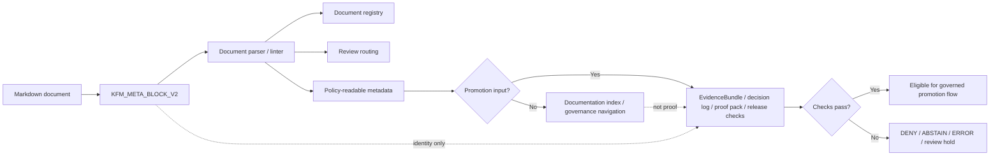

<!-- [KFM_META_BLOCK_V2]
doc_id: kfm://doc/NEEDS-VERIFICATION-ADR-0017-meta-block-v2
title: ADR-0017: Meta Block V2
type: standard
version: v1
status: published
owners: OWNER_TBD_NEEDS_VERIFICATION
created: 2026-05-05
updated: 2026-05-06
policy_label: internal
related: [./README.md, ./ADR-TEMPLATE.md, ./ADR-0001-schema-home.md, ../standards/KFM_MARKDOWN_WORK_PROTOCOL.md, ../../.github/CODEOWNERS, ../../tools/ci/verify_baseline.sh]
tags: [kfm, adr, meta-block-v2, documentation, governance, metadata, validation, promotion]
notes: [Created date is retained from the prior ADR effective_date/changelog and should be verified against git or the document registry. This revision aligns ADR-0017 with the exact KFM_META_BLOCK_V2 wrapper used by the current Markdown protocol. Owners, CODEOWNERS routing, policy label, doc_id UUID, full validator enforcement, decision-log linkage, evidence-bundle linkage, and spec_hash canonicalization remain NEEDS VERIFICATION.]
[/KFM_META_BLOCK_V2] -->

<a id="top"></a>

# ADR-0017: Meta Block V2

Standardize the top-of-file KFM metadata block used by Markdown standards, ADRs, READMEs, runbooks, and governance-facing documentation.

<p align="center">
  
  
  
  
  
</p>

<p align="center">
  <a href="#decision-summary">Decision</a> ·
  <a href="#repo-fit">Repo fit</a> ·
  <a href="#normative-meta-block-v2">Normative block</a> ·
  <a href="#field-profile">Fields</a> ·
  <a href="#examples">Examples</a> ·
  <a href="#validation-and-enforcement">Validation</a> ·
  <a href="#migration-from-the-prior-rich-profile">Migration</a> ·
  <a href="#rollback-and-supersession">Rollback</a> ·
  <a href="#open-verification">Open verification</a>
</p>

> [!IMPORTANT]
> **ADR status:** `accepted`  
> **Document status:** `published`  
> **Target path:** `docs/adr/ADR-0017-meta-block-v2.md`  
> **Owner/steward:** `OWNER_TBD_NEEDS_VERIFICATION`  
> **Implementation posture:** the metadata standard is accepted; full repository-wide enforcement is staged and remains `NEEDS VERIFICATION`.

> [!NOTE]
> Meta Block V2 is a document identity and governance envelope. It makes documents discoverable, reviewable, and policy-readable. It is **not** proof that referenced evidence bundles, decision logs, promotion gates, release manifests, owners, or validators already exist.

---

## Decision summary

KFM standard documents must begin with the exact `KFM_META_BLOCK_V2` HTML comment wrapper defined in this ADR. The block provides a stable, lightweight metadata surface for document identity, title, type, version, lifecycle status, ownership, dates, policy label, related links, tags, and notes.

This revision clarifies an important boundary:

> **Meta Block V2 identifies and routes documents; EvidenceBundle, decision log, proof pack, ReleaseManifest, PromotionDecision, and RollbackCard objects prove evidence, approval, publication, correction, and rollback.**

### One-line rule

> Every standard KFM Markdown document should carry the exact top-of-file `KFM_META_BLOCK_V2` comment unless a documented repository exception supersedes this ADR.

### One-line failure posture

> A missing, malformed, stale, unresolved, or false metadata block must block promotion-sensitive use and should produce `DENY`, `ABSTAIN`, `WARN`, or `ERROR` according to the document’s risk and rollout phase.

<p align="right"><a href="#top">Back to top ↑</a></p>

---

## Repo fit

| Field | Value |
|---|---|
| ADR path | `docs/adr/ADR-0017-meta-block-v2.md` |
| Owning root | `docs/` |
| Responsibility root basis | Human-facing governance and documentation control plane |
| Adjacent index | [`./README.md`](./README.md) |
| Adjacent template | [`./ADR-TEMPLATE.md`](./ADR-TEMPLATE.md) |
| Related schema-home ADR | [`./ADR-0001-schema-home.md`](./ADR-0001-schema-home.md) |
| Related standard | [`../standards/KFM_MARKDOWN_WORK_PROTOCOL.md`](../standards/KFM_MARKDOWN_WORK_PROTOCOL.md) |
| Owner routing surface | [`../../.github/CODEOWNERS`](../../.github/CODEOWNERS) |
| Baseline validation surface | [`../../tools/ci/verify_baseline.sh`](../../tools/ci/verify_baseline.sh) |

### Why this belongs under `docs/adr/`

KFM treats root folders as responsibility boundaries, not topic buckets. ADRs are durable human-facing architecture decisions, so this decision belongs under `docs/adr/` rather than a new root-level metadata or standards folder.

### Downstream consumers

This ADR should guide:

- Markdown standards and README-like docs;
- ADRs, runbooks, architecture docs, governance docs, source docs, and domain docs;
- document registry and authority-register work;
- metadata linters and documentation CI;
- promotion gates that need document ownership, policy label, review state, and traceability signals;
- reviewers deciding whether a document can be used as a promotion input.

<p align="right"><a href="#top">Back to top ↑</a></p>

---

## Context

KFM documentation is part of the working system. It records doctrine, directory authority, schema and contract decisions, source authority, policy posture, release state, correction lineage, rollback expectations, and UI/AI trust boundaries.

As the repository grows, prose-only governance is not enough. Reviewers and tools need a stable metadata surface that can answer basic questions quickly:

| Question | Why it matters |
|---|---|
| What document is this? | Prevents duplicate or orphaned governance surfaces. |
| Who owns it? | Routes review and accountability. |
| Is it draft, review, or published? | Keeps decision state separate from implementation proof. |
| What policy label applies? | Helps fail closed on restricted or sensitive material. |
| What changed and when? | Supports freshness, review, and supersession checks. |
| What does it relate to? | Keeps docs, ADRs, schemas, contracts, policies, tests, and runbooks connected. |
| What remains unresolved? | Prevents placeholder values from silently becoming authority. |

> [!CAUTION]
> The metadata block must not launder uncertainty. A placeholder such as `OWNER_TBD_NEEDS_VERIFICATION` is acceptable during drafting only because it is visible, searchable, and reviewable.

<p align="right"><a href="#top">Back to top ↑</a></p>

---

## Decision

KFM adopts the exact `KFM_META_BLOCK_V2` wrapper below as the standard metadata envelope for standard documentation.

### Normative Meta Block V2 requirements

1. The block must appear at the top of the file before the visible title.
2. The wrapper strings must be preserved exactly:
   - `<!-- [KFM_META_BLOCK_V2]`
   - `[/KFM_META_BLOCK_V2] -->`
3. The block body uses one key per line in the field order shown below.
4. Unknown values must use reviewable placeholders, not guesses.
5. The visible H1 title must stay synchronized with `title`.
6. The block is required for standard docs unless a documented repository exception applies.
7. Richer promotion metadata may be linked from the document, but it must not replace this block.

### Decision status versus enforcement status

| State | This ADR determination |
|---|---|
| Decision | `accepted` |
| Document status | `published` |
| Full lint enforcement | `PROPOSED / NEEDS VERIFICATION` |
| Repository-wide coverage | `NEEDS VERIFICATION` |
| Owner/steward assignment | `NEEDS VERIFICATION` |
| Promotion-gate integration | `PROPOSED / NEEDS VERIFICATION` |

> [!IMPORTANT]
> A document can contain the correct token and still fail Meta Block V2 if fields are missing, malformed, stale, unresolved, or untrue.

<p align="right"><a href="#top">Back to top ↑</a></p>

---

## Normative Meta Block V2

Use this exact block shape for standard docs:

```markdown
<!-- [KFM_META_BLOCK_V2]
doc_id: kfm://doc/<uuid>
title: <Title>
type: standard
version: v1
status: draft|review|published
owners: <team or names>
created: YYYY-MM-DD
updated: YYYY-MM-DD
policy_label: public|restricted|...
related: [<paths or kfm:// ids>]
tags: [kfm]
notes: [<short notes>]
[/KFM_META_BLOCK_V2] -->
```

### Required field order

| Order | Field |
|---:|---|
| 1 | `doc_id` |
| 2 | `title` |
| 3 | `type` |
| 4 | `version` |
| 5 | `status` |
| 6 | `owners` |
| 7 | `created` |
| 8 | `updated` |
| 9 | `policy_label` |
| 10 | `related` |
| 11 | `tags` |
| 12 | `notes` |

> [!NOTE]
> Field order is part of the authoring standard because predictable headers are easier to scan, lint, diff, and migrate. A parser may be more permissive, but generated and hand-authored KFM docs should use the order above.

<p align="right"><a href="#top">Back to top ↑</a></p>

---

## Field profile

| Field | Required | Expected shape | Purpose | Placeholder guidance |
|---|---:|---|---|---|
| `doc_id` | Yes | `kfm://doc/<uuid-or-reviewable-placeholder>` | Stable document identity. | Use `kfm://doc/NEEDS-VERIFICATION-<slug>` until a real UUID or registry ID is assigned. |
| `title` | Yes | Plain text | Must match the visible document title in substance. | Do not use a generic title. |
| `type` | Yes | Controlled value; standard docs use `standard` | Allows validators and registries to route checks. | Use `standard` for standard docs unless a documented exception exists. |
| `version` | Yes | Project document version such as `v1` | Tracks metadata/document profile version, not necessarily software SemVer. | Use `v1` unless a successor ADR changes the profile. |
| `status` | Yes | `draft`, `review`, or `published` | Document lifecycle state. | Do not use ADR decision states here; put `accepted`, `superseded`, etc. in the ADR body. |
| `owners` | Yes | Team, handle, or reviewable placeholder | Routes maintenance and review. | Use `OWNER_TBD_NEEDS_VERIFICATION` when CODEOWNERS or registry ownership is unresolved. |
| `created` | Yes | `YYYY-MM-DD` | Records document creation date. | Use `DATE_TBD_FROM_GIT_OR_DOC_REGISTRY` if not verified. |
| `updated` | Yes | `YYYY-MM-DD` | Records latest meaningful metadata/content update. | Use current edit date only when the edit is made in this change. |
| `policy_label` | Yes | Project label such as `public`, `internal`, `restricted`, or placeholder | Makes document handling policy-readable. | Use `POLICY_LABEL_TBD_NEEDS_VERIFICATION` when classification is not confirmed. |
| `related` | Yes | Inline list of relative paths or `kfm://` IDs | Connects the doc to upstream/downstream surfaces. | Use only grounded links or clearly reviewable placeholders. |
| `tags` | Yes | Inline list | Supports search and registry grouping. | Include `kfm`; keep tags specific and lowercase where practical. |
| `notes` | Yes | Inline list of short notes | Records unresolved metadata issues, provenance, or review caveats. | Every placeholder should be explained here or nearby. |

### Status vocabulary

| Meta status | Meaning | Not the same as |
|---|---|---|
| `draft` | The document is being authored and is not yet ready to govern. | ADR `proposed` may appear in the body, but does not have to. |
| `review` | The document is ready for review or under review. | Not proof of implementation enforcement. |
| `published` | The document is part of the repo’s visible documentation set. | Not proof that all referenced gates, schemas, or workflows are enforced. |

### ADR decision status

ADR decision status belongs in the visible ADR body, not the metadata `status` field.

Recommended ADR decision states include:

- `proposed`
- `accepted`
- `rejected`
- `superseded`
- `withdrawn`
- `deprecated`

<p align="right"><a href="#top">Back to top ↑</a></p>

---

## Examples

### Standard ADR example

```markdown
<!-- [KFM_META_BLOCK_V2]
doc_id: kfm://doc/NEEDS-VERIFICATION-ADR-9999-example
title: ADR-9999: Example Decision
type: standard
version: v1
status: review
owners: OWNER_TBD_NEEDS_VERIFICATION
created: DATE_TBD_FROM_GIT_OR_DOC_REGISTRY
updated: 2026-05-06
policy_label: POLICY_LABEL_TBD_NEEDS_VERIFICATION
related: [./README.md, ./ADR-TEMPLATE.md]
tags: [kfm, adr, example]
notes: [Example only. Replace placeholders before publication or mark unresolved values in open verification.]
[/KFM_META_BLOCK_V2] -->

# ADR-9999: Example Decision
```

### Standard README-like document example

```markdown
<!-- [KFM_META_BLOCK_V2]
doc_id: kfm://doc/NEEDS-VERIFICATION-docs-example-readme
title: Example Directory
type: standard
version: v1
status: draft
owners: OWNER_TBD_NEEDS_VERIFICATION
created: DATE_TBD_FROM_GIT_OR_DOC_REGISTRY
updated: 2026-05-06
policy_label: public
related: [../README.md]
tags: [kfm, readme, example]
notes: [Example only. Verify owner, created date, policy label, and related links before marking stable.]
[/KFM_META_BLOCK_V2] -->

# Example Directory

One-line purpose statement goes here.
```

### Invalid: rich profile used as the top-level block

```yaml
# Invalid as the standard top-level KFM_META_BLOCK_V2 profile.
# Keep richer proof or promotion metadata in contracts, schemas, registries,
# EvidenceBundle, decision log, proof pack, release manifest, or a successor ADR.
meta:
  schema: meta-block-v2
  standard_id: ADR-0017-META-BLOCK-V2
  owner: OWNER_TBD
  evidence_bundle_ref: artifacts/EvidenceBundle.json
  decision_log_ref: artifacts/decision_log.json
  spec_hash: "<64-char-sha256>"
```

> [!IMPORTANT]
> Rich metadata is valuable, but it is not the normative top-of-file Meta Block V2 shape defined here. Do not let an expanded promotion profile replace the standard document metadata envelope.

<p align="right"><a href="#top">Back to top ↑</a></p>

---

## Metadata flow



### Boundary protected by the diagram

Meta Block V2 can route and classify a document. It cannot prove the evidence, rights, sensitivity, review, release, correction, or rollback state by itself.

<p align="right"><a href="#top">Back to top ↑</a></p>

---

## Validation and enforcement

Validation should be staged so the repository can improve without pretending partial checks are complete enforcement.

### Staged enforcement model

| Stage | Check | Promotion-sensitive failure posture |
|---:|---|---|
| 0 | Token presence: `[KFM_META_BLOCK_V2]` and closing wrapper exist. | `WARN` during rollout; `DENY` for required promotion inputs. |
| 1 | Exact wrapper and parseable key/value block. | `ERROR` or `DENY`. |
| 2 | Required fields present in expected order. | `ERROR` or `DENY`. |
| 3 | `title`, `type`, `version`, and `status` use allowed shapes. | `ERROR` or `DENY`. |
| 4 | `owners`, `created`, `updated`, and `policy_label` are not unreviewed placeholders for published/promotion input docs. | `DENY` or review hold. |
| 5 | `related` links are valid relative paths or valid `kfm://` IDs. | `WARN`, `ERROR`, or `DENY` based on risk. |
| 6 | `notes` explain unresolved placeholders. | `WARN` or review hold. |
| 7 | Registry sync confirms `doc_id`, owner, policy label, and related surfaces. | `DENY` for promotion input docs. |
| 8 | Promotion gates verify linked EvidenceBundle, decision log, proof, release, correction, and rollback artifacts where required. | `DENY` or `ERROR`. |

### Minimal linter behavior

```text
INPUT: Markdown document

1. Confirm the file begins with KFM_META_BLOCK_V2 before the visible H1.
2. Extract block content between the exact wrappers.
3. Parse the required fields in canonical order.
4. Validate field presence and basic shape.
5. Compare meta title with the visible H1.
6. Flag unresolved placeholders.
7. Validate related links when repository context is available.
8. Emit finite result: PASS, WARN, DENY, or ERROR.
```

### Full validator behavior

Full validation should add:

- owner/steward resolution through CODEOWNERS, registry, or maintainer-approved ownership source;
- policy label vocabulary and policy-readability checks;
- date freshness and review_due handling if a review policy exists;
- document registry synchronization;
- related-link resolution;
- evidence-bundle and decision-log resolution when the document is a promotion input;
- release, correction, and rollback linkage when the document participates in publication.

> [!CAUTION]
> A metadata linter verifies metadata presence, shape, and linkage. It must not become hidden policy authority. Policy meaning belongs in the policy gate.

<p align="right"><a href="#top">Back to top ↑</a></p>

---

## Relationship to proof, release, and policy objects

Meta Block V2 intentionally stays small. KFM already has other trust-bearing object families for heavier governance work.

| Need | Do not overload Meta Block V2 with this | Use or link this instead |
|---|---|---|
| Evidence support | Full evidence bundle content | `EvidenceRef` and `EvidenceBundle` |
| Source authority | Full source descriptor | `SourceDescriptor` and source authority register |
| Decision acceptance evidence | Full decision-log record | Decision log, ADR review, or review record |
| Policy admissibility | Policy rules or final allow/deny state | `policy/`, `PolicyDecision`, or release gate |
| Promotion state | Release approval proof | `PromotionDecision` and `ReleaseManifest` |
| Process memory | Run details and validator output | `RunReceipt`, validation report, or receipt object |
| Publication rollback | Rollback implementation details | `RollbackCard` and correction/withdrawal records |
| Deterministic content hash | Canonicalization and proof hash internals | `spec_hash` policy, proof pack, or successor hashing ADR |

### Practical rule

The meta block may link to trust objects through `related` or `notes`, but it should not inline them.

<p align="right"><a href="#top">Back to top ↑</a></p>

---

## Migration from the prior rich profile

The prior ADR content used a richer nested `meta:` profile with fields such as `schema`, `standard_id`, `owner`, `steward`, `effective_date`, `review_due_date`, `sensitivity`, `rights`, `obligations`, `evidence_bundle_ref`, `decision_log_ref`, and `spec_hash`.

That profile captured real governance needs, but it blurred two layers:

1. **Document identity metadata** — the lightweight top-of-file block every standard doc should have.
2. **Promotion / proof / review metadata** — richer evidence and release information that belongs in contracts, schemas, registries, receipts, proofs, release records, or a follow-up ADR.

### Migration mapping

| Prior rich-profile field | New disposition |
|---|---|
| `schema: meta-block-v2` | Replaced by exact wrapper token `[KFM_META_BLOCK_V2]`. |
| `standard_id` | Capture in `doc_id`, ADR title, or a document registry entry. |
| `title` | Keep as `title`. |
| `version` | Keep as `version` where it reflects document metadata profile version. |
| `status: accepted` | Move to visible ADR decision status; meta `status` uses `draft`, `review`, or `published`. |
| `owner` | Map to `owners`. |
| `steward` | Keep in ADR body, registry, or review record until a future profile adds steward explicitly. |
| `effective_date` | Record in ADR body or changelog; do not substitute for `created`. |
| `review_due_date` | Track in document registry, review checklist, or future review policy. |
| `sensitivity` | Map to `policy_label` when policy vocabulary supports it. |
| `rights` | Link via policy, rights registry, source descriptor, or promotion metadata. |
| `obligations` | Link via policy/obligation engine or release gate. |
| `evidence_bundle_ref` | Use EvidenceBundle linkage, not the base meta block. |
| `decision_log_ref` | Use decision log or review record linkage, not the base meta block. |
| `spec_hash` | Govern through hashing/proof policy or successor ADR. |
| `supersedes` | Keep in ADR body and/or document registry. |
| `references` | Use `related` for compact top-of-file links; full references can live in body. |
| `changelog` | Keep as visible changelog section or registry entry. |

### Migration rule

> Preserve rich-profile values as lineage during migration. Do not delete them silently; move them to the proper governance object, registry, or body section.

<p align="right"><a href="#top">Back to top ↑</a></p>

---

## Consequences

### Positive consequences

- Maintainers get one predictable document metadata wrapper.
- Markdown docs become easier to lint, index, review, and migrate.
- ADR decision status no longer conflicts with document lifecycle status.
- Ownership and policy gaps remain visible instead of hidden in prose.
- Rich proof and release metadata stay in trust-bearing objects instead of bloating every doc header.
- Future validators can start with token checks and mature toward policy-readable, registry-backed enforcement.

### Tradeoffs

| Tradeoff | Mitigation |
|---|---|
| The normative block is smaller than the prior rich profile. | Use EvidenceBundle, decision log, proof pack, release manifest, policy, and registry objects for heavier governance. |
| Existing docs may carry older or malformed variants. | Treat them as migration backlog, not instant failure, unless they are promotion inputs. |
| Owners may remain unresolved early. | Use searchable placeholders and block promotion-sensitive use until owner routing is resolved. |
| `policy_label` vocabulary may need cleanup. | Keep labels visible and route vocabulary cleanup through policy/register work. |
| Token checks may create false confidence. | Document that token presence is Stage 0 only. |

<p align="right"><a href="#top">Back to top ↑</a></p>

---

## Acceptance criteria

This ADR is healthy when these checks are satisfied.

- [ ] The exact normative block appears in this ADR.
- [ ] ADR decision status and meta `status` are visibly separate.
- [ ] `owners` is verified or intentionally marked `OWNER_TBD_NEEDS_VERIFICATION`.
- [ ] `policy_label` is verified or intentionally marked as needing verification.
- [ ] The ADR index links to this file.
- [ ] The ADR template points new ADRs to this file.
- [ ] The Markdown work protocol and this ADR agree on the exact block wrapper.
- [ ] Existing rich-profile fields are preserved as lineage or mapped to proper governance homes.
- [ ] Lint behavior distinguishes token presence from full validation.
- [ ] Promotion-sensitive docs cannot pass solely because they contain the token.
- [ ] Rollback and supersession path is documented.
- [ ] Open verification items are tracked until resolved.

### Definition of done for full enforcement

- [ ] A repo-native linter validates the exact wrapper and required fields.
- [ ] Valid/invalid fixtures cover missing wrapper, malformed fields, unresolved placeholders, bad links, and mismatched H1/title.
- [ ] CI or documented local validation command runs the linter.
- [ ] Owner routing is grounded in CODEOWNERS, registry, or explicit maintainer review.
- [ ] Policy label vocabulary is grounded in policy docs or a registry.
- [ ] Promotion gates resolve evidence, decision, proof, release, correction, and rollback objects where required.
- [ ] Enforcement output is captured in a validation report, receipt, or PR notes.

<p align="right"><a href="#top">Back to top ↑</a></p>

---

## Rollback and supersession

### Rollback rule

If full enforcement blocks valid work because a linter, parser, registry, or policy integration is wrong:

1. Keep Meta Block V2 as the target standard.
2. Disable only the failing enforcement stage.
3. Keep token and field-shape checks active where safe.
4. Record the exception in review notes, decision log, validation report, or rollback card.
5. Keep affected docs visible in the migration backlog.
6. Re-enable enforcement after the bug is fixed.

### Supersession rule

A future ADR may supersede this one only if it preserves:

- top-of-file discoverability;
- stable document identity;
- owner/review routing;
- policy-readable document classification;
- visible unresolved placeholders;
- migration path for existing docs;
- rollback path for enforcement changes;
- separation between document metadata and proof/release objects.

> [!WARNING]
> Do not remove historical metadata blocks during rollback. Preserve lineage so older documents remain explainable.

<p align="right"><a href="#top">Back to top ↑</a></p>

---

## Open verification

| Item | Status | Why it matters | Verification path |
|---|---:|---|---|
| `doc_id` final UUID or registry ID | `NEEDS VERIFICATION` | Prevents duplicate or unstable document identity. | Assign through document registry or accepted ID process. |
| Owners and steward | `NEEDS VERIFICATION` | Required for accountable review and maintenance. | Confirm CODEOWNERS, registry owner, or maintainer decision. |
| CODEOWNERS routing | `NEEDS VERIFICATION` | Empty or missing owner routing weakens enforcement. | Inspect `.github/CODEOWNERS` and update if required. |
| Policy label vocabulary | `NEEDS VERIFICATION` | `internal`, `public`, `restricted`, and related labels need policy-readable meaning. | Confirm in policy docs or policy gate registry. |
| Created date | `NEEDS VERIFICATION` | Current value is retained from prior ADR date content, not verified git creation metadata. | Confirm from git history or document registry. |
| Full meta-block linter | `PROPOSED` | Token-only checks are insufficient. | Add repo-native validator and invalid fixtures. |
| Repository-wide coverage | `NEEDS VERIFICATION` | Docs may still use older block variants. | Run doc inventory and migration report. |
| Rich-profile migration | `NEEDS VERIFICATION` | Prior ADR fields should not be silently lost. | Add migration map or registry note. |
| EvidenceBundle / decision-log linkage | `PROPOSED / NEEDS VERIFICATION` | Promotion input docs need stronger evidence linkage than base metadata. | Link through trust objects or release gate. |
| `spec_hash` canonicalization | `NEEDS VERIFICATION` | Hashing must be reproducible before strict release checks. | Resolve in hashing ADR or proof-pack policy. |
| CI enforcement level | `NEEDS VERIFICATION` | Baseline scripts may be minimal. | Inspect workflow execution and validation output. |
| ADR index sync | `NEEDS VERIFICATION` | Navigation must match accepted status and current profile. | Update `docs/adr/README.md` after merge. |

<p align="right"><a href="#top">Back to top ↑</a></p>

---

## Review checklist

<details>
<summary>Pre-merge checklist</summary>

- [ ] The exact `KFM_META_BLOCK_V2` wrapper is present at the top of this ADR.
- [ ] The visible H1 matches the meta `title` in substance.
- [ ] ADR decision status and meta `status` are not conflated.
- [ ] Unknown owner, policy, date, ID, and enforcement values are explicit placeholders.
- [ ] `notes` explain why placeholders remain unresolved.
- [ ] Related links are valid from `docs/adr/`.
- [ ] The prior rich profile is mapped rather than silently discarded.
- [ ] Validation stages distinguish token presence from full enforcement.
- [ ] Promotion-sensitive behavior requires linked evidence/release/policy objects beyond the meta block.
- [ ] Rollback preserves decision and metadata lineage.
- [ ] The ADR index and ADR template are updated or listed as follow-up.
- [ ] No claim of CI, validator, policy, release, or branch-protection enforcement is made without direct evidence.
- [ ] No public path bypasses governed evidence, policy, review, release, correction, or rollback surfaces.

</details>

<p align="right"><a href="#top">Back to top ↑</a></p>

---

## Appendix A — Minimal validator fixtures

<details>
<summary>Suggested fixture matrix</summary>

| Fixture | Expected result |
|---|---:|
| Correct block with all required fields | `PASS` |
| Missing opening wrapper | `ERROR` |
| Missing closing wrapper | `ERROR` |
| Block appears after H1 | `ERROR` or `DENY` for standard docs |
| Missing `doc_id` | `ERROR` |
| Missing `owners` | `ERROR` or `DENY` for promotion input docs |
| Unexplained `OWNER_TBD` in published promotion input | `DENY` |
| Invalid date format | `ERROR` |
| Meta `title` does not match H1 | `WARN` or `ERROR` |
| Invalid `status` vocabulary | `ERROR` |
| `related` path does not resolve | `WARN`, `ERROR`, or `DENY` by risk |
| Empty `tags` list | `WARN` |
| Empty `notes` when placeholders exist | `WARN` or review hold |
| Rich nested `meta:` profile used instead of exact block | `ERROR` after migration window |

</details>

## Appendix B — Placeholder standard

Use placeholders that are searchable and explain what remains unresolved.

Preferred forms:

- `OWNER_TBD_NEEDS_VERIFICATION`
- `POLICY_LABEL_TBD_NEEDS_VERIFICATION`
- `DATE_TBD_FROM_GIT_OR_DOC_REGISTRY`
- `kfm://doc/NEEDS-VERIFICATION-<slug>`
- `PATH_TBD_AFTER_REPO_INSPECTION`
- `NEEDS VERIFICATION: <specific check>`
- `UNKNOWN: <evidence missing>`
- `CONFLICTED: <source/path/term conflict>`

Avoid vague placeholders such as `TBD` without a reason.

## Appendix C — Maintainer note

Meta Block V2 should make documents easier to trust, not harder to write.

The standard succeeds when a reviewer can open any KFM doc and immediately see what it is, who owns it, how fresh it is, how it is classified, what it relates to, and what still needs verification.<!-- [KFM_META_BLOCK_V2]
meta:
  schema: meta-block-v2
  standard_id: ADR-0017-META-BLOCK-V2
  title: Meta Block V2
  version: 1.0.0
  status: accepted
  owner: TODO(kfm-verify): confirm owner
  steward: TODO(kfm-verify): confirm steward
  effective_date: 2026-05-05
  review_due_date: 2026-11-05
  sensitivity: internal
  rights:
    license_id: internal-use
    allowed_uses: [promotion, audit]
    prohibited_uses: []
  obligations:
    redaction_required: false
  evidence_bundle_ref: artifacts/EvidenceBundle.json
  decision_log_ref: artifacts/decision_log.json
  spec_hash: "<64-char-sha256>"
  supersedes: null
  references: []
  changelog:
    - version: 1.0.0
      date: 2026-05-05
      summary: Initial version
[/KFM_META_BLOCK_V2] -->

# ADR 0017: Meta Block V2

> **Status:** Accepted  
> **Repo path:** `docs/adr/ADR-0017-meta-block-v2.md`  
> **Owner/steward:** `NEEDS VERIFICATION`  
> **Implementation posture:** Metadata standard accepted; full repository enforcement remains staged.


**Quick jumps:** [Context](#context) · [Decision](#decision) · [Required fields](#required-fields) · [Examples](#examples) · [Validation / enforcement](#validation--enforcement) · [Migration](#migration) · [Rollback](#rollback) · [Open verification](#open-verification)

---

## Context

Standards and governance documents need machine-readable metadata so promotion policy can identify owners, versions, sensitivity, evidence references, and review obligations.

KFM documentation cannot rely on prose-only governance once documents become promotion inputs. A reviewer or CI gate needs a stable metadata surface for ownership, review freshness, rights, sensitivity, evidence linkage, and release linkage.

> [!NOTE]
> This ADR defines the required metadata profile. It does not by itself prove that every standards document is compliant, that every referenced evidence bundle exists, or that promotion gates are already enforcing the full profile.

---

## Decision

All standards documents that participate in promotion **MUST** include **Meta Block V2** as YAML front matter or an equivalent top-level metadata block.

New standards documents **MUST** use V2. Meta Block V1 is allowed only under an explicit migration exception recorded in the decision log.

### Normative Meta Block V2 profile

The `spec_hash` in this ADR is the SHA-256 digest of the following normalized UTF-8 profile text.

```text
Meta Block V2 normative profile v1.0.0

Applicability:
- Standards documents that participate in promotion MUST include Meta Block V2 as YAML front matter or an equivalent top-level metadata block.
- New standards documents MUST use Meta Block V2.
- Meta Block V1 MAY be accepted only through an explicit migration exception recorded in the decision log.

Required meta fields:
- schema
- standard_id
- title
- version
- status
- owner
- steward
- effective_date
- review_due_date
- sensitivity
- rights
- obligations
- evidence_bundle_ref
- decision_log_ref
- spec_hash

Required nested rights fields:
- license_id
- allowed_uses
- prohibited_uses

Required nested obligations fields:
- redaction_required

Promotion gate relationships:
- Gate C checks rights and sensitivity.
- Gate E checks decision ownership.
- Gate G checks release linkage.

Validation posture:
- A metadata block is structurally insufficient if required fields are present but owners, rights, sensitivity, review due date, evidence bundle reference, or decision log reference are false, stale, or unresolved.
- Token-only checks MAY be used as an early hygiene gate, but they MUST NOT be treated as full Meta Block V2 validation.
- Full enforcement SHOULD validate presence, type, parseability, owner/steward non-emptiness, date freshness, rights shape, obligations shape, evidence_bundle_ref, decision_log_ref, and spec_hash format.
```

[Back to top](#top)

---

## Required fields

| Field | Required | Purpose |
|---|---:|---|
| `schema` | Yes | Declares `meta-block-v2` so validators can select the correct profile. |
| `standard_id` | Yes | Stable document or standard identifier. |
| `title` | Yes | Human-readable title used in review, registers, and release notes. |
| `version` | Yes | SemVer-like version of the standard document. |
| `status` | Yes | Publication or lifecycle state such as `draft`, `active`, `accepted`, `superseded`, or `retired`. |
| `owner` | Yes | Responsible team or person for maintenance and changes. |
| `steward` | Yes | Governance steward accountable for review obligations. |
| `effective_date` | Yes | Date from which the standard applies. |
| `review_due_date` | Yes | Date by which the standard must be reviewed. |
| `sensitivity` | Yes | Handling classification for the document and its metadata. |
| `rights` | Yes | License, allowed uses, and prohibited uses. |
| `obligations` | Yes | Handling obligations, including redaction requirements. |
| `evidence_bundle_ref` | Yes | Pointer to supporting evidence bundle or evidence closure artifact. |
| `decision_log_ref` | Yes | Pointer to decision-log evidence for acceptance, exception, or migration. |
| `spec_hash` | Yes | 64-character SHA-256 digest of the governed specification basis. |

Recommended but optional fields include `supersedes`, `references`, and `changelog`. They are optional in the minimum profile but should be present in high-impact standards because they make supersession and review easier.

---

## Examples

### YAML front matter

```yaml
---
meta:
  schema: meta-block-v2
  standard_id: STD-EXAMPLE-001
  title: Example Standard
  version: 1.0.0
  status: active
  owner: team-or-person
  steward: governance-owner
  effective_date: 2026-05-05
  review_due_date: 2026-11-05
  sensitivity: internal
  rights:
    license_id: internal-use
    allowed_uses: [promotion, audit]
    prohibited_uses: []
  obligations:
    redaction_required: false
  evidence_bundle_ref: artifacts/EvidenceBundle.json
  decision_log_ref: artifacts/decision_log.json
  spec_hash: "<64-char-sha256>"
  supersedes: null
  references: []
  changelog:
    - version: 1.0.0
      date: 2026-05-05
      summary: Initial version
---
```

### Equivalent top-level metadata block

Repositories that cannot use YAML front matter may use an equivalent top-level metadata block, but the same required field names and nested shapes still apply.

```markdown
<!-- [KFM_META_BLOCK_V2]
meta:
  schema: meta-block-v2
  standard_id: STD-EXAMPLE-001
  title: Example Standard
  version: 1.0.0
  status: active
  owner: team-or-person
  steward: governance-owner
  effective_date: 2026-05-05
  review_due_date: 2026-11-05
  sensitivity: internal
  rights:
    license_id: internal-use
    allowed_uses: [promotion, audit]
    prohibited_uses: []
  obligations:
    redaction_required: false
  evidence_bundle_ref: artifacts/EvidenceBundle.json
  decision_log_ref: artifacts/decision_log.json
  spec_hash: "<64-char-sha256>"
[/KFM_META_BLOCK_V2] -->
```

> [!IMPORTANT]
> Token presence is not sufficient. A document can contain `[KFM_META_BLOCK_V2]` and still fail V2 if required fields are missing, stale, malformed, unresolved, or untrue.

[Back to top](#top)

---

## Consequences

Governance metadata is no longer prose-only. CI and reviewers can enforce document ownership, freshness, sensitivity handling, and evidence linkage.

Positive consequences:

- Promotion policy can read owners, stewards, versions, and review dates without parsing prose.
- Sensitive or internal documents can fail closed when metadata is missing or contradictory.
- Evidence and decision-log references become visible at the top of standards documents.
- Supersession, rollback, and migration reviews can use a shared metadata surface.

Costs and tradeoffs:

- Standards documents now carry structured metadata that must be maintained.
- Reviewers must distinguish token presence from full metadata validation.
- Existing documents may require a V1-to-V2 migration exception path.
- `spec_hash` requires a repository-specific canonicalization rule before strict enforcement.

---

## Validation / Enforcement

Gate C checks rights and sensitivity. Gate E checks decision ownership. Gate G checks release linkage.

Repository-specific linters should be added when standards documents become first-class promotion inputs.

### Minimum staged enforcement

| Stage | Check | Failure posture |
|---|---|---|
| 0 | Token presence for documents expected to carry metadata. | Warn or fail, depending on rollout phase. |
| 1 | Parseable YAML or equivalent block with `meta.schema: meta-block-v2`. | Fail for promotion inputs. |
| 2 | Required field presence and expected nested shapes. | Fail for promotion inputs. |
| 3 | Date format, `review_due_date` freshness, and status vocabulary. | Fail or block promotion. |
| 4 | Rights, sensitivity, and obligations are policy-readable. | Gate C `DENY` if missing or unsafe. |
| 5 | Owner and steward are non-empty and decision-log linked. | Gate E `DENY` if unresolved. |
| 6 | `evidence_bundle_ref`, `decision_log_ref`, and release refs resolve where required. | Gate G `DENY` if unresolved. |
| 7 | `spec_hash` is a 64-character SHA-256 digest reproducible under the repo hashing rule. | `ERROR` or block release candidate. |

### PROPOSED linter behavior

```text
INPUT: Markdown standards document
1. Locate YAML front matter or top-level KFM Meta Block V2 block.
2. Parse metadata.
3. Confirm meta.schema == meta-block-v2.
4. Confirm required fields exist.
5. Confirm nested rights and obligations shapes.
6. Confirm dates parse and review_due_date is not stale for active documents.
7. Confirm spec_hash format and, once canonicalization is defined, reproducibility.
8. Emit finite result: PASS, WARN, DENY, or ERROR.
```

> [!CAUTION]
> Full Meta Block V2 validation must not become a hidden policy authority. Policy meaning belongs in policy gates; the linter verifies that metadata is present, parseable, and policy-readable.

---

## Migration

Existing standards documents may temporarily accept Meta Block V1 only through an explicit migration exception recorded in `decision_log.json`.

Migration records should include:

| Field | Purpose |
|---|---|
| document path | Identifies the migrated document. |
| current metadata version | Records V1 or missing metadata state. |
| target metadata version | Records V2. |
| exception owner | Names who accepted temporary non-compliance. |
| expiration date | Prevents indefinite V1 carry-forward. |
| migration notes | Explains required corrections. |
| decision log ref | Links the exception to review evidence. |

---

## Rollback

Documents may temporarily accept Meta Block V1 only through an explicit migration exception recorded in `decision_log.json`. New documents must use V2.

If Meta Block V2 enforcement blocks necessary work because the linter is wrong or incomplete:

1. Keep V2 as the target standard.
2. Disable only the failing enforcement stage, not the metadata requirement itself.
3. Record the exception in the decision log.
4. Add a rollback card or issue that names the blocked documents, failed check, owner, and expiration date.
5. Re-enable enforcement after the linter, schema, or canonicalization bug is fixed.

[Back to top](#top)

---

## Open verification

| Item | Status | Why it matters |
|---|---|---|
| Owner and steward values for this ADR | NEEDS VERIFICATION | Metadata fields are present but not yet owner-confirmed. |
| `evidence_bundle_ref` physical path | NEEDS VERIFICATION | `artifacts/EvidenceBundle.json` follows the supplied ADR example but may need alignment with the repo artifact/release layout. |
| `decision_log_ref` physical path | NEEDS VERIFICATION | `artifacts/decision_log.json` must resolve before strict release gating. |
| `spec_hash` canonicalization rule | NEEDS VERIFICATION | This draft uses a documented normative-profile hash; repo-wide reproducibility rules should be standardized. |
| ADR numbering namespace | NEEDS VERIFICATION | The repo contains both `docs/adr/ADR-0017-meta-block-v2.md` and `docs/adr/ADR-0204-evidencebundle-contract.md`; keep both discoverable until the ADR index resolves the naming convention. |
| Full linter implementation | PROPOSED | Existing token checks are useful but insufficient for complete Meta Block V2 enforcement. |

---

## Review checklist

- [ ] Metadata block is present at the top of the document.
- [ ] `[KFM_META_BLOCK_V2]` token is present for current token-based checks.
- [ ] Required fields are present under `meta`.
- [ ] `owner` and `steward` are verified or explicitly marked `TODO(kfm-verify)`.
- [ ] `review_due_date` is no later than the required review interval.
- [ ] Rights and obligations are policy-readable.
- [ ] `evidence_bundle_ref` resolves or is explicitly blocked from release.
- [ ] `decision_log_ref` resolves or is explicitly blocked from release.
- [ ] `spec_hash` is 64 lowercase hex characters and its basis is documented.
- [ ] Migration exceptions are recorded in the decision log.
- [ ] New standards documents use V2 rather than V1.

