<!-- [KFM_META_BLOCK_V2]
doc_id: kfm://doc/adr-0017-source-descriptor-admission-process
title: "ADR-0017 — Source Descriptor Admission Process"
type: adr
adr_id: ADR-0017
version: v1.2
status: proposed
effective_decision_status: proposed
owners:
  - "NEEDS VERIFICATION — source stewardship"
  - "NEEDS VERIFICATION — governance stewardship"
  - "NEEDS VERIFICATION — rights and sensitivity review"
  - "NEEDS VERIFICATION — source registry and connector ownership"
reviewers_required:
  - Architecture steward
  - Source steward
  - Governance steward
  - Rights and sensitivity reviewer
  - Contracts and schemas stewards
  - Validation and policy stewards
  - Connector and registry owners
  - Docs steward
created: 2026-05-09
updated: 2026-07-24
policy_label: public
truth_posture: cite-or-abstain
responsibility_root: docs/
current_path: docs/adr/ADR-0017-source-descriptor-admission-process.md
supersedes: []
superseded_by: null
evidence_snapshot:
  repository: bartytime4life/Kansas-Frontier-Matrix
  base_ref: main
  base_commit: a1570d5bb316d2a55edc95ff3f51413118ddb5ee
  target_prior_blob: 0e8d03786bcc99b19f179680890df9e30a27633a
  adr_index_blob: cf08fae322ac53426f7394d97897fdb942253049
  adr_readme_blob: f1b5d34a53b6c717832d587de54989ce8192bcaa
  directory_rules_blob: 2affb080e6f0043867c64c7f06c1ca52030fbd55
  descriptor_standard_blob: 4327c603f76e5b5a76fa058fe24ac2af91e496d8
  admission_process_blob: ab27618a4b1b0e6775d18bedca37aa7d6c514e6e
  source_descriptor_contract_blob: b57ae5ccc042c1423b75c168438800384c9b6713
  detailed_singular_schema_blob: 582e70b834278c3c6ca9a8b31efbe0989c96f0bc
  permissive_plural_schema_blob: 8d5cee60a711454a78cbf4a3c84eebbaed2503e8
  observed_validator_blob: 9d0538e727b5eb49c043998a3550972349d2e790
  observed_fixture_readme_blob: 4df8a264ef6f8ba48dbfcf313d3d6390b557f5c5
  validation_workflow_blob: fc808375a73e0d4ddfdc80fd5f0199a0486c93ce
  source_authority_register_blob: 82c23722520922f5ca0dad7f37ed794d1c2edf81
  source_registry_package_blob: 6df77a248c72a17ddaeb5d701baf6e4d9db38eab
  source_registry_readme_blob: 2821e9681273bff6b430920d0a45312c5643ba33
inspection_boundary: >
  Current-session GitHub reads, bounded repository search, canonical ADR inventory,
  contracts, schemas, fixtures, validator and workflow source, control-plane register,
  source-registry package documentation, and source-registry root documentation.
  No live source endpoint, credentialed source, deployed registry, policy evaluator,
  connector runtime, production data store, release environment, or audit dashboard
  was exercised.
related:
  - docs/adr/README.md
  - docs/adr/INDEX.md
  - docs/adr/ADR-0012-connector-outputs-to-data-raw-or-data-quarantine-only.md
  - docs/adr/ADR-0018-promotion-gate-sequence.md
  - docs/adr/ADR-0020-abstain-is-a-first-class-decision.md
  - docs/adr/ADR-0021-quarantine-has-structured-exit-paths.md
  - docs/doctrine/directory-rules.md
  - docs/sources/SOURCE_DESCRIPTOR_STANDARD.md
  - docs/sources/ADMISSION_PROCESS.md
  - contracts/source/source_descriptor.md
  - schemas/contracts/v1/source/source_descriptor.schema.json
  - schemas/contracts/v1/sources/source_descriptor.schema.json
  - fixtures/contracts/v1/source/source_descriptor/README.md
  - tools/validators/validate_source_descriptor.py
  - .github/workflows/source-descriptor-validate.yml
  - control_plane/source_authority_register.yaml
  - data/registry/sources/README.md
  - packages/source-registry/README.md
tags: [kfm, adr, source-descriptor, source-admission, source-registry, rights, sensitivity, provenance, quarantine, connector-boundary, fail-closed, cite-or-abstain]
notes:
  - "v1.2 is a same-path repository-grounded modernization; it does not accept ADR-0017 or activate a source."
  - "The canonical ADR index confirms the exact path and preserves source metadata and effective decision status as proposed."
  - "Current bounded implementation validates one detailed singular schema and observed fixture family, while the schema-declared plural path remains permissive scaffolding."
  - "The source authority register is present, PROPOSED, and empty; no source activation authority is established by this document."
  - "Descriptor shape validity, source admission, connector activation, policy admissibility, evidence closure, release, and publication remain separate decisions."
[/KFM_META_BLOCK_V2] -->

<a id="top"></a>

# ADR-0017 — Source Descriptor Admission Process

> **The gate at which the world becomes KFM-admissible source material.**
>
> No source enters the lifecycle without an admitted descriptor; no descriptor is admitted without a record-level admission contract.

[](#status)
[](#current-repository-evidence)
[](#confirmed-conflicts-and-holds)
[](#current-repository-evidence)
[](#current-implementation-maturity)
[](#authority-boundary)

> [!IMPORTANT]
> **Identity is confirmed; acceptance is not.** The canonical ADR index assigns `ADR-0017` to this exact file and records both source metadata and effective decision status as `proposed`. A file, commit, pull request, merge, schema pass, fixture pass, or workflow pass does not accept this decision.

> [!CAUTION]
> **The repository has SourceDescriptor shape validation, not a source-admission engine.** Current bounded evidence establishes a rich proposed schema, one observed valid/invalid fixture family, a generic validator wrapper, and a read-only workflow. It does not establish a populated source authority register, an accepted `SourceActivationDecision` contract, evaluated source policy, a registry-scanning admission service, or operational activation.

> [!WARNING]
> **A SourceDescriptor records how KFM may treat a source; it does not make the source true or public.** Admission never replaces evidence resolution, policy, validation, catalog closure, review, release, correction, withdrawal, or rollback.

**Quick navigation:** [Status](#status) · [Evidence](#evidence-boundary) · [Context](#context) · [Decision](#decision) · [Authority](#authority-boundary) · [Layers](#admission-layers) · [Descriptor](#sourcedescriptor-contract) · [States](#state-model) · [Record rules](#record-level-admission) · [Artifacts](#artifact-and-placement-contract) · [Maturity](#current-implementation-maturity) · [Validation](#validation-and-enforcement) · [Migration](#implementation-and-convergence-plan) · [Acceptance](#acceptance-gates) · [Consequences](#consequences) · [Alternatives](#alternatives-considered) · [Rollback](#rollback-and-supersession) · [Open work](#open-questions-and-verification) · [Ledger](#no-loss-and-change-ledger)

---

<a id="status"></a>

## Status

| Field | Current value |
|---|---|
| **ADR ID** | `ADR-0017` |
| **Tracked path** | `docs/adr/ADR-0017-source-descriptor-admission-process.md` |
| **Source metadata** | `proposed` |
| **Effective decision status** | `proposed` |
| **Decision class** | Source admission, source authority, rights/sensitivity intake, and connector activation boundary |
| **Current technical maturity** | Shape-validation slice present; admission authority and runtime held |
| **Implementation effect of this revision** | Documentation only |
| **Publication effect** | None |
| **Supersedes / superseded by** | None / none |

### Decision acceptance versus implementation graduation

Two independent states must remain visible:

1. **ADR acceptance** would approve the architecture and responsibility boundaries described here.
2. **Implementation graduation** would require converged contracts and schemas, evaluated policy, populated governance records, deterministic fixtures, runtime enforcement, review evidence, correction, and rollback.

An accepted ADR without those implementation gates would be governing doctrine, not proof that source admission is operational. Conversely, executable code or a green workflow cannot accept the ADR.

[Back to top](#top)

---

<a id="evidence-boundary"></a>

## Evidence boundary

This revision is grounded in current-session repository evidence at `main@a1570d5bb316d2a55edc95ff3f51413118ddb5ee`.

### Truth labels

| Label | Meaning here |
|---|---|
| **CONFIRMED** | Verified from current repository files, PR metadata, workflow source, or exact current-session readback |
| **PROPOSED** | A decision, vocabulary, migration, or implementation target not accepted or proved operational |
| **NEEDS VERIFICATION** | Checkable but not verified strongly enough to act as fact |
| **UNKNOWN** | Not resolved by the inspected repository surfaces |
| **CONFLICTED** | Two or more tracked surfaces claim incompatible authority or placement |

### Inspected surfaces

| Surface | Repository-grounded finding |
|---|---|
| Canonical ADR inventory | Exact ADR identity and path confirmed; status remains proposed |
| Directory Rules and ADR operating contract | `docs/adr/` is the human decision-record home; contracts, schemas, policy, tests, validators, registers, receipts, proofs, and release objects remain separate |
| SourceDescriptor contract | Rich semantic contract exists and is draft / PROPOSED |
| Detailed singular schema | Rich, closed, PROPOSED schema exists and is currently exercised |
| Declared plural schema | Exists as empty permissive PROPOSED scaffolding |
| Validator and fixtures | Generic validator and one observed valid/invalid fixture family exist |
| SourceDescriptor workflow | Read-only validation and rights-presence checks exist with explicit authority holds |
| Source authority register | File exists, is PROPOSED, and has `entries: []` |
| Source registry package | `0.0.0` greenfield placeholder; no supported API or activation authority |
| Source registry root | Documentation exists; operational populated registry conformance was not established |
| Policy/runtime | Workflow source preserves explicit holds; no evaluated source admission was observed |
| Live systems | No source endpoint, connector run, registry service, policy evaluator, release environment, or publication surface was exercised |

### What this evidence cannot prove

This revision does not prove:

- any source is admitted, active, current, reachable, licensed, or public-safe;
- the declared schema authority conflict is resolved;
- a `SourceActivationDecision` object is implemented;
- source registry records are populated or consumed;
- rights and sensitivity policy is evaluated;
- connectors are enabled only after admission;
- corrections, revocations, re-reviews, or rollback execute operationally;
- a review, release, deployment, or publication occurred.

[Back to top](#top)

---

<a id="current-repository-evidence"></a>

## Current repository evidence

| Surface | Path | Status | Safe conclusion |
|---|---|---:|---|
| ADR record | `docs/adr/ADR-0017-source-descriptor-admission-process.md` | **CONFIRMED** | Exact decision identity exists; it remains proposed |
| Canonical index | `docs/adr/INDEX.md` | **CONFIRMED** | Path and status are coherent |
| SourceDescriptor meaning | `contracts/source/source_descriptor.md` | **CONFIRMED draft / PROPOSED** | Rich semantic contract exists |
| Detailed machine shape | `schemas/contracts/v1/source/source_descriptor.schema.json` | **CONFIRMED rich / PROPOSED** | Closed schema with substantial fields and conditionals |
| Schema-declared canonical shape | `schemas/contracts/v1/sources/source_descriptor.schema.json` | **CONFIRMED permissive scaffold / PROPOSED** | Cannot enforce the rich contract |
| Observed validator | `tools/validators/validate_source_descriptor.py` | **CONFIRMED** | Runs the detailed singular schema against observed fixtures |
| Schema-declared validator | `tools/validators/sources/validate_source_descriptor.py` | **NOT ESTABLISHED** | Referenced by metadata; not found by bounded search |
| Observed fixtures | `fixtures/contracts/v1/source/source_descriptor/` | **CONFIRMED narrow** | One positive and one negative example are documented |
| Schema-declared fixtures | `tests/fixtures/sources/source_descriptor/` | **NOT ESTABLISHED** | Referenced by schema; absent under bounded inspection |
| Validation workflow | `.github/workflows/source-descriptor-validate.yml` | **CONFIRMED bounded** | Exercises shape and selected fail-closed conditionals; admits no source |
| Authority register | `control_plane/source_authority_register.yaml` | **CONFIRMED empty / PROPOSED** | No central source authority entry exists |
| Registry package | `packages/source-registry/` | **CONFIRMED placeholder** | No supported resolver, adapter, activation service, or consumer |
| Registry records root | `data/registry/sources/` | **CONFIRMED documented** | Intended authority surface; populated operational conformance is unproved |
| Source admission standards | `docs/sources/` | **CONFIRMED draft** | Human guidance exists and contains stale implementation assumptions |
| Admission policy | `policy/source/`, `policy/rights/`, `policy/sensitivity/` | **HELD** | Current workflow treats directly relevant files as greenfield stubs, not evaluated policy |

<a id="confirmed-conflicts-and-holds"></a>

### Confirmed conflicts and holds

1. **Schema authority is conflicted.** The detailed singular schema is the implemented validation target, but its own metadata calls the permissive plural scaffold canonical.
2. **Validator placement is conflicted.** The schema declares `tools/validators/sources/validate_source_descriptor.py`; the current executable wrapper is `tools/validators/validate_source_descriptor.py`.
3. **Fixture placement is conflicted.** The schema declares `tests/fixtures/sources/source_descriptor/`; the current exercised fixtures live under `fixtures/contracts/v1/source/source_descriptor/`.
4. **Authority state is empty.** The proposed source authority register has no entries.
5. **Admission policy is not graduated.** The workflow verifies selected schema conditionals and preserves policy implementation holds; it does not evaluate source policy.
6. **Registry mechanics are placeholder-only.** The shared package has no supported import API, registry adapter, source resolver, consumer, or runtime health evidence.
7. **Source activation identity is not contracted.** Bounded search found prose and examples, not an accepted machine contract/schema and operational persistence path for `SourceActivationDecision`.
8. **Current source standards are partly stale.** They still describe current repository paths and implementation depth as uninspected.
9. **Review governance remains external.** CODEOWNERS routing, PR state, and merges are not independent approval or separation-of-duties evidence.

These conflicts are not resolved by this documentation-only revision. They become explicit acceptance and migration gates.

[Back to top](#top)

---

<a id="context"></a>

## Context

Every downstream KFM claim depends on an earlier decision: whether a source may enter KFM at all, in which role, under which rights and sensitivity posture, and with what limits.

When those rules live only in connector code or informal documentation, several failures become likely:

- aggregators are treated as canonical authorities;
- modeled or contextual material is presented as observed truth;
- source-global rights overwrite record-level restrictions;
- sensitive precision enters public derivatives;
- a successful fetch is mistaken for admission;
- a schema-valid descriptor is mistaken for activation;
- a source activation is mistaken for release;
- correction and retirement history disappears;
- connectors become de facto publishers.

KFM therefore requires an admission membrane that makes source identity, role, rights, sensitivity, cadence, access, citation, admissibility limits, review state, release posture, and lifecycle state inspectable before source material shapes governed outputs.

> [!IMPORTANT]
> Admission is not promotion. Admission governs the source and the intake boundary. Promotion later governs movement through:
>
> `RAW → WORK / QUARANTINE → PROCESSED → CATALOG / TRIPLET → PUBLISHED`.

> [!NOTE]
> This ADR also separates **source activation**, **capture disposition**, and **record normalization**. A source may be approved for a bounded connector attempt while a particular capture still routes to QUARANTINE, and a captured record may still fail the minimum bar for normalized use.

[Back to top](#top)

---

<a id="decision"></a>

## Decision

KFM SHALL treat source admission as a governed, evidence-bearing sequence with distinct authority layers.

### Core law

1. Every governed source SHALL have a resolvable `SourceDescriptor`.
2. A descriptor SHALL be validated against one reviewed machine-shape authority.
3. Descriptor validity SHALL NOT activate a source.
4. Source activation SHALL require a separately inspectable decision and review path.
5. Connectors and watchers SHALL remain non-publishers.
6. Every payload-bearing intake SHALL end in exactly one RAW or QUARANTINE disposition.
7. Every record SHALL satisfy source-specific minimum-bar and fail-closed rules before normalized use.
8. Rights, sensitivity, source role, and citation obligations SHALL remain visible downstream.
9. Public release SHALL require evidence, policy, validation, review, catalog, release, correction, and rollback gates beyond admission.
10. Missing, conflicting, stale, unsupported, or unreviewed authority SHALL fail closed.

### Admission is a chain, not one boolean

```mermaid
flowchart LR
    C["Source candidate"] --> D["SourceDescriptor draft"]
    D --> SV["Schema + semantic validation"]
    SV --> RS["Rights / sensitivity / role review"]
    RS --> AD["SourceActivationDecision<br/>PROPOSED contract"]
    AD --> AR["Authority register entry"]
    AR --> FX["No-network fixture"]
    FX --> DR["Connector dry run"]
    DR --> CD{"Capture disposition"}
    CD -->|accepted capture| RAW["RAW + ingest receipt"]
    CD -->|unresolved / blocked| Q["QUARANTINE + reason"]
    RAW --> RA["Record-level admission"]
    RA -->|minimum bar passes| N["Normalized candidate"]
    RA -->|fails / trigger active| Q2["QUARANTINE / DENY / ABSTAIN"]
    N --> PG["Later promotion gates"]
```



No edge in this diagram authorizes publication by itself.

[Back to top](#top)

---

<a id="authority-boundary"></a>

## Authority boundary

| Responsibility | Owning surface | This ADR's relationship |
|---|---|---|
| Architectural decision and rationale | `docs/adr/` | Owns this decision record |
| Human source standards and operating guidance | `docs/sources/` | Operationalize the accepted decision |
| SourceDescriptor meaning | `contracts/source/source_descriptor.md` | Must remain aligned with the decision |
| SourceDescriptor machine shape | One accepted path under `schemas/contracts/v1/` | Must be converged before acceptance |
| Descriptor fixtures | Accepted repository fixture root | Prove shape and negative cases only |
| Repository validator | `tools/validators/` | Enforces bounded rules; does not admit |
| Source admissibility policy | `policy/` | Produces allow, deny, restrict, abstain, or error decisions |
| Machine governance map | `control_plane/` | May index authority decisions; cannot replace review |
| Persisted source registry records | `data/registry/sources/` or accepted successor | Holds governed source instances and lineage |
| Reusable registry mechanics | `packages/source-registry/` after implementation | Read-only candidate context; no authority minting |
| Connector acquisition | `connectors/` | Fetches only within admitted scope; no promotion or publication |
| RAW / QUARANTINE payloads | `data/raw/`, `data/quarantine/` | Payload disposition, not authority |
| Process memory | `data/receipts/` | Records what occurred |
| Evidence closure | `EvidenceRef` / `EvidenceBundle` and proof surfaces | Supports claims; remains downstream |
| Release, correction, rollback | `release/` | Separate accountable transitions |
| Public delivery | Governed API or approved static release surface | Must never read admission internals as public truth |

This ADR SHALL NOT create a parallel source, schema, contract, policy, registry, receipt, proof, release, or publication home.

[Back to top](#top)

---

<a id="admission-layers"></a>

## Admission layers

KFM SHALL keep six questions separate.

| Layer | Question | Minimum output | Does not prove |
|---|---|---|---|
| **1. Descriptor shape** | Is the descriptor structurally valid? | Validation result | Source truth, rights approval, activation |
| **2. Source posture review** | Are role, rights, sensitivity, access, citation, cadence, and limits reviewable? | Review evidence | Connector permission or release |
| **3. Source activation** | May KFM attempt bounded use of this source? | `SourceActivationDecision` + authority index entry | A particular capture is safe |
| **4. Capture disposition** | Where may this fetched payload land? | RAW or QUARANTINE + receipt | Normalized record admission |
| **5. Record-level admission** | Does this record meet the source-specific minimum bar? | Normalized candidate or reasoned hold | Evidence sufficiency or publication |
| **6. Promotion and release** | May the admitted result advance or become public? | Policy, proof, catalog, promotion, and release records | Authority outside the released scope |

A system that collapses any two of these layers SHALL be treated as incomplete.

[Back to top](#top)

---

<a id="sourcedescriptor-contract"></a>

## SourceDescriptor contract

### Required semantic purpose

A `SourceDescriptor` is the stable governance handle for a source. It records how source material may be treated. It is not:

- source truth;
- a citation by itself;
- a payload;
- an ingest receipt;
- an `EvidenceBundle`;
- a `PolicyDecision`;
- a source activation decision;
- a release manifest;
- public permission.

### Current schema-paired required surface

The currently exercised detailed schema requires:

| Group | Required fields |
|---|---|
| **Identity and version** | `object_type`, `schema_version`, `source_id`, `descriptor_version`, `title` |
| **Classification** | `source_type`, `source_role`, `authority_rank` |
| **Accountability** | `publisher`, `owner_or_steward` |
| **Rights and sensitivity** | `rights`, `sensitivity_default` |
| **Time and access** | `cadence`, `access` |
| **Citation and source-head evidence** | `citation`, `source_head` |
| **Use limits** | `admissibility_limits`, `public_release` |
| **Governance state** | `review_state`, `release_state`, `lifecycle` |

Optional fields include `domain_scope`, `secondary_source_roles`, `connectors`, `governance_refs`, `spec_hash`, and deprecated migration aliases.

### Required invariants

A conforming implementation SHALL preserve:

- deterministic or stable source identity where practical;
- source role fixed by reviewed admission, never inferred by AI;
- explicit authority rank and claim-role limits;
- rights verification date and reviewer identity;
- fail-closed public-release behavior for unknown, noassertion, or denied rights;
- explicit sensitivity and review obligations;
- cadence and staleness posture;
- source-head or content-identity evidence;
- citation duties;
- review, release, registry, and supersession state;
- no silent in-place history erasure.

### Current source-role vocabulary

The detailed schema currently includes roles such as:

- `authoritative_for_claim`;
- `regulatory_context`;
- `legal_context`;
- `observation`;
- `occurrence_evidence`;
- `aggregator`;
- `operational_context`;
- `remote_sensing_observation`;
- `model_context`;
- `candidate_signal`;
- `historical_context`;
- `corroborating_context`;
- `derived_public_product`;
- `steward_review_source`;
- `citation_source`;
- `fixture_only`.

This is current PROPOSED schema vocabulary, not an accepted global ontology. Vocabulary changes remain ADR- and migration-significant.

[Back to top](#top)

---

<a id="state-model"></a>

## State model

No single field SHALL carry the full admission state.

### Current layered state fields

| State dimension | Current schema field | Current vocabulary |
|---|---|---|
| Human review | `review_state` | `draft`, `needs_review`, `reviewed`, `approved`, `rejected`, `superseded`, `deactivated` |
| Registry lifecycle | `lifecycle.registry_state` | `proposed`, `active`, `quarantined`, `retired`, `superseded` |
| Connector posture | `connectors.activation_state` | `disabled`, `fixture_only`, `live_candidate`, `live_active`, `quarantined`, `retired` |
| Release posture | `release_state` | `not_released`, `candidate`, `released`, `deprecated`, `withdrawn` |
| Public conditions | `public_release` | `allowed`, `requires_review`, `redaction_required`, `release_conditions` |

### SourceActivationDecision outcome

A machine contract for `SourceActivationDecision` was not established by bounded inspection. Until it exists, implementations SHALL NOT invent authority by treating one schema field as the decision.

The following crosswalk is **PROPOSED for pilot design only**:

| Proposed decision outcome | Expected coordinated posture |
|---|---|
| `DENY` | Review rejected; connector disabled; no release; reason and correction path retained |
| `HOLD` | Needs review; no live connector; unresolved items routed for review or quarantine |
| `ADMIT_TO_RAW_INTERNAL` | Reviewed/approved source posture; registry active; public release false; bounded connector may capture to RAW/QUARANTINE |
| `ADMIT_PUBLIC_CANDIDATE` | Reviewed/approved; registry active; release candidate only; public conditions and all downstream gates still apply |
| `RETIRE` | Connector retired; registry retired or superseded; new fetches blocked; historical lineage retained |
| `ERROR` | No state transition; fail closed and record the governance-system failure |

The accepted decision contract SHALL define finite outcomes, actor identities, reviewed inputs, descriptor digest, obligations, effective time, re-review time, supersession, correction, and rollback.

[Back to top](#top)

---

<a id="record-level-admission"></a>

## Record-level admission

Every source descriptor SHALL be paired with source-specific admission rules.

### Minimum admission bar

The minimum bar names what each record must contain before normalized use. Typical categories include:

- stable provider record identity;
- reconstructible source URI or capture reference;
- temporal identity where relevant;
- explicit rights posture;
- sensitivity and geoprivacy posture;
- required geometry, units, CRS, or scope;
- source-specific semantic distinctions;
- provenance sufficient to resolve the originating descriptor and capture receipt.

A record that fails the minimum bar SHALL NOT silently enter normalized, catalog, proof, or public surfaces.

### Fail-closed triggers

A record may satisfy the minimum shape and still be blocked because of:

- unresolved or prohibited rights;
- missing attribution duties;
- restricted or reconstructable sensitive precision;
- living-person, genomic, cultural, archaeological, species, or infrastructure risk;
- stale or conflicting source identity;
- unreconstructible provenance;
- materially unresolved taxonomy or identity;
- source-role overstatement;
- model or aggregate scope presented as observation;
- source-head drift requiring re-review;
- a retired, superseded, quarantined, or unreviewed descriptor.

### Outcomes

Record-level checks SHALL produce finite, inspectable outcomes such as:

- admit to the next internal candidate stage;
- quarantine for steward review;
- deny the attempted use;
- abstain because the requested scope exceeds support;
- error because the governance machinery failed.

The exact machine vocabulary remains PROPOSED until paired contracts and policy are accepted.

### Reason-code families

The existing ADR lineage preserves these proposed families:

| Family | Concern |
|---|---|
| `prov.*` | Provenance, source identity, reconstructible references |
| `rights.*` | License, terms, redistribution, commercial use, attribution |
| `geom.*` | Geometry, precision, CRS, public-safe mismatch |
| `sens.*` | Sensitivity, geoprivacy, living-person, cultural, species, infrastructure |
| `taxon.*` | Taxonomic or controlled-identity resolution |
| `obs.*` | Observation semantics, methodology, checklist/specimen distinctions |

Current bounded schema validation does not establish a closed reason-code contract. New families SHALL require reviewed cross-source change rather than per-connector invention.

[Back to top](#top)

---

## Connector and watcher boundary

Connectors and watchers SHALL:

- resolve the exact descriptor version and activation decision before live use;
- remain within allowed source roles and access posture;
- preserve source-head and capture identity;
- write payloads only to RAW or QUARANTINE through governed handoff;
- emit candidate process memory through the accepted receipt surface;
- expose no direct PUBLISHED edge;
- never mutate source authority, policy, proof, catalog, release, or public state;
- stop or quarantine when rights, sensitivity, source-head, schema, or authority drift is detected.

Connectors and watchers SHALL NOT:

- mint or approve SourceDescriptors;
- infer authority from publisher names or URLs;
- upgrade candidate, contextual, aggregate, modeled, or fixture roles;
- convert credentialed access into public permission;
- treat a successful HTTP response as admission;
- promote, release, or publish.

> [!CAUTION]
> The current repository contains bounded non-publisher and source-descriptor validation checks. This ADR does not claim complete language coverage, registry binding, live-connector enforcement, or operational proof.

[Back to top](#top)

---

## Separation of duties

| Role | Responsible for | Must not independently do |
|---|---|---|
| Source steward | Draft descriptor, document source role, maintain source-specific rules and fixtures | Approve its own activation and release |
| Rights/sensitivity reviewer | Verify terms, attribution, redistribution, access, privacy, sovereignty, precision, and obligations | Author and approve the same review record |
| Schema/contracts steward | Maintain meaning and shape compatibility | Decide source admissibility from schema validity |
| Validation/policy steward | Implement validators and evaluated policy | Mint source authority or release state |
| Governance steward | Record activation decision and authority lineage | Rewrite source truth or bypass required review |
| Connector owner | Implement bounded acquisition and receipt handoff | Admit, promote, or publish |
| Release steward | Decide release, correction, withdrawal, and rollback | Treat activation as release approval |

The accepted governance path SHALL make reviewer identities and role separation auditable. Repository routing alone is insufficient.

[Back to top](#top)

---

<a id="artifact-and-placement-contract"></a>

## Artifact and placement contract

### Confirmed current surfaces

| Artifact | Current path | Status |
|---|---|---:|
| ADR | `docs/adr/ADR-0017-source-descriptor-admission-process.md` | CONFIRMED / proposed |
| Human descriptor standard | `docs/sources/SOURCE_DESCRIPTOR_STANDARD.md` | CONFIRMED / draft |
| Human admission process | `docs/sources/ADMISSION_PROCESS.md` | CONFIRMED / draft |
| Semantic contract | `contracts/source/source_descriptor.md` | CONFIRMED / draft / PROPOSED |
| Detailed schema | `schemas/contracts/v1/source/source_descriptor.schema.json` | CONFIRMED / rich / PROPOSED |
| Declared canonical schema scaffold | `schemas/contracts/v1/sources/source_descriptor.schema.json` | CONFIRMED / permissive / PROPOSED |
| Observed fixtures | `fixtures/contracts/v1/source/source_descriptor/` | CONFIRMED narrow |
| Observed validator | `tools/validators/validate_source_descriptor.py` | CONFIRMED |
| Validation workflow | `.github/workflows/source-descriptor-validate.yml` | CONFIRMED bounded |
| Authority register | `control_plane/source_authority_register.yaml` | CONFIRMED empty / PROPOSED |
| Registry instances root | `data/registry/sources/` | CONFIRMED documented |
| Shared mechanics package | `packages/source-registry/` | CONFIRMED placeholder |

### Unresolved or unestablished artifacts

| Artifact | Current status |
|---|---|
| Accepted canonical SourceDescriptor schema path | **CONFLICTED** |
| Accepted SourceActivationDecision contract/schema | **NOT ESTABLISHED** |
| Populated source authority register | **NOT ESTABLISHED** |
| Accepted source-admission policy bundle and evaluator | **NOT ESTABLISHED** |
| Registry-wide descriptor scanner | **NOT ESTABLISHED** |
| Operational source-registry package API | **NOT ESTABLISHED** |
| Complete descriptor fixture matrix | **NOT ESTABLISHED** |
| Connector-to-activation runtime binding | **NOT ESTABLISHED** |
| Re-review, retirement, revocation, and rollback drill | **NOT ESTABLISHED** |
| Source-health dashboard | **UNKNOWN** |

No new parallel home SHALL be created to escape these conflicts. Convergence requires an accepted migration or successor decision, not duplicate authority.

[Back to top](#top)

---

<a id="current-implementation-maturity"></a>

## Current implementation maturity

| Level | Capability | Current status |
|---:|---|---|
| 0 | Human doctrine and ADR identity | **CONFIRMED** |
| 1 | Rich semantic SourceDescriptor contract | **CONFIRMED draft / PROPOSED** |
| 2 | Machine schema with fail-closed conditionals | **CONFIRMED rich singular schema / authority conflicted** |
| 3 | Positive and negative fixture execution | **CONFIRMED narrow observed family** |
| 4 | Repository workflow for descriptor shape and rights-presence checks | **CONFIRMED bounded** |
| 5 | Canonical schema/validator/fixture paths converged | **NOT MET** |
| 6 | Accepted activation-decision contract and populated authority register | **NOT MET** |
| 7 | Evaluated rights, sensitivity, source, and access policy | **NOT MET** |
| 8 | Registry scanner and connector runtime enforcement | **NOT MET** |
| 9 | Two end-to-end pilot sources with receipts, quarantine, correction, and retirement | **NOT MET** |
| 10 | Operational monitoring, re-review, rollback, and audited public integration | **UNKNOWN / NOT ESTABLISHED** |

The repository is therefore at a **bounded shape-validation slice**, not source-admission graduation.

[Back to top](#top)

---

<a id="validation-and-enforcement"></a>

## Validation and enforcement

### Existing bounded validation

The current source-descriptor workflow:

- checks the detailed singular schema and the permissive plural scaffold;
- verifies current metadata conflicts remain visible;
- requires non-empty positive and negative fixtures;
- runs the observed generic validator;
- runs the common SourceDescriptor schema test;
- verifies required rights fields;
- exercises selected fail-closed rights and sensitivity conditionals;
- preserves explicit holds for registry scanning, policy evaluation, activation, release, and publication.

A green workflow result proves only those checks for the tested revision.

### Required validation layers

| Layer | Required proof |
|---|---|
| ADR coherence | Exact filename, H1, ID, index row, and proposed status |
| Schema | Closed shape, required fields, controlled vocabularies, conditionals, negative paths |
| Contract | Semantic definitions match machine fields without authority collapse |
| Fixture | Multiple valid and invalid cases covering rights, sensitivity, role, lifecycle, connector, public release, and additional-property failures |
| Registry | Every active descriptor resolves uniquely; supersession and re-review dates close |
| Policy | Evaluated allow/deny/restrict/abstain/error cases with reason and obligation semantics |
| Connector | No live acquisition without reviewed activation; only RAW/QUARANTINE payload effects |
| Record admission | Minimum-bar and fail-closed behavior with deterministic reasons |
| Correction | Rights, sensitivity, source-head, role, or endpoint drift produces new reviewed state and downstream invalidation |
| Rollback | Deactivation/retirement blocks new use and preserves historical lineage |
| Public boundary | No source posture reaches public surfaces without evidence and release closure |

### Required commands for this ADR revision

```bash
python tools/validators/validate_adr_index.py
python -m pytest tests/validators/test_validate_adr_index.py -q --strict-config --strict-markers
```

Repository-native CI should also run:

- `docs-control-plane`;
- `source-descriptor-validate`;
- documentation, link, citation, and accessibility checks where configured.

### CI boundary

A green result SHALL NOT be represented as:

- ADR acceptance;
- source activation;
- rights approval;
- sensitivity approval;
- policy evaluation beyond the job's actual assertions;
- evidence closure;
- release approval;
- deployment;
- publication.

[Back to top](#top)

---

<a id="implementation-and-convergence-plan"></a>

## Implementation and convergence plan

The smallest governed path is staged and reversible.

### Wave 1 — freeze authority drift

- Record the singular/plural schema conflict explicitly.
- Prevent either path from silently gaining new divergent semantics.
- Pin current consumers, fixtures, validator, workflow, and contract references.
- Decide whether one path is canonical and the other compatibility, or introduce a reviewed versioned successor.

**Exit:** one reviewed migration target and rollback plan.

### Wave 2 — converge schema, validator, and fixture paths

- Make schema metadata match the selected canonical path.
- Move or adapt the detailed schema without losing field or conditional coverage.
- Converge the validator entry point.
- Converge the fixture root.
- Preserve compatibility adapters only when their behavior is documented and tested.

**Exit:** one canonical shape, one canonical validator, one canonical fixture family, explicit compatibility map.

### Wave 3 — contract SourceActivationDecision

Define meaning and machine shape for:

- decision identity;
- source and descriptor identity;
- descriptor digest;
- reviewed rights/sensitivity/source-role inputs;
- finite decision outcome;
- allowed and denied roles;
- connector scope;
- obligations;
- actor and reviewer identities;
- effective and re-review dates;
- supersession and correction references;
- rollback target;
- reason codes.

**Exit:** valid/invalid fixtures and validator tests; still no live source.

### Wave 4 — graduate authority storage

- Decide whether `control_plane/source_authority_register.yaml` is the canonical decision index or a pointer to separate immutable decisions.
- Populate only synthetic or fixture-safe pilot entries first.
- Add uniqueness, digest, supersession, owner, review-date, and rollback validation.
- Keep source registry records distinct from authority decisions and process receipts.

**Exit:** deterministic synthetic authority lookup with no external effects.

### Wave 5 — implement fail-closed policy

- Replace directly relevant greenfield stubs with reviewed policy modules.
- Cover rights, sensitivity, source role, access, citation, staleness, connector state, and public-release conditions.
- Test allow, restrict, hold, deny, abstain, and error paths.
- Preserve safe reason codes without leaking protected detail.

**Exit:** evaluated synthetic policy cases; no public release.

### Wave 6 — bind registry and connector gates

- Implement a read-only registry adapter.
- Require activation resolution before connector live mode.
- Enforce RAW/QUARANTINE-only payload effects.
- Emit receipts and preserve descriptor/decision digests.
- Reject stale, missing, conflicted, superseded, retired, or quarantined authority.

**Exit:** no-network and synthetic connector tests prove the boundary.

### Wave 7 — run two pilot sources

Choose two materially different, public-safe pilots. Each must demonstrate:

- descriptor and activation review;
- rights and sensitivity handling;
- source-head drift;
- valid and invalid captures;
- RAW and QUARANTINE dispositions;
- record-level admission;
- correction, retirement, and rollback;
- evidence and citation references;
- no public path without later release gates.

**Exit:** reviewed pilot evidence, not ADR acceptance by automation.

### Wave 8 — decide acceptance

Review the ADR, migrations, tests, policy, pilot evidence, security, rollback, and operational ownership. If accepted, change the ADR and canonical index together through an explicit reviewed decision.

[Back to top](#top)

---

<a id="acceptance-gates"></a>

## Acceptance gates

ADR-0017 SHALL remain `proposed` until all applicable gates close.

- [ ] Exact ADR identity and canonical index remain coherent.
- [ ] Source stewardship and governance ownership are assigned.
- [ ] Required independent reviewers and separation of duties are enforceable.
- [ ] Singular/plural SourceDescriptor schema authority is resolved.
- [ ] Contract, schema, validator, fixtures, workflow, and docs use one reviewed path model.
- [ ] SourceDescriptor field and vocabulary migration is documented and tested.
- [ ] `SourceActivationDecision` has an accepted semantic contract and machine shape.
- [ ] Authority register/index placement, ownership, append-only behavior, and correction model are accepted.
- [ ] Valid and invalid activation-decision fixtures cover finite outcomes and negative paths.
- [ ] Rights, sensitivity, source-role, access, citation, staleness, and public-release policy is evaluated.
- [ ] Source registry lookup is deterministic and fails closed.
- [ ] Connector live mode requires reviewed activation and cannot publish.
- [ ] Every payload-bearing intake has exactly one RAW or QUARANTINE disposition and a receipt.
- [ ] Record-level minimum-bar and fail-closed rules are executable.
- [ ] Two diverse synthetic/public-safe pilots pass end-to-end review.
- [ ] Re-review, source-head drift, correction, supersession, retirement, and rollback are exercised.
- [ ] Public clients cannot read source registry, RAW, QUARANTINE, receipts, proofs, or canonical/internal stores directly.
- [ ] EvidenceRef-to-EvidenceBundle and release closure remain downstream and non-collapsed.
- [ ] Documentation reflects current implementation without stale or inflated claims.
- [ ] The status transition receives explicit submitted human review and is recorded in the ADR and index together.

[Back to top](#top)

---

<a id="consequences"></a>

## Consequences

### Positive

- Source authority becomes inspectable rather than implicit.
- Rights and sensitivity are reviewed before source material shapes downstream claims.
- Source-role anti-collapse becomes enforceable.
- Connector permissions become bounded by reviewed source posture.
- Record-level failures can route to QUARANTINE with deterministic reasons.
- Re-review, correction, retirement, and rollback gain stable identity.
- Public surfaces can cite source posture without treating it as proof.
- Schema, contract, policy, registry, receipt, proof, and release responsibilities remain separated.

### Costs

- Every source requires descriptor, review, fixtures, policy cases, activation decision, registry lineage, and re-review.
- Schema/validator/fixture convergence requires migration work.
- Source-specific minimum bars and fail-closed triggers require maintained validators or a reviewed rule representation.
- Rights and sensitivity changes may invalidate downstream derivatives and caches.
- Multiple governance artifacts increase review burden.
- Separation of duties slows admission by design.

### Risks

| Risk | Mitigation |
|---|---|
| Descriptor prose and machine shape drift | One canonical contract/schema mapping and parity tests |
| Schema-valid metadata treated as authority | Separate activation decision and registry review |
| Authority register becomes mutable truth | Immutable decisions, append-only index, receipts, correction and rollback |
| Connector bypasses activation | Runtime gate plus negative tests and denied direct writes |
| Old descriptor remains cached | Version/digest pinning and downstream invalidation |
| Rights vary per record | Descriptor declares record-level policy and fails closed |
| Sensitive joins reconstruct hidden detail | Policy obligations, generalization, no unsafe fallback |
| Source-role vocabulary fragments | Closed reviewed vocabulary and migration discipline |
| Documentation outruns implementation | Evidence snapshots, truth labels, CI boundaries, current-session verification |

[Back to top](#top)

---

<a id="alternatives-considered"></a>

## Alternatives considered

| Alternative | Disposition |
|---|---|
| Admission rules only in connector code | Rejected: invisible, source-specific drift and de facto publisher risk |
| Descriptor validity equals activation | Rejected: shape cannot carry review authority |
| One global source rule set | Rejected: rights, sensitivity, semantics, cadence, and source-head behavior vary materially |
| Source activation stored only in PR prose | Rejected: not queryable, durable, or machine-resolvable |
| Authority register alone as source truth | Rejected: an index cannot replace descriptor meaning, review records, receipts, evidence, or release |
| Use the permissive plural schema as-is | Rejected for graduation: it enforces no meaningful SourceDescriptor contract |
| Treat the detailed singular schema as silently canonical | Rejected: its own metadata declares otherwise; migration and acceptance are required |
| Maintain both schema paths indefinitely | Rejected unless one is documented and tested compatibility only |
| Store everything in `packages/source-registry/` | Rejected: package code cannot become contract, schema, policy, registry, receipt, proof, or release authority |
| Admit first and review rights later | Rejected: violates fail-closed posture |
| Let AI infer source role or authority | Rejected: AI is interpretive and cannot mint governance facts |
| Skip fixtures and test live endpoints | Rejected: no fixture means no safe connector graduation |
| Activation implies public release | Rejected: activation and release are separate governed transitions |

[Back to top](#top)

---

## Non-goals

This ADR revision does not:

- accept ADR-0017;
- select or migrate the canonical SourceDescriptor schema path;
- create a SourceActivationDecision contract;
- populate the source authority register;
- activate or retire a source;
- access a live source endpoint;
- modify a connector or watcher;
- evaluate policy;
- create registry instances;
- move payloads into RAW or QUARANTINE;
- emit a receipt, proof, EvidenceBundle, catalog record, or release object;
- approve rights or sensitivity;
- release, deploy, or publish;
- resolve repository review-governance settings.

[Back to top](#top)

---

<a id="rollback-and-supersession"></a>

## Rollback and supersession

### This documentation revision

Before merge:

- close the draft pull request;
- abandon the branch;
- leave the current proposed ADR unchanged.

After merge:

- revert the documentation commit through a reviewed corrective pull request;
- or restore prior blob `0e8d03786bcc99b19f179680890df9e30a27633a`;
- do not rewrite shared history.

### Future implementation rollback

Each implementation wave SHALL identify:

- prior contract/schema/validator/fixture versions;
- registry and authority-record rollback target;
- connector-disable path;
- policy bundle rollback;
- affected descriptor and decision digests;
- downstream receipts, evidence, catalog, cache, and release references;
- correction or withdrawal obligations;
- criteria for forward-fix-only cases.

### Supersession

If this decision is accepted and later materially changed, use a successor ADR. Mark this record `superseded`, add reciprocal links, and retain it as governance history.

[Back to top](#top)

---

<a id="open-questions-and-verification"></a>

## Open questions and verification

| Item | Status | Required resolution |
|---|---|---|
| Which SourceDescriptor schema path becomes canonical? | **CONFLICTED** | Inventory consumers; select authority; migrate with compatibility and rollback |
| Is the singular schema a compatibility implementation or intended canonical content? | **OPEN** | Explicit reviewed decision |
| Which validator path is canonical? | **CONFLICTED** | Converge metadata, wrapper, tests, and workflow |
| Which fixture root is canonical? | **CONFLICTED** | Apply repository fixture rules and migrate tests |
| What is the exact SourceActivationDecision object identity? | **NOT ESTABLISHED** | Contract, schema, fixtures, validator, decision vocabulary |
| Is the authority register an immutable record store or an index/pointer? | **OPEN** | Pilot both; preserve append-only decisions and correction |
| Where do activation decision receipts live? | **OPEN** | Preserve receipt/proof/review separation |
| Which reason-code vocabulary is canonical? | **OPEN** | Cross-source contract and policy review |
| How are record-level admission rules represented? | **OPEN** | Compare embedded, sibling, and validator-native profiles without parallel authority |
| Are source registry instances populated and schema-conformant? | **NEEDS VERIFICATION** | Bounded inventory and validator scan |
| Which source-registry package API is supported? | **NOT ESTABLISHED** | Implement only after authority and schema convergence |
| How are re-review dates enforced? | **NOT ESTABLISHED** | Validator, workflow, dashboard or report, correction path |
| What event retires a descriptor after upstream terms change? | **OPEN** | Source-head drift, rights review, activation correction, downstream invalidation |
| How are record-level rights overrides bound to the source descriptor? | **OPEN** | Contract, policy, receipt, and evidence references |
| What is the first safe pair of pilot sources? | **OPEN** | Select diverse public-safe sources with synthetic fixtures |
| Are review and merge settings sufficient for independent approval? | **UNKNOWN / governance gap** | Repository settings and audit evidence |

Open questions SHALL remain visible. A convenient existing path or prose convention does not resolve an authority conflict by itself.

[Back to top](#top)

---

## References

### Governing repository surfaces

- [`docs/adr/README.md`](./README.md)
- [`docs/adr/INDEX.md`](./INDEX.md)
- [`docs/doctrine/directory-rules.md`](../doctrine/directory-rules.md)
- [`docs/sources/SOURCE_DESCRIPTOR_STANDARD.md`](../sources/SOURCE_DESCRIPTOR_STANDARD.md)
- [`docs/sources/ADMISSION_PROCESS.md`](../sources/ADMISSION_PROCESS.md)
- [`contracts/source/source_descriptor.md`](../../contracts/source/source_descriptor.md)
- [`schemas/contracts/v1/source/source_descriptor.schema.json`](../../schemas/contracts/v1/source/source_descriptor.schema.json)
- [`schemas/contracts/v1/sources/source_descriptor.schema.json`](../../schemas/contracts/v1/sources/source_descriptor.schema.json)
- [`fixtures/contracts/v1/source/source_descriptor/README.md`](../../fixtures/contracts/v1/source/source_descriptor/README.md)
- [`tools/validators/validate_source_descriptor.py`](../../tools/validators/validate_source_descriptor.py)
- [`.github/workflows/source-descriptor-validate.yml`](../../.github/workflows/source-descriptor-validate.yml)
- [`control_plane/source_authority_register.yaml`](../../control_plane/source_authority_register.yaml)
- [`data/registry/sources/README.md`](../../data/registry/sources/README.md)
- [`packages/source-registry/README.md`](../../packages/source-registry/README.md)

### Related proposed decisions

- [`ADR-0012`](./ADR-0012-connector-outputs-to-data-raw-or-data-quarantine-only.md) — connector payload boundary
- [`ADR-0018`](./ADR-0018-promotion-gate-sequence.md) — later promotion gates
- [`ADR-0020`](./ADR-0020-abstain-is-a-first-class-decision.md) — abstention
- [`ADR-0021`](./ADR-0021-quarantine-has-structured-exit-paths.md) — quarantine exits
- [`ADR-0025`](./ADR-0025-public-client-never-reads-canonical-internal-stores.md) — public-client boundary

These records remain proposed unless their own reviewed status says otherwise.

[Back to top](#top)

---

<a id="no-loss-and-change-ledger"></a>

## No-loss and change ledger

### Retained

- ADR identity, title, creation date, and proposed status.
- “World becomes KFM-admissible evidence” framing.
- Descriptor-level and record-level admission distinction.
- Rights, sensitivity, source role, cadence, citation, and provenance requirements.
- Minimum admission bar and fail-closed triggers.
- Connector/watcher non-publisher invariant.
- Separation of duties.
- Reason-code family lineage.
- Fixtures-before-live-connector posture.
- Acceptance gates, rollback, supersession, and open questions.
- Lifecycle and cite-or-abstain boundaries.

### Corrected

- Replaced “target path unverified” with canonical-index evidence.
- Replaced “repo not inspected” assumptions with bounded current-session evidence.
- Replaced proposed-only path tables with actual tracked paths and explicit conflicts.
- Separated descriptor validation from source activation.
- Reconciled old monolithic activation states with current layered schema fields.
- Recorded the empty authority register.
- Recorded the placeholder source-registry package.
- Recorded actual validator and fixture wiring.
- Recorded the permissive declared plural schema and rich exercised singular schema.
- Recorded policy and runtime holds without presenting them as implementation.

### Added

- Immutable evidence snapshot and current maturity matrix.
- Six-layer admission model.
- SourceActivationDecision pilot crosswalk.
- Schema/validator/fixture convergence plan.
- Eight implementation waves.
- Twenty acceptance gates.
- Current contract-required field surface and state vocabularies.
- Explicit correction, retirement, source-head drift, and rollback requirements.
- Governance and review-setting open question.

### Not changed

- No ADR acceptance or index status transition.
- No contract, schema, validator, fixture, workflow, policy, package, connector, registry, data, receipt, proof, release, deployment, or publication behavior.

---

**Decision remains `proposed`.**

[Back to top](#top)
