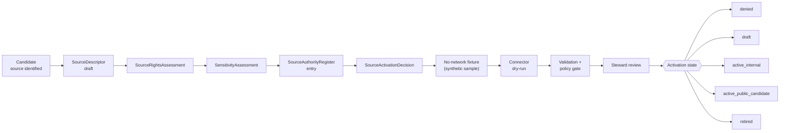

<!-- [KFM_META_BLOCK_V2]
doc_id: kfm://doc/adr-0017-source-descriptor-admission-process
title: ADR-0017 — Source Descriptor Admission Process
type: adr
version: v1
status: proposed
owners: ["@kfm-source-stewards", "@kfm-governance-stewards"]
created: 2026-05-09
updated: 2026-05-09
policy_label: public
related:
  - docs/adr/ADR-0001-schema-home.md
  - docs/doctrine/directory-rules.md
  - docs/doctrine/lifecycle-law.md
  - docs/doctrine/truth-posture.md
  - docs/doctrine/trust-membrane.md
  - contracts/source/_TEMPLATE_source_descriptor.md
  - schemas/contracts/v1/sources/source_descriptor.schema.json
  - control_plane/source_authority_register.yaml
tags: ["adr", "source", "admission", "governance", "lifecycle"]
notes: "Defines the descriptor-level admission process and the per-record admission rules contract that descriptors MUST declare. Status remains proposed until reviewed by source and governance stewards and reconciled against mounted-repo state."
[/KFM_META_BLOCK_V2] -->

# ADR-0017 — Source Descriptor Admission Process

> The gate at which **the world** becomes **KFM-admissible evidence**.
> No source enters the lifecycle without an admitted descriptor; no descriptor is admitted without a record-level admission contract.

| Field | Value |
|---|---|
| **ADR ID** | ADR-0017 |
| **Title** | Source Descriptor Admission Process |
| **Status** | `proposed` |
| **Date** | 2026-05-09 |
| **Decision class** | Governance — source intake, lifecycle gate |
| **Authors** | _placeholder — confirm at acceptance_ |
| **Reviewers required** | Source steward · Governance steward · Rights/sensitivity reviewer · Release steward (separation of duties) |
| **Supersedes** | _none_ |
| **Superseded by** | _none_ |
| **Related ADRs** | ADR-0001 schema home _(referenced; verify acceptance state in mounted repo — **NEEDS VERIFICATION**)_ |
| **Related doctrine** | Directory Rules; lifecycle law (RAW → WORK / QUARANTINE → PROCESSED → CATALOG / TRIPLET → PUBLISHED); truth posture (cite-or-abstain); watcher-as-non-publisher |
| **Conformance language** | RFC 2119-style: MUST · SHOULD · MAY |
| **Truth posture of this ADR** | Doctrine **CONFIRMED** from attached corpus; specific repo paths **PROPOSED** until verified against mounted repo |

---

## Table of contents

- [1. Context](#1-context)
- [2. Decision](#2-decision)
  - [2.1 Two senses of "admission"](#21-two-senses-of-admission)
  - [2.2 Descriptor-level admission: the activation flow](#22-descriptor-level-admission-the-activation-flow)
  - [2.3 Activation states](#23-activation-states)
  - [2.4 Required descriptor sections (template)](#24-required-descriptor-sections-template)
  - [2.5 Required descriptor field groups](#25-required-descriptor-field-groups)
  - [2.6 Record-level admission: minimum bar and fail-closed triggers](#26-record-level-admission-minimum-bar-and-fail-closed-triggers)
  - [2.7 Reason-code family convention](#27-reason-code-family-convention)
  - [2.8 Separation of duties](#28-separation-of-duties)
  - [2.9 Companion paths and authorities](#29-companion-paths-and-authorities)
- [3. Consequences](#3-consequences)
- [4. Alternatives considered](#4-alternatives-considered)
- [5. Validation and enforcement](#5-validation-and-enforcement)
- [6. Rollback and supersession](#6-rollback-and-supersession)
- [7. Open questions and NEEDS VERIFICATION](#7-open-questions-and-needs-verification)
- [8. References](#8-references)

---

## 1. Context

KFM treats every governed claim as evidence-backed, policy-aware, and reversible. Source intake is the single hardest entry point in that promise: every downstream gate — validation, policy, evidence resolution, release, runtime envelope — depends on the decision that **this source** is allowed to feed **this lane** with **this role** under **this rights posture**. The failure mode is well-known and structural: when admission rules live only inside connector code, they drift silently, escape review, and are reconstructed inconsistently per source.

The project corpus is unambiguous on the doctrine. Two independent threads converge on the same conclusion:

- The **operational** view (KFM Build Companion, §8): the repository needs an *"admission office"* — a documented activation flow with explicit gates, a `SourceDescriptor` of governed minimum fields, a `SourceAuthorityRegister` entry, and an auditable `SourceActivationDecision`.[^build-co-8]
- The **doctrinal** view (Components Pass 13 Part 2, Chapter B): every authoritative source has a single Markdown descriptor with a fixed section structure. The descriptor declares both the **minimum admission bar** (what a record MUST satisfy to enter normalized form) and the **fail-closed triggers** (what blocks outward use even if the record was admitted). Descriptors are *"not a publication-rights grant"* but *"the precondition for admission into normalization."*[^pass13-srcB]

Both threads describe the same machinery from different sides. This ADR consolidates them into a single admission contract, names the file homes, and pins the conformance language so the rest of the repository can build the validators, registers, and gates against a stable target.

> [!IMPORTANT]
> A descriptor is **not** an authorization to publish. Activation merely admits a source into normalization. Publication still requires the rights, sensitivity, evidence-bundle, validation, and release gates downstream.

[^build-co-8]: KFM Build Companion, §8 — *Source activation and authority: the repo needs an admission office* — including §8.1 activation flow, §8.2 minimum descriptor fields, §8.3 source-role examples by domain.
[^pass13-srcB]: KFM Components Pass 13 Part 2, §5.B Chapter B — *Source Descriptors and Source-Role Doctrine*, KFM-IDX-SRC-001 through KFM-IDX-SRC-006. iNaturalist and eBird descriptors are the most fully developed prototypes.

---

## 2. Decision

### 2.1 Two senses of "admission"

The corpus uses *admission* in two distinct senses. This ADR governs both, and requires every descriptor to satisfy each:

| Sense | Subject | Question answered | Owning artifact |
|---|---|---|---|
| **Descriptor-level admission** | The source itself | "Is this source allowed in KFM, in what role, under what rights, at what activation state?" | `SourceDescriptor` (Markdown) + `SourceAuthorityRegister` entry + `SourceActivationDecision` |
| **Record-level admission** | A single record from the source | "Does this individual record meet the minimum bar to enter normalized form, and is any fail-closed trigger active?" | `Source Admission Rules` section of the descriptor + per-source admission validator |

Both senses MUST resolve before any record is promoted past `data/raw/` or `data/quarantine/`.

### 2.2 Descriptor-level admission: the activation flow

The activation flow MUST follow this path. Each step emits a governed artifact; no step may be skipped.

The flow above is **CONFIRMED** doctrine, drawn directly from KFM Build Companion §8.1.[^build-co-8] The corresponding **6-step onboarding mechanics**, drawn from the geology dossier and stated to apply to all lanes, are the operational form of the same flow:[^geo-onboard]

| # | Step | Required action | Fail-closed condition |
|---|---|---|---|
| 1 | **Draft descriptor** | Create descriptor with role, rights, cadence, identity, caveats, public-safe defaults | Missing `source_role`, `rights`, or caveats → cannot activate |
| 2 | **Endpoint / source verification** | Lock endpoint or item ID, fields, formats, ETag / Last-Modified / checksum behavior, license / terms snapshot | Unverified endpoint or terms → QUARANTINE only |
| 3 | **Fixture before live connector** | Author synthetic source-shaped fixture and pass schema, source-role, and public-safety tests | No fixture → no connector |
| 4 | **Connector dry run** | Fetch to `data/raw/` only, emit ingest receipt, **no public artifact** | Checksum, schema, or rights drift → QUARANTINE |
| 5 | **Promotion candidate** | Processed object, catalog matrix, `EvidenceBundle`, release manifest, redaction receipt if needed | Any unresolved evidence / policy / catalog mismatch → DENY |
| 6 | **Living docs update** | Update `SOURCE_INDEX`, `DATASET_OR_LAYER_INDEX`, `EVOLUTION_LOG`, `CHANGE_IMPACT_MATRIX` | Docs not updated → PR fails |

> [!CAUTION]
> Step 4 enforces the **watcher-as-non-publisher** invariant. Connectors emit receipts and candidates only — they do not write to `data/published/`, mutate canonical records, or bypass review. This MUST be enforced by CODEOWNERS on `data/published/` and by a CI guard that rejects connector PRs touching protected paths.

[^geo-onboard]: KFM Geology & Natural Resources Architecture (PDF-only report, 2026-04-21), §12.3 *Source onboarding mechanics*. The same six-step shape recurs across the per-domain dossiers (atmosphere, archaeology, fauna, flora, hazards, hydrology, settlements/infrastructure, soil, transport).

### 2.3 Activation states

A descriptor's `activation.status` MUST be one of:

| State | Meaning | Allowed downstream effect |
|---|---|---|
| `denied` | Decision: source MUST NOT be admitted | None. Record reasons in the register. |
| `draft` | Descriptor exists; no activation decision yet | Internal-only design and fixture work. No live fetch. |
| `active_internal` | Activated for internal use only | Connector may run; outputs land in `data/raw/` or `data/quarantine/`. **Public release is denied.** |
| `active_public_candidate` | Cleared for the public candidate path | Eligible for release pipelines, subject to per-record rules, evidence resolution, and release gates. **Activation is not release.** |
| `retired` | Was admitted; now withdrawn from active use | Historical records remain; new fetches are blocked. Re-activation requires a new decision. |

The state vocabulary is **CONFIRMED** from KFM Build Companion §8.1.[^build-co-8] Transitions MUST be recorded as append-only entries in `control_plane/source_authority_register.yaml` (or the repo's confirmed equivalent) with reviewer, decision date, allowed roles, denied roles, obligations, and re-review date.[^build-co-82]

[^build-co-82]: KFM Build Companion, §8.2, Activation field group: *"status, reviewer, decision date, allowed roles, denied roles, obligations, re-review date."*

### 2.4 Required descriptor sections (template)

Every descriptor MUST follow the canonical section order (the structure is repeated identically across the iNaturalist and eBird descriptors and is **CONFIRMED** as the doctrinal template):[^pass13-template]

1. `KFM_META_BLOCK_V2` header
2. **Status block** (current activation state, last decision, next re-review)
3. **Scope** — explicit `includes` / `excludes`
4. **Source identity** table — `source_id`, publisher, source family, official / aggregator / community / model / archive flags
5. **KFM working interpretation** — what the source *is* and is *not* allowed to be flattened into
6. **Accepted input shape**
7. **Source admission rules** — minimum bar + fail-closed triggers (see §2.6)
8. **Rights posture** — including the rule that rights MAY be observation-level, not source-global
9. **Geoprivacy and sensitivity posture** — explicit mapping to KFM public-safe precision
10. **Mapping table** to the canonical evidence object (e.g., `OccurrenceEvidenceObject`)
11. **Normalization notes** — taxonomy, observation shape, geometry, identity
12. **Validator pressure** — likely reason-code families (see §2.7)
13. **Runtime cautions** — checklist semantics, observation-vs-specimen, precision burdens, etc.
14. **Exclusions**
15. **Next related files**

A descriptor missing any of these sections SHOULD NOT be promoted past `draft`. A starter template MUST live at `contracts/source/_TEMPLATE_source_descriptor.md` (**PROPOSED** path; verify in mounted repo).

[^pass13-template]: Pass 13 Part 2, KFM-IDX-SRC-001 *— The Source Descriptor Template* (status: CONFIRMED). The corpus also notes the descriptor's primary job: *"to bound the source. It names what the source is allowed to be ingested as ... what it is not allowed to be flattened into ... what minimum bar a record must meet ... what fail-closed triggers must block outward use even if the record has been admitted."*

### 2.5 Required descriptor field groups

The descriptor MUST carry these field groups. They are **CONFIRMED** from the Build Companion table of minimum fields.[^build-co-82]

| Group | Minimum fields | Why it matters |
|---|---|---|
| **Identity** | `source_id`, `title`, `publisher`, `source_family`, `source_role`, official / aggregator / community / model / archive flags | Prevents source-role confusion |
| **Access** | `access_method`, endpoint or path, auth requirement, rate / terms notes, retrieval mode, contact / steward | Allows safe connector design and rechecks |
| **Rights** | license / terms, attribution, `public_release_allowed`, redistribution limits, commercial limits, no-assertion reason | Unknown rights block public promotion |
| **Scope** | spatial scope, temporal scope, subject scope, domain lanes, excluded uses | Prevents overbroad claims |
| **Data character** | observation / model / regulatory / archive / interpretation / administrative / derived / supporting | Controls admissibility and claim language |
| **Sensitivity** | precise-location sensitivity, living-person data, cultural / tribal / steward restrictions, infrastructure risk, rare-species risk | Fail-closed public exposure |
| **Freshness** | `update_cadence`, `stale_after`, retrieval schedule, last checked, verification required | Time-aware trust display |
| **Validation** | required schemas, fixtures, validators, known caveats, null handling, CRS / units expectations | Prevents source-specific surprises |
| **Activation** | status, reviewer, decision date, allowed roles, denied roles, obligations, re-review date | Makes activation auditable |

Where rights vary per record (e.g., iNaturalist), the descriptor MUST declare **observation-level rights** and the four normalized rights fields — `rights.license`, `rights.redistribution_allowed`, `rights.commercial_use_allowed`, `rights.attribution_required` — for downstream artifacts.[^pass13-rights]

[^pass13-rights]: Pass 13 Part 2, KFM-IDX-SRC-003 *— Observation-Level Rights and the Four Required Normalized Fields* (status: CONFIRMED).

### 2.6 Record-level admission: minimum bar and fail-closed triggers

Each descriptor MUST contain a **Source Admission Rules** section that names two explicit lists.[^pass13-srcRules]

#### 2.6.1 Minimum admission bar

The conditions a record MUST satisfy to enter normalized KFM form. The list is descriptor-specific but follows a stable shape. Reference example, from the iNaturalist descriptor (CONFIRMED from corpus):

> non-empty provider record id · taxon label · observation date · reconstructible source URI · explicit rights posture · explicit geoprivacy posture

Absence of any required item moves the record to `data/quarantine/`, not `data/raw/`. The validator emits the matching reason code.

#### 2.6.2 Fail-closed triggers

Conditions that block outward public-safe use **even if the record was admitted**. Reference examples (CONFIRMED):

- absent or unresolved license
- obscured / private geoprivacy without a public-safe geometry
- incomplete source identity
- unreconstructible provenance
- materially unresolved taxon
- precision too exact for the intended public surface
- runtime overstatement (e.g., presenting checklist support as exact-site truth)

A fail-closed trigger MUST cause `DENY` (for an outward decision) or `ABSTAIN` (when scope is too broad), never silent passage.

#### 2.6.3 Machine-readable mirror (PROPOSED)

To make the validator's branches map one-to-one to descriptor lines, each descriptor SHOULD ship a co-located `admission_rules.json` (or equivalent) that mirrors the prose lists. The validator loads it at startup. This is **PROPOSED** per the Pass 13 expansion direction (KFM-IDX-SRC-005, *"Suggested future work"*).

> [!NOTE]
> Whether `admission_rules.*` is embedded inside `KFM_META_BLOCK_V2` or lives as a sibling file is **OPEN** in the corpus and tracked in §7. Default in this ADR: sibling file.

[^pass13-srcRules]: Pass 13 Part 2, KFM-IDX-SRC-005 *— Source Admission Rules: Minimum Bar and Fail-Closed Triggers* (status: CONFIRMED).

### 2.7 Reason-code family convention

Validators emit reason codes inside fixed families so that runtime envelopes, evidence drawers, and gate reports present cautions consistently. The families are **CONFIRMED** from corpus and are non-negotiable across sources:[^pass13-reason]

| Family | Covers |
|---|---|
| `prov.*` | Provenance, source identity, reconstructible URI |
| `rights.*` | License, redistribution, commercial use, attribution |
| `geom.*` | Geometry, precision, public-safe-precision mismatch |
| `sens.*` | Sensitivity, geoprivacy, sensitive-location, living-person, cultural / tribal restrictions |
| `taxon.*` | Taxonomy resolution, name authority |
| `obs.*` | Observation semantics — checklist vs. specimen, count, methodology |

A new family MUST NOT be invented inside a single descriptor; expansion goes through this ADR's amendment path.

[^pass13-reason]: Pass 13 Part 2, KFM-IDX-SRC-006 *— Reason-Code Family Convention* (status: CONFIRMED).

### 2.8 Separation of duties

Activation MUST be the work of separated roles. No single actor MAY draft, approve, and release the same descriptor.

| Role | Responsibilities | Cannot also |
|---|---|---|
| **Source steward** | Drafts descriptor; runs onboarding mechanics; maintains fixtures | Approve activation; sign release |
| **Rights / sensitivity reviewer** | Reviews rights, sensitivity, geoprivacy posture | Author the same descriptor it reviews |
| **Governance steward** | Approves `SourceActivationDecision`; enters `SourceAuthorityRegister` row | Edit canonical truth without recorded decision |
| **Release steward** | Decides `release_state`; assembles `ReleaseManifest` | Bypass evidence / validation / policy gates |

This pattern aligns with the Master Action Matrix in `kfm_encyclopedia.pdf` §10 (CONFIRMED doctrine on separation of duties for source activation, policy result, and promotion).

### 2.9 Companion paths and authorities

| Artifact | Path | Authority class | Status of path |
|---|---|---|---|
| Descriptor (Markdown) | `contracts/source/<source>_source_descriptor.md` | Object meaning (Directory Rules §6.3) | **PROPOSED** filename pattern; root **CONFIRMED** |
| Descriptor template | `contracts/source/_TEMPLATE_source_descriptor.md` | Object meaning | **PROPOSED** |
| Machine schema | `schemas/contracts/v1/sources/source_descriptor.schema.json` | Schema home (per ADR-0001 default) | **PROPOSED** until ADR-0001 acceptance verified in mounted repo |
| Per-source admission rules | `contracts/source/<source>_admission_rules.json` _(co-located with descriptor)_ | Object meaning | **PROPOSED** |
| Validator | `tools/validators/sources/source_descriptor_validator.*` | Repo-wide validator | **PROPOSED** |
| Policy bundle | `policy/sources/source_descriptor.rego` | Admissibility | **PROPOSED** |
| Tests | `tests/sources/test_source_descriptor.*` | Enforceability proof | **PROPOSED** |
| Fixtures | `fixtures/sources/valid/` and `fixtures/sources/invalid/` | Golden / negative inputs | **PROPOSED** |
| Per-domain registry | `data/registry/<domain>/sources.yaml` | Source registry | **PROPOSED**; root **CONFIRMED** |
| Authority register | `control_plane/source_authority_register.yaml` | Governance map | **CONFIRMED** at root level (Directory Rules §6.2); filename **PROPOSED** |
| Activation decision | recorded inside `control_plane/source_authority_register.yaml` (append-only) | Governance map | **PROPOSED** placement |

> [!IMPORTANT]
> No parallel home for source descriptors, source schemas, or source policy is permitted without an amending ADR. Per Directory Rules §2.4 (#5), creating a parallel home for sources MUST be ADR-gated.

---

## 3. Consequences

### 3.1 Positive

- **Auditable admission.** Implicit admission rules drift; explicit ones are reviewable, testable, and inspectable in pull-request diffs.
- **Uniform downstream surface.** Reason-code families are uniform across sources, so the runtime envelope, evidence drawer, and gate reports can present cautions consistently.
- **Separation of authorization concerns.** Activation is divorced from publication; descriptors stop being mistaken for release grants.
- **Replicable pattern.** Once two descriptors (iNaturalist, eBird) are written to this contract, any new source can be drafted by following the template, reducing the marginal cost of source onboarding.
- **CI-checkable.** Section presence, field-group presence, the activation state vocabulary, and the reason-code family prefixes are all amenable to lightweight static checks.

### 3.2 Negative / costs

- **Authoring overhead.** Each new source costs a multi-step descriptor + fixture + dry-run + register entry + decision before any record flows. This is the intended cost.
- **Validator cost.** Per-source admission rules ship as machine-readable mirrors; a small DSL or hand-written validator is required. The corpus prefers hand-written validators but flags the cost.[^pass13-srcRules]
- **Doc surface.** Six new file homes per source (descriptor, admission rules JSON, schema, validator, policy, tests, fixtures) raise the per-source doc-graph footprint.
- **Drift between Markdown prose and JSON mirror.** A CI parity check is required to keep the prose lists and `admission_rules.json` aligned.

### 3.3 Risks if not adopted

- Source-global rights assumptions silently violate per-observation licenses at scale.
- "Source role" gets reinvented per connector; aggregators get treated as canonical truth; modeled surfaces get presented as observed evidence.
- Activation state lives in chat / commits / tribal memory; rollback is impossible.

---

## 4. Alternatives considered

| Alternative | Why rejected |
|---|---|
| **No descriptor; admission rules live inside connector code** | Status quo failure mode. Rules become invisible to reviewers, drift across connectors, escape audit. The whole point of this ADR is to refuse this option. |
| **Descriptor as YAML only (no Markdown)** | Loses the *KFM working interpretation*, *runtime cautions*, *normalization notes*, and *exclusions* sections, which are inherently prose. The corpus's two prototype descriptors (iNaturalist, eBird) are Markdown for this reason. |
| **One global admission rule set across sources** | Sources differ materially: iNaturalist has observation-level rights; eBird has checklist semantics; SMAP has authenticated-federal-source ingest; KGS has interpretive map units. A global rule set would either be too loose (admits everything) or too tight (admits nothing). |
| **Embed admission rules inside `KFM_META_BLOCK_V2`** | Considered. Tracked as **OPEN** in §7. Default for now: sibling JSON file, because the lists can grow and Meta-Block-V2 is intended to stay compact. |
| **Activation decision stored in source repo only (no register)** | Loses cross-source reporting (which sources are active, stale, denied, retired, need rights recheck). The Build Companion §26.1 *Source health* dashboard requires a queryable register. |
| **Skip the no-network fixture step** | The corpus is consistent: *"No fixture → no connector."* Without a fixture, the validator and policy bundle have nothing to test against before live fetch. |

---

## 5. Validation and enforcement

### 5.1 Static checks

A new validator under `tools/validators/sources/` SHOULD assert each of the following on every PR touching `contracts/source/**`:

- [ ] `KFM_META_BLOCK_V2` present and parseable
- [ ] All 15 canonical sections present (§2.4)
- [ ] All 9 field groups populated (§2.5)
- [ ] `Source Admission Rules` section contains a non-empty minimum-bar list and a non-empty fail-closed-triggers list
- [ ] If `admission_rules.json` exists, its lists match the prose lists (parity check)
- [ ] `activation.status` ∈ { `denied`, `draft`, `active_internal`, `active_public_candidate`, `retired` }
- [ ] All declared reason codes use the family prefix vocabulary (`prov.*`, `rights.*`, `geom.*`, `sens.*`, `taxon.*`, `obs.*`)
- [ ] `source_role` resolves against the closed source-role registry
- [ ] No descriptor declares `public_release_allowed: true` while `rights.status` is `noassertion` or `unknown`

### 5.2 Fixtures

Each source SHOULD ship at least one valid fixture and at least one invalid fixture per minimum-bar item and per fail-closed trigger. A failed fixture MUST emit a reason code from the family vocabulary (§2.7).

### 5.3 CI gate

A PR that adds or modifies a descriptor MUST cite this ADR by ID in the PR description and pass the descriptor validator. PRs that add a new admission state, new reason-code family, or new descriptor section without amending this ADR MUST be rejected.

### 5.4 Re-review cadence

Each descriptor's `activation` block names a `re_review_date`. CI SHOULD emit a warning when any active descriptor's re-review date is overdue, and SHOULD surface that signal on the **Source health** dashboard.

---

## 6. Rollback and supersession

- This ADR is `proposed` and may be amended freely until accepted.
- After acceptance, breaking changes (vocabulary, section structure, activation states, reason-code families) MUST be made by a successor ADR. This ADR is then marked `superseded` with a forward link.
- Rollback target for individual descriptor PRs: the descriptor's prior commit and the prior `SourceAuthorityRegister` row. Append-only register entries make the rollback path inspectable.
- Rollback target for the ADR itself: revert to no formal admission contract and route source intake decisions through ad-hoc review. **Strongly discouraged**; record the reason in the deprecation register.

---

## 7. Open questions and NEEDS VERIFICATION

| Item | Status | Resolution path |
|---|---|---|
| Whether `admission_rules.*` belongs inside `KFM_META_BLOCK_V2` or as a sibling JSON | **OPEN** | Pilot both on iNaturalist and eBird; choose by validator-ergonomics evidence; record decision in a successor ADR or amendment |
| Whether `contracts/source/` is the live home in the mounted repo, or whether an alternate path is in use | **NEEDS VERIFICATION** | Inspect mounted repo; if drifted, open `docs/registers/DRIFT_REGISTER.md` entry per Directory Rules §2.5 |
| Whether `schemas/contracts/v1/sources/` is the live machine-schema home | **NEEDS VERIFICATION** | Verify ADR-0001 acceptance state and mounted-repo `schemas/contracts/v1/` presence |
| Whether `control_plane/source_authority_register.yaml` exists and is append-only | **NEEDS VERIFICATION** | Inspect mounted repo; if absent, create per Directory Rules §6.2 |
| Whether descriptor sections that don't apply to a given source remain as empty headings or are omitted | **OPEN** (per Pass 13, KFM-IDX-SRC-001 open question) | Default in this ADR: keep heading, write a one-line justification (e.g., "Source-global rights — no observation-level variance") |
| Should source descriptors be enforced via a CI block that DENIES PRs touching `connectors/<source>/` without a corresponding descriptor? | **OPEN** | Default in this ADR: advisory; promote to hard block once two pilot descriptors are accepted |
| Whether a `schemas/contracts/v1/common/source_role.schema.json` should be authored so all descriptors and evidence objects can `$ref` it | **OPEN** (per Pass 13, KFM-IDX-SRC-002 expansion direction) | Track as follow-up ADR |
| Whether prior ADRs in `docs/adr/` actually exist as referenced (e.g., ADR-0001) | **NEEDS VERIFICATION** | The corpus references ADR-0001 as the schema-home decision; presence in the mounted repo MUST be confirmed before this ADR is accepted |

---

## 8. References

### 8.1 Project sources (attached in this session)

- `kfm_build_companion.pdf` — §8 *Source activation and authority: the repo needs an admission office* (§8.1 activation flow; §8.2 minimum descriptor fields; §8.3 source-role examples by domain). Sketches: Appendix C.1 SourceDescriptor sketch.
- `KFM_Components_Pass_13_Part_2_Idea_Index_Category_Atlas_and_Expansion_Dossier.pdf` — §5.B *Chapter B — Source Descriptors and Source-Role Doctrine*; idea entries KFM-IDX-SRC-001 through KFM-IDX-SRC-006.
- `KFM_Geology_Natural_Resources_Architecture_PDF_Only_Report_20260421.pdf` — §12.3 *Source onboarding mechanics* (the 6-step shape replicated across domains).
- `KFM_Governed_AI_Extended_Pro_Source_Ledger_PDF_Only_Architecture_Report_20260420.pdf` — §7 *Required object-family map* (`SourceDescriptor`, `SourceAliasMap`, `UnresolvedSourceReference`, `SourceIntakeRecord`).
- `directory-rules.md` (project-attached) — §2.4 (changes that require ADR), §6.3 (`contracts/source/`), §6.4 (schema home), §6.5 (`policy/`), §6.2 (`control_plane/`).
- `kfm_encyclopedia.pdf` — §10 *Master Action Matrix* (separation of duties for source activation, policy result, promotion).

### 8.2 Per-domain corroboration

The 6-step onboarding pattern recurs in: KFM Atmosphere/Air; Archaeology; Fauna; Flora; Hazards; Hydrology; Settlements/Infrastructure; Soil; Roads/Rail/Trade Routes; Habitat. Each per-domain dossier names ADRs of the form `ADR-<domain>-source-role-*` and registries at `data/registry/<domain>/sources.yaml` — all **PROPOSED** until inspected against the mounted repo.

### 8.3 Doctrinal anchors

- **Lifecycle invariant.** RAW → WORK / QUARANTINE → PROCESSED → CATALOG / TRIPLET → PUBLISHED. Promotion is a governed state transition, not a file move. (Directory Rules §0)
- **Watcher-as-non-publisher.** Connectors emit receipts and candidates only. (Directory Rules §19 glossary; Pass 13 idea index throughout.)
- **Cite-or-abstain.** Descriptor admission is a precondition for cited claims; without an admitted descriptor, downstream claims must `ABSTAIN`.
- **Trust membrane.** Public surfaces consume only governed envelopes; a descriptor is part of the evidence chain that backs those envelopes.

---

[⬆ Back to top](#adr-0017--source-descriptor-admission-process)
