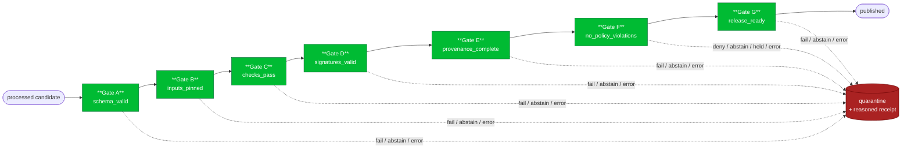

<!-- [KFM_META_BLOCK_V2]
doc_id: kfm://doc/adr-0018-promotion-gate-sequence
title: ADR-0018 — Promotion Gate Sequence
type: standard
version: v1
status: proposed
owners: TODO — Governance Steward (lead) + Release Steward (co-owner) + Schemas Steward (consulted)
created: 2026-05-09
updated: 2026-05-15
policy_label: public
related:
  - docs/adr/ADR-0001-schema-home.md
  - docs/doctrine/lifecycle-law.md
  - docs/doctrine/trust-membrane.md
  - docs/doctrine/truth-posture.md
  - docs/doctrine/directory-rules.md
  - docs/runbooks/promotion-and-rollback.md                         # PROPOSED / NEEDS VERIFICATION
  - docs/registers/VERIFICATION_BACKLOG.md                          # PROPOSED / NEEDS VERIFICATION
  - schemas/contracts/v1/evidence/promotion_receipt.schema.json     # PROPOSED
  - schemas/contracts/v1/runtime/decision_envelope.schema.json      # PROPOSED
  - schemas/contracts/v1/promotion/decision_gate.schema.json        # PROPOSED
  - policy/promotion/                                               # PROPOSED
  - policy/release/release_ready.rego                               # PROPOSED
  - .github/workflows/promotion.yml                                 # PROPOSED
  - data/quarantine/                                                # lifecycle root; verify mounted repo
  - data/published/                                                 # lifecycle root; verify mounted repo
tags: [kfm, adr, governance, promotion, gates, ci, fail-closed, attestation]
notes:
  - "Authored from project doctrine; specific repo paths are PROPOSED until verified against a mounted repository."
  - "Resolves naming tension between PromotionReceipt schema (outcome-named) and Pass 12 CI workflow (action-named)."
  - "Separates decision_id as the cross-artifact join key from RunReceipt as the evidence/attestation atom."
  - "Gate G asserts release readiness only; Gate H (Merkle integrity) and Gate I (ReleaseManifest closure) remain deferred hardening ADRs."
[/KFM_META_BLOCK_V2] -->

# ADR-0018 — Promotion Gate Sequence

> Pin a single canonical seven-gate sequence (**A–G**) as the fail-closed spine of KFM promotion, with stable outcome-named gates, a single `decision_id` join key, per-gate decision logs, and a `PromotionReceipt` that enumerates all seven gates as the auditable record of a promotion.

| | |
|---|---|
| **Status** |  |
| **Authority class** | Architecture Decision Record (canonical) |
| **Stewards** | _TODO — Governance Steward (lead) + Release Steward (co-owner)_ |
| **Created / Updated** | 2026-05-09 / 2026-05-15 |
| **Supersedes** | _None._ First ADR to formalize the gate sequence. |
| **Related** | [ADR-0001 — Schema Home](./ADR-0001-schema-home.md) · [Directory Rules](../doctrine/directory-rules.md) · [Lifecycle Law](../doctrine/lifecycle-law.md) · [Trust Membrane](../doctrine/trust-membrane.md) |
| **Reviewers required** | Governance steward + Release steward + Schemas steward; `CODEOWNERS` two-key approval per the existing review burden for `docs/adr/` (**NEEDS VERIFICATION** against mounted repo). |

**Quick jump:** [Status](#1-status) · [Context](#2-context) · [Decision](#3-decision) · [Mapping](#4-gate-to-validator-and-policy-mapping) · [Alternates](#5-mapping-of-alternate-gate-vocabularies) · [Failure handling](#6-failure-handling-and-quarantine-routing) · [Consequences](#7-consequences) · [Alternatives](#8-alternatives-considered) · [Verification](#9-verification) · [Migration](#10-migration--rollback) · [Open questions](#11-open-questions) · [Related doctrine](#12-related-adrs-and-doctrine) · [Appendices](#appendix-a--decision-log-shape-per-gate)

---

## 1. Status

**proposed** — awaiting acceptance review.

This ADR is doctrinally backed by the KFM source corpus but its **runtime / CI surfaces are PROPOSED**. Acceptance moves it to `accepted` and authorizes the implementation paths in §3 and §9. The ADR enters force on acceptance; prior internal documents using divergent gate vocabularies are superseded **for purposes of canonical naming**, but their substantive checks are folded into the canonical sequence (see §5).

> [!IMPORTANT]
> The **gate sequence A–G** as a doctrinal label is **CONFIRMED** in the KFM source corpus. The **specific outcome-named enumeration adopted here** (`schema_valid` … `release_ready`) is **PROPOSED** as the canonical resolution of an internal naming tension (see §2.2) until this ADR is accepted.

### 1.1 Current evidence boundary

- **CONFIRMED in this document:** the proposed vocabulary, ordering, receipt expectations, failure routing, and migration / rollback plan.
- **PROPOSED until repo inspection:** all file paths, workflow names, validator paths, policy module paths, schema locations, CODEOWNERS behavior, and test harness names.
- **UNKNOWN:** current mounted-repo implementation depth, actual ADR numbering availability, current schema-home implementation, CI toolchain, runtime policy engine, emitted receipts, dashboards, branch protections, and release behavior.

[Back to top](#adr-0018--promotion-gate-sequence)

---

## 2. Context

### 2.1 Why we need this ADR

KFM doctrine is unambiguous on two points:

1. **Promotion is a governed state transition, not a file move** ([Directory Rules §0](../doctrine/directory-rules.md), [Lifecycle Law](../doctrine/lifecycle-law.md)).
2. **Nothing reaches `data/published/` until explicit gates evaluate explicit policies against explicit inputs and emit auditable decisions** (corpus, Category C — Governance).

The corpus consistently labels this gate sequence **“Promotion Gates A–G.”** However, three distinct enumerations of what each letter *means* appear across project source documents. Without a single canonical enumeration, downstream artifacts (the `PromotionReceipt` schema, the CI workflow, OPA policy package names, validator names, decision-log filenames, and reviewer vocabulary) cannot stably reference one another.

### 2.2 Forces in tension

| Force | Pull |
|---|---|
| **Schema durability** | Names embedded in `promotion_receipt.schema.json` change rarely; CI job names change often. The receipt should win. |
| **Auditor readability** | A reviewer reading a stored `PromotionReceipt` should see *what passed*, not *which job ran*. Outcome-named gates serve this. |
| **Implementation clarity** | CI workflow authors want gates named after the action they perform (`license_provenance`, `policy_eval`, `attest`, `publish`). Action-named gates serve this. |
| **Doctrinal continuity** | Earlier internal documents already use *both* vocabularies and a third data-quality vocabulary (`license`, `spatial`, `temporal`, `dedupe`, `drawer-render`). A canonical mapping must absorb all three. |
| **Fail-closed posture** | Whatever the names, the chain MUST default-deny when any gate is missing or its evidence is unverifiable. |
| **Single join key** | The corpus repeatedly requires a `decision_id` threaded across per-gate decision logs, run receipts, attestations, review tickets, release records, and audit ledger entries. |

### 2.3 What is already CONFIRMED doctrine

The following items are **CONFIRMED** in the source corpus and this ADR does not relitigate them:

- A **seven-gate** sequence (Gates **A–G**) governs promotion; failure on any gate routes to **quarantine / review hold** with a reasoned receipt.
- Gates run **fail-closed**; the absence of evidence blocks promotion.
- A `RunReceipt` (DSSE-wrapped, cosign-signed where policy requires) is the universal evidence / attestation atom for intake, transform, and release actions. It carries the relevant `decision_id` where it participates in a promotion chain, but the **`decision_id` is the join key**.
- A `PromotionReceipt` enumerates all seven gates and is the auditable promotion record.
- Decision outcomes returned by policy modules MUST be the finite enum `{ANSWER, ABSTAIN, DENY, ERROR}`, decoupled from operational states such as `{NORMAL, DEGRADED, ESCALATE, QUARANTINE}`.
- Gate evaluation uses **OPA / Rego** policies executed by **Conftest** or a repo-equivalent runner in CI, against canonical JSON inputs.

### 2.4 What is in scope for this ADR

- The **canonical name and outcome** of each of Gates A–G.
- The **ordering** of gates and the **`decision_id` join-key** discipline.
- The **per-gate decision-log** emission shape.
- The **PromotionReceipt enumeration** (what the receipt MUST list).
- The **mapping of alternate vocabularies** (CI workflow action names, data-quality view) onto the canonical sequence.

### 2.5 What is explicitly out of scope

- **Gate H — Merkle integrity** of the canonical release file set. Tracked separately; will be its own ADR when ready (see §11).
- **Gate I — ReleaseManifest closure** as a hard precondition. Tracked separately; same rationale.
- The full **shape of `RunReceipt`**, the **DSSE/cosign verification protocol**, and the **OPA bundle layout** — these have or will have their own ADRs.
- **Per-domain validators** that run *inside* a gate (e.g., hydrology geometry validators inside Gate C). Domain ADRs may add or strengthen sub-checks but MUST NOT add or rename gates.

### 2.6 Directory Rules basis for proposed paths

This ADR proposes paths by responsibility root, not topic convenience:

| Proposed path family | Owning root | Directory Rules basis | Status |
|---|---|---|---|
| `docs/adr/ADR-0018-promotion-gate-sequence.md` | `docs/` | ADRs are doctrine / governance records. | **PROPOSED / NEEDS VERIFICATION** — ADR number and filename must be checked. |
| `schemas/contracts/v1/...` | `schemas/` | Field-level contract schemas live under the schema-home convention. | **PROPOSED** until mounted repo confirms ADR-0001 implementation. |
| `policy/promotion/`, `policy/release/` | `policy/` | Release/admissibility decisions live under policy. | **PROPOSED / NEEDS VERIFICATION** for `policy/` vs any compatibility `policies/` root. |
| `.github/workflows/promotion.yml` | `.github/` | CI workflow surface, not doctrine or truth store. | **PROPOSED**. |
| `data/quarantine/`, `data/published/` | `data/` | Lifecycle phases are data roots; promotion is a state transition, not a move. | Lifecycle law is **CONFIRMED doctrine**; mounted path presence is **UNKNOWN**. |

[Back to top](#adr-0018--promotion-gate-sequence)

---

## 3. Decision

### 3.1 Canonical Gate A–G enumeration

KFM adopts the **outcome-named** enumeration as canonical. The seven gates, in **strict left-to-right ordering**, are:

| Gate | Canonical name | What it asserts (the *outcome*) | What it produces |
|:---:|---|---|---|
| **A** | `schema_valid` | All candidate objects validate against pinned `schemas/contracts/v1/...` (JSON Schema draft 2020-12), with no unknown enum values. `spec_hash` recomputes deterministically for the candidate envelope. | `decision_gate_A.json` |
| **B** | `inputs_pinned` | Every input artifact is pinned by `spec_hash`, `source_head` (ETag, Last-Modified, Content-Length, source commit / equivalent), and a resolvable `source_url` or governed source descriptor. License (SPDX or governed equivalent) is resolved against the allowlist; `UNKNOWN` ⇒ fail. | `decision_gate_B.json` |
| **C** | `checks_pass` | All domain validators and data-quality checks (geometry validity, temporal consistency, deduplication, sensitivity transforms, Evidence Drawer payload renderability, model QA where applicable) return pass. | `decision_gate_C.json` |
| **D** | `signatures_valid` | Every input `RunReceipt` required by policy is DSSE-wrapped, cosign-verifiable (keyed or keyless via OIDC + Rekor where required), and `spec_hash` matches the receipt’s recorded digest. | `decision_gate_D.json` |
| **E** | `provenance_complete` | `EvidenceBundle` closure resolves; every `EvidenceRef` resolves to an `EvidenceBundle`; PROV-O activity / agent / entity triples are present where required; `supersedes` and `rollback_target` are well-formed. | `decision_gate_E.json` |
| **F** | `no_policy_violations` | OPA evaluates the merged A–E input against the pinned policy bundle and returns a finite outcome for the requested promotion action. `ANSWER` permits continuation; `DENY`, `ABSTAIN`, and `ERROR` halt. Obligations marked `human_review` produce a held promotion. | `decision_gate_F.json` |
| **G** | `release_ready` | Minimum release readiness is proven: a release manifest candidate is present, catalog closure checks pass at this gate’s required level, rollback card / rollback target is checkable, public DTO contract holds, and no unresolved hold remains. This is not yet Gate H Merkle integrity or Gate I ReleaseManifest closure. | `decision_gate_G.json` |

> [!IMPORTANT]
> Gate **letters and outcome names** are normative. Implementation **job names** in CI MAY use action-flavored slugs (e.g., `gate_b_license_provenance`) **provided** the canonical letter and outcome name appear in the job’s emitted `decision_gate_X.json`. Naming the slug is style; naming the outcome is contract.

### 3.2 Ordering and join key

- The seven gates execute as a **dependency chain** (`B needs A`, `C needs B`, … `G needs F`). Parallelism within a gate is permitted; cross-gate parallelism is **NOT permitted** for normative correctness even if technically feasible.
- A single `decision_id` is generated **once at Gate A** and threaded through every downstream emission: per-gate decision logs, merged input passed to OPA, promotion-related `RunReceipt`s, optional Rekor inclusion proof, human-review ticket (if any), `PromotionReceipt`, and release records.
- The `decision_id` MUST be globally unique, stable, and schema-validated. **PROPOSED default:** ULID or UUIDv7 for sortability. If ADR-0001 or a future identity ADR narrows this choice, this ADR follows that schema without changing the A–G sequence.
- Auditors reconstruct a promotion by joining on `decision_id`. The corpus’s idiom for this is `jq -s 'add' decision_gate_*.json` over a single `decision_id` shard.

### 3.3 Per-gate decision log

Every gate MUST emit a JSON file `decision_gate_<LETTER>.json` conforming to the (PROPOSED) schema at `schemas/contracts/v1/promotion/decision_gate.schema.json`, with at minimum:

```json
{
  "schema_version": "promotion.decision_gate.v1",
  "decision_id": "01HX0K8R6Z9G3Q5VYM7N4WPDXC",
  "gate": "A",
  "name": "schema_valid",
  "policy_id": "kfm.promotion.schema_valid",
  "policy_bundle_digest": "sha256:...",
  "spec_hash": "sha256:...",
  "input_digest": "sha256:...",
  "result": "pass | fail | escalate",
  "outcome": "ANSWER | ABSTAIN | DENY | ERROR",
  "obligations": [],
  "evidence_refs": [{"type": "EvidenceBundle", "uri": "kfm://..."}],
  "explanations": [],
  "timestamp": "2026-05-09T12:00:00Z",
  "job_run_id": "..."
}
```

Decision logs are **canonical JSON** (RFC 8785 / JCS, sorted keys, UTF-8, NFC-normalized, compact separators). They are immutable artifacts of CI; they MUST NOT be edited after emission. Corrections proceed through a new `decision_id`, except for a Gate F held-review amendment explicitly recorded under §6.2 until that open question is resolved.

### 3.4 PromotionReceipt enumeration

A `PromotionReceipt` (PROPOSED home: `schemas/contracts/v1/evidence/promotion_receipt.schema.json`) is required for every promotion and MUST contain a `gates[]` array enumerating **all seven gates**, each as `{ gate, name, status }` with `name` drawn from §3.1 and `status ∈ {pass, fail, held, escalate}`. Other required fields:

- `promotion_id` and `decision_id` (must equal the join key from §3.2).
- `candidate { bundle_id, spec_hash }`.
- `decision { status ∈ {approved, denied, held}, policy_version, policy_bundle_digest, decided_at, decided_by }`.
- `environment_transition { from, to }` (e.g., `{ from: "processed", to: "published" }`).
- `attestation { verified: bool, ref: "attestation://..." }`.
- `integrity { receipt_digest: "sha256:..." }` (the receipt is itself canonically hashed).

A `PromotionReceipt` with **fewer than seven gates** is itself an error (DENY release); see §6.

### 3.5 Status vocabulary split

This ADR intentionally keeps three vocabularies separate:

| Field / vocabulary | Scope | Allowed values in this ADR | Meaning |
|---|---|---|---|
| `outcome` | Normative finite decision | `ANSWER`, `ABSTAIN`, `DENY`, `ERROR` | What the policy / gate decided. |
| `result` | Gate runner summary | `pass`, `fail`, `escalate` | What the runner reports operationally. |
| `decision.status` | Promotion-level state | `approved`, `denied`, `held` | What the assembled `PromotionReceipt` says about the promotion. |
| Operational state | UI / workflow routing | `NORMAL`, `DEGRADED`, `ESCALATE`, `QUARANTINE` or repo-equivalent | How systems route or display state; not the same as `outcome`. |

Downstream consumers MUST NOT invent additional public decision labels without a schema / ADR change. UI copy MAY translate these fields for human readability, but the machine values remain canonical.

### 3.6 Sequence diagram



> _Diagram reflects the dependency-chain ordering and the fail-closed quarantine / review-hold route. Join key `decision_id` is generated at A and threaded forward; not drawn here for clarity._

[Back to top](#adr-0018--promotion-gate-sequence)

---

## 4. Gate-to-validator and policy mapping

The gates are **outcome contracts**; they delegate the actual checks to validators (in `tools/validators/`, `packages/`, or repo-equivalent locations) and OPA policy modules (in `policy/promotion/` per [Directory Rules](../doctrine/directory-rules.md)). The mapping below is the **PROPOSED** binding; concrete validator / policy paths require verification against the mounted repo and may be refined by follow-up PRs without re-opening this ADR, **provided** the gate names and ordering remain unchanged.

| Gate | Outcome | Primary validators (PROPOSED paths) | Primary policy modules (PROPOSED) |
|:---:|---|---|---|
| **A** | `schema_valid` | `tools/validators/schema_validator/`, JSON Schema draft 2020-12 runner | `policy/promotion/schema_valid.rego` |
| **B** | `inputs_pinned` | `tools/validators/source_descriptor/`, `packages/hashing/` (spec_hash recompute), license map check | `policy/promotion/license_allowlist.rego`, `policy/rights/*` |
| **C** | `checks_pass` | Domain validators in `tools/validators/domains/<domain>/`, geometry validators in `packages/geo/`, temporal validators in `packages/temporal/`, dedup validators, Evidence Drawer payload validator | `policy/promotion/checks_pass.rego` |
| **D** | `signatures_valid` | `tools/attest/scripts/verify_run_receipt.py` (or repo equivalent), cosign verifier | `policy/promotion/signatures_valid.rego` |
| **E** | `provenance_complete` | `packages/evidence-resolver/` (closure), `packages/catalog/` (PROV-O check) | `policy/promotion/provenance_complete.rego` |
| **F** | `no_policy_violations` | OPA / Conftest runner | The full `policy/bundles/<digest>/` against the merged A+B+C+D+E inputs |
| **G** | `release_ready` | `tools/validators/release/release_manifest_validator/`, `tools/validators/catalog_integrity_validate.py`, public-DTO validator, rollback-card dry-run | `policy/release/release_ready.rego` |

> [!NOTE]
> The same OPA bundle (pinned by digest) MUST evaluate at PR-time (Conftest in CI) and at runtime (PDP / Gatekeeper or repo-equivalent runtime policy evaluator). This is **policy parity**; it is invariant under this ADR though specified elsewhere in the corpus.

[Back to top](#adr-0018--promotion-gate-sequence)

---

## 5. Mapping of alternate gate vocabularies

The KFM corpus has historically used three vocabularies for Gates A–G. This ADR pins the **outcome-named** vocabulary as canonical. The other two are recognized as **views** onto the same sequence and are mapped here.

### 5.1 CI / action-named view

This view names each gate by the *action* a CI job performs. It is permitted as an *implementation slug* but is **non-canonical for receipts and audit**.

<details>
<summary>Show CI action-named → canonical mapping</summary>

| Canonical (this ADR) | CI action slug (corpus, Pass 12) | Notes |
|---|---|---|
| **A — `schema_valid`** | `gate_a_identity_integrity` | The Pass 12 slug emphasizes spec_hash + source HEAD capture; this is folded into Gate A and Gate B in this ADR (schema validates objects; inputs_pinned captures HEAD). |
| **B — `inputs_pinned`** | `gate_b_license_provenance` | License + provenance-of-inputs; the *closure* of `EvidenceBundle` lives in Gate E. |
| **C — `checks_pass`** | `gate_c_schema_model_qa` | Domain validators + (where present) deterministic ONNX inference at fixed fixtures. |
| **D — `signatures_valid`** | `gate_d_policy_eval` | **NAMING SHIFT.** Pass 12’s `policy_eval` slot maps onto this ADR’s Gate F. Pass 12’s signature check is implicit in its `attest` step. **This ADR pins `signatures_valid` at Gate D** because signature verification is a precondition to OPA seeing trustworthy inputs. |
| **E — `provenance_complete`** | `gate_e_attest` | **NAMING SHIFT.** Pass 12 puts attestation emission at E; this ADR puts release attestation generation *as part of* Gate G’s release-readiness surface. Gate E is reserved for the closure proof of provenance. |
| **F — `no_policy_violations`** | `gate_f_review` | Human review escalation is a sub-mode of Gate F: when OPA returns obligations including `human_review`, Gate F holds and emits an escalation ticket; resumption requires reviewer decision recorded into the same `decision_id` unless §11 resolves otherwise. |
| **G — `release_ready`** | `gate_g_publish` | Equivalent semantics at the workflow level, narrowed here to readiness rather than publication as a file move. |

The naming shifts at D / E are the substantive reconciliation in this ADR. They are deliberate: putting `signatures_valid` *before* policy evaluation ensures OPA never operates on unverified inputs.

</details>

### 5.2 Data-quality view

This view names checks by the *category of data-quality risk* they address (corpus, Pass 11). It is **not** a second gate sequence. Schema, license, and provenance checks map to Gates A, B, and E; the remaining data-quality checks fold into **Gate C — `checks_pass`** as sub-checks.

<details>
<summary>Show data-quality → canonical mapping</summary>

| Data-quality check (Pass 11 view) | Canonical home in this ADR | Notes |
|---|---|---|
| schema valid | Gate **A** (`schema_valid`) | Pass-through; same intent. |
| license compliant | Gate **B** (`inputs_pinned`), license sub-check | License resolution is part of input pinning; SPDX-allowlist check lives here. |
| provenance complete | Gate **E** (`provenance_complete`) | Pass-through; same intent. |
| spatial integrity | Gate **C** (`checks_pass`), geometry sub-check | `ST_MakeValid`, no self-intersection, no negative area, EPSG:5070 for area math where applicable. |
| temporal consistency | Gate **C** (`checks_pass`), temporal sub-check | Source / observed / ingested / published time fields; resolution and confidence labels. |
| deduplication | Gate **C** (`checks_pass`), dedup sub-check | Cross-source primary keys, fallback hashes, deterministic tie-break. |
| Evidence Drawer renders | Gate **C** (`checks_pass`), drawer sub-check | Payload validator confirms required fields (source role, rights, attribution, spec_hash, evidence_bundle link, sensitivity badge). True UI smoke test is recommended but not required by this ADR. |

</details>

### 5.3 PR-promotion / Pass 10 view

The Pass 10 vocabulary (Structure, Schemas, Policy Parity, Security/Sensitivity, Data Quality, Provenance, Reviewability) is treated as a **review heuristic**, not a gate enumeration. It SHOULD continue to appear in PR-review READMEs and the docs/quality README pattern as a checklist for human reviewers; it does not change the receipts or CI workflow contract.

[Back to top](#adr-0018--promotion-gate-sequence)

---

## 6. Failure handling and quarantine routing

> [!WARNING]
> Failure on **any** gate routes the candidate to **`data/quarantine/`** or a repo-equivalent review-hold / quarantine state (per [Directory Rules](../doctrine/directory-rules.md), [Lifecycle Law](../doctrine/lifecycle-law.md)) with a reasoned receipt. Quarantine is a lifecycle phase, not a deletion. The candidate retains its receipts; a future promotion attempt requires a **new `decision_id`** and a fresh chain unless the specific case is a Gate F held-review amendment under §6.2.

### 6.1 Outcome semantics per gate

Each gate MUST set the `outcome` field of its `decision_gate_X.json` to one of the four finite outcomes (`ANSWER | ABSTAIN | DENY | ERROR`):

- `ANSWER` — gate passes; chain continues.
- `ABSTAIN` — gate cannot decide due to incomplete or unresolved evidence; chain halts; route to quarantine / review hold.
- `DENY` — gate decides against the promotion; chain halts; route to quarantine.
- `ERROR` — system / runner failure; chain halts; route to quarantine; alert operator.

The `result` field (`pass | fail | escalate`) is the operational summary; the `outcome` field is the normative finite outcome carried into receipts.

### 6.2 Held promotions

When Gate F obligations include `human_review`, the gate emits `result: "escalate"`, `outcome: "ABSTAIN"`, and creates a steward-review ticket whose ID is recorded in `decision_gate_F.json` and surfaced in the `PromotionReceipt` as `decision.status = "held"`. A held promotion does **not** become `denied` automatically; it remains unpublished in quarantine / review hold until reviewer action records a decision against the **same** `decision_id`.

Whether resumption requires a fresh receipt vs. amendment is unresolved; this ADR’s default is **amend the held `decision_id` with an explicit reviewer decision record** until §11 is resolved by a follow-up ADR or schema revision.

### 6.3 Anti-patterns rejected by this ADR

| Anti-pattern | Required response |
|---|---|
| `PromotionReceipt` with fewer than seven gates | DENY release. |
| `RunReceipt` omitted for any intake / transform / release action that fed the candidate | DENY promotion; ERROR if any feeding action has no receipt. |
| OPA policy package with `default allow` for unknown input | DENY use; rebuild with explicit `default deny`; re-run CI. |
| Watcher commits directly to `main` (no PR, no receipt) | DENY merge; require PR re-opening with `RunReceipt` attached. |
| Catalog record authored manually for a promoted artifact | DENY; catalog records are derived emissions from receipt + proof + decision triple. |
| Cosign, OPA, Conftest, or schema-validator versions unpinned in CI | ERROR; pin versions before any live source activation. |
| Two parallel “promotion” pipelines emitting different receipts for the same `decision_id` | ERROR; collapse to a single chain. |
| Public client reads candidate, RAW, WORK, QUARANTINE, or internal canonical store to infer promotion state | DENY; public clients use governed APIs / released artifacts only. |

[Back to top](#adr-0018--promotion-gate-sequence)

---

## 7. Consequences

### 7.1 Positive

- **Auditability.** Every promotion is a self-describing dossier: seven decision logs joined by `decision_id`, plus a `PromotionReceipt` enumerating outcomes, plus the relevant DSSE-wrapped `RunReceipt`s. A reviewer reconstructs the chain offline with `jq`.
- **Stable contract.** Gate names live in the schema, not in CI job names. CI workflows can rename slugs without breaking receipt readers.
- **Composability.** Each gate is an independently testable validator; fixtures can target a single gate’s pass / fail boundary.
- **Ground truth for vocabulary.** Future PRs, READMEs, runbooks, and ADRs cite Gates A–G with one canonical meaning.
- **Failure clarity.** A single `outcome` enum (`ANSWER | ABSTAIN | DENY | ERROR`) flows through receipts, OPA outputs, run records, and Evidence Drawer payloads; downstream consumers stop inventing status vocabularies.
- **Path discipline.** Schema, policy, workflow, and data lifecycle surfaces remain in their responsibility roots instead of becoming a root-level promotion subsystem.

### 7.2 Negative / cost

- **Migration burden** for any existing fixtures, CI jobs, or docs using the Pass 12 action-named slugs (`gate_d_policy_eval`, `gate_e_attest`). See §10.
- **Naming-shift sensitivity.** The placement of `signatures_valid` at Gate D (before policy eval at Gate F) is a deliberate departure from one corpus formulation; reviewers will need to learn the new sequence.
- **Gate G overload.** `release_ready` still carries several checks (minimum release manifest presence, catalog readiness, rollback-card check, public-DTO contract). The rollback-card dry run may be expensive in CI.
- **Gate H / I boundary remains open.** This ADR intentionally leaves Merkle integrity and ReleaseManifest closure as follow-up decisions. Gate G must not quietly absorb those future gates without an ADR.
- **No canonical UI smoke test for Gate C drawer-render sub-check.** The corpus acknowledges this gap; this ADR proxies it via payload validator until a renderable surface is wired into CI.
- **Coupling to GitHub.** The escalation ticket in §6.2 names GitHub-like issue IDs in examples; abstracting the review channel (GitHub / Jira / Linear / internal review system) is open follow-up work.

### 7.3 Reversibility

This ADR is reversible by **supersession**: a future ADR may rename gates, reorder them, or split a gate. The migration cost includes regenerating fixtures, updating the `PromotionReceipt` schema (with a major version bump), and re-running the catalog of past `PromotionReceipt`s through a translator. Until such a superseding ADR is accepted, the names and ordering here are normative.

[Back to top](#adr-0018--promotion-gate-sequence)

---

## 8. Alternatives considered

| Alternative | Why rejected |
|---|---|
| **Single monolithic promotion gate.** | Defeats audit. Reviewers cannot tell which check failed. Corpus rejects this directly. |
| **Adopt the Pass 12 CI action-named enumeration as canonical** (`identity_integrity`, `license_provenance`, …, `publish`). | The action-name approach couples the canonical record to CI implementation. CI slugs change; schema fields must not. |
| **Adopt the Pass 11 data-quality enumeration as canonical** (schema, license, provenance, spatial, temporal, dedupe, drawer). | This collapses workflow stages (signatures, policy eval, release) into ad-hoc adjacent steps. It also leaves no clean home for `inputs_pinned` or `release_ready`. |
| **Eight gates (A–H) with Merkle integrity baked in.** | Merkle integrity is a meaningful precondition but is genuinely a separate concern (release-file-set tamper-evidence vs. promotion correctness). Tracked as a follow-up ADR. |
| **Gate I ReleaseManifest closure baked into Gate G without naming it.** | Hides a material publication control inside a catch-all gate. Gate G may check minimum release readiness; a separate ADR must decide whether full ReleaseManifest closure becomes Gate I or a non-lettered release-hardening rule. |
| **Gates run in parallel for performance.** | Permits race conditions in the `decision_id` join; the corpus and this ADR require strict left-to-right ordering. Parallelism *within* a gate is allowed. |
| **Manual approval as a gate replacement.** | Loses the runnable / replayable property. Manual approval enters as Gate F’s `human_review` obligation, not as a substitute for the chain. |
| **Receipt-less promotion (“trust the workflow”).** | Violates the watcher-as-non-publisher invariant and the EvidenceRef-resolves-to-EvidenceBundle invariant. Always rejected. |

[Back to top](#adr-0018--promotion-gate-sequence)

---

## 9. Verification

Acceptance of this ADR commits the project to building or maintaining the following artifacts. All paths are **PROPOSED** until verified against a mounted repository.

### 9.1 Schemas

- `schemas/contracts/v1/promotion/decision_gate.schema.json` — per-gate decision-log shape (§3.3).
- `schemas/contracts/v1/evidence/promotion_receipt.schema.json` — receipt shape with seven-gate enumeration (§3.4).
- `schemas/contracts/v1/runtime/decision_envelope.schema.json` — finite-outcome envelope referenced by every gate.

### 9.2 Policy modules (Rego)

- `policy/promotion/schema_valid.rego`
- `policy/promotion/license_allowlist.rego` (Gate B sub-check)
- `policy/promotion/checks_pass.rego`
- `policy/promotion/signatures_valid.rego`
- `policy/promotion/provenance_complete.rego`
- `policy/promotion/no_policy_violations.rego` (the umbrella module that imports all others under `data.kfm.allow` or repo-equivalent package naming)
- `policy/release/release_ready.rego`

All policies MUST default-deny on unknown input.

### 9.3 CI workflow

- `.github/workflows/promotion.yml` — seven jobs, each with `needs: [<previous>]`, each emitting `decision_gate_<LETTER>.json` and uploading it as a workflow artifact joined by `decision_id`.
- A final `promotion-receipt-build` job assembles the `PromotionReceipt`, attaches it to the candidate’s release artifacts, and (on Gate G success) triggers the publication step through the governed release path.

### 9.4 Tests / fixtures

| Test | Asserts |
|---|---|
| One **valid** fixture passing all seven gates | Positive end-to-end path. |
| Seven **fail-at-gate-X** fixtures (one per gate) | Each gate fails closed; chain halts at correct step. |
| Missing-receipt DENY fixture | Promotion DENIES when required input `RunReceipt` is absent. |
| Spec_hash mismatch DENY fixture | Promotion DENIES when recomputed `spec_hash` ≠ recorded. |
| License `UNKNOWN` DENY fixture | Promotion DENIES when SPDX or governed license posture is unresolved. |
| OPA `default allow` smoke test | CI fails the promotion package if any policy lacks explicit `default deny`. |
| `decision_id` join test | All seven decision logs and the receipt share one `decision_id`. |
| Status vocabulary split test | `outcome`, `result`, `decision.status`, and operational state remain separate and schema-valid. |
| Replay test | `tools/governance/replay_promotion.py <decision_id>` or repo-equivalent replay command produces a deterministic outcome offline. |
| `PromotionReceipt` < 7 gates | DENY release. |
| Two-key approval (Gate F `human_review`) | Held promotion resumes only after reviewer decision record is present. |

### 9.5 Acceptance / Definition of Done

- [ ] All schemas in §9.1 exist, validate, and have valid + invalid fixtures.
- [ ] All policy modules in §9.2 exist with positive and negative unit tests.
- [ ] `.github/workflows/promotion.yml` exists and passes on the valid fixture.
- [ ] All seven fail-at-gate-X fixtures fail at the expected gate and produce receipts visible to the reviewer.
- [ ] Replay test produces deterministic offline outcome.
- [ ] `docs/runbooks/promotion-and-rollback.md` is updated to match this ADR’s vocabulary.
- [ ] `docs/registers/CANONICAL_LINEAGE_EXPLORATORY.md` (or equivalent) records the supersession of prior gate vocabularies.
- [ ] `docs/registers/VERIFICATION_BACKLOG.md` (or equivalent) carries the open items from §11.
- [ ] If mounted repo conventions differ from this ADR’s proposed paths, a drift entry and/or ADR is opened before implementation proceeds.

[Back to top](#adr-0018--promotion-gate-sequence)

---

## 10. Migration / rollback

### 10.1 Migration plan (PROPOSED)

1. **Land this ADR as `proposed`.** No code changes yet.
2. **Sweep the docs corpus** for references to alternate gate vocabularies; convert to canonical names with cross-references back to this ADR. Domain dossiers that previously used Pass 12 slugs SHOULD update at the next normal touch.
3. **Land schemas** (§9.1) under `schemas/contracts/v1/...` per [ADR-0001 — Schema Home](./ADR-0001-schema-home.md), unless mounted repo evidence and an accepted ADR require a different schema home.
4. **Land policy module skeletons** (§9.2) with positive fixtures only.
5. **Wire the workflow** (§9.3) and run end-to-end on a domain thin slice (likely hydrology or fauna per existing scaffolds, but **NEEDS VERIFICATION** against current repo maturity).
6. **Backfill negative fixtures** (§9.4) and prove fail-closed at every gate.
7. **Move ADR to `accepted`** and announce supersession of alternate vocabularies in `docs/registers/`.

### 10.2 Rollback

If acceptance proves untenable:

- Mark this ADR `superseded` with a forward link to the replacing ADR (per [Directory Rules §2.4](../doctrine/directory-rules.md)). Do **NOT** delete it; ADRs are versioned and retained.
- Revert the seven-gate workflow to whatever interim shape preceded it. Existing receipts remain valid as historical records; a translator MAY map them onto the new vocabulary.
- Keep schemas in place if the new ADR builds on them; otherwise version-bump and migrate.

### 10.3 Compatibility with prior receipts

If any historical `PromotionReceipt`-like records exist in the repo (PROPOSED to verify on mounted repo), they are presumed pre-canonical and MAY use any prior naming. They MUST NOT be retroactively rewritten. New receipts emitted **after** acceptance MUST conform to §3.

[Back to top](#adr-0018--promotion-gate-sequence)

---

## 11. Open questions

These items are explicitly **NEEDS VERIFICATION** or **OPEN** and SHOULD be tracked in `docs/registers/VERIFICATION_BACKLOG.md` or the repo-equivalent verification backlog:

- **NEEDS VERIFICATION** — current repo state of `docs/adr/` (what ADR numbers are taken, what conventions exist). The number `0018` was supplied by the requester; if the mounted repo shows a conflict, renumber and update the file name; the body content is path-stable.
- **NEEDS VERIFICATION** — whether `policy/promotion/` already exists or whether `policies/promotion/` (compatibility root) is in use.
- **NEEDS VERIFICATION** — whether the `PromotionReceipt`, `DecisionEnvelope`, and per-gate `DecisionGate` schemas already exist at the proposed paths or somewhere else in the tree.
- **NEEDS VERIFICATION** — whether CI uses GitHub Actions, another runner, or both; `.github/workflows/promotion.yml` remains PROPOSED until confirmed.
- **NEEDS VERIFICATION** — exact OPA / Conftest / cosign / Rekor / JSON Schema runner versions and pinning strategy.
- **OPEN** — should Gate F `human_review` resumption produce a **new** `decision_id` or **amend** the held one? Corpus is unresolved; default behavior in this ADR is *amend* (same `decision_id`) but a future ADR may change this.
- **OPEN** — Gate G’s UI smoke test for Evidence Drawer rendering. Currently proxied by payload validator; a real renderable harness is recommended but not mandated.
- **OPEN** — abstraction of the human-review channel. Today the corpus assumes GitHub-like issues; an adapter pattern is proposed but not decided.
- **OPEN** — whether Gate H (Merkle integrity) and Gate I (ReleaseManifest closure) should be **inserted into the A–G chain** (renumbering everything) or **appended as H / I** after A–G. This ADR pins A–G; the follow-up ADR will choose.

[Back to top](#adr-0018--promotion-gate-sequence)

---

## 12. Related ADRs and doctrine

- **[ADR-0001 — Schema Home](./ADR-0001-schema-home.md)** — declares `schemas/contracts/v1/...` as the canonical schema home; this ADR places its decision logs and receipts under that root unless mounted repo evidence and an accepted ADR say otherwise.
- **[Directory Rules](../doctrine/directory-rules.md)** — responsibility-root placement constraints this ADR honors; schema path, policy path, lifecycle path, workflow path, and register path claims remain **PROPOSED** until mounted-repo verification.
- **[Lifecycle Law](../doctrine/lifecycle-law.md)** — RAW → WORK / QUARANTINE → PROCESSED → CATALOG / TRIPLET → PUBLISHED. This ADR governs the **PROCESSED → PUBLISHED** transition.
- **[Trust Membrane](../doctrine/trust-membrane.md)** — public clients use governed APIs, not raw / processed stores; gates protect this membrane.
- **[Truth Posture](../doctrine/truth-posture.md)** — cite-or-abstain; the finite-outcome enum is the runtime expression of this posture.
- **Future ADR — Gate H (Merkle integrity)** — _not yet written._
- **Future ADR — Gate I (ReleaseManifest closure)** — _not yet written._
- **Future ADR — RunReceipt + DSSE shape** — _not yet written; references corpus’s “RunReceipt + DSSE Signing” feature family._
- **Future ADR — Finite Decision Outcomes** — _not yet written; pins the `{ANSWER, ABSTAIN, DENY, ERROR}` enum globally if not already accepted elsewhere._

[Back to top](#adr-0018--promotion-gate-sequence)

---

## Appendix A — Decision-log shape per gate

<details>
<summary>Worked example: a passing Gate B decision log (illustrative)</summary>

```json
{
  "schema_version": "promotion.decision_gate.v1",
  "decision_id": "01HX0K8R6Z9G3Q5VYM7N4WPDXC",
  "gate": "B",
  "name": "inputs_pinned",
  "policy_id": "kfm.promotion.inputs_pinned",
  "policy_bundle_digest": "sha256:7b3a...e1c4",
  "spec_hash": "sha256:9f12...4a82",
  "input_digest": "sha256:c031...22e8",
  "result": "pass",
  "outcome": "ANSWER",
  "obligations": [],
  "evidence_refs": [
    { "type": "EvidenceBundle", "uri": "kfm://evidence/9f12-4a82" },
    { "type": "SourceDescriptor", "uri": "kfm://source/usgs-nhd/2026-04-01" }
  ],
  "explanations": [
    "spec_hash recomputed and matches recorded value",
    "source_head captured: etag, last_modified, content_length, source_commit",
    "license SPDX 'CC0-1.0' is on allowlist"
  ],
  "timestamp": "2026-05-09T12:01:14Z",
  "job_run_id": "github://kfm/promotion#7842/jobs/12483"
}
```

This example is **illustrative**, not a drawn-from-evidence sample, and is provided to clarify the schema.

</details>

<details>
<summary>Worked example: a held Gate F decision log (illustrative)</summary>

```json
{
  "schema_version": "promotion.decision_gate.v1",
  "decision_id": "01HX0K8R6Z9G3Q5VYM7N4WPDXC",
  "gate": "F",
  "name": "no_policy_violations",
  "policy_id": "kfm.promotion.no_policy_violations",
  "policy_bundle_digest": "sha256:7b3a...e1c4",
  "spec_hash": "sha256:9f12...4a82",
  "input_digest": "sha256:e7b1...91de",
  "result": "escalate",
  "outcome": "ABSTAIN",
  "obligations": [
    { "type": "human_review", "op": "steward_review", "level": "domain" }
  ],
  "evidence_refs": [
    { "type": "DecisionEnvelope", "uri": "kfm://decision/01HX...DXC" }
  ],
  "explanations": [
    "OPA decision = abstain; obligations include human_review",
    "Escalation ticket created: github://kfm/issues/4521"
  ],
  "ticket_ref": "github://kfm/issues/4521",
  "timestamp": "2026-05-09T12:04:02Z",
  "job_run_id": "github://kfm/promotion#7842/jobs/12488"
}
```

This example is **illustrative**. `github://...` is a placeholder channel URI; the review-channel adapter remains OPEN in §11.

</details>

---

## Appendix B — Quick-reference comparison table

<details>
<summary>All three gate vocabularies side-by-side</summary>

| Gate | **Canonical (this ADR)** | CI action slug (Pass 12) | Data-quality view (Pass 11) |
|:---:|---|---|---|
| **A** | `schema_valid` | `gate_a_identity_integrity` | schema valid |
| **B** | `inputs_pinned` | `gate_b_license_provenance` | license compliant |
| **C** | `checks_pass` | `gate_c_schema_model_qa` | spatial / temporal / dedupe / drawer sub-checks |
| **D** | `signatures_valid` | `gate_d_policy_eval` *(mapped to F)* | signature / attestation verification not explicit in data-quality view |
| **E** | `provenance_complete` | `gate_e_attest` | provenance complete |
| **F** | `no_policy_violations` | `gate_f_review` | review / sensitivity / rights obligations |
| **G** | `release_ready` | `gate_g_publish` | Evidence Drawer renders *(as a release-facing smoke concern; payload sub-check remains in C)* |

> _Note._ The Pass 11 “provenance complete” sat at Gate C in one view; in this ADR it lives at Gate E. The Pass 11 view’s spatial, temporal, dedupe, and drawer-render sub-checks primarily live inside Gate C — `checks_pass`. See §5.2.

</details>

[Back to top](#adr-0018--promotion-gate-sequence)
