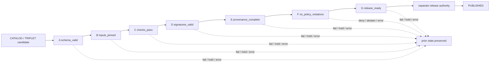

<!-- [KFM_META_BLOCK_V2]
doc_id: kfm://doc/adr-0018-promotion-gate-sequence
title: ADR-0018 — Promotion Gate Sequence
type: adr
adr_id: ADR-0018
version: v1.2
status: proposed
effective_decision_status: proposed
owners:
  - "NEEDS VERIFICATION — architecture stewardship"
  - "NEEDS VERIFICATION — promotion and release stewardship"
  - "NEEDS VERIFICATION — policy, evidence, review, rollback, contracts, schemas, validation, and CI stewardship"
reviewers_required:
  - Architecture steward
  - Governance steward
  - Release steward
  - Policy steward
  - Evidence steward
  - Review and separation-of-duties steward
  - Rollback and correction steward
  - Contracts and schemas stewards
  - Validation and CI stewards
  - Docs steward
created: 2026-05-09
updated: 2026-07-24
policy_label: public
truth_posture: cite-or-abstain
responsibility_root: docs/
current_path: docs/adr/ADR-0018-promotion-gate-sequence.md
supersedes: []
superseded_by: null
evidence_snapshot:
  repository: bartytime4life/Kansas-Frontier-Matrix
  base_ref: main
  base_commit: d8c20efe5b3e0189f238079c9afd9b70b5c9bb60
  target_prior_blob: d7604ab92b915abaec8d7d9bac3da5d40d51e7f3
  adr_index_blob: cf08fae322ac53426f7394d97897fdb942253049
  adr_readme_blob: f1b5d34a53b6c717832d587de54989ce8192bcaa
  directory_rules_blob: 18653c00ba193a4afaa3e07a0924452807fb98ef
  promotion_workflow_blob: c22941d5e1fad3317f46591705091ef2b6e7d265
  promotion_contract_blob: 42295bfc83a621cf125d33aa821912b426f70bd2
  promotion_release_schema_blob: a2d087a46772cf60e4b9dfb394892690e8a88b31
  promotion_policy_schema_scaffold_blob: f124b2b866450949e415afbb4597ae98531e0ed0
  decision_envelope_schema_blob: 349782c8760f77e432ed1e9239d5ddc2ffe1f9b8
  promotion_fixture_validator_blob: ead33d6c5c073f319627ee42d99c5933c0e370d1
  promotion_fixture_test_blob: 495c76aa9d3a016b7a60831e47c15d3a21efaa0c
  generic_promotion_validator_blob: c2921ba816362d6a1073bd01ed870603a13537cb
  review_validator_blob: e1aa5fcc4b2da4055eb61276a031512512bcb4ca
  promotion_validator_readme_blob: 23b3cd6339f2c953ade044312568338140671d64
  promotion_prerequisites_policy_blob: 782b24af3c0fe28871a58da202a3efdbd5991647
  rollback_required_policy_blob: b2eb37b31b572e1d97d1afbe4babe8200f87df7d
  promotion_runbook_blob: 757f8a07cc35030ceb39f308d5f6dcea6c459fd1
  release_reviews_readme_blob: d927536c39a2102b1f012007fc8de4facb7abd90
  hydrology_promoter_blob: 98ec4d03ec0b41f03a85ee1fcedd5b75b4a2f68e
  hydrology_smoke_decision_blob: 50d611f8ef800863e04eafde0716ed2c45303299
  makefile_blob: 51537af34ee065c2de571134688415042b83b22a
  codeowners_blob: dd2a84aa514d8ecd9208bc347f90f9a2ed37dd61
inspection_boundary: >
  Current-session GitHub reads, bounded repository search, ADR inventory and operating
  contract, Directory Rules, release contracts and schemas, fixtures and tests, validator
  and policy scaffolds, promotion workflow source, runbook, review guidance, Makefile,
  hydrology smoke promoter, and tracked smoke decision. No production policy evaluator,
  signer, release service, public deployment, branch ruleset, audit dashboard, or live
  promotion was exercised.
related:
  - docs/adr/README.md
  - docs/adr/INDEX.md
  - docs/adr/ADR-0001-schema-home--schemas-contracts-v1-is-canonical.md
  - docs/adr/ADR-0011-receipts-vs-proofs-vs-manifests-vs-catalog-separation.md
  - docs/adr/ADR-0015-data-published-_domain_-current-alias-is-governed-by-rollback_card.md
  - docs/adr/ADR-0017-source-descriptor-admission-process.md
  - docs/adr/ADR-0020-abstain-is-a-first-class-decision.md
  - docs/adr/ADR-0021-quarantine-has-structured-exit-paths.md
  - docs/adr/ADR-0024-steward-separation-of-duties-for-release.md
  - docs/adr/ADR-0025-public-client-never-reads-canonical-internal-stores.md
  - docs/architecture/directory-rules.md
  - docs/runbooks/PROMOTION_RUNBOOK.md
  - .github/workflows/promotion-gate.yml
  - contracts/release/promotion_decision.md
  - schemas/contracts/v1/release/promotion_decision.schema.json
  - schemas/contracts/v1/runtime/decision_envelope.schema.json
  - fixtures/release/promotion_decision/README.md
  - tools/validators/release/validate_promotion_decision.py
  - tools/validators/validate_promotion_gate.py
  - tools/validators/validate_review_record.py
  - tools/validators/promotion_gate/README.md
  - tests/release/test_promotion_decision_schema.py
  - policy/promotion/promotion_prerequisites.rego
  - policy/promotion/rollback_card_required.rego
  - release/reviews/README.md
  - pipelines/domains/hydrology/promote.py
  - release/promotion_decisions/hydrology/run-local-smoke.json
  - Makefile
tags: [kfm, adr, promotion, release, gates, workflow-hold, fail-closed, evidence, policy, review, rollback, publication]
notes:
  - "v1.2 is a same-path repository-grounded modernization; it preserves effective status proposed and does not accept ADR-0018."
  - "The current promotion-gate workflow is a four-job read-only readiness and hold workflow, not an implementation of the proposed seven-gate sequence."
  - "The current PromotionDecision schema exercises shape only and uses APPROVE, DENY, ABSTAIN; the DecisionEnvelope schema uses ANSWER, ABSTAIN, DENY, ERROR. These vocabularies must remain separate."
  - "The proposed per-gate DecisionGate and PromotionReceipt schemas are not present at the paths named by v1; no receipt, proof, manifest, or release authority is inferred."
  - "The tracked hydrology promoter and smoke decision are explicit scaffolds with automation-smoke approval and unresolved evidence/rollback references; CI intentionally does not execute the promoter."
[/KFM_META_BLOCK_V2] -->

<a id="top"></a>

# ADR-0018 — Promotion Gate Sequence

> **Proposed decision.** Define one ordered, fail-closed promotion-evaluation sequence for the final governed transition from `CATALOG / TRIPLET` toward `PUBLISHED`, while keeping lifecycle gates, policy outcomes, gate-runner results, review records, `PromotionDecision`, receipts, proofs, manifests, and publication authority distinct.

[](#status)
[](#current-repository-evidence)
[](#current-implementation-maturity)
[](#current-repository-evidence)
[](#current-implementation-maturity)
[](#authority-and-publication-boundary)

> [!IMPORTANT]
> **Identity is confirmed; acceptance is not.** [`docs/adr/INDEX.md`](./INDEX.md) uniquely assigns `ADR-0018` to this exact file and records both source metadata and effective decision status as `proposed`. Editing this record, merging a pull request, or passing the ADR index validator does not accept the decision.

> [!CAUTION]
> **The current repository does not run seven promotion gates.** The tracked [`promotion-gate` workflow](../../.github/workflows/promotion-gate.yml) has four read-only readiness jobs. It validates selected doctrine and `PromotionDecision` shape fixtures, then confirms that review and promotion implementation remain held. It emits no release decision, receipt, proof, manifest, rollback card, or public artifact.

> [!WARNING]
> **A schema-valid `APPROVE` object is not approval.** The tracked hydrology promoter is a stub that writes an automation-approved smoke decision whose evidence and rollback paths are unresolved. Current CI deliberately does not execute it.

**Quick navigation:** [Status](#status) · [Evidence](#evidence-boundary) · [Context](#context) · [Decision](#decision) · [Sequence](#proposed-a-g-sequence) · [Vocabularies](#decision-and-status-vocabularies) · [Identity](#identity-and-join-contract) · [Failure](#failure-hold-and-quarantine) · [Authority](#authority-and-publication-boundary) · [Current evidence](#current-repository-evidence) · [Maturity](#current-implementation-maturity) · [Convergence](#implementation-and-convergence-plan) · [Acceptance](#acceptance-gates) · [Consequences](#consequences) · [Alternatives](#alternatives-considered) · [Risks](#risk-and-open-question-ledger) · [Rollback](#rollback-and-supersession) · [Verification](#verification-checklist) · [References](#references)

---

<a id="status"></a>

## Status

| Field | Current value |
|---|---|
| **ADR ID** | `ADR-0018` — unique and confirmed in [`INDEX.md`](./INDEX.md) |
| **Tracked path** | `docs/adr/ADR-0018-promotion-gate-sequence.md` |
| **Source metadata** | `proposed` |
| **Effective decision status** | `proposed` |
| **Decision class** | Repository-wide promotion-evaluation ordering and vocabulary boundary |
| **Current repository maturity** | PromotionDecision shape checks and explicit readiness holds; no accepted gate runtime |
| **Implementation effect of this revision** | Documentation only |
| **Publication effect** | None |
| **Supersedes / superseded by** | None / none |

### Acceptance versus implementation

Two states remain independent:

1. **ADR acceptance** would approve the sequence, responsibility split, and vocabulary boundaries described here.
2. **Implementation graduation** would require accepted contracts and schemas, meaningful policy, deterministic fixtures, executable validators, accountable review, receipt/proof placement, release assembly, rollback validation, CI wiring, and observed no-public-write behavior.

An accepted ADR without those implementation gates would be doctrine, not proof that promotion is operational. Conversely, code, a workflow, a fixture pass, or a tracked `PromotionDecision` cannot accept this ADR.

[Back to top](#top)

---

<a id="evidence-boundary"></a>

## Evidence boundary

This revision is grounded in repository bytes at `main@d8c20efe5b3e0189f238079c9afd9b70b5c9bb60`.

### Truth labels

| Label | Meaning in this ADR |
|---|---|
| **CONFIRMED** | Verified from current repository files, workflow source, tests, or exact readback |
| **PROPOSED** | Architecture, object, field, path, migration, or implementation target not accepted or operationally proved |
| **NEEDS VERIFICATION** | Checkable state not verified strongly enough to act as fact |
| **UNKNOWN** | Not resolved by the inspected surfaces |
| **CONFLICTED** | Tracked surfaces make incompatible claims that require a reviewed resolution |
| **HELD** | Current workflow intentionally blocks graduation while preserving a green readiness-check path |

### What was inspected

- ADR inventory and operating contract;
- Directory Rules placement doctrine;
- this ADR’s prior bytes;
- current promotion workflow;
- `PromotionDecision` contract, release schema, fixtures, validator, and test;
- runtime `DecisionEnvelope` schema;
- the empty policy-side `promotion_decision` schema scaffold;
- generic promotion and review validator stubs;
- promotion validator routing README;
- promotion policy stubs;
- release-review guidance;
- promotion runbook;
- Makefile target state;
- hydrology promotion stub and tracked smoke decision;
- neighboring ADRs for artifact separation, abstention, quarantine, rollback, public boundaries, and separation of duties.

### What this evidence cannot prove

This revision does not prove:

- an accepted A–G gate contract;
- a `DecisionGate` or `PromotionReceipt` schema;
- a promotion policy bundle;
- evidence resolution;
- signature verification;
- accountable release review;
- separation-of-duties enforcement;
- rollback-card usability;
- release-manifest closure;
- deterministic replay;
- branch-protection requirements;
- a successful promotion, release, rollback, correction, or publication.

[Back to top](#top)

---

<a id="context"></a>

## Context

KFM’s lifecycle invariant remains:

```text
RAW -> WORK / QUARANTINE -> PROCESSED -> CATALOG / TRIPLET -> PUBLISHED
```

Promotion is a governed state transition, not a file move, merge, deployment, tile build, generated answer, or placement under a familiar path.

The repository currently carries several related but different sequences:

| Surface | Current role | Current evidence |
|---|---|---|
| [`PROMOTION_RUNBOOK.md`](../runbooks/PROMOTION_RUNBOOK.md) | Human lifecycle operating procedure | Uses lettered lifecycle stages from admission through release |
| [`promotion-gate.yml`](../../.github/workflows/promotion-gate.yml) | Read-only CI readiness and hold workflow | Four jobs; no promotion or public write |
| [`PromotionDecision`](../../contracts/release/promotion_decision.md) | Release-transition decision object | Shape contract and proposed schema exist |
| [`DecisionEnvelope`](../../schemas/contracts/v1/runtime/decision_envelope.schema.json) | Policy/runtime decision envelope | Proposed schema with `ANSWER / ABSTAIN / DENY / ERROR` |
| Release-review guidance | Human review records and recommendations | README exists; governed review records are not established |
| This ADR | Proposed canonical promotion-evaluation sequence | Not accepted or implemented |

The earlier ADR text treated these as if they were already one operational system. Current repository evidence requires a stricter separation.

### Scope

This ADR is limited to the **promotion-evaluation packet for a candidate already at `CATALOG / TRIPLET` and seeking the governed transition toward `PUBLISHED`**.

It does not rename the lifecycle transitions in the promotion runbook. It does not convert source admission, normalization, processing, catalog closure, correction, or rollback into the seven gates below.

### Forces

| Force | Architectural pressure |
|---|---|
| Auditability | Each consequential concern must have an inspectable result and stable input identity |
| Fail-closed behavior | Missing or unverifiable support must block continuation |
| Vocabulary stability | Contracts must not depend on temporary CI job names |
| Current compatibility | Existing `PromotionDecision`, `DecisionEnvelope`, workflow check names, and release records must not be silently redefined |
| Separation of duties | Review and release authority must remain independent from validation and authorship where required |
| Artifact separation | Receipts, proofs, manifests, decisions, catalog records, and published artifacts must not collapse |
| Reversibility | Every material transition requires correction and rollback support |
| Buildability | The target sequence must be implementable through small, testable, reversible changes |

[Back to top](#top)

---

<a id="decision"></a>

## Decision

If accepted, KFM will adopt the following rules.

1. The final publication-facing promotion evaluation uses one ordered logical sequence, Gates **A–G**.
2. Gate names describe **outcomes being established**, not CI actions.
3. The sequence is a target contract; current workflow job names are not retroactively relabeled as completed gates.
4. Every gate consumes explicit inputs and produces a deterministic gate record or an explicitly held/error result.
5. A gate may delegate to schemas, validators, policy evaluators, evidence resolvers, signing verifiers, review systems, and release tools, but it cannot absorb their authority.
6. No gate may publish. Gate G may establish release readiness only; a separately authorized release action performs the lifecycle transition.
7. A candidate may not continue when any required gate record is missing, stale, contradictory, malformed, unsupported, or unresolved.
8. Promotion-level decisions use the release `PromotionDecision` vocabulary. Policy/runtime decisions use `DecisionEnvelope` vocabulary. Gate-runner status is a third axis.
9. Review and separation-of-duties obligations are explicit inputs to release readiness; they are not inferred from CODEOWNERS, workflow identity, or an automation username.
10. The audit packet must enumerate every required gate and bind to the candidate, policy, evidence, review, rollback, and release objects through stable identifiers and digests. The final artifact family and schema name remain an acceptance gate rather than an assumed `PromotionReceipt`.

[Back to top](#top)

---

<a id="proposed-a-g-sequence"></a>

## Proposed A–G sequence

| Gate | Proposed outcome name | Establishes | Minimum evidence before `PASS` | Current implementation |
|:---:|---|---|---|---|
| **A** | `schema_valid` | Candidate and required control objects conform to accepted, pinned schemas | Schema identifiers, versions, validation report, canonical input digest | **PARTIAL:** `PromotionDecision` shape fixtures are tested; no full candidate packet schema |
| **B** | `inputs_pinned` | Candidate inputs, source roles, rights, versions, and digests are fixed and reproducible | Candidate identity, `run_id`, source descriptors/heads, rights posture, content/spec digests | **NOT ESTABLISHED** |
| **C** | `checks_pass` | Required domain, join, spatial, temporal, sensitivity-transform, catalog, and public-contract checks pass | Named validators, versions, deterministic reports, negative-path coverage | **NOT ESTABLISHED as a promotion gate** |
| **D** | `signatures_valid` | Required receipts or attestations are authentic and bind the evaluated bytes | Signed subject digests, verifier identity/version, verification result | **NOT ESTABLISHED** |
| **E** | `provenance_complete` | Required `EvidenceRef` values resolve to admissible `EvidenceBundle` or proof support and lineage closes | Evidence resolver report, source-role preservation, supersession/correction lineage | **NOT ESTABLISHED** |
| **F** | `no_policy_violations` | Pinned policy evaluates the exact candidate packet and yields no blocking decision or unmet obligation | Policy bundle identity/digest, decision envelope, reasons, obligations, sensitivity/rights result | **HELD:** policy files are greenfield stubs |
| **G** | `release_ready` | Review, separation of duties, manifest relationship, rollback target, correction path, and public-boundary prerequisites are complete | Review record, final `PromotionDecision` packet, release-manifest relation, rollback validation, no unresolved holds | **HELD:** review and generic gate validators are stubs |

### Ordering



Cross-gate parallelism is not normative. Independent subchecks inside one gate may run in parallel when they consume identical pinned inputs and their aggregation is deterministic.

### Gate records

The repository does not currently contain the proposed per-gate schema. Acceptance requires a machine contract that, at minimum, binds:

```json
{
  "gate": "A",
  "name": "schema_valid",
  "gate_result": "PASS",
  "promotion_id": "promo:hydrology:example",
  "run_id": "run-example",
  "policy_decision_id": null,
  "input_digest": "sha256:...",
  "spec_hash": "sha256:...",
  "evidence_refs": [],
  "reasons": [],
  "obligations": [],
  "evaluated_at": "2026-07-24T00:00:00Z",
  "evaluator": {
    "name": "example-validator",
    "version": "v1"
  }
}
```

This is an **illustrative target shape**, not a current contract. The accepted schema must resolve field names, required identifiers, canonicalization, format checking, evaluator identity, amendment rules, and compatibility before implementation.

[Back to top](#top)

---

<a id="decision-and-status-vocabularies"></a>

## Decision and status vocabularies

The repository already has distinct vocabularies. This ADR must preserve them.

| Vocabulary | Current or proposed values | Owner | Use |
|---|---|---|---|
| `PromotionDecision.decision` | `APPROVE`, `DENY`, `ABSTAIN` | Release contract/schema | Final transition decision |
| `DecisionEnvelope.outcome` | `ANSWER`, `ABSTAIN`, `DENY`, `ERROR` | Runtime/policy contract/schema | Policy or governed-runtime evaluation |
| Proposed `gate_result` | `PASS`, `FAIL`, `HOLD`, `ERROR` | Future gate-record schema | Whether one gate may continue |
| Workflow/job status | GitHub job conclusion plus documented `WORKFLOW_HOLD` | CI workflow | Readiness execution state |
| Release-review outcome | `READY_FOR_DECISION`, `HOLD_FOR_EVIDENCE`, and related guidance terms | Review-record contract or guidance | Human review routing |

### Required mappings

| Gate condition | Gate result | Policy outcome, when policy ran | Promotion effect |
|---|---|---|---|
| All required checks established | `PASS` | usually `ANSWER` | Continue |
| Deterministic blocking defect | `FAIL` | may be `DENY` | Block; final decision may be `DENY` |
| Evidence, review, or support unresolved | `HOLD` | usually `ABSTAIN` | Preserve prior state; final decision may be `ABSTAIN` |
| Evaluator or trust machinery failed | `ERROR` | `ERROR` where a DecisionEnvelope exists | Block; do not fabricate `APPROVE` or a false denial |

A workflow success that proves a hold condition is visible is not a gate `PASS`. A schema-valid `APPROVE` example is not a policy `ANSWER`, reviewer approval, or release authorization.

### Current schema conflict

Two tracked schemas use the name `promotion_decision`:

- `schemas/contracts/v1/release/promotion_decision.schema.json` is a substantive, closed, proposed release-transition schema.
- `schemas/contracts/v1/policy/promotion_decision.schema.json` is an empty, permissive proposed scaffold with no contract document.

This ADR does not silently reconcile them. The release schema is the observed shape exercised by the promotion workflow. The policy-side scaffold must not become a competing authority. Acceptance requires an explicit disposition: retire it, convert it to a compatibility pointer, or define a genuinely distinct object with a distinct name.

[Back to top](#top)

---

<a id="identity-and-join-contract"></a>

## Identity and join contract

The current repository exposes three relevant identities:

| Field | Current owner | Meaning |
|---|---|---|
| `PromotionDecision.id` | Release schema | Stable transition-decision identity; hydrology has a conditional `promo:hydrology:<suffix>` pattern |
| `PromotionDecision.run_id` | Release schema | Candidate run being evaluated |
| `DecisionEnvelope.decision_id` | Runtime schema | Policy/runtime evaluation identity |

The prior version of this ADR claimed one `decision_id` was already the cross-artifact join key. Current contracts do not establish that.

### Proposed convergence rule

Before acceptance, the gate packet must adopt an explicit relationship:

```text
promotion_id = PromotionDecision.id
run_id       = candidate run identity
decision_id  = each policy/runtime DecisionEnvelope identity
```

Every gate record must carry `promotion_id` and `run_id`. A gate that invokes policy also carries the exact `decision_id`. A final `PromotionDecision` references the gate-report set by stable digest or accepted reference field once the release contract is revised.

No implementation may guess that the three identifiers are interchangeable. Deterministic derivation is permitted only after the contract, schema, collision rules, canonicalization, and migration behavior are accepted.

[Back to top](#top)

---

<a id="failure-hold-and-quarantine"></a>

## Failure, hold, and quarantine

### Core rule

A failed or unresolved promotion evaluation preserves the candidate’s prior lifecycle state. It does not copy bytes into `PUBLISHED`, update a public alias, expose a public DTO, or cause a renderer or AI surface to infer release.

| Condition | Required response |
|---|---|
| Schema or deterministic validation defect | `FAIL`; record reasons; preserve prior state |
| Evidence or source cannot resolve | `HOLD` / policy `ABSTAIN`; preserve prior state |
| Rights, sensitivity, access, or release policy denies | `FAIL` / policy `DENY`; preserve prior state |
| Evaluator, signer, registry, or resolver error | `ERROR`; preserve prior state; record operator-visible diagnostic |
| Human review required | `HOLD`; create or require accountable review record; no same-actor shortcut where separation applies |
| Rollback target or release relationship missing | `FAIL` or `HOLD` according to accepted policy; no release |
| Public write observed during dry-run | `ERROR` and correction investigation; no success claim |

### Quarantine versus review hold

Not every failed final promotion should physically move to `data/quarantine/`. The candidate may remain at `CATALOG / TRIPLET` with a release hold when the bytes are valid but release support is incomplete.

Use `QUARANTINE` when the candidate or its support is unsafe, malformed, rights-unclear, sensitivity-unsafe, or otherwise requires lifecycle isolation. Use a release-review hold when the candidate remains admissible at its current phase but lacks release support.

ADR-0021 governs structured quarantine exits. Release-review guidance owns review routing. This ADR does not collapse them.

### Amendment and replay

A held evaluation must not be silently edited. The accepted gate schema must decide whether review completion:

- emits a new gate record under the same `promotion_id`;
- emits a superseding `promotion_id`; or
- uses an append-only amendment object.

Until that choice is accepted, no implementation may mutate prior gate records in place.

[Back to top](#top)

---

<a id="authority-and-publication-boundary"></a>

## Authority and publication boundary

| Responsibility | Authority home | Role in this ADR |
|---|---|---|
| Architecture decision | `docs/adr/` | Records the proposed sequence |
| Semantic meaning | `contracts/` | Defines PromotionDecision, ReviewRecord, ReleaseManifest, RollbackCard, and future gate-report meaning |
| Machine shape | `schemas/contracts/v1/` | Defines accepted JSON shapes |
| Policy admissibility | `policy/` | Produces explicit decisions and obligations |
| Validator implementation | `tools/validators/`, package/test-owned lanes | Checks explicit inputs; does not approve release |
| Fixtures | `fixtures/` and `tests/fixtures/` by responsibility | Prove bounded behavior; never authority |
| Evidence and proofs | `data/proofs/` and evidence authorities | Resolve support; do not approve release |
| Receipts | `data/receipts/` | Record process execution; do not replace proof or decision |
| Review records | `release/reviews/` or accepted review home | Bind accountable review and recommendations |
| Release decisions and manifests | `release/` | Own release-governance state |
| Lifecycle data | `data/<phase>/` | Preserve phase-visible material |
| Public clients | Governed API and released surfaces | Consume only released public-safe artifacts |
| CI | `.github/workflows/` | Orchestrates checks with least privilege; never release authority by itself |

A promotion gate may establish readiness. Only a separately authorized release action may perform the public transition. A public client must never inspect candidate paths, workflow artifacts, fixture paths, internal stores, or generated text to infer release state.

### Audit packet versus artifact-family authority

The complete gate set needs one inspectable index or report. The earlier ADR called it `PromotionReceipt`, but ADR-0011 requires receipts, proofs, manifests, catalog records, and decisions to remain distinct.

Before acceptance, the project must decide whether the gate index is:

- a process receipt;
- a validation report;
- a proof index;
- a release packet index; or
- another explicitly named contract.

Its home follows its responsibility. The name `PromotionReceipt` is not accepted merely because it appeared in prior documentation.

[Back to top](#top)

---

<a id="current-repository-evidence"></a>

## Current repository evidence

| Surface | Status | Safe conclusion |
|---|---:|---|
| ADR identity and index | **CONFIRMED** | Exact path and ID exist; status remains proposed |
| Promotion workflow | **CONFIRMED bounded** | Four read-only readiness jobs; no seven-gate runtime or public write |
| Doctrine-artifact checks | **CONFIRMED narrow** | Validate selected prerequisite and descriptor fixture behavior |
| PromotionDecision contract | **CONFIRMED draft / PROPOSED** | Defines release-transition meaning |
| Release PromotionDecision schema | **CONFIRMED substantive / PROPOSED** | Closed shape with `APPROVE / DENY / ABSTAIN` |
| PromotionDecision fixtures/test | **CONFIRMED narrow** | Non-empty valid/invalid shape fixtures are exercised |
| Runtime DecisionEnvelope schema | **CONFIRMED / PROPOSED** | Defines `ANSWER / ABSTAIN / DENY / ERROR` policy/runtime shape |
| Policy-side Promotion Decision schema | **CONFIRMED permissive scaffold** | Empty shape; must not compete with release schema |
| Generic promotion validator | **CONFIRMED placeholder** | Raises `NotImplementedError` |
| Review validator | **CONFIRMED placeholder** | Raises `NotImplementedError` |
| Promotion validator directory | **CONFIRMED documentation-only** | README and `.gitkeep`; workflow guards this state |
| Promotion policy modules | **CONFIRMED greenfield stubs** | No meaningful prerequisite or rollback policy |
| Make `publish-check` | **CONFIRMED TODO-only** | Zero exit would not prove promotion |
| Release review lane | **CONFIRMED guidance-only at parent** | No governed review record established by inspected inventory |
| Hydrology promoter | **CONFIRMED stub** | Emits automation-smoke `APPROVE` without resolving support |
| Tracked hydrology decision | **CONFIRMED smoke artifact** | Schema-shaped object; not admissible release evidence |
| Proposed DecisionGate schema | **NOT FOUND** | No per-gate machine contract at prior path |
| Proposed PromotionReceipt schema | **NOT FOUND** | No accepted seven-gate receipt contract |
| End-to-end release closure | **NOT ESTABLISHED** | No evidence, policy, review, rollback, manifest, or public transition proof |

### Material corrections in v1.2

- Confirms the ADR identity and removes obsolete “mounted repo unknown” language.
- Replaces the proposed `.github/workflows/promotion.yml` claim with the actual `.github/workflows/promotion-gate.yml`.
- States that current workflow jobs are readiness checks, not Gates A–G.
- Reconciles `APPROVE / DENY / ABSTAIN` with `ANSWER / ABSTAIN / DENY / ERROR` by keeping them separate.
- Narrows the prior single-`decision_id` claim to a proposed explicit identity crosswalk.
- Records the absent DecisionGate and PromotionReceipt schemas.
- Records the empty policy-side Promotion Decision schema scaffold.
- Records the placeholder validators, TODO `publish-check`, policy stubs, review hold, and hydrology smoke risk.
- Separates quarantine from a release-review hold.
- Preserves A–G as a proposed architecture target without presenting it as current behavior.

[Back to top](#top)

---

<a id="current-implementation-maturity"></a>

## Current implementation maturity

```text
shape fixtures present
        |
        v
read-only readiness workflow
        |
        v
WORKFLOW_HOLD
        |
        +--> no accepted generic promotion validator
        +--> no review validator
        +--> no meaningful promotion policy
        +--> no gate-record schema
        +--> no gate-report/receipt schema
        +--> no accountable review record
        +--> unresolved smoke decision support
        +--> no release or public write
```

### Current workflow mapping

| Current job | What it actually checks | A–G relationship |
|---|---|---|
| `doctrine-artifact-prereq` | Proves missing required doctrine artifacts remain visible and fail closed | Prerequisite outside the proposed sequence |
| `doctrine-artifact-schema` | Checks non-vacuous DoctrineArtifactDescriptor fixtures and selected shape behavior | Prerequisite outside the proposed sequence |
| `promotion-prerequisites` | Checks non-empty PromotionDecision fixture sets, pinned schema metadata, enum, and closed shape | Partial Gate A evidence only |
| `review-records-present` | Confirms review/promotion scaffolds remain placeholders and the smoke promoter is not executed | Explicit implementation hold; not Gate G pass |

The workflow’s green result means the repository remains safely held and drift-sensitive. It does not mean promotion prerequisites are satisfied.

### Current dangerous shortcut

The hydrology stub:

- always writes `"decision": "APPROVE"`;
- names `automation-smoke` as reviewer;
- references evidence and rollback paths that do not resolve;
- writes directly under `release/promotion_decisions/`.

The workflow intentionally inspects and holds this state rather than executing it. Any attempt to graduate the promoter requires a separate implementation change with real evidence resolution, policy, review, rollback, fixtures, tests, and release authority.

[Back to top](#top)

---

<a id="implementation-and-convergence-plan"></a>

## Implementation and convergence plan

Use the smallest reversible sequence.

### Phase 0 — Preserve the hold

- Keep ADR status `proposed`.
- Keep the promotion workflow read-only.
- Do not run the hydrology promoter in CI.
- Do not treat the smoke decision as release evidence.
- Keep public clients isolated from candidate and release-internal paths.

### Phase 1 — Resolve contracts and vocabulary

1. Decide the authoritative PromotionDecision schema and disposition the empty policy-side scaffold.
2. Define or revise semantic contracts for:
   - gate record;
   - gate-set index/report;
   - ReviewRecord binding;
   - rollback verification result;
   - release-manifest relationship.
3. Define the identity crosswalk among `PromotionDecision.id`, `run_id`, and `DecisionEnvelope.decision_id`.
4. Define canonical gate results and mappings without changing existing enums silently.
5. Update the promotion runbook so lifecycle stage letters cannot be confused with promotion evaluation gates.

### Phase 2 — Land machine shapes and fixtures

- Add closed schemas under the accepted schema home.
- Add non-vacuous valid and invalid fixtures for every gate.
- Add expected diagnostic or reason-code assertions.
- Add format checking where schemas declare formats.
- Add canonicalization and digest tests.
- Add compatibility tests for existing PromotionDecision fixtures.

### Phase 3 — Implement independent consumers

- Implement the generic promotion packet validator.
- Implement ReviewRecord validation and subject binding.
- Implement evidence-resolution checks.
- Implement meaningful default-deny policy.
- Implement signature and digest verification only after signer and trust roots are accepted.
- Implement rollback-target validation without executing a public rollback.
- Emit reports to accepted QA or trust-object homes according to their semantics.

### Phase 4 — Wire a no-public-write dry run

- Replace readiness-only jobs deliberately; do not rename them into false gates.
- Preserve stable workflow check names when repository rules may depend on them, or migrate rules explicitly.
- Run A–G on one synthetic domain thin slice.
- Assert no write to `data/published/`, release aliases, public services, or deployment surfaces.
- Upload only bounded QA artifacts; do not create trust-shaped artifacts in `artifacts/`.
- Demonstrate failure, hold, error, and negative-path behavior for every gate.

### Phase 5 — Accountable review and release integration

- Bind accepted ReviewRecord identity and separation-of-duties rules.
- Require resolved rollback support.
- Bind the gate-set digest to a final PromotionDecision.
- Assemble or validate the ReleaseManifest relationship.
- Keep release execution separate from validation.
- Require correction and rollback drills before public maturity.

### Phase 6 — Acceptance review

Only after the acceptance gates below pass may ADR-0018 move from `proposed` to `accepted`. Update this record and [`INDEX.md`](./INDEX.md) together. A green workflow alone cannot perform that transition.

[Back to top](#top)

---

<a id="acceptance-gates"></a>

## Acceptance gates

- [ ] ADR identity, owners, reviewers, and decision quorum are accepted.
- [ ] A–G names and ordering are reconciled with `PROMOTION_RUNBOOK.md`.
- [ ] PromotionDecision schema authority is resolved; the policy-side scaffold is retired, redirected, or distinctly renamed.
- [ ] Gate record and gate-set index/report semantic contracts exist.
- [ ] Closed schemas and meaningful valid/invalid fixtures exist for those contracts.
- [ ] Identity mapping among `PromotionDecision.id`, `run_id`, and `DecisionEnvelope.decision_id` is explicit and tested.
- [ ] Gate-result, policy-outcome, promotion-decision, review-outcome, and workflow-status vocabularies remain separate.
- [ ] Promotion policy contains meaningful fail-closed rules and negative tests.
- [ ] Evidence resolution, source-role preservation, and lineage checks are implemented.
- [ ] ReviewRecord validation and separation-of-duties enforcement are implemented at the required maturity.
- [ ] Rollback target and release-manifest relationship checks are implemented.
- [ ] Every gate has positive, negative, hold, and error coverage where semantically applicable.
- [ ] The dry run proves zero public writes.
- [ ] Gate records and reports have accepted output homes and retention rules.
- [ ] Replay is deterministic for pinned inputs.
- [ ] Correction and rollback paths are exercised.
- [ ] Branch/ruleset migration for workflow check names is verified.
- [ ] The hydrology smoke promoter is removed, quarantined as fixture-only, or replaced with governed behavior.
- [ ] The ADR validator and tests pass after the reviewed status change.
- [ ] Human reviewers explicitly accept the ADR; CODEOWNERS routing alone is insufficient.

[Back to top](#top)

---

<a id="consequences"></a>

## Consequences

### Positive

- One target ordering for publication-facing promotion concerns.
- Clear separation between current readiness CI and future gate runtime.
- Stable boundaries among policy outcomes, gate results, and release decisions.
- Explicit evidence, review, rollback, and public-boundary prerequisites.
- Incremental implementation path with preserved holds.
- Better auditability without granting authority to workflow artifacts.
- Reduced risk that a schema-valid `APPROVE` object is mistaken for release approval.

### Costs

- Existing documents using alternate A–G lifecycle or gate vocabularies require reconciliation.
- New contracts and schemas are needed before implementation.
- The policy-side Promotion Decision scaffold requires disposition.
- Identity crosswalk and amendment semantics require design work.
- Review, evidence resolution, signature verification, rollback validation, and release integration are separate implementation efforts.
- Stable workflow check names may constrain CI refactoring.
- A complete dry run is more expensive than a shape test.

### Tradeoff

This ADR prefers visible incompleteness and a safe hold over a persuasive but ungrounded “seven gates implemented” claim. The cost is slower graduation; the benefit is that every release-relevant assertion remains inspectable and reversible.

[Back to top](#top)

---

<a id="alternatives-considered"></a>

## Alternatives considered

| Alternative | Disposition |
|---|---|
| Treat the current four workflow jobs as the seven gates | Rejected. Job names and checks do not cover A–G and explicitly preserve holds |
| Keep one monolithic promotion validator | Rejected. It hides failure location and encourages authority collapse |
| Use runtime `ANSWER / ABSTAIN / DENY / ERROR` as PromotionDecision values | Rejected. Current release schema uses `APPROVE / DENY / ABSTAIN` |
| Treat a schema-valid PromotionDecision as sufficient | Rejected. Shape does not resolve evidence, policy, review, rollback, or release |
| Use the hydrology smoke promoter as the first implementation | Rejected in current form. It auto-approves with unresolved support |
| Let Gate G publish directly | Rejected. Validation and release authority remain separate |
| Route every failed promotion to physical quarantine | Rejected. Valid catalog candidates may need a release hold rather than lifecycle isolation |
| Preserve one universal `decision_id` without contract changes | Rejected. Current schemas expose distinct identities |
| Require a `PromotionReceipt` immediately | Deferred. Artifact-family semantics and home must be resolved first |
| Run all gates in parallel | Rejected as a normative model; within-gate parallelism remains allowed |
| Rely on manual approval alone | Rejected. Human review is an auditable input, not a replacement for deterministic checks |
| Accept ADR-0018 now and implement later | Rejected. Acceptance requires reviewed architecture and explicit migration gates, not runtime completion, but current contract conflicts remain material |

[Back to top](#top)

---

<a id="risk-and-open-question-ledger"></a>

## Risk and open-question ledger

| ID | Status | Question or risk | Required next evidence |
|---|---|---|---|
| `ADR18-R1` | **CONFLICTED** | PromotionDecision schema exists in substantive release and empty policy locations | Architecture/contracts/schema review and migration decision |
| `ADR18-R2` | **OPEN** | Gate-set index is called `PromotionReceipt`, report, proof index, or release packet | ADR-0011-aligned semantic contract |
| `ADR18-R3` | **OPEN** | How gate records bind PromotionDecision and DecisionEnvelope identities | Contract, schema, deterministic identity tests |
| `ADR18-R4` | **OPEN** | Whether held review appends under one promotion ID or creates a superseding ID | Review and correction contract |
| `ADR18-R5` | **HELD** | Promotion/review validators are placeholders | Implemented CLIs, fixtures, tests, finite exits |
| `ADR18-R6` | **HELD** | Policy files contain no real promotion rules | Accepted bundle, reason codes, obligations, policy tests |
| `ADR18-R7` | **HELD** | Hydrology smoke decision auto-approves unresolved references | Remove/replace scaffold; governed thin-slice test |
| `ADR18-R8` | **NEEDS VERIFICATION** | Release review record schema and actual accountable records | Review contract/schema, subject binding, SoD tests |
| `ADR18-R9` | **NEEDS VERIFICATION** | Signature and attestation trust roots | Signing ADR/standard, pinned verifier, offline fixtures |
| `ADR18-R10` | **NEEDS VERIFICATION** | ReleaseManifest and rollback closure maturity | Contract/schema/validator/drill evidence |
| `ADR18-R11` | **NEEDS VERIFICATION** | Rulesets depend on current workflow job names | Repository ruleset inspection |
| `ADR18-R12` | **OPEN** | Reconcile runbook lifecycle gate letters with A–G promotion-evaluation letters | Runbook/ADR coordinated change |
| `ADR18-R13` | **OPEN** | Gate H/I proposals from the prior text | Decide only after A–G contract exists; do not preallocate authority |
| `ADR18-R14` | **UNKNOWN** | Production release service, signer, audit store, and replay environment | Operational evidence outside this documentation update |

[Back to top](#top)

---

<a id="rollback-and-supersession"></a>

## Rollback and supersession

This revision is documentation-only and keeps the ADR proposed.

### Roll back this edit

- Revert the documentation commit; or
- restore prior blob `d7604ab92b915abaec8d7d9bac3da5d40d51e7f3`.

That rollback changes no workflow, contract, schema, fixture, policy, validator, review, release object, data, or public state.

### Supersede the decision

If a later reviewed ADR changes the gate names, ordering, identity model, or authority split:

1. create a successor ADR;
2. accept the successor through explicit review;
3. mark ADR-0018 `superseded`;
4. add reciprocal links;
5. update [`INDEX.md`](./INDEX.md);
6. migrate contracts, schemas, fixtures, workflows, runbooks, records, and rulesets with rollback;
7. preserve historical gate records without rewriting them.

### Implementation rollback

Any future gate implementation must preserve:

- a feature flag or non-public dry-run mode;
- prior workflow check compatibility or reviewed ruleset migration;
- deterministic fixture replay;
- no-public-write assertions;
- removal of newly emitted trust-shaped QA artifacts from incorrect homes;
- restoration of the prior held state if evidence, policy, review, or rollback checks regress.

[Back to top](#top)

---

<a id="verification-checklist"></a>

## Verification checklist

| Check | Result |
|---|---|
| ADR identity and exact path | **CONFIRMED** |
| ADR status | **CONFIRMED proposed** |
| Same-path documentation update | **PASS** |
| Directory Rules responsibility | **CONFIRMED** — `docs/adr/` owns decision records |
| Current workflow source | **CONFIRMED** |
| Seven-gate runtime | **NOT ESTABLISHED** |
| PromotionDecision semantic contract | **CONFIRMED draft / PROPOSED** |
| Release PromotionDecision schema | **CONFIRMED substantive / PROPOSED** |
| PromotionDecision fixtures and shape test | **CONFIRMED narrow** |
| Runtime DecisionEnvelope schema | **CONFIRMED / PROPOSED** |
| Policy-side Promotion Decision schema | **CONFIRMED permissive scaffold** |
| Generic promotion validator | **CONFIRMED placeholder** |
| Review validator | **CONFIRMED placeholder** |
| Promotion policy | **CONFIRMED greenfield stubs** |
| Review records | **NOT ESTABLISHED beyond guidance inventory** |
| Hydrology promoter and smoke decision | **CONFIRMED unsafe scaffold / held** |
| DecisionGate schema | **NOT FOUND at prior proposed path** |
| PromotionReceipt schema | **NOT FOUND at prior proposed path** |
| Local ADR validator and repository tests | **NOT RUN in this update** |
| Workflow execution for this edit | **PENDING after pull request creation** |
| Release or publication | **NOT CLAIMED** |

Remote repository reads establish exact bytes and source relationships. They do not substitute for local validation, workflow logs, policy execution, review records, signer verification, release dry-run, rollback drill, or public-runtime inspection.

[Back to top](#top)

---

<a id="references"></a>

## References

### Governing and adjacent ADR surfaces

- [`docs/adr/README.md`](./README.md)
- [`docs/adr/INDEX.md`](./INDEX.md)
- [`ADR-0001 — Schema Home`](./ADR-0001-schema-home--schemas-contracts-v1-is-canonical.md)
- [`ADR-0011 — Receipts vs Proofs vs Manifests vs Catalog Separation`](./ADR-0011-receipts-vs-proofs-vs-manifests-vs-catalog-separation.md)
- [`ADR-0015 — Published current alias and RollbackCard`](./ADR-0015-data-published-_domain_-current-alias-is-governed-by-rollback_card.md)
- [`ADR-0017 — Source Descriptor Admission`](./ADR-0017-source-descriptor-admission-process.md)
- [`ADR-0020 — Abstain Is a First-Class Decision`](./ADR-0020-abstain-is-a-first-class-decision.md)
- [`ADR-0021 — Structured Quarantine Exit Paths`](./ADR-0021-quarantine-has-structured-exit-paths.md)
- [`ADR-0024 — Steward Separation of Duties for Release`](./ADR-0024-steward-separation-of-duties-for-release.md)
- [`ADR-0025 — Public Client Never Reads Canonical/Internal Stores`](./ADR-0025-public-client-never-reads-canonical-internal-stores.md)
- [`Directory Rules`](../architecture/directory-rules.md)

### Current implementation and documentation evidence

- [`Promotion runbook`](../runbooks/PROMOTION_RUNBOOK.md)
- [`promotion-gate` workflow](../../.github/workflows/promotion-gate.yml)
- [`PromotionDecision` contract](../../contracts/release/promotion_decision.md)
- [`PromotionDecision` release schema](../../schemas/contracts/v1/release/promotion_decision.schema.json)
- [`DecisionEnvelope` runtime schema](../../schemas/contracts/v1/runtime/decision_envelope.schema.json)
- [`PromotionDecision` fixture family](../../fixtures/release/promotion_decision/README.md)
- [`PromotionDecision` fixture validator](../../tools/validators/release/validate_promotion_decision.py)
- [`PromotionDecision` shape test](../../tests/release/test_promotion_decision_schema.py)
- [`Promotion gate` validator index](../../tools/validators/promotion_gate/README.md)
- [`Generic promotion validator` placeholder](../../tools/validators/validate_promotion_gate.py)
- [`Review validator` placeholder](../../tools/validators/validate_review_record.py)
- [`Promotion prerequisites` policy stub](../../policy/promotion/promotion_prerequisites.rego)
- [`Rollback card required` policy stub](../../policy/promotion/rollback_card_required.rego)
- [`Release review lane`](../../release/reviews/README.md)
- [`Hydrology promoter` stub](../../pipelines/domains/hydrology/promote.py)
- [`Hydrology smoke decision`](../../release/promotion_decisions/hydrology/run-local-smoke.json)
- [`Makefile`](../../Makefile)

---

## Last reviewed

**2026-07-24** — repository-grounded review against `main@d8c20efe5b3e0189f238079c9afd9b70b5c9bb60`.

Review again when:

- this ADR changes status;
- the promotion workflow changes its jobs or authority;
- a generic promotion or review validator becomes executable;
- meaningful promotion policy lands;
- a gate-record or gate-set schema is proposed;
- PromotionDecision schema authority is reconciled;
- the hydrology promoter or smoke decision changes;
- governed review records appear;
- release-manifest or rollback validation graduates;
- rulesets or required checks change;
- six months pass without review.

[Back to top](#top)
