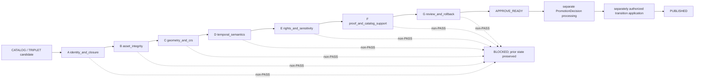

<!-- [KFM_META_BLOCK_V2]
doc_id: kfm://doc/adr-0018-promotion-gate-sequence
title: ADR-0018 — Promotion Gate Sequence
type: adr
adr_id: ADR-0018
version: v1.5
status: proposed
effective_decision_status: proposed
owners:
  - "NEEDS VERIFICATION — architecture stewardship"
  - "NEEDS VERIFICATION — promotion and release stewardship"
  - "NEEDS VERIFICATION — policy, evidence, review, rollback, contracts, schemas, validation, and CI stewardship"
reviewers_required:
  - Architecture steward
  - Governance steward
  - Release steward
  - Policy steward
  - Evidence steward
  - Review and separation-of-duties steward
  - Rollback and correction steward
  - Contracts and schemas stewards
  - Validation and CI stewards
  - Docs steward
created: 2026-05-09
updated: 2026-08-14
policy_label: public
truth_posture: cite-or-abstain
responsibility_root: docs/
owning_root: docs/
responsibility: Record the proposed final promotion-readiness sequence, its finite vocabularies, its object-family boundaries, and the evidence required before a CATALOG/TRIPLET candidate may be considered ready for a separately authorized transition toward PUBLISHED.
current_path: docs/adr/ADR-0018-promotion-gate-sequence.md
supersedes: []
superseded_by: null
evidence_snapshot:
  repository: bartytime4life/Kansas-Frontier-Matrix
  base_ref: main
  base_commit: 9d924c665073263f2cbf376d2bf29e7b9f252b06
  target_prior_blob: cb76d7af6cf6972cada2017b61d4081bc916ab4b
  adr_index_blob: 938c5894c36b99e14810918e2c550ab0e92d53b1
  adr_readme_blob: 793015c38f4066c2c23753d4e3dd26bcc890279d
  directory_rules_blob: fd49a0b83e55cef52c1124281f093e263526898d
  promotion_workflow_blob: 9b567aad17de2a7419a2a0238386745c1cb5c11c
  promotion_gate_validator_blob: 143a8a9720d052870ca0adaa48894e4ce633d9d1
  promotion_gate_readme_blob: e729df0cc007e8cf0d9811afc25ec1f5ffbdffdd
  promotion_gate_test_blob: ef5746d3657cb121f3f040b4cb426c8c355ddb1d
  promotion_receipt_contract_blob: ed432f8e3e02d170589c9e04d78087a69346909d
  promotion_receipt_schema_blob: b9819cc92303aae5b4ab17f0ec9aac48ca236d10
  promotion_receipt_validator_blob: 876c1b82d712623e52c7029a87f33c8ed9eb9668
  promotion_receipt_test_blob: 2ad8ad4c7253043acc5514291dde9a9a385e1c6e
  promotion_receipt_workflow_blob: f4e685f85c232e7ea82b5ad5eb5253969f53b098
  promotion_decision_contract_blob: 42295bfc83a621cf125d33aa821912b426f70bd2
  promotion_decision_schema_blob: a2d087a46772cf60e4b9dfb394892690e8a88b31
  promotion_decision_validator_blob: ead33d6c5c073f319627ee42d99c5933c0e370d1
  promotion_policy_readme_blob: 79287df1d828010d716ed43d2e24d6dbd610305b
  hosted_promotion_receipt_run: 31654973080
inspection_boundary: >
  Current-session GitHub reads over the exact target and ADR inventory, accepted
  Directory Rules decision, promotion-gate and PromotionReceipt workflows,
  PromotionDecision and PromotionReceipt contracts/schemas/validators/tests,
  bounded A-G readiness implementation, policy boundary, and hosted workflow
  history. No production policy bundle, live evidence resolver, signer trust root,
  authenticated reviewer/authority registry, release service, public deployment,
  repository ruleset, rollback execution, or actual lifecycle transition was
  exercised.
related:
  - docs/adr/README.md
  - docs/adr/INDEX.md
  - docs/adr/ADR-0001-schema-home--schemas-contracts-v1-is-canonical.md
  - docs/adr/ADR-0011-receipts-vs-proofs-vs-manifests-vs-catalog-separation.md
  - docs/adr/ADR-0015-data-published-_domain_-current-alias-is-governed-by-rollback_card.md
  - docs/adr/ADR-0017-source-descriptor-admission-process.md
  - docs/adr/ADR-0020-abstain-is-a-first-class-decision.md
  - docs/adr/ADR-0021-quarantine-has-structured-exit-paths.md
  - docs/adr/ADR-0024-steward-separation-of-duties-for-release.md
  - docs/adr/ADR-0025-public-client-never-reads-canonical-internal-stores.md
  - docs/adr/ADR-0029-adopt-directory-governance-standard-v2.md
  - docs/doctrine/directory-rules.md
  - docs/architecture/publication/promotion-gates.md
  - docs/architecture/publication/RELEASE_GATES.md
  - docs/runbooks/PROMOTION_RUNBOOK.md
  - .github/workflows/promotion-gate.yml
  - .github/workflows/promotion-receipt.yml
  - contracts/release/promotion_decision.md
  - contracts/release/promotion_receipt.md
  - schemas/contracts/v1/release/promotion_decision.schema.json
  - schemas/contracts/v1/release/promotion_receipt.schema.json
  - schemas/contracts/v1/runtime/decision_envelope.schema.json
  - fixtures/release/promotion_gate/README.md
  - fixtures/release/promotion_receipt/README.md
  - tools/validators/promotion_gate/README.md
  - tools/validators/promotion_gate/validate_promotion_gate.py
  - tools/validators/validate_review_record.py
  - tools/validators/release/validate_promotion_decision.py
  - tools/validators/release/validate_promotion_receipt.py
  - tests/release/test_promotion_gate.py
  - tests/release/test_review_record.py
  - tests/release/test_promotion_decision_schema.py
  - tests/release/test_promotion_receipt.py
  - policy/promotion/README.md
  - policy/promotion/promotion_prerequisites.rego
  - policy/promotion/rollback_card_required.rego
  - control_plane/policy_gate_register.yaml
  - release/reviews/README.md
  - pipelines/domains/hydrology/promote.py
  - release/promotion_decisions/hydrology/run-local-smoke.json
  - Makefile
tags: [kfm, adr, promotion, release, gates, promotion-receipt, fail-closed, evidence, policy, review, rollback, publication]
notes:
  - "v1.5 is a same-path repository-grounded modernization. It preserves source and effective status as proposed; it does not accept ADR-0018."
  - "The bounded final-readiness profile now has an executable A-G validator and a separate PROPOSED PromotionReceipt contract/schema/fixture/test/workflow family."
  - "v1.5 revises the ADR's candidate gate names to match the coherent bounded implementation and PromotionReceipt profile while explicitly preserving conflicts with lifecycle-wide A-G documentation."
  - "The current policy/promotion lane remains inactive: two Rego modules are no-op PROPOSED stubs, the policy-gate register has no active entry, and no accepted evaluator or governed consumer was verified."
  - "PASS means APPROVE_READY for accountable review only; it is not APPROVE, a transition, release, deployment, publication, or public permission."
  - "The last inspected main-branch promotion-receipt run passed fixture polarity and contract tests but failed generated-receipt integrity; no exact-base hosted promotion-receipt run was verified."
[/KFM_META_BLOCK_V2] -->

<a id="top"></a>

# ADR-0018 — Promotion Gate Sequence

> **Revised proposed decision.** Define one ordered, fail-closed **final
> promotion-readiness** profile for a candidate already at `CATALOG` or
> `TRIPLET` and seeking a separately authorized transition toward `PUBLISHED`.
> Keep readiness validation, policy evaluation, accountable review,
> `PromotionDecision`, `PromotionReceipt`, `ReleaseManifest`, receipts, proofs,
> rollback, correction, transition execution, and publication as distinct
> responsibilities and object families.

[](#status)
[](#current-repository-evidence)
[](#bounded-a-g-proof)
[](#promotionreceipt-boundary)
[](#policy-review-and-release-holds)
[](#authority-and-publication-boundary)
[](#governance-checkpoint)

> [!IMPORTANT]
> **Current implementation is meaningful but non-authoritative.** The repository
> has a deterministic, no-network A–G readiness validator and a separate
> fixture-first `PromotionReceipt` contract/schema/validator/test/workflow
> family. Their `PROPOSED` status, synthetic inputs, declared-reference checks,
> and non-publishing boundaries remain load-bearing. They do not authenticate
> evidence, evaluate the current Rego stubs, establish reviewer authority,
> apply a lifecycle transition, or release anything.

> [!CAUTION]
> **The repository still has multiple A–G vocabularies.** Lifecycle-wide
> publication guidance names A as source admission and G as release. The bounded
> final-readiness implementation names A as identity-and-closure and G as
> review-and-rollback. Earlier editions of this ADR used a third naming set.
> This revision selects the bounded final-readiness set as the **candidate
> decision for this ADR's narrow scope**; it does not silently rewrite the other
> documents or make the choice accepted.

> [!WARNING]
> **`PASS` is not `APPROVE`, and `transition.applied: true` is not proof that a
> transition occurred.** `PASS` means only `APPROVE_READY` under the bounded
> declared packet. A schema-valid receipt validates internal consistency; it
> does not prove support authenticity, accountable authorization, release, or
> publication.

**Quick navigation:** [Status](#status) · [Checkpoint](#governance-checkpoint) · [Evidence](#evidence-boundary) · [Context](#context-and-scope) · [Decision](#decision) · [Sequence](#revised-candidate-a-g-sequence) · [Conflicts](#sequence-and-vocabulary-conflict-register) · [Receipt](#promotionreceipt-boundary) · [Vocabularies](#finite-vocabularies-and-mappings) · [Identity](#identity-and-binding) · [Failure](#failure-hold-and-quarantine) · [Authority](#authority-and-publication-boundary) · [Current evidence](#current-repository-evidence) · [Maturity](#current-implementation-maturity) · [Convergence](#implementation-and-convergence-plan) · [Acceptance](#acceptance-gates) · [Consequences](#consequences) · [Alternatives](#alternatives-considered) · [Risks](#risk-and-open-question-ledger) · [Rollback](#rollback-and-supersession) · [Verification](#verification-checklist) · [References](#references)

---

<a id="status"></a>

## Status

| Field | Current value |
|---|---|
| **ADR ID** | `ADR-0018` — unique and confirmed in [`INDEX.md`](./INDEX.md) |
| **Tracked path** | `docs/adr/ADR-0018-promotion-gate-sequence.md` |
| **Source metadata** | `proposed` |
| **Effective decision status** | `proposed` — non-binding |
| **Decision class** | Final `CATALOG`/`TRIPLET` → `PUBLISHED` promotion-readiness sequence and vocabulary boundaries |
| **Revised candidate profile** | `kfm/promotion-readiness/A-G/v1` |
| **Current executable posture** | Bounded synthetic A–G readiness validator plus fixture-only ReviewRecord and PromotionReceipt validation |
| **Current policy posture** | Inactive; two no-op Rego stubs; no accepted bundle/evaluator/consumer |
| **Current release posture** | No authenticated review packet, applied transition, release, deployment, or publication established |
| **Implementation effect of v1.5** | Documentation only; reconciles current repository evidence and revises the proposed candidate names |
| **Publication effect** | None |
| **Supersedes / superseded by** | None / none |

### Acceptance, implementation, and release are independent

Three state transitions must remain visible:

1. **ADR acceptance** would approve the final-readiness sequence, names,
   responsibility split, mappings, and compatibility obligations recorded here.
2. **Implementation graduation** would require accepted contracts/schemas,
   production-capable policy and support resolution, accountable review,
   deterministic replay, and governed integration.
3. **Release application** would require a separately authorized release action
   to apply the evaluated lifecycle transition and emit authoritative release,
   correction, and rollback records.

A fixture pass, schema-valid object, workflow success, pull request, merge, or
accepted ADR cannot collapse those transitions.

### Directory Rules basis

Accepted [`ADR-0029`](./ADR-0029-adopt-directory-governance-standard-v2.md)
adopts the exact Directory Rules v2 bytes at
[`docs/doctrine/directory-rules.md`](../doctrine/directory-rules.md). This
same-path update remains in `docs/adr/` because the file records a human
architecture decision. It creates no root, moves no file, and grants no contract,
schema, policy, release, receipt, proof, or publication authority.

[Back to top](#top)

---

<a id="governance-checkpoint"></a>

## Governance checkpoint

| Field | Recorded outcome |
|---|---|
| **Governance outcome** | `REVISE` |
| **Recorded on** | `2026-08-14` |
| **Effective ADR status afterward** | Remains `proposed` |
| **Why not `ACCEPT`** | Lifecycle-wide A–G documentation conflicts with the final-readiness profile; promotion policy is inactive; live evidence, attestation, review-authority, rollback, and release integration are unproved; hosted PromotionReceipt receipt-integrity evidence is not green at an exact current head. |
| **Why not `REJECT`** | The bounded final-readiness profile, fixture matrix, `PromotionReceipt` shape, finite statuses, digest binding, and non-publisher boundary form a coherent and testable candidate architecture. |
| **Authority effect** | None. This revision records a proposed convergence target and the remaining holds. |

### Decisions revised in v1.5

| Question | Revised proposed resolution |
|---|---|
| What does ADR-0018 govern? | Only the final readiness evaluation for a candidate already at `CATALOG` or `TRIPLET` and targeting `PUBLISHED`; not the entire lifecycle. |
| Which A–G names are the candidate for this scope? | `identity_and_closure`, `asset_integrity`, `geometry_and_crs`, `temporal_semantics`, `rights_and_sensitivity`, `proof_and_catalog_support`, `review_and_rollback`. |
| Which readiness statuses apply? | `PASS`, `ABSTAIN`, `DENY`, `ERROR`, with precedence `ERROR > DENY > ABSTAIN > PASS`. |
| What does a complete bounded pass mean? | `APPROVE_READY` for separately governed review/decision processing only. |
| What is `PromotionReceipt`? | A separate release-scoped process receipt for one declared promotion attempt; not a `PromotionDecision`, proof, manifest, policy result, review record, or transition authority. |
| What is the final transition decision? | The separately governed `PromotionDecision` with `APPROVE`, `DENY`, or `ABSTAIN`. |
| May Gate G publish? | No. Gate G establishes declared review-and-rollback readiness only. Release application stays separate. |
| Must the tool short-circuit after the first non-pass? | Not necessarily. Implementations may evaluate all seven gates over one pinned packet for complete deterministic diagnostics, but any non-`PASS` result blocks readiness. |
| Does `transition.applied: true` prove application? | No. It is a receipt declaration whose internal prerequisites are validated; authenticity and the real transition remain externally governed. |
| Which implementation names are retired by this proposed revision? | The v1.4 candidate names `schema_valid`, `inputs_pinned`, `checks_pass`, `signatures_valid`, `provenance_complete`, `no_policy_violations`, and `release_ready` become historical proposal vocabulary inside ADR-0018. No repository artifact is renamed by this documentation-only change. |

### Required follow-up decomposition

1. **Vocabulary reconciliation** — crosswalk or rename lifecycle-wide A–G docs so
   their letters cannot be mistaken for the final-readiness profile.
2. **Policy activation slice** — define accepted input/output contracts, meaningful
   fail-closed Rego rules, native tests, immutable bundle identity, selector,
   evaluator, and governed consumer.
3. **Support-resolution slice** — authenticate evidence, policy, attestation,
   review, decision, manifest, correction, and rollback references rather than
   checking presence only.
4. **Release-integration slice** — prove an accountable, reversible, zero-shortcut
   transition with correction and rollback drills while keeping validation and
   release authority separate.
5. **Hosted-proof repair** — reconcile the PromotionReceipt generated-receipt
   integrity failure through the legitimate receipt producer and rerun the
   exact-head workflow.

[Back to top](#top)

---

<a id="evidence-boundary"></a>

## Evidence boundary

This edition is grounded in repository evidence at
`main@9d924c665073263f2cbf376d2bf29e7b9f252b06`.

### Truth labels

| Label | Meaning in this ADR |
|---|---|
| **CONFIRMED** | Verified from current repository bytes or hosted workflow records inspected in this session |
| **PROPOSED** | Decision, semantic rule, mapping, field, migration, or implementation target not accepted or operationally proved |
| **NEEDS VERIFICATION** | A concrete owner, reference, evaluator, authority, setting, or behavior remains to be checked |
| **UNKNOWN** | The inspected surfaces do not support a stronger conclusion |
| **CONFLICTED** | Repository surfaces make incompatible naming, responsibility, or maturity claims |
| **HELD** | Graduation or release is intentionally blocked while prerequisites remain open |

### Inspected surfaces

- the complete prior ADR and canonical ADR inventory;
- accepted ADR-0029 and the exact adopted Directory Rules bytes;
- promotion-gate workflow, validator, README, fixtures, focused tests, and
  fixture-only ReviewRecord integration;
- PromotionDecision contract, schema, validator, fixtures, and tests;
- PromotionReceipt contract, schema, validator, tests, workflow, and hosted run
  history;
- promotion policy boundary and its two no-op Rego stubs;
- policy-gate register, review lane, runbook, hydrology promoter, smoke decision,
  and neighboring release/evidence/rollback ADRs.

### What was not exercised

This update did not:

- run a local checkout or the repository's test commands;
- authenticate an `EvidenceRef` or resolve a live `EvidenceBundle`;
- evaluate an accepted promotion policy bundle;
- verify DSSE/cosign against accepted trust roots;
- authenticate reviewer identity, assignment, qualification, or independence;
- validate an operational `ReleaseManifest` or usable rollback target;
- apply, release, correct, withdraw, or roll back a lifecycle transition;
- inspect repository rulesets or required-check settings;
- inspect a deployed public API, map, export, or AI consumer.

### Hosted workflow boundary

The latest inspected main-branch `promotion-receipt` run was
`31654973080` at `3911c519d9bc134c3ab0662fed6577ebd966813b`.
Its fixture-polarity and contract-test steps passed; the job failed at the
AI-authored generated-receipt integrity step. Because the workflow is
path-filtered and no exact-base run was inspected, current hosted
PromotionReceipt integrity remains **NEEDS VERIFICATION**. The failure does not
invalidate the checked-in contract bytes by itself, but it blocks a claim of a
green end-to-end workflow.

[Back to top](#top)

---

<a id="context-and-scope"></a>

## Context and scope

KFM's lifecycle invariant remains:

```text
RAW -> WORK / QUARANTINE -> PROCESSED -> CATALOG / TRIPLET -> PUBLISHED
```

Promotion is a governed state transition, not a file move, branch merge,
deployment, alias update, tile build, generated answer, or placement under a
familiar directory.

### Why this ADR is narrow

The phrase **promotion gate** is overloaded in the repository. Some documents
use A–G for controls distributed across the whole lifecycle, beginning with
source admission. The executable validator and PromotionReceipt use A–G for one
final-readiness packet already positioned at `CATALOG`/`TRIPLET`. Those are not
the same decision boundary.

ADR-0018 governs only the latter:

```text
CATALOG / TRIPLET candidate
        -> bounded final-readiness A-G evaluation
        -> accountable PromotionDecision processing
        -> separately authorized transition application
        -> PUBLISHED
```

### Out of scope

This ADR does not:

- replace source admission or pre-RAW governance;
- rename all lifecycle stages or runbook steps;
- make the Atmosphere, Hydrology, Archaeology, or another domain's promotion
  rules globally authoritative;
- accept the current PromotionDecision or PromotionReceipt schemas;
- activate policy or a signer;
- choose production storage, registry, service, or deployment topology;
- authorize the hydrology smoke promoter;
- make public clients read internal candidate, receipt, review, or release paths;
- release, deploy, publish, correct, withdraw, or roll back any object.

### Decision drivers

| Driver | Architectural pressure |
|---|---|
| **Auditability** | Every declared gate result, support reference, digest, decision relation, and lifecycle effect must be inspectable. |
| **Fail-closed behavior** | Missing, contradictory, stale, unsupported, denied, or failed context blocks readiness. |
| **Vocabulary stability** | Gate names and outcomes must not depend on temporary CI job names. |
| **Source and evidence integrity** | Presence of a reference must not be confused with resolution or truth. |
| **Separation of duties** | Validation, authorship, review, transition approval, and release application remain distinct when material. |
| **Artifact-family separation** | Receipts, decisions, proofs, manifests, review records, corrections, rollback cards, and published artifacts do not collapse. |
| **Reversibility** | Every material transition has correction and rollback support before application. |
| **Buildability** | The profile is implementable through deterministic, bounded, independently testable parts. |
| **Compatibility** | Current workflow check names and existing object enums are preserved until a reviewed migration says otherwise. |

[Back to top](#top)

---

<a id="decision"></a>

## Decision

> [!IMPORTANT]
> **PROPOSED:** If accepted, KFM will use the exact
> `kfm/promotion-readiness/A-G/v1` profile below as the final-readiness sequence
> for a `CATALOG`/`TRIPLET` candidate targeting `PUBLISHED`.

1. The sequence contains exactly seven ordered logical gates, A through G.
2. Every evaluation binds one explicit candidate packet and deterministic
   evaluation instant.
3. Gate statuses are `PASS`, `ABSTAIN`, `DENY`, or `ERROR`.
4. Overall status uses `ERROR > DENY > ABSTAIN > PASS`.
5. `PASS` maps to `APPROVE_READY`; every other status maps to `BLOCKED`.
6. Gate evaluation may produce a complete seven-gate diagnostic set rather than
   short-circuit, but no non-`PASS` packet may become ready.
7. Readiness validation does not make the final `PromotionDecision`.
8. `PromotionReceipt` records one declared attempt and its A–G outcomes; it does
   not replace the decision, proof, manifest, review, or release record.
9. Gate G does not apply a transition. A separately authorized release action
   owns lifecycle mutation.
10. `transition.applied` is an auditable declaration, not sovereign proof of
    application. Operational verification must resolve the referenced decision,
    support, release, and prior/current state.
11. Every transition-capable implementation must be fail-closed, replayable,
    correctable, and reversible.
12. Public clients consume governed released surfaces and must never infer
    release from a gate output, receipt, workflow, or candidate path.

[Back to top](#top)

---

<a id="revised-candidate-a-g-sequence"></a>

## Revised candidate A–G sequence

| Gate | Exact name | Declared responsibility | Minimum bounded `PASS` posture | What remains outside the bounded validator |
|:---:|---|---|---|---|
| **A** | `identity_and_closure` | Candidate/profile/author/spec identity, declared lifecycle boundary, and minimal release-manifest closure | Exact profile; non-empty candidate/author; SHA-256 `spec_hash`; `CATALOG` or `TRIPLET` → `PUBLISHED`; minimal manifest identity | Accepted candidate and manifest contracts; source authority; real manifest completeness; object existence |
| **B** | `asset_integrity` | Candidate, manifest, and run-receipt specification and artifact-digest agreement | Matching spec hashes; non-empty unique digest sets; manifest/receipt artifact-set equality | Production canonicalization policy; signer trust; actual byte retrieval; immutable storage |
| **C** | `geometry_and_crs` | Declared geometry validity, deterministic processing, CRS, and ordered finite bounds | `valid: true`; `deterministic: true`; `EPSG:4326`; bounded ordered bbox | Domain topology, scientific fitness, sensitivity transform, full geometry retrieval |
| **D** | `temporal_semantics` | Strict UTC-second evaluation and candidate temporal ordering | Real canonical UTC timestamps; `start <= end`; declared evaluation instant | Source freshness policy, valid-time/transaction-time authority, external clock trust |
| **E** | `rights_and_sensitivity` | Declared policy profile, labels, public-safe discipline, and finite policy evaluation | Known profile/labels; valid public-safe combination; supplied evaluation not denied or errored | Execution of `policy/promotion/`; rights/consent/sovereignty truth; accepted policy bundle/evaluator |
| **F** | `proof_and_catalog_support` | Declared evidence, attestation, run-receipt, catalog, and conditional AI-receipt support | Required reference arrays present; STAC/DCAT/PROV support declared; AI receipt when mediation was used | URI resolution; EvidenceBundle truth; cryptographic verification; catalog integrity outside declarations |
| **G** | `review_and_rollback` | Fixture-only review shape, identity/authority interval declarations, separation, scope/subject/hash binding, rollback, and correction linkage | Declared approving review with empty obligations; canonical distinct actors; current declared authority/review intervals; matching subject/hashes; rollback/correction support | Live identity and authority registry; reviewer qualification; independent approval; actual rollback usability or correction propagation |

### Logical flow


```mermaid
flowchart LR
  CAND["CATALOG / TRIPLET candidate"] --> A["A identity_and_closure"]
  A --> B["B asset_integrity"]
  B --> C["C geometry_and_crs"]
  C --> D["D temporal_semantics"]
  D --> E["E rights_and_sensitivity"]
  E --> F["F proof_and_catalog_support"]
  F --> G["G review_and_rollback"]
  G --> READY["APPROVE_READY"]
  READY --> DEC["separate PromotionDecision processing"]
  DEC --> AUTH["separately authorized transition application"]
  AUTH --> PUB["PUBLISHED"]

  A -. non-PASS .-> BLOCK["BLOCKED; prior state preserved"]
  B -. non-PASS .-> BLOCK
  C -. non-PASS .-> BLOCK
  D -. non-PASS .-> BLOCK
  E -. non-PASS .-> BLOCK
  F -. non-PASS .-> BLOCK
  G -. non-PASS .-> BLOCK
```

The arrows express logical dependency and readiness, not a requirement that an
implementation suppress later diagnostics after an earlier failure. Complete,
deterministic findings are allowed when all gates inspect the same bounded,
pinned input without side effects.

### Why the names changed from v1.4

The v1.4 labels were broad desired outcomes, but they did not match the
implemented validator or the later PromotionReceipt schema. The current
bounded profile has one exact, schema-pinned naming set shared by:

- `tools/validators/promotion_gate/validate_promotion_gate.py`;
- `contracts/release/promotion_receipt.md`;
- `schemas/contracts/v1/release/promotion_receipt.schema.json`;
- `tests/release/test_promotion_receipt.py`.

Selecting those names as the revised proposal reduces one source of drift while
keeping the decision explicitly non-binding until accepted.

[Back to top](#top)

---

<a id="sequence-and-vocabulary-conflict-register"></a>

## Sequence and vocabulary conflict register

| ID | Surface | A–G meaning | Current disposition |
|---|---|---|---|
| `ADR18-C1` | This ADR v1.5 candidate | Final `CATALOG`/`TRIPLET` → `PUBLISHED` readiness: identity, integrity, geometry, time, policy context, support, review/rollback | **PROPOSED selected candidate for ADR-0018 scope** |
| `ADR18-C2` | Bounded validator and PromotionReceipt | Same exact seven names as the v1.5 candidate | **CONFIRMED fixture-first implementation; non-authoritative** |
| `ADR18-C3` | `docs/architecture/publication/promotion-gates.md` | Lifecycle-wide source admission, provenance, sensitivity, validation, evidence closure, review, release | **CONFLICTED naming/scope; retain as doctrine evidence pending crosswalk or rename** |
| `ADR18-C4` | `docs/runbooks/PROMOTION_RUNBOOK.md` | Operational lifecycle steps using lettered sequencing | **CONFLICTED/NEEDS VERIFICATION; do not equate letters without review** |
| `ADR18-C5` | ADR-0018 v1.4 | `schema_valid`, `inputs_pinned`, `checks_pass`, `signatures_valid`, `provenance_complete`, `no_policy_violations`, `release_ready` | **SUPERSEDED within this proposed ADR edition; historical proposal only** |
| `ADR18-C6` | Release `PromotionDecision` | `APPROVE`, `DENY`, `ABSTAIN` | **Separate decision vocabulary; substantive PROPOSED shape** |
| `ADR18-C7` | Runtime `DecisionEnvelope` | `ANSWER`, `ABSTAIN`, `DENY`, `ERROR` | **Separate policy/runtime vocabulary** |

### Required reconciliation rule

Acceptance requires one explicit crosswalk and terminology repair:

- call the whole-lifecycle controls **lifecycle/publication gates** or another
  reviewed term;
- call this profile **final promotion-readiness A–G**;
- do not reuse one letter as proof that a different concern passed;
- update links and diagrams without erasing historical decisions;
- preserve stable workflow check names unless repository rules are deliberately
  migrated.

This ADR does not perform that multi-document migration in the same change that
proposes the authority decision.

[Back to top](#top)

---

<a id="promotionreceipt-boundary"></a>

## `PromotionReceipt` boundary

The repository now contains a separate **PROPOSED** release-scoped
`PromotionReceipt` contract and schema. This resolves the earlier “not found”
gap but not operational authority.

### Purpose

A `PromotionReceipt` records:

- one `promotion_id` and candidate identity;
- `kfm/promotion-receipt/v1` profile identity;
- candidate `spec_hash` and artifact digests;
- `kfm/promotion-readiness/A-G/v1` evaluation status/readiness;
- exactly seven ordered gate records with the names in this ADR;
- declared `CATALOG`/`TRIPLET` → `PUBLISHED` transition and `applied` flag;
- optional `decision_ref`;
- evidence, policy, review, and attestation references;
- canonical receipt digest;
- actor and creation time.

### It is not

| Object or authority | Why distinct |
|---|---|
| `PromotionDecision` | Records accountable `APPROVE`/`DENY`/`ABSTAIN`; receipt records the attempt and declared outcomes. |
| Readiness validator output | Validator output is a bounded execution result; the receipt is a versioned release-family record shape. |
| `ReleaseManifest` | Manifest inventories the released artifact set; receipt does not make that set authoritative. |
| `RunReceipt` | RunReceipt records process memory for a tool or pipeline; PromotionReceipt records a promotion attempt. |
| Proof pack | Proof assembles support; receipt references support and does not establish truth. |
| Policy decision | Policy is an independent admissibility input. |
| Review record | Review establishes accountable human/authority posture. |
| Transition application | Applying state remains an authorized release operation. |
| Publication | Public serving requires released, public-safe governed surfaces. |

### Declared transition rules

A receipt may validly record `transition.applied: false` even when every gate is
`PASS`. That is the expected readiness-only posture.

When `transition.applied: true`, the current validator requires these declarations:

1. all seven gates are `PASS`;
2. overall status is `PASS` and readiness is `APPROVE_READY`;
3. `decision_ref` is present;
4. evidence, policy, review, and attestation arrays are non-empty;
5. the receipt digest matches the canonical payload.

Those checks prove internal consistency only. An operational verifier must still
resolve the decision, referenced support, authorized actor, prior state, applied
state, manifest, correction, and rollback behavior.

### Digest rule

The proposed profile computes SHA-256 over UTF-8 JSON after removing the
top-level `integrity` member, sorting keys, omitting insignificant whitespace,
and enabling ASCII escaping. The stored value uses `sha256:<lowercase-hex>`.

This is a profile-specific rule, not a repository-wide hash-policy decision for
all object families.

[Back to top](#top)

---

<a id="finite-vocabularies-and-mappings"></a>

## Finite vocabularies and mappings

| Axis | Values | Meaning |
|---|---|---|
| **Gate status** | `PASS`, `ABSTAIN`, `DENY`, `ERROR` | Result of one bounded final-readiness gate |
| **Overall readiness status** | `PASS`, `ABSTAIN`, `DENY`, `ERROR` | Fail-closed aggregate of seven gate statuses |
| **Readiness** | `APPROVE_READY`, `BLOCKED` | Whether the bounded packet may proceed to accountable decision processing |
| **PromotionDecision** | `APPROVE`, `DENY`, `ABSTAIN` | Separately governed release-transition decision |
| **DecisionEnvelope** | `ANSWER`, `ABSTAIN`, `DENY`, `ERROR` | Policy/runtime public or internal response vocabulary |
| **Receipt transition declaration** | `applied: true / false` | Declared lifecycle effect, not proof by itself |
| **CI status** | GitHub job/check state plus documented holds | Execution state, not a gate or release decision |

### Deterministic mappings

```text
ERROR   > DENY > ABSTAIN > PASS
PASS    -> APPROVE_READY
other   -> BLOCKED
```

| Readiness condition | PromotionDecision implication | What is forbidden |
|---|---|---|
| `PASS / APPROVE_READY` | Structurally eligible for separately governed decision processing | Auto-generating `APPROVE`; applying transition; public serving |
| `ABSTAIN / BLOCKED` | May support a later `ABSTAIN` after accountable processing | Guessing missing support; treating uncertainty as approval |
| `DENY / BLOCKED` | May support a later `DENY` after accountable processing | Treating validator denial as a complete policy/release record |
| `ERROR / BLOCKED` | Tooling or evaluation failure must be remediated | Falling back to allow or fabricating a substantive denial |

A green workflow that proves a hold is visible is not an A–G `PASS`. A
schema-valid `APPROVE` object is not accountable approval. A receipt with
`applied: true` is not sovereign proof of state.

[Back to top](#top)

---

<a id="identity-and-binding"></a>

## Identity and binding

The current object families expose related but distinct identities.

| Identity | Owner | Meaning |
|---|---|---|
| `promotion_id` | PromotionReceipt | One promotion attempt and its A–G result set |
| `candidate.candidate_id` | PromotionReceipt / readiness packet | Candidate being evaluated |
| `PromotionDecision.id` | PromotionDecision | Accountable transition-decision identity |
| `PromotionDecision.run_id` | PromotionDecision | Candidate run or execution under decision |
| `DecisionEnvelope.decision_id` | Runtime/policy envelope | One policy/runtime evaluation identity |
| `ReleaseManifest` identity | Release contract | Authoritative released artifact-set identity |

### Proposed binding rule

Before implementation graduation:

- every receipt and decision binds the exact candidate/run and `spec_hash`;
- artifact digests bind the evaluated bytes;
- a final PromotionDecision references the applicable readiness/receipt set by an
  accepted field or immutable digest;
- policy evaluations retain their own `decision_id` and are referenced rather
  than renamed;
- review records bind subject, scope, candidate/spec/artifact hashes, authority
  interval, and decision recommendation;
- ReleaseManifest binds the authoritative released artifact set and rollback
  target;
- supersession and correction are append-only and never silently mutate prior
  receipts or decisions.

No implementation may assume these identifiers are interchangeable merely
because they describe the same promotion attempt.

[Back to top](#top)

---

<a id="failure-hold-and-quarantine"></a>

## Failure, hold, and quarantine

### Core rule

Every non-`PASS` result preserves the prior lifecycle state. It does not copy
bytes to `PUBLISHED`, update a public alias, expose a public DTO, or authorize a
renderer or AI surface.

| Condition | Gate/overall posture | Lifecycle posture |
|---|---|---|
| Missing or unresolved evidence/support | `ABSTAIN` | Keep candidate at current phase; request support or review |
| Deterministic invalid, contradictory, unsafe, or policy-denied declaration | `DENY` | Preserve prior state; correct or explicitly reject |
| Evaluator/parser/trust machinery failure | `ERROR` | Preserve prior state; operator remediation required |
| Review authority absent or approving obligations remain open | `ABSTAIN` | Hold for accountable review |
| Self-review, stale/superseded review, scope/hash mismatch, invalid geometry, or artifact disagreement | `DENY` | Preserve prior state; correction required |
| Candidate/support itself is unsafe, malformed, rights-unclear, or sensitivity-unsafe | `DENY` plus possible quarantine decision | Use ADR-0021 structured quarantine path when lifecycle isolation is warranted |

### Release hold versus quarantine

A valid catalog candidate can remain at `CATALOG`/`TRIPLET` with a release hold
when release support is incomplete. Physical quarantine is reserved for unsafe,
malformed, rights-unclear, sensitivity-unsafe, or otherwise inadmissible
material. This ADR does not collapse a readiness hold into a file move.

### Amendment, replay, and correction

A later review, evidence resolution, or corrected candidate produces a new,
traceable evaluation/receipt/decision or accepted append-only amendment. Prior
records remain immutable and linked by supersession/correction lineage.

[Back to top](#top)

---

<a id="authority-and-publication-boundary"></a>

## Authority and publication boundary

| Responsibility | Owning surface | Boundary |
|---|---|---|
| Human architecture decision | `docs/adr/` | Records this proposed sequence; no operational authority |
| Domain/release explanation | `docs/architecture/`, runbooks | Explains flows; cannot accept the ADR or apply state |
| Semantic object meaning | `contracts/` | Defines PromotionDecision, PromotionReceipt, ReviewRecord, ReleaseManifest, RollbackCard, CorrectionNotice |
| Machine shape | `schemas/contracts/v1/` | Validates shape; cannot prove truth or authority |
| Admissibility policy | `policy/` | Produces policy results/obligations after acceptance and evaluator binding |
| Validation mechanics | `tools/validators/`, `fixtures/`, `tests/` | Proves bounded deterministic behavior; non-publisher |
| Evidence and proofs | evidence authorities and `data/proofs/` | Support claims; do not approve transition |
| Operational receipts | `data/receipts/` or accepted receipt instance home | Record execution; do not replace decisions or proof |
| Review records | `release/reviews/` or accepted review authority | Bind accountable review and separation of duties |
| Release decisions/manifests | `release/` | Own authoritative transition and release-governance records |
| Lifecycle data | `data/<phase>/` | Stores phase-scoped material; state changes only through governed transition |
| CI orchestration | `.github/workflows/` | Runs checks with least privilege; cannot become release authority by name |
| Public delivery | Governed API and released public-safe artifacts | Serves only released state; never infers from internal paths or checks |

### Separation of duties

The current single-account CODEOWNERS route is review routing, not proof of
independent reviewer capacity. Until accountable distinct reviewer and release
authority assignments are resolved, promotion application remains held where
ADR-0024 requires separation.

Automation may validate, assemble, and record candidate evidence. It cannot
substitute for a required independent human decision or self-authorize the
transition.

[Back to top](#top)

---

<a id="current-repository-evidence"></a>

## Current repository evidence

| Surface | Status | Safe conclusion |
|---|---:|---|
| ADR identity/index | **CONFIRMED** | Exact path and ID exist; source/effective status remain proposed |
| `promotion-gate` workflow | **CONFIRMED bounded** | Four read-only jobs execute prerequisite checks, PromotionDecision shape, A–G readiness, fixture-only review, and holds; no public write |
| A–G readiness validator | **CONFIRMED executable bounded** | Seven gates, deterministic non-echoing findings, finite statuses, no network, no artifact emission |
| A–G fixture/test family | **CONFIRMED substantive fixture proof** | One pass, three abstain, twelve deny, and two error fixtures plus focused edge/security tests |
| ReviewRecord validator | **CONFIRMED fixture-only** | Validates declared identity/authority/review relations; authenticates no live actor or assignment |
| PromotionDecision contract/schema | **CONFIRMED substantive / PROPOSED** | Closed `APPROVE`/`DENY`/`ABSTAIN` shape; separate from readiness |
| PromotionDecision validator/tests | **CONFIRMED shape validation** | Executes JSON Schema fixtures; does not establish authenticated decision authority |
| PromotionReceipt contract/schema | **CONFIRMED fixture-first / PROPOSED** | Exact A–G ordered receipt, declared transition, reference arrays, canonical digest |
| PromotionReceipt validator/tests | **CONFIRMED executable bounded** | Checks shape, status/readiness consistency, transition declarations, digest, deterministic fixture polarity |
| `promotion-receipt` workflow | **CONFIRMED read-only** | Validates fixtures/tests/generated receipt when path-triggered; no transition or release permission |
| Hosted PromotionReceipt history | **CONFLICTED / NEEDS VERIFICATION** | Last inspected run passed fixtures/tests and failed generated-receipt integrity; no exact-base green run verified |
| Promotion policy boundary | **CONFIRMED inactive** | Two no-op `default deny := false` stubs; no accepted input/output, bundle, evaluator, or consumer |
| Policy gate register | **CONFIRMED empty PROPOSED register** | No active promotion policy gate is registered |
| Verification execution adapter | **CONFIRMED fixture-first** | Uses bounded local/fake tool paths; not production signer or policy proof |
| Release review lane | **CONFIRMED guidance/placeholder inventory** | No authenticated governed review packet established in this evidence set |
| Hydrology promoter/smoke decision | **CONFIRMED held scaffold** | Automation-authored `APPROVE` with unresolved support; workflow intentionally does not execute it |
| Actual transition/release/publication | **NOT ESTABLISHED** | No authoritative state mutation or public serving proved |

### Bounded A–G proof

The current validator establishes a real implementation slice:

- closed declared input shape;
- bounded JSON and duplicate/non-finite rejection;
- per-gate stable reason codes;
- deterministic sorted findings and CLI output;
- non-echoing diagnostics and external-path redaction;
- no-network behavior;
- exact status precedence;
- candidate/manifest/receipt digest-set checks;
- geometry/CRS and timestamp checks;
- declared policy-context checks;
- support-reference and conditional AI-receipt checks;
- fixture-only review separation, scope/subject/hash, interval, rollback, and
  correction checks;
- no decision, receipt, manifest, release, or publication emission.

It does **not** dereference or authenticate the claims it checks.

### Current dangerous shortcut

The tracked hydrology promoter remains an explicit scaffold that writes an
automation-smoke `APPROVE` decision with unresolved evidence and rollback
references. The workflow's correct current behavior is to inspect and hold it,
not execute it. Graduation requires a separate dependency-closed change with
real evidence, policy, review, rollback, release, correction, and negative-path
proof.

[Back to top](#top)

---

<a id="current-implementation-maturity"></a>

## Current implementation maturity

```text
bounded A-G validator + fixture-only ReviewRecord
        |
        +--> PROPOSED PromotionReceipt contract/schema/validator/tests
        |
        +--> read-only workflows and generated-receipt checks
        |
        v
APPROVE_READY is possible for a synthetic declared packet
        |
        +--> policy inactive
        +--> support refs not authenticated
        +--> reviewer authority not authenticated
        +--> signer trust roots not accepted
        +--> rollback not operationally proven
        +--> release decision/application not integrated
        +--> hosted PromotionReceipt integrity not exact-head green
        v
RELEASE / PUBLICATION HOLD
```

### Maturity matrix

| Layer | Current state | Graduation requirement |
|---|---|---|
| ADR | Proposed v1.5 candidate | Named owners/quorum, conflict reconciliation, explicit acceptance |
| Gate profile | Executable bounded v1 | Accepted semantic ownership and compatibility/version policy |
| Gate input packet | Validator profile, not a release object contract | Accepted input contract/schema or explicit projection from accepted objects |
| PromotionReceipt | Proposed fixture-first release receipt | Accepted object lifecycle, instance home, retention, supersession, operational producer/verifier |
| PromotionDecision | Proposed closed shape | Accountable producer, support binding, review authority, supersession, release integration |
| Policy | Two inactive no-op stubs | Fail-closed rules, reason codes, obligations, tests, bundle/evaluator/consumer |
| Evidence/attestation/catalog | Reference presence only | Authentic resolution, currentness, role/rights/sensitivity checks, cryptographic verification |
| Review | Fixture-only declarations | Authenticated identity/assignment, qualification, independence, revocation/currentness registry |
| Rollback/correction | Declared references | Usability validation, drill, public invalidation/restoration, correction propagation |
| Workflow | Read-only bounded checks | Exact-head green evidence, required-check review, no-public-write and replay proof |
| Release application | Absent/held | Separately authorized service/process with decision/manifest/state/correction/rollback evidence |
| Public consumer | Not inspected | Contract tests proving only released public-safe state is served |

[Back to top](#top)

---

<a id="policy-review-and-release-holds"></a>

## Policy, review, and release holds

### Policy hold

`policy/promotion/` is the correct policy-source responsibility boundary, but
its two Rego files are explicit no-op proposals. They are not executed by the
A–G readiness workflow. No accepted scope ID, input schema, outcome contract,
entrypoint, bundle, evaluator, selector, native test, reason code, obligation
handler, or governed consumer was verified.

### Review hold

The bounded Gate G profile checks synthetic declarations. It does not:

- prove that the actor exists;
- prove reviewer qualification or current assignment;
- query revocation/supersession registries;
- prove independence beyond declared identifiers;
- establish human signoff or release authority.

### Release hold

No inspected surface proved:

- a final accountable PromotionDecision linked to the evaluated receipt;
- an authoritative ReleaseManifest relation;
- transition application from the actual prior state;
- correction and rollback propagation;
- public cache/search/map/API/AI invalidation;
- public serving of only the new released state.

These are release-plane requirements, not reasons to weaken or overload the
validator.

[Back to top](#top)

---

<a id="implementation-and-convergence-plan"></a>

## Implementation and convergence plan

Use dependency-ordered, independently reversible changes.

### Phase 0 — Preserve the safe boundary

- Keep ADR status proposed.
- Keep both workflows read-only and least-privileged.
- Keep the hydrology promoter unexecuted.
- Do not treat synthetic receipts or decisions as operational records.
- Keep public clients isolated from candidate, fixture, review, receipt, and
  release-internal paths.

### Phase 1 — Reconcile names and semantic authority

1. Crosswalk lifecycle-wide A–G documentation against this final-readiness
   profile and rename one family so letter identity cannot imply equivalence.
2. Update the promotion runbook with explicit scope labels.
3. Decide and document the accepted owner/version lifecycle for the readiness
   profile and PromotionReceipt.
4. Disposition the empty policy-side `promotion_decision` schema scaffold so it
   cannot compete with the release object.
5. Define the accepted bindings among candidate, receipt, policy decisions,
   review records, PromotionDecision, ReleaseManifest, correction, and rollback.

### Phase 2 — Activate policy safely

1. Define one closed policy input and finite native/normalized outcome contract.
2. Replace no-op stubs with meaningful fail-closed rules.
3. Add native Rego tests for missing/unknown/stale/denied/revoked context.
4. Produce immutable bundle identity and accepted evaluator/selector binding.
5. Keep policy result distinct from readiness and PromotionDecision.

### Phase 3 — Resolve support and trust

- Resolve EvidenceRefs to EvidenceBundles.
- Verify source roles, rights, sensitivity, freshness, and correction lineage.
- Verify attestations against accepted offline/online trust roots.
- Validate STAC/DCAT/PROV closure and receipt/proof/manifests by responsibility.
- Authenticate identity and authority assignments.
- Verify rollback target usability without applying a public rollback.

### Phase 4 — Repair hosted proof and replay

- Regenerate or correct the AI-authored PromotionReceipt generated receipt
  through the legitimate producer.
- Run PromotionReceipt and promotion-gate workflows at the exact same head.
- Prove deterministic replay from pinned inputs.
- Preserve stable required-check identities or migrate rulesets deliberately.
- Record introduced versus inherited failures precisely.

### Phase 5 — Accountable transition dry run

- Use one synthetic public-safe domain slice.
- Produce accepted readiness, policy, review, decision, receipt, manifest,
  correction, and rollback objects.
- Apply only to an isolated fixture/dry-run state plane.
- Prove failure, abstention, denial, error, no-public-write, correction,
  withdrawal, and rollback paths.
- Verify author/assembler/reviewer/release separation appropriate to materiality.

### Phase 6 — Acceptance and later release integration

Only after the acceptance gates below pass may ADR-0018 and `INDEX.md` change
together to `accepted`. Implementation graduation and any real release remain
separate reviewed transitions.

[Back to top](#top)

---

<a id="acceptance-gates"></a>

## Acceptance gates

### ADR acceptance

- [ ] ADR identity, named owners, required reviewers, and decision quorum are accepted.
- [ ] This final-readiness scope is distinguished from lifecycle-wide publication gates.
- [ ] Exact A–G names/order and `kfm/promotion-readiness/A-G/v1` versioning are reviewed.
- [ ] Gate status, readiness, PromotionDecision, DecisionEnvelope, receipt-applied, and CI vocabularies remain distinct.
- [ ] PromotionReceipt's receipt-family classification is reviewed against ADR-0011.
- [ ] PromotionDecision and policy-side same-name schema conflict is dispositioned.
- [ ] Identity/reference/digest/supersession bindings are explicit.
- [ ] Runbook and architecture crosswalk/migration is defined.
- [ ] This source ADR and canonical index change status together through explicit review.

### Implementation graduation

- [ ] Gate input/profile semantic contract and machine projection are accepted.
- [ ] PromotionReceipt contract/schema/instance lifecycle and operational producer are accepted.
- [ ] PromotionDecision has an accountable producer and accepted support bindings.
- [ ] Policy input/output, rules, reason codes, obligations, tests, bundle, evaluator, and consumer are accepted.
- [ ] Evidence, rights, sensitivity, freshness, and source-role resolution are real, not presence-only.
- [ ] Attestation/signature verification uses accepted trust roots and negative fixtures.
- [ ] ReviewRecord identity, qualification, authority, currentness, revocation, and separation are authenticated.
- [ ] ReleaseManifest, correction, rollback, and prior/current state relationships are validated.
- [ ] Every gate has meaningful positive, abstain, deny, error, boundary, parser, replay, and non-echoing coverage where applicable.
- [ ] Exact-head promotion-gate and promotion-receipt hosted checks are green, including generated-receipt integrity.
- [ ] Repository ruleset/check-name dependencies are inspected and migration-safe.
- [ ] Hydrology smoke promoter is removed, isolated as fixture-only, or replaced with governed behavior.
- [ ] Zero public writes are proven for readiness-only execution.
- [ ] Correction, withdrawal, cache invalidation, and rollback drills pass.
- [ ] Public consumers are contract-tested against released public-safe interfaces only.

### Release application

- [ ] An authorized release actor/process separately approves and applies the transition.
- [ ] The authoritative PromotionDecision and ReleaseManifest resolve.
- [ ] Applied state is verified against the prior state and receipt declaration.
- [ ] Correction and rollback targets are operational and auditable.
- [ ] Public surfaces expose the new release only after all release-plane checks pass.

[Back to top](#top)

---

<a id="consequences"></a>

## Consequences

### Positive

- One exact candidate vocabulary now aligns the ADR with the bounded validator
  and PromotionReceipt schema.
- Final readiness is separated from whole-lifecycle admission and processing
  controls.
- Gate result, readiness, policy outcome, release decision, receipt declaration,
  CI result, and publication state stay distinct.
- Current implementation progress is acknowledged without converting it into
  authority.
- PromotionReceipt has a clear receipt-family role rather than an ambiguous
  proof/manifest/decision role.
- Complete diagnostics are allowed without weakening fail-closed readiness.
- The acceptance path is dependency-ordered, testable, and reversible.

### Costs

- Several existing docs use conflicting A–G names and need a reviewed
  crosswalk/rename.
- The v1.4 gate labels become historical proposal language.
- Policy activation, support resolution, identity authority, signing, review,
  rollback, and release application remain substantial work.
- The PromotionReceipt generated-receipt failure needs legitimate repair and an
  exact-head rerun.
- Stable workflow check names may constrain refactoring until rulesets are
  inspected.
- Operational transition proof requires more than schema and fixture validation.

### Tradeoff

This decision prefers an explicit, bounded final-readiness profile over a broad
seven-word checklist that appears complete but cannot be mapped deterministically
to current code. It also preserves visible conflicts instead of treating
implementation as retroactive ADR acceptance.

[Back to top](#top)

---

<a id="alternatives-considered"></a>

## Alternatives considered

| Alternative | Disposition |
|---|---|
| Keep v1.4 names and treat current implementation as an adapter | Rejected for the revised candidate. It perpetuates duplicate vocabulary without adding safety. |
| Treat lifecycle-wide source-admission-to-release A–G as this ADR's sequence | Rejected for scope. Those controls span multiple lifecycle transitions; this ADR governs final readiness only. |
| Accept the executable profile automatically because code exists | Rejected. Implementation cannot accept its governing ADR. |
| Treat the four promotion-gate workflow jobs as Gates A–G | Rejected. Jobs orchestrate multiple prerequisites and holds; job identity is not gate semantics. |
| Use `PASS / FAIL / HOLD / ERROR` | Rejected for v1.5 candidate. Current coherent validator/receipt family uses `PASS / ABSTAIN / DENY / ERROR`. |
| Use `APPROVE / DENY / ABSTAIN` directly for every gate | Rejected. That collapses readiness findings into final transition decisions. |
| Let Gate G or PromotionReceipt apply/publish the transition | Rejected. Validation and receipt recording do not own release application. |
| Require runtime short-circuit after first failure | Rejected as a semantic requirement. Complete deterministic diagnostics are valuable; any non-pass still blocks readiness. |
| Treat `transition.applied: true` as authoritative state proof | Rejected. A declaration needs external decision, state, manifest, actor, and support verification. |
| Merge PromotionReceipt into PromotionDecision | Rejected. Process memory and accountable decision are distinct object families. |
| Remove PromotionReceipt because receipts are not proofs | Rejected. The record is useful when correctly bounded and kept distinct. |
| Route every non-pass to physical quarantine | Rejected. Release holds and lifecycle quarantine have different meanings. |
| Use the hydrology smoke promoter as the first operational producer | Rejected in current form because it auto-approves unresolved support. |
| Accept ADR-0018 now and defer conflicts | Rejected. Naming/scope and authority conflicts are material acceptance prerequisites. |

[Back to top](#top)

---

<a id="risk-and-open-question-ledger"></a>

## Risk and open-question ledger

| ID | Status | Question or risk | Required evidence or decision |
|---|---|---|---|
| `ADR18-R1` | **CONFLICTED** | Same A–G letters denote different lifecycle and final-readiness responsibilities | Reviewed crosswalk/rename and updated navigation |
| `ADR18-R2` | **PARTIAL / PROPOSED** | PromotionReceipt exists, but its accepted lifecycle, instance home, retention, producer, and supersession remain open | Release/receipt contract review under ADR-0011 |
| `ADR18-R3` | **OPEN** | How final PromotionDecision binds receipt/readiness, policy decisions, review, and manifest | Contract/schema and deterministic identity tests |
| `ADR18-R4` | **OPEN** | Whether repeated/held evaluations reuse a promotion attempt, append amendments, or create superseding IDs | Receipt/review/correction lifecycle decision |
| `ADR18-R5` | **CONFIRMED bounded / HELD operationally** | A–G and fixture-only review validators are substantive, but support and authority are declaration-only | Authenticated integration and observed finite behavior |
| `ADR18-R6` | **HELD** | Promotion policy is two no-op stubs | Accepted policy contract, rules, tests, bundle, evaluator, consumer |
| `ADR18-R7` | **HELD** | Hydrology smoke promoter auto-approves unresolved references | Remove/isolate/replace and prove governed thin slice |
| `ADR18-R8` | **NEEDS VERIFICATION** | Accountable review identity, qualification, authority, independence, currentness, and revocation | Governed identity/assignment/review records and tests |
| `ADR18-R9` | **NEEDS VERIFICATION** | Signature/attestation trust roots and offline verification | Accepted signing/attested-compute authority, pinned verifier, negative fixtures |
| `ADR18-R10` | **NEEDS VERIFICATION** | ReleaseManifest, prior/current state, correction, and rollback closure | Operational contracts, validator, dry run, rollback drill |
| `ADR18-R11` | **NEEDS VERIFICATION** | Rulesets depend on current workflow/check names | Repository ruleset inspection and migration plan |
| `ADR18-R12` | **CONFLICTED** | Policy-side and release-side `promotion_decision` schema names can compete | Retire/redirect/rename policy scaffold through reviewed migration |
| `ADR18-R13` | **HELD** | Last inspected PromotionReceipt workflow failed generated-receipt integrity | Legitimate receipt regeneration/correction and exact-head green run |
| `ADR18-R14` | **OPEN** | Does production use the current canonical JSON receipt digest or a wider repository canonicalization standard? | Hash/canonicalization policy by object family |
| `ADR18-R15` | **UNKNOWN** | Production release service, audit store, public consumer, and replay environment | Commit-pinned operational and runtime evidence |
| `ADR18-R16` | **DEFERRED** | Gate H/I or expedited route proposals | Decide only after A–G acceptance and measured need; do not preallocate authority |

[Back to top](#top)

---

<a id="rollback-and-supersession"></a>

## Rollback and supersession

### Roll back this documentation revision

Revert the documentation commit or restore prior blob
`cb76d7af6cf6972cada2017b61d4081bc916ab4b`.

That rollback changes no workflow, contract, schema, policy, fixture, validator,
receipt, decision, review, release state, lifecycle data, deployment, or public
surface.

### Supersede this decision

If a later reviewed ADR changes the scope, gate names/order, status vocabulary,
identity model, receipt classification, or authority split:

1. create and explicitly accept the successor ADR;
2. mark ADR-0018 `superseded` and add the forward link;
3. update [`INDEX.md`](./INDEX.md) in the same reviewed transition;
4. migrate contracts, schemas, fixtures, validators, workflows, runbooks,
   policy, records, and rulesets with compatibility tests;
5. preserve historical receipts/decisions and their original profile semantics;
6. provide correction and rollback for emitted records and public state.

### Implementation rollback

Every later implementation slice must preserve:

- a no-public-write/readiness-only mode;
- exact prior inputs and deterministic replay;
- compatibility or explicit migration for workflow check names;
- safe removal or supersession of generated receipts;
- no deletion of prior receipts/decisions/reviews/manifests;
- restoration of the previous held state when support, policy, review, or
  rollback checks regress.

[Back to top](#top)

---

<a id="verification-checklist"></a>

## Verification checklist

| Check | Result in this revision |
|---|---|
| ADR identity and exact path | **CONFIRMED** |
| Source and effective status | **CONFIRMED proposed** |
| Same-path update under `docs/adr/` | **CONFIRMED placement** |
| Canonical index change required | **No** — status/path unchanged |
| Current target blob read | **CONFIRMED** |
| Bounded A–G implementation | **CONFIRMED executable, synthetic, no-network, non-publisher** |
| Exact candidate A–G names | **CONFIRMED shared by validator and PromotionReceipt schema** |
| PromotionReceipt contract/schema/validator/tests/workflow | **CONFIRMED present; PROPOSED/non-authoritative** |
| PromotionDecision contract/schema/validator | **CONFIRMED present; PROPOSED shape** |
| Policy execution | **NOT ESTABLISHED; current stubs inactive** |
| Evidence/support authentication | **NOT ESTABLISHED** |
| Accountable review authority | **NOT ESTABLISHED** |
| Applied transition/release/publication | **NOT ESTABLISHED** |
| Hosted PromotionReceipt exact-base green run | **NOT VERIFIED; last inspected run failed generated-receipt integrity** |
| Open PR touching this path at branch creation | **None found** |
| Local repository tests | **NOT RUN — no mounted checkout in this connector-only change** |
| Pull-request hosted checks | **PENDING after PR creation** |

### Repository-native validation requested for the change

```bash
python tools/validators/validate_adr_index.py
python -m pytest tests/validators/test_validate_adr_index.py -q --strict-config --strict-markers

make publish-check
python tools/validators/release/validate_promotion_receipt.py --fixtures
python -m unittest -q tests.release.test_promotion_receipt
python tools/validators/validate_generated_receipt.py \
  data/receipts/generated/genrec-promotion-receipt-contract-20260805.json \
  --repo-root .
```

The PromotionReceipt commands are regression context, not a claim that this
one-file ADR change should update generated trust artifacts. Any genuine stale
receipt must be repaired through its legitimate producer in a separate
bounded change.

[Back to top](#top)

---

<a id="references"></a>

## References

### Governing and adjacent ADRs

- [`docs/adr/README.md`](./README.md)
- [`docs/adr/INDEX.md`](./INDEX.md)
- [`ADR-0001 — Schema Home`](./ADR-0001-schema-home--schemas-contracts-v1-is-canonical.md)
- [`ADR-0011 — Receipts vs Proofs vs Manifests vs Catalog Separation`](./ADR-0011-receipts-vs-proofs-vs-manifests-vs-catalog-separation.md)
- [`ADR-0015 — Published current alias and RollbackCard`](./ADR-0015-data-published-_domain_-current-alias-is-governed-by-rollback_card.md)
- [`ADR-0017 — Source Descriptor Admission`](./ADR-0017-source-descriptor-admission-process.md)
- [`ADR-0020 — Abstain Is a First-Class Decision`](./ADR-0020-abstain-is-a-first-class-decision.md)
- [`ADR-0021 — Structured Quarantine Exit Paths`](./ADR-0021-quarantine-has-structured-exit-paths.md)
- [`ADR-0024 — Steward Separation of Duties for Release`](./ADR-0024-steward-separation-of-duties-for-release.md)
- [`ADR-0025 — Public Client Never Reads Canonical/Internal Stores`](./ADR-0025-public-client-never-reads-canonical-internal-stores.md)
- [`ADR-0029 — Adopt Directory Governance Standard v2`](./ADR-0029-adopt-directory-governance-standard-v2.md)
- [`Directory Rules`](../doctrine/directory-rules.md)

### Architecture, runbook, and policy boundaries

- [`Publication promotion gates`](../architecture/publication/promotion-gates.md)
- [`Detailed release gates`](../architecture/publication/RELEASE_GATES.md)
- [`Promotion runbook`](../runbooks/PROMOTION_RUNBOOK.md)
- [`Promotion policy boundary`](../../policy/promotion/README.md)
- [`Policy gate register`](../../control_plane/policy_gate_register.yaml)

### Bounded readiness implementation

- [`promotion-gate` workflow](../../.github/workflows/promotion-gate.yml)
- [`Promotion gate validator README`](../../tools/validators/promotion_gate/README.md)
- [`A–G readiness validator`](../../tools/validators/promotion_gate/validate_promotion_gate.py)
- [`Compatibility validator entry point`](../../tools/validators/validate_promotion_gate.py)
- [`ReviewRecord validator`](../../tools/validators/validate_review_record.py)
- [`A–G fixtures`](../../fixtures/release/promotion_gate/README.md)
- [`A–G focused tests`](../../tests/release/test_promotion_gate.py)
- [`ReviewRecord focused tests`](../../tests/release/test_review_record.py)

### Release-family objects

- [`PromotionDecision` contract](../../contracts/release/promotion_decision.md)
- [`PromotionDecision` schema](../../schemas/contracts/v1/release/promotion_decision.schema.json)
- [`PromotionDecision` validator](../../tools/validators/release/validate_promotion_decision.py)
- [`PromotionDecision` tests](../../tests/release/test_promotion_decision_schema.py)
- [`PromotionReceipt` contract](../../contracts/release/promotion_receipt.md)
- [`PromotionReceipt` schema](../../schemas/contracts/v1/release/promotion_receipt.schema.json)
- [`PromotionReceipt` validator](../../tools/validators/release/validate_promotion_receipt.py)
- [`PromotionReceipt` tests](../../tests/release/test_promotion_receipt.py)
- [`promotion-receipt` workflow](../../.github/workflows/promotion-receipt.yml)
- [`Release review lane`](../../release/reviews/README.md)

### Held scaffold evidence

- [`Hydrology promoter`](../../pipelines/domains/hydrology/promote.py)
- [`Hydrology smoke decision`](../../release/promotion_decisions/hydrology/run-local-smoke.json)
- [`Promotion prerequisite policy stub`](../../policy/promotion/promotion_prerequisites.rego)
- [`Rollback policy stub`](../../policy/promotion/rollback_card_required.rego)
- [`Makefile`](../../Makefile)

---

## Change history

| Edition | Date | Change | Decision effect |
|---|---|---|---|
| v1.3 | 2026-07-29 | Repository-grounded REVISE checkpoint; separated current workflow, decisions, and proposed gates. | Remained proposed |
| v1.4 | 2026-08-03 | Reconciled bounded synthetic A–G and fixture-only ReviewRecord implementation. | Remained proposed |
| **v1.5** | **2026-08-14** | Re-pinned current evidence; incorporated the PromotionReceipt family; revised the candidate A–G names/statuses to the coherent bounded profile; recorded lifecycle-gate conflict, inactive policy, hosted receipt-integrity failure, and exact graduation/rollback boundaries. | **Remains proposed; documentation only** |

### No-loss reconciliation ledger

| v1.4 content family | v1.5 disposition |
|---|---|
| ADR identity, proposed status, Directory Rules placement | **Preserved and re-pinned** |
| Lifecycle invariant and no-file-move rule | **Preserved** |
| Acceptance vs implementation distinction | **Expanded to acceptance / graduation / release application** |
| REVISE checkpoint | **Preserved and refreshed** |
| Four workflow jobs and stable-check warning | **Preserved** |
| PromotionDecision / DecisionEnvelope / gate / workflow vocabulary separation | **Preserved and expanded with readiness and receipt-applied axes** |
| Old A–G names | **Retained as historical proposal; revised candidate now matches bounded implementation** |
| Identity crosswalk requirement | **Preserved and expanded for PromotionReceipt and ReleaseManifest** |
| Failure, hold, quarantine, amendment, replay | **Preserved and aligned to current finite statuses** |
| Receipts/proofs/manifests/decisions separation | **Preserved; PromotionReceipt classified explicitly** |
| Current bounded validator/ReviewRecord evidence | **Preserved and strengthened with current fixture/test boundaries** |
| PromotionReceipt absence | **Corrected: contract/schema/validator/tests/workflow now exist as PROPOSED fixture-first surfaces** |
| Policy stubs, empty register, review hold, hydrology shortcut | **Preserved as explicit holds** |
| Implementation plan, acceptance gates, alternatives, risks, rollback | **Preserved and updated to current dependency closure** |
| Publication claim | **None before or after** |

---

## Last reviewed

**2026-08-14** — repository-grounded review against
`main@9d924c665073263f2cbf376d2bf29e7b9f252b06`.

Review again when:

- this ADR changes status;
- any A–G profile, name, responsibility, status, or ordering changes;
- lifecycle-wide promotion-gate documentation is crosswalked or renamed;
- PromotionReceipt or PromotionDecision changes contract/schema/version;
- meaningful promotion policy, evidence, attestation, review, rollback, or
  release integration lands;
- the PromotionReceipt generated-receipt failure is repaired and rerun;
- the hydrology promoter or smoke decision changes;
- rulesets or required-check identities change;
- a transition is actually applied in a governed dry run;
- six months pass without review.

[Back to top](#top)
