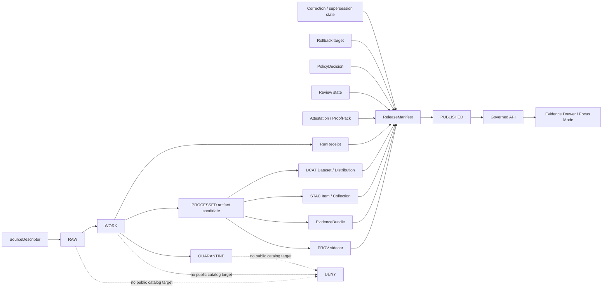

<!-- [KFM_META_BLOCK_V2]
doc_id: kfm://doc/adr/prov-stac-dcat-catalog-mapping
title: ADR — PROV, STAC, DCAT, and ReleaseManifest Catalog Mapping
type: adr
version: v1.3-draft
status: draft
owners: [OWNER_TBD]
created: NEEDS_VERIFICATION_REPO_HISTORY
updated: 2026-05-02
policy_label: public
repo_evidence_mode: NO_MOUNTED_CHECKOUT / ATTACHED_REPO_REPORT_LINEAGE
related: [
  docs/adr/ADR-0001-schema-home.md,
  docs/profiles/catalog/kfm-stac-extension-profile.md,
  docs/profiles/catalog/kfm-dcat-profile.md,
  contracts/v1/provenance/kfm_prov_sidecar.schema.json,
  contracts/v1/catalog/dcat/kfm_dcat_dataset.schema.json,
  contracts/v1/catalog/stac/kfm_stac_item.schema.json,
  contracts/v1/release/kfm_release_manifest.schema.json,
  tools/validators/provenance/validate_prov_sidecar.py,
  tools/validators/catalog/validate_dcat_dataset.py,
  tools/validators/catalog/validate_stac_item.py,
  tools/validators/release/validate_release_manifest.py,
  policy/provenance/prov_sidecar_gate.rego,
  policy/catalog/dcat/dcat_dataset_gate.rego,
  policy/catalog/stac/stac_item_gate.rego,
  policy/release/release_manifest_gate.rego,
  tests/fixtures/provenance/valid/minimal.prov.jsonld,
  tests/fixtures/provenance/invalid/missing_license.prov.jsonld,
  tests/fixtures/catalog/dcat/valid/minimal.dataset.jsonld,
  tests/fixtures/catalog/dcat/invalid/restricted_access.dataset.jsonld,
  tests/fixtures/catalog/dcat/invalid/missing_provenance.dataset.jsonld,
  tests/fixtures/catalog/stac/valid/minimal.item.json,
  tests/fixtures/catalog/stac/invalid/missing_evidence_ref.item.json,
  tests/fixtures/catalog/stac/invalid/restricted_policy_label.item.json,
  tests/fixtures/catalog/stac/invalid/missing_provenance_asset.item.json,
  tests/fixtures/release/valid/minimal.release-manifest.json,
  tests/fixtures/release/invalid/missing_provenance_ref.release-manifest.json,
  .github/workflows/provenance-gates.yml
]
tags: [kfm, adr, prov, stac, dcat, provenance, catalog, receipts, evidencebundle, release-manifest, promotion]
notes: [
  All related paths are PROPOSED until confirmed in a mounted KFM checkout.
  Attached repository-reference reports suggest a broader public repo surface exists, but this ADR revision did not inspect a mounted checkout.
  This ADR includes ReleaseManifest closure as part of catalog publication governance.
]
[/KFM_META_BLOCK_V2] -->

<a id="top"></a>

# ADR — PROV, STAC, DCAT, and ReleaseManifest Catalog Mapping

> **Purpose:** Define KFM’s publication-safe mapping between artifact provenance, catalog discovery, rights/access posture, review state, release closure, correction lineage, and rollback.

<p align="center">
  
  
  
  
</p>

<p align="center">
  <strong>Artifact bytes are not truth by themselves.</strong><br>
  <em>Public catalog discovery must resolve to evidence, provenance, policy, release, correction, and rollback state.</em>
</p>

---

## Impact block

| Field | Value |
| --- | --- |
| **Status** | `draft` |
| **Target path** | `docs/adr/ADR-0018-prov-stac-dcat-catalog-mapping.md` |
| **Decision type** | Catalog / provenance / release-closure ADR |
| **Evidence mode** | `NO_MOUNTED_CHECKOUT / ATTACHED_REPO_REPORT_LINEAGE` |
| **Owners** | `OWNER_TBD` |
| **Created** | `NEEDS_VERIFICATION_REPO_HISTORY` |
| **Updated** | `2026-05-02` |
| **Truth posture** | `CONFIRMED doctrine / PROPOSED implementation / UNKNOWN mounted repo behavior` |

> [!IMPORTANT]
> This ADR is a governance and architecture decision record. It does **not** claim the target repository currently contains the schemas, validators, policies, fixtures, workflows, or runtime behavior named below unless a future mounted-repo inspection confirms them.

---

## Quick jump

- [Executive determination](#executive-determination)
- [Decision](#decision)
- [Context and problem statement](#context-and-problem-statement)
- [Options considered](#options-considered)
- [Scope](#scope)
- [Repo fit](#repo-fit)
- [Evidence boundary](#evidence-boundary)
- [Object-family separation](#object-family-separation)
- [Mapping model](#mapping-model)
- [Closure contract](#closure-contract)
- [Publication invariants](#publication-invariants)
- [PROV sidecar profile](#prov-sidecar-profile)
- [STAC profile requirements](#stac-profile-requirements)
- [DCAT profile requirements](#dcat-profile-requirements)
- [ReleaseManifest requirements](#releasemanifest-requirements)
- [Validation and gates](#validation-and-gates)
- [Rollback and correction behavior](#rollback-and-correction-behavior)
- [Consequences](#consequences)
- [Implementation plan](#implementation-plan)
- [Open questions](#open-questions)
- [Acceptance checklist](#acceptance-checklist)
- [Revision notes](#revision-notes)
- [References](#references)

---

## Executive determination

**CONFIRMED doctrine:** KFM’s public unit of value is the inspectable claim. A public or semi-public statement must be reconstructable to admissible evidence, spatial scope, temporal scope, source role, policy posture, review state, release state, and correction lineage.

**PROPOSED decision:** KFM should require a colocated or resolvable **PROV JSON-LD sidecar** for every public or semi-public published artifact. Public STAC and DCAT catalog records should link to the sidecar, to the corresponding `EvidenceBundle`, and to the release closure object. Release-scoped publication should be closed by a `ReleaseManifest`.

**UNKNOWN implementation depth:** This revision did not inspect a mounted KFM repository. File paths, schemas, validators, fixtures, Rego policies, workflow names, route names, DTOs, UI contract homes, and emitted proof objects remain **PROPOSED** until repository inspection confirms them.

**One-sentence rule:** Catalog metadata may make an artifact discoverable, but it must never become the proof that the artifact is publishable.

[Back to top](#top)

---

## Decision

KFM will represent public artifact provenance using a **PROV JSON-LD sidecar** and will require public STAC and DCAT records to link to that sidecar, the associated `EvidenceBundle`, and the corresponding `ReleaseManifest`.

For each public or semi-public `PUBLISHED` artifact, KFM **MUST** be able to resolve the publication closure set:

```text
artifact.ext
artifact.prov.jsonld
artifact.bundle.json
release-manifest.json
stac-item-or-collection.json
dcat-dataset.jsonld
```

The mapping profile binds KFM object families as follows:

| KFM object family | Primary interop representation | Required KFM treatment |
| --- | --- | --- |
| `EvidenceBundle` | Linked KFM bundle JSON; optionally a `prov:Entity` | Remains the public unit of inspection. |
| Published artifact | `prov:Entity`, STAC Asset, DCAT Distribution | Must resolve hash, rights, access, provenance, evidence references, release state, and rollback target. |
| Pipeline run | `prov:Activity` | Must identify inputs, outputs, timestamps, pipeline identity, run receipt, and relevant software/spec version. |
| Signer / reviewer / system | `prov:Agent` or governed KFM identity reference | Must not be reduced to unverifiable prose when identity matters for policy or release. |
| `RunReceipt` | Linked process-memory object | Must remain separate from proof, attestation, catalog, and release objects. |
| Attestation / proof bundle | Release-significant verification object | Must remain separate from catalog prose. |
| STAC Item / Collection | Geospatial discovery catalog | Must link to provenance, evidence, and release closure. |
| DCAT Dataset / Distribution | Portal / open-data catalog | Must carry license, access-rights, distribution, and provenance posture. |
| `ReleaseManifest` | Publication closure object | Must bind artifact, evidence, PROV, STAC, DCAT, receipts, review, policy, correction, and rollback state. |

[Back to top](#top)

---

## Context and problem statement

KFM needs public catalogs that are discoverable without turning discovery metadata into truth authority.

STAC and DCAT are useful outward-facing catalog surfaces, while PROV is useful for lineage and activity description. None of them, by themselves, proves that a KFM artifact is safe to publish, rights-cleared, reviewed, evidence-backed, or reversible.

This ADR therefore defines the KFM rule:

> Discovery records are allowed only after release closure can be resolved.

The release closure set must preserve the KFM trust membrane:

```text
RAW -> WORK / QUARANTINE -> PROCESSED -> CATALOG / TRIPLET -> PUBLISHED
```

Public clients, map popups, Evidence Drawer payloads, Focus Mode answers, story exports, public catalogs, and public downloads must use governed interfaces and released artifacts. They must not read canonical/internal stores or unpublished lifecycle states as the ordinary public path.

[Back to top](#top)

---

## Options considered

| Option | Decision | Reason |
| --- | --- | --- |
| Use STAC/DCAT only | Rejected | Discovery metadata cannot carry KFM evidence, review, policy, correction, and rollback burden alone. |
| Use PROV sidecars only | Rejected | Provenance alone does not provide public catalog discovery or portal-oriented distribution metadata. |
| Use generated summaries as catalog proof | Rejected | AI language is interpretive and evidence-subordinate. It cannot replace `EvidenceBundle`, policy, review, or release state. |
| Link STAC/DCAT to PROV and `EvidenceBundle`, then close publication with `ReleaseManifest` | Adopted / PROPOSED | Preserves discoverability while keeping evidence, provenance, release, correction, and rollback inspectable. |
| Permit public clients to resolve canonical/internal stores directly | DENY | Violates the KFM trust membrane and normal public-path rule. |

[Back to top](#top)

---

## Scope

### In scope

- Public and semi-public artifacts in `PUBLISHED` state.
- STAC Item / Collection records describing public-safe KFM geospatial assets.
- DCAT Dataset / Distribution records exposing public-safe catalog metadata.
- PROV JSON-LD sidecars for lineage, activity, agent, and input/output relationships.
- ReleaseManifest closure across artifact, evidence, provenance, catalog, receipts, attestations, policy, review, correction, and rollback.
- Negative gates for missing evidence, rights, provenance, policy, release, sensitivity, or closure.

### Exclusions

- Public catalog targets for `RAW`, `WORK`, `QUARANTINE`, or unpublished candidate material.
- Direct UI or public-client access to canonical/internal stores.
- Generated AI summaries as provenance evidence.
- STAC, DCAT, PROV, or ReleaseManifest as replacements for KFM review, correction, rollback, or proof records.
- Runtime, route, workflow, or implementation claims without repository evidence.

[Back to top](#top)

---

## Repo fit

| Surface | Proposed path | Upstream / downstream role |
| --- | --- | --- |
| ADR | `docs/adr/ADR-0018-prov-stac-dcat-catalog-mapping.md` | Governs profile, schema, validator, policy, and workflow alignment. |
| Schema-home ADR | `docs/adr/ADR-0001-schema-home.md` | Confirms whether `contracts/`, `schemas/`, `jsonschema/`, or another path is authoritative. |
| PROV schema | `contracts/v1/provenance/kfm_prov_sidecar.schema.json` | Shapes provenance sidecars consumed by validators and policy gates. |
| STAC schema | `contracts/v1/catalog/stac/kfm_stac_item.schema.json` | Shapes public-safe STAC item exports. |
| DCAT schema | `contracts/v1/catalog/dcat/kfm_dcat_dataset.schema.json` | Shapes public-safe DCAT dataset exports. |
| Release schema | `contracts/v1/release/kfm_release_manifest.schema.json` | Shapes release closure objects. |
| Validators | `tools/validators/**` | Enforce schema and KFM-specific closure rules. |
| Policy gates | `policy/**` or `policies/**` | Express fail-closed publication rules after repo convention is confirmed. |
| Fixtures | `tests/fixtures/**` | Prove positive and negative publication behavior. |
| CI | `.github/workflows/provenance-gates.yml` | Runs schema, validator, and policy gates. |

> [!NOTE]
> All paths above are **PROPOSED** until confirmed against the mounted repository’s actual layout and naming conventions. If the mounted repo proves different homes, update this ADR through a compatibility note rather than creating parallel schema or policy authority.

[Back to top](#top)

---

## Evidence boundary

| Source | Status | Supports | Limits |
| --- | --- | --- | --- |
| Attached Markdown baseline | CONFIRMED source under revision | Existing ADR substance, path targets, object-family vocabulary, closure rules, and fixture list | Does not prove implementation exists. |
| KFM doctrine and operating manuals | CONFIRMED doctrine / LINEAGE | Trust membrane, inspectable-claim posture, evidence-subordinate AI, map/UI trust boundaries, rollback discipline | Does not prove current repo files, tests, workflows, or route behavior. |
| Attached implementation-reference report | LINEAGE / NEEDS VERIFICATION | Suggests public repo breadth and schema-home conflict requiring ADR discipline | This revision did not independently inspect the public repo or a mounted checkout. |
| Current workspace inspection | CONFIRMED | No mounted KFM checkout was available in `/mnt/data`; this revision is bounded | Does not disprove existence of a remote/public repo. |
| External STAC/DCAT/PROV/RFC references | NEEDS VERIFICATION for version pinning | Standards vocabulary and proposed interop direction | Should be rechecked before package pins, profile URI decisions, or release policy claims. |

[Back to top](#top)

---

## Object-family separation

KFM must not collapse operational memory, evidence, proof, discovery, release, correction, and presentation into one record.

| KFM surface | Role | Collapse risk this ADR avoids |
| --- | --- | --- |
| Artifact | Released bytes or derived output | Treating rendered bytes as truth by themselves. |
| EvidenceBundle | Public unit of inspection | Replacing evidence with generated prose or catalog text. |
| RunReceipt | Process memory | Treating logs as release proof. |
| Attestation / ProofPack | Release-significant verification | Hiding integrity checks behind catalog metadata. |
| Catalog record | Discovery and access metadata | Treating search metadata as provenance or review. |
| ReleaseManifest | Promotion closure and rollback target | Publishing detached assets with no governed transition. |
| CorrectionNotice | Public accountability | Allowing stale artifacts to remain current. |
| RollbackPlan | Reversal target | Making publication irreversible or undocumented. |
| Evidence Drawer payload | Public trust surface | Treating UI explanation as root evidence. |
| Focus Mode answer | Interpretive response | Treating model output as sovereign truth. |

[Back to top](#top)

---

## Mapping model



[Back to top](#top)

---

## Closure contract

A public artifact is not outward-ready until these references close without guesswork:

| Closure check | Required result |
| --- | --- |
| Artifact → PROV | Artifact has a resolvable provenance sidecar. |
| Artifact → EvidenceBundle | Artifact has a resolvable inspection bundle. |
| Artifact → STAC | STAC record links provenance, evidence, and release manifest. |
| Artifact → DCAT | DCAT record carries public-safe rights, access, distribution, and provenance. |
| Artifact → ReleaseManifest | ReleaseManifest binds artifact, evidence, PROV, STAC, DCAT, receipt, review, policy, correction, and rollback references. |
| ReleaseManifest → rollback | Release scope carries rollback target or documented exception. |
| Policy → publication | Policy permits publication and exposes no restricted fields. |

| Outcome | Meaning | Public behavior |
| --- | --- | --- |
| `PUBLISHABLE` | Evidence, rights, sensitivity, catalog, provenance, release, review, and rollback closure pass. | Expose through governed catalog/API/UI. |
| `ABSTAIN` | Evidence or resolver closure is insufficient. | Do not publish; explain needed evidence or resolver repair. |
| `DENY` | Policy, rights, sensitivity, release, source role, or security gate blocks publication. | Do not publish; emit denial reason suitable for audit. |
| `ERROR` | Technical validation or resolver failure prevents reliable decision. | Do not publish; emit repairable failure state. |

[Back to top](#top)

---

## Publication invariants

Public publication **MUST fail closed** when any condition is true:

- provenance sidecar is missing
- `spec_hash` or required artifact hash is missing from artifact, catalog, release, or provenance surfaces
- artifact license is unknown, unresolved, incompatible, or absent where required
- `dct:accessRights` is missing, uncontrolled, or incompatible with public release
- activity input references are missing or cannot resolve
- public catalog references `RAW`, `WORK`, or `QUARANTINE` material
- restricted geometry or restricted fields leak into public DTOs, tiles, exports, catalog records, story nodes, map popups, or model context
- required `EvidenceBundle` cannot resolve
- required attestation or proof object is missing
- ReleaseManifest does not bind artifact, PROV, EvidenceBundle, STAC, DCAT, receipt, review, policy, correction, and rollback references
- correction, supersession, withdrawal, or sensitivity status requires suppression but artifact remains discoverable as current
- generated language is being used as proof

> [!CAUTION]
> Public-safe discovery metadata is still publication. STAC/DCAT records must pass the same rights, sensitivity, review, and release posture as maps, tiles, exports, API payloads, and story outputs.

[Back to top](#top)

---

## PROV sidecar profile

The PROV sidecar **MUST** identify these relationship classes:

| Required element | Representation |
| --- | --- |
| Published artifact | `prov:Entity` with a KFM artifact type |
| Linked EvidenceBundle | KFM `EvidenceBundle` reference and optionally `prov:Entity` |
| Generation run | `prov:Activity` |
| Signer / system / reviewer | `prov:Agent` or governed identity reference |
| Generation relation | `prov:wasGeneratedBy` |
| Attribution relation | `prov:wasAttributedTo` |
| Input usage | `prov:used` and optional explicit `used[]` list |
| Derivation | Optional `prov:wasDerivedFrom[]` |
| Publication context | `kfm:publication_context` |
| Catalog references | `kfm:catalog_refs.stac`, `kfm:catalog_refs.dcat` |
| Release closure | `kfm:release_manifest_ref` |

Minimum governed fields:

```json
{
  "kfm:spec_hash": "sha256:...",
  "kfm:artifact_hash": "sha256:...",
  "kfm:evidence_ref": "kfm://evidence/...",
  "kfm:run_receipt_ref": "kfm://receipt/run/...",
  "kfm:release_manifest_ref": "kfm://release-manifest/...",
  "kfm:policy_label": "public",
  "kfm:review_state": "reviewed",
  "kfm:sensitivity": "public"
}
```

<details>
<summary>Illustrative sidecar relationship summary</summary>

```text
Published artifact entity
  ├─ prov:wasGeneratedBy → PipelineRun activity
  ├─ prov:wasAttributedTo → signer/system/reviewer agent
  ├─ prov:used → source descriptor / input spec / evidence refs
  ├─ prov:wasDerivedFrom → source or processed entity
  ├─ kfm:evidence_ref → EvidenceBundle
  ├─ kfm:catalog_refs → STAC/DCAT records
  └─ kfm:release_manifest_ref → ReleaseManifest
```

</details>

[Back to top](#top)

---

## STAC profile requirements

STAC records are discovery records. They do not replace KFM evidence, review, policy, or release state.

Required KFM STAC properties:

```json
{
  "kfm:spec_hash": "sha256:...",
  "kfm:artifact_hash": "sha256:...",
  "kfm:evidence_ref": "kfm://evidence/...",
  "kfm:run_receipt_ref": "kfm://receipt/run/...",
  "kfm:release_manifest_ref": "kfm://release-manifest/...",
  "kfm:policy_label": "public",
  "kfm:review_state": "reviewed",
  "kfm:source_role": "authoritative_source",
  "kfm:sensitivity": "public",
  "processing:software": "kfm-pipeline",
  "processing:version": "v1",
  "processing:datetime": "2026-05-02T00:00:00Z"
}
```

Required links:

```json
[
  { "rel": "provenance", "href": "https://example.invalid/artifact.prov.jsonld" },
  { "rel": "evidence", "href": "https://example.invalid/evidence.json" },
  { "rel": "release-manifest", "href": "https://example.invalid/release-manifest.json" }
]
```

Required assets:

```json
{
  "assets": {
    "data": {
      "href": "https://example.invalid/artifact.ext",
      "roles": ["data"]
    },
    "provenance": {
      "href": "https://example.invalid/artifact.prov.jsonld",
      "roles": ["metadata", "provenance"]
    }
  }
}
```

> [!IMPORTANT]
> A provenance link alone is not enough for KFM STAC publication. The `assets.provenance` entry must also be present when the profile requires materialized provenance for Evidence Drawer, offline validation, export packages, or release closure.

[Back to top](#top)

---

## DCAT profile requirements

DCAT records expose dataset/distribution metadata and rights/access posture.

Required DCAT fields:

```json
{
  "@type": "dcat:Dataset",
  "dct:title": "KFM public dataset",
  "dct:identifier": "kfm://dataset/...",
  "dct:license": "https://spdx.org/licenses/CC-BY-4.0.html",
  "dct:accessRights": "public",
  "dct:provenance": "https://example.invalid/artifact.prov.jsonld",
  "kfm:spec_hash": "sha256:...",
  "kfm:artifact_hash": "sha256:...",
  "kfm:evidence_ref": "kfm://evidence/...",
  "kfm:release_manifest_ref": "kfm://release-manifest/...",
  "kfm:policy_label": "public",
  "kfm:review_state": "reviewed",
  "kfm:source_role": "authoritative_source",
  "kfm:sensitivity": "public"
}
```

Required distribution behavior:

```json
{
  "@type": "dcat:Distribution",
  "dcat:accessURL": "https://example.invalid/artifact.ext",
  "dct:license": "https://spdx.org/licenses/CC-BY-4.0.html"
}
```

Distribution license must match dataset license unless an explicit reviewed exception is later modeled.

[Back to top](#top)

---

## ReleaseManifest requirements

`ReleaseManifest` is the closure object that binds the published artifact graph.

Required release fields:

```json
{
  "manifest_id": "kfm://release-manifest/...",
  "release_id": "kfm://release/...",
  "created_at": "2026-05-02T00:00:00Z",
  "policy_label": "public",
  "review_state": "reviewed",
  "spec_hash": "sha256:...",
  "artifacts": []
}
```

Each artifact entry **MUST** include:

```json
{
  "artifact_ref": "https://example.invalid/artifact.ext",
  "artifact_hash": "sha256:...",
  "spec_hash": "sha256:...",
  "evidence_ref": "kfm://evidence/...",
  "provenance_ref": "https://example.invalid/artifact.prov.jsonld",
  "stac_ref": "kfm://catalog/stac/...",
  "dcat_ref": "kfm://catalog/dcat/...",
  "run_receipt_ref": "kfm://receipt/run/...",
  "policy_label": "public",
  "review_state": "reviewed",
  "sensitivity": "public",
  "rollback_ref": "kfm://rollback/..."
}
```

ReleaseManifest validation **MUST** deny:

- missing provenance reference
- missing evidence reference
- missing STAC reference
- missing DCAT reference
- missing rollback reference or documented exception
- `policy_label != public` for public release
- `review_state` not `reviewed` or `published`
- sensitivity not `public` for public release
- artifact hash missing
- artifact `spec_hash` mismatch with manifest-level `spec_hash` when the profile requires a shared spec
- `RAW`, `WORK`, or `QUARANTINE` references

[Back to top](#top)

---

## Validation and gates

> [!NOTE]
> Commands in this section are **PROPOSED** and must be adapted to the repository’s confirmed package manager, validator language, policy toolchain, workflow conventions, and schema home.

Positive-path targets:

```bash
python tools/validators/provenance/validate_prov_sidecar.py \
  tests/fixtures/provenance/valid/minimal.prov.jsonld

python tools/validators/catalog/validate_dcat_dataset.py \
  tests/fixtures/catalog/dcat/valid/minimal.dataset.jsonld

python tools/validators/catalog/validate_stac_item.py \
  tests/fixtures/catalog/stac/valid/minimal.item.json

python tools/validators/release/validate_release_manifest.py \
  tests/fixtures/release/valid/minimal.release-manifest.json
```

Policy gates:

```bash
conftest test tests/fixtures/provenance/valid/minimal.prov.jsonld \
  --policy policy/provenance

conftest test tests/fixtures/catalog/dcat/valid/minimal.dataset.jsonld \
  --policy policy/catalog/dcat

conftest test tests/fixtures/catalog/stac/valid/minimal.item.json \
  --policy policy/catalog/stac

conftest test tests/fixtures/release/valid/minimal.release-manifest.json \
  --policy policy/release
```

Minimum denial fixtures:

| Fixture | Expected result | Why it matters |
| --- | --- | --- |
| `tests/fixtures/provenance/invalid/missing_license.prov.jsonld` | `DENY` | Rights uncertainty blocks public release. |
| `tests/fixtures/catalog/dcat/invalid/restricted_access.dataset.jsonld` | `DENY` | Restricted access cannot be published as public. |
| `tests/fixtures/catalog/dcat/invalid/missing_provenance.dataset.jsonld` | `DENY` | Catalog record cannot replace provenance. |
| `tests/fixtures/catalog/stac/invalid/missing_evidence_ref.item.json` | `DENY` | Discovery must resolve to evidence. |
| `tests/fixtures/catalog/stac/invalid/restricted_policy_label.item.json` | `DENY` | Restricted artifact cannot enter public catalog. |
| `tests/fixtures/catalog/stac/invalid/missing_provenance_asset.item.json` | `DENY` | Materialized provenance is required by this profile. |
| `tests/fixtures/release/invalid/missing_provenance_ref.release-manifest.json` | `DENY` | Release cannot close without provenance. |
| `tests/fixtures/release/invalid/raw_reference.release-manifest.json` | `DENY` | Public release cannot reference RAW/WORK/QUARANTINE. |
| `tests/fixtures/release/invalid/missing_rollback_ref.release-manifest.json` | `DENY` | Publication must remain reversible or explicitly exceptioned. |

[Back to top](#top)

---

## Rollback and correction behavior

Publication closure must remain reversible.

| Scenario | Required behavior |
| --- | --- |
| Artifact fails post-publication rights review | Mark withdrawn, suppress current discovery, emit correction notice, bind rollback target. |
| Artifact superseded by newer release | Mark prior artifact superseded, keep audit path, point current catalog to newer release. |
| Sensitive geometry leak found | Withdraw or generalize, emit redaction receipt, rebuild STAC/DCAT/tiles/exports. |
| PROV sidecar invalid | Suppress artifact as current until repaired and repromoted. |
| EvidenceBundle resolver breaks | Return `ABSTAIN` or `ERROR`; do not make consequential UI/AI claims. |
| Attestation invalid | Deny or withdraw publication according to release policy. |
| Catalog record points to old current alias | Repoint, suppress, or mark superseded; preserve audit lineage. |

Rollback must update all outward-facing references: STAC, DCAT, governed API, Evidence Drawer payloads, story exports, map popups, search indexes, public current aliases, and any downstream published package.

[Back to top](#top)

---

## Consequences

### Positive consequences

- Public catalog discovery remains useful without weakening KFM truth posture.
- STAC/DCAT become navigational surfaces, not authority substitutes.
- PROV sidecars make lineage inspectable without collapsing evidence and proof.
- ReleaseManifest creates a single closure point for artifact, evidence, catalog, policy, review, correction, and rollback.
- Negative outcomes become explicit and testable.

### Costs and risks

- More objects must be generated, linked, validated, and maintained.
- Schema-home ambiguity can create parallel authority if not resolved early.
- Profile URI, access-rights vocabulary, and resolver URL policy need ADR-backed decisions.
- Public catalogs may lag release candidates until closure passes.
- Version-sensitive standards and toolchain behavior require periodic verification.

### Tradeoff

This ADR intentionally adds publication friction. That friction is acceptable because KFM values inspectable, reversible, policy-aware publication over faster unsupported discovery.

[Back to top](#top)

---

## Implementation plan

| Step | Artifact | Status before repo verification |
| --- | --- | --- |
| 1 | Land or update this ADR | PROPOSED |
| 2 | Confirm schema-home authority through `ADR-0001-schema-home.md` or successor | NEEDS VERIFICATION |
| 3 | Add PROV schema + fixtures + validator + policy | PROPOSED |
| 4 | Add DCAT schema + fixtures + validator + policy | PROPOSED |
| 5 | Add STAC schema + fixtures + validator + policy | PROPOSED |
| 6 | Add ReleaseManifest schema + fixtures + validator + policy | PROPOSED |
| 7 | Add `.github/workflows/provenance-gates.yml` or repo-native equivalent | PROPOSED |
| 8 | Add catalog profile docs for STAC/DCAT | PROPOSED |
| 9 | Add resolver-level closure checks | PROPOSED |
| 10 | Add Evidence Drawer / Focus Mode provenance and evidence references | PROPOSED |
| 11 | Add rollback/correction fixture release | PROPOSED |
| 12 | Run one offline fixture release proving artifact → PROV → EvidenceBundle → STAC → DCAT → ReleaseManifest closure | PROPOSED |

[Back to top](#top)

---

## Open questions

| Question | Current posture | Needed decision |
| --- | --- | --- |
| Canonical JSON standard for `spec_hash` | PROPOSED: JCS / RFC 8785 family | Confirm serialization, excluded volatile fields, and digest prefix format. |
| Difference between `spec_hash`, `artifact_hash`, and `run_hash` | NEEDS VERIFICATION | Define hash semantics in shared identity/hashing ADR. |
| Attestation baseline | PROPOSED: DSSE / Cosign / Sigstore family | Decide signer identity, key strategy, offline behavior, and mandatory cases. |
| Access-rights vocabulary | NEEDS VERIFICATION | Create controlled vocabulary ADR. |
| Schema authority path | NEEDS VERIFICATION | Confirm `contracts/`, `schemas/`, `jsonschema/`, `contracts/v1/`, or another canonical home. |
| STAC extension URI | NEEDS VERIFICATION | Define official extension URI and linting policy. |
| Resolver URL policy | PROPOSED | Decide direct URLs vs governed resolver URLs. |
| ReleaseManifest relationship to CatalogMatrix | PROPOSED | Decide whether closure matrix is release object, catalog object, or both. |
| Public-current alias behavior | PROPOSED | Define how withdrawn/superseded artifacts disappear from current discovery while preserving audit history. |
| EvidenceBundle offline packaging | PROPOSED | Decide whether public export bundles must include materialized evidence, resolver URLs, or both. |

[Back to top](#top)

---

## Acceptance checklist

This ADR can move from `draft` to `review` when:

- [ ] owner is assigned
- [ ] `created` date is confirmed from repo history
- [ ] schema home decision is confirmed
- [ ] PROV sidecar schema exists
- [ ] DCAT schema exists
- [ ] STAC schema exists
- [ ] ReleaseManifest schema exists
- [ ] validators exist and run locally
- [ ] policy gates exist and deny minimum failure cases
- [ ] CI workflow or repo-native gate runs positive and negative cases
- [ ] STAC profile references this ADR
- [ ] DCAT profile references this ADR
- [ ] Evidence Drawer / Focus Mode contracts know how to resolve provenance and evidence references

This ADR can move from `review` to `published` when:

- [ ] one offline fixture release proves artifact → PROV → EvidenceBundle → STAC → DCAT → ReleaseManifest closure
- [ ] rollback target and correction behavior are tested
- [ ] public catalog output is verified not to reference RAW / WORK / QUARANTINE
- [ ] rights and sensitivity checks pass for the fixture release
- [ ] unresolved EvidenceBundle returns finite negative state
- [ ] withdrawn/superseded current visibility behavior is tested
- [ ] no generated language is accepted as release proof
- [ ] release, catalog, proof, receipt, review, correction, and rollback objects remain separate

[Back to top](#top)

---

## Revision notes

### v1.3-draft

- Tightens repo evidence boundary to distinguish no mounted checkout from attached public-repo lineage.
- Preserves the original ADR decision while adding context, options considered, consequences, and evidence boundary.
- Clarifies that STAC/DCAT are discovery records and PROV is lineage, not publication authority by itself.
- Separates `artifact_hash` from `spec_hash` where the prior draft over-relied on `spec_hash`.
- Corrects PROV treatment so published artifact and `EvidenceBundle` are distinct resolvable objects.
- Strengthens ReleaseManifest closure with rollback, correction, review, and policy references.
- Marks validation commands as PROPOSED until repo-native tooling is verified.
- Adds additional negative fixtures for RAW references and missing rollback.
- Keeps related paths as implementation targets rather than confirmed repository files.

### v1.2-draft

- Adds ReleaseManifest closure as a first-class publication requirement.
- Adds DCAT, STAC, and ReleaseManifest schema/validator/policy paths.
- Adds missing provenance asset STAC fixture.
- Adds ReleaseManifest valid and invalid fixtures.
- Strengthens acceptance criteria around full artifact → catalog → release closure.

[Back to top](#top)

---

## References

Project references:

- KFM Pipeline Living Implementation Manual.
- KFM Components Pass 24.
- KFM MapLibre Operating Architecture, Governed UI, and AI Interaction Manual.
- KFM Cesium Architecture Manual.
- KFM Governed AI architecture reports.
- KFM Implementation Reference.

External standards and technical references:

- OGC — SpatioTemporal Asset Catalog (STAC).
- W3C — Data Catalog Vocabulary (DCAT).
- W3C — PROV-O: The PROV Ontology.
- RFC 8785 — JSON Canonicalization Scheme.

> [!NOTE]
> External standard versions, profile URIs, package pins, and tool versions are **NEEDS VERIFICATION** before implementation or release policy depends on them.

[Back to top](#top)
