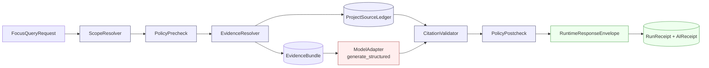

<!-- [KFM_META_BLOCK_V2]
doc_id: kfm://doc/adr-0019-ai-adapter-contract-and-finite-envelopes
title: ADR-0019 — AI Adapter Contract and Finite Envelopes
type: standard
version: v1.1.1
status: draft
owners: <architecture-steward>, <ai-runtime-steward>
created: 2026-05-09
updated: 2026-05-15
policy_label: public
related:
  - docs/adr/ADR-0001-schema-home.md
  - docs/doctrine/trust-membrane.md
  - docs/architecture/governed-api.md
  - schemas/contracts/v1/ai/
  - schemas/contracts/v1/runtime/
  - policy/runtime/
tags: [kfm, adr, governed-ai, runtime, contracts]
notes:
  - "ADR number `0019` is PROPOSED; verify next available index against `docs/adr/` before merge."
  - "ADR status remains `proposed`; MetaBlock status remains `draft` until reviewer acceptance."
  - "v1.1 clarifies evidence boundaries, Directory Rules path posture, finite-outcome mapping, merge gates, and rollback triggers."
  - "v1.1.1 is a formatting repair pass: GitHub-ready document control, compact navigation, split tables, and QA checklist; no implementation status is upgraded."
[/KFM_META_BLOCK_V2] -->

# ADR-0019 — AI Adapter Contract and Finite Envelopes

> Pin a provider-neutral `ModelAdapter` contract and a finite `RuntimeResponseEnvelope`
> vocabulary so that AI runtimes are interpretive helpers behind governed evidence, never
> sovereign truth, and so that public surfaces only ever see four outcomes:
> **ANSWER · ABSTAIN · DENY · ERROR**.

`status: proposed` · `document: draft` · `version: v1.1.1` · `repo depth: UNKNOWN` · `path: PROPOSED`

> [!IMPORTANT]
> **Merge posture:** This ADR is formatted for GitHub review, but it is not accepted authority.
> It requires reviewer acceptance and mounted-repo verification before merge.
>
> **Target path:** `docs/adr/ADR-0019-ai-adapter-contract-and-finite-envelopes.md`
> *(PROPOSED — verify ADR number and path against the mounted repository).*  
> **Truth posture:** Doctrine **CONFIRMED** from attached KFM corpus · Implementation
> **PROPOSED** · current repo state **UNKNOWN / NEEDS VERIFICATION**.

---

## 0. Document Control

### 0.1 Identity

| Field | Value |
|---|---|
| **ADR id** | `ADR-0019` *(PROPOSED — confirm next free index in `docs/adr/`)* |
| **Title** | AI Adapter Contract and Finite Envelopes |
| **ADR status** | `proposed` |
| **Document status** | `draft` |
| **Version** | `v1.1.1` *(formatting repair over v1.1; no implementation status upgrade)* |
| **Date** | 2026-05-09 |
| **Last revised** | 2026-05-15 |
| **Policy label** | `public` |

### 0.2 Ownership and review

| Field | Value |
|---|---|
| **Owners** | `<architecture-steward>` · `<ai-runtime-steward>` |
| **Reviewers required** | Architecture steward · AI runtime steward · Policy steward |
| **Supersedes** | — |
| **Superseded by** | — |
| **Proposed target path** | `docs/adr/ADR-0019-ai-adapter-contract-and-finite-envelopes.md` *(PROPOSED — verify against mounted repo)* |

### 0.3 Related authority and affected roots

| Area | Values |
|---|---|
| **Related ADRs** | `ADR-0001-schema-home.md` *(CONFIRMED reference; acceptance state NEEDS VERIFICATION at merge)*<br>`ADR-finite-decision-outcomes-vocabulary` *(PROPOSED sibling)*<br>`ADR-trust-membrane` *(PROPOSED)* |
| **Affects roots** | `schemas/` · `contracts/` · `policy/` · `tests/` · `docs/`<br>`apps/` *(governed API integration — exact path NEEDS VERIFICATION)*<br>`packages/` *(adapter package — exact path NEEDS VERIFICATION)* |
| **Directory Rules basis** | Responsibility-root placement only; no new root folders; schema-home changes require ADR-backed review. |

> [!NOTE]
> This ADR states KFM doctrine and proposed contracts where supported by attached project sources.
> It does **not** confirm current repository implementation, route names, package paths,
> policy modules, schemas, tests, workflows, dashboards, deployment posture, or runtime behavior.
> All file paths below are **PROPOSED** until verified in a mounted repository.

---

## Quick Jump

| Orientation | Contract surface | Governance and release |
|---|---|---|
| [Context](#1-context)<br>[Decision](#2-decision)<br>[Alternatives](#8-alternatives-considered) | [Adapter contract](#3-the-adapter-contract)<br>[Finite envelopes](#4-finite-envelopes-and-trust-state)<br>[Runtime pipeline](#5-runtime-pipeline) | [Schemas, policies, and tests](#6-affected-schemas-policies-and-tests)<br>[Consequences](#7-consequences)<br>[Migration and rollback](#9-migration-and-rollback)<br>[Open questions](#10-open-questions)<br>[References](#11-references) |

---

## 1. Context

KFM's [governed-AI doctrine][gai] treats model runtimes as **interpretive helpers**, not as
sources of truth. Public clients must never receive raw model output, and consequential
claims must resolve to an `EvidenceBundle` rather than to fluent generation. Two pressures
make this brittle in practice:

1. **Provider lock-in risk.** Naïve integration with a specific runtime (Ollama, an
   OpenAI-compatible endpoint, Anthropic, a local GGUF binary, etc.) leaks provider-specific
   shape into the public boundary, makes deterministic CI difficult, and entangles trust
   semantics with vendor APIs. The corpus is explicit that *provider choice is internal
   after the adapter contract is fixed; public behavior must not couple to* a specific
   runtime. [GAI §14] [BC §16]
2. **Open-ended response shapes.** Without a finite outcome vocabulary, "the model said
   nothing useful" and "policy denied this" and "the validator failed" all become the same
   string-shaped non-answer at the public surface, defeating the trust path. [P12 §C.10]
   [Roads §16.1]

The companion build guide pins these together: the **eleventh** rung of the build
dependency ladder is *AI adapter — without resolved evidence and envelopes, AI becomes
authority.* [BC §4.1] This ADR records the contract that lets AI sit at that rung
without becoming authority.

> [!IMPORTANT]
> **This ADR does not authorize a live model runtime.** It authorizes the *contract* that
> any future runtime — including the first-slice `MockAdapter` — must conform to. Live
> runtimes (Ollama, OpenAI-compatible, etc.) remain deferred until contracts, policy,
> citation validation, receipts, and tests pass.

### 1.1 Forces

| # | Force | Direction |
|---|---|---|
| F1 | Trust must be visible at the public boundary | Pushes toward a small, finite outcome vocabulary |
| F2 | Providers change; KFM should not | Pushes toward a provider-neutral adapter |
| F3 | CI must be deterministic | Pushes toward `MockAdapter` first; no network in default tests |
| F4 | Prompt injection from source content is real | Pushes toward “source content is data, not instruction” |
| F5 | Receipts must be auditable but cannot store chain-of-thought | Pushes toward hash-based `AIReceipt` and explicit non-retention |
| F6 | Negative states must be first-class | Pushes toward typed `ABSTAIN` / `DENY` / `ERROR` with reason codes |
| F7 | Directory placement encodes governance | Pushes toward responsibility-root paths and ADR-backed schema-home decisions |

### 1.2 Evidence boundary for this ADR

| Evidence area | Status | Handling in this ADR |
|---|---|---|
| KFM governed-AI doctrine | **CONFIRMED** from attached KFM AI and UI/governance corpus | Used for AI subordination, finite outcomes, citation validation, receipts, and no-direct-model-client rules |
| Directory placement doctrine | **CONFIRMED** from Directory Rules | Used to keep paths responsibility-rooted and `schemas/contracts/v1/...` as the default machine-schema home |
| Current repo topology | **UNKNOWN** in this session | All repo paths are **PROPOSED** and require mounted-repo verification |
| Runtime/provider versions | **NEEDS VERIFICATION** | No package, provider, API, or version pin is authorized by this ADR |
| Baseline references such as `[BC]` and `[P12]` | **LINEAGE / NEEDS VERIFICATION** where the specific cited source was not attached in this session | Retained as existing ADR references; merge reviewer must verify source availability or replace with accepted repo references |

---

## 2. Decision

We adopt, as a single coupled contract, the following:

1. **A provider-neutral `ModelAdapter` interface** with the methods
   `generate_structured()`, `embed()`, `health()`, `model_info()` and a fixed input/output
   shape (`ModelAdapterRequest` → `ModelAdapterResponse`). Provider implementations
   (`MockAdapter`, `NullAdapter`, `OllamaAdapter`, `OpenAICompatibleAdapter`, …) sit
   *behind* this interface. [GAI §14] [BC §16.1]
2. **A finite `RuntimeResponseEnvelope`** as the only shape returned to public clients
   from any AI- or evidence-backed runtime route. Its `outcome` field is constrained to
   the closed set `{ANSWER, ABSTAIN, DENY, ERROR}`. Negative states carry typed reason
   codes; they are never substituted by fluent text. [GAI §13] [Roads §16.1] [Encyc J]
3. **A first-slice rule**: the first conforming implementation is `MockAdapter`, plus
   `NullAdapter` for explicit non-answer cases. Live runtimes are deferred until the
   contract, citation validator, source ledger checks, receipt validation, and policy gates
   are green in CI without network access. [GAI §14] [BC §16.2]
4. **A no-direct-traffic rule**: browsers and other public clients never call a model
   runtime directly, and never render raw model text. The governed API is the only
   public boundary. [GAI §13] [BC §16.1]
5. **A no-generated-truth rule**: adapter output may draft or structure synthesis, but
   cannot decide truth, source authority, rights, sensitivity, review state, release state,
   correction state, or publication state.
6. **A no-chain-of-thought-storage rule**: receipts record hashes, request/response metadata,
   validation outcomes, policy state, and citation reports. They never store private
   reasoning traces, hidden chain-of-thought, or raw provider payloads.

The contract and the envelope are intentionally specified together because **the envelope
is the adapter's public face**: changing one without the other breaks the trust path.

### 2.1 Non-goals

This ADR does **not**:

- accept or deploy a live model provider;
- bless Ollama, OpenAI-compatible endpoints, Anthropic, GGUF binaries, or any other provider as public behavior;
- authorize direct browser-to-model calls;
- authorize model reads from `RAW`, `WORK`, `QUARANTINE`, unpublished candidates, secrets, or source credentials;
- create a fifth public outcome for review, stale state, escalation, or quarantine;
- replace `EvidenceBundle`, `PolicyDecision`, `PromotionDecision`, `ReleaseManifest`, or source ledgers;
- create new root folders or parallel schema/contract/policy homes.

---

## 3. The Adapter Contract

### 3.1 Boundary rules

| Boundary | Rule |
|---|---|
| **Input context** | Only admissible, policy-safe, **released or review-authorized** evidence. No `RAW`, `WORK`, `QUARANTINE`, unpublished candidate, secret, or direct source credential may cross into adapter context. |
| **Evidence resolution** | `EvidenceRef` must resolve to `EvidenceBundle` before consequential synthesis. Unresolved evidence yields `ABSTAIN`, `DENY`, or `ERROR`; it never yields a fluent guess. |
| **Prompting** | Prompt and template body are hashed and the hash is recorded on the `AIReceipt`. Source-derived text (Markdown, YAML, JSON, map labels, transcripts, issue text, PR text) is treated as **data, never as instruction**. Tool-instruction-shaped fragments inside retrieved evidence are stripped, isolated, or reason-coded. |
| **Runtime parameters** | Determinism-sensitive calls record model identifier, adapter identifier, prompt/template hash, schema hash, and configured generation parameters. Temperature/seed rules are set by policy and tests, not by provider defaults. |
| **Output** | Structured response with citations, claims, abstentions, uncertainty, and reason codes. No free-form prose at the public boundary. |
| **Validation** | Citation validation against `EvidenceBundle` and `ProjectSourceLedger`; schema validation; policy postcheck. Uncited consequential claims fail closed. |
| **Receipts** | `AIReceipt` records `model_adapter`, `request_hash`, `response_hash`, `prompt_template_hash`, `schema_hash`, `citation_report_ref`, `policy_state`, and validation result. **Chain-of-thought is never stored.** |
| **Provider substitution** | The interface is stable enough that swapping `MockAdapter` for `OllamaAdapter` (or any future provider) does not change trust semantics or public envelope shape. |
| **Public boundary** | No direct client-to-model traffic. No raw model output in any public UI surface. |

Source posture: `KFM_Governed_AI_Extended_Pro_Source_Ledger…pdf` supports the governed-AI boundary, while baseline references to `kfm_build_companion.pdf` remain **NEEDS VERIFICATION** until that exact source is available to merge reviewers.

### 3.2 Required adapter methods

```text
ModelAdapter
  .generate_structured(req: ModelAdapterRequest) -> ModelAdapterResponse
  .embed(text_or_chunks)                          -> EmbeddingResponse
  .health()                                       -> HealthStatus
  .model_info()                                   -> ModelInfo
```

> [!NOTE]
> Method *signatures* are PROPOSED at the type-shape level above. Concrete language-level
> signatures (Python protocols, TypeScript interfaces, etc.) are deferred to the
> implementation PRs and to the schemas listed in [§6](#6-affected-schemas-policies-and-tests).

### 3.3 Provider plan

| Adapter | Purpose | Allowed scope | First-slice status |
|---|---|---|---|
| `MockAdapter` | Deterministic test adapter returning fixture-controlled structured outputs | Local fixtures only; no network/model | **First implementation** |
| `NullAdapter` | Explicit non-answer adapter for safety, offline, disabled runtime, or kill-switch mode | Returns `ERROR`, `ABSTAIN`, or `DENY` with reason codes | Implement alongside `MockAdapter` |
| `OllamaAdapter` | Local/private runtime adapter | Released, policy-safe `EvidenceBundle` context only; localhost/private network; no browser direct calls | **Deferred** until contracts/tests pass and current runtime facts are rechecked |
| `OpenAICompatibleAdapter` | Provider/API-compatible adapter | Same `ModelAdapter` contract; no provider-specific public behavior | **Deferred** until contracts/tests pass and external product/API facts are rechecked |

Source: `KFM_Governed_AI_Extended_Pro_Source_Ledger…pdf` §14 (CONFIRMED doctrine,
PROPOSED implementation).

### 3.4 MockAdapter behavior matrix

`MockAdapter` is the proof that envelopes, citation validation, policy gates, the
Evidence Drawer, and receipt behavior all work **before any live model adds
nondeterminism**. The required test fixtures and expected system outcomes:

| Test fixture | Mock output | Expected system outcome |
|---|---|---|
| `EvidenceBundle` with one cited claim | Structured answer with matching citation | `ANSWER` |
| `EvidenceBundle` unavailable | Adapter attempts an answer anyway | `ABSTAIN` (`CITATION_INVALID` or `NO_EVIDENCE`) |
| Restricted evidence supplied by mistake | Output mentions sensitive coordinates | `DENY` (`EVIDENCE_POLICY_BLOCKED`) |
| Uncited generated claim | Adapter adds an unsupported fact | `ABSTAIN` (`CITATION_INVALID`) |
| Malformed adapter response | Output does not match `ModelAdapterResponse` schema | `ERROR` (`ADAPTER_OUTPUT_SCHEMA_INVALID`) |
| Prompt-injection string in source text | Adapter follows source text as instruction | `DENY` or `ERROR` depending on validator result |
| Conflicting evidence with no priority rule | Adapter picks one source without reason | `ABSTAIN` (`EVIDENCE_CONFLICTED`) |
| Provider payload includes chain-of-thought/raw internals | Adapter returns hidden reasoning or provider payload | `ERROR`; receipt/payload rejected |

Source posture: baseline ADR cited `kfm_build_companion.pdf` §16.2. The same behavior is consistent with the attached governed-AI report’s MockAdapter-first and finite-envelope doctrine, but the specific companion source remains **NEEDS VERIFICATION**.

---

## 4. Finite Envelopes and Trust State

### 4.1 The four-outcome rule

Every public AI- or evidence-backed runtime response **MUST** be a `RuntimeResponseEnvelope`
whose `outcome` is one of:

| Outcome | When it applies |
|---|---|
| **`ANSWER`** | Enough released, policy-safe evidence exists; response includes citations and `evidence_bundle_refs`. |
| **`ABSTAIN`** | Evidence is insufficient, conflicting, too stale, too uncertain, unresolved, or source role is not adequate. |
| **`DENY`** | Policy, rights, sensitivity, steward-only access, release-state, or access-role rule blocks the response. |
| **`ERROR`** | System, schema, validator, policy-engine, adapter, or receipt failure. Generated text is **never** substituted for missing evidence. |

Source: `KFM_Roads_Rail_Trade_Routes_PDF_Only_Architecture_Plan…pdf` §16.1; corroborated
in `kfm_encyclopedia.pdf` Part J and `KFM_Governed_AI_Extended_Pro_Source_Ledger…pdf` §13.1.

> [!WARNING]
> Status names outside `{ANSWER, ABSTAIN, DENY, ERROR}` are **not permitted** at the
> public boundary. Internal lifecycle states (`PROCESSING`, `REVIEW_NEEDED`, `QUARANTINE`,
> `ESCALATE`, `STALE`, …) MUST be mapped to one of the four outcomes by the policy/runtime
> layer before crossing the trust membrane. [P12 §C.10]

### 4.2 Failure-state mapping

| Failure state | Preferred outcome | Notes |
|---|---|---|
| `NO_EVIDENCE` | `ABSTAIN` | No released evidence in scope |
| `EVIDENCE_NOT_PUBLISHED` | `DENY` | Candidate / unpublished evidence is not runtime context |
| `EVIDENCE_POLICY_BLOCKED` | `DENY` | Rights / sensitivity / policy block |
| `EVIDENCE_STALE` | `ABSTAIN` | Below freshness threshold unless explicitly allowed |
| `EVIDENCE_CONFLICTED` | `ABSTAIN` | Conflicting evidence needs review |
| `REVIEW_REQUIRED` | `ABSTAIN` or `DENY` | Public answer waits for review; exact mapping belongs to policy |
| `SCOPE_TOO_BROAD` | `ABSTAIN` | Ask for narrower map / time / source scope |
| `SENSITIVE_LOCATION_REDACTED` | `ANSWER` (generalized) or `DENY` | Per policy and release state |
| `RAW_CONTEXT_REQUESTED` | `DENY` | Public/runtime path attempted to use `RAW`, `WORK`, `QUARANTINE`, or candidate data |
| `PROMPT_INJECTION_DETECTED` | `DENY` or `ERROR` | Source text tried to act as instruction; exact mapping depends on validator/policy result |
| `POLICY_ENGINE_UNAVAILABLE` | `ERROR` | Fail closed |
| `CITATION_INVALID` | `ABSTAIN` or `ERROR` | Invalid claims cannot be released; malformed reports are errors |
| `ADAPTER_OUTPUT_SCHEMA_INVALID` | `ERROR` | Adapter response failed schema validation |
| `MODEL_UNAVAILABLE` | `ERROR` | No fluent fallback |
| `SOURCE_UNRESOLVED` | `ABSTAIN` | Source ID / `EvidenceRef` cannot resolve |
| `SOURCE_AUTHORITY_CONFLICT` | `ABSTAIN` | Review needed |
| `SOURCE_LEDGER_MISSING` | `ERROR` | Source governance absent |
| `PROJECT_SOURCE_NOT_ACCESSIBLE` | `ABSTAIN` | Preserve unresolved reference; do not cite as verified |

Source: `KFM_Governed_AI_Extended_Pro_Source_Ledger…pdf` §13.1.

### 4.3 Envelope contents

`RuntimeResponseEnvelope` carries (at minimum):

| Field family | Requirement |
|---|---|
| `outcome` | One of `ANSWER`, `ABSTAIN`, `DENY`, `ERROR` |
| `answer` | Present only when `outcome=ANSWER`; absent or null otherwise |
| `claims[]` | `ClaimEnvelope` entries with cited evidence, spatial/temporal scope, uncertainty, review state, and source role |
| `trust_state` | Policy state, release state, review state, source authority, stale/freshness state, and citation state |
| `citation_report_ref` | Reference to `CitationValidationReport`; required for `ANSWER` and useful for negative states |
| `receipts[]` | `AIReceipt` and `RunReceipt` references; no private chain-of-thought or raw provider payloads |
| `negative_state` | Required reason codes for `ABSTAIN`, `DENY`, or `ERROR` |
| `evidence_bundle_refs[]` | Required for `ANSWER`; empty or omitted for blocked/unresolved negative outcomes |

Field-level shape is owned by the schema in [§6](#6-affected-schemas-policies-and-tests).

---

## 5. Runtime Pipeline

The adapter contract and the finite envelope only behave correctly when wrapped by the
governed pipeline below. AI is the *interpretive* step; everything around it is governance.



| Step | Function | Fail-closed behavior |
|---|---|---|
| `ScopeResolver` | Narrow query to spatial / temporal / source scope; reject overbreadth | `SCOPE_TOO_BROAD` → `ABSTAIN` / `DENY` |
| `PolicyPrecheck` | Release state, rights, sensitivity, source authority, ledger presence | `DENY` / `ERROR` if policy cannot run or evidence is blocked |
| `EvidenceResolver` | Resolve `EvidenceRef` → `EvidenceBundle` from **published / cataloged proof only** | `NO_EVIDENCE` / `EVIDENCE_NOT_PUBLISHED` → `ABSTAIN` / `DENY` |
| `ProjectSourceLedger` | Resolve source identity, authority role, aliases, rights posture, and unresolved references | Missing ledger → `ERROR`; unresolved source → `ABSTAIN` |
| `ModelAdapter` | Provider-neutral call on released, policy-safe context only | `MODEL_UNAVAILABLE` → `ERROR`; no fallback guessing |
| `CitationValidator` | Check claims against `EvidenceBundle` and `ProjectSourceLedger` | `CITATION_INVALID` → `ABSTAIN` / `ERROR` |
| `PolicyPostcheck` | Check output safety, citations, obligations, release state, raw-provider leakage, and chain-of-thought leakage | `DENY` / `ERROR` if policy fails or unavailable |
| `RuntimeResponseEnvelope` | Public envelope; finite outcome; no raw model text | Negative states are first-class |

Source: `KFM_Governed_AI_Extended_Pro_Source_Ledger…pdf` §13.

---

## 6. Affected Schemas, Policies, and Tests

> [!NOTE]
> All paths below are **PROPOSED** under the schema-home convention pinned by Directory Rules
> and ADR-0001 (`schemas/contracts/v1/...`). Per Directory Rules, root folders are responsibility
> boundaries; `contracts/` owns object-family meaning, `schemas/` owns machine shape, and any
> change to schema-home authority requires an ADR. Verify current repo state before merge.

### 6.1 Object families

#### 6.1.1 Directory Rules basis

| Responsibility | Proposed home | Status |
|---|---|---|
| ADR document | `docs/adr/ADR-0019-ai-adapter-contract-and-finite-envelopes.md` | **PROPOSED**; verify next ADR number and path |
| Semantic contract docs | `contracts/ai/` and `contracts/runtime/` | **PROPOSED**; do not duplicate machine schemas |
| Machine schemas | `schemas/contracts/v1/ai/`, `schemas/contracts/v1/runtime/`, `schemas/contracts/v1/evidence/`, `schemas/contracts/v1/governance/` | **PROPOSED** under Directory Rules schema-home convention |
| Policy gates | `policy/ai/`, `policy/runtime/`, `policy/evidence/`, `policy/governance/` | **PROPOSED**; exact policy engine/tooling UNKNOWN |
| Validators | `tools/validators/...` | **PROPOSED**; implementation language/tooling UNKNOWN |
| Fixtures/tests | `tests/fixtures/...`, `tests/...` | **PROPOSED**; runner/framework UNKNOWN |
| Adapter package | `packages/ai-adapter/` | **PROPOSED**; verify repo conventions and package layout |
| Governed API integration | `apps/governed-api/` or `apps/governed_api/` | **CONFLICTED / NEEDS VERIFICATION**; do not normalize silently |

#### 6.1.2 Semantic contract docs (PROPOSED)

| Object family | Contract doc (PROPOSED) | Purpose |
|---|---|---|
| `ModelAdapter` | `contracts/ai/model-adapter.md` | Provider-neutral runtime boundary and conformance rules |
| `ModelAdapterRequest` | `contracts/ai/model-adapter-request.md` | Allowed context, prompt/template, evidence refs, policy context |
| `ModelAdapterResponse` | `contracts/ai/model-adapter-response.md` | Structured output, claim/citation expectations, no raw provider payload |
| `AIReceipt` | `contracts/ai/ai-receipt.md` | Audit metadata and non-retention obligations |
| `RuntimeResponseEnvelope` | `contracts/runtime/runtime-response-envelope.md` | Public finite outcome contract |
| `CitationValidationReport` | `contracts/ai/citation-validation-report.md` | Validation result and failure reasons |

<details>
<summary><strong>Click to expand: object → schema / validator / policy / test paths</strong></summary>

| Object | Schema (PROPOSED) | Validator (PROPOSED) | Policy (PROPOSED) | Tests (PROPOSED) |
|---|---|---|---|---|
| `ModelAdapterRequest` | `schemas/contracts/v1/ai/model_adapter_request.schema.json` | `tools/validators/ai/modeladapterrequest_validator.*` | `policy/ai/modeladapterrequest.rego` | `tests/ai/test_modeladapterrequest.*` |
| `ModelAdapterResponse` | `schemas/contracts/v1/ai/model_adapter_response.schema.json` | `tools/validators/ai/modeladapterresponse_validator.*` | `policy/ai/modeladapterresponse.rego` | `tests/ai/test_modeladapterresponse.*` |
| `CitationValidationReport` | `schemas/contracts/v1/ai/citation_validation_report.schema.json` | `tools/validators/ai/citationvalidationreport_validator.*` | `policy/ai/citationvalidationreport.rego` | `tests/ai/test_citationvalidationreport.*` |
| `AIReceipt` | `schemas/contracts/v1/ai/ai_receipt.schema.json` | `tools/validators/ai/aireceipt_validator.*` | `policy/ai/aireceipt.rego` | `tests/ai/test_aireceipt.*` |
| `RuntimeResponseEnvelope` | `schemas/contracts/v1/runtime/runtime_response_envelope.schema.json` | `tools/validators/runtime/runtimeresponseenvelope_validator.*` | `policy/runtime/runtimeresponseenvelope.rego` | `tests/runtime/test_runtimeresponseenvelope.*` |
| `ClaimEnvelope` | `schemas/contracts/v1/evidence/claim_envelope.schema.json` | `tools/validators/evidence/claimenvelope_validator.*` | `policy/evidence/claimenvelope.rego` | `tests/evidence/test_claimenvelope.*` |
| `DecisionEnvelope` | `schemas/contracts/v1/governance/decision_envelope.schema.json` | `tools/validators/governance/decisionenvelope_validator.*` | `policy/governance/decisionenvelope.rego` | `tests/governance/test_decisionenvelope.*` |
| `RunReceipt` | `schemas/contracts/v1/runtime/run_receipt.schema.json` | `tools/validators/runtime/runreceipt_validator.*` | `policy/runtime/runreceipt.rego` | `tests/runtime/test_runreceipt.*` |

Source: `KFM_Governed_AI_Extended_Pro_Source_Ledger…pdf` Object-family table.

</details>

### 6.2 Required fixtures

Each schema above MUST ship paired `valid/` and `invalid/` fixtures under
`tests/fixtures/...`. The invalid fixtures are not optional: they are how the trust
membrane is shown to be enforceable. [BC §4.1 step 3]

Required negative fixtures for the AI lane include (illustrative):

- prompt-hash mismatch
- schema-hash mismatch
- temperature or seed policy violation where determinism is required
- missing seed where policy requires one
- unresolved `EvidenceRef`
- cited evidence not in `EvidenceBundle`
- cited source not in `ProjectSourceLedger`
- restricted-rights evidence in adapter context
- `RAW`, `WORK`, `QUARANTINE`, or unpublished candidate context in adapter request
- source-derived prompt injection treated as instruction
- raw model text in `RuntimeResponseEnvelope.answer`
- chain-of-thought or raw provider payload in `AIReceipt`
- `outcome` value outside `{ANSWER, ABSTAIN, DENY, ERROR}`

### 6.3 Policy expectations

Policy modules MUST treat the following as **deny-closed defaults** until explicitly
authorized by a reviewed policy bundle:

- adapter input pulled from `RAW` / `WORK` / `QUARANTINE`
- adapter input from candidate / unpublished release state
- adapter input containing secrets or source credentials
- envelope with `outcome=ANSWER` and zero citations
- envelope shape exposing chain-of-thought or raw provider payload
- public client called a model runtime directly (no governed API in path)
- source ledger missing, stale, or unresolved for cited evidence
- schema-home conflict or parallel schema/contract authority without ADR

### 6.4 Merge acceptance gates

A PR implementing this ADR SHOULD NOT merge until the following are true or explicitly marked **DEFERRED** in the PR body:

- [ ] ADR number and target path verified against `docs/adr/`.
- [ ] Directory Rules placement reviewed; no new root folders introduced.
- [ ] `contracts/` vs `schemas/` authority confirmed or ADR-backed.
- [ ] `RuntimeResponseEnvelope.outcome` schema enum is exactly `ANSWER | ABSTAIN | DENY | ERROR`.
- [ ] `MockAdapter` tests run without network or live model calls.
- [ ] Negative fixtures cover citation failure, policy denial, schema invalidity, direct-model-client denial, and chain-of-thought leakage.
- [ ] Policy checks fail closed when the policy engine is unavailable.
- [ ] `AIReceipt` validates and excludes private reasoning/raw provider payloads.
- [ ] No browser/public client can call a model runtime directly.
- [ ] Rollback can switch live adapter feature flags back to `MockAdapter` or `NullAdapter` without changing public envelope shape.

---

## 7. Consequences

### 7.1 Positive

- Provider choice becomes an internal implementation detail; KFM survives runtime swaps.
- Public surfaces gain a small, learnable trust vocabulary (`ANSWER` · `ABSTAIN` · `DENY` · `ERROR`).
- CI is deterministic from day one (`MockAdapter` first; no network in default tests).
- Receipts are auditable without ever storing chain-of-thought.
- Negative states stop being silent: an `ABSTAIN` is as inspectable as an `ANSWER`.
- The source-ledger requirement prevents AI answers from citing unresolved or inaccessible sources as verified.

### 7.2 Negative / costs

- Two coupled object families (adapter + envelope) must move together; partial
  adoption is brittle.
- Adapter implementations now carry a non-trivial conformance burden (citation
  validation, schema, policy postcheck) before they can be wired in.
- The `MockAdapter`-first rule slows the perceived demo path; the first AI-shaped PR
  will look unexciting on purpose. [BC §4.2]
- Reason-code taxonomies (negative-state vocabulary) require ongoing curation.
- Directory and schema-home discipline may slow implementation if existing repo conventions conflict with this ADR.

### 7.3 Drift risks (and the controls that catch them)

| Drift risk | Catch |
|---|---|
| New adapter introduced without conforming method set | Schema validation on `ModelAdapterRequest/Response`; CI fails |
| New runtime route emits `outcome` outside the four-value set | Policy + schema enum validation |
| Direct browser → model traffic added | `no-direct-model-client` CI check; review on `apps/`, `web/`, and public-client routes |
| Chain-of-thought leaks into `AIReceipt` | `AIReceipt` schema rejects the field; receipt validator fails closed |
| Source text used as model instruction | Prompt-injection fixture; adapter request sanitizer; policy denial |
| `contracts/` and `schemas/` diverge | Schema-home ADR check; drift register entry; validator compares object-family IDs |
| Public UI renders raw model text | Runtime envelope validator; Evidence Drawer/Focus Mode fixture; UI contract test |

---

## 8. Alternatives Considered

| Alternative | Why rejected |
|---|---|
| **Couple to a specific runtime first** (e.g., go straight to Ollama or an OpenAI-compatible endpoint) | Bakes vendor shape into the public boundary; makes CI nondeterministic; conflicts with the governed-AI doctrine that runtimes are replaceable. [GAI §14] [BC §16] |
| **Free-form text response with optional citations** | Collapses trust states into prose; defeats the cite-or-abstain invariant; users cannot distinguish "no evidence" from "policy denied." [Roads §16.1] |
| **More than four public outcomes** (e.g., add `REVIEW_NEEDED`, `STALE`, `PENDING`) | Operational and review states belong inside policy / lifecycle, not on the public boundary. They MUST be mapped onto the four. [P12 §C.10] |
| **Skip the `MockAdapter`; start with a real model behind feature flag** | Without deterministic CI, citation validation and policy postcheck cannot be proven; AI becomes authority by accident. [BC §16.2] |
| **One unified schema for adapter + envelope** | Conflates the *internal* provider boundary with the *public* trust boundary; complicates rollback when one changes and the other does not. |
| **Store chain-of-thought for audit** | Creates privacy, safety, and misleading-audit risk. Receipts should store hashes, validation reports, prompts/templates, and policy state, not private reasoning traces. |

---

## 9. Migration and Rollback

### 9.1 Migration order

The build companion's dependency ladder applies. AI is rung 11; this ADR cannot land
ahead of its prerequisites. [BC §4.1]

```text
0  Directory + ADR baseline
1  Semantic contracts (contracts/)
2  Machine schemas (schemas/contracts/v1/)
3  Fixtures
4  Validators
5  Policy gates
6  Receipts and proofs
7  Evidence resolver  ← prerequisite for §3 of this ADR
8  Release dry-run
9  Governed API       ← prerequisite for §4 of this ADR
10 Map / UI shell
11 AI adapter          ← THIS ADR
```

> [!CAUTION]
> The ladder above is retained from the baseline ADR and companion-source lineage.
> If the exact companion source cannot be verified, merge reviewers should either attach it,
> replace the ladder with an accepted KFM source, or mark the ladder **PROPOSED** in the accepted ADR.

### 9.2 Rollback path

- ADRs are append-only. Reversal is a **superseding ADR** with a forward link, not deletion.
- Schemas: keep `v1` even if breaking changes are needed; introduce `v2` and a `RollbackRef`. [GAI §3 lifecycle column]
- Live adapters (`OllamaAdapter`, `OpenAICompatibleAdapter`) ship behind feature flags and can be reverted to `MockAdapter` / `NullAdapter` without changing the public envelope shape.
- Deny rules in `policy/runtime/` and `policy/ai/` are the last-resort kill switch: a deny-closed policy bundle returns every adapter call as `DENY` with reason `EVIDENCE_POLICY_BLOCKED` until the issue is resolved.
- UI integrations must tolerate `ABSTAIN`, `DENY`, and `ERROR` without substituting cached or generated prose.

### 9.3 Compatibility

- `RuntimeResponseEnvelope` additive `v1` changes are allowed; breaking changes create `v2` with a `RollbackRef`. Same rule applies to `ModelAdapterRequest`, `ModelAdapterResponse`, `AIReceipt`, `CitationValidationReport`. [GAI §3 lifecycle]
- Existing routes that already return ad-hoc shapes MUST be wrapped (Anticorruption Layer pattern: translate at the seam, do not let upstream shape leak in) [DDD]. The adapter is the seam.
- If a future repo already uses a different schema home, create or update a schema-home ADR and keep object-family IDs stable during migration.

### 9.4 Rollback triggers

Rollback or feature-disable this ADR's implementation if any of the following occur:

- public client can reach a model runtime directly;
- adapter context includes `RAW`, `WORK`, `QUARANTINE`, unpublished candidates, secrets, or credentials;
- `RuntimeResponseEnvelope` emits a fifth public outcome;
- citation validator allows an uncited consequential claim to answer;
- `AIReceipt` stores chain-of-thought or raw provider payload;
- schema-home conflict creates parallel authoritative definitions;
- policy engine outage yields a fluent answer instead of fail-closed behavior.

---

## 10. Open Questions

> [!CAUTION]
> These are **NEEDS VERIFICATION** items, not blockers. They are the kinds of questions
> follow-on ADRs or merge checks resolve.

1. **Final ADR number.** `0019` is PROPOSED; verify next free index in `docs/adr/` before merge.
2. **Sibling ADR for finite outcomes vocabulary.** Decide whether the closed outcome enum belongs in a separate ADR, as a shared runtime standard, or as §4 of this one. If separate, add a lint gate that denies public outcome names outside `{ANSWER, ABSTAIN, DENY, ERROR}`.
3. **Obligations and the four-outcome rule.** OPA `obligations` (e.g., `redact_geometry`, `steward_review`) are follow-up duties, not fifth outcomes. Confirm whether they map to `ANSWER` with conditions, `ABSTAIN`, or `DENY` per policy. [P12 §C.011]
4. **Embedding determinism.** `embed()` semantics across providers vary; the contract currently treats `embed()` as opaque. Decide whether embedding hashes need to be pinned at `AIReceipt` granularity or only at training/index granularity.
5. **`AIReceipt` truth-status fields.** Pass 12's L.2 proposal pins `truth_status: derived_noncanonical` and `admissibility: policy_gated`. Decide whether these are required at v1 or deferred to v1.1.
6. **Repo home of the adapter package.** PROPOSED: `packages/ai-adapter/` (shared library) plus integration in `apps/governed-api/` or `apps/governed_api/`. Confirm exact naming against repo conventions when mounted.
7. **Source references in the baseline ADR.** `[BC]` and `[P12]` are retained from the baseline but were not directly verified as attached files in this revision pass. Confirm exact files, accepted status, and section references before acceptance.
8. **Provider telemetry and privacy.** Decide which provider/runtime telemetry fields can be stored in `AIReceipt` without leaking secrets, raw payloads, or private reasoning traces.
9. **Feature flags and kill switches.** Confirm the repo's feature-flag convention before naming the adapter switch path or policy bundle path.

---

## 11. References

| Tag | Source | Status for this ADR | Notes |
|---|---|---|---|
| `[GAI]` | `KFM_Governed_AI_Extended_Pro_Source_Ledger_PDF_Only_Architecture_Report_2026-04-20.pdf` §§13–14 | **CONFIRMED attached doctrine / PROPOSED implementation** | Provider-neutral `ModelAdapter`, finite outcomes, citation validation, receipts, no-direct-model-client posture |
| `[GREEN]` | `Kansas_Frontier_Matrix_Definitive_Greenfield_Building_Plan_v1_1.pdf` | **CONFIRMED doctrine / PROPOSED implementation** | AI as assistant not authority; responsibility-root monorepo; public-safe defaults |
| `[Roads]` | `KFM_Roads_Rail_Trade_Routes_PDF_Only_Architecture_Plan_2026-04-21.pdf` §16.1 | **CONFIRMED attached doctrine / PROPOSED implementation** | Runtime envelope behavior and finite outcomes |
| `[Encyc]` | `kfm_encyclopedia.pdf` Part J | **CONFIRMED attached doctrine / PROPOSED implementation** | API/contract/finite outcomes; `AIReceipt` + `RuntimeResponseEnvelope` |
| `[DR]` | `Directory Rules.pdf` | **CONFIRMED directory doctrine** | Responsibility-root placement; schema-home convention; ADR needed for schema-home changes |
| `[DDD]` | `Domain-Driven Design Reference.pdf` | **CONFIRMED reference source** | Anticorruption Layer; Bounded Context; Published Language |
| `[BC]` | `kfm_build_companion.pdf` | **LINEAGE / NEEDS VERIFICATION** | Referenced by baseline ADR but not confirmed as an attached file in this revision pass |
| `[P12]` | `KFM_Pass_12_Part_2_Idea_Index_Category_Atlas_and_Expansion_Dossier.pdf` | **LINEAGE / NEEDS VERIFICATION** | Referenced by baseline ADR but not confirmed as an attached file in this revision pass |

[gai]: ../doctrine/governed-ai.md "Governed-AI doctrine — PROPOSED path; verify relative link from target ADR path"

---

<details>
<summary><strong>Formatting QA note</strong></summary>

This `v1.1.1` repair pass keeps the ADR substance intact and improves the GitHub rendering surface:

- one H1;
- visible document-control section;
- compact navigation table;
- split metadata tables instead of one wide header table;
- language-tagged code fences;
- critical governance callouts visible;
- long object-path matrix kept inside `<details>`;
- no implementation claim upgraded beyond available evidence.

</details>

---

> **Status reminder.** This ADR is `proposed`. It is not authority until accepted by the
> reviewers listed above. Until then, paths, ADR numbers, package names, route names, schemas,
> validators, policies, and tests in this document are **PROPOSED** and should be reconciled
> against current repo evidence at merge time.

[⬆ Back to top](#adr-0019--ai-adapter-contract-and-finite-envelopes)
