<!-- [KFM_META_BLOCK_V2]
doc_id: kfm://doc/adr-0019-ai-adapter-contract-and-finite-envelopes
title: ADR-0019 — AI Adapter Contract and Finite Envelopes
type: standard
version: v1
status: draft
owners: <architecture-steward>, <ai-runtime-steward>
created: 2026-05-09
updated: 2026-05-09
policy_label: public
related:
  - docs/adr/ADR-0001-schema-home.md
  - docs/doctrine/trust-membrane.md
  - docs/architecture/governed-api.md
  - schemas/contracts/v1/ai/
  - schemas/contracts/v1/runtime/
  - policy/runtime/
tags: [kfm, adr, governed-ai, runtime, contracts]
notes:
  - "ADR number `0019` is PROPOSED; verify next available index against docs/adr/ before merge."
  - "Companion ADRs (finite outcomes vocabulary, schema home) referenced by name; numbers are PROPOSED."
[/KFM_META_BLOCK_V2] -->

# ADR-0019 — AI Adapter Contract and Finite Envelopes

> Pin a provider-neutral `ModelAdapter` contract and a finite `RuntimeResponseEnvelope`
> vocabulary so that AI runtimes are interpretive helpers behind governed evidence, never
> sovereign truth, and so that public surfaces only ever see four outcomes:
> **ANSWER · ABSTAIN · DENY · ERROR**.

| Field | Value |
|---|---|
| **ADR id** | `ADR-0019` *(PROPOSED — confirm next free index in `docs/adr/`)* |
| **Title** | AI Adapter Contract and Finite Envelopes |
| **Status** | `proposed` |
| **Date** | 2026-05-09 |
| **Owners** | `<architecture-steward>` · `<ai-runtime-steward>` |
| **Reviewers required** | Architecture steward + AI runtime steward + Policy steward |
| **Supersedes** | — |
| **Superseded by** | — |
| **Related ADRs** | `ADR-0001-schema-home.md` (CONFIRMED reference); `ADR-finite-decision-outcomes-vocabulary` *(PROPOSED, sibling)*; `ADR-trust-membrane` *(PROPOSED)* |
| **Affects roots** | `schemas/`, `contracts/`, `policy/`, `apps/` (governed_api), `packages/` (ai-adapter), `tests/`, `docs/` |
| **Truth posture** | Doctrine **CONFIRMED** in attached corpus · Implementation **PROPOSED** · Repo state **NEEDS VERIFICATION** |

---

## Quick Jump

[Context](#1-context) · [Decision](#2-decision) · [Adapter contract](#3-the-adapter-contract)
· [Finite envelopes](#4-finite-envelopes-and-trust-state) · [Runtime pipeline](#5-runtime-pipeline)
· [Schemas & policy](#6-affected-schemas-policies-and-tests) · [Consequences](#7-consequences)
· [Alternatives](#8-alternatives-considered) · [Migration & rollback](#9-migration-and-rollback)
· [Open questions](#10-open-questions) · [References](#11-references)

---

## 1. Context

KFM's [governed-AI doctrine][gai] treats model runtimes as **interpretive helpers**, not as
sources of truth. Public clients must never receive raw model output, and consequential
claims must resolve to an `EvidenceBundle` rather than to fluent generation. Two pressures
make this brittle in practice:

1. **Provider lock-in risk.** Naïve integration with a specific runtime (Ollama, an
   OpenAI-compatible endpoint, Anthropic, a local GGUF binary, etc.) leaks provider-specific
   shape into the public boundary, makes deterministic CI difficult, and entangles trust
   semantics with vendor APIs. The corpus is explicit that *provider choice is internal
   after the adapter contract is fixed; public behavior must not couple to* a specific
   runtime. [GAI §14] [BC §16]
2. **Open-ended response shapes.** Without a finite outcome vocabulary, "the model said
   nothing useful" and "policy denied this" and "the validator failed" all become the same
   string-shaped non-answer at the public surface, defeating the trust path. [P12 §C.10]
   [Roads §16.1]

The companion build guide pins these together: the **eleventh** rung of the build
dependency ladder is *AI adapter — without resolved evidence and envelopes, AI becomes
authority.* [BC §4.1] This ADR records the contract that lets AI sit at that rung
without becoming authority.

> [!IMPORTANT]
> **This ADR does not authorize a live model runtime.** It authorizes the *contract* that
> any future runtime — including the first-slice `MockAdapter` — must conform to. Live
> runtimes (Ollama, OpenAI-compatible, etc.) remain deferred until contracts, policy, and
> tests pass. [GAI §14]

### 1.1 Forces

| # | Force | Direction |
|---|---|---|
| F1 | Trust must be visible at the public boundary | Pushes toward small, finite outcome vocabulary |
| F2 | Providers change; KFM should not | Pushes toward provider-neutral adapter |
| F3 | CI must be deterministic | Pushes toward `MockAdapter` first; no network in default tests |
| F4 | Prompt injection from source content is real | Pushes toward "source content is data, not instruction" |
| F5 | Receipts must be auditable but cannot store chain-of-thought | Pushes toward hash-based `AIReceipt` |
| F6 | Negative states must be first-class | Pushes toward typed `ABSTAIN` / `DENY` / `ERROR` with reason codes |

---

## 2. Decision

We adopt, as a single coupled contract, the following:

1. **A provider-neutral `ModelAdapter` interface** with the methods
   `generate_structured()`, `embed()`, `health()`, `model_info()` and a fixed input/output
   shape (`ModelAdapterRequest` → `ModelAdapterResponse`). Provider implementations
   (`MockAdapter`, `NullAdapter`, `OllamaAdapter`, `OpenAICompatibleAdapter`, …) sit
   *behind* this interface. [GAI §14] [BC §16.1]
2. **A finite `RuntimeResponseEnvelope`** as the only shape returned to public clients
   from any AI- or evidence-backed runtime route. Its `outcome` field is constrained to
   the closed set `{ANSWER, ABSTAIN, DENY, ERROR}`. Negative states carry typed reason
   codes; they are never substituted by fluent text. [GAI §13] [Roads §16.1] [Encyc J]
3. **A first-slice rule**: the first conforming implementation is `MockAdapter`, plus
   `NullAdapter` for explicit non-answer cases. Live runtimes are deferred until the
   contract, citation validator, and policy gates are green in CI without network access.
   [GAI §14] [BC §16.2]
4. **A no-direct-traffic rule**: browsers and other public clients never call a model
   runtime directly, and never render raw model text. The governed API is the only
   public boundary. [GAI §13] [BC §16.1]

The contract and the envelope are intentionally specified together because **the envelope
is the adapter's public face**: changing one without the other breaks the trust path.

---

## 3. The Adapter Contract

### 3.1 Boundary rules

| Boundary | Rule |
|---|---|
| **Input context** | Only admissible, policy-safe, **released or review-authorized** evidence. No `RAW`, `WORK`, `QUARANTINE`, unpublished candidate, secret, or direct source credential may cross into adapter context. |
| **Prompting** | Prompt and template body are hashed and the hash is recorded on the `AIReceipt`. Source-derived text (Markdown, YAML, JSON, map labels, transcripts, issue text, PR text) is treated as **data, never as instruction**. Tool-instruction-shaped fragments inside retrieved evidence are stripped or isolated. |
| **Output** | Structured response with citations, claims, abstentions, uncertainty, and reason codes. No free-form prose at the public boundary. |
| **Validation** | Citation validation against `EvidenceBundle` and `ProjectSourceLedger`; schema validation; policy postcheck. Uncited consequential claims fail closed. |
| **Receipts** | `AIReceipt` records `model_adapter`, `request_hash`, `response_hash`, `prompt/template hash`, `citation_report_ref`, `policy_state`, validation result. **Chain-of-thought is never stored.** |
| **Provider substitution** | The interface is stable enough that swapping `MockAdapter` for `OllamaAdapter` (or any future provider) does not change trust semantics or public envelope shape. |
| **Public boundary** | No direct client-to-model traffic. No raw model output in any public UI surface. |

Source: `kfm_build_companion.pdf` §16.1 (CONFIRMED in attached corpus).

### 3.2 Required adapter methods

```text
ModelAdapter
  .generate_structured(req: ModelAdapterRequest) -> ModelAdapterResponse
  .embed(text_or_chunks)                          -> EmbeddingResponse
  .health()                                       -> HealthStatus
  .model_info()                                   -> ModelInfo
```

> [!NOTE]
> Method *signatures* are PROPOSED at the type-shape level above. Concrete language-level
> signatures (Python protocols, TypeScript interfaces, etc.) are deferred to the
> implementation PRs and to the schemas listed in [§6](#6-affected-schemas-policies-and-tests).

### 3.3 Provider plan

| Adapter | Purpose | Allowed scope | First-slice status |
|---|---|---|---|
| `MockAdapter` | Deterministic test adapter returning fixture-controlled structured outputs | Local fixtures only; no network/model | **First implementation** |
| `NullAdapter` | Explicit non-answer adapter for safety, offline, or disabled runtime | Returns `ERROR` / `ABSTAIN` with reason codes | Implement alongside `MockAdapter` |
| `OllamaAdapter` | Local/private runtime adapter | Released, policy-safe `EvidenceBundle` context only; localhost / private network; no browser direct calls | **Deferred** until contracts/tests pass |
| `OpenAICompatibleAdapter` | Provider/API-compatible adapter | Same `ModelAdapter` contract; no provider-specific public behavior | **Deferred** until contracts/tests pass and external product facts rechecked |

Source: `KFM_Governed_AI_Extended_Pro_Source_Ledger…pdf` §14 (CONFIRMED doctrine,
PROPOSED implementation).

### 3.4 MockAdapter behavior matrix

`MockAdapter` is the proof that envelopes, citation validation, policy gates, the
Evidence Drawer, and receipt behavior all work **before any live model adds
nondeterminism**. The required test fixtures and expected system outcomes:

| Test fixture | Mock output | Expected system outcome |
|---|---|---|
| `EvidenceBundle` with one cited claim | Structured answer with matching citation | `ANSWER` |
| `EvidenceBundle` unavailable | Adapter attempts an answer anyway | `ABSTAIN` (citation validation failure) |
| Restricted evidence supplied by mistake | Output mentions sensitive coordinates | `DENY` (policy postcheck failure) |
| Uncited generated claim | Adapter adds an unsupported fact | `ABSTAIN` or `ERROR` (per contract) |
| Conflicting evidence with no priority rule | Adapter picks one source without reason | `ABSTAIN` / review-needed |

Source: `kfm_build_companion.pdf` §16.2.

---

## 4. Finite Envelopes and Trust State

### 4.1 The four-outcome rule

Every public AI- or evidence-backed runtime response **MUST** be a `RuntimeResponseEnvelope`
whose `outcome` is one of:

| Outcome | When it applies |
|---|---|
| **`ANSWER`** | Enough released, policy-safe evidence exists; response includes citations and `evidence_bundle_refs`. |
| **`ABSTAIN`** | Evidence is insufficient, conflicting, too stale, too uncertain, or source role is not adequate. |
| **`DENY`** | Policy, rights, sensitivity, steward-only access, or release-state rule blocks the response. |
| **`ERROR`** | System or validator failure. Generated text is **never** substituted for missing evidence. |

Source: `KFM_Roads_Rail_Trade_Routes_PDF_Only_Architecture_Plan…pdf` §16.1; corroborated
in `kfm_encyclopedia.pdf` Part J and `KFM_Governed_AI_Extended_Pro_Source_Ledger…pdf` §13.1.

> [!WARNING]
> Status names outside `{ANSWER, ABSTAIN, DENY, ERROR}` are **not permitted** at the
> public boundary. Internal lifecycle states (`PROCESSING`, `REVIEW_NEEDED`, `QUARANTINE`,
> `ESCALATE`, …) MUST be mapped to one of the four outcomes by the policy/runtime layer
> before crossing the trust membrane. [P12 §C.10]

### 4.2 Failure-state mapping

| Failure state | Preferred outcome | Notes |
|---|---|---|
| `NO_EVIDENCE` | `ABSTAIN` | No released evidence in scope |
| `EVIDENCE_NOT_PUBLISHED` | `DENY` | Candidate / unpublished evidence is not runtime context |
| `EVIDENCE_POLICY_BLOCKED` | `DENY` | Rights / sensitivity / policy block |
| `EVIDENCE_STALE` | `ABSTAIN` | Below freshness threshold unless explicitly allowed |
| `EVIDENCE_CONFLICTED` | `ABSTAIN` | Conflicting evidence needs review |
| `SCOPE_TOO_BROAD` | `ABSTAIN` | Ask for narrower map / time / source scope |
| `SENSITIVE_LOCATION_REDACTED` | `ANSWER` (generalized) or `DENY` | Per policy |
| `POLICY_ENGINE_UNAVAILABLE` | `ERROR` | Fail closed |
| `CITATION_INVALID` | `ABSTAIN` or `ERROR` | Invalid claims cannot be released |
| `MODEL_UNAVAILABLE` | `ERROR` | No fluent fallback |
| `SOURCE_UNRESOLVED` | `ABSTAIN` | Source ID / `EvidenceRef` cannot resolve |
| `SOURCE_AUTHORITY_CONFLICT` | `ABSTAIN` | Review needed |
| `SOURCE_LEDGER_MISSING` | `ERROR` | Source governance absent |
| `PROJECT_SOURCE_NOT_ACCESSIBLE` | `ABSTAIN` | Preserve unresolved reference; do not cite as verified |

Source: `KFM_Governed_AI_Extended_Pro_Source_Ledger…pdf` §13.1.

### 4.3 Envelope contents

`RuntimeResponseEnvelope` carries (at minimum) `outcome`, an `answer` payload that is
**absent or null** when `outcome ≠ ANSWER`, a `claims` array of `ClaimEnvelope`s (each
with cited evidence, scope, time, uncertainty, review state), a `trust_state` block, a
`citation_report` reference, `receipts` (`AIReceipt`, `RunReceipt`), and a
`negative_state` block carrying reason codes for `ABSTAIN` / `DENY` / `ERROR`. Field-level
shape is owned by the schema in [§6](#6-affected-schemas-policies-and-tests).

---

## 5. Runtime Pipeline

The adapter contract and the finite envelope only behave correctly when wrapped by the
governed pipeline below. AI is the *interpretive* step; everything around it is governance.

```mermaid
flowchart LR
    A[FocusQueryRequest] --> B[ScopeResolver]
    B --> C[PolicyPrecheck]
    C --> D[EvidenceResolver]
    D --> E[(EvidenceBundle)]
    E --> F[ModelAdapter<br/>generate_structured]
    F --> G[CitationValidator]
    G --> H[PolicyPostcheck]
    H --> I[RuntimeResponseEnvelope]
    I --> J[(RunReceipt + AIReceipt)]

    classDef gov fill:#eef,stroke:#446;
    classDef ai fill:#fee,stroke:#a44;
    classDef out fill:#efe,stroke:#494;
    class B,C,D,G,H gov
    class F ai
    class I,J out
```



| Step | Function | Fail-closed behavior |
|---|---|---|
| `ScopeResolver` | Narrow query to spatial / temporal / source scope; reject overbreadth | `SCOPE_TOO_BROAD` → `ABSTAIN` / `DENY` |
| `PolicyPrecheck` | Release state, rights, sensitivity, source authority, ledger presence | `DENY` / `ERROR` if policy cannot run or evidence is blocked |
| `EvidenceResolver` | Resolve `EvidenceRef` → `EvidenceBundle` from **published / cataloged proof only** | `NO_EVIDENCE` / `EVIDENCE_NOT_PUBLISHED` → `ABSTAIN` / `DENY` |
| `ModelAdapter` | Provider-neutral call on released, policy-safe context only | `MODEL_UNAVAILABLE` → `ERROR`; no fallback guessing |
| `CitationValidator` | Check claims against `EvidenceBundle` and `ProjectSourceLedger` | `CITATION_INVALID` → `ABSTAIN` / `ERROR` |
| `PolicyPostcheck` | Check output safety, citations, obligations, release state | `DENY` / `ERROR` if policy fails or unavailable |
| `RuntimeResponseEnvelope` | Public envelope; finite outcome; no raw model text | Negative states are first-class |

Source: `KFM_Governed_AI_Extended_Pro_Source_Ledger…pdf` §13.

---

## 6. Affected Schemas, Policies, and Tests

> [!NOTE]
> All paths below are **PROPOSED** under the schema-home rule pinned by ADR-0001
> (`schemas/contracts/v1/...`). Per **Directory Rules §6.4**, `contracts/` (semantic
> Markdown) and `schemas/` (machine shape) are **separate authority surfaces** and MUST
> NOT carry divergent definitions. Verify against current repo state before merge.

### 6.1 Object families

<details>
<summary><strong>Click to expand: object → schema / fixture / validator / policy / test paths</strong></summary>

| Object | Schema (PROPOSED) | Validator (PROPOSED) | Policy (PROPOSED) | Tests (PROPOSED) |
|---|---|---|---|---|
| `ModelAdapterRequest` | `schemas/contracts/v1/ai/model_adapter_request.schema.json` | `tools/validators/ai/modeladapterrequest_validator.*` | `policy/ai/modeladapterrequest.rego` | `tests/ai/test_modeladapterrequest.*` |
| `ModelAdapterResponse` | `schemas/contracts/v1/ai/model_adapter_response.schema.json` | `tools/validators/ai/modeladapterresponse_validator.*` | `policy/ai/modeladapterresponse.rego` | `tests/ai/test_modeladapterresponse.*` |
| `CitationValidationReport` | `schemas/contracts/v1/ai/citation_validation_report.schema.json` | `tools/validators/ai/citationvalidationreport_validator.*` | `policy/ai/citationvalidationreport.rego` | `tests/ai/test_citationvalidationreport.*` |
| `AIReceipt` | `schemas/contracts/v1/ai/ai_receipt.schema.json` | `tools/validators/ai/aireceipt_validator.*` | `policy/ai/aireceipt.rego` | `tests/ai/test_aireceipt.*` |
| `RuntimeResponseEnvelope` | `schemas/contracts/v1/runtime/runtime_response_envelope.schema.json` | `tools/validators/runtime/runtimeresponseenvelope_validator.*` | `policy/runtime/runtimeresponseenvelope.rego` | `tests/runtime/test_runtimeresponseenvelope.*` |
| `ClaimEnvelope` | `schemas/contracts/v1/evidence/claim_envelope.schema.json` | `tools/validators/evidence/claimenvelope_validator.*` | `policy/evidence/claimenvelope.rego` | `tests/evidence/test_claimenvelope.*` |
| `DecisionEnvelope` | `schemas/contracts/v1/governance/decision_envelope.schema.json` | `tools/validators/governance/decisionenvelope_validator.*` | `policy/governance/decisionenvelope.rego` | `tests/governance/test_decisionenvelope.*` |
| `RunReceipt` | `schemas/contracts/v1/runtime/run_receipt.schema.json` | `tools/validators/runtime/runreceipt_validator.*` | `policy/runtime/runreceipt.rego` | `tests/runtime/test_runreceipt.*` |

Source: `KFM_Governed_AI_Extended_Pro_Source_Ledger…pdf` Object-family table.

</details>

### 6.2 Required fixtures

Each schema above MUST ship paired `valid/` and `invalid/` fixtures under
`tests/fixtures/...`. The invalid fixtures are not optional: they are how the trust
membrane is shown to be enforceable. [BC §4.1 step 3]

Required negative fixtures for the AI lane include (illustrative):

- prompt-hash mismatch
- temperature ≠ 0 where determinism is required
- missing seed
- unresolved `EvidenceRef`
- cited evidence not in `EvidenceBundle`
- restricted-rights evidence in adapter context
- raw model text in `RuntimeResponseEnvelope.answer`
- `outcome` value outside `{ANSWER, ABSTAIN, DENY, ERROR}`

### 6.3 Policy expectations

Policy modules MUST treat the following as **deny-closed defaults** until explicitly
authorized by a reviewed policy bundle:

- adapter input pulled from `RAW` / `WORK` / `QUARANTINE`
- adapter input from candidate / unpublished release state
- envelope with `outcome=ANSWER` and zero citations
- envelope shape exposing chain-of-thought or raw provider payload
- public client called a model runtime directly (no governed API in path)

---

## 7. Consequences

### 7.1 Positive

- Provider choice becomes an internal implementation detail; KFM survives runtime swaps.
- Public surfaces gain a small, learnable trust vocabulary (`ANSWER` · `ABSTAIN` · `DENY` · `ERROR`).
- CI is deterministic from day one (`MockAdapter` first; no network in default tests).
- Receipts are auditable without ever storing chain-of-thought.
- Negative states stop being silent: an `ABSTAIN` is as inspectable as an `ANSWER`.

### 7.2 Negative / costs

- Two coupled object families (adapter + envelope) must move together; partial
  adoption is brittle.
- Adapter implementations now carry a non-trivial conformance burden (citation
  validation, schema, policy postcheck) before they can be wired in.
- The `MockAdapter`-first rule slows the perceived demo path; the first AI-shaped PR
  will look unexciting on purpose. [BC §4.2]
- Reason-code taxonomies (negative-state vocabulary) require ongoing curation.

### 7.3 Drift risks (and the controls that catch them)

| Drift risk | Catch |
|---|---|
| New adapter introduced without conforming method set | Schema validation on `ModelAdapterRequest/Response`; CI fails |
| New runtime route emits `outcome` outside the four-value set | Policy + schema enum validation |
| Direct browser → model traffic added | "no-direct-model-client" CI check; review on `apps/` and `web/` |
| Chain-of-thought leaks into `AIReceipt` | `AIReceipt` schema rejects the field; receipt validator fails closed |

---

## 8. Alternatives Considered

| Alternative | Why rejected |
|---|---|
| **Couple to a specific runtime first** (e.g., go straight to Ollama or an OpenAI-compatible endpoint) | Bakes vendor shape into the public boundary; makes CI nondeterministic; conflicts with the governed-AI doctrine that runtimes are replaceable. [GAI §14] [BC §16] |
| **Free-form text response with optional citations** | Collapses trust states into prose; defeats the cite-or-abstain invariant; users cannot distinguish "no evidence" from "policy denied." [Roads §16.1] |
| **More than four public outcomes** (e.g., add `REVIEW_NEEDED`, `STALE`, `PENDING`) | Operational and review states belong inside policy / lifecycle, not on the public boundary. They MUST be mapped onto the four. [P12 §C.10] |
| **Skip the `MockAdapter`; start with a real model behind feature flag** | Without deterministic CI, citation validation and policy postcheck cannot be proven; AI becomes authority by accident. [BC §16.2] |
| **One unified schema for adapter + envelope** | Conflates the *internal* provider boundary with the *public* trust boundary; complicates rollback when one changes and the other does not. |

---

## 9. Migration and Rollback

### 9.1 Migration order

The build companion's dependency ladder applies. AI is rung 11; this ADR cannot land
ahead of its prerequisites. [BC §4.1]

```text
0  Directory + ADR baseline
1  Semantic contracts (contracts/)
2  Machine schemas (schemas/contracts/v1/)
3  Fixtures
4  Validators
5  Policy gates
6  Receipts and proofs
7  Evidence resolver  ← prerequisite for §3 of this ADR
8  Release dry-run
9  Governed API       ← prerequisite for §4 of this ADR
10 Map / UI shell
11 AI adapter          ← THIS ADR
```

### 9.2 Rollback path

- ADRs are append-only. Reversal is a **superseding ADR** with a forward link, not deletion.
- Schemas: keep `v1` even if breaking changes are needed; introduce `v2` and a `RollbackRef`. [GAI §3 lifecycle column]
- Live adapters (`OllamaAdapter`, `OpenAICompatibleAdapter`) ship behind feature flags and can be reverted to `MockAdapter` / `NullAdapter` without changing the public envelope shape.
- Deny rules in `policy/runtime/` and `policy/ai/` are the last-resort kill switch: a deny-closed policy bundle returns every adapter call as `DENY` with reason `EVIDENCE_POLICY_BLOCKED` until the issue is resolved.

### 9.3 Compatibility

- `RuntimeResponseEnvelope` additive `v1` changes are allowed; breaking changes create `v2` with a `RollbackRef`. Same rule applies to `ModelAdapterRequest`, `ModelAdapterResponse`, `AIReceipt`, `CitationValidationReport`. [GAI §3 lifecycle]
- Existing routes that already return ad-hoc shapes MUST be wrapped (Anticorruption Layer pattern: translate at the seam, do not let upstream shape leak in) [DDD]. The adapter is the seam.

---

## 10. Open Questions

> [!CAUTION]
> These are **NEEDS VERIFICATION** items, not blockers. They are the kinds of questions
> follow-on ADRs resolve.

1. **Final ADR number.** `0019` is PROPOSED; verify next free index in `docs/adr/` before merge.
2. **Sibling ADR for finite outcomes vocabulary.** The corpus suggests this should live as
   its own ADR with a CI lint that denies policy modules emitting names outside
   `{ANSWER, ABSTAIN, DENY, ERROR}`. [P12 §C.10] Decide whether to land that as a separate
   ADR or as §4 of this one.
3. **Obligations and the four-outcome rule.** OPA `obligations` (e.g.,
   `redact_geometry`, `steward_review`) are advisory follow-ups — confirm they map to
   `ANSWER`-with-conditions rather than to a fifth outcome. [P12 §C.011]
4. **Embedding determinism.** `embed()` semantics across providers vary; the contract
   currently treats `embed()` as opaque. Decide whether embedding hashes need to be
   pinned at `AIReceipt` granularity or only at training/index granularity.
5. **`AIReceipt` truth-status fields.** Pass 12's L.2 proposal pins
   `truth_status: derived_noncanonical` and `admissibility: policy_gated`. Decide whether
   these are required at v1 or deferred to v1.1.
6. **Repo home of the adapter package.** PROPOSED: `packages/ai-adapter/` (shared
   library) plus integration in `apps/governed_api/`. Confirm against repo conventions
   when mounted. *Per Directory Rules §3 and §5, repo-root folders are
   responsibility-bearing, not topic-bearing — `packages/` is the right root for shared
   implementation.*

---

## 11. References

| Tag | Source |
|---|---|
| `[GAI]` | `KFM_Governed_AI_Extended_Pro_Source_Ledger_PDF_Only_Architecture_Report_20260420.pdf` §§13–14 |
| `[BC]`  | `kfm_build_companion.pdf` §16 (AI adapter contract, MockAdapter first, prompt-injection safety); §4.1 (build dependency ladder) |
| `[Roads]` | `KFM_Roads_Rail_Trade_Routes_PDF_Only_Architecture_Plan_20260421.pdf` §16.1 (runtime envelope behavior) |
| `[Encyc]` | `kfm_encyclopedia.pdf` Part J (API/contract/finite outcomes; AIReceipt + RuntimeResponseEnvelope) |
| `[P12]` | `KFM_Pass_12_Part_2_Idea_Index_Category_Atlas_and_Expansion_Dossier.pdf` §C.10–C.011, §L.2 |
| `[DDD]` | `DomainDriven_Design_Reference.pdf` (Anticorruption Layer; Bounded Context) |
| `[DR]`  | `directory-rules.md` §§2.4, 6.1, 6.4 (ADR template; `docs/adr/` placement; schema-home split) |

[gai]: ../doctrine/governed-ai.md "Governed-AI doctrine — PROPOSED path"

---

> **Status reminder.** This ADR is `proposed`. It is not authority until accepted by the
> reviewers listed in §0. Until then, paths and ADR numbers in this document are **PROPOSED**
> and should be reconciled against current repo evidence at merge time.

[⬆ Back to top](#adr-0019--ai-adapter-contract-and-finite-envelopes)
