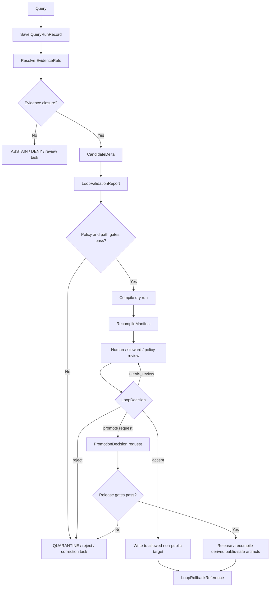

<!-- [KFM_META_BLOCK_V2]
doc_id: kfm://doc/NEEDS-VERIFICATION-ADR-0019-query-save-recompile-loop
title: ADR-0019: Query-Save-Recompile Loop
type: standard
version: v1
status: review
owners: OWNER_TBD_NEEDS_VERIFICATION
created: 2026-05-08
updated: 2026-05-08
policy_label: NEEDS_VERIFICATION
related: [./README.md, ./ADR-TEMPLATE.md, ./ADR-0002-responsibility-root-monorepo.md, ../../README.md, ../registers/VERIFICATION_BACKLOG.md, kfm://doc/NEEDS-VERIFICATION-pipeline-living-manual-v0.3, kfm://doc/NEEDS-VERIFICATION-build-companion]
tags: [kfm, adr, control-loop, query-save-recompile, pipeline, governance, evidence, policy, rollback]
notes: [
  Existing ADR status is proposed; this revision keeps the decision proposed until loop-control schemas, policies, fixtures, validators, dry-run compiler behavior, review evidence, and rollback proof are verified.
  Owners, policy label, doc_id, CODEOWNERS coverage, CI enforcement, and runtime implementation remain NEEDS VERIFICATION.
  Related PDF/manual sources are lineage and doctrine inputs, not implementation proof.
]
[/KFM_META_BLOCK_V2] -->

<a id="top"></a>

# ADR-0019: Query-Save-Recompile Loop

Governed incremental improvement for KFM documentation, registries, schemas, indexes, catalogs, and derived artifacts — never autonomous publication.

<p align="center">
  
  
  
  
  
  
</p>

<p align="center">
  <a href="#decision-summary">Decision</a> ·
  <a href="#context">Context</a> ·
  <a href="#decision">Rule</a> ·
  <a href="#loop-model">Loop model</a> ·
  <a href="#guardrails">Guardrails</a> ·
  <a href="#impact-map">Impact</a> ·
  <a href="#verification">Verification</a> ·
  <a href="#rollback-and-supersession">Rollback</a> ·
  <a href="#open-verification-backlog">Open verification</a>
</p>

> [!IMPORTANT]
> **ADR status:** `proposed`  
> **Decision date:** `2026-05-08`  
> **Scope:** `architecture/governance`  
> **Supersedes:** `none`  
> **Implementation status:** `NEEDS VERIFICATION`
>
> This ADR approves the **bounded design direction** for a query-save-validate-compile-review-promote-recompile loop. It does **not** claim that loop schemas, policies, validators, CI workflows, runtime services, dashboards, release gates, or emitted proof objects already exist.

---

## Decision summary

| Field | Determination |
|---|---|
| Decision | Adopt a governed query-save-recompile loop as a control-plane capability. |
| ADR status | `proposed` |
| Core sequence | `query -> save -> validate -> compile -> review -> promote -> recompile` |
| Allowed role | Improve docs, registers, source descriptors, schemas, policies, fixtures, indexes, catalogs, prompts/contracts, layer manifests, proof packs, and other **derived** artifacts after gates pass. |
| Forbidden role | Autonomous truth creation, autonomous source activation, direct publication, direct public model output, or mutation of canonical evidence without review. |
| Publication posture | `DENY` by default until release gates, review state, proof closure, and rollback target exist. |
| Primary invariant protected | `RAW -> WORK / QUARANTINE -> PROCESSED -> CATALOG / TRIPLET -> PUBLISHED` |
| Acceptance signal | Loop machine files and runtime paths stay blocked until fixtures, validators, policy gates, no-network dry-run, review evidence, and rollback path are verified. |

**Accepted direction:** KFM may add an incremental control loop that records governed query activity, evidence resolution, candidate deltas, validation results, deterministic recompilation manifests, review decisions, and rollback references.

**Boundary rule:** the loop may propose and rebuild; it may not approve itself, publish itself, treat generated text as evidence, save private chain-of-thought, bypass source policy, or expose internal lifecycle stages to public clients.

[Back to top](#top)

---

## Context

The KFM corpus introduces the query-save-recompile loop to make the system improvable without losing governance. The design pressure is real: KFM needs a way to capture useful queries, unresolved evidence gaps, candidate documentation improvements, registry corrections, schema suggestions, policy gaps, index rebuilds, and release-supporting derived artifacts.

The risk is also real. A self-improving loop can become a hidden authority surface if it is allowed to mutate truth-bearing files, activate sources, publish artifacts, or turn generated language into proof.

This ADR keeps the useful part and rejects the unsafe part.

### Current situation

| Item | Status | Meaning |
|---|---:|---|
| Existing ADR stub | `CONFIRMED` | A short ADR already exists at `docs/adr/ADR-0019-query-save-recompile-loop.md` with `proposed` status. |
| Loop doctrine | `CONFIRMED doctrine / PROPOSED implementation` | Project manuals describe the loop as governed, evidence-bound, policy-checked, receipt-emitting, reversible, and not autonomous. |
| Repo enforcement | `NEEDS VERIFICATION` | Current schemas, policies, validators, workflow YAML, runtime routes, and release behavior must be checked before implementation claims are made. |
| Object family names | `PROPOSED` | `QueryRunRecord`, `EvidenceResolutionRecord`, `CandidateDelta`, `LoopValidationReport`, `RecompileManifest`, `LoopDecision`, and `LoopRollbackReference` are the working control-loop object names. |
| Public release behavior | `DENY by default` | No loop output reaches `PUBLISHED` without review and release gates. |

### Why this is architecture-significant

The loop touches KFM’s most sensitive system seams:

- evidence resolution;
- documentation authority;
- schema and contract evolution;
- policy and validation gates;
- source descriptors and rights posture;
- derived artifact rebuilds;
- release readiness;
- rollback and correction lineage;
- AI / Focus Mode support behavior.

That makes the loop an ADR-level decision, not a background automation detail.

[Back to top](#top)

---

## Evidence basis

| Evidence item | Source / path / artifact | What it supports | Truth label |
|---|---|---|---|
| Existing ADR file | `docs/adr/ADR-0019-query-save-recompile-loop.md` | Current ADR path, initial proposed status, and initial decision summary. | `CONFIRMED` |
| ADR directory convention | `docs/adr/README.md` | ADRs belong in `docs/adr/`; ADRs record decisions and validation burden, not implementation proof. | `CONFIRMED` |
| ADR authoring convention | `docs/adr/ADR-TEMPLATE.md` | ADRs should expose evidence, truth labels, impact map, policy impact, validation, rollback, and supersession. | `CONFIRMED` |
| Responsibility-root placement | `docs/adr/ADR-0002-responsibility-root-monorepo.md` and Directory Rules doctrine | `docs/adr/` is the correct human-facing governance home; domain or loop topics do not become root folders. | `CONFIRMED doctrine / review revision` |
| Pipeline loop doctrine | `Kansas_Frontier_Matrix_Pipeline_Living_Implementation_Manual_v0.3` | Loop sequence, non-autonomous posture, object family additions, no-autopublish policy, no-chain-of-thought rule, and dry-run validation direction. | `CONFIRMED doctrine / PROPOSED implementation` |
| Build companion | `kfm_build_companion` | Loop guardrails and object family purposes. | `CONFIRMED doctrine / PROPOSED implementation` |
| Current implementation depth | Active repository files, tests, workflows, runtime logs, dashboards, branch protections | Not verified inside this ADR revision. | `NEEDS VERIFICATION` |

> [!CAUTION]
> Repeated corpus proposals are not implementation proof. This ADR may be accepted only as a governance decision until current repo evidence proves the corresponding machine surfaces.

[Back to top](#top)

---

## Decision

KFM will support a governed query-save-recompile loop only as a **reviewable control-plane lane**.

### Chosen option

Use a bounded loop:

```text
query -> save -> validate -> compile -> review -> promote -> recompile
```

### Operating rule

> The loop may create auditable records, propose candidate deltas, validate them, and recompile derived artifacts from approved inputs. It may not publish, approve, or treat its own output as canonical truth.

### Boundary rule

> No loop output may target `PUBLISHED`, public APIs, public map layers, Focus Mode answers, release manifests, or public exports without evidence closure, policy checks, review state, proof/release closure, and rollback target.

### Decision confidence

`PROPOSED` for implementation. `CONFIRMED` for governing doctrine direction.

[Back to top](#top)

---

## Loop model



### Stage rules

| Stage | Allowed action | Forbidden action |
|---|---|---|
| Query | Capture scope, actor class, intent, allowed evidence classes, and expected output class. | Capture private chain-of-thought, secrets, raw sensitive prompts, or unrestricted model context. |
| Save | Persist `QueryRunRecord`, receipts, and public-safe summaries under governed lifecycle paths. | Save generated text as evidence or write directly to `PUBLISHED`. |
| Validate | Check schemas, path rules, policy gates, source authority, evidence closure, and rights/sensitivity posture. | Treat schema pass as publication approval. |
| Compile | Rebuild derived docs, indexes, catalogs, layer manifests, or proof-supporting artifacts from validated inputs. | Recompile from unreviewed, raw, quarantine, or model-only material. |
| Review | Require reviewer/steward/policy decision when impact is material. | Let the loop approve itself. |
| Promote | Request promotion only through existing promotion/release gates. | Move files as a substitute for promotion. |
| Recompile | Rebuild release-scoped derivatives after approved changes. | Replace canonical records with derived artifacts. |

[Back to top](#top)

---

## Guardrails

### Non-negotiable constraints

1. The loop stores auditable records and summaries, not private chain-of-thought.
2. The loop records evidence refs, resolver outcomes, conflicts, receipts, and validation reports.
3. Generated text is not evidence.
4. Evidence-dependent claims must resolve `EvidenceRef -> EvidenceBundle` or return `ABSTAIN`.
5. The loop may propose `CandidateDelta` records but cannot self-promote them.
6. Recompile steps operate on validated inputs only.
7. Any public-facing effect requires `PromotionDecision`, `ReleaseManifest`, proof closure, review state, and rollback target.
8. Unknown rights, source role, sensitivity, public-release eligibility, exact-location exposure, or evidence closure fails closed.
9. No direct model-client, RAW, WORK, QUARANTINE, unpublished-candidate, or internal canonical-store public path is permitted.
10. Loop-produced artifacts must carry rollback references or remain blocked.

### Accepted inputs

The loop may consume or create:

- query scope summaries;
- public-safe request metadata;
- `EvidenceRef` lists;
- `EvidenceResolutionRecord` records;
- source descriptor review tasks;
- candidate documentation deltas;
- candidate registry deltas;
- candidate schema or contract deltas;
- candidate policy or validator deltas;
- candidate fixture deltas;
- validation reports;
- dry-run compile results;
- `RecompileManifest` records;
- review decisions;
- rollback references.

### Exclusions

The loop must not persist or publish:

| Excluded item | Reason |
|---|---|
| Private chain-of-thought | Not a KFM truth object. |
| Secrets, credentials, private tokens, or hidden prompts | Security and privacy risk. |
| Raw sensitive source content outside governed lifecycle paths | Bypasses source and sensitivity gates. |
| Unreviewed generated text as evidence | Violates evidence-first posture. |
| Direct public model output | Bypasses citation, policy, and runtime envelope validation. |
| Direct writes to `PUBLISHED` | Violates promotion-as-state-transition. |
| Live source activation decisions | Requires source descriptor, rights, cadence, sensitivity, and review gates. |
| Canonical truth mutations without review | Violates trust membrane and rollback discipline. |

[Back to top](#top)

---

## Object families

| Object | Purpose | Minimum fields / checks | Status |
|---|---|---|---|
| `QueryRunRecord` | Records governed query scope, actor class, evidence classes, retrieval set, outcome class, and follow-up deltas. | Query ID, scope, actor/tool, allowed evidence class, requested output class, timestamps, refs, receipt IDs, outcome. | `PROPOSED` |
| `EvidenceResolutionRecord` | Records which evidence refs were requested, resolved, missing, denied, or conflicted. | Resolver ID, evidence refs, bundle IDs, conflict flags, missing refs, DENY/ABSTAIN reasons. | `PROPOSED` |
| `CandidateDelta` | Describes a proposed change to docs, registers, schemas, policies, fixtures, indexes, catalogs, prompts/contracts, or derived artifacts. | Target path, operation, source basis, diff summary, stage target, risk class, rollback hint. | `PROPOSED` |
| `LoopValidationReport` | Validates candidate deltas against schemas, docs, policy, source authority, path rules, and lifecycle gates. | Checks run, pass/fail state, reason codes, policy obligations, blocked targets, reviewer needs. | `PROPOSED` |
| `RecompileManifest` | Records deterministic inputs, compiler/tool version, spec hash, rebuilt artifacts, output hashes, and rollback target. | Inputs, tool identity, spec hash, outputs, digests, stage, rollback ref, no-publication assertion. | `PROPOSED` |
| `LoopDecision` | Captures accept, reject, quarantine, needs_review, or promote-request decision. | Decision ID, reviewer/tool, outcome, reason codes, obligations, affected artifacts, next state. | `PROPOSED` |
| `LoopRollbackReference` | Describes how to undo accepted loop-produced changes or restore prior derived artifacts. | From/to refs, prior manifest, affected artifacts, correction state, reviewer, timestamp. | `PROPOSED` |

> [!NOTE]
> These objects should be shared governance objects, not scattered lane-specific inventions. Domain lanes may add fields only through schemas, contracts, and policy extensions that preserve the shared loop grammar.

[Back to top](#top)

---

## Options considered

| Option | Description | Benefits | Risks / costs | Outcome |
|---|---|---|---|---|
| No loop | Keep all improvements manual. | Lowest automation risk. | Loses evidence about useful queries, unresolved gaps, and repeatable recompile inputs. | Rejected. |
| Autonomous self-modifying loop | Let the loop write and publish changes directly. | Fastest visible iteration. | Bypasses evidence, policy, review, release, correction, and rollback. | Rejected. |
| Governed control-plane loop | Save auditable records, validate candidate deltas, dry-run compile, review, and promote only through gates. | Preserves learning while keeping evidence and release law intact. | Requires schemas, fixtures, validators, policy, review, and rollback discipline. | Accepted direction. |
| Documentation-only loop | Restrict the loop to docs and indexes forever. | Low risk. | Too narrow for schema, policy, catalog, and release-supporting recompile needs. | Deferred as a possible first slice, not final scope. |

### Rejected options

| Rejected option | Why rejected | What evidence could reopen it |
|---|---|---|
| Direct public output from the loop | Violates governed API and release-state boundaries. | None expected; this would require superseding core KFM doctrine. |
| Saving private chain-of-thought | Not a trust object; creates privacy, security, and audit risk. | None expected; public-safe summaries and receipts are sufficient. |
| Treating generated text as evidence | AI is interpretive, not authoritative. | None expected; generated text can point to evidence, not become evidence. |
| Auto-activating live connectors | Source rights, cadence, role, and sensitivity require review. | Only a separate source-activation ADR and policy-gated implementation could authorize a connector. |
| Recompile from RAW or QUARANTINE | Bypasses validation and public-safety gates. | None expected; recompile from validated inputs only. |

[Back to top](#top)

---

## Requirements and constraints

### KFM invariants checked

| Invariant | Decision effect | Status |
|---|---|---|
| `RAW -> WORK / QUARANTINE -> PROCESSED -> CATALOG / TRIPLET -> PUBLISHED` | Loop records may begin in governed work/control-loop space; public promotion still follows release gates. | `CONFIRMED doctrine / PROPOSED implementation` |
| Public clients use governed interfaces | Loop does not expose raw candidates or model output directly. | `PROPOSED / NEEDS VERIFICATION` |
| `EvidenceRef -> EvidenceBundle` before claims | Loop must abstain or deny when evidence cannot resolve. | `PROPOSED` |
| Promotion is a governed state transition | Loop can request promotion; it cannot approve or publish itself. | `PROPOSED` |
| AI is interpretive and subordinate | Loop-generated language must remain bounded by evidence, policy, review, and release state. | `PROPOSED` |
| Derived surfaces stay derived | Recompiled docs, indexes, catalogs, prompts/contracts, layer manifests, and proof-support artifacts are rebuildable carriers. | `PROPOSED` |
| Fail-closed policy | Unknown rights, source role, sensitivity, exact-location risk, or evidence closure blocks progress. | `PROPOSED` |
| Receipts, proofs, releases, corrections, rollback records stay separate | Loop creates process memory and rollback references; it does not collapse emitted trust objects. | `PROPOSED` |

### Non-goals

This ADR does **not** decide:

- exact runtime framework;
- exact package manager;
- exact schema dialect beyond the repo’s accepted schema-home ADR;
- exact workflow YAML names;
- exact UI component names;
- live source connector activation;
- model provider selection;
- release-signing implementation;
- domain-specific publication policy;
- branch protection settings;
- production dashboard implementation.

[Back to top](#top)

---

## Impact map

### Companion file families

> [!WARNING]
> The paths below are implementation targets and verification hooks, not claims of existing files. Use repo-native conventions if current evidence proves a stronger home.

| Path | Status | Purpose | Truth role | Update trigger |
|---|---:|---|---|---|
| `docs/adr/ADR-0019-query-save-recompile-loop.md` | `CONFIRMED target path` | Decision record for loop adoption and constraints. | Human-facing governance. | Any material change to loop scope, gates, or rollback. |
| `schemas/contracts/v1/control_loop/query_run_record.schema.json` | `PROPOSED` | Validate saved query iteration records. | Machine-checkable shape. | New required fields or changed retention policy. |
| `schemas/contracts/v1/control_loop/evidence_resolution_record.schema.json` | `PROPOSED` | Validate evidence resolution outcomes. | Machine-checkable shape. | Resolver behavior or evidence closure rules change. |
| `schemas/contracts/v1/control_loop/candidate_delta.schema.json` | `PROPOSED` | Validate proposed doc/schema/policy/source/test deltas. | Machine-checkable shape. | New delta target types or blocked target rules. |
| `schemas/contracts/v1/control_loop/loop_validation_report.schema.json` | `PROPOSED` | Validate loop validation report results. | Machine-checkable shape. | New validation gates or reason codes. |
| `schemas/contracts/v1/control_loop/recompile_manifest.schema.json` | `PROPOSED` | Validate deterministic compile inputs, outputs, hashes, and rollback target. | Machine-checkable shape. | Compiler behavior or artifact families change. |
| `schemas/contracts/v1/control_loop/loop_decision.schema.json` | `PROPOSED` | Validate accept/reject/quarantine/needs_review/promote-request decisions. | Machine-checkable shape. | Review states or reason-code catalog changes. |
| `schemas/contracts/v1/control_loop/loop_rollback_reference.schema.json` | `PROPOSED` | Validate rollback references for accepted loop changes. | Machine-checkable shape. | Rollback or correction semantics change. |
| `contracts/runtime/control_loop.md` | `PROPOSED` | Human-readable meaning of loop records and finite outcomes. | Semantic contract. | Object family or API/runtime envelope changes. |
| `policy/control_loop/no_autopublish.rego` | `PROPOSED` | Deny loop outputs that attempt direct publication. | Policy-as-code. | Publication gate or release-state rules change. |
| `policy/control_loop/tests/no_autopublish_test.rego` | `PROPOSED` | Positive/negative tests for no-autopublish behavior. | Policy proof support. | Policy rule changes. |
| `tools/loop/save_iteration.py` | `PROPOSED` | Save `QueryRunRecord` and safe receipts. | Implementation helper. | Schema or retention rule changes. |
| `tools/loop/compile_candidate.py` | `PROPOSED` | No-network compiler for candidate deltas and manifests. | Implementation helper. | Compile target families change. |
| `tools/validators/validate_control_loop.py` | `PROPOSED` | Validate closure, refs, policy decisions, hashes, and lifecycle target. | Validator. | Schema/policy/contract changes. |
| `tests/fixtures/control_loop/valid/query_run_record.min.json` | `PROPOSED` | Minimal valid fixture. | Test evidence. | Schema changes. |
| `tests/fixtures/control_loop/invalid/autopublish_target.json` | `PROPOSED` | Invalid fixture attempting publication without release gates. | Negative-path evidence. | Policy or publication gates change. |
| `pipelines/control_loop/no_network_dry_run.yaml` | `PROPOSED` | Fixture-only dry-run pipeline plan. | Pipeline specification. | Dry-run compiler behavior changes. |
| `.github/workflows/control-loop-dry-run.yml` | `PROPOSED / NEEDS VERIFICATION` | Thin orchestration for schema/policy/dry-run tests. | CI orchestration. | Workflow convention confirmed and validators exist. |
| `data/work/control_loop/` | `PROPOSED / NEEDS VERIFICATION` | Work-stage storage for loop candidate records. | Lifecycle state. | Retention, privacy, or stage rules change. |
| `data/receipts/control_loop/` | `PROPOSED / NEEDS VERIFICATION` | Process receipts for loop runs. | Process memory. | Receipt schema or retention changes. |

### Trust-surface impact

| Surface | Effect | Required check |
|---|---|---|
| Governed API | May expose loop status only through finite, policy-aware envelopes after implementation. | No public RAW/WORK/QUARANTINE/candidate access. |
| MapLibre shell | May show loop-derived trust state only after release-safe payloads exist. | Evidence Drawer and stale/correction state remain visible. |
| Evidence Drawer | May display loop IDs, evidence resolution status, validation state, and correction/rollback refs. | Claims resolve to EvidenceBundle or abstain. |
| Focus Mode / governed AI | May use loop records to improve prompts/contracts and abstention behavior. | No raw generated answer as truth; citation validation required. |
| Review console | Should surface candidate deltas and loop decisions when implemented. | Reviewer authority and obligations are explicit. |
| Catalog / search / graph projections | May be recompiled from approved records. | Projections remain derived and rebuildable. |

[Back to top](#top)

---

## Policy, rights, and sensitivity

| Question | Answer | Status |
|---|---|---|
| Does this decision affect public release eligibility? | Yes. It forbids loop publication without release gates. | `PROPOSED` |
| Does it affect exact location exposure? | Potentially. Candidate deltas may mention sensitive locations; policy must fail closed. | `NEEDS VERIFICATION` |
| Does it affect living persons, DNA, archaeology, rare species, land/title, infrastructure, or hazards? | Potentially, depending on query scope and source refs. | `NEEDS VERIFICATION` |
| Does it require review? | Yes for material candidate deltas, source activation, public surfaces, or policy-sensitive output. | `PROPOSED` |
| Does it change fail-closed behavior? | It adds loop-specific fail-closed gates, especially no-autopublish and evidence closure. | `PROPOSED` |
| Does it change rollback behavior? | It requires loop rollback references for accepted changes. | `PROPOSED` |
| Does it affect source rights or terms? | It can surface source-rights questions, but cannot resolve or bypass them. | `PROPOSED` |

> [!WARNING]
> If source role, rights, sensitivity, evidence closure, reviewer authority, or rollback target is unclear, the loop outcome is `QUARANTINE`, `ABSTAIN`, `DENY`, or `NEEDS_REVIEW` — not publication.

[Back to top](#top)

---

## Consequences

### Positive consequences

- KFM can remember useful queries and unresolved evidence gaps without saving private reasoning.
- Candidate improvements become reviewable objects rather than invisible edits.
- Documentation, schemas, registries, indexes, catalogs, and derived artifacts can improve without bypassing governance.
- Recompile outputs can be tied to inputs, hashes, tool identity, and rollback targets.
- Negative outcomes become first-class: `ABSTAIN`, `DENY`, `ERROR`, `QUARANTINE`, and `NEEDS_REVIEW`.
- Public release remains protected by proof, review, release, correction, and rollback gates.

### Costs and tradeoffs

| Risk | Mitigation | Residual status |
|---|---|---|
| Automation appears to be authority | Keep loop outputs as candidates until review and release gates pass. | `PROPOSED` |
| Chain-of-thought or secrets get persisted | Persist only safe summaries, hashes, refs, receipts, and bounded records. | `NEEDS VERIFICATION` |
| Generated text becomes proof | Require EvidenceBundle closure and citation validation. | `PROPOSED` |
| Loop writes to public surfaces | Add no-autopublish policy and invalid fixture. | `PROPOSED` |
| Schema/policy home conflict | Follow ADR-0001 and repo evidence before creating machine files. | `NEEDS VERIFICATION` |
| Recompile artifact swap | Use hashes, `RecompileManifest`, receipts, and rollback references. | `PROPOSED` |
| Review bottleneck | Use risk classes and finite outcomes rather than allowing self-approval. | `PROPOSED` |

[Back to top](#top)

---

## Verification

This ADR should not move from `proposed` to `accepted` until a maintainer can verify the minimum control-loop proof set.

### Required checks

| Check | Evidence required | Expected result | Status |
|---|---|---|---|
| ADR review | Review record or PR approval. | ADR accepted or explicitly kept proposed. | `NEEDS VERIFICATION` |
| Schema tests | Valid and invalid control-loop fixtures. | Valid fixtures pass; invalid fixtures fail. | `PROPOSED` |
| Policy tests | No-autopublish and unknown-rights fixtures. | Unsafe publication attempts return `DENY`. | `PROPOSED` |
| Evidence closure tests | Missing and resolved EvidenceRef fixtures. | Missing support yields `ABSTAIN`; resolved support may proceed. | `PROPOSED` |
| Compile dry-run | No-network candidate compile. | Emits `RecompileManifest`; writes no `PUBLISHED` files. | `PROPOSED` |
| Rollback tests | Manifest rollback fixture. | Every accepted compile has rollback target. | `PROPOSED` |
| Security tests | Persistence scan. | No chain-of-thought, secrets, private prompts, or raw sensitive text. | `PROPOSED` |
| Docs index check | ADR index and related docs updated. | ADR surfaced with correct status and successor links. | `NEEDS VERIFICATION` |
| Workflow check | Repo-native CI if enabled. | Thin orchestration invokes local validators; business logic stays in tools. | `NEEDS VERIFICATION` |

### Illustrative validation commands

```bash
# PROPOSED only — adapt to repo-native tooling after inspection.

python -m tools.validators.validate_schema \
  --schema schemas/contracts/v1/control_loop/query_run_record.schema.json \
  --fixtures tests/fixtures/control_loop/valid/*.json

python -m tools.validators.validate_control_loop \
  --candidate data/work/control_loop/iterations/qrun_fixture_001.json

conftest test tests/fixtures/control_loop \
  --policy policy/control_loop

python -m tools.loop.compile_candidate \
  --candidate tests/fixtures/control_loop/valid/candidate_delta.min.json \
  --dry-run \
  --emit-manifest data/work/control_loop/recompile_manifest.json
```

### Negative-path requirements

| Failure condition | Expected outcome |
|---|---|
| Missing evidence bundle | `ABSTAIN` with reason code. |
| Unknown rights or sensitivity | `DENY` or `QUARANTINE`. |
| Candidate delta targets `PUBLISHED` directly | `DENY`. |
| Candidate delta targets RAW rewrite | `DENY`. |
| Candidate includes private chain-of-thought | `ERROR` or `DENY`; do not persist. |
| Recompile lacks rollback target | Blocked validation. |
| Model output lacks citations | `ABSTAIN` or `DENY`. |
| Source activation requested without descriptor/review | `DENY` or `NEEDS_REVIEW`. |

[Back to top](#top)

---

## Rollback and supersession

### Rollback plan

If the loop design is rejected or unsafe:

1. Keep this ADR as lineage.
2. Mark it `rejected`, `withdrawn`, or `superseded`.
3. Remove or quarantine proposed control-loop schemas, policy files, fixtures, validators, and dry-run pipeline specs.
4. Preserve any reviewed loop records as audit lineage.
5. Invalidate dependent `RecompileManifest` records.
6. Restore prior derived artifacts from the previous manifest or release state.
7. Add correction notes if any public-facing artifact was affected.
8. Update ADR index, verification backlog, and related registers.

### Rollback triggers

| Trigger | Required action |
|---|---|
| Loop output reaches public surface without release gates | Disable loop writer and public route; open correction/rollback review. |
| Chain-of-thought or secrets persisted | Quarantine records, rotate affected secrets if any, repair persistence rules. |
| Generated text treated as evidence | Invalidate affected records; require EvidenceBundle closure. |
| Schema or policy authority conflict appears | Halt machine-file expansion until ADR-0001 and related roots are reconciled. |
| Missing rollback target | Block promotion or accepted write. |
| Source rights or sensitivity uncertainty appears | Quarantine affected candidate deltas and require steward/policy review. |

### Supersession rule

A future ADR may supersede this one only if it preserves:

- no autonomous publication;
- no generated truth;
- no private chain-of-thought persistence;
- `EvidenceRef -> EvidenceBundle` closure;
- fail-closed policy behavior;
- review state for material changes;
- release/proof/rollback separation;
- lineage-preserving rollback.

[Back to top](#top)

---

## Open verification backlog

| Item | Status | Why it matters |
|---|---:|---|
| Owners / CODEOWNERS for this ADR | `NEEDS VERIFICATION` | Decision review responsibility must be explicit. |
| Policy label | `NEEDS VERIFICATION` | Do not assume public/restricted classification from path alone. |
| ADR acceptance state | `NEEDS VERIFICATION` | Current status remains `proposed`. |
| Current schema home | `NEEDS VERIFICATION` | Machine files must follow the accepted schema-home ADR. |
| Current policy engine and Rego convention | `NEEDS VERIFICATION` | No-autopublish policy must use repo-native enforcement. |
| Current validator language | `NEEDS VERIFICATION` | Python paths are proposed until tooling convention is checked. |
| Current workflow inventory | `NEEDS VERIFICATION` | CI names and required checks cannot be claimed yet. |
| Existing loop files | `UNKNOWN` | This ADR names target companions, not confirmed implementation. |
| Runtime route behavior | `UNKNOWN` | No API route or public surface is authorized by this ADR alone. |
| Review console support | `UNKNOWN` | Candidate-delta review UI may not exist. |
| Dashboard / audit support | `UNKNOWN` | Observability must be implemented before operational claims. |
| Release gate integration | `NEEDS VERIFICATION` | PromotionDecision, ReleaseManifest, ProofPack, and rollback closure must be tested. |
| Sensitive-data retention behavior | `NEEDS VERIFICATION` | Loop records must not leak restricted content, private prompts, or secrets. |

[Back to top](#top)

---

## Review checklist

<details>
<summary>Pre-acceptance checklist</summary>

- [ ] ADR index lists this file with `proposed` or accepted successor status.
- [ ] Owners / reviewers are verified or explicitly recorded as placeholders.
- [ ] Policy label is verified.
- [ ] Related ADRs are linked and checked.
- [ ] Schema home is confirmed before machine files are created.
- [ ] Control-loop schemas have valid and invalid fixtures.
- [ ] `no_autopublish` policy exists and denies direct `PUBLISHED` targets.
- [ ] Validator checks evidence refs, policy decisions, hashes, and target lifecycle stage.
- [ ] No-network compile dry-run emits `RecompileManifest`.
- [ ] Compile dry-run writes no public artifacts.
- [ ] Rollback fixture proves prior manifest restoration.
- [ ] Persistence tests prove no private chain-of-thought, secrets, or raw sensitive prompts are saved.
- [ ] Generated text is not treated as evidence.
- [ ] Evidence-dependent outputs require EvidenceBundle closure.
- [ ] Public-client bypass tests fail closed.
- [ ] Follow-up docs, contracts, schemas, policy, tests, fixtures, validators, and release notes are identified.
- [ ] This ADR does not create a parallel source, schema, contract, policy, proof, release, or publication authority.

</details>

[Back to top](#top)

---

## Appendix A — Minimal acceptance bar

This ADR can be treated as implementation-ready only when the first no-network control-loop slice proves:

1. A `QueryRunRecord` can be saved with no private chain-of-thought.
2. An `EvidenceResolutionRecord` can distinguish resolved, missing, denied, and conflicted evidence.
3. A `CandidateDelta` cannot target `PUBLISHED` directly.
4. A `LoopValidationReport` blocks unsafe targets and unknown rights/sensitivity.
5. A `RecompileManifest` records inputs, tool identity, hashes, outputs, and rollback target.
6. A `LoopDecision` cannot self-approve promotion.
7. A `LoopRollbackReference` can restore or invalidate derived artifacts.
8. CI or local validation can run the slice without network access or model runtime.
9. Public clients remain behind governed APIs and released artifacts.
10. ADR index and verification backlog stay synchronized.

## Appendix B — Label quick reference

| Label | Use |
|---|---|
| `CONFIRMED` | Verified from current repo evidence, surfaced project docs, command output, tests, logs, workflows, schemas, manifests, generated artifacts, or direct source content. |
| `PROPOSED` | Recommended design, file, contract, schema, validator, policy, or runtime behavior not verified as implemented. |
| `UNKNOWN` | Not verified strongly enough to state as fact. |
| `NEEDS VERIFICATION` | Checkable, but not yet checked strongly enough to act as fact. |
| `CONFLICTED` | Evidence layers or authority homes disagree or are ambiguous. |
| `LINEAGE` | Historically important material that informs continuity but is not current implementation proof. |
| `DENY` | Access, publication, or promotion must not proceed under current conditions. |
| `ABSTAIN` | Evidence support is insufficient for a consequential claim. |
| `ERROR` | Tool, validation, execution, or environment failure. |
