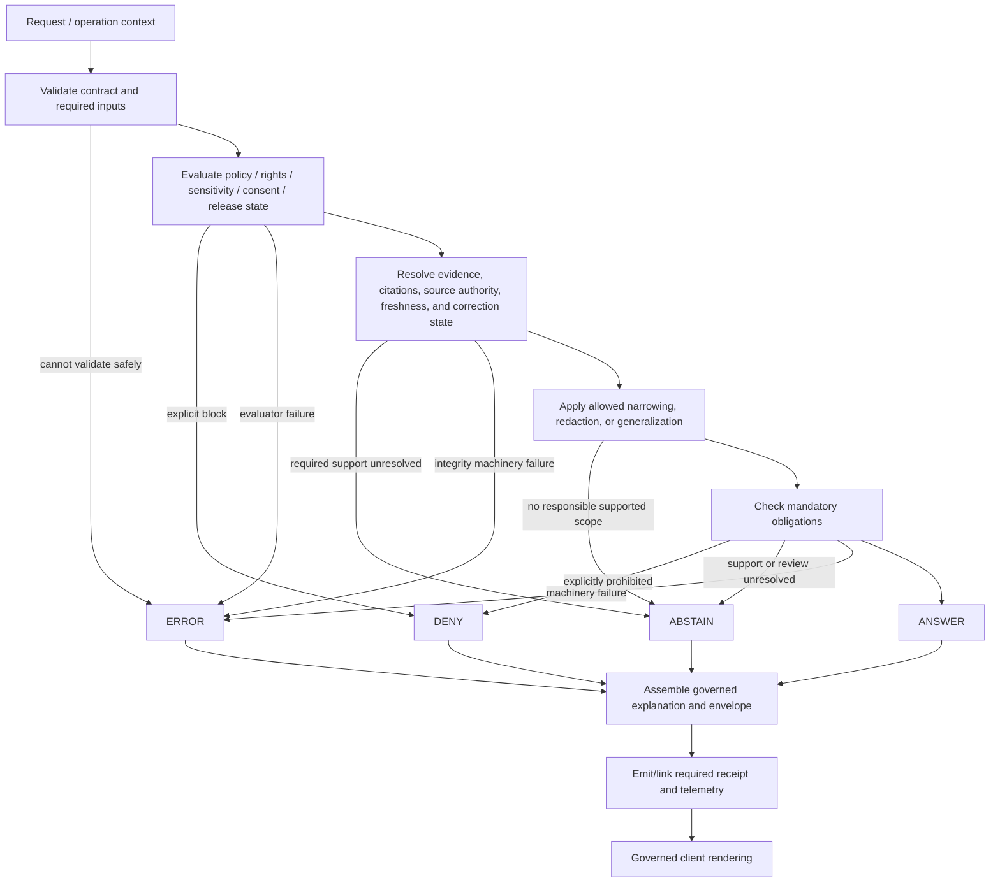

<!-- [KFM_META_BLOCK_V2]
doc_id: kfm://doc/adr-0020-abstain-is-a-first-class-decision
title: ADR-0020 — Abstain Is a First-Class Decision
type: adr
adr_id: ADR-0020
version: v1.2
status: proposed
effective_decision_status: proposed
owners:
  - "NEEDS VERIFICATION — architecture and governance stewardship"
  - "NEEDS VERIFICATION — runtime, policy, governed API, UI, evidence, citation, telemetry, contracts, schemas, and validation stewardship"
reviewers_required:
  - Architecture steward
  - Governance steward
  - Runtime and governed API steward
  - Policy steward
  - Evidence and citation steward
  - Sensitivity and rights reviewer
  - Contracts and schemas stewards
  - UI and accessibility steward
  - Telemetry and privacy reviewer
  - Validation and CI stewards
  - Docs steward
created: 2026-05-09
updated: 2026-07-24
policy_label: public
truth_posture: cite-or-abstain
responsibility_root: docs/
current_path: docs/adr/ADR-0020-abstain-is-a-first-class-decision.md
supersedes: []
superseded_by: null
evidence_snapshot:
  repository: bartytime4life/Kansas-Frontier-Matrix
  base_ref: main
  base_commit: 93ed9f61d0be8a5e656a9be81c12e01549736e99
  target_prior_blob: 87957312e453b226615351b1e4550606fdaa7652
  adr_index_blob: cf08fae322ac53426f7394d97897fdb942253049
  adr_readme_blob: f1b5d34a53b6c717832d587de54989ce8192bcaa
  directory_rules_blob: 18653c00ba193a4afaa3e07a0924452807fb98ef
  codeowners_blob: dd2a84aa514d8ecd9208bc347f90f9a2ed37dd61
  decision_envelope_contract_blob: b5120a208910f5e2907874b03af1fc8c7f43363d
  decision_envelope_schema_blob: 349782c8760f77e432ed1e9239d5ddc2ffe1f9b8
  policy_decision_contract_blob: ebfe97f98263e6309db6d2772cb2c5e548819650
  policy_decision_schema_blob: 1472d26a42c73f17545b4464a275412ffa1d098e
  runtime_response_schema_blob: 5105d419432a27176a8ee10870d75400cfa2ab8c
  ai_receipt_schema_blob: 2e0bebdb3a38acbc3c58a919db46970c6e829b4a
  run_receipt_schema_blob: 80d13bcb750d56c769da2f8871242388f7f50a69
  promotion_decision_schema_blob: a2d087a46772cf60e4b9dfb394892690e8a88b31
  governed_api_stub_blob: 5d7c137d2e78ddfca35a1356a96333ac2e84952b
  governed_api_boundary_test_blob: d84ccd2a93bdf786e8fca11ee596dcc47e543fc2
  policy_gate_register_blob: 10e66eb9d587797a3f12e2aaac00fb4e60ec7fa2
  runtime_policy_blob: b9bfee731553c504b514f07a6862ef3e68328f02
  focus_mock_workflow_blob: aa97ee5ad099d1e10922d037061abde17ceb3a93
  runtime_response_validator_blob: 11ddc64c4299d103b0eef383c2f7bdd3bb12f1f9
  runtime_response_valid_abstain_blob: 87a405408dc8d5ec0d6c789a9584e0a6b62b3c59
  runtime_response_valid_answer_blob: 9d70fe89627260f0c185ac492341e269fff4d108
  runtime_proof_placeholder_blob: ee28fd9bb6eebee6453d8d8e432d3a0e92bfdd23
inspection_boundary: >
  Current-session GitHub reads, bounded repository search, the ADR inventory and operating
  contract, Directory Rules, CODEOWNERS, runtime and policy semantic contracts and schemas,
  the release PromotionDecision schema, AIReceipt and RunReceipt schemas, governed API
  scaffold and boundary tests, the policy-gate register, runtime policy stub, generic runtime
  envelope fixtures and validator, and Focus mock workflow source. No deployed policy
  evaluator, evidence resolver, citation service, receipt store, telemetry backend, public
  client, production ruleset, release environment, or live governed request was exercised.
related:
  - docs/adr/README.md
  - docs/adr/INDEX.md
  - docs/adr/ADR-0004-apps-governed-api-is-the-trust-membrane.md
  - docs/adr/ADR-0008-ollama-subordinate-to-governed-api.md
  - docs/adr/ADR-0010-deny-by-default-for-dna-rare-species-archaeology-infrastructure.md
  - docs/adr/ADR-0016-telemetry-redaction-posture.md
  - docs/adr/ADR-0018-promotion-gate-sequence.md
  - docs/adr/ADR-0019-ai-adapter-contract-and-finite-envelopes.md
  - docs/adr/ADR-0021-quarantine-has-structured-exit-paths.md
  - docs/adr/ADR-0025-public-client-never-reads-canonical-internal-stores.md
  - docs/architecture/directory-rules.md
  - docs/doctrine/truth-posture.md
  - docs/doctrine/trust-membrane.md
  - contracts/policy/policy_decision.md
  - contracts/runtime/decision_envelope.md
  - contracts/runtime/runtime_response_envelope.md
  - contracts/runtime/ai_receipt.md
  - contracts/runtime/run_receipt.md
  - contracts/release/promotion_decision.md
  - schemas/contracts/v1/policy/policy_decision.schema.json
  - schemas/contracts/v1/runtime/decision_envelope.schema.json
  - schemas/contracts/v1/runtime/runtime_response_envelope.schema.json
  - schemas/contracts/v1/runtime/ai_receipt.schema.json
  - schemas/contracts/v1/runtime/run_receipt.schema.json
  - schemas/contracts/v1/release/promotion_decision.schema.json
  - apps/governed-api/src/governed_api/stub.py
  - apps/governed-api/tests/test_boundary_guards.py
  - control_plane/policy_gate_register.yaml
  - policy/runtime/README.md
  - fixtures/contracts/v1/runtime/runtime_response_envelope/
  - tools/validators/validate_runtime_response_envelope.py
  - tests/runtime_proof/test_envelope_finite_outcomes.py
  - .github/workflows/focus-mock-test.yml
tags: [kfm, adr, abstain, finite-outcomes, cite-or-abstain, decision-envelope, policy-decision, runtime-response-envelope, evidence, policy, trust-membrane, fail-closed]
notes:
  - "v1.2 is a same-path repository-grounded modernization. It preserves status proposed and does not accept ADR-0020."
  - "The repository confirms finite ANSWER/ABSTAIN/DENY/ERROR enums for PolicyDecision, DecisionEnvelope, RuntimeResponseEnvelope, and AIReceipt, but not for every status-bearing object."
  - "RunReceipt currently uses SUCCESS/PARTIAL/FAIL and PromotionDecision uses APPROVE/DENY/ABSTAIN; these vocabularies remain separate from finite runtime/policy decision outcomes."
  - "The Governed API currently emits deterministic capability-family ABSTAIN/NOT_IMPLEMENTED scaffolds; this proves a bounded fail-closed shape, not complete abstention semantics."
  - "The policy-gate register is present, PROPOSED, and empty; no accepted canonical reason-code registry is established."
  - "Generic RuntimeResponseEnvelope fixtures cover ANSWER and ABSTAIN shape, while the runtime behavioral test remains an assert-true placeholder and the Focus mock workflow records explicit holds."
[/KFM_META_BLOCK_V2] -->

<a id="top"></a>

# ADR-0020 — Abstain Is a First-Class Decision

> **Proposed decision.** KFM treats `ABSTAIN` as a normal, inspectable finite outcome whenever a governed policy or runtime decision cannot support a responsible answer but has not established an explicit prohibition and has not suffered a machinery failure. `ABSTAIN` preserves the cite-or-abstain posture without collapsing policy denial, runtime error, lifecycle state, review state, process status, or release authority into one ambiguous label.

[](#status)
[](#current-repository-evidence)
[](#current-implementation-maturity)
[](#reason-codes-and-explanations)
[](#current-implementation-maturity)
[](#current-implementation-maturity)
[](#authority-and-publication-boundary)

> [!IMPORTANT]
> **Identity is confirmed; acceptance is not.** [`docs/adr/INDEX.md`](./INDEX.md) uniquely assigns `ADR-0020` to this exact file and records both source metadata and effective decision status as `proposed`. Editing this file, merging a pull request, validating an envelope, or passing CI does not accept the decision.

> [!CAUTION]
> **Current `ABSTAIN` behavior is narrow scaffolding.** The Governed API returns deterministic `ABSTAIN` / `NOT_IMPLEMENTED` envelopes for three scaffolded routes. Runtime policy remains a greenfield stub, the canonical reason-code register is empty, and no repository evidence establishes evidence resolution, citation validation, complete receipt emission, public-client rendering, or end-to-end abstention behavior.

> [!WARNING]
> **The four finite outcomes are not the universal vocabulary of every KFM object.** `ANSWER | ABSTAIN | DENY | ERROR` applies to finite policy/runtime decision fields. Current `PromotionDecision` uses `APPROVE | DENY | ABSTAIN`; current `RunReceipt` uses `SUCCESS | PARTIAL | FAIL`; workflows use job conclusions and hold markers; review records and lifecycle states have their own controlled vocabularies. These axes must map explicitly and must not be silently collapsed.

**Quick navigation:** [Status](#status) · [Evidence](#evidence-boundary) · [Context](#context) · [Decision](#decision) · [Outcome boundary](#finite-outcome-boundary) · [Abstain rules](#abstain-semantics) · [Reason codes](#reason-codes-and-explanations) · [Composition](#composition-and-narrowed-scope) · [Objects](#object-and-vocabulary-boundaries) · [Flow](#governed-decision-flow) · [Security](#security-privacy-and-safe-explanation) · [Receipts](#receipts-observability-and-correction) · [Authority](#authority-and-publication-boundary) · [Current evidence](#current-repository-evidence) · [Maturity](#current-implementation-maturity) · [Convergence](#implementation-and-convergence-plan) · [Acceptance](#acceptance-gates) · [Consequences](#consequences) · [Alternatives](#alternatives-considered) · [Risks](#risk-and-open-question-ledger) · [Rollback](#rollback-and-supersession) · [Verification](#verification-checklist) · [References](#references)

---

<a id="status"></a>

## Status

| Field | Current value |
|---|---|
| **ADR ID** | `ADR-0020` — unique and confirmed in [`INDEX.md`](./INDEX.md) |
| **Tracked path** | `docs/adr/ADR-0020-abstain-is-a-first-class-decision.md` |
| **Source metadata** | `proposed` |
| **Effective decision status** | `proposed` |
| **Decision class** | Runtime/policy finite-outcome semantics, cite-or-abstain behavior, reason-code discipline, public explanation, receipt linkage, and safe composition |
| **Current repository maturity** | Proposed contracts and shape validation plus a deterministic API ABSTAIN scaffold; runtime policy and behavioral proof held |
| **Implementation effect of this revision** | Documentation only |
| **Publication effect** | None |
| **Supersedes / superseded by** | None / none |

### Acceptance versus implementation

Two states remain independent:

1. **ADR acceptance** would approve the finite-outcome boundary and the normative `ABSTAIN` semantics described here.
2. **Implementation graduation** would require accepted contracts and schemas, meaningful policy, a governed reason-code registry, deterministic outcome logic, evidence and citation integration, receipt linkage, UI behavior, telemetry, correction handling, negative tests, and observed fail-closed behavior.

An accepted ADR without those implementation gates would be governing doctrine, not proof that runtime abstention is operational. Conversely, a schema enum, valid fixture, deterministic stub response, green workflow, or deployed endpoint cannot accept this ADR.

[Back to top](#top)

---

<a id="evidence-boundary"></a>

## Evidence boundary

This revision is grounded in current repository bytes at `main@93ed9f61d0be8a5e656a9be81c12e01549736e99`.

### Truth labels

| Label | Meaning in this ADR |
|---|---|
| **CONFIRMED** | Verified from current repository files, schemas, tests, workflow source, or exact readback |
| **PROPOSED** | Decision, mapping, reason code, obligation, path role, migration, or implementation target not accepted or operationally proved |
| **NEEDS VERIFICATION** | Checkable state not verified strongly enough to act as fact |
| **UNKNOWN** | Not resolved by the inspected surfaces |
| **CONFLICTED** | Tracked surfaces make incompatible claims requiring reviewed resolution |
| **HELD** | Current automation intentionally blocks graduation while preserving visible readiness checks |

### Inspected surfaces

- canonical ADR inventory and ADR operating contract;
- Directory Rules and CODEOWNERS;
- this ADR’s prior bytes;
- `PolicyDecision` contract and schema;
- `DecisionEnvelope` contract and schema;
- `RuntimeResponseEnvelope` schema and generic fixtures;
- `AIReceipt` and `RunReceipt` schemas;
- release `PromotionDecision` schema;
- Governed API ABSTAIN scaffold and boundary tests;
- `control_plane/policy_gate_register.yaml`;
- runtime policy README;
- runtime envelope validator;
- runtime-proof placeholder test;
- Focus mock readiness workflow.

### What this evidence cannot prove

This revision does not prove:

- ADR-0020 is accepted;
- runtime policy is executable;
- evidence references resolve;
- citation validation is implemented;
- an `ANSWER`, `DENY`, or `ERROR` runtime path is implemented;
- ABSTAIN reason codes are canonical or complete;
- every public-trust ABSTAIN emits a persisted receipt;
- public clients distinguish all finite outcomes correctly;
- telemetry counts outcomes or reason codes;
- rulesets require the relevant checks;
- a release, deployment, or publication occurred.

[Back to top](#top)

---

<a id="context"></a>

## Context

KFM’s durable truth posture is **cite-or-abstain**. A governed system should decline to make a consequential claim when the required support cannot be resolved, rather than filling the gap with plausible text, a stale layer, a default value, a silent cache result, or a confidence score.

That principle fails if every negative state is called “error,” if policy denial is disguised as uncertainty, or if a missing citation produces a blank `200 OK`. It also fails when the four runtime decision outcomes are applied indiscriminately to unrelated object families.

The architectural problem has five parts:

1. **Evidence insufficiency must remain distinct from policy prohibition.**
2. **Policy prohibition must remain distinct from machinery failure.**
3. **Operational, review, lifecycle, release, and receipt states must remain separate axes.**
4. **Public explanations must be useful without leaking protected details.**
5. **A shape-valid enum is not behavioral proof.**

### Current repository signals

The repository now contains meaningful but incomplete pieces:

- `PolicyDecision` and `DecisionEnvelope` have proposed, schema-paired finite outcome contracts.
- `RuntimeResponseEnvelope` has a closed proposed schema and generic valid fixtures for `ANSWER` and `ABSTAIN`.
- The Governed API emits deterministic capability-family `ABSTAIN / NOT_IMPLEMENTED` scaffolds.
- `AIReceipt` has a proposed schema that carries a finite outcome and accountability references.
- The policy-gate register exists but has no entries.
- Runtime policy is a greenfield stub.
- The runtime finite-outcome behavior test is an `assert True` placeholder.
- The Focus mock workflow explicitly reports `WORKFLOW_HOLD`.

These surfaces establish a contract and readiness baseline. They do not establish a complete decision engine, reason-code system, receipt path, UI contract, telemetry pipeline, or public trust behavior.

[Back to top](#top)

---

<a id="decision"></a>

## Decision

KFM proposes the following architecture-wide rules.

### D1 — `ABSTAIN` is a first-class finite policy/runtime outcome

`ABSTAIN` is a normal decision result, not a hidden exception, degraded success, pending status, or generic error. A caller must be able to render, log, test, count, and correct it without inventing an answer.

### D2 — The finite outcome set is closed for designated decision fields

Fields explicitly defined as finite policy/runtime outcomes use exactly:

```text
ANSWER | ABSTAIN | DENY | ERROR
```

Adding `PENDING`, `PARTIAL`, `DEFERRED`, `REVIEW`, `UNKNOWN`, `HOLD`, `QUARANTINE`, or provider-specific values to such a field requires a reviewed contract/schema/ADR change.

This rule does not rename:

- `PromotionDecision.decision`;
- `RunReceipt.outcome`;
- workflow conclusions;
- review outcomes;
- lifecycle phases;
- operational states;
- release states;
- correction or withdrawal states.

### D3 — `ABSTAIN` is used only when the evaluator is functioning and support is unresolved or insufficient

A finite decision returns `ABSTAIN` when:

- the operation is within the decision surface’s scope;
- the evaluator can run;
- no explicit policy rule has prohibited the operation;
- required evidence, citation, source authority, freshness, scope, corroboration, or review support is unresolved or insufficient;
- no safe, supported narrowed-scope `ANSWER` is available.

### D4 — `DENY` and `ERROR` remain distinct

- `DENY` means an explicit policy, rights, sensitivity, consent, role, access, release, or governance rule blocks the requested operation.
- `ERROR` means the decision machinery, contract validation, integrity check, dependency, or evaluator could not produce a trustworthy governed decision.

### D5 — `ANSWER` requires affirmative support

`ANSWER` is not the default left after other branches fail. It requires the evidence, policy, citation, freshness, correction, release, and obligation support appropriate to the surface.

### D6 — Negative outcomes carry safe, inspectable support

`ABSTAIN`, `DENY`, and `ERROR` must include stable reason information and safe explanation appropriate to the caller. Any required obligations, evidence handles, correction state, or receipt linkage must be explicit rather than inferred from prose.

### D7 — Public clients receive governed envelopes only

Browsers, map shells, review tools, exports, and AI-assisted surfaces receive finite outcomes through the governed API or another accepted trust-membrane interface. They do not infer a decision from internal stores, provider responses, model text, workflow logs, or file placement.

### Non-goals

This ADR does not:

- accept its own decision;
- define every reason code;
- define a universal status vocabulary for all KFM objects;
- make a `DecisionEnvelope` a `PolicyDecision`, `PromotionDecision`, receipt, review, or release object;
- require that every internal non-consequential function create a persisted receipt;
- authorize model or provider use;
- authorize public rendering;
- resolve every schema overlap or compatibility alias;
- replace domain-specific rights, sensitivity, consent, release, or correction rules.

[Back to top](#top)

---

<a id="finite-outcome-boundary"></a>

## Finite outcome boundary

### Canonical decision semantics

| Outcome | Use when | Must not be used as |
|---|---|---|
| `ANSWER` | The requested operation may proceed under the applicable evidence, policy, citation, freshness, correction, release, and obligation requirements. | “Best guess,” low-confidence fallback, partial result with hidden scope reduction, or default success |
| `ABSTAIN` | The evaluator ran, no explicit prohibition controls, but required support is unresolved or insufficient and no responsible narrowed answer is available. | Machinery failure, explicit policy denial, pending workflow state, review status, quarantine state, or empty success |
| `DENY` | A policy, rights, sensitivity, consent, access, role, release, or governance rule explicitly blocks the operation. | Missing evidence, transient runtime outage, or generic validation failure |
| `ERROR` | The governed decision path cannot be trusted or completed because of shape, integrity, evaluator, dependency, configuration, or process failure. | Evidence uncertainty, policy denial, or a way to avoid recording ABSTAIN |

### Deterministic classification order

For a decision that requires all evaluated supports, the proposed order is:

1. **Can the decision machinery produce a trustworthy result?**  
   If no, return `ERROR`.
2. **Does an explicit policy or governance rule block the requested operation?**  
   If yes, return `DENY`.
3. **Can required evidence, citations, source authority, freshness, scope, and review support be resolved?**  
   If no, return `ABSTAIN`.
4. **Can every mandatory obligation be satisfied?**  
   If no, return the outcome required by the applicable policy contract—normally `DENY` for a prohibited operation or `ABSTAIN` when review/support is unresolved.
5. **Otherwise**, return `ANSWER`.

This order is a proposed contract rule. It is not established as executable repository behavior.

### Why `NOT_IMPLEMENTED` currently maps to `ABSTAIN`

The current Governed API scaffold returns:

```text
outcome = ABSTAIN
reason_code = NOT_IMPLEMENTED
policy_family = capability
```

That is a bounded design choice for the scaffold: the route exists as a capability surface, but the capability is not implemented, no protected payload is exposed, and the response refuses to fabricate a result. This does not mean every unimplemented dependency should map to `ABSTAIN`. A required evaluator failing during an otherwise active operation may be `ERROR`.

[Back to top](#top)

---

<a id="abstain-semantics"></a>

## `ABSTAIN` semantics

### Required posture

An `ABSTAIN` decision should make the following visible where the governing contract permits:

| Concern | Requirement |
|---|---|
| Decision identity | Stable `decision_id` or response identity |
| Outcome | Exact value `ABSTAIN` |
| Policy family | The family whose decision was requested |
| Primary reason | Stable `reason_code` when the envelope supports it |
| Additional reasons | Safe, machine-usable reason list |
| Evaluated time | Timestamp that is not rewritten to disguise staleness |
| Evidence posture | Refs attempted, refs unresolved, or an empty set when no evidence lookup was performed |
| Obligations | Safe downstream duties such as narrow scope, await review, refresh, or display notice |
| Freshness/correction | Client-facing envelope state when material |
| Next responsible action | Structured next step when an accepted contract supports it |
| Receipt link | AIReceipt, RunReceipt, or decision/validation record link when the event class requires one |

### Current schema limits

Current repository schemas do **not** fully enforce this target:

- `DecisionEnvelope` requires `decision_id`, `outcome`, `policy_family`, `reasons`, `obligations`, and `evaluated_at`; `reason_code` and `evidence_refs` are optional.
- `RuntimeResponseEnvelope` requires one `reason_code`, evidence refs, policy state, freshness, and correction state, but has no `reasons[]`, `obligations[]`, `next_step`, or receipt reference.
- `AIReceipt` records adapter/model and digest/policy/citation references but has no public explanation fields.
- `RunReceipt` uses process outcomes and is not an ABSTAIN envelope.

Those differences are not silently normalized here. A future contract/schema convergence change must decide whether to add fields, link objects, or preserve the separation through explicit identifiers.

### Forbidden behavior

An `ABSTAIN` must not trigger:

- fluent completion around unresolved evidence;
- unmarked cached or stale fallback;
- a blank or ambiguous success response;
- automatic exposure of internal diagnostic detail;
- substitution of model confidence for evidence;
- substitution of a map, tile, screenshot, graph edge, summary, or index for the abstained claim;
- silent conversion to `ANSWER` for UI convenience;
- silent conversion to `ERROR` to reduce abstention metrics;
- silent conversion to `DENY` merely because support is missing;
- mutation or deletion of prior decision or receipt history.

[Back to top](#top)

---

<a id="reason-codes-and-explanations"></a>

## Reason codes and explanations

### Current repository state

`control_plane/policy_gate_register.yaml` is present, marked `PROPOSED`, and has:

```yaml
entries: []
```

Therefore:

- no repository-wide reason-code vocabulary is established by the register;
- existing strings such as `NOT_IMPLEMENTED` are observed implementation values, not automatically canonical;
- the old ADR’s detailed failure-state table is retained below as a **proposed seed vocabulary**, not a confirmed registry.

### Proposed reason families

| Proposed reason | Default finite outcome | Boundary |
|---|---|---|
| `NO_EVIDENCE` | `ABSTAIN` | No admissible evidence is available for the requested scope |
| `EVIDENCE_UNRESOLVED` | `ABSTAIN` | Required EvidenceRef cannot resolve |
| `EVIDENCE_STALE` | `ABSTAIN` | No policy-acceptable fresh support exists |
| `EVIDENCE_CONFLICTED` | `ABSTAIN` | Conflicting support prevents a responsible answer |
| `SOURCE_AUTHORITY_UNRESOLVED` | `ABSTAIN` | Source-role or authority support is unresolved |
| `SCOPE_TOO_BROAD` | `ABSTAIN` | Request must be narrowed before it can be cited |
| `REVIEW_REQUIRED` | `ABSTAIN` | Required review support is not yet resolved, where policy does not already deny |
| `NOT_IMPLEMENTED` | `ABSTAIN` for an explicitly scaffolded capability; otherwise context-dependent | Capability surface intentionally refuses unsupported operation |
| `RIGHTS_BLOCKED` | `DENY` | Rights policy explicitly prohibits the operation |
| `SENSITIVITY_BLOCKED` | `DENY` | Sensitivity policy explicitly prohibits requested precision or exposure |
| `CONSENT_BLOCKED` | `DENY` | Consent policy explicitly prohibits the operation |
| `RELEASE_STATE_BLOCKED` | `DENY` | Requested material is not released for the surface |
| `ACCESS_BLOCKED` | `DENY` | Caller, role, audience, or export policy blocks access |
| `POLICY_EVALUATOR_ERROR` | `ERROR` | Policy machinery cannot produce a trustworthy decision |
| `SCHEMA_INVALID` | `ERROR` | Required decision or response shape is invalid |
| `INTEGRITY_FAILURE` | `ERROR` | Digest, signature, canonicalization, or reference-integrity failure |
| `CITATION_VALIDATOR_ERROR` | `ERROR` | Citation machinery cannot run reliably |
| `RUNTIME_DEPENDENCY_ERROR` | `ERROR` | Required runtime dependency fails |
| `CITATION_UNRESOLVED` | `ABSTAIN` | Citation support is missing or unresolved without integrity evidence |
| `SAFE_SCOPE_APPLIED` | `ANSWER` with an explicit narrowed scope | A policy-safe, cited generalized answer is available |

### Public and internal explanation split

Reason handling should distinguish:

- **stable machine code** for contracts, tests, metrics, and correction;
- **safe public explanation** that avoids protected details;
- **restricted steward detail** stored only where policy permits;
- **next action** such as narrow scope, refresh, inspect evidence gap, or await review.

A public reason must not expose exact sensitive locations, private person data, DNA/genomic details, confidential source terms, credentials, raw prompt content, hidden policy input, exploit details, or private model reasoning.

### Register discipline

A future accepted register should define, for each reason code:

- identifier;
- description;
- default finite outcome;
- allowed policy families;
- public explanation template;
- restricted detail class;
- expected obligations;
- retryability;
- correction and supersession rules;
- owner and review date;
- deprecation aliases.

Reason codes should be appended or superseded, not silently repurposed.

[Back to top](#top)

---

<a id="composition-and-narrowed-scope"></a>

## Composition and narrowed scope

### No universal severity arithmetic

The prior ADR proposed:

```text
ERROR > DENY > ABSTAIN > ANSWER
```

as a universal max-severity function. Current repository evidence does not establish that function in policy, contracts, schemas, or tests. It is too coarse for every composition context.

A composed decision must declare:

- whether subdecisions are conjunctive, disjunctive, advisory, or independent;
- which failures invalidate the whole operation;
- which policy denial controls;
- whether a safe narrower operation is permitted;
- whether partial results are represented as separate scoped answers or withheld.

### Proposed conjunctive composition

For an operation that requires every support:

1. any machinery failure that prevents a trustworthy aggregate decision produces `ERROR`;
2. otherwise, any explicit policy prohibition for the requested operation produces `DENY`;
3. otherwise, any unresolved required support produces `ABSTAIN`;
4. otherwise, all obligations are evaluated;
5. only then may the aggregate outcome be `ANSWER`.

### Narrowed-scope `ANSWER`

When policy permits a cited answer at a safer or smaller scope:

```text
outcome = ANSWER
requested_scope != answered_scope
reason_code = SAFE_SCOPE_APPLIED
```

The response must make the scope change and any generalization/redaction obligations visible.

A system must not call a response “partial” and leave the supported scope implicit. Either:

- produce one or more explicit, independently supported `ANSWER` scopes; or
- return `ABSTAIN` for the unsupported requested scope.

### Mixed collections

A collection response may carry per-item outcomes only if its contract defines them. A top-level `ANSWER` must not hide denied or abstained items without a manifest of omissions and reasons.

[Back to top](#top)

---

<a id="object-and-vocabulary-boundaries"></a>

## Object and vocabulary boundaries

| Surface | Current vocabulary | Role | Must not be treated as |
|---|---|---|---|
| `PolicyDecision.outcome` | `ANSWER | ABSTAIN | DENY | ERROR` | One policy evaluation result | Runtime response, release decision, or receipt |
| `DecisionEnvelope.outcome` | `ANSWER | ABSTAIN | DENY | ERROR` | Runtime-facing decision carrier | Full client response or policy execution |
| `RuntimeResponseEnvelope.outcome` | `ANSWER | ABSTAIN | DENY | ERROR` | Governed API/client-facing finite response posture | Evidence closure, model truth, or release approval |
| `AIReceipt.outcome` | `ANSWER | ABSTAIN | DENY | ERROR` | AI run accountability metadata | User response, evidence, or policy decision |
| `PromotionDecision.decision` | `APPROVE | DENY | ABSTAIN` | Governed lifecycle/release readiness decision | Runtime answer or PolicyDecision |
| `RunReceipt.outcome` | `SUCCESS | PARTIAL | FAIL` | Process execution result | Policy or runtime finite decision |
| Workflow conclusion | GitHub job/run status | Automation execution result | Policy result, review record, or release approval |
| Workflow hold marker | `WORKFLOW_HOLD`, `WORKFLOW_SKIPPED_EXPLICIT` | Explicit readiness boundary | Failed policy decision or runtime response |
| Operational state | e.g. normal/degraded/escalate/quarantine, where defined | Routing and operating posture | Finite outcome |
| Review state | Review-lane vocabulary | Human/steward workflow state | Runtime finite outcome |
| Lifecycle state | RAW, WORK, QUARANTINE, PROCESSED, CATALOG/TRIPLET, PUBLISHED | Governed data state | Runtime decision |

### Mapping requirements

Any adapter between vocabularies must document:

- source object and field;
- source value;
- target object and field;
- target value;
- reason and obligation mapping;
- loss of information;
- correction and replay behavior;
- tests for every mapped value.

No mapping may infer `ANSWER` from process `SUCCESS`, release `APPROVE`, a green workflow, or a published-looking path without all applicable governed checks.

[Back to top](#top)

---

<a id="governed-decision-flow"></a>

## Governed decision flow



### Flow constraints

- Evidence retrieval precedes consequential answer generation.
- Policy evaluation is explicit; missing policy support does not default to allow.
- A model may assist interpretation only after the governed context is bounded.
- Citation validation and post-policy checks remain required where the surface uses generated synthesis.
- The client renders only the governed envelope and its permitted payload.
- No flow edge writes publication state merely because it returns `ANSWER`.

The diagram is a proposed architecture. Current repository evidence establishes only selected contracts, shape validation, API ABSTAIN scaffolding, and readiness holds.

[Back to top](#top)

---

<a id="security-privacy-and-safe-explanation"></a>

## Security, privacy, and safe explanation

### Fail closed without leaking

Negative outcomes must not reveal the protected content they are withholding.

| Risk | Required posture |
|---|---|
| Sensitive exact location | Public explanation says precision is restricted; do not include coordinates or reverse-engineerable hints |
| Living-person or DNA/genomic material | Explain that policy blocks or support is unavailable without revealing attributes, relationships, identifiers, or inferred status |
| Rights or source terms | Provide safe category and steward route; do not expose confidential terms or credentials |
| Access denial | Do not reveal whether a protected record exists unless policy allows that disclosure |
| Integrity failure | Return a safe error class; retain detailed diagnostics in restricted logs |
| Prompt injection | Treat source content as data, not instruction; do not echo malicious content as explanation |
| Model or provider failure | Do not expose provider secrets, raw payloads, stack traces, tokens, or model internals |
| Chain-of-thought | Never store or expose private reasoning traces as an abstention explanation or receipt field |

### Unresolved handles

Preserve unresolved handles only when safe and useful:

- stable EvidenceRef or source identifiers may be retained in restricted receipts;
- public envelopes should expose only handles allowed by policy;
- private object existence, precise locations, consent state, and source restrictions may require redaction or omission;
- omission itself must not be interpreted as no evidence exists.

### Client behavior

A client receiving `ABSTAIN` should:

- show a distinct, non-error abstention state;
- present the safe reason;
- show a next step when available;
- preserve requested and answered scope;
- avoid retries that bypass policy or rate limits;
- never substitute another provider, stale payload, hidden source, or generated summary automatically.

[Back to top](#top)

---

<a id="receipts-observability-and-correction"></a>

## Receipts, observability, and correction

### Receipt boundary

A finite decision and a receipt are different objects.

- `DecisionEnvelope` or `PolicyDecision` records the decision.
- `RuntimeResponseEnvelope` carries client-facing response posture.
- `AIReceipt` records accountability for AI-mediated execution.
- `RunReceipt` records process execution using its own outcome vocabulary.
- Release decisions, correction records, and rollback records remain under their own contracts.

### Proposed receipt policy

| Event | Proposed accountability record |
|---|---|
| AI-mediated `ABSTAIN` after a model/adapter run | `AIReceipt` linked to the decision and citation-validation result |
| AI request blocked before model invocation | Policy/DecisionEnvelope record; AIReceipt only if the accepted contract defines pre-invocation attempts as AI runs |
| Non-AI governed decision | Decision/validation record plus RunReceipt where a process run occurred |
| Public response assembly | RuntimeResponseEnvelope plus trace link to applicable decision/receipt objects |
| Correction or withdrawal of prior response lineage | New correction/withdrawal record and new decision; do not mutate historical receipts |

The repository does not currently establish complete receipt persistence or these linkage rules. They remain proposed.

### Observability target

Outcome telemetry should support:

- counts by surface, domain, policy family, and outcome;
- ABSTAIN counts by reason code;
- time-to-resolution where a steward action is expected;
- repeated unresolved evidence/source/citation clusters;
- transition counts from ABSTAIN to later ANSWER, DENY, or ERROR;
- policy and schema version;
- safe latency and dependency state;
- correction and supersession linkage.

### Privacy controls

Telemetry must not capture:

- raw prompts or provider payloads;
- private chain-of-thought;
- full EvidenceBundles;
- exact sensitive locations;
- protected person or DNA data;
- source credentials;
- confidential policy inputs;
- public explanations that can be joined to re-identify protected subjects.

### Current observability state

No current-session evidence establishes an operational ABSTAIN dashboard, reason-code metrics, alert thresholds, or persistent receipt store. Those remain `UNKNOWN` or `NEEDS VERIFICATION`.

[Back to top](#top)

---

<a id="authority-and-publication-boundary"></a>

## Authority and publication boundary

| Responsibility | Authority home | Effect of this ADR |
|---|---|---|
| Architecture decision | `docs/adr/` | Records the proposed decision only |
| Semantic outcome meaning | `contracts/policy/`, `contracts/runtime/`, affected object-family contracts | Must align after acceptance |
| Machine shape | `schemas/contracts/v1/` | Must enforce accepted fields and enums |
| Executable allow/deny/abstain rules | `policy/` | Not implemented by this ADR |
| Runtime decision code | governed API/runtime/package implementation roots | Not implemented by this ADR |
| Evidence closure | evidence resolver and EvidenceBundle authority | Not supplied by an envelope |
| Citation validation | accepted citation-validation implementation | Not supplied by generated prose |
| Fixtures and tests | `fixtures/`, `tests/` | Must prove positive and negative behavior |
| Validators | `tools/validators/` | Check shape and invariants; do not decide truth |
| Receipts and proofs | governed data receipt/proof roots | Not created by this ADR |
| Release decisions and publication | `release/` and governed publication flows | Never granted by an `ANSWER` alone |
| Public rendering | governed API and accepted clients | Must obey envelope and obligations |

### Invariants

1. `ABSTAIN` does not publish.
2. `ANSWER` does not publish by itself.
3. An envelope does not create evidence.
4. A reason code does not resolve evidence.
5. A receipt records an event; it does not make the event correct.
6. A green workflow does not become a policy decision.
7. A path named `published` does not substitute for release authority.
8. A client cannot bypass governed interfaces because a provider is reachable.
9. Generated language never outranks EvidenceBundle support.
10. Correction and rollback remain visible and append-only.

[Back to top](#top)

---

<a id="current-repository-evidence"></a>

## Current repository evidence

| Surface | Status | Safe conclusion |
|---|---:|---|
| ADR identity and index row | **CONFIRMED** | ADR-0020 exists at this exact path and remains proposed |
| `PolicyDecision` contract/schema | **CONFIRMED PROPOSED** | Closed finite outcome shape exists |
| `DecisionEnvelope` contract/schema | **CONFIRMED PROPOSED** | Closed finite outcome runtime decision shape exists |
| `RuntimeResponseEnvelope` schema | **CONFIRMED PROPOSED** | Closed client-facing shape exists with finite outcome and state fields |
| RuntimeResponseEnvelope valid fixtures | **CONFIRMED narrow** | Observed valid cases cover `ABSTAIN` and `ANSWER`; not all outcomes |
| RuntimeResponseEnvelope validator | **CONFIRMED generic shape runner** | Validates selected fixtures against the schema; does not prove semantics |
| Runtime finite-outcome behavior test | **CONFIRMED placeholder** | Contains one `assert True`; no behavioral outcome proof |
| Governed API ABSTAIN scaffold | **CONFIRMED executable** | Emits deterministic capability-family `ABSTAIN / NOT_IMPLEMENTED` objects |
| Governed API boundary tests | **CONFIRMED bounded** | Check route manifest, method handling, selected forbidden imports, and internal-path literals |
| Runtime policy | **CONFIRMED stub** | No accepted runtime decision policy is established |
| Policy-gate register | **CONFIRMED empty / PROPOSED** | No canonical reason-code entries exist |
| AIReceipt schema | **CONFIRMED PROPOSED** | Finite outcome and accountability fields exist; persistence unproved |
| RunReceipt schema | **CONFIRMED PROPOSED** | Uses `SUCCESS | PARTIAL | FAIL`, not the runtime finite-decision vocabulary |
| PromotionDecision schema | **CONFIRMED PROPOSED** | Uses `APPROVE | DENY | ABSTAIN`, not the runtime finite-decision vocabulary |
| Focus mock workflow | **CONFIRMED explicit HOLD** | Performs readiness checks; runs no mock Focus request or model |
| UI outcome rendering | **NEEDS VERIFICATION** | No complete public-client ABSTAIN/DENY/ERROR behavior was established |
| Reason-code telemetry | **UNKNOWN** | No operational metrics backend or dashboard was exercised |
| Receipt persistence | **UNKNOWN** | No persisted ABSTAIN receipt flow was exercised |
| Release/publication | **NOT ESTABLISHED** | No outcome or envelope authorizes publication |

### Material corrections from v1.1

- Closes the stale claim that ADR numbering and repository paths are unknown.
- Limits the four-outcome rule to designated policy/runtime decision fields.
- Separates `RunReceipt` and `PromotionDecision` vocabularies.
- Reclassifies the reason-code table as a proposed seed because the register is empty.
- Records that the current API ABSTAIN is a capability scaffold, not complete evidence behavior.
- Records generic fixture coverage as `ANSWER` plus `ABSTAIN`, not all four outcomes.
- Records the behavior test and runtime policy as scaffolds.
- Downgrades universal receipt, metrics, next-step, UI, and composition claims to proposed acceptance gates.
- Preserves cite-or-abstain, no-silent-fallback, safe narrowing, and public trust-membrane intent.

[Back to top](#top)

---

<a id="current-implementation-maturity"></a>

## Current implementation maturity

### Maturity ladder

| Level | Description | Current evidence |
|---|---|---|
| **M0 — vocabulary proposed** | ADR and contract prose name the finite outcomes | **CONFIRMED** |
| **M1 — shape bounded** | Schemas and generic fixtures enforce finite values | **PARTIALLY CONFIRMED** |
| **M2 — deterministic decision behavior** | Executable policy/decision logic covers all outcomes and boundaries | **NOT ESTABLISHED** |
| **M3 — governed response assembly** | Runtime emits complete client envelope with evidence, policy, freshness, correction, and receipt links | **NOT ESTABLISHED** |
| **M4 — client and telemetry enforcement** | Clients render outcomes distinctly; metrics and alerts are operational | **NOT ESTABLISHED** |
| **M5 — reviewed production operation** | Rulesets, incident response, correction, replay, and public evidence are verified | **UNKNOWN** |

### Present safe claim

The current repository supports this statement:

> KFM has proposed, schema-paired finite decision and response-envelope surfaces; a deterministic Governed API scaffold demonstrates a fail-closed `ABSTAIN / NOT_IMPLEMENTED` response; automation explicitly holds runtime graduation while policy, all-outcome behavior, receipts, evidence/citation integration, and public clients remain unestablished.

It does not support:

- “ABSTAIN is enforced everywhere”;
- “all KFM statuses use the four outcomes”;
- “every ABSTAIN writes a receipt”;
- “the reason-code register is canonical and populated”;
- “all four outcomes have behavioral tests”;
- “the UI renders abstention correctly”;
- “green focus-mock-test proves governed AI.”

[Back to top](#top)

---

<a id="implementation-and-convergence-plan"></a>

## Implementation and convergence plan

### Phase 0 — preserve the hold

Keep the current ABSTAIN scaffold and workflow holds until accepted behavioral evidence exists. Do not replace them with optimistic `ANSWER` behavior.

### Phase 1 — decide object ownership and mappings

- confirm `PolicyDecision`, `DecisionEnvelope`, and `RuntimeResponseEnvelope` roles;
- decide whether compatibility field `DecisionEnvelope.decision` remains;
- define explicit mappings to `PromotionDecision` and `RunReceipt`;
- record object identifiers and trace links;
- reconcile any competing Focus-local envelope schema.

### Phase 2 — establish reason-code authority

- populate a reviewed reason-code register;
- define default outcomes and allowed policy families;
- separate safe public explanations from restricted details;
- define deprecation and alias rules;
- add register validation and negative tests.

### Phase 3 — converge contracts and schemas

- decide which ABSTAIN fields belong in each object;
- add or link `next_step`, receipt reference, attempted evidence, freshness, correction, and obligations where required;
- prevent conflicting `outcome` and compatibility `decision` fields;
- version breaking changes;
- add valid and invalid fixtures.

### Phase 4 — implement deterministic policy/runtime decisions

Build a no-network decision engine or reference evaluator that proves:

- supported `ANSWER`;
- unresolved-support `ABSTAIN`;
- explicit-policy `DENY`;
- machinery-failure `ERROR`;
- safe narrowed-scope `ANSWER`;
- obligation failure;
- sensitive-detail-safe explanations;
- correction and stale-state behavior.

### Phase 5 — complete runtime response assembly

The governed API should:

- evaluate explicit inputs;
- resolve evidence and citations;
- call policy;
- produce a DecisionEnvelope/PolicyDecision;
- assemble a complete RuntimeResponseEnvelope;
- link applicable AIReceipt/RunReceipt/validation records;
- never expose internal stores or raw model/provider responses.

### Phase 6 — wire clients and accessibility

- render `ABSTAIN` distinctly from `DENY`, `ERROR`, and loading;
- display safe reason and next action;
- preserve scope and correction state;
- support keyboard and assistive technology;
- test export, map, Evidence Drawer, Focus Mode, story, and review surfaces;
- forbid silent stale/default fallback.

### Phase 7 — telemetry and incident operation

- count outcomes and reason codes safely;
- define alerts for repeated unresolved support;
- verify redaction and retention;
- test incident deactivation;
- test correction/withdrawal propagation;
- verify no confidential information appears in logs or metrics.

### Phase 8 — review and acceptance

Only after the applicable acceptance gates close should maintainers consider an explicit reviewed ADR status transition and update the canonical index in the same change.

[Back to top](#top)

---

<a id="acceptance-gates"></a>

## Acceptance gates

ADR-0020 should remain `proposed` until equivalent evidence closes every applicable gate.

### Governance and ownership

- [ ] Named architecture, runtime, policy, evidence, citation, UI, telemetry, contracts, schemas, validation, and docs owners are accepted.
- [ ] Required-review and branch/ruleset behavior is verified.
- [ ] ADR and index carry matching reviewed status.
- [ ] Reason-code ownership and deprecation process are accepted.

### Contract and schema

- [ ] PolicyDecision, DecisionEnvelope, RuntimeResponseEnvelope, AIReceipt, RunReceipt, and PromotionDecision mappings are documented.
- [ ] Finite-outcome fields reject non-canonical values.
- [ ] Compatibility fields cannot contradict canonical outcomes.
- [ ] ABSTAIN-required fields and links are machine-checkable where intended.
- [ ] Breaking changes are versioned with migration fixtures.
- [ ] No parallel canonical schema or contract home remains unresolved.

### Policy and reason codes

- [ ] Runtime policy is executable and fail-closed.
- [ ] Reason-code register is populated and validated.
- [ ] Each reason defines outcome, policy family, public explanation, obligations, retryability, and owner.
- [ ] Explicit denial is not misclassified as abstention.
- [ ] Machinery failure is not misclassified as abstention.
- [ ] Missing support cannot become answer by default.

### Behavioral proof

- [ ] Deterministic fixtures cover `ANSWER`, `ABSTAIN`, `DENY`, and `ERROR`.
- [ ] Boundary fixtures cover evidence missing, stale, conflicted, source unresolved, policy block, sensitive denial, evaluator failure, schema failure, and safe narrowing.
- [ ] Negative fixtures prove no silent fallback.
- [ ] Composition tests cover conjunctive and mixed-scope behavior.
- [ ] Runtime proof tests are substantive, not assert-true placeholders.
- [ ] Tests run without network by default.

### Receipts and observability

- [ ] Applicable ABSTAIN events link or emit accepted accountability records.
- [ ] Receipt and envelope identifiers are traceable without exposing protected content.
- [ ] Historical decisions and receipts are append-only and correctable.
- [ ] Outcome/reason telemetry is privacy-reviewed.
- [ ] Alerting and backlog thresholds are documented and tested.

### Governed API and clients

- [ ] Governed API emits the accepted complete response envelope.
- [ ] No public client calls model/provider or internal stores directly.
- [ ] UI surfaces distinguish `ABSTAIN`, `DENY`, `ERROR`, and loading.
- [ ] Safe explanation and next-step behavior is accessible.
- [ ] Freshness, correction, withdrawal, and narrowed scope are visible.
- [ ] Public responses never reveal protected reason detail.

### Release and rollback

- [ ] `ANSWER` cannot bypass release/publication gates.
- [ ] Provider/runtime failure returns a safe envelope.
- [ ] Correction and withdrawal invalidate affected derivatives and caches.
- [ ] Rollback/deactivation preserves envelope compatibility.
- [ ] No acceptance check itself publishes data.

[Back to top](#top)

---

<a id="consequences"></a>

## Consequences

### Positive

- Evidence insufficiency becomes visible without being mislabeled as system failure.
- Explicit policy denial stays distinct from uncertainty.
- Clients can present trustworthy negative states.
- Generated language cannot silently fill evidence gaps.
- Reason codes make repeated support gaps inspectable.
- Provider and runtime failures remain auditable.
- Object-family vocabularies stay separated instead of collapsing into one “status.”
- Corrections and later recovery can reference the original abstention.

### Costs

- Contracts and schemas need convergence work.
- Reason-code governance becomes a maintained control surface.
- UI design must support a non-error non-answer state.
- Receipt and telemetry paths add operational burden.
- Outcome classification requires negative tests and domain review.
- Safe explanations require redaction and privacy discipline.
- Legacy statuses need explicit mapping rather than cosmetic renaming.

### Tradeoff

KFM accepts additional implementation and review cost in exchange for reducing unsupported claims, hidden denial, ambiguous errors, and public trust drift.

[Back to top](#top)

---

<a id="alternatives-considered"></a>

## Alternatives considered

| Alternative | Disposition |
|---|---|
| Treat `ABSTAIN` as `ERROR` | Rejected: evidence insufficiency and machinery failure have different remedies and trust meaning |
| Treat missing support as `DENY` | Rejected: lack of support is not always an explicit prohibition |
| Use one universal status vocabulary for every object | Rejected: process, release, review, lifecycle, workflow, and runtime objects have different responsibilities |
| Permit free-text finite statuses | Rejected: prevents deterministic clients, tests, and audit |
| Allow low-confidence or stale fallback | Rejected: violates cite-or-abstain unless the narrowed/stale posture is explicitly policy-passed and disclosed |
| Require a persisted receipt for every internal branch | Rejected as overbroad: accountability requirements should be event- and materiality-aware |
| Use a universal severity max for every composition | Rejected as overbroad: composition depends on operation semantics and must be declared |
| Keep ABSTAIN only for AI surfaces | Rejected: access, render, capability, consent, sensitivity, and other governed runtime decisions also need an unresolved-support outcome |
| Make UI loading or pending equivalent to ABSTAIN | Rejected: transport/UI activity state is not a governed decision |
| Let provider-specific errors define public outcomes | Rejected: provider details remain behind governed normalization |

[Back to top](#top)

---

<a id="risk-and-open-question-ledger"></a>

## Risk and open-question ledger

| ID | Status | Question or risk | Safe interim posture |
|---|---|---|---|
| `ABST-01` | **OPEN** | Which file is the accepted canonical reason-code register? | Do not call the current empty register canonical for runtime reasons |
| `ABST-02` | **OPEN** | Should `reason_code` be required in DecisionEnvelope? | Require non-empty `reasons[]`; preserve observed primary code where available |
| `ABST-03` | **OPEN** | Where do `next_step` and attempted evidence handles belong? | Do not invent fields in instances; use linked records until contracts converge |
| `ABST-04` | **OPEN** | When is an AIReceipt required if a request is blocked before model invocation? | Do not fabricate an AI run; record the governing decision and trace |
| `ABST-05` | **OPEN** | How should compatibility `decision` and canonical `outcome` coexist? | When both exist, require equality; plan deprecation deliberately |
| `ABST-06` | **OPEN** | Which composition profiles are canonical? | Use explicit per-operation composition; do not apply universal max severity |
| `ABST-07` | **OPEN** | Which unresolved review states map to ABSTAIN versus DENY? | Follow the applicable policy: unresolved support normally abstains; explicit prohibition denies |
| `ABST-08` | **OPEN** | How are safe narrowed-scope answers represented? | Expose requested and answered scopes plus transform obligations |
| `ABST-09` | **OPEN** | What telemetry is safe for sensitive domains? | Aggregate and redact; do not record protected facts |
| `ABST-10` | **OPEN** | What is the recovery/correction contract for a later ANSWER? | Append new decision and link supersession; never mutate the prior event |
| `ABST-11` | **RISK** | Current API scaffold can be mistaken for full abstention implementation | Keep explicit NOT_IMPLEMENTED and documentation holds |
| `ABST-12` | **RISK** | Generic fixtures can be mistaken for behavior proof | Keep runtime-proof and workflow graduation gates explicit |
| `ABST-13` | **RISK** | Empty reason register encourages ad hoc strings | Block “canonical reason” claims until register governance lands |
| `ABST-14` | **RISK** | Outcome metrics can incentivize misclassification | Audit outcome shifts and pair counts with reason/quality review |
| `ABST-15` | **NEEDS VERIFICATION** | Public client rendering and accessibility | Require client-specific fixtures and tests before acceptance |
| `ABST-16` | **NEEDS VERIFICATION** | Receipt persistence, retention, and erasure/correction behavior | Exercise accepted receipt store and policy before claims |

[Back to top](#top)

---

<a id="rollback-and-supersession"></a>

## Rollback and supersession

### Documentation rollback

This revision is documentation-only. Roll back by reverting its commit or restoring the prior target blob recorded in the metadata block. That changes no runtime decision, envelope, receipt, policy, release, or public state.

### Decision supersession

If ADR-0020 is later accepted and then replaced:

1. author a successor ADR;
2. record reciprocal supersession links;
3. retain this record;
4. version affected contracts and schemas;
5. preserve historical decisions and receipts;
6. provide explicit outcome/reason migrations;
7. update the canonical ADR index;
8. test old and new client compatibility;
9. verify telemetry and correction continuity.

### Runtime rollback

A safe runtime rollback should:

```text
active decision implementation
  -> disable affected evaluator/provider/path
  -> preserve governed API
  -> return safe ABSTAIN, DENY, or ERROR according to the remaining trustworthy state
  -> preserve historical decision/receipt identifiers
  -> require reviewed reactivation
```

Rollback must not:

- default to `ANSWER`;
- expose raw provider or internal errors;
- silently change outcome semantics;
- delete historical abstentions;
- remove reason-code aliases without migration;
- bypass release/correction controls.

[Back to top](#top)

---

<a id="verification-checklist"></a>

## Verification checklist

| Check | Result |
|---|---|
| ADR identity and exact path | **CONFIRMED** |
| Source metadata | **CONFIRMED proposed** |
| Effective decision status | **CONFIRMED proposed** |
| Same-path documentation update | **PASS** |
| Directory Rules responsibility | **CONFIRMED** — `docs/adr/` owns the decision record |
| PolicyDecision finite enum | **CONFIRMED PROPOSED** |
| DecisionEnvelope finite enum | **CONFIRMED PROPOSED** |
| RuntimeResponseEnvelope finite enum | **CONFIRMED PROPOSED** |
| AIReceipt finite enum | **CONFIRMED PROPOSED** |
| PromotionDecision separate enum | **CONFIRMED PROPOSED** |
| RunReceipt separate enum | **CONFIRMED PROPOSED** |
| Governed API ABSTAIN scaffold | **CONFIRMED executable** |
| Governed API full evidence/policy/citation path | **NOT ESTABLISHED** |
| Runtime policy | **CONFIRMED greenfield stub** |
| Reason-code register | **CONFIRMED empty / PROPOSED** |
| Generic RuntimeResponseEnvelope validator | **CONFIRMED** |
| Generic valid outcome fixtures | **CONFIRMED ANSWER and ABSTAIN** |
| DENY and ERROR valid behavior fixtures | **NOT ESTABLISHED in observed generic valid set** |
| Runtime behavior test | **CONFIRMED assert-true placeholder** |
| Focus mock workflow | **CONFIRMED explicit HOLD** |
| Receipt persistence | **NOT ESTABLISHED** |
| UI rendering and accessibility | **NEEDS VERIFICATION** |
| Outcome telemetry | **UNKNOWN** |
| Local ADR validator and repository tests for this edit | **NOT RUN** |
| Pull-request automation | **PENDING after PR creation** |
| Release or publication | **NOT CLAIMED** |

Remote repository reads establish exact bytes, contract shapes, and declared workflow behavior. They do not substitute for running policy, evidence, citation, receipt, UI, telemetry, correction, release, or production systems.

[Back to top](#top)

---

<a id="references"></a>

## References

### Governing and adjacent ADRs

- [`docs/adr/README.md`](./README.md)
- [`docs/adr/INDEX.md`](./INDEX.md)
- [`ADR-0004 — Governed API Trust Membrane`](./ADR-0004-apps-governed-api-is-the-trust-membrane.md)
- [`ADR-0008 — Ollama Subordinate to Governed API`](./ADR-0008-ollama-subordinate-to-governed-api.md)
- [`ADR-0010 — Deny by Default for Sensitive Domains`](./ADR-0010-deny-by-default-for-dna-rare-species-archaeology-infrastructure.md)
- [`ADR-0016 — Telemetry Redaction Posture`](./ADR-0016-telemetry-redaction-posture.md)
- [`ADR-0018 — Promotion Gate Sequence`](./ADR-0018-promotion-gate-sequence.md)
- [`ADR-0019 — AI Adapter Contract and Finite Envelopes`](./ADR-0019-ai-adapter-contract-and-finite-envelopes.md)
- [`ADR-0021 — Structured Quarantine Exit Paths`](./ADR-0021-quarantine-has-structured-exit-paths.md)
- [`ADR-0025 — Public Client Never Reads Canonical/Internal Stores`](./ADR-0025-public-client-never-reads-canonical-internal-stores.md)
- [`Directory Rules`](../architecture/directory-rules.md)

### Contracts and schemas

- [`PolicyDecision` contract](../../contracts/policy/policy_decision.md)
- [`PolicyDecision` schema](../../schemas/contracts/v1/policy/policy_decision.schema.json)
- [`DecisionEnvelope` contract](../../contracts/runtime/decision_envelope.md)
- [`DecisionEnvelope` schema](../../schemas/contracts/v1/runtime/decision_envelope.schema.json)
- [`RuntimeResponseEnvelope` contract](../../contracts/runtime/runtime_response_envelope.md)
- [`RuntimeResponseEnvelope` schema](../../schemas/contracts/v1/runtime/runtime_response_envelope.schema.json)
- [`AIReceipt` contract](../../contracts/runtime/ai_receipt.md)
- [`AIReceipt` schema](../../schemas/contracts/v1/runtime/ai_receipt.schema.json)
- [`RunReceipt` contract](../../contracts/runtime/run_receipt.md)
- [`RunReceipt` schema](../../schemas/contracts/v1/runtime/run_receipt.schema.json)
- [`PromotionDecision` contract](../../contracts/release/promotion_decision.md)
- [`PromotionDecision` schema](../../schemas/contracts/v1/release/promotion_decision.schema.json)

### Current implementation and validation evidence

- [`Governed API ABSTAIN scaffold`](../../apps/governed-api/src/governed_api/stub.py)
- [`Governed API boundary tests`](../../apps/governed-api/tests/test_boundary_guards.py)
- [`Policy-gate register`](../../control_plane/policy_gate_register.yaml)
- [`Runtime policy stub`](../../policy/runtime/README.md)
- [`RuntimeResponseEnvelope fixtures`](../../fixtures/contracts/v1/runtime/runtime_response_envelope/)
- [`RuntimeResponseEnvelope validator`](../../tools/validators/validate_runtime_response_envelope.py)
- [`Runtime finite-outcome placeholder`](../../tests/runtime_proof/test_envelope_finite_outcomes.py)
- [`Focus mock readiness workflow`](../../.github/workflows/focus-mock-test.yml)

---

## Last reviewed

**2026-07-24** — repository-grounded review against `main@93ed9f61d0be8a5e656a9be81c12e01549736e99`.

Review again when:

- this ADR changes status;
- the reason-code register gains entries or moves;
- PolicyDecision, DecisionEnvelope, or RuntimeResponseEnvelope changes shape;
- the compatibility `decision` field is removed or constrained;
- a deterministic policy/runtime evaluator lands;
- DENY and ERROR runtime fixtures/tests land;
- receipt persistence and trace linkage land;
- public clients implement finite-outcome rendering;
- outcome telemetry becomes operational;
- correction or supersession behavior changes;
- rulesets or required checks change;
- six months pass without review.

[Back to top](#top)
