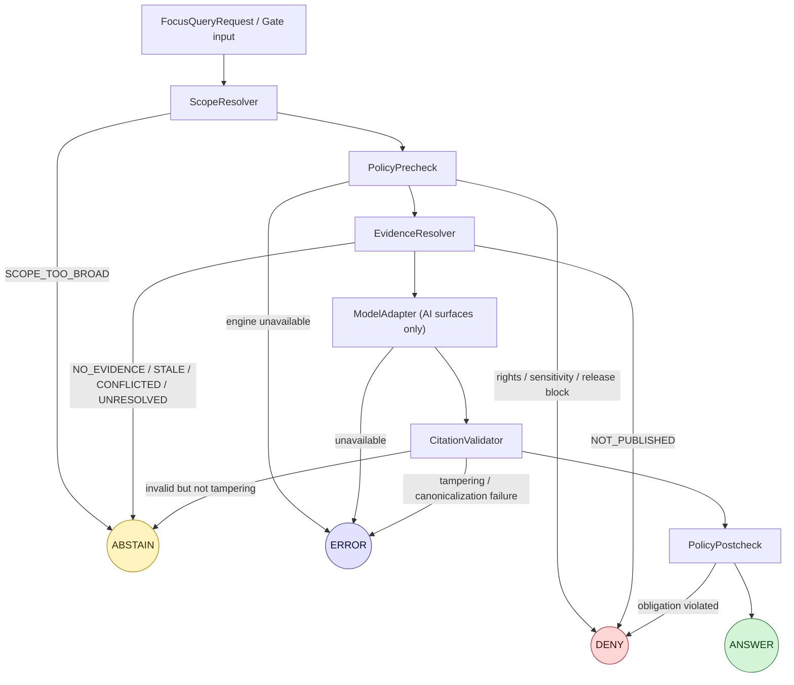

<!-- [KFM_META_BLOCK_V2]
doc_id: kfm://doc/adr-0020
title: ADR-0020 — Abstain Is a First-Class Decision
type: adr
version: v1.1
status: proposed
owners: TODO — governance-steward, runtime-steward
created: 2026-05-09
updated: 2026-05-15
policy_label: public
related:
  - docs/doctrine/truth-posture.md
  - docs/doctrine/lifecycle-law.md
  - docs/doctrine/trust-membrane.md
  - docs/doctrine/directory-rules.md
  - docs/architecture/governed-api.md
  - docs/adr/ADR-0001-schema-home.md
  - schemas/contracts/v1/runtime/decision_envelope.schema.json
  - schemas/contracts/v1/runtime/runtime_response_envelope.schema.json
  - schemas/contracts/v1/runtime/ai_receipt.schema.json
  - schemas/contracts/v1/runtime/run_receipt.schema.json
  - policy/runtime/
  - control_plane/policy_gate_register.yaml
tags: [kfm, adr, doctrine, runtime, governed-ai, policy, finite-outcomes, cite-or-abstain]
notes:
  - "ADR-0020 number is user-assigned; conflicts with any existing ADR in [0011..0020] MUST be resolved before merge."
  - "All path claims are PROPOSED until verified against mounted-repo evidence."
  - "v1.1 clarifies evidence boundaries, fixes the decision-flow diagram, adds receipt minimums, and strengthens acceptance checks without changing the core decision."
[/KFM_META_BLOCK_V2] -->

# ADR-0020 — Abstain Is a First-Class Decision

> **In KFM, *abstain* is not a failure mode dressed up as a status. It is a normal, citable outcome of governance, with the same operational standing as `ANSWER`, `DENY`, and `ERROR`. A runtime, validator, gate, watcher, capability surface, or AI surface that cannot produce a cited, policy-passed answer MUST abstain — not silently degrade, not synthesize fluent fallback, not collapse abstention into error.**

<!-- Badges are placeholders until owners and CI targets are verified. -->


**Quick jump:** [Status](#1-status) · [Context](#2-context) · [Decision](#3-decision) · [Reason codes](#4-failure-state--outcome-mapping) · [Schemas & receipts](#5-schemas-receipts-and-observability) · [Consequences](#6-consequences) · [Alternatives](#7-alternatives-considered) · [Migration](#8-migration--rollback) · [Open items](#9-open-items--needs-verification) · [Refs](#10-references)

---

## 1. Status

| Field | Value |
|---|---|
| **ID** | ADR-0020 |
| **Title** | Abstain Is a First-Class Decision |
| **Status** | `proposed` |
| **Version** | `v1.1` |
| **Created** | 2026-05-09 |
| **Updated** | 2026-05-15 |
| **Supersedes** | — |
| **Superseded by** | — |
| **Owners** | TODO — governance-steward, runtime-steward |
| **Reviewers required** | governance-steward · runtime-steward · API steward · UI steward · sensitivity steward |
| **Proposed repo path** | `docs/adr/ADR-0020-abstain-is-a-first-class-decision.md` — PROPOSED until verified against mounted-repo evidence. |
| **Directory Rules basis** | `docs/adr/` is the human-facing ADR home under **Directory Rules §6.1**; this ADR affects `policy/runtime/`, `schemas/contracts/v1/runtime/`, `apps/governed-api/`, `apps/explorer-web/`, `data/receipts/...`, and `control_plane/policy_gate_register.yaml` as PROPOSED homes until the repo is inspected. |
| **Authority interaction** | Pins runtime semantics of the **truth-posture invariant** (`cite-or-abstain`) named in Directory Rules §2.1(1). Does **not** amend Directory Rules, ADR-0001, or lifecycle law. |
| **Conformance** | Uses RFC 2119 keywords (`MUST`, `MUST NOT`, `SHOULD`, `SHOULD NOT`, `MAY`) per Directory Rules §2.2. |
| **Implementation posture** | CONFIRMED doctrine / PROPOSED implementation / UNKNOWN current repo depth. |

> [!IMPORTANT]
> **ADR-0020 numbering** is user-supplied and PROPOSED. ADRs 0001 (`schema-home`, CONFIRMED-named in Directory Rules and project doctrine) and proposed ADR-0002 … ADR-0010 are visible in attached doctrine; ADRs 0011–0019 are **UNKNOWN** in this session. The architecture steward MUST resolve any ID collision before this ADR is accepted.

> [!NOTE]
> This ADR states KFM doctrine where supported by project sources. Current implementation depth remains **UNKNOWN** where repo files, tests, workflows, dashboards, logs, branch state, policy execution, or emitted artifacts were not inspected. Path names below are placement proposals, not proof of existing files.

---

## 2. Context

KFM's truth posture is **cite-or-abstain**: the system prefers silence to confidence when the evidence chain is broken. Across the corpus, this rule is operationalized by a **finite-outcomes** vocabulary that every gate, validator, watcher, AI module, and capability endpoint speaks the same way.

The four canonical outcomes are:

| Outcome | Meaning |
|---|---|
| `ANSWER` | A cited, policy-passed result. Evidence resolved, citations validated, release state honored. |
| `ABSTAIN` | The system **cannot** or **will not** produce a cited answer right now. Not an error; a deliberate, audited refusal to overclaim. |
| `DENY` | Policy blocks the answer or the access. Rights, sensitivity, source authority, release state, role, or legal/cultural constraint forbids it. |
| `ERROR` | The governance machinery itself could not run or could not be trusted: policy engine down, model adapter unavailable, source ledger missing, signature invalid, schema validation failed, or equivalent. |

The **forces** driving this ADR:

- **Status proliferation is the most common drift in policy systems.** A policy that emits `pending`, `partial`, `deferred`, `late`, or `pending-review` in a finite-outcome position is a policy whose admissibility cannot be reasoned about uniformly. The corpus rejects this in favor of a four-outcome enum that *every* subsystem maps onto. *(KFM Pass 12 §6.2, “Finite Outcomes Discipline.”)*
- **`ABSTAIN` is repeatedly demoted in practice.** Engineers under pressure tend to fold abstention into `ERROR` ("we couldn't answer, so it's a server problem"), into a silent fallback ("show the layer at low confidence anyway"), or into a free-text status field. Each is a slow leak in the trust membrane.
- **Cite-or-abstain only works if abstention is cheap, structured, and visible.** A runtime renderer that cannot resolve all required `EvidenceRef` objects MUST abstain, not fall back to a default. The user gets an explanation and a structured next step; the audit trail records *why*. *(KFM Pass 12 §6.3, “Cite-Or-Abstain.”)*
- **The Governed-AI runtime already names abstain explicitly.** The `FocusQueryRequest → … → RuntimeResponseEnvelope` pipeline has an explicit failure-state table where `NO_EVIDENCE`, `EVIDENCE_STALE`, `EVIDENCE_CONFLICTED`, `SCOPE_TOO_BROAD`, `SOURCE_UNRESOLVED`, `SOURCE_AUTHORITY_CONFLICT`, and `PROJECT_SOURCE_NOT_ACCESSIBLE` all prefer `ABSTAIN`. *(Governed AI Source Ledger §13, §13.1.)*
- **The boundary between `ABSTAIN` and adjacent outcomes is the load-bearing detail.** Without an ADR pinning *which negative state belongs to which outcome*, individual gates will draw the line differently and the four-outcome enum will fragment in practice.

The decision below pins that boundary, the receipt obligations, the user-facing behavior, and the acceptance checks required before this ADR can move from `proposed` to `accepted`.

---

## 3. Decision

KFM treats **`ABSTAIN` as a first-class finite outcome** of every governed surface. The rules below are normative.

### 3.1 The four outcomes are exhaustive and disjoint

Every governed decision point — runtime, gate, validator, watcher, capability issuance, consent renderer, release manifest gate, AI surface, export surface, and map trust surface — MUST emit exactly one of `{ANSWER, ABSTAIN, DENY, ERROR}` in the finite-outcome field. Free-text status fields outside this enum MUST NOT appear in any **finite-outcome** position.

> [!NOTE]
> Operational states (`NORMAL`, `DEGRADED`, `ESCALATE`, `QUARANTINE`) are a **separate axis** and MAY co-exist with any finite outcome (for example, `outcome=ANSWER, operational_state=DEGRADED`). The two MUST NOT collapse into one another.

### 3.2 What `ABSTAIN` means (and what it does not)

`ABSTAIN` MUST be used when the system **cannot or will not produce a cited, policy-passed answer**, and the cause is a property of the *evidence, scope, source resolution, or corroboration* — not a property of the *governance machinery* and not a *policy denial*.

| `ABSTAIN` means | `ABSTAIN` does **not** mean |
|---|---|
| Evidence chain is broken or insufficient. | Policy blocks the answer — that is `DENY`. |
| Scope is too broad to cite responsibly. | Policy engine is unreachable — that is `ERROR`. |
| Sources conflict and need review. | Citation is forged or invalid in a way that indicates tampering or canonicalization failure — that is `ERROR`, optionally after a default `ABSTAIN` per §4. |
| Evidence is stale beyond layer policy. | Result is “low confidence but probably right” — silent degradation is forbidden. |
| Required `EvidenceRef` could not resolve. | Result is “partial” — partial answers MUST be expressed as `ANSWER` over a *narrowed scope*, or as `ABSTAIN`. |
| Source authority is ambiguous enough that a claim would overstate support. | User role is unauthorized — that is `DENY`. |

### 3.3 Required obligations on every `ABSTAIN`

When a governed surface emits `ABSTAIN`, it MUST also:

1. **Carry stable reason codes** in `reasons[]` drawn from the canonical reason-code register (`control_plane/policy_gate_register.yaml`, PROPOSED). New reason codes MUST be appended, never silently renamed.
2. **Carry a structured next step** where one is meaningful: `retry_after`, `narrow_scope`, `notify_steward`, `see_related_layer`, `await_review`, or `inspect_evidence_gap`. The next step MAY be empty only when no responsible action is available.
3. **Emit a receipt.** An `AIReceipt` (for AI surfaces) and/or a `RunReceipt` (for non-AI gates) MUST be written under `data/receipts/...` (PROPOSED home; exact subpath NEEDS VERIFICATION).
4. **Be counted.** Dashboards and metrics MUST include `ABSTAIN` counts by endpoint, domain, policy family, and reason code, alongside `ANSWER`, `DENY`, and `ERROR`. *(Build Companion §26.2.)*
5. **Render through the trust membrane only.** Public clients MUST receive the `ABSTAIN` envelope from `apps/governed-api/` or another governed interface; they MUST NOT receive it directly from canonical, RAW, WORK, QUARANTINE, or model-runtime stores.
6. **Preserve unresolved handles.** Unresolved `EvidenceRef`, source handles, and scope descriptors MUST be preserved in the receipt so a steward can reproduce and resolve the gap.

### 3.4 What `ABSTAIN` MUST NOT trigger

- A silent fallback to a cached, default, inferred, or low-confidence value.
- A fluent model continuation that fills in around unresolved evidence.
- A `200 OK` with empty content and no envelope.
- A reclassification as `ERROR` to keep `ABSTAIN` counters near zero.
- A reclassification as `ANSWER` to keep a UI panel busy.
- Suppression of the user-visible explanation.
- Removal, mutation, or hiding of the unresolved `EvidenceRef`.
- Publication of a derived layer, screenshot, vector index, graph projection, story node, or generated summary as a substitute for the abstained claim.

### 3.5 Public surface contract

UI surfaces (`apps/explorer-web/`, Evidence Drawer, Focus Mode, review console, story nodes, and export panels where applicable) MUST:

- Display `ABSTAIN` with the same trust prominence as `ANSWER` — not as an error toast, hidden warning, blank panel, or “loading” state.
- Show reason codes in human-readable form, with citation handles where available.
- Offer the structured next step where one is supplied.
- Preserve the user’s scope and evidence handles so the abstention is reproducible.
- Never substitute a derived layer, tile, mosaic, vector index, generated text, graph edge, or screenshot for an `ABSTAIN`-shaped result. *(Pass 11 §8.3, “Tiles, Maps, and Generated Text Are Not Sovereign Truth.”)*

### 3.6 Composability

When a request fans out across multiple gates, the **composition rule** is:

```text
final_outcome = max-severity({outcomes of all gates})
severity:    ERROR > DENY > ABSTAIN > ANSWER
```

One exception is mandatory: a single-gate `ERROR` MUST NOT be silently downgraded to `ABSTAIN` to “produce a result.” The composition rule is for finite-outcome arithmetic, not for masking machinery failures.

### 3.7 Narrowed-scope answers are still answers

When the system can produce a cited, policy-passed answer at a narrower scope, the correct result is:

```text
outcome = ANSWER
scope = <narrowed scope>
reasons[] includes scope_narrowed / sensitive_location_generalized / policy_scope_adjusted as applicable
```

The correct result is **not** `ABSTAIN` simply because the user’s original broad or precise request could not be answered as posed. `ABSTAIN` applies when the system cannot responsibly answer even after allowed scoping, generalization, and policy-safe narrowing.

---

## 4. Failure-state → outcome mapping

This table pins the boundary between `ABSTAIN`, `DENY`, and `ERROR` for the failure states named in the Governed-AI runtime and adjacent runtime gates. **Status:** the *mapping* is CONFIRMED-from-doctrine; the *implementation* of these reason codes in runtime, policy, schemas, UI, or metrics is PROPOSED until verified in the mounted repo.

| Failure state | Outcome | Why |
|---|---|---|
| `NO_EVIDENCE` | `ABSTAIN` | No released evidence in scope; not a policy block, not a machinery failure. |
| `EVIDENCE_NOT_PUBLISHED` | `DENY` | Candidate or unpublished evidence is not runtime context; policy / release-state decision. |
| `EVIDENCE_POLICY_BLOCKED` | `DENY` | Rights, sensitivity, source terms, release state, or role policy blocks exposure. |
| `EVIDENCE_STALE` | `ABSTAIN` | Freshness below threshold; absence of fresh evidence is an evidence problem. |
| `EVIDENCE_CONFLICTED` | `ABSTAIN` | Conflicting evidence needs review — an evidence problem, not a denial. |
| `SCOPE_TOO_BROAD` | `ABSTAIN` | Ask for narrower scope; the answer is not citable as posed. |
| `SENSITIVE_LOCATION_REDACTED` | `ANSWER` (generalized) **or** `DENY` | Policy decides; not abstain — the system can answer at coarser scope, or will not answer at all. |
| `LIVING_PERSON_OR_DNA_RESTRICTED` | `DENY` | Restricted class; policy / sensitivity boundary, not evidence insufficiency. |
| `ARCHAEOLOGY_EXACT_LOCATION_RESTRICTED` | `DENY` **or** `ANSWER` (generalized) | Policy and steward review decide whether generalized public support is allowed. |
| `POLICY_ENGINE_UNAVAILABLE` | `ERROR` | Governance machinery cannot run; fail-closed. |
| `CITATION_INVALID` | `ABSTAIN` **or** `ERROR` | Default `ABSTAIN`; escalate to `ERROR` when invalidity indicates tampering, canonicalization failure, or verifier malfunction. |
| `MODEL_UNAVAILABLE` | `ERROR` | No fluent fallback; machinery failure. |
| `SOURCE_UNRESOLVED` | `ABSTAIN` | Reference cannot resolve; preserve it for steward follow-up. |
| `SOURCE_AUTHORITY_CONFLICT` | `ABSTAIN` | Source-role conflict needs review. |
| `SOURCE_LEDGER_MISSING` | `ERROR` | Source governance absent — machinery, not evidence. |
| `PROJECT_SOURCE_NOT_ACCESSIBLE` | `ABSTAIN` | Preserve unresolved reference; do not cite as verified. |
| `SCHEMA_VALIDATION_FAILED` | `ERROR` | Contract or envelope shape failed; machinery / validation failure. |
| `SIGNATURE_OR_SPEC_HASH_MISMATCH` | `ERROR` | Integrity proof cannot be trusted; fail closed. |
| `RIGHTS_UNKNOWN_FOR_PUBLIC_RELEASE` | `DENY` | Rights ambiguity blocks public release. |
| `USER_REQUESTS_UNSUPPORTED_PRECISION` | `ABSTAIN` **or** `ANSWER` (narrowed) | Abstain if no safe scope is available; answer if a citable narrower/generalized scope is policy-passed. |

> [!TIP]
> **Reading the table:** every `ABSTAIN` row describes a property of **what is being asked or what is available**; every `ERROR` row describes a property of **the system’s ability to evaluate**; every `DENY` row describes a property of **policy, rights, sensitivity, role, or release state**.

---

## 5. Schemas, receipts, and observability

### 5.1 Schema homes

Per **ADR-0001 (schema-home)** and Directory Rules, the default canonical home for runtime machine schemas is `schemas/contracts/v1/runtime/`. This ADR pins the following machine artifacts (PROPOSED paths until verified):

| Artifact | Proposed path | Purpose |
|---|---|---|
| `RuntimeResponseEnvelope` | `schemas/contracts/v1/runtime/runtime_response_envelope.schema.json` | Finite-outcome envelope returned by `apps/governed-api/` or equivalent governed API. `outcome` enum MUST include `ABSTAIN`. |
| `DecisionEnvelope` | `schemas/contracts/v1/runtime/decision_envelope.schema.json` | Normalized policy output: `{decision_id, outcome, policy_family, reasons[], obligations[], evaluated_at}`. |
| `AIReceipt` | `schemas/contracts/v1/runtime/ai_receipt.schema.json` | AI-surface receipt; MUST be emitted on every `ABSTAIN` from a runtime AI path. |
| `RunReceipt` | `schemas/contracts/v1/runtime/run_receipt.schema.json` | Non-AI receipt; MUST be emitted on every `ABSTAIN` from a non-AI gate. |
| Reason-code register | `control_plane/policy_gate_register.yaml` | Canonical, append-only set of reason codes per `policy_family`. |
| Deprecation register | `control_plane/deprecation_register.yaml` | Legacy status names removed from finite-outcome fields and mapped to canonical outcomes. |

### 5.2 Decision flow



> [!NOTE]
> The diagram reflects the **doctrinal** flow named in the Governed-AI source materials. The actual implementation of each step is PROPOSED until verified against repository evidence.

### 5.3 Contract invariants

Every finite-outcome envelope MUST satisfy these invariants:

| Invariant | Required behavior |
|---|---|
| Single finite outcome | Exactly one `outcome` value from `{ANSWER, ABSTAIN, DENY, ERROR}`. |
| Stable reason codes | `reasons[]` values come from an append-only register. |
| Evidence closure | `ANSWER` requires resolved `EvidenceBundle` references where the claim depends on evidence. |
| Abstention traceability | `ABSTAIN` preserves unresolved evidence/source/scope handles and a receipt reference. |
| Denial traceability | `DENY` preserves policy family, sensitivity/rights/release reason, and safe explanation. |
| Error traceability | `ERROR` preserves machine-checkable failure class without exposing secrets. |
| No free-text status drift | Any human text appears in explanation fields, not as a finite-outcome substitute. |

### 5.4 Receipt minimums

Every `ABSTAIN` receipt SHOULD carry at least:

| Field | Purpose |
|---|---|
| `receipt_id` | Deterministic or traceable ID for the abstention event. |
| `request_id` / `run_id` | Connects the abstention to the request or gate execution. |
| `outcome` | Always `ABSTAIN` for this receipt class. |
| `reasons[]` | Canonical reason codes. |
| `policy_family` | The policy/gate family that produced the decision. |
| `scope` | User/request scope after any attempted narrowing. |
| `evidence_refs_attempted[]` | Handles the resolver attempted to resolve. |
| `evidence_resolution_status` | Missing, stale, conflicted, unresolved, not accessible, etc. |
| `next_step` | Structured next step where meaningful. |
| `spec_hash` | Hash of the policy/schema/config used for the decision where available. |
| `evaluated_at` | Decision timestamp. |
| `surface` | API, UI, Focus Mode, watcher, validator, export, or gate surface. |

### 5.5 Observability obligations

Operational dashboards and metrics MUST surface, at minimum:

- `outcome` counts by endpoint, domain, policy family, and public/private surface.
- `ABSTAIN` counts broken down by reason code.
- Time-to-resolution for `ABSTAIN` with `next_step=notify_steward`.
- `ABSTAIN`-to-`ANSWER` recovery rate, per reason code, per release window.
- Repeated `SOURCE_UNRESOLVED`, `EVIDENCE_STALE`, and `EVIDENCE_CONFLICTED` clusters that block public claims.

A reason code that produces persistent `ABSTAIN` events beyond a configured window MUST trigger a backlog entry in `docs/registers/VERIFICATION_BACKLOG.md` (PROPOSED) so the underlying evidence gap is visible, not naturalized.

### 5.6 Receipts and append-only audit

Every `ABSTAIN` emitted by a public-trust surface MUST produce a receipt under the append-only audit ledger (`data/receipts/...`, PROPOSED). Revocations, supersessions, and corrections MUST be appended as new receipts; they MUST NOT mutate prior `ABSTAIN` events. *(Pass 11 §8.2, “Fail-Closed Everywhere There Is Risk.”)*

---

## 6. Consequences

<details>
<summary><strong>Positive</strong></summary>

- **`ABSTAIN` becomes composable.** Every gate, validator, watcher, AI module, and capability endpoint speaks the same admissibility language; downstream consumers can reason uniformly.
- **The audit surface stops fragmenting.** Status proliferation (`pending`, `partial`, `late`, `deferred`) is closed off. Reason codes carry the nuance.
- **Cite-or-abstain becomes operational, not aspirational.** Silent fallback is forbidden by the schema, not just by policy doctrine.
- **Trust membrane stays clean.** The public envelope is uniform; raw and unreviewed material has no path to a public answer.
- **Stewards get backlog visibility.** Persistent `ABSTAIN` reasons surface as evidence gaps to fix, not as background noise.
- **UI trust state becomes inspectable.** Evidence Drawer, Focus Mode, story nodes, and export panels can distinguish absence of evidence from denial and machinery failure.

</details>

<details>
<summary><strong>Negative / costs</strong></summary>

- **Operationally heavier than silent fallback.** Every `ABSTAIN` produces a receipt, a metric, and often a UI explanation panel. *(Pass 12 §6.3 names this cost explicitly.)*
- **UI complexity.** The Evidence Drawer and Focus Mode panels MUST render `ABSTAIN` with the same care they render `ANSWER` — not a small ask.
- **Reason-code governance.** A canonical, append-only reason-code register is now load-bearing. Renames and silent merges become breaking changes.
- **Pressure to misclassify.** Engineers under outage pressure will be tempted to reclassify legitimate `ERROR` as `ABSTAIN` to keep dashboards green, or `ABSTAIN` as `ANSWER` to keep UIs busy. The boundary table in §4 has to be enforced by tests, not goodwill.
- **Backlog visibility can create product pressure.** Persistent abstentions will expose source, rights, and review gaps that were previously hidden by fallback behavior.

</details>

<details>
<summary><strong>Risks if not adopted</strong></summary>

- The four-outcome enum drifts back into free-text statuses; admissibility becomes per-module folklore.
- Public surfaces start showing degraded outputs as if they were citations.
- AI surfaces start filling unresolved evidence with fluent text; cite-or-abstain becomes a slogan.
- Stewards lose visibility into which evidence gaps are blocking which answers.
- Sensitive, rights-uncertain, or unpublished material leaks through “helpful” fallback paths.

</details>

---

## 7. Alternatives considered

| Alternative | Why rejected |
|---|---|
| **Treat `ABSTAIN` as a flavor of `ERROR`** (single negative outcome, multiple reason codes) | Collapses two different forces: machinery failure vs. evidence insufficiency. Steward backlog and user-facing explanations both need the distinction. The corpus is firm: negative states are first-class, not error variants. *(Governed AI §13.)* |
| **Keep the four outcomes but allow free-text `status` alongside** | This is the status-proliferation drift the corpus explicitly warns against. *(Pass 12 §6.2.)* Any escape hatch ends up carrying the real semantics within months. |
| **Map operational states (`DEGRADED`, `QUARANTINE`, …) onto outcomes directly** | Conflates two orthogonal axes. A layer can be `outcome=ANSWER, operational_state=DEGRADED`; mapping `DEGRADED → ABSTAIN` would either refuse legitimate cited answers or hide degradation from operators. |
| **Allow silent fallback when confidence ≥ threshold** | Direct violation of the trust-membrane invariant: visual rendering does not establish evidentiary certainty. *(Pass 12 §6.3.)* |
| **Return partial answers as `ANSWER` without narrowed scope** | Overstates claim support. Partial answers may be valid only if the scope is explicitly narrowed and citations support the narrowed claim. |
| **Defer until ADR-0006 (`governed-ai-runtime-envelope`) lands** | ADR-0006 (PROPOSED in the dossier register) is narrower: it pins the AI envelope. The first-class status of `ABSTAIN` is broader — it applies to every gate, validator, watcher, and capability surface, not just the AI runtime. The two ADRs are complementary. |

---

## 8. Migration & rollback

### 8.1 Migration plan (PROPOSED — proportional to scope per Directory Rules)

1. **Reason-code inventory.** Audit every gate, validator, watcher, runtime path, API endpoint, and UI trust surface in the mounted repo. Record each negative-status emission and its current label. Output: `control_plane/policy_gate_register.yaml` first cut. **NEEDS VERIFICATION.**
2. **Schema pinning.** Land `RuntimeResponseEnvelope`, `DecisionEnvelope`, `AIReceipt`, and `RunReceipt` schemas at the homes named in §5.1, conformant with **ADR-0001** and Directory Rules. **PROPOSED.**
3. **Boundary tests.** Add `tests/runtime_proof/` cases for each row of the §4 table — fixture in, expected outcome out. **PROPOSED.**
4. **Legacy status mapping.** Rewrite any module emitting `pending`, `partial`, `late`, `deferred`, `review-needed`, or equivalent finite statuses to map onto `{ANSWER, ABSTAIN, DENY, ERROR}` plus an operational state or `legacy_status` receipt-only field. Removed names go in `control_plane/deprecation_register.yaml`. **PROPOSED.**
5. **Receipt wiring.** Ensure every public-trust `ABSTAIN` emits an `AIReceipt` or `RunReceipt` and preserves unresolved handles. **PROPOSED.**
6. **Dashboards and metrics.** Add `ABSTAIN` rows to every endpoint/domain/policy-family pivot. **PROPOSED.**
7. **UI surface uplift.** Evidence Drawer, Focus Mode, review console, story nodes, and exports render `ABSTAIN` with reason codes and next steps, not as a generic warning. **PROPOSED.**
8. **Mirror window.** During transition, legacy status names MAY appear as a `legacy_status` field on receipts only. They MUST NOT appear in `outcome`.
9. **Acceptance run.** Run no-network fixtures before live connectors or public release. Actual command names remain **UNKNOWN** until repo package manager and CI conventions are verified.

### 8.2 Minimum non-regression tests

| Test family | Expected proof |
|---|---|
| Outcome enum test | No finite-outcome field emits a value outside `{ANSWER, ABSTAIN, DENY, ERROR}`. |
| Boundary table fixture test | Every §4 failure state maps to the expected outcome. |
| Receipt test | Every `ABSTAIN` fixture emits a receipt with reason code, scope, attempted evidence refs, and next step where applicable. |
| UI trust-state test | Evidence Drawer / Focus Mode distinguish `ABSTAIN` from `DENY` and `ERROR`. |
| No silent fallback test | A missing or stale `EvidenceRef` cannot produce `ANSWER` unless scope is narrowed and evidence resolves. |
| Schema-home drift test | Runtime schemas do not appear in a parallel schema home without ADR-backed migration. |

### 8.3 Rollback

This ADR does not introduce data formats that destroy prior meaning. Rollback strategy:

- Mark this ADR `superseded` and link to the replacement.
- Keep schemas in place; deprecate the `ABSTAIN` outcome only via a **new** ADR. Do not remove enum values without a schema version bump and old-fixture parity tests.
- Do not rewrite or remove past `ABSTAIN` receipts. The audit ledger is append-only.
- Preserve reason-code aliases in the deprecation register during any replacement window so old receipts remain interpretable.

---

## 9. Open items / NEEDS VERIFICATION

### 9.1 Repository verification

- [ ] **NEEDS VERIFICATION** — ADR ID `0020` is free in the mounted repo's `docs/adr/` register. ADRs 0001–0010 are visible in attached doctrine; ADRs 0011–0019 remain UNKNOWN in this session.
- [ ] **NEEDS VERIFICATION** — `schemas/contracts/v1/runtime/` exists and is the live home for runtime envelopes (default per ADR-0001 and Directory Rules).
- [ ] **NEEDS VERIFICATION** — `control_plane/policy_gate_register.yaml` exists; if not, it is created in the same change set with a per-root README or equivalent root documentation.
- [ ] **NEEDS VERIFICATION** — `control_plane/deprecation_register.yaml` exists or has an accepted home.
- [ ] **NEEDS VERIFICATION** — public client paths (`apps/explorer-web/`, Evidence Drawer, Focus Mode, review console, story nodes, exports) currently render `ABSTAIN` distinctly from `DENY` and `ERROR`.
- [ ] **NEEDS VERIFICATION** — `data/receipts/ai/`, `data/receipts/pipeline/`, or equivalent receipt homes are present and append-only.
- [ ] **NEEDS VERIFICATION** — package manager, test runner, CI workflow names, schema validator, and policy validator are known before implementation commands are documented.

### 9.2 Design questions

- [ ] **OPEN** — Policy on `ABSTAIN` events emitted by any admin surface: are admin abstentions audited identically to public abstentions? Recommendation: yes, unless a follow-up ADR narrows admin-only obligations.
- [ ] **OPEN** — Whether `obligations[]` on a `DecisionEnvelope` can downgrade an `ANSWER` to an `ABSTAIN` post-hoc (for example, obligation `await_review`), or whether the gate must emit `ABSTAIN` directly. Recommendation: emit `ABSTAIN` directly for clarity.
- [ ] **OPEN** — Threshold and cadence for the “persistent `ABSTAIN` reason → backlog entry” rule in §5.5.
- [ ] **OPEN** — Whether `CITATION_INVALID` should split into `CITATION_UNRESOLVED` (`ABSTAIN`) and `CITATION_INTEGRITY_FAILURE` (`ERROR`) in the canonical reason-code register.
- [ ] **PROPOSED** — A Conftest / lint rule (`tools/validators/finite_outcomes/`, path PROPOSED) that fails CI if a policy module returns a status outside `{ANSWER, ABSTAIN, DENY, ERROR}` in a finite-outcome position.

### 9.3 Merge-readiness checklist

- [ ] Target ADR path verified under `docs/adr/`.
- [ ] ADR ID collision checked.
- [ ] Owners and reviewers confirmed.
- [ ] Reason-code register either present or introduced in the same change set.
- [ ] Runtime schemas either present or introduced in the same change set.
- [ ] Boundary fixtures cover every §4 row.
- [ ] UI trust-state fixtures show `ABSTAIN`, `DENY`, and `ERROR` differently.
- [ ] Receipts preserve unresolved `EvidenceRef` handles.
- [ ] No public path bypasses governed API/envelope behavior.
- [ ] Rollback target recorded.

---

## 10. References

### 10.1 Project doctrine used in this revision

- *Directory Rules.* Placement doctrine; schema-home convention; root responsibility rules; ADR-required changes.
- *KFM Governed AI — Extended Pro Source Ledger (PDF-Only Architecture Report).* Runtime architecture, failure states, provider-neutral AI boundary, finite outcomes.
- *Ollama & Ubuntu Information.* Local model runtime behind governed API; finite `ANSWER` / `ABSTAIN` / `DENY` / `ERROR` envelopes; no direct public model path.
- *Kansas Frontier Matrix Pipeline — Living Implementation Manual v0.3.* Lifecycle law; query-save-validate-compile-review-promote-recompile loop; object families; finite-outcome posture.
- *Kansas Frontier Matrix Definitive Greenfield Building Plan v1.1.* Build principles, PromotionReceipt / RunReceipt / pre-RAW family, policy-as-code and finite outcomes as PROPOSED implementation.
- *KFM MapLibre Operating Architecture, Governed UI, and AI Interaction Manual — Revised Working Edition.* Renderer boundary, Evidence Drawer, Focus Mode, trust-visible negative states.
- *KFM Encyclopedia.* Domain/capability atlas; inspectable claim posture; sensitive/deny-by-default register.

### 10.2 Baseline lineage references retained from the original ADR

The original ADR cited the following sources as supporting lineage. They are retained because they express the document's accumulated decisions, but their exact section references should be rechecked before final acceptance if those PDFs are not present in the implementation review workspace.

- *KFM Pass 12 — Idea Index, Category Atlas, and Expansion Dossier (Part 2).* §6.2 Finite Outcomes Discipline; §6.3 Cite-Or-Abstain; KFM-IDX-C-011 DecisionEnvelope.
- *KFM Components Pass 11 — Idea Index (Part 2).* §8.2 Fail-Closed Everywhere There Is Risk; §8.3 Tiles, Maps, and Generated Text Are Not Sovereign Truth.
- *KFM Build Companion.* §10 EvidenceRef → EvidenceBundle resolver; §26 Observability, audit, and operations.

### 10.3 Repo doctrine and sibling artifacts (paths PROPOSED until repo-verified)

- `docs/doctrine/truth-posture.md` — `cite-or-abstain` doctrine.
- `docs/doctrine/trust-membrane.md` — public-path discipline.
- `docs/doctrine/lifecycle-law.md` — RAW → … → PUBLISHED invariant.
- `docs/doctrine/directory-rules.md` — placement and authority.
- `docs/architecture/governed-api.md` — `apps/governed-api/` as trust membrane.
- `docs/adr/ADR-0001-schema-home.md` — schema-home rule.
- `ADR-0006-governed-ai-runtime-envelope` — pins the AI envelope shape; complementary, not competing.
- `ADR-0008-sensitive-location-policy` — `DENY` vs. generalized-`ANSWER` boundary for sensitive geometry.
- `ADR-0010-catalog-proof-release-separation` — receipt and proof homes, which `ABSTAIN` events depend on.

---

[Back to top](#adr-0020--abstain-is-a-first-class-decision)
