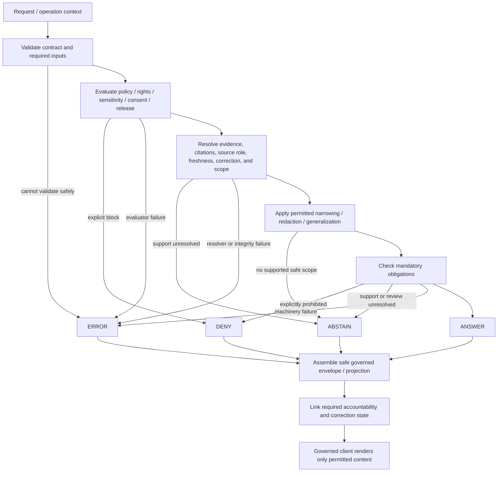

<!-- [KFM_META_BLOCK_V2]
doc_id: kfm://doc/adr-0020-abstain-is-a-first-class-decision
title: "ADR-0020 — Abstain Is a First-Class Decision"
type: adr
adr_id: ADR-0020
version: v1.3
status: proposed
effective_decision_status: proposed
owners:
  - "NEEDS VERIFICATION — architecture and governance stewardship"
  - "NEEDS VERIFICATION — runtime, policy, governed API, UI, evidence, citation, telemetry, contracts, schemas, and validation stewardship"
reviewers_required:
  - Architecture steward
  - Governance steward
  - Runtime and governed API steward
  - Policy steward
  - Evidence and citation steward
  - Sensitivity and rights reviewer
  - Contracts and schemas stewards
  - UI and accessibility steward
  - Telemetry and privacy reviewer
  - Validation and CI stewards
  - Docs steward
created: "2026-05-09"
updated: "2026-08-14"
policy_label: public
truth_posture: cite-or-abstain
responsibility_root: docs/
owning_root: docs/
responsibility: "Record the proposed first-class ABSTAIN semantics and their separation from answer, denial, error, lifecycle, review, receipt, and release states."
current_path: docs/adr/ADR-0020-abstain-is-a-first-class-decision.md
supersedes: []
superseded_by: []
evidence_snapshot:
  repository: bartytime4life/Kansas-Frontier-Matrix
  base_ref: main
  base_commit: 103323d7d2916c650e8e9829dd1073ee474d61f0
  target_prior_blob: 8d5ec63b658a1194d2c11359cecb77e7857a9471
  adr_index_blob: 938c5894c36b99e14810918e2c550ab0e92d53b1
  directory_rules_blob: fd49a0b83e55cef52c1124281f093e263526898d
  directory_rules_adr_blob: a4de0d7a96b78da59cfc499d1025e1508afd8dd9
  runtime_response_contract_blob: 97ff95ba5527968f3db70cd710682176444e4cde
  runtime_response_schema_blob: 8b86e7db8b18b65a56a4e639dfc54e1b2db93155
  runtime_response_builder_blob: 5dacededc1bda64292259ba39b6387facafbd1e8
  finite_envelope_proof_blob: 70ca80226bf06c3b28b59096e3812312a00c03b6
  mock_adapter_blob: 04d37e59b14c9e3b85126cb3380b6221b44e26d1
  mock_adapter_proof_blob: be1b1d2b4178b30ce9be754671a2c42271ad91bc
  governed_api_stub_blob: 5d7c137d2e78ddfca35a1356a96333ac2e84952b
  runtime_policy_readme_blob: 80b63e7651429903385066b53c7fb41af3cd1298
  runtime_policy_abstain_blob: 9c66097140933eba5aa7011653da12488035ad99
  policy_gate_register_blob: 10e66eb9d587797a3f12e2aaac00fb4e60ec7fa2
  explorer_governed_client_blob: 21f6e4d1225ab0427ecb689d6782f4b56fc25ea2
inspection_boundary: >
  Current-session GitHub reads over the exact target, canonical ADR inventory,
  accepted Directory Rules decision and adopted doctrine, adjacent finite-envelope ADR,
  runtime and policy semantic contracts and schemas, deterministic envelope builder,
  four-outcome fixtures and proof suites, MockAdapter, Governed API scaffold and route
  registry, runtime policy boundary, policy-gate register, Explorer Evidence Drawer and
  Focus composed-claim parsers/tests, and Focus mock workflow. No deployed policy
  evaluator, live EvidenceBundle resolver, citation service, receipt store, telemetry
  backend, production public client, production ruleset, release environment, or live
  governed request was exercised.
related:
  - docs/adr/README.md
  - docs/adr/INDEX.md
  - docs/adr/ADR-0004-apps-governed-api-is-the-trust-membrane.md
  - docs/adr/ADR-0008-ollama-subordinate-to-governed-api.md
  - docs/adr/ADR-0010-deny-by-default-for-dna-rare-species-archaeology-infrastructure.md
  - docs/adr/ADR-0016-telemetry-redaction-posture.md
  - docs/adr/ADR-0018-promotion-gate-sequence.md
  - docs/adr/ADR-0019-ai-adapter-contract-and-finite-envelopes.md
  - docs/adr/ADR-0021-quarantine-has-structured-exit-paths.md
  - docs/adr/ADR-0025-public-client-never-reads-canonical-internal-stores.md
  - docs/adr/ADR-0029-adopt-directory-governance-standard-v2.md
  - docs/doctrine/directory-rules.md
  - contracts/policy/policy_decision.md
  - contracts/runtime/decision_envelope.md
  - contracts/runtime/runtime_response_envelope.md
  - contracts/runtime/ai_receipt.md
  - contracts/runtime/run_receipt.md
  - contracts/release/promotion_decision.md
  - contracts/ui/focus_response.md
  - schemas/contracts/v1/policy/policy_decision.schema.json
  - schemas/contracts/v1/runtime/decision_envelope.schema.json
  - schemas/contracts/v1/runtime/runtime_response_envelope.schema.json
  - schemas/contracts/v1/runtime/ai_receipt.schema.json
  - schemas/contracts/v1/runtime/run_receipt.schema.json
  - schemas/contracts/v1/release/promotion_decision.schema.json
  - packages/envelopes/src/envelopes/runtime_response.py
  - runtime/model_adapters/MockAdapter.py
  - apps/governed-api/src/governed_api/stub.py
  - apps/governed-api/src/governed_api/routes/registry.py
  - apps/explorer-web/src/adapters/GovernedClient.ts
  - apps/explorer-web/src/features/focus_panel/parsers.ts
  - apps/explorer-web/tests/evidence-drawer.test.ts
  - apps/explorer-web/tests/focus-composed-claim.test.ts
  - control_plane/policy_gate_register.yaml
  - policy/runtime/README.md
  - policy/runtime/abstain_on_missing_evidence.rego
  - fixtures/contracts/v1/runtime/runtime_response_envelope/
  - fixtures/ui/evidence_drawer_payload/
  - fixtures/ui/focus_composed_claim_projection/
  - tools/validators/validate_runtime_response_envelope.py
  - tests/runtime_proof/test_envelope_finite_outcomes.py
  - tests/runtime_proof/test_mock_adapter_finite_outcomes.py
  - .github/workflows/focus-mock-test.yml
tags: [kfm, adr, abstain, finite-outcomes, cite-or-abstain, decision-envelope, policy-decision, runtime-response-envelope, evidence-drawer, focus-mode, evidence, policy, trust-membrane, fail-closed]
notes:
  - "v1.3 is a same-path documentation-only evidence refresh; source and effective decision status remain proposed."
  - "Accepted ADR-0029 and docs/doctrine/directory-rules.md govern this same-path placement under docs/adr/."
  - "RuntimeResponseEnvelope now has a closed four-outcome fixture family, ANSWER-only evidence and precision requirements, a deterministic candidate builder, and substantive no-network proof tests."
  - "MockAdapter proves deterministic selection of prevalidated synthetic envelopes for all four outcomes; it does not decide which outcome is semantically correct."
  - "Explorer Evidence Drawer and Focus composed-claim tests now prove bounded, fixture-only ABSTAIN rendering, stale/superseded history treatment, no-silent-fallback behavior, and no-leak negative copy."
  - "Governed API routes remain capability-family ABSTAIN/NOT_IMPLEMENTED scaffolds; runtime policy remains non-enforcing, the policy-gate register remains empty, and no end-to-end governed decision engine is established."
[/KFM_META_BLOCK_V2] -->

<a id="top"></a>

# ADR-0020 — Abstain Is a First-Class Decision

> **Proposed decision.** KFM treats `ABSTAIN` as a normal, inspectable finite outcome when a functioning governed decision path cannot support a responsible answer, no explicit prohibition controls, and no safe supported narrowing is available. `ABSTAIN` preserves cite-or-abstain without collapsing policy denial, machinery failure, lifecycle state, review state, process status, or release authority into one ambiguous label.

[](#status)
[](#current-repository-evidence)
[](#evidence-boundary)
[](#current-repository-evidence)
[](#current-repository-evidence)
[](#current-implementation-maturity)
[](#authority-and-publication-boundary)

> [!IMPORTANT]
> **Identity and placement are confirmed; acceptance is not.** The canonical ADR index assigns `ADR-0020` to this exact path with source and effective status `proposed`. Accepted ADR-0029 makes `docs/doctrine/directory-rules.md` the writable placement authority. Neither fact accepts this decision or turns a fixture, envelope, test, workflow, pull request, merge, deployment, or model output into evidence, policy, release, or publication authority.

> [!CAUTION]
> **The repository now proves more than shape, but less than a governed decision engine.** Four-outcome RuntimeResponseEnvelope fixtures, a deterministic candidate builder, a no-I/O MockAdapter selector, an Evidence Drawer projection, and a Focus composed-claim projection exercise bounded synthetic behavior. They do not resolve live evidence, execute accepted policy, validate live citations, persist accountability records, or serve a production request.

> [!WARNING]
> **`ANSWER | ABSTAIN | DENY | ERROR` is not a universal KFM status vocabulary.** It applies only to designated finite policy/runtime decision fields. Promotion, process execution, review, workflow, lifecycle, release, correction, and operational states keep their own controlled vocabularies and require explicit, tested mappings.

**Quick navigation:** [Status](#status) · [Evidence](#evidence-boundary) · [Context](#context) · [Decision](#decision) · [Outcome boundary](#finite-outcome-boundary) · [Abstain contract](#abstain-contract) · [Reasons](#reason-codes-and-explanations) · [Composition](#composition-and-narrowed-scope) · [Objects](#object-and-vocabulary-boundaries) · [Flow](#governed-decision-flow) · [Security](#security-privacy-and-safe-explanation) · [Receipts](#receipts-observability-and-correction) · [Authority](#authority-and-publication-boundary) · [Current evidence](#current-repository-evidence) · [Maturity](#current-implementation-maturity) · [Convergence](#implementation-and-convergence-plan) · [Acceptance](#acceptance-gates) · [Consequences](#consequences) · [Alternatives](#alternatives-considered) · [Risks](#risk-and-open-question-ledger) · [Rollback](#rollback-and-supersession) · [Verification](#verification-checklist) · [References](#references)

---

<a id="status"></a>

## Status

| Field | Current value |
|---|---|
| **ADR ID** | `ADR-0020` — unique and confirmed in [`INDEX.md`](./INDEX.md) |
| **Tracked path** | `docs/adr/ADR-0020-abstain-is-a-first-class-decision.md` |
| **Source metadata** | `proposed` |
| **Effective decision status** | `proposed` |
| **Record edition** | `v1.3` — repository-evidence refresh; proposed decision preserved |
| **Decision class** | Finite outcome semantics, cite-or-abstain behavior, safe explanations, composition, accountability linkage, and client trust-state handling |
| **Current repository maturity** | Four-outcome shape and bounded synthetic behavior are proved; accepted decision logic, policy execution, live evidence/citation closure, persisted accountability, and production operation are not established |
| **Implementation effect of this revision** | Documentation only |
| **Publication effect** | None |
| **Supersedes / superseded by** | None / none |

### Acceptance and implementation graduation are separate

1. **ADR acceptance** would approve the finite-outcome boundary and normative abstention semantics in this record.
2. **Contract graduation** would establish accepted object meanings, machine shapes, mappings, reason vocabularies, and compatibility rules.
3. **Component graduation** may prove a bounded responsibility such as envelope construction, fixture selection, or client projection.
4. **Governed runtime graduation** would require evidence resolution, policy execution, citation validation, deterministic outcome selection, response assembly, accountability linkage, correction, and rollback.
5. **Public release** would require separate reviewed release evidence for the exact operation and client surface.

A component can graduate without this ADR being accepted. This ADR could be accepted without a runtime being operational. A green check cannot collapse those transitions.

[Back to top](#top)

---

<a id="evidence-boundary"></a>

## Evidence boundary

This revision is grounded in current repository bytes at `main@103323d7d2916c650e8e9829dd1073ee474d61f0`.

### Truth labels

| Label | Meaning in this ADR |
|---|---|
| **CONFIRMED** | Verified from the pinned repository tree, exact tracked bytes, contracts, schemas, fixtures, tests, workflows, or current-session readback |
| **PROPOSED** | Decision, mapping, reason code, obligation, behavior, or implementation target not accepted or proved operational |
| **NEEDS VERIFICATION** | A bounded check remains before reliance |
| **UNKNOWN** | The inspected evidence cannot support a stronger statement |
| **HELD** | Current automation or documentation deliberately preserves a non-operational boundary |

### Placement basis

This is a same-path update to an existing numbered ADR under `docs/adr/`. Accepted ADR-0029 adopts the exact Directory Rules v2 bytes at `docs/doctrine/directory-rules.md`; those rules place human decision records under `docs/` and preserve contracts, schemas, policy, fixtures, validators, runtime code, receipts, release objects, and published data as separate responsibilities. No path, status, supersession, or authority transition is introduced here, so the canonical ADR index does not require a row change.

### Inspected surfaces

- the exact target and canonical ADR inventory;
- accepted ADR-0029 and adopted Directory Rules;
- adjacent ADR-0019 finite-envelope evidence;
- `PolicyDecision`, `DecisionEnvelope`, `RuntimeResponseEnvelope`, `AIReceipt`, `RunReceipt`, and `PromotionDecision` contracts/schemas;
- the deterministic RuntimeResponseEnvelope candidate builder;
- four-outcome RuntimeResponseEnvelope fixtures, validator, and no-network proof;
- deterministic no-I/O MockAdapter implementation and proof;
- Governed API WSGI scaffold, route registry, and ABSTAIN factory;
- runtime policy README and missing-evidence Rego stub;
- the empty policy-gate register;
- Explorer GovernedClient, Evidence Drawer tests, Focus composed-claim parser, and Focus tests;
- Focus mock readiness workflow.

### What this evidence does not prove

- ADR-0020 is accepted;
- a runtime policy bundle is accepted or executed;
- live EvidenceRefs resolve to admissible EvidenceBundles;
- live citation validation is implemented;
- the Governed API selects outcomes semantically;
- all clients consume one accepted response contract;
- every consequential outcome links to an accepted persisted accountability record;
- operational telemetry counts outcomes or reasons safely;
- branch rules require the relevant checks;
- any release, deployment, or publication occurred.

[Back to top](#top)

---

<a id="context"></a>

## Context

KFM's durable truth posture is **cite-or-abstain**. A consequential claim should not be completed from plausible language, a stale layer, an unresolved citation, an unreviewed source, a hidden default, a silent cache fallback, or model confidence when the required support cannot be established.

That posture requires more than adding `ABSTAIN` to an enum. The system must preserve five distinctions:

1. **Insufficient or unresolved support** is not an explicit prohibition.
2. **Explicit prohibition** is not a machinery failure.
3. **Machinery failure** is not evidence uncertainty.
4. **Loading, pending review, quarantine, workflow hold, process failure, and release state** are separate axes.
5. **A bounded client projection** is not the policy/evidence authority that selected the outcome.

The repository has advanced since v1.2. RuntimeResponseEnvelope now has all four synthetic outcomes, an `ANSWER`-only precision/evidence rule, a deterministic builder, and substantive proof tests. MockAdapter proves deterministic fixture selection. Explorer tests prove fixture-only abstention for stale, superseded, missing-scope, and unresolved-dependency cases while denying or erroring through fixed no-leak copy. Those gains sharpen this ADR's evidence base without proving an accepted or deployed end-to-end decision path.

[Back to top](#top)

---

<a id="decision"></a>

## Decision

If accepted, KFM SHALL apply the following architecture-wide rules to designated finite policy/runtime decision fields.

### D1 — `ABSTAIN` is a first-class outcome

`ABSTAIN` is a normal, inspectable decision result—not a hidden exception, degraded success, loading state, pending review, generic error, or empty answer. A governed caller must be able to render, test, count, correct, and supersede it without inventing a claim.

### D2 — The finite set is closed where the contract says it is finite

Designated fields use exactly:

```text
ANSWER | ABSTAIN | DENY | ERROR
```

Provider-specific, UI, workflow, lifecycle, process, review, release, and operational values must not be injected into those fields. Adding another finite outcome requires a reviewed contract/schema change and, when it changes this decision, an ADR update or successor.

### D3 — `ABSTAIN` requires a functioning decision path

Return `ABSTAIN` only when:

- the requested operation is in scope;
- required validation and evaluation machinery can produce a trustworthy decision;
- no explicit policy, rights, sensitivity, consent, access, role, release, or governance prohibition controls;
- required evidence, citation, source authority, freshness, scope, corroboration, correction, or review support is unresolved or insufficient; and
- no safe, supported narrowed-scope `ANSWER` is available.

### D4 — `DENY` and `ERROR` remain distinct

- `DENY` means a governing rule explicitly blocks the requested operation.
- `ERROR` means the decision path cannot complete safely or deterministically because shape, integrity, evaluator, dependency, configuration, or process machinery failed.

### D5 — `ANSWER` requires affirmative support

`ANSWER` is not the branch left after other outcomes are excluded. It requires the evidence, policy, citation, precision, freshness, correction, review, release, and obligation support appropriate to the operation. Under the current RuntimeResponseEnvelope schema, `ANSWER` also requires at least one EvidenceRef and `precision_actually_used`; non-`ANSWER` outcomes forbid that precision object.

### D6 — Negative outcomes carry safe inspectable support

`ABSTAIN`, `DENY`, and `ERROR` must carry stable reason information and a caller-appropriate explanation. Required obligations, evidence handles, correction state, retry/review posture, and accountability links must be explicit in the owning contract or referenced objects—not inferred from fluent prose.

### D7 — Composition is declared, not guessed

Each composed operation must declare whether subdecisions are conjunctive, disjunctive, advisory, independent, or item-scoped. No universal severity arithmetic may silently replace operation semantics. A top-level response must not hide abstained or denied items behind `ANSWER`.

### D8 — Public clients receive governed projections only

Browsers, map shells, review tools, exports, and AI-assisted surfaces receive finite outcomes through the Governed API or another accepted trust-membrane interface. They do not infer outcomes from internal stores, provider responses, raw model text, workflow logs, file paths, or test fixtures.

### D9 — Outcomes are append-only and correctable

A later `ANSWER`, `DENY`, or `ERROR` does not rewrite a prior `ABSTAIN`. New decisions reference prior identity and correction/supersession lineage. Historical receipts and projections remain auditable under their retention and sensitivity rules.

### Non-goals

This ADR does not:

- accept itself;
- define one universal status vocabulary for all KFM objects;
- make DecisionEnvelope, PolicyDecision, RuntimeResponseEnvelope, AIReceipt, RunReceipt, or PromotionDecision interchangeable;
- populate the reason-code register;
- accept a policy bundle or evaluator;
- make the MockAdapter semantic;
- authorize a live model or provider;
- require a persisted receipt for every non-consequential internal branch;
- approve public rendering, release, deployment, or publication;
- replace domain-specific evidence, rights, sensitivity, consent, correction, or rollback rules.

[Back to top](#top)

---

<a id="finite-outcome-boundary"></a>

## Finite outcome boundary

### Canonical semantics

| Outcome | Use when | Must not be used as |
|---|---|---|
| `ANSWER` | The requested operation is affirmatively supported under all applicable evidence, policy, citation, precision, freshness, correction, review, release, and obligation requirements. | Best guess, low-confidence fallback, hidden scope reduction, process success, or default allow |
| `ABSTAIN` | The decision path functioned, no explicit prohibition controls, but required support is unresolved or insufficient and no responsible narrowed answer exists. | Machinery failure, explicit policy denial, loading, pending review, quarantine, workflow hold, or blank success |
| `DENY` | A policy, rights, sensitivity, consent, access, role, release, or governance rule explicitly blocks the operation. | Missing evidence, transient runtime outage, or generic validation failure |
| `ERROR` | The governed path cannot complete safely or deterministically because required machinery, shape, integrity, dependency, or configuration failed. | Evidence uncertainty, policy denial, or a way to suppress abstention metrics |

### Proposed deterministic classification order

For a conjunctive decision surface:

1. Validate the request, contract, and required evaluation inputs. Untrustworthy machinery or invalid required shape yields `ERROR`.
2. Evaluate explicit policy/governance prohibitions. A controlling prohibition yields `DENY`; evaluator failure yields `ERROR`.
3. Resolve required evidence, citation, authority, freshness, correction, scope, and review support. Unresolved support yields `ABSTAIN`; resolver/integrity failure yields `ERROR`.
4. Apply allowed narrowing, redaction, or generalization. If no supported safe scope remains, yield `ABSTAIN` unless policy explicitly denies the operation.
5. Check mandatory obligations. Explicitly prohibited execution yields `DENY`; unresolved support/review yields `ABSTAIN`; machinery failure yields `ERROR`.
6. Only then may the operation yield `ANSWER`.

This ordering is proposed architecture, not current end-to-end executable behavior.

### Why the Governed API scaffold uses `ABSTAIN / NOT_IMPLEMENTED`

The current three-route scaffold exposes bounded capability surfaces but no authoritative response content. Returning `ABSTAIN` avoids fabricated answers and protected payload exposure. It does not establish that every missing implementation is evidentiary abstention: a required component failing inside an otherwise active governed path may be `ERROR`, and a disabled capability may be `DENY` when an accepted policy says so.

[Back to top](#top)

---

<a id="abstain-contract"></a>

## `ABSTAIN` contract

### Required posture

An accepted `ABSTAIN` profile should make these concerns inspectable where policy permits:

| Concern | Requirement |
|---|---|
| Identity | Stable decision or response identifier |
| Outcome | Exact finite value `ABSTAIN` |
| Scope | Requested scope and any attempted supported scope |
| Policy family | The decision family evaluated |
| Primary reason | Stable machine code under an accepted vocabulary |
| Safe explanation | Public/restricted text selected by caller and sensitivity class |
| Evaluated time | Immutable evaluation timestamp |
| Evidence posture | Attempted, stale, conflicted, superseded, or unresolved refs where safe |
| Obligations / next action | Narrow scope, refresh, await review, inspect gap, or another governed step |
| Freshness / correction | Client-visible state when material |
| Accountability | Decision, validation, AIReceipt, RunReceipt, or trace link when the event class requires it |

### Suitable abstention triggers

- no admissible evidence for the requested scope;
- EvidenceRef cannot resolve to an admissible bundle;
- evidence is stale and policy does not permit a stale qualified answer;
- evidence is materially conflicted;
- source authority or source role is unresolved;
- citation support is unresolved but citation machinery is functioning;
- required claim dependency or alternative group is unresolved;
- the requested scope is too broad and no safe supported narrower answer can be produced;
- required review support remains unresolved and policy does not explicitly prohibit the operation;
- an explicitly scaffolded capability refuses to fabricate a response.

### Not abstention

- invalid or contradictory required envelope shape: `ERROR`;
- policy evaluator, evidence resolver, citation validator, or required dependency failure: `ERROR`;
- explicit rights, sensitivity, consent, access, release, or governance prohibition: `DENY`;
- UI loading, retry, or transport pending: UI/transport state;
- lifecycle `QUARANTINE`: lifecycle state;
- workflow `WORKFLOW_HOLD`: readiness state;
- process `PARTIAL` or `FAIL`: process outcome;
- human review `PENDING`: review state, which may inform but does not equal finite outcome;
- low model confidence without evidence analysis: neither evidence nor a valid outcome selector.

### Forbidden behavior

An `ABSTAIN` must never trigger:

- generated completion around unresolved support;
- hidden stale or cached fallback;
- blank `200 OK` success;
- automatic provider switching that bypasses policy or evidence scope;
- substitution of a map, tile, graph, score, screenshot, index, summary, or receipt for the abstained claim;
- exposure of protected reason detail or private diagnostics;
- silent conversion to `ANSWER`, `DENY`, or `ERROR` for UI or metric convenience;
- mutation or deletion of earlier decision and receipt history.

[Back to top](#top)

---

<a id="reason-codes-and-explanations"></a>

## Reason codes and explanations

### Current repository state

The machine policy-gate register is `PROPOSED` and still has `entries: []`. No accepted repository-wide reason-code authority is established. Current strings are local implementation evidence:

| Surface | Observed local examples | Safe interpretation |
|---|---|---|
| Governed API scaffold | `NOT_IMPLEMENTED` | Capability scaffold refuses unsupported behavior |
| Evidence Drawer projection | `MISSING_EVIDENCE`, `STALE_EVIDENCE`, `CITATION_UNRESOLVED`, `POLICY_DENIED`, `RIGHTS_UNRESOLVED`, `SENSITIVE_DETAIL_RESTRICTED`, `UPSTREAM_ERROR`, and historical-state codes | Bounded browser projection vocabulary, not central policy authority |
| Focus composed-claim projection | `REQUIRED_DEPENDENCY_UNRESOLVED`, `ALTERNATIVE_GROUP_UNRESOLVED`, `POLICY_DENIED`, `UPSTREAM_ERROR` | Bounded composition vocabulary, not a universal runtime register |
| RuntimeResponseEnvelope fixtures | fixture-specific reason strings | Shape/proof material only |

### Proposed normalized reason families

| Proposed family | Default finite outcome | Boundary |
|---|---|---|
| `NO_EVIDENCE` / `MISSING_EVIDENCE` | `ABSTAIN` | No admissible support exists for the requested scope |
| `EVIDENCE_UNRESOLVED` | `ABSTAIN` | Required ref cannot resolve while resolver functions |
| `EVIDENCE_STALE` / `STALE_EVIDENCE` | `ABSTAIN` | No policy-acceptable fresh support or qualified stale answer exists |
| `EVIDENCE_CONFLICTED` | `ABSTAIN` | Material conflict prevents a responsible claim |
| `SOURCE_AUTHORITY_UNRESOLVED` | `ABSTAIN` | Source role/authority remains unresolved |
| `CITATION_UNRESOLVED` | `ABSTAIN` | Citation support is unresolved while validation machinery functions |
| `REQUIRED_DEPENDENCY_UNRESOLVED` | `ABSTAIN` | A required composed-claim dependency is unresolved |
| `ALTERNATIVE_GROUP_UNRESOLVED` | `ABSTAIN` | No allowed alternative support group closes |
| `SCOPE_TOO_BROAD` | `ABSTAIN` | Requested scope cannot be supported safely |
| `REVIEW_REQUIRED` | `ABSTAIN` when review support is unresolved; `DENY` when policy forbids proceeding | Policy-specific mapping required |
| `NOT_IMPLEMENTED` | `ABSTAIN` for a declared scaffold; otherwise context-dependent | Not a universal missing-capability rule |
| `POLICY_DENIED`, `RIGHTS_BLOCKED`, `SENSITIVITY_BLOCKED`, `CONSENT_BLOCKED`, `ACCESS_BLOCKED`, `RELEASE_STATE_BLOCKED` | `DENY` | Explicit governing prohibition |
| `SCHEMA_INVALID`, `INTEGRITY_FAILURE`, `POLICY_EVALUATOR_ERROR`, `CITATION_VALIDATOR_ERROR`, `RUNTIME_DEPENDENCY_ERROR`, `UPSTREAM_ERROR` | `ERROR` | Required machinery or integrity path failed |
| `SAFE_SCOPE_APPLIED` | `ANSWER` with explicit narrowed scope | Supported generalization/redaction/narrowing succeeded |

Aliases are illustrative until a reviewed register selects identifiers. Do not silently merge local codes or repurpose an existing code to change its outcome meaning.

### Explanation layers

A governed reason model should separate:

1. **stable machine code** for contracts, tests, metrics, and correction;
2. **safe public explanation** that does not reveal protected facts;
3. **restricted steward detail** stored only where policy permits;
4. **next responsible action** such as narrowing, refresh, review, or evidence-gap inspection;
5. **retryability and supersession state** for deterministic clients.

A public explanation must not expose precise protected locations, private-person or genomic facts, confidential source terms, credentials, raw prompts, hidden policy input, exploit detail, provider payloads, stack traces, or private model reasoning.

### Future register minimum

Each accepted reason entry should define:

- identifier and aliases;
- description and owning decision family;
- default outcome and allowed overrides;
- allowed policy families and surfaces;
- public explanation template and restricted-detail class;
- obligations and next actions;
- retryability, freshness, correction, and supersession behavior;
- owner, review date, version, deprecation, and compatibility tests.

[Back to top](#top)

---

<a id="composition-and-narrowed-scope"></a>

## Composition and narrowed scope

### No universal severity arithmetic

A single formula such as `ERROR > DENY > ABSTAIN > ANSWER` is not a universal composition contract. It can lose whether a failure is item-local, advisory, recoverable through an allowed alternative, or controlling for the requested operation.

Every composed decision must declare:

- subdecision relation: conjunctive, disjunctive, alternative-group, advisory, independent, or item-scoped;
- which machinery failures invalidate the aggregate;
- which policy denial controls;
- which dependencies are mandatory or optional;
- whether supported narrowing is allowed;
- how omissions and per-item outcomes appear to the caller.

### Conjunctive composition

For an operation requiring every dependency:

1. a failure preventing trustworthy aggregate evaluation yields `ERROR`;
2. otherwise, a controlling explicit prohibition yields `DENY`;
3. otherwise, unresolved mandatory support yields `ABSTAIN`;
4. otherwise, obligations are evaluated;
5. only complete affirmative support yields `ANSWER`.

### Alternative groups

A disjunctive or alternative-group profile may `ANSWER` when one accepted support path closes and the contract permits it. It must still expose unavailable optional roles or limitations. If no allowed alternative closes, return `ABSTAIN`; if policy blocks every alternative, return `DENY`; if the composition machinery fails, return `ERROR`.

### Narrowed-scope `ANSWER`

When policy permits a cited answer at a smaller or safer scope:

```text
outcome = ANSWER
requested_scope != answered_scope
reason_code = SAFE_SCOPE_APPLIED
```

The response must expose the scope change, limitations, evidence, precision actually used, and transformation/generalization receipts required by the owning contract. Unsupported requested scope is not hidden behind “partial.” Either emit explicit independently supported answer scopes or abstain for the unsupported request.

### Mixed collections

Per-item outcomes require an explicit collection contract. A top-level `ANSWER` must not hide denied, abstained, superseded, or omitted items. The response needs an omission/outcome manifest safe for the caller.

[Back to top](#top)

---

<a id="object-and-vocabulary-boundaries"></a>

## Object and vocabulary boundaries

| Surface | Current vocabulary | Current evidence | Must not become |
|---|---|---|---|
| `PolicyDecision.outcome` | `ANSWER | ABSTAIN | DENY | ERROR` | Proposed semantic contract/schema | Runtime response, release decision, or executable policy |
| `DecisionEnvelope.outcome` | `ANSWER | ABSTAIN | DENY | ERROR` | Proposed semantic contract/schema; compatibility alias remains | Policy execution or complete client response |
| `RuntimeResponseEnvelope.outcome` | `ANSWER | ABSTAIN | DENY | ERROR` | Closed schema, four synthetic fixtures, validator/proof, candidate builder | Evidence closure, truth, policy evaluation, or release approval |
| `AIReceipt.outcome` | `ANSWER | ABSTAIN | DENY | ERROR` | Proposed accountability contract/schema/validator | User answer, evidence, or policy decision |
| MockAdapter scenario envelope | Same four outcomes | Deterministic no-I/O selector over prevalidated fixtures | Semantic outcome selector or provider integration |
| Evidence Drawer / Focus projection | Same four outcomes plus local reason/closure vocabularies | Fixture-only parsers and UI tests | Canonical runtime/policy authority |
| `PromotionDecision.decision` | `APPROVE | DENY | ABSTAIN` | Separate release/promotion vocabulary | Runtime answer or process outcome |
| `RunReceipt.outcome` | `SUCCESS | PARTIAL | FAIL` | Separate process vocabulary | Policy or runtime decision |
| Workflow conclusion / hold | GitHub conclusion; `WORKFLOW_HOLD`, `WORKFLOW_SKIPPED_EXPLICIT` | Automation/readiness state | Policy decision, response, review, or release |
| Review state | Review-family vocabulary | Human/steward state | Finite runtime outcome |
| Lifecycle state | RAW, WORK, QUARANTINE, PROCESSED, CATALOG/TRIPLET, PUBLISHED | Governed data state | Runtime decision |
| Correction/release state | Object-specific vocabulary | Separate accountability axis | Evidence outcome |

### Mapping contract

Every adapter between vocabularies must document and test:

- source object/field/value;
- target object/field/value;
- preserved reason and obligations;
- information loss;
- caller/sensitivity class;
- correction, supersession, replay, and rollback behavior;
- every source value and all invalid combinations.

No mapping may infer `ANSWER` from process `SUCCESS`, release `APPROVE`, a green workflow, a merged pull request, a released-looking path, or a model response.

[Back to top](#top)

---

<a id="governed-decision-flow"></a>

## Governed decision flow


```mermaid
flowchart TD
  R["Request / operation context"] --> V["Validate contract and required inputs"]
  V -->|cannot validate safely| ER["ERROR"]
  V --> P["Evaluate policy / rights / sensitivity / consent / release"]
  P -->|explicit block| DN["DENY"]
  P -->|evaluator failure| ER
  P --> E["Resolve evidence, citations, source role, freshness, correction, and scope"]
  E -->|support unresolved| AB["ABSTAIN"]
  E -->|resolver or integrity failure| ER
  E --> N["Apply permitted narrowing / redaction / generalization"]
  N -->|no supported safe scope| AB
  N --> O["Check mandatory obligations"]
  O -->|explicitly prohibited| DN
  O -->|support or review unresolved| AB
  O -->|machinery failure| ER
  O --> AN["ANSWER"]
  AB --> G["Assemble safe governed envelope / projection"]
  DN --> G
  ER --> G
  AN --> G
  G --> A["Link required accountability and correction state"]
  A --> C["Governed client renders only permitted content"]
```

### Flow constraints

- Consequential answer generation follows evidence retrieval and policy checks.
- Missing policy support never defaults to allow.
- AI remains downstream of bounded evidence and policy context.
- Citation validation is mandatory where generated synthesis depends on citations.
- Clients render only the accepted governed envelope/projection and permitted payload.
- No outcome changes lifecycle or publication state by itself.
- Every narrowing/generalization that supports an answer remains traceable to its evidence and transform records.

The diagram is proposed architecture. Current evidence proves selected local components, not the composed production flow.

[Back to top](#top)

---

<a id="security-privacy-and-safe-explanation"></a>

## Security, privacy, and safe explanation

### Fail closed without leaking

| Risk | Required posture |
|---|---|
| Sensitive exact location | Explain that precision is restricted; expose no coordinates or reverse-engineerable hint |
| Living-person or DNA/genomic material | Do not reveal attributes, relationships, identifiers, inferred status, or existence where policy forbids it |
| Rights or confidential terms | Expose a safe category and steward path, not credentials or protected contract detail |
| Access denial | Do not disclose protected-record existence unless policy permits |
| Integrity/evaluator failure | Return a fixed public error class; retain bounded diagnostics in restricted logs |
| Prompt injection | Treat source and user content as data; never echo malicious instructions as reason text |
| Provider/runtime failure | Expose no secrets, raw payloads, tokens, stack traces, or model internals |
| Private reasoning | Never store or expose chain-of-thought as an explanation, receipt, or diagnostic |
| Historical negative state | Keep audit visibility without resolving it as current claim support |

### Client behavior

A client receiving `ABSTAIN` should:

- render a distinct non-error non-answer state;
- show fixed or template-bound safe reason text;
- expose allowed evidence/history and limitations without converting them into current support;
- offer a governed next step where defined;
- preserve requested and answered scope;
- avoid retries or alternate providers that bypass policy, evidence scope, or rate limits;
- never substitute stale content, hidden sources, generated summaries, or raw model/provider output.

Current Explorer tests prove portions of this posture for bounded fixture-only Evidence Drawer and Focus projections. Production client coverage remains unverified.

[Back to top](#top)

---

<a id="receipts-observability-and-correction"></a>

## Receipts, observability, and correction

### Object separation

- `PolicyDecision` or `DecisionEnvelope` records decision posture.
- `RuntimeResponseEnvelope` carries client-facing response posture.
- `AIReceipt` records AI-mediated accountability.
- `RunReceipt` records process execution under its separate vocabulary.
- validation reports, review records, promotion decisions, release manifests, correction notices, and rollback records remain distinct.

### Proposed accountability mapping

| Event | Accountability posture |
|---|---|
| AI-mediated abstention after an adapter/model run | AIReceipt plus decision/citation references under the accepted contract |
| Request blocked before model invocation | Decision/policy trace; do not fabricate an AI run |
| Non-AI governed decision | Decision/validation record and RunReceipt only when a process run occurred |
| Public response assembly | RuntimeResponseEnvelope plus trace links to applicable decisions and accountability records |
| Later recovery, correction, withdrawal, or supersession | New decision and correction/withdrawal lineage; retain prior event immutably |

The repository proves local validators and fixtures for several objects, not complete persistence or linkage.

### Observability target

Privacy-reviewed outcome telemetry should support:

- counts by surface, domain, policy family, outcome, and reason family;
- time-to-resolution for abstentions requiring steward work;
- repeated evidence/source/citation gap clusters;
- transitions from `ABSTAIN` to later `ANSWER`, `DENY`, or `ERROR`;
- contract, schema, policy, and implementation versions;
- safe dependency latency and failure state;
- correction and supersession linkage.

It must not record raw prompts, provider payloads, private reasoning, full EvidenceBundles, exact sensitive locations, protected personal/genomic facts, credentials, confidential policy inputs, or joinable explanation details that re-identify protected subjects.

No operational ABSTAIN dashboard, reason metrics, alert thresholds, or persistent receipt store was exercised in this review.

[Back to top](#top)

---

<a id="authority-and-publication-boundary"></a>

## Authority and publication boundary

| Responsibility | Authority surface | Effect of this ADR |
|---|---|---|
| Architecture decision | `docs/adr/` | Records a proposed decision only |
| Semantic object meaning | `contracts/policy/`, `contracts/runtime/`, `contracts/ui/`, release contracts | Must align through separate reviewed changes |
| Machine shape | `schemas/contracts/v1/` | Enforces accepted fields and invariants; does not decide truth |
| Executable admissibility | `policy/` and an accepted policy runtime | Not implemented or accepted here |
| Runtime composition | Governed API/runtime/packages | Not implemented here |
| Evidence closure | EvidenceRef/EvidenceBundle authority and resolver | Not supplied by an envelope or projection |
| Citation validation | Accepted citation implementation | Not supplied by prose or a citation-shaped string |
| Client projection | Governed API and accepted UI adapters/components | Must remain downstream of authority |
| Accountability | Receipt, validation, review, proof, correction, and trace families | Not created by this ADR |
| Release/publication | `release/` and governed publication flows | Never granted by `ANSWER`, a test, or a merge |

### Invariants

1. `ABSTAIN`, `DENY`, `ERROR`, and `ANSWER` do not publish.
2. An envelope or client projection does not create evidence.
3. A reason code does not resolve evidence or execute policy.
4. A receipt records an event; it does not make the event correct.
5. A green workflow does not become a policy decision, review, or release.
6. A published-looking path does not substitute for ReleaseManifest and rollback authority.
7. Public clients do not bypass governed interfaces because a provider or internal store is reachable.
8. Generated language never outranks EvidenceBundle support.
9. Corrections and supersessions append lineage rather than rewriting history.
10. Promotion is a governed state transition, not a file move or finite runtime outcome.

[Back to top](#top)

---

<a id="current-repository-evidence"></a>

## Current repository evidence

| Surface | Current status | Safe conclusion |
|---|---:|---|
| ADR identity and canonical index | **CONFIRMED** | Exact path exists; source and effective status remain proposed |
| Directory Rules | **CONFIRMED accepted through ADR-0029** | Same-path `docs/adr/` placement is governed; no status transition follows |
| `PolicyDecision` contract/schema | **CONFIRMED PROPOSED** | Four-outcome semantic/shape surface exists; accepted evaluator and full semantic proof remain absent |
| `DecisionEnvelope` contract/schema | **CONFIRMED PROPOSED** | Four-outcome decision carrier exists; compatibility and validator convergence remain open |
| RuntimeResponseEnvelope schema | **CONFIRMED closed / PROPOSED** | All four outcomes are allowed; `ANSWER` requires evidence and precision; negative outcomes forbid precision |
| RuntimeResponseEnvelope valid fixtures | **CONFIRMED all four** | Synthetic `ANSWER`, `ABSTAIN`, `DENY`, and `ERROR` shape examples exist |
| Runtime envelope validator and proof | **CONFIRMED substantive, no-network** | Checks closed shape, four outcomes, aliasing, negative fixtures, precision, and wiring; does not select semantic outcome |
| Deterministic candidate builder | **CONFIRMED bounded** | Builds locally checked candidates from explicit authority-bearing inputs; does not resolve/evaluate them |
| MockAdapter and proof | **CONFIRMED deterministic no-I/O selector** | Requires all four prevalidated scenarios, isolates copies, and fails closed; not a semantic adapter or provider runtime |
| Governed API | **CONFIRMED three-route ABSTAIN scaffold** | `/bootstrap`, `/layers`, and `/evidence` return `ABSTAIN / NOT_IMPLEMENTED`; no evidence/policy/citation composition |
| Runtime policy boundary | **CONFIRMED unbound/non-enforcing** | Missing-evidence and related Rego modules are stubs; no accepted evaluator or outcome mapping |
| Policy-gate register | **CONFIRMED empty / PROPOSED** | No accepted central gate/reason registry exists |
| Explorer GovernedClient | **CONFIRMED fixture-only parser** | Bounded local outcome/reason/trust vocabularies and no-network/no-lifecycle-store boundary exist |
| Evidence Drawer tests | **CONFIRMED fixture-only behavior** | Stale and superseded evidence abstain; denial/error use fixed no-leak copy; invalid payloads fail closed |
| Focus composed-claim tests | **CONFIRMED fixture-only behavior** | Supported/qualified answers, unresolved-dependency abstention, policy denial, scope failure, and resolver error are distinguished |
| UI FocusResponse contract/schema | **CONFIRMED contract / permissive schema stub** | Presentation intent exists; accepted complete UI response shape remains unproved |
| Focus mock workflow | **CONFIRMED split posture** | Finite envelope/MockAdapter proof runs; mock Focus runtime remains an explicit hold |
| Receipt persistence and outcome telemetry | **UNKNOWN / NOT ESTABLISHED** | No operational store, dashboard, retention, or correction propagation was exercised |
| Release/publication | **NOT ESTABLISHED** | No outcome, projection, fixture, or workflow authorizes release |

### Material corrections from v1.2

- RuntimeResponseEnvelope valid fixtures now cover all four outcomes, not only `ANSWER` and `ABSTAIN`.
- The runtime finite-outcome suite is substantive rather than an `assert True` placeholder.
- An ANSWER-only evidence and precision invariant is schema- and proof-backed.
- MockAdapter now supplies deterministic no-I/O four-outcome fixture selection.
- Explorer Evidence Drawer and Focus composed-claim tests now prove bounded fixture-only negative-state behavior and no-leak copy.
- Focus mock automation now separates working finite-envelope proof from a still-held mock runtime.
- Runtime policy, reason-code authority, Governed API semantic outcome selection, receipt persistence, telemetry, live evidence/citation resolution, and production operation remain held or unverified.

[Back to top](#top)

---

<a id="current-implementation-maturity"></a>

## Current implementation maturity

| Level | Description | Current evidence |
|---|---|---|
| **M0 — vocabulary** | Contracts/ADR name finite outcomes | **CONFIRMED PROPOSED** |
| **M1 — shape** | Closed schemas, aliases, positive/negative fixtures, validators | **CONFIRMED for RuntimeResponseEnvelope; partial across adjacent objects** |
| **M2 — bounded components** | Deterministic construction, selection, and fixture-only client interpretation | **PARTIALLY CONFIRMED** — builder, MockAdapter, Evidence Drawer, Focus projections |
| **M3 — semantic orchestration** | Evidence/policy/citation inputs deterministically select and assemble outcomes | **NOT ESTABLISHED** |
| **M4 — governed runtime/client** | Accepted API route, production clients, persisted accountability, telemetry, correction | **NOT ESTABLISHED** |
| **M5 — reviewed operation** | Ruleset coupling, incident handling, replay, rollback, public evidence | **UNKNOWN** |

### Present safe claim

> KFM has a closed four-outcome RuntimeResponseEnvelope profile with substantive no-network proof, deterministic synthetic fixture selection/construction, and bounded fixture-only Explorer projections that distinguish abstention, denial, error, stale support, superseded history, and unresolved dependencies. The repository does not yet establish accepted semantic outcome selection, active runtime policy, live evidence/citation closure, complete Governed API response assembly, persistent accountability, telemetry, or production release.

The evidence does not support “ABSTAIN is enforced everywhere,” “the UI is production-ready,” “all objects use the four outcomes,” “every abstention writes a receipt,” or “green Focus checks prove governed AI.”

[Back to top](#top)

---

<a id="implementation-and-convergence-plan"></a>

## Implementation and convergence plan

### Phase 0 — preserve fail-closed behavior

Keep explicit `NOT_IMPLEMENTED` abstention, fixed no-leak negative copy, and workflow holds until reviewed semantic orchestration exists. Do not replace them with optimistic answer paths.

### Phase 1 — decide object ownership and mapping

- ratify the roles of PolicyDecision, DecisionEnvelope, RuntimeResponseEnvelope, AIReceipt, RunReceipt, PromotionDecision, FocusResponse, and client-local projections;
- decide compatibility alias/deprecation rules;
- define explicit mappings without converting process/release/workflow success into `ANSWER`;
- document trace identifiers and correction relationships.

### Phase 2 — establish reason-code authority

- select the machine register home under accepted Directory Rules;
- populate reviewed codes, aliases, outcomes, policy families, explanation classes, obligations, retryability, ownership, and deprecation;
- validate the register and all local projections against approved subsets;
- add negative tests for repurposed, unknown, and leaking reason codes.

### Phase 3 — converge contracts and schemas

- define which object owns primary code, reasons, obligations, attempted evidence, next action, freshness, correction, scope, and accountability refs;
- prohibit conflicting compatibility fields;
- version breaking changes and provide migration fixtures;
- close the permissive FocusResponse schema or explicitly retire it in favor of a view-only profile;
- preserve separate process, promotion, review, lifecycle, and release vocabularies.

### Phase 4 — implement a no-network semantic decision slice

Prove deterministic selection for:

- supported `ANSWER`;
- unresolved-support `ABSTAIN`;
- stale/conflicted/source-role/citation abstention;
- explicit rights/sensitivity/access `DENY`;
- schema/evaluator/resolver `ERROR`;
- allowed narrowed-scope `ANSWER` with evidence and precision disclosure;
- correction/supersession behavior;
- composition profiles and mandatory obligations.

### Phase 5 — assemble one governed API response

For one synthetic operation, compose validated request, evidence resolution, policy decision, citation result, freshness/correction state, DecisionEnvelope, applicable accountability records, and RuntimeResponseEnvelope. Keep it no-network and unreleased until review closes.

### Phase 6 — converge clients and accessibility

- bind one accepted API response profile to Evidence Drawer and Focus UI;
- preserve distinct `ABSTAIN`, `DENY`, `ERROR`, loading, stale, and corrected states;
- provide safe accessible copy and next actions;
- test keyboard, screen-reader, export/share, map, correction, and no-internal-store behavior;
- prevent local projection vocabularies from becoming parallel authority.

### Phase 7 — accountability, telemetry, correction, and rollback

- persist or link accepted decision/accountability records where significance requires;
- add privacy-reviewed aggregate metrics;
- test repeated gap routing, correction, supersession, withdrawal, cache invalidation, provider/evaluator deactivation, and replay;
- verify restricted details do not appear in public responses, logs, metrics, or receipts.

### Phase 8 — explicit governance transition

Only after applicable acceptance gates close should maintainers consider a reviewed ADR status change and synchronize the canonical index in the same pull request. Acceptance still would not authorize release of a particular runtime surface.

[Back to top](#top)

---

<a id="acceptance-gates"></a>

## Acceptance gates

ADR-0020 should remain `proposed` until equivalent evidence closes every applicable gate.

### Governance and ownership

- [ ] Named architecture, runtime, policy, evidence, citation, UI, telemetry, contracts, schemas, validation, correction, and docs owners are accepted.
- [ ] Required-review and branch/ruleset behavior is verified.
- [ ] ADR and canonical index carry the same reviewed status.
- [ ] Reason-code ownership, compatibility, and deprecation process are accepted.

### Contract and schema

- [ ] Finite-outcome fields reject non-canonical values and contradictory aliases.
- [ ] PolicyDecision, DecisionEnvelope, RuntimeResponseEnvelope, AIReceipt, RunReceipt, PromotionDecision, and Focus/client mappings are documented and tested.
- [ ] Required abstention reason, explanation, scope, evidence posture, obligations, correction, and accountability links are machine-checkable where intended.
- [ ] Breaking changes are versioned with positive, negative, and migration fixtures.
- [ ] No parallel canonical response or reason vocabulary remains unresolved.

### Policy and reason codes

- [ ] Runtime policy is executable, accepted, versioned, and fail-closed.
- [ ] Reason-code register is populated and validated.
- [ ] Each code defines outcome, policy family, public/restricted explanation, obligations, retryability, correction, owner, and deprecation.
- [ ] Explicit prohibition cannot be misclassified as abstention.
- [ ] Machinery failure cannot be misclassified as abstention.
- [ ] Missing support cannot become answer by default.

### Behavioral proof

- [ ] No-network semantic fixtures cover `ANSWER`, `ABSTAIN`, `DENY`, and `ERROR`.
- [ ] Boundary fixtures cover missing, stale, conflicted, superseded, unresolved source role, unresolved citation, policy block, sensitive denial, invalid shape, evaluator failure, dependency failure, and safe narrowing.
- [ ] Composition tests cover conjunctive, alternative-group, optional-role, and mixed-collection behavior.
- [ ] Negative tests prove no silent stale/provider/default fallback and no reason leakage.
- [ ] Component tests are distinguished from end-to-end orchestration proof.

### Governed API and clients

- [ ] One accepted Governed API route emits the complete reviewed response profile.
- [ ] No public client reads provider/model or canonical/internal lifecycle stores directly.
- [ ] Evidence Drawer, Focus Mode, map, review, export, and story surfaces preserve all applicable finite and negative states.
- [ ] Safe explanations, next steps, scope changes, freshness, correction, and withdrawal are accessible.
- [ ] Local projection vocabularies are generated from or validated against accepted authority.

### Accountability and observability

- [ ] Applicable outcomes link to accepted decision/receipt/validation/correction records.
- [ ] Historical decisions are append-only and supersedable.
- [ ] Outcome and reason telemetry is privacy-reviewed, versioned, and tested.
- [ ] Alerts and gap-routing thresholds are documented without incentivizing misclassification.

### Release and rollback

- [ ] `ANSWER` cannot bypass evidence, review, release, correction, or rollback gates.
- [ ] Provider/evaluator failure returns a safe governed envelope.
- [ ] Correction and withdrawal invalidate affected derivatives and caches.
- [ ] Rollback/deactivation preserves contract compatibility and historical lineage.
- [ ] No acceptance check itself publishes data.

[Back to top](#top)

---

<a id="consequences"></a>

## Consequences

### Positive

- Evidence insufficiency becomes visible without masquerading as system failure.
- Explicit prohibition remains distinguishable from uncertainty.
- Clients can present safe, accessible negative states without inventing claims.
- Generated language cannot silently fill evidence gaps.
- Reason and dependency codes make recurring support gaps inspectable.
- Corrections and later recovery can reference the original abstention.
- Separate vocabularies preserve object-family responsibilities.

### Costs

- Contracts, schemas, policy, adapters, clients, and local vocabularies need convergence.
- Reason-code governance becomes a maintained control surface.
- UI design must support a non-error non-answer state.
- Accountability, correction, and telemetry add operational burden.
- Outcome classification needs negative tests and domain/sensitivity review.
- Safe explanations require redaction and privacy discipline.

### Tradeoff

KFM accepts additional implementation and review cost to reduce unsupported claims, hidden denial, ambiguous errors, silent fallback, and public trust drift.

[Back to top](#top)

---

<a id="alternatives-considered"></a>

## Alternatives considered

| Alternative | Disposition |
|---|---|
| Treat `ABSTAIN` as `ERROR` | Rejected: evidence insufficiency and machinery failure require different remedies and communicate different trust states |
| Treat missing support as `DENY` | Rejected: lack of support is not necessarily an explicit prohibition |
| Use one universal status vocabulary | Rejected: decision, process, workflow, review, lifecycle, release, and correction objects have different responsibilities |
| Permit free-text finite outcomes | Rejected: prevents deterministic contracts, clients, metrics, and tests |
| Allow low-confidence or stale fallback | Rejected unless policy explicitly permits a cited qualified/narrowed answer and the posture is visible |
| Require a persisted receipt for every internal branch | Rejected as overbroad; accountability is event- and materiality-aware |
| Use a universal severity maximum for composition | Rejected: composition semantics and controlling dependencies must be declared |
| Keep abstention only for AI | Rejected: access, render, capability, sensitivity, evidence, and other governed decisions also need unresolved-support behavior |
| Treat loading/pending as abstention | Rejected: UI/transport state is not a governed decision |
| Let provider errors define public outcomes | Rejected: provider details remain behind governed normalization |
| Let fixture-local UI reason sets become canonical | Rejected: projections must remain subordinate to accepted contracts/policy/registers |

[Back to top](#top)

---

<a id="risk-and-open-question-ledger"></a>

## Risk and open-question ledger

| ID | Status | Question or risk | Safe interim posture |
|---|---|---|---|
| `ABST-01` | **OPEN** | Which accepted machine register owns reason codes? | Keep current local sets explicitly profile-scoped; do not call them canonical |
| `ABST-02` | **OPEN** | Should DecisionEnvelope require a primary reason code? | Preserve non-empty reasons and observed code where available; do not invent fields |
| `ABST-03` | **OPEN** | Which object owns next action, attempted evidence, scope, and accountability links? | Use existing linked records until contracts converge |
| `ABST-04` | **OPEN** | When is AIReceipt required before model invocation? | Do not fabricate an AI run; record policy/decision trace only |
| `ABST-05` | **OPEN** | How should compatibility `decision` and canonical `outcome` coexist? | Require equality when both exist; plan deprecation explicitly |
| `ABST-06` | **OPEN** | Which composition profiles are canonical? | Declare per-operation composition; do not apply universal max severity |
| `ABST-07` | **OPEN** | When does pending review mean abstain versus deny? | Follow accepted policy: unresolved support normally abstains; explicit prohibition denies |
| `ABST-08` | **OPEN** | How are narrowed answers represented across runtime and UI? | Expose requested/answered scope, limitations, evidence, precision, and transforms |
| `ABST-09` | **OPEN** | How do local Explorer reason sets converge without breaking fixtures? | Add a versioned adapter/register crosswalk and compatibility tests |
| `ABST-10` | **OPEN** | What recovery contract links later answers to prior abstentions? | Append a new decision and explicit supersession/correction relation |
| `ABST-11` | **RISK** | Governed API scaffold can be mistaken for semantic implementation | Keep `NOT_IMPLEMENTED`, synthetic boundaries, and maturity holds visible |
| `ABST-12` | **RISK** | Component proofs can be mistaken for end-to-end behavior | Name each proof's responsibility and non-effects in docs/workflows/tests |
| `ABST-13` | **RISK** | Empty central register encourages ad hoc codes | Block canonical claims and validate profile-scoped codes locally |
| `ABST-14` | **RISK** | Outcome metrics can incentivize reclassification | Audit outcome shifts with reason and quality review, not count targets |
| `ABST-15` | **NEEDS VERIFICATION** | Production client accessibility and no-leak behavior | Require exact-route, exact-head client tests before reliance |
| `ABST-16` | **NEEDS VERIFICATION** | Accountability persistence, retention, correction, and deletion | Exercise an accepted store and policy before making operational claims |
| `ABST-17` | **RISK** | Permissive FocusResponse schema can drift from bounded implementation | Close, alias, or explicitly classify it before public contract reliance |
| `ABST-18` | **UNKNOWN** | Required-check coupling and production rollback behavior | Verify GitHub rulesets and a governed rollback drill separately |

[Back to top](#top)

---

<a id="rollback-and-supersession"></a>

## Rollback and supersession

### Documentation rollback

Before merge, close the draft pull request and abandon the feature branch. After merge, revert the documentation commits or restore prior blob `8d5ec63b658a1194d2c11359cecb77e7857a9471` through a reviewed pull request. This changes no runtime outcome, contract, schema, policy, receipt, release, or public state.

### Decision supersession

If ADR-0020 is later accepted and replaced:

1. author a successor ADR;
2. record reciprocal supersession in both ADRs and the canonical index;
3. retain this historical record;
4. version affected contracts, schemas, policies, reason registers, and adapters;
5. preserve historical decisions, receipts, corrections, and metrics under policy;
6. publish explicit value/reason migration rules;
7. test old/new client compatibility and rollback;
8. verify correction and telemetry continuity.

### Runtime rollback target

A safe implementation rollback should:

```text
active decision path
  -> disable affected evaluator/provider/route
  -> preserve the Governed API trust membrane
  -> return the finite outcome supported by remaining trustworthy state
  -> preserve historical decision/accountability identity
  -> require reviewed reactivation
```

Rollback must never default to `ANSWER`, expose provider/internal diagnostics, silently change outcome semantics, delete historical abstentions, remove reason aliases without migration, or bypass release/correction controls.

[Back to top](#top)

---

<a id="verification-checklist"></a>

## Verification checklist

| Check | Result at `main@103323d7d2916c650e8e9829dd1073ee474d61f0` |
|---|---|
| ADR identity, exact path, and index row | **CONFIRMED** |
| Source and effective decision status | **CONFIRMED proposed** |
| Same-path Directory Rules placement | **CONFIRMED** |
| Required metadata `owning_root` / `responsibility` | **UPDATED in this revision** |
| Supersession metadata | **NORMALIZED to empty collections** |
| PolicyDecision finite enum | **CONFIRMED PROPOSED** |
| DecisionEnvelope finite enum | **CONFIRMED PROPOSED** |
| RuntimeResponseEnvelope finite enum and closed shape | **CONFIRMED PROPOSED** |
| RuntimeResponseEnvelope four valid outcomes | **CONFIRMED** |
| ANSWER evidence/precision and negative-outcome precision boundary | **CONFIRMED schema/proof** |
| Deterministic runtime candidate builder | **CONFIRMED bounded** |
| MockAdapter four-outcome deterministic selector | **CONFIRMED bounded** |
| Governed API ABSTAIN scaffold | **CONFIRMED executable scaffold** |
| Accepted semantic outcome selector | **NOT ESTABLISHED** |
| Runtime policy evaluator/bundle | **NOT ESTABLISHED** |
| Central reason-code register | **CONFIRMED empty / PROPOSED** |
| Evidence Drawer fixture-only abstention/no-leak tests | **CONFIRMED** |
| Focus composed-claim fixture-only abstention/no-leak tests | **CONFIRMED** |
| Complete accepted FocusResponse schema | **NOT ESTABLISHED** |
| Live evidence/citation resolution | **NOT ESTABLISHED** |
| Accountability persistence | **NOT ESTABLISHED** |
| Outcome telemetry/dashboard | **UNKNOWN** |
| Production client and rollback drill | **UNKNOWN** |
| Release or publication | **NOT CLAIMED** |
| Changed-document hosted validation | **PENDING until branch/PR checks complete** |

Remote file reads and hosted checks can prove tracked shape, deterministic synthetic behavior, and validation results. They cannot substitute for accepted policy, live evidence, authenticated review, release, deployment, or public operation.

[Back to top](#top)

---

<a id="references"></a>

## References

### Governing and adjacent decisions

- [ADR operating contract](./README.md)
- [Canonical ADR index](./INDEX.md)
- [ADR-0004 — Governed API trust membrane](./ADR-0004-apps-governed-api-is-the-trust-membrane.md)
- [ADR-0008 — Ollama subordinate to Governed API](./ADR-0008-ollama-subordinate-to-governed-api.md)
- [ADR-0010 — Sensitive domains default deny](./ADR-0010-deny-by-default-for-dna-rare-species-archaeology-infrastructure.md)
- [ADR-0016 — Telemetry redaction posture](./ADR-0016-telemetry-redaction-posture.md)
- [ADR-0018 — Promotion gate sequence](./ADR-0018-promotion-gate-sequence.md)
- [ADR-0019 — AI adapter contract and finite envelopes](./ADR-0019-ai-adapter-contract-and-finite-envelopes.md)
- [ADR-0021 — Structured quarantine exit paths](./ADR-0021-quarantine-has-structured-exit-paths.md)
- [ADR-0025 — Public clients avoid canonical/internal stores](./ADR-0025-public-client-never-reads-canonical-internal-stores.md)
- [ADR-0029 — Adopt Directory Governance Standard v2](./ADR-0029-adopt-directory-governance-standard-v2.md)
- [Adopted Directory Rules](../doctrine/directory-rules.md)

### Contracts, schemas, and bounded implementations

- [PolicyDecision contract](../../contracts/policy/policy_decision.md)
- [DecisionEnvelope contract](../../contracts/runtime/decision_envelope.md)
- [RuntimeResponseEnvelope contract](../../contracts/runtime/runtime_response_envelope.md)
- [RuntimeResponseEnvelope schema](../../schemas/contracts/v1/runtime/runtime_response_envelope.schema.json)
- [UI FocusResponse contract](../../contracts/ui/focus_response.md)
- [RuntimeResponseEnvelope candidate builder](../../packages/envelopes/src/envelopes/runtime_response.py)
- [MockAdapter](../../runtime/model_adapters/MockAdapter.py)
- [Governed API ABSTAIN scaffold](../../apps/governed-api/src/governed_api/stub.py)
- [Governed API route registry](../../apps/governed-api/src/governed_api/routes/registry.py)
- [Explorer governed projection adapter](../../apps/explorer-web/src/adapters/GovernedClient.ts)
- [Explorer Focus composed-claim parser](../../apps/explorer-web/src/features/focus_panel/parsers.ts)
- [Runtime policy boundary](../../policy/runtime/README.md)
- [Policy-gate register](../../control_plane/policy_gate_register.yaml)

### Fixtures, tests, and workflows

- [RuntimeResponseEnvelope fixtures](../../fixtures/contracts/v1/runtime/runtime_response_envelope/)
- [RuntimeResponseEnvelope validator](../../tools/validators/validate_runtime_response_envelope.py)
- [Finite-envelope proof](../../tests/runtime_proof/test_envelope_finite_outcomes.py)
- [MockAdapter proof](../../tests/runtime_proof/test_mock_adapter_finite_outcomes.py)
- [Evidence Drawer tests](../../apps/explorer-web/tests/evidence-drawer.test.ts)
- [Focus composed-claim tests](../../apps/explorer-web/tests/focus-composed-claim.test.ts)
- [Focus mock workflow](../../.github/workflows/focus-mock-test.yml)

---

## Last reviewed

**2026-08-14** — repository-grounded review against `main@103323d7d2916c650e8e9829dd1073ee474d61f0`.

Review again when:

- this ADR changes status;
- the reason-code register gains entries, moves, or becomes generated;
- PolicyDecision, DecisionEnvelope, RuntimeResponseEnvelope, AIReceipt, RunReceipt, PromotionDecision, or FocusResponse changes shape;
- compatibility aliases are removed or constrained;
- accepted runtime policy/evidence/citation orchestration lands;
- an actual Governed API finite-outcome route replaces scaffolding;
- Explorer projections bind to an accepted runtime profile;
- accountability persistence or outcome telemetry becomes operational;
- correction, supersession, withdrawal, or rollback behavior changes;
- rulesets or required checks change;
- six months pass without review.

[Back to top](#top)
