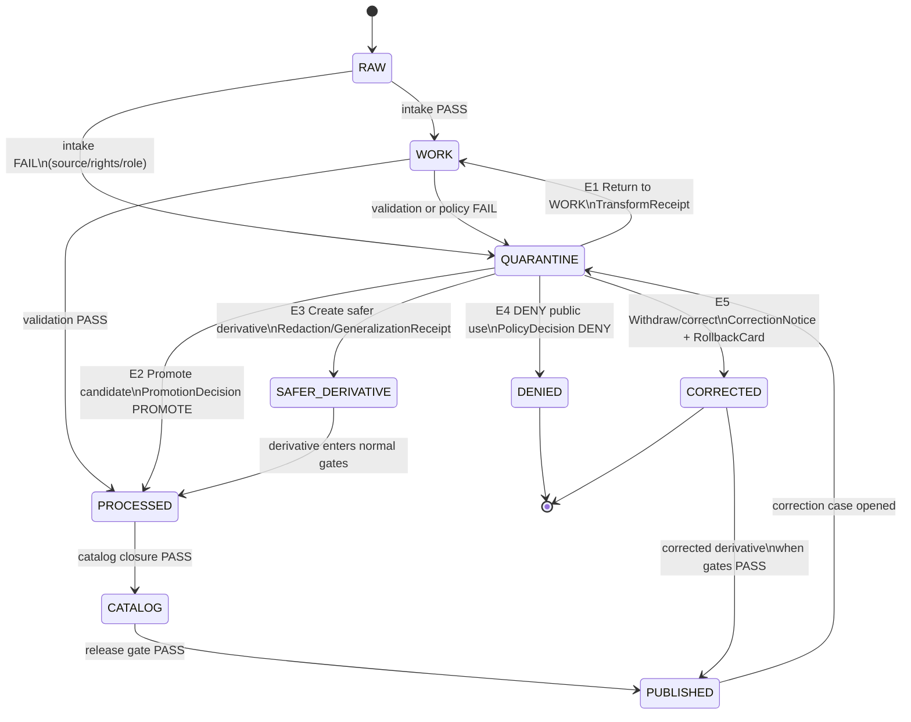

<!-- [KFM_META_BLOCK_V2]
doc_id: kfm://doc/adr-0021
title: ADR-0021 — Quarantine has structured exit paths
type: standard
version: v1.1
status: proposed
owners:
  - architecture-steward # PROPOSED
  - data-steward # PROPOSED
  - policy-steward # PROPOSED
created: 2026-05-09
updated: 2026-05-15
policy_label: public
proposed_path: docs/adr/ADR-0021-quarantine-structured-exit-paths.md
path_status: PROPOSED_UNTIL_REPO_INSPECTION
related:
  - docs/doctrine/directory-rules.md
  - docs/doctrine/lifecycle-law.md
  - docs/adr/ADR-0001-schema-home.md
  - docs/adr/ADR-0002-finite-decision-outcomes.md # PROPOSED — see "Related ADRs"
  - docs/adr/ADR-0003-watcher-non-publisher.md # PROPOSED — see "Related ADRs"
  - schemas/contracts/v1/governance/decision_envelope.schema.json # PROPOSED
  - schemas/contracts/v1/governance/quarantine_case_record.schema.json # PROPOSED
  - policy/governance/quarantine_exits.rego # PROPOSED
tags: [kfm, adr, quarantine, lifecycle, governance, promotion, rollback]
notes:
  - Operationalizes the quarantine lane inside the lifecycle invariant.
  - Codifies structured quarantine exits as a normative governed-transition contract.
  - v1.1 fixes metadata-comment safety, path wording, E3/E5 state-machine ambiguity, and mounted-repo evidence boundaries.
[/KFM_META_BLOCK_V2] -->

# ADR-0021 — Quarantine has structured exit paths

> **Quarantine is an operating state, not a junk drawer. Every artifact placed in quarantine MUST close by exactly one of five named, governed exits — each producing an auditable receipt, proof, policy decision, or release artifact. There is no sixth exit, no silent release, and no file-move shortcut.**

| Field | Value |
|---|---|
| **ID** | ADR-0021 |
| **Status** | `proposed` |
| **Version** | `v1.1` |
| **Date** | 2026-05-09 |
| **Updated** | 2026-05-15 |
| **Proposed path** | `docs/adr/ADR-0021-quarantine-structured-exit-paths.md` |
| **Path status** | `PROPOSED` until verified against mounted-repo evidence |
| **Supersedes** | — |
| **Superseded by** | — |
| **Amends Directory Rules** | No — operationalizes the quarantine lane within the existing lifecycle invariant |
| **Authority** | Architecture steward · Data steward · Policy steward *(owners PROPOSED)* |
| **Reviewers required** | Architecture steward + Policy steward + at least one domain steward |
| **Lifecycle invariant touched** | RAW → WORK / **QUARANTINE** → PROCESSED → CATALOG / TRIPLET → PUBLISHED |

   

> [!NOTE]
> **Evidence boundary:** This ADR states KFM doctrine and a proposed implementation contract. It does **not** prove that the mounted repository already contains the named schemas, validators, policies, workflows, receipts, release directories, or UI/API behavior. Paths and enforcement surfaces remain `PROPOSED` or `NEEDS VERIFICATION` until repo evidence, tests, emitted artifacts, or accepted ADRs confirm them.

**Quick jump:** [Context](#1-context) · [Decision](#2-decision) · [Exit Catalog](#3-exit-catalog-the-five-paths) · [State Machine](#4-state-machine) · [Required Receipts](#5-required-receipts-and-artifacts) · [Consequences](#6-consequences) · [Alternatives](#7-alternatives-considered) · [Validation](#8-validation-and-enforcement) · [Open Questions](#10-open-questions)

---

## 1. Context

The KFM lifecycle invariant — **RAW → WORK / QUARANTINE → PROCESSED → CATALOG / TRIPLET → PUBLISHED** — names `quarantine` as a first-class lane, but the invariant alone does not say what it means to leave one. Without explicit exits, three failure modes are predictable:

1. **Quarantine as junk drawer.** Records pile up unreviewed. Reviewers cannot tell what is blocked, why, or by whom.
2. **Silent shadow-publishing.** Artifacts move from quarantine into PROCESSED, CATALOG, or PUBLISHED via file copy, label flip, or pipeline shortcut, bypassing validators, policy gates, evidence-bundle creation, catalog closure, and release-decision recording.
3. **Lost correction lineage.** A withdrawal or rollback that originates in quarantine produces no `CorrectionNotice`, no `RollbackCard`, and no superseded `EvidenceBundle`, so downstream consumers see the change but cannot audit it.

> [!IMPORTANT]
> Promotion is a **governed state transition, not a file move.** A path-level move that bypasses validators, policy gates, evidence-bundle creation, catalog closure, and release-decision recording is a violation of the lifecycle invariant regardless of where the bytes ended up.

Doctrine already gives us the raw material for this ADR:

- **KFM Build Companion §9** specifies quarantine triggers (rights unknown, sensitivity unresolved, schema fail, `EvidenceRef` unresolved, source authority too weak, correction/rollback in flight, data-quality red flags), the minimum quarantine case record (`case_id`, `subject_ref`, `reason_codes`, `plain_language_reason`, `blocked_stage`, `required_review`, `candidate_safer_representation`, `exit_criteria`, `audit_refs`, timestamps), and an enumerated set of exit paths. **CONFIRMED doctrine / mounted-repo implementation UNKNOWN**.
- **Directory Rules** treat `data/quarantine/<domain>/<reason>/<run_id>/` as a lifecycle lane and forbid parallel homes for proofs, receipts, releases, and rollbacks without an ADR. **CONFIRMED doctrine / exact mounted paths NEED VERIFICATION**.
- **Finite-outcome doctrine** decouples runtime outcomes (`ANSWER | ABSTAIN | DENY | ERROR`) from operational states (`NORMAL | DEGRADED | ESCALATE | QUARANTINE`). A surface can have runtime outcome `DENY` while its operational state is `QUARANTINE`; the two vocabularies do not collapse. **CONFIRMED doctrine / schema presence NEEDS VERIFICATION**.
- **Promotion-gate doctrine** uses `PROMOTE | HOLD | DENY | ERROR` for governance outcomes, distinct from runtime envelope outcomes. **CONFIRMED doctrine / mounted implementation UNKNOWN**.

What is missing is a normative ADR that **closes the set of exits**, **names the receipt produced by each**, and **forbids any other exit**. This ADR closes that gap.

---

## 2. Decision

**Quarantine has exactly five structured exit paths.** Every quarantine case under `data/quarantine/<domain>/<reason>/<run_id>/` MUST close by one of these, and only one of these, transitions:

| # | Exit | Quarantine-case transition | Governance grammar |
|---|---|---|---|
| **E1** | **Return to WORK** | quarantine case closes; successor enters `data/work/` | Fixable defect; no source-authority or sensitivity change |
| **E2** | **Promote to PROCESSED candidate** | quarantine case closes; successor enters `data/processed/` candidate lane | Schema, semantic, identity, and source-role gates pass |
| **E3** | **Release safer derivative** | original remains non-public or restricted; public-safe derivative traverses the normal release path | Original restricted; redacted/generalized derivative passes review |
| **E4** | **DENY public use** | quarantine case closes as terminal public denial | Rights, sensitivity, or source-role limits block exposure |
| **E5** | **Withdraw / correct release** | correction case closes through release correction + rollback artifacts | Published artifact is affected by error, new evidence, rights change, or sensitivity reclassification |

The five exits, their preconditions, and their emitted artifacts are normative. Adding a sixth exit, removing an exit, or remapping an exit's preconditions or output set requires a superseding ADR.

> [!CAUTION]
> **No path-only exit.** Moving a file out of `data/quarantine/` without producing the receipt and proof artifacts named in §5 is a violation of this ADR and of the lifecycle invariant. The receipt is what makes the transition exist; the file move is incidental.

### 2.1 Conformance language

- A pipeline, validator, connector, watcher, reviewer, model adapter, or human action that emits an outbound transition from `data/quarantine/` **MUST** produce the artifacts in §5 for the chosen exit.
- A governed API or public UI surface **MUST NOT** read directly from `data/quarantine/` per the trust membrane. Quarantine state surfaces through reviewer tooling and through governed finite-outcome payloads, never through a normal public route.
- A connector, watcher, or model adapter **MUST NOT** be the actor that promotes a quarantined artifact. Watchers may detect, record, and request review; they do not publish.
- A correction or rollback exit (E5) **MUST NOT** delete prior receipts, proofs, `EvidenceBundle`s, release manifests, or catalog records. It appends supersession references.
- A safer derivative exit (E3) **MUST NOT** imply that the derivative is evidence-equivalent to the original. Public surfaces must expose the derivative's limitations.

---

## 3. Exit catalog — the five paths

Each exit is documented below with its **allowed-when** rule, the **finite-outcome grammar** the exit speaks (governance `PROMOTE/HOLD/DENY/ERROR` vs runtime `ANSWER/ABSTAIN/DENY/ERROR`), the **artifacts emitted**, and the **forbidden outputs**.

### E1 — Return to WORK

| Field | Value |
|---|---|
| **Direction** | `data/quarantine/<domain>/<reason>/<run_id>/` → `data/work/<domain>/<run_id>/` |
| **Allowed when** | The block is fixable without changing source authority, source role, rights posture, or sensitivity posture. Examples: schema repair, CRS correction, geometry fix, identity disambiguation, `EvidenceRef` rebind, parser drift remediation. |
| **Governance outcome** | Promotion gate not invoked; quarantine is exited through remediation. |
| **Runtime outcome** | Not applicable. The artifact is not yet release-eligible. |
| **Required emissions** | `TransformReceipt`, updated `ValidationReport`, updated quarantine case record (`status: closed`, `closure_reason: returned_to_work`, `successor_ref`). |
| **Forbidden** | Any change to source role, rights posture, or sensitivity class without re-entering source admission. Promotion to PROCESSED in the same step. |

### E2 — Promote to PROCESSED candidate

| Field | Value |
|---|---|
| **Direction** | `data/quarantine/<domain>/<reason>/<run_id>/` → `data/processed/<domain>/<dataset_id>/<version>/` |
| **Allowed when** | Schema, semantic, source-role, identity, and required-review gates pass. Identity is content-addressed where practical (`spec_hash` or equivalent). Source role is compatible with the claim burden. |
| **Governance outcome** | `PromotionDecision: PROMOTE` or `PROMOTE_WITH_OBLIGATION` where policy permits. |
| **Runtime outcome** | Not applicable until the artifact reaches PUBLISHED through the normal promotion gate sequence. |
| **Required emissions** | `DatasetVersion` candidate, `ValidationReport(PASS)`, `PromotionDecision`, `TransformReceipt`, updated quarantine case record (`closure_reason: promoted_to_processed`). |
| **Forbidden** | Direct write to `data/published/`, catalog, triplet, or release manifests. The candidate must traverse normal Promotion Gates A–G or their accepted domain-specific equivalent. |

### E3 — Release safer derivative

| Field | Value |
|---|---|
| **Direction** | Original artifact remains non-public, restricted, or quarantined for public roles. A redacted or generalized derivative is created and traverses the normal release path before any public exposure. |
| **Allowed when** | The original cannot be exposed (precise location, restricted rights, sensitive class), but a public-safe transform exists, the transform is recorded, and required reviewers approve the derivative. |
| **Governance outcome** | `PromotionDecision: PROMOTE` for the derivative after applicable release gates; original remains denied or restricted for public roles. |
| **Runtime outcome** | The derivative may surface `ANSWER` with public-safe geometry/redaction obligations in the `DecisionEnvelope`. The original surfaces `DENY` for public roles. |
| **Required emissions** | `RedactionReceipt` or `GeneralizationReceipt`, derivative `EvidenceBundle` with `excluded_evidence` and `limitations` populated, `ReleaseManifest`, `ReviewRecord`, updated quarantine case record (`closure_reason: safer_derivative_released`, `successor_ref`). |
| **Forbidden** | Treating the derivative as evidence-equivalent to the original. Removing fields without recording the transform. Surfacing the original through any public DTO, tile, layer, export, graph projection, AI answer, or dashboard. |

> [!WARNING]
> A jitter, blur, aggregation, suppression, or generalization is a **public-safety transform**, not evidentiary truth. The derivative's `EvidenceBundle` MUST carry explicit limitations such as `limitations.geometry_generalized: true`, and the public DTO SHOULD surface a sensitivity or transformation badge where the UI supports it.

### E4 — DENY public use

| Field | Value |
|---|---|
| **Direction** | `data/quarantine/<domain>/<reason>/<run_id>/` → terminal public-use denial; the artifact does not leave quarantine for any public-bound lane. |
| **Allowed when** | Rights are unresolved or refused; sensitivity policy fails closed (rare species, archaeology, infrastructure, cultural material, living-person data, DNA/genomic data, exact-location exposure); source role is invalid for the requested claim; or correction policy forbids re-exposure. |
| **Governance outcome** | `PolicyDecision: DENY` and, where applicable, `PromotionDecision: DENY` with `reason_codes`. |
| **Runtime outcome** | `DecisionEnvelope.outcome = DENY` with `operational_state = QUARANTINE` for any consuming surface that asks for public use. |
| **Required emissions** | `PolicyDecision(DENY)`, source registry status update (`access_class`, `rights_posture`, `deactivation_reason` where applicable), quarantine case record closed with `closure_reason: deny_public_use`. |
| **Forbidden** | Silent withdrawal without `PolicyDecision`. Re-attempting the same exit without a new evidence basis. Re-attempts with new evidence MUST open or link a fresh case record. |

### E5 — Withdraw / correct release

| Field | Value |
|---|---|
| **Direction** | A correction case is opened against an already-PUBLISHED artifact. Quarantine is the originating lane for the correction or rollback; public aliases are withdrawn, corrected, or superseded only through governed release artifacts. |
| **Allowed when** | A published artifact is materially affected by an error, new evidence that supersedes prior evidence, a rights or sensitivity reclassification, or a downstream legal, cultural, source-authority, or steward objection. |
| **Governance outcome** | `PromotionDecision: DENY` for the prior release alias and, where applicable, `PROMOTE` for the corrected derivative or supersession. |
| **Runtime outcome** | The prior `EvidenceBundle` becomes `superseded`; runtime resolution returns the corrected bundle or abstains/denies according to policy and surfaces correction lineage. |
| **Required emissions** | `CorrectionNotice`, `RollbackCard`, affected-release list, updated `ReleaseManifest`, superseded `EvidenceBundle` with `prior_bundle_refs` and `supersedes_bundle_ref` populated, `ReviewRecord`, updated quarantine case record (`closure_reason: withdraw_correct_release`). Receipts and proofs from the prior release are **never deleted**. |
| **Forbidden** | Deletion of any prior receipt, proof, `EvidenceBundle`, catalog record, or release manifest. Silent alias replacement without `RollbackCard`. Treating a correction as `Return to WORK` (E1). Corrections traverse this exit, not E1. |

---

## 4. State machine

The five exits collapse cleanly into a state machine. Quarantine is the only state with five outbound exit classes; every public-facing transition still uses its own validation, catalog, policy, review, and release gates.



> [!NOTE]
> The `PUBLISHED → QUARANTINE → CORRECTED` path is intentional. Corrections originate as quarantine cases so that the same exit grammar (case record, reason codes, reviewer queue, audit refs) applies to corrections as to first-time blocks.

---

## 5. Required receipts and artifacts

Each exit MUST emit the artifacts named in this table. Receipts and proofs are emitted *alongside* lifecycle directories, not in place of them. Every path below is `PROPOSED` unless the mounted repo verifies it.

| Exit | Required artifact families | Proposed home |
|---|---|---|
| **E1** | `TransformReceipt`, updated `ValidationReport`, updated quarantine case record | `data/receipts/<domain>/transform/`; `data/receipts/<domain>/validation/`; `data/quarantine/<domain>/<reason>/<run_id>/case.json` |
| **E2** | `DatasetVersion` candidate, `ValidationReport(PASS)`, `PromotionDecision`, `TransformReceipt` | `data/processed/<domain>/<dataset_id>/<version>/`; `data/receipts/<domain>/promotion/`; `data/receipts/<domain>/transform/` |
| **E3** | `RedactionReceipt` or `GeneralizationReceipt`, derivative `EvidenceBundle`, `ReleaseManifest`, `ReviewRecord` | `data/receipts/<domain>/redaction/` or `data/receipts/<domain>/generalization/`; `data/proofs/<domain>/evidence_bundle/`; `release/manifests/<domain>/`; `data/receipts/<domain>/review/` |
| **E4** | `PolicyDecision(DENY)`, source registry status update, closed quarantine case record | `data/receipts/<domain>/policy/`; `data/registry/sources/<domain>/`; `data/quarantine/<domain>/<reason>/<run_id>/case.json` |
| **E5** | `CorrectionNotice`, `RollbackCard`, affected-release list, updated `ReleaseManifest`, superseded `EvidenceBundle`, `ReviewRecord` | `release/correction_notices/<domain>/`; `release/rollback_cards/<domain>/`; `release/manifests/<domain>/`; `data/proofs/<domain>/evidence_bundle/`; `data/receipts/<domain>/review/` |

Every emission MUST carry a stable join key (`decision_id`, `case_id`, or a successor accepted by schema ADR) so audit replays can reconstruct the chain across receipts, policy decisions, release artifacts, and public DTOs.

### 5.1 Quarantine case-record minimum content

The quarantine case record is the structural anchor for any exit. It MUST contain at least the fields below and MUST be updated, not replaced, when an exit closes the case.

```json
{
  "case_id": "qcase://...",
  "decision_id": "decision://...",
  "subject_ref": "evidence://... | source://... | release://...",
  "reason_codes": [
    "rights.unknown",
    "sensitivity.exact_location",
    "evidence.unresolved",
    "source_role.invalid"
  ],
  "plain_language_reason": "Reviewer-readable explanation.",
  "blocked_stage": "RAW | WORK | PROCESSED_CANDIDATE | RELEASE_CANDIDATE | UI_PAYLOAD | CORRECTION_CANDIDATE",
  "required_review": [
    "steward",
    "policy",
    "domain",
    "source_rights",
    "security",
    "cultural",
    "release"
  ],
  "candidate_safer_representation": "generalization | redaction | delayed_release | restricted_access | abstention | none",
  "exit_criteria": [
    "Specific facts, receipts, approvals, or transforms required to leave quarantine."
  ],
  "audit_refs": [
    "validation_report://...",
    "policy_decision://...",
    "review_record://..."
  ],
  "created_time": "2026-05-09T00:00:00Z",
  "updated_time": "2026-05-15T00:00:00Z",
  "status": "open | closed",
  "closure_reason": "returned_to_work | promoted_to_processed | safer_derivative_released | deny_public_use | withdraw_correct_release",
  "closure_time": "2026-05-15T00:00:00Z",
  "successor_ref": "evidence://... | release://... | dataset://... | none",
  "restricted_ref": "evidence://... | source://... | none"
}
```

> [!NOTE]
> Schema home for `quarantine_case_record.schema.json` is **PROPOSED** as `schemas/contracts/v1/governance/quarantine_case_record.schema.json`, consistent with the Directory Rules default schema-home convention. The exact subfolder and mounted-repo presence remain **NEEDS VERIFICATION**.

### 5.2 Closure reason enum

The proposed closed-set enum is:

| Exit | `closure_reason` |
|---|---|
| E1 | `returned_to_work` |
| E2 | `promoted_to_processed` |
| E3 | `safer_derivative_released` |
| E4 | `deny_public_use` |
| E5 | `withdraw_correct_release` |

Changing this enum requires a superseding ADR or an accepted schema-home/schema-version ADR that explicitly preserves compatibility.

---

## 6. Consequences

<details>
<summary><strong>Positive</strong></summary>

- **Auditable.** A reviewer can replay the entire life of a quarantined artifact from one `case_id` through a finite set of receipt families.
- **Finite.** Five exits is a closed set; every governance subsystem can compose against it without per-domain status proliferation.
- **Composable with finite outcomes.** Exits map cleanly onto the runtime envelope (`ANSWER | ABSTAIN | DENY | ERROR`) and the governance grammar (`PROMOTE | HOLD | DENY | ERROR`) without flattening either.
- **Protects the trust membrane.** A public route never reads quarantine; quarantine surfaces only through reviewer tooling and through governed finite-outcome envelopes.
- **Preserves correction lineage.** Corrections originate as quarantine cases and exit through E5, which guarantees `CorrectionNotice` + `RollbackCard` emission. No silent supersession.
- **Supports rollback drills.** Exit E5 is replayable; a stable join key links every artifact in the correction chain.

</details>

<details>
<summary><strong>Negative</strong></summary>

- **Operational overhead.** Every quarantine departure now produces named receipts. Pipelines, validators, and reviewer tools must emit them.
- **More receipt families.** `TransformReceipt`, `RedactionReceipt`, `GeneralizationReceipt`, `PolicyDecision`, `PromotionDecision`, `RollbackCard`, `CorrectionNotice`, and `ReviewRecord` need schemas, validators, and fixtures. Many exist in doctrine or lineage, but mounted-repo presence is **NEEDS VERIFICATION**.
- **Reviewer load.** Long-lived cases must be revisited; `created_time` and `updated_time` make limbo visible but do not resolve it on their own.
- **Test surface growth.** Resolver, policy, and promotion tests gain one scenario per exit plus negative fixtures for missing receipts, path-only moves, and false verification.

</details>

<details>
<summary><strong>Mitigations</strong></summary>

- A single quarantine-case schema covers all five exits; only `closure_reason`, `successor_ref`, `restricted_ref`, and emitted artifact refs differ at closure.
- Receipt families stay under existing responsibility roots; this ADR adds no new repo root.
- A reviewer dashboard (PROPOSED) can pivot on `reason_codes`, `blocked_stage`, `required_review`, `updated_time`, and `candidate_safer_representation` to surface stuck cases.
- A compatibility receipt can preserve old enum values during future supersession without deleting historical receipts.

</details>

---

## 7. Alternatives considered

| Alternative | Why rejected |
|---|---|
| **Quarantine as informal holding pen.** Records sit until a steward decides; no enumerated exits. | Recreates the "junk drawer" failure mode (§1). Reviewers cannot tell what is blocked, why, or under what condition it could leave. Defeats audit. |
| **Two exits only — `release` and `deny`.** | Erases the distinction between fixable defects (E1), policy-permanent denials (E4), safer-derivative releases (E3), and corrections (E5). Forces correction lineage to be reconstructed from receipts after the fact. |
| **Direct WORK → PUBLISHED with a `quarantine: true` flag.** | Violates the lifecycle invariant — promotion would no longer be a governed state transition. The flag would become the new shadow-publishing surface. |
| **Folding quarantine into the runtime envelope (`ABSTAIN`).** | Conflates operational state with finite outcome. A surface can be `ANSWER` at runtime while an internal source, exact geometry, or upstream candidate remains operationally `QUARANTINE`; a single-vocabulary collapse loses that distinction. |
| **Per-domain exit sets.** Hydrology has its own exits; archaeology has others. | Causes status proliferation. Domain-specific *reason codes* are correct (`sens.exact_location`, `taxon.unresolved`); domain-specific *exits* are not. Five exits compose across all domains. |
| **Quarantine emits no receipts on E1 (Return to WORK).** | Loses the audit trail for the most common exit. The `TransformReceipt` is what proves the fix happened and what changed. |

---

## 8. Validation and enforcement

This ADR is enforceable when the artifacts below exist and pass. Each row is **PROPOSED** unless verified in the mounted repo.

| Enforcement surface | Required check | Status |
|---|---|---|
| Schema | `quarantine_case_record.schema.json` validates that closed cases require `closure_reason` ∈ {five exits}, `closure_time`, emitted artifact refs, and a stable join key. | PROPOSED |
| Validator | `validate_quarantine_exit.py` (or equivalent) emits `FAIL` when a quarantine departure lacks the required receipts for its declared `closure_reason`. | PROPOSED |
| Policy | `policy/governance/quarantine_exits.rego` denies promotion that names a non-canonical exit, lacks a required receipt, or attempts a public route to quarantine. | PROPOSED |
| Pipeline | A `data/quarantine/` watcher emits a `RunReceipt` for every detected state change and refuses transitions that do not call the governed exit API or reviewer action. | PROPOSED |
| Test | Resolver and promotion tests include at least one positive fixture per exit (E1–E5) and negative fixtures for "exit declared but receipts missing", "file moved without exit declared", "derivative lacks limitations", and "verified boolean without verifier output". | PROPOSED |
| CI | A repo-wide check denies any PR that changes quarantine-derived lifecycle state without a matching receipt under `data/receipts/`, proof under `data/proofs/`, or release artifact under `release/` as required by the exit. | PROPOSED |

> [!IMPORTANT]
> No `verified: true` boolean may be trusted on a quarantine exit unless the validator named above emits PASS for that case. Verification is an emitted result, not a hand-written assertion.

---

## 9. Rollback path for this ADR

This ADR itself can be rolled back — but the change is governed.

1. Open a superseding ADR (`ADR-NNNN-quarantine-exit-revision.md`) with `status: proposed` and `supersedes: ADR-0021`.
2. Mark this ADR `status: superseded` and add a forward link in the KFM Meta Block and in the header table.
3. Migrate any quarantine cases whose `closure_reason` enum value is removed by the new ADR through a one-pass compatibility receipt (`closure_reason_legacy: <old>`, `closure_reason: <new>`).
4. Do not delete past receipts, proofs, release manifests, case records, or EvidenceBundles. Supersession is append-only.
5. Run the quarantine-exit validator over historical fixtures to prove the supersession does not strand prior cases.

---

## 10. Open questions

- **OPEN.** Are the five `closure_reason` values frozen exactly as `returned_to_work | promoted_to_processed | safer_derivative_released | deny_public_use | withdraw_correct_release`? This ADR proposes them; mounted-repo schema convention is **NEEDS VERIFICATION**.
- **OPEN.** Should E3 (safer derivative) require a `ReviewRecord` for **every** domain, or only for sensitivity-bearing domains (archaeology, fauna sensitive species, infrastructure, cultural material, living-person data)? Default in this ADR: required for all; a domain-specific carve-out would need its own ADR.
- **NEEDS VERIFICATION.** Whether the exact schema home is `schemas/contracts/v1/governance/`, `schemas/contracts/v1/quarantine/`, or another accepted subfolder under the Directory Rules schema-home convention.
- **NEEDS VERIFICATION.** Whether `release/correction_notices/` and `release/rollback_cards/` exist as siblings under `release/` in the mounted repo, or whether the repo has a different accepted release/correction layout.
- **OPEN.** Reviewer-queue routing: which `required_review` value drives the SLA clock? This ADR does not specify SLAs; a separate ops ADR is anticipated.
- **NEEDS VERIFICATION.** Whether a `decision_id` join key is already threaded through receipts and proofs in the mounted repo, or whether this ADR is the first place it is required end-to-end on quarantine paths.
- **OPEN.** Whether E4 terminal denials should keep the case physically under `data/quarantine/` indefinitely, or move to a restricted denial archive after a closed-case retention policy is accepted.

---

## 11. Related ADRs and doctrine

| Reference | Relationship |
|---|---|
| `docs/doctrine/directory-rules.md` | Provides responsibility-root and lifecycle placement rules; this ADR operationalizes the quarantine lane without adding a new root. |
| `docs/doctrine/lifecycle-law.md` (PROPOSED) | This ADR is one operational anchor for the lifecycle invariant. |
| `docs/adr/ADR-0001-schema-home.md` | Resolves where `quarantine_case_record.schema.json` and receipt schemas live. Existence in mounted repo is **NEEDS VERIFICATION**. |
| `docs/adr/ADR-0002-finite-decision-outcomes.md` (PROPOSED) | Pins `ANSWER | ABSTAIN | DENY | ERROR` as runtime grammar; E4 maps public requests to runtime `DENY`. |
| `docs/adr/ADR-0003-watcher-non-publisher.md` (PROPOSED) | A watcher can detect and record quarantine transitions but cannot be the actor that promotes a quarantined artifact. |
| `schemas/contracts/v1/governance/quarantine_case_record.schema.json` (PROPOSED) | Machine-checkable shape for quarantine cases and exit closure. |
| `policy/governance/quarantine_exits.rego` (PROPOSED) | Policy-as-code enforcement for canonical exit names, required receipts, and no public route to quarantine. |
| KFM Build Companion §9 | Source of the quarantine triggers, case record, and exit list this ADR codifies. |
| KFM Build Companion §10 | Specifies the EvidenceRef → EvidenceBundle resolver test suite that should exercise E1–E5. |
| Hazards / Hydrology promotion-gate doctrine | Source lineage for the `PROMOTE | HOLD | DENY | ERROR` governance grammar referenced in §3. |

---

## 12. Appendix — quick reference card

<details>
<summary><strong>Five exits at a glance</strong></summary>

```text
QUARANTINE
  ├─ E1  Return to WORK
  │       when:  fixable defect, no source/sensitivity change
  │       emits: TransformReceipt, ValidationReport (updated)
  │
  ├─ E2  Promote to PROCESSED candidate
  │       when:  schema + semantic + source-role + identity gates PASS
  │       emits: DatasetVersion, PromotionDecision (PROMOTE), TransformReceipt
  │
  ├─ E3  Release safer derivative
  │       when:  original restricted; redacted/generalized derivative reviewed
  │       emits: RedactionReceipt or GeneralizationReceipt,
  │              EvidenceBundle (limitations populated),
  │              ReleaseManifest, ReviewRecord
  │
  ├─ E4  DENY public use
  │       when:  rights/sensitivity/source-role permanently block exposure
  │       emits: PolicyDecision (DENY), source registry status update
  │
  └─ E5  Withdraw / correct release
          when:  published artifact affected by error, new evidence, rights, or sensitivity
          emits: CorrectionNotice, RollbackCard, affected-release list,
                 updated ReleaseManifest, superseded EvidenceBundle, ReviewRecord
```

</details>

[**Back to top ↑**](#adr-0021--quarantine-has-structured-exit-paths)
