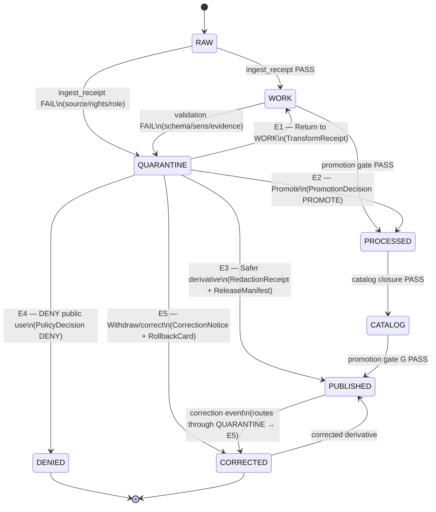

<!-- [KFM_META_BLOCK_V2]
doc_id: kfm://doc/adr-0021
title: ADR-0021 — Quarantine has structured exit paths
type: standard
version: v1
status: proposed
owners: <architecture-steward, data-steward, policy-steward>  <!-- PROPOSED -->
created: 2026-05-09
updated: 2026-05-09
policy_label: public
related:
  - docs/doctrine/directory-rules.md
  - docs/doctrine/lifecycle-law.md
  - docs/adr/ADR-0001-schema-home.md
  - docs/adr/ADR-0002-finite-decision-outcomes.md   # PROPOSED — see "Related ADRs"
  - schemas/contracts/v1/governance/decision_envelope.schema.json   # PROPOSED
tags: [kfm, adr, quarantine, lifecycle, governance, promotion, rollback]
notes:
  - Operationalizes Directory Rules §9.1 quarantine lane and the lifecycle invariant.
  - Codifies KFM Build Companion §9.3 ("Exit paths") as a normative governed-transition contract.
[/KFM_META_BLOCK_V2] -->

# ADR-0021 — Quarantine has structured exit paths

> **Quarantine is an operating state, not a junk drawer. Every artifact placed in quarantine MUST leave by exactly one of five named, governed exits — each producing an auditable receipt, proof, or release artifact. There is no sixth exit, no silent release, and no file-move shortcut.**

| Field | Value |
|---|---|
| **ID** | ADR-0021 |
| **Status** | `proposed` |
| **Date** | 2026-05-09 |
| **Supersedes** | — |
| **Superseded by** | — |
| **Amends Directory Rules** | No — operationalizes §9.1 (quarantine lane) within the existing lifecycle invariant |
| **Authority** | Architecture steward · Data steward · Policy steward *(owners PROPOSED)* |
| **Reviewers required** | Architecture steward + Policy steward + at least one domain steward |
| **Lifecycle invariant touched** | RAW → WORK / **QUARANTINE** → PROCESSED → CATALOG / TRIPLET → PUBLISHED |

   

**Quick jump:** [Context](#1-context) · [Decision](#2-decision) · [Exit Catalog](#3-exit-catalog-the-five-paths) · [State Machine](#4-state-machine) · [Required Receipts](#5-required-receipts-and-artifacts) · [Consequences](#6-consequences) · [Alternatives](#7-alternatives-considered) · [Validation](#8-validation-and-enforcement) · [Open Questions](#10-open-questions)

---

## 1. Context

The KFM lifecycle invariant — **RAW → WORK / QUARANTINE → PROCESSED → CATALOG / TRIPLET → PUBLISHED** — names `quarantine` as a first-class lane, but the invariant alone does not say what it means to leave one. Without explicit exits, three failure modes are predictable:

1. **Quarantine as junk drawer.** Records pile up unreviewed. Reviewers cannot tell what is blocked, why, or by whom.
2. **Silent shadow-publishing.** Artifacts move from quarantine into PROCESSED, CATALOG, or PUBLISHED via file copy, label flip, or pipeline shortcut, bypassing validators, policy gates, evidence-bundle creation, and release-decision recording.
3. **Lost correction lineage.** A withdrawal or rollback that originates in quarantine produces no `CorrectionNotice`, no `RollbackCard`, and no superseded EvidenceBundle, so downstream consumers see the change but cannot audit it.

> [!IMPORTANT]
> Promotion is a **governed state transition, not a file move.** A path-level move that bypasses validators, policy gates, evidence-bundle creation, catalog closure, and release-decision recording is a violation of the lifecycle invariant regardless of where the bytes ended up.

Doctrine already gives us the raw material for this ADR:

- **KFM Build Companion §9** specifies quarantine triggers (rights unknown, sensitivity unresolved, schema fail, EvidenceRef unresolved, source authority too weak, correction/rollback in flight, data-quality red flags), the minimum quarantine case record (`case_id`, `subject_ref`, `reason_codes`, `plain_language_reason`, `blocked_stage`, `required_review`, `candidate_safer_representation`, `exit_criteria`, `audit_refs`, timestamps), and an enumerated set of exit paths. **CONFIRMED** in attached doctrine.
- **Directory Rules §9.1** makes `data/quarantine/<domain>/<reason>/<run_id>/` a sibling of the other lifecycle phases and forbids parallel homes for proofs, receipts, releases, and rollbacks. **CONFIRMED**.
- **Pass 12 §C.2 (Finite Outcomes / DecisionEnvelope)** decouples runtime outcomes (`ANSWER | ABSTAIN | DENY | ERROR`) from operational states (`NORMAL | DEGRADED | ESCALATE | QUARANTINE`). A layer with finite outcome `DENY` may have operational state `QUARANTINE`; the two vocabularies do not collapse. **CONFIRMED**.
- **Hazards / Hydrology promotion-gate doctrine** uses `PROMOTE | HOLD | DENY | ERROR` for governance outcomes (distinct from runtime envelope outcomes). **CONFIRMED**.

What is missing is a normative ADR that **closes the set of exits**, **names the receipt produced by each**, and **forbids any other exit**. This ADR closes that gap.

---

## 2. Decision

**Quarantine has exactly five structured exit paths.** Every artifact in `data/<phase>/quarantine/<domain>/<reason>/<run_id>/` MUST leave by one of these, and only one of these, transitions:

| # | Exit | Direction | Governance grammar |
|---|---|---|---|
| **E1** | **Return to WORK** | quarantine → `data/work/` | Fixable defect; no source-authority or sensitivity change |
| **E2** | **Promote to PROCESSED candidate** | quarantine → `data/processed/` | Schema, semantic, and source-role gates pass |
| **E3** | **Release safer derivative** | quarantine remains; derivative → `data/published/` | Original restricted; redacted/generalized derivative passes review |
| **E4** | **DENY public use** | quarantine → `policy.deny` terminal | Rights, sensitivity, or source-role limits permanently block exposure |
| **E5** | **Withdraw / correct release** | quarantine → `release/correction_notices/` + `release/rollback_cards/` | Published artifact is affected by error or new evidence |

The five exits, their preconditions, and their emitted artifacts are normative. Adding a sixth exit, removing an exit, or remapping an exit's preconditions or output set requires a superseding ADR.

> [!CAUTION]
> **No path-only exit.** Moving a file out of `data/quarantine/` without producing the receipt and proof artifacts named in §5 is a violation of this ADR and of the lifecycle invariant. The receipt is what makes the transition exist; the file move is incidental.

### 2.1 Conformance language

- A pipeline, validator, connector, watcher, or human action that emits an outbound transition from `data/quarantine/` **MUST** produce the artifacts in §5 for the chosen exit.
- A governed API or UI surface **MUST NOT** read directly from `data/quarantine/` (per the trust membrane). Quarantine state surfaces through reviewer tooling and through `DecisionEnvelope.outcome = DENY` with operational state `QUARANTINE`, never through a public route.
- A connector, watcher, or model adapter **MUST NOT** be the actor that promotes a quarantined artifact (watcher-as-non-publisher invariant).
- A correction or rollback exit (E5) **MUST NOT** delete prior receipts, proofs, EvidenceBundles, or release manifests; it appends supersession references.

---

## 3. Exit catalog — the five paths

Each exit is documented below with its **allowed-when** rule, the **finite-outcome grammar** the exit speaks (governance `PROMOTE/HOLD/DENY/ERROR` vs runtime `ANSWER/ABSTAIN/DENY/ERROR`), the **artifacts emitted**, and the **forbidden outputs**.

### E1 — Return to WORK

| Field | Value |
|---|---|
| **Direction** | `data/quarantine/<domain>/<reason>/<run_id>/` → `data/work/<domain>/<run_id>/` |
| **Allowed when** | The block is fixable without changing source authority, source role, or sensitivity posture. Examples: schema repair, CRS correction, geometry fix, identity disambiguation, EvidenceRef rebind, parser drift remediation. |
| **Governance outcome** | Promotion gate not invoked; quarantine is exited via remediation. |
| **Runtime outcome** | Not applicable (artifact is not yet release-eligible). |
| **Required emissions** | `TransformReceipt`, updated `ValidationReport`, updated quarantine case record (`status: closed`, `closure_reason: returned_to_work`, `successor_ref`). |
| **Forbidden** | Any change to source role, rights posture, or sensitivity class without re-entering source admission. Promotion to PROCESSED in the same step. |

### E2 — Promote to PROCESSED candidate

| Field | Value |
|---|---|
| **Direction** | `data/quarantine/...` → `data/processed/<domain>/<dataset_id>/<version>/` |
| **Allowed when** | Schema, semantic, source-role, and identity gates pass. Identity is content-addressed (canonical `spec_hash`). Source role is compatible with claim burden. |
| **Governance outcome** | A `PromotionDecision` of `PROMOTE` (or `PROMOTE-with-obligation` where policy permits). |
| **Runtime outcome** | Not applicable until the artifact reaches PUBLISHED via the normal promotion gate sequence. |
| **Required emissions** | `DatasetVersion` candidate, `ValidationReport(PASS)`, `PromotionDecision`, `TransformReceipt`, updated quarantine case record (`closure_reason: promoted_to_processed`). |
| **Forbidden** | Direct write to `data/published/`, catalog, or release manifests. The candidate must traverse the normal Promotion Gate sequence (A–G or domain-specific equivalent). |

### E3 — Release safer derivative

| Field | Value |
|---|---|
| **Direction** | Original artifact remains in quarantine (or moves to a restricted internal path). A redacted or generalized derivative is created and traverses the normal release path to `data/published/`. |
| **Allowed when** | The original cannot be exposed (precise location, restricted rights, sensitive class), but a public-safe transform exists and a reviewer has approved it. |
| **Governance outcome** | `PromotionDecision: PROMOTE` for the derivative; original case record stays open with `candidate_safer_representation` populated. |
| **Runtime outcome** | The derivative may surface `ANSWER` (with a public-safe geometry / redaction obligation noted in the `DecisionEnvelope`). The original surfaces `DENY` for public roles. |
| **Required emissions** | `RedactionReceipt` or `GeneralizationReceipt`, `EvidenceBundle` for the derivative (with `excluded_evidence` and `limitations` populated), `ReleaseManifest`, `ReviewRecord`. |
| **Forbidden** | Treating the derivative as evidence-equivalent to the original. Removing fields without recording the transform. Surfacing the original through any public DTO. |

> [!WARNING]
> A jitter, blur, or generalization is a **visualization choice**, not evidentiary truth. The derivative's `EvidenceBundle` MUST carry `limitations.geometry_generalized: true` and the public DTO MUST surface a sensitivity badge.

### E4 — DENY public use

| Field | Value |
|---|---|
| **Direction** | `data/quarantine/...` → terminal denial; the artifact does not leave quarantine for any public-bound lane. |
| **Allowed when** | Rights are unresolved or refused; sensitivity policy fails closed (rare species, archaeology, infrastructure, cultural material, living-person data, DNA/genomic data, exact-location exposure); source role is invalid for the requested claim; correction policy forbids re-exposure. |
| **Governance outcome** | `PromotionDecision: DENY` with `reason_codes`. |
| **Runtime outcome** | `DecisionEnvelope.outcome = DENY` with `operational_state = QUARANTINE` for any consuming surface. |
| **Required emissions** | `PolicyDecision(DENY)`, source registry status update (`access_class`, `rights_posture`, `deactivation_reason` where applicable), quarantine case record closed with `closure_reason: deny_public_use`. |
| **Forbidden** | Silent withdrawal without `PolicyDecision`. Re-attempting the same exit without a new evidence basis (re-attempts with new evidence MUST open a fresh case record). |

### E5 — Withdraw / correct release

| Field | Value |
|---|---|
| **Direction** | Quarantine is the originating lane for a correction or rollback affecting an already-PUBLISHED artifact. The published alias is moved or withdrawn through the governed correction/rollback path. |
| **Allowed when** | A published artifact is materially affected by an error, by new evidence that supersedes prior evidence, by a rights or sensitivity reclassification, or by a downstream legal/cultural objection. |
| **Governance outcome** | `PromotionDecision: DENY` *for the prior release alias* and `PROMOTE` *for the corrected derivative or supersession*, depending on the correction class. |
| **Runtime outcome** | The prior `EvidenceBundle` becomes `superseded`; the runtime resolves to the corrected bundle and surfaces correction lineage. |
| **Required emissions** | `CorrectionNotice` (in `release/correction_notices/`), `RollbackCard` (in `release/rollback_cards/`), affected-release list, updated `ReleaseManifest`, updated `EvidenceBundle` with `prior_bundle_refs` and `supersedes_bundle_ref` populated, `ReviewRecord`. Receipts and proofs from the prior release are **never deleted**. |
| **Forbidden** | Deletion of any prior receipt, proof, EvidenceBundle, or release manifest. Silent alias replacement without `RollbackCard`. Treating a correction as a `Return to WORK` (E1) — corrections traverse this exit, not E1. |

---

## 4. State machine

The five exits collapse cleanly into a state machine. Quarantine is the only state with five outbound transitions; every other transition is governed by its own gate sequence.



> [!NOTE]
> The `PUBLISHED → CORRECTED` arc is *via* QUARANTINE, not direct. Corrections originate as quarantine cases so that the same exit grammar (case record, reason codes, reviewer queue, audit refs) applies to corrections as to first-time blocks.

---

## 5. Required receipts and artifacts

Each exit MUST emit the artifacts named in this table. Receipts and proofs are emitted *alongside* the lifecycle directories, not in place of them (per Directory Rules §9.1).

| Exit | Required artifact families | Canonical home *(PROPOSED unless verified in mounted repo)* |
|---|---|---|
| **E1** | `TransformReceipt`, updated `ValidationReport`, updated quarantine case record | `data/receipts/<domain>/transform/`, `data/receipts/<domain>/validation/`, `data/quarantine/<domain>/<reason>/<run_id>/case.json` |
| **E2** | `DatasetVersion` candidate, `ValidationReport(PASS)`, `PromotionDecision`, `TransformReceipt` | `data/processed/<domain>/<dataset_id>/<version>/`, `data/receipts/<domain>/promotion/` |
| **E3** | `RedactionReceipt` or `GeneralizationReceipt`, `EvidenceBundle`, `ReleaseManifest`, `ReviewRecord` | `data/receipts/<domain>/redaction/`, `data/proofs/<domain>/evidence_bundle/`, `release/manifests/<domain>/`, `data/receipts/<domain>/review/` |
| **E4** | `PolicyDecision(DENY)`, source registry status update, closed quarantine case record | `data/receipts/<domain>/policy/`, `data/registry/sources/<domain>/`, `data/quarantine/<domain>/<reason>/<run_id>/case.json` |
| **E5** | `CorrectionNotice`, `RollbackCard`, affected-release list, updated `ReleaseManifest`, superseded `EvidenceBundle`, `ReviewRecord` | `release/correction_notices/<domain>/`, `release/rollback_cards/<domain>/`, `release/manifests/<domain>/`, `data/proofs/<domain>/evidence_bundle/` |

Every emission carries the `decision_id` join key (per Pass 12 §C.2) so audit replays can reconstruct the chain across receipts, policy decisions, and release artifacts.

### 5.1 Quarantine case-record minimum content

The quarantine case record is the structural anchor for any exit. It MUST contain at least the fields below (taken verbatim from KFM Build Companion §9.2) and MUST be updated, not replaced, when an exit closes the case.

```json
{
  "case_id": "qcase://...",
  "subject_ref": "evidence://... | source://... | release://...",
  "reason_codes": ["rights.unknown", "sensitivity.exact_location", "evidence.unresolved", "source_role.invalid"],
  "plain_language_reason": "Reviewer-readable explanation.",
  "blocked_stage": "RAW | WORK | PROCESSED_CANDIDATE | RELEASE_CANDIDATE | UI_PAYLOAD | CORRECTION_CANDIDATE",
  "required_review": ["steward", "policy", "domain", "source_rights", "security", "cultural", "release"],
  "candidate_safer_representation": "generalization | redaction | delayed_release | restricted_access | abstention | none",
  "exit_criteria": ["Specific facts or approvals required to leave quarantine."],
  "audit_refs": ["validation_report://...", "policy_decision://...", "review_record://..."],
  "created_time": "2026-05-09T00:00:00Z",
  "updated_time": "2026-05-09T00:00:00Z",
  "status": "open | closed",
  "closure_reason": "returned_to_work | promoted_to_processed | safer_derivative_released | deny_public_use | withdraw_correct_release",
  "successor_ref": "evidence://... | release://... (where applicable)"
}
```

> Schema home for `quarantine_case_record.schema.json` is **PROPOSED** as `schemas/contracts/v1/governance/quarantine_case_record.schema.json` per ADR-0001 (schema home). The exact path is **NEEDS VERIFICATION** against the mounted repo.

---

## 6. Consequences

<details>
<summary><strong>Positive</strong></summary>

- **Auditable.** A reviewer can replay the entire life of a quarantined artifact from one `case_id` through a finite set of receipt families.
- **Finite.** Five exits is a closed set; every governance subsystem can compose against it without per-domain status proliferation.
- **Composable with finite outcomes.** Exits map cleanly onto the runtime envelope (`ANSWER | ABSTAIN | DENY | ERROR`) and the governance grammar (`PROMOTE | HOLD | DENY | ERROR`) without flattening either.
- **Protects the trust membrane.** A public route never reads quarantine; quarantine surfaces only through reviewer tooling and through finite-outcome envelopes.
- **Preserves correction lineage.** Corrections originate as quarantine cases and exit through E5, which guarantees `CorrectionNotice` + `RollbackCard` emission. No silent supersession.
- **Supports rollback drills.** Exit E5 is replayable; a `decision_id` joins every artifact in the correction chain.

</details>

<details>
<summary><strong>Negative</strong></summary>

- **Operational overhead.** Every quarantine departure now produces named receipts. Pipelines, validators, and reviewer tools must emit them.
- **More receipt families.** `TransformReceipt`, `RedactionReceipt`, `GeneralizationReceipt`, `PolicyDecision`, `PromotionDecision`, `RollbackCard`, `CorrectionNotice` must all have schemas, validators, and fixtures. *(Most exist in doctrine; mounted-repo presence is **NEEDS VERIFICATION**.)*
- **Reviewer load.** Long-lived cases must be revisited; `created_time` / `updated_time` make limbo visible but do not resolve it on their own.
- **Test surface growth.** The EvidenceBundle resolver test suite (Build Companion §10.3) gains five exit-class scenarios per domain.

</details>

<details>
<summary><strong>Mitigations</strong></summary>

- A single quarantine-case schema covers all five exits; only `closure_reason` and `successor_ref` differ at closure.
- Receipt families already have proposed homes under `data/receipts/<domain>/...` per Directory Rules §9.1; this ADR adds no new root.
- A reviewer dashboard (PROPOSED) can pivot on `reason_codes` and `blocked_stage` to surface stuck cases.

</details>

---

## 7. Alternatives considered

| Alternative | Why rejected |
|---|---|
| **Quarantine as informal holding pen.** Records sit until a steward decides; no enumerated exits. | Recreates the "junk drawer" failure mode (§1). Reviewers cannot tell what is blocked, why, or under what condition it could leave. Defeats audit. |
| **Two exits only — `release` and `deny`.** | Erases the distinction between fixable defects (E1), policy-permanent denials (E4), safer-derivative releases (E3), and corrections (E5). Forces correction lineage to be reconstructed from receipts after the fact. |
| **Direct WORK → PUBLISHED with a `quarantine: true` flag.** | Violates the lifecycle invariant — promotion would no longer be a governed state transition. The flag would become the new shadow-publishing surface. |
| **Folding quarantine into the runtime envelope (`ABSTAIN`).** | Conflates operational state with finite outcome (Pass 12 §C.2 explicitly forbids this). A layer can be `ANSWER` at runtime while operationally `QUARANTINE` for an internal subset; a single-vocabulary collapse loses that. |
| **Per-domain exit sets.** Hydrology has its own exits; archaeology has others. | Causes status proliferation. Domain-specific *reason codes* are correct (`sens.exact_location`, `taxon.unresolved`); domain-specific *exits* are not. Five exits compose across all domains. |
| **Quarantine emits no receipts on E1 (Return to WORK).** | Loses the audit trail for the most common exit. The `TransformReceipt` is what proves the fix happened and what changed. |

---

## 8. Validation and enforcement

This ADR is enforceable when the artifacts below exist and pass. Each row is **PROPOSED** unless verified in the mounted repo.

| Enforcement surface | Required check | Status |
|---|---|---|
| Schema | `quarantine_case_record.schema.json` validates closed cases require `closure_reason` ∈ {five exits}. | PROPOSED |
| Validator | A `validate_quarantine_exit.py` (or equivalent) emits `FAIL` when a quarantine departure lacks the required receipts for its declared `closure_reason`. | PROPOSED |
| Policy | `policy/governance/quarantine_exits.rego` denies promotion that names a non-canonical exit. | PROPOSED |
| Pipeline | A `data/quarantine/` watcher emits a `RunReceipt` for every state change and refuses transitions that do not call the governed exit API. | PROPOSED |
| Test | Resolver test cases include the seven scenarios in Build Companion §10.3 plus one per exit (E1–E5), with negative fixtures for "exit declared but receipts missing" and "file moved without exit declared". | PROPOSED |
| CI | A repo-wide check denies any PR that adds a path under `data/<phase>/` whose ancestor was `data/quarantine/...` without an accompanying receipt under `data/receipts/`. | PROPOSED |

> [!IMPORTANT]
> No `verified: true` boolean may be set on a quarantine exit unless the validator named above emits PASS for that case. Per the Hazards verification rule: *"No verified boolean may be trusted unless produced by an actual verification step."*

---

## 9. Rollback path for this ADR

This ADR itself can be rolled back — but the change is governed.

1. Open a superseding ADR (`ADR-NNNN-quarantine-exit-revision.md`) with `status: proposed` referencing `supersedes: ADR-0021`.
2. Mark this ADR `status: superseded` and add a forward link in §0 (KFM Meta Block) and in the header table.
3. Migrate any quarantine cases whose `closure_reason` enum value is removed by the new ADR through a one-pass compatibility receipt (`closure_reason_legacy: <old>`, `closure_reason: <new>`).
4. Do not delete past receipts, proofs, or case records. Supersession is append-only.

---

## 10. Open questions

- **OPEN.** Are the five `closure_reason` values frozen at: `returned_to_work | promoted_to_processed | safer_derivative_released | deny_public_use | withdraw_correct_release`? *(This ADR proposes them; mounted-repo schema convention is **NEEDS VERIFICATION**.)*
- **OPEN.** Should E3 (safer derivative) require a `ReviewRecord` for **every** domain, or only for sensitivity-bearing domains (archaeology, fauna sensitive species, living-person data)? Default in this ADR: required for all; a domain-specific carve-out would need its own ADR.
- **OPEN.** Where does `quarantine_case_record.schema.json` live? PROPOSED `schemas/contracts/v1/governance/`; alternatives are `schemas/contracts/v1/quarantine/` or under each domain. Resolves through ADR-0001 (schema home).
- **NEEDS VERIFICATION.** Whether `release/correction_notices/` and `release/rollback_cards/` exist as siblings under `release/` in the mounted repo, or whether one of them lives under `data/rollback/`. Directory Rules §18 flags this as already-open across the repo.
- **OPEN.** Reviewer-queue routing: which `required_review` value drives the SLA clock? This ADR does not specify SLAs; a separate ops ADR is anticipated.
- **NEEDS VERIFICATION.** Whether a `decision_id` join key is already threaded through receipts and proofs in the mounted repo, or whether this ADR is the first place it is required end-to-end on quarantine paths.

---

## 11. Related ADRs and doctrine

| Reference | Relationship |
|---|---|
| `docs/doctrine/directory-rules.md` §9.1 (data lane) | Provides the canonical quarantine path; this ADR operationalizes its lane. |
| `docs/doctrine/lifecycle-law.md` (PROPOSED) | This ADR is one of the operational anchors for the invariant. |
| `docs/adr/ADR-0001-schema-home.md` | Resolves where `quarantine_case_record.schema.json` and the receipt schemas live. *(Existence in mounted repo: **NEEDS VERIFICATION**.)* |
| `docs/adr/ADR-0002-finite-decision-outcomes.md` *(PROPOSED, see Pass 12 §C.2 starter set)* | Pins `ANSWER \| ABSTAIN \| DENY \| ERROR` as the runtime grammar; E4 maps a quarantine case to runtime `DENY`. |
| `docs/adr/ADR-0003-watcher-non-publisher.md` *(PROPOSED, see Pass 12 §C.2 starter set)* | A watcher cannot be the actor that promotes a quarantined artifact. |
| `KFM Build Companion §9` | Source of the quarantine triggers, case record, and exit list this ADR codifies. |
| `KFM Build Companion §10` | Specifies the EvidenceRef → EvidenceBundle resolver test suite that exercises E1–E5. |
| Hazards / Hydrology promotion-gate sections | Source of the `PROMOTE \| HOLD \| DENY \| ERROR` governance grammar referenced in §3. |

---

## 12. Appendix — quick reference card

<details>
<summary><strong>Five exits at a glance</strong></summary>

```
QUARANTINE
  ├─ E1  Return to WORK
  │       when:  fixable defect, no source/sensitivity change
  │       emits: TransformReceipt, ValidationReport (updated)
  │
  ├─ E2  Promote to PROCESSED candidate
  │       when:  schema + semantic + source-role gates PASS
  │       emits: DatasetVersion, PromotionDecision (PROMOTE), TransformReceipt
  │
  ├─ E3  Release safer derivative
  │       when:  original restricted; redacted/generalized derivative reviewed
  │       emits: RedactionReceipt or GeneralizationReceipt,
  │              EvidenceBundle (limitations populated),
  │              ReleaseManifest, ReviewRecord
  │
  ├─ E4  DENY public use
  │       when:  rights/sensitivity/source-role permanently block exposure
  │       emits: PolicyDecision (DENY), source registry status update
  │
  └─ E5  Withdraw / correct release
          when:  published artifact affected by error or new evidence
          emits: CorrectionNotice, RollbackCard, affected-release list,
                 updated ReleaseManifest, superseded EvidenceBundle, ReviewRecord
```

</details>

[**Back to top ↑**](#adr-0021--quarantine-has-structured-exit-paths)
